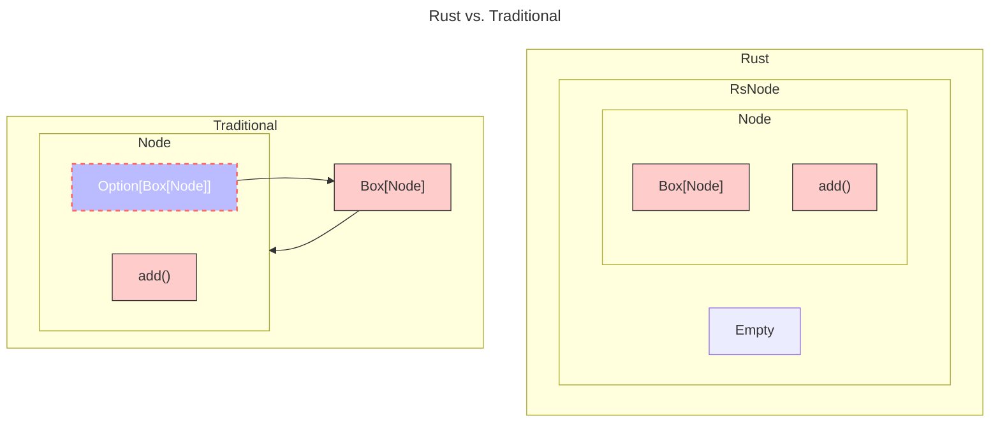

# A Tour of Rust - Binary Search Tree

学习Rust已经有一段时间了，最近开始尝试用 Rust 进行一些简单的demo开发进行练手。今天尝试了一下，实现了第一个简单的 [Binary Search Tree](https://github.com/0x822a5b87/tiny-rust/blob/main/b-tree/src/bst.rs)。必须承认，Rust 的入门曲线确实相当陡峭。本来我的预计是花费2~3小时实现，结果最后花了整整6个小时，比预计的时间超出一倍多。这里记录一下自己的学习心得以及体会。

## 代码实现

在实现代码的过程中，我使用了两种不同的开发思路：

1. 基于传统的命令式编程语言，使用语言提供的各种控制流语句（如 `if`, `while`）来控制逻辑；
2. 基于Rust强大额模式匹配控制逻辑；

### 传统模式

在传统模式下，我们很常规的定义了一个二叉树，和大部分语言不同的是，Rust 并不提倡使用 `NULL` 指针，而提供了强大的 `Option` 来为我们实现流程控制。

```rust
pub struct Node<T>
where
    T: Ord,
{
    val: T,
    left: Option<Box<Node<T>>>,
    right: Option<Box<Node<T>>>,
}
```

在这种情况下，我们的 add 方法实现也并不复杂，代码如下：

```rust
        pub fn new(root: T) -> Node<T> {
            Node {
                val: root,
                left: None,
                right: None,
            }
        }

        // `self` must be `mut` rather than `&mut` or `&` due to :
        //  1.1 the struct must be mutable because we are going to modify it;
        //  1.2 when we modify a node, we take the ownership because it maybe changes.
        pub fn add_self(mut self, val: T) -> Node<T> {
            assert!(self.val != val);
            if self.val < val {
                self.right = Self::add_self_child(self.right, val);
            } else {
                self.left = Self::add_self_child(self.left, val);
            }
            self
        }

        fn add_self_child(child: Option<Box<Node<T>>>, val: T) -> Option<Box<Node<T>>> {
            match child {
                Some(node) => Some(Box::new(node.add_self(val))),
                None => Some(Box::new(Node::new(val))),
            }
        }
```

### Rust模式

Rust模式相当特别，他并不直接显式的使用结构体来表示我们的二叉树节点，而是用了 `enum` 来代替我们的节点。而在 enum 中，我们嵌套了我们所需要的 `struct` 以及一个用于替代 `NULL` 指针的枚举类型 `Empty`，这种方式也是在Rust中处理 [Cons list](https://doc.rust-lang.org/book/ch15-01-box.html#more-information-about-the-cons-list) 的一种技巧：

```rust
    pub enum RsNode<T: Ord>
    {
        Node {
            val: T,
            left: Box<RsNode<T>>,
            right: Box<RsNode<T>>,
        },
        Empty,
    }
```

实际的插入过程也相当简单：

```rust
        pub fn new() -> RsNode<T> {
            RsNode::Empty
        }

        pub fn create(val: T) -> RsNode<T> {
            RsNode::Node {
                val,
                left: Box::new(RsNode::Empty),
                right: Box::new(RsNode::Empty),
            }
        }

        pub fn add(&mut self, new_value: T) {
            match self {
                RsNode::Node {
                    ref val,
                    ref mut left,
                    ref mut right,
                } => match new_value.cmp(val) {
                    Ordering::Less => left.add(new_value),
                    Ordering::Greater => right.add(new_value),
                    Ordering::Equal => return,
                },
                RsNode::Empty => {
                    *self = RsNode::create(new_value);
                }
            }
        }
```

## 为什么我会觉得使用Rust模式更加的简单

两种风格的代码实现，其实都相当简单，他们最大的区别也不仅仅在于后面的模式匹配，而是在于一个非常重要的思想：

> 使用 `enum` 将 `空值` 作为对象的一部分。

例如，在第一个实现中，如果我们不使用一个工具函数，那么代码将会是这样：

```rust
        // `self` must be `mut` rather than `&mut` or `&` due to :
        //  1.1 the struct must be mutable because we are going to modify it;
        //  1.2 when we modify a node, we take the ownership because it maybe changes.
        pub fn add_self(&mut self, val: T) {
            assert!(self.val != val);
            if self.val < val {
                match &mut self.right {
                    None => self.right = Some(Box::new(Node::new(val))),
                    Some(right) => right.add_self(val),
                }
            } else {
                match &mut self.left {
                    None => self.left = Some(Box::new(Node::new(val))),
                    Some(left) => left.add_self(val),
                }
            }
        }
```

我们内部持有的对象，在每次使用时都必须进行判断。简单来说就是：

> 如果 `空值` 是对象的一部分，那么我们就不可以直接持有 **对象本身** 而不是一个额外的 `Option<T>`，这样我们可以把空值的判断合并到一个流，或者说合并到一个方法，而不是通过 `Option<T>` 对象去间接的访问：下图很好的说明了这点：
>
> 1. 在传统模式下，`Option<Box<Node>>` 并不能直接调用方法 `add()`，而是要通过 `Box<Node>`；
> 2. 在Rust模式下，`Box<Node>` 可以直接调用 `add()` 方法。



