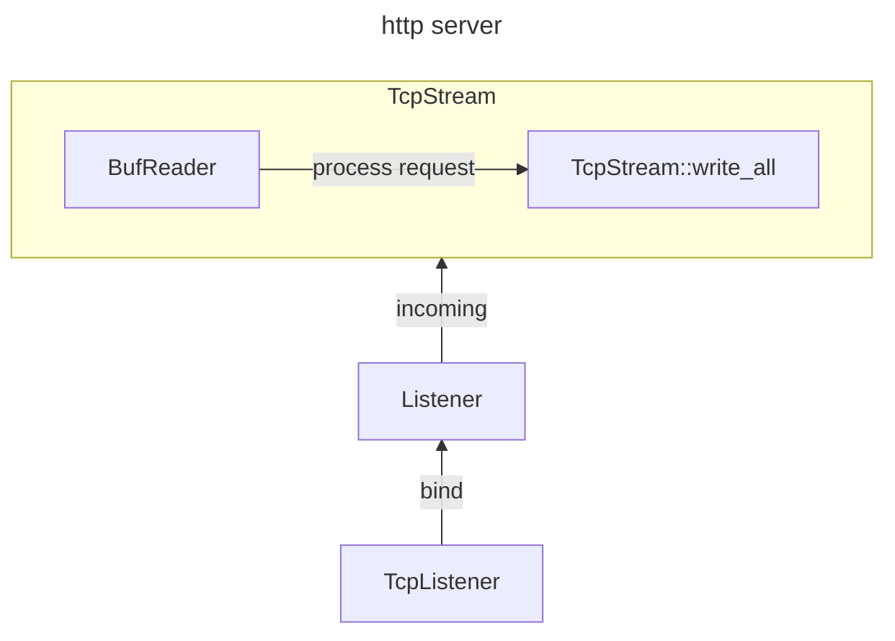

# A Simple Conclusion for Ownership in Rust

## Warm Up

### What's my type?

Before we divi into the ownership, there is a essential problem we have to figure out beforehead: **What's the type of the variable we just define**? Considering the following code snippet:

```rust
fn what_is_my_type() {
    let mut num0 = 0;

    let first_value: &mut i32 = &mut num0;
    println!("{first_value}");
    let second_value: &i32 = &mut num0;
    println!("{second_value}");

    let mut third_value: &mut i32 = &mut num0;
    println!("{third_value}");
    let mut fourth_value: &i32 = &mut num0;
    println!("{fourth_value}");

    let &mut fifth_value: &mut i32 = &mut num0;
    let &mut sixth_value = &mut num0;
}
```

The question looks quiet simple: 

| variable       | type     |
| -------------- | -------- |
| `first_value`  | &mut i32 |
| `second_value` | &32      |
| `third_value`  | &mut i32 |
| `fourth_value` | &i32     |
| `fifth_value`  | &mut i32 |
| `sixth_value`  | i32      |

However, there are some subtle differences between these six variables, just look at this:

1. First_value can't be modified becasue it is a `immutable reference` refer to a `mutable reference i32`
2. Third_value can be modified because it is a ``mutable reference` refer to a `mutable reference i32`

```rust
fn the_type_is_not_the_same() {
    let mut num0 = 0;

    let first_value: &mut i32 = &mut num0;
    let mut third_value: &mut i32 = &mut num0;

    let mut num1 = 1;
    // until then, the first value and third value looks like have the same type
    first_value = &mut num1; // Cannot assign a new value to an immutable variable more than once [E0384]
    third_value = &mut num1; // valid
}
```

Now we can determine the final result:

| variable       | type                                                       |
| -------------- | ---------------------------------------------------------- |
| `first_value`  | `immutable reference` refer to a `mutable reference i32`   |
| `second_value` | `immutable reference` refer to a `immutable reference i32` |
| `third_value`  | `mutable reference` refer to a `mutable reference i32`     |
| `fourth_value` | `mutable reference` refer to a `immutable reference i32`   |
| `fifth_value`  | `i32`                                                      |
| `sixth_value`  | `i32`                                                      |

That's kind of confusing result, but I won't elaborate it because this isn't what the article is going to do. So just simplely keep things in mind and keep going. If you are still confusing with it and aspire to figure it out, please refer to this articles:

- [Let &mut syntax](https://stackoverflow.com/questions/31298802/let-mut-syntax)
- [How to interpret immutable references to mutable types in Rust?](https://stackoverflow.com/questions/56005131/how-to-interpret-immutable-references-to-mutable-types-in-rust)

### Type with Pattern Matching

Compiling the following function will generate a typical [Error code E0507](https://doc.rust-lang.org/error_codes/E0507.html), how can this be? That's what we called **Pattern Matching**.

1.  `&mut val : &mut String` indicate the function receives a parameter of type `&mut String` which is a borrowed value;
2. `&mut val` indicate that `val` is a `String` so the left-hand-side is euqal to the right-hand-side;
3. In this case, `val` appears to take the ownership away from `&mut String`, which is disallowed in rust. 

```rust
fn cannot_move_out_of_a_mutable_reference(&mut val: &mut String) {

}
```

## Utility

This is a struct which providing impelementation of `Clone` trait

```rust
    #[derive(Debug)]
    struct VecWithClone {
        data: [i32; 3],
    }

    impl Clone for VecWithClone {
        fn clone(&self) -> Self {
            let mut data: [i32; 3] = Default::default();
            for (i, v) in self.data.iter().enumerate() {
                data[i] = *v
            }
            VecWithClone {
                data
            }
        }
    }
```

## Ownership and Borrowing

In Rust, the ownership concept is a set of rules that applies to all values.These rules dictate that each value in Rust has the following:

1. Each value in Rust has a owner responsible for the value; 
2. Only one owner at a time;
3. When the owner goes out of scope, the value will be dropped : mabey exit the frame of scope for a stack value or calling the `Drop` for a heap value;
4. Ownership can be borrowing by refenrece
   1. Any number of immutable reference;
   2. Any number of immutable reference and **exactly one single mutable reference at the same time**, this is very trivial so I'd like to elaborate it in the subsequent contents.

## the Primary principle of Ownership

Ownership transfer in Rust happens when a value is `moved` from one variable or binding to another. This typically occurs in the following scenarios:

1. Assignment for variable with a type does not implement the `Copy` trait, When you assign a value to a new variable, ownership of the value is transferred to the new variable.
2. Function calls (which is also sort of special assignment) : When you pass a value as an argument to a function, ownership of the value is transferred to the function
3. Returning from a function: When a function returns a value, ownership of the value is transferred to the calling code. 

### Assignment

Assignment for variable with a type does not implement the `Copy` trait will lead to ownership transfer.

```rust
fn assignment() {
    let hello0 = String::from("hello"); //  move occurs because `hello0` has type `String`, which does not implement the `Copy` trait

    let hello1 = hello0; // value moved here

    println!("hello0 = {hello0}") // error[E0382]: borrow of moved value: `hello0`
}
```

here is another more precise example, we defined a simple struct containts `[i32; 3]`, and doesn't implement a `Copy` trait:

```rust
fn assigment_with_struct() {
    #[derive(Debug)]
    struct VecWithoutCopy {
        data: [i32; 3],
    }

    let v1 = VecWithoutCopy { data: [1, 2, 3] }; // move occurs because `v1` has type `VecWithoutCopy`, which does not implement the `Copy` trait
    let v2 = v1; // value moved here

    println!("v1 = {:?}, v2 = {:?}", v1, v2) // value borrowed here after move
}
```

If you implement the `Copy` trait for the struct, ownership transfer will not occur. Instead, the `Copy` trait will be invoked to create a new struct.

```rust
fn assigment_with_copyable_struct() {
    let v1 = VecWithClone { data: [1, 2, 3] };
    let v2 = v1;

    println!("v1 = {:?}, v2 = {:?}", v1, v2) // v1 = VecWithClone { data: [1, 2, 3] }, v2 = VecWithClone { data: [1, 2, 3] }
}
```

Incidentally, assigment for primitives doesn't require explictly implementation of the Copy trait to avoid ownership transfer.

```rust
fn assignment_with_primitive() {
    let mut x = 10;
    let y = x;
    x = 20;
    println!("x = {x}, y = {y}") // x = 20, y = 10
}
```

### Borrowing

Borrowing in Rust refers to the mechanism that allows **multiple references** to access a value without transferring ownership. When you borrow a value in Rust, you create a **reference** to that value. Reference can be either immtuable(`&T`) or mutable(`&mut T`), Here's are a few important aspects of borrowing in Rust:

1. Borrowing rules: Rust's borrowing rules ensure that there is only one mutable reference (`&mut T`) or any number of immutable references (`&T`) to a value in a particular scope. 
2. Borrow checker: The Rust compiler has a borrow checker that analyzes your code and ensures that all borrows are valid and adhere to the borrowing rules. If your code violates these rules, the compiler will raise compilation errors.
3. Borrow scopes: The `lifetime` of a borrow is determined by its scope. A borrow cannot outlive the value it refers to. This ensures that borrowed references are always valid and do not become dangling references.
4. **No simultaneous mutable and immutable borrows**: Rust does not allow simultaneous mutable and immutable borrows of the same value. This prevents potential data races, as having both mutable and immutable access to a value can lead to undefined behavior.

### Move Semantics and Ownership Transfer

```rust
fn multiple_immutable_reference_is_allowed() {
    let x = 10;

    let y = &x; // first immutable reference
    let z = &x; // second immutable reference

    println!("y = {y}, z = {z}"); // multiple immutable reference is allowed
}
```

### Mutable Reference will invalidate every preceding defined reference

```rust
fn mut_reference_will_invalidate_preceding_defined_reference() {
    let mut x = 10;

    let first_immutable = &x; // first immutable reference
    println!("first_immutable = {first_immutable}"); // valid

    let first_mutable = &mut x; // first mutable reference
    println!("first_mutable = {first_mutable}"); // valid
    // unfortunately, the reference is invalidated immediately when we define a mutable reference

    let second_mutable = &mut x; // second mutable reference which will destroy all preceding reference to variable `x`
    // println!("first_mutable = {first_mutable}"); // cannot borrow `x` as mutable more than once at a time
    println!("second_mutable = {second_mutable}"); // valid

    let second_immutable = &x; // Yes! This is valid!
    println!("second_immutable = {second_immutable}");
}
```

### References must last shorter than their owners

```rust
fn references_must_last_shorter_than_their_owns() {
    let mut longer_reference:&mut i32; // longer_reference is an immutable reference refer to a mutable reference i32
    {
        let mut ten = 10;
        longer_reference = &mut ten;
    } // temporary value `10` is freed at the end of this statement

    // println!("longer_reference = {longer_reference}"); // error[E0716]: temporary value dropped while borrowed

    let mut twenty = 20;
    longer_reference = &mut twenty;
    println!("longer_reference = {longer_reference}");
}
```

### structs can be passed via move or borrow

One thing we should notice is that `VecWithCopy` and `&mut VecWithCopy` is not the same type. That's why `let v4 = v1` will encounter a ownership transfer.You may want to implement the `Copy` trait for `&mut VecWithCopy`, but unfortunately, it is not possible due to [Error code E0206](https://doc.rust-lang.org/error_codes/E0206.html)

```rust
fn struct_can_be_passed_via_move_or_borrow() {
    let v1 = &mut VecWithCopy { data: [1, 2, 3] };

    let v2 = &v1;
    let v3 = &v1;

    println!("v1 = {:?}, v2 = {:?}, v3 = {:?}", v1, v2, v3);
    // v1 = VecWithCopy { data: [1, 2, 3] }, v2 = VecWithCopy { data: [1, 2, 3] }, v3 = VecWithCopy { data: [1, 2, 3] }

    v1.data = [3, 4, 5];
    println!("v1 = {:?}", v1);

    // error[E0506]: cannot assign to `v1.data` because it is borrowed
    // println!("v1 = {:?}, v2 = {:?}, v3 = {:?}", v1, v2, v3);

    let v4 = v1; // move occurs because `v1` has type `&mut VecWithCopy`, which does not implement the `Copy` trait
    // error[E0382]: borrow of moved value: `v1`
    println!("v1 = {:?}", v1);
}
```

## A more complicated example

Assuming that we are going to build an HTTP server, here is the procedure of how the server processes a HTTP request:



```rust
fn main() {
    connect()
}

fn connect() {
    let tcp_listener = TcpListener::bind("127.0.0.1:7878").unwrap();
    for stream in tcp_listener.incoming() {
        let stream = stream.unwrap();
        handle_connection(stream);
        println!("Connection closed.");
    }
}

fn handle_connection(mut stream: TcpStream) {
    let reader = BufReader::new(&mut stream);
    let http_request = reader.lines()
        .map(Result::unwrap)
        .take_while(|line| !line.is_empty())
        .collect::<Vec<String>>();

    println!("Request: {http_request:#?}");

    match stream.write_all(HTTP_200_RSP.as_bytes()) {
        Ok(_) => println!("response!"),
        Err(err) => println!("response error : {err}")
    }
}
```

## References

- [Understanding Ownership](https://doc.rust-lang.org/book/ch04-00-understanding-ownership.html#understanding-ownership)

- [Ownership and Borrowing in Rust: A Comprehensive Guide](https://medium.com/@TechSavvyScribe/ownership-and-borrowing-in-rust-a-comprehensive-guide-1400d2bae02a)
- [Understanding Ownership in Rust with Examples](https://medium.com/coinmonks/understanding-ownership-in-rust-with-examples-73835ba931b1)
- [Rust Ownership, Borrowing, and Lifetimes](https://www.integralist.co.uk/posts/rust-ownership/)
- [Let &mut syntax](https://stackoverflow.com/questions/31298802/let-mut-syntax)
