# 环境配置


CUDA 开发环境的配置流程虽不算复杂，但主流的实现方案均存在明显的体验短板：

- **macOS 远程对接 Linux 开发**：这种在 macOS 系统下通过远程连接 Linux 环境开发的方式，核心痛点包括：
  - 多数 IDE 对跨平台编译、调试（DEBUG）的支持度不足，功能完整性和稳定性欠佳；
  - 开发过程中易遇到不影响核心功能但影响体验的小问题，整体使用感受较差；
  - 核心问题在于算力资源（算例）多按小时租赁且成本较高，为控制开销频繁启停实例时，需反复配置开发环境，严重降低开发效率。
- **Windows 原生开发**：该方案能满足基础开发流程需求，但核心问题集中在适配性和工具层面：
  - 行业内多数 CUDA 相关依赖框架、技术文档均基于 Linux 环境开发和撰写，迁移到 Windows 时，需额外花费精力寻找适配方案，甚至手动调整兼容逻辑；
  - 核心开发工具 Visual Studio 体积臃肿、配置项繁杂，对新手不友好，且易因配置不当引发环境问题。

经过我一段时间的摸索和测试，目前找到了一个比较好的解决方案：`Windows` + `WSL(Ubuntu)` + `VSCode(WSL Plugin)` 来作为开发环境，即有极高的兼容性，同时对于习惯于 linux 开发的我来说更顺手。最重要的是，这一套环境的配置远低于其他的环境配置，这里我们介绍一下怎么搭建这个开发环境。

## 所有依赖

- CUDA
  - `显卡驱动`：我们可以在 https://www.nvidia.cn/geforce/drivers/ 下载安装；
  - `nvcc`：这个就是编译CUDA程序的核心组件，类似于 GCC，主要的作用就是编译 CUDA 程序中的核函数（Kernel function）；

- windows
  - `Visual Studio`：Windows 环境下的 CUDA 编译工具 `nvcc` 并非完全独立，它需要借助 MSVC（CL）完成主机端（CPU）代码的编译，仅自行处理设备端（GPU）的 CUDA 核函数编译
  - `WSL`：作为我们CUDA程序执行的子系统；
  - `VSCode` 在 https://code.visualstudio.com/ 下载最新版即可；
  - `GCC`
- `VSCode`
  - `WSL`
  - `C/C++`
  - `C/C++ Runner`
  - `CMake Tools`
  - `CMake`
  - `CMake Language Support`

### CUDA和windows

在 Windows 进行安装时需要选自定义模式，采用精简模式安装后无法运行 nvcc 命令。

安装成功后我们需要在环境变量中，把 `Visual Stduio` 的 `CL` 添加到环境变量中：

```bash
${YOUR VS INSTALLING PATH}}\VC\Tools\MSVC\14.50.35717\bin\Hostx64\x64
```

安装 Toolkit 之后还需要配置下环境变量。默认系统会已经有 `CUDA_PATH` 和 `CUDA_PATH_V11.0`（11.0 应该是版本号），需要自己在额外添加如下环境变量：

```bash
CUDA_BIN_PATH: %CUDA_PATH%\bin
CUDA_LIB_PATH: %CUDA_PATH%\lib\x64
CUDA_SDK_BIN_PATH: %CUDA_SDK_PATH%\bin\win64
CUDA_SDK_LIB_PATH: %CUDA_SDK_PATH%\common\lib\x64
```

此外，还需要在系统变量 PATH 中添加如下变量：

```bash
%CUDA_BIN_PATH%
%CUDA_LIB_PATH%
%CUDA_SDK_BIN_PATH%
%CUDA_SDK_LIB_PATH%
```

### WSL

我们打开 `PowerShell`，先更新并重启 `WSL`；

```bash
wsl --update
wsl --shutdown
```

WSL 依赖底层的虚拟化，我们需要在 “启用或关闭Windows功能” 中，确保以下三项已经勾选：

- 适用于linux的windows子系统；
- 虚拟机平台；
- Hyper-V（这个是用于实现虚拟化的，如果没有可以不管）；

随后，我们在`PowerShell` 下安装 ubuntu

```bash
wsl --install -d Ubuntu-24.04
```

等安装好，我们就可以进入到我们的 WSL 了，在 WSL 下我们需要先验证 GPU 是否穿透成功：

```bash
nvidia-smi
```

如果成功，那就说明我们的 WSL 已经穿透成功了。

### VSCode

这里需要注意的是，我们在宿主机 windows 上只需要安装 `WSL` 插件，随后通过 `WSL` 插件直接选择 `Connect WSL`，所以依赖的插件：`CMake`，`C/C++ Runner` 都需要在连接到 `WSL` 后安装。

## 测试环境

我们在刚配置好的 `VSCode` 下打开文件 `hello.cu`，输入我们的测试代码：

```c++
#include <stdio.h>

__global__ void cuda_say_hello(){
    printf("Hello world, CUDA! %d\n", threadIdx.x);
}

int main(){
    printf("Hello world, CPU\n");
    cuda_say_hello<<<1,1>>>();

    cudaError_t cudaerr = cudaDeviceSynchronize();
    if (cudaerr != cudaSuccess)
        printf("kernel launch failed with error \"%s\".\n",
               cudaGetErrorString(cudaerr));
    return 0;
}
```

执行应该能看到我们的CUDA已经正常初始化了，这里重要的是看到我们的 CUDA 初始化逻辑完成：

```bash mark:3
hangyudu@0x822a5b873:~/code/test-cuda/build$ /home/hangyudu/code/test-cuda/build/hello
Hello world, CPU
Hello world, CUDA! 0
```

# CUDA程序的编译

我们的CUDA测试程序虽然可以直接在 `VSCode` 下执行，但是我们还是想再以命令行的形式介绍我们的程序编译执行：如果我们直接使用 `g++` 对这段代码进行编译：

```bash
g++ hello.cu
```

我们会得到如下异常：

```
/usr/bin/ld:hello.cu: file format not recognized; treating as linker script
/usr/bin/ld:hello.cu:3: syntax error
collect2: error: ld returned 1 exit status
```

- `syntax error` 是因为 g++ 只能处理标准 C/C++ 代码，完全不认识 CUDA 特有的语法（如 `__global__`、`__device__` 关键字）和 GPU 编译逻辑；
- `file format not recognized; treating as linker script` 错误，核心原因是**编译器 / 链接器无法识别目标文件的格式 ** —— `ld`（链接器）在尝试兜底：既然编译器认不出这是代码，它就猜这可能是一个用户自定义的链接脚本 ，因此会把 `.cu` 文件误判为普通文本 / 链接脚本；

我们知道，编译器在编译源码的逻辑是这样的（以编译 hello.c 为例）：


而我们在使用 `g++` 编译 CUDA 程序时，`__global__` 是它不认识的特有语法，也就是说，在生成目标文件时就失败了。我们只能通过 `nvcc` 来编译这个程序，而 nvcc 是怎么实现这个编译逻辑的呢？

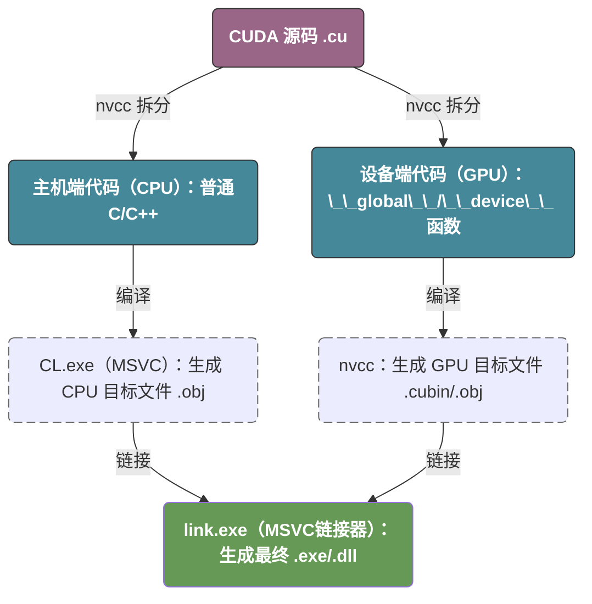

从这个角度来讲，CUDA 很像 `g++` 中的预处理器和编译器的结合：

- 先通过 `nvcc 预处理器` 将代码分为两个部分；
- 再编译属于自己的那部分；
- 除此之外，nvcc 还需要通过对应平台的编译器（在windows上时 CL.exe） 去编译生成对应平台的目标文件；
- 最后，再使用链接器生成最后的可执行文件。

## nvcc 的核心编译逻辑

`nvcc` 的核心任务是处理 **异构代码（Heterogeneous Code）**。它会将 `.cu` 文件拆分成运行在 CPU 上的 **Host 代码** 和运行在 GPU 上的 **Device 代码**。其详细步骤如下：

1. **代码拆分 (Splitting):** `nvcc` 识别出 `__global__` 等关键字，将 GPU 代码剥离出来。
2. **Device 编译:**
   - 将 GPU 代码编译为虚拟指令集 **PTX**（类似字节码）。
   - 再通过 `ptxas` 将 PTX 编译为特定 GPU 架构的二进制码 **SASS**（cubin）。
3. **Host 编译 (借用外壳):**
   - `nvcc` 将 Host 代码（以及用于启动内核的 CUDA Runtime API）交给宿主编译器（Linux 下是 `g++`，Windows 下是 `cl.exe`）。
4. **合并与链接:**
   - `nvcc` 将生成的二进制 GPU 代码嵌入到 Host 的目标文件中。
   - 最后调用链接器，将 CUDA 运行时库 (`libcudart`) 链接进去，生成最终的可执行文件。

# 第一个CUDA程序

> 我们给定两个 1D 的张量 x 和 y，要求输出他们的和

## CPU版本

我们先在CPU的下实现这个逻辑，非常简单，我们直接对程序进程暴力的计算即可，这里没有什么可以说的，就是分配内存后进行计算。

```c++
#include <stdio.h>
#include <stdlib.h>
#include <chrono>

void add(float *x, float *y, float *r, int n) {
    for (int i = 0; i < n; i++) {
        *(r + i) = *(x + i) + *(y + i);
    }
}

void call_add() {
    int N = 1000000;
    size_t mem_size = sizeof(float) * N;
    float* x, *y, *r;

    x = static_cast<float*>(malloc(mem_size));
    y = static_cast<float*>(malloc(mem_size));
    r = static_cast<float*>(malloc(mem_size));

    for (int i = 0; i < N; i++) {
        *(x + i) = 1.0;
        *(y + i) = 2.0;
    }

    add(x, y, r, N);

    for (int i = 0; i < 10; i++) {
        printf("r[%d] = %.3f\n", i, *(r + i));
    }

    free(x);
    free(y);
    free(r);
}

int main(int argc, char const *argv[])
{
    auto start = std::chrono::high_resolution_clock::now();
    call_add();
    auto end = std::chrono::high_resolution_clock::now();
    std::chrono::duration<double, std::milli> elapsed = end - start;
    printf("Execution time: %f ms\n", elapsed.count());
    return 0;
}
```

## GPU版本

> 在开始之前，我们可以阅读一下 [GPU的演进](#gpu的演进) 来初步了解CPU和GPU的差别。

目前我们碰到的最大问题是，`malloc` 分配的是我们的普通物理内存，然而我们的GPU不能直接访问物理内存，所以我们需要有一个方法将我们的数据从物理内存搬运到显存，从物理硬件上来讲，数据流转是这样的：

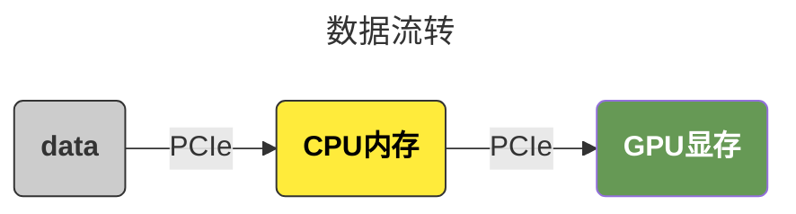

而在实际执行时，它的流转是这样的，这里我特意把我们的内存单独画出来，**因为我们优化的核心就是要避免过多的从内存拷贝数据到显存**：

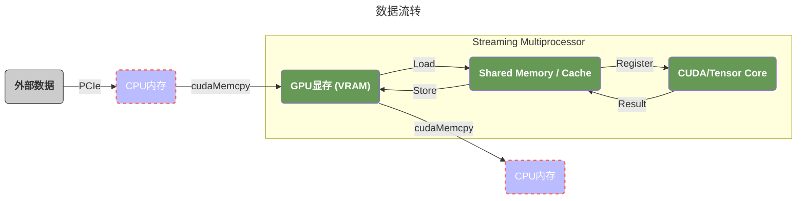

```c++
#include <stdio.h>
#include <stdlib.h>
#include <chrono>

__global__ void add(float* x, float* y , float* r, int n) {
    for (int i = 0; i < n; ++i) {
        *(r + i) = *(x + i) + *(y + i); 
    }
}

void call_add() {
    int n = 1000000;
    int mem_size = sizeof(float) * n;

    float *x, *y, *r;
    x = static_cast<float*>(malloc(mem_size));
    y = static_cast<float*>(malloc(mem_size));
    r = static_cast<float*>(malloc(mem_size));
    for (int i = 0; i < n; ++i) {
        *(x + i) = 1;
        *(y + i) = 2;
    }

    float *cuda_x, *cuda_y, *cuda_r;
    auto e = cudaMalloc(&cuda_x, mem_size);
    if (e != cudaSuccess) {
        printf("Error code: %d\n", e);
    }
    e = cudaMemcpy(cuda_x, x, mem_size, cudaMemcpyKind::cudaMemcpyHostToDevice);
    if (e != cudaSuccess) {
        printf("Error code: %d\n", e);
    }

    cudaMalloc(&cuda_y, mem_size);
    cudaMemcpy(cuda_y, y, mem_size, cudaMemcpyKind::cudaMemcpyHostToDevice);

    cudaMalloc(&cuda_r, mem_size);
    cudaMemcpy(cuda_r, r, mem_size, cudaMemcpyKind::cudaMemcpyHostToDevice);

    add<<<1, 1>>>(cuda_x, cuda_y, cuda_r, n);

    cudaMemcpy(r, cuda_r, mem_size, cudaMemcpyKind::cudaMemcpyDeviceToHost);

    for (int i = 0; i < 10; ++i) {
        printf("r[%d] = %.3f\n", i, *(r + i));
    }

    for (int i = n - 10; i < n; ++i) {
        printf("r[%d] = %.3f\n", i, *(r + i));
    }
    
    cudaFree(cuda_r);
    cudaFree(cuda_y);
    cudaFree(cuda_x);
    free(r);
    free(y);
    free(x);
}

int main(int argc, char const *argv[])
{
    auto start = std::chrono::high_resolution_clock::now();
    call_add();
    auto end = std::chrono::high_resolution_clock::now();
    std::chrono::duration<double, std::milli> elapsed = end - start;
    printf("Execution time: %f ms\n", elapsed.count());
    return 0;
}
```

## 性能分析

对比一下，我们惊人的发现：**CUDA版本执行是 3800ms，而CPU版本的只需要 8ms**。我们这里其实主要的性能问题主要在以下几个方面：

1. 我们的代码中，存在大量的数据传输：内存复制到显存，显存计算完后又复制到内存；
2. 我们的 `add` 函数，根本没有真正的并行 -- 我们相当于在GPU的同一个核上进行了全量的计算；
3. 其他的开销：例如额外的内存申请和销毁等；

我们后续的优化重点就瞄准于这些逻辑。

# nsys

## 初步的性能分析

前面提到，我们的 GPU 版本非常的慢，如果我们想知道程序的性能瓶颈在哪里怎么办呢：

- 对于 `compute capability 8.0 ` 以下的版本，我们使用 `nvprof`；
- 对于更高的版本，我们使用 `nsys`；

这里我们以 `nsys` 作为例子：

```bash
nvcc gpu/add_gpu.cu -o ~/tmp/a.out

nsys profile ~/tmp/a.out
```

这里，我们会生成两个文件：

1. `.nsys-rep` (Nsight System Report)  它是为了在 Windows 或 Linux 的图形界面里查看而设计的。
2. ``.sqlite` (SQLite Database)  它是为了**自动化分析**和**二次开发**设计的，我们可以用 Python 的 `sqlite3` 库或者任何 SQL 工具打开它，并根据需求去定制我们的对比逻辑。

我们在 `nsys UI` 下打开我们得到的文件，我们可以看到如下形式的输出：


1. 视图层级与架构分析
   - **CPU (16 Cores):** 准确反映了宿主机的逻辑处理器资源。该视图通过时间轴展示了每个核心的负载分布，是判断 **CPU Bound（CPU 受限）** 或 **进程调度延迟** 的核心依据。
   - **CUDA HW (NVIDIA GeForce RTX 4060 Ti):** 硬件物理执行层。直接展示 GPU 内部计算单元（Kernels）与数据传输单元（Memory）的真实物理占用。
   - **Threads (9):** 软件逻辑与上下文层。展示了当前进程（`a.out`）及其背后支撑环境的所有活动线程。

2. CPU 行为洞察
   - **核心调度：** 虽然系统识别到 16 个核心，但实际采样中仅有 1 个核心出现明显活动。这反映了 Linux 内核与 WSL2 的调度策略：为了优化缓存命中率和能耗，负载被集中分配。
   - **热点分析：** `CPU 4` 出现的长黑实线代表了**主线程的在疯狂执行，只不过这个执行并不意味着我们已经开始了数据从内存到显存的搬运**，我们可以对比这段时间的的 `CPU` 和 `CUDA HW->Memory`，我们会发现这段时间 `CUDA HW->Memory` 并没有任何的热力图，也就是说根本没有进行任何的数据搬运操作。那这段时间我们的CPU在干什么呢：
     - **Driver & Runtime Handshake (驱动与运行时握手)：** 在 WSL2 中，Linux 侧的 CUDA 库需要通过一个名为 `dxgkrnl` (DirectX Kernel) 的“桥梁”与 Windows 原生驱动建立连接。这个过程涉及复杂的跨系统内存空间映射，在第一次调用 CUDA API 时会产生巨大的固定开销。
     - **GPU Context Creation (上下文创建)：** 驱动需要为我们的程序在 GPU 上初始化一个“沙盒”。这包括分配常量内存空间、初始化指令队列、设置硬件监控等。
     - **Kernel Just-In-Time (JIT) Linking：** 如果我们的代码没有针对特定的显卡架构（如 `sm_89` 对于我们的 4060 Ti）进行预编译，CUDA 驱动会在运行时扫描我们的二进制代码并进行最后的链接。

3. CUDA 硬件层性能分析（瓶颈诊断）
   - **负载构成：** `Kernels (93.1%)` vs `Memory (6.9%)`。
   - **诊断：** 极高的 Kernel 占比在当前场景下并非代表高效，而是**计算极低效**的信号。由于代码未能开启并行（单线程执行），GPU 强大的算力被严重浪费在了一个串行任务上，导致计算时间被拉长。
   - **理想模型：** 对于向量加法这类算子，应通过增大并行规模将计算时间压缩至微秒级，使性能瓶颈转移到 **Memory Bandwidth（显存带宽）** 上。
   - **内存传输异常：** 观测到 `DtoH (66.9%)` 耗时远超 `HtoD (33.1%)`。
   - **原理推析：** 尽管 DtoH 数据量更小（$1 \times $ 对比 $3 \times$），但由于 DtoH 触发了隐式同步，且可能涉及 Host 侧非锁页内存（Pageable Memory）的页面映射开销，导致其有效带宽显著低于 HtoD。
4. 线程模型与驱动行为
   - **多线程体系：**
   - **`a.out` (Main Thread):** 负责业务逻辑与 CUDA API 的下发。
   - **CUDA Driver Workers:** 负责管理显存映射、命令队列调度以及处理 GPU 硬件的中断反馈。
   - **Nsight 辅助线程:** 如 `CPUTI` 和 `CommsProcessor`，负责在不严重干扰主程序运行的情况下，采集硬件计数器并实时流传输分析数据。
   - **因果链：** 主线程的占用率波动与 CPU 核心负载高度同步，证实了该线程是驱动整个计算流程的“指挥官”。

## 我们的程序在干什么？

现在，我们可以总结以下我们的程序到底做了什么：

1. **0 - 600ms (初始化期)：** CPU 4 满载忙等，GPU 待机。这是驱动在打通 WSL2 到 Windows 的隧道。
2. **600ms 左右 (瞬间搬运期)：** Memory 轴出现极短的 `HtoD`。这证实了 PCIe 传输其实很快，带宽不是瓶颈。
3. **600ms 之后 (低效计算期)：** `add` 函数在 CUDA HW 轴上占据了统治地位（93.1%）。**这是真正的性能“重灾区”**，因为此时 GPU 正在用几千个核心中的 **1 个** 核心在慢慢跑循环。
4. **最后 (同步与拷回期)：** CPU 继续忙等，直到单线程计算结束，触发 `DtoH`。

## 最大的优化点


如果我们聚焦于 `add` 函数，我们可以看到我们最大的优化点：此时 `grid` 和 `block` 都是 `<<<1, 1, 1>>>`，这意味着我们GPU上数千个 CUDA Core 并没有被真正的利用起来。我们在后面的章节中会解释这个逻辑。

## 另一个角度查看性能分析

此外，我们还可以直接查看结果：

```bash
nsys profile --stats=true ~/tmp/a.out
```

1. `osrt_sum`：`osrt` 是 **Operating System Runtime** 的缩写。`osrt_sum` 表统计的是我们的程序调用的 **Linux 操作系统原生 API**（系统调用）的耗时：
   - **内存管理：** `mmap`, `mprotect`, `brk`（对应 C++ 的 `new`/`malloc` 或 CUDA 驱动申请内存的底层动作）。
   - **文件/IO 操作：** `read`, `write`, `open`（比如我们用 `std::cout` 打印日志）。
   - **同步机制：** `ioctl`。在 WSL2 中，所有的 CUDA 指令最终都要通过 `ioctl` 这个系统调用穿透到内核，发送给 GPU 驱动。
2. `cuda_api_sum` 表明了我们对 cuda api 调用的统计分析，可以看到我们花费最多的是 `cudaMalloc`，`cudaMemcpy`，`cudaFree`； 在实际的深度学习框架（如 PyTorch）中，为了规避这个开销，会设计 **Memory Pool (显存池/Caching Allocator)**。程序启动时一次性申请一大块显存，后续使用时只是从池子里“借”，从而消除 `cuda_api_sum` 里的这些大头。
3. `cuda_gpu_kern_sum`  表明了 Kernel 函数的调用，这里只有 `add`；
4. `cuda_gpu_mem_time_sum` 统计了CUDA内的内存搬运情况，这里只有 `DtoH` 和 `HtoD`，这里我们应该关注的是 **Throughput (吞吐量)**，如果这个值远低于我们显卡的 PCIe 理论带宽（例如 PCIe 4.0 x16 是 31.5GB/s），那就说明小数据量的传输无法填满带宽，**传输开销（Latency）占了主导或者计算出现了性能瓶颈**；
5. `cuda_gpu_mem_size_sum` 统计了显存的使用情况，这里总共是使用了 12MB，正好对应于我们的300万个 float；

```
[4/8] Executing 'osrt_sum' stats report

 Time (%)  Total Time (ns)  Num Calls   Avg (ns)    Med (ns)   Min (ns)  Max (ns)  StdDev (ns)           Name
 --------  ---------------  ---------  ----------  ----------  --------  --------  -----------  ----------------------
     46.7        125586682          5  25117336.4  14348158.0      1623  80863774   31945408.5  poll
     42.3        113634498        467    243328.7     21812.0      1003   8033042     865567.7  ioctl
      9.5         25480839          7   3640119.9     94518.0      1275  13140210    6074492.7  fread
      0.4          1005425         26     38670.2      2694.5      1056    458091     116303.8  fopen
      0.4           975468          7    139352.6      2636.0      1508    366719     172996.9  read
      0.2           607168          3    202389.3    105488.0     57359    444321     210896.4  sem_timedwait
      0.1           309841          7     44263.0      8282.0      1238    143976      61918.4  open
      0.1           285645          3     95215.0     92495.0     73967    119183      22730.4  pthread_create
      0.1           255878         22     11630.8     11779.0      2899     24350       6170.4  mmap
      0.1           186824          8     23353.0      2378.5      1044    134238      45896.9  fclose
      0.1           159524          1    159524.0    159524.0    159524    159524          0.0  pthread_join
      0.0            66661          1     66661.0     66661.0     66661     66661          0.0  pthread_cond_wait
      0.0            45821          3     15273.7     15690.0     14163     15968        971.9  write
      0.0            26925          1     26925.0     26925.0     26925     26925          0.0  fgets
      0.0            20878          3      6959.3      6837.0      2532     11509       4489.8  pipe2
      0.0            11803          1     11803.0     11803.0     11803     11803          0.0  pthread_cond_broadcast
      0.0             8656          5      1731.2      1253.0      1141      3658       1080.1  fcntl
      0.0             7971          4      1992.8      2025.5      1015      2905        920.3  close
      0.0             4842          2      2421.0      2421.0      1372      3470       1483.5  fwrite

[5/8] Executing 'cuda_api_sum' stats report

 Time (%)  Total Time (ns)  Num Calls   Avg (ns)   Med (ns)   Min (ns)  Max (ns)   StdDev (ns)           Name
 --------  ---------------  ---------  ----------  ---------  --------  ---------  -----------  ----------------------
     71.6        140866925          3  46955641.7   307899.0    257351  140301675   80840040.2  cudaMalloc
     27.1         53235196          4  13308799.0   637978.5    445941   51513298   25469846.2  cudaMemcpy
      1.0          1919198          1   1919198.0  1919198.0   1919198    1919198          0.0  cudaLaunchKernel
      0.4           725322          3    241774.0   201415.0    166258     357649     101878.7  cudaFree
      0.0              680          1       680.0      680.0       680        680          0.0  cuModuleGetLoadingMode

[6/8] Executing 'cuda_gpu_kern_sum' stats report

 Time (%)  Total Time (ns)  Instances   Avg (ns)    Med (ns)   Min (ns)  Max (ns)  StdDev (ns)                 Name
 --------  ---------------  ---------  ----------  ----------  --------  --------  -----------  -----------------------------------
    100.0         47248532          1  47248532.0  47248532.0  47248532  47248532          0.0  add(float *, float *, float *, int)

[7/8] Executing 'cuda_gpu_mem_time_sum' stats report

 Time (%)  Total Time (ns)  Count  Avg (ns)   Med (ns)   Min (ns)  Max (ns)  StdDev (ns)           Operation
 --------  ---------------  -----  ---------  ---------  --------  --------  -----------  ----------------------------
     66.9          2346695      1  2346695.0  2346695.0   2346695   2346695          0.0  [CUDA memcpy Device-to-Host]
     33.1          1162276      3   387425.3   336623.0    334351    491302      89967.0  [CUDA memcpy Host-to-Device]

[8/8] Executing 'cuda_gpu_mem_size_sum' stats report

 Total (MB)  Count  Avg (MB)  Med (MB)  Min (MB)  Max (MB)  StdDev (MB)           Operation
 ----------  -----  --------  --------  --------  --------  -----------  ----------------------------
     12.000      3     4.000     4.000     4.000     4.000        0.000  [CUDA memcpy Host-to-Device]
```

# 优化前的准备

> 在我们开始之前，我们需要搞清楚GPU的组成以及它是如何调度我们的线程的，我们可以查看 [术语](#术语) 这一节查看每个术语的含义。

## 显卡的宏观结构

从最宏观的角度来将，一个显卡的核心组成包括以下几个部分：

1. `PCIe` 显卡需要通过 PCIe 和外界（CPU/内存）通信，而我们往往最大的性能开销之一就是在PCIe上 `内存 -> VRAM -> 内存` 的数据流转，尽可能的减少这个数据传输是优化性能的核心之一；
2. `VRAM` 显存，通常来说由于硬件限制，显卡通常不能直接访问内存（通过 Pinned Memory 可以实现 GPU 直接访问物理内存，但它本质上还是走 PCIe 总线），所以我们需要通过 CPU 和 PCIe 将数据从内存搬运到VRAM；
3. `GPU` 负责接受数据和分发计算指令（由TPC负责）到SM来进行实际的数据计算；

## 显卡的微观结构

> 这里，我们省略了电源，风扇和PCB等不核心的组件。

我的显卡是 `NVIDIA 4060TI`，使用的是 `Ada Lovelace` 架构，大概的结构如下：

1. 数据层面：
   1. `Graphics Card` 通过 PCIe 总线和 RAM 进行数据传输；
   2. 数据在进入到 RAM 之后，当计算单元发出访问请求时，如果 L2 未命中（Miss），`Message Controller` 会从 VRAM 读取数据并填充到 L2，这个是比 VRAM 更快的缓存。这个位置其实和CPU的逻辑是完全一样的 --  80% 的访问是对热点数据的访问，从 L2 Cache 的效率会远高于每次都从 VRAM 取（我们可以通过 `Tiling` 来让更多的数据停留在L2 Cache）；
2. 计算层面：
   1. 当 SM 开始执行指令需要数据时，它会先看 L1，没找到再去 L2，L2 没找到再去 VRAM。我们可以看到，一个GPU中可能包含了多个GPC，一个 GPC 又可能包含了多个 TPC，一个 TPC 下又包含了多个 SM，这里的 SM 才是真正和我们的 CPU 的 Core 对应的最小处理单元（ALU）；
   2. GPU的计算任务是以 `grid` 的形式提交，也就是我们在 `Kernel` 中的 `<<<1, 1>>>`（形式是 `<<<blocks, threads>>>`）。首先任务会通过 `GigaThread Engine` 将任务拆分为 block，并将 `block` 分配到一个合理的 `GPC`（一个特定的 Block 只能在一个 GPC 下的某个 SM 运行，它不能“横跨”两个 GPC）；**我们之前代码的问题就是，我们只用到了一个单独的GPC。**
   3. 在 `block` 被分配到 `GPC` 后，`UnitScheduler` 会为 `block` 选择一个合理的 `TPC` -- 通常是空闲或者负载较低的 `TPC`；
   4. 在绑定 `TPC` 之后，`Polymorph Engine & Scheduler` 会为我们的 blocks/tasks 绑定一个 SM，**在绑定SM之后，任务不会再被调度到其他的SM，因为将 SM 中 Shared Memory 全量的搬运到另一个 SM 代价实在太昂贵**。
   5. 随后，我们的线程就开始在 SM 上并行的执行，直到任务结束；
3. 一些思考：
   1. 我们前面提到过：**同一个 block 可以数据共享，这里并不是指在 TPC 中有一个 `TPC Cache` 的硬件来为不同的SM进行数据共享，而是说：当一个 block 绑定到SM之后，就不会再变更，那么 block 下所有的 threads 都可以访问这个 SM 下的 Shared Memory。**
   2. CPU 和 GPU 的设计哲学：
      - CPU 的设计哲学是 ”极致的快“，一个CPU内部的核数不多，但是每个核都有自己独立的L1/L2缓存，同时还有CPU共享的缓存，而内存极其缓慢。所以CPU使用**分支预测 (Branch Prediction)** 和 **乱序执行 (Out-of-Order Execution)** 试图提前从内存加载数据到 L1/L2 缓存来缓解IO瓶颈。并且CPU的核数极少，所以完全不能接受因为读取内存带来的IO等待。在这种情况下CPU愿意在内存IO阻塞时，花费昂贵的代价进行上下文切换去处理那些在L1/L2缓存中已经缓存的数据。
      - GPU 的设计哲学是 ”吞吐量“，一个 GPU 内部有远超CPU的核数，每个SM内部驻留着海量的线程，所以当内存IO阻塞时，GPU不需要进行上下文切换，它只需要通过 `Warp Scheduler` 去找到那个可以执行的任务即可。这也是为什么每个 SM 内部都有自己的独立寄存器 -- 当 SM1 里的 Warp A（32个线程）因为内存 IO 阻塞时，SM1 内部的 `Warp Scheduler` 会立刻切换到驻留在同一个 SM1 里的 Warp B。
   3. GPU的寄存器堆（Register File）：GPU 的寄存器和CPU的寄存器不一样，CPU通常只有少量的通用寄存器和控制寄存器。而GPU内部的每个SM都有自己独立的寄存器堆，而这个寄存器堆中的寄存器数量通常远超CPU中的寄存器数量。这意味着，假设线程需要使用10个寄存器，那么我在线程绑定到SM时便可以为分配这10个寄存器。在线程切换的时候，只需要去读自己绑定的寄存器即可。

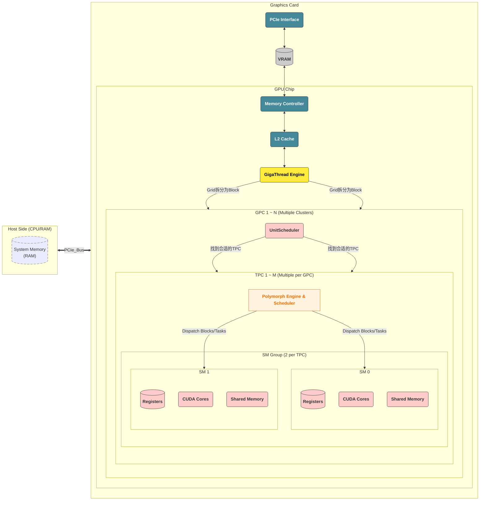

# 第一次优化

> 现在，我们知道了GPU的结构以及CUDA怎么调度任务，那我们现在可以开启第一次优化，目标是将我们的 `<<<1, 1>>>` 改成多线程版本 `<<<1, 256>>>`；

## Coalesced Access

按照我们之前的描述，我们这个 `<<<1, 256>>>` 的多线程版本，会被绑定到一个单独的 `SM` 进行执行，此时我们会面临一个问题，我们实现的方式有两种，假设我们线程的索引是 `t`，那么我们计算的逻辑可以有两种：

- 线程 `t` 负责计算我们数组中 `[t + 0 * 256, t + 1 * 256, t + 2 * 256, ...]`
- 线程 `t` 负责 `[t * 256, min(t * 256 + 3907， 1000000))`

他们分别在内存中是一片不连续的区域和一片连续的区域。

> 不连续

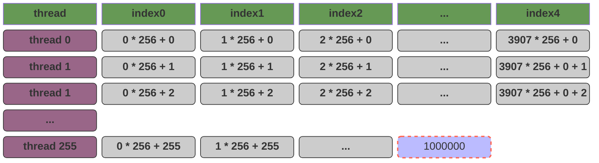

> 内存连续

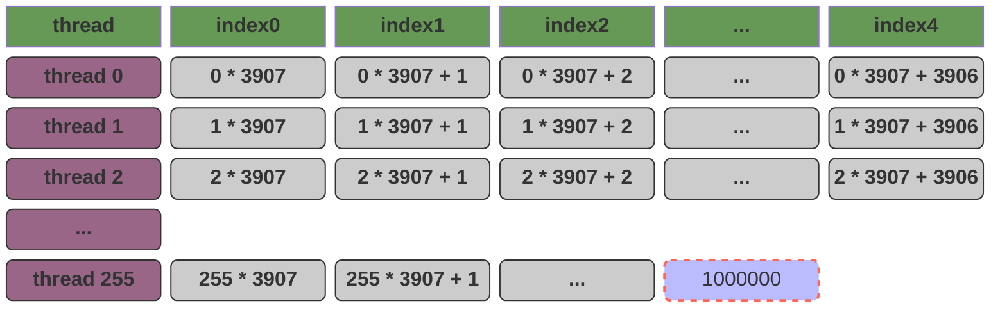


从CPU的角度来讲，我们在读取内存时是分页的，所以我们在**第二个方案中，每个线程计算时读取连续内存性能一定会比读取不连续内存更高**。这个结论在显存的计算中仍然成立吗？**答案是非常反直觉的，第一个方案这种看似不连续的性能会更高，这是GPU 性能优化中排在第一位的准则：访存合并 (Memory Coalescing)。**

这里涉及到CPU和GPU的内存访问模式：

- 单核 CPU 的 “并行” 本质是**时间片轮转的并发**，通过快速上下文切换模拟多任务同时执行，同一时刻物理上仅能执行一条指令；
- GPU 的并行是**空间上的硬件级并行**，SM（流多处理器）内的大量 CUDA Core（或流处理器）可在同一时钟周期内，对不同数据执行相同指令（即 SIMT 架构），属于真正的并行计算。

对于CPU来讲，任务执行时的内存模型是这样的：


在 `t0` 时间，CPU 集中的处理一段连续的内存；在 `t1` 时间，CPU 集中的处理另外一段连续的内存。

对于GPU来讲，任务执行时的内存模型是这样的：


GPU 的执行单位是 Warp（32个线程）。当指令执行到访存操作时，这 32 个线程会**同时**发出内存请求：当warp中的32个线程执行时，请求的是一片**连续的、对齐的**内存块。 **硬件行为：** GPU 的 **Memory Controller (MC)** 发现我们要的数据挨在一起，它会发起一次 **合并访问 (Coalesced Access)**。原本要发 32 次指令，现在只需 1 次总线事务就能把这一块数据全部拉回 SM。也就是说，在这个场景下，`[0, 31]` 对GPU来说才是一段连续的内存。

**CPU 的连续是“时间轴上的连续”**：

- 因为 CPU 只有一个（或少数几个）核心在跑。对于这个核心来说，它希望在 $T_0, T_1, T_2$ 这一系列时间点上，访问的地址是 $N, N+1, N+2$。
- **目的**：为了让数据留在 **L1 Cache** 里。

**GPU 的连续是“空间轴上的连续”**：

- 因为 GPU 是 Warp (32个核心) 在同一时刻跑。对于这组核心来说，它们希望在同一个时间点 $T_0$，访问的地址分别是 $N, N+1, \dots, N+31$。
- **目的**：为了触发 **Memory Coalescing (访存合并)**。

从 **Memory Controller (MC)** 的视角来看：

1. **硬件的“集装箱”机制**：显存（VRAM）和 SM 之间的数据传输不是按“字节”传的，而是按“块（Segment）”传的（通常是 **32 字节、64 字节或 128 字节**）。
2. **方案一**：Warp 里的 32 个线程正好要地址 [0-31]。MC 发现这 32 个需求正好能塞进一个 **128-byte** 的集装箱里。于是，一次总线搬运，32 个线程全吃饱。
3. **方案二**：Thread 0 要地址 0，Thread 1 要地址 3907。MC 必须搬运包含地址 0 的整个集装箱，结果只给 Thread 0 用了 4 字节，剩下的 124 字节全扔了；然后还得再去搬运包含 3907 的集装箱。

## Coalesced Access 的示意图

GPU 和 CPU 的最大区别在于，GPU以 WARP 的形式并行的执行线程，所以在 T0 时刻：`Warp` 中的 32 个线程在同一时刻对 $x$ 和 $y$ 发起访问：

- **第一次读取（x 数组）**：$t_0$ 到 $t_{31}$ 同时说：“我要 $x[0]$ 到 $x[31]$”。Memory Controller (MC) 看到这 32 个连续的需求，启动一次总线事务（Transaction），读取 $x[0..31]$。此时，总线读取的内存是一片连续的内存，只需要一次总线事务；
- **第二次读取（y 数组）**：同理，一次性把 $y[0..31]$ 搬运过来。


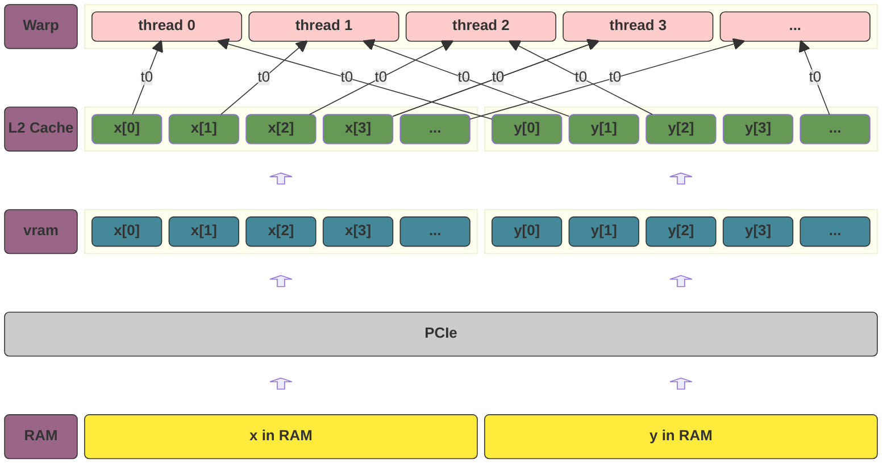

## 优化后的代码逻辑

CUDA 提供了一些内建的变量来访问线程相关的信息，比如：

| **变量名**      | **含义**                   |
| --------------- | -------------------------- |
| **`threadIdx`** | **线程在 Block 里的索引**  |
| **`blockIdx`**  | **Block 在 Grid 里的索引** |
| **`blockDim`**  | **Block 的维度（大小）**   |
| **`gridDim`**   | **Grid 的维度（大小）**    |
| `warpSize`      | **warp的数量**             |

我们现在需要用到的是：

- `threadIdx.x`: 指此线程在`thread block`中的下标位置
- `blockDim.x`: 指一个`thread block`中的线程数

```c++
__global__ void add_stride(float* x, float* y , float* r, int n) {
    int index = threadIdx.x;
    int stride = blockDim.x;

    for (int i = index; i < n; i += stride) {
        *(r + i) += *(x + i) + *(y + i);
    }
}
```

随后，我们来执行我们的函数，**这里因为我们使用了WSL，为了排除WSL执行时的干扰，我们将数组的数量增加到了一亿。**，具体的分析对比我们可以查看 [第一次优化后的性能对比](#第一次优化后的性能对比)。

## 一个神奇的现象

如果我们将代码改成如下形式：**我们没有对for循环进行并行优化，也就是 `+=` 被重复的执行了256次，然而最后结果却仍然是可能是 `{3,6,9,12,15,...}` 等输出** ，这是因为，每一行 `*(r + i) += ...` 实际上包含了三个隐藏的步骤，这在计算机底层被称为 **“读取-修改-写入”（Read-Modify-Write）** 序列：

1. **Read**：从显存（VRAM）中读取 `r[i]` 的当前值到 SM 的**寄存器**中。
2. **Modify**：在计算单元（ALU）中完成加法。
3. **Write**：将计算后的新值从寄存器写回到显存 `r[i]`。

**问题出在“同时性”上：** 当我们执行 `<<<1, 256>>>` 时，一个 Warp（32个线程）是在**同一个时钟周期**发出内存请求的。

- **T0时刻**：线程 0 到 线程 31 同时读取 `r[0]`。此时它们读到的值都是初始值 **0**。
- **T1时刻**：每个线程在自己的寄存器里算出了 `0 + x[0] + y[0] = 3`。
- **T2时刻**：这 32 个线程同时尝试把 **3** 写回显存地址 `r[0]`。

而我们的结果最终却不是预料的 `768`，这是因为这里产生的**竞态条件**，最终的结果是完全不确定的。

```c++ mark:3,9
__global__ void add(float* x, float* y , float* r, int n) {
    for (int i = 0; i < n; ++i) {
        *(r + i) += *(x + i) + *(y + i); 
    }
}

void call_add() {
    // ...
    add<<<1, 256>>>(cuda_x, cuda_y, cuda_r, n);
	// ...
}
```

验证的方法也很简单：我们使用原子加法即可得到结果 `768.00`

```c++ mark:4
__global__ void atomic_add(float* x, float* y , float* r, int n) {
    for (int i = 0; i < n; ++i) {
        float val = *(x + i) + *(y + i);
        atomicAdd(r + i, val);
    }
}
```

## 第一次优化后的性能对比

这里，我们会对核心指标进行对比：
| 指标             | `add<<<1, 1>>>` | `add_stride<<<1, 256>>>` |
| ---------------- | --------------- | ------------------------ |
| Kernels & Memory | `89.0%`/`11.0%` | `14.5%`/`85.5%`          |
| Kernal执行时间   | 4984ms          | 104ms                    |
| CUDA memcpy DtoH | 409ms           | 456ms                    |
| CUDA memcpy HtoD | 134ms           | 137ms                    |

可以看到：我们在 `memcpy` 没有变化不大的情况下，`Kernels` 的执行时间大幅下降，因为我们并行执行能更好的利用GPU的并行计算能力，也就是说，我们的性能瓶颈由SM计算变成了我们的VRAM访问。

# 第二次优化

> 我们之前使用了多线程对并行计算进行优化，现在我们开始使用 `grid `来继续优化。

## 优化思路

根据我们之前的描述，我们目前是所有的数据被绑定在一个SM上：

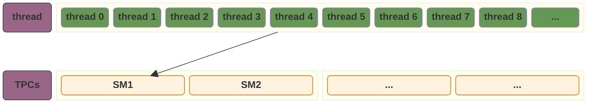

我们的目标是，将我们的 TPCs 都充分的利用起来：**GPU调度线程以 warp 为单位，所以我们最好的选择是，每个 block 分配足量的线程，让我们的 256 个线程拆分到不同的 block，这样我们整个的计算既可以最大化的利用 warp，又可以充分的利用我们的TPCs：**

- `warp` 32 是warp执行的最小原子，所以我们的 warp 数量一定要是 32 的整数倍；
- 一个 SM 不止可以跑一个 warp，这和CPU编程完全不一样。在CPU编程中，由于CPU的核寄存器数量极少所以在进行上下文切换时开销很大，最好的策略不要分配过多的线程导致过多的上下文切换。而在GPU编程中，GPU的寄存器数量远超CPU，所以线程的切换不仅开销很低，更可以充分的利用GPU的寄存器组来避免VRAM读取时的线程挂起，从而达到更大的吞吐量。

所以我们的最佳策略是：

1. 分配足量的 `blocks`，确保每个 SM 都能承载计算；
2. 每个 `block` 中还需要分配足量的 `threads` ，确保我们分配到每个 SM 的 warp 可以尽可能的利用GPU的寄存器组。

可以我们以我的显卡 `4060 TI`（有34个SM） 为例子，将这个策略转换为我们的公式：

$$TotalThreads = \underbrace{SM\_Count}_{34} \times \underbrace{Blocks\_per\_SM}_{2 \sim 4} \times \underbrace{Threads\_per\_Block}_{128 \sim 256}$$

注意，这里我们会发现有一个额外的参数 $\underbrace{Blocks\_per\_SM}_{2 \sim 4}$ ，这个参数并不是显式的声明的，而是通过 `GridSize` 的设置“推导”出来的。当我们的代码中指定 `add<<<GridSize, BlockSize>>>` 时，硬件的分配逻辑如下：

$$\text{Blocks\_per\_SM} = \frac{\text{GridSize}}{\text{SM\_Count}}$$

那么，我们现在优化后的思路就需要有如下的分配逻辑了：

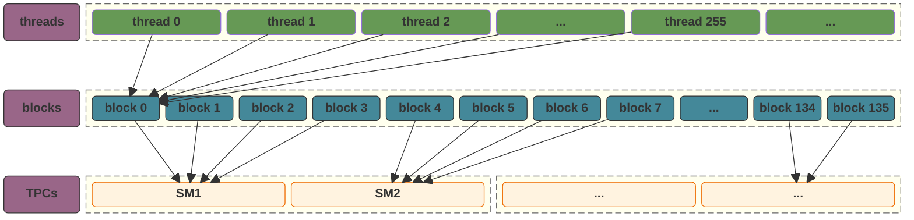

> **此外，在我们增加了 `blocks` 之后，我们又回到之前的那个问题：怎么样合理的安排循环才可以尽可能的利用我们的 `Memory Controller` 的并行读取能力？**
>
>  还是那句话，GPU以 `warp` 为单位对线程进行调度，并且在同一个 `warp` 中，线程的执行是并行的 -- 也就是说，**我们希望每次 `warp` 执行时，所有的线程需要的数据在内存的同一片区域。**那么，我们每个线程应该负责的索引如下：
>
> 1. **`tid` (Global Thread ID)**: $blockIdx.x \times blockDim.x + threadIdx.x$
> 2. **`stride` (Total Grid Size)**: $gridDim.x \times blockDim.x$

## 优化后的代码

| 指标             | `add<<<1, 1>>>` | `add_stride<<<1, 256>>>` | add_parallel<<<136, 256>>> |
| ---------------- | --------------- | ------------------------ | -------------------------- |
| Kernels & Memory | `89.0%`/`11.0%` | `14.5%`/`85.5%`          | `1.0%`/`99.0%`             |
| Kernal执行时间   | 4984ms          | 104ms                    | 6ms                        |
| CUDA memcpy DtoH | 409ms           | 456ms                    | 386ms                      |
| CUDA memcpy HtoD | 134ms           | 137ms                    | 131ms                      |

# 第三次优化

现在，我们的程序核心总耗时为：

$$131\text{ms (HtoD)} + 6\text{ms (Kernel)} + 386\text{ms (DtoH)} \approx 523\text{ms}$$

我们整个程序的性能瓶颈已经完全在 `PCIe` 的数据传输上，**我们的思路应该从“优化计算”到“优化搬运”**：

1. **引入“锁页内存”（Pinned Memory）**：我们现在使用的是标准的 `malloc`。如果我们改用 `cudaMallocHost`，可以跳过 CPU 的中转缓冲区，让 PCIe 搬运速度直接翻倍。
2. **引入“异步流”（CUDA Streams）**：现在的程序执行是：`DtoH(x) -> DtoH(y) -> DtoH(r) -> add -> HtoD(r)`，我们可以参考CPU的流水线改成 `DtoH`/`add`/`HtoD` 并行的模式，也就是读到数据就开始算，算完结果就开始写。

这里，我们先尝试使用锁页内存。

## 优化后的代码

我们通过 `cudaMallocHost` 和 `cudaFreeHost` 来管理我们的锁页内存：注意，**`cudaMallocHost` 只是把 CPU 端的内存“锁”在了物理内存中，防止它被操作系统交换到硬盘（Page Out），我们仍然需要调用 `cudaMemcpy` 来将数据移动到显存**。而之所以使用锁页内存比普通内存更快的原因是：

当我们使用普通内存（Pageable Memory）时，CUDA 驱动程序其实偷偷做了两步：：

1. **内部拷贝**：驱动程序先将数据从“普通内存”拷贝到一块**隐藏的锁页内存缓存区**中。
2. **DMA 传输**：硬件（DMA 控制器）再将这块隐藏区域的数据通过 PCIe 总线传给 GPU。

当我们使用锁页内存（Pinned Memory）时，由于内存已经“锁死”在物理地址上，不会被系统移动：

1. **直接传输**：GPU 的 DMA 控制器可以直接访问这块内存地址，**跳过 CPU 中转**。

```c++ mark:32-36,39,40
#include <iostream>
#include <stdio.h>
#include <stdlib.h>
#include <chrono>
#include <cuda_runtime.h>

__global__ void add_parallel(float* x, float* y , float* r, int n) {
    int index = blockDim.x * blockIdx.x + threadIdx.x;
    int stride = blockDim.x * gridDim.x;

    for (int i = index; i < n; i += stride) {
        *(r + i) += *(x + i) + *(y + i);
    }
}

void call_add() {
    int n = 100000000;
    int mem_size = sizeof(float) * n;

    float *x, *y, *r;
    cudaMallocHost((void**)&x, mem_size);
    cudaMallocHost((void**)&y, mem_size);
    cudaMallocHost((void**)&r, mem_size);

    for (int i = 0; i < n; ++i) {
        *(x + i) = 1;
        *(y + i) = 2;
        *(r + i) = 0;
    }

    float *d_x, *d_y, *d_r;
    cudaMalloc((void**)&d_x, mem_size);
    cudaMalloc((void**)&d_y, mem_size);
    cudaMalloc((void**)&d_r, mem_size);
    cudaMemcpy(d_x, x, mem_size, cudaMemcpyHostToDevice);
    cudaMemcpy(d_y, y, mem_size, cudaMemcpyHostToDevice);

    add_parallel<<<136, 256>>>(d_x, d_y, d_r, n);
    cudaDeviceSynchronize();
    cudaMemcpy(r, d_r, mem_size, cudaMemcpyDeviceToHost);

    int count = 0;
    for (int i = 0; i < n; ++i) {
        if (*(r + i) != 3) {
            count++;
        }
    }

    if (count != 0) {
        printf("Total errors: %d\n", count);
    }

    cudaFreeHost(r);
    cudaFreeHost(y);
    cudaFreeHost(x);
    cudaFree(d_r);
    cudaFree(d_y);
    cudaFree(d_x);
}

int main(int argc, char const *argv[])
{
    auto start = std::chrono::high_resolution_clock::now();
    call_add();
    auto end = std::chrono::high_resolution_clock::now();
    std::chrono::duration<double, std::milli> elapsed = end - start;
    printf("Execution time: %f ms\n", elapsed.count());
    return 0;
}
```

| 指标             | `add<<<1, 1>>>` | `add_stride<<<1, 256>>>` | add_parallel<<<136, 256>>> | 锁页内存       |
| ---------------- | --------------- | ------------------------ | -------------------------- | -------------- |
| Kernels & Memory | `89.0%`/`11.0%` | `14.5%`/`85.5%`          | `1.0%`/`99.0%`             | `6.2%`/`93.8%` |
| Kernal执行时间   | 4984ms          | 104ms                    | 6ms                        | 6ms            |
| CUDA memcpy DtoH | 409ms           | 456ms                    | 386ms                      | 61ms           |
| CUDA memcpy HtoD | 134ms           | 137ms                    | 131ms                      | 30ms           |

# QA

## 术语

| 缩写 | 全称                                      | 功能                                                         |
| ---- | ----------------------------------------- | ------------------------------------------------------------ |
|      | Graphics Card                             | - 显卡是计算机的并行计算子系统。它的核心任务是将 CPU 发出的指令和数据，转换成大规模并行的计算任务并执行。在 AI 领域，它是承载深度学习模型训练与推理的**物理平台**。<br/>- 最早显卡是用于图形计算，但是随着AI的发展，对并行计算能力要求越来越高，慢慢的开始逐渐从一个游戏玩家青睐的工具转变为AI训练的基础算力资源。<br/>- 显卡通过 PCIe 与计算机的其他组件，如CPU，内存进行数据传输。 |
| GPU  | Graphics Processing Unit                  | 显卡的“大脑”，负责执行实际的数学运算                         |
| VRAM | Video RAM                                 | - 显卡的“仓库”，高速存储当前计算所需的所有数据。这个对于整个显卡来说是共享的。<br/>- 存放 `cudaMalloc` 申请的空间。数据必须先从系统内存（RAM）通过 PCIe 搬运到 VRAM，GPU 才能对其进行计算。 |
| PCB  | Printed Circuit Board                     | 显卡的“骨架”，提供电气连接。                                 |
| PCIe | peripheral component interconnect express | 显卡的“大门”，负责与主机（CPU/内存）进行数据交换。           |
| VRM  | Voltage Regulator Module                  | 显卡的“心脏”，将电源电量转化为芯片所需的精密电流。           |
| GPC  | Graphics Processing Cluster               | GPU 内部最大的物理分区。每个 GPC 就像一个独立的“自治区”，拥有完整的计算和光栅化资源。 |
| TPC  | Texture Processing Cluster                | GPC 内部的进一步划分，主要负责管理和分发计算指令。           |
| SM   | Streaming Multiprocessor                  | **GPU 最关键的计算单元**。所有的 CUDA Block 最终都会被分配到某个 SM 上运行。 |
|      | CUDA Core(ALU)                            | 负责执行最基础的浮点数加减乘除（FP32/INT32）。               |
|      | Tensor Cores                              | 专门为深度学习设计的硬件加速器，处理 $4 \times 4$ 矩阵乘法。 |
|      | Register File                             | SM 内部速度最快但空间最小的存储，分配给每个线程。            |
|      | Shared Memory                             | 允许同一个 Block 内的线程互相通信。                          |
|      | Warp Scheduler                            | 负责每 32 个线程（一个 Warp）一组，指派到计算单元上运行。    |

## GPU的演进

在实现 GPU 矩阵加法时，我们面临的核心问题是：**GPU 如何在异构架构下高效获取数据？** 很多人认为 GPU 只是简单的计算器，但实际上，为了实现复杂的内存访问，GPU 内部同样拥有一套完整的硬件机制。

### GPU 的硬件支撑组件

虽然 CPU 和 GPU 的设计哲学不同，但 GPU 并非没有内存管理硬件。为了支持虚拟内存和多任务，现代 GPU 同样具备：

- **GMMU (GPU Memory Management Unit)：** 类似于 CPU 的 MMU，负责将虚拟地址转换为物理地址。
- **TLB (Translation Lookaside Buffer)：** GPU 内部同样有 TLB 快表，用于加速地址转换过程。
- **寄存器与多级缓存：** GPU 拥有极大规模的寄存器堆（Register File）以及 L1/L2 缓存，用于抵消显存访问的高延迟。

### CPU 与 GPU 的领地差异

在传统 PCIE 架构中，两者界限分明：

- **CPU 领地：** 内存控制器管理 **系统内存 (DDR)**。
- **GPU 领地：** 显存控制器管理 **显存 (GDDR 或 HBM)**。 两者通过 **PCIe 总线** 连接。由于物理隔离，GPU 无法通过原生偏移量直接读取 CPU 内存，必须跨越 PCIe 这座“独木桥”。

------

### 内存访问模式的演进

####  传统方式：手动搬运 (Explicit Copy)

这是 CUDA 编程的起点，使用 `cudaMemcpy`。

- **逻辑：** CPU 先在系统内存准备好数据，通过 PCIe 将数据显式“推”送到显存。
- **痛点：** 产生巨大的延迟（PCIe 瓶颈）。当计算任务很小时，数据传输的时间往往远超计算时间，导致 GPU 算力闲置。

#### “伪”直接访问：统一内存 (Unified Memory)

使用 `cudaMallocManaged()` 分配地址。

- **原理：** 创建一个 CPU 和 GPU 都能看到的**统一虚拟地址空间**。
- **底层机制：** 它是**按需分页 (On-demand Page Faulting)**。当 GPU 访问不在显存的数据时，会触发硬件缺页异常，驱动程序自动将数据页从内存迁移到显存。它简化了编程，但频繁的缺页中断会显著降低性能。

#### 锁页内存：Zero-Copy Memory (Pinned Memory)

这是 AI Infra 性能优化的关键点。

- **核心原理：** 申请一段 **Pinned Memory（锁页内存）**。其真正作用是**防止操作系统内核将该物理页交换（Swap）到磁盘或移动其物理位置**。
- **原因：** 硬件 DMA 引擎必须在确定的物理地址上工作。如果内存位置被内核移动，DMA 将会读写错误的地址导致系统崩溃。
- **效果：** GPU 线程可以通过 PCIe 直接读取这块内存（不经过显存拷贝）。虽然省了拷贝步骤，但受限于 PCIe 带宽，访问速度远慢于显存。

#### 终极加速：GPUDirect 族技术

在高性能集群（如 A100/H100 集群）中，我们追求完全绕过 CPU：

- **GPUDirect Storage (GDS)：** 使数据直接从 **NVMe SSD** 搬运到 GPU 显存，跳过 CPU 内存中转。
- **GPUDirect RDMA：** 允许 GPU 通过网卡直接访问另一台机器的 GPU 显存。在分布式训练（如 DeepSpeed）中，这极大地降低了节点间通信的延迟和 CPU 负载。

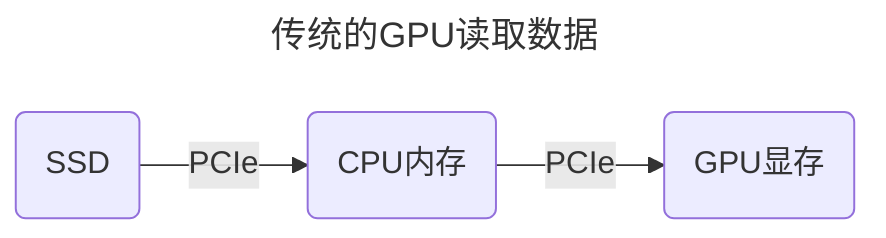

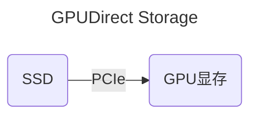

## 锁页内存/DMA

在我们的 [第三次优化](#第三次优化) 中，我们通过锁页内存和DMA优化了 `内存 <-> 显存` 的双向复制，那他们到底是什么呢？

### DMA

DMA 的全程是**Direct Memory Access**，是一个专门负责内存访问的硬件，通常来说，由于操作系统的虚拟内存机制，应用在访问内存时需要CPU的参与：MMU/TLB 配合操作系统的页表（PageTable）来将虚拟内存转换为物理内存。而 DMA 则是主板上的一个独立控制器，允许外部设备（如显卡、网卡）**直接**读写系统内存，而不需要 CPU 的干预。

在引入 DMA 之后，只需要向 CPU 申请一片特殊的内存，随后 CPU 会将所有对这片特殊内存的读/写 `授权` 给 DMA -- 这个过程被称之为**DMA 传输的配置与启动**。

#### 为什么必须申请“特殊内存”

CPU 视角下的内存是**虚拟的、离散的、可移动的**，它和物理内存不一样，一个连续的虚拟内存分片在物理内存上可能会分布在物理内存的任意位置。**但 DMA 硬件通常直接操作的是物理总线**，这也为 DMA 的操作带来了一些限制：

- **物理连续性**：DMA 搬运数据时，最理想的情况是物理地址连续。普通内存（Pageable）在物理上可能碎成了很多片，DMA 搬起来效率极低。
- **地址稳定性**：如果 CPU 在 DMA 搬运时，因为内存不足把这块页表换出（Page Out）到了磁盘，DMA 就会去读一个错误的物理地址。

`cudaMallocHost` 申请的这片“特殊内存”，本质上就是试图向 CPU 申请一块连续的，不会被置换到磁盘的物理内存。

#### DMA是如何工作的

DMA 的工作，需要操作系统和CPU通力合作：

- **设置与授权 (Setup)**： CPU 告诉 DMA 控制器：

  - CPU 通知 DMA 内存的起始地址；

  - CPU 通知 DMA 显存的目标地址；

  - CPU 通知 DMA 总共需要传输的数据大小；

- `Execution` 一旦 CPU 发出 `GO` 的指令，DMA 就会接管总线（Bus Mastering）。CPU 从此不再参与对 DMA 管理的内存的访问，DMA 会直接和内存控制器对话，把数据顺着 PCIe 通道推向 GPU。

- `Interrupt` 当数据传输完成时，DMA 会触发硬件中断，此时，CUDA 的 `cudaMemcpy` 才会返回，或者触发异步的回调。

#### DMA 的限制

CPU 为了访问速度，引入了 L1/L2 等多级 cache，而这种 cache 会引入所谓的**内存一致性**问题，通常的解决方案有两个：

- CPU 不要对数据进行修改；
- 通过内存屏障来保证内存和缓存的一致性。

而当我们开启内存屏障时，此时CPU缓存相当于失效，会拖慢CPU的执行速度，所以在我们的这个场景下，通常会选择直接选择CPU不参与任何数据修改。

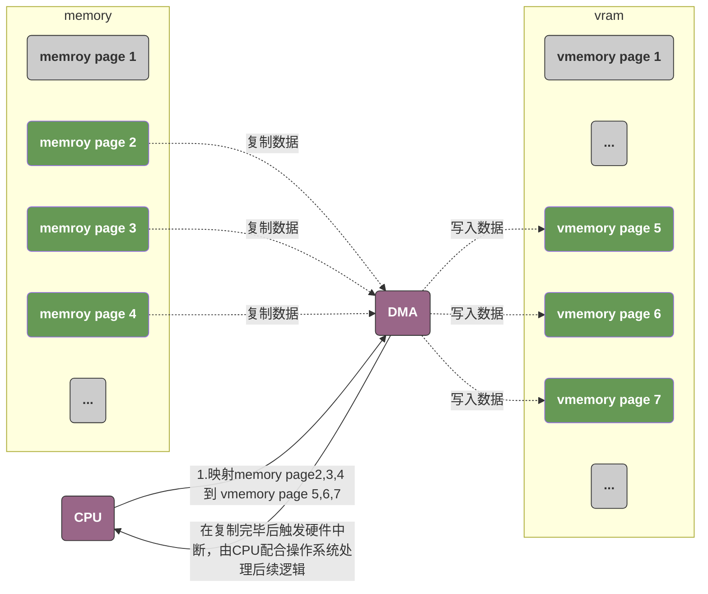

### 锁页内存

在操作系统（Windows/Linux）中，为了提高内存利用率，使用了**虚拟内存管理**。

- **分页机制 (Paging)**：操作系统为了腾出物理内存给更急需的任务，会把一些不常用的内存数据偷偷挪到硬盘上（这个过程叫 Page Out）。
- **物理地址漂移**：同一个虚拟地址对应的物理地址可能会随时间改变。
- **物理地址不连续**：通常，一个连续的虚拟地址很有可能对应不连续的物理地址；

而 DMA 的使用通常具有很多限制：

- DMA的硬件通常没有MMU/TLB组件，也不能访问操作系统内的页表，这意味着DMA只能直接操作物理内存；
- DMA不能读取CPU的L1/L2等缓存，这意味着当CPU修改内存时会影响数据一致性；

而锁页内存告诉操作系统，这一片内存不能移动（例如，当操作系统整理内存碎片时，可能会在不改变虚拟内存的情况下移动数据在物理内存的地址），也不能被置换到硬盘。这样可以保证DMA访问的可靠性和性能。

**锁页内存通常是在操作系统维护的PageTable中的PageTableEntry结构体下，标记为‘锁定’，从而保证其在硬件页表中的 Present位始终有效。**

### 最后的结果

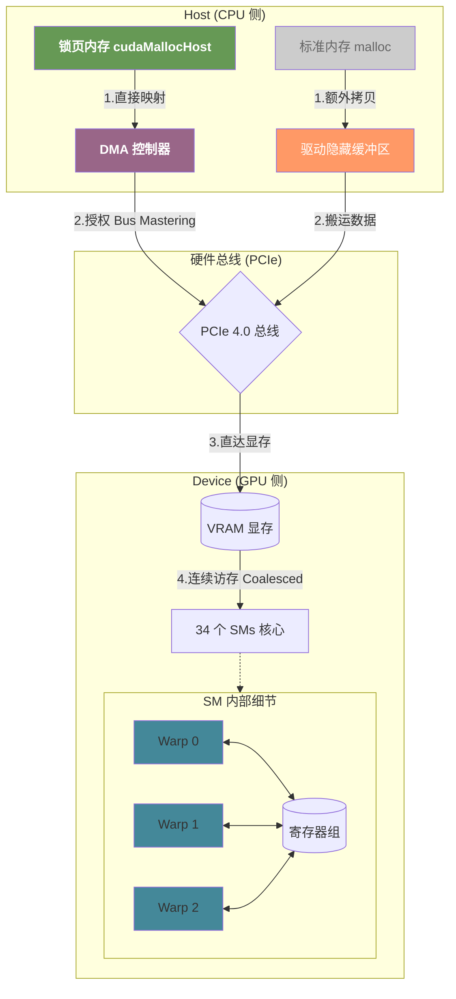
