# 环境配置


CUDA 开发环境的配置流程虽不算复杂，但主流的实现方案均存在明显的体验短板：

- **macOS 远程对接 Linux 开发**：这种在 macOS 系统下通过远程连接 Linux 环境开发的方式，核心痛点包括：
  - 多数 IDE 对跨平台编译、调试（DEBUG）的支持度不足，功能完整性和稳定性欠佳；
  - 开发过程中易遇到不影响核心功能但影响体验的小问题，整体使用感受较差；
  - 核心问题在于算力资源（算例）多按小时租赁且成本较高，为控制开销频繁启停实例时，需反复配置开发环境，严重降低开发效率。
- **Windows 原生开发**：该方案能满足基础开发流程需求，但核心问题集中在适配性和工具层面：
  - 行业内多数 CUDA 相关依赖框架、技术文档均基于 Linux 环境开发和撰写，迁移到 Windows 时，需额外花费精力寻找适配方案，甚至手动调整兼容逻辑；
  - 核心开发工具 Visual Studio 体积臃肿、配置项繁杂，对新手不友好，且易因配置不当引发环境问题。

经过我一段时间的摸索和测试，目前找到了一个比较好的解决方案：`Windows` + `WSL(Ubuntu)` + `VSCode(WSL Plugin)` 来作为开发环境，即有极高的兼容性，同时对于习惯于 linux 开发的我来说更顺手。最重要的是，这一套环境的配置远低于其他的环境配置，这里我们介绍一下怎么搭建这个开发环境。

## 所有依赖

- CUDA
  - `显卡驱动`：我们可以在 https://www.nvidia.cn/geforce/drivers/ 下载安装；
  - `nvcc`：这个就是编译CUDA程序的核心组件，类似于 GCC，主要的作用就是编译 CUDA 程序中的核函数（Kernel function）；

- windows
  - `Visual Studio`：Windows 环境下的 CUDA 编译工具 `nvcc` 并非完全独立，它需要借助 MSVC（CL）完成主机端（CPU）代码的编译，仅自行处理设备端（GPU）的 CUDA 核函数编译
  - `WSL`：作为我们CUDA程序执行的子系统；
  - `VSCode` 在 https://code.visualstudio.com/ 下载最新版即可；
  - `GCC`
- `VSCode`
  - `WSL`
  - `C/C++`
  - `C/C++ Runner`
  - `CMake Tools`
  - `CMake`
  - `CMake Language Support`

### CUDA和windows

在 Windows 进行安装时需要选自定义模式，采用精简模式安装后无法运行 nvcc 命令。

安装成功后我们需要在环境变量中，把 `Visual Stduio` 的 `CL` 添加到环境变量中：

```bash
${YOUR VS INSTALLING PATH}}\VC\Tools\MSVC\14.50.35717\bin\Hostx64\x64
```

安装 Toolkit 之后还需要配置下环境变量。默认系统会已经有 `CUDA_PATH` 和 `CUDA_PATH_V11.0`（11.0 应该是版本号），需要自己在额外添加如下环境变量：

```bash
CUDA_BIN_PATH: %CUDA_PATH%\bin
CUDA_LIB_PATH: %CUDA_PATH%\lib\x64
CUDA_SDK_BIN_PATH: %CUDA_SDK_PATH%\bin\win64
CUDA_SDK_LIB_PATH: %CUDA_SDK_PATH%\common\lib\x64
```

此外，还需要在系统变量 PATH 中添加如下变量：

```bash
%CUDA_BIN_PATH%
%CUDA_LIB_PATH%
%CUDA_SDK_BIN_PATH%
%CUDA_SDK_LIB_PATH%
```

### WSL

我们打开 `PowerShell`，先更新并重启 `WSL`；

```bash
wsl --update
wsl --shutdown
```

WSL 依赖底层的虚拟化，我们需要在 “启用或关闭Windows功能” 中，确保以下三项已经勾选：

- 适用于linux的windows子系统；
- 虚拟机平台；
- Hyper-V（这个是用于实现虚拟化的，如果没有可以不管）；

随后，我们在`PowerShell` 下安装 ubuntu

```bash
wsl --install -d Ubuntu-24.04
```

等安装好，我们就可以进入到我们的 WSL 了，在 WSL 下我们需要先验证 GPU 是否穿透成功：

```bash
nvidia-smi
```

如果成功，那就说明我们的 WSL 已经穿透成功了。

### VSCode

这里需要注意的是，我们在宿主机 windows 上只需要安装 `WSL` 插件，随后通过 `WSL` 插件直接选择 `Connect WSL`，所以依赖的插件：`CMake`，`C/C++ Runner` 都需要在连接到 `WSL` 后安装。

## 测试环境

我们在刚配置好的 `VSCode` 下打开文件 `hello.cu`，输入我们的测试代码：

```c++
#include <stdio.h>

__global__ void cuda_say_hello(){
    printf("Hello world, CUDA! %d\n", threadIdx.x);
}

int main(){
    printf("Hello world, CPU\n");
    cuda_say_hello<<<1,1>>>();

    cudaError_t cudaerr = cudaDeviceSynchronize();
    if (cudaerr != cudaSuccess)
        printf("kernel launch failed with error \"%s\".\n",
               cudaGetErrorString(cudaerr));
    return 0;
}
```

执行应该能看到我们的CUDA已经正常初始化了，这里重要的是看到我们的 CUDA 初始化逻辑完成：

```bash mark:3
hangyudu@0x822a5b873:~/code/test-cuda/build$ /home/hangyudu/code/test-cuda/build/hello
Hello world, CPU
Hello world, CUDA! 0
```

# CUDA程序的编译

我们的CUDA测试程序虽然可以直接在 `VSCode` 下执行，但是我们还是想再以命令行的形式介绍我们的程序编译执行：如果我们直接使用 `g++` 对这段代码进行编译：

```bash
g++ hello.cu
```

我们会得到如下异常：

```
/usr/bin/ld:hello.cu: file format not recognized; treating as linker script
/usr/bin/ld:hello.cu:3: syntax error
collect2: error: ld returned 1 exit status
```

- `syntax error` 是因为 g++ 只能处理标准 C/C++ 代码，完全不认识 CUDA 特有的语法（如 `__global__`、`__device__` 关键字）和 GPU 编译逻辑；
- `file format not recognized; treating as linker script` 错误，核心原因是**编译器 / 链接器无法识别目标文件的格式 ** —— `ld`（链接器）在尝试兜底：既然编译器认不出这是代码，它就猜这可能是一个用户自定义的链接脚本 ，因此会把 `.cu` 文件误判为普通文本 / 链接脚本；

我们知道，编译器在编译源码的逻辑是这样的（以编译 hello.c 为例）：


而我们在使用 `g++` 编译 CUDA 程序时，`__global__` 是它不认识的特有语法，也就是说，在生成目标文件时就失败了。我们只能通过 `nvcc` 来编译这个程序，而 nvcc 是怎么实现这个编译逻辑的呢？

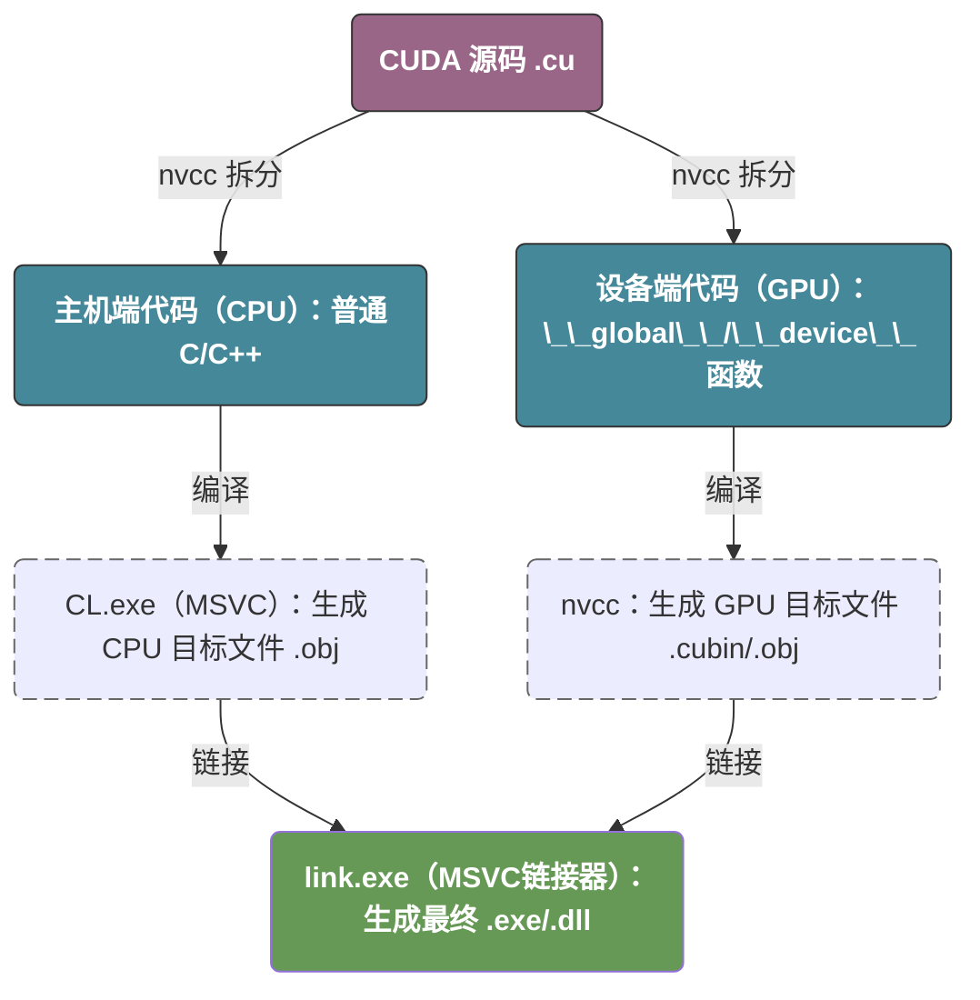

从这个角度来讲，CUDA 很像 `g++` 中的预处理器和编译器的结合：

- 先通过 `nvcc 预处理器` 将代码分为两个部分；
- 再编译属于自己的那部分；
- 除此之外，nvcc 还需要通过对应平台的编译器（在windows上时 CL.exe） 去编译生成对应平台的目标文件；
- 最后，再使用链接器生成最后的可执行文件。

## nvcc 的核心编译逻辑

`nvcc` 的核心任务是处理 **异构代码（Heterogeneous Code）**。它会将 `.cu` 文件拆分成运行在 CPU 上的 **Host 代码** 和运行在 GPU 上的 **Device 代码**。其详细步骤如下：

1. **代码拆分 (Splitting):** `nvcc` 识别出 `__global__` 等关键字，将 GPU 代码剥离出来。
2. **Device 编译:**
   - 将 GPU 代码编译为虚拟指令集 **PTX**（类似字节码）。
   - 再通过 `ptxas` 将 PTX 编译为特定 GPU 架构的二进制码 **SASS**（cubin）。
3. **Host 编译 (借用外壳):**
   - `nvcc` 将 Host 代码（以及用于启动内核的 CUDA Runtime API）交给宿主编译器（Linux 下是 `g++`，Windows 下是 `cl.exe`）。
4. **合并与链接:**
   - `nvcc` 将生成的二进制 GPU 代码嵌入到 Host 的目标文件中。
   - 最后调用链接器，将 CUDA 运行时库 (`libcudart`) 链接进去，生成最终的可执行文件。

# 第一个CUDA程序

> 我们给定两个 1D 的张量 x 和 y，要求输出他们的和

## CPU版本

我们先在CPU的下实现这个逻辑，非常简单，我们直接对程序进程暴力的计算即可，这里没有什么可以说的，就是分配内存后进行计算。

```c++
#include <stdio.h>
#include <stdlib.h>
#include <chrono>

void add(float *x, float *y, float *r, int n) {
    for (int i = 0; i < n; i++) {
        *(r + i) = *(x + i) + *(y + i);
    }
}

void call_add() {
    int N = 1000000;
    size_t mem_size = sizeof(float) * N;
    float* x, *y, *r;

    x = static_cast<float*>(malloc(mem_size));
    y = static_cast<float*>(malloc(mem_size));
    r = static_cast<float*>(malloc(mem_size));

    for (int i = 0; i < N; i++) {
        *(x + i) = 1.0;
        *(y + i) = 2.0;
    }

    add(x, y, r, N);

    for (int i = 0; i < 10; i++) {
        printf("r[%d] = %.3f\n", i, *(r + i));
    }

    free(x);
    free(y);
    free(r);
}

int main(int argc, char const *argv[])
{
    auto start = std::chrono::high_resolution_clock::now();
    call_add();
    auto end = std::chrono::high_resolution_clock::now();
    std::chrono::duration<double, std::milli> elapsed = end - start;
    printf("Execution time: %f ms\n", elapsed.count());
    return 0;
}
```

## GPU版本

> 在开始之前，我们可以阅读一下 [GPU的演进](#gpu的演进) 来初步了解CPU和GPU的差别。

目前我们碰到的最大问题是，`malloc` 分配的是我们的普通物理内存，然而我们的GPU不能直接访问物理内存，所以我们需要有一个方法将我们的数据从物理内存搬运到显存，从物理硬件上来讲，数据流转是这样的：

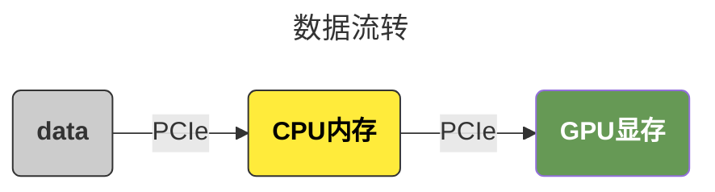

而在实际执行时，它的流转是这样的，这里我特意把我们的内存单独画出来，**因为我们优化的核心就是要避免过多的从内存拷贝数据到显存**：

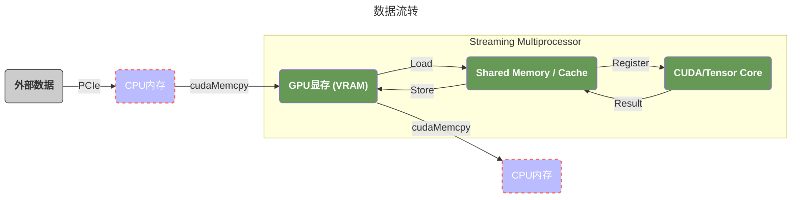

```c++
#include <stdio.h>
#include <stdlib.h>
#include <chrono>

__global__ void add(float* x, float* y , float* r, int n) {
    for (int i = 0; i < n; ++i) {
        *(r + i) = *(x + i) + *(y + i); 
    }
}

void call_add() {
    int n = 1000000;
    int mem_size = sizeof(float) * n;

    float *x, *y, *r;
    x = static_cast<float*>(malloc(mem_size));
    y = static_cast<float*>(malloc(mem_size));
    r = static_cast<float*>(malloc(mem_size));
    for (int i = 0; i < n; ++i) {
        *(x + i) = 1;
        *(y + i) = 2;
    }

    float *cuda_x, *cuda_y, *cuda_r;
    auto e = cudaMalloc(&cuda_x, mem_size);
    if (e != cudaSuccess) {
        printf("Error code: %d\n", e);
    }
    e = cudaMemcpy(cuda_x, x, mem_size, cudaMemcpyKind::cudaMemcpyHostToDevice);
    if (e != cudaSuccess) {
        printf("Error code: %d\n", e);
    }

    cudaMalloc(&cuda_y, mem_size);
    cudaMemcpy(cuda_y, y, mem_size, cudaMemcpyKind::cudaMemcpyHostToDevice);

    cudaMalloc(&cuda_r, mem_size);
    cudaMemcpy(cuda_r, r, mem_size, cudaMemcpyKind::cudaMemcpyHostToDevice);

    add<<<1, 1>>>(cuda_x, cuda_y, cuda_r, n);

    cudaMemcpy(r, cuda_r, mem_size, cudaMemcpyKind::cudaMemcpyDeviceToHost);

    for (int i = 0; i < 10; ++i) {
        printf("r[%d] = %.3f\n", i, *(r + i));
    }

    for (int i = n - 10; i < n; ++i) {
        printf("r[%d] = %.3f\n", i, *(r + i));
    }
    
    cudaFree(cuda_r);
    cudaFree(cuda_y);
    cudaFree(cuda_x);
    free(r);
    free(y);
    free(x);
}

int main(int argc, char const *argv[])
{
    auto start = std::chrono::high_resolution_clock::now();
    call_add();
    auto end = std::chrono::high_resolution_clock::now();
    std::chrono::duration<double, std::milli> elapsed = end - start;
    printf("Execution time: %f ms\n", elapsed.count());
    return 0;
}
```

## 性能分析

对比一下，我们惊人的发现：**CUDA版本执行是 3800ms，而CPU版本的只需要 8ms**。我们这里其实主要的性能问题主要在以下几个方面：

1. 我们的代码中，存在大量的数据传输：内存复制到显存，显存计算完后又复制到内存；
2. 我们的 `add` 函数，根本没有真正的并行 -- 我们相当于在GPU的同一个核上进行了全量的计算；
3. 其他的开销：例如额外的内存申请和销毁等；

我们后续的优化重点就瞄准于这些逻辑。

# nsys

## 初步的性能分析

前面提到，我们的 GPU 版本非常的慢，如果我们想知道程序的性能瓶颈在哪里怎么办呢：

- 对于 `compute capability 8.0 ` 以下的版本，我们使用 `nvprof`；
- 对于更高的版本，我们使用 `nsys`；

这里我们以 `nsys` 作为例子：

```bash
nvcc gpu/add_gpu.cu -o ~/tmp/a.out

nsys profile ~/tmp/a.out
```

这里，我们会生成两个文件：

1. `.nsys-rep` (Nsight System Report)  它是为了在 Windows 或 Linux 的图形界面里查看而设计的。
2. ``.sqlite` (SQLite Database)  它是为了**自动化分析**和**二次开发**设计的，我们可以用 Python 的 `sqlite3` 库或者任何 SQL 工具打开它，并根据需求去定制我们的对比逻辑。

我们在 `nsys UI` 下打开我们得到的文件，我们可以看到如下形式的输出：


1. 视图层级与架构分析
   - **CPU (16 Cores):** 准确反映了宿主机的逻辑处理器资源。该视图通过时间轴展示了每个核心的负载分布，是判断 **CPU Bound（CPU 受限）** 或 **进程调度延迟** 的核心依据。
   - **CUDA HW (NVIDIA GeForce RTX 4060 Ti):** 硬件物理执行层。直接展示 GPU 内部计算单元（Kernels）与数据传输单元（Memory）的真实物理占用。
   - **Threads (9):** 软件逻辑与上下文层。展示了当前进程（`a.out`）及其背后支撑环境的所有活动线程。

2. CPU 行为洞察
   - **核心调度：** 虽然系统识别到 16 个核心，但实际采样中仅有 1 个核心出现明显活动。这反映了 Linux 内核与 WSL2 的调度策略：为了优化缓存命中率和能耗，负载被集中分配。
   - **热点分析：** `CPU 4` 出现的长黑实线代表了**主线程的在疯狂执行，只不过这个执行并不意味着我们已经开始了数据从内存到显存的搬运**，我们可以对比这段时间的的 `CPU` 和 `CUDA HW->Memory`，我们会发现这段时间 `CUDA HW->Memory` 并没有任何的热力图，也就是说根本没有进行任何的数据搬运操作。那这段时间我们的CPU在干什么呢：
     - **Driver & Runtime Handshake (驱动与运行时握手)：** 在 WSL2 中，Linux 侧的 CUDA 库需要通过一个名为 `dxgkrnl` (DirectX Kernel) 的“桥梁”与 Windows 原生驱动建立连接。这个过程涉及复杂的跨系统内存空间映射，在第一次调用 CUDA API 时会产生巨大的固定开销。
     - **GPU Context Creation (上下文创建)：** 驱动需要为我们的程序在 GPU 上初始化一个“沙盒”。这包括分配常量内存空间、初始化指令队列、设置硬件监控等。
     - **Kernel Just-In-Time (JIT) Linking：** 如果我们的代码没有针对特定的显卡架构（如 `sm_89` 对于我们的 4060 Ti）进行预编译，CUDA 驱动会在运行时扫描我们的二进制代码并进行最后的链接。

3. CUDA 硬件层性能分析（瓶颈诊断）
   - **负载构成：** `Kernels (93.1%)` vs `Memory (6.9%)`。
   - **诊断：** 极高的 Kernel 占比在当前场景下并非代表高效，而是**计算极低效**的信号。由于代码未能开启并行（单线程执行），GPU 强大的算力被严重浪费在了一个串行任务上，导致计算时间被拉长。
   - **理想模型：** 对于向量加法这类算子，应通过增大并行规模将计算时间压缩至微秒级，使性能瓶颈转移到 **Memory Bandwidth（显存带宽）** 上。
   - **内存传输异常：** 观测到 `DtoH (66.9%)` 耗时远超 `HtoD (33.1%)`。
   - **原理推析：** 尽管 DtoH 数据量更小（$1 \times $ 对比 $3 \times$），但由于 DtoH 触发了隐式同步，且可能涉及 Host 侧非锁页内存（Pageable Memory）的页面映射开销，导致其有效带宽显著低于 HtoD。
4. 线程模型与驱动行为
   - **多线程体系：**
   - **`a.out` (Main Thread):** 负责业务逻辑与 CUDA API 的下发。
   - **CUDA Driver Workers:** 负责管理显存映射、命令队列调度以及处理 GPU 硬件的中断反馈。
   - **Nsight 辅助线程:** 如 `CPUTI` 和 `CommsProcessor`，负责在不严重干扰主程序运行的情况下，采集硬件计数器并实时流传输分析数据。
   - **因果链：** 主线程的占用率波动与 CPU 核心负载高度同步，证实了该线程是驱动整个计算流程的“指挥官”。

## 我们的程序在干什么？

现在，我们可以总结以下我们的程序到底做了什么：

1. **0 - 600ms (初始化期)：** CPU 4 满载忙等，GPU 待机。这是驱动在打通 WSL2 到 Windows 的隧道。
2. **600ms 左右 (瞬间搬运期)：** Memory 轴出现极短的 `HtoD`。这证实了 PCIe 传输其实很快，带宽不是瓶颈。
3. **600ms 之后 (低效计算期)：** `add` 函数在 CUDA HW 轴上占据了统治地位（93.1%）。**这是真正的性能“重灾区”**，因为此时 GPU 正在用几千个核心中的 **1 个** 核心在慢慢跑循环。
4. **最后 (同步与拷回期)：** CPU 继续忙等，直到单线程计算结束，触发 `DtoH`。

## 最大的优化点


如果我们聚焦于 `add` 函数，我们可以看到我们最大的优化点：此时 `grid` 和 `block` 都是 `<<<1, 1, 1>>>`，这意味着我们GPU上数千个 CUDA Core 并没有被真正的利用起来。我们在后面的章节中会解释这个逻辑。

## 另一个角度查看性能分析

此外，我们还可以直接查看结果：

```bash
nsys profile --stats=true ~/tmp/a.out
```

1. `osrt_sum`：`osrt` 是 **Operating System Runtime** 的缩写。`osrt_sum` 表统计的是我们的程序调用的 **Linux 操作系统原生 API**（系统调用）的耗时：
   - **内存管理：** `mmap`, `mprotect`, `brk`（对应 C++ 的 `new`/`malloc` 或 CUDA 驱动申请内存的底层动作）。
   - **文件/IO 操作：** `read`, `write`, `open`（比如我们用 `std::cout` 打印日志）。
   - **同步机制：** `ioctl`。在 WSL2 中，所有的 CUDA 指令最终都要通过 `ioctl` 这个系统调用穿透到内核，发送给 GPU 驱动。
2. `cuda_api_sum` 表明了我们对 cuda api 调用的统计分析，可以看到我们花费最多的是 `cudaMalloc`，`cudaMemcpy`，`cudaFree`； 在实际的深度学习框架（如 PyTorch）中，为了规避这个开销，会设计 **Memory Pool (显存池/Caching Allocator)**。程序启动时一次性申请一大块显存，后续使用时只是从池子里“借”，从而消除 `cuda_api_sum` 里的这些大头。
3. `cuda_gpu_kern_sum`  表明了 Kernel 函数的调用，这里只有 `add`；
4. `cuda_gpu_mem_time_sum` 统计了CUDA内的内存搬运情况，这里只有 `DtoH` 和 `HtoD`，这里我们应该关注的是 **Throughput (吞吐量)**，如果这个值远低于我们显卡的 PCIe 理论带宽（例如 PCIe 4.0 x16 是 31.5GB/s），那就说明小数据量的传输无法填满带宽，**传输开销（Latency）占了主导或者计算出现了性能瓶颈**；
5. `cuda_gpu_mem_size_sum` 统计了显存的使用情况，这里总共是使用了 12MB，正好对应于我们的300万个 float；

```
[4/8] Executing 'osrt_sum' stats report

 Time (%)  Total Time (ns)  Num Calls   Avg (ns)    Med (ns)   Min (ns)  Max (ns)  StdDev (ns)           Name
 --------  ---------------  ---------  ----------  ----------  --------  --------  -----------  ----------------------
     46.7        125586682          5  25117336.4  14348158.0      1623  80863774   31945408.5  poll
     42.3        113634498        467    243328.7     21812.0      1003   8033042     865567.7  ioctl
      9.5         25480839          7   3640119.9     94518.0      1275  13140210    6074492.7  fread
      0.4          1005425         26     38670.2      2694.5      1056    458091     116303.8  fopen
      0.4           975468          7    139352.6      2636.0      1508    366719     172996.9  read
      0.2           607168          3    202389.3    105488.0     57359    444321     210896.4  sem_timedwait
      0.1           309841          7     44263.0      8282.0      1238    143976      61918.4  open
      0.1           285645          3     95215.0     92495.0     73967    119183      22730.4  pthread_create
      0.1           255878         22     11630.8     11779.0      2899     24350       6170.4  mmap
      0.1           186824          8     23353.0      2378.5      1044    134238      45896.9  fclose
      0.1           159524          1    159524.0    159524.0    159524    159524          0.0  pthread_join
      0.0            66661          1     66661.0     66661.0     66661     66661          0.0  pthread_cond_wait
      0.0            45821          3     15273.7     15690.0     14163     15968        971.9  write
      0.0            26925          1     26925.0     26925.0     26925     26925          0.0  fgets
      0.0            20878          3      6959.3      6837.0      2532     11509       4489.8  pipe2
      0.0            11803          1     11803.0     11803.0     11803     11803          0.0  pthread_cond_broadcast
      0.0             8656          5      1731.2      1253.0      1141      3658       1080.1  fcntl
      0.0             7971          4      1992.8      2025.5      1015      2905        920.3  close
      0.0             4842          2      2421.0      2421.0      1372      3470       1483.5  fwrite

[5/8] Executing 'cuda_api_sum' stats report

 Time (%)  Total Time (ns)  Num Calls   Avg (ns)   Med (ns)   Min (ns)  Max (ns)   StdDev (ns)           Name
 --------  ---------------  ---------  ----------  ---------  --------  ---------  -----------  ----------------------
     71.6        140866925          3  46955641.7   307899.0    257351  140301675   80840040.2  cudaMalloc
     27.1         53235196          4  13308799.0   637978.5    445941   51513298   25469846.2  cudaMemcpy
      1.0          1919198          1   1919198.0  1919198.0   1919198    1919198          0.0  cudaLaunchKernel
      0.4           725322          3    241774.0   201415.0    166258     357649     101878.7  cudaFree
      0.0              680          1       680.0      680.0       680        680          0.0  cuModuleGetLoadingMode

[6/8] Executing 'cuda_gpu_kern_sum' stats report

 Time (%)  Total Time (ns)  Instances   Avg (ns)    Med (ns)   Min (ns)  Max (ns)  StdDev (ns)                 Name
 --------  ---------------  ---------  ----------  ----------  --------  --------  -----------  -----------------------------------
    100.0         47248532          1  47248532.0  47248532.0  47248532  47248532          0.0  add(float *, float *, float *, int)

[7/8] Executing 'cuda_gpu_mem_time_sum' stats report

 Time (%)  Total Time (ns)  Count  Avg (ns)   Med (ns)   Min (ns)  Max (ns)  StdDev (ns)           Operation
 --------  ---------------  -----  ---------  ---------  --------  --------  -----------  ----------------------------
     66.9          2346695      1  2346695.0  2346695.0   2346695   2346695          0.0  [CUDA memcpy Device-to-Host]
     33.1          1162276      3   387425.3   336623.0    334351    491302      89967.0  [CUDA memcpy Host-to-Device]

[8/8] Executing 'cuda_gpu_mem_size_sum' stats report

 Total (MB)  Count  Avg (MB)  Med (MB)  Min (MB)  Max (MB)  StdDev (MB)           Operation
 ----------  -----  --------  --------  --------  --------  -----------  ----------------------------
     12.000      3     4.000     4.000     4.000     4.000        0.000  [CUDA memcpy Host-to-Device]
```

# ncu

参考 [ncu的指标](#ncu的指标) 和 [sgemm](#sgemm) 中对 ncu 的使用。

# 优化前的准备

> 在我们开始之前，我们需要搞清楚GPU的组成以及它是如何调度我们的线程的，我们可以查看 [术语](#术语) 这一节查看每个术语的含义。

## 显卡的宏观结构

从最宏观的角度来将，一个显卡的核心组成包括以下几个部分：

1. `PCIe` 显卡需要通过 PCIe 和外界（CPU/内存）通信，而我们往往最大的性能开销之一就是在PCIe上 `内存 -> VRAM -> 内存` 的数据流转，尽可能的减少这个数据传输是优化性能的核心之一；
2. `VRAM` 显存，通常来说由于硬件限制，显卡通常不能直接访问内存（通过 Pinned Memory 可以实现 GPU 直接访问物理内存，但它本质上还是走 PCIe 总线），所以我们需要通过 CPU 和 PCIe 将数据从内存搬运到VRAM；
3. `GPU` 负责接受数据和分发计算指令（由TPC负责）到SM来进行实际的数据计算；

## 显卡的微观结构

> 这里，我们省略了电源，风扇和PCB等不核心的组件。

我的显卡是 `NVIDIA 4060TI`，使用的是 `Ada Lovelace` 架构，大概的结构如下：

1. 数据层面：
   1. `Graphics Card` 通过 PCIe 总线和 RAM 进行数据传输；
   2. 数据在进入到 RAM 之后，当计算单元发出访问请求时，如果 L2 未命中（Miss），`Message Controller` 会从 VRAM 读取数据并填充到 L2，这个是比 VRAM 更快的缓存。这个位置其实和CPU的逻辑是完全一样的 --  80% 的访问是对热点数据的访问，从 L2 Cache 的效率会远高于每次都从 VRAM 取（我们可以通过 `Tiling` 来让更多的数据停留在L2 Cache）；
2. 计算层面：
   1. 当 SM 开始执行指令需要数据时，它会先看 L1，没找到再去 L2，L2 没找到再去 VRAM。我们可以看到，一个GPU中可能包含了多个GPC，一个 GPC 又可能包含了多个 TPC，一个 TPC 下又包含了多个 SM，这里的 SM 才是真正和我们的 CPU 的 Core 对应的最小处理单元（ALU）；
   2. GPU的计算任务是以 `grid` 的形式提交，也就是我们在 `Kernel` 中的 `<<<1, 1>>>`（形式是 `<<<blocks, threads>>>`）。首先任务会通过 `GigaThread Engine` 将任务拆分为 block，并将 `block` 分配到一个合理的 `GPC`（一个特定的 Block 只能在一个 GPC 下的某个 SM 运行，它不能“横跨”两个 GPC）；**我们之前代码的问题就是，我们只用到了一个单独的GPC。**
   3. 在 `block` 被分配到 `GPC` 后，`UnitScheduler` 会为 `block` 选择一个合理的 `TPC` -- 通常是空闲或者负载较低的 `TPC`；
   4. 在绑定 `TPC` 之后，`Polymorph Engine & Scheduler` 会为我们的 blocks/tasks 绑定一个 SM，**在绑定SM之后，任务不会再被调度到其他的SM，因为将 SM 中 Shared Memory 全量的搬运到另一个 SM 代价实在太昂贵**。
   5. 随后，我们的线程就开始在 SM 上并行的执行，直到任务结束；
3. 一些思考：
   1. 我们前面提到过：**同一个 block 可以数据共享，这里并不是指在 TPC 中有一个 `TPC Cache` 的硬件来为不同的SM进行数据共享，而是说：当一个 block 绑定到SM之后，就不会再变更，那么 block 下所有的 threads 都可以访问这个 SM 下的 Shared Memory。**
   2. CPU 和 GPU 的设计哲学：
      - CPU 的设计哲学是 ”极致的快“，一个CPU内部的核数不多，但是每个核都有自己独立的L1/L2缓存，同时还有CPU共享的缓存，而内存极其缓慢。所以CPU使用**分支预测 (Branch Prediction)** 和 **乱序执行 (Out-of-Order Execution)** 试图提前从内存加载数据到 L1/L2 缓存来缓解IO瓶颈。并且CPU的核数极少，所以完全不能接受因为读取内存带来的IO等待。在这种情况下CPU愿意在内存IO阻塞时，花费昂贵的代价进行上下文切换去处理那些在L1/L2缓存中已经缓存的数据。
      - GPU 的设计哲学是 ”吞吐量“，一个 GPU 内部有远超CPU的核数，每个SM内部驻留着海量的线程，所以当内存IO阻塞时，GPU不需要进行上下文切换，它只需要通过 `Warp Scheduler` 去找到那个可以执行的任务即可。这也是为什么每个 SM 内部都有自己的独立寄存器 -- 当 SM1 里的 Warp A（32个线程）因为内存 IO 阻塞时，SM1 内部的 `Warp Scheduler` 会立刻切换到驻留在同一个 SM1 里的 Warp B。
   3. GPU的寄存器堆（Register File）：GPU 的寄存器和CPU的寄存器不一样，CPU通常只有少量的通用寄存器和控制寄存器。而GPU内部的每个SM都有自己独立的寄存器堆，而这个寄存器堆中的寄存器数量通常远超CPU中的寄存器数量。这意味着，假设线程需要使用10个寄存器，那么我在线程绑定到SM时便可以为分配这10个寄存器。在线程切换的时候，只需要去读自己绑定的寄存器即可。

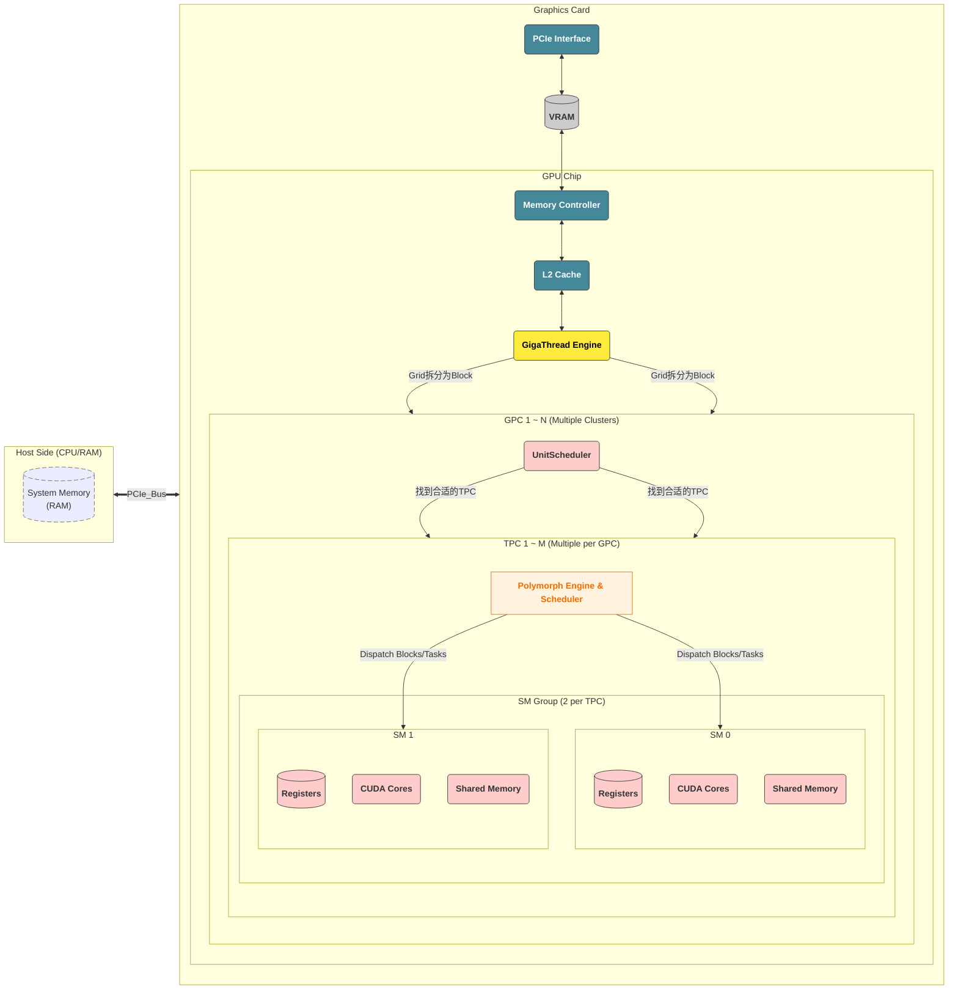

# 第一次优化（Threads）

> 现在，我们知道了GPU的结构以及CUDA怎么调度任务，那我们现在可以开启第一次优化，目标是将我们的 `<<<1, 1>>>` 改成多线程版本 `<<<1, 256>>>`；

## Coalesced Access

按照我们之前的描述，我们这个 `<<<1, 256>>>` 的多线程版本，会被绑定到一个单独的 `SM` 进行执行，此时我们会面临一个问题，我们实现的方式有两种，假设我们线程的索引是 `t`，那么我们计算的逻辑可以有两种：

- 线程 `t` 负责计算我们数组中 `[t + 0 * 256, t + 1 * 256, t + 2 * 256, ...]`
- 线程 `t` 负责 `[t * 256, min(t * 256 + 3907， 1000000))`

他们分别在内存中是一片不连续的区域和一片连续的区域。

> 不连续

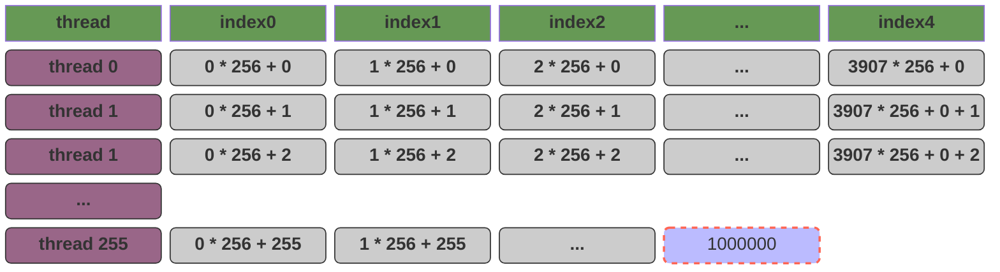

> 内存连续

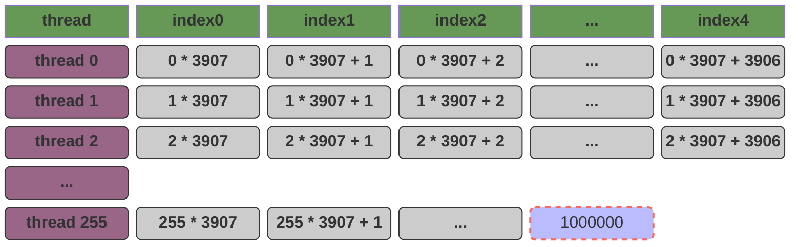


从CPU的角度来讲，我们在读取内存时是分页的，所以我们在**第二个方案中，每个线程计算时读取连续内存性能一定会比读取不连续内存更高**。这个结论在显存的计算中仍然成立吗？**答案是非常反直觉的，第一个方案这种看似不连续的性能会更高，这是GPU 性能优化中排在第一位的准则：访存合并 (Memory Coalescing)。**

这里涉及到CPU和GPU的内存访问模式：

- 单核 CPU 的 “并行” 本质是**时间片轮转的并发**，通过快速上下文切换模拟多任务同时执行，同一时刻物理上仅能执行一条指令；
- GPU 的并行是**空间上的硬件级并行**，SM（流多处理器）内的大量 CUDA Core（或流处理器）可在同一时钟周期内，对不同数据执行相同指令（即 SIMT 架构），属于真正的并行计算。

对于CPU来讲，任务执行时的内存模型是这样的：


在 `t0` 时间，CPU 集中的处理一段连续的内存；在 `t1` 时间，CPU 集中的处理另外一段连续的内存。

对于GPU来讲，任务执行时的内存模型是这样的：


GPU 的执行单位是 Warp（32个线程）。当指令执行到访存操作时，这 32 个线程会**同时**发出内存请求：当warp中的32个线程执行时，请求的是一片**连续的、对齐的**内存块。 **硬件行为：** GPU 的 **Memory Controller (MC)** 发现我们要的数据挨在一起，它会发起一次 **合并访问 (Coalesced Access)**。原本要发 32 次指令，现在只需 1 次总线事务就能把这一块数据全部拉回 SM。也就是说，在这个场景下，`[0, 31]` 对GPU来说才是一段连续的内存。

**CPU 的连续是“时间轴上的连续”**：

- 因为 CPU 只有一个（或少数几个）核心在跑。对于这个核心来说，它希望在 $T_0, T_1, T_2$ 这一系列时间点上，访问的地址是 $N, N+1, N+2$。
- **目的**：为了让数据留在 **L1 Cache** 里。

**GPU 的连续是“空间轴上的连续”**：

- 因为 GPU 是 Warp (32个核心) 在同一时刻跑。对于这组核心来说，它们希望在同一个时间点 $T_0$，访问的地址分别是 $N, N+1, \dots, N+31$。
- **目的**：为了触发 **Memory Coalescing (访存合并)**。

从 **Memory Controller (MC)** 的视角来看：

1. **硬件的“集装箱”机制**：显存（VRAM）和 SM 之间的数据传输不是按“字节”传的，而是按“块（Segment）”传的（通常是 **32 字节、64 字节或 128 字节**）。
2. **方案一**：Warp 里的 32 个线程正好要地址 [0-31]。MC 发现这 32 个需求正好能塞进一个 **128-byte** 的集装箱里。于是，一次总线搬运，32 个线程全吃饱。
3. **方案二**：Thread 0 要地址 0，Thread 1 要地址 3907。MC 必须搬运包含地址 0 的整个集装箱，结果只给 Thread 0 用了 4 字节，剩下的 124 字节全扔了；然后还得再去搬运包含 3907 的集装箱。

## Coalesced Access 的示意图

GPU 和 CPU 的最大区别在于，GPU以 WARP 的形式并行的执行线程，所以在 T0 时刻：`Warp` 中的 32 个线程在同一时刻对 $x$ 和 $y$ 发起访问：

- **第一次读取（x 数组）**：$t_0$ 到 $t_{31}$ 同时说：“我要 $x[0]$ 到 $x[31]$”。Memory Controller (MC) 看到这 32 个连续的需求，启动一次总线事务（Transaction），读取 $x[0..31]$。此时，总线读取的内存是一片连续的内存，只需要一次总线事务；
- **第二次读取（y 数组）**：同理，一次性把 $y[0..31]$ 搬运过来。


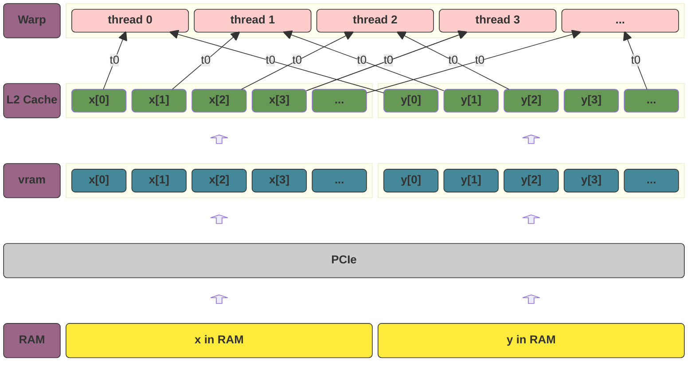

## 优化后的代码逻辑

CUDA 提供了一些内建的变量来访问线程相关的信息，比如：

| **变量名**      | **含义**                   |
| --------------- | -------------------------- |
| **`threadIdx`** | **线程在 Block 里的索引**  |
| **`blockIdx`**  | **Block 在 Grid 里的索引** |
| **`blockDim`**  | **Block 的维度（大小）**   |
| **`gridDim`**   | **Grid 的维度（大小）**    |
| `warpSize`      | **warp的数量**             |

我们现在需要用到的是：

- `threadIdx.x`: 指此线程在`thread block`中的下标位置
- `blockDim.x`: 指一个`thread block`中的线程数

```c++
__global__ void add_stride(float* x, float* y , float* r, int n) {
    int index = threadIdx.x;
    int stride = blockDim.x;

    for (int i = index; i < n; i += stride) {
        *(r + i) += *(x + i) + *(y + i);
    }
}
```

随后，我们来执行我们的函数，**这里因为我们使用了WSL，为了排除WSL执行时的干扰，我们将数组的数量增加到了一亿。**，具体的分析对比我们可以查看 [第一次优化后的性能对比](#第一次优化后的性能对比)。

## 一个神奇的现象

如果我们将代码改成如下形式：**我们没有对for循环进行并行优化，也就是 `+=` 被重复的执行了256次，然而最后结果却仍然是可能是 `{3,6,9,12,15,...}` 等输出** ，这是因为，每一行 `*(r + i) += ...` 实际上包含了三个隐藏的步骤，这在计算机底层被称为 **“读取-修改-写入”（Read-Modify-Write）** 序列：

1. **Read**：从显存（VRAM）中读取 `r[i]` 的当前值到 SM 的**寄存器**中。
2. **Modify**：在计算单元（ALU）中完成加法。
3. **Write**：将计算后的新值从寄存器写回到显存 `r[i]`。

**问题出在“同时性”上：** 当我们执行 `<<<1, 256>>>` 时，一个 Warp（32个线程）是在**同一个时钟周期**发出内存请求的。

- **T0时刻**：线程 0 到 线程 31 同时读取 `r[0]`。此时它们读到的值都是初始值 **0**。
- **T1时刻**：每个线程在自己的寄存器里算出了 `0 + x[0] + y[0] = 3`。
- **T2时刻**：这 32 个线程同时尝试把 **3** 写回显存地址 `r[0]`。

而我们的结果最终却不是预料的 `768`，这是因为这里产生的**竞态条件**，最终的结果是完全不确定的。

```c++ mark:3,9
__global__ void add(float* x, float* y , float* r, int n) {
    for (int i = 0; i < n; ++i) {
        *(r + i) += *(x + i) + *(y + i); 
    }
}

void call_add() {
    // ...
    add<<<1, 256>>>(cuda_x, cuda_y, cuda_r, n);
	// ...
}
```

验证的方法也很简单：我们使用原子加法即可得到结果 `768.00`

```c++ mark:4
__global__ void atomic_add(float* x, float* y , float* r, int n) {
    for (int i = 0; i < n; ++i) {
        float val = *(x + i) + *(y + i);
        atomicAdd(r + i, val);
    }
}
```

## 第一次优化后的性能对比

这里，我们会对核心指标进行对比：
| 指标             | `add<<<1, 1>>>` | `add_stride<<<1, 256>>>` |
| ---------------- | --------------- | ------------------------ |
| Kernels & Memory | `89.0%`/`11.0%` | `14.5%`/`85.5%`          |
| Kernal执行时间   | 4984ms          | 104ms                    |
| CUDA memcpy DtoH | 409ms           | 456ms                    |
| CUDA memcpy HtoD | 134ms           | 137ms                    |

可以看到：我们在 `memcpy` 没有变化不大的情况下，`Kernels` 的执行时间大幅下降，因为我们并行执行能更好的利用GPU的并行计算能力，也就是说，我们的性能瓶颈由SM计算变成了我们的VRAM访问。

# 第二次优化（Blocks）

> 我们之前使用了多线程对并行计算进行优化，现在我们开始使用 `grid `来继续优化。

## 优化思路

根据我们之前的描述，我们目前是所有的数据被绑定在一个SM上：

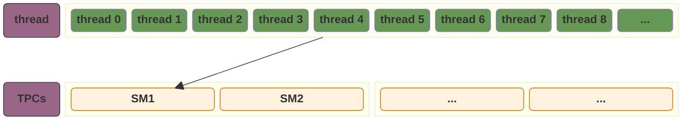

我们的目标是，将我们的 TPCs 都充分的利用起来：**GPU调度线程以 warp 为单位，所以我们最好的选择是，每个 block 分配足量的线程，让我们的 256 个线程拆分到不同的 block，这样我们整个的计算既可以最大化的利用 warp，又可以充分的利用我们的TPCs：**

- `warp` 32 是warp执行的最小原子，所以我们的 warp 数量一定要是 32 的整数倍；
- 一个 SM 不止可以跑一个 warp，这和CPU编程完全不一样。在CPU编程中，由于CPU的核寄存器数量极少所以在进行上下文切换时开销很大，最好的策略不要分配过多的线程导致过多的上下文切换。而在GPU编程中，GPU的寄存器数量远超CPU，所以线程的切换不仅开销很低，更可以充分的利用GPU的寄存器组来避免VRAM读取时的线程挂起，从而达到更大的吞吐量。

所以我们的最佳策略是：

1. 分配足量的 `blocks`，确保每个 SM 都能承载计算；
2. 每个 `block` 中还需要分配足量的 `threads` ，确保我们分配到每个 SM 的 warp 可以尽可能的利用GPU的寄存器组。

可以我们以我的显卡 `4060 TI`（有34个SM） 为例子，将这个策略转换为我们的公式：

$$TotalThreads = \underbrace{SM\_Count}_{34} \times \underbrace{Blocks\_per\_SM}_{2 \sim 4} \times \underbrace{Threads\_per\_Block}_{128 \sim 256}$$

注意，这里我们会发现有一个额外的参数 $\underbrace{Blocks\_per\_SM}_{2 \sim 4}$ ，这个参数并不是显式的声明的，而是通过 `GridSize` 的设置“推导”出来的。当我们的代码中指定 `add<<<GridSize, BlockSize>>>` 时，硬件的分配逻辑如下：

$$\text{Blocks\_per\_SM} = \frac{\text{GridSize}}{\text{SM\_Count}}$$

那么，我们现在优化后的思路就需要有如下的分配逻辑了：

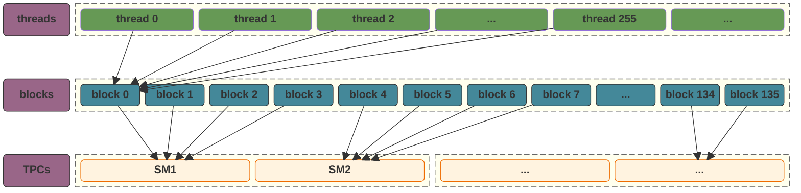

> **此外，在我们增加了 `blocks` 之后，我们又回到之前的那个问题：怎么样合理的安排循环才可以尽可能的利用我们的 `Memory Controller` 的并行读取能力？**
>
>  还是那句话，GPU以 `warp` 为单位对线程进行调度，并且在同一个 `warp` 中，线程的执行是并行的 -- 也就是说，**我们希望每次 `warp` 执行时，所有的线程需要的数据在内存的同一片区域。**那么，我们每个线程应该负责的索引如下：
>
> 1. **`tid` (Global Thread ID)**: $blockIdx.x \times blockDim.x + threadIdx.x$
> 2. **`stride` (Total Grid Size)**: $gridDim.x \times blockDim.x$

## 优化后的代码

| 指标             | `add<<<1, 1>>>` | `add_stride<<<1, 256>>>` | add_parallel<<<136, 256>>> |
| ---------------- | --------------- | ------------------------ | -------------------------- |
| Kernels & Memory | `89.0%`/`11.0%` | `14.5%`/`85.5%`          | `1.0%`/`99.0%`             |
| Kernal执行时间   | 4984ms          | 104ms                    | 6ms                        |
| CUDA memcpy DtoH | 409ms           | 456ms                    | 386ms                      |
| CUDA memcpy HtoD | 134ms           | 137ms                    | 131ms                      |

# 第三次优化（Pinned Memory）

现在，我们的程序核心总耗时为：

$$131\text{ms (HtoD)} + 6\text{ms (Kernel)} + 386\text{ms (DtoH)} \approx 523\text{ms}$$

我们整个程序的性能瓶颈已经完全在 `PCIe` 的数据传输上，**我们的思路应该从“优化计算”到“优化搬运”**：

1. **引入“锁页内存”（Pinned Memory）**：我们现在使用的是标准的 `malloc`。如果我们改用 `cudaMallocHost`，可以跳过 CPU 的中转缓冲区，让 PCIe 搬运速度直接翻倍。
2. **引入“异步流”（CUDA Streams）**：现在的程序执行是：`DtoH(x) -> DtoH(y) -> DtoH(r) -> add -> HtoD(r)`，我们可以参考CPU的流水线改成 `DtoH`/`add`/`HtoD` 并行的模式，也就是读到数据就开始算，算完结果就开始写。

这里，我们先尝试使用锁页内存。

## 优化后的代码

我们通过 `cudaMallocHost` 和 `cudaFreeHost` 来管理我们的锁页内存：注意，**`cudaMallocHost` 只是把 CPU 端的内存“锁”在了物理内存中，防止它被操作系统交换到硬盘（Page Out），我们仍然需要调用 `cudaMemcpy` 来将数据移动到显存**。而之所以使用锁页内存比普通内存更快的原因是：

当我们使用普通内存（Pageable Memory）时，CUDA 驱动程序其实偷偷做了两步：：

1. **内部拷贝**：驱动程序先将数据从“普通内存”拷贝到一块**隐藏的锁页内存缓存区**中。
2. **DMA 传输**：硬件（DMA 控制器）再将这块隐藏区域的数据通过 PCIe 总线传给 GPU。

当我们使用锁页内存（Pinned Memory）时，由于内存已经“锁死”在物理地址上，不会被系统移动：

1. **直接传输**：GPU 的 DMA 控制器可以直接访问这块内存地址，**跳过 CPU 中转**。

```c++ mark:32-36,39,40
#include <iostream>
#include <stdio.h>
#include <stdlib.h>
#include <chrono>
#include <cuda_runtime.h>

__global__ void add_parallel(float* x, float* y , float* r, int n) {
    int index = blockDim.x * blockIdx.x + threadIdx.x;
    int stride = blockDim.x * gridDim.x;

    for (int i = index; i < n; i += stride) {
        *(r + i) += *(x + i) + *(y + i);
    }
}

void call_add() {
    int n = 100000000;
    int mem_size = sizeof(float) * n;

    float *x, *y, *r;
    cudaMallocHost((void**)&x, mem_size);
    cudaMallocHost((void**)&y, mem_size);
    cudaMallocHost((void**)&r, mem_size);

    for (int i = 0; i < n; ++i) {
        *(x + i) = 1;
        *(y + i) = 2;
        *(r + i) = 0;
    }

    float *d_x, *d_y, *d_r;
    cudaMalloc((void**)&d_x, mem_size);
    cudaMalloc((void**)&d_y, mem_size);
    cudaMalloc((void**)&d_r, mem_size);
    cudaMemcpy(d_x, x, mem_size, cudaMemcpyHostToDevice);
    cudaMemcpy(d_y, y, mem_size, cudaMemcpyHostToDevice);

    add_parallel<<<136, 256>>>(d_x, d_y, d_r, n);
    cudaDeviceSynchronize();
    cudaMemcpy(r, d_r, mem_size, cudaMemcpyDeviceToHost);

    int count = 0;
    for (int i = 0; i < n; ++i) {
        if (*(r + i) != 3) {
            count++;
        }
    }

    if (count != 0) {
        printf("Total errors: %d\n", count);
    }

    cudaFreeHost(r);
    cudaFreeHost(y);
    cudaFreeHost(x);
    cudaFree(d_r);
    cudaFree(d_y);
    cudaFree(d_x);
}

int main(int argc, char const *argv[])
{
    auto start = std::chrono::high_resolution_clock::now();
    call_add();
    auto end = std::chrono::high_resolution_clock::now();
    std::chrono::duration<double, std::milli> elapsed = end - start;
    printf("Execution time: %f ms\n", elapsed.count());
    return 0;
}
```

## 性能指标

| 指标             | `add<<<1, 1>>>` | `add_stride<<<1, 256>>>` | add_parallel<<<136, 256>>> | 锁页内存       |
| ---------------- | --------------- | ------------------------ | -------------------------- | -------------- |
| Kernels & Memory | `89.0%`/`11.0%` | `14.5%`/`85.5%`          | `1.0%`/`99.0%`             | `6.2%`/`93.8%` |
| Kernal执行时间   | 4984ms          | 104ms                    | 6ms                        | 6ms            |
| CUDA memcpy DtoH | 409ms           | 456ms                    | 386ms                      | 61ms           |
| CUDA memcpy HtoD | 134ms           | 137ms                    | 131ms                      | 30ms           |

# 第四次优化（Overlap）

## Overlap的原理和限制

在经过我们一系列的优化之后，我们的计算逻辑已经被优化很多了，现在我们本次教程的最后一次优化逻辑是：**使用流水线模式来优化我们的计算。**

我们目前的计算逻辑是：

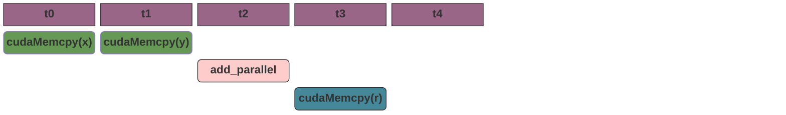


而在我们的GPU中：

- 由于 `cudaMemcpy(x)` 和 `cudataMemcpy(y)` 共享 PCIe 总线，所以他们只能串行执行；
- 但是 `cudaMemcpy` 和 `SM计算` 则可以实现真正的并行，就像我们CPU的流水线；

最优的执行逻辑应该是如下所示：

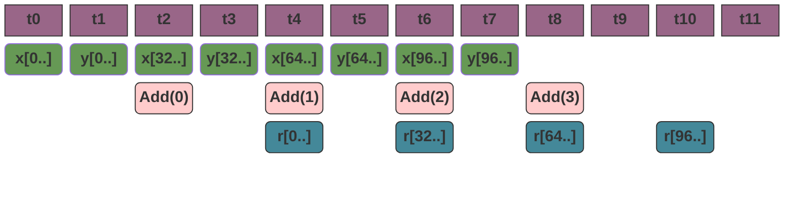

这种流水线的优化存在一些限制和特点：

1. `PCIe` 是一个全双工的总线，所以可以看到在 `t4` 时刻，我们的读数据，计算数据，写输出是并行执行的；
2. **只能使用 Pinned Memory**，**如果使用普通 `malloc` 的内存，`cudaMemcpyAsync` 会退化为同步传输。** 因为 DMA 只有在锁页内存上才能保证在 CPU 继续运行的同时，安全地自主搬运。
3. `cudaMemcpyAsync` 是异步调用函数，它将传输任务排队进指定的 `stream` 中，在调用中立即返回；而在计算时也需要从流中去读取数据；我们使用 `cudaMemcpyAsync(x, stream[i])` he  ``add_parallel<<<..., stream[i]>>>(x)`` 来实现这个逻辑 -- 所以，**流（Stream）本身就是一个硬件级的 FIFO（先入先出）队列**。
4. 只能优化 `IO Bound` 的应用，考虑一下场景：
   - `IO Bound`：我们读和写IO需要100ms，计算需要10ms；优化前后所需的时间分别是 210ms 和 100ms；
   - `Compute Bound`：我们读和写IO需要10ms，计算需要100ms；优化前后所需的时间分别是 120ms 和 100ms；
5. 在引入并行后的时间通常取决于系统中最慢的逻辑：$Total \approx \max(T_{h2d}, T_{compute}, T_{d2h})$；

## 优化后的代码

使用 `stream` 优化的代码逻辑流程如下：

1. 初始化 `hostMemory` 和 `deviceMemory`；
2. 初始化 `start` 和 `stop` 时间，这个是我们用来记录 CUDA 的真正执行时间的；
3. 初始化 `streams`，这里需要注意的是，如果我们要真正的使用CUDA的并行能力，那么我们就不能只创建一个 `stream`，而需要创建一个 `stream[]`。在 CUDA 中，如果不指定 Stream，所有的操作都会进入**默认流（Default Stream）**。默认流是一个同步流，它遵循严格的“串行”逻辑，也就是说，我们生命单个流的话，我们的执行方式其实和不使用流是完全一样的：
   - **任务 A (Memcpy)** 没做完，**任务 B (Kernel)** 就绝对不会开始。
   - **第 0 块数据**没处理完，**第 1 块数据**的指令甚至不会被下发。
4. 根据流的数据量，将我们的数据拆分为多个块。在我们的例子中，我们使用4个stream，那么每个stream负责的应该是 `[0, 25m)`/`[25m, 50m)`/`[50m, 75m)`/`[75m, 100m)`；我们使用 `cudaMemcpyAsync` 将这四个块复制到 `stream` 中；
5. 根据我们的参数，让每个线程负责自己所在区域的值的计算：
   - 每个 `block` 负责的区域应该为：$[N / TotalBlockCount \times BlockId, min((N / TotalBlockCount) \times (BlockId + 1), N)$；
   - 在 `block` 内部，以 `BlockThreadCount` 作为 `stride`，让线程在调度时负责自己区域的 ${threadId, threadId + BlockThreadCount, ...}$ 的集合，以便于 `warp` 在并行执行时可以一次总线访问拿到足量数据；
   - 那 $TotaolBlockCount$ 应该设置多少呢？这里我们需要先理清 `block` 的含义：`block` 为一个逻辑概念，它只是指的是数据被拆分为多少个块，每个块启动多少线程去处理这个块里面的数据。在排队中的 `block` 并不会像 `thread` 一样占据实体资源，也就是 `block` 的数量并不会像 `thread` 数量一样，设置过大的指会影响任务执行速度。相反，由于SM处理速度远超VRAM访问，所以我们正确的策略是让一个SM负责多个 `block`。**那么，对于每个 stream，我们可以设置 TotalBlockCount 为 $(streamSize + threadsPerBlock- 1) / threadsPerBlock$**；
   - 现在，我们可以使用我们的这些参数加上 `stream` 来计算我们的结果了 `add_parallel<<<blocksPerGrid, threadsPerBlock, 0, streams[i]>>>(ctx.d_x + offset, ctx.d_y + offset, ctx.d_r + offset, streamSize);`。这里每个 `stream` 对应一个 `add_parallel()`，函数中我们会发现，我们只做一件事 `r[i] = x[i] + y[i];`，其中 `i = blockIdx.x * blockDim.x + threadIdx.x;`。这里我们的 `block` 一直在流转调度。
6. 复制数据到 host。

```c++ mark:26-45
#include <iostream>
#include <vector>
#include <cuda_runtime.h>

__global__ void add_parallel(const float* x, const float* y, float* r, int n) {
    int i = blockIdx.x * blockDim.x + threadIdx.x;
    if (i < n) {
        r[i] = x[i] + y[i];
    }
}

// ...

int main() {
    const int N = 100000000;
    const size_t total_bytes = N * sizeof(float);

    add_ctx_t ctx = init_add_ctx(N, total_bytes);


    cudaEvent_t start, stop;
    cudaEventCreate(&start);
    cudaEventCreate(&stop);
    cudaEventRecord(start);

    const int nStreams = 4;
    const int streamSize = N / nStreams;
    const size_t streamBytes = streamSize * sizeof(float);
    cudaStream_t streams[nStreams];
    for (int i = 0; i < nStreams; i++) {
        cudaStreamCreate(&streams[i]);
    }
    for (int i = 0; i < nStreams; i++) {
        int offset = i * streamSize;

        cudaMemcpyAsync(ctx.d_x + offset, ctx.h_x + offset, streamBytes, cudaMemcpyHostToDevice, streams[i]);
        cudaMemcpyAsync(ctx.d_y + offset, ctx.h_y + offset, streamBytes, cudaMemcpyHostToDevice, streams[i]);

        int threadsPerBlock = 256;
        int blocksPerGrid = (streamSize + threadsPerBlock - 1) / threadsPerBlock;
        std::cout << "blocksPerGrid: " << blocksPerGrid << std::endl;
        add_parallel<<<blocksPerGrid, threadsPerBlock, 0, streams[i]>>>(ctx.d_x + offset, ctx.d_y + offset, ctx.d_r + offset, streamSize);

        cudaMemcpyAsync(ctx.h_r + offset, ctx.d_r + offset, streamBytes, cudaMemcpyDeviceToHost, streams[i]);
    }

    cudaEventRecord(stop);
    cudaEventSynchronize(stop);
    cudaDeviceSynchronize();

    int count = 0;
    for (int i = 0; i < N; ++i) {
        if (*(ctx.h_r + i) != 3) {
            count++;
        }
    }

    if (count != 0) {
        std::cout << "Error count : " << count << std::endl;
    }

    float milliseconds = 0;
    cudaEventElapsedTime(&milliseconds, start, stop);
    std::cout << "Pipeline Execution Time (GPU Hardware): " << milliseconds << " ms" << std::endl;

    for (int i = 0; i < nStreams; i++) {
        cudaStreamDestroy(streams[i]);
    }
    destroy_add_ctx(ctx);
    cudaEventDestroy(start); cudaEventDestroy(stop);

    return 0;
}
```

## 性能指标

| 指标             | `add<<<1, 1>>>` | `add_stride<<<1, 256>>>` | add_parallel<<<136, 256>>> | 锁页内存       | async          |
| ---------------- | --------------- | ------------------------ | -------------------------- | -------------- | -------------- |
| Kernels & Memory | `89.0%`/`11.0%` | `14.5%`/`85.5%`          | `1.0%`/`99.0%`             | `6.2%`/`93.8%` | `5.0%`/`95.0%` |
| Kernal执行时间   | 4984ms          | 104ms                    | 6ms                        | 6ms            | 4ms            |
| CUDA memcpy DtoH | 409ms           | 456ms                    | 386ms                      | 61ms           | 61ms           |
| CUDA memcpy HtoD | 134ms           | 137ms                    | 131ms                      | 30ms           | 30ms           |

虽然从性能指标上，没有看到有明显的提升，但是如果我们打开 `nsys` 的图，我们会发现现在已经是多个 `stream` 并行执行了：


# CUDA的二维计算

CUDA 的维度设计（1D, 2D, 3D）本质上是提供了一套**内置的坐标换算器**。虽然 GPU 的内存空间在物理上永远是一维（线性）的地址，但现实世界中的数据往往是多维的。

## 维度层级：从点到体

CUDA 使用 `dim3` 结构体来定义维度。如果我们不显式定义 `y` 和 `z`，它们默认就是 1。

| **维度** | **逻辑抽象** | **典型应用场景**            | **定义方式 (示例)**      |
| -------- | ------------ | --------------------------- | ------------------------ |
| **1D**   | 向量 / 数组  | 向量加法、数据转换          | `dim3 block(256, 1, 1);` |
| **2D**   | 矩阵 / 图像  | 照片滤镜、矩阵乘法          | `dim3 block(16, 16, 1);` |
| **3D**   | 体素 / 空间  | 气象模拟、CT 影像、流体力学 | `dim3 block(8, 8, 8);`   |

## 为什么需要映射

在 `kernel` 内部，我们会得到两组坐标：

- `blockIdx` 我们的在哪个块；
- `threadIdx` 我们在块里哪个位置；

## Matrix Transpose

> 给定一个二维矩阵 `in`，我们需要对矩阵进行转置：把坐标 $(x, y)$ 变成 $(y, x)$

首先，我们需要清楚一个定义是：**内存里没有真正的 `二维数组`，它永远是一维线性排列的**，例如假设我们声明一个 $2 \times 3$ 的矩阵：

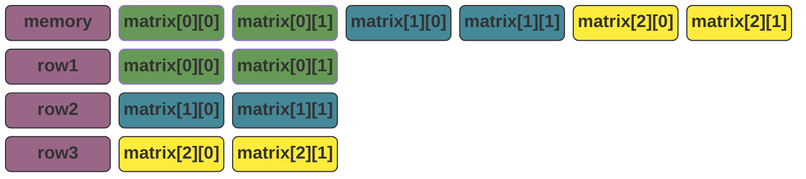

按照我们在 [第四次优化](#第四次优化) 中的代码逻辑：

1. 将这个矩阵分成多个 `block` 以便于我们可以并行的执行；
2. 为每个 `block` 分配合理的 `threads` 以便于可以最大化的利用GPU的并行能力；
3. **每个核函数只处理它所在的 `block` 和 `thread` 应该负责的点，通过 `block` 的调度来处理整个矩阵。**
4. 那么我们调用核函数 `transpose_kernel<<<blocks, threads>>>` ，此时我们会面临一个问题，**当前线程只知道 blockId 和 threadId，而处理矩阵需要的是当前元素在矩阵中的 `row` 和 `column`。**我们可以去计算这个值，公式并不复杂：`row = (blockId * blocksPerBlock + threadId) / width`，`column = (blockId * blocksPerBlock + threadId) % width`，但是使得程序不直观，并且引入极大的额外开销（整数除法和取模是非常“昂贵”的操作，它们需要消耗数十个时钟周期）。所以 CUDA 引入了 `dim3 grid(x, y)` 来对这个逻辑进行抽象。
5. 在引入 `dim3` 之后，我们可以通过更便捷的方式来访问我们的矩阵：
   - `x = blockIdx.x * blockDim.x + threadIdx.x;`
   - `y = blockIdx.y * blockDim.y + threadIdx.y;`
6. 此时，我们的核函数就会存在如下调用形式 `transpose_kernel<<<grid, block>>>`，其中 `grid` 和 `block` 都是 `dim3` 矩阵，当我们调用 `transpose_kernel<<<grid, block>>>` 时，我们通过 `dim3` 将原本一维的索引空间**‘重塑’（Reshape）**成了多维的坐标系。此时，**Grid** 不再是一条长线，而是一个由多个 Block 组成的**网格阵列**；每个 **Block** 内部也不再是简单的序号，而是一群拥有 `(x, y)` 坐标的**线程矩阵**。

### 分割一个矩阵的思路

我们可以这样理解 CUDA 的多维处理逻辑：

#### 物理本质：一维的长阵

首先必须明确：内存中不存在真正的二维矩阵，它在物理上是一个**超长的线性数组**。如果我们要处理一个宽度为 `w`、高度为 `h` 的矩阵，在显存里它就是一段连续的、长度为 `w * h` 的空间。

#### 逻辑重塑

在之前的一维处理逻辑中，如果我们决定使用 256 个线程作为一个 **Block**（线程块），那么所需的 Block 数量就是 `(w * h + 255) / 256`。此时核函数的启动方式为：

```
transpose<<<(w * h + 255) / 256, 256>>>
```

这种方式虽然可行，但在处理二维矩阵数据时，我们需要在核函数内部进行大量代价高昂的**除法（`/`）和取余（`%`）**操作来反推行列坐标，这会严重拖累 GPU 性能。

#### 二级矩阵（Block）：最小分配单元

为了优化逻辑，CUDA 引入了 `dim3` 结构。我们仍然维持每个 Block 包含 256 个线程，但将其重塑为一个 **$16 \times 16$ 的二级矩阵**：

```
dim3 block(16, 16);
```

此时，这 256 个线程中的每一个都对应这个二级矩阵中的一个点。CUDA 会自动为每个线程生成内置变量 **`threadIdx.x`** 和 **`threadIdx.y`**，用来表示该线程在小组内部的坐标。这个“线程方阵”是 GPU 调度的最小单元，会被整体绑定到 SM（流式多处理器）上执行。

#### 一级矩阵（Grid）：全局任务划分

接着，我们将整个大矩阵按照这个 $16 \times 16$ 的尺寸进行切割。我们不再计算总数，而是分别计算横向和纵向需要多少个 Block：

- **水平方向（列数）所需 Block 数**：`grid_x = (w + block.x - 1) / block.x;`
- **垂直方向（行数）所需 Block 数**：`grid_y = (h + block.y - 1) / block.y;`

这就构成了 **一级矩阵（Grid）**：

```
dim3 grid(grid_x, grid_y);
```

此时，我们的核函数调用变为：

```
transpose<<<grid, block>>>;
```

#### 坐标合成与索引还原

现在的任务被我们划分成了：**一个由 Block 组成的大矩阵，而每个 Block 内部又是一个由 Thread 组成的子矩阵。**

在核函数执行时，定位过程如下：

1. **一级定位**：通过 **`blockIdx.x`** 和 **`blockIdx.y`** 找到当前线程所属的“一级矩阵”（Block）在大网格中的位置。
2. **二级定位**：通过 **`threadIdx.x`** 和 **`threadIdx.y`** 找到当前线程在“二级矩阵”（小组）内部的精确坐标。
3. **合成全局坐标**：
   - `element_x = blockIdx.x * blockDim.x + threadIdx.x;`
   - `element_y = blockIdx.y * blockDim.y + threadIdx.y;`

最后，通过这两个逻辑坐标，我们就能避开复杂的算术运算，直接计算出元素在物理数组中的实际索引，从而完成高效的数据处理。

### 矩阵分割的实例

假设，我们存在一个 `7 * 7` 的矩阵，我们现在需要使用我们的矩阵分割逻辑来处理这个矩阵，我们使用 `2 * 2` 的线程矩阵来对它进行第一次分割：

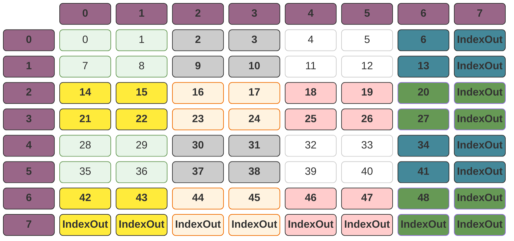

随后，我们使用 `grid` 来对我们的线性矩阵进行一次分割：

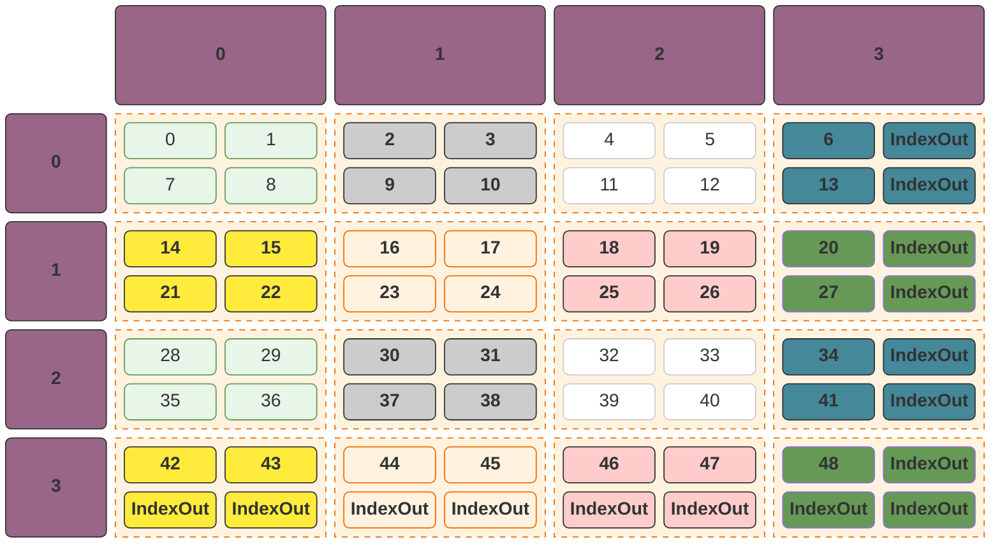

现在，对于任意一个节点，我们都可以知道：

- `x = blockIdx.x * blockDim.x + threadIdx.x`
- `y = blockId.y * blockDim.y + threadIdx.y`
- 例如对于 `9`，它的实际索引是 `(1, 2)` = `(0 * 2 + 1, 1 * 2 + 0)`
- 而它的的在内存的实际索引也可以通过 `x * width + y` 计算

## 最后代码

```c++
__global__ void transpose_kernel(float *out, const float *in, int width, int height)
{
    int x = blockIdx.x * blockDim.x + threadIdx.x;
    int y = blockIdx.y * blockDim.y + threadIdx.y;

    if (x < width && y < height)
    {
        out[x * height + y] = in[y * width + x];
    }
}

int main(int argc, char const *argv[])
{
    int nx = 1024;
    int ny = 512;
    size_t total_bytes = nx * ny * sizeof(int);
    float *h_in, *h_out;
    cudaHostAlloc(&h_in, total_bytes, cudaHostAllocDefault);
    cudaHostAlloc(&h_out, total_bytes, cudaHostAllocDefault);
    for (int i = 0; i < nx * ny; i++) {
        h_in[i] = i;
        h_out[i] = 0;
    }

    dim3 block(16, 16);
    dim3 grid((nx + block.x - 1) / block.x, (ny + block.y - 1) / block.y);

    float *d_in;
    float *d_out;
    cudaMalloc(&d_in, total_bytes);
    cudaMalloc(&d_out, total_bytes);
    cudaMemcpy(d_in, h_in, total_bytes, cudaMemcpyHostToDevice);
    transpose_kernel<<<grid, block>>>(d_out, d_in, nx, ny);
    cudaMemcpy(h_out, d_out, total_bytes, cudaMemcpyDeviceToHost);
    int errorCount = 0;
    for (int r = 0; r < ny; r++) {
        for (int c = 0; c < nx; c++) {
            int index_in = r * nx + c;
            int index_out = c * ny + r;
            if (h_in[index_in] != h_out[index_out]) {
                errorCount++;
            }
        }
    }
    if (errorCount > 0) {
        std::cout << "error count: " << errorCount << std::endl;
    }
    return 0;
}
```

# 使用SharedMemory优化矩阵转置

在我们的矩阵转置实现中，我们很容易发现有个严重拉低我们性能的点，那就是我们在数据读取时是合并访问的，**然而我们数据在输出时，因为我们已经不是合并输出的了。**

这里，我们需要先理清楚一个逻辑：参考 [矩阵分割的实例](#矩阵分割的实例) 中的描述，如果CUDA在调度时以 `block` 作为块输入，那么我们的第一个 `block` 应该是 `{0, 1, 7, 8}` -- 这是否意味着我们的输入也没有合并输入呢？答案是：**CUDA 既抽象了矩阵逻辑，又严格按照线程束（Warp）的线性顺序执行。**

在我们这个为了演示的例子中，我们的这个 `block` 中：

- `{0, 1}` 是合并访问的， `{7, 8}` 也是合并访问的；
- `{0, 1}` 和 `{7, 8}`  则是不合并访问的。

但是这个逻辑很好解决，我们只需要优化我们的核函数的参数到 `<<<32, y, z>>>` 即可。现在我们需要使用 `SharedMemory` 来优化我们的写入。

## 为什么会出现不能合并访问的问题

假设原矩阵是 $A$，转置后的矩阵是 $B$。根据定义，如果 $A$ 中的一个点坐标是 $(Global\_X, Global\_Y)$，那么它在 $B$ 中的位置必须是 $(Global\_Y, Global\_X)$。

在读取阶段，一个线程处理的原始全局坐标是：

- $Global\_X_{in} = blockIdx.x \times blockDim.x + threadIdx.x$
- $Global\_Y_{in} = blockIdx.y \times blockDim.y + threadIdx.y$

我们要把这个点搬到新矩阵 $B$ 的对称位置：

- $Global\_X_{out} = Global\_Y_{in}$
- $Global\_Y_{out} = Global\_X_{in}$

如果我们直接代入，会得到：

- $Global\_X_{out} = blockIdx.y \times blockDim.y + \mathbf{threadIdx.y}$
- $Global\_Y_{out} = blockIdx.x \times blockDim.x + \mathbf{threadIdx.x}$

**此时，问题出现，我们没有办法合并访问了：**

-  通常，为了能够合并访问，我们的每个 warp 会处理 block 中的同一行，而矩阵中的同一行的特点是：`y` 不变，`x` 递增；
- **而我们的 $Global\_Y_{out}$ 依赖于 `x`，这表示我们出现了行偏移，也就说我们的全局地址将不再连续。**

解决方案是：**我们变化的只能是 $Global\_X_{out}$，只有这样才能保证我们的全局地址连续以便于我们可以合并访问**。这个逻辑很好理解，因为全局地址是 $y * width + x$，任意的 `y` 变化都会使得我们的索引直接偏移出一次 Memory Burst 的可读范围。**无论逻辑上我们在算什么，我们必须强行分配任务，让 `threadIdx.x` 永远与地址计算公式中权重最小的那个项绑定。**这个结论及时扩展到三维一样成立，因为三维的空间中，全局索引等于 $z * width * height + y * width + x$。

## 如何处理合并访问异常

正如我们前面提到的，在任何计算中，`threadIdx.x` 永远与地址计算公式中权重最小的那个项绑定，也就是，我们要通过某种方式，将我们的公式转换为：

- $Global\_X_{out} = blockIdx.y \times blockDim.y + \mathbf{threadIdx.x}$
- $Global\_Y_{out} = blockIdx.x \times blockDim.x + \mathbf{threadIdx.y}$

而这个逻辑实现并不复杂，我们知道，我们是矩阵嵌套，而外层的矩阵对应的是 `block`，它的先后执行顺序对我们的结果和性能不会有影响。我们只需要预先将内层矩阵进行一次矩阵转置，此时我们便可以将我们的索引绑定到 `threadIdx.x`。

## 实际代码

```c++
__global__ void transpose_tiled_kernel(float *out, const float *in, int width, int height)
{
    __shared__ float tile[32][32];
    int x = blockIdx.x * blockDim.x + threadIdx.x;
    int y = blockIdx.y * blockDim.y + threadIdx.y;
    if (x < width && y < height) {
        tile[threadIdx.y][threadIdx.x] = in[y * width + x];
    }
    __syncthreads();
    // Assuming that we have a 4 * 4 matrix, the matrix is:
    // 0 1 2 3
    // 4 5 6 7
    // 8 9 a b
    // c d e f
    // Assuming that we're running block 0, so the tile will be :
    // 0 4
    // 1 5
    // Now the submatrix is updated in shared memory, what we have to do now is to update the value in current block to the new block.
    int new_x = blockIdx.y * blockDim.y+ threadIdx.x;
    int new_y = blockIdx.x * blockDim.x + threadIdx.y;
    out[new_y * height + new_x] = tile[threadIdx.x][threadIdx.y];
}
```

## SharedMemory下的矩阵转换实例

> 假设一次 `Memory Burst` 读取到的是两个 `float`。

我们的初始矩阵如下，我们读取时是可以合并访问的，因为 `block` 中的每行的全局索引中是连续的：

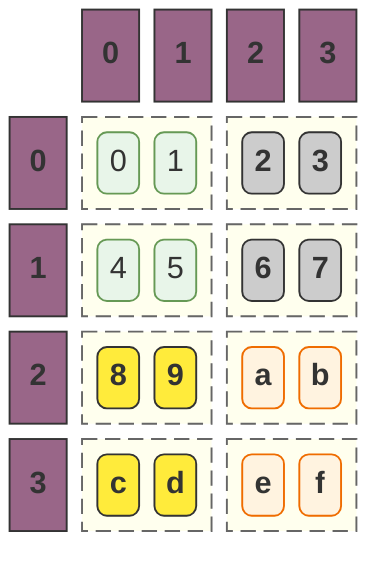

如果我们直接在 `block`的线程中使用矩阵转置，我们每次的写入都相当于是一次随机的内存访问，并不能实现合并访问：

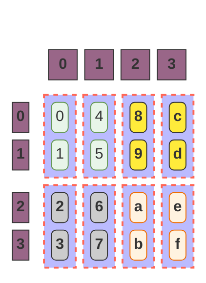


我们使用`Shared Memory`  将内部矩阵转置，那么我们得到，**Shared Memory 并没有需要合并写入的需求**：

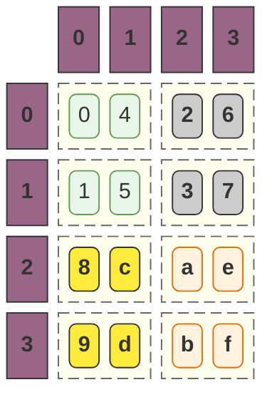

随后，我们再转置外层的矩阵得到：

```mermaid
block-beta

columns 5

space:1 c0["0"] c1["1"] c2["2"] c3["3"]
r0["0"]
block:s1:2
    0("0") 1("4")
end
block:s5:2
    8("8") 9("c")
end
r1["1"]
block:s3:2
    4("1") 5("5")
end

block:s7:2
    c("9") d("d")
end
r2["2"]
block:s2:2
    2("2") 3("6")
end

block:s6:2
    a("a") b("e")
end
r3["3"]

block:s4:2
    6("3") 7("7")
end
block:s8:2
    e("b") f("f")
end

class c0,c1,c2,c3,r0,r1,r2,r3 purple

class 0,1,4,5 light_green
class 2,3,6,7 gray
class 8,9,c,d yellow
class a,b,e,f orange

class s1,s2,s3,s4,s5,s6,s7,s8 animate

%% 样式定义
classDef content fill:#fff,stroke:#ccc;
classDef animate stroke:#666,stroke-dasharray: 8 4,stroke-dashoffset: 900,animation: dash 20s linear infinite;
classDef yellow fill:#FFEB3B,stroke:#333,color:#000,font-weight:bold;
classDef blue fill:#489,stroke:#333,color:#fff,font-weight:bold;
classDef pink fill:#FFCCCC,stroke:#333,color:#333,font-weight:bold;
classDef light_green fill:#e8f5e9,stroke:#695;
classDef green fill:#695,color:#fff,font-weight:bold;
classDef purple fill:#968,stroke:#333,color:#fff,font-weight:bold;
classDef gray fill:#ccc,stroke:#333,font-weight:bold;
classDef error fill:#bbf,stroke:#f65,stroke-width:2px,color:#fff,stroke-dasharray: 5 5;
classDef coral fill:#f8f,stroke:#333,stroke-width:4px;
classDef orange fill:#fff3e0,stroke:#ef6c00,color:#ef6c00,font-weight:bold;
```

## 优化性能对比

可以看到：

- 我们的合并访问版本比非合并访问版本，核函数执行速度提升了接近30%；
- 无论我们如何优化内核，这两个数值几乎是不动的，而这个指标非常大，说明我们的程序瓶颈在 **PCIe 硬件**。内核优化虽然能把 21ms 缩减到 15ms，但对于 328ms 的搬运来说，用户体感不明显。：
  - `[CUDA memcpy Host-to-Device]`：约 **166 ms**
  - `[CUDA memcpy Device-to-Host]`：约 **162 ms**

| 指标              | shared memory | 无shared memory |
| ----------------- | ------------- | --------------- |
| cuda_gpu_kern_sum | 21ms          | 30ms            |
| CUDA memcpy DtoH  | 166ms         | 166ms           |
| CUDA memcpy HtoD  | 162ms         | 162ms           |

# SGEMM 

> `SGEMM` 表示 **S**ingle-precision **GE**neral **M**atrix **M**ultiply （**单精度通用矩阵乘法**）。
>
> 它是 **BLAS**（Basic Linear Algebra Subprograms，基础线性代数子程序库）标准中的核心函数。简单来说，它实现的就是最基本的数学运算：
>
> $$C = \alpha (A \times B) + \beta C$$
>
> （在大多数简单的 CUDA 练习中，通常令 $\alpha = 1, \beta = 0$，即简化的 $C = A \times B$），我们这里来实现这个简化的版本。

## SGEMM的工具函数

为了方便，我们直接在这里将 `SGEMM` 抽象出来多个函数，为我们执行资源管理：

```c++ mark:91-108
#include <util.cuh>

struct host_sgemm_t
{
    float *A;
    float *B;
    float *C;
    int M;
    int N;
    int K;
};

struct device_sgemm_t
{
    float *A;
    float *B;
    float *C;
    int M;
    int N;
    int K;
};

inline bool is_nearly_equal(float a, float b)
{
    float diff = fabsf(a - b);
    a = fabsf(a);
    b = fabsf(b);
    float max_val = (a > b) ? a : b;

    if (max_val < 1e-6f)
        return true;
    return (diff / max_val) < 1e-4f;
}

host_sgemm_t *allocate_host(const int M, const int N, const int K);
void free_host(host_sgemm_t *h_sgemm);
device_sgemm_t *allocate_device(const int M, const int N, const int K);
void free_device(device_sgemm_t *d_sgemm_handler);
void memcpy_host_to_device(device_sgemm_t *d_sgemm, host_sgemm_t *h_sgemm);
void memcpy_device_to_host(host_sgemm_t *h_sgemm, device_sgemm_t *d_sgemm);
void init_matrix(host_sgemm_t *h_sgemm);
float get_theoretical_result(int i, int j, int K);
void verify_result(host_sgemm_t *h_sgemm);
void launch_sgemm_kernel(const device_sgemm_t *d_sgemm);
void run(const int M, const int N, const int K);
```

这里，我们唯一需要注意的是，我们按照如下方式初始化我们的 `A` 和 `B`：

- $A[i][j] = i + j;$
- $B[i][j] = i - j;$

这是为了避免，编译器在编译的过程中对我们的数据逻辑进行优化，更好的模拟真正的线上数据。

## SGEMM 的结果验证

我们需要计算：$$C[i][j] = \sum_{k=0}^{K-1} (i + k)(k - j)$$

展开括号内的项：$$(i + k)(k - j) = k^2 + (i - j)k - ij$$

利用求和符号的线性性质，将其拆分为三个部分：$$C[i][j] = \sum_{k=0}^{K-1} k^2 + (i - j) \sum_{k=0}^{K-1} k - \sum_{k=0}^{K-1} ij$$

根据标准的数列求和公式：

1. 平方和：$\sum_{k=0}^{K-1} k^2 = \frac{(K-1)K(2K-1)}{6}$
1. 等差数列求和：$\sum_{k=0}^{K-1} k = \frac{(K-1)K}{2}$
1. 常数项求和：$\sum_{k=0}^{K-1} ij = K \cdot i \cdot j$

将上述公式代入并整理，得到 $C[i][j]$ 的解析式：$$C[i][j] = \frac{K(K-1)(2K-1)}{6} + (i - j) \frac{K(K-1)}{2} - Kij$$ 

```c++
float get_theoretical_result(int i, int j, int K)
{
    double k_double = (double)K;
    double term1 = (k_double * (k_double - 1.0f) * (2.0f * k_double - 1.0f)) / 6.0f;
    double term2 = (double)(i - j) * (k_double * (k_double - 1.0f)) / 2.0f;
    double term3 = k_double * i * j;

    return (float)(term1 + term2 - term3);
}
```

## Naive SGEMM

一个 $M \times K$ 的矩阵乘以一个 $K \times N$ 的矩阵会得到一个 $M \times N$ 的矩阵，我们将最终的矩阵拆分为对应数量的 $32 \times 8$ 的 `block`，随后每个 block 负责计算最终的矩阵中的点：$(row, col)$，我们当前的实现也存在相当多的优化点：

- 对于结果矩阵的第 $R$ 行，它的元素 `[R[0], R[M])`，每一次计算都需要用到 $M \times K$ 矩阵的第 $R$ 行，我们目前的计算中，每次都是从显存中读取，我们是否可以通过合理的 `block` 安排，让计算第 $R$ 行的 `block` 绑定到同一个 `SM`。这样我们在计算的过程中，就可以将 $A[R]$ 存放到 Shared Memory 中来提升性能。

在 $M \times N$ 的计算任务中，假设我们使用大小为 $(32, 1)$ 的线程块（Block），即每个 Block 负责结果矩阵 $C$ 中的一行（或其一部分）。其访存行为可精确描述如下：

1. 矩阵 A 的访问：广播（Broadcast）与访存冗余，对于 index_a = row * K + k：
  - 在一个 Block 内，所有线程的 row 相同，且在 k 循环的每一步中，所有线程请求的都是 同一个内存地址。
  - 这虽然符合合并访问的广义定义（地址在同一个内存事务内），但实际上触发了硬件的 广播机制（Broadcast）。
  - 尽管 IO 效率看似很高，但由于每个线程都各自发起了一次请求，导致 A 的同一个元素被重复读取了 32 次。带宽浪费源于极低的数据复用率。
  - 应利用 Shared Memory 作为“一级缓存”，由 Block 内线程协作一次性加载 A 的片断，实现“一处加载，处处复用”。

2. 矩阵 B 的访问：完美的合并加载（Coalesced Load），对于 index_b = k * N + col：
  - 在 k 循环的每一步，k * N 是固定偏移，而 col 是随 threadIdx.x 连续递增的。
  - 当 Warp 执行此指令时，32 个线程访问的是连续的 32 个 float 地址（128 字节）。这恰好对齐了显存的一个 L2 Cache Line，实现了合并访问（Memory Coalescing）。
  - 这是目前 Naive 版中 IO 效率最高的部分。

3. 矩阵 C 的写入：合并存储（Coalesced Store），对于 index_c = row * N + col：
  - 计算结束写回结果时，由于 row 固定而 col 连续，触发了合并存储。
  - 写回操作只会占用极少的总线周期。

```c++
__global__ void naive_sgemm_kernel(const device_sgemm_t d_sgemm)
{
    int row = blockIdx.y * blockDim.y + threadIdx.y;
    int col = blockIdx.x * blockDim.x + threadIdx.x;

    float value = 0.0;
    if (row < d_sgemm.M && col < d_sgemm.N)
    {
        for (int k = 0; k < d_sgemm.K; ++k)
        {
            int index_a = row * d_sgemm.K + k;
            int index_b = k * d_sgemm.N + col;
            value += d_sgemm.A[index_a] * d_sgemm.B[index_b];
        }
    }
    d_sgemm.C[row * d_sgemm.N + col] = value;
}
```

## Shared Memory SGEMM

> 使用 `Shared Memory` 来优化 SGEMM 的思路，和使用 `block` 来优化计算的思路是一样的：
>
> - 在 `block` 中，我们将一个大的矩阵划分为一定数量的 `block`，每个 `block` 负责一部分数据的处理；
> - 在 `Shared Memory` 中，我们将一个 `block` 中的矩阵划分为一定数量的更小的矩阵 -- 我们称之为 `Tile`。每个 `Tile` 可以缓存一部分的数据，然后随着程序的动态执行，我们可以动态的更新 `Tile` 中的数据。而在 `Tile` 中的数据满足需求之前，我们就可以直接从 `Tile` 中读取数据，从而避免高昂的显存访问开销。
>
> 整体的思路就是：
>
> 1. 优化前的逻辑是，直接使用一个 for 循环直接计算所有的点；
> 2. 优化后我们将for循环拆分为 (K + TILE - 1) / TILE 个循环，而每个循环内我们存在一个子循环，计算 TILE 个数字，这是因为 `M * K` * `K * N` 的矩阵乘法需要K次计算；
> 3. 我们的这里，需要做的就是，**分析在子循环中需要用到 A 和 B 中的哪些数字，并在外层循环的最开始将这些数字全部加载到 Shared Memory；**
> 4. 在 $(M \times K) \times (K \times N)$ 的矩阵乘法中，我们这里复杂的地方在于，我们要将之前的 `for` 循环的思路转变 -- 现在不是 `for` 循环，而是一个 `TILE` 中包含哪些元素，我们便可以计算哪些元素。而这里我们需要：在计算过程中 `A` 和 `B` 所需要的元素是不一样的，我们需要将 `A` 和 `B` 所需的元素都缓存起来。
> 5. 而此时 `A` 和 `B` 需要哪些元素呢？我们再思考一下 $C(x, y)$ 的定义，它是 $A的第x行 * B的第y列$ 的点积，而它的整个的流程就像是，在 A 中存在一个点从左往右移动，在 B 中存在一个点从上往下移动。而如果我们将这个点扩展到 TILE 也是一样的道理：**在 A 中存在一个 TILE 从左往右移动，在 B 中存在一个 TILE 从上往下移动，那么当循环迭代完成时我们就算出来 `C` 中的这个 TILE 的结果。这里的每个点，就是我们的 `block` 中不同的线程，也就是说，我们的 `TILE` 必须和 `block` 的线程矩阵完全一致。**
> 6. 整个 TILE 的引入，是典型的空间换时间的逻辑。

我们再来回顾一下我们的 `Native SGEMM` 中的索引 `index_a` 和 `index_b`，假设我们现在在计算的点是 $(x, y)$，而我们的 `block` 是一个 $4 \times 4$ 的矩阵；

当 `k == 0` 时，我们的索引如下：

```mermaid
block-beta

columns 6

block:rows:6
    columns 6
    space:8 c0["0"] c1["1"] c2["2"] c3["3"]
end
r0["0"]
block:columns0:1
    columns 1
    index_a_0["index_a"]
    index_b_0["index_b"]
end
block:t00:1
    columns 1
    a_00("row * K")
    b_00("col")
end
block:t01:1
    columns 1
    a_01("row * K")
    b_01("col + 1")
end
block:t02:1
    columns 1
    a_02("row * K")
    b_02("col + 2")
end
block:t03:1
    columns 1
    a_03("row * K")
    b_03("col + 3")
end
r1["1"]
block:columns1:1
    columns 1
    index_a_1["index_a"]
    index_b_1["index_b"]
end
block:t10:1
    columns 1
    a_10("(row + 1) * K")
    b_10("col")
end
block:t11:1
    columns 1
    a_11("(row + 1) * K")
    b_11("col + 1")
end
block:t12:1
    columns 1
    a_12("(row + 1) * K")
    b_12("col + 2")
end
block:t13:1
    columns 1
    a_13("(row + 1) * K")
    b_13("col + 2")
end
r2["2"]
block:columns2:1
    columns 1
    index_a_2["index_a"]
    index_b_2["index_b"]
end
block:t20:1
    columns 1
    a_20("(row + 2) * K")
    b_20("col")
end
block:t21:1
    columns 1
    a_21("(row + 2) * K")
    b_21("col + 1")
end
block:t22:1
    columns 1
    a_22("(row + 2) * K")
    b_22("col + 2")
end
block:t23:1
    columns 1
    a_23("(row + 2) * K")
    b_23("col + 2")
end
r3["3"]

block:columns3:1
    columns 1
    index_a_3["index_a"]
    index_b_3["index_b"]
end
block:t30:1
    columns 1
    a_30("(row + 3) * K")
    b_30("col")
end
block:t31:1
    columns 1
    a_31("(row + 3) * K")
    b_31("col + 1")
end
block:t32:1
    columns 1
    a_32("(row + 3) * K")
    b_32("col + 2")
end
block:t33:1
    columns 1
    a_33("(row + 3) * K")
    b_33("col + 3")
end

class c0,c1,c2,c3,r0,r1,r2,r3 purple
class index_a_0,index_a_1,index_a_2,index_a_3 green
class index_b_0,index_b_1,index_b_2,index_b_3 blue
class rows transparent
class t00,t01,t02,t03,t10,t11,t12,t13,t20,t21,t22,t23,t30,t31,t32,t33 animate
class a_00,a_01,a_02,a_03,a_10,a_11,a_12,a_13,a_20,a_21,a_22,a_23,a_30,a_31,a_32,a_33,b_00,b_01,b_02,b_03,b_10,b_11,b_12,b_13,b_20,b_21,b_22,b_23,b_30,b_31,b_32,b_33 gray

classDef transparent fill:none,stroke:none,color:inherit;
classDef content fill:#fff,stroke:#ccc;
classDef animate stroke:#666,stroke-dasharray: 8 4,stroke-dashoffset: 900,animation: dash 20s linear infinite;
classDef yellow fill:#FFEB3B,stroke:#333,color:#000,font-weight:bold;
classDef blue fill:#489,stroke:#333,color:#fff,font-weight:bold;
classDef pink fill:#FFCCCC,stroke:#333,color:#333,font-weight:bold;
classDef light_green fill:#e8f5e9,stroke:#695;
classDef green fill:#695,color:#fff,font-weight:bold;
classDef purple fill:#968,stroke:#333,color:#fff,font-weight:bold;
classDef gray fill:#ccc,stroke:#333,font-weight:bold;
classDef error fill:#bbf,stroke:#f65,stroke-width:2px,color:#fff,stroke-dasharray: 5 5;
classDef coral fill:#f8f,stroke:#333,stroke-width:4px;
classDef orange fill:#fff3e0,stroke:#ef6c00,color:#ef6c00,font-weight:bold;
```

当 `k == 1` 时，我们的索引如下：

```mermaid
block-beta

columns 6

block:rows:6
    columns 6
    space:8 c0["0"] c1["1"] c2["2"] c3["3"]
end
r0["0"]
block:columns0:1
    columns 1
    index_a_0["index_a"]
    index_b_0["index_b"]
end
block:t00:1
    columns 1
    a_00("row * k + 1")
    b_00("N + col")
end
block:t01:1
    columns 1
    a_01("row * k + 1")
    b_01("N + col + 1")
end
block:t02:1
    columns 1
    a_02("row * k + 1")
    b_02("N + col + 2")
end
block:t03:1
    columns 1
    a_03("row * k + 1")
    b_03("N + col + 3")
end
r1["1"]
block:columns1:1
    columns 1
    index_a_1["index_a"]
    index_b_1["index_b"]
end
block:t10:1
    columns 1
    a_10("(row + 1) * k + 1")
    b_10("N + col")
end
block:t11:1
    columns 1
    a_11("(row + 1) * k + 1")
    b_11("N + col + 1")
end
block:t12:1
    columns 1
    a_12("(row + 1) * k + 1")
    b_12("N + col + 2")
end
block:t13:1
    columns 1
    a_13("(row + 1) * k + 1")
    b_13("N + col + 2")
end
r2["2"]
block:columns2:1
    columns 1
    index_a_2["index_a"]
    index_b_2["index_b"]
end
block:t20:1
    columns 1
    a_20("(row + 2) * k + 1")
    b_20("N + col")
end
block:t21:1
    columns 1
    a_21("(row + 2) * k + 1")
    b_21("N + col + 1")
end
block:t22:1
    columns 1
    a_22("(row + 2) * k + 1")
    b_22("N + col + 2")
end
block:t23:1
    columns 1
    a_23("(row + 2) * k + 1")
    b_23("N + col + 2")
end
r3["3"]

block:columns3:1
    columns 1
    index_a_3["index_a"]
    index_b_3["index_b"]
end
block:t30:1
    columns 1
    a_30("(row + 3) * k + 1")
    b_30("N + col")
end
block:t31:1
    columns 1
    a_31("(row + 3) * k + 1")
    b_31("N + col + 1")
end
block:t32:1
    columns 1
    a_32("(row + 3) * k + 1")
    b_32("N + col + 2")
end
block:t33:1
    columns 1
    a_33("(row + 3) * k + 1")
    b_33("N + col + 3")
end

class c0,c1,c2,c3,r0,r1,r2,r3 purple
class index_a_0,index_a_1,index_a_2,index_a_3 green
class index_b_0,index_b_1,index_b_2,index_b_3 blue
class rows transparent
class t00,t01,t02,t03,t10,t11,t12,t13,t20,t21,t22,t23,t30,t31,t32,t33 animate
class a_00,a_01,a_02,a_03,a_10,a_11,a_12,a_13,a_20,a_21,a_22,a_23,a_30,a_31,a_32,a_33,b_00,b_01,b_02,b_03,b_10,b_11,b_12,b_13,b_20,b_21,b_22,b_23,b_30,b_31,b_32,b_33 gray

classDef transparent fill:none,stroke:none,color:inherit;
classDef content fill:#fff,stroke:#ccc;
classDef animate stroke:#666,stroke-dasharray: 8 4,stroke-dashoffset: 900,animation: dash 20s linear infinite;
classDef yellow fill:#FFEB3B,stroke:#333,color:#000,font-weight:bold;
classDef blue fill:#489,stroke:#333,color:#fff,font-weight:bold;
classDef pink fill:#FFCCCC,stroke:#333,color:#333,font-weight:bold;
classDef light_green fill:#e8f5e9,stroke:#695;
classDef green fill:#695,color:#fff,font-weight:bold;
classDef purple fill:#968,stroke:#333,color:#fff,font-weight:bold;
classDef gray fill:#ccc,stroke:#333,font-weight:bold;
classDef error fill:#bbf,stroke:#f65,stroke-width:2px,color:#fff,stroke-dasharray: 5 5;
classDef coral fill:#f8f,stroke:#333,stroke-width:4px;
classDef orange fill:#fff3e0,stroke:#ef6c00,color:#ef6c00,font-weight:bold;
```

如果我们将 `TILE` 的思想引入，那么这里的逻辑就可以划分为：每个 `TILE` 包含 `[4][4]` 的数据，那么我们在一次循环中，就可以一次读取显存，而执行 `32` 次计算。如果观察我们上面的两个图，那么我们就能得到几个结论：

### index_a

对于 `index_a`，我们 `4` 次循环需要用到的值如下：

- 这个值在同一行中完全一致，随着 `for` 循环递增；
- 在不同的列中，随着行的增加大范围跳转；

所以，`index_a` 为了保证合并访问，必须如下图的形式组织：最终我们得到访问该 `TILE` 的公式：就是行偏移量+列偏移量。

$$GlobalIndex\_A = row \times K + (m \times TILE\_WIDTH + tx)$$


```mermaid
block-beta

columns 5

space:1 c0["0"] c1["1"] c2["2"] c3["3"]
r0["0"] a00("row * K") a01("row * K + 1") a02("row * K + 2") a03("row * K + 3")
r1["1"] a10("(row + 1) * K") a11("(row + 1) * K + 1") a12("(row + 1) * K + 2") a13("(row + 1) * K + 3")
r2["2"] a20("(row + 2) * K") a21("(row + 2) * K + 1") a22("(row + 2) * K + 2") a23("(row + 2) * K + 3")
r3["3"] a30("(row + 3) * K") a31("(row + 3) * K + 1") a32("(row + 3) * K + 2") a33("(row + 3) * K + 3")

class c0,c1,c2,c3,r0,r1,r2,r3 purple

class a00,a01,a02,a03,a10,a11,a12,a13,a20,a21,a22,a23,a30,a31,a32,a33 gray

classDef transparent fill:none,stroke:none,color:inherit;
classDef content fill:#fff,stroke:#ccc;
classDef animate stroke:#666,stroke-dasharray: 8 4,stroke-dashoffset: 900,animation: dash 20s linear infinite;
classDef yellow fill:#FFEB3B,stroke:#333,color:#000,font-weight:bold;
classDef blue fill:#489,stroke:#333,color:#fff,font-weight:bold;
classDef pink fill:#FFCCCC,stroke:#333,color:#333,font-weight:bold;
classDef light_green fill:#e8f5e9,stroke:#695;
classDef green fill:#695,color:#fff,font-weight:bold;
classDef purple fill:#968,stroke:#333,color:#fff,font-weight:bold;
classDef gray fill:#ccc,stroke:#333,font-weight:bold;
classDef error fill:#bbf,stroke:#f65,stroke-width:2px,color:#fff,stroke-dasharray: 5 5;
classDef coral fill:#f8f,stroke:#333,stroke-width:4px;
classDef orange fill:#fff3e0,stroke:#ef6c00,color:#ef6c00,font-weight:bold;
```

### index_b

对于 `index_b`，我们 `4` 次循环需要用到的值如下：

- 这个值在同一列中一致，随着 `threadIdx.x` 递增；
- 在不同的线程中，随着线程的迭代而进行大范围跳转。

`index_b` 的公式如下：也是行偏移量+列偏移量

$$GlobalIndex\_B = (m \times TILE\_WIDTH + ty) \times N + col$$

```mermaid
block-beta

columns 5

space:1 c0["0"] c1["1"] c2["2"] c3["3"]
r0["0"] b00("col") b01("col + 1") b02("col + 2") b03("col + 3")
r1["1"] b10("N + col") b11("N + col + 1") b12("N + col + 2") b13("N + col + 3")
r2["2"] b20("2N + col") b21("2N + col + 1") b22("2N + col + 2") b23("2N + col + 3")
r3["3"] b30("3N + col") b31("3N + col + 1") b32("3N + col + 2") b33("3N + col + 3")

class c0,c1,c2,c3,r0,r1,r2,r3 purple

class b00,b01,b02,b03,b10,b11,b12,b13,b20,b21,b22,b23,b30,b31,b32,b33 gray

classDef transparent fill:none,stroke:none,color:inherit;
classDef content fill:#fff,stroke:#ccc;
classDef animate stroke:#666,stroke-dasharray: 8 4,stroke-dashoffset: 900,animation: dash 20s linear infinite;
classDef yellow fill:#FFEB3B,stroke:#333,color:#000,font-weight:bold;
classDef blue fill:#489,stroke:#333,color:#fff,font-weight:bold;
classDef pink fill:#FFCCCC,stroke:#333,color:#333,font-weight:bold;
classDef light_green fill:#e8f5e9,stroke:#695;
classDef green fill:#695,color:#fff,font-weight:bold;
classDef purple fill:#968,stroke:#333,color:#fff,font-weight:bold;
classDef gray fill:#ccc,stroke:#333,font-weight:bold;
classDef error fill:#bbf,stroke:#f65,stroke-width:2px,color:#fff,stroke-dasharray: 5 5;
classDef coral fill:#f8f,stroke:#333,stroke-width:4px;
classDef orange fill:#fff3e0,stroke:#ef6c00,color:#ef6c00,font-weight:bold;
```

## 第一次性能优化对比

如果我们再使用 `nsys` 对两个程序进行性能对比，我们会发现现在已经看不出太大的差别了，因为他们的指标不够细化，只能在核函数的执行上看到一点差异，我们现在需要更细致的指标 -- `ncu`，我们通过一下两个命令输出我们的对比。

```bash
ncu ./build/naive_sgemm
ncu ./build/shared_sgemm
```

当我们执行完毕时，我们会发现：

- 对于 `shared` 版本有一个 `warning` 级别的提示：This kernel's theoretical occupancy (66.7%) is limited by the number of required registers. This kernel's theoretical occupancy (66.7%) is limited by the required amount of shared memory. This kernel's theoretical occupancy (66.7%) is limited by the number of warps within each block. See the CUDA Best Practices Guide (https://docs.nvidia.com/cuda/cuda-c-best-practices-guide/index.html#occupancy) for more details on optimizing occupancy.
- 而对于 `naive` 版本则有一个 `info` 级别的提示：This kernel's theoretical occupancy is not impacted by any block limit.

这表明，我们的 `shared` 版本，因为配置不合理导致硬件使用受限 -- **然而，在这种情况下，我们的计算耗时和显存吞吐量仍然得到了显著的优化。**

### GPU运行效率对比

| **指标 (Metric)**                 | **Naive 版本** | **Shared 版本** | **性能解读**                                                 |
| --------------------------------- | -------------- | --------------- | ------------------------------------------------------------ |
| **Duration (耗时)**               | 556.38 ms      | **411.00 ms**   | 纯计算耗时缩短了约 **26%**。                                 |
| **DRAM Throughput (显存压力)**    | **93.53%**     | **32.88%**      | **可以看到，这是我们明显的优化，我们大部分时候都是从 Shared Memory读取数据** |
| **Memory Throughput (总带宽)**    | 93.53%         | 76.45%          | 总数据压力下降，系统变得更“轻松”。                           |
| **Compute Throughput (算力利用)** | 81.66%         | 76.45%          | 虽然数值降了，但现在的 76% 是在做“有效功”，不再是空等数据。  |
| **L2 Cache Throughput**           | 26.32%         | **9.30%**       | 数据直接在 Shared Memory 解决了，连 L2 缓存都不怎么需要跑了。 |

### 任务调度对比

| **指标 (Metric)**        | **Naive 版本** | **Shared 版本** | **性能解读**                                                 |
| ------------------------ | -------------- | --------------- | ------------------------------------------------------------ |
| **Block Size**           | 256            | **1024**        | Shared 版用了更粗的粒度 ($32 \times 32$)，这有助于复用 Shared Memory 数据。 |
| **Grid Size**            | 524,288        | 131,072         | 因为 Block 变大了，所以需要的 Block 数量减少了。             |
| **Static Shared Memory** | **0 byte**     | **8.19 Kbyte**  | 每个 `block` 使用了 32 * 32 * 4 * 2 的 SSM                   |
| Registers Per Thread     | 40             | 37              | 每个线程用的寄存器数量差不多。                               |

### 硬件占用率

| **指标 (Metric)**          | **Naive 版本** | **Shared 版本** | **性能解读**                                                 |
| -------------------------- | -------------- | --------------- | ------------------------------------------------------------ |
| **Theoretical Occupancy**  | 100%           | **66.67%**      | 理论占用率，我们的 `block` 使用了 32 * 32 = 1024 线程，而我的显卡  4060TI 最多可以容纳 1536 个线程，也就是说不论我们使用了多少 Shared Memory，这里最高已经不能超过 66.67% 了。 |
| **Achieved Occupancy**     | 99.93%         | **66.65%**      | 实际占用率，通常来说，我们需要通过合理的调整我们的配置参数，让我们的理论占用率达到100%，否则会发生硬件占用受限。而实际占用率则是越接近理论占用率说明我们的硬件利用率越高。 |
| **Block Limit Shared Mem** | 16             | **1**           | 每个 Block 占用的 Shared Memory 限制了同时存在的块数。       |

## 线程粗化（2D Thread Tiling）

在我们之前的实现逻辑中，我们总是使用一个线程计算一个点，而如果我们可以实现一个线程计算多个点的话：

- 优点是：我们可以减少我们计算所需要的线程数量，也就是说，当矩阵的大小扩张时，我们可以通过一个线程处理更多的数据量来代替增加更多的线程；
  - **寄存器级的数据复用**：执行一次寄存器的读取，就可以计算多个值，降低了对 SharedMemory 的访问频率；
  - **指令吞吐量（Instruction Throughput）**： GPU 喜欢“流水线”。一个线程连续做 4 个乘加指令（FMA），比 4 个线程各做一个 FMA 更容易填满算术逻辑单元（ALU）的流水线，掩盖指令发射的延迟；
  - **减少 Global Memory 冗余**： 虽然 Shared Memory 已经缓解了这个问题，但线程粗化进一步减少了 Block 的总量，从而减少了在 Block 边缘由于 Padding 或边界检查带来的开销。

- 缺点是：我们每个线程需要使用更多的寄存器，而一个SM中的寄存器数量是有限的，这会降低我们的SM中能容纳的线程数量。这会使得我们面临**Register Spilling（寄存器溢出）** 风险，以及降低我们的 `Occupation`。

事实是，这种优化通常是在线程的总数量和单个线程处理的数据之间取得一个合适的平衡点：**通过数据复用节省的时间，是否能超过因为线程数减少（掩盖延迟能力变弱）损失的时间？** 通常情况下，稍微牺牲一点 Occupancy（比如降到 50%）来换取寄存器级的数据复用，性能反而会大幅提升。

下面给出了对于一个 `4 * 4` 的矩阵的优化前后对比：**我们以每个线程多使用一定的寄存器作为代价，来降低了我们线程的数量。**

```mermaid
block-beta

columns 5

space:1 c0["0"] c1["1"] c2["2"] c3["3"]
r0["0"]
block:s1:2
    0("0") 1("1")
end
block:s2:2
    2("2") 3("3")
end
r1["1"]
block:s3:2
    4("4") 5("5")
end
block:s4:2
    6("6") 7("7")
end
r2["2"]
block:s5:2
    8("8") 9("9")
end
block:s6:2
    a("a") b("b")
end
r3["3"]
block:s7:2
    c("c") d("d")
end
block:s8:2
    e("e") f("f")
end

class c0,c1,c2,c3,r0,r1,r2,r3 purple

class 0,1,4,5 light_green
class 2,3,6,7 gray
class 8,9,c,d yellow
class a,b,e,f orange

class s1,s2,s3,s4,s5,s6,s7,s8 animate

%% 样式定义
classDef content fill:#fff,stroke:#ccc;
classDef animate stroke:#666,stroke-dasharray: 8 4,stroke-dashoffset: 900,animation: dash 20s linear infinite;
classDef yellow fill:#FFEB3B,stroke:#333,color:#000,font-weight:bold;
classDef blue fill:#489,stroke:#333,color:#fff,font-weight:bold;
classDef pink fill:#FFCCCC,stroke:#333,color:#333,font-weight:bold;
classDef light_green fill:#e8f5e9,stroke:#695;
classDef green fill:#695,color:#fff,font-weight:bold;
classDef purple fill:#968,stroke:#333,color:#fff,font-weight:bold;
classDef gray fill:#ccc,stroke:#333,font-weight:bold;
classDef error fill:#bbf,stroke:#f65,stroke-width:2px,color:#fff,stroke-dasharray: 5 5;
classDef coral fill:#f8f,stroke:#333,stroke-width:4px;
classDef orange fill:#fff3e0,stroke:#ef6c00,color:#ef6c00,font-weight:bold;
```

```mermaid
block-beta

columns 10

space:2 c0["0"]:2 c1["1"]:2 c2["2"]:2 c3["3"]:2
r0["0"]:2
block:s1:8
    0("0")
end
r1["1"]:2
block:s3:8
    1("1")
end
r2["2"]:2
block:s5:8
    2("2")
end
r3["3"]:2
block:s7:8
    3("3")
end

class c0,c1,c2,c3,r0,r1,r2,r3 purple

class 0 light_green
class 1 gray
class 2 yellow
class 3 orange

class s1,s2,s3,s4,s5,s6,s7,s8 animate

%% 样式定义
classDef content fill:#fff,stroke:#ccc;
classDef animate stroke:#666,stroke-dasharray: 8 4,stroke-dashoffset: 900,animation: dash 20s linear infinite;
classDef yellow fill:#FFEB3B,stroke:#333,color:#000,font-weight:bold;
classDef blue fill:#489,stroke:#333,color:#fff,font-weight:bold;
classDef pink fill:#FFCCCC,stroke:#333,color:#333,font-weight:bold;
classDef light_green fill:#e8f5e9,stroke:#695;
classDef green fill:#695,color:#fff,font-weight:bold;
classDef purple fill:#968,stroke:#333,color:#fff,font-weight:bold;
classDef gray fill:#ccc,stroke:#333,font-weight:bold;
classDef error fill:#bbf,stroke:#f65,stroke-width:2px,color:#fff,stroke-dasharray: 5 5;
classDef coral fill:#f8f,stroke:#333,stroke-width:4px;
classDef orange fill:#fff3e0,stroke:#ef6c00,color:#ef6c00,font-weight:bold;
```


> 上面这个图引用自 [CUDA Tutorial](https://cuda.keter.host/optimize_matmul/)
>
> 上图中，A 和 B 都是 7x7 的矩阵。当每一个线程只计算一个结果的时候，我们需要从 A 中读取 7 个数据，从 B 中读取 7 个数据，从 C 中读取 1 个数据，然后写一次 C。这样的话，每个线程需要读取 15 个数据，写一次数据。如果我们每一个线程计算 4 个结果，那么我们需要从 A 中读取 14 个数据，从 B 中读取 14 个数据，从 C 中读取 4 个数据，然后写 4 次 C。这样的话，每个线程需要读取 32 个数据，写 4 次数据。计算每个线程的平方结果比计算结果的列更有效，因为这样我们可以共享更多的输入。

### 线程粗化的实现逻辑

首先我们看看几个重要的预定义参数：

```c++
constexpr int BM = 128;
constexpr int BN = 128;
constexpr int BK = 8;
constexpr int TM = 8;
constexpr int TN = 8;
```

1. 这里 TM 和 TN 表示线程负责 TM * TN 个结果点；
2. BM 是我们block的每次循环中，从矩阵 A 搬运到SSM的行数；
3. BN 是我们block的每次循环中，从矩阵 B 搬运到 SSM的列数；
4. **BK是对 BM 和 BN 的共同约束，因为矩阵乘法存在一个硬性要求，U * V 要求 U 的列数等于 V 的行数，而 BK 就是这个共同约束，没有这个共同约束的话，U 和 V 就不能算是一个可以相乘的矩阵；**
5. 按照我们之前的描述，A 从左向右移动，每个循环移动 BK 列，B 从上向下移动，每次移动 BK 行，当 A 和 B 移动到矩阵的结束为止，就意味着我们计算得到了 BM * BN 个点的数据。

在有了这些信息之后，我们可以推论得到一下结果，在下面的代码中，总共有三个高亮部分：

1. **第二行**：在一个 $(M \times K) \times (K \times N)$ 的矩阵乘法中，总共需要 $K$ 次计算（一次先乘再加的运算算作一次运算），而我们的滑动窗口每次可以计算 $BK$ 次，向上取证即可；
2. **第六行**：在进行线程粗化（2D Thread Tiling）后，每个线程可以计算的值变多了，相当于我们的矩阵宽膨胀了 TM，而高度膨胀了 TN；那么我们所需的线程数也需要相应的减少；
3. **第九行和第十行：**现在，所需的 `block` 数量由步长决定，我们可以这么去理解：
   - 每个线程可以处理 `TM` 行；
   - 每个 `block` 包含了 `BM / TM` 个处理行的线程；
   - 那么每个 `block` 可以处理的行数是 `BM / TM * TM`，我们按照 `M` 和 `BM` 向上取整即可。

```c++ mark:2,6,9-10
// 算完当前 block 负责的矩阵块的循环数量
for (int m = 0; m < (K + BK - 1) / BK; m++) {}

void launch_sgemm_kernel(const device_sgemm_t *d_sgemm) {
    // 每个线程算 8x8，为了算完 128x128 的 BMxBN，需要 16x16 的线程
    dim3 blockDim(BN / TN, BM / TM);

    // Grid 必须以 BM 和 BN 为步长划分，而不是以线程数划分
    dim3 gridDim((d_sgemm->N + BN - 1) / BN,
                 (d_sgemm->M + BM - 1) / BM);

    tiled_sgemm_kernel<<<gridDim, blockDim>>>(d_sgemm->A, d_sgemm->B, d_sgemm->C, d_sgemm->M, d_sgemm->N, d_sgemm->K);
}
```

通过这种分配模式，我们实现了：

- **1 Block** $\rightarrow$ 处理 $128 \times 128$ 的结果块。
- **1 Thread** $\rightarrow$ 处理 $8 \times 8$ 的结果微块（Micro-tile）。
- **1 Warp (32 threads)** $\rightarrow$ 处理 $32 \times 8 \times 8$ 的数据流（取决于具体的线程排列）。

### 实现代码

```c++ mark:83-99
__global__ void tiled_sgemm_kernel(const float *A, const float *B, float *C, int M, int N, int K) {
    // 1. 声明共享内存：尺寸为 BMxBK 和 BKxBN
    __shared__ float sA[BM][BK];
    __shared__ float sB[BK][BN];

    // 2. 寄存器：存储该线程负责的 TMxTN 个结果点
    float accum[TM][TN] = {0.0f};

    // 线程在 Block 内的 ID
    const unsigned int ty = threadIdx.y;
    const unsigned int tx = threadIdx.x;

    // 每次循环，我们的 sA 向右移动 BM，sB 向下移动 BN，每个线程计算自身对应的矩阵块并记录到 accum 中
    // 当循环结束时，我们应该计算得到了一个 TM * TN 的矩阵块，矩阵块中包含了 C 中的部分元素。
    for (int m = 0; m < (K + BK - 1) / BK; m++) {
        // 1. BM * BK 是行偏移
        // 2. blockDim.x * blockDim.y 是每个 block 中的线程数量，也就是 (BN / TN) * (BM / TM) 个线程
        //          也就是说每次循环搬运的数量是 (BM * BN) / (TM * TN)
        //          而我们总共需要搬运的数量是 BM * BK
        //          也就是说我们用 BM * BK / ((BM * BN) / (TM * TN)) 即可，只是需要进行一次向上取整。
        for (int i = 0; i < (BM * BK + (blockDim.x * blockDim.y) - 1) / (blockDim.x * blockDim.y); i++) {
            // 这里的逻辑比较容易让人误解，这个位置的逻辑不是要进行线程粗化的计算，
            // 而是需要将所有线程粗化后所需的数据全部加载到SSM，所以这里是对显存的合并访问：
            // 在一次循环中，我们在 x 轴上合并访问的元素为 (BN / TN) 个元素；
            // 而这样的行，我们总共有 (BM / TM) 行；
            // 这两个参数也是我们的 block 中的元素的矩阵的行和列。
            const unsigned thread_id = ty * blockDim.x + tx;
            // 这个位置的逻辑非常的绕，简单来说就是，我们
            // 我们将矩阵从逻辑上看做一个连续的数组，尽管不同行的数组
            // 中会有很多不属于该block的元素。
            // 那么，我们要将这个连续的数组顺序的读取到 sA 中，但是问题在于，我们并不能和CPU编程一样：
            // for (int i = 0; i < BM * BK; ++i) {}
            // 我们计算的 load_id 就是目标元素在这个数组中的索引，也就是 {0, 1, 2, ... (BN / TN) * (BM / TM)}
            // 这依赖于以下几个逻辑：
            // 1. 在 block 中，thread_id 总是顺序递增的；
            // 2. 每个 block 中的 thread 总数，总是等于 blockDim.x * blockDim.y
            // 所以，我们根据当前 block 中的 threadId 是一个集合：[0, blockDim.x * blockDim.y - 1)
            // 我们通过每次执行完之后加上 i * (blockDim.x * blockDim.y) 来实现行增加
            // 而我们可以通过这个行和列计算出来他们的全局行和全局列

            // 1. i * (blockDim.x * blockDim.y) 的本质是增加一个行偏移
            // 2. 这里还有一点需要注意的是，即使我们线程的数量超过 block 中一行的数量也不会发生异常
            //      因为，我们这里通过 (load_id < BM * BK) 确保不会数组越界
            //      同时，通过 / Bk 和 % BK 保证我们取到的行和列也是正确的
            //      只不过，这种错误的参数设置，会破坏我们的合并访问。
            const unsigned load_id = thread_id + i * (blockDim.x * blockDim.y);
            if (load_id < BM * BK) {
                const unsigned r = load_id / BK;
                const unsigned c = load_id % BK;
                const unsigned global_row = blockIdx.y * BM + r;
                const unsigned global_col = m * BK + c;
                if (global_row < M && global_col < K) {
                    sA[r][c] = A[global_row * K + global_col];
                } else {
                    sA[r][c] = 0.0f;
                }
            }
        }

        // 这里和 sA 的逻辑完全一样
        for (int i = 0; i < (BK * BN + (blockDim.x * blockDim.y) - 1) / (blockDim.x * blockDim.y); i++) {
            const unsigned thread_id = ty * blockDim.x + tx;
            const unsigned load_id = thread_id + i * (blockDim.x * blockDim.y);
            if (load_id < BK * BN) {
                const unsigned r = load_id / BN;
                const unsigned c = load_id % BN;
                const unsigned global_row = m * BK + r;
                const unsigned global_col = blockIdx.x * BN + c;
                sB[r][c] = (global_row < K && global_col < N) ? B[global_row * N + global_col] : 0.0f;
            }
        }

        __syncthreads();

        // 我们前面的算法中，使用的是内积，内积的实现通常是
        // 取出 A 的第 M 行和 B 的第 N 列，计算他们的积。
        // 内积更直观，缺点是每次计算一个点，我们就需要读取一整行和一整列
        // 而这个位置，使用外积效率更高，因为我们外积读取一行和一列，便可以计算出一个矩阵
        // 也就是，对于 `M * K` 和 `K * N` 的矩阵，我们只需要在 K 次循环中
        // 进行 M 次访问（读取A的行）和 N 次访问（读取 B 的列），
        // 在计算完成之后 A 的这一行和 B 的这一列使命就完成了
        // 总共需要 BK * (TM + TN) 次 SSM 访问和 BK * TM * TN * 2 次寄存器访问
        for (int k = 0; k < BK; k++) {
            float a_reg[TM];
            float b_reg[TN];

            for (int i = 0; i < TM; i++) {
                a_reg[i] = sA[ty * TM + i][k];
            }
            for (int j = 0; j < TN; j++) {
                b_reg[j] = sB[k][tx * TN + j];
            }

            for (int i = 0; i < TM; i++) {
                for (int j = 0; j < TN; j++) {
                    accum[i][j] += a_reg[i] * b_reg[j];
                }
            }
        }

        __syncthreads();
    }

    // 此时，我们已经将计算的结果存放到 accum 了
    // 注意，这里不论外层循环是TM还是TN，我们都是合并访问的
    for (int i = 0; i < TM; i++) {
        for (int j = 0; j < TN; j++) {
            const unsigned global_row = blockIdx.y * BM + ty * TM + i;
            const unsigned global_col = blockIdx.x * BN + tx * TN + j;
            if (global_row < M && global_col < N) {
                C[global_row * N + global_col] = accum[i][j];
            }
        }
    }
}

void launch_sgemm_kernel(const device_sgemm_t *d_sgemm) {
    // 每个线程算 8x8，为了算完 128x128 的 BMxBN，需要 16x16 的线程
    dim3 blockDim(BN / TN, BM / TM);

    // Grid 必须以 BM 和 BN 为步长划分，而不是以线程数划分
    dim3 gridDim((d_sgemm->N + BN - 1) / BN,
                 (d_sgemm->M + BM - 1) / BM);

    tiled_sgemm_kernel<<<gridDim, blockDim>>>(d_sgemm->A, d_sgemm->B, d_sgemm->C, d_sgemm->M, d_sgemm->N, d_sgemm->K);
}
```

## 第二次性能优化对比

```bash
ncu ./build/shared_sgemm_thread
```

### 性能分析

当我们执行完毕时，我们会发现有如下警告信息：

1. This kernel grid is too small to fill the available resources on this device, resulting in only 0.9 full waves across all SMs. Look at Launch Statistics for more details.
2. If you execute __syncthreads() to synchronize the threads of a block, it is recommended to have more than the achieved 1 blocks per multiprocessor. This way, blocks that aren't waiting for __syncthreads() can keep the hardware busy.
3. This kernel's theoretical occupancy (33.3%) is limited by the number of required registers. See the CUDA Best Practices Guide (https://docs.nvidia.com/cuda/cuda-c-best-practices-guide/index.html#occupancy) for more details on optimizing occupancy.

我们逐个解析这些逻辑：

#### SM使用率

>This kernel grid is too small to fill the available resources on this device, resulting in only 0.9 full waves across all SMs. Look at Launch Statistics for more details.

在 CUDA 的性能分析中，**Full Wave**是一个衡量**并行度是否填满了硬件**的核心指标。显卡（GPU）由许多个 **SM**（流式多处理器）组成。一个 SM 在同一时间能处理的 **Thread Block** 数量是有限的（受限于寄存器、共享内存等）。

- **1 个 Wave**：指的是 GPU 的所有 SM 恰好都塞满了 Block，正在同步运行的状态。
- **Waves 的计算方式**：$Waves = \frac{\text{Total Blocks in Grid}}{\text{Max Active Blocks per SM} \times \text{Total SMs on GPU}}$

而我们这里的 **0.9 full waves** 表示，我们的任务连让整个GPU满载都达不到，此外，并不是 full waves 大于一就表示系统配置正常：

- 1.0 waves 表示所有的SMs都在工作；
- 0.9 waves 表示只有 90% 的 SMs 在工作，剩下的 10% SMs 在空闲中；
- 1.1 waves 则是更差的状态，在完成部分工作后，很有可能进入到只有 10% 的 SMs 在工作的状态。

所以，我们合理的配置是，waves 是 SMs 的整数倍。

#### __syncthreads

> If you execute __syncthreads() to synchronize the threads of a block, it is recommended to have more than the achieved 1 blocks per multiprocessor. This way, blocks that aren't waiting for __syncthreads() can keep the hardware busy.

**我们目前的系统，只有 0.9 的 full waves，也就是说，我们的每个 SM 最多会执行一个 block。**这意味着当我们在 `block` 中执行 `__syncthreads` 时，我们的整个 SM 会直接停止工作，最好的状态是，当有 block 执行 `syncthreads` 时，有其他的 block 可以被执行；

#### theoretical occupancy

>This kernel's theoretical occupancy (33.3%) is limited by the number of required registers. See the CUDA Best Practices Guide (https://docs.nvidia.com/cuda/cuda-c-best-practices-guide/index.html#occupancy) for more details on optimizing occupancy.

我们的GPU上，每个SM的寄存器数量是有限的，而在我们的代码中：

- `float res[TM][TN];` 使用了 64 个寄存器
- `float a_reg[TM];` 使用了 8 个寄存器；
- `float b_reg[TN];` 使用了 8 个寄存器

除此之外，其他的临时变量也会使用寄存器，这使得我们的的 SM 能容纳的 `block` 数量减少。需要注意的是，这里是理论占用率，因为由于我们的 full waves 只有 0.9，我们本身就会存在严重的低Occupation异常。

### 优化思路

我们的目标是，提升 full waves，这样可以同时解决两个问题：

1. 在 `SM使用率` 中避免SMs限制，问题在于，我们很难配置一个参数，在不影响其他指标（例如尽可能的利用 Memory Burst） 的情况下，正好为SMs的整数倍，我们只能尽量去接近这个目标；
2. `__syncthreads` 如果每个 SM 中有多个 blocks，那么在 block 休眠时，SM 不会进入限制状态；

降低寄存器的使用数量，这可以提高我们的 occupancy。

为了达到这些目的，我们可以：

1. 减小 $BM$ 和 $BN$ 提升 Full Waves
   - **硬件对齐目标**：在理想情况下，你希望 $Total Blocks \div Total SMs$ 的结果不仅是一个大于 1 的数，而且最好是**整数**（例如 2.0, 3.0）。
   - **潜在风险（Memory Coalescing）**：当我们减小 $BN$ 时（比如从 128 减到 64 或 32），需要注意 $B$ 矩阵加载时的**合并访问**。
     - 在加载 $sB$ 时，如果 $BN$ 太小，可能导致一排线程加载的内存地址跨度不够“整齐”，无法充分利用显存的单次 Burst（通常是 128 字节）。
     - **建议**：即便减小 $BN$，也尽量保持其为 32 或 64 的倍数，以维持良好的访存对齐。
2. 降低 $TM, TN$ 以平衡 Occupancy
   - **Occupancy 提升的代价**： 减少 $TM, TN$（如从 $8 \times 8$ 降到 $4 \times 4$）确实能显著释放寄存器，让 $33.3\%$ 的 Occupancy 翻倍。
   - **计算强度的下降**：我们现在的代码核心优势在于**外积（Outer Product）**带来的寄存器复用。
     - 在 $8 \times 8$ 模式下，读取 1 个 $a\_reg$ 和 1 个 $b\_reg$ 可以支撑 1 次乘法，而这个 $a\_reg$ 在内层循环被复用了 8 次。
     - 如果降到 $4 \times 4$，复用率直接减半。这意味着你需要花费更多的指令去从 Shared Memory 读取数据。
     - **平衡点**：通常在矩阵乘法中，Occupancy 达到 **50% - 60%** 左右就足够隐藏大部分延迟了。盲目追求 100% Occupancy 而过度牺牲 $TM/TN$ 往往会导致单线程执行效率大幅下滑，总时间反而变长。

### 指标对比

可以看到，我们在优化配置后，虽然 occupancy 指标显著提高，但是处理时间并没有显著的提高。这是因为，为了使得 SMs 中能执行更多的 block，我们通过降低内部寄存器的使用，这意味着：**虽然在等待时会有其他的 block 被调度，但是因为内部寄存器缓存数量的减少导致我们需要更多的访问显存，这也是为什么 DRAM Throughput 和 L2 Cache  Throughput 都显著提高的原因。**所以说，性能的优化并不能单纯的关注某些指标，而需要关注整体的指标做权衡。

#### GPU运行效率对比

| **指标 (Metric)**   | **Naive 版本** | **Shared 版本** | 未优化配置 | 优化配置后 |
| ------------------- | -------------- | --------------- | ---------- | ---------- |
| Duration            | 556.38 ms      | **411.00 ms**   | 130ms      | 122ms      |
| DRAM Throughput     | **93.53%**     | **32.88%**      | 26.65%     | 53.97%     |
| Memory Throughput   | 93.53%         | 76.45%          | 50.12%     | 53.97%     |
| Compute Throughput  | 81.66%         | 76.45%          | 36.75%     | 51.61%     |
| L2 Cache Throughput | 26.32%         | **9.30%**       | 9.46%      | 14.73%     |

#### 任务调度对比

| **指标 (Metric)**        | **Naive 版本** | **Shared 版本** | 未优化配置 | 优化配置后 |
| ------------------------ | -------------- | --------------- | ---------- | ---------- |
| **Block Size**           | 256            | **1024**        | 256        | 256        |
| **Grid Size**            | 524,288        | 131,072         | 64         | 32768      |
| **Static Shared Memory** | **0 byte**     | **8.19 Kbyte**  | 8.19 Kbyte | 4.10 Kbyte |
| Registers Per Thread     | 40             | 37              | 94         | 56         |

#### 硬件占用率

| **指标 (Metric)**          | **Naive 版本** | **Shared 版本** | 未优化版本 | 优化后配置 |
| -------------------------- | -------------- | --------------- | ---------- | ---------- |
| **Theoretical Occupancy**  | 100%           | **66.67%**      | 33.33      | 66.67      |
| **Achieved Occupancy**     | 99.93%         | **66.65%**      | 31.22      | 66.67      |
| **Block Limit Shared Mem** | 16             | **1**           | 7          | 12         |

# QA

## 术语

| 缩写 | 全称                                      | 功能                                                         |
| ---- | ----------------------------------------- | ------------------------------------------------------------ |
|      | Graphics Card                             | - 显卡是计算机的并行计算子系统。它的核心任务是将 CPU 发出的指令和数据，转换成大规模并行的计算任务并执行。在 AI 领域，它是承载深度学习模型训练与推理的**物理平台**。<br/>- 最早显卡是用于图形计算，但是随着AI的发展，对并行计算能力要求越来越高，慢慢的开始逐渐从一个游戏玩家青睐的工具转变为AI训练的基础算力资源。<br/>- 显卡通过 PCIe 与计算机的其他组件，如CPU，内存进行数据传输。 |
| GPU  | Graphics Processing Unit                  | 显卡的“大脑”，负责执行实际的数学运算                         |
| VRAM | Video RAM                                 | - 显卡的“仓库”，高速存储当前计算所需的所有数据。这个对于整个显卡来说是共享的。<br/>- 存放 `cudaMalloc` 申请的空间。数据必须先从系统内存（RAM）通过 PCIe 搬运到 VRAM，GPU 才能对其进行计算。 |
| PCB  | Printed Circuit Board                     | 显卡的“骨架”，提供电气连接。                                 |
| PCIe | peripheral component interconnect express | 显卡的“大门”，负责与主机（CPU/内存）进行数据交换。           |
| VRM  | Voltage Regulator Module                  | 显卡的“心脏”，将电源电量转化为芯片所需的精密电流。           |
| GPC  | Graphics Processing Cluster               | GPU 内部最大的物理分区。每个 GPC 就像一个独立的“自治区”，拥有完整的计算和光栅化资源。 |
| TPC  | Texture Processing Cluster                | GPC 内部的进一步划分，主要负责管理和分发计算指令。           |
| SM   | Streaming Multiprocessor                  | **GPU 最关键的计算单元**。所有的 CUDA Block 最终都会被分配到某个 SM 上运行。 |
|      | CUDA Core(ALU)                            | 负责执行最基础的浮点数加减乘除（FP32/INT32）。               |
|      | Tensor Cores                              | 专门为深度学习设计的硬件加速器，处理 $4 \times 4$ 矩阵乘法。 |
|      | Register File                             | SM 内部速度最快但空间最小的存储，分配给每个线程。            |
|      | Shared Memory                             | 允许同一个 Block 内的线程互相通信。                          |
|      | Warp Scheduler                            | 负责每 32 个线程（一个 Warp）一组，指派到计算单元上运行。    |

## ncu的指标

### GPU Speed Of Light (SOL) Throughput

这是“性能概览”表，反映了 GPU 硬件资源的利用极限。

| **指标名称 (Metric Name)**  | **单位** | **意义说明**                                                 |
| --------------------------- | -------- | ------------------------------------------------------------ |
| **Memory Throughput**       | %        | **总存储吞吐率**。表示显卡访存带宽的使用比例。超过 80% 即意味着访存极其繁忙。 |
| **DRAM Throughput**         | %        | **显存（大仓库）吞吐率**。                                   |
| **Compute (SM) Throughput** | %        | **计算核心利用率**。                                         |
| **L1/TEX Cache Throughput** | %        | L1 缓存/纹理缓存吞吐率。反映了离核心最近的缓存层级的活跃度。 |
| **L2 Cache Throughput**     | %        | L2 缓存吞吐率。数值较低说明数据没怎么在二级缓存命中，全都跑去 DRAM 搬了。 |
| **Duration**                | ms       | **总耗时**。Kernel 执行完花掉的物理时间。                    |
| **Elapsed Cycles**          | cycle    | 整个过程消耗的 GPU 时钟周期总数。                            |

### Launch Statistics

启动配置表

| **指标名称 (Metric Name)** | **单位** | **意义说明**                                                 |
| -------------------------- | -------- | ------------------------------------------------------------ |
| **Grid Size**              | -        | **网格规模**。                                               |
| **Block Size**             | -        | **块规模**。                                                 |
| **Threads**                | thread   | **总线程数**。                                               |
| Registers Per Thread       | reg      | **每个线程消耗的寄存器**。                                   |
| Static Shared Memory       | byte     | **静态共享内存**。                                           |
| Waves Per SM               | -        | 每个计算单元（SM）上排队轮转的“波次”数，数值越高说明任务越重。 |

### Occupation

这是“占用率”表，反映了 GPU 核心的工位利用率。

| **指标名称 (Metric Name)**      | **单位** | **意义说明**                                 |
| ------------------------------- | -------- | -------------------------------------------- |
| **Theoretical Occupancy**       | %        | **理论占用率**                               |
| **Achieved Occupancy**          | %        | **实际占用率**。                             |
| Theoretical Active Warps per SM | warp     | 每个 SM 理论上能同时跑多少个线程束（Warp）。 |
| Achieved Active Warps Per SM    | warp     | 每个 SM 实际上跑的实际 warp。                |
| Block Limit SM                  | block    | 每个 SM 最多能放的 Block。                   |
| Block Limit Shared Mem          | block    | 共享内存对 Block 数量的限制。                |

## warp

### 什么是 Warp

在硬件层面，GPU 并不是一个线程一个线程地去执行代码的。为了管理成千上万个线程，它规定：**每 32 个线程组成一个小组，这个小组被称为一个 Warp。**

- **同步执行**：在任何一个时刻，这 32 个线程都在执行**同一行指令**，只是在处理**不同的数据**（这就是 SIMT：单指令多线程）
- **最小调度单位**：GPU 的硬件调度器（SM）每次分发任务，最少也是分发一整个 Warp 的指令。

这里还是需要注意：**GPU的并行和单核CPU的并行是完全不一样的，单核CPU是通过上下切换实现的伪并行，而GPU的并行是物理意义上的并行（每个线程都拥有自己的寄存器）。**

### 为什么warp是32个线程

> **32 的意义在于：它是高性能吞吐与复杂逻辑控制之间的“最大公约数”。**

**首先我们需要知道的是：不是所有的warp都是32个线程一组**，虽然 NVIDIA 定义了 "Warp" 这个概念并固定为 32，但其他架构有不同的选择：

- **NVIDIA (Warp)**：从 2006 年至今，所有架构始终坚持 **32**。
- **AMD (Wavefront)**：在较老的 GCN 架构中是 **64**；在最新的 RDNA 架构（如 RX 6000/7000 系列）中，为了提高灵活性，可以配置为 **32**。
- **Intel (SIMD Lane)**：Intel 的 GPU（如 Xe 架构）通常使用更小的宽度，如 **8、16 或 32**。

而通常来说，由于NVIDIA目前在GPU的统治地位，我们通常可以认为所有的warp都是32个线程一组。而 NVIDIA 选择32个线程作为一个warp，本质上是在 **“硬件成本（效率）”** 与 **“编程灵活性（易用性）”** 之间做权衡，主要的意图包括：

- **掩盖访存延迟（Latency Hiding）**：这是最核心的理由，因为GPU的计算速度远超内存访问速度：
  - 当一个 Warp (32人) 因为等待数据而停下来时，SM 硬件调度器可以瞬间切换到 **另一个 Warp** 去执行。
  - 而32个线程作为一组，它大到足以通过“批处理”掩盖大部分硬件开销，又小到让 SM 内部的寄存器文件（Register File）不至于因为要存储太多线程的状态而变得太大太慢。
- **减少控制单元的面积**：GPU 的核心（SM）非常拥挤。如果每个线程都有自己的“指令获取器”和“程序计数器（PC）”，那芯片的大部分面积都会被控制电路占满，没地方放计算单元（ALU）了。使用warp意味着硬件开销减少了 32 倍。这让 GPU 能把省下的空间塞进更多的计算单元，实现恐怖的算力。
- **适配现代内存合并访问**：现代显存（DDR6/HBM）的数据总线宽度通常是 **256 bit（即 32 字节）**，而 `4` 个内存突发传输（[Memory Burst](#gpu的数据总线)）总共是 `128 `字节，符合 DRAM 芯片的最佳吞吐性能。如果选 4 个线程，带宽利用率太低；如果选 512 个线程，管理开销和冲突又太严重。（这里需要注意的是，我们读取的数据 128 bytes，其实是超过数据总线带宽的，我们可以参考 [GPU的数据总线](#gpu的数据总线) 这一小节来查看原因。）

### warp和block

不论我们`dim3 block` 是几维的，在硬件眼里，它们都会被拉平成一条直线，然后按 **32 个一排** 砍断：拉平的顺序是：**X 轴最快（内层），Y 轴次之（中层），Z 轴最慢（外层）。**

我们可以用一个公式来定位任何一个线程在物理队列中的位置（TID）：

$$TID = threadIdx.z \times (blockDim.x \times blockDim.y) + threadIdx.y \times blockDim.x + threadIdx.x$$

假设我们声明了 $block(16, 16, 16)$，那么我们总共会生成 $16 * 16 * 16 / 32 = 128$ 个warp，而我们 warp 填满这些线程的逻辑是：

1. 把 `block(16, 16, 16)` 拉平为一个 `{(0, 0, 0), (0, 0, 1), ..., (0, 0, 15), (0, 1, 0), ..., (0, 15, 15), (1, 0, 0), ...}` 排列的 thread 数组；
2. 在数组中，每次选择相邻的 32 个线程作为一个 warp；

也就是说，我们的128个warp应该是如下的顺序：

1. `(0, 0, 0) ~ (0, 0, 15)` && `(0, 1, 0) ~ (0, 1, 15)`
2. `(0, 2, 0) ~ (0, 2, 15)` && `(0, 3, 0) ~ (0, 3, 15)`
3. `...`
4. `(1, 0, 0) ~ (1, 0, 15)` && `(1, 1, 0) ~ (1, 1, 15)`
5. `...`
6. `(15, 14, 0) ~ (15, 14, 15)` && `(15, 15, 0) ~ (15, 15, 15)`

### warp和合并访问

那现在核心的问题来了，当我们使用warp来调度三维矩阵时，我们是否实现了我们的合并访问逻辑？我们使用下面的例子来逐一分析：

- `(16, 16, 16)` 我们的每个 warp 包含的线程应该是 `(z, y, 0) ~ (z, y, 15)` 和 `(z, y + 1, 0) ~ (z, y + 1， 15)`，而这两个部分大概率是位于不连续的内存，而这两个部分的内部 `15` 个元素，又位于一个连续的内存区域。也就是说，part内是合并访问的，两个part之间不是合并访问的。这里就陷入了我们的一个内存访问陷阱，我们假设 `(0, 0, 0)` 元素是按照 128 bytes 对齐的：
  - 当我们访问 `(0,0,0) ~ (0,0,15)` 的数据时，从内存读取 `(0,0,0) ~ (0,0,31)` 数据，但是其中的 64bytes 被浪费了；
  - 当我们访问 `(0,1,0) ~ (0,1,15)` 的数据时，从内存读取 `(0,0,0) ~ (0,0,31)` 数据，但是其中的 64bytes 被浪费了；
  - 也就是，每次访问，都会浪费掉一半的数据，我们的带宽利用率极低；
- `(32, 16, 16)`，每个 warp 包含的线程是 `(z, y, 0) ~ (z, y, 31)`，我们充分的利用了我们的 Memory Burst，这是合理的选择；
- `(64, 8, 8)` 每个 warp 包含的线程是 `(z, y, 0) ~ (z, y, 31)` 或者 `(z, y, 32) ~ (z, y, 63)`，同样是合理的选择。

### warp 的核心原则

warp的最核心原则是：

1. `合并访问`，为了实现合并访问，我们需要保证 `数据内存对齐` 和 `warp对齐`：其中 `数据内存对齐` 是为了保证我们每次读取的数据都在同一个 Memory Burst 中，避免需要多次内存读取；而 `warp对齐` 是保证 Memory Burst 读取到的数据能被充分利用，避免浪费；
2. `避免 Warp Divergence`：我们知道，GPU的线程执行是物理意义上的并行，并且同一个 warp 下所有的线程只能执行同样的指令。这意味着，当同一个 warp 下的所有线程，在 `if` 条件进入到不同的分支时，每次只能对进入到相同分支的线程并行执行。最差情况下，32个线程进入到32个不同的分支，这意味着我们的GPU已经完全丧失了并行计算能力。

## GPU的数据总线

> 我们在前面提到：**现代显存（DDR6/HBM）的数据总线宽度通常是 256 bit（即 32 字节），而 `4` 个内存突发传输（[Memory Burst](#gpu的数据总线)）总共是 `128 `字节，符合 DRAM 芯片的最佳吞吐性能。如果选 4 个线程，带宽利用率太低；如果选 512 个线程，管理开销和冲突又太严重。**
>
> 问题是，为什么我们不设计每个 warp 为8个线程，这样访问 float 时不是正好 `32` 个 bytes 正好占满总线贷款（Bus Width）吗？

这里存在一个关键的硬件细节：**总线宽度（Bus Width）** 和 **突发传输长度（Burst Length, BL）** 是两个不同的概念。

### Memory Burst

在我们的总线发送数据时，我们需要先访问内存得到数据，而标准的内存访问流程如下：

1. **行激活 (RAS - Row Address Strobe)**： 内存是由行和列组成的阵列。这一步会激活特定的**行（Page）**，并将这一整行的数据搬运到内存芯片内部的“行缓存（Row Buffer）”中。这个过程比较慢，因为涉及电荷的转移。
2. **列寻址 (CAS - Column Address Strobe)**： 一旦行被激活，控制器会发送列地址，告诉芯片：“我要这一行里的哪几个连续的字节”。
3. **发送数据 (Data Burst)**： 这一步才是真正的“突发传输”。数据开始在数据总线上像流水一样传回 GPU。

而我们的 `<1>` 和`<2>` 是拥有较为高昂的开销，所以在读取数据时我们不会仅仅读取目标行的数据，而同一行内连续读取多个列（Column），这个就是我们所谓的 **Memory Burst**：为了提高效率，当我们给内存控制器一个地址时，它不会只返回那一个地址的数据，而是会连续快速地发送一批数据（通常是 8 次或 16 次传输）。

$$\text{一次突发访问的大小} = \text{总线宽度} \times \text{突发长度 (BL)}$$

**也就说，最高效的数据传输，并不是每次占满总线带宽，而是最好能够覆盖我们一次 Memory Burst 读取到的内存大小。总线宽度决定了瞬时带宽，而突发传输（Burst）决定了单次事务的原子性（Atomicity）。**

此外，我们还需要注意的是：

- 如果我们的 Warp 只请求 32 字节，但内存硬件的“最小起送量（Burst Size）”是 128 字节，那么剩下的 96 字节流量依然会被发出，但会被硬件丢弃。这被称为 **Bandwidth Waste（带宽浪费）**。
- **对齐**：即便我们一个 Warp 读了 128 字节，但如果起始地址不是 128 的倍数（比如从地址 64 开始），这 128 字节的数据会跨越两个物理的 Burst 块，导致内存控制器必须发起 **2 次** Burst 才能凑齐这一个 Warp 的需求。

## GPU的演进

在实现 GPU 矩阵加法时，我们面临的核心问题是：**GPU 如何在异构架构下高效获取数据？** 很多人认为 GPU 只是简单的计算器，但实际上，为了实现复杂的内存访问，GPU 内部同样拥有一套完整的硬件机制。

### GPU 的硬件支撑组件

虽然 CPU 和 GPU 的设计哲学不同，但 GPU 并非没有内存管理硬件。为了支持虚拟内存和多任务，现代 GPU 同样具备：

- **GMMU (GPU Memory Management Unit)：** 类似于 CPU 的 MMU，负责将虚拟地址转换为物理地址。
- **TLB (Translation Lookaside Buffer)：** GPU 内部同样有 TLB 快表，用于加速地址转换过程。
- **寄存器与多级缓存：** GPU 拥有极大规模的寄存器堆（Register File）以及 L1/L2 缓存，用于抵消显存访问的高延迟。

### CPU 与 GPU 的领地差异

在传统 PCIE 架构中，两者界限分明：

- **CPU 领地：** 内存控制器管理 **系统内存 (DDR)**。
- **GPU 领地：** 显存控制器管理 **显存 (GDDR 或 HBM)**。 两者通过 **PCIe 总线** 连接。由于物理隔离，GPU 无法通过原生偏移量直接读取 CPU 内存，必须跨越 PCIe 这座“独木桥”。

------

### 内存访问模式的演进

####  传统方式：手动搬运 (Explicit Copy)

这是 CUDA 编程的起点，使用 `cudaMemcpy`。

- **逻辑：** CPU 先在系统内存准备好数据，通过 PCIe 将数据显式“推”送到显存。
- **痛点：** 产生巨大的延迟（PCIe 瓶颈）。当计算任务很小时，数据传输的时间往往远超计算时间，导致 GPU 算力闲置。

#### “伪”直接访问：统一内存 (Unified Memory)

使用 `cudaMallocManaged()` 分配地址。

- **原理：** 创建一个 CPU 和 GPU 都能看到的**统一虚拟地址空间**。
- **底层机制：** 它是**按需分页 (On-demand Page Faulting)**。当 GPU 访问不在显存的数据时，会触发硬件缺页异常，驱动程序自动将数据页从内存迁移到显存。它简化了编程，但频繁的缺页中断会显著降低性能。

#### 锁页内存：Zero-Copy Memory (Pinned Memory)

这是 AI Infra 性能优化的关键点。

- **核心原理：** 申请一段 **Pinned Memory（锁页内存）**。其真正作用是**防止操作系统内核将该物理页交换（Swap）到磁盘或移动其物理位置**。
- **原因：** 硬件 DMA 引擎必须在确定的物理地址上工作。如果内存位置被内核移动，DMA 将会读写错误的地址导致系统崩溃。
- **效果：** GPU 线程可以通过 PCIe 直接读取这块内存（不经过显存拷贝）。虽然省了拷贝步骤，但受限于 PCIe 带宽，访问速度远慢于显存。

#### 终极加速：GPUDirect 族技术

在高性能集群（如 A100/H100 集群）中，我们追求完全绕过 CPU：

- **GPUDirect Storage (GDS)：** 使数据直接从 **NVMe SSD** 搬运到 GPU 显存，跳过 CPU 内存中转。
- **GPUDirect RDMA：** 允许 GPU 通过网卡直接访问另一台机器的 GPU 显存。在分布式训练（如 DeepSpeed）中，这极大地降低了节点间通信的延迟和 CPU 负载。

```mermaid
---
title: 传统的GPU读取数据
---
graph LR

SSD("SSD") -->|PCIe| CPU("CPU内存") -->|PCIe| GPU("GPU显存")
    
    classDef animate stroke:#666,stroke-dasharray: 8 4,stroke-dashoffset: 900,animation: dash 20s linear infinite;
    classDef yellow fill:#FFEB3B,stroke:#333,color:#000,font-weight:bold;
    classDef blue fill:#489,stroke:#333,color:#fff,font-weight:bold;
    classDef pink fill:#FFCCCC,stroke:#333,color:#333,font-weight:bold;
    classDef green fill:#695,color:#fff,font-weight:bold;
    classDef purple fill:#968,stroke:#333,color:#fff,font-weight:bold;
    classDef gray fill:#ccc,stroke:#333,font-weight:bold;
    classDef error fill:#bbf,stroke:#f65,stroke-width:2px,color:#fff,stroke-dasharray: 5 5;
    classDef coral fill:#f8f,stroke:#333,stroke-width:4px;
```

```mermaid
---
title: GPUDirect Storage
---
graph LR

SSD("SSD") -->|PCIe| GPU("GPU显存")
    
    classDef animate stroke:#666,stroke-dasharray: 8 4,stroke-dashoffset: 900,animation: dash 20s linear infinite;
    classDef yellow fill:#FFEB3B,stroke:#333,color:#000,font-weight:bold;
    classDef blue fill:#489,stroke:#333,color:#fff,font-weight:bold;
    classDef pink fill:#FFCCCC,stroke:#333,color:#333,font-weight:bold;
    classDef green fill:#695,color:#fff,font-weight:bold;
    classDef purple fill:#968,stroke:#333,color:#fff,font-weight:bold;
    classDef gray fill:#ccc,stroke:#333,font-weight:bold;
    classDef error fill:#bbf,stroke:#f65,stroke-width:2px,color:#fff,stroke-dasharray: 5 5;
    classDef coral fill:#f8f,stroke:#333,stroke-width:4px;
```

## 锁页内存/DMA

在我们的 [第三次优化](#第三次优化) 中，我们通过锁页内存和DMA优化了 `内存 <-> 显存` 的双向复制，那他们到底是什么呢？

### DMA

DMA 的全程是**Direct Memory Access**，是一个专门负责内存访问的硬件，通常来说，由于操作系统的虚拟内存机制，应用在访问内存时需要CPU的参与：MMU/TLB 配合操作系统的页表（PageTable）来将虚拟内存转换为物理内存。而 DMA 则是主板上的一个独立控制器，允许外部设备（如显卡、网卡）**直接**读写系统内存，而不需要 CPU 的干预。

在引入 DMA 之后，只需要向 CPU 申请一片特殊的内存，随后 CPU 会将所有对这片特殊内存的读/写 `授权` 给 DMA -- 这个过程被称之为**DMA 传输的配置与启动**。

#### 为什么必须申请“特殊内存”

CPU 视角下的内存是**虚拟的、离散的、可移动的**，它和物理内存不一样，一个连续的虚拟内存分片在物理内存上可能会分布在物理内存的任意位置。**但 DMA 硬件通常直接操作的是物理总线**，这也为 DMA 的操作带来了一些限制：

- **物理连续性**：DMA 搬运数据时，最理想的情况是物理地址连续。普通内存（Pageable）在物理上可能碎成了很多片，DMA 搬起来效率极低。
- **地址稳定性**：如果 CPU 在 DMA 搬运时，因为内存不足把这块页表换出（Page Out）到了磁盘，DMA 就会去读一个错误的物理地址。

`cudaMallocHost` 申请的这片“特殊内存”，本质上就是试图向 CPU 申请一块连续的，不会被置换到磁盘的物理内存。

#### DMA是如何工作的

DMA 的工作，需要操作系统和CPU通力合作：

- **设置与授权 (Setup)**： CPU 告诉 DMA 控制器：

  - CPU 通知 DMA 内存的起始地址；

  - CPU 通知 DMA 显存的目标地址；

  - CPU 通知 DMA 总共需要传输的数据大小；

- `Execution` 一旦 CPU 发出 `GO` 的指令，DMA 就会接管总线（Bus Mastering）。CPU 从此不再参与对 DMA 管理的内存的访问，DMA 会直接和内存控制器对话，把数据顺着 PCIe 通道推向 GPU。

- `Interrupt` 当数据传输完成时，DMA 会触发硬件中断，此时，CUDA 的 `cudaMemcpy` 才会返回，或者触发异步的回调。

#### DMA 的限制

CPU 为了访问速度，引入了 L1/L2 等多级 cache，而这种 cache 会引入所谓的**内存一致性**问题，通常的解决方案有两个：

- CPU 不要对数据进行修改；
- 通过内存屏障来保证内存和缓存的一致性。

而当我们开启内存屏障时，此时CPU缓存相当于失效，会拖慢CPU的执行速度，所以在我们的这个场景下，通常会选择直接选择CPU不参与任何数据修改。

```mermaid
flowchart LR

CPU("CPU"):::purple
DMA("DMA"):::purple

subgraph memory
    m1("memroy page 1"):::gray
    m2("memroy page 2"):::green
    m3("memroy page 3"):::green
    m4("memroy page 4"):::green
    m5("..."):::gray
end

subgraph vram
    v1("vmemory page 1"):::gray
    v2("..."):::gray
    v3("vmemory page 5"):::green
    v4("vmemory page 6"):::green
    v5("vmemory page 7"):::green
    v6("..."):::gray
end

CPU -->|1.映射memory page2,3,4 到 vmemory page 5,6,7| DMA

m2 -.->|复制数据| DMA -.->|写入数据| v3
m3 -.->|复制数据| DMA -.->|写入数据| v4
m4 -.->|复制数据| DMA -.->|写入数据| v5

DMA -->|在复制完毕后触发硬件中断，由CPU配合操作系统处理后续逻辑| CPU

classDef animate stroke:#666,stroke-dasharray: 8 4,stroke-dashoffset: 900,animation: dash 20s linear infinite;
classDef yellow fill:#FFEB3B,stroke:#333,color:#000,font-weight:bold;
classDef blue fill:#489,stroke:#333,color:#fff,font-weight:bold;
classDef pink fill:#FFCCCC,stroke:#333,color:#333,font-weight:bold;
classDef green fill:#695,color:#fff,font-weight:bold;
classDef purple fill:#968,stroke:#333,color:#fff,font-weight:bold;
classDef gray fill:#ccc,stroke:#333,font-weight:bold;
classDef error fill:#bbf,stroke:#f65,stroke-width:2px,color:#fff,stroke-dasharray: 5 5;
classDef coral fill:#f8f,stroke:#333,stroke-width:4px;
classDef orange fill:#fff3e0,stroke:#ef6c00,color:#ef6c00,font-weight:bold;
```

### 锁页内存

在操作系统（Windows/Linux）中，为了提高内存利用率，使用了**虚拟内存管理**。

- **分页机制 (Paging)**：操作系统为了腾出物理内存给更急需的任务，会把一些不常用的内存数据偷偷挪到硬盘上（这个过程叫 Page Out）。
- **物理地址漂移**：同一个虚拟地址对应的物理地址可能会随时间改变。
- **物理地址不连续**：通常，一个连续的虚拟地址很有可能对应不连续的物理地址；

而 DMA 的使用通常具有很多限制：

- DMA的硬件通常没有MMU/TLB组件，也不能访问操作系统内的页表，这意味着DMA只能直接操作物理内存；
- DMA不能读取CPU的L1/L2等缓存，这意味着当CPU修改内存时会影响数据一致性；

而锁页内存告诉操作系统，这一片内存不能移动（例如，当操作系统整理内存碎片时，可能会在不改变虚拟内存的情况下移动数据在物理内存的地址），也不能被置换到硬盘。这样可以保证DMA访问的可靠性和性能。

**锁页内存通常是在操作系统维护的PageTable中的PageTableEntry结构体下，标记为‘锁定’，从而保证其在硬件页表中的 Present位始终有效。**

### 最后的结果

```mermaid
flowchart TD
    subgraph Host_Side ["Host (CPU 侧)"]
        direction TB
        A[标准内存 malloc]:::gray -- 1.额外拷贝 --> B[驱动隐藏缓冲区]:::pink
        C[锁页内存 cudaMallocHost]:::green -- 1.直接映射 --> D[DMA 控制器]:::purple
    end

    subgraph Hardware_Bus ["硬件总线 (PCIe)"]
        D -- 2.授权 Bus Mastering --> PCIe{PCIe 4.0 总线}
        B -- 2.搬运数据 --> PCIe
    end

    subgraph Device_Side ["Device (GPU 侧)"]
        PCIe -- 3.直达显存 --> VRAM[(VRAM 显存)]
        VRAM -- 4.连续访存 Coalesced --> SMs[34 个 SMs 核心]
        
        subgraph SM_Detail ["SM 内部细节"]
            direction LR
            Warp1[Warp 0]:::blue
            Warp2[Warp 1]:::blue
            Warp3[Warp 2]:::blue
            Warp1 <--> Regs[(寄存器组)]
            Warp2 <--> Regs
            Warp3 <--> Regs
        end
    end

    SMs -.-> SM_Detail

    %% 状态定义
    classDef green fill:#695,color:#fff,font-weight:bold;
    classDef purple fill:#968,color:#fff,font-weight:bold;
    classDef gray fill:#ccc,color:#666;
    classDef pink fill:#f96,color:#fff;
    classDef blue fill:#489,color:#ff
```
