> 本文所有代码可以在 [test-cuda](https://github.com/0x822a5b87/test-cuda.git) 下查看。

下面的图展示的是 CUDA 编程中一种非常经典的算法模式：**并行规约（Parallel Reduction）**。简单来说，它的目的是将一个大数组中的所有元素“折叠”成一个值（比如求和、求最大值或最小值）。

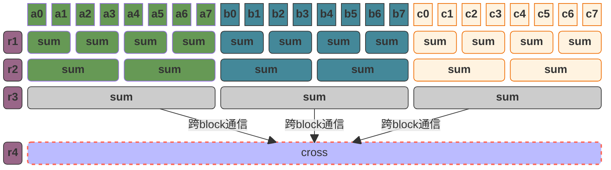

**第一层（最上方）**：每个 Block 内部的线程开始成对地读取数据。例如，线程 0 读取位置 0 和位置 1 的数，将它们相加。

**逐级折叠**：

- 第一轮：8 个数变成 4 个数。
- 第二轮：4 个数变成 2 个数。
- 第三轮：2 个数变成 1 个数。

**最终结果**：每个 Block 最终会产生一个局部结果。

# add

我们以简单的递加作为起始来实现我们的 reduce 学习。

# 最简单的reduce实现

首先我们实现的是最简单版本的 `reduce`，这个版本的逻辑非常简单：

1. **第一段高亮代码**：这里，我们声明了一个长度等于线程数的 SSM，我们会将所有归属于该 block 的数据全部存放到 SSM 中；
2. **第二段高亮代码**：我们将数据从显存搬运到 SSM；
3. **第三段高亮代码**：我们每个按照 `reduce` 逻辑，每个 step 将数字并向前累加，直到所有的点计算完毕，此时当前 `block` 的数据存放于 `ssm_data[0]` 中；
4. **第四段高亮代码**：将我们 block 的值进行跨 block 累加得到最终结果；

这里我们存在如下问题：

1. 虽然使用 SSM 可以来降低我们的对显存的访问，但是这里有个巨大的问题是，过多的寄存器会使得我们的核函数占用过的寄存器，从而使得 `theoretic occupancy` 降低；
2. 在计算时，存在大量的 `if` 条件，而 `if` 条件是并行编程中性能杀手 -- 当线程进入不同的分支时，GPU的并行计算能力会完全丧失；

我们可以通过如下方式去进行优化：

1. 注意到，在我们的SSM中，那些索引为奇数的字段只会被读取一次，也就是说我们可以只声明长度为 `THREAD_NUM / 2` 的 SSM，而那些奇数我们直接在初始化阶段时便累加到 SSM 中。
2. 注意到，**0是加法中典型的 `单位元（指与任何元素运算后仍保持该元素不变的特殊值）`，那么我们可以在判断边界条件时去补0。**

```c++ mark:3,6-9,11-16,19
template<int THREAD_NUM>
__global__ void reduce_naive_kernel(const int *arr, int *out, const int len) {
    __shared__ int ssm_data[THREAD_NUM];
    const unsigned tx = threadIdx.x;
    const unsigned global_tx = GLOBAL_TX;
    if (global_tx < len) {
        ssm_data[tx] = arr[global_tx];
    }
    __syncthreads();

    for (size_t step = 1; step < THREAD_NUM; step *= 2) {
        if (tx % (step * 2) == 0 && tx + step < THREAD_NUM) {
            ssm_data[tx] += ssm_data[tx + step];
        }
        __syncthreads();
    }

    if (tx == 0) {
        atomicAdd(out, ssm_data[0]);
    }
}
```

使用上面的方式，我们得到了V2版本：

```c++
template<int THREAD_NUM>
__global__ void reduce_optimized_v2_kernel(const int *arr, int *out, const int len) {
    __shared__ int ssm_data[THREAD_NUM / 2];

    const unsigned tx = threadIdx.x;
    const unsigned i = blockIdx.x * blockDim.x + tx;

    int sum = (i < len) ? arr[i] : 0;
    if (i + THREAD_NUM < len) {
        sum += arr[i + THREAD_NUM];
    }

    ssm_data[tx] = sum;
    __syncthreads();

    for (int step = THREAD_NUM / 2; step > 0; step >>= 1) {
        if (tx < step) {
            ssm_data[tx] += ssm_data[tx + step];
        }
        __syncthreads();
    }

    if (tx == 0) {
        atomicAdd(out, ssm_data[0]);
    }
}
```

# 消除 Warp Divergent

在 [CUDA编程入门](https://0x822a5b87.github.io/2026/01/23/CUDA%E7%BC%96%E7%A8%8B%E5%85%A5%E9%97%A8/#coalesced-access) 中，我们提到了GPU的并行性：

> 对于CPU来讲，任务执行时的内存模型是这样的：在 `t0` 时间，CPU 集中的处理一段连续的内存；在 `t1` 时间，CPU 集中的处理另外一段连续的内存。


对于GPU来讲，任务执行时的内存模型是这样的：GPU 的执行单位是 Warp（32个线程）。当指令执行到访存操作时，这 32 个线程会**同时**发出内存请求：当warp中的32个线程执行时，请求的是一片**连续的、对齐的**内存块。 

```mermaid
block-beta

columns 25

x0("0") x1("1") x2("...") x3("31") x4("...") x5("255")
y0("0") y1("1") y2("...") y3("31") y4("...") y5("255")
z0("0") z1("1") z2("...") z3("31") z4("...") z5("255")
a("...")
b0("0") b1("1") b2("...") b3("31") b4("...") b5("255")

class x0,x1,x2,x3 green
class y0,y1,y2,y3 yellow
class b0,b1,b2,b3 blue
class z0,z1,z2,z3 orange

warp1("warp"):4
space:2
warp2("warp"):4
space:2
warp3("warp"):4
space:3
warp4("warp"):4
space:2

class warp1,warp2,warp3,warp4 purple


classDef animate stroke:#666,stroke-dasharray: 8 4,stroke-dashoffset: 900,animation: dash 20s linear infinite;
classDef yellow fill:#FFEB3B,stroke:#333,color:#000,font-weight:bold;
classDef blue fill:#489,stroke:#333,color:#fff,font-weight:bold;
classDef pink fill:#FFCCCC,stroke:#333,color:#333,font-weight:bold;
classDef green fill:#695,color:#fff,font-weight:bold;
classDef purple fill:#968,stroke:#333,color:#fff,font-weight:bold;
classDef gray fill:#ccc,stroke:#333,font-weight:bold;
classDef error fill:#bbf,stroke:#f65,stroke-width:2px,color:#fff,stroke-dasharray: 5 5;
classDef coral fill:#f8f,stroke:#333,stroke-width:4px;
classDef orange fill:#fff3e0,stroke:#ef6c00,color:#ef6c00,font-weight:bold;
```

而这里对内存的描述，我们扩散到指令也是一样的：在同一个时刻，warp 只能执行一个指令，如果他们是完全相同的指令，那么我们就可以合并执行；如果在出现了条件判断时，不同的线程走到了不同的分支，那么其他没有走到这个分支的线程会被阻塞：**这就是我们所谓的 Warp Divergent**。

假设存在如下代码：我们存在一个 `32` 线程的 `block`：

```c++
if (blockIdx.x < 16) {
    // branch 1
    printf("thread id < 16.");
} else {
    // branch 2
    printf("thread id >= 16");
}

statement();
```

那么，程序的执行顺序是这样的：

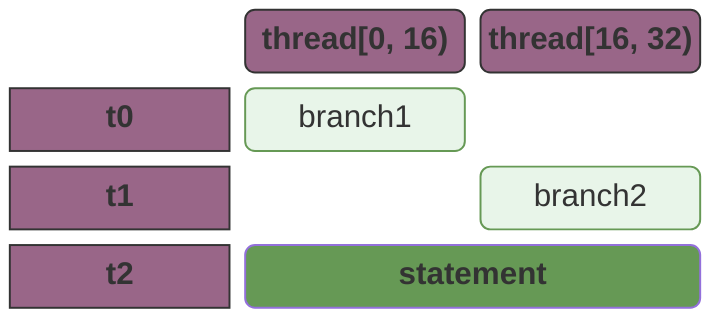

此外，取模操作也是一个代价高昂的操作，我们需要想办法避免。

> 那么我们应该如何优化 `Wrap Divergent` 呢？首先，我们需要了解 `warp` 的调度，这里可以参考 [warp调度](#warp调度)。

## 新老方案对比

> 假设我们当前的 `block` 中总共有 `8` 个线程，而每个 `warp` 中包含 `8` 个线程。

在老的方案中，我们最重要的问题是**活跃线程在物理排布上出现了稀疏化**：可以看到，随着程序的执行，我们的 `warp` 中活跃线程越来越少。

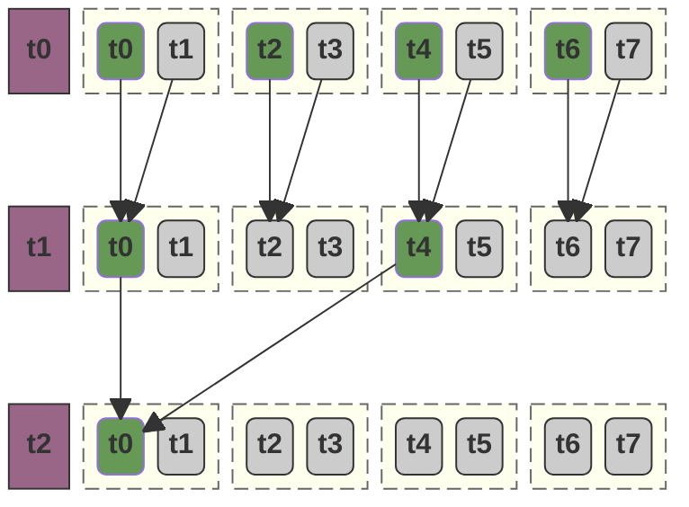

而我们的核心思路就是**让活跃线程在物理排布上尽可能紧凑，使得每一个 warp 中的活跃线程尽可能的多**。

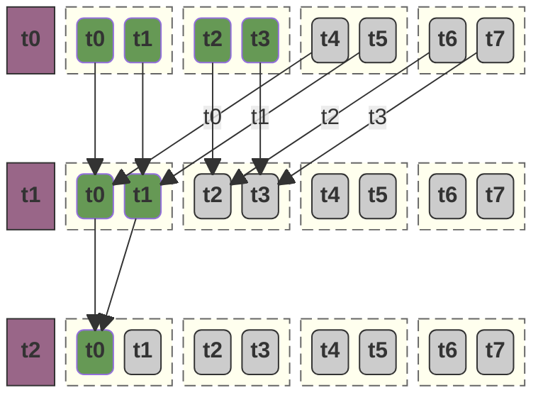

1. 在 `t0` 时间 `warp0` 和 `wrap1` 包含的全部都是活跃线程；
2. 在 `t1` 时间，`warp0` 包含的全部是活跃线程；
3. 在 `t2` 时间，此时会出现部分资源浪费，但是通常已经属于是可接受的范围了，规约是指数级收敛的。绝大部分的计算量都在前几轮（$t_0, t_1$）完成了。当进入 $t_2$ 甚至更晚的迭代时，剩下的计算开销对于庞大的 GPU 吞吐量来说已经微乎其微。

## 代码逻辑

代码实现逻辑非常简单，这里就不做详细描述了。

```c++
template<int THREAD_NUM>
__global__ void reduce_naive_kernel(const int *arr, int *out, const int len) {
    __shared__ int ssm_data[THREAD_NUM];
    const unsigned tx = threadIdx.x;
    const unsigned global_tx = GLOBAL_TX;
    if (global_tx < len) {
        ssm_data[tx] = arr[global_tx];
    }

    __syncthreads();
    for (size_t step = THREAD_NUM >> 1; step > 0; step >>= 1) {
        if (tx + step < THREAD_NUM) {
            ssm_data[tx] += ssm_data[tx + step];
        }
        __syncthreads();
    }

    if (tx == 0) {
        atomicAdd(out, ssm_data[0]);
    }
}
```

# 内存合并访问

我们执行一下指令

```bash
sudo ncu --metrics  l1tex__t_requests_pipe_lsu_mem_global_op_ld.sum,l1tex__t_sectors_pipe_lsu_mem_global_op_ld.sum  ./build/reduce_eliminate_divergence
```

得到：

```bash mark:7,8
[28068] reduce_eliminate_divergence@127.0.0.1
  void reduce_eliminate_divergence<(int)8>(const int *, int *, int) (12500000, 1, 1)x(8, 1, 1), Context 1, Stream 7, Device 0, CC 8.9
    Section: Command line profiler metrics
    ----------------------------------------------- ----------- ------------
    Metric Name                                     Metric Unit Metric Value
    ----------------------------------------------- ----------- ------------
    l1tex__t_requests_pipe_lsu_mem_global_op_ld.sum     request     12500000
    l1tex__t_sectors_pipe_lsu_mem_global_op_ld.sum       sector     12500000
    ----------------------------------------------- ----------- ------------
```

## 内存合并访问的指标

在我们上的性能分析结果中，有两个特殊的指标：

- `l1tex__t_requests_pipe_lsu_mem_global_op_ld`  这是指 **Warp 层级的指令发射数**。当一个 Warp（32 个线程）执行一条加载指令（如 `ld.global`）时，它会向显存系统发出“请求”。**理想情况**下，1 个 Warp 只发出 1 个 Request。
- `l1tex__t_sectors_pipe_lsu_mem_global_op_ld`
- 这是指 **物理传输的最小单元数**。GPU 的 L1 缓存行（Cache Line）是 128 字节，它被划分为 **4 个 32 字节的扇区 (Sector)**。显存控制器每次搬运数据的最小单位就是一个扇区（32B）。**理想情况下**1 个 Warp 如果读取连续的 32 个 `int`（共 128B），正好填满 4 个扇区。

可以看到，我们的 Cache Line 和我们之前提到的 [Memory Burst](https://0x822a5b87.github.io/2026/01/23/CUDA%E7%BC%96%E7%A8%8B%E5%85%A5%E9%97%A8/#memory-burst) 的大小是一致的，为了效率，GPU 的存储架构设计遵循了“对齐”原则。我们可以这样理解它们的关系：

- **Cache Line (128 字节)**：这是 **L1 缓存** 管理数据的基本单位。当我们访问显存时，`L1` 缓存会以 128 字节为块进行存储。
- **Memory Burst (32 字节 × 4 = 128 字节)**：这是 **显存控制器（MC）** 从 DRAM 搬运数据的物理特征。
  - 在 GDDR6/GDDR6X 显存中，一次物理上的 **Burst Read**（突发读取）通常对应 **32 字节**（即 1 个 Sector）。
  - 由于 L1 Cache Line 是 128 字节，硬件会自动将 **4 个连续的 32 字节 Burst** 组合在一起，一次性填满一个 Cache Line。

所以，这是一种逻辑上的设计：

1. 为了减少访问显存时的行激活和列寻址开销，一次完整的 memory burst 会包含多次读取；
2. 在硬件设计层面，一次 burst 正好读满一个 Sector；而为了填满整个 Cache Line，我们的突发长度（Memory Length）也设计为等同于一个 `Cache Line` 包含的 `Sector` 数量。

这样设计的结果是：**一次物理上的显存波峰，刚好完美填充一个缓存行。** 没有任何多余的控制开销，也没有任何带宽浪费。

再回到我们的指标统计：

```bash
    l1tex__t_requests_pipe_lsu_mem_global_op_ld.sum              request     12500000
    l1tex__t_sectors_pipe_lsu_mem_global_op_ld.sum                sector     12500000
```

这两个指标完全相等，这是不合理的：因为这意味着，我们每个 `request`，只读取到了 `1` 个 `Sector`，这意味着，我们四次 `request` 才能填满一个 `Cache Line`。

**这是因为，我们在代码中，设置了单个 block 的线程数量为 `8`，我们调整这个参数为 `32` 即可** ：

```c++ mark:3
int main(int argc, char *argv[]) {
	// ...
    constexpr int thread_num = 32;
    constexpr int block_num = (len + thread_num - 1) / thread_num;
    reduce_eliminate_divergence<thread_num><<<block_num, thread_num>>>(d_arr, d_out, len);
	// ...
}
```

重新分析得到结果，现在 $Ratio = \frac{\text{Sectors}}{\text{Requests}}$ 等于 `4`，这意味着我们完美的合并了访问：

```
[28405] reduce_eliminate_divergence@127.0.0.1
  void reduce_eliminate_divergence<(int)32>(const int *, int *, int) (3125000, 1, 1)x(32, 1, 1), Context 1, Stream 7, Device 0, CC 8.9
    Section: Command line profiler metrics
    ----------------------------------------------- ----------- ------------
    Metric Name                                     Metric Unit Metric Value
    ----------------------------------------------- ----------- ------------
    l1tex__t_requests_pipe_lsu_mem_global_op_ld.sum     request      3125000
    l1tex__t_sectors_pipe_lsu_mem_global_op_ld.sum       sector     12500000
    ----------------------------------------------- ----------- ------------
```

# 解决Bank Conflict

我们使用如下指令查看现在代码中存在的 Bank Conflict。

```bash
sudo ncu --metrics  l1tex__data_bank_conflicts_pipe_lsu_mem_shared_op_st.sum  ./build/reduce_eliminate_divergence
```

我们得到输出：

```bash mark:7
[25436] reduce_eliminate_divergence@127.0.0.1
  void reduce_eliminate_divergence<(int)8>(const int *, int *, int) (12500000, 1, 1)x(8, 1, 1), Context 1, Stream 7, Device 0, CC 8.9
    Section: Command line profiler metrics
    -------------------------------------------------------- ----------- ------------
    Metric Name                                              Metric Unit Metric Value
    -------------------------------------------------------- ----------- ------------
    l1tex__data_bank_conflicts_pipe_lsu_mem_shared_op_st.sum                    77021
    -------------------------------------------------------- ----------- ------------
```

可以看到，我们这里仍然存在一定的冲突，在我们的代码中：

- `ssm_data[tx]` 永远不会产生 Bank Conflict，因为所有的线程都是线性访问的。除非我们设置了错误的参数：例如我们将 `THTREAD_NUM` 设置为 `32`，那么无论如何设计代码都无法避免 Bank Conflict。
- `ssm_data[tx]` 和 `ssm_data[tx + step]` 也不会产生 Bank Conflict：冲突只发生在“同一个 Warp 内的 **不同线程** 争抢 **同一个 Bank** 的 **不同 Row**”。这里是同一条指令里由同一个物理通道完成的（先读 A，再读 B），这不叫冲突，这叫正常的序列化读取。

## Bank Conflict 的产生

我们之前的代码（`thread_num=32` 版本）逻辑如下：

```c++
ssm_data[tx] = arr[global_tx]; // 每个线程写入 4 字节
```

虽然在**逻辑索引**上 `tx` 是连续的（0, 1, 2...），但从 **LSU（加载存储单元）流水线** 的物理视角来看，它面临以下压力：

- **高频仲裁压力**：一个 Warp 在每一个指令周期都要发起 32 个独立的 4 字节存储请求。
- **物理冲突假象**：由于单线程任务极轻，大量 Block 并发。当硬件处理这些 `STS.32`（Store Shared 32-bit）指令时，如果多个 Warp 的写操作在时间片上重叠，共享内存的 **Bank 仲裁器（Arbiter）** 就会因为排队压力报出冲突。
- **统计溢出**：NCU 记录的 `op_st` 冲突很多时候是物理流水线由于“写掩码（Write Mask）”或“并发争用”产生的停顿，而不纯粹是地址对齐问题。

## 向量化写入

在我们的向量化写入中，我们通过以下方式优化了我们的指令数量：

- **存储空间的膨胀**：声明 `THREAD_NUM * 4` 的共享内存，虽然 Block 线程数没变，但每个线程现在作为“搬运工”的单次负荷增加了 4 倍。为了存放这些从全局内存拉回来的数据，Shared Memory 必须相应扩大，以承载这 $128$ 字节（$32$ 线程 $\times$ $4$ 字节 $\times$ $4$ 倍数据）的单次 Warp 加载量。
- **加载阶段：指令压缩（Bandwidth Optimization）**：使用 `int4` 强转，将四个 `int` 合并为一个 `128-bit` 事务：
  - **指令层**：用一次 `STS.128` 代替四次 `STS.32`。
  - **硬件层**：极大缓解了 **Bank Arbiter** 的仲裁压力，消除了由于指令过于密集导致的“伪 Bank Conflict”。
  - **吞吐量**：更接近 `GPU` 显存控制器的物理 Burst 限制（$32$ 字节），实现了极致的带宽利用。
- 在计算时，我们通过每个线程负责一个 `int4` 来达成使用相同的线程数量计算全部的数字。同时每个线程在访问数据时仍然是连续的，不会引发不能合并访问或者 bank conflict 等问题；
- 有一个需要注意的地方是：我们的数组的长度并一定是4的倍数，所以 `reinterpret_cast<const int4*>(arr)[global_tx];` 这段代码可能会发生越界访问，而我们最长使用的方法是：**在 `cudaMalloc` 时分配 (len + 3) / 4 * 4 来进行对齐，并且需要将超出的部分显式的初始化为 `0`**。

```c++ mark:3,6-11,19-22
template<int THREAD_NUM>
__global__ void reduce_vectorized(const int *arr, int *out, const int len) {
    __shared__ int ssm[THREAD_NUM * 4];
    const unsigned tx = threadIdx.x;
    const unsigned global_tx = (blockIdx.x * blockDim.x) + tx;
    if (global_tx * 4 < len) {
        const int4 data = reinterpret_cast<const int4*>(arr)[global_tx];
        reinterpret_cast<int4*>(ssm)[tx] = data;
    } else {
        reinterpret_cast<int4*>(ssm)[tx] = make_int4(0, 0, 0, 0);
    }

    __syncthreads();

    const size_t start = tx * 4;
    // 这里，我们将 [tx * 4, tx * 4 + 3] 这段数据计算后存储到 tx
    // 当当前block的所有线程执行完毕之后，所有的数据相当于被压缩到了 [0, THREAD_NUM) 这段 ssm 内
    // 后续的 ssm 数据已经不再使用
    const int int4_sum = ssm[start] + ssm[start + 1] + ssm[start + 2] + ssm[start + 3];
    __syncthreads();
    ssm[tx] = int4_sum;
    __syncthreads();

    for (size_t step = THREAD_NUM >> 1; step > 0; step >>= 1) {
        if (tx < step) {
            ssm[tx] += ssm[tx + step];
        }
        __syncthreads();
    }

    if (tx == 0) {
        atomicAdd(out, ssm[0]);
    }
}
```

## 向量化数据写入引入的问题

向量化数据引入的主要问题是：**由于我们合并了四个数字到`int4`类型导致我们的核函数内部使用了过多的`ssm`，这使得我们每个 block 占用过多的 Shared Memory，进而导致我们每个SM能调度的 block 减少。这在我们代码中存在大量的`__syncthreads()`时是一个非常致命的缺陷：**

1. 向量化导致 Shared Memory 占用高。
2. Shared Memory 占用高导致 SM 里的活跃 Block 变少。
3. 活跃 Block 少导致没有足够的“备选 Warp”可以切换。
4. 结果：所有的 Warp 都在 `__syncthreads()` 处干等，SM 的计算单元（ALU）大量闲置。

# 第一次性能对比

| **指标 (Metric)**  | reduce_eliminate_divergence | reduce_vectorized |
| ------------------ | --------------------------- | ----------------- |
| Duration           | 14.39ms                     | 4.59ms            |
| SM Active Cycles   | 30287486.94                 | 9211841.03        |
| DRAM Throughput    | 10.69%                      | 32.71%            |
| Memory Throughput  | 33.19%                      | 47.01%            |
| Compute Throughput | 33.19%                      | 39.52%            |
| cudaMemcpy         | 227ms                       | 57ms              |
| cudaMalloc         | 168ms                       | 199ms             |
| kernel function    | 14ms                        | 4ms               |
| HtoD               | 206ms                       | 45ms              |
| DtoH               | 1344ns                      | 1376ns            |
| Threads            | 100000000                   | 100000000         |

# 线程粗化和IDLE线程优化

为了使得我们的优化我们提到的这些问题，我们可以如下实现：

1. 在读取数据时，仍然以 `int4` 类型来读取数据，以便于提高ssm的利用率；
2. 在写入时，我们并不存取全部数据，而是直接将`int4`计算完得到最终的结果后存入到ssm；
3. 最后，我们相应的减少线程数量；

```c++ mark:10,36
constexpr unsigned NUMBER_PER_THREAD = 4;

template<int THREAD_NUM>
__global__ void reduce_vectorized(const int *arr, int *out, const int len) {
    __shared__ int ssm[THREAD_NUM];
    const unsigned tx = threadIdx.x;
    const unsigned global_tx = (blockIdx.x * blockDim.x) + tx;
    if (global_tx * NUMBER_PER_THREAD < len) {
        const auto [x, y, z, w] = reinterpret_cast<const int4*>(arr)[global_tx];
        ssm[tx] = x + y + z + w;
    } else {
        ssm[tx] = 0;
    }

    __syncthreads();

    for (size_t step = THREAD_NUM >> 1; step > 0; step >>= 1) {
        if (tx < step) {
            ssm[tx] += ssm[tx + step];
        }
        __syncthreads();
    }

    if (tx == 0) {
        atomicAdd(out, ssm[0]);
    }
}

int main(int argc, char *argv[]) {
    constexpr size_t len = 100000000;
	// ...

    constexpr int thread_num = 32;
    constexpr int stride = thread_num * NUMBER_PER_THREAD;
    constexpr int block_num = (len + stride - 1) / stride;
    reduce_vectorized<thread_num><<<block_num, thread_num>>>(d_arr, d_out, len);

    // ...
}
```

# 第二次性能对比

| **指标 (Metric)**  | reduce_eliminate_divergence | reduce_vectorized | reduce_vec_v2 |
| ------------------ | --------------------------- | ----------------- | ------------- |
| Duration           | 14.39ms                     | 4.59ms            | 1.46ms        |
| SM Active Cycles   | 30287486.94                 | 9211841.03        | 3380794.09    |
| DRAM Throughput    | 10.69%                      | 32.71%            | 98.05%        |
| Memory Throughput  | 33.19%                      | 47.01%            | 98.05%        |
| Compute Throughput | 33.19%                      | 39.52%            | 30.02%        |
| cudaMemcpy         | 227ms                       | 57ms              | 90ms          |
| cudaMalloc         | 168ms                       | 199ms             | 162ms         |
| kernel function    | 14ms                        | 4ms               | 1.51ms        |
| HtoD               | 206ms                       | 45ms              | 81ms          |
| DtoH               | 1344ns                      | 1376ns            | 1312ns        |
| Threads            | 100000000                   | 100000000         | 25000000      |

# Warp Shuffle

我们知道 `__syncthreads()` 是一个代价高昂的操作，我们有没有办法消除对于 `__syncthreads()` 的调用呢？这里，我们必须先了解一下 warp 的调度逻辑。

Warp 是 GPU 硬件执行的最小单位，而 Block 只是一个逻辑组织单位：

- **在 `warp` 内部**， 32 个线程是由同一个**硬件调度器（Warp Scheduler）**管理的。在 `SIMT`（单指令多线程）架构下，这 32 个线程在物理上是“步调一致”的。当一条加法指令下达时，这 32 个线程的 ALU 会在同一个时钟周期执行。**这些线程本来就是一起动的，所以不需要互相打招呼（`__syncthreads`）。**
- **在 `block` 内部**，一个 Block 可能包含多个 Warp（比如 256 个线程就是 8 个 Warp）。这 8 个 Warp 在 SM 内部是**独立调度**的。Warp 0 可能正在算加法，而 Warp 1 可能因为内存延迟被挂起了。如果 Warp 0 想读 Warp 1 的数据，它必须调用 `__syncthreads()`。

这就相当于我们在 `CPU` 编程中对于临界区的访问：

- 在不需要访问 `Shared Memory` 时，我们无需任何形式的 `__syncthreads()`，因为我们内部的并行是基于 `SIMT` 并行的；
- 而当我们需要访问 `Shared Memory` 时，我们必须要通过 `__syncthreads()` 等待同一个 `block` 内的所有线程执行到当前位置，因为这里相当于是进入临界区了。

**这也就是说，当我们执行到只剩最后一个 warp 时，我们可以不使用 `__syncthreads()` 的。另一方面，如果我们的线程数量少于32个（即只有一个warp），那么我们可以直接不使用 `__syncthreads()`，因为我们只有一个 warp。**

而我们有很多种方式来实现，其中最符合现代 CUDA 开发的方式是通过 [__shfl_down_sync](#shfl_down_sync) 来实现。

```c++
constexpr unsigned NUMBER_PER_THREAD = 4;

template<int THREAD_NUM>
__global__ void reduce_vectorized(const int *arr, int *out, const int len) {
    __shared__ int ssm[THREAD_NUM];
    const unsigned tx = threadIdx.x;
    const unsigned global_tx = (blockIdx.x * blockDim.x) + tx;
    if (global_tx * NUMBER_PER_THREAD < len) {
        const auto [x, y, z, w] = reinterpret_cast<const int4*>(arr)[global_tx];
        ssm[tx] = x + y + z + w;
    } else {
        ssm[tx] = 0;
    }

    __syncthreads();

    // 我们使用 for 循环执行前面的部分
    for (size_t step = THREAD_NUM >> 1; step > 32; step >>= 1) {
        if (tx < step) {
            ssm[tx] += ssm[tx + step];
        }
        __syncthreads();
    }

    // 当执行到该位置时，由于我们在 for 循环中调用了 __syncthreads()，所以所有的线程都已经执行到该位置
    // 这也就表明，所有的数据都已经被规约到 ssm[0] ~ ssm[31]
    // 此时我们只需要使用 __shfl_down_sync 来计算最后的结果即可。
    if (tx < 32) {
        int sum = ssm[tx];
        // 注意，最后一次计算时 step > 32，也就是我们的值现在规约到了 ssm[0] ~ ssm[63]
        if (THREAD_NUM > 32 && tx + 32 < THREAD_NUM) {
            sum += ssm[tx + 32];
        }
        sum += __shfl_down_sync(0xffffffff, sum, 16);
        sum += __shfl_down_sync(0xffffffff, sum, 8);
        sum += __shfl_down_sync(0xffffffff, sum, 4);
        sum += __shfl_down_sync(0xffffffff, sum, 2);
        sum += __shfl_down_sync(0xffffffff, sum, 1);
        if (tx == 0) {
            atomicAdd(out, sum);
        }
    }
}
```

# 第三次性能对比

| **指标 (Metric)**  | reduce_eliminate_divergence | reduce_vectorized | reduce_vec_v2 | shuffle    |
| ------------------ | --------------------------- | ----------------- | ------------- | ---------- |
| Duration           | 14.39ms                     | 4.59ms            | 1.46ms        | 1.52ms     |
| SM Active Cycles   | 30287486.94                 | 9211841.03        | 3380794.09    | 3365834.97 |
| DRAM Throughput    | 10.69%                      | 32.71%            | 98.05%        | 98.04%     |
| Memory Throughput  | 33.19%                      | 47.01%            | 98.05%        | 98.04%     |
| Compute Throughput | 33.19%                      | 39.52%            | 30.02%        | 12.62%     |
| cudaMemcpy         | 227ms                       | 57ms              | 90ms          | 52ms       |
| cudaMalloc         | 168ms                       | 199ms             | 162ms         | 167ms      |
| kernel function    | 14ms                        | 4ms               | 1.51ms        | 1.46ms     |
| HtoD               | 206ms                       | 45ms              | 81ms          | 43ms       |
| DtoH               | 1344ns                      | 1376ns            | 1312ns        | 1280ns     |
| Threads            | 100000000                   | 100000000         | 25000000      | 25000064   |


# QA

## warp调度

GPU在进行硬件调度warp时，有两个基本原则：

1. **分段连续性**（Warp 内部线程索引连续）。

2. **归属唯一性**（Warp 绝不跨 Block）。

假设 block 的线程数量为 T，每个warp的线程数为 N，那么

1. `[0, N)` 为第一个 warp；
2. `[N, 2 * N)` 为第二个 warp；
3. 如此递推，直到 `[a * N, min(T, (a + 1) * N)` 将所有的线程消耗完。

例如：假设 $N=32$（标准 Warp 大小），而我们设置 $T=48$：

1. **第一个 Warp**：$[0, 32)$。这是一个“满载”的 Warp，32 个线程全部活跃。
2. **第二个 Warp**：$[32, 48)$。
   - **硬件层面**：调度器依然会为这个 Warp 分配 **32 个线程的执行宽度**。
   - **执行层面**：索引为 $48$ 到 $63$ 的位置被称为 **Inactive Lanes（非活跃通道）**。它们会消耗指令周期，占用寄存器资源，但其输出被硬件自动屏蔽，不执行任何写操作。

这就是为什么建议 `blockDim.x` 永远设置为 32 的倍数。如果你设置 $T=33$，你实际上消耗了 2 个 Warp 的硬件资源，但第二个 Warp 的利用率仅为 $1/32 \approx 3\%$。

### 线程调度实例

根据我们前面的描述，我们的八个线程，被拆分为四组 `warp`:

- `{b0 t0, b0 t1}`
- `{b0 t2, b0 t3}`
- `{b1 t0, b1 t1}`
- `{b1 t2, b1 t3}`

那么在调度时，GPU 就会像 CPU 调度线程一样，随机的调度这四组中的任意一组。

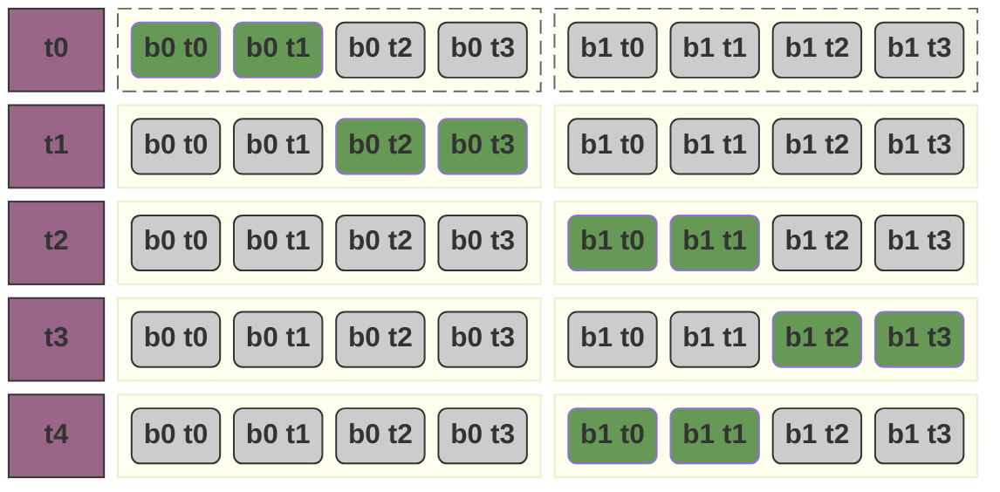

## shfl_down_sync

`__shfl_down_sync` 是 CUDA 提供的 **Warp Shuffle**（掩码交换）原语之一。它是规约算法中极其关键的“黑科技”，**让线程能直接“读”同 Warp 内其他线程的寄存器值**。

### 语法

以 `__shfl_down_sync(0xffffffff, sum, 16);` 为例：这条指令的作用是**对于任意线程，执行 `sum += (线程索引 + 16)` 处的 `sum`**。这里指的注意的是，关于“索引大于 32 的线程”的处理，硬件并不是简单的“不执行任何操作”，而是： **对于这些线程，该函数会返回一个“未定义值”或原来的值（通常在 `down` 模式下，越界请求会返回原值或者 0，取决于具体掩码），但最关键的是：只有索引在 $[0, 15]$ 范围内的线程能够成功“加”到有效数据。**简单来说，我们在调用了这条指令之后，所有索引在 `[15, 31]` 范围的线程的 `sum` 值就不应该被使用了，因为他们属于是未定义结果。

- **`0xffffffff` (Mask)**：这是一个 32 位的掩码。每一位对应 Warp 里的一个线程（第 0 位对应线程 0，以此类推）。`0xffffffff` 表示这个操作对 Warp 内**所有 32 个线程**都有效。
- **`sum` (Var)**：这是我们想要传递出去的变量名（在寄存器中）。
- **`16` (Delta)**：这是偏移量。`down` 表示每个线程去读 **“自己索引 + 16”** 的那个线程手中的 `sum` 值。

## bank conflict

### bank

在现代 `GPU` 中，通常 Shared Memory 被平均分成 **32 个等大小的存储模块**，称为 **Banks**。Banks的数量固定为 32 个，刚好对应一个 Warp 的线程数。

而它的实际结构可以如下图所示：

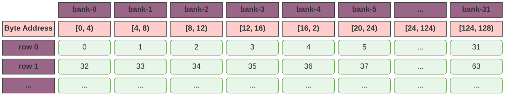

我们可以把整个 Shared Memory 看做一个 `ssm[rows][32]` 的数组，我们可以把任何一个 Shared Memory 的索引 `i` 映射到这个数组中：

-  **Col (Bank ID)** = $i \pmod{32}$
- **Row (Entry ID)** = $i / 32$

而这个特性，也意味着我们在访问 ssm 时，只要他们是连续的，长度不超过32的，他就不会产生 bank conflict 而不用处理它的起始长度。例如，当我们存在如下代码（每个 block 的线程数为 32）：

```c++
__global__ void reduce_eliminate_divergence() {
    __shared__ int ssm_data[32];
    const unsigned tx = threadIdx.x;
    ssm_data[tx] = 1;
}
```

在这个代码中，`ssm_data` 可能指向任意一个 Bank，我们假设我们指向了 `bank-1`，那么他访问的 bank 如下所示，这依然是没有产生 bank conflict 的：

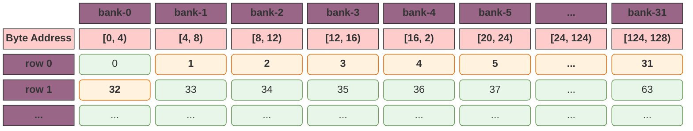

如果我们对索引进行一个简单的修改让他不连续，最简单的方式，我们直接将所有的索引直接乘以32，那么整个 warp 将发生严重的 bank conflict 导致访问 ssm 被串行化。

```c++ mark:4
__global__ void reduce_eliminate_divergence() {
    __shared__ int ssm_data[32];
    const unsigned tx = threadIdx.x;
    ssm_data[tx * 32] = 1;
}
```

此时 ssm 访问模型为：

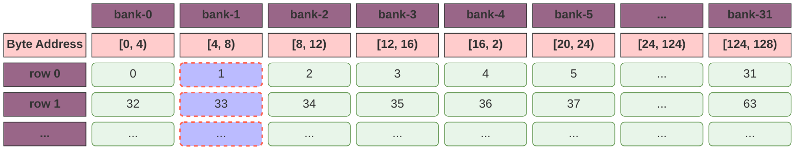

**在上面的这种极端的场景下，所有的线程都发生了 bank  conflict，这种冲突叫做 `32-way Bank Conflict`**。而如果我们只是将 `x * 2`，那么这个冲突将降低到 `2-way Bank Conflict`。**而这些就是在交错寻址下发生的典型 Bank Conflict。**

### 非四字节数据的Bank Conflict

对于较小的数据类型（如 `char` 或 `short`），如果我们定义 `__shared__ char ssm[128]`：`ssm[0]`, `ssm[1]`, `ssm[2]`, `ssm[3]` 全部挤在 **Bank 0** 的同一个 4 字节空间里。

然而惊人的是：如果线程 0 读 `ssm[0]`，线程 1 读 `ssm[1]`，这**不会**发生 Bank Conflict。这是因为现代 GPU 具备“字节选择逻辑”，当多个线程访问同一个 Bank 的**同一个 4 字节字（Word）**中的不同字节时，硬件可以像广播一样处理。

**GPU会读取 `ssm[0]` 和 `ssm[1]` 的数据，并广播到对应的地址。**

对于较大的数据类型（如 `double` 或 `long long`），如果我们定义 `__shared__ double ssm[64]`（一个 `double` 占 8 字节）：

- `ssm[0]` 会占据 **Bank 0 和 Bank 1** 的第 0 行。
- `ssm[1]` 会占据 **Bank 2 和 Bank 3** 的第 0 行。
- 一个 Warp 访问 32 个 `double` 时，实际上会产生两次 64 字节的内存请求。硬件会自动将其拆分为两次无冲突的访问。

### 广播

> 如果 Warp 里的所有线程都访问同一个 Bank 的同一个地址，会发生冲突吗？

**答案是：不会。** 硬件此时会触发“广播机制”，把这个地址的数据一次性发给所有请求它的线程。这种情况下性能依然是极高的。**Bank Conflict 只发生在 “同一个 Bank，不同地址” 的竞争上。**

### 使用padding机制来解决 Bank Conflict

假设我们现在需要访问一个数组中的某一列，那么此时按照我们之前使用的方式没有办法避免 Bank Conflict（这里一个 block 仍然是 32 个线程）：

```c++
__global__ void reduce_eliminate_divergence() {
    __shared__ int ssm_data[32][32];
    const unsigned tx = threadIdx.x;
    ssm_data[tx][0] = 1;
}
```

因为此时我们的内存模型是这样的：

1. 其中 ssm 的 `[0, 128)` 对应于 `[bank0, bank32]` 的第 0 行；
2. 每次我们访问时访问的数据是 `tx * 32`；

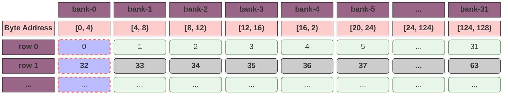

我们需要做的是，通过 `padding` 来通过浪费少量的ssm来使得他们在内存中的位置分布于不同的 bank，我们通过修改 ssm 的声明为 `ssm_data[32][33]`：

```c++ mark:2
__global__ void reduce_eliminate_divergence() {
    __shared__ int ssm_data[32][33];
    const unsigned tx = threadIdx.x;
    ssm_data[tx][0] = 1;
}
```

在这种情况下，我们的ssm分布如下：

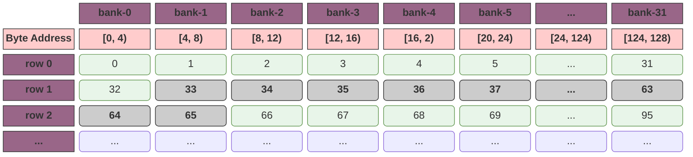

对于同样的访问逻辑，我们的 bank 直接错开了：

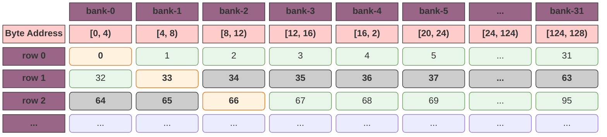

### bank arbiter

Bank Conflict 并不总是由于“地址映射到了同一个 Bank”，还可能是由于“指令发射过于密集导致的硬件排队（Congestion）”。

#### 仲裁器（Arbiter）的带宽限制

Shared Memory 的每个 Bank 虽然独立，但每个周期能处理的 **事务数量（Transactions）** 是有限的。

- **原始代码**：32 个线程各存 4 字节（`STS.32`）。Warp 必须发起一个覆盖 32 个地址的巨大请求。在 CC 8.9 这种高并发架构下，如果多个 Warp 同时塞满 LSU 流水线，Bank Arbiter 就会因为处理不过来而产生“逻辑退避”。
- **向量化代码**：通过 `int4`，我们将原本需要 32 个地址位的请求，压缩成了只需要 8 个 `int4` 地址位的物理请求（针对单次存储事务）。这极大地释放了仲裁器的压力。

例如，在我们的代码中，1 亿次数据 = 1 亿次 `STS.32`（Store Shared）指令。而我们可以通过 `int4` 来减少 Bank Arbiter 的压力：1 亿次数据 = 2500 万次 `STS.128` 指令。 指令数量减少到原来的 **1/4**。由于指令变少了，NCU 统计到的由于排队产生的“伪 Bank Conflict”也就归零了。

总结来说：在非向量化代码下，我们的内存模型如下：每个 `STS.32` 指令负责自己对应的 `int`；

```mermaid
block-beta

columns 12

space bank0["bank-0"] bank1["bank-1"] bank2["bank-2"] bank2["bank-2"] bank3["bank-3"] bank4["bank-4"] bank5["bank-5"] bank6["bank-6"] bank7["bank-7"] bank8["bank-8"] bank9["..."] bank31["bank-31"]

address[" Byte Address"]
ad0["[0, 4)"] ad1["[4, 8)"] ad2["[8, 12)"] ad3["[12, 16)"]
ad4["[16, 2)"] ad5["[20, 24)"] ad7["[24, 28)"] ad8["[28, 32)"]
ad9["[32, 36)"] ad10["..."] ad31["[124, 128)"]

r0["row 0"]
r0c0("0") r0c1("1") r0c2("2") r0c3("3") r0c4("4")
r0c5("5") r0c6("6") r0c7("7") r0c8("8")
r0c9("...")
r0c31("31")

class bank0,bank1,bank2,bank3,bank4,bank5,bank6,bank7,bank8,bank9,bank31,r0,r1,r2,r3 purple
class address,ad0,ad1,ad2,ad3,ad4,ad5,ad7,ad8,ad9,ad10,ad31 pink

class r0c0,r0c1,r0c2,r0c3,r0c4,r0c5,r0c6,r0c7,r0c8,r0c9,r0c31 light_green

%% 样式定义
classDef content fill:#fff,stroke:#ccc;
classDef animate stroke:#666,stroke-dasharray: 8 4,stroke-dashoffset: 900,animation: dash 20s linear infinite;
classDef yellow fill:#FFEB3B,stroke:#333,color:#000,font-weight:bold;
classDef blue fill:#489,stroke:#333,color:#fff,font-weight:bold;
classDef pink fill:#FFCCCC,stroke:#333,color:#333,font-weight:bold;
classDef light_green fill:#e8f5e9,stroke:#695;
classDef green fill:#695,color:#fff,font-weight:bold;
classDef purple fill:#968,stroke:#333,color:#fff,font-weight:bold;
classDef gray fill:#ccc,stroke:#333,font-weight:bold;
classDef error fill:#bbf,stroke:#f65,stroke-width:2px,color:#fff,stroke-dasharray: 5 5;
classDef coral fill:#f8f,stroke:#333,stroke-width:4px;
classDef orange fill:#fff3e0,stroke:#ef6c00,color:#ef6c00,font-weight:bold;
```

而我们通过向量化写入，我们可以将四个指令合并为一个指令：

```mermaid
block-beta

columns 12

space bank0["bank-0"] bank1["bank-1"] bank2["bank-2"] bank2["bank-2"] bank3["bank-3"] bank4["bank-4"] bank5["bank-5"] bank6["bank-6"] bank7["bank-7"] bank8["bank-8"] bank9["..."] bank31["bank-31"]

address[" Byte Address"]
ad0["[0, 4)"] ad1["[4, 8)"] ad2["[8, 12)"] ad3["[12, 16)"]
ad4["[16, 2)"] ad5["[20, 24)"] ad7["[24, 28)"] ad8["[28, 32)"]
ad9["[32, 36)"] ad10["..."] ad31["[124, 128)"]

r0["row 0"]

block:b0:4
    r0c0("0") r0c1("1") r0c2("2") r0c3("3")
end

block:b1:4
     r0c4("4") r0c5("5") r0c6("6") r0c7("7")
end
r0c8("8")
r0c9("...")
r0c31("31")

class bank0,bank1,bank2,bank3,bank4,bank5,bank6,bank7,bank8,bank9,bank31,r0,r1,r2,r3 purple
class address,ad0,ad1,ad2,ad3,ad4,ad5,ad7,ad8,ad9,ad10,ad31 pink

class b0,b1 animate

class r0c0,r0c1,r0c2,r0c3 green
class r0c4,r0c5,r0c6,r0c7 light_green

%% 样式定义
classDef content fill:#fff,stroke:#ccc;
classDef animate stroke:#666,stroke-dasharray: 8 4,stroke-dashoffset: 900,animation: dash 20s linear infinite;
classDef yellow fill:#FFEB3B,stroke:#333,color:#000,font-weight:bold;
classDef blue fill:#489,stroke:#333,color:#fff,font-weight:bold;
classDef pink fill:#FFCCCC,stroke:#333,color:#333,font-weight:bold;
classDef light_green fill:#e8f5e9,stroke:#695;
classDef green fill:#695,color:#fff,font-weight:bold;
classDef purple fill:#968,stroke:#333,color:#fff,font-weight:bold;
classDef gray fill:#ccc,stroke:#333,font-weight:bold;
classDef error fill:#bbf,stroke:#f65,stroke-width:2px,color:#fff,stroke-dasharray: 5 5;
classDef coral fill:#f8f,stroke:#333,stroke-width:4px;
classDef orange fill:#fff3e0,stroke:#ef6c00,color:#ef6c00,font-weight:bold;
```

**向量化优化的本质**： 并不是 `int4` 改变了 Bank 的分布规律，而是它**降低了仲裁密度**。将 32 个独立的 32-bit 存储意图转化为 8 个 128-bit 的物理事务，使得硬件仲裁器从“高频、小包”的忙乱状态进入“低频、大包”的高效状态，彻底消除了流水线中的拥堵。


