# 基础部分

## Matrix Multiplication

首先，我们需要使用 TILE 和 THREAD 来对我们的输入张量进行分块，分块有两种策略：**连续分块** 和 **交错分块**

连续分块下，我们的内存模型为：

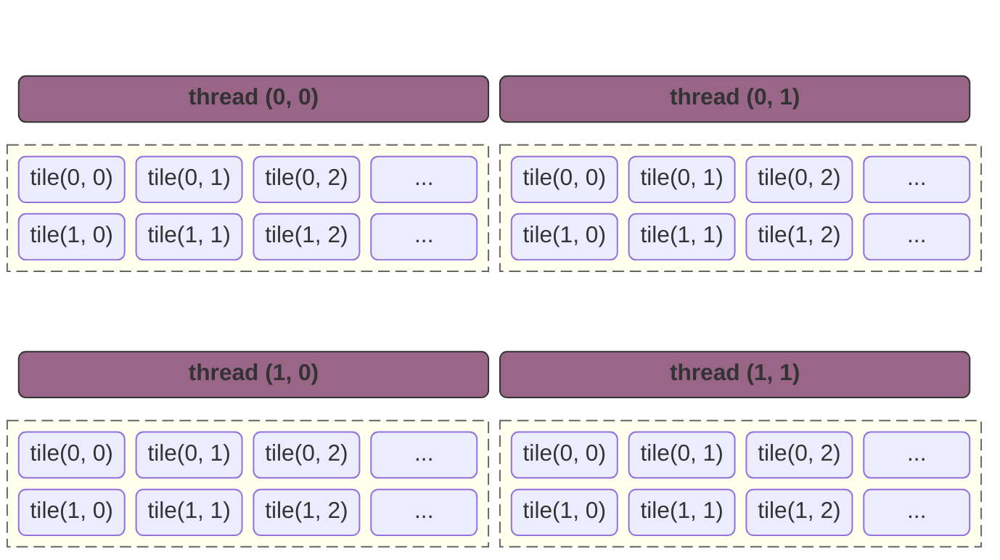


在连续分块模型下，我们的内存访问模型是这样的：在 `t0` 时刻，线程访问的是完全不连续的节点，在最后输出结果时，`t0.tile0` 和 `t1.tile0` 将不是连续的内存地址，无法合并访问；：

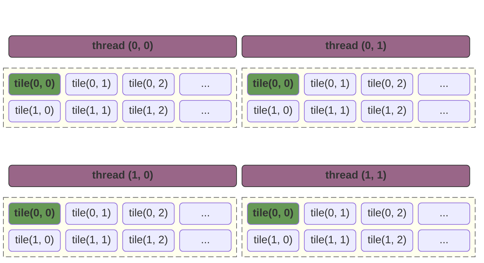


如果我们使用交错分块的话，我们的内存访问模型是这样的：

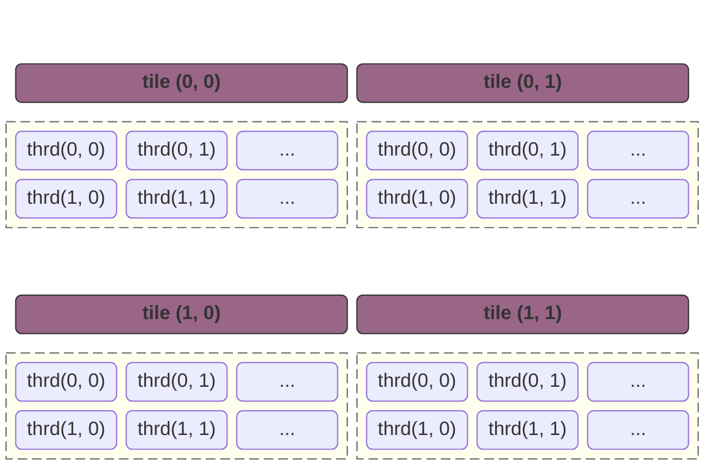

那么，在数据输出的时候，`t0.tile0`, `t1.tile0` 是连续输出的，可以合并访问。

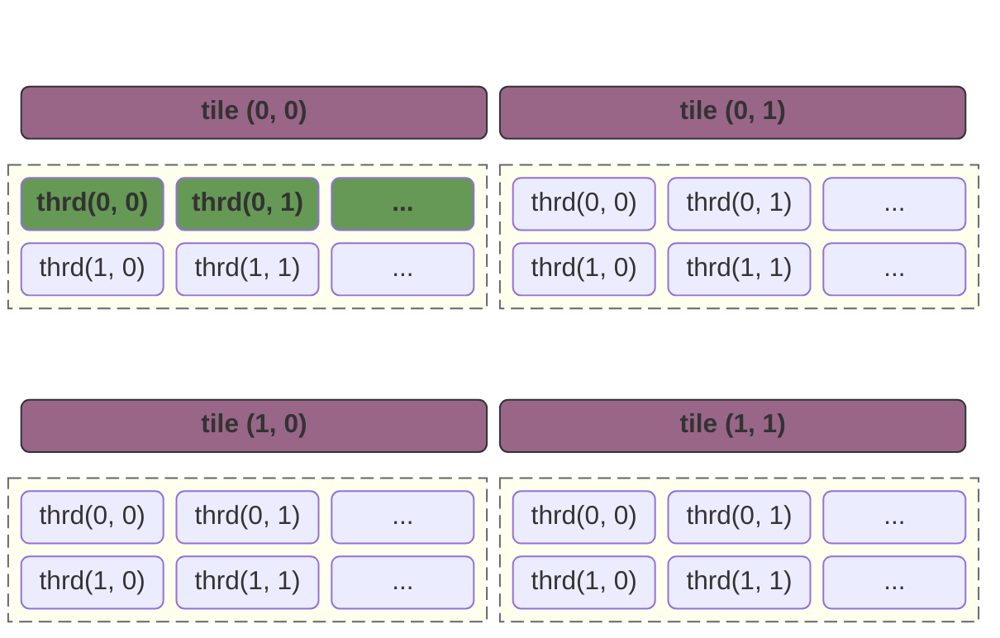

### 内积和外积

#### 内积 (Inner Product / Dot Product)

内积的逻辑是锁定 $C$ 矩阵中的**一个点**，一口气算完它。这里由于内积我们比较熟悉，就不画图了。
$$
C_{i,j} = \sum_{k=0}^{N-1} A_{i,k} \cdot B_{k,j}
$$

#### 外积 (Outer Product)

外积的逻辑是锁定共享维度 $k$ 的**一个切面**，更新 $C$ 矩阵中的**一片区域**。
$$
C += \text{col}_k(A) \otimes \text{row}_k(B)
$$


假设我们存在如下一个矩阵乘法：

##### 第一步

第一步，图中黄色的块计算，得到第一个矩阵：

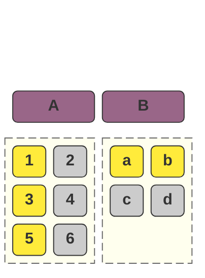

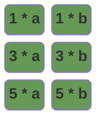

##### 第二步

第二步，图中黄色的块进行计算，得到第二个矩阵

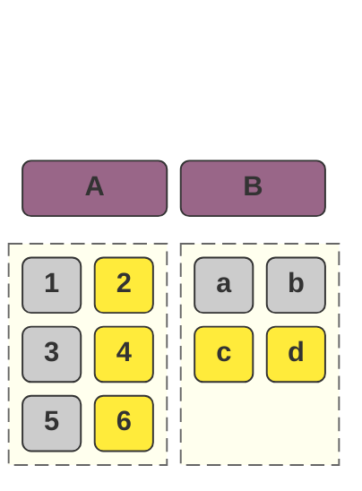


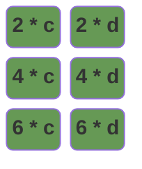


在将得到的两个矩阵相加得到：

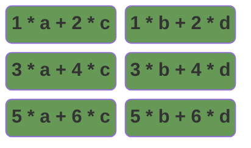

伪代码可以描述为：

```c++
for (int k = 0; k < columns(A); k++) {
    for (int a_row = 0; a_col < rows(A); a_row++) {
        for (int b_col = 0; b_row < columns(B); b_col++) {
            matrix[a_row][b_col] += A[a_row][k] * B[k][b_col];
        }
    }
}
```

我们还可以进行一次优化，这样，我们可以以浪费 `rows(A)` + `columns(B)` 个寄存器的代价，将一定的Shared Memory访问转换为寄存器访问：

```c++
for (int k = 0; k < columns(A); k++) {
    float col_of_a[rows(A)];
    float row_of_b[columns(B)];
    #pragma unroll
    for (int a_row = 0; a_row < rows(A); a_row++) {
        col_of_a[a_row] = A[a_row][k];
    }
    #pragma unroll
    for (int b_col = 0; b_col < columns(B); b_row++) {
        row_of_b[b_col] = B[k][b_col];
    }
    #pragma unroll    
    for (int a_row = 0; a_col < rows(A); a_row++) {
    #pragma unroll
	for (int b_col = 0; b_row < columns(B); b_col++) {
            matrix[a_row][b_col] += col_of_a[i] * row_of_b[j];
        }
    }
}
```

### 实现

于是，我们通过这个方式实现了第一个版本：基于 `TILE` ，`寄存器`，`内积转外积` 的优化逻辑。

```c++
#include <cuda_runtime.h>

#define ceil(x, y) (((x) + (y) - 1) / (y))

constexpr int THREAD_TILE_X = 8;
constexpr int THREAD_TILE_Y = 8;

constexpr int BLOCK_SIZE_X = 16;
constexpr int BLOCK_SIZE_Y = 16;

constexpr int STRIDE_X = BLOCK_SIZE_X * THREAD_TILE_X;
constexpr int STRIDE_Y = BLOCK_SIZE_Y * THREAD_TILE_Y;

// v1 版本，我们引入TILE机制实现线程粗化逻辑，同时我们通过将内积转换为外积来优化性能。
__global__ void matrix_multiplication_kernel(const float *A, const float *B, float *C,
                                             int M, int N, int K) {
    // 初始化结果数组
    float accum[THREAD_TILE_Y][THREAD_TILE_X];
    // 防止编译器优化到数组到显存
#pragma unroll
    for (int i_row = 0; i_row < THREAD_TILE_Y; ++i_row) {
#pragma unroll
        for (int i_col = 0; i_col < THREAD_TILE_X; ++i_col) {
            accum[i_row][i_col] = 0;
        }
    }

    // 现在我们要开始从内存读取数据并累加到结果数组
    // 按照我们的交错分布，我们在 accum[i_row][i_col] 这一个元素，对应的输出的点应该是
    // row = blockIdx.y * STRIDE_Y + i_row * BLOCK_SIZE_Y + threadIdx.y
    // col = blockIdx.x * STRIDE_X + i_col * BLOCK_SIZE_X + threadIdx.x

    // row = block行偏移量 + TILE行偏移量 + 线程相对行偏移量
    // block 行偏移量是相同的，i_row 对于所有的线程相同，而在block中左右相邻的线程y是一样的
    // 也就是说 row 的完全一致的，可以通过广播实现访问

    // col = block列偏移量 + TILE列偏移量 + 线程相对列偏移量
    // 这里block列偏移量是固定的，i_col 对所有的线程都是相同的，所以相邻线程的TILE列偏移量相同，
    // 唯一不同的是 threadIdx.x，而这个值不同线程之间是连续的，最后他们在内存中的数据可以合并访问
    const int tile_row_offset = static_cast<int>(blockIdx.y * STRIDE_Y + threadIdx.y);
    const int tile_col_offset = static_cast<int>(blockIdx.x * STRIDE_X + threadIdx.x);
    float col_of_a[THREAD_TILE_Y];
    float row_of_b[THREAD_TILE_X];
    for (int i_factor = 0; i_factor < N; ++i_factor) {
        // 关于 TILE 的遍历，我们可以看到 TILE 不是连续的
        // 因为这里在A的行和B的列的移动，是通过最外层的for循环实现的
        // 这里的 col_of_a 和 row_of_b 其实是TILE负责的区域在变化
        // 这里的逻辑其实可以理解为：
#pragma unroll
        for (int i_row = 0; i_row < THREAD_TILE_Y; ++i_row) {
            const int y = tile_row_offset + i_row * BLOCK_SIZE_Y;
            // 这个位置，同一个 block 下存在左右相邻线程 y 相等，那么他们访问的是同一个地址，
            // 可以通过广播传输数据。
            col_of_a[i_row] = y < M ? A[y * N + i_factor] : 0.0f;
        }
#pragma unroll
        for (int i_col = 0; i_col < THREAD_TILE_X; ++i_col) {
            // 这个位置，同一个 block 内，线程地址连续，可以合并访问。
            const int x = tile_col_offset + i_col * BLOCK_SIZE_X;
            row_of_b[i_col] = x < K ? B[i_factor * K + x] : 0.0f;
        }

#pragma unroll
        for (int i_row = 0; i_row < THREAD_TILE_Y; ++i_row) {
#pragma unroll
            for (int i_col = 0; i_col < THREAD_TILE_X; ++i_col) {
                accum[i_row][i_col] += col_of_a[i_row] * row_of_b[i_col];
            }
        }
    }

#pragma unroll
    for (int i = 0; i < THREAD_TILE_Y; i++) {
#pragma unroll
        for (int j = 0; j < THREAD_TILE_X; j++) {
            const int row_of_c = tile_row_offset + i * BLOCK_SIZE_Y;
            const int col_of_c = tile_col_offset + j * BLOCK_SIZE_X;
            if (row_of_c < M && col_of_c < K) {
                C[row_of_c * K + col_of_c] = accum[i][j];
            }
        }
    }
}

// A, B, C are device pointers (i.e. pointers to memory on the GPU)
extern "C" void solve(const float *A, const float *B, float *C, int M, int N, int K) {
    dim3 threadsPerBlock(BLOCK_SIZE_X, BLOCK_SIZE_Y);
    const int stride_x = static_cast<int>(threadsPerBlock.x) * THREAD_TILE_X;
    const int stride_y = static_cast<int>(threadsPerBlock.y) * THREAD_TILE_Y;
    dim3 blocksPerGrid(ceil(K, stride_x), ceil(M, stride_y));
    matrix_multiplication_kernel<<<blocksPerGrid, threadsPerBlock>>>(A, B, C, M, N, K);
    cudaDeviceSynchronize();
}
```

### 使用Shared Memory优化

```c++
#include <cuda_runtime.h>

#define ceil(x, y) (((x) + (y) - 1) / (y))

constexpr int THREAD_TILE_X = 8;
constexpr int THREAD_TILE_Y = 8;

constexpr int BLOCK_SIZE_X = 8;
constexpr int BLOCK_SIZE_Y = 8;
constexpr int THREAD_COUNT = BLOCK_SIZE_X * BLOCK_SIZE_Y;

constexpr int BX = BLOCK_SIZE_X * THREAD_TILE_X;
constexpr int BY = BLOCK_SIZE_Y * THREAD_TILE_Y;
constexpr int BK = 32;

__global__ void matrix_multiplication_kernel(const float *A, const float *B, float *C,
                                             int M, int N, int K) {
    // 我们把输出张量划分为多个 block，每个 block 又继续划分多个 THREAD
    // 每个THREAD 继续划分为多个 TILE
    // 这里 ssm_a 和 ssm_b 需要提供一个能力：在同一个 block 中，
    // 线程每次 for 循环移动时，覆盖当前 block 的所有线程的所有TILE所需要的数据
    // 一次读取，多次使用。
    // 那么，结合上面的结论和矩阵乘法的要求（计算元素 (x,y) 需要 A 的第 x 行和 B 的第 y 列）
    // 我们可以做出如下推论：
    // ssm_a 需要的矩阵是高度是 THREAD_TILE_Y * BLOCK_SIZE_Y
    // ssm_b 需要的矩阵是宽度是 THREAD_TILE_X * BLOCK_SIZE_X
    // 而 ssm_a 的宽度和 ssm_b 的高度则没有限制，只需要满足 ssm_a.width == ssm_b.height
    // 因为 :
    // 1. ssm_a 需要整行，它可以看做一个从索引0开始，向右划到到N结束的滑动块；
    // 2. ssm_b 需要整列，它可以看做一个从索引0开始，向下滑动到N结束的滑动块；
    // 也就是我们说，我们可以如下声明我们的 ssm_a 和 ssm_b，这里的 BK 是任意值都可以实现逻辑，只是性能不同
    __shared__ float ssm_a[BY][BK];
    __shared__ float ssm_b[BK][BX];

    float accum[THREAD_TILE_Y][THREAD_TILE_X] = {};
    float reg_for_a[THREAD_TILE_Y];
    float reg_for_b[THREAD_TILE_X];

    const int tid = static_cast<int>(threadIdx.y * BLOCK_SIZE_X + threadIdx.x);
    const int local_row = static_cast<int>(threadIdx.y);
    const int local_col = static_cast<int>(threadIdx.x);

    for (int i_k = 0; i_k < ceil(N, BK); i_k++) {
        // 每次计算当前TILE之前，我们要把所有的重新读取数据到ssm
        // 这里需要注意的是，当我们在搬运数据的时候，我们并不考虑TILE的概念
        // 从A和B搬运数据到ssm是一个完全独立的过程，它是输入张量某个区域到ssm的一比一映射
        // 那么，我们所需要考虑的就是：到底把哪个区域映射到我们的 ssm

        // 1. 对于 ssm_a，它的 x 轴随着 i_k 移动，y轴随着 block 移动；
        // 2. 对于 ssm_b，它的 y 轴随着 i_k 移动，x 轴随着 block 移动。

        // 对于 ssm_a，假设我们当前 block 的第一个线程的坐标是：
        // ty = blockIdx.y * blockDim.y + threadIdx.y
        // 那么我们需要填充到 ssm_a 的信息就是：
        // [(i_k * BK, ty), ((i_k + 1) * BK, ty))
        // [(i_k * BK, ty + 1), ((i_k + 1) * BK, ty + 1))
        // ...
        // [(i_k * BK, ty + BY - 1), ((i_k + 1) * BK, ty + BY - 1))
        // 得到一个 BY * BK 的矩阵，我们可以把这个矩阵看做一个整体，那么我们可以通过如下代码来实现搬运
        // for (int i = 0; i < BY; i++) {
        //     for (int j = 0; j < BX; j++) {
        //         ssm_a[x][y] = value;
        //     }
        // }
        // 我们需要将这个逻辑转换为GPU上实现的逻辑
        // 每个线程搬运一个数据，那么总共需要 (BY * BK) / (BLOCK_SIZE_X * BLOCK_SIZE_Y) 次（向上取整）
        for (int i = 0; i < ceil(BY * BK, THREAD_COUNT); ++i) {
            const int load_id = i * THREAD_COUNT + tid;
            const int r = load_id / BK;
            const int c = load_id % BK;
            const int global_r = static_cast<int>(blockIdx.y * BY + r);
            const int global_c = i_k * BK + c;
            if (global_r < M && global_c < N) {
                ssm_a[r][c] = A[global_r * N + global_c];
            } else {
                ssm_a[r][c] = 0.0f;
            }
        }
        // 对于 ssm_b，假设我们当前 block 的第一个线程的坐标是：
        // tx = blockIdx.x * blockDim.x + threadIdx.x
        // 那么我们需要填充到 ssm_b 的信息就是：
        // [(tx, i_k * BX), (tx, (i_k + 1) * BX))
        // [(tx + 1, i_k * BX), (tx + 1, (i_k + 1) * BX))
        // ...
        // [(tx + BK - 1, i_k * BX), (tx + BK - 1, (i_k + 1) * BX))
        // 得到一个 BK * BX 的矩阵
        for (int i = 0; i < ceil(BK * BX, THREAD_COUNT); i++) {
            const int load_id = i * THREAD_COUNT + tid;
            const int r = load_id / BX;
            const int c = load_id % BX;
            const int global_r = i_k * BK + r;
            const int global_c = static_cast<int>(blockIdx.x * BX + c);
            if (global_r < N && global_c < K) {
                ssm_b[r][c] = B[global_r * K + global_c];
            } else {
                ssm_b[r][c] = 0.0;
            }
        }
        __syncthreads();

        // 我们使用外积的方式来计算结果，外积可以看做是 [M * 1] * [1 * N] 的矩阵乘法，得到一个 [M * N] 的矩阵
        // 每个线程负责一个TILE，注意，在之前我们的逻辑中
        // 我们特意使用了TILE和线程交错排布的模式，但是这里我们改用了
        // TILE紧密排布的模式(TILE0, TILE1, ...)，因为之前我们是访问显存，
        // 而现在访问的是寄存器和SharedMemory，不再需要考虑合并读取。
        #pragma unroll
        for (int k = 0; k < BK; k++) {
            // 这里，进入我们的累加循环，我们的矩阵乘法是 [THREAD_TILE_Y * BK] * [BK * THREAD_TILE_X]
            // 这个位置非常容易误解成我们浪费了一些元素，因为我们把内积转换成了外积
            // 如果我们采用如下的方式：
            // for (int i = 0; i < BY; i++){}
            // for (int i = 0; i < BX; i++){}
            // 我们计算的就不是 TILE 的结果，而是整个block的结果，那样我们相当于多个线程重复计算了
            #pragma unroll
            for (int i = 0; i < THREAD_TILE_Y; i++) {
                reg_for_a[i] = ssm_a[local_row * THREAD_TILE_Y + i][k];
            }
            #pragma unroll
            for (int i = 0; i < THREAD_TILE_X; i++) {
                reg_for_b[i] = ssm_b[k][local_col * THREAD_TILE_X + i];
            }
            #pragma unroll
            for (int r = 0; r < THREAD_TILE_Y; r++) {
                #pragma unroll
                for(int c = 0; c < THREAD_TILE_X; c++) {
                    accum[r][c] += reg_for_a[r] * reg_for_b[c];
                }
            }
        }
        __syncthreads();
    }

    for (int r = 0; r < THREAD_TILE_Y; r++) {
        for (int c = 0; c < THREAD_TILE_X; c++) {
            int global_r = static_cast<int>(blockIdx.y * BY + threadIdx.y * THREAD_TILE_Y + r);
            int global_c = static_cast<int>(blockIdx.x * BX + threadIdx.x * THREAD_TILE_X + c);
            if (global_r < M && global_c < K) {
                C[global_r * K + global_c] = accum[r][c];
            }
        }
    }
}


// A, B, C are device pointers (i.e. pointers to memory on the GPU)
extern "C" void solve(const float *A, const float *B, float *C, int M, int N, int K) {
    dim3 threadsPerBlock(BLOCK_SIZE_X, BLOCK_SIZE_Y);
    const int stride_x = static_cast<int>(threadsPerBlock.x) * THREAD_TILE_X;
    const int stride_y = static_cast<int>(threadsPerBlock.y) * THREAD_TILE_Y;
    dim3 blocksPerGrid(ceil(K, stride_x), ceil(M, stride_y));

    matrix_multiplication_kernel<<<blocksPerGrid, threadsPerBlock>>>(A, B, C, M, N, K);
    cudaDeviceSynchronize();
}
```

## Matrix Transpose

### naive 实现

```c++
#include <cuda_runtime.h>

__global__ void matrix_transpose_kernel(const float* input, float* output, int rows, int cols) {
    int x = blockIdx.x * blockDim.x + threadIdx.x;
    int y = blockIdx.y * blockDim.y + threadIdx.y;
    if (x < cols && y < rows) {
        output[x * rows + y] = input[y * cols + x];
    }
}
```

### 写入合并

当我们读取数据时，`input[y * cols + x]` 是可以连续访问的，而 `output[x * rows + y]` 是不能连续访问，这个位置的逻辑和CUDA线程底层调度逻辑有关：**合并访问的前提是线程访问地址连续，且线程在 Warp 中连续**。

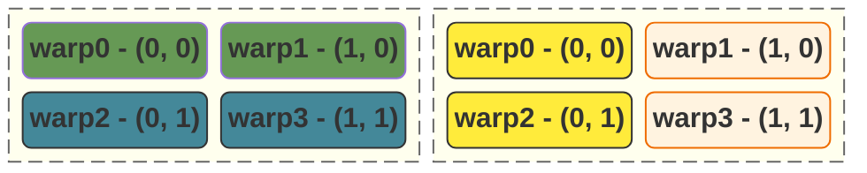

假设我们声明了一个 `2 * 2` 的 `warp`。

那么对于 `input`：

- `(0, 0)` 和 `(1, 0)` 访问的地址分别为 `0` 和 `1`；
- `(0, 1)` 和 `(1, 1)` 访问的地址分别为 `2` 和 `3`；

而他们不仅仅访问地址连续，他们在warp中也是连续的，所以他们可以合并访问；

而对于 `output`：

- `(0, 0)` 和 `(0, 1)` 访问的地址分别为 `0` 和 `1`；
- `(1, 0)` 和 `(1, 1)` 访问的地址分别为 `2` 和 `3`；

当一个 Warp 执行访存指令时，显存控制器会查看这 `4` 个线程**在这一瞬间**发出的所有请求：

- $T_0$ 访问 `0`
- $T_1$ 访问 `2`
- $T_2$ 访问 `1`
- $T_3$ 访问 `3`

**从显存控制器的视角来看：** 它看到 $T_0$ 要 `Addr 0`，$T_2$ 要 `Addr 1`。虽然这两个地址连在一起，但它们被分配到了不同的**掩码（Mask）**位上。在硬件内部，合并（Coalescing）是基于 **Warp Lane ID**（即线程在 Warp 中的编号）顺序进行的。如果 $T_0$ 访问 $A$，而 $T_1$ 访问的不是 $A+1$，硬件就会认为这个请求是“发散”的。它不会去扫描整个 Warp 看看 $T_8$ 是否刚好要 $A+1$ 并把它们拼起来。它会直接判定：这组请求无法合并为一个简单的 **128-byte 事务**，必须拆分成多个 **32-byte 事务** 甚至更小的请求。

#### 引入Shared Memory实现合并写入

换个思路，我们可以先读取数据：

```mermaid
block-beta

columns 2

block:z0:1
    columns 2
    b0("warp0 - (0, 0)") b1("warp1 - (1, 0)")
    b2("warp2 - (0, 1)") b3("warp3 - (1, 1)")
end

class b0,b1 green
class b2,b3 blue
class z0 animate

classDef transparent fill:none,stroke:none,color:inherit;
classDef content fill:#fff,stroke:#ccc;
classDef animate stroke:#666,stroke-dasharray: 8 4,stroke-dashoffset: 900,animation: dash 20s linear infinite;
classDef yellow fill:#FFEB3B,stroke:#333,color:#000,font-weight:bold;
classDef blue fill:#489,stroke:#333,color:#fff,font-weight:bold;
classDef pink fill:#FFCCCC,stroke:#333,color:#333,font-weight:bold;
classDef light_green fill:#e8f5e9,stroke:#695;
classDef green fill:#695,color:#fff,font-weight:bold;
classDef purple fill:#968,stroke:#333,color:#fff,font-weight:bold;
classDef gray fill:#ccc,stroke:#333,font-weight:bold;
classDef error fill:#bbf,stroke:#f65,stroke-width:2px,color:#fff,stroke-dasharray: 5 5;
classDef coral fill:#f8f,stroke:#333,stroke-width:4px;
classDef orange fill:#fff3e0,stroke:#ef6c00,color:#ef6c00,font-weight:bold;
```

当我们转换时，我们先将转换后的数据写入到 Shared Memory，此时我们无需考虑顺序写入的问题：

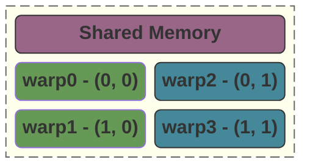

随后，我们再将 Shared Memory 中的数据原样输出：

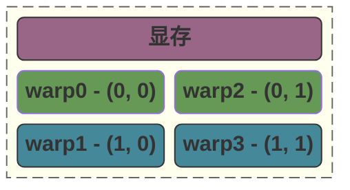

即可完成合并写入。

#### 代码实现

整个过程可以描述为：

1. 我们先通过 `blockIdx.y * TY` 和 `blockIdx.x * TX` 找到我们 `block` 的基准偏移量；
2. 此时，我们需要通过这个基准偏移量去访问内部的 Shared Memory。此时，我们对

1. 当我们转置矩阵前，x 表示 col，y 表示 row，此时访问显存是连续的。
2. 转置之后，x 表示 row，y 表示 col，此时访问显存变得不连续。但是，我们先把数据写入到 SM，此时不用考虑合并访问的问题。
3. 最后在输出的时候，我们先找到 block 的基准索引，并使用 (x, y) 作为偏移量去输出。此时出现一个神奇的情况：
   1. 在 output 这边，x 表示的是列，它可以合并访问；
   2. 在 sm 这边，x 表示的是行，它不需要考虑合并访问。

**这里，我们是通过将线程的职责做了转置 -- 本来应该去访问行的线程，我们现在让他去访问列了。**

```c++ mark:25-29
#include <cuda_runtime.h>

#define CEIL_DIV(x, y) (((x) + (y) - 1) / (y))

constexpr int TX = 16;
constexpr int TY = 16;

__global__ void matrix_transpose_kernel(const float* input, float* output, int rows, int cols) {
    __shared__ float ssm[TY][TX];

    int local_row = threadIdx.y;
    int local_col = threadIdx.x;

    int block_row = blockIdx.y * TY;
    int block_col = blockIdx.x * TX;

    int global_row = block_row + local_row;
    int global_col = block_col + local_col;
    if (global_col < cols && global_row < rows) {
        // 转置矩阵到sm
        ssm[local_row][local_col] = input[global_row * cols + global_col];
    }
    __syncthreads();

    int gx_out = block_row + local_col;
    int gy_out = block_col + local_row;
    if (gx_out < rows && gy_out < cols) {
        output[gy_out * rows + gx_out] = ssm[local_col][local_row];
    }
}

// input, output are device pointers (i.e. pointers to memory on the GPU)
extern "C" void solve(const float* input, float* output, int rows, int cols) {
    dim3 threadsPerBlock(TX, TY);
    dim3 blocksPerGrid(CEIL_DIV(cols, TX), CEIL_DIV(rows, TY));

    matrix_transpose_kernel<<<blocksPerGrid, threadsPerBlock>>>(input, output, rows, cols);
    cudaDeviceSynchronize();
}
```

### Bank Conflict

在我们的代码中，有两个位置会访问 Shared Memory：

- `ssm[local_row][local_col]` 这里我们每个线程访问的 `bank` 等于 `(local_row * TY + local_col) % 32`，也就是说：只要我们的 `local_row` 是连续的，就不会产生 `bank conflict`；
- `ssm[local_col][local_row]` 这里我们每个线程访问的 `bank` 等于 `(local_col * TY + local_row) % 32`，此时，`local_row`(threadIdx.y) 不变，而 `local_col` 递增：
  - 如果 `local_col` 等于 `32`，那么会发生 `32-way bank conflict`
  - 如果 `local_col` 等于 `16`，那么会发生 `16-way bank conflict`

我们可以通过 `__shared__ float ssm[TY][TX + 1];` 避免这个问题。

```c++ mark:9,13,17
#include <cuda_runtime.h>

#define CEIL_DIV(x, y) (((x) + (y) - 1) / (y))

constexpr int TX = 16;
constexpr int TY = 16;

__global__ void matrix_transpose_kernel(const float* input, float* output, int rows, int cols) {
    __shared__ float ssm[TY][TX + 1];
    // ...
    if (global_col < cols && global_row < rows) {
        // 转置矩阵到sm
        ssm[local_row][local_col] = input[global_row * cols + global_col];
    }
	// ...
    if (gx_out < rows && gy_out < cols) {
        output[gy_out * rows + gx_out] = ssm[local_col][local_row];
    }
}
```

### 一些值得注意的细节

代码中位移需要注意的是以下两行：

- `int gx_out = blockIdx.y * TY + tx;`
- `int gy_out = blockIdx.x * TX + ty;`

**这里，我们会发现一个重要的前提：被转置的矩阵可以不是对称的，但是我们block中的TILE必须是对称的。**

对于那些可以完全填满我们的 `TX * TY` 整个TILE的块，逻辑很简单，会直接发生一个转置。**而对于那些不能填满我们的TILE的块，会存在一些特殊的逻辑。**我们以一个 `2 * 3` 的矩阵作为例子说明：

```mermaid
block-beta

columns 2

block:z0:1
    columns 3
    b0("(0, 0)") b1("(1, 0)") b2("(2, 0)")
    b3("(0, 1)") b4("(1, 1)") b5("(2, 1)")
end

class b0,b1,b2 green
class b3,b4,b5 light_green

class z0 animate

classDef transparent fill:none,stroke:none,color:inherit;
classDef content fill:#fff,stroke:#ccc;
classDef animate stroke:#666,stroke-dasharray: 8 4,stroke-dashoffset: 900,animation: dash 20s linear infinite;
classDef yellow fill:#FFEB3B,stroke:#333,color:#000,font-weight:bold;
classDef blue fill:#489,stroke:#333,color:#fff,font-weight:bold;
classDef pink fill:#FFCCCC,stroke:#333,color:#333,font-weight:bold;
classDef light_green fill:#e8f5e9,stroke:#695;
classDef green fill:#695,color:#fff,font-weight:bold;
classDef purple fill:#968,stroke:#333,color:#fff,font-weight:bold;
classDef gray fill:#ccc,stroke:#333,font-weight:bold;
classDef error fill:#bbf,stroke:#f65,stroke-width:2px,color:#fff,stroke-dasharray: 5 5;
classDef coral fill:#f8f,stroke:#333,stroke-width:4px;
classDef orange fill:#fff3e0,stroke:#ef6c00,color:#ef6c00,font-weight:bold;
```

转置后我们得到的是一个 `3 * 2` 的矩阵：

```mermaid
block-beta

columns 2

block:z0:1
    columns 2
    b0("(0, 0)") 
    b3("(1, 0)")
    b1("(0, 1)")
    b4("(1, 1)")
    b2("(0, 2)")
    b5("(1, 2)")
end

class b0,b3 green
class b1,b4 light_green
class b2,b5 blue

class z0 animate

classDef transparent fill:none,stroke:none,color:inherit;
classDef content fill:#fff,stroke:#ccc;
classDef animate stroke:#666,stroke-dasharray: 8 4,stroke-dashoffset: 900,animation: dash 20s linear infinite;
classDef yellow fill:#FFEB3B,stroke:#333,color:#000,font-weight:bold;
classDef blue fill:#489,stroke:#333,color:#fff,font-weight:bold;
classDef pink fill:#FFCCCC,stroke:#333,color:#333,font-weight:bold;
classDef light_green fill:#e8f5e9,stroke:#695;
classDef green fill:#695,color:#fff,font-weight:bold;
classDef purple fill:#968,stroke:#333,color:#fff,font-weight:bold;
classDef gray fill:#ccc,stroke:#333,font-weight:bold;
classDef error fill:#bbf,stroke:#f65,stroke-width:2px,color:#fff,stroke-dasharray: 5 5;
classDef coral fill:#f8f,stroke:#333,stroke-width:4px;
classDef orange fill:#fff3e0,stroke:#ef6c00,color:#ef6c00,font-weight:bold;
```

而我们的线程的索引则是（这里，我们假设线程是 `3 * 3` 可以全部覆盖的），可以看到：

- `(2, 0)` 和 `(2, 1)` 这两个节点将会被不会被计算，因为他们不满足判定条件；
- 而 `(0, 2)` 和 `(1, 2)` 这两个节点则会覆盖我们新输出的矩阵。

```mermaid
block-beta

columns 2

block:z0:1
    columns 3
    b0("(0, 0)")
    b1("(1, 0)")
    b2("(2, 0)")
    b3("(0, 1)")
    b4("(1, 1)")
    b5("(2, 1)")
    b6("(0, 2)")
    b7("(1, 2)")
    b8("(2, 2)")
end

class b0,b1 green
class b3,b4 light_green
class b6,b7 blue
class b2,b5,b8 error
class 

class z0 animate

classDef transparent fill:none,stroke:none,color:inherit;
classDef content fill:#fff,stroke:#ccc;
classDef animate stroke:#666,stroke-dasharray: 8 4,stroke-dashoffset: 900,animation: dash 20s linear infinite;
classDef yellow fill:#FFEB3B,stroke:#333,color:#000,font-weight:bold;
classDef blue fill:#489,stroke:#333,color:#fff,font-weight:bold;
classDef pink fill:#FFCCCC,stroke:#333,color:#333,font-weight:bold;
classDef light_green fill:#e8f5e9,stroke:#695;
classDef green fill:#695,color:#fff,font-weight:bold;
classDef purple fill:#968,stroke:#333,color:#fff,font-weight:bold;
classDef gray fill:#ccc,stroke:#333,font-weight:bold;
classDef error fill:#bbf,stroke:#f65,stroke-width:2px,color:#fff,stroke-dasharray: 5 5;
classDef coral fill:#f8f,stroke:#333,stroke-width:4px;
classDef orange fill:#fff3e0,stroke:#ef6c00,color:#ef6c00,font-weight:bold;
```

### 总结

无论我们在写多么复杂的算子（转置、矩阵乘法、卷积），我们脑子里那个**“基准（Base）+ 偏移（Offset）”**的分级坐标系就是一切逻辑的锚点。
$$
GlobalIndex = \underbrace{BlockIdx \times BlockDim}_{基准偏移量 (宏观)} + \underbrace{ThreadIdx}_{内部偏移量 (微观)}
$$
对于使用了线程粗化技术的，我们的 `BlockDim` 需要修改为步长：
$$
GlobalIndex = \underbrace{BlockIdx \times Stride}_{基准偏移量 (宏观)} + \underbrace{ThreadIdx}_{内部偏移量 (微观)}
$$

## Color Inversion

### threads和blocks分配策略

在处理大带宽需求的图像算子时，我们遵循两个核心策略来压榨 GPU 性能：

- **向量化访存 (Vectorized Access)**：通过将 `unsigned char*` 强转为 `uchar4*`，利用单条指令加载 128-bit 数据（4 个像素），将访存压力降至原来的 1/4。
- **线程粗化 (Thread Coarsening)**：通过参数 `BK` 让单个线程处理多个连续像素。这能有效分摊坐标计算和指令发射的开销。

#### 代码实现

```c++
#include <cuda_runtime.h>

#define CEIL_DIV(x, y) (((x) + (y) - 1) / (y))

constexpr int BX = 32;          // block中的x线程
constexpr int BY = 8;          // block中的y线程

constexpr int BK = 16;          // block内x轴步长，每次处理BK组RGB元素

constexpr int SX = BX * BK;     // block的x轴步长，每个RGB元素占据四个字节
constexpr int SY = BY;          // block的y轴步长，我们这里y轴为1

__global__ void invert_kernel(unsigned char* image, int width, int height) {
    uchar4* pixel4 = reinterpret_cast<uchar4*>(image);
    // 注意，这里我们使用的是TILE和线程交错排布，所以相对偏移量不需要乘以BK
    const int gx = blockIdx.x * SX + threadIdx.x;
    const int gy = blockIdx.y * SY + threadIdx.y;

    for (int i = 0; i < BK; i++) {
        const int tx = gx + i * BX;
        if (tx < width && gy < height) {
            int idx = gy * width + (gx + i * BX);
            uchar4 pixel = pixel4[idx];
            pixel.x = 255 - pixel.x;
            pixel.y = 255 - pixel.y;
            pixel.z = 255 - pixel.z;
            pixel4[idx] = pixel;
        }
    }
}

// image_input, image_output are device pointers (i.e. pointers to memory on the GPU)
extern "C" void solve(unsigned char* image, int width, int height) {
    dim3 threadsPerBlock(BX, BY);
    dim3 blocksPerGrid(CEIL_DIV(width, SX), CEIL_DIV(height, SY));
    invert_kernel<<<blocksPerGrid, threadsPerBlock>>>(image, width, height);
    cudaDeviceSynchronize();
}
```

### 性能分析

在我们这个**使用了x轴线程粗化技术**的代码中，我们存在一个严重的问题：我们在 `TESLA` 上，我们的 `BK` 越小，反而执行的性能越快！而在我自己的 `4060 TI` 上却完全是正好相反的：

| `WIDTH` | `BX` | `BY` | `HEIGHT` | `BK` | `TESLA T4` | `4060 TI` |
| ------- | ---- | ---- | -------- | ---- | ---------- | --------- |
| 5120    | 32   | 8    | 4096     | 1    | 0.72ms     | 862257ns  |
| 5120    | 32   | 8    | 4096     | 8    | 0.86ms     | 569921ns  |
| 5120    | 32   | 8    | 4096     | 16   | 0.89ms     | 588599ns  |

这是一个很神奇的现象，我们下面仔细研究一下这个问题。先来看看T4和4060 TI的差别：

| **关键参数**         | **Tesla T4 (Turing)** | **RTX 4060 Ti (Ada)** | **对优化的影响**                            |
| -------------------- | --------------------- | --------------------- | ------------------------------------------- |
| **显存位宽**         | **256-bit**           | **128-bit**           | **4060 Ti 的总线更窄，更依赖缓存命率**      |
| **L2 缓存容量**      | **4 MB**              | **32 MB**             | **核心差异点**。L2 越大，重复访存的代价越低 |
| **架构代次**         | Turing (2018)         | Ada Lovelace (2023)   | 架构越新，单核指令周期（IPC）越高           |
| **SM 数量**          | 40                    | 34                    | SM 越多，能并行的 Block 数量越多            |
| **显存带宽**         | 320 GB/s              | 288 GB/s              | T4 原始带宽甚至略高，但 4060 Ti 靠 L2 补齐  |
| **单精度浮点性能**   | 8.1 TFLOPS            | 22.1 TFLOPS           | 4060 Ti 的计算能力是 T4 的 2.7 倍           |
| **核心频率 (Boost)** | ~1590 MHz             | ~2535 MHz             | 4060 Ti 跑指令的速度明显快得多              |

在这些参数中，`架构代次`，`SM数量`，`显存带宽`，`单精度浮点性能`，`核心频率` 这几个参数只会影响我们程序的绝对运行时间，不会影响我们在不同配置下的计算时间，所以我们主要需要关注的是：

- `L2缓存容量` T4 的 L2 只有 4MB。当我们使用大 `BK` 时，每个线程处理的数据范围变大，在 40 个 SM 并发的情况下，很容易就把这 4MB 撑爆，导致缓存频繁失效，不得不去慢速的显存读取数据。而 4060 TI 拥有更大的缓存，这意味着我们缓存命中的情况更高；
- `显存位宽`：理论上，更高的显存位宽会带来更大的显存读取流量，但是这里有可能会因为L2缓存过小的原因浪费。

```bash
ncu --metrics l1tex__t_sector_hit_rate.pct,lts__t_sector_hit_rate.pct,sm__inst_executed.avg.per_cycle_active,sm__warps_active.avg ./build/color_inversion
```

我们得到了如下输出：

```
    Section: Command line profiler metrics
    -------------------------------------- ----------- ------------
    Metric Name                            Metric Unit Metric Value
    -------------------------------------- ----------- ------------
    l1tex__t_sector_hit_rate.pct                     %        48.85
    lts__t_sector_hit_rate.pct                       %        50.03
    sm__inst_executed.avg.per_cycle_active  inst/cycle         0.27
    sm__warps_active.avg                          warp  56986735.50
    -------------------------------------- ----------- ------------
```

- `l1tex__t_sector_hit_rate.pct` 和 `lts__t_sector_hit_rate.pct` 显示有 **50%** 的命中率。这其实印证了 **写入分配（Write Allocation）** 机制： 在现代 GPU 中，当我们往显存写数据时，系统会先检查这块地址是否在 L2 中。由于我们处理的是连续像素（`uchar4`），线程 A 读取了像素，线程 B 随后写入。**读操作**产生的 Cache Line 被保留在 L2 中，使得紧随其后的**写操作**直接命中了缓存。这 50% 的命中率意味着我们的**写操作几乎全部在 L2 内部完成**，极大地缓解了 4060 Ti 那窄小的 128-bit 总线压力。
- **`sm__inst_executed.avg.per_cycle_active` (0.27)** ：表示指令执行效率：0.27 inst/cycle，因为这是一个典型的**访存受限（Memory-bound）**算子。核心大部分时间都在等待显存返回数据，而不是在忙着做计算。

## Matrix Addition

### 矩阵加法的两种naive实现

我们基于 `1D线性模型` 和 `基于矩阵模型` 两种不同的逻辑实现了矩阵加法，然而，**基于1D线性模型的实现速度接近于基于矩阵模型的两倍。**这里主要的性能差距是由于：

1. 线性模型的判定条件 `idx < N * N` 在最后计算结束的那个 `block` 之前，所有的判定均为真；而 `tx < N && ty < N`，假设 `N % tx` 或者 `N % ty` 有一个不为零的话，那么每个 `block` 都会出现空转线程；
2. 2D 布局在逻辑上是块状的，但显存是线性的。一旦 $N$ 的宽度没对齐到硬件的 Cache Line（通常是 128 字节），2D 访问在每一行的末尾都会产生**内存空洞**。
3. `1D模型` 指令强度更高：
   - `1D模型` 中，计算索引只需要一条 MAD 指令：`blockIdx.x * blockDim.x + threadIdx.x`；
   - `2D模型` 中，计算索引需要三条 MAD 指令：
     - `tx = blockIdx.x * blockDim.x + threadIdx.x` 
     - `ty = blockIdx.y * blockDim.y + threadIdx.y` 
     - `idx = ty * N + tx`
4. 寄存器压力更大：每一个中间变量（`tx`, `ty`, `bx`, `by`）都需要占用线程的寄存器。而 `1D模型` 中只有两个中间变量用于计算索引；

#### 基于1D线性模型

```c++
#include <cstdio>
#include <cuda_runtime.h>

__global__ void matrix_add_scalar(const float* A, const float* B, float* C, int N) {
    int bx = blockIdx.x * blockDim.x;
    int tx = bx + threadIdx.x;
    if (tx < N * N) {
        C[tx] = A[tx] + B[tx];
    }
}

// A, B, C are device pointers (i.e. pointers to memory on the GPU)
extern "C" void solve(const float* A, const float* B, float* C, int N) {
    int threadsPerBlock = 256;
    int blocksPerGrid = (N * N + threadsPerBlock - 1) / threadsPerBlock;

    matrix_add_scalar<<<blocksPerGrid, threadsPerBlock>>>(A, B, C, N);
    cudaDeviceSynchronize();
}
```

#### 基于矩阵模型

```c++
#include <cstdio>
#include <cuda_runtime.h>

#define CEIL_DIV(x, y) (((x) + (y) - 1) / (y))

constexpr int BX = 32;
constexpr int BY = 8;

__global__ void matrix_add_scalar(const float* A, const float* B, float* C, int N) {
    int bx = blockIdx.x * blockDim.x;
    int by = blockIdx.y * blockDim.y;
    int tx = bx + threadIdx.x;
    int ty = by + threadIdx.y;
    if (tx < N && ty < N) {
        int idx = ty * N + tx;
        C[idx] = A[idx] + B[idx];
    }
}

// A, B, C are device pointers (i.e. pointers to memory on the GPU)
extern "C" void solve(const float* A, const float* B, float* C, int N) {
    dim3 threadsPerBlock(BX, BY);
    dim3 blocksPerGrid(CEIL_DIV(N, BX), CEIL_DIV(N, BY));

    matrix_add_scalar<<<blocksPerGrid, threadsPerBlock>>>(A, B, C, N);
    cudaDeviceSynchronize();
}
```

### 使用向量化加速优化

**根据我们前面的对于 `1D` 和 `2D` 模型的分析，我们可以确认：对于 `element-wise` 的算子，我们优先使用 `1D` 模型**。

在我们的代码中，我们直接将 `N * N` 的矩阵转换为一个包含 `N * N / 4` 个数字的数组，这样编程逻辑更加清晰简洁。

```c++
#include <cstdio>
#include <cuda_runtime.h>

#define CEIL_DIV(x, y) (((x) + (y) - 1) / (y))

constexpr int BX = 256;

__global__ void matrix_add_vectorized(const float4* A, const float4* B, float4* C, int N) {
    int tx = blockIdx.x * blockDim.x + threadIdx.x;
    if (tx < N) {
        float4 a = A[tx];
        float4 b = B[tx];
        C[tx] = make_float4(a.x + b.x, a.y + b.y, a.z + b.z, a.w + b.w);
    }
}

__global__ void matrix_add_scalar(const float* A, const float* B, float* C, int N) {
    int bx = blockIdx.x * blockDim.x;
    int tx = bx + threadIdx.x;
    if (tx < N) {
        C[tx] = A[tx] + B[tx];
    }
}

// A, B, C are device pointers (i.e. pointers to memory on the GPU)
extern "C" void solve(const float* A, const float* B, float* C, int N) {
    int threadsPerBlock = BX;

    int total_elements = N * N;
    if (reinterpret_cast<size_t>(A) % 16 == 0
        && reinterpret_cast<size_t>(B) % 16 == 0
        && reinterpret_cast<size_t>(C) % 16 == 0
        && (N * N) % 4 == 0) {

        total_elements /= 4;
        dim3 blocksPerGrid(CEIL_DIV(total_elements, threadsPerBlock));
        const float4 * vA = reinterpret_cast<const float4*>(A);
        const float4 * vB = reinterpret_cast<const float4*>(B);
        float4 * vC = reinterpret_cast<float4*>(C);
        matrix_add_vectorized<<<blocksPerGrid, threadsPerBlock>>>(vA, vB, vC, total_elements);
    } else {
        dim3 blocksPerGrid(CEIL_DIV(total_elements, threadsPerBlock));
        matrix_add_scalar<<<blocksPerGrid, threadsPerBlock>>>(A, B, C, total_elements);
    }

    cudaDeviceSynchronize();
}
```

# 并行归约及其变体

## Reduction - `add`

> Write a GPU program that performs parallel reduction on an array of 32-bit floating point numbers to compute their sum. The program should take an input array and produce a single output value containing the sum of all elements.

### Sequential Indexing

第一个版本，我们使用了 Sequential Indexing（顺序索引）规约的方式，将活跃的线程压缩到同一个 `warp` 中，即使在最后阶段仍然会存在 Thread Divergence，但是由于是指数级坍缩的，所以是可以接受的，这里有几个需要注意的点是：

1. 通过 `(gx < N) ? input[gx] : 0.0f;` 我们既避免了 thread divergence，同时我们还为所有的超出范围的数值赋予了一个不会改变加法结果的填充值，这样我们可以不需要去进行复杂的边界判定；
2. 通过 `for (unsigned stride = THREAD_PER_BLOCK / 2; stride > 0; stride >>= 1)`，我们将活跃线程压缩到相邻的线程中，这样执行的warp总是保持最高的活跃线程；
3. 通过 `if (tx < stride && tx < THREAD_PER_BLOCK)` 我们避免了代价高昂的 `/` 和 `%` 操作；

```cpp mark:7,8,10-17
__global__ void naive_add(const float *input, float *output, int N)
{
    __shared__ float ssm[THREAD_PER_BLOCK];

    const unsigned gx = blockDim.x * blockIdx.x + threadIdx.x;
    const unsigned tx = threadIdx.x;
    ssm[tx] = (gx < N) ? input[gx] : 0.0f;
    __syncthreads();

    for (unsigned stride = THREAD_PER_BLOCK / 2; stride > 0; stride >>= 1)
    {
        if (tx < stride && tx < THREAD_PER_BLOCK)
        {
            ssm[tx] += ssm[tx + stride];
        }
        __syncthreads();
    }

    if (tx == 0)
    {
        atomicAdd(output, ssm[0]);
    }
}
```

### shfl_down_sync

> 我们可以查看 [常用的线程束级原语](#常用的线程束级原语) 这一章节了解一下前置知识。

```cpp
#include <cuda_runtime.h>

#define CEIL_DIV(x, y) (((x) + (y) - 1) / (y))

constexpr unsigned THREAD_PER_BLOCK = 256;

__global__ void add_kernel(const float *input, float *output, int N)
{
    __shared__ float ssm[THREAD_PER_BLOCK];

    const unsigned gx = blockDim.x * blockIdx.x + threadIdx.x;
    const unsigned tx = threadIdx.x;
    // 注意，这里对于超出范围的我们初始化为 0.0f，这非常重要，可以有效的减少我们后续的边界条件判定
    ssm[tx] = (gx < N) ? input[gx] : 0.0f;
    __syncthreads();

    for (unsigned stride = THREAD_PER_BLOCK / 2; stride >= 32; stride >>= 1)
    {
        if (tx < stride && tx < THREAD_PER_BLOCK)
        {
            ssm[tx] += ssm[tx + stride];
        }
        __syncthreads();
    }

    if (tx < 32) {
        float val = ssm[tx];

        val += __shfl_down_sync(0xffffffff, val, 16);
        val += __shfl_down_sync(0xffffffff, val, 8);
        val += __shfl_down_sync(0xffffffff, val, 4);
        val += __shfl_down_sync(0xffffffff, val, 2);
        val += __shfl_down_sync(0xffffffff, val, 1);

        if (tx == 0) {
            atomicAdd(output, ssm[0]);
        }
    }
}

// input, output are device pointers (i.e. pointers to memory on the GPU)
extern "C" void solve(const float *input, float *output, int N)
{
    int blocksPerGrid = CEIL_DIV(N, THREAD_PER_BLOCK);
    add_kernel<<<blocksPerGrid, THREAD_PER_BLOCK>>>(input, output, N);
    cudaDeviceSynchronize();
}
```

### grid stride 模式下的 reduction

整体的思路是：

1. 以 `grid stride` 遍历整个输入，在这种情况下，我们在充分利用 `合并访问 `和 `L2缓存` 的情况下将所有的数据汇总到初始声明的 `block` 中；`block` 中的每个线程都包含了一个已经经历初步计算的值；
2. 对 `warp` 内的 `thread` 中的数据进行规约，将任意的 `warp` 的数据 `local_sum` 在规约后存入到 `warp` 中的第一个线程中；
3. 对 `block` 内 `warp` 中的数据进行规约，此时，我们的目标是将 `block` 中的全部 `warp` 的数据汇总。不同于 `warp` 内可以通过 `__shfl_down_sync` 进行通信，`warp` 之间必须通过 `Shared Memory` 进行数据共享：
   - `lane` 表示 thread 在 warp 中的索引；
   - `wid` 表示 warp 在block 中的索引；
4. 我们将每个 `warp` 下计算的到的数据（local_sum）存入到 `sm`，这里使用 `lane == 0` 的线程去更新（表示是 `warp` 中的第一个 `thread`），索引是 `wid`（表示 `block` 中的第 `wid` 个 `warp`），同时基于 `block` 级的 `__syncthreads()` 同步指令等待同步完成；
5. 此时，我们得到的 `sm` 中包含了，第 `wid` 个 `warp` 下的数据。此时，我们可以利用 `warp` 中 `thread` 数量等同于 `block` 中的 `warp` 数量这个特点，使用 `lane` 去访问 `sm` 中的数据。此时，我们又可以再次利用 `__shfl_down_sync` 来传输数据。
6. 最后，将得到的数据更新到输出。

```cpp
#include <cuda_runtime.h>

#define CEIL_DIV(x, y) (((x) + (y) - 1) / (y))

constexpr unsigned THREAD_PER_BLOCK = 256;

__global__ void final_optimized_reduce(const float *input, float *output, int N)
{
    float local_sum = 0.0f;

    // --- 1. Grid-Stride Loop ---
    // 每个线程处理多个元素，直接消灭了启动过多 Block 的需求
    for (int i = blockIdx.x * blockDim.x + threadIdx.x; i < N; i += blockDim.x * gridDim.x)
    {
        local_sum += input[i];
    }

    // 和之前以 block 作为维度不一样，我们暂时只计算 warp 内的数据
    unsigned int mask = 0xffffffff;
    local_sum += __shfl_down_sync(mask, local_sum, 16);
    local_sum += __shfl_down_sync(mask, local_sum, 8);
    local_sum += __shfl_down_sync(mask, local_sum, 4);
    local_sum += __shfl_down_sync(mask, local_sum, 2);
    local_sum += __shfl_down_sync(mask, local_sum, 1);

    // --- 2. Block 内部归约 (利用 Shared Memory + Shuffle) ---
    // 在当前的 CUDA 架构下，一个线程块（Block）的最大线程数限制是 1024。
    // 由于 1024 / 32 = 32，所以一个 Block 里最多只能有 32 个 Warp
    // lane 表示 thread 在 warp 中的索引，wid 表示 warp 在block 中的索引
    int lane = threadIdx.x % 32;
    int wid = threadIdx.x / 32;

    __shared__ float ssm[32];
    // 每个 Warp 的 0 号线程把结果存入共享内存
    if (lane == 0)
        ssm[wid] = local_sum;
    __syncthreads();

    // 对剩下的 warp 进行规约(假设 256 线程有 8 个 Warp)
    // 这里我们按照warp的上限32个来计算，可以保证最终灵活性，但是如果追求极限性能
    // 我们可以根据 warp 的数量来进行定制。
    // 这里，我们让0号warp中的32个线程去读取ssm中的32个warp总和
    if (wid == 0)
    {
        // 如果 Block 线程数不满 1024，超过部分补 0 (防止累加到旧的共享内存垃圾值)
        float val = (lane < (blockDim.x / 32)) ? ssm[lane] : 0.0f;
        val += __shfl_down_sync(mask, val, 16);
        val += __shfl_down_sync(mask, val, 8);
        val += __shfl_down_sync(mask, val, 4);
        val += __shfl_down_sync(mask, val, 2);
        val += __shfl_down_sync(mask, val, 1);

        // 这样，我们计算的时候已经只需要计算 gridDim.x 次
        if (lane == 0)
            atomicAdd(output, val);
    }
}

// input, output are device pointers (i.e. pointers to memory on the GPU)
extern "C" void solve(const float *input, float *output, int N)
{
    int blocksPerGrid = CEIL_DIV(N, THREAD_PER_BLOCK);
    final_optimized_reduce<<<blocksPerGrid, THREAD_PER_BLOCK>>>(input, output, N);
    cudaDeviceSynchronize();
}
```

## Dot Product & MSE

`Dot product` 和 `MSE` 的逻辑其实非常简单，就是在启动之前对算法进行乘积或者MSE操作，随后整体的代码和 `Reduction - Add`逻辑完全相同：

```cpp
#include <cuda_runtime.h>

#define CEIL_DIV(x, y) (((x) + (y) - 1) / (y))

constexpr unsigned FULl_MASK = 0xffffffff;
constexpr unsigned THREAD_PER_BLOCK = 256;
constexpr unsigned WARP_PER_BLOCK = CEIL_DIV(THREAD_PER_BLOCK, 32);

__device__ __forceinline__ float add_reduce(float val)
{
    val += __shfl_down_sync(FULl_MASK, val, 16);
    val += __shfl_down_sync(FULl_MASK, val, 8);
    val += __shfl_down_sync(FULl_MASK, val, 4);
    val += __shfl_down_sync(FULl_MASK, val, 2);
    val += __shfl_down_sync(FULl_MASK, val, 1);
    return val;
}

__global__ void mse_kernel(const float *predictions, const float *targets, float *mse, int N)
{
    float local_val = 0.0f;
    unsigned tid = blockDim.x * blockIdx.x + threadIdx.x;
    unsigned block_tile = gridDim.x * blockDim.x;
    for (unsigned idx = tid; idx < N; idx += block_tile)
    {
        float delta = predictions[idx] - targets[idx];
        local_val += delta * delta;
    }

    local_val = add_reduce(local_val);
    __shared__ float ssm_data[32];
    unsigned lane = threadIdx.x % 32;
    unsigned warp_id = threadIdx.x / 32;
    if (lane == 0)
    {
        ssm_data[warp_id] = local_val;
    }
    __syncthreads();
    if (warp_id == 0)
    {
        float warp_val = lane < WARP_PER_BLOCK ? ssm_data[lane] : 0.0f;
        warp_val = add_reduce(warp_val);
        if (lane == 0)
        {
            atomicAdd(mse, warp_val / N);
        }
    }
}

// predictions, targets, mse are device pointers
extern "C" void solve(const float *predictions, const float *targets, float *mse, int N)
{
    mse_kernel<<<120, THREAD_PER_BLOCK>>>(predictions, targets, mse, N);
    cudaDeviceSynchronize();
}
```

## softmax

softmax 的公式如下：
$$
\text{Softmax}(x_i) = \frac{e^{x_i}}{\sum_{j=1}^{n} e^{x_j}}
$$
然而，在实际的应用中：$e^{x_j}$ 是一个指数级的值，有相当大的概率会溢出，所以我们通常在代码的实现中会利用 `softmax` 的一个特性：
$$
\frac{e^{x_i - C}}{\sum e^{x_j - C}} = \frac{e^{x_i} \cdot e^{-C}}{\sum e^{x_j} \cdot e^{-C}} = \frac{e^{x_i} \cdot e^{-C}}{e^{-C} \cdot \sum e^{x_j}} = \frac{e^{x_i}}{\sum e^{x_j}}
$$


将整个输入都减去一个固定的值 `C` 之后，`softmax` 的值不变：为了保证所有 $e^x$ 的指数项都不超过 0（即最大值为 $e^0 = 1$），我们选择令 $C = \max(x)$。

那么，在我们的整个的计算过程就需要如下操作：

```cpp
max_kernel(input, d_max, N);				// 求最大值
reduce_exp_sum_kernel(input, d_sum, d_max, N);	// 求softmax的sum值
softmax_kernel(input, output, N);	// 求softmax值
```

### naive实现

```cpp
#include <cuda_runtime.h>
#include <cstdio>
#include <float.h>

#define CEIL_DIV(x, y) (((x) + (y) - 1) / (y))

constexpr unsigned BLOCKS_FOR_TESLA = 120;
constexpr unsigned FULl_MASK = 0xffffffff;
constexpr unsigned THREAD_PER_BLOCK = 256;
constexpr unsigned WARP_PER_BLOCK = CEIL_DIV(THREAD_PER_BLOCK, 32);

__global__ void max_kernel(const float *input, float *max, int N)
{
    float local_max = -FLT_MAX;
    unsigned tid = blockIdx.x * blockDim.x + threadIdx.x;
    unsigned block_tile = gridDim.x * blockDim.x;
    for (unsigned idx = tid; idx < N; idx += block_tile)
    {
        local_max = fmaxf(local_max, input[idx]);
    }

    local_max = fmaxf(local_max, __shfl_down_sync(FULl_MASK, local_max, 16));
    local_max = fmaxf(local_max, __shfl_down_sync(FULl_MASK, local_max, 8));
    local_max = fmaxf(local_max, __shfl_down_sync(FULl_MASK, local_max, 4));
    local_max = fmaxf(local_max, __shfl_down_sync(FULl_MASK, local_max, 2));
    local_max = fmaxf(local_max, __shfl_down_sync(FULl_MASK, local_max, 1));

    __shared__ float ssm_max[32];
    unsigned lane = threadIdx.x % 32;
    unsigned warp_id = threadIdx.x / 32;
    if (lane == 0)
    {
        ssm_max[warp_id] = local_max;
    }
    __syncthreads();

    if (warp_id == 0)
    {
        float block_max = (lane < WARP_PER_BLOCK) ? ssm_max[lane] : -FLT_MAX;
        block_max = fmaxf(block_max, __shfl_down_sync(FULl_MASK, block_max, 16));
        block_max = fmaxf(block_max, __shfl_down_sync(FULl_MASK, block_max, 8));
        block_max = fmaxf(block_max, __shfl_down_sync(FULl_MASK, block_max, 4));
        block_max = fmaxf(block_max, __shfl_down_sync(FULl_MASK, block_max, 2));
        block_max = fmaxf(block_max, __shfl_down_sync(FULl_MASK, block_max, 1));
        if (lane == 0)
        {
            atomicMax((int *)max, __float_as_int(block_max));
        }
    }
}

__global__ void reduce_exp_sum_kernel(const float *input, float *max, float *sum, int N)
{
    float local_sum = 0;
    unsigned tid = blockIdx.x * blockDim.x + threadIdx.x;
    unsigned block_tile = gridDim.x * blockDim.x;
    for (unsigned idx = tid; idx < N; idx += block_tile)
    {
        local_sum += expf(input[idx] - max[0]);
    }

    local_sum += __shfl_down_sync(FULl_MASK, local_sum, 16);
    local_sum += __shfl_down_sync(FULl_MASK, local_sum, 8);
    local_sum += __shfl_down_sync(FULl_MASK, local_sum, 4);
    local_sum += __shfl_down_sync(FULl_MASK, local_sum, 2);
    local_sum += __shfl_down_sync(FULl_MASK, local_sum, 1);

    __shared__ float ssm_sum[32];
    unsigned lane = threadIdx.x % 32;
    unsigned warp_id = threadIdx.x / 32;
    if (lane == 0)
    {
        ssm_sum[warp_id] = local_sum;
    }
    __syncthreads();

    if (warp_id == 0)
    {
        float block_sum = (lane < WARP_PER_BLOCK) ? ssm_sum[lane] : 0;
        block_sum += __shfl_down_sync(FULl_MASK, block_sum, 16);
        block_sum += __shfl_down_sync(FULl_MASK, block_sum, 8);
        block_sum += __shfl_down_sync(FULl_MASK, block_sum, 4);
        block_sum += __shfl_down_sync(FULl_MASK, block_sum, 2);
        block_sum += __shfl_down_sync(FULl_MASK, block_sum, 1);
        if (lane == 0)
        {
            atomicAdd(sum, block_sum);
        }
    }
}

__global__ void softmax_kernel(const float *input, float* output, float *max, float *sum, int N)
{
    unsigned tid = blockIdx.x * blockDim.x + threadIdx.x;
    unsigned block_tile = gridDim.x * blockDim.x;
    for (unsigned idx = tid; idx < N; idx += block_tile)
    {
        float exp = input[idx] - *max;
        output[idx] = expf(exp) / *sum;
    }
}

// input, output are device pointers (i.e. pointers to memory on the GPU)
extern "C" void solve(const float *input, float *output, int N)
{
    float *d_max;
    float *d_sum;
    cudaMallocAsync(&d_max, sizeof(float), cudaStreamDefault);
    cudaMallocAsync(&d_sum, sizeof(float), cudaStreamDefault);
    max_kernel<<<BLOCKS_FOR_TESLA, THREAD_PER_BLOCK>>>(input, d_max, N);
    reduce_exp_sum_kernel<<<BLOCKS_FOR_TESLA, THREAD_PER_BLOCK>>>(input, d_max, d_sum, N);
    softmax_kernel<<<BLOCKS_FOR_TESLA, THREAD_PER_BLOCK>>>(input, output, d_max, d_sum, N);

    {
        float h_max = 0.0f;
        float h_sum = 0.0f;
        cudaMemcpy(&h_max, d_max, sizeof(float), cudaMemcpyKind::cudaMemcpyDeviceToHost);
        cudaMemcpy(&h_sum, d_sum, sizeof(float), cudaMemcpyKind::cudaMemcpyDeviceToHost);
        printf("max = %f, sum = %f\n", h_max, h_sum);
    }

    cudaDeviceSynchronize();
}

```

# 多维索引与空间转换

## subarray sum

> Implement a program that computes the sum of a subarray of 32-bit integers. You are given an input array `input` of length `N`, and two indices `S` and `E`. `S` and `E` are inclusive, 0-based start and end indices — compute the sum of `input[S..E]`.

乍一看，`subarray sum` 和普通的 `sum` 是完全一致的逻辑，但是最大的问题在于：对于普通的通过 `cudaMemAlloc()` 分配的内存都是 `16` 字节对齐的，而当我们在计算 `sumarray sum` 时它不一定是 `16` 字节对齐的。这导致的结果就是，每一次读取数据总会需要两次读取事务，虽然一般来说，这两次读取中的前者可以通过L1缓存直接拿到数据，然而带来的性能开销是实打实的。

我们有三个方案：

1. 将数据划分为 `矢量加速部分` 和 `prolog` 和 `epilog` 三个部分;
2. 将数据在一个循环中覆盖， 在计算时通过 `(idx0 + 2 >= 0 && idx0 + 2 <= max_idx) ? data.z : 0;` 的形式避免引入条件判断分支引起 thread diverge；
3. 使用三个不同的核函数计算`矢量加速部分` 和 `prolog` 和 `epilog`。

> 这是一个非常经典的高性能计算（HPC）权衡问题 -- **指令冗余（Instruction Overhead）**与**逻辑开销（Logic Overhead）**之间的矛盾。

为了对比这三个方案，我们需要从 **GPU 的执行特性**（指令吞吐、线程分支、访存延迟）来深度拆解：

| **维度**     | **方案 1：掩码全量计算 **              | **方案 2：单核分段 (Prolog + Loop + Epilog)** | **方案 3：多核分段 (Thrust/CUB 风格)** |
| ------------ | -------------------------------------- | --------------------------------------------- | -------------------------------------- |
| **核心逻辑** | `sum += (mask) ? data : 0`             | `sum += data` (主循环)                        | `sum += data` (主循环)                 |
| **指令效率** | **中**：每个 `int` 都要多做 2 个判断。 | **高**：主循环指令极简。                      | **最高**：主循环指令极简。             |
| **分支代价** | **极低**：无 Divergence，全员同步。    | **中**：循环前后的分支可能导致部分线程闲置。  | **低**：每个核函数内部都很纯粹。       |
| **显存带宽** | **满血**：完美的 128-bit 对齐加载。    | **血亏/复杂**：处理开头对齐非常繁琐。         | **满血**：各司其职。                   |
| **内核开销** | **极低**：只启动 1 次 Kernel。         | **极低**：只启动 1 次 Kernel。                | **高**：多次启动 Kernel 的 API 延迟。  |

**在 GPU 上，方案 1 通常是“性价比”最高的：虽然方案 1 在主循环里多做了 `(mask) ? ... : 0`，但它在 GPU 硬件层面其实非常快。GPU 是访存密集型设备。`ld.global.v4` 从显存拿数据的延迟高达数百个周期，而 `SEL`（选择指令）或 `VSEL` 这种寄存器级别的逻辑判断只需要几个周期。**

```cpp
#include <cuda_runtime.h>
#include <stdint.h>

#define CEIL_DIV(x, y) (((x) + (y) - 1) / (y))
#define CLEAR_LOWER_16(addr) ((addr) & (~0xF))

constexpr unsigned THREAD_PER_BLOCK = 256;
constexpr unsigned WARP_PER_BLOCK = CEIL_DIV(THREAD_PER_BLOCK, 32);

__global__ void sum_kernel_masked(const int *base_ptr, int *output, int S, int E)
{
    unsigned tid = blockDim.x * blockIdx.x + threadIdx.x;
    unsigned stride = gridDim.x * blockDim.x;

    uintptr_t s_addr = reinterpret_cast<uintptr_t>(base_ptr + S);
    uintptr_t aligned_s_addr = CLEAR_LOWER_16(s_addr);
    unsigned vec_offset = (s_addr - aligned_s_addr) / sizeof(int);

    uintptr_t e_addr = reinterpret_cast<uintptr_t>(base_ptr + E + 1);
    unsigned vec_cnt = CEIL_DIV(e_addr - aligned_s_addr, 16);

    int local_sum = 0;
    int4 *data = reinterpret_cast<int4 *>(aligned_s_addr);
    // idx是在包含了prolog和epilog的int4数组中的索引
    for (unsigned idx = tid; idx < vec_cnt; idx += stride)
    {
        int4 val = data[idx];
        // sub_idx是在数组 [base_ptr + S, base_ptr + E + 1) 中的索引
        int idx_of_subarray = idx * 4 - vec_offset;
        int max_idx = E - S;

        local_sum += (0 <= idx_of_subarray && idx_of_subarray <= max_idx) ? val.x : 0;
        local_sum += (0 <= idx_of_subarray + 1 && idx_of_subarray + 1 <= max_idx) ? val.y : 0;
        local_sum += (0 <= idx_of_subarray + 2 && idx_of_subarray + 2 <= max_idx) ? val.z : 0;
        local_sum += (0 <= idx_of_subarray + 3 && idx_of_subarray + 3 <= max_idx) ? val.w : 0;
    }

#pragma unroll
    for (int offset = 16; offset > 0; offset >>= 1)
    {
        local_sum += __shfl_down_sync(0xFFFFFFFF, local_sum, offset);
    }

    __shared__ int ssm_sum[32];
    int lane = threadIdx.x % 32;
    int wid = threadIdx.x / 32;
    if (lane == 0)
    {
        ssm_sum[wid] = local_sum;
    }
    __syncthreads();

    if (wid == 0)
    {
        int block_sum = (lane < WARP_PER_BLOCK) ? ssm_sum[lane] : 0;
        #pragma unroll
        for (int offset = 16; offset > 0; offset >>= 1)
        {
            block_sum += __shfl_down_sync(0xFFFFFFFF, block_sum, offset);
        }
        if (lane == 0)
        {
            atomicAdd(output, block_sum);
        }
    }
}

extern "C" void solve(const int *input, int *output, int N, int S, int E)
{
    cudaMemset(output, 0, sizeof(int));
    if (E < S)
        return;

    sum_kernel_masked<<<160, THREAD_PER_BLOCK>>>(input, output, S, E);
    cudaDeviceSynchronize();
}
```

## subarray sum 2d

```cpp
#include <cuda_runtime.h>
#include <stdint.h>

#define WARP_SIZE 32

#define CEIL_DIV(x, y) (((x) + (y) - 1) / (y))
#define CLEAR_LOWER_16(addr) ((addr) & (~0xFULL))

// Assuming that we cover the 2D space by a 1D grid
__global__ void sum_kernel_2d_masked(const int *base_ptr, int *output,
                                     int M, int S_ROW, int E_ROW, int S_COL, int E_COL)
{
    int local_sum = 0;
    // 计算全局的tid，我们需要使用tid去计算当前线程所归属的warp
    // 这个warp决定了我们处理哪一行
    int global_tid = blockDim.x * blockIdx.x + threadIdx.x;
    int global_wid = global_tid / WARP_SIZE;
    int lane = threadIdx.x % 32;
    // 总的warp数量，决定了我们外层循环时的时间
    int total_warps = (gridDim.x * blockDim.x) / WARP_SIZE;

    int sub_w = E_COL - S_COL + 1;
    int sub_h = E_ROW - S_ROW + 1;

    // 总共有 sub_h 行，我们每个warp负责其中的一行
    for (int idx = global_wid; idx < sub_h; idx += total_warps)
    {
        // 通过基准行和偏移量找到目标行的入口地址
        int row = S_ROW + idx;
        const int *row_ptr = base_ptr + row * M + S_COL;

        // 通过入口地址计算一个可以16字节对齐的指针
        uintptr_t s_addr = reinterpret_cast<uintptr_t>(row_ptr);
        uintptr_t aligned_row_ptr = CLEAR_LOWER_16(s_addr);
        int vec_offset = static_cast<int>(s_addr - aligned_row_ptr) / sizeof(int);

        uintptr_t e_addr = reinterpret_cast<uintptr_t>(row_ptr + sub_w);
        int vec_num = CEIL_DIV((e_addr - aligned_row_ptr), 16);

        const int4 *data = reinterpret_cast<const int4 *>(aligned_row_ptr);
        for (int i = lane; i < vec_num; i += WARP_SIZE)
        {
            int4 val = data[i];
            int idx_of_sub = i * 4 - vec_offset;

            local_sum += (0 <= idx_of_sub && idx_of_sub < sub_w) ? val.x : 0;
            local_sum += (0 <= idx_of_sub + 1 && idx_of_sub + 1 < sub_w) ? val.y : 0;
            local_sum += (0 <= idx_of_sub + 2 && idx_of_sub + 2 < sub_w) ? val.z : 0;
            local_sum += (0 <= idx_of_sub + 3 && idx_of_sub + 3 < sub_w) ? val.w : 0;
        }
    }

#pragma unroll
    for (int offset = 16; offset > 0; offset >>= 1)
    {
        local_sum += __shfl_down_sync(0xFFFFFFFF, local_sum, offset);
    }
    if (lane == 0)
    {
        atomicAdd(output, local_sum);
    }
}

extern "C" void solve(const int *input, int *output, int N, int M,
                      int S_ROW, int E_ROW, int S_COL, int E_COL)
{
    cudaMemset(output, 0, sizeof(int));
    if (E_ROW < S_ROW || E_COL < S_COL)
    {
        return;
    }
    // 启动 120 个 Block，每个 Block 256 线程，占满典型 GPU
    sum_kernel_2d_masked<<<120, 256>>>(input, output, M, S_ROW, E_ROW, S_COL, E_COL);
}
```

## subarray sum 3d

```cpp
#include <cuda_runtime.h>
#include <stdint.h>
#include <cstdio>

#define CEIL_DIV(x, y) (((x) + (y) - 1) / (y))
#define CLEAR_LOWER_16(addr) ((addr) & (~0xFULL))

__global__ void sum_kernel_3d_masked(const int *base_ptr, int *output,
                                     int W, int H,
                                     int S_D, int E_D, int S_H, int E_H, int S_W, int E_W)
{
    // init parameters
    int global_tid = blockIdx.x * blockDim.x + threadIdx.x;
    int global_wid = global_tid / warpSize;
    int lane = threadIdx.x % warpSize;
    int total_warps = (gridDim.x * blockDim.x) / 32;

    // init target info
    int sub_w = E_W - S_W + 1;
    int sub_h = E_H - S_H + 1;
    int sub_d = E_D - S_D + 1;
    int total_lines = sub_d * sub_h;

    // init start parameters
    int local_sum = 0;
    for (int idx = global_wid; idx < total_lines; idx += total_warps)
    {
        int deep = idx / sub_h;
        int row_in_deep = idx % sub_h;

        int curr_d = S_D + deep;
        int curr_h = S_H + row_in_deep;

        const int *row_ptr = base_ptr + (size_t)curr_d * W * H + (size_t)curr_h * W + S_W;
        uintptr_t s_addr = reinterpret_cast<uintptr_t>(row_ptr);
        uintptr_t s_aligned_addr = CLEAR_LOWER_16(s_addr);
        int vec_offset = (s_addr - s_aligned_addr) / sizeof(int);
        // printf("s_addr = %p, s_aligned_addr = %p, vec_offset = %d\n", s_addr, s_aligned_addr, vec_offset);

        uintptr_t e_addr = reinterpret_cast<uintptr_t>(row_ptr + sub_w);
        int vec_num = CEIL_DIV(e_addr - s_aligned_addr, 16);
        const int4 *data_line = reinterpret_cast<const int4 *>(s_aligned_addr);
        for (int line_idx = lane; line_idx < vec_num; line_idx += warpSize)
        {
            int4 val = data_line[line_idx];
            int s_ptr_val = line_idx * 4 - vec_offset;
            local_sum += (0 <= s_ptr_val + 0 && s_ptr_val + 0 < sub_w) ? val.x : 0;
            local_sum += (0 <= s_ptr_val + 1 && s_ptr_val + 1 < sub_w) ? val.y : 0;
            local_sum += (0 <= s_ptr_val + 2 && s_ptr_val + 2 < sub_w) ? val.z : 0;
            local_sum += (0 <= s_ptr_val + 3 && s_ptr_val + 3 < sub_w) ? val.w : 0;
        }
    }

#pragma unroll
    for (int delta = 16; delta > 0; delta >>= 1)
    {
        local_sum += __shfl_down_sync(0xFFFFFFFF, local_sum, delta);
    }

    if (lane == 0)
    {
        atomicAdd(output, local_sum);
    }
}

extern "C" void solve(const int *input, int *output,
                      int D, int H, int W,
                      int S_D, int E_D, int S_H, int E_H, int S_W, int E_W)
{
    cudaMemset(output, 0, sizeof(int));
    if (E_D < S_D || E_H < S_H || E_W < S_W)
    {
        return;
    }
    sum_kernel_3d_masked<<<120, 256>>>(
        input, output,
        W, H,
        S_D, E_D, S_H, E_H, S_W, E_W);
}
```

## 2D max pooling

在 `2D max pooling` 的计算中，**池化窗口必须完全落在有效区域内**。那么，对于一个参数为 `k`，`w`，`p` 的输入，我们：

- **有效总宽度**：$W_{\text{total}} = W + 2P$（原宽 + 左右 Padding）。
- **窗口起点限制**：假设窗口左侧起始索引为 $x$。
- 因为窗口宽度为 $K$，所以窗口右侧覆盖到 $x + K - 1$。
- 右侧不能超过总宽度：$x + K - 1 \leq (W + 2P) - 1$。
- 整理得到：**$x \leq W + 2P - K$**。这就是窗口起点能达到的**最大物理索引**。

现在我们的问题就转换为：**在 $[0, W + 2P - K]$ 这个范围内，按照步长 $S$ 移动，一共能放下多少个起点？**

我们可以把移动过程看作一个等差数列：

- 第 1 个窗口起点：$0$
- 第 2 个窗口起点：$S$
- 第 3 个窗口起点：$2S$
- ...
- 第 $n$ 个窗口起点：$(n-1) \times S$

根据上面的限制条件，最后一个起点的索引必须满足：

$$(n-1) \times S \leq W + 2P - K$$

我们要解的是最大正整数 $n$：

1. $(n-1) \leq \frac{W + 2P - K}{S}$
2. 由于索引必须是整数且步长是离散的，我们对右侧**向下取整**：$n-1 = \lfloor \frac{W + 2P - K}{S} \rfloor$
3. 移项得到：**$n = \lfloor \frac{W + 2P - K}{S} \rfloor + 1$**

在这个式子中，其实最难理解的部分是后面的这个 `1`，这里可以这样理解：

1. 和 `1` 相关的不是 `S`，而是 `W + 2P - K`，因为 `S`负责的是在宽上的移动，而我们的第一个元素并不需要移动 -- 它只需要确保 $W + 2P$（填充后的总长度）大于 $K$（kernel 的总长度）；
2. `S` 关联的是是否能够跳转到下一个元素。

```cpp
#include <cuda_runtime.h>
#include <device_launch_parameters.h>
#include <float.h>

#define CEIL_DIV(x, y) (((x) + (y) - 1) / (y))

// -------------------------------------------------------------------------------------------
// Kernel: 2D Max Pooling for NCHW layout
// -------------------------------------------------------------------------------------------
__global__ void max_pool_nchw_optimized(const float *__restrict__ input,
                                        float *__restrict__ output,
                                        int N, int C, int H, int W,
                                        int OUT_H, int OUT_W,
                                        int K, int S, int P)
{
    int ow = blockIdx.x * blockDim.x + threadIdx.x;
    int oh = blockIdx.y * blockDim.y + threadIdx.y;

    int nc = blockIdx.z;
    int c = nc % C;
    int n = nc / C;

    if (ow < OUT_W && oh < OUT_H)
    {
        const float *line_ptr = input + (size_t)n * C * H * W + (size_t)c * H * W;

        float max_val = -FLT_MAX;

        int ih_start = oh * S - P;
        int iw_start = ow * S - P;

#pragma unroll
        for (int kh = 0; kh < K; ++kh)
        {
            int ih = ih_start + kh;
            if (ih >= 0 && ih < H)
            {
#pragma unroll
                for (int kw = 0; kw < K; ++kw)
                {
                    int iw = iw_start + kw;
                    if (iw >= 0 && iw < W)
                    {
                        // ih = (oh * S - P) * W + iw
                        // ih 分为两个部分
                        // 1. (oh * S - P) * W，该部分对于同一行的数据是完全一致的
                        // 2. (ow * S - P) + kw，该部分 kw 一样，但是 ow * S 会导致，在 stride 不为1时发生非合并访问
                        float val = line_ptr[ih * W + iw];
                        if (val > max_val)
                            max_val = val;
                    }
                }
            }
        }

        // index ：n * (C * OUT_H * OUT_W) + c * (OUT_H * OUT_W) + oh * OUT_W + ow
        size_t out_idx = (size_t)n * C * OUT_H * OUT_W + (size_t)c * OUT_H * OUT_W + (size_t)oh * OUT_W + ow;
        output[out_idx] = max_val;
    }
}

// -------------------------------------------------------------------------------------------
// Host side: solve function
// -------------------------------------------------------------------------------------------
extern "C" void solve(const float *input, float *output, int N, int C, int H, int W,
                      int kernel_size, int stride, int padding)
{
    int OUT_W = (W + 2 * padding - kernel_size) / stride + 1;
    int OUT_H = (H + 2 * padding - kernel_size) / stride + 1;

    if (OUT_W <= 0 || OUT_H <= 0)
        return;

    dim3 block(32, 8, 1);

    // x -> OUT_W
    // y -> OUT_H
    // z -> N * C
    dim3 grid(
        CEIL_DIV(OUT_W, 32),
        CEIL_DIV(OUT_H, 8),
        N * C);

    max_pool_nchw_optimized<<<grid, block>>>(
        input, output,
        N, C, H, W,
        OUT_H, OUT_W,
        kernel_size, stride, padding);
}
```

## convolution 2d

### 算法实现描述

在我们的算法实现中，我们改变了之前的**线程 `(x, y)` 对应输出点的形式，而是对应于输入点。**这是因为，由于 `stride` 和 `kernel` 的存在，所以通过输出点去找输入点，并且将数据搬运到 `Shared Memory` 的实现很复杂，并且性能也并不高，我们通过浪费一定的线程（例如 `outoupt_x = input_x - kernel_x + 1`） 来实现更高效的数据搬运，在实现逻辑中：

1. 通过 `bx + tx` 确保了 Warp 中的 32 个线程在每一时刻访问的是连续的显存地址。
2. 使用 `tile_w` 和 `tile_h` 来容纳计算所需的全部像素（包括 `Halo` 区域），每个像素只从慢速显存读取 **1次**，后续 $K^2$ 次访问全部在极速的 Shared Memory 中完成。
3. 利用模板参数 `K_COLS` 将运行时变量转为编译时常量，此时我们可以通过 `#pragma unroll` 强制编译器展开循环，以浪费一定的寄存器的代价，避免了 for 中的循环控制指令（分支跳转，计数器加法）。
4. 将最常用的卷积核放入到 `__constant__` 中保证了访问速度；

### 内存布局 (Memory Layout)

| **内存类型**        | **对应变量**                      | **布局与角色**                                               |
| ------------------- | --------------------------------- | ------------------------------------------------------------ |
| **Global Memory**   | `input`, `output`                 | **宿主**。存储完整的图像数据。布局为行优先（Row-major）。访问延迟最高。 |
| **Shared Memory**   | `extern __shared__ float sm[]`    | **工作台**。存储一个线程块所需的“输入切片（Tile）+ 光环区（Halo）”。它是片上高速缓存。 |
| **Constant Memory** | `__constant__ float kernels[256]` | **参考表**。存储卷积核。对所有线程可见，具有极高的缓存命中率和广播特性。 |
| **Registers**       | `val`, `gx`, `ty` 等              | **私人空间**。每个线程私有的极速存储，用于存放累加的中间值和索引计算。 |

```cpp
#include <cuda_runtime.h>

constexpr unsigned TX = 32;
constexpr unsigned TY = 16;

#define CEIL_DIV(x, y) (((x) + (y) - 1) / (y))

__constant__ float kernels[256];

template <unsigned K_COLS>
__global__ void conv2d_kern(const float *input, float *output, int input_rows, int input_cols, int kernel_rows)
{
    extern __shared__ float sm[];
    unsigned bx = blockIdx.x * blockDim.x, by = blockIdx.y * blockDim.y;
    unsigned tx = threadIdx.x, ty = threadIdx.y;
    unsigned gx = bx + tx, gy = by + ty;

    unsigned tile_w = TX + K_COLS - 1;
    unsigned tile_h = TY + kernel_rows - 1;

    for (unsigned y = ty; y < tile_h; y += TY)
    {
        for (unsigned x = tx; x < tile_w; x += TX)
        {
            int global_x = bx + x;
            int global_y = by + y;
            if (global_x < input_cols && global_y < input_rows)
            {
                sm[y * tile_w + x] = input[global_y * input_cols + global_x];
            }
            else
            {
                sm[y * tile_w + x] = 0.0f;
            }
        }
    }
    __syncthreads();

    unsigned output_cols = input_cols - K_COLS + 1;
    unsigned output_rows = input_rows - kernel_rows + 1;
    if (gx < output_cols && gy < output_rows)
    {
        float val = 0.0f;
        for (unsigned kh = 0; kh < kernel_rows; kh++)
        {
#pragma unroll
            for (unsigned kw = 0; kw < K_COLS; kw++)
            {
                unsigned sm_x = tx + kw;
                unsigned sm_y = ty + kh;
                val += sm[sm_y * tile_w + sm_x] * kernels[kh * K_COLS + kw];
            }
        }
        output[gy * output_cols + gx] = val;
    }
}

// input, kernel, output are device pointers
extern "C" void solve(const float *input, const float *kernel, float *output,
                      int input_rows, int input_cols,
                      int kernel_rows, int kernel_cols)
{
    size_t kernel_size = kernel_rows * kernel_cols * sizeof(float);
    cudaMemcpyToSymbol(kernels, kernel, kernel_size);

    dim3 block(TX, TY);
    dim3 grid(CEIL_DIV(input_cols, TX), CEIL_DIV(input_rows, TY));
    unsigned s_mem_size = (TX + kernel_cols - 1) * (TY + kernel_rows - 1) * sizeof(float);
#define LAUNCH(K)                                                                                        \
    case K:                                                                                              \
        conv2d_kern<K><<<grid, block, s_mem_size>>>(input, output, input_rows, input_cols, kernel_rows); \
        break;
    switch (kernel_cols)
    {
        LAUNCH(1) LAUNCH(2) LAUNCH(3) LAUNCH(4)
        LAUNCH(5) LAUNCH(6) LAUNCH(7) LAUNCH(8)
        LAUNCH(9) LAUNCH(10) LAUNCH(11) LAUNCH(12)
        LAUNCH(13) LAUNCH(14) LAUNCH(15) LAUNCH(16)
    }
#undef LAUNCH
    cudaDeviceSynchronize();
}
```

# QA

## 常用的线程束级原语

常用的几个**线程束级原语（Warp-Level Primitives）**有以下几个：

- `__shfl_down_sync` 常用语从高位索取数据，并向低位传递；
- `__shfl_up_sync`  常用于计算**前缀和（Prefix Sum / Scan）**。每个线程拿左边人的值累加给自己；
- `__shfl_xor_sync` 线程 `i` 与线程 `i ^ laneMask` 进行交换。
- `__shfl_sync` 广播。比如让 0 号线程把它的结果告诉 Warp 里的所有人。

值得注意的是：虽然它们名字里带有 `_sync`，但通常不把它们归类为“同步指令”（像 `__syncthreads()` 这种才叫同步指令），因为同步只是它们为了保证数据安全而附带的特性，它们的**核心本质是“数据交换”**。

### __shfl_down_sync

```cpp
__SM_30_INTRINSICS_DECL__ float __shfl_down_sync(unsigned mask, float var, unsigned int delta, int width=warpSize) __DEF_IF_HOST
```

- `mask` 一个 32 位的掩码（通常是 `0xffffffff`），决定哪些线程参与。只有掩码中对应位为 1 的线程才会参与交换。
- `var` 我们想要分享的**当前线程**手中的变量；
- `delta` 偏移量。
- `width` 一般来说可以使用默认值（线程束的线程数量），但是在一些更高级、更复杂的算法中，`width` 提供了一种**“逻辑分组”**的能力：假设一个 Warp 有 32 个线程，我们执行了 `__shfl_down_sync(0xffffffff, val, 1, 8)`：
  - **线程 0-7** 组成第一组。线程 0 会拿到线程 1 的值，以此类推。但**线程 7 会拿到它自己的值**（或者根据具体实现返回原值），因为它右边没有同组的人了。它绝对不会去拿线程 8 的值。
  - **线程 8-15** 组成第二组。线程 8 拿线程 9 的值。
  - 以此类推。

下面的这段代码中，会将当前 `warp` 的所有线程（`mask = 0xffffffff`）持有的 `val`：

1. 第一次偏移量为 `16`，也就是 `thread[n] = thread[n + 16]`，对于 `n > 16` 的线程它会变成 `val += val`（即原值加原值）；这是因为，在 `__shfl_down_sync` 中，如果 `n + delta` 超出了当前分组（`width`）的边界，目标线程（n）会得到它**自己原始的 `var` 值**。
2. 第二次偏移量为 `8`，也就是 `thread[n] = thread[n + 8]`；
3. 以此类推。

```cpp
    if (tx < 32) {
        float val = ssm[tx];        

        val += __shfl_down_sync(0xffffffff, val, 16);
        val += __shfl_down_sync(0xffffffff, val, 8);
        val += __shfl_down_sync(0xffffffff, val, 4);
        val += __shfl_down_sync(0xffffffff, val, 2);
        val += __shfl_down_sync(0xffffffff, val, 1);
		// ....
    }
```

## 向量化加速

### 什么是向量化加速

在 CUDA 中，默认的读写是标量（Scalar）模式。比如 `float` 是 32 位（4 字节）。

- **标量模式**：每个线程发出指令：“给我拿 4 字节数据”。
- **向量模式**：每个线程发出指令：“给我拿 16 字节数据”（使用 `float4`）。

当我们使用 `float4` 时，编译器会生成 `LDG.E.128`（Load Global 128-bit）指令：

1. **减少指令数**：读取 16 字节，标量要跑 4 次指令发射循环，向量只需 1 次。
2. **合并事务利用率**：GPU 的显存控制器（Memory Controller）天生喜欢大块、连续的请求。128-bit（16 字节）是单个线程能发起的最大合法访问宽度，它能完美填满内存总线的带宽空隙。

### 如何使用向量化

使用向量化通常分为三个步骤：**定义内核、对齐检查、分流调用**。

#### 定义向量化内核

利用 CUDA 内置的向量类型，如 `int2`, `float2`, `float4`, `uchar4`。

```c++
__global__ void vectorized_kernel(const float4* A, const float4* B, float4* C, int n_v4) {
    int idx = blockIdx.x * blockDim.x + threadIdx.x;
    if (idx < n_v4) {
        // 一次操作 16 字节
        float4 a = A[idx]; 
        float4 b = B[idx];
        float4 res;
        res.x = a.x + b.x;
        res.y = a.y + b.y;
        res.z = a.z + b.z;
        res.w = a.w + b.w;
        C[idx] = res;
    }
}
```

#### 主机端的dispatch

首先，我们必须判断环境是否允许开启加速。

```c++
void solve(float* A, float* B, float* C, int N) {
    // 限制条件检查
    bool can_vectorize = ((size_t)A % 16 == 0) && 
                         ((size_t)B % 16 == 0) && 
                         ((size_t)C % 16 == 0) && 
                         (N % 4 == 0);

    if (can_vectorize) {
        vectorized_kernel<<<...>>>((float4*)A, (float4*)B, (float4*)C, N / 4);
    } else {
        scalar_kernel<<<...>>>(A, B, C, N);
    }
}
```

### 向量化加速的限制

向量化虽然快，但它是**“带镣铐的舞者”**。如果不遵守以下限制，程序会直接报错或崩溃。

#### 内存对齐限制 (Alignment)

- **规则**：地址必须是向量大小的整数倍。

- **具体要求**：`float4` 访问的地址必须能被 **16 字节** 整除。

- **后果**：如果地址是 `0x...08`（对齐了 8 字节但没对齐 16 字节），强行执行 `float4` 会报 `Misaligned Address` 错误。

#### 数据总量限制 (Divisibility)

- **规则**：总元素数量必须能被向量长度整除。

- **现实**：如果我们的数组有 103 个 `float`，我们按 `float4` 处理（103 / 4 = 25.75），最后 3 个元素就会被漏掉或者越界访问。

- **对策**：通常需要写“三段式”代码：处理开头的非对齐部分 -> 处理中间的向量部分 -> 处理末尾的残余部分。

#### 寄存器压力

- **规则**：向量化会增加单个线程对寄存器的占用。
- **影响**：一个 `float4` 变量直接占用 4 个 32 位寄存器。如果我们的内核逻辑非常复杂，向量化可能导致 **Occupancy（占用率）** 下降。
- **权衡**：在 4060 Ti 这种寄存器资源丰富的卡上通常不是问题，但在一些老旧显卡上，过度向量化可能反而变慢。

### 向量化加速的实现

> 向量化加速要求满足：
>
> 1. 初始地址内存对齐 16 字节；
> 2. 数据总量对齐，总长度对齐向量长度；
>
> 那么，我们可以将输入数组拆分为三段：
>
> 1. **Prologue (前导段)**：处理 `ptr % 16 != 0` 的部分。让指针“跑”到最近的 16 字节对齐点。
> 2. **Main Body (主体段)**：这里是真正的 **高速公路**。没有任何 `if` 判断，全速执行 `float4` 指令。
> 3. **Epilogue (收尾段)**：处理最后剩下的 `n % 4` 个元素。

考虑下面的这个：`[0x2008, 0x2108]` 的数组，我们将他分为了三段：

- `prologue` 是包含了两个元素；
- `main body` 包含了中间 `60` 个满足向量化加速的元素；
- `epilogue` 包含了结尾的剩余两个元素；

这里值得注意的是：

- 我们本身的总长度为 `256`，是满足向量化访问的长度的，但是起始索引 `0x2008` 不满足向量化访问逻辑。所以我们切分掉了一部分。
- 而切分掉一部分之后，我们本来可以满足向量化访问的数组长度变得不能向量化访问了，我们又需要在结尾增加一个 `epilogue`。

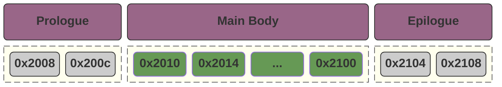

#### 基础的向量化加速实现

假设我们现在存在 `A`，`B`，`C`，他们的初始地址对于16字节对齐都有一个相同的偏移量，那么我们可以使用如下的方法：

```c++
void solve_robust(float* A, float* B, float* C, int n) {
    // --- 步骤 1: 头部对齐 (Prologue) ---
    // 计算需要先用标量处理多少个元素才能使 A 对齐到 16 字节
    int prologue_elements = (16 - ((size_t)A % 16)) / sizeof(float);
    if (prologue_elements == 4) prologue_elements = 0; // 已经对齐了
    
    if (prologue_elements > 0) {
        // 启动一个极小的核函数处理这几个元素，或者在下面统一处理
    }

    // --- 步骤 2: 主体向量化 (Main Body) ---
    int main_start = prologue_elements;
    int main_elements = (n - main_start) / 4 * 4; // 保证是 4 的倍数
    if (main_elements > 0) {
        int n_v4 = main_elements / 4;
        vectorized_kernel<<<...>>>(
            (float4*)(A + main_start), 
            (float4*)(B + main_start), 
            (float4*)(C + main_start), 
            n_v4
        );
    }

    // --- 步骤 3: 尾部处理 (Epilogue) ---
    int tail_start = main_start + main_elements;
    if (tail_start < n) {
        scalar_kernel<<<...>>>(A + tail_start, B + tail_start, C + tail_start, n - tail_start);
    }
}
```

#### 更复杂的向量化加速实现

我们还存在一些更复杂的向量化实现场景，假设我们存在如下的一个场景：

- `A % 16 == 4`
- `B % 16 == 8`
- `C % 16 == c`

在这种情况下，我们三个数组中需要裁剪掉不同的长度。  

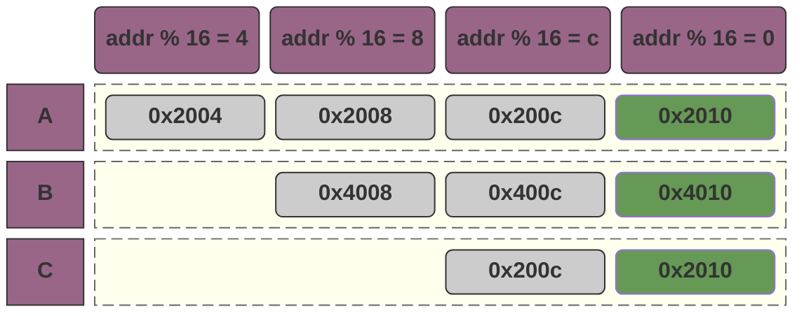

为此，我们需要引入一个叫 `__shfl_down_sync` 的技术：它允许我们在 `block` 中进行跨线程的数据共享。

1. 我们依然是先划分出来一个 `prologue` 段，并且使用标量进行 `A[0] ~ A[2]`，`B[0] ~ B[2]` ，`C[0] ~ C[2]` 这一部分的计算；
2. 随后，我们对于这三个数组，都从索引 `3` 开始计算，此时他们都是对齐的，问题在于，他们现在的数据形式如下：
   - 线程一持有 `A[3] ~ A[6]`，`B[3] ~ B[6]`， `C[3] ~ C[6]`；
   - 线程二持有 `A[7] ~ A[10]`，`B[7] ~ B[10]`， `C[7] ~ C[10]`；
   - ...
3. 此时，我们在计算中的逻辑是，`A[3] ~ A[6]` 分别对应了线程一的部分数据和线程二的部分数据，我们只需要通过 `__shfl_down_sync` 将它从线程二共享到线程一即可。 

**但是，通常来说，这个算法的实现过于复杂，所以在工业界我们会倾向于在前后填充一些 `padding` 来实现向量化访问。**

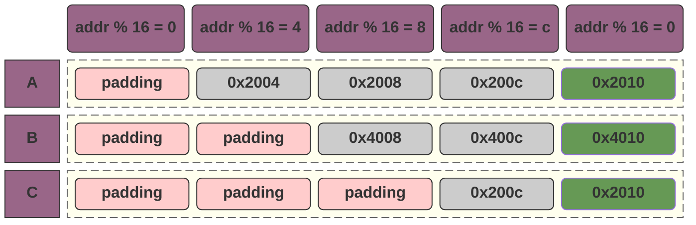

## 活跃度 (Occupancy) 与任务分配的权衡

在 CUDA 算子开发中，选择合适的线程块（Block）大小并非随意的决定，而是一场基于硬件物理限制的博弈。其核心目标是在**合并访问**、**延迟隐藏**与**硬件利用率**之间找到最优平衡。

### 核心约束变量

为了进行量化分析，我们首先定义 SM（Streaming Multiprocessor）的两个关键硬件瓶颈：

- **$B$ (Max Blocks per SM)**：单个 SM 能同时调度的 Block 数量上限。
- **$T$ (Max Threads per SM)**：单个 SM 能同时承载的活跃线程总数上限。

### 性能平衡的三大核心原则

> 延迟隐藏 (Latency Hiding) 需求

GPU 通过在不同的 Warp 间快速切换来掩盖指令延迟（尤其是高昂的访存延迟）。为了实现这一点，我们期望 SM 中活跃的 Block 数量尽量**逼近上限 $B$**。如果活跃 Block 太少，当现有 Warp 都在等待数据时，调度器将无任务可换，导致硬件空转。

> 硬件利用率 (Utilization) 需求

我们期望单个 SM 上的线程总数尽量**逼近上限 $T$**。只有当足够的线程在工作时，GPU 的计算单元（CUDA Cores）和指令流水线才能被填满。

> 访存合并 (Memory Coalescing) 需求

为了充分利用总线带宽，Block 的 X 轴线程数必须是 **Warp 大小（32）的倍数**。这是所有性能优化的前提。

### 寻找平衡点：$T_{max} = T / B$

基于上述约束，我们可以推导出一个理想的平衡点模型：

> 线程数过少 (Small Blocks)

如果单个 Block 的线程数 $t < T/B$：

- **后果**：当 Block 数量达到上限 $B$ 时，总线程数 $B \times t$ 仍远小于 $T$。
- **结论**：硬件资源被浪费，由于线程总数不足，无法填满计算吞吐量。

> 线程数过多 (Large Blocks)

如果单个 Block 的线程数 $t$ 极大：

- **后果**：总线程数很快达到 $T$，导致活跃 Block 数量远小于 $B$。
- **结论**：不利于延迟隐藏，调度器缺乏足够的 Block 粒度进行切换。

**最佳策略**是在保证合并访问的前提下，使单 Block 线程数尽量满足：
$$
t \approx \frac{T}{B}
$$
在这种状态下，SM 能同时达到 Block 数量与线程数量的利用率峰值。

### 实践结论 (以 NVIDIA T4 为例)

在 T4 架构中，$B=32$，$T=1024$。

- **理论平衡点**：$1024 / 32 = 32$ 线程/Block。
- **工程建议**：考虑到寄存器分配和更强的延迟隐藏需求，通常选择平衡点的 **4~8 倍**（即 **128 或 256** 个线程/Block）作为最优配置。

## 算子的分类

在 CUDA 性能调优的领域，根据**数据访问模式（Memory Access Pattern）\**和\**计算密集度（Arithmetic Intensity）**，我们通常将算子分为四大类：

| 类型                         | 特点                                           | 典型算子                                                     | 优化核心                                                     |
| ---------------------------- | ---------------------------------------------- | ------------------------------------------------------------ | ------------------------------------------------------------ |
| Element-wise                 | 每个输出点仅依赖于对应的输入点                 | 1. 矩阵加法<br/>2. 颜色反转<br/>3. ReLU激活函数<br/>4. 图像二值化<br/>5. 归一化 | **访存带宽**：<br/>1. 合并访问（Coalescing）<br/>2. 向量化读写（`float4` / `uchar4`） |
| Reduction                    | 多个输入转换为少个输出                         | 1. sum<br/>2. mean<br/>3. max/min<br/>4. avg                 | **线程间通信与同步**<br/>1. 通过 Shared Memory 来降低分层处理时的缓存利用率；<br/>2. 提高线程密度，因为在计算时合法线程会逐渐减小，我们希望一个warp中保持足够多的合法线程； |
| `Spatial`/`Sliding Window`   | 计算一个输出点需要访问输入点及其**周围的元素** | 1. convolution<br/>2. 高斯模糊<br/>3. 边缘检测<br/>4. 池化   | **数据重用**：<br/>1. 通过 Shared Memory 来提高缓存利用率。  |
| `Transformation`/`Rearrange` | 计算几乎为零，主要是变换和重排                 | 1. 矩阵转置<br/>2. 张量维度重排                              | **解决访存冲突**：<br />1. 通过额外引入两次（或更多次）缓存访问（一次读一次写）来解决访存冲突。 |

### 矩阵转置（transformation/rearrange）

当我们读取数据时，`input[y * cols + x]` 是可以连续访问的：

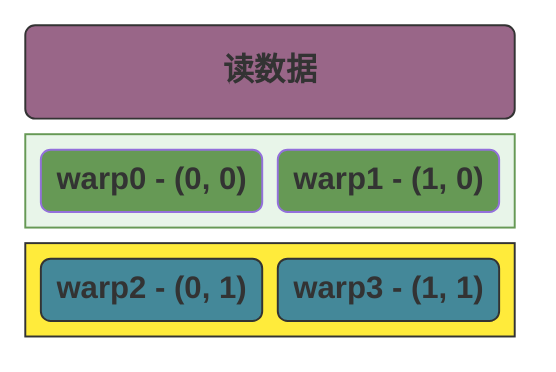

而 `output[x * rows + y]` 是不能连续访问：

```mermaid
block-beta

columns 2

block:z0:1
    columns 2
    block:z4:2
        columns 1
        space:1
        header0("写数据")
    end
    block:z2:1
        columns 1
        b0("warp0 - (0, 0)") b2("warp2 - (0, 1)")
    end
    block:z3:1
        columns 1
        b1("warp1 - (1, 0)") b3("warp3 - (1, 1)")
    end
end


class b0,b2 green
class b1,b3 blue

class z0,z1,z4 transparent
class z2,z3 error
class header0 purple

classDef transparent fill:none,stroke:none,color:inherit;
classDef content fill:#fff,stroke:#ccc;
classDef animate stroke:#666,stroke-dasharray: 8 4,stroke-dashoffset: 900,animation: dash 20s linear infinite;
classDef yellow fill:#FFEB3B,stroke:#333,color:#000,font-weight:bold;
classDef blue fill:#489,stroke:#333,color:#fff,font-weight:bold;
classDef pink fill:#FFCCCC,stroke:#333,color:#333,font-weight:bold;
classDef light_green fill:#e8f5e9,stroke:#695;
classDef green fill:#695,color:#fff,font-weight:bold;
classDef purple fill:#968,stroke:#333,color:#fff,font-weight:bold;
classDef gray fill:#ccc,stroke:#333,font-weight:bold;
classDef error fill:#bbf,stroke:#f65,stroke-width:2px,color:#fff,stroke-dasharray: 5 5;
classDef coral fill:#f8f,stroke:#333,stroke-width:4px;
classDef orange fill:#fff3e0,stroke:#ef6c00,color:#ef6c00,font-weight:bold;
```

换个思路，我们可以先读取数据：

```mermaid
block-beta

columns 2

block:z0:1
    columns 2
    b0("warp0 - (0, 0)") b1("warp1 - (1, 0)")
    b2("warp2 - (0, 1)") b3("warp3 - (1, 1)")
end

class b0,b1 green
class b2,b3 blue
class z0 animate

classDef transparent fill:none,stroke:none,color:inherit;
classDef content fill:#fff,stroke:#ccc;
classDef animate stroke:#666,stroke-dasharray: 8 4,stroke-dashoffset: 900,animation: dash 20s linear infinite;
classDef yellow fill:#FFEB3B,stroke:#333,color:#000,font-weight:bold;
classDef blue fill:#489,stroke:#333,color:#fff,font-weight:bold;
classDef pink fill:#FFCCCC,stroke:#333,color:#333,font-weight:bold;
classDef light_green fill:#e8f5e9,stroke:#695;
classDef green fill:#695,color:#fff,font-weight:bold;
classDef purple fill:#968,stroke:#333,color:#fff,font-weight:bold;
classDef gray fill:#ccc,stroke:#333,font-weight:bold;
classDef error fill:#bbf,stroke:#f65,stroke-width:2px,color:#fff,stroke-dasharray: 5 5;
classDef coral fill:#f8f,stroke:#333,stroke-width:4px;
classDef orange fill:#fff3e0,stroke:#ef6c00,color:#ef6c00,font-weight:bold;
```


当我们转换时，我们先将转换后的数据写入到 Shared Memory，此时我们无需考虑顺序写入的问题：

```mermaid
block-beta

columns 2

block:z0:1
    columns 2
    sm("Shared Memory"):2
    b0("warp0 - (0, 0)") b2("warp2 - (0, 1)")
    b1("warp1 - (1, 0)") b3("warp3 - (1, 1)")
end

class b0,b1 green
class b2,b3 blue
class z0 animate
class sm purple

classDef transparent fill:none,stroke:none,color:inherit;
classDef content fill:#fff,stroke:#ccc;
classDef animate stroke:#666,stroke-dasharray: 8 4,stroke-dashoffset: 900,animation: dash 20s linear infinite;
classDef yellow fill:#FFEB3B,stroke:#333,color:#000,font-weight:bold;
classDef blue fill:#489,stroke:#333,color:#fff,font-weight:bold;
classDef pink fill:#FFCCCC,stroke:#333,color:#333,font-weight:bold;
classDef light_green fill:#e8f5e9,stroke:#695;
classDef green fill:#695,color:#fff,font-weight:bold;
classDef purple fill:#968,stroke:#333,color:#fff,font-weight:bold;
classDef gray fill:#ccc,stroke:#333,font-weight:bold;
classDef error fill:#bbf,stroke:#f65,stroke-width:2px,color:#fff,stroke-dasharray: 5 5;
classDef coral fill:#f8f,stroke:#333,stroke-width:4px;
classDef orange fill:#fff3e0,stroke:#ef6c00,color:#ef6c00,font-weight:bold;
```


随后，我们再将 Shared Memory 中的数据原样输出：

```mermaid
block-beta

columns 2

block:z0:1
    columns 2
    sm("显存"):2
    b0("warp0 - (0, 0)") b2("warp2 - (0, 1)")
    b1("warp1 - (1, 0)") b3("warp3 - (1, 1)")
end

class b0,b2 green
class b1,b3 blue
class z0 animate
class sm purple

classDef transparent fill:none,stroke:none,color:inherit;
classDef content fill:#fff,stroke:#ccc;
classDef animate stroke:#666,stroke-dasharray: 8 4,stroke-dashoffset: 900,animation: dash 20s linear infinite;
classDef yellow fill:#FFEB3B,stroke:#333,color:#000,font-weight:bold;
classDef blue fill:#489,stroke:#333,color:#fff,font-weight:bold;
classDef pink fill:#FFCCCC,stroke:#333,color:#333,font-weight:bold;
classDef light_green fill:#e8f5e9,stroke:#695;
classDef green fill:#695,color:#fff,font-weight:bold;
classDef purple fill:#968,stroke:#333,color:#fff,font-weight:bold;
classDef gray fill:#ccc,stroke:#333,font-weight:bold;
classDef error fill:#bbf,stroke:#f65,stroke-width:2px,color:#fff,stroke-dasharray: 5 5;
classDef coral fill:#f8f,stroke:#333,stroke-width:4px;
classDef orange fill:#fff3e0,stroke:#ef6c00,color:#ef6c00,font-weight:bold;
```


即可完成合并写入。

### sum（累加）

#### 增加活跃线程数

```mermaid
block-beta
columns 9

t0
block:b0:2
    t0_0("t0") t0_1("t1")
end
block:b1:2
    t0_2("t2") t0_3("t3")
end
block:b2:2
    t0_4("t4") t0_5("t5")
end
block:b3:2
    t0_6("t6") t0_7("t7")
end

space:9
t1
block:b4:2
    t1_0("t0") t1_1("t1")
end
block:b5:2
    t1_2("t2") t1_3("t3")
end
block:b6:2
    t1_4("t4") t1_5("t5")
end
block:b11:2
    t1_6("t6") t1_7("t7")
end

space:9
t2
block:b7:2
    t2_0("t0") t2_1("t1")
end
block:b8:2
    t2_2("t2") t2_3("t3")
end
block:b9:2
    t3_4("t4") t3_5("t5")
end
block:b10:2
    t3_6("t6") t3_7("t7")
end


t0_0 --> t1_0
t0_4 --"t0"--> t1_0

t0_1 --> t1_1
t0_5 --"t1"--> t1_1

t0_2 --> t1_2
t0_6 --"t2"--> t1_2

t0_3 --> t1_3
t0_7 --"t3"--> t1_3


t1_0 --> t2_0
t1_1 --> t2_0

class t0,t1,t2 purple
class b0,b1,b2,b3,b4,b5,b6,b7,b8,b9,b10,b11 animate

class t0_0,t0_1,t0_2,t0_3 green
class t1_0,t1_1,t2_0 green

class t0_4,t0_5,t0_6,t0_7,t1_2,t1_3,t1_4,t1_5,t1_6,t1_7,t2_1,t2_2,t2_3,t3_4,t3_5,t3_6,t3_7 gray

%% 样式定义
classDef content fill:#fff,stroke:#ccc;
classDef animate stroke:#666,stroke-dasharray: 8 4,stroke-dashoffset: 900,animation: dash 20s linear infinite;
classDef yellow fill:#FFEB3B,stroke:#333,color:#000,font-weight:bold;
classDef blue fill:#489,stroke:#333,color:#fff,font-weight:bold;
classDef pink fill:#FFCCCC,stroke:#333,color:#333,font-weight:bold;
classDef light_green fill:#e8f5e9,stroke:#695;
classDef green fill:#695,color:#fff,font-weight:bold;
classDef purple fill:#968,stroke:#333,color:#fff,font-weight:bold;
classDef gray fill:#ccc,stroke:#333,font-weight:bold;
classDef error fill:#bbf,stroke:#f65,stroke-width:2px,color:#fff,stroke-dasharray: 5 5;
classDef coral fill:#f8f,stroke:#333,stroke-width:4px;
classDef orange fill:#fff3e0,stroke:#ef6c00,color:#ef6c00,font-weight:bold;
```


## 矩阵乘法的本质

**矩阵变换的本质就是，假设存在矩阵坐标轴A和矩阵坐标轴B，他们分别以 $(\hat{\imath}_{A}, \hat{\jmath}_{A})$ 和 $(\hat{\imath}_{B}, \hat{\jmath}_{B})$ 为基。那么在进行基 A * B 之后，得到了矩阵B中坐标为 $(x, y)$ 的坐标在矩阵A对应的坐标。**

> 1. 更简洁的来说，就是通过矩阵乘法，我们知道了B矩阵的 (x, y) 对应于 A 矩阵的坐标地址；
> 2. 从程序员的视角，我们可以认为是将B矩阵的指针，转换成了A矩阵可以访问的

假设我们的某个点的坐标是 $(x, y)$，我们的最开始矩阵 $\hat{\imath} = (1, 0)$ 并且 $\hat{\jmath} = (0, 1)$，那么我们的此时的基可以记为 $M_0$
$$
M_0 = \begin{bmatrix}
1 & 0 \\
0 & 1
\end{bmatrix}
$$
我们可以看到  $(x * \hat{\imath}, y * \hat{\jmath})$  就可以表示我们向量在当前的基上的坐标：
$$
pointer = \begin{bmatrix}
x \\
y
\end{bmatrix}
\times \begin{bmatrix}
1 & 0 \\
0 & 1
\end{bmatrix}
= 
\begin{bmatrix}
x \\
y
\end{bmatrix}
$$


随后，我们进行了一次矩阵旋转， $\hat{\imath_1} = (0, 1)$ 并且 $\hat{\jmath_1} = (-1, 0)$，可以记为 $M_1$
$$
M_1 = \begin{bmatrix}
0 & -1 \\
1 & 0
\end{bmatrix}
$$
那么，我们进行矩阵变换之后，我们的坐标应该是 $(x * \hat{\imath} *\hat{\imath_1}, y * \hat{\jmath} * \hat{\jmath_1})$，此时，如果我们把 $\hat{\imath} * \hat{\imath_1}$ 和 $\hat{\jmath} * \hat{\jmath_1}$ 先计算出来，那么我们就得到了一个全新的矩阵：
$$
M_2 = M0 \times M1 \
= 
\begin{bmatrix}
1 & 0 \\
0 & 1
\end{bmatrix}
\times
\begin{bmatrix}
	0 & -1 \\
	1 & 0
\end{bmatrix} \
=
\begin{bmatrix}
0 & -1 \\
1 & 0 \\
\end{bmatrix}
$$
我们可以认为，这两个变换复合到一起形成了一个新的变换，而这个变换的基就是我们上面的结果：此时我们可以使用 $(x * \hat{\imath}_{new}, y * \hat{\jmath}_{new})$  直接得到我们在进行复合变换之后的点。


## 行列式

**行列式（Determinant）的作用是：衡量一个由矩阵定义的线性变换，对空间区域（面积或体积）所造成的“缩放比例”。**

行列式会计算由矩阵定义的线性变换，将原始单位面积（由标准基 $\hat{i}, \hat{j}$ 围成）变换为新面积（由变换后的基 $\hat{i}', \hat{j}'$ 围成）时的**缩放倍率**。

对于矩阵的基 $\hat{i}$ 和 $\hat{j}$ ：

- **矩阵的列**：其实就是原始的基向量 $\hat{i}$ 和 $\hat{j}$ 在变换之后**落在了哪里**。
- **行列式的值**：就是看变换后的那两个新向量张开的图形，比原始基向量张开的单位图形（面积为 1 的正方形）**大了多少倍**。

### 行列式的计算

对于一个 i hat 和 j hat 如下的坐标系，它的单个坐标块的面积如何计算？
$$
\begin{bmatrix}
a & b \\
c & d
\end{bmatrix}
$$
面积有三个基本特性：

1. **单位面积**：标准基 $\begin{bmatrix} 1 & 0 \\ 0 & 1 \end{bmatrix}$ 围成的面积是 $1$。
2. **伸缩性**：如果把一个基向量拉长 $k$ 倍，面积也变为 $k$ 倍。
3. **叠加性**：如果基向量是两个向量的和，面积可以拆分。

现在我们拆解矩阵 $M = \begin{bmatrix} a & b \\ c & d \end{bmatrix}$：

我们将它看作两个向量的组合：$\vec{v}_1 = a\hat{\imath} + c\hat{\jmath}$ 和 $\vec{v}_2 = b\hat{\imath} + d\hat{\jmath}$。

当我们把这两个组合展开并计算它们围成的“面积函数 $Area(\vec{v}_1, \vec{v}_2)$”时：

- $Area(a\hat{\imath}, d\hat{\jmath}) = ad \times Area(\hat{\imath}, \hat{\jmath}) = ad$
- $Area(c\hat{\jmath}, b\hat{\imath}) = cb \times Area(\hat{\jmath}, \hat{\imath}) = -bc$ （注意：因为 $\hat{\jmath}$ 在 $\hat{\imath}$ 前面，方向反了，所以是负号）
- $Area(a\hat{\imath}, b\hat{\imath})$ 和 $Area(c\hat{\jmath}, d\hat{\jmath})$ 都是 $0$（因为共线，没面积）。

**最后求和：$ad - bc$。**

### $det(M_1M_2) = det(M_1)det(M_2)$

> 我们可以把 **$\det(M)$** 看作是一个空间的**“面积缩放因子”**。
>
> - **$\det(M_2)$**：代表第一次变换将单位面积缩放了多少倍。
> - **$\det(M_1)$**：代表第二次变换在**已经变过一次**的空间基础上，又缩放了多少倍。
>
> 如果我们先将一个图形扩大了 $3$ 倍（$M_2$），接着又将结果扩大了 $2$ 倍（$M_1$），那么最终的图形面积自然是原始面积的 $2 \times 3 = 6$ 倍。这就是：
>
> $$\det(M_1 M_2) = \det(M_1) \times \det(M_2)$$

我们也可以通过数值计算来证明：

假设：
$$
M_1 = \begin{bmatrix}
a_1 & b_1 \\
c_1 & d_1
\end{bmatrix}
\\
M_2 = \begin{bmatrix}
a_2 & b_2 \\
c_2 & d_2
\end{bmatrix}
$$


那么 $M_1M_2$ 相当于对 $M_2$ 进行了一次矩阵线性缩放，并得到了新的 $\hat{\imath}$ 和 $\hat{\jmath}$
$$
M_1M_2 = \begin{bmatrix}
a_1a_2 + b_1c_2 & a_1b_2 + b_1d_2 \\
c_1a_2 + d_1c_2 & c_1b_2 + d_1d_2
\end{bmatrix}
$$
那么：
$$
\begin{aligned}
& det(M_1M_2) \\
& = (a_1a_2 + b_1c_2) * (c_1b_2 + d_1d_2) - (a_1b_2 + b_1d_2) * (c_1a_2 + d_1c_2) \\
& = (a_1a_2c_1b_2 + a_1a_2d_1d_2 + b_1c_2c_1b_2 + b_1c_2d_1d_2) - (a_1b_2c_1a_2 + a_1b_2d_1c_2 + b_1d_2c_1a_2 + b_1d_2d_1c_2) \\
& = (\underbrace{a_1a_2b_2c_1}_{项目1} + a_1a_2d_1d_2 + b_1b_2c_1c_2 + \underbrace{b_1c_2d_1d_2}_{项目2}) - (\underbrace{a_1a_2b_2c_1}_{项目1} + a_1b_2c_2d_1 + a_2b_1c_1d_2 + \underbrace{b_1c_2d_1d_2}_{项目2}) \\
& = a_1a_2d_1d_2 + b_1b_2c_1c_2 - a_1b_2c_2d_1 - a_2b_1c_1d_2
\end{aligned}
$$
而：
$$
\begin{aligned}
& det(M_1)det(M_2) \\
& = (a_1d_1 - b_1c_1) * (a_2d_2 - b_2c_2) \\
& = a_1a_2d_1d_2 + b_1b_2c_1c_2 - a_2b_1c_1d_2 - a_1b_2c_2d_1
\end{aligned}
$$


## 叉积

在我们的线性代数中：

- `矩阵乘法`：可以看做是对 $\hat{\imath}$ 和 $\hat{\jmath}$ 的变换，当 $\hat{\imath}$ 和 $\hat{\jmath}$ 变换之后，原来的点的位置也会相应的改变；
- `点积` 求两个向量潜在的相似度，例如 a 和 b 的点积 / (a的绝对值 * b的绝对值) 得到的值可以表示 a 和 b 的相似度；
- `叉积` 试图用两个向量**撑开一个空间**，对于三维向量 $v$ 和三维向量 $u$，虽然他们是三维向量，但是因为他们只有两个向量，所以我们可以在三维的向量空间里找到有且仅有的一个平面覆盖到这两个向量。而他们的叉积结果就是正好垂直于这个平面的一个向量，向量的长度和方向取决于 a 和 b。

### 两点定线，三点定面

在三维空间中，无论我们如何随机地扔出两个向量 $\vec{a}$ 和 $\vec{b}$：

- 只要它们不是共线的（即不在同一条直线上），它们就一定会**张开（Span）**出一个且仅有一个无限延伸的平面。
- 从**秩（Rank）**的角度看：这两个向量构成的矩阵 Rank 为 2，这意味着它们在三维世界里圈出了一块“二维领地”。
- **例外情况**：如果 $\vec{a}$ 和 $\vec{b}$ 指向相同或相反方向，它们只能定出一条线，此时平面不唯一（有无数个平面可以包含这条线），而这时它们的**叉积正好为 0**，也印证了无法确定唯一的垂直方向。

叉积 $\vec{a} \times \vec{b}$ 的结果 $\vec{c}$ 就是这个平面的**法向量（Normal Vector）**：

- **垂直的唯一性**：在三维空间里，垂直于一个平面的方向是唯一的（除了正反之分）。叉积利用这一点，为我们找到了那个“逃离”平面的出口。
- **长度的内涵**：这个 $\vec{c}$ 的长度不是随机的，它锁定了 $\vec{a}$ 和 $\vec{b}$ 围成的平行四边形的**面积**。面积越大，生成的向量越长。
- **方向的内涵**：通过“右手定则”，它不仅找出了垂直的方向，还定义了平面的**朝向**（是向上推还是向下钻）。

### 叉积的计算

在三维空间中，给定两个向量 $\vec{a} = (a_1, a_2, a_3)$ 和 $\vec{b} = (b_1, b_2, b_3)$，它们的叉积 $\vec{a} \times \vec{b}$ 的计算通常有三种表达方式，分别对应不同的使用场景。

我们将标准基向量 $\hat{i}, \hat{j}, \hat{k}$ 放在第一行，构造一个伪行列式：
$$
\vec{a} \times \vec{b} = \det \begin{bmatrix} \hat{i} & \hat{j} & \hat{k} \\ a_1 & a_2 & a_3 \\ b_1 & b_2 & b_3 \end{bmatrix}
$$
**展开步骤：**利用代数余子式展开（注意中间 $\hat{j}$ 项的**负号**，我们的符号为 `+`，`-`，`+`）：

1. **$\hat{i}$ 分量**：划掉第一行第一列，算剩下的 $2 \times 2$ 行列式：$(a_2b_3 - a_3b_2)$
2. **$\hat{j}$ 分量**：划掉第一行第二列，算剩下的再取反：$-(a_1b_3 - a_3b_1) = (a_3b_1 - a_1b_3)$
3. **$\hat{k}$ 分量**：划掉第一行第三列，算剩下的：$(a_1b_2 - a_2b_1)$

我们得到
$$
\vec{a} \times \vec{b} = \begin{pmatrix} a_2b_3 - a_3b_2 \\ a_3b_1 - a_1b_3 \\ a_1b_2 - a_2b_1 \end{pmatrix}
$$

### 叉积的本质

叉积的本质是数学家最初想要寻找一个运算，能够同时满足：

1. 结果必须垂直于 $\vec{a}$ 和 $\vec{b}$。
2. 结果的长度必须等于 $\vec{a}$ 和 $\vec{b}$ 张开的平行四边形面积。

而我们的公式是一个伪行列式：真实的行列式需要满足矩阵是 $n * n$ 的，这里我们的伪行列式任意一步计算之前都是删除第一行，再使用行列式的计算。

那么，我们现在有三个向量 $\vec{a} = (a_1, a_2, a_3)$ ，$\vec{b} = (b_1, b_2, b_3)$，$\vec{c} = {\begin{pmatrix} a_2b_3 - a_3b_2, a_3b_1 - a_1b_3, a_1b_2 - a_2b_1 \end{pmatrix}}$。我们开始证明它满足我们对叉积的定义。

#### 垂直

要证明一个向量垂直于一个平面，只需要证明它**同时垂直于该平面内的两个不共线向量**（即 $\vec{a}$ 和 $\vec{b}$）。在向量代数中，“垂直”等价于“点积为 0”。

我们将 $\vec{a}$ 的分量与 $\vec{c}$ 的分量对应相乘：

$$\vec{a} \cdot \vec{c} = a_1({a_2b_3 - a_3b_2}) + a_2({a_3b_1 - a_1b_3}) + a_3({a_1b_2 - a_2b_1})$$

展开括号：

$$\vec{a} \cdot \vec{c} = \textcolor{red}{a_1a_2b_3} - \textcolor{green}{a_1a_3b_2} + \textcolor{blue}{a_2a_3b_1} - \textcolor{red}{a_2a_1b_3} + \textcolor{green}{a_3a_1b_2} - \textcolor{blue}{a_3a_2b_1}$$

**结论**：$\vec{a} \cdot \vec{c} = 0$。同理可证 $\vec{b} \cdot \vec{c} = 0$。

因为 $\vec{c}$ 与平面内的两条基准线都垂直，所以它必然垂直于整个平面。

#### 长度

平行四边形的面积公式为：$S = \|\vec{a}\| \|\vec{b}\| \sin\theta$。 我们可以通过证明 $\|\vec{c}\|^2 = (\|\vec{a}\| \|\vec{b}\| \sin\theta)^2$ 来证明这个结果。

$$\|\vec{c}\|^2 = (a_2b_3 - a_3b_2)^2 + (a_3b_1 - a_1b_3)^2 + (a_1b_2 - a_2b_1)^2$$

数学家拉格朗日证明了一个极其漂亮的代数恒等式，它直接连接了“分量平方和”与“模长及点积”：

$$(a_2b_3 - a_3b_2)^2 + (a_3b_1 - a_1b_3)^2 + (a_1b_2 - a_2b_1)^2 = (\sum a_i^2)(\sum b_i^2) - (\sum a_ib_i)^2$$

翻译成向量符号就是：

$$\|\vec{a} \times \vec{b}\|^2 = \|\vec{a}\|^2 \|\vec{b}\|^2 - (\vec{a} \cdot \vec{b})^2$$

我们知道点积 $\vec{a} \cdot \vec{b} = \|\vec{a}\| \|\vec{b}\| \cos\theta$，代入上式：

$$\|\vec{c}\|^2 = \|\vec{a}\|^2 \|\vec{b}\|^2 - (\|\vec{a}\| \|\vec{b}\| \cos\theta)^2$$

$$\|\vec{c}\|^2 = \|\vec{a}\|^2 \|\vec{b}\|^2 (1 - \cos^2\theta)$$

利用三角恒等式 $1 - \cos^2\theta = \sin^2\theta$：

$$\|\vec{c}\|^2 = \|\vec{a}\|^2 \|\vec{b}\|^2 \sin^2\theta$$

$$\|\vec{c}\| = \|\vec{a}\| \|\vec{b}\| \sin\theta$$

得证。

## 特征向量

> 当一个空间发生线性变换（比如拉伸、剪切）时，绝大多数向量都会偏离原来的方向。但有一部分特殊的向量，它们在变换后**依然保持在原有的直线上**，只是长度变长或变短了（甚至反向）。

### 公式与定义

如果 $A$ 是一个方阵，$v$ 是一个非零向量，如果它们满足以下关系：

$$Av = \lambda v$$

那么：

- **$v$** 就是矩阵 $A$ 的**特征向量**。
- **$\lambda$**（希腊字母 Lambda）就是对应的**特征值（Eigenvalue）**，它代表了向量被缩放的倍数。

我们可以从几何角度来理解线性变换对向量的影响：

1. **普通向量：** 经过变换后，方向变了，长度也变了。
2. **特征向量：** 变换后，**方向没变**（或者刚好转了 180 度），只是被“拉伸”或“压缩”了。

### 特征向量有什么用

- **图像压缩：** 找出图片中最主要的特征向量（主成分分析 PCA），去掉不重要的，就能在不损失画质的情况下减小文件体积。
- **Google 搜索（PageRank）：** 网页排名算法本质上就是寻找一个巨大矩阵的特征向量，那个特征值最大的向量代表了网页的重要性。
- **振动分析：** 工程师通过特征向量来分析桥梁或摩天大楼的固有频率，确保建筑不会因为共振而倒塌。

### 特征向量的例子

假设，我们存在一个矩阵 $A$，它的 $\hat{\imath}$ 为 $(1, 0)$，$\hat{\jmath}$ 为 $(0,1)$。此时，我们知道 $\hat{\imath}$ 这个基，它所张成的空间是x轴上的整条直线；

当我们对矩阵A进行线性变换得到矩阵$A_{new}$，线性变换后的 $\hat{\imath}_{new}$ 为 $(3, 0)$，而它的 $\hat{\jmath}_{new}$ 为 $(1, 2)$。

此时，对于x轴上的任意一点 $(a,0)$，我们可以知道它在 $A_{new}$ 中的坐标为（**注意，点只是列的一种表示方式，计算时我们需要以列向量 $\begin{bmatrix}x \\ 0\end{bmatrix}$ 的方式来计算**）：

$$
A_{(a, 0)} = \begin{bmatrix}
3 & 1 \\
0 & 2
\end{bmatrix}
\begin{bmatrix}
x \\
0
\end{bmatrix}
= 
\begin{bmatrix}
3x \\
0
\end{bmatrix}
$$
**我们发现，所有在x轴上的向量，它只是被拉长了，但是仍然在原向量张成的空间中（特征向量的严格定义是：变换后的向量 $Av$ 与原向量 $v$ 共线)。对于这种向量，就是我们的特征向量。**

### 找到更多的特征向量

> 我们可以把找到特征向量的方法分为两个不同的步骤：
>
> 1. 找到特征向量值 $\lambda$；
> 2. 通过特征向量值 $\lambda$ 找到特征向量；

在我们上面提到的例子中，一个 $2 \times 2$ 的矩阵通常有两个特征向量（除非他是旋转或者某些特殊变换），我们给出了 $\begin{bmatrix}x \\ 0\end{bmatrix}$，那怎么样才能找到另外一个特征向量呢？我们假设 $\lambda$ 为我们要找的特征向量，那么我们得到（（这里 $I$ 是单位矩阵，因为矩阵不能直接减去一个常数 $\lambda$））：
$$
(A_{new} - \lambda I)v = 0
$$
如果 $v$ 是非零向量，那么根据线性代数的原理，矩阵 $(A_{new} - \lambda I)$ 必须是**不可逆**的（即它把空间压缩了）。因此，它的**行列式必须为 0**：
$$
\det(A_{new} - \lambda I) = 0
$$


那么，对于我们的矩阵 $A_{new} = \begin{bmatrix} 3 & 1 \\ 0 & 2 \end{bmatrix}$，我们的特征方程是：
$$
\det \left( \begin{bmatrix} 3 & 1 \\ 0 & 2 \end{bmatrix} - \begin{bmatrix} \lambda & 0 \\ 0 & \lambda \end{bmatrix} \right) = \det \begin{bmatrix} 3-\lambda & 1 \\ 0 & 2-\lambda \end{bmatrix} = 0
$$


那么我们可以得到：
$$
(3 - \lambda) \times (2 - \lambda) = 0
$$


得到特征值：$\lambda_1 = 3, \lambda_2 = 2$。现在我们有了两个特征值。我们需要把每一个 $\lambda$ 分别代回方程 $(A - \lambda I)v = 0$，解出对应的向量 $v$。

当 $\lambda = 3$ 时：

$$(A - 3I)v = \begin{bmatrix} 3-3 & 1 \\ 0 & 2-3 \end{bmatrix} \begin{bmatrix} x \\ y \end{bmatrix} = \begin{bmatrix} 0 & 1 \\ 0 & -1 \end{bmatrix} \begin{bmatrix} x \\ y \end{bmatrix} = \begin{bmatrix} 0 \\ 0 \end{bmatrix}$$

由第一行得出 $0x + 1y = 0 \Rightarrow y = 0$。

$x$ 可以是任何非零值。所以特征向量是 $\begin{bmatrix} 1 \\ 0 \end{bmatrix}$（即 $x$ 轴方向）。

当 $\lambda = 2$ 时：

$$(A - 2I)v = \begin{bmatrix} 3-2 & 1 \\ 0 & 2-2 \end{bmatrix} \begin{bmatrix} x \\ y \end{bmatrix} = \begin{bmatrix} 1 & 1 \\ 0 & 0 \end{bmatrix} \begin{bmatrix} x \\ y \end{bmatrix} = \begin{bmatrix} 0 \\ 0 \end{bmatrix}$$

由第一行得出 $1x + 1y = 0 \Rightarrow y = -x$。

所以特征向量是 $\begin{bmatrix} 1 \\ -1 \end{bmatrix}$ 或 $\begin{bmatrix} -1 \\ 1 \end{bmatrix}$。

### 特征向量的的含义

**特征向量描述的是一个“方向”，而不是一个具体的“点”。**在我们前面计算的逻辑中，$\begin{bmatrix} -1 \\ 1 \end{bmatrix}$ 是一个特征向量，而 $\begin{bmatrix} -2 \\ 2 \end{bmatrix}$ 也是一个特征向量，只是不同的表示形式。

### 特征向量的一个典型应用

考虑我们的矩阵 $A = \begin{bmatrix} 3 & 1 \\ 0 & 2 \end{bmatrix}$，如果我们需要计算 $A^{100}$，那么这将是一个地狱级的计算；而此时，我们想到的方法就是，可以将 $A$ 转换为一个 $A_{new}$，而这个 $A_{new}$ 是在某个特定的基下的**对角矩阵**，我们假设转换后的对角矩阵是 $\begin{bmatrix} a & 0 \\ 0 & b\end{bmatrix}$，那么我们可以：

1. 计算转后的矩阵 $A_{new}^{100}$，因为它是对角矩阵，所以这个很简单，我们得到 $M_{new} = \begin{bmatrix} a^{100} & 0 \\ 0 & b^{100}\end{bmatrix}$；
2. 在计算完成之后，我们在把 $M_{new}$ 转换到原来的基得到 $M$，这个就是矩阵 $A^{100}$ 在原来的坐标轴下的结果；

#### 将矩阵转换为特定基下的对角矩阵

假设矩阵 $A$ 有两个特征向量 $v_1, v_2$，对应的特征值分别是 $\lambda_1, \lambda_2$。

根据定义，我们有两个独立的等式：

- $A v_1 = \lambda_1 v_1$
- $A v_2 = \lambda_2 v_2$

现在，我们把这两个向量横向并排，拼成一个新矩阵 $P = [v_1 \quad v_2]$。

当我们用 $A$ 去乘以这个拼好的矩阵 $P$ 时，根据矩阵乘法规则，这等同于分别作用于每一列：

$$A P = A [v_1 \quad v_2] = [Av_1 \quad Av_2]$$

把刚才的定义代入：

$$A P = [\lambda_1 v_1 \quad \lambda_2 v_2] = [v_1 \quad v_2] \begin{bmatrix} \lambda_1 & 0 \\ 0 & \lambda_2 \end{bmatrix} = PD$$

所以我们得到了一个至关重要的恒等式：

$$AP = PD$$

既然 $AP = PD$，只要矩阵 $P$ 是**可逆的**（也就是说我们的特征向量线性无关，能张开整个空间），我们就可以在等式**左边**同时乘以 $P^{-1}$：

$$P^{-1} (AP) = P^{-1} (PD)$$

由于 $P^{-1}P$ 等于单位矩阵 $I$，等式右边就只剩下了 $D$：
$$
P^{-1}AP = D
$$
在这个表达式中：$P$ 是我们的特征向量横向排列，而 $D$ 则是我们的特征向量值的组成的对角矩阵。

#### 一个简单的例子

在我们的矩阵 $A = \begin{bmatrix} 3 & 1 \\ 0 & 2 \end{bmatrix}$ 中，它的特征向量是 $\begin{bmatrix} 1 \\ 0 \end{bmatrix}$ 和 $\begin{bmatrix} 1 \\ -1 \end{bmatrix}$，他们的特征值分别是 $3$ 和 $2$，那么我们可以得到
$$
P = \begin{bmatrix} 1 & 1 \\ 0 & -1 \end{bmatrix} \\ \\
D = \begin{bmatrix} 3 & 0 \\ 0 & 2 \end{bmatrix} \\ \\
P^{-1} =  \begin{bmatrix} 1 & 1 \\ 0 & -1 \end{bmatrix}
$$


那么
$$
P^{-1}AP = P^{-1} =  \begin{bmatrix} 1 & 1 \\ 0 & -1 \end{bmatrix}
\begin{bmatrix} 3 & 1 \\ 0 & 2 \end{bmatrix}
\begin{bmatrix} 1 & 1 \\ 0 & -1 \end{bmatrix}
= \begin{bmatrix} 3 & 0 \\ 0 & 2 \end{bmatrix}
$$
而
$$
A^{100} = (PDP^{-1})(PDP^{-1})...(PDP^{-1}) = PD^{100}P^{-1} = \begin{bmatrix} 1 & 1 \\ 0 & -1 \end{bmatrix} \begin{bmatrix} 3^{100} & 0 \\ 0 & 2^{100} \end{bmatrix} \begin{bmatrix} 1 & 1 \\ 0 & -1 \end{bmatrix}
$$


## 网格布局的选择

我们的网格布局可以使用 `1D`， `2D`， `3D` 等不同的选择，例如：

```cpp
extern "C" void solve()
{
    dim3 block_1d(256);
    dim3 block_2d(32, 8);
    dim3 block_3d(32, 4, 2);
}
```

那我们应该如何选择具体使用哪种模式呢？

选择 CUDA 网格布局（Grid/Block Layout）的维度，本质上是在**逻辑表达的可读性**与**底层硬件的执行效率**之间寻找平衡。虽然硬件最终都会将所有线程拉平为一维的 **Warp**（每 32 个连续线程一组），但不同的布局选择会直接影响缓存命中率、索引计算开销以及代码的通用性。

### 一维布局

一维布局是极致性能与底层库的首选，当我们追求极致的内存带宽利用率，或者在编写类似 **CUB/CUTLASS** 这种底层算子时，1D 是最佳选择。

- **适用场景**：
  - **线性数据处理**：如向量加法、一维规约（Reduction）。
  - **极致优化的 2D/3D 算子**：如我们之前研究的子矩阵求和。通过手动将 2D 任务映射到 1D Warp，可以更精准地控制内存对齐（`int4` 加载）和任务分发。
- **优点**：
  - **计算开销最小**：索引计算仅需 `blockIdx.x * blockDim.x + threadIdx.x`，不涉及多维乘法。
  - **负载均衡最佳**：配合 **Grid-Stride Loop**，可以像“任务队列”一样平滑处理任何尺寸的数据，避免了多维布局在边缘处产生的空转线程。
- **缺点**：逻辑抽象，处理具有复杂几何关系（如 2D 邻域）的算法时，代码极其难读。

### 二维布局

2D 布局是图像处理、视觉算法和稠密矩阵运算中最常用的模式。

- **适用场景**：
  - **图像处理**：卷积（Convolution）、滤波（Filtering）、仿射变换。
  - **矩阵运算**：矩阵转置（Transpose）、简单的矩阵乘法（GEMM）。
  - **空间相关算法**：Stencil 计算（如热传导模拟）。
- **优点**：
  - **空间局部性（Spatial Locality）**：GPU 的 L1/L2 缓存和纹理缓存（Texture Cache）针对二维空间有优化。2D 布局能让相邻线程访问内存中相邻或“逻辑邻域”的数据，提高缓存命中率。
  - **直观映射**：线程坐标 `(x, y)` 直接对应像素坐标，大大降低了边界处理（Halo Region）的编写难度。
- **选择建议**：通常将 `block.x` 设置为 32（一个 Warp 的大小），`block.y` 设置为 4、8 或 16。

### 三维布局

3D 布局通常用于处理体数据（Volumetric Data）或复杂的科学计算。

- **适用场景**：
  - **体素渲染 (Voxel Rendering)**：医学影像处理（CT/MRI）、流体力学模拟（CFD）。
  - **3D 物理模拟**：天气预测、地震波模拟。
- **优点**：
  - **简化坐标计算**：在处理三维张量时，避免了手动将 `(x, y, z)` 展平为一维索引的痛苦。
- **缺点**：
  - **容易超出限制**：单个 Block 的总线程数不能超过 1024。如果我们写 `(32, 8, 8)`，总数就是 2048，内核将无法启动。

### 一维布局和二维布局的实例

我们以两个典型的例子：`array sum` 和 `convolution` 来作为例子说明我们对于网格布局的选择：

#### array sum

`array sum` 当我们在计算一个二维数组的和时，我们通常会将二维数组拉平到一维数组，以获取更高的性能。

#### convolution

卷积的计算非常典型，在卷积的计算中，如果卷积核函数是一个 `3 * 3` 的矩阵，那么访问矩阵周围的元素是必要的。此时如果我们不使用二维矩阵，那么整个矩阵的索引计算将十分的琐碎并且复杂。

## Transformer 核心逻辑

> Transformer 的本质是利用线性变换（$W_q, W_k, W_v$）将带有位置偏移的高维语义向量（$E$），投影到不同的特征子空间，通过计算匹配度（$Q \cdot K^T$）实现动态的信息筛选，并利用数值缩放（Scale）与归一化（LayerNorm）确保训练时梯度流的活性，防止模型陷入“盲目自信”的饱和区。假设我们存在一个 512 维的模型：
>
> - **空间位移**：位置编码（Positional Encoding）是通过向量加法在 512 维空间中实现的几何位移。
> - **基变换**：$W_q$ 矩阵是一个巨大的**语义过滤器**，它通过坐标轴转换（基变换），从原始词义中提取出特定的关注维度（如词性、情感等）。
> - **降温保护**：除以 $\sqrt{d_k}$ 是为了压制方差，让 Softmax 留在高导数区间，保持模型的“知错改错”能力（解决梯度饱和）。
> - **数据闭环**：LayerNorm 负责准入控制，保证输入数据始终满足“均值 0、方差 1”的计算前提。
>
> 当我们在将 $E_{position} \times W_q = Q$ 的这个转换时，我们需要注意几点：
>
> - 根据线性代数的定义，此时我们就是将 $E_{position}$ 使用了 $W_q$ 的基向量表示的坐标轴转换，而 $W_q$  是我们 transformer 的某一层的权重矩阵；
> - 对于一个 `512` 维度的向量，每一层关注的东西是不一样的。例如假设我们的维度1和维度2表示的是：token是名词还是动词，token是褒义还是贬义。那么在语义解析层，transformer 就需要调高维度1和维度2的权重。这个就相当于是，我们将这个 `512` 维的坐标轴的维度1和维度2的基向量调大，而其他的调小；

### 静态知识储备：词表与词嵌入 (Embedding)

在模型“睁开眼”看到任何句子之前，它已经通过海量文本训练出了两样东西：

* **Token 词表**：一个固定的映射表。例如：`“吃” -> ID 102`，`“苹果” -> ID 505`。
* **词嵌入矩阵 (Embedding Matrix, $X_{base}$)**：这是词的“静态档案”。
* **含义**：当没有任何上下文时，每个词都有一个预定义的 512 维向量。它标注了词的固有属性（如：“猫”是名词、哺乳动物、宠物）。
* **状态**：**训练阶段**根据梯度下降不断修正这些属性数值；**推理阶段**作为只读的 Lookup Table。

### 角色转换器：三套线性变换矩阵 ($W_Q, W_K, W_V$)

这是 Transformer 的“大脑逻辑”，它定义了词与词之间如何“社交”。这三个矩阵在推理阶段是**完全固定**的。

* **$W_Q$ (Query Generator)**：将词向量转换为**“需求信息”**。
* *例*：“吃” $\times W_Q \rightarrow$ “我是一个动作，我急需一个食物作为宾语。”


* **$W_K$ (Key Generator)**：将词向量转换为**“简历信息”**。
* *例*：“苹果” $\times W_K \rightarrow$ “我是一个名词，我的属性是食物。”


* **$W_V$ (Value Generator)**：将词向量转换为**“内容信息”**。
* *例*：“苹果” $\times W_V \rightarrow$ “我是红色的、甜的、脆的语义片段。”

### 注意力流水线：QKV 的博弈 (Attention Mechanism)

当我们输入一个序列（如“我爱吃...”）时，物理运行流程如下：

1. **特征投影**：
每个词的 $X$ 同时乘以 $W_Q, W_K, W_V$，在三个不同的特征空间里产生自己的 Q、K、V。
2. **点积打分 ($Q \times K^T$)**：
“吃”的 Query 去和全句所有词（我、爱、吃）的 Key 做点积。
* “吃” (Q: 找食物) $\times$ “我” (K: 人类) $\rightarrow$ **低分**。
* “吃” (Q: 找食物) $\times$ “苹果” (K: 食物) $\rightarrow$ **高分**。


3. **掩码与归一化 (Mask & Softmax)**：
* **训练时**：使用 Mask 屏蔽掉还没出现的词，防止“吃”提前看到“苹果”。
* **Softmax**：将分数变成权重（如 0.05, 0.05, 0.9）。这代表了模型对不同词的“偏心程度”。


4. **语义融合 (Weighted Sum)**：
用权重乘以各词的 **Value (V)**。
* *结果*：在“吃”这个位置，输出一个新向量。由于权重集中在“苹果”，这个新向量里装满了“苹果”的语义（甜、脆、红色）。

### 预测与闭环：从高维特征到最终 Token

1. **隐藏层加工**：融合后的向量经过残差连接和全连接层（FFN），进一步强化这种“吃+苹果”的逻辑组合。
2. **线性投影**：将这个处理好的向量再次乘以一个巨大的输出矩阵，映射回词表大小（如 30,000 维）。
3. **最终预测**：
* **训练阶段**：如果模型在“吃”后面算出的“苹果”概率不是最高，就通过反向传播调整 $W_{QKV}$ 和 $X$ 的数值。
* **推理阶段**：直接取概率最大的词。模型此时会吐出“苹果”。

### 训练与推理

* **训练 (Training)**：是一个**“纠错”**过程。我们手握正确答案，通过计算 QKV 的匹配度，不断微调 $X$（词的底色）和 $W_{QKV}$（社交规则），直到它们能完美契合。
* **推理 (Inference)**：是一个**“查表计算”**过程。利用训练好的 $X$ 和 $W_{QKV}$，将当前的输入丢进矩阵算子中跑一遍，根据计算出的最高概率点燃下一个 Token

所以，我们最重要的逻辑就是：

1. 在训练阶段，根据海量的数据提取：
    1. 每个token的静态特征（描述token是什么），
    2. `transformer` 有 N 层，每一层都有一个共享的  $W_Q, W_K, W_V$，这是一个三个线性变换矩阵，描述了在当前层（$W_Q, W_K, W_V$，描述了token它需要匹配什么（Q)，它被什么匹配（K）以及详细信息（V））。
2. 在推理阶段，我们根据已经输入的token：
    1. 先查找token查找token嵌入向量；
    2. 每一层和嵌入向量和 $W_Q, W_K, W_V$ 结合，并且输出一个新的结果到下一层。

在训练时，模型就像在编写一本多层的**“社交百科全书”**：

- **静态特征（词向量 $X$）**：这是**“词义百科”**。模型学习到的是：在没有任何干预时，“猫”和“狗”是相似的。
- **线性变换（$W_Q, W_K, W_V$）**：这是**“层级规则”**。
  - **$W_Q$ (需求规则)**：描述了在第 $n$ 层，什么样的特征应该去主动寻找什么样的信息。
  - **$W_K$ (身份规则)**：描述了在第 $n$ 层，什么样的特征应该被什么样的需求“勾搭”上。
  - **$W_V$ (传承规则)**：描述了在第 $n$ 层，一旦匹配成功，应该带走什么样的深层语义。
- **Nx 层级**：每一层规则都在不断精细化。底层可能在对齐语法，高层可能在对齐逻辑和情感。

在推理时，模型变成了一台**“流水线工厂”**，权重不再改变，数据开始流动：

1. **原材料入场**：根据 Token 索引查出 Embedding，叠加上位置编码，形成初始向量 $X$。
2. **逐层加工（Nx 循环）**：
   - **第 1 层**：向量 $X$ 经过该层的 $W_{QKV}$ 变换，通过注意力机制发现词与词的初级关系，输出 $X_{layer1}$。
   - **第 2 层**：$X_{layer1}$ 再次进入该层独有的 $W_{QKV}$，挖掘更深的关系，输出 $X_{layer2}$。
   - **... 直到第 N 层**：最终得到的向量已经是一个充满了上下文智慧的“超级向量”。
3. **成品出厂**：最后的输出向量经过顶部 Linear 层投影到词表概率上，Softmax 决定吐出哪一个词。

### Nx和multi-head

- **横向（Multi-head）**：在每一层内部，我们将 512 维的 $X$ 切分成多份，让多个头并行去观察不同的维度。
- **纵向（Nx）**：每一层的输出作为下一层的输入。**第一层的所有头算完了，合成一个完整的 512 维向量，才能交给第二层。**

### 流程图

```mermaid
flowchart TB

input("input") -->|文本| tokenizer("tokenizer") -->|token| Embedding("Embedding") --> Position("Positional Encoding")

subgraph multi_head
    direction TB
    MH("Multi-head Attention") --> layer1("Layer Norm") --> FF("Feed Forward") --> layer2("Layer Norm")
end

Position --> multi_head --> linear("linear - 映射到词表") --> softmax("softmax估算概率") --> pred("predict下一个词")
```

### 预处理与特征生成 (Prefill Phase)

当输入 Prompt（如“我们喜欢吃什么水果？”）时，模型首先将 Token 转换为附带**位置编码（Positional Encoding）**的特征向量 $E_0 \sim E_5$。这些向量满足初始的分布要求（均值 0，方差 1）。

### QKV 的线性投影与空间关联

在每一层中，特征向量通过三个权重矩阵 $W_Q, W_K, W_V$ 投影到不同的子空间，得到：

* **Queries ($Q_0 \sim Q_5$)**: 当前 Token 想要“寻找”的信息。
* **Keys ($K_0 \sim K_5$)**: 当前 Token 能够“提供”的索引。
* **Values ($V_0 \sim V_5$)**: 当前 Token 包含的实际语义内容。

通过计算 $Q \times K^T$，我们得到了一个 $6 \times 6$ 的**注意力分数矩阵 (Attention Score Matrix)**。矩阵中 $(x, y)$ 位置的值表示 Token $x$ 与 Token $y$ 之间的语义关联强度。

### 数值危机的根源：方差爆炸与梯度饱和

虽然我们建立了关联，但 $Q \times K^T$ 的原始结果无法直接用于训练或推理。

#### 方差爆炸 (Variance Explosion)

我们设定输入数据满足均值 0、方差 1。设点积结果为 $S = \sum_{i=1}^{d_k} q_i k_i$：

* 根据独立变量的方差加法性质：$Var(S) = \sum_{i=1}^{d_k} Var(q_i k_i) = d_k \cdot 1 = d_k$。
* **问题**：随着模型维度 $d_k$（如 512 或 4096）的增大，$S$ 的波动范围会极其剧烈。数据变得极度“离散”。

#### 梯度饱和 (Gradient Saturation)

Softmax 是一个指数级函数。如果输入值 $S$ 过于离散（如出现极大的正数）：

* **现象**：Softmax 输出的概率分布会迅速坍缩，导致某个词的概率趋近于 **1**，其余趋近于 **0**。
* **后果**：在反向传播时，Softmax 的导数为 $a_i(1-a_i)$。当 $a_i \approx 1$ 时，导数几乎为 **0**。
* **逻辑锁死**：误差信号被截断，权重 $W_Q, W_K$ 接收不到更新指令。算法错误地认为已经找到最优解（哪怕预测是错的），从而停止进化。

### 解决方案：缩放 (Scaling) 与归一化 (Normalization)

#### 缩放因子：$\frac{1}{\sqrt{d_k}}$

为了将方差重新拉回 1，我们需要对点积结果进行 **Scale** 操作。
根据方差性质：$Var(k \cdot S) = k^2 \cdot Var(S)$。
我们希望 $k^2 \cdot d_k = 1$，故令系数 $k = \frac{1}{\sqrt{d_k}}$。

* **关键点**：Scale 是**线性保序**的，它只改变数值的大小（降温），不改变 Token 之间的相对关系，确保了关联度的准确性。

#### 激活状态的恢复

通过 Scale，我们将数据拉回了 Softmax 的**敏感区（高导数区）**。此时模型处于“谦逊”状态，概率分布更加平滑，确保了训练期间梯度的顺畅流转。

#### 持续的安检：LayerNorm

为了确保上述推导的前提（输入方差为 1）在每一层都成立，Transformer 引入了 **LayerNorm**：

* **职责**：在每一层进行 QKV 计算前，对向量进行实时“清洗”。
* **操作**：计算当前向量的均值 $\mu$ 和方差 $\sigma^2$，通过 $X_{new} = \frac{X - \mu}{\sigma}$ 强制归一化。
* **结果**：消除了深层网络中的数值偏移，确保每一层都运行在最稳定的数学区间。

### 总结：训练的闭环

1. **LayerNorm** 保证输入分布稳定（均值 0，方差 1）。
2. **$Q \times K^T / \sqrt{d_k}$** 保证注意力分数分布稳定（方差 1）。
3. **Softmax** 在敏感区工作，输出合理的概率。
4. **Loss 与反向传播** 利用健康的梯度更新 $W_{QKV}$，最终使模型学会在特定上下文中将正确答案的概率推向 1。

## 权重矩阵的本质

在我们的 `transformer` 中，有 N 层，每一层关注的重点都不同 -- 例如有的关注输入的结构，有的关注输入的语义，有的关注输入是褒义还是贬义。

那么，在每一层中，我们不可能同时去关注我们的输入向量的全部维度，那么就引入了我们的三个重要的权重矩阵：

- $W_q$
- $W_k$
- $W_v$

**这三个权重矩阵，告诉我们输入 `token` 在当前层最被关注的指标有哪些。**

假设，我们输入的向量的维度是 `512`，那么我们的权重矩阵就必须为 `512 * 512`，否则在进行乘法之后会出现维度坍缩。在线性代数中，维度坍缩会使得我们的信息丢失并且无法恢复。而如果我们只是将某个维度的权重调整到非常小，那么只要我们知道这个权重，那么我们可以很轻松的恢复维度的数据。

这里，权重矩阵是 `512 * 512` 的还体现了一个事实：**维度之间是相对独立的，而不是绝对独立的。**

我们知道，矩阵的乘法定义是 $R_{ij} = \sum_{k=0}^{n}{A_{ik} \times B_{kj}}$，那么此时我们的矩阵乘法的列就结合了输入向量的行，并综合得出来一个值表示维度：**此时，向量的不同维度融合得出来了一个新的维度。**

## 为什么需要多头

> 我们在计算的过程中，实际已经通过 $W_q, W_k, W_v$ 调整了权重，那为什么我们还需要多头呢？

本质原因在于：**单一的权重矩阵无法在同一个坐标空间内，同时捕捉多个相互冲突的语义关系。**

### 语义的“多维并行” (Semantic Parallelism)

在一个复杂的句子中，同一个词与其他词之间往往存在**多种同时发生**的关系。

**例子：** “苹果发布了新款手机，味道却不像真苹果。”

- **关系 A（逻辑/主谓）**：苹果 -> 发布（关注它是“公司”属性）。
- **关系 B（修饰/属性）**：苹果 -> 新款（关注它的“产品”属性）。
- **关系 C（对比/实体）**：苹果 -> 真苹果（关注它的“水果”属性）。

如果只有一个头，这个头必须在 512 维里找出一个“公约数”来同时表达这三种意图。这会导致特征被**稀释**。如果我们不使用多头，那么我们在不断训练的过程中，我们会逐渐的只关注这三个语义中最核心的哪个而忽略其他的语义。

### 抑制“注意力平均化” (Ensemble Effect)

在数学上，Softmax 有一个特性：它倾向于给最显著的关联分配极高的权重。

- 如果只有单头，模型一旦发现“发布”和“苹果”关联极强，它的能量就会几乎全部被这个关联吸走。
- 其他微弱但重要的信号（比如“新款”）就会被掩盖。

**多头相当于“强制分工”**：每个头被强制限制在不同的子空间里寻找关联。这就像是派了 8 个不同的侦查员，每个人只负责找一种线索，从而防止了单一视角导致的“信息灯下黑”。

### 提高“秩”的表达能力 (Rank of Attention Matrix)

从我们关注的 **AI Infra 和线性代数** 视角来看，多头有一个极大的工程优势：

- **单头 (Single-Head)**：我们得到一个 $L \times L$ 的注意力矩阵。这个矩阵的秩（Rank）通常受到 $d_{head}$ 的限制。
- **多头 (Multi-Head)**：我们将 512 维拆成 8 个 64 维。虽然每个小矩阵的秩更低，但通过最后的 `Concat`（拼接）和 **$W_o$ (输出矩阵)** 的再次融合，最终合成的特征向量比单头投影出来的向量具有更丰富的线性组合可能性。

## 如何消除多头注意力的噪声

> **并不是所有语义空间都有矿可挖。**

如果某个 Head 对应的子空间里确实没啥有意义的关系（比如全是随机噪声），Softmax 的“强迫症”属性确实会强行在这个空间里“矬子里拔将军”，给某些 Token 分配很高的概率。

在 AI Infra 和模型架构中，主要通过以下三种机制来处理这种“无效 Head”产生的干扰。

### $W_o$ 的“静音”功能 (The Gatekeeper)

这是最直接的手段。在多头注意力计算完之后，会有一个全局的输出投影矩阵 $W_o$。

- **逻辑实现**：$W_o$ 是一个 $512 \times 512$ 的矩阵，它会接收来自 8 个头拼接后的信息。
- **处理方式**：如果第 4 个头（Head 4）一直在输出毫无意义的干扰信息，$W_o$ 中对应 Head 4 那部分的列权重会在训练过程中被自动调小。
- **本质**：$W_o$ 扮演了“裁判”的角色，它学会了**过滤掉那些信噪比太低的头的输出**。

### 残差连接的“保底” (Residual Connection)

Transformer 每一层都有 $x + \text{Attention}(x)$ 的结构。

- 如果某一层的所有 Head 都“发疯”了，或者某个 Head 在胡说八道。
- 只要 Attention 部分输出的数值量级被缩放得较小，原始信息 $x$ 依然可以顺着残差边“保命”流向下一层。
- 这给了模型一种容错率：即便这 8 个头里有几个是划水的，也不会把整个句子的语义带偏。

###  “冗余”其实是一种稳健性 (Redundancy as Robustness)

从 AI Infra 的实验观察来看，大模型确实存在**“头冗余”**现象。

- **剪枝研究**：很多研究发现，即使我们在推理时随机砍掉 10%-20% 的头，模型的性能几乎不会下降。
- **意义**：这些“没含义”的头在训练初期可能确实在乱跑，但在训练后期，它们往往会演化成两种状态：
  1. **恒等映射**：只是机械地搬运数据，不添加新语义。
  2. **局部关注**：只关注自己本身（Self-pos），不产生跨 Token 的干扰。

## transformer的全训练流程

在transformer中，我们的数据变换流程如下（假设每个batch是4，输入的token是8，维度是512并分为16个不同的head，那么每个head中包含了32个维度）：

1. 在最开始输入，此时我们的输入是 [4, 8, 512]，表明了 batch = 4, tokens = 8, dim = 512；
2. 将位置信息融入到我们的全部 tokens，此时我们的形状保持原样：[4, 8, 512]；
3. 输入根据每一层的 $W_q, W_k, W_v$ 结合得到包含每一层的关键权重信息的向量，这三个权重矩阵都是 512 * 512，所以 [1 * 512] * [512 * 512] 得到的仍然是 [1 * 512] 的矩阵，我们得到的结果是：
	- $Q_{position}$ 
	- $K_{position}$
	- $V_{position}$
4. 需要注意的是，在 `<3>` 这里，我们得到的 $Q, K, V$ 已经融合其他的维度的信息（在矩阵乘法中实现的）。此时我们进入 `transformer` 的第一个关键机制：分头。如我们前面所说的，分头主要是因为在同一个input中，同一个token再与其他的不同token结合计算 $Q \times K^T$ 时侧重点不一样，然而 softmax 算法会使得部分语义会被忽略，所以我们需要分头，在不同的头里训练出这个头里最值得注意的维度，同时把所有的维度结合起来才是真正的数据。
5. 为此，我们的输入的形状被改变：[4, 16, 8, 32]；
6. 随后，我们开始真正的计算我们的注意力分数，第一步我们计算的是 $Q \times K^T$。此时 $K^T$ 是一个 [512 * 1] 的矩阵。此时，$Q$ 和 $K$ 被从一个包含了多个维度的向量被压缩为一个 scarlar，这个 scarlar 按照线性代数的定义，就是 $Q$ 和 $K$ 的匹配程度。此时，我们的 [4, 16, 8, 32] 的矩阵被转置成了 [4, 16, 8, 8]。可以看到，如果没有多头的机制，我们的矩阵将被转置为 [4, 8, 8] 的矩阵，此时我们在训练中便只能训练得到一个语义，而通过多头的机制我们可以得到16个语义：
	- $Q$ 在一个头里的形状是 [8, 32]（8 个 Token，每个 32 维）。
	- $K$ 在一个头里的形状也是 [8, 32]。
	- 因此，$K^T$ 的形状是 [32, 8]。
7. 在计算完成之后，我们得到的这个向量 $Q \times K^T$：
	- 它已经包含了token在每个维度上的信息 -- 在 `<3>` 和权重矩阵相乘时得到；
	- 还包含了输入的其他tokens的信息 -- 在 `<6>` 和其他的向量的转置矩阵相乘时得到；
	- 也就是说，我们的向量现在已经包含了需要理解这个输入的全部上下文信息；
8. 我们需要开始用得到的上下文信息来计算概率了，但是此时我们面临的问题是，现在得到的数据太过于离散，会导致 softmax 过早的进入饱和状态从而无法通过梯度查找推进算法，所以我们通过除以 $\sqrt{d_x}$ 保证我们的平方差和输入的矩阵的平方差一样（这里其实是1，但是至于为什么是1，我们可以看 Layer Norm 层）；
9. 在降低了数据的离散性后我们通过 softmax 求出了一个概率，此时，我们已经知道了这个句子的结构：这个结构包含了tokens的结构以及每个token自身的维度结构。而这里的结构可以认为是假设我有 a, b 两个 token：
	- a 知道了它需要分多少注意力到 b；
	- a 知道了它需要分多少注意力到它自身的维度；
	- b 对 a 同理；
10. 现在的问题是，token 只知道它和谁结合得更紧密，但是它不知道实际的语义：因为这个实际的语义包含在 $V$ 中：我们将 [4, 16, 8, 8] 的每个batch的每个head，和我们的 [16, 8, 32] V 矩阵结合，就得到了 attention 的某一层的最终输出： [4, 16, 8, 32]
11. 这个输出，又会作为下一层的输入继续进行。但是，我们每一层的输入并不希望是一个已经进行多头拆分过的输入--最简单的考虑是，我这一层可能不需要拆分那么多的头，也可能我需要把头拆得更细。为此神经网络的下一层（或 FFN 层）通常期望看到的还是那个原始的、统一的维度（512）：
	- 合并 (Concat)：我们将 16 个头重新拼接：[4, 16, 8, 32] $\rightarrow$ [4, 8, 512]。
	- 最后的一步投影 ($W_o$)：此时会乘以一个 $W_o$ (Output Weight) 矩阵（512 * 512）。虽然 16 个头分别学到了 16 种语义，但它们现在还是分散的。$W_o$ 的作用就是把这 16 个“专家”的意见进行一次加权汇总，重新融合成一个完整的、具备上下文深度的 512 维向量。

此外，在学习的过程中还有很多的细节需要注意：

1. 不是每个头都有意义，所以我们可能需要在 $W_o$ 输出时去屏蔽一些噪声；另外，和 $W_q$ 一样，$W_o$ 是每一层固定的，我们还可以通过 ReLU-Gated 这种带门的激活函数来限制头的噪声；

## transformer中的矩阵的物理意义

> - 矩阵的 `a[i][j]` 表示了第`i`个token对第`j`个token的关注度；
> - 矩阵的 `a[i]` 行表示了第`i`个token对于整个上下文的所有token的关注度；这也是我们在训练阶段和推理阶段都会通过因果掩码屏蔽未来的token。

在transformer的Q乘以K的阶段，我们得到了一个token数量的平方的矩阵，每一行是 $Q_i$ 和所有其他token的 $K$ 的结合，每一列是 $Ki$ 和其他 $Q$ 的结合。

那么，每一行就可以看做是全部的token按照顺序排列，当我们去看矩阵的第i行：

$$[Q_i K_0, Q_i K_1, \dots, Q_i K_n]$$

我们可以知道：

- 物理意义：这是第 $i$ 个 Token 的视角，这一行的向量的每一个值，都表示了 `我` 应该对 `另一个token` 的关注值；
- 后续动作：我们在行方向做 Softmax。这确保了第 $i$ 个词对全句的注意力总和为 100%。
- 结果：当我们用这一行去乘以 $V$ 的列时，本质上是在做加权平均。第 $i$ 个词最后吸收到的新特征，就是由这一行概率决定的。

当我们观察矩阵的第 $j$ 列：

$$[Q_0 K_j, Q_1 K_j, \dots, Q_n K_j]$$

- 物理意义：这代表了第 $j$ 个 Token 对全句所有词的吸引力总和。它反映了：“全句中有多少词觉得我（第 $j$ 个词）很重要？”
- 但是“列方向没有实际意义”，在单向计算（Forward Pass）中，程序并不需要知道一个词“被关注”的总和来计算当前的输出。

那么，现在的问题是，每一行他应该只能看到到自己的token，未来的token必须屏蔽（矩阵的 `a[i][j]` 表示了第i个token对于对j个token的关注度，但是我不能去看未来的token），否则在softmax阶段和乘以V的阶段他都会影响我们最终的注意力的计算结果。所以我们需要屏蔽右上角的数据。

### 为什么要屏蔽未来的token？

> 网上很多人都在说，不屏蔽未来的token相当于偷看答案，但是实际上，偷看答案其实只是一个比喻，真正的问题在于：对于第i个token，`a[i][j] (j > i)` 中包含了未来token `a[j]` 的 $K_j$ 信息，如果不屏蔽未来的 token 将发生什么呢？

#### 损失函数（Loss）的瞬间归零

大模型训练的本质是 **Next Token Prediction（预测下一个词）**。

- **正常情况**：给定 `“我”`，模型要费劲地从 512 维特征里推测下一个词是 `“爱”`。这很难，所以会有很大的 **Loss**，从而产生强大的**梯度**来更新权重。
- **不屏蔽右上角时**：在计算第 1 个词（我）的输出时，注意力机制直接定位到了第 2 个词（爱）的 $K$ 和 $V$。
- **结果**：此时我们的 **Loss 会迅速降到极低**，整个学习过程直接停止；

#### 反向传播（Backpropagation）中的虚假关联

当模型在计算 $Q_i \times K_j$ 时，如果没有掩码，梯度流会建立起一条物理通道：

1. **梯度回传**：在更新 $W_q$ 和 $W_k$ 时，我们会计算根据Loss降低的速率来决定反向传播梯度，前者收到信息后会更新自己的梯度；
2. **推理崩塌**：当我们在训练完模型之后部署模型，此时我们进入推理。因为此时的 $W_q$ 和 $W_k$ 都是在已知下文的情况训练出来的，并不是一个合理的权重，我们会发现模型的预测完全是错误的。

### 训练和推理的区别

推理阶段和训练阶段我们的矩阵含义是完全不同的：

- 在训练阶段，我们是一个 `N * N` 的矩阵，矩阵的 `a[i]` 行表示了第`i`个token对于 `a[0] ~ a[i]` 的所有token的关注度；
- 在推理阶段，我们是一个 `1 * N` 的矩阵，**我们只需要根据这个矩阵去预测第N+1个token**。这一行向量已经包含了推理全部的信息；

当我们想要预测第 $N+1$ 个词时，真正起作用的是**当前序列中最末尾的那个 Token**。

- **输入**：我们把第 $N$ 个 Token 的 Embedding 输入模型。
- **Query ($Q$)**：我们只需要第 $N$ 个 Token 产生的 $Q_N$；
- **Key ($K$) & Value ($V$)**：我们需要第 $1$ 到第 $N$ 个 Token 产生的所有 $K$ 和 $V$。
- **计算**：
  1. 用 $Q_N$ 去点乘所有的 $[K_0, K_1, \dots, K_N]$。
  2. 得到一个 $1 \times (N)$ 的向量（这就是注意力矩阵的**最后一行**）。
  3. 经过 Softmax 后，用这行概率去加权求和 $[V_0, V_1, \dots, V_N]$。
  4. 得到的结果经过 FFN 和线性层，最终输出第 $N+1$ 个词的概率分布。

## FFN(Feed-Forward Network)

> 如果说 **Attention（注意力机制）** 的作用是让 Token 之间进行“信息交换”和“找关系”，那么 **FFN** 的作用就是对每个 Token 进行**“深度加工”和“知识提取”**。
>
> 它的核心逻辑可以总结为：**“先升维空间进行非线性转换，再降维整合。”**

我们可以再次回顾我们的整个的 `attention` 计算过程：
$$
\text{Attention}(Q, K, V) = \text{Softmax}\left(\frac{QK^T}{\sqrt{d_k}}\right)V
$$
整个的过程转换是：

1. $E_{token}$  将token转换为向量；
2. $E_{position}$ 为向量增加位置向量信息；
3. 和每一层的 $W_{Q} W_{K} W_{V}$ 相乘，得到 $Q, K, V$，**注意，在这里我们的 $Q, K, V$ 中的每一个向量，都已经包含根据权重矩阵分配后的每一个元素的向量的全部维度的值；换句话说，这些维度已经融合了 -- 我们中有我，我中有我们。**
4. $Attention$ 中
   1. 我们先在括号中通过计算得到了一个矩阵 $\text{Softmax}\left(\frac{QK^T}{\sqrt{d_k}}\right)$， 这个矩阵中的每一个元素 $E_{ij}$ 都包含了 $Q_i$ 和 $K_j$ 的结合计算的分数；也就是此时，我们开始出现单个token和单个token的融合，这是一个 $N * N$ 的矩阵；
   2. 此时，我们已经得到了分数，我们需要将这个分数再次还原为语义：$Output = \text{Score}_{n \times n} \times V_{n \times 512}$，V的每一行代表一个 token 的维度内容（Value），每一列（共 512 列）代表特征的不同维度。
   3. 此时，我们的分数矩阵的 $E_{ij}$  是 $Q_i$ 和 $K_j$ 的结合后计算的分数；我们的V矩阵的元素 $E_{ij}$ 是 `token[i]` 的第 `j` 个维度的value；那么我们就将**token的两两结合，转换成了全部的token集合**。

**在经历了上面的全部步骤之后，我们现在得到了一个 $N * d_{model}$ 的矩阵，其中 $E_{ij}$ 表示了 `token[i]` 和 `所有token的第j个维度的value的结合`**

在这个过程中：

1. `<3>` 这一步的物理意义是**特征转换（Projection）**；
2. `<4.3>` 这一步的物理意义是** **Global Context Injection（全局语境注入）**。**

**随后，我们进入到我们真正的逻辑推理（FFN）：我们之前的 `Attention` 阶段，都是对我们已经存在的信息的提取。而 `FFN` 在实际上执行了两个事：非线性决策和模式存储**。

### 非线性激活

在数学上，Attention 无论怎么算，本质上都是在做**加权平均**（线性组合）：例如，在我们前面提到的最终矩阵中，$E_{ij}$ 表示了 `token[i]` 和 `所有token的第j个维度的value的结合`。**而这个矩阵是基于线性组合得到的，这意味着我们无法产生任何的复杂推理：例如，在线性组合下，水烧到200°时仍然是水，然而水在100°时便变成了水蒸气，这个过程并不是线性的。**

**此时，我们就需要引入我们的各种激活函数：`ReLU`，`GeLU`**：在引入这些函数之后，我们可以将我们的线性组合改变为非线性组合。简单来说，假设某个值不满足一定的条件，我们就认为它已经失效（这里失效是一个代称，例如我认为 `token[i]` 和 `token[j]` 之间没有任何关联，那么他们不应该有任何的语义关联）。

当我们把成千上万个这种“折断的线”组合在一起时，神奇的事情发生了：

1. **分段拟合**：我们可以用无数段折线，去模拟任何复杂的曲线（这在数学上叫**通用近似定理**）。
2. **逻辑门控**：
   - 某个神经元的输入是 $x$。如果 $x$ 代表“文本中出现了‘不’这个字”，且其强度为负。
   - 经过 ReLU 后，这个负值变成了 0。
   - **物理含义**：这个特征被“过滤”掉了，或者说这个逻辑分支被“关闭”了。
   - 只有当特征强度跨过某个阈值时，神经元才会“亮起来”（激活）。这种“亮”与“不亮”，本质上就是计算机底层的 **0 和 1**，也就是 **“如果...那么...”**。

**总结来说，线性系统负责“联想”（比如 Attention：这个词和那个词有关系），而非线性系统负责“判断”（比如 FFN：既然有这个关系，那么结论是 A 而不是 B）。**

而在这个过程中，`FFN` 会包含两个线性层和一个非线性开关：

1. **第一步：升维投影**
   - *输入**：$[N, 512]$**
   - 算子**：$W_{up}$，形状为 **$[512, 2048]$
   - 计算**：$N \times 512$ 乘以 $512 \times 2048 = [N, 2048]$
2. **第二步：非线性“开关”**
   - 对这个 $N \times 2048$ 的结果进行激活函数处理（如 ReLU）。
3. **第三步：降维整合**
   - **输入**：$[N, 2048]$
   - **算子**：$W_{down}$，形状为 **$[2048, 512]$**
   - *计算**：$N \times 2048$ 乘以 $2048 \times 512 = [N, 512]$

这个矩阵不是人工定义的，也不是数学公式生成的，它和 $W_Q, W_K, W_V$ 一样，是**模型在预训练阶段（Pre-training）从海量数据中“卷”出来的。**

- **初始化**：在模型刚开始训练时，这个 $512 \times 2048$ 的矩阵里全是随机生成的乱码数字（比如服从正态分布的随机数）。
- **进化过程**：
  1. 模型尝试用这些随机数去做推理，结果肯定是一塌糊涂。
  2. 通过**反向传播（Backpropagation）**，模型计算出：如果我想准确预测下一个词，这个 $512 \times 2048$ 矩阵里的每一个数字应该往哪个方向微调一点点。
  3. 经过数万亿个 Token 的“喂养”，这些数字逐渐形成了逻辑。

### Residual Connection

在我们的流程中，每一层 Attention 和 FFN 后面其实都跟着一个公式：

$$Output = x + \text{Sublayer}(x)$$

**在现代 Transformer 架构（特别是带有残差连接的结构）中，Attention 和 FFN 的作用就是计算出一个“增量”（Delta），也就是我们公式中的$Sublayer(x)$**。

如果说 Attention 和 FFN 是在对信息做“减法”和“提纯”（只保留重要信息），那么残差连接就是把原始输入直接“复制”一份带到下一层。这保证了：

- **防止信息丢失**：即便某一层逻辑跑偏了，原始信息依然存在，模型有纠错的机会。
- **解决梯度消失**：在反向传播（训练）时，梯度通过这条“加法通道”直接回传，不会在深层矩阵中磨损殆尽。

**我们在这个 `查询embedding向量 -> 训练得到增量 -> 得到最新新的向量 -> 和实际输入不匹配 -> 反向传播 -> 修改权重矩阵和FFN矩阵，embedding向量`** 的过程中逐渐逼近我们的最优解。

| **描述**                       | **深度学习专业术语**               | **物理本质**                                               |
| ------------------------------ | ---------------------------------- | ---------------------------------------------------------- |
| **查询 Embedding 向量**        | **Forward Pass（前向传播）**       | 将原始符号映射到高维空间。                                 |
| **训练得到增量 ($\Delta$)**    | **Residual Function ($Sublayer$)** | Attention 搬运语境，FFN 处理逻辑，产生修正量。             |
| **得到最新的向量**             | **Hidden State Update**            | $x_{new} = x_{old} + \Delta$。向量在空间中完成位移。       |
| **和实际输入不匹配**           | **Loss Function（损失函数）**      | 计算预测的概率分布与真实标签（Next Token）的**交叉熵**。   |
| **反向传播**                   | **Backpropagation**                | 链式法则求导，将“误差信号”从顶层原路传回底层。             |
| **修改权重矩阵/embedding向量** | **Optimizer Update（优化器更新）** | 使用 AdamW 等算法，按梯度方向微调 $W_Q, W_K, W_V$ 和 FFN。 |

### 每一层的固定矩阵

- **$W_Q, W_K, W_V$ (512x512)**：训练出来的，负责**提取社交特征**。
- **FFN $W_{up}$ (512x2048)**：训练出来的，负责**扩充逻辑空间**。
- **FFN $W_{down}$ (2048x512)**：训练出来的，负责**收敛推理结果**。

## block stride 和 grid stride 对缓存利用率的差别

通常来说，`grid stride` 的缓存利用率要远高于 `block stride` 的缓存利用率。假设要处理 N=10240 个元素，threadsPerBlock=256：

### Block Stride

- 逻辑：每个 block 处理「连续的一大段数据」，步长 = blockDim.x（单 block 线程数）；
- 示例：
  - Block 0 处理 0~255 号元素；
  - Block 1 处理 256~511 号元素；
  - Block 2 处理 512~767 号元素；
  - `...`

### Grid Stride

- 逻辑：每个线程处理「跨 block 的分散数据」，步长 = gridDim.x * blockDim.x（整个 grid 的总线程数）；
- 示例：
  - 线程 0（Block0, Thread0）处理 0、1024、2048… 号元素；
  - 线程 1（Block0, Thread1）处理 1、1025、2049… 号元素；
  - 线程 256（Block1, Thread0）处理 256、1280、2304… 号元素；
  - 每个线程 “分散” 访问数据，覆盖整个数据集。

我们假设存在如下的计算逻辑：

- 存在 `block 0` 和 `block 1` 两个 `block`；
- 每次 `L2 Cache` 可以缓存两份数据；
- 总共需要处理 `16` 份数据，每次循环处理一份；

那么，对于下面的 `block stride` 的访问模式：

1. `block 0` 访问 `data[0]` ，随后 `L2 Cache` 中包含了 `data[0]`，`data[1]`；
2. `block 1` 访问 `data[8]`，此时缓存无效。GPU从显存重新加载 `data[8]` 。随后 `L2 Cache` 中包含了 `data[8]`，`data[9]`，之前的 `L2 Cache` 失效；
3. `block 0` 访问 `data[1]` ，此时缓存无效，GPU 从显存重新加载 `data[1]`。

```mermaid
block-beta

columns 10

block:header0:10
    columns 2
    space:2
    t0("block 0")
    t1("block 1")
end

block:t00:5
    columns 4
    b00t00("data[0]") b00t01("data[1]") b00t02("data[2]") b00t03("data[3]")
    b00t04("data[4]") b00t05("data[5]") b00t06("data[6]") b00t07("data[7]")
end

block:t01:5
    columns 4
    b01t00("data[8]") b01t01("data[9]") b01t02("data[a]") b01t03("data[b]")
    b01t04("data[c]") b01t05("data[d]") b01t06("data[e]") b01t07("data[f]")
end

class t00,t01,t02,t03 animate
class t0,t1 purple
class header0 transparent

class b00t00,b00t01 error
class b01t00,b01t01 green

class b00t02,b00t03,b00t04,b00t05,b00t06,b00t07,b01t02,b01t03,b01t04,b01t05,b01t06,b01t07 gray

classDef transparent fill:none,stroke:none,color:inherit;
classDef content fill:#fff,stroke:#ccc;
classDef animate stroke:#666,stroke-dasharray: 8 4,stroke-dashoffset: 900,animation: dash 20s linear infinite;
classDef yellow fill:#FFEB3B,stroke:#333,color:#000,font-weight:bold;
classDef blue fill:#489,stroke:#333,color:#fff,font-weight:bold;
classDef pink fill:#FFCCCC,stroke:#333,color:#333,font-weight:bold;
classDef light_green fill:#e8f5e9,stroke:#695;
classDef green fill:#695,color:#fff,font-weight:bold;
classDef purple fill:#968,stroke:#333,color:#fff,font-weight:bold;
classDef gray fill:#ccc,stroke:#333,font-weight:bold;
classDef error fill:#bbf,stroke:#f65,stroke-width:2px,color:#fff,stroke-dasharray: 5 5;
classDef coral fill:#f8f,stroke:#333,stroke-width:4px;
classDef orange fill:#fff3e0,stroke:#ef6c00,color:#ef6c00,font-weight:bold;
```

而对于我们的 `grid stride` 的访问模式：

1. `block 0` 访问 `data[0]` ，随后 `L2 Cache` 中包含了 `data[0]`，`data[1]`；
2. `block 1` 访问 `data[1]`，缓存命中，直接从缓存读取；
3. `block 0` 访问 `data[1]`，此时缓存无效，GPU 从显存重新加载 `data[1]`。

```mermaid
block-beta

columns 10

block:header0:10
    columns 2
    space:2
    t0("block 0")
    t1("block 1")
end

block:t00:5
    columns 4
    b00t00("data[0]") b00t01("data[2]") b00t02("data[4]") b00t03("data[6]")
    b00t04("data[8]") b00t05("data[a]") b00t06("data[c]") b00t07("data[e]")
end

block:t01:5
    columns 4
    b01t00("data[1]") b01t01("data[3]") b01t02("data[5]") b01t03("data[7]")
    b01t04("data[9]") b01t05("data[b]") b01t06("data[d]") b01t07("data[f]")
end

class t00,t01,t02,t03 animate
class t0,t1 purple
class header0 transparent

class b00t00,b01t00 green

class b00t01,b01t01,b00t02,b00t03,b00t04,b00t05,b00t06,b00t07,b01t02,b01t03,b01t04,b01t05,b01t06,b01t07 gray

classDef transparent fill:none,stroke:none,color:inherit;
classDef content fill:#fff,stroke:#ccc;
classDef animate stroke:#666,stroke-dasharray: 8 4,stroke-dashoffset: 900,animation: dash 20s linear infinite;
classDef yellow fill:#FFEB3B,stroke:#333,color:#000,font-weight:bold;
classDef blue fill:#489,stroke:#333,color:#fff,font-weight:bold;
classDef pink fill:#FFCCCC,stroke:#333,color:#333,font-weight:bold;
classDef light_green fill:#e8f5e9,stroke:#695;
classDef green fill:#695,color:#fff,font-weight:bold;
classDef purple fill:#968,stroke:#333,color:#fff,font-weight:bold;
classDef gray fill:#ccc,stroke:#333,font-weight:bold;
classDef error fill:#bbf,stroke:#f65,stroke-width:2px,color:#fff,stroke-dasharray: 5 5;
classDef coral fill:#f8f,stroke:#333,stroke-width:4px;
classDef orange fill:#fff3e0,stroke:#ef6c00,color:#ef6c00,font-weight:bold;
```

>也就是说，**block stride 是逻辑连续，物理发散的；而 grid stride 是逻辑跳跃，物理对齐。** `block stride` 它是在时间轴上从左到右连续的访问，而我们GPU期待的是，在同一个时间点上连续的访问 -- 这对应于 `grid stride` 的访问模式。


