# Matrix Multiplication

## TILE和THREAD

首先，我们需要使用 TILE 和 THREAD 来对我们的输入张量进行分块，分块有两种策略：**连续分块** 和 **交错分块**

连续分块下，我们的内存模型为：

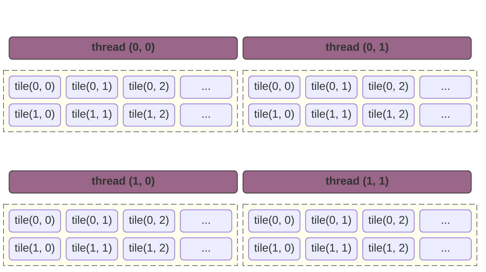


在连续分块模型下，我们的内存访问模型是这样的：在 `t0` 时刻，线程访问的是完全不连续的节点，在最后输出结果时，`t0.tile0` 和 `t1.tile0` 将不是连续的内存地址，无法合并访问；：

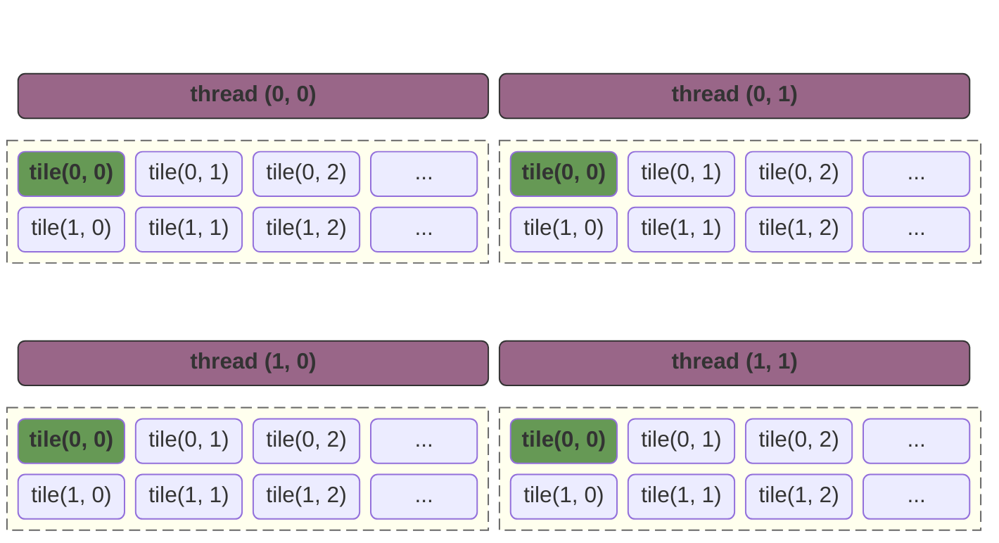


如果我们使用交错分块的话，我们的内存访问模型是这样的：

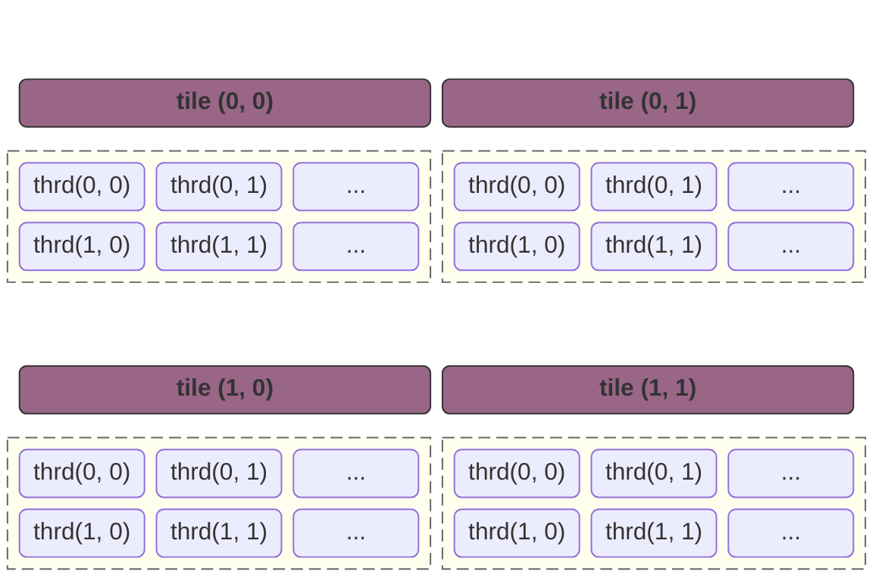

那么，在数据输出的时候，`t0.tile0`, `t1.tile0` 是连续输出的，可以合并访问。

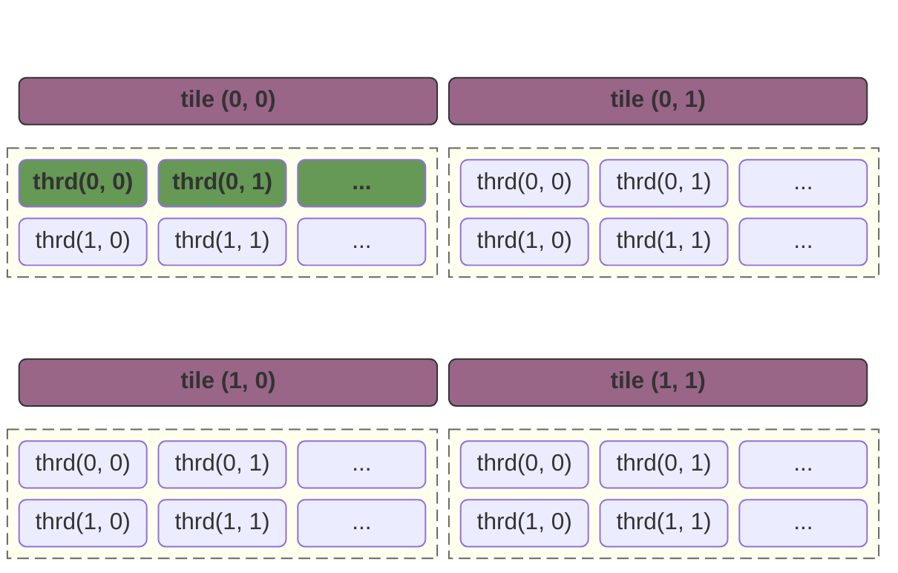

## 内积和外积

### 内积 (Inner Product / Dot Product)

内积的逻辑是锁定 $C$ 矩阵中的**一个点**，一口气算完它。这里由于内积我们比较熟悉，就不画图了。
$$
C_{i,j} = \sum_{k=0}^{N-1} A_{i,k} \cdot B_{k,j}
$$

### 外积 (Outer Product)

外积的逻辑是锁定共享维度 $k$ 的**一个切面**，更新 $C$ 矩阵中的**一片区域**。
$$
C += \text{col}_k(A) \otimes \text{row}_k(B)
$$


假设我们存在如下一个矩阵乘法：

#### 第一步

第一步，图中黄色的块计算，得到第一个矩阵：

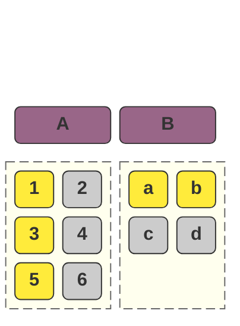

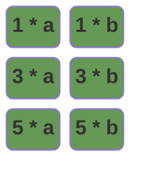

#### 第二步

第二步，图中黄色的块进行计算，得到第二个矩阵

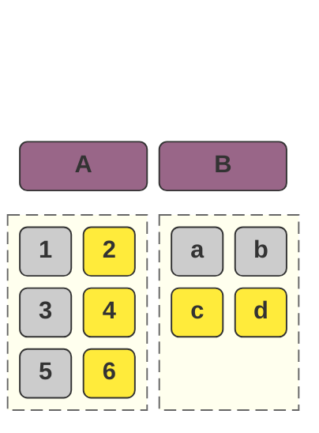


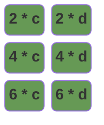


在将得到的两个矩阵相加得到：

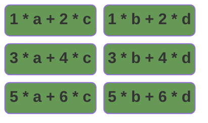

伪代码可以描述为：

```c++
for (int k = 0; k < columns(A); k++) {
    for (int a_row = 0; a_col < rows(A); a_row++) {
        for (int b_col = 0; b_row < columns(B); b_col++) {
            matrix[a_row][b_col] += A[a_row][k] * B[k][b_col];
        }
    }
}
```

我们还可以进行一次优化，这样，我们可以以浪费 `rows(A)` + `columns(B)` 个寄存器的代价，将一定的Shared Memory访问转换为寄存器访问：

```c++
for (int k = 0; k < columns(A); k++) {
    float col_of_a[rows(A)];
    float row_of_b[columns(B)];
    #pragma unroll
    for (int a_row = 0; a_row < rows(A); a_row++) {
        col_of_a[a_row] = A[a_row][k];
    }
    #pragma unroll
    for (int b_col = 0; b_col < columns(B); b_row++) {
        row_of_b[b_col] = B[k][b_col];
    }
    #pragma unroll    
    for (int a_row = 0; a_col < rows(A); a_row++) {
    #pragma unroll
	for (int b_col = 0; b_row < columns(B); b_col++) {
            matrix[a_row][b_col] += col_of_a[i] * row_of_b[j];
        }
    }
}
```

## 实现

于是，我们通过这个方式实现了第一个版本：基于 `TILE` ，`寄存器`，`内积转外积` 的优化逻辑。

```c++
#include <cuda_runtime.h>

#define ceil(x, y) (((x) + (y) - 1) / (y))

constexpr int THREAD_TILE_X = 8;
constexpr int THREAD_TILE_Y = 8;

constexpr int BLOCK_SIZE_X = 16;
constexpr int BLOCK_SIZE_Y = 16;

constexpr int STRIDE_X = BLOCK_SIZE_X * THREAD_TILE_X;
constexpr int STRIDE_Y = BLOCK_SIZE_Y * THREAD_TILE_Y;

// v1 版本，我们引入TILE机制实现线程粗化逻辑，同时我们通过将内积转换为外积来优化性能。
__global__ void matrix_multiplication_kernel(const float *A, const float *B, float *C,
                                             int M, int N, int K) {
    // 初始化结果数组
    float accum[THREAD_TILE_Y][THREAD_TILE_X];
    // 防止编译器优化到数组到显存
#pragma unroll
    for (int i_row = 0; i_row < THREAD_TILE_Y; ++i_row) {
#pragma unroll
        for (int i_col = 0; i_col < THREAD_TILE_X; ++i_col) {
            accum[i_row][i_col] = 0;
        }
    }

    // 现在我们要开始从内存读取数据并累加到结果数组
    // 按照我们的交错分布，我们在 accum[i_row][i_col] 这一个元素，对应的输出的点应该是
    // row = blockIdx.y * STRIDE_Y + i_row * BLOCK_SIZE_Y + threadIdx.y
    // col = blockIdx.x * STRIDE_X + i_col * BLOCK_SIZE_X + threadIdx.x

    // row = block行偏移量 + TILE行偏移量 + 线程相对行偏移量
    // block 行偏移量是相同的，i_row 对于所有的线程相同，而在block中左右相邻的线程y是一样的
    // 也就是说 row 的完全一致的，可以通过广播实现访问

    // col = block列偏移量 + TILE列偏移量 + 线程相对列偏移量
    // 这里block列偏移量是固定的，i_col 对所有的线程都是相同的，所以相邻线程的TILE列偏移量相同，
    // 唯一不同的是 threadIdx.x，而这个值不同线程之间是连续的，最后他们在内存中的数据可以合并访问
    const int tile_row_offset = static_cast<int>(blockIdx.y * STRIDE_Y + threadIdx.y);
    const int tile_col_offset = static_cast<int>(blockIdx.x * STRIDE_X + threadIdx.x);
    float col_of_a[THREAD_TILE_Y];
    float row_of_b[THREAD_TILE_X];
    for (int i_factor = 0; i_factor < N; ++i_factor) {
        // 关于 TILE 的遍历，我们可以看到 TILE 不是连续的
        // 因为这里在A的行和B的列的移动，是通过最外层的for循环实现的
        // 这里的 col_of_a 和 row_of_b 其实是TILE负责的区域在变化
        // 这里的逻辑其实可以理解为：
#pragma unroll
        for (int i_row = 0; i_row < THREAD_TILE_Y; ++i_row) {
            const int y = tile_row_offset + i_row * BLOCK_SIZE_Y;
            // 这个位置，同一个 block 下存在左右相邻线程 y 相等，那么他们访问的是同一个地址，
            // 可以通过广播传输数据。
            col_of_a[i_row] = y < M ? A[y * N + i_factor] : 0.0f;
        }
#pragma unroll
        for (int i_col = 0; i_col < THREAD_TILE_X; ++i_col) {
            // 这个位置，同一个 block 内，线程地址连续，可以合并访问。
            const int x = tile_col_offset + i_col * BLOCK_SIZE_X;
            row_of_b[i_col] = x < K ? B[i_factor * K + x] : 0.0f;
        }

#pragma unroll
        for (int i_row = 0; i_row < THREAD_TILE_Y; ++i_row) {
#pragma unroll
            for (int i_col = 0; i_col < THREAD_TILE_X; ++i_col) {
                accum[i_row][i_col] += col_of_a[i_row] * row_of_b[i_col];
            }
        }
    }

#pragma unroll
    for (int i = 0; i < THREAD_TILE_Y; i++) {
#pragma unroll
        for (int j = 0; j < THREAD_TILE_X; j++) {
            const int row_of_c = tile_row_offset + i * BLOCK_SIZE_Y;
            const int col_of_c = tile_col_offset + j * BLOCK_SIZE_X;
            if (row_of_c < M && col_of_c < K) {
                C[row_of_c * K + col_of_c] = accum[i][j];
            }
        }
    }
}

// A, B, C are device pointers (i.e. pointers to memory on the GPU)
extern "C" void solve(const float *A, const float *B, float *C, int M, int N, int K) {
    dim3 threadsPerBlock(BLOCK_SIZE_X, BLOCK_SIZE_Y);
    const int stride_x = static_cast<int>(threadsPerBlock.x) * THREAD_TILE_X;
    const int stride_y = static_cast<int>(threadsPerBlock.y) * THREAD_TILE_Y;
    dim3 blocksPerGrid(ceil(K, stride_x), ceil(M, stride_y));
    matrix_multiplication_kernel<<<blocksPerGrid, threadsPerBlock>>>(A, B, C, M, N, K);
    cudaDeviceSynchronize();
}
```

## 使用Shared Memory优化

```c++
#include <cuda_runtime.h>

#define ceil(x, y) (((x) + (y) - 1) / (y))

constexpr int THREAD_TILE_X = 8;
constexpr int THREAD_TILE_Y = 8;

constexpr int BLOCK_SIZE_X = 8;
constexpr int BLOCK_SIZE_Y = 8;
constexpr int THREAD_COUNT = BLOCK_SIZE_X * BLOCK_SIZE_Y;

constexpr int BX = BLOCK_SIZE_X * THREAD_TILE_X;
constexpr int BY = BLOCK_SIZE_Y * THREAD_TILE_Y;
constexpr int BK = 32;

__global__ void matrix_multiplication_kernel(const float *A, const float *B, float *C,
                                             int M, int N, int K) {
    // 我们把输出张量划分为多个 block，每个 block 又继续划分多个 THREAD
    // 每个THREAD 继续划分为多个 TILE
    // 这里 ssm_a 和 ssm_b 需要提供一个能力：在同一个 block 中，
    // 线程每次 for 循环移动时，覆盖当前 block 的所有线程的所有TILE所需要的数据
    // 一次读取，多次使用。
    // 那么，结合上面的结论和矩阵乘法的要求（计算元素 (x,y) 需要 A 的第 x 行和 B 的第 y 列）
    // 我们可以做出如下推论：
    // ssm_a 需要的矩阵是高度是 THREAD_TILE_Y * BLOCK_SIZE_Y
    // ssm_b 需要的矩阵是宽度是 THREAD_TILE_X * BLOCK_SIZE_X
    // 而 ssm_a 的宽度和 ssm_b 的高度则没有限制，只需要满足 ssm_a.width == ssm_b.height
    // 因为 :
    // 1. ssm_a 需要整行，它可以看做一个从索引0开始，向右划到到N结束的滑动块；
    // 2. ssm_b 需要整列，它可以看做一个从索引0开始，向下滑动到N结束的滑动块；
    // 也就是我们说，我们可以如下声明我们的 ssm_a 和 ssm_b，这里的 BK 是任意值都可以实现逻辑，只是性能不同
    __shared__ float ssm_a[BY][BK];
    __shared__ float ssm_b[BK][BX];

    float accum[THREAD_TILE_Y][THREAD_TILE_X] = {};
    float reg_for_a[THREAD_TILE_Y];
    float reg_for_b[THREAD_TILE_X];

    const int tid = static_cast<int>(threadIdx.y * BLOCK_SIZE_X + threadIdx.x);
    const int local_row = static_cast<int>(threadIdx.y);
    const int local_col = static_cast<int>(threadIdx.x);

    for (int i_k = 0; i_k < ceil(N, BK); i_k++) {
        // 每次计算当前TILE之前，我们要把所有的重新读取数据到ssm
        // 这里需要注意的是，当我们在搬运数据的时候，我们并不考虑TILE的概念
        // 从A和B搬运数据到ssm是一个完全独立的过程，它是输入张量某个区域到ssm的一比一映射
        // 那么，我们所需要考虑的就是：到底把哪个区域映射到我们的 ssm

        // 1. 对于 ssm_a，它的 x 轴随着 i_k 移动，y轴随着 block 移动；
        // 2. 对于 ssm_b，它的 y 轴随着 i_k 移动，x 轴随着 block 移动。

        // 对于 ssm_a，假设我们当前 block 的第一个线程的坐标是：
        // ty = blockIdx.y * blockDim.y + threadIdx.y
        // 那么我们需要填充到 ssm_a 的信息就是：
        // [(i_k * BK, ty), ((i_k + 1) * BK, ty))
        // [(i_k * BK, ty + 1), ((i_k + 1) * BK, ty + 1))
        // ...
        // [(i_k * BK, ty + BY - 1), ((i_k + 1) * BK, ty + BY - 1))
        // 得到一个 BY * BK 的矩阵，我们可以把这个矩阵看做一个整体，那么我们可以通过如下代码来实现搬运
        // for (int i = 0; i < BY; i++) {
        //     for (int j = 0; j < BX; j++) {
        //         ssm_a[x][y] = value;
        //     }
        // }
        // 我们需要将这个逻辑转换为GPU上实现的逻辑
        // 每个线程搬运一个数据，那么总共需要 (BY * BK) / (BLOCK_SIZE_X * BLOCK_SIZE_Y) 次（向上取整）
        for (int i = 0; i < ceil(BY * BK, THREAD_COUNT); ++i) {
            const int load_id = i * THREAD_COUNT + tid;
            const int r = load_id / BK;
            const int c = load_id % BK;
            const int global_r = static_cast<int>(blockIdx.y * BY + r);
            const int global_c = i_k * BK + c;
            if (global_r < M && global_c < N) {
                ssm_a[r][c] = A[global_r * N + global_c];
            } else {
                ssm_a[r][c] = 0.0f;
            }
        }
        // 对于 ssm_b，假设我们当前 block 的第一个线程的坐标是：
        // tx = blockIdx.x * blockDim.x + threadIdx.x
        // 那么我们需要填充到 ssm_b 的信息就是：
        // [(tx, i_k * BX), (tx, (i_k + 1) * BX))
        // [(tx + 1, i_k * BX), (tx + 1, (i_k + 1) * BX))
        // ...
        // [(tx + BK - 1, i_k * BX), (tx + BK - 1, (i_k + 1) * BX))
        // 得到一个 BK * BX 的矩阵
        for (int i = 0; i < ceil(BK * BX, THREAD_COUNT); i++) {
            const int load_id = i * THREAD_COUNT + tid;
            const int r = load_id / BX;
            const int c = load_id % BX;
            const int global_r = i_k * BK + r;
            const int global_c = static_cast<int>(blockIdx.x * BX + c);
            if (global_r < N && global_c < K) {
                ssm_b[r][c] = B[global_r * K + global_c];
            } else {
                ssm_b[r][c] = 0.0;
            }
        }
        __syncthreads();

        // 我们使用外积的方式来计算结果，外积可以看做是 [M * 1] * [1 * N] 的矩阵乘法，得到一个 [M * N] 的矩阵
        // 每个线程负责一个TILE，注意，在之前我们的逻辑中
        // 我们特意使用了TILE和线程交错排布的模式，但是这里我们改用了
        // TILE紧密排布的模式(TILE0, TILE1, ...)，因为之前我们是访问显存，
        // 而现在访问的是寄存器和SharedMemory，不再需要考虑合并读取。
        #pragma unroll
        for (int k = 0; k < BK; k++) {
            // 这里，进入我们的累加循环，我们的矩阵乘法是 [THREAD_TILE_Y * BK] * [BK * THREAD_TILE_X]
            // 这个位置非常容易误解成我们浪费了一些元素，因为我们把内积转换成了外积
            // 如果我们采用如下的方式：
            // for (int i = 0; i < BY; i++){}
            // for (int i = 0; i < BX; i++){}
            // 我们计算的就不是 TILE 的结果，而是整个block的结果，那样我们相当于多个线程重复计算了
            #pragma unroll
            for (int i = 0; i < THREAD_TILE_Y; i++) {
                reg_for_a[i] = ssm_a[local_row * THREAD_TILE_Y + i][k];
            }
            #pragma unroll
            for (int i = 0; i < THREAD_TILE_X; i++) {
                reg_for_b[i] = ssm_b[k][local_col * THREAD_TILE_X + i];
            }
            #pragma unroll
            for (int r = 0; r < THREAD_TILE_Y; r++) {
                #pragma unroll
                for(int c = 0; c < THREAD_TILE_X; c++) {
                    accum[r][c] += reg_for_a[r] * reg_for_b[c];
                }
            }
        }
        __syncthreads();
    }

    for (int r = 0; r < THREAD_TILE_Y; r++) {
        for (int c = 0; c < THREAD_TILE_X; c++) {
            int global_r = static_cast<int>(blockIdx.y * BY + threadIdx.y * THREAD_TILE_Y + r);
            int global_c = static_cast<int>(blockIdx.x * BX + threadIdx.x * THREAD_TILE_X + c);
            if (global_r < M && global_c < K) {
                C[global_r * K + global_c] = accum[r][c];
            }
        }
    }
}


// A, B, C are device pointers (i.e. pointers to memory on the GPU)
extern "C" void solve(const float *A, const float *B, float *C, int M, int N, int K) {
    dim3 threadsPerBlock(BLOCK_SIZE_X, BLOCK_SIZE_Y);
    const int stride_x = static_cast<int>(threadsPerBlock.x) * THREAD_TILE_X;
    const int stride_y = static_cast<int>(threadsPerBlock.y) * THREAD_TILE_Y;
    dim3 blocksPerGrid(ceil(K, stride_x), ceil(M, stride_y));

    matrix_multiplication_kernel<<<blocksPerGrid, threadsPerBlock>>>(A, B, C, M, N, K);
    cudaDeviceSynchronize();
}
```

# Matrix Transpose

## naive 实现

```c++
#include <cuda_runtime.h>

__global__ void matrix_transpose_kernel(const float* input, float* output, int rows, int cols) {
    int x = blockIdx.x * blockDim.x + threadIdx.x;
    int y = blockIdx.y * blockDim.y + threadIdx.y;
    if (x < cols && y < rows) {
        output[x * rows + y] = input[y * cols + x];
    }
}
```

## 写入合并

当我们读取数据时，`input[y * cols + x]` 是可以连续访问的，而 `output[x * rows + y]` 是不能连续访问，这个位置的逻辑和CUDA线程底层调度逻辑有关：**合并访问的前提是线程访问地址连续，且线程在 Warp 中连续**。

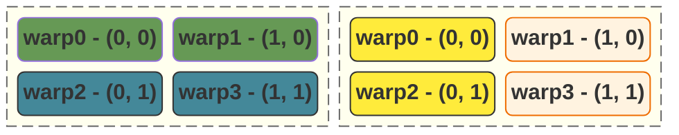

假设我们声明了一个 `2 * 2` 的 `warp`。

那么对于 `input`：

- `(0, 0)` 和 `(1, 0)` 访问的地址分别为 `0` 和 `1`；
- `(0, 1)` 和 `(1, 1)` 访问的地址分别为 `2` 和 `3`；

而他们不仅仅访问地址连续，他们在warp中也是连续的，所以他们可以合并访问；

而对于 `output`：

- `(0, 0)` 和 `(0, 1)` 访问的地址分别为 `0` 和 `1`；
- `(1, 0)` 和 `(1, 1)` 访问的地址分别为 `2` 和 `3`；

当一个 Warp 执行访存指令时，显存控制器会查看这 `4` 个线程**在这一瞬间**发出的所有请求：

- $T_0$ 访问 `0`
- $T_1$ 访问 `2`
- $T_2$ 访问 `1`
- $T_3$ 访问 `3`

**从显存控制器的视角来看：** 它看到 $T_0$ 要 `Addr 0`，$T_2$ 要 `Addr 1`。虽然这两个地址连在一起，但它们被分配到了不同的**掩码（Mask）**位上。在硬件内部，合并（Coalescing）是基于 **Warp Lane ID**（即线程在 Warp 中的编号）顺序进行的。如果 $T_0$ 访问 $A$，而 $T_1$ 访问的不是 $A+1$，硬件就会认为这个请求是“发散”的。它不会去扫描整个 Warp 看看 $T_8$ 是否刚好要 $A+1$ 并把它们拼起来。它会直接判定：这组请求无法合并为一个简单的 **128-byte 事务**，必须拆分成多个 **32-byte 事务** 甚至更小的请求。

### 引入Shared Memory实现合并写入

换个思路，我们可以先读取数据：

```mermaid
block-beta

columns 2

block:z0:1
    columns 2
    b0("warp0 - (0, 0)") b1("warp1 - (1, 0)")
    b2("warp2 - (0, 1)") b3("warp3 - (1, 1)")
end

class b0,b1 green
class b2,b3 blue
class z0 animate

classDef transparent fill:none,stroke:none,color:inherit;
classDef content fill:#fff,stroke:#ccc;
classDef animate stroke:#666,stroke-dasharray: 8 4,stroke-dashoffset: 900,animation: dash 20s linear infinite;
classDef yellow fill:#FFEB3B,stroke:#333,color:#000,font-weight:bold;
classDef blue fill:#489,stroke:#333,color:#fff,font-weight:bold;
classDef pink fill:#FFCCCC,stroke:#333,color:#333,font-weight:bold;
classDef light_green fill:#e8f5e9,stroke:#695;
classDef green fill:#695,color:#fff,font-weight:bold;
classDef purple fill:#968,stroke:#333,color:#fff,font-weight:bold;
classDef gray fill:#ccc,stroke:#333,font-weight:bold;
classDef error fill:#bbf,stroke:#f65,stroke-width:2px,color:#fff,stroke-dasharray: 5 5;
classDef coral fill:#f8f,stroke:#333,stroke-width:4px;
classDef orange fill:#fff3e0,stroke:#ef6c00,color:#ef6c00,font-weight:bold;
```

当我们转换时，我们先将转换后的数据写入到 Shared Memory，此时我们无需考虑顺序写入的问题：

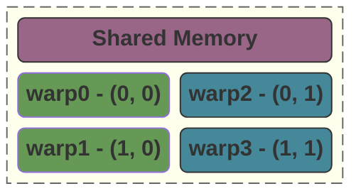

随后，我们再将 Shared Memory 中的数据原样输出：

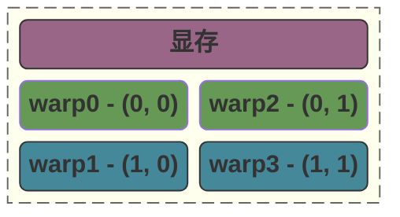

即可完成合并写入。

### 代码实现

整个过程可以描述为：

1. 我们先通过 `blockIdx.y * TY` 和 `blockIdx.x * TX` 找到我们 `block` 的基准偏移量；
2. 此时，我们需要通过这个基准偏移量去访问内部的 Shared Memory。此时，我们对

1. 当我们转置矩阵前，x 表示 col，y 表示 row，此时访问显存是连续的。
2. 转置之后，x 表示 row，y 表示 col，此时访问显存变得不连续。但是，我们先把数据写入到 SM，此时不用考虑合并访问的问题。
3. 最后在输出的时候，我们先找到 block 的基准索引，并使用 (x, y) 作为偏移量去输出。此时出现一个神奇的情况：
   1. 在 output 这边，x 表示的是列，它可以合并访问；
   2. 在 sm 这边，x 表示的是行，它不需要考虑合并访问。

**这里，我们是通过将线程的职责做了转置 -- 本来应该去访问行的线程，我们现在让他去访问列了。**

```c++ mark:25-29
#include <cuda_runtime.h>

#define CEIL_DIV(x, y) (((x) + (y) - 1) / (y))

constexpr int TX = 16;
constexpr int TY = 16;

__global__ void matrix_transpose_kernel(const float* input, float* output, int rows, int cols) {
    __shared__ float ssm[TY][TX];

    int local_row = threadIdx.y;
    int local_col = threadIdx.x;

    int block_row = blockIdx.y * TY;
    int block_col = blockIdx.x * TX;

    int global_row = block_row + local_row;
    int global_col = block_col + local_col;
    if (global_col < cols && global_row < rows) {
        // 转置矩阵到sm
        ssm[local_row][local_col] = input[global_row * cols + global_col];
    }
    __syncthreads();

    int gx_out = block_row + local_col;
    int gy_out = block_col + local_row;
    if (gx_out < rows && gy_out < cols) {
        output[gy_out * rows + gx_out] = ssm[local_col][local_row];
    }
}

// input, output are device pointers (i.e. pointers to memory on the GPU)
extern "C" void solve(const float* input, float* output, int rows, int cols) {
    dim3 threadsPerBlock(TX, TY);
    dim3 blocksPerGrid(CEIL_DIV(cols, TX), CEIL_DIV(rows, TY));

    matrix_transpose_kernel<<<blocksPerGrid, threadsPerBlock>>>(input, output, rows, cols);
    cudaDeviceSynchronize();
}
```

## Bank Conflict

在我们的代码中，有两个位置会访问 Shared Memory：

- `ssm[local_row][local_col]` 这里我们每个线程访问的 `bank` 等于 `(local_row * TY + local_col) % 32`，也就是说：只要我们的 `local_row` 是连续的，就不会产生 `bank conflict`；
- `ssm[local_col][local_row]` 这里我们每个线程访问的 `bank` 等于 `(local_col * TY + local_row) % 32`，此时，`local_row`(threadIdx.y) 不变，而 `local_col` 递增：
  - 如果 `local_col` 等于 `32`，那么会发生 `32-way bank conflict`
  - 如果 `local_col` 等于 `16`，那么会发生 `16-way bank conflict`

我们可以通过 `__shared__ float ssm[TY][TX + 1];` 避免这个问题。

```c++ mark:9,13,17
#include <cuda_runtime.h>

#define CEIL_DIV(x, y) (((x) + (y) - 1) / (y))

constexpr int TX = 16;
constexpr int TY = 16;

__global__ void matrix_transpose_kernel(const float* input, float* output, int rows, int cols) {
    __shared__ float ssm[TY][TX + 1];
    // ...
    if (global_col < cols && global_row < rows) {
        // 转置矩阵到sm
        ssm[local_row][local_col] = input[global_row * cols + global_col];
    }
	// ...
    if (gx_out < rows && gy_out < cols) {
        output[gy_out * rows + gx_out] = ssm[local_col][local_row];
    }
}
```

## 一些值得注意的细节

代码中位移需要注意的是以下两行：

- `int gx_out = blockIdx.y * TY + tx;`
- `int gy_out = blockIdx.x * TX + ty;`

**这里，我们会发现一个重要的前提：被转置的矩阵可以不是对称的，但是我们block中的TILE必须是对称的。**

对于那些可以完全填满我们的 `TX * TY` 整个TILE的块，逻辑很简单，会直接发生一个转置。**而对于那些不能填满我们的TILE的块，会存在一些特殊的逻辑。**我们以一个 `2 * 3` 的矩阵作为例子说明：

```mermaid
block-beta

columns 2

block:z0:1
    columns 3
    b0("(0, 0)") b1("(1, 0)") b2("(2, 0)")
    b3("(0, 1)") b4("(1, 1)") b5("(2, 1)")
end

class b0,b1,b2 green
class b3,b4,b5 light_green

class z0 animate

classDef transparent fill:none,stroke:none,color:inherit;
classDef content fill:#fff,stroke:#ccc;
classDef animate stroke:#666,stroke-dasharray: 8 4,stroke-dashoffset: 900,animation: dash 20s linear infinite;
classDef yellow fill:#FFEB3B,stroke:#333,color:#000,font-weight:bold;
classDef blue fill:#489,stroke:#333,color:#fff,font-weight:bold;
classDef pink fill:#FFCCCC,stroke:#333,color:#333,font-weight:bold;
classDef light_green fill:#e8f5e9,stroke:#695;
classDef green fill:#695,color:#fff,font-weight:bold;
classDef purple fill:#968,stroke:#333,color:#fff,font-weight:bold;
classDef gray fill:#ccc,stroke:#333,font-weight:bold;
classDef error fill:#bbf,stroke:#f65,stroke-width:2px,color:#fff,stroke-dasharray: 5 5;
classDef coral fill:#f8f,stroke:#333,stroke-width:4px;
classDef orange fill:#fff3e0,stroke:#ef6c00,color:#ef6c00,font-weight:bold;
```

转置后我们得到的是一个 `3 * 2` 的矩阵：

```mermaid
block-beta

columns 2

block:z0:1
    columns 2
    b0("(0, 0)") 
    b3("(1, 0)")
    b1("(0, 1)")
    b4("(1, 1)")
    b2("(0, 2)")
    b5("(1, 2)")
end

class b0,b3 green
class b1,b4 light_green
class b2,b5 blue

class z0 animate

classDef transparent fill:none,stroke:none,color:inherit;
classDef content fill:#fff,stroke:#ccc;
classDef animate stroke:#666,stroke-dasharray: 8 4,stroke-dashoffset: 900,animation: dash 20s linear infinite;
classDef yellow fill:#FFEB3B,stroke:#333,color:#000,font-weight:bold;
classDef blue fill:#489,stroke:#333,color:#fff,font-weight:bold;
classDef pink fill:#FFCCCC,stroke:#333,color:#333,font-weight:bold;
classDef light_green fill:#e8f5e9,stroke:#695;
classDef green fill:#695,color:#fff,font-weight:bold;
classDef purple fill:#968,stroke:#333,color:#fff,font-weight:bold;
classDef gray fill:#ccc,stroke:#333,font-weight:bold;
classDef error fill:#bbf,stroke:#f65,stroke-width:2px,color:#fff,stroke-dasharray: 5 5;
classDef coral fill:#f8f,stroke:#333,stroke-width:4px;
classDef orange fill:#fff3e0,stroke:#ef6c00,color:#ef6c00,font-weight:bold;
```

而我们的线程的索引则是（这里，我们假设线程是 `3 * 3` 可以全部覆盖的），可以看到：

- `(2, 0)` 和 `(2, 1)` 这两个节点将会被不会被计算，因为他们不满足判定条件；
- 而 `(0, 2)` 和 `(1, 2)` 这两个节点则会覆盖我们新输出的矩阵。

```mermaid
block-beta

columns 2

block:z0:1
    columns 3
    b0("(0, 0)")
    b1("(1, 0)")
    b2("(2, 0)")
    b3("(0, 1)")
    b4("(1, 1)")
    b5("(2, 1)")
    b6("(0, 2)")
    b7("(1, 2)")
    b8("(2, 2)")
end

class b0,b1 green
class b3,b4 light_green
class b6,b7 blue
class b2,b5,b8 error
class 

class z0 animate

classDef transparent fill:none,stroke:none,color:inherit;
classDef content fill:#fff,stroke:#ccc;
classDef animate stroke:#666,stroke-dasharray: 8 4,stroke-dashoffset: 900,animation: dash 20s linear infinite;
classDef yellow fill:#FFEB3B,stroke:#333,color:#000,font-weight:bold;
classDef blue fill:#489,stroke:#333,color:#fff,font-weight:bold;
classDef pink fill:#FFCCCC,stroke:#333,color:#333,font-weight:bold;
classDef light_green fill:#e8f5e9,stroke:#695;
classDef green fill:#695,color:#fff,font-weight:bold;
classDef purple fill:#968,stroke:#333,color:#fff,font-weight:bold;
classDef gray fill:#ccc,stroke:#333,font-weight:bold;
classDef error fill:#bbf,stroke:#f65,stroke-width:2px,color:#fff,stroke-dasharray: 5 5;
classDef coral fill:#f8f,stroke:#333,stroke-width:4px;
classDef orange fill:#fff3e0,stroke:#ef6c00,color:#ef6c00,font-weight:bold;
```

## 总结

无论我们在写多么复杂的算子（转置、矩阵乘法、卷积），我们脑子里那个**“基准（Base）+ 偏移（Offset）”**的分级坐标系就是一切逻辑的锚点。
$$
GlobalIndex = \underbrace{BlockIdx \times BlockDim}_{基准偏移量 (宏观)} + \underbrace{ThreadIdx}_{内部偏移量 (微观)}
$$
对于使用了线程粗化技术的，我们的 `BlockDim` 需要修改为步长：
$$
GlobalIndex = \underbrace{BlockIdx \times Stride}_{基准偏移量 (宏观)} + \underbrace{ThreadIdx}_{内部偏移量 (微观)}
$$

# Color Inversion

## threads和blocks分配策略

在处理大带宽需求的图像算子时，我们遵循两个核心策略来压榨 GPU 性能：

- **向量化访存 (Vectorized Access)**：通过将 `unsigned char*` 强转为 `uchar4*`，利用单条指令加载 128-bit 数据（4 个像素），将访存压力降至原来的 1/4。
- **线程粗化 (Thread Coarsening)**：通过参数 `BK` 让单个线程处理多个连续像素。这能有效分摊坐标计算和指令发射的开销。

## 代码实现

```c++
#include <cuda_runtime.h>

#define CEIL_DIV(x, y) (((x) + (y) - 1) / (y))

constexpr int BX = 32;          // block中的x线程
constexpr int BY = 8;          // block中的y线程

constexpr int BK = 16;          // block内x轴步长，每次处理BK组RGB元素

constexpr int SX = BX * BK;     // block的x轴步长，每个RGB元素占据四个字节
constexpr int SY = BY;          // block的y轴步长，我们这里y轴为1

__global__ void invert_kernel(unsigned char* image, int width, int height) {
    uchar4* pixel4 = reinterpret_cast<uchar4*>(image);
    // 注意，这里我们使用的是TILE和线程交错排布，所以相对偏移量不需要乘以BK
    const int gx = blockIdx.x * SX + threadIdx.x;
    const int gy = blockIdx.y * SY + threadIdx.y;

    for (int i = 0; i < BK; i++) {
        const int tx = gx + i * BX;
        if (tx < width && gy < height) {
            int idx = gy * width + (gx + i * BX);
            uchar4 pixel = pixel4[idx];
            pixel.x = 255 - pixel.x;
            pixel.y = 255 - pixel.y;
            pixel.z = 255 - pixel.z;
            pixel4[idx] = pixel;
        }
    }
}

// image_input, image_output are device pointers (i.e. pointers to memory on the GPU)
extern "C" void solve(unsigned char* image, int width, int height) {
    dim3 threadsPerBlock(BX, BY);
    dim3 blocksPerGrid(CEIL_DIV(width, SX), CEIL_DIV(height, SY));
    invert_kernel<<<blocksPerGrid, threadsPerBlock>>>(image, width, height);
    cudaDeviceSynchronize();
}
```

## 性能分析

在我们这个**使用了x轴线程粗化技术**的代码中，我们存在一个严重的问题：我们在 `TESLA` 上，我们的 `BK` 越小，反而执行的性能越快！而在我自己的 `4060 TI` 上却完全是正好相反的：

| `WIDTH` | `BX` | `BY` | `HEIGHT` | `BK` | `TESLA T4` | `4060 TI` |
| ------- | ---- | ---- | -------- | ---- | ---------- | --------- |
| 5120    | 32   | 8    | 4096     | 1    | 0.72ms     | 862257ns  |
| 5120    | 32   | 8    | 4096     | 8    | 0.86ms     | 569921ns  |
| 5120    | 32   | 8    | 4096     | 16   | 0.89ms     | 588599ns  |

这是一个很神奇的现象，我们下面仔细研究一下这个问题。先来看看T4和4060 TI的差别：

| **关键参数**         | **Tesla T4 (Turing)** | **RTX 4060 Ti (Ada)** | **对优化的影响**                            |
| -------------------- | --------------------- | --------------------- | ------------------------------------------- |
| **显存位宽**         | **256-bit**           | **128-bit**           | **4060 Ti 的总线更窄，更依赖缓存命率**      |
| **L2 缓存容量**      | **4 MB**              | **32 MB**             | **核心差异点**。L2 越大，重复访存的代价越低 |
| **架构代次**         | Turing (2018)         | Ada Lovelace (2023)   | 架构越新，单核指令周期（IPC）越高           |
| **SM 数量**          | 40                    | 34                    | SM 越多，能并行的 Block 数量越多            |
| **显存带宽**         | 320 GB/s              | 288 GB/s              | T4 原始带宽甚至略高，但 4060 Ti 靠 L2 补齐  |
| **单精度浮点性能**   | 8.1 TFLOPS            | 22.1 TFLOPS           | 4060 Ti 的计算能力是 T4 的 2.7 倍           |
| **核心频率 (Boost)** | ~1590 MHz             | ~2535 MHz             | 4060 Ti 跑指令的速度明显快得多              |

在这些参数中，`架构代次`，`SM数量`，`显存带宽`，`单精度浮点性能`，`核心频率` 这几个参数只会影响我们程序的绝对运行时间，不会影响我们在不同配置下的计算时间，所以我们主要需要关注的是：

- `L2缓存容量` T4 的 L2 只有 4MB。当我们使用大 `BK` 时，每个线程处理的数据范围变大，在 40 个 SM 并发的情况下，很容易就把这 4MB 撑爆，导致缓存频繁失效，不得不去慢速的显存读取数据。而 4060 TI 拥有更大的缓存，这意味着我们缓存命中的情况更高；
- `显存位宽`：理论上，更高的显存位宽会带来更大的显存读取流量，但是这里有可能会因为L2缓存过小的原因浪费。

```bash
ncu --metrics l1tex__t_sector_hit_rate.pct,lts__t_sector_hit_rate.pct,sm__inst_executed.avg.per_cycle_active,sm__warps_active.avg ./build/color_inversion
```

我们得到了如下输出：

```
    Section: Command line profiler metrics
    -------------------------------------- ----------- ------------
    Metric Name                            Metric Unit Metric Value
    -------------------------------------- ----------- ------------
    l1tex__t_sector_hit_rate.pct                     %        48.85
    lts__t_sector_hit_rate.pct                       %        50.03
    sm__inst_executed.avg.per_cycle_active  inst/cycle         0.27
    sm__warps_active.avg                          warp  56986735.50
    -------------------------------------- ----------- ------------
```

- `l1tex__t_sector_hit_rate.pct` 和 `lts__t_sector_hit_rate.pct` 显示有 **50%** 的命中率。这其实印证了 **写入分配（Write Allocation）** 机制： 在现代 GPU 中，当我们往显存写数据时，系统会先检查这块地址是否在 L2 中。由于我们处理的是连续像素（`uchar4`），线程 A 读取了像素，线程 B 随后写入。**读操作**产生的 Cache Line 被保留在 L2 中，使得紧随其后的**写操作**直接命中了缓存。这 50% 的命中率意味着我们的**写操作几乎全部在 L2 内部完成**，极大地缓解了 4060 Ti 那窄小的 128-bit 总线压力。
- **`sm__inst_executed.avg.per_cycle_active` (0.27)** ：表示指令执行效率：0.27 inst/cycle，因为这是一个典型的**访存受限（Memory-bound）**算子。核心大部分时间都在等待显存返回数据，而不是在忙着做计算。

# Matrix Addition

## 矩阵加法的两种naive实现

我们基于 `1D线性模型` 和 `基于矩阵模型` 两种不同的逻辑实现了矩阵加法，然而，**基于1D线性模型的实现速度接近于基于矩阵模型的两倍。**这里主要的性能差距是由于：

1. 线性模型的判定条件 `idx < N * N` 在最后计算结束的那个 `block` 之前，所有的判定均为真；而 `tx < N && ty < N`，假设 `N % tx` 或者 `N % ty` 有一个不为零的话，那么每个 `block` 都会出现空转线程；
2. 2D 布局在逻辑上是块状的，但显存是线性的。一旦 $N$ 的宽度没对齐到硬件的 Cache Line（通常是 128 字节），2D 访问在每一行的末尾都会产生**内存空洞**。
3. `1D模型` 指令强度更高：
   - `1D模型` 中，计算索引只需要一条 MAD 指令：`blockIdx.x * blockDim.x + threadIdx.x`；
   - `2D模型` 中，计算索引需要三条 MAD 指令：
     - `tx = blockIdx.x * blockDim.x + threadIdx.x` 
     - `ty = blockIdx.y * blockDim.y + threadIdx.y` 
     - `idx = ty * N + tx`
4. 寄存器压力更大：每一个中间变量（`tx`, `ty`, `bx`, `by`）都需要占用线程的寄存器。而 `1D模型` 中只有两个中间变量用于计算索引；

### 基于1D线性模型

```c++
#include <cstdio>
#include <cuda_runtime.h>

__global__ void matrix_add_scalar(const float* A, const float* B, float* C, int N) {
    int bx = blockIdx.x * blockDim.x;
    int tx = bx + threadIdx.x;
    if (tx < N * N) {
        C[tx] = A[tx] + B[tx];
    }
}

// A, B, C are device pointers (i.e. pointers to memory on the GPU)
extern "C" void solve(const float* A, const float* B, float* C, int N) {
    int threadsPerBlock = 256;
    int blocksPerGrid = (N * N + threadsPerBlock - 1) / threadsPerBlock;

    matrix_add_scalar<<<blocksPerGrid, threadsPerBlock>>>(A, B, C, N);
    cudaDeviceSynchronize();
}
```

### 基于矩阵模型

```c++
#include <cstdio>
#include <cuda_runtime.h>

#define CEIL_DIV(x, y) (((x) + (y) - 1) / (y))

constexpr int BX = 32;
constexpr int BY = 8;

__global__ void matrix_add_scalar(const float* A, const float* B, float* C, int N) {
    int bx = blockIdx.x * blockDim.x;
    int by = blockIdx.y * blockDim.y;
    int tx = bx + threadIdx.x;
    int ty = by + threadIdx.y;
    if (tx < N && ty < N) {
        int idx = ty * N + tx;
        C[idx] = A[idx] + B[idx];
    }
}

// A, B, C are device pointers (i.e. pointers to memory on the GPU)
extern "C" void solve(const float* A, const float* B, float* C, int N) {
    dim3 threadsPerBlock(BX, BY);
    dim3 blocksPerGrid(CEIL_DIV(N, BX), CEIL_DIV(N, BY));

    matrix_add_scalar<<<blocksPerGrid, threadsPerBlock>>>(A, B, C, N);
    cudaDeviceSynchronize();
}
```

## 使用向量化加速优化

**根据我们前面的对于 `1D` 和 `2D` 模型的分析，我们可以确认：对于 `element-wise` 的算子，我们优先使用 `1D` 模型**。

在我们的代码中，我们直接将 `N * N` 的矩阵转换为一个包含 `N * N / 4` 个数字的数组，这样编程逻辑更加清晰简洁。

```c++
#include <cstdio>
#include <cuda_runtime.h>

#define CEIL_DIV(x, y) (((x) + (y) - 1) / (y))

constexpr int BX = 256;

__global__ void matrix_add_vectorized(const float4* A, const float4* B, float4* C, int N) {
    int tx = blockIdx.x * blockDim.x + threadIdx.x;
    if (tx < N) {
        float4 a = A[tx];
        float4 b = B[tx];
        C[tx] = make_float4(a.x + b.x, a.y + b.y, a.z + b.z, a.w + b.w);
    }
}

__global__ void matrix_add_scalar(const float* A, const float* B, float* C, int N) {
    int bx = blockIdx.x * blockDim.x;
    int tx = bx + threadIdx.x;
    if (tx < N) {
        C[tx] = A[tx] + B[tx];
    }
}

// A, B, C are device pointers (i.e. pointers to memory on the GPU)
extern "C" void solve(const float* A, const float* B, float* C, int N) {
    int threadsPerBlock = BX;

    int total_elements = N * N;
    if (reinterpret_cast<size_t>(A) % 16 == 0
        && reinterpret_cast<size_t>(B) % 16 == 0
        && reinterpret_cast<size_t>(C) % 16 == 0
        && (N * N) % 4 == 0) {

        total_elements /= 4;
        dim3 blocksPerGrid(CEIL_DIV(total_elements, threadsPerBlock));
        const float4 * vA = reinterpret_cast<const float4*>(A);
        const float4 * vB = reinterpret_cast<const float4*>(B);
        float4 * vC = reinterpret_cast<float4*>(C);
        matrix_add_vectorized<<<blocksPerGrid, threadsPerBlock>>>(vA, vB, vC, total_elements);
    } else {
        dim3 blocksPerGrid(CEIL_DIV(total_elements, threadsPerBlock));
        matrix_add_scalar<<<blocksPerGrid, threadsPerBlock>>>(A, B, C, total_elements);
    }

    cudaDeviceSynchronize();
}
```

# Reduction - `add`

> Write a GPU program that performs parallel reduction on an array of 32-bit floating point numbers to compute their sum. The program should take an input array and produce a single output value containing the sum of all elements.

## Sequential Indexing

第一个版本，我们使用了 Sequential Indexing（顺序索引）规约的方式，将活跃的线程压缩到同一个 `warp` 中，即使在最后阶段仍然会存在 Thread Divergence，但是由于是指数级坍缩的，所以是可以接受的，这里有几个需要注意的点是：

1. 通过 `(gx < N) ? input[gx] : 0.0f;` 我们既避免了 thread divergence，同时我们还为所有的超出范围的数值赋予了一个不会改变加法结果的填充值，这样我们可以不需要去进行复杂的边界判定；
2. 通过 `for (unsigned stride = THREAD_PER_BLOCK / 2; stride > 0; stride >>= 1)`，我们将活跃线程压缩到相邻的线程中，这样执行的warp总是保持最高的活跃线程；
3. 通过 `if (tx < stride && tx < THREAD_PER_BLOCK)` 我们避免了代价高昂的 `/` 和 `%` 操作；

```cpp mark:7,8,10-17
__global__ void naive_add(const float *input, float *output, int N)
{
    __shared__ float ssm[THREAD_PER_BLOCK];

    const unsigned gx = blockDim.x * blockIdx.x + threadIdx.x;
    const unsigned tx = threadIdx.x;
    ssm[tx] = (gx < N) ? input[gx] : 0.0f;
    __syncthreads();

    for (unsigned stride = THREAD_PER_BLOCK / 2; stride > 0; stride >>= 1)
    {
        if (tx < stride && tx < THREAD_PER_BLOCK)
        {
            ssm[tx] += ssm[tx + stride];
        }
        __syncthreads();
    }

    if (tx == 0)
    {
        atomicAdd(output, ssm[0]);
    }
}
```

## shfl_down_sync

> 我们可以查看 [常用的线程束级原语](#常用的线程束级原语) 这一章节了解一下前置知识。

```cpp
#include <cuda_runtime.h>

#define CEIL_DIV(x, y) (((x) + (y) - 1) / (y))

constexpr unsigned THREAD_PER_BLOCK = 256;

__global__ void add_kernel(const float *input, float *output, int N)
{
    __shared__ float ssm[THREAD_PER_BLOCK];

    const unsigned gx = blockDim.x * blockIdx.x + threadIdx.x;
    const unsigned tx = threadIdx.x;
    // 注意，这里对于超出范围的我们初始化为 0.0f，这非常重要，可以有效的减少我们后续的边界条件判定
    ssm[tx] = (gx < N) ? input[gx] : 0.0f;
    __syncthreads();

    for (unsigned stride = THREAD_PER_BLOCK / 2; stride >= 32; stride >>= 1)
    {
        if (tx < stride && tx < THREAD_PER_BLOCK)
        {
            ssm[tx] += ssm[tx + stride];
        }
        __syncthreads();
    }

    if (tx < 32) {
        float val = ssm[tx];

        val += __shfl_down_sync(0xffffffff, val, 16);
        val += __shfl_down_sync(0xffffffff, val, 8);
        val += __shfl_down_sync(0xffffffff, val, 4);
        val += __shfl_down_sync(0xffffffff, val, 2);
        val += __shfl_down_sync(0xffffffff, val, 1);

        if (tx == 0) {
            atomicAdd(output, ssm[0]);
        }
    }
}

// input, output are device pointers (i.e. pointers to memory on the GPU)
extern "C" void solve(const float *input, float *output, int N)
{
    int blocksPerGrid = CEIL_DIV(N, THREAD_PER_BLOCK);
    add_kernel<<<blocksPerGrid, THREAD_PER_BLOCK>>>(input, output, N);
    cudaDeviceSynchronize();
}
```

## grid stride 模式下的 reduction

整体的思路是：

1. 以 `grid stride` 遍历整个输入，在这种情况下，我们在充分利用 `合并访问 `和 `L2缓存` 的情况下将所有的数据汇总到初始声明的 `block` 中；`block` 中的每个线程都包含了一个已经经历初步计算的值；
2. 对 `warp` 内的 `thread` 中的数据进行规约，将任意的 `warp` 的数据 `local_sum` 在规约后存入到 `warp` 中的第一个线程中；
3. 对 `block` 内 `warp` 中的数据进行规约，此时，我们的目标是将 `block` 中的全部 `warp` 的数据汇总。不同于 `warp` 内可以通过 `__shfl_down_sync` 进行通信，`warp` 之间必须通过 `Shared Memory` 进行数据共享：
   - `lane` 表示 thread 在 warp 中的索引；
   - `wid` 表示 warp 在block 中的索引；
4. 我们将每个 `warp` 下计算的到的数据（local_sum）存入到 `sm`，这里使用 `lane == 0` 的线程去更新（表示是 `warp` 中的第一个 `thread`），索引是 `wid`（表示 `block` 中的第 `wid` 个 `warp`），同时基于 `block` 级的 `__syncthreads()` 同步指令等待同步完成；
5. 此时，我们得到的 `sm` 中包含了，第 `wid` 个 `warp` 下的数据。此时，我们可以利用 `warp` 中 `thread` 数量等同于 `block` 中的 `warp` 数量这个特点，使用 `lane` 去访问 `sm` 中的数据。此时，我们又可以再次利用 `__shfl_down_sync` 来传输数据。
6. 最后，将得到的数据更新到输出。

```cpp
#include <cuda_runtime.h>

#define CEIL_DIV(x, y) (((x) + (y) - 1) / (y))

constexpr unsigned THREAD_PER_BLOCK = 256;

__global__ void final_optimized_reduce(const float *input, float *output, int N)
{
    float local_sum = 0.0f;

    // --- 1. Grid-Stride Loop ---
    // 每个线程处理多个元素，直接消灭了启动过多 Block 的需求
    for (int i = blockIdx.x * blockDim.x + threadIdx.x; i < N; i += blockDim.x * gridDim.x)
    {
        local_sum += input[i];
    }

    // 和之前以 block 作为维度不一样，我们暂时只计算 warp 内的数据
    unsigned int mask = 0xffffffff;
    local_sum += __shfl_down_sync(mask, local_sum, 16);
    local_sum += __shfl_down_sync(mask, local_sum, 8);
    local_sum += __shfl_down_sync(mask, local_sum, 4);
    local_sum += __shfl_down_sync(mask, local_sum, 2);
    local_sum += __shfl_down_sync(mask, local_sum, 1);

    // --- 2. Block 内部归约 (利用 Shared Memory + Shuffle) ---
    // 在当前的 CUDA 架构下，一个线程块（Block）的最大线程数限制是 1024。
    // 由于 1024 / 32 = 32，所以一个 Block 里最多只能有 32 个 Warp
    // lane 表示 thread 在 warp 中的索引，wid 表示 warp 在block 中的索引
    int lane = threadIdx.x % 32;
    int wid = threadIdx.x / 32;

    __shared__ float ssm[32];
    // 每个 Warp 的 0 号线程把结果存入共享内存
    if (lane == 0)
        ssm[wid] = local_sum;
    __syncthreads();

    // 对剩下的 warp 进行规约(假设 256 线程有 8 个 Warp)
    // 这里我们按照warp的上限32个来计算，可以保证最终灵活性，但是如果追求极限性能
    // 我们可以根据 warp 的数量来进行定制。
    // 这里，我们让0号warp中的32个线程去读取ssm中的32个warp总和
    if (wid == 0)
    {
        // 如果 Block 线程数不满 1024，超过部分补 0 (防止累加到旧的共享内存垃圾值)
        float val = (lane < (blockDim.x / 32)) ? ssm[lane] : 0.0f;
        val += __shfl_down_sync(mask, val, 16);
        val += __shfl_down_sync(mask, val, 8);
        val += __shfl_down_sync(mask, val, 4);
        val += __shfl_down_sync(mask, val, 2);
        val += __shfl_down_sync(mask, val, 1);

        // 这样，我们计算的时候已经只需要计算 gridDim.x 次
        if (lane == 0)
            atomicAdd(output, val);
    }
}

// input, output are device pointers (i.e. pointers to memory on the GPU)
extern "C" void solve(const float *input, float *output, int N)
{
    int blocksPerGrid = CEIL_DIV(N, THREAD_PER_BLOCK);
    final_optimized_reduce<<<blocksPerGrid, THREAD_PER_BLOCK>>>(input, output, N);
    cudaDeviceSynchronize();
}
```


# QA

## 常用的线程束级原语

常用的几个**线程束级原语（Warp-Level Primitives）**有以下几个：

- `__shfl_down_sync` 常用语从高位索取数据，并向低位传递；
- `__shfl_up_sync`  常用于计算**前缀和（Prefix Sum / Scan）**。每个线程拿左边人的值累加给自己；
- `__shfl_xor_sync` 线程 `i` 与线程 `i ^ laneMask` 进行交换。
- `__shfl_sync` 广播。比如让 0 号线程把它的结果告诉 Warp 里的所有人。

值得注意的是：虽然它们名字里带有 `_sync`，但通常不把它们归类为“同步指令”（像 `__syncthreads()` 这种才叫同步指令），因为同步只是它们为了保证数据安全而附带的特性，它们的**核心本质是“数据交换”**。

### __shfl_down_sync

```cpp
__SM_30_INTRINSICS_DECL__ float __shfl_down_sync(unsigned mask, float var, unsigned int delta, int width=warpSize) __DEF_IF_HOST
```

- `mask` 一个 32 位的掩码（通常是 `0xffffffff`），决定哪些线程参与。只有掩码中对应位为 1 的线程才会参与交换。
- `var` 我们想要分享的**当前线程**手中的变量；
- `delta` 偏移量。
- `width` 一般来说可以使用默认值（线程束的线程数量），但是在一些更高级、更复杂的算法中，`width` 提供了一种**“逻辑分组”**的能力：假设一个 Warp 有 32 个线程，我们执行了 `__shfl_down_sync(0xffffffff, val, 1, 8)`：
  - **线程 0-7** 组成第一组。线程 0 会拿到线程 1 的值，以此类推。但**线程 7 会拿到它自己的值**（或者根据具体实现返回原值），因为它右边没有同组的人了。它绝对不会去拿线程 8 的值。
  - **线程 8-15** 组成第二组。线程 8 拿线程 9 的值。
  - 以此类推。

下面的这段代码中，会将当前 `warp` 的所有线程（`mask = 0xffffffff`）持有的 `val`：

1. 第一次偏移量为 `16`，也就是 `thread[n] = thread[n + 16]`，对于 `n > 16` 的线程它会变成 `val += val`（即原值加原值）；这是因为，在 `__shfl_down_sync` 中，如果 `n + delta` 超出了当前分组（`width`）的边界，目标线程（n）会得到它**自己原始的 `var` 值**。
2. 第二次偏移量为 `8`，也就是 `thread[n] = thread[n + 8]`；
3. 以此类推。

```cpp
    if (tx < 32) {
        float val = ssm[tx];        

        val += __shfl_down_sync(0xffffffff, val, 16);
        val += __shfl_down_sync(0xffffffff, val, 8);
        val += __shfl_down_sync(0xffffffff, val, 4);
        val += __shfl_down_sync(0xffffffff, val, 2);
        val += __shfl_down_sync(0xffffffff, val, 1);
		// ....
    }
```

## 向量化加速

### 什么是向量化加速

在 CUDA 中，默认的读写是标量（Scalar）模式。比如 `float` 是 32 位（4 字节）。

- **标量模式**：每个线程发出指令：“给我拿 4 字节数据”。
- **向量模式**：每个线程发出指令：“给我拿 16 字节数据”（使用 `float4`）。

当我们使用 `float4` 时，编译器会生成 `LDG.E.128`（Load Global 128-bit）指令：

1. **减少指令数**：读取 16 字节，标量要跑 4 次指令发射循环，向量只需 1 次。
2. **合并事务利用率**：GPU 的显存控制器（Memory Controller）天生喜欢大块、连续的请求。128-bit（16 字节）是单个线程能发起的最大合法访问宽度，它能完美填满内存总线的带宽空隙。

### 如何使用向量化

使用向量化通常分为三个步骤：**定义内核、对齐检查、分流调用**。

#### 定义向量化内核

利用 CUDA 内置的向量类型，如 `int2`, `float2`, `float4`, `uchar4`。

```c++
__global__ void vectorized_kernel(const float4* A, const float4* B, float4* C, int n_v4) {
    int idx = blockIdx.x * blockDim.x + threadIdx.x;
    if (idx < n_v4) {
        // 一次操作 16 字节
        float4 a = A[idx]; 
        float4 b = B[idx];
        float4 res;
        res.x = a.x + b.x;
        res.y = a.y + b.y;
        res.z = a.z + b.z;
        res.w = a.w + b.w;
        C[idx] = res;
    }
}
```

#### 主机端的dispatch

首先，我们必须判断环境是否允许开启加速。

```c++
void solve(float* A, float* B, float* C, int N) {
    // 限制条件检查
    bool can_vectorize = ((size_t)A % 16 == 0) && 
                         ((size_t)B % 16 == 0) && 
                         ((size_t)C % 16 == 0) && 
                         (N % 4 == 0);

    if (can_vectorize) {
        vectorized_kernel<<<...>>>((float4*)A, (float4*)B, (float4*)C, N / 4);
    } else {
        scalar_kernel<<<...>>>(A, B, C, N);
    }
}
```

### 向量化加速的限制

向量化虽然快，但它是**“带镣铐的舞者”**。如果不遵守以下限制，程序会直接报错或崩溃。

#### 内存对齐限制 (Alignment)

- **规则**：地址必须是向量大小的整数倍。

- **具体要求**：`float4` 访问的地址必须能被 **16 字节** 整除。

- **后果**：如果地址是 `0x...08`（对齐了 8 字节但没对齐 16 字节），强行执行 `float4` 会报 `Misaligned Address` 错误。

#### 数据总量限制 (Divisibility)

- **规则**：总元素数量必须能被向量长度整除。

- **现实**：如果我们的数组有 103 个 `float`，我们按 `float4` 处理（103 / 4 = 25.75），最后 3 个元素就会被漏掉或者越界访问。

- **对策**：通常需要写“三段式”代码：处理开头的非对齐部分 -> 处理中间的向量部分 -> 处理末尾的残余部分。

#### 寄存器压力

- **规则**：向量化会增加单个线程对寄存器的占用。
- **影响**：一个 `float4` 变量直接占用 4 个 32 位寄存器。如果我们的内核逻辑非常复杂，向量化可能导致 **Occupancy（占用率）** 下降。
- **权衡**：在 4060 Ti 这种寄存器资源丰富的卡上通常不是问题，但在一些老旧显卡上，过度向量化可能反而变慢。

### 向量化加速的实现

> 向量化加速要求满足：
>
> 1. 初始地址内存对齐 16 字节；
> 2. 数据总量对齐，总长度对齐向量长度；
>
> 那么，我们可以将输入数组拆分为三段：
>
> 1. **Prologue (前导段)**：处理 `ptr % 16 != 0` 的部分。让指针“跑”到最近的 16 字节对齐点。
> 2. **Main Body (主体段)**：这里是真正的 **高速公路**。没有任何 `if` 判断，全速执行 `float4` 指令。
> 3. **Epilogue (收尾段)**：处理最后剩下的 `n % 4` 个元素。

考虑下面的这个：`[0x2008, 0x2108]` 的数组，我们将他分为了三段：

- `prologue` 是包含了两个元素；
- `main body` 包含了中间 `60` 个满足向量化加速的元素；
- `epilogue` 包含了结尾的剩余两个元素；

这里值得注意的是：

- 我们本身的总长度为 `256`，是满足向量化访问的长度的，但是起始索引 `0x2008` 不满足向量化访问逻辑。所以我们切分掉了一部分。
- 而切分掉一部分之后，我们本来可以满足向量化访问的数组长度变得不能向量化访问了，我们又需要在结尾增加一个 `epilogue`。

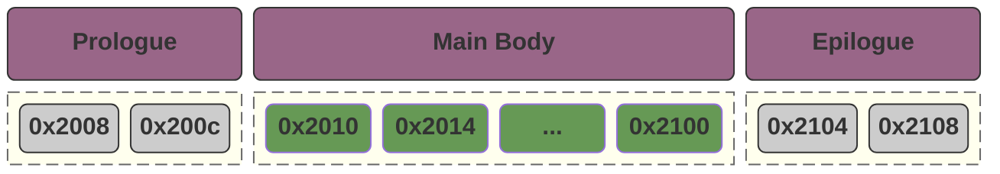

#### 基础的向量化加速实现

假设我们现在存在 `A`，`B`，`C`，他们的初始地址对于16字节对齐都有一个相同的偏移量，那么我们可以使用如下的方法：

```c++
void solve_robust(float* A, float* B, float* C, int n) {
    // --- 步骤 1: 头部对齐 (Prologue) ---
    // 计算需要先用标量处理多少个元素才能使 A 对齐到 16 字节
    int prologue_elements = (16 - ((size_t)A % 16)) / sizeof(float);
    if (prologue_elements == 4) prologue_elements = 0; // 已经对齐了
    
    if (prologue_elements > 0) {
        // 启动一个极小的核函数处理这几个元素，或者在下面统一处理
    }

    // --- 步骤 2: 主体向量化 (Main Body) ---
    int main_start = prologue_elements;
    int main_elements = (n - main_start) / 4 * 4; // 保证是 4 的倍数
    if (main_elements > 0) {
        int n_v4 = main_elements / 4;
        vectorized_kernel<<<...>>>(
            (float4*)(A + main_start), 
            (float4*)(B + main_start), 
            (float4*)(C + main_start), 
            n_v4
        );
    }

    // --- 步骤 3: 尾部处理 (Epilogue) ---
    int tail_start = main_start + main_elements;
    if (tail_start < n) {
        scalar_kernel<<<...>>>(A + tail_start, B + tail_start, C + tail_start, n - tail_start);
    }
}
```

#### 更复杂的向量化加速实现

我们还存在一些更复杂的向量化实现场景，假设我们存在如下的一个场景：

- `A % 16 == 4`
- `B % 16 == 8`
- `C % 16 == c`

在这种情况下，我们三个数组中需要裁剪掉不同的长度。  

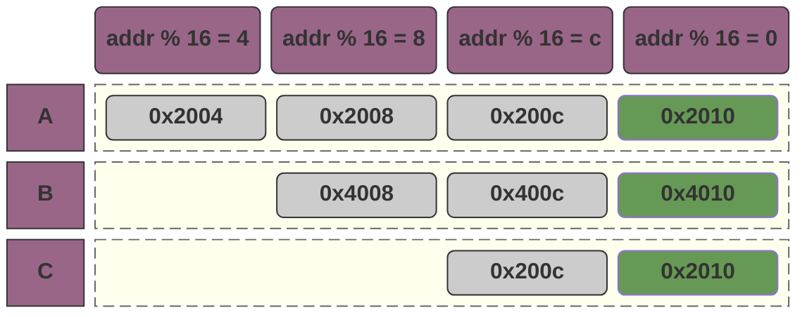

为此，我们需要引入一个叫 `__shfl_down_sync` 的技术：它允许我们在 `block` 中进行跨线程的数据共享。

1. 我们依然是先划分出来一个 `prologue` 段，并且使用标量进行 `A[0] ~ A[2]`，`B[0] ~ B[2]` ，`C[0] ~ C[2]` 这一部分的计算；
2. 随后，我们对于这三个数组，都从索引 `3` 开始计算，此时他们都是对齐的，问题在于，他们现在的数据形式如下：
   - 线程一持有 `A[3] ~ A[6]`，`B[3] ~ B[6]`， `C[3] ~ C[6]`；
   - 线程二持有 `A[7] ~ A[10]`，`B[7] ~ B[10]`， `C[7] ~ C[10]`；
   - ...
3. 此时，我们在计算中的逻辑是，`A[3] ~ A[6]` 分别对应了线程一的部分数据和线程二的部分数据，我们只需要通过 `__shfl_down_sync` 将它从线程二共享到线程一即可。 

**但是，通常来说，这个算法的实现过于复杂，所以在工业界我们会倾向于在前后填充一些 `padding` 来实现向量化访问。**

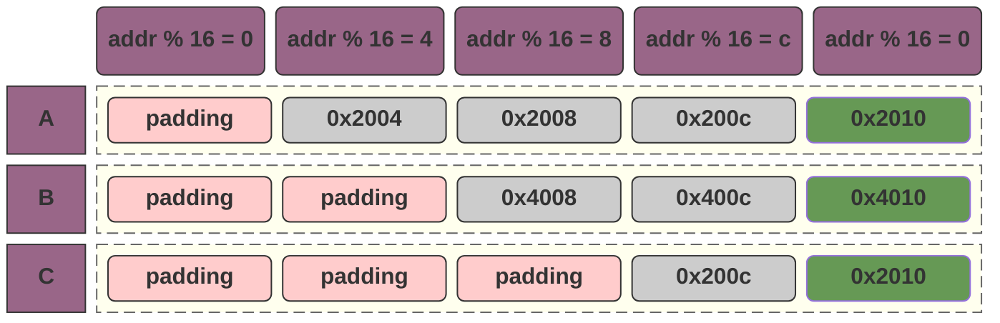

## 活跃度 (Occupancy) 与任务分配的权衡

在 CUDA 算子开发中，选择合适的线程块（Block）大小并非随意的决定，而是一场基于硬件物理限制的博弈。其核心目标是在**合并访问**、**延迟隐藏**与**硬件利用率**之间找到最优平衡。

### 核心约束变量

为了进行量化分析，我们首先定义 SM（Streaming Multiprocessor）的两个关键硬件瓶颈：

- **$B$ (Max Blocks per SM)**：单个 SM 能同时调度的 Block 数量上限。
- **$T$ (Max Threads per SM)**：单个 SM 能同时承载的活跃线程总数上限。

### 性能平衡的三大核心原则

> 延迟隐藏 (Latency Hiding) 需求

GPU 通过在不同的 Warp 间快速切换来掩盖指令延迟（尤其是高昂的访存延迟）。为了实现这一点，我们期望 SM 中活跃的 Block 数量尽量**逼近上限 $B$**。如果活跃 Block 太少，当现有 Warp 都在等待数据时，调度器将无任务可换，导致硬件空转。

> 硬件利用率 (Utilization) 需求

我们期望单个 SM 上的线程总数尽量**逼近上限 $T$**。只有当足够的线程在工作时，GPU 的计算单元（CUDA Cores）和指令流水线才能被填满。

> 访存合并 (Memory Coalescing) 需求

为了充分利用总线带宽，Block 的 X 轴线程数必须是 **Warp 大小（32）的倍数**。这是所有性能优化的前提。

### 寻找平衡点：$T_{max} = T / B$

基于上述约束，我们可以推导出一个理想的平衡点模型：

> 线程数过少 (Small Blocks)

如果单个 Block 的线程数 $t < T/B$：

- **后果**：当 Block 数量达到上限 $B$ 时，总线程数 $B \times t$ 仍远小于 $T$。
- **结论**：硬件资源被浪费，由于线程总数不足，无法填满计算吞吐量。

> 线程数过多 (Large Blocks)

如果单个 Block 的线程数 $t$ 极大：

- **后果**：总线程数很快达到 $T$，导致活跃 Block 数量远小于 $B$。
- **结论**：不利于延迟隐藏，调度器缺乏足够的 Block 粒度进行切换。

**最佳策略**是在保证合并访问的前提下，使单 Block 线程数尽量满足：
$$
t \approx \frac{T}{B}
$$
在这种状态下，SM 能同时达到 Block 数量与线程数量的利用率峰值。

### 实践结论 (以 NVIDIA T4 为例)

在 T4 架构中，$B=32$，$T=1024$。

- **理论平衡点**：$1024 / 32 = 32$ 线程/Block。
- **工程建议**：考虑到寄存器分配和更强的延迟隐藏需求，通常选择平衡点的 **4~8 倍**（即 **128 或 256** 个线程/Block）作为最优配置。

## 算子的分类

在 CUDA 性能调优的领域，根据**数据访问模式（Memory Access Pattern）\**和\**计算密集度（Arithmetic Intensity）**，我们通常将算子分为四大类：

| 类型                         | 特点                                           | 典型算子                                                     | 优化核心                                                     |
| ---------------------------- | ---------------------------------------------- | ------------------------------------------------------------ | ------------------------------------------------------------ |
| Element-wise                 | 每个输出点仅依赖于对应的输入点                 | 1. 矩阵加法<br/>2. 颜色反转<br/>3. ReLU激活函数<br/>4. 图像二值化<br/>5. 归一化 | **访存带宽**：<br/>1. 合并访问（Coalescing）<br/>2. 向量化读写（`float4` / `uchar4`） |
| Reduction                    | 多个输入转换为少个输出                         | 1. sum<br/>2. mean<br/>3. max/min<br/>4. avg                 | **线程间通信与同步**<br/>1. 通过 Shared Memory 来降低分层处理时的缓存利用率；<br/>2. 提高线程密度，因为在计算时合法线程会逐渐减小，我们希望一个warp中保持足够多的合法线程； |
| `Spatial`/`Sliding Window`   | 计算一个输出点需要访问输入点及其**周围的元素** | 1. convolution<br/>2. 高斯模糊<br/>3. 边缘检测<br/>4. 池化   | **数据重用**：<br/>1. 通过 Shared Memory 来提高缓存利用率。  |
| `Transformation`/`Rearrange` | 计算几乎为零，主要是变换和重排                 | 1. 矩阵转置<br/>2. 张量维度重排                              | **解决访存冲突**：<br />1. 通过额外引入两次（或更多次）缓存访问（一次读一次写）来解决访存冲突。 |

### 矩阵转置（transformation/rearrange）

当我们读取数据时，`input[y * cols + x]` 是可以连续访问的：

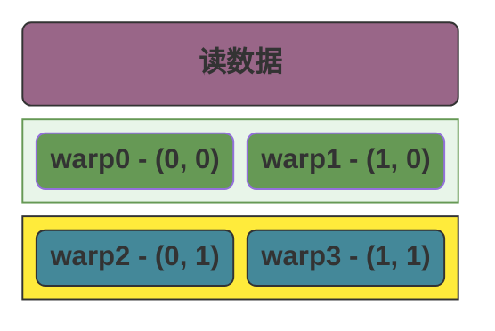

而 `output[x * rows + y]` 是不能连续访问：

```mermaid
block-beta

columns 2

block:z0:1
    columns 2
    block:z4:2
        columns 1
        space:1
        header0("写数据")
    end
    block:z2:1
        columns 1
        b0("warp0 - (0, 0)") b2("warp2 - (0, 1)")
    end
    block:z3:1
        columns 1
        b1("warp1 - (1, 0)") b3("warp3 - (1, 1)")
    end
end


class b0,b2 green
class b1,b3 blue

class z0,z1,z4 transparent
class z2,z3 error
class header0 purple

classDef transparent fill:none,stroke:none,color:inherit;
classDef content fill:#fff,stroke:#ccc;
classDef animate stroke:#666,stroke-dasharray: 8 4,stroke-dashoffset: 900,animation: dash 20s linear infinite;
classDef yellow fill:#FFEB3B,stroke:#333,color:#000,font-weight:bold;
classDef blue fill:#489,stroke:#333,color:#fff,font-weight:bold;
classDef pink fill:#FFCCCC,stroke:#333,color:#333,font-weight:bold;
classDef light_green fill:#e8f5e9,stroke:#695;
classDef green fill:#695,color:#fff,font-weight:bold;
classDef purple fill:#968,stroke:#333,color:#fff,font-weight:bold;
classDef gray fill:#ccc,stroke:#333,font-weight:bold;
classDef error fill:#bbf,stroke:#f65,stroke-width:2px,color:#fff,stroke-dasharray: 5 5;
classDef coral fill:#f8f,stroke:#333,stroke-width:4px;
classDef orange fill:#fff3e0,stroke:#ef6c00,color:#ef6c00,font-weight:bold;
```

换个思路，我们可以先读取数据：

```mermaid
block-beta

columns 2

block:z0:1
    columns 2
    b0("warp0 - (0, 0)") b1("warp1 - (1, 0)")
    b2("warp2 - (0, 1)") b3("warp3 - (1, 1)")
end

class b0,b1 green
class b2,b3 blue
class z0 animate

classDef transparent fill:none,stroke:none,color:inherit;
classDef content fill:#fff,stroke:#ccc;
classDef animate stroke:#666,stroke-dasharray: 8 4,stroke-dashoffset: 900,animation: dash 20s linear infinite;
classDef yellow fill:#FFEB3B,stroke:#333,color:#000,font-weight:bold;
classDef blue fill:#489,stroke:#333,color:#fff,font-weight:bold;
classDef pink fill:#FFCCCC,stroke:#333,color:#333,font-weight:bold;
classDef light_green fill:#e8f5e9,stroke:#695;
classDef green fill:#695,color:#fff,font-weight:bold;
classDef purple fill:#968,stroke:#333,color:#fff,font-weight:bold;
classDef gray fill:#ccc,stroke:#333,font-weight:bold;
classDef error fill:#bbf,stroke:#f65,stroke-width:2px,color:#fff,stroke-dasharray: 5 5;
classDef coral fill:#f8f,stroke:#333,stroke-width:4px;
classDef orange fill:#fff3e0,stroke:#ef6c00,color:#ef6c00,font-weight:bold;
```


当我们转换时，我们先将转换后的数据写入到 Shared Memory，此时我们无需考虑顺序写入的问题：

```mermaid
block-beta

columns 2

block:z0:1
    columns 2
    sm("Shared Memory"):2
    b0("warp0 - (0, 0)") b2("warp2 - (0, 1)")
    b1("warp1 - (1, 0)") b3("warp3 - (1, 1)")
end

class b0,b1 green
class b2,b3 blue
class z0 animate
class sm purple

classDef transparent fill:none,stroke:none,color:inherit;
classDef content fill:#fff,stroke:#ccc;
classDef animate stroke:#666,stroke-dasharray: 8 4,stroke-dashoffset: 900,animation: dash 20s linear infinite;
classDef yellow fill:#FFEB3B,stroke:#333,color:#000,font-weight:bold;
classDef blue fill:#489,stroke:#333,color:#fff,font-weight:bold;
classDef pink fill:#FFCCCC,stroke:#333,color:#333,font-weight:bold;
classDef light_green fill:#e8f5e9,stroke:#695;
classDef green fill:#695,color:#fff,font-weight:bold;
classDef purple fill:#968,stroke:#333,color:#fff,font-weight:bold;
classDef gray fill:#ccc,stroke:#333,font-weight:bold;
classDef error fill:#bbf,stroke:#f65,stroke-width:2px,color:#fff,stroke-dasharray: 5 5;
classDef coral fill:#f8f,stroke:#333,stroke-width:4px;
classDef orange fill:#fff3e0,stroke:#ef6c00,color:#ef6c00,font-weight:bold;
```


随后，我们再将 Shared Memory 中的数据原样输出：

```mermaid
block-beta

columns 2

block:z0:1
    columns 2
    sm("显存"):2
    b0("warp0 - (0, 0)") b2("warp2 - (0, 1)")
    b1("warp1 - (1, 0)") b3("warp3 - (1, 1)")
end

class b0,b2 green
class b1,b3 blue
class z0 animate
class sm purple

classDef transparent fill:none,stroke:none,color:inherit;
classDef content fill:#fff,stroke:#ccc;
classDef animate stroke:#666,stroke-dasharray: 8 4,stroke-dashoffset: 900,animation: dash 20s linear infinite;
classDef yellow fill:#FFEB3B,stroke:#333,color:#000,font-weight:bold;
classDef blue fill:#489,stroke:#333,color:#fff,font-weight:bold;
classDef pink fill:#FFCCCC,stroke:#333,color:#333,font-weight:bold;
classDef light_green fill:#e8f5e9,stroke:#695;
classDef green fill:#695,color:#fff,font-weight:bold;
classDef purple fill:#968,stroke:#333,color:#fff,font-weight:bold;
classDef gray fill:#ccc,stroke:#333,font-weight:bold;
classDef error fill:#bbf,stroke:#f65,stroke-width:2px,color:#fff,stroke-dasharray: 5 5;
classDef coral fill:#f8f,stroke:#333,stroke-width:4px;
classDef orange fill:#fff3e0,stroke:#ef6c00,color:#ef6c00,font-weight:bold;
```


即可完成合并写入。

### sum（累加）

#### 增加活跃线程数

```mermaid
block-beta
columns 9

t0
block:b0:2
    t0_0("t0") t0_1("t1")
end
block:b1:2
    t0_2("t2") t0_3("t3")
end
block:b2:2
    t0_4("t4") t0_5("t5")
end
block:b3:2
    t0_6("t6") t0_7("t7")
end

space:9
t1
block:b4:2
    t1_0("t0") t1_1("t1")
end
block:b5:2
    t1_2("t2") t1_3("t3")
end
block:b6:2
    t1_4("t4") t1_5("t5")
end
block:b11:2
    t1_6("t6") t1_7("t7")
end

space:9
t2
block:b7:2
    t2_0("t0") t2_1("t1")
end
block:b8:2
    t2_2("t2") t2_3("t3")
end
block:b9:2
    t3_4("t4") t3_5("t5")
end
block:b10:2
    t3_6("t6") t3_7("t7")
end


t0_0 --> t1_0
t0_4 --"t0"--> t1_0

t0_1 --> t1_1
t0_5 --"t1"--> t1_1

t0_2 --> t1_2
t0_6 --"t2"--> t1_2

t0_3 --> t1_3
t0_7 --"t3"--> t1_3


t1_0 --> t2_0
t1_1 --> t2_0

class t0,t1,t2 purple
class b0,b1,b2,b3,b4,b5,b6,b7,b8,b9,b10,b11 animate

class t0_0,t0_1,t0_2,t0_3 green
class t1_0,t1_1,t2_0 green

class t0_4,t0_5,t0_6,t0_7,t1_2,t1_3,t1_4,t1_5,t1_6,t1_7,t2_1,t2_2,t2_3,t3_4,t3_5,t3_6,t3_7 gray

%% 样式定义
classDef content fill:#fff,stroke:#ccc;
classDef animate stroke:#666,stroke-dasharray: 8 4,stroke-dashoffset: 900,animation: dash 20s linear infinite;
classDef yellow fill:#FFEB3B,stroke:#333,color:#000,font-weight:bold;
classDef blue fill:#489,stroke:#333,color:#fff,font-weight:bold;
classDef pink fill:#FFCCCC,stroke:#333,color:#333,font-weight:bold;
classDef light_green fill:#e8f5e9,stroke:#695;
classDef green fill:#695,color:#fff,font-weight:bold;
classDef purple fill:#968,stroke:#333,color:#fff,font-weight:bold;
classDef gray fill:#ccc,stroke:#333,font-weight:bold;
classDef error fill:#bbf,stroke:#f65,stroke-width:2px,color:#fff,stroke-dasharray: 5 5;
classDef coral fill:#f8f,stroke:#333,stroke-width:4px;
classDef orange fill:#fff3e0,stroke:#ef6c00,color:#ef6c00,font-weight:bold;
```


## 矩阵乘法的本质

**矩阵变换的本质就是，假设存在矩阵坐标轴A和矩阵坐标轴B，他们分别以 $(\hat{\imath}_{A}, \hat{\jmath}_{A})$ 和 $(\hat{\imath}_{B}, \hat{\jmath}_{B})$ 为基。那么在进行基 A * B 之后，得到了矩阵B中坐标为 $(x, y)$ 的坐标在矩阵A对应的坐标。**

> 1. 更简洁的来说，就是通过矩阵乘法，我们知道了B矩阵的 (x, y) 对应于 A 矩阵的坐标地址；
> 2. 从程序员的视角，我们可以认为是将B矩阵的指针，转换成了A矩阵可以访问的

假设我们的某个点的坐标是 $(x, y)$，我们的最开始矩阵 $\hat{\imath} = (1, 0)$ 并且 $\hat{\jmath} = (0, 1)$，那么我们的此时的基可以记为 $M_0$
$$
M_0 = \begin{bmatrix}
1 & 0 \\
0 & 1
\end{bmatrix}
$$
我们可以看到  $(x * \hat{\imath}, y * \hat{\jmath})$  就可以表示我们向量在当前的基上的坐标：
$$
pointer = \begin{bmatrix}
x \\
y
\end{bmatrix}
\times \begin{bmatrix}
1 & 0 \\
0 & 1
\end{bmatrix}
= 
\begin{bmatrix}
x \\
y
\end{bmatrix}
$$


随后，我们进行了一次矩阵旋转， $\hat{\imath_1} = (0, 1)$ 并且 $\hat{\jmath_1} = (-1, 0)$，可以记为 $M_1$
$$
M_1 = \begin{bmatrix}
0 & -1 \\
1 & 0
\end{bmatrix}
$$
那么，我们进行矩阵变换之后，我们的坐标应该是 $(x * \hat{\imath} *\hat{\imath_1}, y * \hat{\jmath} * \hat{\jmath_1})$，此时，如果我们把 $\hat{\imath} * \hat{\imath_1}$ 和 $\hat{\jmath} * \hat{\jmath_1}$ 先计算出来，那么我们就得到了一个全新的矩阵：
$$
M_2 = M0 \times M1 \
= 
\begin{bmatrix}
1 & 0 \\
0 & 1
\end{bmatrix}
\times
\begin{bmatrix}
	0 & -1 \\
	1 & 0
\end{bmatrix} \
=
\begin{bmatrix}
0 & -1 \\
1 & 0 \\
\end{bmatrix}
$$
我们可以认为，这两个变换复合到一起形成了一个新的变换，而这个变换的基就是我们上面的结果：此时我们可以使用 $(x * \hat{\imath}_{new}, y * \hat{\jmath}_{new})$  直接得到我们在进行复合变换之后的点。


## 行列式

**行列式（Determinant）的作用是：衡量一个由矩阵定义的线性变换，对空间区域（面积或体积）所造成的“缩放比例”。**

行列式会计算由矩阵定义的线性变换，将原始单位面积（由标准基 $\hat{i}, \hat{j}$ 围成）变换为新面积（由变换后的基 $\hat{i}', \hat{j}'$ 围成）时的**缩放倍率**。

对于矩阵的基 $\hat{i}$ 和 $\hat{j}$ ：

- **矩阵的列**：其实就是原始的基向量 $\hat{i}$ 和 $\hat{j}$ 在变换之后**落在了哪里**。
- **行列式的值**：就是看变换后的那两个新向量张开的图形，比原始基向量张开的单位图形（面积为 1 的正方形）**大了多少倍**。

### 行列式的计算

对于一个 i hat 和 j hat 如下的坐标系，它的单个坐标块的面积如何计算？
$$
\begin{bmatrix}
a & b \\
c & d
\end{bmatrix}
$$
面积有三个基本特性：

1. **单位面积**：标准基 $\begin{bmatrix} 1 & 0 \\ 0 & 1 \end{bmatrix}$ 围成的面积是 $1$。
2. **伸缩性**：如果把一个基向量拉长 $k$ 倍，面积也变为 $k$ 倍。
3. **叠加性**：如果基向量是两个向量的和，面积可以拆分。

现在我们拆解矩阵 $M = \begin{bmatrix} a & b \\ c & d \end{bmatrix}$：

我们将它看作两个向量的组合：$\vec{v}_1 = a\hat{\imath} + c\hat{\jmath}$ 和 $\vec{v}_2 = b\hat{\imath} + d\hat{\jmath}$。

当我们把这两个组合展开并计算它们围成的“面积函数 $Area(\vec{v}_1, \vec{v}_2)$”时：

- $Area(a\hat{\imath}, d\hat{\jmath}) = ad \times Area(\hat{\imath}, \hat{\jmath}) = ad$
- $Area(c\hat{\jmath}, b\hat{\imath}) = cb \times Area(\hat{\jmath}, \hat{\imath}) = -bc$ （注意：因为 $\hat{\jmath}$ 在 $\hat{\imath}$ 前面，方向反了，所以是负号）
- $Area(a\hat{\imath}, b\hat{\imath})$ 和 $Area(c\hat{\jmath}, d\hat{\jmath})$ 都是 $0$（因为共线，没面积）。

**最后求和：$ad - bc$。**

### $det(M_1M_2) = det(M_1)det(M_2)$

> 我们可以把 **$\det(M)$** 看作是一个空间的**“面积缩放因子”**。
>
> - **$\det(M_2)$**：代表第一次变换将单位面积缩放了多少倍。
> - **$\det(M_1)$**：代表第二次变换在**已经变过一次**的空间基础上，又缩放了多少倍。
>
> 如果我们先将一个图形扩大了 $3$ 倍（$M_2$），接着又将结果扩大了 $2$ 倍（$M_1$），那么最终的图形面积自然是原始面积的 $2 \times 3 = 6$ 倍。这就是：
>
> $$\det(M_1 M_2) = \det(M_1) \times \det(M_2)$$

我们也可以通过数值计算来证明：

假设：
$$
M_1 = \begin{bmatrix}
a_1 & b_1 \\
c_1 & d_1
\end{bmatrix}
\\
M_2 = \begin{bmatrix}
a_2 & b_2 \\
c_2 & d_2
\end{bmatrix}
$$


那么 $M_1M_2$ 相当于对 $M_2$ 进行了一次矩阵线性缩放，并得到了新的 $\hat{\imath}$ 和 $\hat{\jmath}$
$$
M_1M_2 = \begin{bmatrix}
a_1a_2 + b_1c_2 & a_1b_2 + b_1d_2 \\
c_1a_2 + d_1c_2 & c_1b_2 + d_1d_2
\end{bmatrix}
$$
那么：
$$
\begin{aligned}
& det(M_1M_2) \\
& = (a_1a_2 + b_1c_2) * (c_1b_2 + d_1d_2) - (a_1b_2 + b_1d_2) * (c_1a_2 + d_1c_2) \\
& = (a_1a_2c_1b_2 + a_1a_2d_1d_2 + b_1c_2c_1b_2 + b_1c_2d_1d_2) - (a_1b_2c_1a_2 + a_1b_2d_1c_2 + b_1d_2c_1a_2 + b_1d_2d_1c_2) \\
& = (\underbrace{a_1a_2b_2c_1}_{项目1} + a_1a_2d_1d_2 + b_1b_2c_1c_2 + \underbrace{b_1c_2d_1d_2}_{项目2}) - (\underbrace{a_1a_2b_2c_1}_{项目1} + a_1b_2c_2d_1 + a_2b_1c_1d_2 + \underbrace{b_1c_2d_1d_2}_{项目2}) \\
& = a_1a_2d_1d_2 + b_1b_2c_1c_2 - a_1b_2c_2d_1 - a_2b_1c_1d_2
\end{aligned}
$$
而：
$$
\begin{aligned}
& det(M_1)det(M_2) \\
& = (a_1d_1 - b_1c_1) * (a_2d_2 - b_2c_2) \\
& = a_1a_2d_1d_2 + b_1b_2c_1c_2 - a_2b_1c_1d_2 - a_1b_2c_2d_1
\end{aligned}
$$


## 叉积

在我们的线性代数中：

- `矩阵乘法`：可以看做是对 $\hat{\imath}$ 和 $\hat{\jmath}$ 的变换，当 $\hat{\imath}$ 和 $\hat{\jmath}$ 变换之后，原来的点的位置也会相应的改变；
- `点积` 求两个向量潜在的相似度，例如 a 和 b 的点积 / (a的绝对值 * b的绝对值) 得到的值可以表示 a 和 b 的相似度；
- `叉积` 试图用两个向量**撑开一个空间**，对于三维向量 $v$ 和三维向量 $u$，虽然他们是三维向量，但是因为他们只有两个向量，所以我们可以在三维的向量空间里找到有且仅有的一个平面覆盖到这两个向量。而他们的叉积结果就是正好垂直于这个平面的一个向量，向量的长度和方向取决于 a 和 b。

### 两点定线，三点定面

在三维空间中，无论我们如何随机地扔出两个向量 $\vec{a}$ 和 $\vec{b}$：

- 只要它们不是共线的（即不在同一条直线上），它们就一定会**张开（Span）**出一个且仅有一个无限延伸的平面。
- 从**秩（Rank）**的角度看：这两个向量构成的矩阵 Rank 为 2，这意味着它们在三维世界里圈出了一块“二维领地”。
- **例外情况**：如果 $\vec{a}$ 和 $\vec{b}$ 指向相同或相反方向，它们只能定出一条线，此时平面不唯一（有无数个平面可以包含这条线），而这时它们的**叉积正好为 0**，也印证了无法确定唯一的垂直方向。

叉积 $\vec{a} \times \vec{b}$ 的结果 $\vec{c}$ 就是这个平面的**法向量（Normal Vector）**：

- **垂直的唯一性**：在三维空间里，垂直于一个平面的方向是唯一的（除了正反之分）。叉积利用这一点，为我们找到了那个“逃离”平面的出口。
- **长度的内涵**：这个 $\vec{c}$ 的长度不是随机的，它锁定了 $\vec{a}$ 和 $\vec{b}$ 围成的平行四边形的**面积**。面积越大，生成的向量越长。
- **方向的内涵**：通过“右手定则”，它不仅找出了垂直的方向，还定义了平面的**朝向**（是向上推还是向下钻）。

### 叉积的计算

在三维空间中，给定两个向量 $\vec{a} = (a_1, a_2, a_3)$ 和 $\vec{b} = (b_1, b_2, b_3)$，它们的叉积 $\vec{a} \times \vec{b}$ 的计算通常有三种表达方式，分别对应不同的使用场景。

我们将标准基向量 $\hat{i}, \hat{j}, \hat{k}$ 放在第一行，构造一个伪行列式：
$$
\vec{a} \times \vec{b} = \det \begin{bmatrix} \hat{i} & \hat{j} & \hat{k} \\ a_1 & a_2 & a_3 \\ b_1 & b_2 & b_3 \end{bmatrix}
$$
**展开步骤：**利用代数余子式展开（注意中间 $\hat{j}$ 项的**负号**，我们的符号为 `+`，`-`，`+`）：

1. **$\hat{i}$ 分量**：划掉第一行第一列，算剩下的 $2 \times 2$ 行列式：$(a_2b_3 - a_3b_2)$
2. **$\hat{j}$ 分量**：划掉第一行第二列，算剩下的再取反：$-(a_1b_3 - a_3b_1) = (a_3b_1 - a_1b_3)$
3. **$\hat{k}$ 分量**：划掉第一行第三列，算剩下的：$(a_1b_2 - a_2b_1)$

我们得到
$$
\vec{a} \times \vec{b} = \begin{pmatrix} a_2b_3 - a_3b_2 \\ a_3b_1 - a_1b_3 \\ a_1b_2 - a_2b_1 \end{pmatrix}
$$

### 叉积的本质

叉积的本质是数学家最初想要寻找一个运算，能够同时满足：

1. 结果必须垂直于 $\vec{a}$ 和 $\vec{b}$。
2. 结果的长度必须等于 $\vec{a}$ 和 $\vec{b}$ 张开的平行四边形面积。

而我们的公式是一个伪行列式：真实的行列式需要满足矩阵是 $n * n$ 的，这里我们的伪行列式任意一步计算之前都是删除第一行，再使用行列式的计算。

那么，我们现在有三个向量 $\vec{a} = (a_1, a_2, a_3)$ ，$\vec{b} = (b_1, b_2, b_3)$，$\vec{c} = {\begin{pmatrix} a_2b_3 - a_3b_2, a_3b_1 - a_1b_3, a_1b_2 - a_2b_1 \end{pmatrix}}$。我们开始证明它满足我们对叉积的定义。

#### 垂直

要证明一个向量垂直于一个平面，只需要证明它**同时垂直于该平面内的两个不共线向量**（即 $\vec{a}$ 和 $\vec{b}$）。在向量代数中，“垂直”等价于“点积为 0”。

我们将 $\vec{a}$ 的分量与 $\vec{c}$ 的分量对应相乘：

$$\vec{a} \cdot \vec{c} = a_1({a_2b_3 - a_3b_2}) + a_2({a_3b_1 - a_1b_3}) + a_3({a_1b_2 - a_2b_1})$$

展开括号：

$$\vec{a} \cdot \vec{c} = \textcolor{red}{a_1a_2b_3} - \textcolor{green}{a_1a_3b_2} + \textcolor{blue}{a_2a_3b_1} - \textcolor{red}{a_2a_1b_3} + \textcolor{green}{a_3a_1b_2} - \textcolor{blue}{a_3a_2b_1}$$

**结论**：$\vec{a} \cdot \vec{c} = 0$。同理可证 $\vec{b} \cdot \vec{c} = 0$。

因为 $\vec{c}$ 与平面内的两条基准线都垂直，所以它必然垂直于整个平面。

#### 长度

平行四边形的面积公式为：$S = \|\vec{a}\| \|\vec{b}\| \sin\theta$。 我们可以通过证明 $\|\vec{c}\|^2 = (\|\vec{a}\| \|\vec{b}\| \sin\theta)^2$ 来证明这个结果。

$$\|\vec{c}\|^2 = (a_2b_3 - a_3b_2)^2 + (a_3b_1 - a_1b_3)^2 + (a_1b_2 - a_2b_1)^2$$

数学家拉格朗日证明了一个极其漂亮的代数恒等式，它直接连接了“分量平方和”与“模长及点积”：

$$(a_2b_3 - a_3b_2)^2 + (a_3b_1 - a_1b_3)^2 + (a_1b_2 - a_2b_1)^2 = (\sum a_i^2)(\sum b_i^2) - (\sum a_ib_i)^2$$

翻译成向量符号就是：

$$\|\vec{a} \times \vec{b}\|^2 = \|\vec{a}\|^2 \|\vec{b}\|^2 - (\vec{a} \cdot \vec{b})^2$$

我们知道点积 $\vec{a} \cdot \vec{b} = \|\vec{a}\| \|\vec{b}\| \cos\theta$，代入上式：

$$\|\vec{c}\|^2 = \|\vec{a}\|^2 \|\vec{b}\|^2 - (\|\vec{a}\| \|\vec{b}\| \cos\theta)^2$$

$$\|\vec{c}\|^2 = \|\vec{a}\|^2 \|\vec{b}\|^2 (1 - \cos^2\theta)$$

利用三角恒等式 $1 - \cos^2\theta = \sin^2\theta$：

$$\|\vec{c}\|^2 = \|\vec{a}\|^2 \|\vec{b}\|^2 \sin^2\theta$$

$$\|\vec{c}\| = \|\vec{a}\| \|\vec{b}\| \sin\theta$$

得证。

## 特征向量

> 当一个空间发生线性变换（比如拉伸、剪切）时，绝大多数向量都会偏离原来的方向。但有一部分特殊的向量，它们在变换后**依然保持在原有的直线上**，只是长度变长或变短了（甚至反向）。

### 公式与定义

如果 $A$ 是一个方阵，$v$ 是一个非零向量，如果它们满足以下关系：

$$Av = \lambda v$$

那么：

- **$v$** 就是矩阵 $A$ 的**特征向量**。
- **$\lambda$**（希腊字母 Lambda）就是对应的**特征值（Eigenvalue）**，它代表了向量被缩放的倍数。

我们可以从几何角度来理解线性变换对向量的影响：

1. **普通向量：** 经过变换后，方向变了，长度也变了。
2. **特征向量：** 变换后，**方向没变**（或者刚好转了 180 度），只是被“拉伸”或“压缩”了。

### 特征向量有什么用

- **图像压缩：** 找出图片中最主要的特征向量（主成分分析 PCA），去掉不重要的，就能在不损失画质的情况下减小文件体积。
- **Google 搜索（PageRank）：** 网页排名算法本质上就是寻找一个巨大矩阵的特征向量，那个特征值最大的向量代表了网页的重要性。
- **振动分析：** 工程师通过特征向量来分析桥梁或摩天大楼的固有频率，确保建筑不会因为共振而倒塌。

### 特征向量的例子

假设，我们存在一个矩阵 $A$，它的 $\hat{\imath}$ 为 $(1, 0)$，$\hat{\jmath}$ 为 $(0,1)$。此时，我们知道 $\hat{\imath}$ 这个基，它所张成的空间是x轴上的整条直线；

当我们对矩阵A进行线性变换得到矩阵$A_{new}$，线性变换后的 $\hat{\imath}_{new}$ 为 $(3, 0)$，而它的 $\hat{\jmath}_{new}$ 为 $(1, 2)$。

此时，对于x轴上的任意一点 $(a,0)$，我们可以知道它在 $A_{new}$ 中的坐标为（**注意，点只是列的一种表示方式，计算时我们需要以列向量 $\begin{bmatrix}x \\ 0\end{bmatrix}$ 的方式来计算**）：

$$
A_{(a, 0)} = \begin{bmatrix}
3 & 1 \\
0 & 2
\end{bmatrix}
\begin{bmatrix}
x \\
0
\end{bmatrix}
= 
\begin{bmatrix}
3x \\
0
\end{bmatrix}
$$
**我们发现，所有在x轴上的向量，它只是被拉长了，但是仍然在原向量张成的空间中（特征向量的严格定义是：变换后的向量 $Av$ 与原向量 $v$ 共线)。对于这种向量，就是我们的特征向量。**

### 找到更多的特征向量

> 我们可以把找到特征向量的方法分为两个不同的步骤：
>
> 1. 找到特征向量值 $\lambda$；
> 2. 通过特征向量值 $\lambda$ 找到特征向量；

在我们上面提到的例子中，一个 $2 \times 2$ 的矩阵通常有两个特征向量（除非他是旋转或者某些特殊变换），我们给出了 $\begin{bmatrix}x \\ 0\end{bmatrix}$，那怎么样才能找到另外一个特征向量呢？我们假设 $\lambda$ 为我们要找的特征向量，那么我们得到（（这里 $I$ 是单位矩阵，因为矩阵不能直接减去一个常数 $\lambda$））：
$$
(A_{new} - \lambda I)v = 0
$$
如果 $v$ 是非零向量，那么根据线性代数的原理，矩阵 $(A_{new} - \lambda I)$ 必须是**不可逆**的（即它把空间压缩了）。因此，它的**行列式必须为 0**：
$$
\det(A_{new} - \lambda I) = 0
$$


那么，对于我们的矩阵 $A_{new} = \begin{bmatrix} 3 & 1 \\ 0 & 2 \end{bmatrix}$，我们的特征方程是：
$$
\det \left( \begin{bmatrix} 3 & 1 \\ 0 & 2 \end{bmatrix} - \begin{bmatrix} \lambda & 0 \\ 0 & \lambda \end{bmatrix} \right) = \det \begin{bmatrix} 3-\lambda & 1 \\ 0 & 2-\lambda \end{bmatrix} = 0
$$


那么我们可以得到：
$$
(3 - \lambda) \times (2 - \lambda) = 0
$$


得到特征值：$\lambda_1 = 3, \lambda_2 = 2$。现在我们有了两个特征值。我们需要把每一个 $\lambda$ 分别代回方程 $(A - \lambda I)v = 0$，解出对应的向量 $v$。

当 $\lambda = 3$ 时：

$$(A - 3I)v = \begin{bmatrix} 3-3 & 1 \\ 0 & 2-3 \end{bmatrix} \begin{bmatrix} x \\ y \end{bmatrix} = \begin{bmatrix} 0 & 1 \\ 0 & -1 \end{bmatrix} \begin{bmatrix} x \\ y \end{bmatrix} = \begin{bmatrix} 0 \\ 0 \end{bmatrix}$$

由第一行得出 $0x + 1y = 0 \Rightarrow y = 0$。

$x$ 可以是任何非零值。所以特征向量是 $\begin{bmatrix} 1 \\ 0 \end{bmatrix}$（即 $x$ 轴方向）。

当 $\lambda = 2$ 时：

$$(A - 2I)v = \begin{bmatrix} 3-2 & 1 \\ 0 & 2-2 \end{bmatrix} \begin{bmatrix} x \\ y \end{bmatrix} = \begin{bmatrix} 1 & 1 \\ 0 & 0 \end{bmatrix} \begin{bmatrix} x \\ y \end{bmatrix} = \begin{bmatrix} 0 \\ 0 \end{bmatrix}$$

由第一行得出 $1x + 1y = 0 \Rightarrow y = -x$。

所以特征向量是 $\begin{bmatrix} 1 \\ -1 \end{bmatrix}$ 或 $\begin{bmatrix} -1 \\ 1 \end{bmatrix}$。

### 特征向量的的含义

**特征向量描述的是一个“方向”，而不是一个具体的“点”。**在我们前面计算的逻辑中，$\begin{bmatrix} -1 \\ 1 \end{bmatrix}$ 是一个特征向量，而 $\begin{bmatrix} -2 \\ 2 \end{bmatrix}$ 也是一个特征向量，只是不同的表示形式。

### 特征向量的一个典型应用

考虑我们的矩阵 $A = \begin{bmatrix} 3 & 1 \\ 0 & 2 \end{bmatrix}$，如果我们需要计算 $A^{100}$，那么这将是一个地狱级的计算；而此时，我们想到的方法就是，可以将 $A$ 转换为一个 $A_{new}$，而这个 $A_{new}$ 是在某个特定的基下的**对角矩阵**，我们假设转换后的对角矩阵是 $\begin{bmatrix} a & 0 \\ 0 & b\end{bmatrix}$，那么我们可以：

1. 计算转后的矩阵 $A_{new}^{100}$，因为它是对角矩阵，所以这个很简单，我们得到 $M_{new} = \begin{bmatrix} a^{100} & 0 \\ 0 & b^{100}\end{bmatrix}$；
2. 在计算完成之后，我们在把 $M_{new}$ 转换到原来的基得到 $M$，这个就是矩阵 $A^{100}$ 在原来的坐标轴下的结果；

#### 将矩阵转换为特定基下的对角矩阵

假设矩阵 $A$ 有两个特征向量 $v_1, v_2$，对应的特征值分别是 $\lambda_1, \lambda_2$。

根据定义，我们有两个独立的等式：

- $A v_1 = \lambda_1 v_1$
- $A v_2 = \lambda_2 v_2$

现在，我们把这两个向量横向并排，拼成一个新矩阵 $P = [v_1 \quad v_2]$。

当我们用 $A$ 去乘以这个拼好的矩阵 $P$ 时，根据矩阵乘法规则，这等同于分别作用于每一列：

$$A P = A [v_1 \quad v_2] = [Av_1 \quad Av_2]$$

把刚才的定义代入：

$$A P = [\lambda_1 v_1 \quad \lambda_2 v_2] = [v_1 \quad v_2] \begin{bmatrix} \lambda_1 & 0 \\ 0 & \lambda_2 \end{bmatrix} = PD$$

所以我们得到了一个至关重要的恒等式：

$$AP = PD$$

既然 $AP = PD$，只要矩阵 $P$ 是**可逆的**（也就是说我们的特征向量线性无关，能张开整个空间），我们就可以在等式**左边**同时乘以 $P^{-1}$：

$$P^{-1} (AP) = P^{-1} (PD)$$

由于 $P^{-1}P$ 等于单位矩阵 $I$，等式右边就只剩下了 $D$：
$$
P^{-1}AP = D
$$
在这个表达式中：$P$ 是我们的特征向量横向排列，而 $D$ 则是我们的特征向量值的组成的对角矩阵。

#### 一个简单的例子

在我们的矩阵 $A = \begin{bmatrix} 3 & 1 \\ 0 & 2 \end{bmatrix}$ 中，它的特征向量是 $\begin{bmatrix} 1 \\ 0 \end{bmatrix}$ 和 $\begin{bmatrix} 1 \\ -1 \end{bmatrix}$，他们的特征值分别是 $3$ 和 $2$，那么我们可以得到
$$
P = \begin{bmatrix} 1 & 1 \\ 0 & -1 \end{bmatrix} \\ \\
D = \begin{bmatrix} 3 & 0 \\ 0 & 2 \end{bmatrix} \\ \\
P^{-1} =  \begin{bmatrix} 1 & 1 \\ 0 & -1 \end{bmatrix}
$$


那么
$$
P^{-1}AP = P^{-1} =  \begin{bmatrix} 1 & 1 \\ 0 & -1 \end{bmatrix}
\begin{bmatrix} 3 & 1 \\ 0 & 2 \end{bmatrix}
\begin{bmatrix} 1 & 1 \\ 0 & -1 \end{bmatrix}
= \begin{bmatrix} 3 & 0 \\ 0 & 2 \end{bmatrix}
$$
而
$$
A^{100} = (PDP^{-1})(PDP^{-1})...(PDP^{-1}) = PD^{100}P^{-1} = \begin{bmatrix} 1 & 1 \\ 0 & -1 \end{bmatrix} \begin{bmatrix} 3^{100} & 0 \\ 0 & 2^{100} \end{bmatrix} \begin{bmatrix} 1 & 1 \\ 0 & -1 \end{bmatrix}
$$


## block stride 和 grid stride 对缓存利用率的差别

通常来说，`grid stride` 的缓存利用率要远高于 `block stride` 的缓存利用率。假设要处理 N=10240 个元素，threadsPerBlock=256：

### Block Stride

- 逻辑：每个 block 处理「连续的一大段数据」，步长 = blockDim.x（单 block 线程数）；
- 示例：
  - Block 0 处理 0~255 号元素；
  - Block 1 处理 256~511 号元素；
  - Block 2 处理 512~767 号元素；
  - `...`

### Grid Stride

- 逻辑：每个线程处理「跨 block 的分散数据」，步长 = gridDim.x * blockDim.x（整个 grid 的总线程数）；
- 示例：
  - 线程 0（Block0, Thread0）处理 0、1024、2048… 号元素；
  - 线程 1（Block0, Thread1）处理 1、1025、2049… 号元素；
  - 线程 256（Block1, Thread0）处理 256、1280、2304… 号元素；
  - 每个线程 “分散” 访问数据，覆盖整个数据集。

我们假设存在如下的计算逻辑：

- 存在 `block 0` 和 `block 1` 两个 `block`；
- 每次 `L2 Cache` 可以缓存两份数据；
- 总共需要处理 `16` 份数据，每次循环处理一份；

那么，对于下面的 `block stride` 的访问模式：

1. `block 0` 访问 `data[0]` ，随后 `L2 Cache` 中包含了 `data[0]`，`data[1]`；
2. `block 1` 访问 `data[8]`，此时缓存无效。GPU从显存重新加载 `data[8]` 。随后 `L2 Cache` 中包含了 `data[8]`，`data[9]`，之前的 `L2 Cache` 失效；
3. `block 0` 访问 `data[1]` ，此时缓存无效，GPU 从显存重新加载 `data[1]`。

```mermaid
block-beta

columns 10

block:header0:10
    columns 2
    space:2
    t0("block 0")
    t1("block 1")
end

block:t00:5
    columns 4
    b00t00("data[0]") b00t01("data[1]") b00t02("data[2]") b00t03("data[3]")
    b00t04("data[4]") b00t05("data[5]") b00t06("data[6]") b00t07("data[7]")
end

block:t01:5
    columns 4
    b01t00("data[8]") b01t01("data[9]") b01t02("data[a]") b01t03("data[b]")
    b01t04("data[c]") b01t05("data[d]") b01t06("data[e]") b01t07("data[f]")
end

class t00,t01,t02,t03 animate
class t0,t1 purple
class header0 transparent

class b00t00,b00t01 error
class b01t00,b01t01 green

class b00t02,b00t03,b00t04,b00t05,b00t06,b00t07,b01t02,b01t03,b01t04,b01t05,b01t06,b01t07 gray

classDef transparent fill:none,stroke:none,color:inherit;
classDef content fill:#fff,stroke:#ccc;
classDef animate stroke:#666,stroke-dasharray: 8 4,stroke-dashoffset: 900,animation: dash 20s linear infinite;
classDef yellow fill:#FFEB3B,stroke:#333,color:#000,font-weight:bold;
classDef blue fill:#489,stroke:#333,color:#fff,font-weight:bold;
classDef pink fill:#FFCCCC,stroke:#333,color:#333,font-weight:bold;
classDef light_green fill:#e8f5e9,stroke:#695;
classDef green fill:#695,color:#fff,font-weight:bold;
classDef purple fill:#968,stroke:#333,color:#fff,font-weight:bold;
classDef gray fill:#ccc,stroke:#333,font-weight:bold;
classDef error fill:#bbf,stroke:#f65,stroke-width:2px,color:#fff,stroke-dasharray: 5 5;
classDef coral fill:#f8f,stroke:#333,stroke-width:4px;
classDef orange fill:#fff3e0,stroke:#ef6c00,color:#ef6c00,font-weight:bold;
```

而对于我们的 `grid stride` 的访问模式：

1. `block 0` 访问 `data[0]` ，随后 `L2 Cache` 中包含了 `data[0]`，`data[1]`；
2. `block 1` 访问 `data[1]`，缓存命中，直接从缓存读取；
3. `block 0` 访问 `data[1]`，此时缓存无效，GPU 从显存重新加载 `data[1]`。

```mermaid
block-beta

columns 10

block:header0:10
    columns 2
    space:2
    t0("block 0")
    t1("block 1")
end

block:t00:5
    columns 4
    b00t00("data[0]") b00t01("data[2]") b00t02("data[4]") b00t03("data[6]")
    b00t04("data[8]") b00t05("data[a]") b00t06("data[c]") b00t07("data[e]")
end

block:t01:5
    columns 4
    b01t00("data[1]") b01t01("data[3]") b01t02("data[5]") b01t03("data[7]")
    b01t04("data[9]") b01t05("data[b]") b01t06("data[d]") b01t07("data[f]")
end

class t00,t01,t02,t03 animate
class t0,t1 purple
class header0 transparent

class b00t00,b01t00 green

class b00t01,b01t01,b00t02,b00t03,b00t04,b00t05,b00t06,b00t07,b01t02,b01t03,b01t04,b01t05,b01t06,b01t07 gray

classDef transparent fill:none,stroke:none,color:inherit;
classDef content fill:#fff,stroke:#ccc;
classDef animate stroke:#666,stroke-dasharray: 8 4,stroke-dashoffset: 900,animation: dash 20s linear infinite;
classDef yellow fill:#FFEB3B,stroke:#333,color:#000,font-weight:bold;
classDef blue fill:#489,stroke:#333,color:#fff,font-weight:bold;
classDef pink fill:#FFCCCC,stroke:#333,color:#333,font-weight:bold;
classDef light_green fill:#e8f5e9,stroke:#695;
classDef green fill:#695,color:#fff,font-weight:bold;
classDef purple fill:#968,stroke:#333,color:#fff,font-weight:bold;
classDef gray fill:#ccc,stroke:#333,font-weight:bold;
classDef error fill:#bbf,stroke:#f65,stroke-width:2px,color:#fff,stroke-dasharray: 5 5;
classDef coral fill:#f8f,stroke:#333,stroke-width:4px;
classDef orange fill:#fff3e0,stroke:#ef6c00,color:#ef6c00,font-weight:bold;
```

>也就是说，**block stride 是逻辑连续，物理发散的；而 grid stride 是逻辑跳跃，物理对齐。** `block stride` 它是在时间轴上从左到右连续的访问，而我们GPU期待的是，在同一个时间点上连续的访问 -- 这对应于 `grid stride` 的访问模式。


