# 什么是卷积

在数学、信号处理以及深度学习（卷积神经网络 CNN）中，**卷积（Convolution）** 是一种通过两个函数生成第三个函数的数学运算，表征了一个函数在另一个函数之上滑动时，两者重叠部分的累积效果。而对于 [连续域和离散域](#连续域和离散域)，我们的处理方式是完全不一样的：

- 在连续域中，函数 $f$ 和 $g$ 的卷积定义为：$$(f * g)(t) = \int_{-\infty}^{\infty} f(\tau)g(t - \tau) d\tau$$

- 在离散域（如图像处理）中，定义为：$$(f * g)[n] = \sum_{m=-\infty}^{\infty} f[m]g[n - m]$$

# 卷积的一个典型例子：复利

假设：

- 我们每年在银行存入 `100` ，那么我得到函数 $f(m) = 100$，其中 m 是存钱的年份；
- 钱在银行每年的利息为5%，那么我们得到利息函数 $g(t) = (1 + 0.05)^t$，其中 $t$ 是 存储在银行的年份；

那么，我们我们第 $n$ 年在银行有的钱就是：

- $f(1) * g(n - 1)$
- $f(2) * g(n - 2)$
- $\dots$
- $f(n - 1) * g(1)$

这个数组的总和，他表示了我们每一年存的钱到今年得到的复利的总和。

而这个函数就是我们的卷积函数：
$$
(f * g)[n] = \sum_{m=1}^{n} f[m]g[n - m]
$$


在我们的复利模型中：

- **$n$ (现在/观察点)**：对应于我们查看存折的那一年（输出坐标）。
- **$m$ (动作点)**：对应于我们历史上每一次去银行存钱的那一年（输入坐标）。
- **$n - m$ (相对时长)**：这笔钱在银行里存放了多久（位移量）。
- **$f[m]$**：那一年的存款金额（信号强度）。
- **$g[n-m]$**：这笔钱因为存放了那么久，而应得的增值倍数（系统响应）。

这里，我们还注意到，在原始的卷积函数中我们的迭代范围是 $\sum_{-\infty}^{\infty}$，而在我们的公式中则是 $\sum_{m = 1}^n$，这里涉及到我们所谓的**生命范围**的概念：

- 下限是 $m = 1$，因为我们从第一年开始存钱，这个时候我们的函数是 $f(1)$，而在更早的年份，我还没有存钱，所以函数是没有意义的；

- 上限是 $n$，因为对于 $m > n$ 的时候，钱尚未存入，我们的利息函数也是没有意义的；

这个在信号处理中有一个专门的术语叫 **“因果系统” (Causal System)**。

- **下限 $m=1$**：这对应了信号的**起点**。在矩阵卷积中，这对应了图像的边界（坐标 0）。
- **上限 $n$**：这体现了**因果律**——未来的动作不能影响现在。如果 $m > n$，意味着我们还没存钱，这笔钱对我们现在的存款总额贡献为 0。

# 将卷积扩展到二维：使用矩阵处理图像

## 矩阵的卷积建模

在一维卷积（例如我们前面提到的复利）中，变量只有**时间**。而在二维图像卷积中，变量变成了**位置**。

- **一维（复利）**：我们关心的是**时间跨度**（第 $n$ 年减去存款的第 $m$ 年）。
- **二维（图像）**：我们关心的是**空间位移**。
  - $n$ 变成了一个二维坐标 $(n_x, n_y)$，代表我们在图像上观察的位置。
  - $m$ 变成了一个二维坐标 $(m_x, m_y)$，代表我们周围像素的位置。
  - **$n - m$ 变成了两个方向上的距离差，决定了周围像素对中心点的贡献权重。**

那么，对于二维图像处理，我们同样可以开始定义：

- $f(m)$ 是我们的输入矩阵，矩阵里包含了我们图像的全部像素点；
- $m$ 是每个像素点在矩阵里的坐标；
- $g(t)$ 是我们的核函数，表示了对于像素点 `t` 对应的权重，而根据我们的目标不同，我们会使用不同的核函数
  - **模糊**：提高像素点周边像素点的权重，使得像素点和周边像素点趋同，从而达成模糊的效果；
  - **锐化**：降低像素点周边像素点的权重，提高像素点之间的对比度；
  - **边缘检测**：只有像素值发生突变的地方，卷积结果才不为零。
- $t$ 像素点之间的空间位移（距离），这里容易误解的地方在于对于核函数它存在自己的索引，我们需要做的是将 $n - m$ 转换为核函数的索引：
  - $n$ 是我们生成的目标函数的输入，他在目标函数调用时已经固定了，就对应于输出矩阵中的特定点的索引；
  - $m$ 是输入矩阵的索引，而这个值在 $f$ 中会通过 $\sum_{-\infty}^{\infty}$ 扩散到输入矩阵的整个矩阵，这个矩阵在和核函数交互的过程中，大部分点超出了核函数的生命范围，所以我们实际上只需要计算 $n$ 周边的少量像素点；

**我们使用卷积处理图像的意义在于：我们通过输入矩阵 $f(m)$，配合特定的核函数 $g(t)$，生成了一个新的函数。而这个函数会为我们生成一个全新的矩阵。**我们可以使用如下伪代码描述我们的逻辑：

```c++
#define r new_matrix

// 遍历输出矩阵的每一个点 n (row, col)
for (int row = 0; row < f.height(); row++) {
    for (int col = 0; col < f.width(); col++) {
        
        float sum = 0;
        // 在每一个点 n 上，我们要通过 m 遍历核函数的“生命范围”
        // 假设核是 3x3，偏移量 k_row, k_col 从 -1 到 1
        for (int k_row = -1; k_row <= 1; k_row++) {
            for (int k_col = -1; k_col <= 1; k_col++) {
                
                // m = n - t (这里 t 是位移，即 k_row, k_col)
                int m_row = row - k_row;
                int m_col = col - k_col;

                // 检查边界（只有在输入矩阵范围内的 m 才参与计算）
                if (m_row >= 0 && m_row < f.height() && m_col >= 0 && m_col < f.width()) {
                    // 累加：输入点像素 * 核函数权重
                    sum += f[m_row][m_col] * kernel[k_row + 1][k_col + 1];
                }
            }
        }
        new_matrix[row][col] = sum; // 生成新函数的输出值
    }
}
```

## 矩阵卷积的一个实例

### 输入矩阵

假设我们存在一个 `5 * 5` 的矩阵：
$$
\begin{bmatrix} 0 & 1 & 2 & 3 & 4 \\ 5 & 6 & 7 & 8 & 9 \\ 10 & 11 & 12 & 13 & 14 \\ 15 & 16 & 17 & 18 & 19 \\ 20 & 21 & 22 & 23 & 24 \end{bmatrix}
$$


每个点对应的坐标是：
$$
\begin{bmatrix} (0, 0) & (0, 1) & (0, 2) & (0, 3) & (0, 4) \\(1, 0) & (1, 1) & (1, 2) & (1, 3) & (1, 4)\\(2, 0) & (2, 1) & (2, 2) & (2, 3) & (2, 4)\\(3, 0) & (3, 1) & (3, 2) & (3, 3) & (3, 4)\\(4, 0) & (4, 1) & (4, 2) & (4, 3) & (4, 4) \end{bmatrix}
$$


那么，这个矩阵可以被理解为以坐标轴作为输入，坐标轴对应的值作为输出的函数：
$$
f(m) = 
\begin{cases} 
0 & \text{if } m = (0, 0) \\
1 & \text{if } m = (0, 1) \\
\dots
\end{cases}
$$


### 卷积核函数

而我们的卷积核函数则是一个 `3 * 3` 的矩阵：
$$
\begin{bmatrix} 0 & 1 & 2 \\ 3 & 4 & 5 \\ 6 & 7 & 8 \end{bmatrix}
$$


每个点对应的坐标是：
$$
\begin{bmatrix} (-1, -1) & (-1, 0) & (-1, 1) \\ (0, -1) & (0, 0) & (0, 1) \\ (1, -1) & (1, 0) & (1, 1) \end{bmatrix}
$$


那么，我们卷积核函数就可以表示为：
$$
g(t) = 
\begin{cases} 
0 & \text{if } t = (-1, -1) \\
1 & \text{if } t = (-1, 0) \\
\dots \\ 8 & \text{if } t = (1, 1)\\ \end{cases}
$$


### 卷积在数学中的计算

假设我们需要计算 $(2, 2)$ 这个点的卷积，根据卷积的定义 $\sum f(m)g(n-m)$ ，我们需要应该遍历整个 $5 \times 5$ 甚至无限大的平面。但实际上：

- 卷积核 $g$ 只有在索引为 $(0,0)$ 到 $(2,2)$ 之间（或者数学定义中的 $(-1,-1)$ 到 $(1,1)$）时才有值。
- **对于其他所有的位置，卷积核的值都是 $0$。**

因此，当 $n=(2, 2)$ 时，只有当 $m$ 落在它周围的 $3 \times 3$ 区域内，$g(n-m)$ 才可能不为零。如果 $m$ 跑到了 $(0, 0)$，由于 $(2,2)-(0,0)=(2,2)$ 已经超出了某些定义的核边界（或者对应的权重很微弱），所以我们只关心那个子矩阵。**本质上来说，取出子矩阵是为了**节省计算量**，因为子矩阵之外的点乘以卷积核的结果全是 $0$**。这就是**卷积核 $g$ 的“生命范围”**。

那么，我们可以取出这个子矩阵：
$$
\begin{bmatrix} (1, 1) & (1, 2) & (1, 3) \\(2, 1) & (2, 2) & (2, 3) \\ (3, 1) & (3, 2) & (3, 3) \end{bmatrix}
$$


此时，我们的 $f[m]$ 被转换为如下函数：
$$
f(m) = 
\begin{cases} 
6 & \text{if } m = (1, 1) \\ 7 & \text{if } m = (1, 2) \\ \dots \\ 18 & \text {if } m = (3, 3)
\end{cases}
$$


而 $n = (2, 2)$

那么，$[n - m]$ 就等同于如下的矩阵索引：
$$
\begin{bmatrix} (1, 1) & (1, 0) & (1, -1) \\ (0, 1) & (0, 0) & (0, -1) \\ (-1, 1) & (-1, 0) & (-1, -1)\end{bmatrix}
$$


再代入到我们的函数 $f(m)$ 和 $g(t)$ 中，我们就得到了我们的卷积：
$$
(f * g)[n] = \\6 \times 8 + 7 \times 7 + 8 \times 6 \\+ 11 \times 5 + 12 \times 4 + 13 \times 3\\+21 \times 2 + 22 \times 1 + 23 \times 0
$$


**于是，我们得到了输出矩阵中 $(2, 2)$ 这个点的结果，而我们在循环中将这个结果应用到所有的像素点，就得到了我们的新的矩阵图。**

### 卷积在计算机中的应用（互相关）

在我们的实际应用中，计算机的二维数组，也就是我们的输入矩阵和卷积，都是以一个连续数组的形式来存储的：

- 这意味着我们的索引中不可能出现负数。
- 同时也意味着，我们在迭代时，必须输入矩阵从前往后遍历而卷积核函数从后往前遍历；

此外，还有一个重要的点是：**在深度学习中，卷积核里的数值（权重）是**练出来的**。系统会自动学会一个“已经是反的”或者“最合适”的权重，所以程序员不需要在底层代码里手动做 `reverse`。**

基于这些结论，在计算机的实现中，我们更倾向于使用更适合于计算机领域的公式，**互相关 (Cross-correlation)**。

$$(f \star g)[n] = \sum f[n+m]g[m]$$

在这个公式中：

- $n$ 的定义没有变，仍然是输出矩阵的对应像素点的索引；
- $m$ 的定义则由输入矩阵的像素点索引变为**相对偏移量**（Offset）；

例如，在我们前面的例子中：

子矩阵的原始索引为：
$$
\begin{bmatrix} (1, 1) & (1, 2) & (1, 3) \\(2, 1) & (2, 2) & (2, 3) \\ (3, 1) & (3, 2) & (3, 3) \end{bmatrix}
$$


而它的相对于 $(2, 2)$ 的相对偏移量索引为，而这个索引和我们的卷积核函数的表示形式是一样的，这意味着我们不需要再做各种逻辑变化而直接进行逻辑计算：
$$
\begin{bmatrix} (-1, -1) & (-1, 0) & (-1, 1) \\(0, -1) & (0, 0) & (0, 1) \\ (1, -1) & (1, 0) & (1, 1) \end{bmatrix}
$$

# 卷积算子的最简实现

## 卷积在CNN中的应用

卷积在计算机中目前最重要的应用之一就是在 [CNN(Convolutional Neural Networks)](https://en.wikipedia.org/wiki/Convolutional_neural_network) 中的应用，这里引用 [Convolutional Neural Networks - Basics](https://mlnotebook.github.io/post/CNN1/) 这篇文章中 [How does this feed into CNNs?] 这一小结的描述。这里，我们了解到 `CNN` 的突破性进展：**从主动设计到自主学习**：

- **传统做法**：过去几十年，数学家和工程师手动设计卷积核（比如我们之前提到的模糊、锐化算子）。这是一种主动设计，需要人类知道特征长什么样。
- **CNN 的突破**：当我们不知道特征长什么样，或者不知道对应的核函数该怎么写时，我们将卷积核里的每一个数值看作**权重（Weight）**。这些权重不再由人给定，而是通过**反向传播（Back Propagation）**算法，根据误差自动调整。

我们以CNN识别猫作为例子：传统的方式是，我们使用照片作为输入，同时我们提取猫的特征作为卷积核函数，这样我们可以精准的识别出猫的图像。然而问题在于，由于人体的限制，设计一个合理的核函数是一个不可能完成的任务。

**而CNN 并不需要知道“特征”是什么，它只需要知道“结果”对不对。**

1. 虽然人不知道提取猫的特征需要什么样的卷积核，但人知道**“这张图片里有一只猫”**。
   - **初始状态**：卷积核 $g(t)$ 里的参数全是随机生成的乱码。此时卷积出来的结果也是一团浆糊。
   - **目标（Label）**：我们给 CNN 一万张猫的照片，告诉它：“不管我们中间怎么折腾，最后输出的结果必须指向‘猫’这个标签。”
   - **误差反馈**：如果 CNN 算出来觉得是“狗”，系统就会产生一个**误差（Loss）**。
2. 反向传播：通过微积分（链式法则），误差会像水流一样倒着往回流：
   - **逻辑**：系统会问，“为了让最后的结果更接近‘猫’，我倒数第一层的权重该怎么改？倒数第二层呢？...直到最开始的那个卷积核 $g(t)$ 该怎么改？”
   - **微调**：每一个卷积核里的权重都会根据误差调整那么一点点（比如 $0.0001$）。
   - **进化**：经过数百万次的调整，卷积核会逐渐收敛。它们会自动变成某种样子——有的变成了边缘检测器，有的变成了圆形探测器。**不是我们教它怎么画这些核，而是为了达到“识别猫”这个目标，数学逻辑逼迫它必须长成那个样子。**
3. 特征的自动涌现 (Emergence)，在深度学习中，特征是**层级化**自动生成的：
   - **底层（Layer 1-2）**：由于图片最基本的构成是线，卷积核会自发地演化成“水平线检测器”或“垂直线检测器”。
   - **中层（Layer 3-4）**：这些线条卷积核的结果再被卷积，就会组合成“圆圈”、“三角形”等形状。
   - **高层（Layer 5+）**：形状再组合，就出现了“猫耳朵”、“眼睛”甚至“胡须”。

**而这个过程就是人类在进行大规模机器学习训练时的一个无限循环的流程：**

1. 前向传播 (Forward Pass) —— “计算机识别”：计算机拿着目前的卷积核（哪怕是乱码），对图片进行卷积、堆叠、分类。最终给出一个答案，比如：“我觉得 80% 是猫，20% 是狗”。
2. 计算损失 (Loss Calculation) —— “人类标注”：人预先给出的标签（Label）是“猫”。计算机发现自己的答案和标准答案之间有一个**误差（Loss）**，这里不是简单的对错，而是一个**距离**。误差越大，说明卷积核偏离得越远。
3. 反向传播 (Back Propagation) —— “权重调整”：
   - **计算梯度**：数学上会算出 Loss 对每一个卷积权重 $w$ 的导数（梯度）。这个梯度会告诉我们：如果我想让 Loss 变小，这个 $w$ 应该增加还是减少？
   - **更新权重**：根据梯度的方向，更新卷积核。$w_{new} = w_{old} - \text{学习率} \times \text{梯度}$

## 卷积在CNN中的典型实现

通常，在CNN中，我们的输入通常包含：

- 一个 `张量（Tensor）`，这个张量是我们的全部数据；
- 一个 `卷积核函数`，我们使用这个核函数来对我们的 `输入张量` 进行变换求值；

最后，我们会将数据输出到一个全新的矩阵中。

### 输入张量

通常，我们的输入张量是 `n` 个 `3D-Tensor`，通常会包含四个指标，我们称之为 `nchw`：

- `n` 代表我们输入的 `3D-Tensor` 的个数，这些张量通常是完全独立计算的，只是在内存中紧密排列；
- `c` 代表了 `Channel`，表示我们的张量的厚度；
- `w` 代表了 `Width`，表示我们张量的宽度；
- `h` 代表了 `height`，表示我们张量的高度。

以我们的图形处理为例：通常，我们的每张图片是一个 $w \times h$ 的像素点矩阵，问题在于，每个像素点还需要一个维度来表示他的颜色，那么也就是每个节点可以使用两种方式来存储这个 `RGB` 结构信息：

> 在二维数组中，每个节点存储一个 `RGB` 结构，这样我们仍然是一个 $2 \times 2$ 的矩阵；

$$
\mathcal{A} = 
    \begin{bmatrix} (0, 1, 2) & (3, 4, 5) \\(6, 7, 8) & (9, a, b) \end{bmatrix}
$$


> 将二维数组拓展到三维数组，第一层到第三层分别存储 `R`，`G`，`B`，这样最后的结果就变成了三个 $2 * 2$ 的矩阵叠加在一起：

$$
\mathcal{A} = 
\begin{bmatrix}
    \begin{bmatrix} 0 & 3 \\ 6 & 9 \end{bmatrix}_{Channel=R} \\
    \begin{bmatrix} 1 & 4 \\ 7 & a \end{bmatrix}_{Channel=G} \\
    \begin{bmatrix} 2 & 5 \\ 8 & b \end{bmatrix}_{Channel=B}
\end{bmatrix}
$$

在我们的实际应用中，我们通常使用第二种方式来表示我们的张量，主要出于以下几个考虑：

1. **更高的性能**，通常来说我们在进行卷积计算的时候，通常只关注某个特定的特征。例如，在上面的例子中，我们只想要处理 `R` 这个特征，那我们必须读取大量的无关数据，这对于本来就捉襟见肘的带宽带来了更大的压力；
2. **更加的灵活**，在我们的卷积计算中，`channel` 这个指标其实是和具体的需求绑定的，如果我们使用 `3D Tensor` 的方式，那么我们可以灵活的替换我们的特征；

> 注：这个逻辑有点类似于我们在DB中的列存储（Column-oriented）和行存储（Row-oriented）：
>
> - 在卷积里，我们并不关心某个点的 `Pixel(x,y)` 是什么颜色，我们关心的是**“整张图里所有点的 R 通道”**与卷积核的红色部分进行卷积。当 `GPU` 线程读取 R 通道时，如果采用 **SoA (NCHW)**，相邻的线程读取的像素在内存中是**连续**的。这样就能触发 GPU 的 **Memory Coalescing（显存合并访问）**，就像列存数据库在读磁盘时能利用顺序读（Sequential Read）一样，带宽利用率接近 100%。
> - 卷积中**不需要随机查询**：卷积是扫描式的，从头扫到尾，没有“点查询”需求。

### 卷积核函数

卷积核函数通常是 `k` 个 `3D-Tensor`：

- `k` 代表了我们核函数的数量，每一个核函数都代表了不同的特征；
- `c` 这个对应于**输入张量**的厚度；
- `r` 表示核函数的高度；
- `s` 表示核函数的宽度；

通常来说，**输入张量**中的所有元素都必须和全部的核函数进行卷积计算，最后识别出一个特定的特征。例如，假设我们需要实现一个人脸识别的功能：

- $k_1$ 识别眼睛；
- $k_2$ 识别鼻子；
- $k_3$ 识别嘴巴
- $k_4$ 识别耳朵；

更为精妙的是，我们的CNN通常分为多层。例如，我们在识别眼睛的阶段：

- $k_{10}$ 识别单眼皮眼睛；
- $k_{11}$ 识别双眼皮眼睛；
- $k_{13}$ 识别瞳孔中的不同颜色；

### 输出张量

在计算完成之后，我们需要将数据输出到 `n` 个全新的  `3D-Tensor`：

- `n` 每一个 `3D-Tensor` 输入都对应了一个 `3D-Tensor` 输出；
- `k` **可以看到，相对于输入张量中的 `channel`，我们的 “厚度” 被转换成卷积核函数的数量了，这是因为在这次计算完成之后，我们关注的特征就改变了：**
  - 例如我们识别图像的例子中，输入张量中的厚度是 `R`/`G`/`B`，而我们的卷积核函数则关注的是 `横线`/`竖线`/`曲线` 等；
  - 当我们执行完第一次转换后，我们的下层转换关注的就是 `横线`/`竖线`/`曲线`  这些特征指标，我们需要将他进一步的转换为更加复杂的形体，例如：`正方形`/`长方形`/`椭圆`/`圆形` 等；
  - 如此迭代下去，最后我们可以真正的识别到我们的目标图像。
- `out_h` 输出张量的高度；
- `out_w` 输出张量的宽度。

在我们的输出张量中，`n` 和 `k` 是在输入张量和卷积核函数中隐式声明的，而 `out_h` 和 `out_w` 则是取决于我们的卷积核有多大（$r, s$）、跳着走几步（步长 $u, v$）以及补了多少边（$p, q$）。

### 步长

在我们的卷积计算中，我们有一个逻辑是遍历输入张量 $\sum_{m=-\infty}^{\infty}$，而这里存在一个逻辑是，我应该怎么去遍历输入张量呢？通常来说，我们遍历输入张量的全部元素，可以获取到最多的信息。然而这也会引入相当多的问题：

- 性能差，当我们遍历整个输入张量的全部节点时，我们的时间复杂度相当于每张图片 `c * w * h * k * r * s`，而这个复杂度在大量的高分辨率图片输入时性能极差；
- 读取过多的冗余信息，在计算时我们可能并不需要过于精细的数据。例如，假设我们现在需要判断视频中是否有人移动，我们只需要很粗略的遍历即可；
- 更高的延迟，在部分场景下（例如自动驾驶）我们会放弃一定的精度换取更低的延迟；

为此，我们引入了两个单独的变量 `u` 和 `v` 来控制我们我们的遍历逻辑：

- `u` 卷积在高方向上的步长；
- `v` 卷积在宽方向上的步长；

### 补边

此外，还存在两个严重的问题是：

- 在我们遍历的过程中，对于那些边缘的点（row = 0 || row = h - 1 || col = 0 || col = w - 1），因为它不满足和核函数相乘的条件，而这会导致我们每一次计算都会产生“边缘信息丢失” 或 “维度收缩”。
- 在计算时，中心的节点会更多的参与计算，在没有 padding 的情况下，边缘像素可能只会被扫描到 `1`~`3`次，而中心的节点则会被扫描到 `9` 次。

我们通过补边来解决这个问题：

- `p` 卷积在高方向上的补边；
- `q` 卷积在宽方向上的补边；

考虑如下的 $5 * 5$ 矩阵：

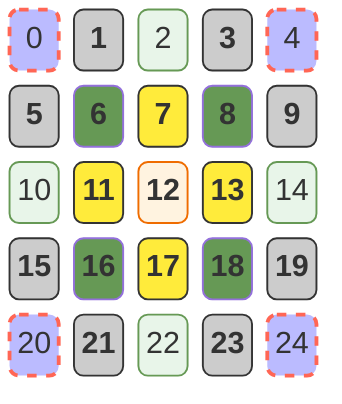

我们在整个的扫描过程中：

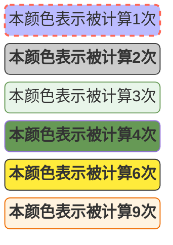

而我们可以通过在外圈填充 $p = \frac{r - 1}{2}$  和 $r = \frac{s - 1}{2}$的 边来降低这种误差值：

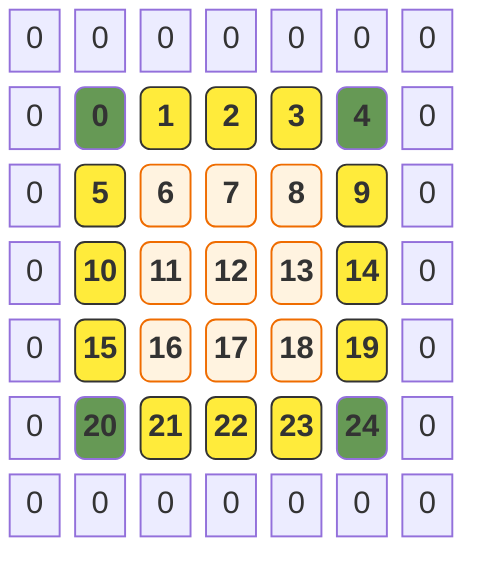

可以看到，在进行补边之后，及时是计算最少的四个顶点也计算了 `4` 次。而我们不补更多的边让所有的节点都被计算 `9` 次，是因为：

- 补 0 本质上是引入“噪声”。补 1 圈是为了**保住维度**（让输出不收缩），同时**显著改善**边缘的参与度（从 1 次提升到 4 次，提升了 400%）。如果补太多 0，卷积核就会花大量的精力去计算那些毫无意义的 0。
- 补 $\frac{r-1}{2}$ 是工业界的“黄金平衡点”——它既保证了输出空间维度不坍塌，又在最小噪声代价下提升了边缘的权重。

### 总结

在我们整个的计算过程中：

1. 输入张量中的 `n` 表示输入张量的数量，每个张量的计算是独立的；
2. 卷积核函数的 `厚度` 不用显式声明，它必须和 `输入张量` 的 `channel` 完全一致；
3. 在执行完毕后，输出张量的厚度将由 `c` 转换为 `k`，这个 `k` 是核函数的数量；
4. 最终输出的张量的四个参数全部由输入决定：
   - `n` 等于输入张量的数量；
   - `k` 等于卷积核函数的数量；
   - $out_w = 1 + \lfloor \frac{w + 2 \times q - s}{v} \rfloor$
   - $out_h = 1 + \lfloor \frac{h + 2 \times q - r}{u} \rfloor$

这里可以注意到的一点是，我们在求 $out_w$ 和 $out_h$ 时，都是向下取整的，这是因为对于不能和核函数同宽同高的块会直接不被计算。

## 源码

### CPU计算的实现

**这里我们可以注意到，我们的编程逻辑中改变了CPU的传统逻辑：遍历输入得到输出，而是反向的遍历输出，每个输出去找自己的输入。**

在 GPU 中，计算是高度并行的：

1. 我们不再使用嵌套循环去遍历输入得到输出。
2. 相反，我们会启动成千上万个线程，**每个线程认领输出矩阵中的一个点 $(i, j)$**。
3. 每个线程都会运行一段完全相同的代码：
   - “我是线程 $(i, j)$，我要算我的 `sum`。”
   - “我的输入起点在 `u*i - p`。”
   - “我要遍历我的 $r \times s$ 小窗口。”

```c++
void conv2d_cpu(const float *in, const float *weight, float *out, const Conv2dDims &dims, const Conv2dAttrs &attrs) {
    // 每张图片单独计算
    for (int n_num = 0; n_num < dims.n; ++n_num) {
        // 在计算完之后，我们的原始厚度 c（通道）将被转换为新的厚度 k
        for (int k_num = 0; k_num < dims.k; ++k_num) {
            // 这里 oh_num 和 ow_num 都是输出上的点，也就是说每个点都需要计算
            // 我们这里改变了从输入到输出的顺序，而是通过输出反推输入
            for (int oh_num = 0; oh_num < dims.out_h; oh_num++) {
                for (int ow_num = 0; ow_num < dims.out_w; ow_num++) {
                    // 我们通过 p 和 q，将我们输出张量中的节点映射到了输入张量的左上角节点而不是中心节点
                    // 这意味着我们的可以执行互相关而不是卷积
                    float sum = 0.0;
                    const int h_pos = oh_num * attrs.u - attrs.p;
                    const int w_pos = ow_num * attrs.v - attrs.q;
                    for (int c_num = 0; c_num < dims.c; ++c_num) {
                        for (int h_num = 0; h_num < dims.r; ++h_num) {
                            for (int w_num = 0; w_num < dims.s; ++w_num) {
                                const int in_w = w_pos + w_num;
                                const int in_h = h_pos + h_num;
                                if (0 <= in_w && in_w < dims.w && 0 <= in_h && in_h < dims.h) {
                                    const float in_val = in[dims.in_offset(n_num, c_num, in_h, in_w)];
                                    const float k_val = weight[dims.weight_offset(k_num, c_num, h_num, w_num)];
                                    sum += in_val * k_val;
                                }
                            }
                        }
                    }
                    // 最终生成的结果为：
                    // [
                    //      图片1 -> [
                    //          核函数1 -> 核函数1生成的张量,
                    //          核函数2 -> 核函数2生成的张量,
                    //          ...
                    //      ],
                    //      图片2 -> [],
                    //      ...
                    // ]
                    out[dims.out_offset(n_num, k_num, oh_num, ow_num)] = sum;
                }
            }
        }
    }
}
```

### GPU计算的坐标轴压缩

当我们真正开始实现代码之前，我们发现：**CUDA内建只支持 x, y, z 三个坐标轴，而我们的输入实际上是存在 n, k, h, w 四个坐标轴的。**在这种情况下，如果我们还是使用物理意义上的 x，y，z 轴去对应我们的 w，h，k 三个坐标轴，那么我们将面临一个问题：

在只有一张图片的情况下，这个算法工作良好，然而当超过一张图片时，在我们计算完第一张图片后想要进入第二张图片时，我们的坐标轴已经溢出了。

因为我们不能通过让 `threadIdx.x ` > w 去表示宽度，因为这会让我们无法判断当前是我们的线程处理溢出了输入矩阵还是进入到下一张图片了。

也就是说，当我们使用这种更符合直觉的方式去表示我们的坐标轴时，我们最大只能表示 $w * h * k$ 个元素，在这种情况下，我们必须要对我们的坐标轴进行压缩，工业界有几种典型的压缩方式：

- **空间二维映射**，这是最后符合直觉的表示方式：
  - $w$ 用 $x$ 表示；
  - $h$ 用 $y$ 表示；
  -  $k * n$ 则使用 $z$ 来表示；
- **通道优先**：
  - 将图片的一层，也就是 $w * h$ 压缩为一行，用 $x$ 表示；
  - 深度 $k$ 用 $y$ 表示；
  - batch $n$ 用 $z$ 来表示；
- **分块瓦片化**：这是对于通道优先的优化版本：
  - 将图片的一层，分为多个不同的 `Tile`，每个 `Tile` 用 $x$ 和 $y$ 来表示；
  - $n * k$ 用 $z$ 来表示；

#### 空间二维映射

以下是一个 $2 * 2 * 3 * 3$ 的张量，使用空间二维映射的典型排布：

- 其中 `z = 0` 和 `z = 1` 表示的是第一张图片的第一层和第二层；
- 而 `z = 2` 和 `z = 3` 表示的是第二张图片的第一层和第二层；

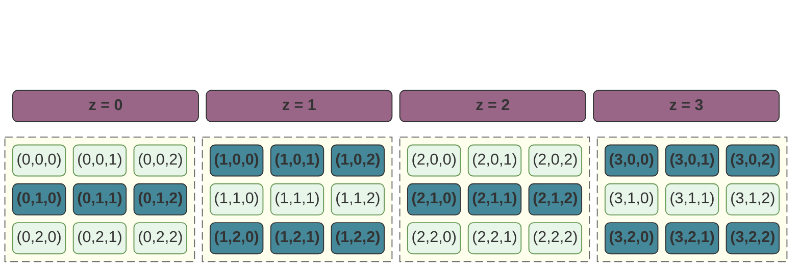


假设我们使用一个 $2 * 2 * 2$ 的张量来计算：

那么 `block 1` 负责的区域应该为：

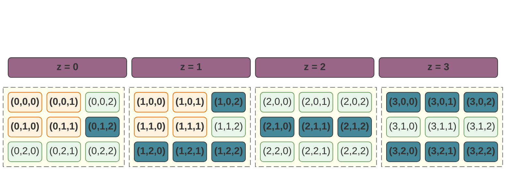

而 `block 2` 负责的区域应该为（可以看到，由于产生了横向越界，实际会只会有一部分线程执行）：

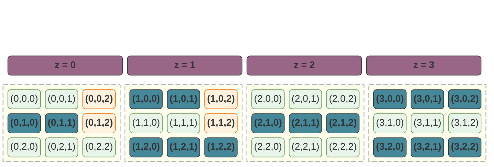

`block 3` 负责的区域为（纵向越界）：

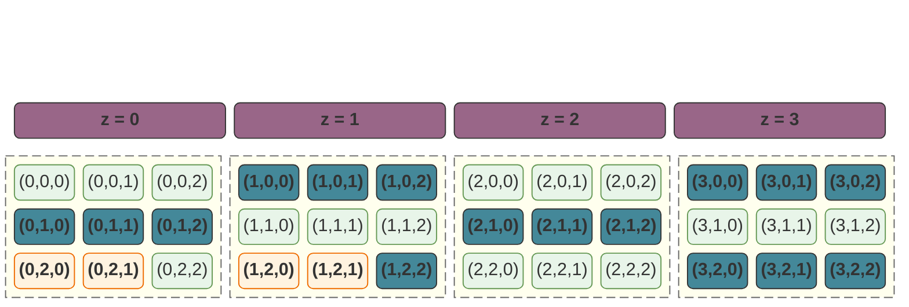

`block 4` 负责的区域为（双向越界）：

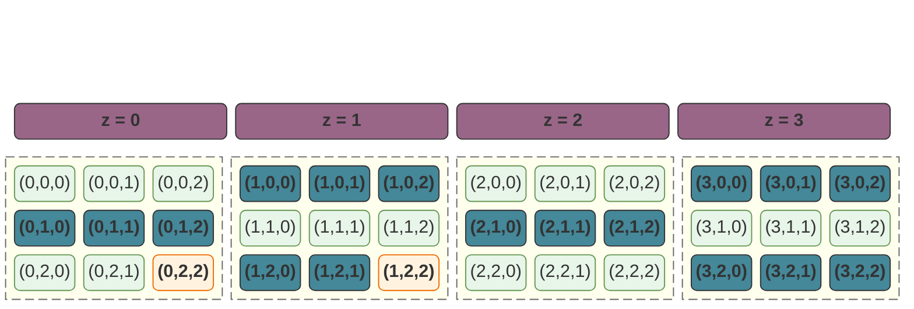


#### 通道优先

以下是一个 $2 * 2 * 3 * 3$ 的张量，使用通道优先映射的典型排布：

```mermaid
block-beta

columns 2

block:header0:2
    columns 2
    space:2
    header1("z = 0")
    header2("z = 1")
end

block:z1:1
    columns 9
    z100("(0,0,0)") z101("(0,0,1)") z102("(0,0,2)")
    z110("(0,1,0)") z111("(0,1,1)") z112("(0,1,2)")
    z120("(0,2,0)") z121("(0,2,1)") z122("(0,2,2)")
    z200("(1,0,0)") z201("(1,0,1)") z202("(1,0,2)")
    z210("(1,1,0)") z211("(1,1,1)") z212("(1,1,2)")
    z220("(1,2,0)") z221("(1,2,1)") z222("(1,2,2)")
end

block:z3:1
    columns 9
    z300("(2,0,0)") z301("(2,0,1)") z302("(2,0,2)")
    z310("(2,1,0)") z311("(2,1,1)") z312("(2,1,2)")
    z320("(2,2,0)") z321("(2,2,1)") z322("(2,2,2)")
    z400("(3,0,0)") z401("(3,0,1)") z402("(3,0,2)")
    z410("(3,1,0)") z411("(3,1,1)") z412("(3,1,2)")
    z420("(3,2,0)") z421("(3,2,1)") z422("(3,2,2)")
end

class header0,heade3 transparent
class header1,header2,header4,header5 purple
class z1,z2,z3 animate

class z100,z101,z102,z110,z111,z112,z120,z121,z122 light_green
class z200,z201,z202,z210,z211,z212,z220,z221,z222 blue
class z300,z301,z302,z310,z311,z312,z320,z321,z322 light_green
class z400,z401,z402,z410,z411,z412,z420,z421,z422 blue

classDef transparent fill:none,stroke:none,color:inherit;
classDef content fill:#fff,stroke:#ccc;
classDef animate stroke:#666,stroke-dasharray: 8 4,stroke-dashoffset: 900,animation: dash 20s linear infinite;
classDef yellow fill:#FFEB3B,stroke:#333,color:#000,font-weight:bold;
classDef blue fill:#489,stroke:#333,color:#fff,font-weight:bold;
classDef pink fill:#FFCCCC,stroke:#333,color:#333,font-weight:bold;
classDef light_green fill:#e8f5e9,stroke:#695;
classDef green fill:#695,color:#fff,font-weight:bold;
classDef purple fill:#968,stroke:#333,color:#fff,font-weight:bold;
classDef gray fill:#ccc,stroke:#333,font-weight:bold;
classDef error fill:#bbf,stroke:#f65,stroke-width:2px,color:#fff,stroke-dasharray: 5 5;
classDef coral fill:#f8f,stroke:#3
```

同样假设我们使用一个 $2 * 2 * 2$ 的张量来计算：

`block 0` 负责的区域为：

```mermaid
block-beta

columns 2

block:header0:2
    columns 2
    space:2
    header1("z = 0")
    header2("z = 1")
end

block:z1:1
    columns 9
    z100("(0,0,0)") z101("(0,0,1)") z102("(0,0,2)")
    z110("(0,1,0)") z111("(0,1,1)") z112("(0,1,2)")
    z120("(0,2,0)") z121("(0,2,1)") z122("(0,2,2)")
    z200("(1,0,0)") z201("(1,0,1)") z202("(1,0,2)")
    z210("(1,1,0)") z211("(1,1,1)") z212("(1,1,2)")
    z220("(1,2,0)") z221("(1,2,1)") z222("(1,2,2)")
end

block:z3:1
    columns 9
    z300("(2,0,0)") z301("(2,0,1)") z302("(2,0,2)")
    z310("(2,1,0)") z311("(2,1,1)") z312("(2,1,2)")
    z320("(2,2,0)") z321("(2,2,1)") z322("(2,2,2)")
    z400("(3,0,0)") z401("(3,0,1)") z402("(3,0,2)")
    z410("(3,1,0)") z411("(3,1,1)") z412("(3,1,2)")
    z420("(3,2,0)") z421("(3,2,1)") z422("(3,2,2)")
end

class header0,heade3 transparent
class header1,header2,header4,header5 purple
class z1,z2,z3 animate

class z100,z101,z102,z110,z111,z112,z120,z121,z122 light_green
class z200,z201,z202,z210,z211,z212,z220,z221,z222 blue
class z300,z301,z302,z310,z311,z312,z320,z321,z322 light_green
class z400,z401,z402,z410,z411,z412,z420,z421,z422 blue

class z100,z101,z200,z201,z300,z301,z400,z401 orange

classDef transparent fill:none,stroke:none,color:inherit;
classDef content fill:#fff,stroke:#ccc;
classDef animate stroke:#666,stroke-dasharray: 8 4,stroke-dashoffset: 900,animation: dash 20s linear infinite;
classDef yellow fill:#FFEB3B,stroke:#333,color:#000,font-weight:bold;
classDef blue fill:#489,stroke:#333,color:#fff,font-weight:bold;
classDef pink fill:#FFCCCC,stroke:#333,color:#333,font-weight:bold;
classDef light_green fill:#e8f5e9,stroke:#695;
classDef green fill:#695,color:#fff,font-weight:bold;
classDef purple fill:#968,stroke:#333,color:#fff,font-weight:bold;
classDef gray fill:#ccc,stroke:#333,font-weight:bold;
classDef error fill:#bbf,stroke:#f65,stroke-width:2px,color:#fff,stroke-dasharray: 5 5;
classDef coral fill:#f8f,stroke:#333,stroke-width:4px;
classDef orange fill:#fff3e0,stroke:#ef6c00,color:#ef6c00,font-weight:bold;
```

`block 2` 负责的区域为：

```mermaid
block-beta

columns 2

block:header0:2
    columns 2
    space:2
    header1("z = 0")
    header2("z = 1")
end

block:z1:1
    columns 9
    z100("(0,0,0)") z101("(0,0,1)") z102("(0,0,2)")
    z110("(0,1,0)") z111("(0,1,1)") z112("(0,1,2)")
    z120("(0,2,0)") z121("(0,2,1)") z122("(0,2,2)")
    z200("(1,0,0)") z201("(1,0,1)") z202("(1,0,2)")
    z210("(1,1,0)") z211("(1,1,1)") z212("(1,1,2)")
    z220("(1,2,0)") z221("(1,2,1)") z222("(1,2,2)")
end

block:z3:1
    columns 9
    z300("(2,0,0)") z301("(2,0,1)") z302("(2,0,2)")
    z310("(2,1,0)") z311("(2,1,1)") z312("(2,1,2)")
    z320("(2,2,0)") z321("(2,2,1)") z322("(2,2,2)")
    z400("(3,0,0)") z401("(3,0,1)") z402("(3,0,2)")
    z410("(3,1,0)") z411("(3,1,1)") z412("(3,1,2)")
    z420("(3,2,0)") z421("(3,2,1)") z422("(3,2,2)")
end

class header0,heade3 transparent
class header1,header2,header4,header5 purple
class z1,z2,z3 animate

class z100,z101,z102,z110,z111,z112,z120,z121,z122 light_green
class z200,z201,z202,z210,z211,z212,z220,z221,z222 blue
class z300,z301,z302,z310,z311,z312,z320,z321,z322 light_green
class z400,z401,z402,z410,z411,z412,z420,z421,z422 blue

class z102,z202,z110,z210,z302,z402,z310,z410 orange

classDef transparent fill:none,stroke:none,color:inherit;
classDef content fill:#fff,stroke:#ccc;
classDef animate stroke:#666,stroke-dasharray: 8 4,stroke-dashoffset: 900,animation: dash 20s linear infinite;
classDef yellow fill:#FFEB3B,stroke:#333,color:#000,font-weight:bold;
classDef blue fill:#489,stroke:#333,color:#fff,font-weight:bold;
classDef pink fill:#FFCCCC,stroke:#333,color:#333,font-weight:bold;
classDef light_green fill:#e8f5e9,stroke:#695;
classDef green fill:#695,color:#fff,font-weight:bold;
classDef purple fill:#968,stroke:#333,color:#fff,font-weight:bold;
classDef gray fill:#ccc,stroke:#333,font-weight:bold;
classDef error fill:#bbf,stroke:#f65,stroke-width:2px,color:#fff,stroke-dasharray: 5 5;
classDef coral fill:#f8f,stroke:#333,stroke-width:4px;
classDef orange fill:#fff3e0,stroke:#ef6c00,color:#ef6c00,font-weight:bold;
```

`block 5` 负责的区域为：

```mermaid
block-beta

columns 2

block:header0:2
    columns 2
    space:2
    header1("z = 0")
    header2("z = 1")
end

block:z1:1
    columns 9
    z100("(0,0,0)") z101("(0,0,1)") z102("(0,0,2)")
    z110("(0,1,0)") z111("(0,1,1)") z112("(0,1,2)")
    z120("(0,2,0)") z121("(0,2,1)") z122("(0,2,2)")
    z200("(1,0,0)") z201("(1,0,1)") z202("(1,0,2)")
    z210("(1,1,0)") z211("(1,1,1)") z212("(1,1,2)")
    z220("(1,2,0)") z221("(1,2,1)") z222("(1,2,2)")
end

block:z3:1
    columns 9
    z300("(2,0,0)") z301("(2,0,1)") z302("(2,0,2)")
    z310("(2,1,0)") z311("(2,1,1)") z312("(2,1,2)")
    z320("(2,2,0)") z321("(2,2,1)") z322("(2,2,2)")
    z400("(3,0,0)") z401("(3,0,1)") z402("(3,0,2)")
    z410("(3,1,0)") z411("(3,1,1)") z412("(3,1,2)")
    z420("(3,2,0)") z421("(3,2,1)") z422("(3,2,2)")
end

class header0,heade3 transparent
class header1,header2,header4,header5 purple
class z1,z2,z3 animate

class z100,z101,z102,z110,z111,z112,z120,z121,z122 light_green
class z200,z201,z202,z210,z211,z212,z220,z221,z222 blue
class z300,z301,z302,z310,z311,z312,z320,z321,z322 light_green
class z400,z401,z402,z410,z411,z412,z420,z421,z422 blue

class z122,z222,z322,z422 orange

classDef transparent fill:none,stroke:none,color:inherit;
classDef content fill:#fff,stroke:#ccc;
classDef animate stroke:#666,stroke-dasharray: 8 4,stroke-dashoffset: 900,animation: dash 20s linear infinite;
classDef yellow fill:#FFEB3B,stroke:#333,color:#000,font-weight:bold;
classDef blue fill:#489,stroke:#333,color:#fff,font-weight:bold;
classDef pink fill:#FFCCCC,stroke:#333,color:#333,font-weight:bold;
classDef light_green fill:#e8f5e9,stroke:#695;
classDef green fill:#695,color:#fff,font-weight:bold;
classDef purple fill:#968,stroke:#333,color:#fff,font-weight:bold;
classDef gray fill:#ccc,stroke:#333,font-weight:bold;
classDef error fill:#bbf,stroke:#f65,stroke-width:2px,color:#fff,stroke-dasharray: 5 5;
classDef coral fill:#f8f,stroke:#333,stroke-width:4px;
classDef orange fill:#fff3e0,stroke:#ef6c00,color:#ef6c00,font-weight:bold;
```

#### 分片Tile

`分片Tile` 就是在空间二维映射的基础上，具体的逻辑可以参考 [SharedMemory下的矩阵转换实例](https://0x822a5b87.github.io/2026/01/23/CUDA%E7%BC%96%E7%A8%8B%E5%85%A5%E9%97%A8/#sharedmemory%E4%B8%8B%E7%9A%84%E7%9F%A9%E9%98%B5%E8%BD%AC%E6%8D%A2%E5%AE%9E%E4%BE%8B) 中的描述：

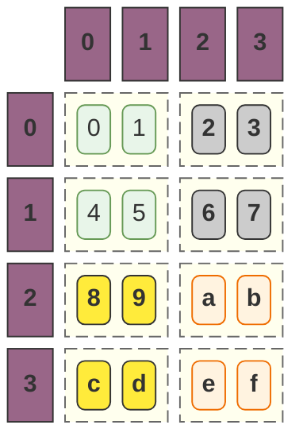

### 一个通道优先的例子

我们下面的逻辑中，使用了通道优先逻辑，那么此时：

- 每个 `block` 只会读取一张图片，因为我们的 $z$ 使用的默认数字 `1`；
- 每个 `block` 通道优先，也就是我们尽量的多处理不同通道中的内容，这里有个问题是，如果通道的数量超过 `1024`，我们的代码会直接异常；因为超出了单 `block` 的线程上限；
- 在确定了我们的 `y` 之后，我们的通道数量也就确定了。此时，每个 `block` 中的 `x` 轴就会存在一个上限：$thread\_count\_per\_block = x * y$ 必须小于等于 `1024`，这意味着 $x = max(1, min(\frac{thread\_count\_per\_block}{k}, \frac{1024}{k}))$

```c++
// 这里我们使用通道优先的策略，我们的 block 中包含图片的所有通道。
constexpr int blockDim_y = k;
// 将输入图片的一层压缩为一行，并且由于我们使用通道优先的策略，所以
// 我们需要根据通道的数量来调整我们的矩阵的大小
constexpr int max_threads = 1024;
constexpr int ideal_x = (out_h * out_w + k - 1) / k;
constexpr int blockDim_x = std::max(1, std::min(ideal_x, max_threads / k));
```

## NCHW和NHWC的内存布局

> 注意，这里只是内存布局示意图，所以在我们本小结的图示中，并不存在行和列的概念，他们都是在内存中一片连续的内存。
>
> 这里，我们假设在计算卷积时的步长 `u` 和 `v` 都等于 `1`。

### NCHW

`NCHW` 是平面优先的内存布局：在同一个 $n$ 和 $c$ 下，所有的像素（$h, w$）构成了一个连续的物理平面。

#### 输入张量

假设我们的输入张量是 $2 * 2 * 2 * 2$： 


#### 卷积核函数

我们假设核函数是 $3 * 2 * 3 * 3$：这里有个问题是，卷积函数通常要求输入张量的中心点的矩阵能够全覆盖核函数。我们的输入张量只有 $2 * 2$，我们在实际的计算过程中可以通过 `padding` 来将它扩展为 $4 * 4$ 的矩阵来保证我们的前提。


#### 输出张量

一个 $2 * 2 * 2 * 2$ 的输入张量乘以一个 $3 * 2 * 3 * 3$ 的核函数会得到一个 $2 * 3 * 2 * 2$ 的输出张量：

- 厚度被 `k` 替换；
- 矩阵的高度和宽度保持不变，和核函数的尺寸无关；

在下面的图中：

- 输入张量的通道0和核函数0的通道0，核函数1的通道0，核函数2的通道0，构成了一个新的 3 * 2 * 2 的张量。
- 输入张量的通道1和核函数0的通道1，核函数1的通道1，核函数2的通道1，构成了一个新的 3 * 2 * 2 的张量。

也就是说：

1. 输入通道 0 → 产生 3 个输出通道
2. 输入通道 1 → 产生 3 个输出通道

我们要将 `通道0的输出通道0` 和 `通道1的输出通道0` 叠加成为一个新的通道，于是最终得到一个 $3 * 2 * 2$ 的输出张量。因为每一层都包含了一定的信息（特征），我们只有将这些特征融合起来才能知道图片真正的信息。


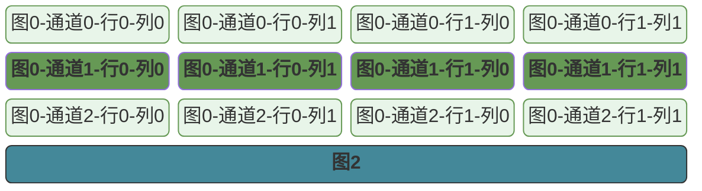

### NHWC

`NHWC` 是通道优先的内存布局：在同一个 $n$ 下，不同通道中具有相同索引的像素点 $(h, w)$ 紧密排列。

#### 输入张量

假设我们的输入张量是 $2 * 2 * 2 * 2$： 

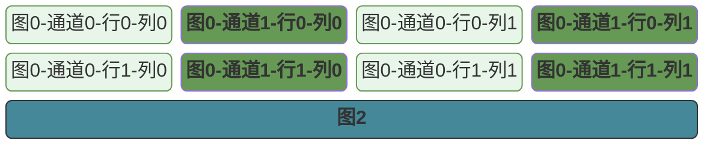

#### 卷积核函数

我们假设核函数是 $3 * 2 * 3 * 3$：


#### 输出张量

这里，我特意把中间过程画出来了，在第一次合并循环时，我们得到了如下的图：在遍历核函数时，我们其实针对于每一个通道都生成了一个乘积：这些相邻且颜色相同的色块，将被合并为一个新的像素点，最终生成一个 $2 * 3 * 2 * 2$ 的输出矩阵。

```mermaid
block-beta

columns 8

0("图0-核0-通道0-行0-列0")
4("图0-核0-通道1-行0-列0")
1("图0-核0-通道0-行0-列1")
5("图0-核0-通道1-行0-列1")
2("图0-核0-通道0-行1-列0")
6("图0-核0-通道1-行1-列0")
3("图0-核0-通道0-行1-列1")
7("图0-核0-通道1-行1-列1")

8("图0-核1-通道0-行0-列0")
9("图0-核1-通道1-行0-列0")
10("图0-核1-通道0-行0-列1")
11("图0-核1-通道1-行0-列1")
12("图0-核1-通道0-行1-列0")
13("图0-核1-通道1-行1-列0")
14("图0-核1-通道0-行1-列1")
15("图0-核1-通道1-行1-列1")

16("图0-核2-通道0-行0-列0")
17("图0-核2-通道1-行0-列0")
18("图0-核2-通道0-行0-列1")
19("图0-核2-通道1-行0-列1")
20("图0-核2-通道0-行1-列0")
21("图0-核2-通道1-行1-列0")
22("图0-核2-通道0-行1-列1")
23("图0-核2-通道1-行1-列1")

class 0,4,2,6,10,11,16,17,20,21 blue
class 8,9,14,15,18,19 pink
class 1,5,7,3,12,13,22,23 purple

classDef transparent fill:none,stroke:none,color:inherit;
classDef content fill:#fff,stroke:#ccc;
classDef animate stroke:#666,stroke-dasharray: 8 4,stroke-dashoffset: 900,animation: dash 20s linear infinite;
classDef yellow fill:#FFEB3B,stroke:#333,color:#000,font-weight:bold;
classDef blue fill:#489,stroke:#333,color:#fff,font-weight:bold;
classDef pink fill:#FFCCCC,stroke:#333,color:#333,font-weight:bold;
classDef light_green fill:#e8f5e9,stroke:#695;
classDef green fill:#695,color:#fff,font-weight:bold;
classDef purple fill:#968,stroke:#333,color:#fff,font-weight:bold;
classDef gray fill:#ccc,stroke:#333,font-weight:bold;
classDef error fill:#bbf,stroke:#f65,stroke-width:2px,color:#fff,stroke-dasharray: 5 5;
classDef coral fill:#f8f,stroke:#333,stroke-width:4px;
classDef orange fill:#fff3e0,stroke:#ef6c00,color:#ef6c00,font-weight:bold;
```

合并后得到了：

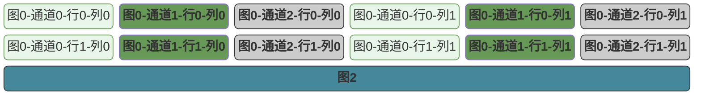

### 代码实现

#### 配置定义

```c++
struct Conv2dDims {
    int n, c, h, w;
    int k, r, s;
    int out_h, out_w;

    __host__ __device__ inline int in_offset(const int idx_n, const int idx_c, const int idx_h, const int idx_w) const {
        return (idx_n * c * h * w) + (idx_c * h * w) + (idx_h * w) + idx_w;
    }

    __host__ __device__ inline int weight_offset(const int idx_k, const int idx_c, const int idx_h, const int idx_w) const {
        return (idx_k * c * r * s) + (idx_c * r * s) + (idx_h * s) + idx_w;
    }

    __host__ __device__ inline int out_offset(const int idx_n, const int idx_k, const int idx_out_h, const int idx_out_w) const {
        return (idx_n * k * out_h * out_w) + (idx_k * out_h * out_w) + (idx_out_h * out_w) + idx_out_w;
    }
};

struct Conv2dAttrs {
    int u, v;
    int p, q;
};
```

#### 具体实现逻辑

```c++
__global__ void naive_conv2d_c_oriented(const float *in, float *weight, float *out, const Conv2dDims dims, const Conv2dAttrs attrs) {
    // 我们将整个输出张量的一个通道中的所有算子压缩到x轴，所以这里x代表了在某个通道中的相对偏移量
    // idx_area = height * w + width;
    const int idx_area_out = static_cast<int>(blockIdx.x * blockDim.x + threadIdx.x);
    // 这里代表了第 idx_k 个核函数，这里非常容易误解的是
    // 在通道优先中，y 表示的是通道的索引，实际上这里和通道没有任何关系
    const int idx_k = static_cast<int>(blockIdx.y * blockDim.y + threadIdx.y);
    // 表示第几张图片
    const int idx_n = static_cast<int>(blockIdx.z * blockDim.z + threadIdx.z);

    if (idx_area_out >= dims.out_h * dims.out_w || idx_k >= dims.k || idx_n >= dims.n) {
        return;
    }

    // 计算输出张量元素在矩阵中的相对坐标
    const int idx_h_in_area = idx_area_out / dims.out_w;
    const int idx_w_in_area = idx_area_out % dims.out_w;

    // 通过输出张量元素在矩阵中的相对坐标计算在输入张量中的起始位置
    const int pos_ori_h = idx_h_in_area * attrs.u - attrs.p;
    const int pos_ori_w = idx_w_in_area * attrs.v - attrs.q;

    float sum = 0.0f;
    for (int k_h_num = 0; k_h_num < dims.r; k_h_num++) {
        for (int k_w_num = 0; k_w_num < dims.s; k_w_num++) {
            for (int k_c_num = 0; k_c_num < dims.c; k_c_num++) {
                const int pos_cur_h = pos_ori_h + k_h_num;
                const int pos_cur_w = pos_ori_w + k_w_num;
                if (0 <= pos_cur_h && pos_cur_h < dims.h && 0 <= pos_cur_w && pos_cur_w < dims.w) {
                    // 通道优先的含义是：计算**同一个核函数**下，输入张量不同通道间具有相同相对索引的元素
                    // 所以这个位置他的相对索引和 idx_k 没有任何关系，只和输入张量的通道有关
                    const int in_offset = dims.in_offset(idx_n, k_c_num, pos_cur_h, pos_cur_w);
                    // 核函数的索引只和核函数以及 idx_k 有关
                    const int weight_offset = dims.weight_offset(idx_k, k_c_num, k_h_num, k_w_num);
                    sum += in[in_offset] * weight[weight_offset];
                }
            }
        }
    }
    const unsigned out_offset = dims.out_offset(idx_n, idx_k, idx_h_in_area, idx_w_in_area);
    out[out_offset] = sum;
}
```

### 性能分析

> **在我们的算法中，有一个巨大的性能漏洞在于，虽然我们算法实现是基于通道优先的算法，然而实际上我们的内存布局却是平面优先的。**

我们可以查看这一段代码：

```c++ mark:10,11,22-24,26-28
__global__ void naive_conv2d_c_oriented(const float *in, float *weight, float *out, const Conv2dDims dims, const Conv2dAttrs attrs) {
	// ...
    float sum = 0.0f;
    for (int k_h_num = 0; k_h_num < dims.r; k_h_num++) {
        for (int k_w_num = 0; k_w_num < dims.s; k_w_num++) {
            for (int k_c_num = 0; k_c_num < dims.c; k_c_num++) {
                const int pos_cur_h = pos_ori_h + k_h_num;
                const int pos_cur_w = pos_ori_w + k_w_num;
                if (0 <= pos_cur_h && pos_cur_h < dims.h && 0 <= pos_cur_w && pos_cur_w < dims.w) {
                    const int in_offset = dims.in_offset(idx_n, k_c_num, pos_cur_h, pos_cur_w);
                    const int weight_offset = dims.weight_offset(idx_k, k_c_num, k_h_num, k_w_num);
                    sum += in[in_offset] * weight[weight_offset];
                }
            }
        }
    }
    const unsigned out_offset = dims.out_offset(idx_n, idx_k, idx_h_in_area, idx_w_in_area);
    out[out_offset] = sum;
}

struct Conv2dDims {
    __host__ __device__ inline int in_offset(const int idx_n, const int idx_c, const int idx_h, const int idx_w) const {
        return (idx_n * c * h * w) + (idx_c * h * w) + (idx_h * w) + idx_w;
    }

    __host__ __device__ inline int weight_offset(const int idx_k, const int idx_c, const int idx_h, const int idx_w) const {
        return (idx_k * c * r * s) + (idx_c * r * s) + (idx_h * s) + idx_w;
    }

    __host__ __device__ inline int out_offset(const int idx_n, const int idx_k, const int idx_out_h, const int idx_out_w) const {
        return (idx_n * k * out_h * out_w) + (idx_k * out_h * out_w) + (idx_out_h * out_w) + idx_out_w;
    }
};

```

在代码中，我们引入了两个变量，在变量中：

- `const int weight_offset = dims.weight_offset(idx_k, k_c_num, k_h_num, k_w_num);`
- `const int in_offset = dims.in_offset(idx_n, k_c_num, pos_cur_h, pos_cur_w);`

对于 `weight_offset`，它主要依赖于 `y`，而其他的三个参数：`k_c_num`，`k_h_num`，`k_w_num` 是同 block 内所有线程一致的。也就是说，同一个 `block` 内线程：

-	 `y` 相同的线程，他们访问的甚至是一个变量，可以通过广播机制来达成高效访问；
-	`y` 不同的线程，无法合并访问，但是这个是可以接受的，因为本身 `y` 的改变就会引起内存地址大范围跳转。

所以，只要我们保证 `block` 中每一行的线程是 `32`的整数倍，就可以充分的利用合并访问机制；

对于 `in_offset()`  中，依赖的 $(pos\_cur\_h, pos\_cur\_w)$ 这两个字段是基于 `static_cast<int>(blockIdx.x * blockDim.x + threadIdx.x)` 计算的，也就说同一个warp中的线程：`idx_h_in_area` 不变，`idx_w_in_area` 改变。虽然因为我们引入了 `p` 和 `q` 来表示步长，但是此时我们可以认为他们是接近于连续的。

看起来，我们的线程好像分配很合理，他们都实现了合并访问。然而实际上他们会存在如下问题：

- **非对齐事务（Unaligned Transactions）**：在该代码中，由于 `pos_ori_h * w` 和 `pos_ori_w` 的存在，如果输入图像的宽度 $w$ 不是 32 的倍数，那么每一行开始读取时，地址几乎必然是**非对齐**的。原本一次总线传输就能搞定的数据，硬件可能需要分两次甚至三次传输（Transaction），带宽利用率瞬间减半。
- **步长导致的缓存污染**：虽然在最内层 `pos_out_w` 是合并的，但卷积还有 $i$ 和 $j$（卷积核的高宽）以及 $c$（通道）的循环：当我们从当前像素跳转到下一行（$i \rightarrow i+1$）或者下一个通道（$c \rightarrow c+1$）时，地址发生了巨大的跳跃（Stride）。GPU 的 L2 缓存是以“缓存行”（Cache Line）为单位存储的。这种跳跃式读取会导致我们刚读进缓存的内容还没被充分利用，就被下一次大跳跃带来的新数据“踢”出去了。这叫 **Cache Thrashing（缓存抖动）**。

**这里引发一切问题的根源在于，依然我们的计算模型使用的是通道优先，但是我们的内存模型却使用的是平面优先。**

最优的逻辑是：

1. 在生成数据时，生成通道优先的内存结构，这样最内层循环变成了通道。我们不需要计算复杂的索引，直接 `in_ptr++`。
2. 共享内存：如果无法修改输入数据格式，我们可以尝试使用共享内存将在执行循环前，一次性把输入图像的一个分块（Tile）搬到 GPU 的 **Shared Memory** 里。

# 使用矩阵乘法优化卷积算子

在离散域中的卷积算法可以分为两个主要类型：

>**平面优先型**，对于该类型的卷积算子公式可以总结为

$$
Out[n,o_c,o_h,o_w]= \sum_{i_c = 0}^{C-1}\sum_{i_r=0}^{R-1}\sum_{i_s = 0}^{S-1}In[n, i_c, i_h, i_w] \times Kernel[o_c, i_c, i_r, i_s]
$$

其中：

- $i_h = o_h \cdot u + i_r - p$
- $i_w = o_w \cdot v + i_s - q$

> **通道优先型**，对于该类型的卷积算子公式可以总结为

$$
Out[n,o_c,o_h,o_w]= \sum_{i_r=0}^{R-1}\sum_{i_s = 0}^{S-1}\sum_{i_c = 0}^{C-1}In[n, i_c, i_h, i_w] \times Kernel[o_c, i_c, i_r, i_s]
$$

其中：

- $i_h = o_h \cdot u + i_r - p$
- $i_w = o_w \cdot v + i_s - q$


## im2col 算子实现(TODO)

`im2col` 的思路很简单，我们发现，卷积的算法可以被转换为矩阵乘法，而矩阵乘法则是可以通过将点积转换为和积来大幅的提高计算性能。


# QA

## 连续域和离散域

### 定义域的数学本质

- **连续域（Continuous Domain）**：定义域通常是**不可数集**（如实数集 $\mathbb{R}$）。在测度论中，它具有连续的勒贝格测度。这意味着我们可以无限细分取值范围，任意两点之间都存在无穷多个点。
- **离散域（Discrete Domain）**：定义域是**可数集**（如整数集 $\mathbb{Z}$）。点与点之间是孤立的，每个点都有一个明确的“邻居”。

### 连续域和离散域的实例

- **连续域**指的是变量可以在某个范围内取**任意**值，没有间隙。例如：

  - 对于实数，他是稠密且连续的，在任意两个实数之间都有无穷多的实数。

  - 对于时间，真实实际的时间也可以被认为是连续的，任意时间都可以被划分为更小的时间片；

- **离散域**指的是变量只能取**特定、不连续**的值（通常是整数步长）。

  - 对于自然数，他只能取 0, 1, 2, 3, ... 等特定的数字，并且在两个连续的数字中间不存在其他的数字；
  - 对于图像，对于我们计算机中的图像，他由一定数量的像素点来构成 -- 这个像素点它是离散的，并且它是基于我们的显示器和显卡的类型可以找到一个集合来表示所有可以显示的像素点；

### 运算算子的对应关系

在计算机的世界里，由于硬件的限制不可能存在连续域，例如：任意 `float` /`double` 类型都存在精度，就好比计算机不存在一个真实的值可以表示 `π`；所以，我们没有办法将数学上描述连续域的算子应用到计算机的离散域。**也就是说，在从连续切换到离散时，数学工具会发生“算子平移”：**

| **运算类型** | **连续域 (Continuous)** | **离散域 (Discrete)**            |
| ------------ | ----------------------- | -------------------------------- |
| **基础算子** | **积分 ($\int$)**       | **求和 ($\sum$)**                |
| **变化率**   | **微分 ($df/dt$)**      | **差分 ($\Delta f / \Delta n$)** |
| **变换理论** | 傅里叶变换 (FT)         | 离散傅里叶变换 (DFT)             |
| **基本单位** | 微分算子 $dt$           | 单位脉冲 $\delta[n]$             |

## 计算机的2D和3D

> **计算机内存本质上是线性（1D）的，所有的“多维”都是我们通过数学索引强加给它的幻觉。**

本质上来说，计算机里不存在 2D 数组，更不存在 3D 张量：

- 我们所谓的 `in[n][c][h][w]`，在底层 CPU 看来，只是一个简单的算术题：`base_address + offset`。
- **所谓的“维度”，本质上是“寻址跳跃的步长（Stride）”。**

```mermaid
block-beta

columns 25

x0("0") x1("1") x2("...") x3("31") x4("...") x5("255")
y0("0") y1("1") y2("...") y3("31") y4("...") y5("255")
z0("0") z1("1") z2("...") z3("31") z4("...") z5("255")
a("...")
b0("0") b1("1") b2("...") b3("31") b4("...") b5("255")

class x0,x1,x2,x3 green
class y0,y1,y2,y3 yellow
class b0,b1,b2,b3 blue
class z0,z1,z2,z3 orange

warp1("warp"):4
space:2
warp2("warp"):4
space:2
warp3("warp"):4
space:3
warp4("warp"):4
space:2

class warp1,warp2,warp3,warp4 purple


classDef animate stroke:#666,stroke-dasharray: 8 4,stroke-dashoffset: 900,animation: dash 20s linear infinite;
classDef yellow fill:#FFEB3B,stroke:#333,color:#000,font-weight:bold;
classDef blue fill:#489,stroke:#333,color:#fff,font-weight:bold;
classDef pink fill:#FFCCCC,stroke:#333,color:#333,font-weight:bold;
classDef green fill:#695,color:#fff,font-weight:bold;
classDef purple fill:#968,stroke:#333,color:#fff,font-weight:bold;
classDef gray fill:#ccc,stroke:#333,font-weight:bold;
classDef error fill:#bbf,stroke:#f65,stroke-width:2px,color:#fff,stroke-dasharray: 5 5;
classDef coral fill:#f8f,stroke:#333,stroke-width:4px;
classDef orange fill:#fff3e0,stroke:#ef6c00,color:#ef6c00,font-weight:bold;
```

而在我们的卷积函数执行过程中：

- **1D 卷积**：通常用于序列数据（如音频、文本），核只在一个方向上滑动。
- **2D 卷积**：用于图像，核在上下、左右两个维度移动。
- **3D 卷积**：用于视频或医学 CT 扫描，核在长、宽、高（时间）三个维度移动。

这里有一个非常明显的特点在于：对于图片来讲，它只有两个维度，宽和高，这里的第三维是不同的特征，不同的特征之间是分开计算的。而当我们进行3D卷积时，这个新增的维度也并不是我们物理意义上的深度，而是时间。

在我们的2D卷积中，**我们的Channel 是“属性”而非“几何高度”**，在 CNN 里，3D 的三个轴分别是：**高度(H)、宽度(W)、通道(C)**：

- **H 和 W** 是几何空间。它们代表了像素在平面上的物理位置。
- **C (Channel)** 绝对不是几何意义上的“厚度”。它更像是**“在这个点上，我观察到了哪些属性？”**。
  - 第一层卷积：属性是 R、G、B 颜色。
  - 中间层卷积：属性是“这里有没有横线？”、“这里有没有圆圈？”。
  - 更高层卷积：这里的图形组织成了什么具体的物体？
- **分开计算**：之所以通道间是“分开”又“聚合”的（每个通道有自己的卷积核参数，最后求和），是因为我们要综合不同属性来判定一个高级特征。

而当我们扩展到3D时，我们的维度仍然不包含物理意义上深度，而是新增了 **时间轴（T）**：卷积核不再只在平面滑，它还会**“穿透”**时间。

## padding，卷积与互相关

我们前面提到，在计算机的实际开发过程中，有一个重要的优化：**卷积的计算被优化为一个互相关的计算**。

原始的卷积公式：
$$
(f * g)[n] = \sum_{m=1}^{n} f[m]g[n - m]
$$


被优化为：
$$
(f \star g)[n] = \sum f[n+m]g[m]
$$


而这个优化依赖于两个重要的结论：

- 在CNN中，卷积核函数并不是我们指定的，而是训练得到的。也就是说，如果我们使用互相关代替卷积，那么我们在计算时得到的天然就是已经转置过的核函数。在信号处理中，如果我们不翻转卷积核，滤波器提取的特征方向就会出错。但在 CNN 中：
  - 反向传播（Backpropagation）计算梯度的公式，本质上也是一种卷积/互相关操作。
  - 如果数学上需要一个旋转 $180^\circ$ 的核 $G'$ 来提取特征，优化器（如 Adam/SGD）在训练过程中，会直接把权重矩阵 $G$ 学习成那个旋转后的样子。
  - 对于神经网络来说，它并不关心核函数在内存里是怎么摆放的，它只关心最终能降低 Loss。既然如此，省去“翻转核”这个耗时的计算步骤，对性能是大有裨益的。
- 通过 `padding`，我们使得参数 $[n + m]$ 变得可能：
  - 在互相关的公式 $(f \star g)[n] = \sum f[n+m]g[m]$ 中，当 $n$ 是图像边缘且 $m$ 是正偏移时，索引 $n+m$ 会迅速超出原始图像的边界。
  - **Padding 的缓冲作用**：如果没有 Padding，我们只能做 `Valid` 卷积，我们的输出索引 $n$ 必须从一个足够大的位置开始，以确保 $n+m$ 不越界。这会导致图像越卷越小。
  - **坐标归一化**：通过 Padding，我们人为地在 $n+m$ 可能触达的所有地方填充了“安全数值”（通常是 $0$）。这使得：
    1. **索引变得整齐**：我们可以从输出的 $(0,0)$ 位置开始，无脑地应用正向索引 $[n+m]$。
    2. **空间对齐**：通过 Padding，我们让输出的 $[n]$ 位置在物理视觉上，依然能对应到输入图像中心点的特征，而不是发生偏移。

这里，我们举一个简单的例子来理解，padding 是如何帮助我们将卷积运算转换为互相关运算的，考虑我们的CPU卷积代码如下：

```c++ mark:8,9,13,14,15
void conv2d_cpu(const float *in, const float *weight, float *out, const Conv2dDims &dims, const Conv2dAttrs &attrs) {
	// ...
            // 这里 oh_num 和 ow_num 都是输出上的点，也就是说每个点都需要计算
            // 我们这里改变了从输入到输出的顺序，而是通过输出反推输入
            for (size_t oh_num = 0; oh_num < dims.out_h; oh_num++) {
                for (size_t ow_num = 0; ow_num < dims.out_w; ow_num++) {
                    float v = 0.0;
                    const int h_pos = oh_num * attrs.u - attrs.p;
                    const int w_pos = ow_num * attrs.v - attrs.q;
                    for (size_t c_num = 0; c_num < dims.c; ++c_num) {
                        for (size_t h_num = 0; h_num < dims.h; ++h_num) {
                            for (size_t w_num = 0; w_num < dims.w; ++w_num) {
                                int pos_ori_h = h_pos + h_num;
                                int pos_ori_w = w_pos + w_num;
                                if (pos_ori_w >= 0 && pos_ori_h >= 0 && pos_ori_w < w && pos_ori_h < h)
                                {
                                    // add
                                }
                            }
                        }
                    }
                }
	// ...
}
```

可以看到，当我们在计算输出张量的点 $(oh\_num, ow\_num)$ 时，我们计算的是在输入张量的以 $(oh\_num, ow\_num)$ 作为左上角顶点（在子张量中索引为 $(0, 0)$）的张量和核函数的乘积。**这带来的一个问题是，我们的坐标系看起来出现了漂移。**

举个例子，假设我们的核函数是 $3 \times 3$，我们的输入矩阵也是 $3 \times 3$，那么看起来我们在计算 $(1, 1)$ 时，实际上计算的却是以 $(1, 1)$ 作为左顶点的矩阵和核函数的乘积。这个逻辑，实际上是我们通过对输入矩阵进行 `padding` 来实现的一个优化。

考虑我们的输入是如下的一个 $3 * 3$ 的矩阵：

```mermaid
block-beta
columns 3

0 1 2
3 4 5
6 7 8

class 0,1,2,3,4,5,6,7,8 light_green

%% 样式定义
classDef content fill:#fff,stroke:#ccc;
classDef animate stroke:#666,stroke-dasharray: 8 4,stroke-dashoffset: 900,animation: dash 20s linear infinite;
classDef yellow fill:#FFEB3B,stroke:#333,color:#000,font-weight:bold;
classDef blue fill:#489,stroke:#333,color:#fff,font-weight:bold;
classDef pink fill:#FFCCCC,stroke:#333,color:#333,font-weight:bold;
classDef light_green fill:#e8f5e9,stroke:#695;
classDef green fill:#695,color:#fff,font-weight:bold;
classDef purple fill:#968,stroke:#333,color:#fff,font-weight:bold;
classDef gray fill:#ccc,stroke:#333,font-weight:bold;
classDef error fill:#bbf,stroke:#f65,stroke-width:2px,color:#fff,stroke-dasharray: 5 5;
classDef coral fill:#f8f,stroke:#333,stroke-width:4px;
classDef orange fill:#fff3e0,stroke:#ef6c00,color:#ef6c00,font-weight:bold;

%% 将填充层样式设为灰色以示区别
class z0,z1,z2,z3,z4,z5,z6,z7,z8,z9,z10,z11,z12,z13,z14,z15,z16,z17
```

我们的输出是一个如下 $3 * 3$ 的矩阵，我们现在计算 $(0, 0)$ 元素

```mermaid
block-beta
columns 3

a b c
d e f
g h i

class a yellow
class b,c,d,e,f,g,h,i light_green

%% 样式定义
classDef content fill:#fff,stroke:#ccc;
classDef animate stroke:#666,stroke-dasharray: 8 4,stroke-dashoffset: 900,animation: dash 20s linear infinite;
classDef yellow fill:#FFEB3B,stroke:#333,color:#000,font-weight:bold;
classDef blue fill:#489,stroke:#333,color:#fff,font-weight:bold;
classDef pink fill:#FFCCCC,stroke:#333,color:#333,font-weight:bold;
classDef light_green fill:#e8f5e9,stroke:#695;
classDef green fill:#695,color:#fff,font-weight:bold;
classDef purple fill:#968,stroke:#333,color:#fff,font-weight:bold;
classDef gray fill:#ccc,stroke:#333,font-weight:bold;
classDef error fill:#bbf,stroke:#f65,stroke-width:2px,color:#fff,stroke-dasharray: 5 5;
classDef coral fill:#f8f,stroke:#333,stroke-width:4px;
classDef orange fill:#fff3e0,stroke:#ef6c00,color:#ef6c00,font-weight:bold;

%% 将填充层样式设为灰色以示区别
class z0,z1,z2,z3,z4,z5,z6,z7,z8,z9,z10,z11,z12,z13,z14,z15,z16,z17
```


那么，我们对这个矩阵进行一次 `padding` 之后得到：

```mermaid
block-beta
columns 5

z0["x"] z1["0"] z2["0"] z3["0"] z4["0"]
z5["0"] 0("0") 1("1") 2("2") z6["0"]
z7["0"] 3("3") 4("4") 5("5") z8["0"]
z9["0"] 6("6") 7("7") 8("8") z10["0"]
z11["0"] z12["0"] z13["0"] z14["0"] z15["0"]

%% 样式应用
class 0 yellow
class z0 orange
class 1,2,3,4,5,6,7,8 light_green
class z1,z2,z3,z4,z5,z6,z7,z8,z9,z10,z11,z12,z13,z14,z15 gray

%% 样式定义
classDef content fill:#fff,stroke:#ccc;
classDef animate stroke:#666,stroke-dasharray: 8 4,stroke-dashoffset: 900,animation: dash 20s linear infinite;
classDef yellow fill:#FFEB3B,stroke:#333,color:#000,font-weight:bold;
classDef blue fill:#489,stroke:#333,color:#fff,font-weight:bold;
classDef pink fill:#FFCCCC,stroke:#333,color:#333,font-weight:bold;
classDef light_green fill:#e8f5e9,stroke:#695;
classDef green fill:#695,color:#fff,font-weight:bold;
classDef purple fill:#968,stroke:#333,color:#fff,font-weight:bold;
classDef gray fill:#ccc,stroke:#333,font-weight:bold;
classDef error fill:#bbf,stroke:#f65,stroke-width:2px,color:#fff,stroke-dasharray: 5 5;
classDef coral fill:#f8f,stroke:#333,stroke-width:4px;
classDef orange fill:#fff3e0,stroke:#ef6c00,color:#ef6c00,font-weight:bold;
```


当我们计算 $(0, 0)$ 进行卷积运算后的结果时：**这里有一个非常容易产生误解的点，$(0, 0)$ 是元素在输出张量中的索引，而不是在输入张量或者核函数中的索引。**

我们在输入张量中的索引，是通过一下公式计算得出：

- $h_{in} = i \times u - p$
- $w_{in} = j \times v - q$

而核函数的索引则是在对 $(c, h, w)$ 的三层 `for` 循环中得到。

此时，我们会发现，在我们计算输出张量的 $(0, 0)$ 节点时，我们可以将 `x` 节点作为起始节点，而该节点的索引地址在 `padding` 后的输入张量中正是 $(h_{in}, w_{in})$。我们的计算逻辑从卷积正式的被改变为互相关。

这种方法被称之为**“锚点平移理论”**，这在高性能计算（HPC）中非常有启发性：如果不加 Padding，卷积核在处理 $3 \times 3$ 矩阵的第一个元素 `0` 时，核的**中心点**对准的是 `0`。这意味着核的左上角必须处于索引 `(-1, -1)`：

- **物理现实**：图像是从 `(0, 0)` 开始存储的，内存里没有 `(-1, -1)`。
- **工程方案**：通过 Padding，我们在内存里人为地造出了一个 `(-1, -1)`。
- **结果**：输出矩阵的 `(0, 0)` 节点（即 `a`），现在在地址映射上，可以优雅地指向 Padding 后矩阵的  `x` 节点）。

这正是**互相关公式** $\sum f[n+m]g[m]$ 的代码体现：

- $n = h\_pos$（基础偏移）。
- $m = h\_num$（核内正向偏移）。

### Implicit Padding

在我们的工程代码中：

```c++
if (pos_ori_w >= 0 && pos_ori_h >= 0 && pos_ori_w < w && pos_ori_h < h)
```

我们通过 `if` 条件来为我们的输入隐式的补边：

- **优点**：不需要额外开辟内存去存那些 `z0, z1...` 的 0。
- **代价**：在 GPU 上，这种 `if` 分支（Branch）可能会导致 Warp Divergence（线程束歧义），降低并行效率。

### Explicit Padding

在极致优化的 `CUDA` 实现中，我们会先用一段专门的逻辑把带 Padding 的大矩阵拼好（物理 Padding），虽然费了内存，但在计算核心逻辑里就没有 `if` 了，代码会跑得飞快。

在实际应用中，我们进行 `padding` 的时机有两个：

1. 在生成数据时遍为所有的张量进行 `padding`；
   - **优点**：
     - **极致的计算性能**：卷积 Kernel 内部不需要任何 `if` 判断，也不需要处理复杂的索引边界，代码路径极短，指令流水线非常顺畅。
     - **访存连续性**：对于 GPU 来说，连续的内存访问（Coalesced Access）是性能命脉。带 Padding 的数据可以让读取更加对齐。
   - **缺点**：
     - **内存冗余**：对于一张 $3 \times 3$ 的图片，补一圈边可能觉得没什么；但在 $N$ 和 $C$ 很大时，多出来的这圈“零”会占用宝贵的显存带宽。
     - **打破通用性**：上游算子必须感知下游的需求，这增加了模块间的耦合。
2. 在生成数据时不做任何处理，在CUDA核函数的执行中进行 `padding`：在调用卷积前，单独启动一个简单的 `PadKernel`，把原始 $3 \times 3$ 拷贝到一个预先申请好的 $5 \times 5$ 显存空间里。
   - **性能瓶颈**：这是一个 **Memory-bound（访存受限）** 操作。我们为了省下卷积里的 `if`，额外多了一次全局显存的读写（DRAM R/W），有时候这比 `if` 还要慢。

### 其他的padding方式

1. 可以利用 **GPU 的纹理内存（Texture Memory）** 或 **采样器**。硬件层级支持越界自动补零，这完全不消耗额外的计算指令。
2. **Shared Memory 缓存**：把数据从全局显存搬运到**共享内存（Shared Memory）**时进行 Padding。这样卷积计算的核心（最内层循环）面对的是 Shared Memory 里带边界的数据块。

# 引用

- [Convolutional Neural Networks - Basics](https://mlnotebook.github.io/post/CNN1/)
- [如何通俗易懂地解释卷积？ - 果程C的回答 - 知乎](https://www.zhihu.com/question/22298352/answer/50940942)
- [cnn-explainer](https://github.com/poloclub/cnn-explainer)
- [卷积算子简易实现](https://cuda.keter.host/convolution/naive_conv/)
- [im2col + gemm 实现卷积](https://cuda.keter.host/convolution/im2col_conv/)