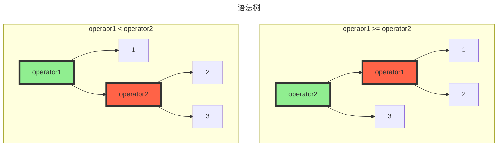
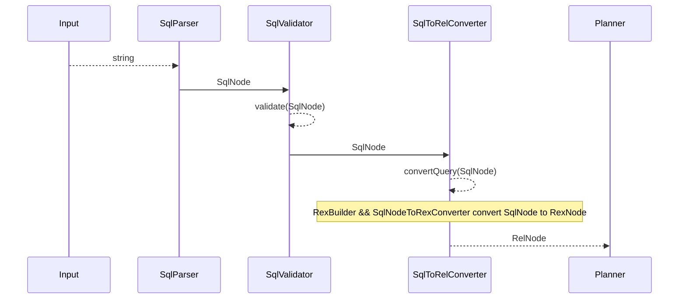
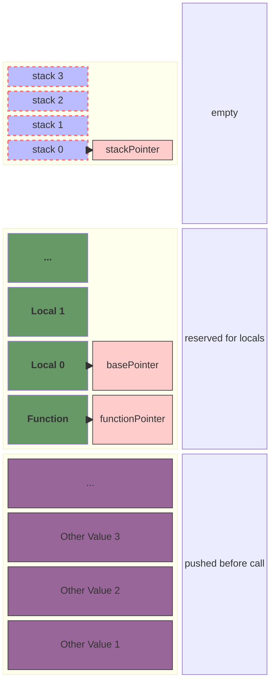

# Draw Diagrams in Markdown

I have always been a enthusiast for diagrams because I believe illustrations are a more direct and efficient way to elucidate the truths we want to explore. Meanwhile, I don't need a heavy diagraming tool like PowerPoint. I prefer to a  `lightweight`, `cross-platform`,`easy-to-using` tool that can be seamlessly integerated with markdown, and here are several tools build for markdown that I find useful:

- [js-sequence-diagrams](https://bramp.github.io/js-sequence-diagrams/)
- [flowchart.js](http://flowchart.js.org)
- [mermaid](https://mermaid.js.org/#/)

If you are interested in any one of these tools, just read the tutorial to get started on your journey.

## Most Useful Diagrams in Mermaid

### flowchart

## sequenceDiagram

### block-beta

