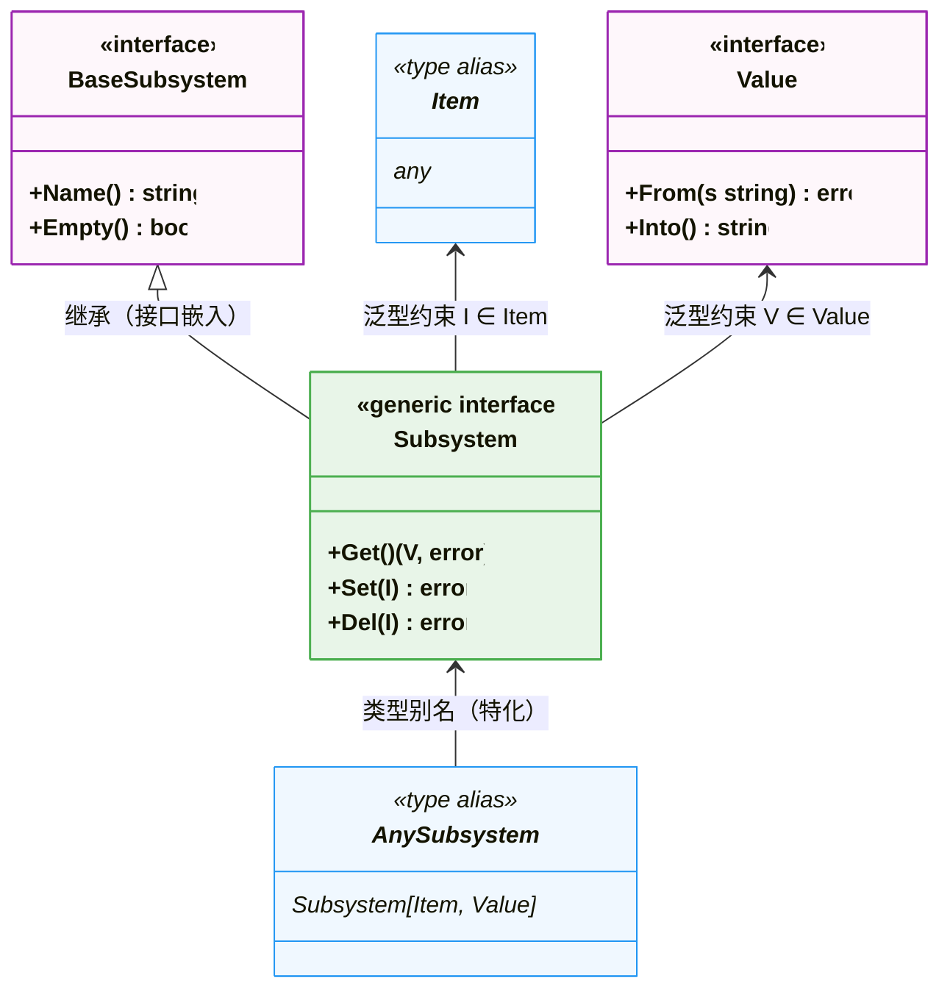

# 发现问题

最近在尝试实现一个简单的 [docker](https://github.com/0x822a5b87/tiny-docker/tree/main)，在实现的过程中我试图将对linux的cgroup文件操作抽象为一个独立的接口 `subsystem`，但是对于不同的类型的文件他的结构完全不一样：

- 对于 `cgroup.procs`，他的文件中存储的是一个以 `\n` 分割的 `pid` 数组；
- 对于 `cpu.max`，他的文件中存储的是以空格分隔的两个数字；

```shell
cat /sys/fs/cgroup/system.slice/docker-0a7f5c9459f832ac7bb539e6e61dac51a4a4f66c5dbc1bbb963d0ec3f01d31ae.scope/cgroup.procs
#1435205

cat /sys/fs/cgroup/system.slice/docker-0a7f5c9459f832ac7bb539e6e61dac51a4a4f66c5dbc1bbb963d0ec3f01d31ae.scope/cpu.max
# max 100000
```

所以，我尝试直接将他做出如下抽象：

- 文件内容的实际数据为 `string`，但是对外暴露为 `Item` 和 `Value` 两个类型，其中 `Value` 需要提供 `string -> Value` 和 `Value -> string` 的接口；
- 对文件内容的查询抽象为 `Subsystem`，它不直接操作文件，而是通过和前面的 `Item` 以及 `Value` 交互。

在这种情况下，我们上层的业务逻辑可以完全的隔离对文件的操作逻辑，那么整体的代码可以被抽象为：

```go
type Item any

type Value interface {
	From(string) error
	Into() string
}

type BaseSubsystem interface {
	Name() string
	Empty() bool
}

type Subsystem[I Item, V Value] interface {
	BaseSubsystem
	Get() (V, error)
	Set(I) error
	Del(I) error
}

type AnySubsystem Subsystem[Item, Value]
```



这个逻辑本来看上去相当的合理，然而在实现时发现：**go语言的泛型并不支持[Covariance](#Covariance)。于是，我们的如下代码将直接抛出异常。

```go
// 这一段代码的编译是通过的
func (f *CgroupFileSystem) Write(ss subsystem.AnySubsystem) error {
	cgroupPath, err := subsystem.GetCgroupPath(ss, f.Path, f.AutoCreate)
	if err != nil {
		return err
	}

	value, err := ss.Get()
	if err != nil {
		return err
	}

	if err := os.WriteFile(cgroupPath, []byte(value.Into()), 0644); err != nil {
		return err
	}

	return nil
}

func (f *CgroupFileSystem) Sync(pid int) error {
	// ...
	procsSubsystem := cgroup.NewProcsValueSubsystem(value)
	// Cannot use procsSubsystem as the tye Subsystem
	f.Write(procsSubsystem)

	return nil
}
```

# 解决问题

## Covariance

要解决这个问题，我们就必须先了解什么叫 `Covariance`：通俗来说，**协变**是类型系统中的一个概念，描述的是：**若类型 `Sub` 是类型 `Base` 的子类型（或实现了 `Base` 接口），则基于 `Sub` 的泛型类型（如 `Container[Sub]`）可视为基于 `Base` 的泛型类型（如 `Container[Base]`）的子类型**—— 简单说就是 “子类的容器 ≈ 父类的容器”。

如果要举一个例子就是：

- **苹果是水果的子类型，那么对于一个返回水果的接口，他返回一个苹果是可以接受的，这也是泛型存在的意义；**
- **而Covariance指的是，一个装苹果的篮子是否可以匹配一个装水果的篮子？**

这里给出一个最简单的例子：

```go
package main

type Base interface {
	BaseMethod()
}

type BaseImpl struct {
	
}

func (b BaseImpl) BaseMethod() {}

type Container[T Base] struct {}

func BaseAsParams(container Container[Base]) {}

func main() {
	var baseContainer Container[Base]
	BaseAsParams(baseContainer)
	var baseImplContainer Container[BaseImpl]
	BaseAsParams(baseImplContainer)
    // Cannot use 'baseImplContainer' (type Container[BaseImpl]) as the type Container[Base]
}
```

| 代码元素                        | 比喻中的概念        | 核心关系                           |
| ------------------------------- | ------------------- | ---------------------------------- |
| `Base`                          | 水果（接口）        | 顶层抽象                           |
| `BaseImpl`                      | 苹果（实现）        | `BaseImpl` 实现了 `Base`           |
| `Container[T Base]`             | 装水果 / 苹果的篮子 | 泛型容器（约束 T 为 Base）         |
| `BaseAsParams(Container[Base])` | 接收 “装水果的篮子” | 函数期望的参数类型                 |
| `Container[BaseImpl]`           | 装苹果的篮子        | 试图传递给接收 “装水果篮子” 的函数 |

## 绕开限制

现在我们知道 `Covariance` 对我们的限制是：

1. **装苹果的篮子不能匹配装水果的篮子**。
2. **苹果可以匹配水果**。

那么很自然的，我们可以将前面的一个**接受泛型参数的函数**修改为**一个接受泛型参数的泛型函数** -- 让编译器去为我们特化**篮子**和**水果**，也就得到了这个函数：

```go
func Write[I subsystem.Item, V subsystem.Value](f *CgroupFileSystem, ss subsystem.Subsystem[I, V]) error {
	cgroupPath, err := subsystem.GetCgroupPath(ss, f.Path, f.AutoCreate)
	if err != nil {
		return err
	}

	value, err := ss.Get()
	if err != nil {
		return err
	}

	if err := os.WriteFile(cgroupPath, []byte(value.Into()), 0644); err != nil {
		return err
	}

	return nil
}

func (f *CgroupFileSystem) Sync(pid int) error {
	// ...
	procsSubsystem := cgroup.NewProcsValueSubsystem(value)
	
    // ...
	err = Write(f, procsSubsystem)

	return nil
}
```

这个 `Write` 泛型函数能编译运行，本质就是**编译器为每个不同的泛型参数组合生成专属的 “特化版本”**，彻底绕开了协变的限制。

| 维度       | 原问题（协变限制）                           | 泛型函数解法（编译器特化）                          | 本质变化                                       |
| ---------- | -------------------------------------------- | --------------------------------------------------- | ---------------------------------------------- |
| 函数参数   | 固定 `Container[水果]`                       | 泛型 `Container[T 水果]`                            | 从 “要求篮子必须装水果”→“适配装任意水果的篮子” |
| 编译器行为 | 检查类型是否严格等于 `Container[水果]`       | 为 `Container[苹果]`/`Container[香蕉]` 生成独立代码 | 从 “类型匹配”→“代码生成”                       |
| 协变依赖   | 试图让 `Container[苹果]` ≈ `Container[水果]` | 无需协变，直接为 `Container[苹果]` 生成专属逻辑     | 绕开协变，而非突破协变                         |

# 拓展

**`Covariance`（协变）是 `Variance`（方差）的一个子集**——`Variance` 是泛型类型系统描述 “泛型参数的子类型关系是否能传递到泛型容器” 的总概念，而 `Covariance` 是其中最常见的一种 “传递规则”。

| 类型 | 英文           | 例子                         | 代码场景对应           |
| ---- | -------------- | ---------------------------- | ---------------------- |
| 协变 | Covariance     | 装苹果的篮子 <: 装水果的篮子 | Go 代码中试图做的事    |
| 逆变 | Contravariance | 装水果的篮子 <: 装苹果的篮子 | 函数参数的子类型传递   |
| 不变 | Invariance     | 装苹果的篮子 ≠ 装水果的篮子  | Go/Rust 默认的泛型规则 |

我们之前的 Go 代码报错，本质是 Go 对泛型容器**强制使用「不变（Invariance）」**，完全禁止协变；而 Rust 虽支持协变，但仅在有限场景（如 `Box<T>`/`&T`）生效，自定义泛型结构体仍默认 “不变”。

为什么主流语言都 “限制协变”？本质是协变会引入**类型安全漏洞**—— 哪怕容器是 “只读” 的，语言也会默认假设 “容器可能有写入行为”：下面的代码中，`AppleImpl` 和 `BananaImpl` 都会被当做 `Base`，从而导致类型异常

```go
// 假设 Go 支持协变
func addBanana(c Container[Base]) {
    // c 实际是 Container[BaseImpl]，但被当成 Container[Base]
    c.Set(BananaImpl{}) // 编译通过，运行时崩溃（往苹果篮子里塞香蕉）
}

var appleBasket Container[BaseImpl]
addBanana(appleBasket) // 协变允许此调用，导致类型安全问题
```

最后，我们总结一下各个语言对Covariance的支持：

- Go 直接 “一刀切禁止协变”，用不变规则杜绝风险；
- Rust 仅允许 “只读类型（如 &T/Box<T>）” 协变，可写容器仍强制不变；
- Java/C# 需显式声明 ? extends/out 才能开启协变，且开启后禁止写入。
