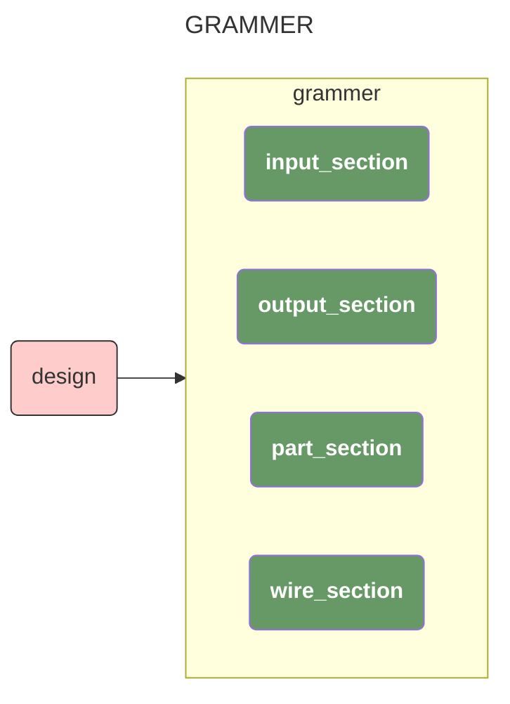
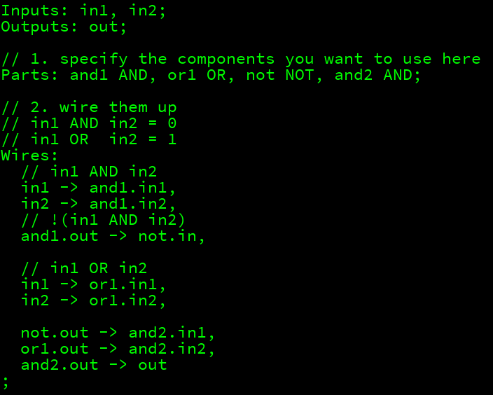

最近因为开了两个 [操作系统](https://github.com/0x822a5b87/Ardi) 和 [linkers](https://github.com/0x822a5b87/tiny-linkers) 的新坑，一直在学习硬件和汇编相关的知识，所以这里找了一个简单的小游戏 [MHRD(Micro Hard Rock Deluxe)](https://store.steampowered.com/app/576030/MHRD/) 用来复习一些基础的CPU相关的知识，以下是官方的描述：

> MHRD is a hardware design game, in which you design various hardware circuits in a hardware description language. The hardware circuits you design get more complex as you go until you create a fully functional CPU design.

## 语法

A design consists of the `Inputs`, `Outputs`, `Parts` and `Wires` section:




Each section starts with a corresponding section identifier, followed by a `colon`, one or more of its corresponding elements and ends with a `semicolon`:

```vhdl
[input_section] = "Inputs:" [input] (, [input])* ";"
  
[output_section] = "Outputs:" [output] (, [output])* ";"
  
[part_section] = "Parts:" [part] (, [part])* ";"
  
[wire_section] = "Wires:" [wire] (, [wire])* ";"
```

Inputs and outputs can be either single pins or a busses

```vhdl
// single pin
[input] = [input_pin_id]
  
// busses
[input] = [input_bus_id][bus_size]
```

Identifiers have to start with a letter optionally followed by an arbitrary amount of letters or numbers:

```vhdl
[id] = [letter] ([letter | digit])*
  
[letter] = [a-zA-Z]
[digit] = [0-9]
```

A bus size is given as a number in square brackets. A number has at least one digit.

```vhdl
[bus_size] = "[" [number] "]"
[number] = [digit]+
```

Parts can be written as pairs of part identifiers and part types. **Part types are always upper-case**:

```vhdl
[part] = [part_id] [part_type]

[part_id] = [id]
  
[part_type] = [uppercase_letter] ([uppercase_letter | digit])*
  
[uppercase_letter] = [A-Z]
```

Wires have a start and end. Start and end can be regular pins, busses of the designed elements or of its parts:

```vhdl
[wire] = [start] "->" [end]

[start] = [pin_value] | [input_pin] | [input_bus] | [part_id]"."[output_pin] | [part_id]"."[output_bus]
  
[end] = [output_pin] | [output_bus] | [part_id]"."[input_pin] | [part_id]"."[input_bus]
```

A pin can be either a reference to a reference to a pin id or a specific pin inside a bus :

```vhdl
[pin_value] = "0" | "1"

[input_pin] = [input_pin_id] | [input_bus_id][pin_selection]
  
[output_pin] = [output_pin_id] | [output_bus_id][pin_selection]
  
[pin_selection] = "[" [number] "]"
```

## tasks

> 在游戏刚开始的时候，我们只有一个默认的 `NAND（Not AND）` 模块，模块声明如下

### NAND

```vhdl
// Interface Specification:
// -----------------------
Inputs: in1, in2;
Outputs: out;
```

### NOT

```vhdl
Inputs: in;
Outputs: out;

// use NAND
Parts: myNand NAND;

Wires:
	in -> myNand.in1,
  in -> myNand.in2,
  myNand.out -> out
;
```

### AND

```vhdl
Inputs: in1, in2;
Outputs: out;

Parts: myNand NAND, myNot NOT;

Wires:
in1 -> myNand.in1,
in2 -> myNand.in2,
myNand.out -> myNot.in,
myNot.out -> out
;
```

### OR

我们简单的画一下 `OR` 的真值表：

| in1  | in2  | out  |
| ---- | ---- | ---- |
| 0    | 0    | 0    |
| 0    | 1    | 1    |
| 1    | 0    | 1    |
| 1    | 1    | 1    |

我们观察到，`OR` 的真值表可以通过转换 `NAND` 的真值表来得到

| in1  | in2  | out  |
| ---- | ---- | ---- |
| 0    | 0    | 1    |
| 0    | 1    | 1    |
| 1    | 0    | 1    |
| 1    | 1    | 0    |

```vhdl
Inputs: ini, in2;
Outputs: out;

Parts: nand NAND, notl NOT, not2 NOT;

Wires:
  inl -> notl."in,
  in2 -> not2."in,
  notl.out -> nand.ini,
  not2.out -> nand.in2,
  nand.out -> out
```

### XOR(`Exclusive-Or`)

> If _exactly_ one input is 1, the output is 1. Otherwise the output is 0.

两个输入中一个为 `1`，另一个为 `0`，可以转换为：

1. `in1` AND `in2` = `0`
2. `in1` OR `in2` = `1`

所以，我们要判断 XOR 可以表示为：**!(in1 AND in2) AND (in1 OR in2)**


