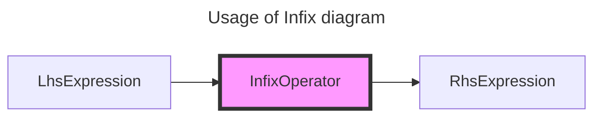
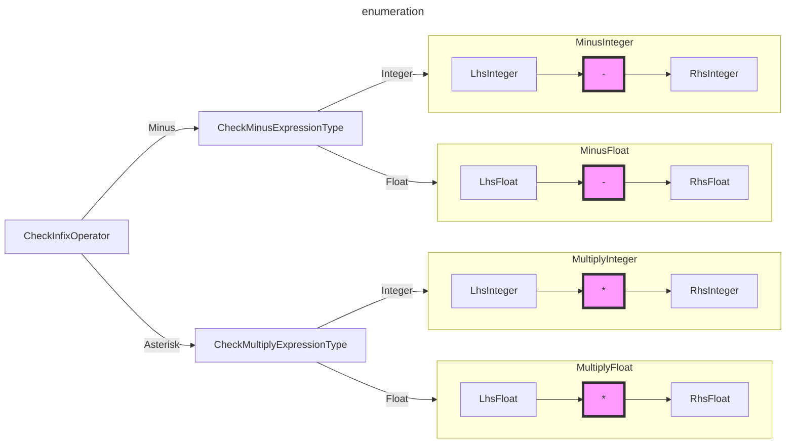
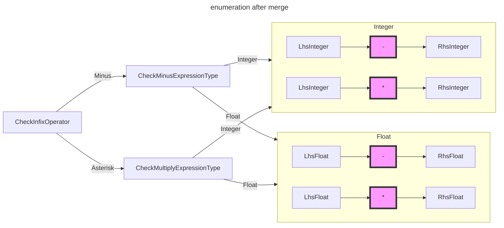
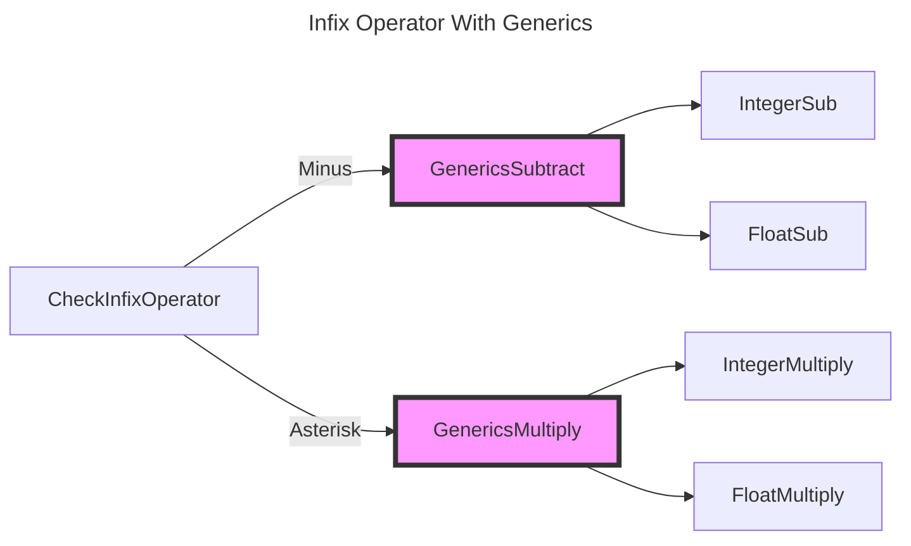

# Strategies of Evaluate Infix Operator

when we are implementing a compiler, there is always a difficult problem we will encounter.

> How can we evaluate an infix operator?

## What is Infix Operator

An infix operator is an operator placed between two expressions, like minus, plus, asterisk, slash and so forth. Here are some common infix operator:

- `+`
- `-`
- `*`
- `/`

the most common usage is described in the following diagram.



## Define the Infix Expression

### Node

every node in our AST has to implement the Node interface meaning it has to provide a TokenLiteral() function that returns the literal value of the token it's associated with. TokenLiteral() will used only for debugging and testing. The AST we are going to construct consists solely of Nodes that are connected to each other.

```go
type Node interface {
	TokenLiteral() string
	String() string // String convert Node to code as string
}
```

### Expression

an expression is a combination of variables, constants, operators, and functions that are evaluated to produce a value.it can be simple, like a constant or variable, or complex, involving multiple operations. it can be nested with other expressions or statement. Expression produce value.

```go
type Expression interface {
	Node
	expressionNode() // expressionNode a Node implement this method to specify itself is an Expression
}
```

### InfixExpression

```go
type InfixExpression struct {
	Token    token.Token
	Operator string
	Lhs      Expression
	Rhs      Expression
}
```

## Evaluate

We can simplify the problem by limiting the types of expressions and operators, because there is no difference between adding integers and multiplying floats. So let's say the expression is `Integer` and `Float` and the operator is `Plus`.

```go
type IntegerLiteral struct {
	Token token.Token
	Value int64
}

type FloatLiteral struct {
	Token token.Token
	Value float64
}
```

### enumeration

the simplest way to evaluate a infix operator is by using enumeration.



apparently, we can combine the `-`, `/` operations for integers, and the `-`, `/` operations for float, just like this:




```go
// evaluate infix expression
func evalInfixExpression(infix *ast.InfixExpression) object.Object {
	lhsObj := Eval(infix.Lhs)
	rhsObj := Eval(infix.Rhs)
	switch infix.Operator {
	case string(token.SUB):
		if lhsObj.Type() == object.ObjInteger && rhsObj.Type() == object.ObjInteger {
			return evalInfixExpressionIntegerLiteral(token.SUB, lhsObj.(*object.Integer), rhsObj.(*object.Integer))
		}

		if lhsObj.Type() == object.ObjFloat && rhsObj.Type() == object.ObjFloat {
			return evalInfixExpressionFloatLiteral(token.SUB, lhsObj.(*object.Float), rhsObj.(*object.Float))
		}
	case string(token.ASTERISK):
		if lhsObj.Type() == object.ObjInteger && rhsObj.Type() == object.ObjInteger {
			return evalInfixExpressionIntegerLiteral(token.ASTERISK, lhsObj.(*object.Integer), rhsObj.(*object.Integer))
		}

		if lhsObj.Type() == object.ObjFloat && rhsObj.Type() == object.ObjFloat {
			return evalInfixExpressionFloatLiteral(token.ASTERISK, lhsObj.(*object.Float), rhsObj.(*object.Float))
		}
	default:
		return object.NativeNull
	}

	// TODO support more infix expression
	return object.NativeNull
}

func evalInfixExpressionIntegerLiteral(operator token.TokenType, lhsIntegerObj, rhsIntegerObj *object.Integer) object.Object {
	switch operator {
	case token.SUB:
		return &object.Integer{Value: lhsIntegerObj.Value - rhsIntegerObj.Value}
	case token.ASTERISK:
		return &object.Integer{Value: lhsIntegerObj.Value * rhsIntegerObj.Value}
	default:
		return object.NativeNull
	}
}

func evalInfixExpressionFloatLiteral(operator token.TokenType, lhsIntegerObj, rhsIntegerObj *object.Float) object.Object {
	switch operator {
	case token.SUB:
		return &object.Float{Value: lhsIntegerObj.Value - rhsIntegerObj.Value}
	case token.ASTERISK:
		return &object.Float{Value: lhsIntegerObj.Value * rhsIntegerObj.Value}
	default:
		return object.NativeNull
	}
}
```

Until now, the problem seems to be solved. However, if we are going to add a new type such as `BigInteger`,We found that there is too much duplicate work to do, and this severely violates our principle: keep it simple, keep it stupid.

To add a new type, we have to do the following:

1. add a new function for evaluate;
2. add a new branch of type in swtich statement;

both of these steps require midifying the main branch code, which presents a significant challenge to our testing and code quality.

**We assume that in the process of adding a new type, the main branch code shouldn't be modified, and each type should have a more flexible approach to support infix operators**

### Generics

The most common approach is using `Generics` and `Interface`:



t seems that this approach is similar to our initial enumeration method, but the internal implementation is completely different.

For example, in the enumeration method, our `MinusInteger` and `MultiplyInteger` functions require conditional checks using `if` or `switch` statements. However, with generics, we can automatically bind methods to the object's methods.

### Subtract and Multiply

```go
// Subtract the behavior of the infix operator minus
type Subtract interface {
	Object
	Sub(Object) Object
}

// Multiply the behavior of the infix operator asterisk
type Multiply interface {
	Object
	Mul(Object) Object
}
```

### Integer

```go
func (i *Integer) Sub(o Object) Object {
	if other, ok := o.(*Integer); ok {
		i.Value = i.Value - other.Value
		return i
	}
	return NativeNull
}

func (i *Integer) Mul(o Object) Object {
	if other, ok := o.(*Integer); ok {
		i.Value = i.Value * other.Value
		return i
	}
	return NativeNull
}
```

### Float

```go
func (f *Float) Sub(o Object) Object {
	if other, ok := o.(*Float); ok {
		f.Value = f.Value - other.Value
		return f
	}
	return NativeNull
}

func (f *Float) Mul(o Object) Object {
	if other, ok := o.(*Float); ok {
		f.Value = f.Value * other.Value
		return f
	}
	return NativeNull
}
```

### Evaluate

Finally, the magic happens. When we calculate infix operators, our main branch code no longer needs to handle the actual types of objects. Instead, we bind a method to each infix operator. If an object needs to support a specific infix operator, it simply implements the corresponding interface, and it will naturally be bound to the appropriate method.

```go
func evalInfixExpression(infix *ast.InfixExpression) object.Object {
	lhsObj := Eval(infix.Lhs)
	rhsObj := Eval(infix.Rhs)
	switch infix.Operator {
	case string(token.SUB):
		return evalSubtract(lhsObj, rhsObj)
	case string(token.ASTERISK):
		return evalMultiply(lhsObj, rhsObj)
	}

	// TODO support more infix expression
	return object.NativeNull
}

func evalSubtract(lhsObj, rhsObj object.Object) object.Object {
	l := lhsObj.(object.Subtract)
	r := rhsObj.(object.Subtract)
	return l.Sub(r)
}

func evalMultiply(lhsObj, rhsObj object.Object) object.Object {
	l := lhsObj.(object.Multiply)
	r := rhsObj.(object.Multiply)
	return l.Mul(r)
}
```

