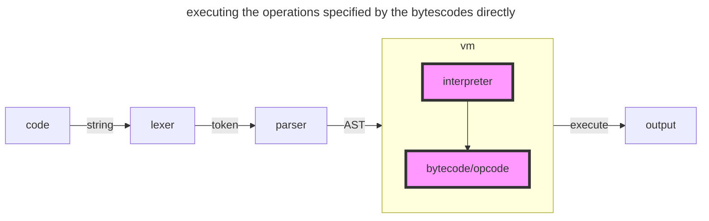
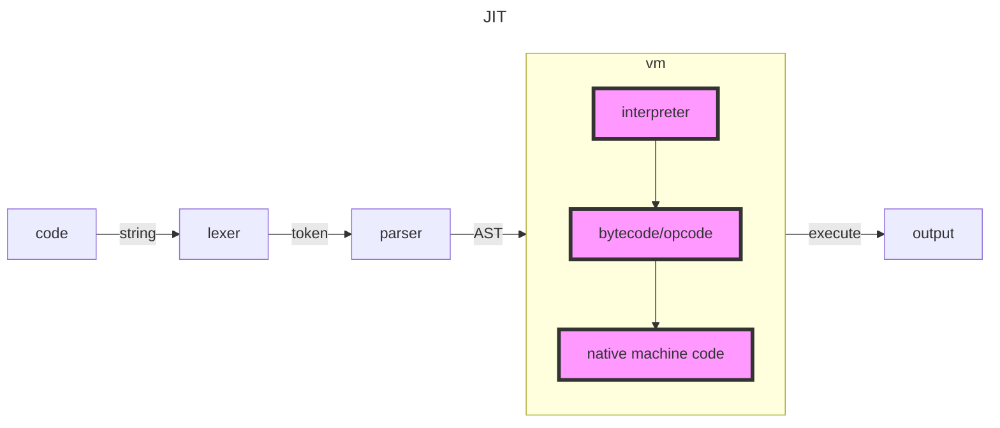

# Strategies of Evaluation

Evaluation is where interpreter implementations diverge the most.There are a lot of different strategies to choose from when evaluating source code.so looking at different options is worthwhile.

Before we start, though, it's also worthy noting again **that the line between interpreter and compiler is a blurry one.**

## tree-walking interpreter

the most obvious and classical choice of what to do with the AST is to just interpret it. Traverse the AST,visit each node and do what the node signifies: print a string,add two number, execute a function's body.Sometimes their evaluation is preceded by small optimization that rewrite the AST(e.g. remove unused variable bindings) or convert it into another `intermediate representation(IR)` that's more suitable for recursive and repeated evaluation.

## bytecode

Other interpreter also traverse the AST, but instead of interpreting the AST itself they first convert it to `bytecode`. Bytecode is another `IR` of the AST and a really dense one at that. The exact format and the `opcodes`(the instructions that make up the bytecode) it is composed of vary and depend on the guest and host programming languages.**In general though, the opcodes are pretty similar to the mnemonics of most assembly languages;**It's safe bet to say that most bytecode definitions contain opcodes for `push` and `pop` to do stack operations.But bytecode is not native machine code, nor is it assembly language.It can't and won't be executed by the operating system and the CPU of the machine where the interpreter is running on.**Instead it's interpreted by a virtual machine, that's the part of the interpreter.**Just like VMWare and VirtualBox emulate real machines and CPUs, these virtual machine emulate a machine that understands this particular bytecode format.This approach can yield great performance benefits.

## JIT

A variation of this strategy doesn't involve an AST at all. Instead of building an AST the parser emits bytecodes directly.

In this situation, it is more like a compiler. As we mentioned before, the line becomes blurry.

And to make it even more fuzzy, consider this: some implementations of programming languages parse the source code, build an AST and convert this AST to bytecode.But instead of executing the operations specified by the bytecodes directly in a virtual machine, the virtual machine then compiles the bytecode to native machine code, right before is executed - **just in time**. This is called a `JIT` interpreter/compiler.

The choice of which strategy to choose largely depends on performance and portability needs, the programming launage that's being interpreted and howw far you're willing to go.
