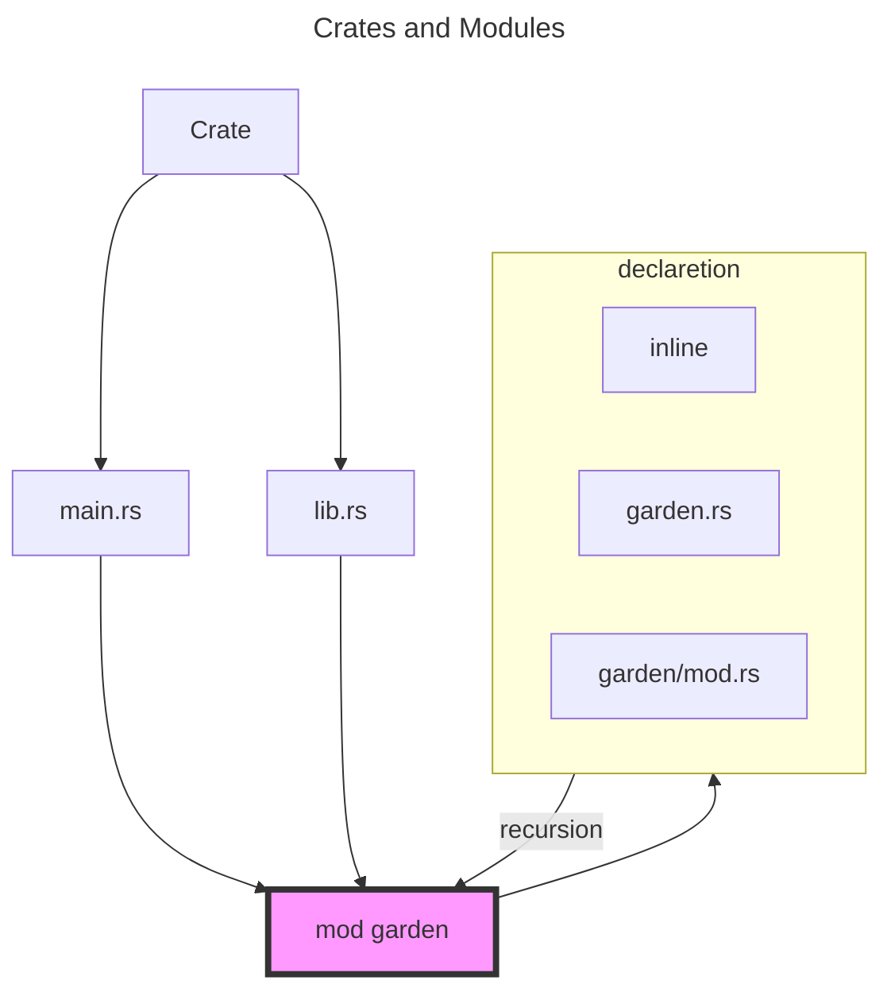

# The Crate Package and Moudle in Rust

## References

[Defining Modules to Control Scope and Privacy](https://doc.rust-lang.org/stable/book/ch07-02-defining-modules-to-control-scope-and-privacy.html)

[test rust crate](https://github.com/0x822a5b87/test-rust-crate)

## Declaring modules

### Modules Cheat Sheet

- **Start from the crate root**: When compiling a crate, the compiler first looks in the crate root file (usually *src/lib.rs* for a library crate or *src/main.rs* for a binary crate) for code to compile.
- **Declaring modules**: In the crate root file, you can declare new modules; say you declare a “garden” module with `mod garden;`. The compiler will look for the module’s code in these places:
  - Inline, within curly brackets that replace the semicolon following `mod garden`
  - In the file *src/garden.rs*
  - In the file *src/garden/mod.rs*
- **Declaring submodules**: In any file other than the crate root, you can declare submodules. For example, you might declare `mod vegetables;` in *src/garden.rs*. The compiler will look for the submodule’s code within the directory named for the parent module in these places:
  - Inline, directly following `mod vegetables`, within curly brackets instead of the semicolon
  - In the file *src/garden/vegetables.rs*
  - In the file *src/garden/vegetables/mod.rs*

> According to the preceding description, there are 3 types of approach to define a modules like this: `garden::vegetables::Asparagus`.

### Illustration




### Inline

Here, we create a lib crate named backyard. The crate's directory, also named backyard, contains these files and directories:

```
backyard
├── Cargo.lock
├── Cargo.toml
└── src
    └── lib.rs
```

Filename : `src/lib.rs`

```rust
fn main() {
    let plant = garden::vegetables::Asparagus {};
    println!("I'm growing {plant:?}!")
}

mod garden {
    pub mod vegetables{
        #[derive(Debug)]
        pub struct Asparagus {}
    }
}
```

### In the file src/garden.rs

```
backyard
├── Cargo.lock
├── Cargo.toml
└── src
    └── lib.rs
    └── garden.rs
```

Filename : `src/lib.rs`

```rust
mod garden;

fn main() {
    fn main() {
        let plant = garden::vegetables::Asparagus {};
        println!("I'm growing {plant:?}!")
    }
}
```

Filename : `src/garden.rs`

```rust
pub mod vegetables {
    #[derive(Debug)]
    pub struct Asparagus {}
}
```

### In the file src/garden/mod.rs

```
backyard
├── Cargo.lock
├── Cargo.toml
└── src
    ├── garden
    │   └── vegetables.rs
    ├── garden.rs
    └── main.rs
```

Filename : `src/lib.rs`

```rust
mod garden;

fn main() {
    fn main() {
        let plant = garden::vegetables::Asparagus {};
        println!("I'm growing {plant:?}!")
    }
}
```

Filename: src/garden.rs

```rust
pub mod vegetables;
```

Here, `pub mod vegetables;` means the code in *src/garden/vegetables.rs* is included too. That code is:

```rust
#[derive(Debug)]
pub struct Asparagus {}
```

