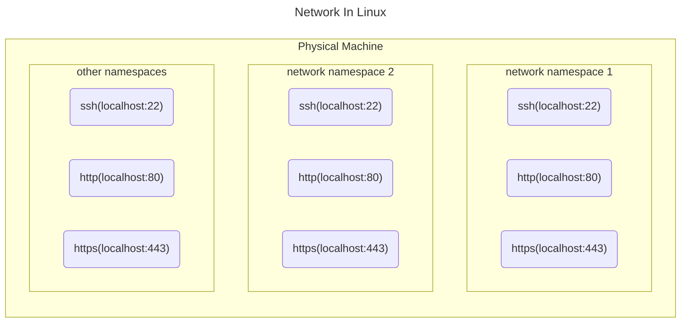
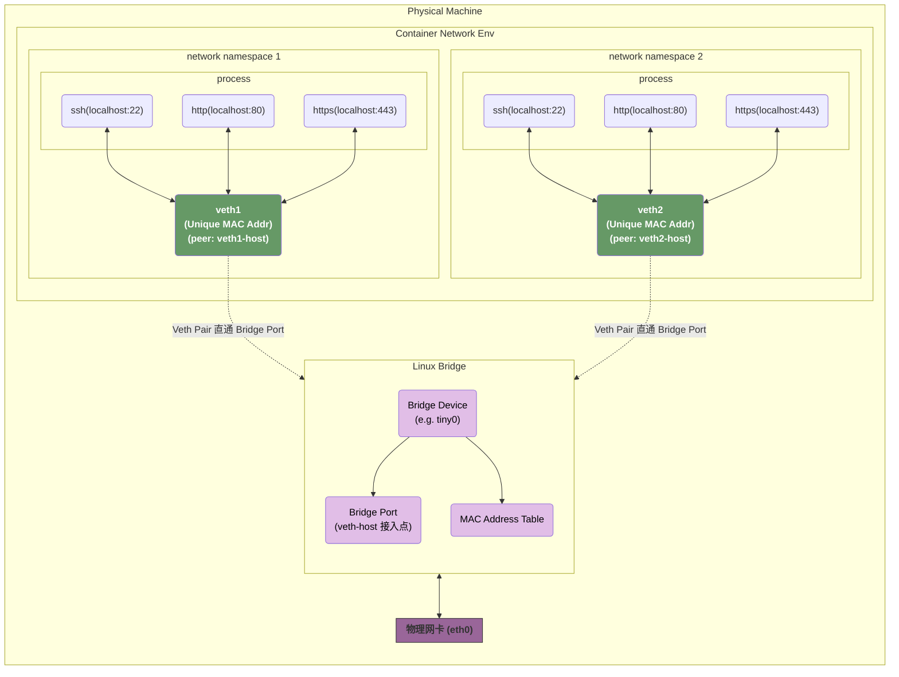
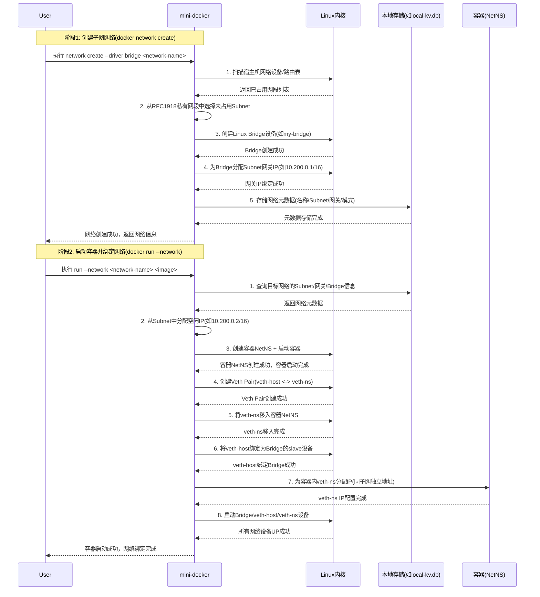

>   **需要注意的是，linux下的网络编程是一个非常琐碎的过程，所以我们在这里只是实现了最简单的版本：**
>
>   -   只支持 `IPv4`；
>   -   只支持通过 `Linux Bridge`/`Veth Pari`；
>   -   对 `Subnet` 的网段进行了限制，并且只允许通过后台默认分配，不允许用户自定义；
>
>   在实现的过程中，我们也有很多的地方因为太过于繁琐直接省略了：
>
>   -   对于我们分配网段/分配IP的管理，只记录在内存中，并没有做持久化；
>   -   虽然根据职责对系统进行了分层，但是整个的架构和接口设计都比较随意；
>   -   `EndpointId` 和 `ContainerId` 没有分开，也就限制了我们每个容器只能接入一个网络；
>   -   虽然对各个组件之间通过接口做了解耦，但是实际在代码实现中未实现完全解耦；
>   -   错误处理不严谨，很多地方在失败时都没有进行回滚操作；
>   -   没有增加跨子网路由，所以现在只能容器之间通信，而不能实现容器通过宿主机的网卡与外网通信。

在我们前面的文章 [build my own docker from scratch](https://0x822a5b87.github.io/2025/12/18/build-my-own-docker-from-scratch/) 中，我们实现了：

-   通过 `namespace` 对容器实现资源虚拟化；
-   通过 `cgroup` 对容器的资源进行限制和管理；
-   通过 `daemon` 进程来实现对整体资源的管理；

今天我们要开始实现一个对 `docker` 来说至关重要的特性：`network namespace` 的管理。从这一节，我们也可以体会到为什么我们要使用一个额外的 `daemon` 进程来对我们容器进行管理 -- 从之前的视角中，我们可以看到大量的缺点：

-   引入了额外的复杂性；
-   大量通过 `UDS` 通信导致的异步行为使得程序的编码和DEBUG都更加困难；
-   中心化的服务降低了程序的健壮性。

而这一切都是因为，**docker并不是一个无状态的程序**。在之前的逻辑中（`namespace` 和 `cgroup`），容器的 `UTS/挂载/进程` 等 namespace，以及 `CPU/内存` 等 cgroup 限制，**状态是「容器内局部的」**—— 每个容器的状态独立，全局仅需记录「容器 ID ↔ 资源句柄」的简单映射，甚至可以用 UUID 规避冲突，无需常驻进程维护。

此时即使没有 daemon，每次操作时从文件加载少量状态也完全可行。

而当我们引入到 `network` 之后，容器就从一个个 `孤岛` 变成了一个连通的结构，我们涉及到大量的状态：

-   网络是**全局共享资源**（如网桥、veth 对、路由表），不是某个容器的私有资源；
-   容器与网络的「接入关系」是**双向关联的**（网络要知道哪些容器接入，容器要知道自己属于哪些网络）；
-   IP 分配是**排他性的**（一个 IP 只能分给一个容器，需全局维护「IP ↔ 容器」的映射，避免冲突）。

这种全局、关联、排他的状态，**无法靠「每次启动加载文件」高效管理**—— 每次操作容器网络前，都要扫描全量文件、校验 IP 冲突、检查网络类型，这会导致操作延迟指数级上升；而 daemon 作为常驻进程，**将全量状态缓存在内存中**，可以实现毫秒级的状态查询和修改，这是文件存储无法替代的。

# 容器的网络

在一起开始之前，我们可以参考下面的一些关于linux的网络了解一下相关的基础知识：

-   [veth/eth](#veth/eth)
-   [linux bridge](#linux bridge)
-   [linux的网络](#linux的网络)
-   [网络层级的划分](#网络层级的划分)
-   [iptables](#iptables)
-   [二层协议中的IP地址](#二层协议中的IP地址)
-   [netlink和netns的使用](#netlink和netns的使用)

### 网络虚拟化技术

容器的网络虚拟化技术是基于 `veth`/`bridge`/`iptables` 等组件合作实现的，简单来说就是一个如下流程：

1.   为容器初始化 `network namespace`；
2.   在宿主机初始化 `linux bridge`；
3.   初始化一个 `Veth Pair`，假设他们分别是 `veth-host` 和 `veth-ns`：
     -   将 `veth-ns` 移入 `ns`，初始化并启动；
     -   将 `veth-host` 初始化并启动，并接入到 `bridge`；
     -   注意，这里只需要把 `veth-host` 接入到 `bridge`；
4.   **开启内核的 IP 转发功能**，否则 `iptables FORWARD` 链会默认拒绝转发流量；
5.   为我们的 `bridge` 配置 `iptables` 策略：
     -   配置 `MASQUERADE` ，它 属于 `nat` 表的 `POSTROUTING` 链，匹配容器网段的流量，且指定宿主机的出口网卡。该策略可以将请求包中的源地址转换成一个网络设备的地址，我们需要通过该策略将容器的IP（只在宿主机的bridge可用）转换为宿主机的真实IP；
     -   配置 `DNAT`，它属于 `nat` 表的 `PREROUTING` 链，匹配宿主机的监听端口，转发到容器的 IP 和端口。该策略可以更换目标地址，经常用于将内部网络地址的端口映射到外部，docker 中的绑定容器的虚拟端口到宿主机的物理端口就是通过它来实现的。
     -   配置 `filter` 表 `FORWARD` 链允许容器网段的流量转发。

#### 一个简单的例子

我们使用下面的命令在 `docker` 下初始化一个容器：

```bash
docker network create -d bridge my-net
docker run --network=my-net -it busybox
```

那么，`docker` 的实际操作流程如下：

##### 创建 bridge 网络（`docker network create`）

当我们执行 `docker network create -d bridge my-net` 的时候，我们会做几件事：

-   在宿主机创建一个名为 `br-<network_id前12位>` 的 linux bridge，注意，bridge 的后缀是网格ID而不是容器ID；
-   将这个 bridge 注册到 `docker` 中；
-   Docker 对 bridge 网络的网段分配遵循「从 `172.17.0.0/16` 开始，依次递增第二个八位组」，规则是
    -   第一个 bridge 网络（默认 bridge）：`172.17.0.0/16`；
    -   第二个 bridge 网络（my-net）：`172.18.0.0/16`；
    -   第三个 bridge 网络：`172.19.0.0/16`；
    -   本质是`172.x.0.0/16` 中 `x` 从 17 开始递增
-   开启 `bridge`；
-   配置 `iptables` 的基础规则；

```bash
# 查看 my-net 相关信息
docker network inspect my-net
```

这里需要注意的有几个地方：

1.   `Id` 字段是该网络的唯一标识，宿主机网桥名 = `br-` + `Id的前12位`，这是关联 Docker 网络名和宿主机网桥的关键；
2.   `Subnet` 是该网络的私有网段，`Gateway` 是网桥的 IP（容器的默认网关会指向该地址）；

这里我们简单描述一下 `Subnet` 和 `Gateway` 的区别：

| 维度               | **Subnet（子网）**                                           | **Gateway（网关）**                                          |
| ------------------ | ------------------------------------------------------------ | ------------------------------------------------------------ |
| **本质**           | 一个**连续的 IP 地址集合**，划定网络的地址边界               | 子网内的一个**具体 IP 地址**，是子网的「进出口」             |
| **作用**           | 1. 限定该网络内容器可分配的 IP 范围；<br/>2. 同一子网内的容器可直接通过二层（MAC 地址）通信，无需路由 | 1. 作为子网内设备访问**外网 / 其他子网**的转发节点；<br/>2. 作为外网数据包进入子网的接收节点；<br/>3. 在 Docker 中，网关 IP 就是 `bridge` 网桥的 IP |
| **是否是具体 IP**  | 否，是一个范围（如 `172.18.0.0/16`）                         | 是，且必须属于当前子网（如 `172.18.0.1`）                    |
| **是否分配给容器** | 不直接分配，容器 IP 是从这个范围里选取的**可用 IP**          | 不会分配给容器，是网桥的专属 IP，保留作为转发入口            |

1.   `Subnet` 是一个子网访问，例如 `172.18.0.0/16` 表示的就是 `172.18.0.1` 到 `172.18.255.254` 这个范围，同一子网内的容器（如 `172.18.0.2` 和 `172.18.0.3`）通信时，直接通过 `bridge` 的二层 MAC 转发，不需要经过网关：
     -   在 IPv4 中，`Subnet` 的第一个子网地址 `172.18.0.0` 是**网络地址**，它的作用是**标识整个子网**，而非给单个设备使用；对于 `172.18.0.0/16` 这个子网：
         -   子网掩码是 `255.255.0.0`；
         -   把 IP 地址和子网掩码做**按位与运算**，得到的结果就是网络地址；
         -   示例：`172.18.0.2 & 255.255.0.0 = 172.18.0.0`。
     -   子网的**最后一个 IP 地址 -- 在这里是 `172.18.255.255` ，它是「广播地址」**，它的作用是**向子网内所有设备发送消息**，同样不能分配给单个设备。同样对于 `172.18.0.0/16` 子网：
         -   广播地址的特点：**主机位全为 1**（`172.18.255.255` 的后 16 位全为 1）。
         -   作用：当设备发送数据包到 `172.18.255.255` 时，子网内所有设备都会收到这个数据包（比如 ARP 广播请求）。
         -   注意：如果把这个地址分配给网卡，设备会收到大量无关的广播包，同时自身发送的数据包也会被识别为广播流量，导致网络混乱。
2.   `Gateway` 是这个子网的网关 -- 他是宿主机 `br-01077ba8fade` 的 bridge 的IP地址：
     -   当容器要访问外网（比如 `8.8.8.8`）时，因为目标 IP 不在 `172.18.0.0/16` 子网内，容器会把数据包发给网关 `172.18.0.1`；
     -   网关（网桥）收到数据包后，通过宿主机的 `iptables` 规则（`MASQUERADE`）做源地址转换，再转发到外网；
     -   外网的响应数据包返回时，会先到达网关，网关再把数据包转发给对应的容器；
     -   **也就是说，网关是这个子网和外网通信时所有数据包的入口和出口**；
3.   一个简单的比喻：
     -   我们可以把 `Subnet` 看做一个小区，小区的门牌号就是我们的IP地址；
     -   当我们在小区内通信时，可以通过IP地址直接进行通信；
     -   但是，当我们要和其他的小区通信时，所有的用户都必须先从小区大门 --  `Gateway` 出去，也就是 `172.18.0.1`。而当有人要向小区内的其他人发送信息；也必须先将数据发送到小区大门 -- `Gateway`，由 `Gateway` 转发给其他的用户。

```json mark:4,10-14
[
    {
        "Name": "my-net",
        "Id": "01077ba8fade93b848c68610838382d86fd75256e186e5843837bab8b604655f",
        "Driver": "bridge",
        "IPAM": {
            "Driver": "default",
            "Options": {},
            "Config": [
                {
                    "Subnet": "172.18.0.0/16",
                    "IPRange": "",
                    "Gateway": "172.18.0.1"
                }
            ]
        },
        "Status": {
            "IPAM": {
                "Subnets": {
                    "172.18.0.0/16": {
                        "IPsInUse": 3,
                        "DynamicIPsAvailable": 65533
                    }
                }
            }
        }
    }
]
```

随后，我们可以使用我们得到的信息去查找宿主机的 `bridge`

```bash
BR_NAME="br-$(docker network inspect my-net -f '{{.Id}}' | cut -c1-12)"

ip link show $BR_NAME
```

就可以得到宿主机 bridge 的信息了：

```
55: br-01077ba8fade: <NO-CARRIER,BROADCAST,MULTICAST,UP> mtu 1500 qdisc noqueue state DOWN mode DEFAULT group default
    link/ether 52:21:8a:86:24:87 brd ff:ff:ff:ff:ff:ff
```

##### 启动容器

-   为容器创建独立的 `network namespace`（路径：`/var/run/docker/netns/xxxxxx`）；
-   创建 veth pair（如 `vethxxxx`/`eth0`）；
-    将 veth pair 的一端（`eth0`）移入容器 ns，配置 IP（如 `172.18.0.2/16`）、网关（`172.18.0.1`，即 bridge 的 IP）；
-   将 veth pair 的另一端（`vethxxxx`）留在宿主机 ns，接入 `br-xxxxxx` bridge 并启动；
-   自动开启内核 `ip_forward`；
-   配置 iptables 规则：
    -   `nat` 表 `POSTROUTING` 链添加 `MASQUERADE`（容器上网）；
    -   `filter` 表 `FORWARD` 链允许容器流量转发。

### 如何通过veth和bridge实现网络通信（命令行）

 在 `linux` 中，由于 `network namespace` 的存在，在不同的 `network namespace` 下他们可能出现使用同一个端口的情况：



然而，这也引入了一些问题：

1.   通常来说，一个虚拟的端口一定会需要绑定到一个物理机上的物理端口（这里暂时不考虑处于负载均衡目的的开启 `SO_REUSEPORT` 的情况），不同的 network namespace 下直接去绑定到同一个物理端会引起端口冲突；
2.   假设进程间需要和物理机内部的其他进程通信，或者和物理机外部的其他物理机通信，他自身又不存在一个物理网卡，他应该怎么确定自己的地址呢？他应该怎么确定通信的目标机器的地址呢？（这里需要注意的是，对于这个虚拟出来的容器来说，和物理机内部的其他容器通信以及和物理机外部的其他物理机通信，这两个场景它是不需要区分的 -- 通过 veth 它可以把两种场景都看做是和外部机器通信）；

在这种场景下，`linux` 可以使用 `veth` + `linux bridge` 的方式来解决这些问题。

1.   首先是 `veth`，对容器而言，就是它的「虚拟网卡」，且有全局唯一的 MAC 地址
     -   容器的 `network namespace` 里，被移入的 `veth` 一端会被重命名为 `eth0`，对容器来说，它就是一块「物理网卡」—— 有自己的 **MAC 地址**（由内核随机生成，物理机内全局唯一），也会配置独立的 IP 地址。
     -   这个 MAC 地址是 Linux Bridge 转发数据包的核心依据（就像物理交换机靠 MAC 地址识别物理机一样）。
2.   Bridge 是物理机内的「二层消息中转站」，转发目标是物理机内的网络设备
     -   容器的数据包会先发送到 Bridge，Bridge 会查询自己的 **MAC 地址表**：
         -   如果找到目标 MAC 对应的设备（比如另一容器的 Veth 宿主机端），就直接转发给该设备；
         -   如果没找到，就向所有接入 Bridge 的设备泛洪（除了源设备）；
     -   **注意**：Bridge 本身只负责**物理机内的二层转发**，无法直接把数据包发到其他物理机。想要跨物理机通信，需要宿主机的三层转发能力（IP 转发 + 路由表），或者叠加 VXLAN 这类隧道技术。
3.   外部消息到达物理网卡后，转发逻辑分两种情况：
     -   **情况 1：目标是物理机内的容器**：外部数据包到达物理网卡后，内核会先判断目标 IP 属于容器网段。此时内核会通过 `iptables` 的 DNAT 规则（如果配置了端口映射），将数据包的目标地址转换为容器的 IP，再交给 Bridge，由 Bridge 转发到对应容器的 Veth 设备。
     -   **情况 2：目标是外网**：容器的数据包通过 Bridge 到达宿主机后，内核会开启 IP 转发，将数据包从 Bridge 转发到物理网卡，再发送到外部网络（这个过程需要 `iptables` 的 SNAT/MASQUERADE 规则做地址转换）。

在引入了 `veth` 和 `linux bridge` 之后，我们的网络架构图就变成了这样：



#### 使用脚本实现ns之间的网络通信

>   `ip` 是一个比较实用比较复杂的工具，涉及到大量的不同协议，可以参考官方文档：[ip-link(8)](https://man7.org/linux/man-pages/man8/ip-link.8.html) 以及 [ip-netns(8)](https://man7.org/linux/man-pages/man8/ip-netns.8.html)

#### 创建 network namesace

```bash
sudo ip netns add ns1
sudo ip netns add ns2

sudo ip netns list
# ns2
# ns1
```

#### 创建linux bridge

```bash
# create bridge tiny0
sudo brctl addbr tiny0
# start bridge tiny0
sudo ip link set tiny0 up
# set ip addr for bridge(as container gateway)
sudo ip addr add 172.17.0.1/24 dev tiny0

# check if the bridge is setup successively
sudo brctl show
# bridge name	bridge id		STP enabled	interfaces
# docker0		8000.de62ddc504d4	no		veth2c5eba7
# 							veth5e9a68c
# tiny0		8000.5e1c0d0486be	no
```

#### 为ns1创建veth pair并接入bridge

这里值得注意的几点是：

1.   `ip link` 创建 `veth` 的最开始，只是创建了一个双向的 `veth`：
     -   一端是 `veth1-host`，还没有接入到 bridge；
     -   一端是 `veth1-ns`，还没有移入命名空间；
2.   `network namespace` 中的 `veth1-ns`，在移动到 `ns1` 之后，它就必须通过 `ip netns exec ns` 先切换到 `ns1` 这个 namespace 之后才能操作；这个和 `docker exec` 其实异曲同工；
3.   为 `eth0` 绑定IP地址：
     -   `172.17.0.x` 属于 **RFC 1918 定义的私有 IP 网段**（仅内网使用，无法直接访问公网）：
         -   范围：`172.16.0.0 - 172.31.255.255`；
         -   选择这个网段的原因：Docker 官方默认的容器网段就是 `172.17.0.0/16`，属于行业通用习惯，避免和宿主机 / 公网 IP 冲突。
     -   `172.17.0.1` 是**Linux Bridge（tiny0）的 IP 地址**，也是容器的「默认网关」：
         -   容器发往「非本网段」的数据包（比如访问外网 `220.181.38.148`），会默认发给 `172.17.0.1`（网桥），由网桥 / 宿主机负责转发；
         -   是该网段的「网关地址」，通常网段的第一个可用 IP（`.1`）会分配给网关，属于行业通用约定。
     -   `172.17.0.2/24` 这个地址中，`2` 是该 IP 地址的**主机位**，用于在同一网段内唯一标识这个容器（类比小区门牌号，`172.17.0` 是小区名，`2` 是具体户号）；
     -   `24` 是**子网掩码的简写**（也叫 CIDR 标识），表示 `255.255.255.0`—— 意味着 `172.17.0.0` 到 `172.17.0.255` 都属于同一个二层网段，这个范围内的 IP 可直接互通（无需路由器转发）。
     -   `172.17.0.0/16` 和 `172.17.0.2/24` 中的 `16` 和 `24` 表示**子网掩码的二进制位数**：
         -   IP 地址本质是 32 位二进制数（如 `172.17.0.0` = 10101100.00010001.00000000.00000000）；
         -   `/16` 表示：前 16 位是「网络位」（固定不变，标识网段），后 16 位是「主机位」（可分配给设备）；
         -   对应子网掩码：`255.255.0.0`，该网段范围是 `172.17.0.0 - 172.17.255.255`（共 65534 个可用主机 IP）。

```bash
# 创建一个类型为 veth 的设备， 其中一端是 veth1-host，另一端是 veth1-ns 
# 注意，这里只是创建了一个双向的 veth，未移入网络命名空间、未接入网桥。
# 
# ip link add DEVICE type { veth | vxcan } [ peer name NAME ]
sudo ip link add veth1-host type veth peer name veth1-ns

# 将设备 veth1-ns 移入 namespace ns1
# ip link set { DEVICE | group GROUP } [ netns { PID | NETNSNAME | NETNSFILE } ]
sudo ip link set veth1-ns netns ns1

# 接下来的命令：
# 1. 前面的 ip netns exec `ns1` 是 ip-netns 的命令，切换到 `ns1` 这个隔离的网络命名空间中执行后续命令；
# 2. 跟在 `ns1` 后面的是 ip-link ip 相关的命令。
# ip [-all] netns exec [ NETNSNAME ] command...

# 将 ns1 内的 veth1-ns 改名为 eth0
sudo ip netns exec ns1 ip link set veth1-ns name eth0
# 启用 eth0
sudo ip netns exec ns1 ip link set eth0 up

# 这里又变成 ip-addr 的命令了
# ip address { add | change | replace } IFADDR dev IFNAME [ LIFETIME ] [ CONFFLAG-LIST ]

# 为 eth0 绑定 IP 地址
sudo ip netns exec ns1 ip addr add 172.17.0.2/24 dev eth0
sudo ip netns exec ns1 ip route add default via 172.17.0.1

# 启动 veth1-host
sudo ip link set veth1-host up
# 接入 veth1-host 到 bridge tiny0
sudo brctl addif tiny0 veth1-host
```

#### 为ns2创建veth pair并接入bridge

```bash
# 1. 创建 Veth Pair
sudo ip link add veth2-host type veth peer name veth2-ns

# 2. 移入 ns2
sudo ip link set veth2-ns netns ns2

# 3. 配置 ns2 内的网卡
sudo ip netns exec ns2 ip link set veth2-ns name eth0
sudo ip netns exec ns2 ip link set eth0 up
sudo ip netns exec ns2 ip addr add 172.17.0.3/24 dev eth0
sudo ip netns exec ns2 ip route add default via 172.17.0.1

# 4. 接入网桥
sudo ip link set veth2-host up
sudo brctl addif tiny0 veth2-host
```

#### 验证跨ns通信

```bash
sudo ip netns exec ns1 ping 172.17.0.3
# PING 172.17.0.3 (172.17.0.3) 56(84) bytes of data.
# 64 bytes from 172.17.0.3: icmp_seq=1 ttl=64 time=0.052 ms
# 64 bytes from 172.17.0.3: icmp_seq=2 ttl=64 time=0.063 ms

sudo ip netns exec ns2 ping 172.17.0.2
# PING 172.17.0.2 (172.17.0.2) 56(84) bytes of data.
# 64 bytes from 172.17.0.2: icmp_seq=1 ttl=64 time=0.033 ms
# 64 bytes from 172.17.0.2: icmp_seq=2 ttl=64 time=0.050 ms
```

#### 总结

-   将一个veth接入到bridge的过程可以简述为：
    1.   创建 namespace；
    2.   创建 bridge；
    3.   创建双端veth；
    4.   分别将veth的两端移入ns、接入bridge。
-   `172.16.0.0 - 172.31.255.255` 这个地址段是**RFC 1918 定义的私有 IP 网段**（仅内网使用，无法直接访问公网），但是Docker 官方默认的容器网段就是 `172.17.0.0/16`（他在这个网段之内），所以一般来说当实现veth时都以这个网段作为地址，通常按照以下约定：
    -   `172.17.0.1` 作为 bridge 的网关地址；
    -   `veth` 地址从 `172.17.0.2` 开始向上递增分配。

### 通过veth和bridge实现网络通信（golang）

在 [如何通过veth和bridge实现网络通信（命令行）](#如何通过veth和bridge实现网络通信（命令行）) 这一小节中，我们通过 `shell` 实现了这个网络通信的逻辑，现在我们通过 `golang` 代码来实现这个逻辑。

-   `Veth Pair` 是在两层网络上通信，它们使用的是MAC地址。需要注意的是，我们在程序里分配了IP地址，只是因为很多 `PING` 之类的程序依赖，并不意味着 `Veth Pair` 需要这个MAC地址；

#### 创建 network namesace

创建 `ns` 和脚本直接基于 `ip netns exec` 来实现不一样，`netns` 需要如下操作：

1.   获取当前所在的 `ns`；
2.   创建新的 `ns`，这里 `netns` 在创建后会自动切换到这个创建的 `ns`；
3.   回到开始的 `ns`；

```go mark:7, 14, 18
func CreateNs(newNsName string) {
	// Lock the OS Thread so we don't accidentally switch namespaces
	runtime.LockOSThread()
	defer runtime.UnlockOSThread()

	// Save the current network namespace
	origins, err := netns.Get()
	if err != nil {
		log.Printf("%v\n", err)
	}
	defer func() { _ = origins.Close() }()

	// Create a new network namespace
	newNs, _ := netns.NewNamed(newNsName)
	defer func() { _ = newNs.Close() }()

	// return to origin ns
	if err = netns.Set(origins); err != nil {
		log.Printf("%v\n", err)
	}
}
```

#### 创建 linux bridge

创建 `bridge` 的逻辑非常简单，只需要通过 `netlink` 库提供的 `LinkAdd` 创建即可：

```go mark: 10
func CreateBridge(name string) {
	link, _ := netlink.LinkByName(name)
	if link != nil {
		return
	}

	attrs := netlink.NewLinkAttrs()
	attrs.Name = name
	bridge := &netlink.Bridge{LinkAttrs: attrs}
	if err := netlink.LinkAdd(bridge); err != nil {
		log.Printf("%v\n", err)
	}
}
```

#### 创建Veth Pair

这里是和通过脚本创建差别最大的一步：

-   通过脚本创建：我们是分别创建 `ns1` 和 `ns2` 接入到 `bridge`；
-   通过go创建：这里为了简化逻辑，我们先创建了一个 `vethNs` ，并且将它和 `ns` 的 `NsFd` 绑定作为一个参数传递给了 `vethHost`。这样 `netlink` 会自动的为我们处理将 `vethNs` 移动到 `ns` 的操作以及 `Veth Pari` 的构造；

```go mark:6-13
func CreateVethPair(vethNs, vethHost, nsName string) {
	ns, err := netns.GetFromName(nsName)
	if err != nil {
		log.Printf("%v\n", err)
	}
	la := netlink.LinkAttrs{
		Name:      vethNs,
		Namespace: netlink.NsFd(ns),
	}
	veth := &netlink.Veth{
		LinkAttrs: la,
		PeerName:  vethHost,
	}
	if err = netlink.LinkAdd(veth); err != nil {
		log.Printf("%v\n", err)
	}
	log.Printf("Created veth pair: %s and %s\n", vethNs, vethHost)
}
```

#### 将vethHost绑定到bridge

随后，我们需要将 `vethHost` 绑定到 `bridge`，**简单来说，就是将  `bridge` 设置为 `vethHost` 的 `master`**：

-   **master 设备**：通常是具备「转发 / 交换能力」的网络设备（比如 `bridge`、`bond`、`vlan` 等）；
-   **slave 设备**：普通的网络接口（比如 `eth1`、`veth-host`），被挂载到 master 设备下，其所有网络流量都会由 master 设备接管处理。

```go
func SetMaster(vethName string, bridgeName string) {
	link, err := netlink.LinkByName(bridgeName)
	if err != nil {
		log.Printf("%v\n", err)
		return
	}
	bridge, ok := link.(*netlink.Bridge)
	if !ok {
		log.Printf("%s is not bridge", bridgeName)
		return
	}
	veth, err := netlink.LinkByName(vethName)
	if err != nil {
		log.Printf("%v\n", err)
		return
	}
	err = netlink.LinkSetMaster(veth, bridge)
	if err != nil {
		log.Printf("%v\n", err)
		return
	}
}
```

#### 将所有的设备状态设置为UP

这里唯一需要注意的就是：**必须先启动bridge。**

```go
func SetUpStatus(bridgeName, vethHost, vethNs, nsName string) error {
	if err := setupLinkByName(bridgeName); err != nil {
		return err
	}

	if err := setupLinkByName(vethHost); err != nil {
		return err
	}

	runtime.LockOSThread()
	defer runtime.UnlockOSThread()

	origins, newNs, err := enterNs(nsName)
	if err != nil {
		return err
	}
	defer func() { _ = exitNs(origins, newNs) }()

	return setupLinkByName(vethNs)
}
```

#### 初始化bridge和vethNs的IP

```go mark:7,16,17,46,55,56
func SetBridgeIP(bridgeName, ipWithCIDR string) error {
	bridge, err := netlink.LinkByName(bridgeName)
	if err != nil {
		return err
	}

	ipNet, err := netlink.ParseIPNet(ipWithCIDR)
	if err != nil {
		return err
	}
	ipAddr := &netlink.Addr{
		IPNet: ipNet,
		Peer:  nil,
	}

	_ = netlink.AddrDel(bridge, ipAddr)
	return netlink.AddrAdd(bridge, ipAddr)
}

func SetVethIPInNS(nsName, vethName, ipWithCIDR string) error {
	targetNS, err := netns.GetFromName(nsName)
	if err != nil {
		return err
	}
	defer targetNS.Close()

	currentNS, err := netns.Get()
	if err != nil {
		return err
	}
	defer currentNS.Close()

	runtime.LockOSThread()
	defer runtime.UnlockOSThread()

	if err := netns.Set(targetNS); err != nil {
		return err
	}
	defer netns.Set(currentNS)

	veth, err := netlink.LinkByName(vethName)
	if err != nil {
		return err
	}

	ipNet, err := netlink.ParseIPNet(ipWithCIDR)
	if err != nil {
		return err
	}
	ipAddr := &netlink.Addr{
		IPNet: ipNet,
		Peer:  nil,
	}

	_ = netlink.AddrDel(veth, ipAddr)
	return netlink.AddrAdd(veth, ipAddr)
}

```

#### 启动

使用如下参数启动我们的程序

```go
func main() {
	bridge := "my-bridge"
	ns := "my-ns"
	vethHost := "my-veth-host"
	vethNs := "my-veth-ns"
	bridgeIP := "10.200.0.1/16"
	vethNsIP := "10.200.0.2/16"
}
```

#### 测试

现在我们的全部逻辑已经完成了，我们可以开启两个终端进行测试：

在第一个终端中：

```bash
sudo ip netns exec my-ns nc -ul 10.200.0.2 8080
```

在第二个终端中：

```bash
echo "hello from host" | nc -u 10.200.0.2 8080
```

### 容器网络的设计

#### 容器网络的操作

当我们在创建并使用一个容器的网络时，我们的操作流程大概是这样的：

1.   通过 `docker network create` 一个子网网络：
     1.   和内核通信，向内核申请一个尚未被占用的 `Subnet`；
          -   优先从 **RFC 1918 私有网段**中选择（`10.0.0.0/8`、`172.16.0.0/12`、`192.168.0.0/16`）；
          -   会扫描宿主机已有的网络设备、路由表，**避开已占用的网段**；
          -   存储时，通常会把子网、网关、网桥名称、网络模式等信息存在本地数据库（比如 Docker 的 `/var/lib/docker/network/files/local-kv.db`），供后续容器复用。
     2.   使用我们申请的这个 `Subnet` 创建目标网络，例如docker支持了 `bridge`，`host`，`none` 等不同的网络模式，在我们的 `mini-docker` 中，我们只提供 `Linux Bridge` 支持；
     3.   初始化 `bridge`，并为它分配 `Subnet` 中的 `Gateway` 地址；
     4.   将我们申请得到的 `Subnet`，网络模式等信息存储下来留给后续的容器复用；
2.   通过 `docker run --network <network>` 指定容器连接的网络：
     1.   和 `docker` 通信，申请得到一个对应网络下的 `Subnet` 的 IP；
     2.   启动容器；
     3.   生成一个 `Veth Pair` 对，将其中一端移入容器的ns，另外一端绑定到 `bridge`。注意，这里我们可以只为 `ns` 中的 `veth` 分配IP地址；
          -   容器内的 `veth-ns`：必须分配 IP（同子网内的独立地址），用于三层通信；
          -   宿主机侧的 `veth-host`：**无需分配 IP**，因为它被绑定为网桥的 `slave` 设备（通过 `netlink.LinkSetMaster` 实现），流量由网桥（网关）接管。
          -   这样做的好处：减少 IP 资源浪费，避免宿主机侧的 IP 冲突，同时简化网络配置。
     4.   对 `Veth Pair` 执行其他相关的初始化。

这样，我们就为我们的容器实现了一个网络分配策略。



#### 容器网络的需求分析

按照我们在 [容器网络的操作](#容器网络的操作) 中的描述，我们可以抽象出一下几个模块：

-   `Endpoint` 每个容器，如果它想要接入到网络，那就必须为他分配 `IP`，`MAC`，`PortMapping` 等信息，我们将这些信息组合起来放在一起；
-   `Network` 我们申请的 `Subnet`，我们需要记录它的名字，网段（IPRange）等信息；
-   `NetworkDriver` 这个模块会负责和内核通信来实现：网络的创建、连接、销毁，不同的类型会有不同的策略，对于 `mini-docker` 来说，只支持 `bridge` 类型：
    -   创建时，先读取内部已分配的 `Subnet`，并根据内部已经分配的 `Subnet` 来避免和其他的网段冲突，最终会返回一个包含了当前 `Subnet` 全部信息的结构体 `Network`，我们还需要将这些信息存到我们本地的数据库；
    -   销毁时，我们需要断开所有已连接的 `Endpoint`，并将 `Network` 中所有的 `IP` 释放，这样后续新的网段建立时可以复用；
    -   连接时，将我们 `Endpoint` 中的 `Device` 接入网络，对于 `bridge`，就是我们前面提到的 `Veth Pair` 的建立和初始化。这里指的注意的是，每个 `Network` 只会有一个 `bridge`，只需要在创建时初始化，后续 `Endpoint` 接入时只需要把一端移入ns，另外一端设置为 `bridge` 的 slave 即可；
    -   删除节点时，我们将 `Endpoint` 从 `Network` 中断开，回收它的IP地址，并将 Veth Pair 删除即可。
-   `IPAM` 这个模块负责IP的分配和回收，通常来说，他会和 `Network` 协作，他需要记录当前 `Network` 下可用的IP地址，随着容器的创建和销毁动态的更新。

|       模块        | 设计目标                                                     | 核心价值                                                     |
| :---------------: | :----------------------------------------------------------- | :----------------------------------------------------------- |
|   **Endpoint**    | 1. 容器网络的 “最小接入单元”，聚合 IP/MAC/PortMapping 等核心属性；<br/>2. 符合 “一个容器一个 Endpoint” 的直观逻辑；<br/>3. 天然适配 “多网卡容器”（一个容器可绑定多个 Endpoint 接入不同 Network） | 避免零散管理网络配置，所有和容器网络接入相关的信息都收敛到一个结构体，便于操作和追溯 |
|    **Network**    | 1. 抽象为 “网段 + 网络属性” 的集合，对应物理网络中的 “子网”；<br/>2. 绑定唯一 bridge（bridge 驱动），符合 “一个子网一个网桥” 的底层逻辑；<br/>3. 存储到本地数据库，实现网络元数据持久化 | 作为网络资源的 “顶层抽象”，隔离不同子网的资源（IP/bridge/Endpoint），避免跨网段冲突 |
| **NetworkDriver** | 1. 职责收敛到 “网络生命周期管理”（创建 / 销毁 / 连接 / 删除节点），符合 “单一职责原则”；<br/>2. bridge 驱动的实现逻辑完全对齐 Linux 网络底层（veth+bridge+slave）；<br/>3. 销毁时回收全量资源，避免内存泄漏 | 解耦 “网络驱动逻辑” 和 “IP 管理 / 元数据存储”，后续扩展驱动（如 macvlan）只需新增 Driver 实现，无需改动其他模块 |
|     **IPAM**      | 1. 独立负责 IP 分配 / 回收，和 Network 解耦（IPAM 只关注 IP 池，不关心网络类型）；<br/>2. 动态更新 IP 状态，适配容器的创建 / 销毁；<br/>3. 可复用不同 Network 的 IP 管理逻辑 | 避免 NetworkDriver 混入 IP 管理的复杂逻辑，同时支持 “自定义 IPAM 策略”（比如预分配 / 动态分配） |

#### 实体代码

这是对我们操作的两个对象：接入容器的网络和bridge网络的实体抽象；

```go
type Endpoint struct {
	Id      EndpointId `json:"id"`
	Name    string     `json:"name"`
	MAC     string     `json:"mac"`
	IP      *net.IP    `json:"ip"`
	Network *Network   `json:"network"`
}

type Network struct {
	Id      NetworkId   `json:"id"`
	Name    string      `json:"name"`
	Type    NetworkType `json:"type"`
	Gateway *net.IPNet  `json:"gateway"`
	IPNet   *net.IPNet  `json:"ip_net"`
}
```

以及我们对网络分配，网络驱动等的抽象：

```go
type IPAM interface {
	AllocateIP() (*net.IPNet, error)
	ReleaseIP(*net.IPNet) error
}

type NetworkDriver interface {
	Create(name string, subnet *net.IPNet) (*entity.Network, error)
	Delete(network *entity.Network) error
	Connect(network *entity.Network, endpoint *entity.Endpoint) error
	Disconnect(network *entity.Network, endpoint *entity.Endpoint) error
}
```

#### 持久化

此外，我们希望将我们的容器的状态是持久化的，所以我们抽象了额外了IO层来隔离实体和持久化操作：

-   上层的应用，只需要调用 `Get` 和 `Update` 等方法，就好像所有的数据全部在内存中；
-   当应用启动时， `Store` 的初始化会负责从文件或者其他的持久化设备加载被持久化的状态。

```go
type NetworkStore interface {
	GetAll() ([]*entity.Network, error)
	Get(networkId entity.NetworkId) (*entity.Network, error)
	Update(networkId entity.NetworkId, network *entity.Network) error
	Delete(networkId entity.NetworkId) error
	GetByName(name string) (*entity.Network, error)
}

type EndpointStore interface {
	Get(endpointId entity.EndpointId) (*entity.Endpoint, error)
	Update(endpointId entity.EndpointId, endpoint *entity.Endpoint) error
	Delete(endpointId entity.EndpointId) error
}

type IPAMStore interface {
	Get(networkId entity.NetworkId) (IPAM, error)
	Update(networkId entity.NetworkId, ipam IPAM) error
	Delete(networkId entity.NetworkId) error
}
```

这样，结合我们前面的 `Veth` 和 `Linux Bridge` 我们就可以实现网络通信了。

#### 通信

```bash
# 启动进程
go build -o mini-docker . && ./restart_daemon.sh
```

初始化一个网络，这里我们使用的 `docker` 的默认规则，以 `172.16.0.0/16` 作为初始子网向后递增：

```bash
./mini-docker network create --name mini-nw-1
```

查看我们的状态，应该已经正常拉起一个网络：

```bash
./mini-docker network inspect --name mini-nw-1 | jq
```

得到：

```json
{
  "id": "ab8f772817ce478ca0635d5573eb5bce",
  "name": "mini-nw-1",
  "type": "bridge",
  "gateway": {
    "IP": "172.19.0.1",
    "Mask": "//8AAA=="
  },
  "ip_net": {
    "IP": "172.19.0.0",
    "Mask": "//8AAA=="
  }
}
```

查看我们的状态：

```bash
ip addr show mini-nw-1
```

我们的状态应该还是 `UNKNOWN`，因为我们还没有完全正常的初始化它。

```
14: mini-nw-1: <BROADCAST,MULTICAST,UP,LOWER_UP> mtu 1500 qdisc noqueue state UNKNOWN group default qlen 1000
    link/ether 5e:4a:52:1b:45:53 brd ff:ff:ff:ff:ff:ff
    inet 172.19.0.1/16 brd 172.19.255.255 scope global mini-nw-1
       valid_lft forever preferred_lft forever
    inet6 fe80::5c4a:52ff:fe1b:4553/64 scope link proto kernel_ll
       valid_lft forever preferred_lft forever
```

我们需要手动的将我们的容器连接到网络：

```bash
./mini-docker network connect --network mini-nw-1 --container cf46d83277464108a410bc16d335d8a3
```

此时，通过 `exec` 进入到我们的容器，就可以通信了。

```bash
# 在容器中
nc -l 8080

# 在宿主机
nc -zv 172.21.0.2 8080
```

会得到HTTP连接成功的信息。

# QA

## netlink和netns的使用

### 创建一个bridge

```
package main

import (
    "fmt"

    "github.com/vishvananda/netlink"
)

func main() {
    la := netlink.NewLinkAttrs()
    la.Name = "foo"
    myBridge := &netlink.Bridge{LinkAttrs: la}
    err := netlink.LinkAdd(myBridge)
    if err != nil {
        fmt.Printf("could not add %s: %v\n", la.Name, err)
    }
    eth1, err := netlink.LinkByName("eth1")
    if err != nil {
        panic(err)
    }
    if err = netlink.LinkSetMaster(eth1, myBridge); err != nil {
        panic(err)
    }
}
```

在这段代码中，我们主要实现了：

1.  创建了名为 foo 的 bridge，使用la中的参数初始化； 
2.  将 eth1 设置为 bridge 的 master。

这里，我们需要先了解，什么是所谓的 `master`：在 Linux 网络设备的关系中，`master`（主设备）和 `slave`（从设备）是一对「隶属关系」：

-   **master 设备**：通常是具备「转发 / 交换能力」的网络设备（比如 `bridge`、`bond`、`vlan` 等）；
-   **slave 设备**：普通的网络接口（比如 `eth1`、`veth-host`），被挂载到 master 设备下，其所有网络流量都会由 master 设备接管处理。

对你这段代码来说：

-   `foo` 网桥是 **master（主设备）**：它是一个二层交换机，负责转发挂载到它身上的所有 slave 设备的流量；
-   `eth1` 是 **slave（从设备）**：挂载到 `foo` 网桥后，`eth1` 的所有入 / 出流量都会经过 `foo` 网桥的二层转发逻辑。

再结合我们前面的描述：

1.  挂载前：eth1 是独立网卡
    -   `eth1` 有自己的 IP 地址、MAC 地址，流量直接通过 `eth1` 进出，和其他网卡无关联；
    -   比如 `eth1` 收到一个目标 MAC 为 `00:11:22:33:44:55` 的数据包，会直接丢弃（因为不是自己的 MAC）。
2.  挂载后：eth1 成为网桥的「端口」
    -   `eth1` 会**失去独立的三层能力**（即使配置了 IP 也会失效，IP 应该配置在网桥上）；
    -   `foo` 网桥会接管 `eth1` 的所有二层流量：
        -   当 `eth1` 收到数据包时，网桥会查看自己的「MAC 地址表」，如果目标 MAC 对应其他 slave 端口（比如后续挂载的 `eth2`），就把数据包转发到该端口；
        -   如果目标 MAC 不在表中，网桥会通过所有 slave 端口（包括 `eth1`）广播这个数据包；
        -   最终实现「挂载到同一网桥的所有网卡（eth1、eth2 等）」在二层互通（相当于接入同一个交换机）。

>   可以说，这段代码和 `docker` 把 `veth-host` 接入到 `br-xxx` 网桥的逻辑完全一致。

-   Docker 中的 `br-xxx` 网桥 = 代码中的 `foo` 网桥（master）；
-   Docker 中的 `veth-host` 网卡 = 代码中的 `eth1`（slave）；
-   容器内的 `eth0` 能和其他容器通信，本质就是它们的 `veth-host` 都挂载到同一个网桥（master）下，由网桥转发流量。

但是我们这里机器上只有一个eth0，那就是我们的物理网卡，所以我们可以这样来做：

1.  创建一个ns命名空间 ns1；
2.  创建一个 Veth Pair，分别是 Veth-host 和 Veth-ns；
3.  将 Veth-ns 移入 ns1；
4.  使用我们前面的代码，将 Veth-host 设置为我们的网桥 foo 的 `master`；

这样我们就可以通过foo来实现宿主机和ns1的通信了。

### 操作ns

```
package main

import (
    "fmt"
    "net"
    "runtime"

    "github.com/vishvananda/netns"
)

func main() {
    // Lock the OS Thread so we don't accidentally switch namespaces
    runtime.LockOSThread()
    defer runtime.UnlockOSThread()

    // Save the current network namespace
    origins, _ := netns.Get()
    defer func() { _ = origins.Close() }()

    // Create a new network namespace
    newNs, _ := netns.New()
    defer func() { _ = newNs.Close() }()

    // Do something with the network namespace
    ifaces, _ := net.Interfaces()
    for _, v := range ifaces {
        fmt.Printf("Interfaces of new namespace: name = %v\n", v.Name)
    }

    // Switch back to the original namespace
    _ = netns.Set(origins)

    ifaces, _ = net.Interfaces()
    for _, v := range ifaces {
        fmt.Printf("Interfaces of host: name = %v\n", v.Name)
    }
}
```

## veth/eth

### 定义

-   **Veth**：全称 **Virtual Ethernet Pair**，直译是「虚拟以太网对」，是 Linux 内核提供的**纯软件虚拟网络设备**，没有对应的物理硬件（比如网卡芯片、网线）。
-   **普通 Eth**：比如 `eth0`、`ens33`，是**物理网卡对应的系统设备**，底层关联真实的硬件网卡，负责在主机和外部网络之间收发电信号 / 光信号。

### 特性

Veth 设备永远是**成对创建**的（比如 `veth-a` 和 `veth-b`），它的工作逻辑像一根「虚拟网线」：

-   数据从 `veth-a` 一端输入，会**无条件从 `veth-b` 另一端输出**
-   反之，数据从 `veth-b` 输入，也会从 `veth-a` 输出。

### 核心区别

|       特性       |                   Veth（虚拟以太网对）                   |               Eth（物理网卡设备）               |
| :--------------: | :------------------------------------------------------: | :---------------------------------------------: |
|   **硬件依赖**   |                  纯软件实现，无物理硬件                  |       依赖物理网卡（芯片、天线、网线等）        |
|   **存在形式**   |                 成对出现（必须两个一组）                 |    单独存在（一个物理网卡对应一个 Eth 设备）    |
|   **核心作用**   | 连接**同一主机内的不同网络命名空间**（比如容器和宿主机） |  连接**主机和外部网络**（比如交换机、路由器）   |
| **数据转发逻辑** |               成对直通：一端进 → 另一端出                | 收发外部网络的真实数据包（电 / 光信号转数据包） |
|   **典型场景**   |          容器网络（Docker/K8s）、虚拟机内部通信          |          主机上网、服务器接入机房网络           |

### 容器场景下使用Veth的实例

当 Docker 启动一个容器时，会做这些操作：

1.  在宿主机创建一对 Veth 设备：`veth-xxx`（宿主机端）和 `eth0`（容器端）；
2.  将 `eth0` 移动到容器的**独立网络命名空间**中，作为容器的网卡；
3.  将宿主机端的 `veth-xxx` 桥接到宿主机的网桥（比如 `docker0`）；
4.  这样，容器的数据包通过 `eth0` → `veth-xxx` → `docker0` → 宿主机物理网卡，就能访问外网了。

如果没有 Veth，容器的网络命名空间就无法和宿主机的网络打通 —— 这就是 Veth 作为容器网络「基石」的原因。

### 为什么我们需要veth

容器在运行时，由于启用了 Linux 的 `net namespace`（网络命名空间），每个容器都拥有**完全独立的网络环境**：

1.  **端口独立性**：容器会认为自己独占了所有端口资源（比如 80、8080 等）—— 这些端口并非宿主机的物理端口，而是 `net namespace` 内的「虚拟端口」。因此同一台宿主机上，容器 A 和容器 B 可以同时监听 80 端口，彼此互不冲突（就像两台独立的物理机都能用 80 端口一样）。
2.  **网络隔离与通信需求**：`net namespace` 让容器 A 和容器 B 完全隔离，互相感知不到对方的存在（都认为自己是 “独立机器”）；同时容器本身没有物理网卡，只有 `net namespace` 内的虚拟网卡（如 `eth0`），无法直接和其他容器 / 外部通信。
3.  **Veth 的核心作用**：为了解决隔离后的通信问题，Linux 提供了 `Veth Pair`（虚拟以太网对）—— 它就像一根「虚拟网线」，核心作用是**连接不同的 `net namespace`**：
    -   若要让容器 A 和容器 B 通信，可通过「Veth + 虚拟网桥（Linux Bridge）」实现：给容器 A、B 各创建一对 Veth，将每个容器的 Veth 一端放入自身 `net namespace`（作为容器的 `eth0`），另一端桥接到宿主机的虚拟网桥（如 `docker0`），相当于把两台 “独立机器” 接入同一个虚拟交换机，从而实现二层互通。
    -   简言之：Veth 只负责打通不同 `net namespace` 的网络通路，不涉及端口映射。
4.  **端口绑定的本质**：我们常说的 “容器端口绑定到宿主机端口”（如 `docker run -p 8080:80`），和 Veth 无直接关系 —— 这个功能是通过 Linux 的 `iptables` 配置 **NAT 转发规则** 实现的：
    -   宿主机收到外部对 8080 端口的请求时，`iptables` 会将请求转发到目标容器 `net namespace` 内的 80 端口；
    -   容器的响应数据包则通过 iptables 做反向转换，以宿主机的身份发回外部。

## linux bridge

Linux Bridge（Linux 网桥）是内核原生实现的**二层虚拟交换机**，核心作用是将同一主机上的多个网络设备（物理网卡、Veth、TAP/TUN 等）连接到同一个二层广播域，实现它们之间的以太网帧转发。

Linux Bridge 是 Linux 内核原生提供的**纯软件二层虚拟交换机**，其核心作用和物理机房中的硬件交换机完全类比：

-   **硬件交换机**：作用于「物理机之间」—— 将多台物理机的物理网卡通过网线接入交换机，当某台物理机向其他物理机发数据包时，数据包先到交换机，交换机根据 MAC 地址表将帧转发到目标物理机的物理网卡；
-   **Linux Bridge**：作用于「单台物理机内部」—— 将物理机内的各类网络设备（物理网卡、Veth 虚拟设备、TAP/TUN 虚拟设备等）“接入” 这个虚拟交换机，当物理机内的某个网络设备（比如容器的 Veth 端）发数据包时，数据包先到 Linux Bridge，Bridge 同样根据 MAC 地址表将帧转发到目标网络设备（比如另一容器的 Veth 端）。

此外，Linux Bridge 不仅能转发物理机内虚拟设备之间的流量，还能实现「虚拟设备 ↔ 物理网卡」的流量转发 —— 比如容器的数据包通过 Bridge 转发到宿主机物理网卡，就能访问外网；反之，外部数据包通过物理网卡到 Bridge，再转发到容器的 Veth 设备，就能访问容器。

### 核心功能

-   **MAC 地址学习**：当网桥收到一个以太网帧时，会记录帧的**源 MAC 地址**和对应的接入端口，生成 MAC 地址表；
-   **帧转发**：收到帧后，查询 MAC 地址表，若找到目的 MAC 对应的端口，则只向该端口转发；若未找到，则向所有端口泛洪（除源端口外）；
-   **帧过滤**：若目的 MAC 是广播地址（`ff:ff:ff:ff:ff:ff`）或组播地址，则向所有端口泛洪；
-   **端口隔离**：可配置端口的隔离模式，限制某些端口之间的通信（高级功能）。

## linux的网络

### Veth Pair

#### 定义

>   A Veth Pair (`Virtual Ethernet Pair`) in Linux networking **creates two connected virtual network interfaces**, acting like a virtual Ethernet cable where data sent to one end instantly appears at the other, commonly used to link network [namespaces](https://www.google.com/search?q=namespaces&oq=what+is+Veth+Pair&gs_lcrp=EgZjaHJvbWUyBggAEEUYOTIKCAEQABiABBiiBDIHCAIQABjvBTIKCAMQABiABBiiBNIBCDQxNDBqMGoxqAIAsAIA&sourceid=chrome&ie=UTF-8&mstk=AUtExfACA6dt5PZO5T1DBV-cRAgv28xYDZjNsP0yPsB-BlJBqWs6G8zQb1SZfCd8DEPWdSC8GFwV4SSd4zWZIuOgS4gK3FIB_aVUfBGadKRYYq3sNEgYm8BWI9ma3eYM8-uMWnI_LFub2Z23pdBVveXx91Q35_BfOmXk6SujeA8mVNPaLvk&csui=3&ved=2ahUKEwj8zM_sloOSAxUKlFYBHXc5Ei4QgK4QegQIARAE), [containers](https://www.google.com/search?q=containers&oq=what+is+Veth+Pair&gs_lcrp=EgZjaHJvbWUyBggAEEUYOTIKCAEQABiABBiiBDIHCAIQABjvBTIKCAMQABiABBiiBNIBCDQxNDBqMGoxqAIAsAIA&sourceid=chrome&ie=UTF-8&mstk=AUtExfACA6dt5PZO5T1DBV-cRAgv28xYDZjNsP0yPsB-BlJBqWs6G8zQb1SZfCd8DEPWdSC8GFwV4SSd4zWZIuOgS4gK3FIB_aVUfBGadKRYYq3sNEgYm8BWI9ma3eYM8-uMWnI_LFub2Z23pdBVveXx91Q35_BfOmXk6SujeA8mVNPaLvk&csui=3&ved=2ahUKEwj8zM_sloOSAxUKlFYBHXc5Ei4QgK4QegQIARAF) (like Docker), or connect containers to bridges, forming essential components for virtual networking and containerization. 

#### 特点

-   成对创建的虚拟设备（如 `veth0` 和 `veth1`），数据从一端进入，必然从另一端流出；
-   容器场景中，一端（`vethXXX`）被放入容器的 `net` 命名空间作为容器的网卡（如 `eth0`），另一端桥接到宿主机的网桥（如 `docker0`/`cni0`）。
-   **Kubernetes / 容器网络**：CNI 插件（如 Calico、Flannel、Weave）的基础组件，所有容器的网络互通都依赖 `Veth Pair` 实现命名空间隔离与数据转发；
-   轻量级、零拷贝转发，性能接近物理网卡；
-   与 Linux 网络命名空间（`net ns`）深度集成，是容器网络隔离的 “标配”。

### Linux Bridge

#### 定义

`Linux Bridge` 是**二层虚拟交换机**，用于连接同一主机上的多个虚拟设备（Veth、Tap/Tun、物理网卡），实现二层数据转发。

#### 特点

-   模拟物理交换机的功能，支持 MAC 地址学习、转发、泛洪；
-   可配置 IP 地址，作为桥接设备的三层网关。
-   **容器网络桥接**：宿主机默认网桥（如 `docker0`、`cni0`），负责将容器的 `Veth` 端点与宿主机网络打通；
-   **虚拟机网络**：KVM/QEMU 虚拟机的默认网络方案，连接虚拟机的 `tap` 设备与宿主机物理网卡；

### Tap/Tun

#### 定义

-   **TAP**：二层虚拟设备，模拟以太网帧，用于虚拟机（KVM/QEMU）、VPN 等场景；
-   **TUN**：三层虚拟设备，模拟 IP 数据包，用于 VPN（如 OpenVPN、WireGuard）、网络代理。

### Open vSwitch

-   `OVS` 是**企业级开源虚拟交换机**，是 SDN 和云数据中心的核心组件，功能远超 Linux Bridge。
-   支持 OpenFlow 协议，可通过控制器（如 OpenDaylight）实现灵活的流量调度、策略控制；
-   支持 VLAN、VXLAN、GRE 等隧道技术，跨主机网络互通的核心。
-   **Kubernetes 大规模集群**：Calico、OVN-Kubernetes 等 CNI 插件的底层依赖，实现跨节点 Pod 互通、网络策略（NetworkPolicy）；
-   **云数据中心 SDN**：替代传统物理交换机，实现虚拟机 / 容器的网络虚拟化、流量监控与隔离；
-   **NFV（网络功能虚拟化）**：部署防火墙、负载均衡等网络功能，支持流量镜像、QoS 等高级特性。

### VXLAN

-   `VXLAN`（虚拟可扩展局域网）是**三层网络上的二层隧道技术**，解决了传统 VLAN 4094 数量限制的问题，是跨主机容器 / 虚拟机网络的核心。
-   将二层以太网帧封装在 UDP 数据包中（默认端口 4789），通过三层网络传输；
-   每个 VXLAN 对应一个 `VNI`（虚拟网络标识），理论支持 1600 万 + 虚拟网络。
-   **Kubernetes 跨节点网络**：几乎所有主流 CNI 插件（Calico、Flannel VXLAN 模式、OVN）都基于 VXLAN 实现跨节点 Pod 互通；
-   **云数据中心多租户隔离**：不同租户的虚拟机 / 容器分配不同 VNI，实现二层隔离；

## iptables

iptables 是 **Linux 内核提供的包过滤防火墙工具**，本质是通过操作内核的 `netfilter` 框架，实现对网络数据包的**过滤、转发、修改**等功能。它是容器网络（如 Docker 端口映射、NAT 转发）、服务器防火墙配置的核心工具。

### 核心概念（四表五链）

iptables 的核心是 **表（tables）** 和 **链（chains）**，表是功能分类，链是数据包的处理流程节点。

|    表名    | 核心功能                          | 常用场景                                       |
| :--------: | :-------------------------------- | :--------------------------------------------- |
| **filter** | 数据包过滤（允许 / 拒绝）         | 服务器防火墙、容器访问控制                     |
|  **nat**   | 网络地址转换（源 / 目的地址修改） | 容器端口映射（`-p 8080:80`）、外网访问（SNAT） |
| **mangle** | 数据包标记 / 修改（TTL、TOS 等）  | 流量整形、QoS 控制                             |
|  **raw**   | 关闭连接跟踪（conntrack）         | 高性能场景（如大流量容器集群）                 |

**优先级顺序**：`raw` → `mangle` → `nat` → `filter`。

链是数据包在内核中经过的**预设处理节点**，不同链对应数据包的不同生命周期阶段：

|      链名       | 触发时机                         |     对应表     | 容器场景作用                                                 |
| :-------------: | -------------------------------- | :------------: | :----------------------------------------------------------- |
| **PREROUTING**  | 数据包进入网卡后、路由选择前     | nat/mangle/raw | 目标地址转换（DNAT）：如把宿主机 8080 端口映射到容器 80 端口 |
|    **INPUT**    | 数据包路由后、进入本机用户空间   | filter/mangle  | 过滤发往宿主机的数据包：如允许 / 拒绝容器访问宿主机 22 端口  |
|   **FORWARD**   | 数据包路由后、转发到其他网卡     | filter/mangle  | 过滤容器之间、容器与外网的转发流量：如允许容器访问外网       |
|   **OUTPUT**    | 本机用户空间生成的数据包、路由前 | nat/mangle/raw | 处理宿主机发出的数据包：如修改宿主机访问外网的源地址         |
| **POSTROUTING** | 数据包离开网卡前                 |   nat/mangle   | 源地址转换（SNAT）：如容器访问外网时，把源 IP 换成宿主机 IP  |

## 二层协议中的IP地址

在 [如何通过veth和bridge实现网络通信（命令行）](#如何通过veth和bridge实现网络通信（命令行）) 这个小节中，我们注意到一个问题：

```
# 为 ns1 中 eth0 绑定 IP 地址
sudo ip netns exec ns1 ip addr add 172.17.0.2/24 dev eth0
# 为 ns2 中 eth0 绑定 IP 地址
sudo ip netns exec ns2 ip addr add 172.17.0.3/24 dev eth0

sudo ip netns exec ns1 ping 172.17.0.3
sudo ip netns exec ns2 ping 172.17.0.2
```

这里，我们给 `ns1` 和 `ns2` 的域名都绑定了IP地址，并且通过IP地址通信，那为什么还说 `veth` 是二层协议呢？

这里核心原因是容器间的互通**底层转发靠的是二层（MAC 地址 + Bridge）**，而 IP 地址是为了满足**应用层程序的通信习惯**和**跨网段转发的需求**，属于「二层之上的补充配置」。

**这里我们先明确一个逻辑：二层互通的本质是「MAC 地址转发」**。也就是说Linux Bridge 是二层虚拟交换机，它的转发决策**只看 MAC 地址，不看 IP 地址**—— 哪怕容器没有配置 IP 地址，只要 Veth 接入 Bridge，也能通过 MAC 地址通信。

### 验证MAC通信逻辑

我们以 [使用脚本实现ns之间的网络通信](#使用脚本实现ns之间的网络通信) 中配置的 `tiny0` 为例子：

#### 查看宿主机上设备信息

-   `fdb` 这里表示的是 `Forwarding DataBase`，也就是哦我们常说的 「MAC地址表」 -- 它是 Linux Bridge 维护的**MAC 地址→端口映射表**，作用等同于物理交换机的 MAC 地址表：
    -   Bridge 收到以太网帧后，会查询 FDB 表，找到目标 MAC 地址对应的端口（如 veth1-host），然后只向该端口转发帧；
    -   FDB 表中的条目分为「静态条目（`permanent`）」和「动态条目（`dynamic`）」：静态条目手动配置 / 系统默认，动态条目由 Bridge 自动学习生成。
-   这里还有几个设备通用的固定MAC地址，我特意把他使用一个空行和其他的输出隔开了：
    -    `33:33:00:00:00:01`：IPv6 组播 MAC 地址（所有节点组播）；
    -    `33:33:00:00:00:6a`：IPv6 组播 MAC 地址（对应组播 IP `ff02::6a`）；
    -    `01:00:5e:00:00:01`：IPv4 组播 MAC 地址（所有主机组播，对应组播 IP `224.0.0.1`）；
    -    `01:00:5e:00:00:6a`：IPv4 组播 MAC 地址（对应组播 IP `224.0.0.106`）；
-   此外，还有一个特殊的地址 -- IPv6 邻居发现（NDP）的组播 MAC 地址，这个地址有一个特定的生成规则，就是把自身的 `MAC` 地址的高24位设置为 `33:33:ff`：
    -   `5e:1c:0d:04:86:be` 被设置为 `33:33:ff:04:86:be`；
    -   `aa:8b:ce:0a:15:55` 被设置为 `33:33:ff:0a:15:55`；
    -   `fe:0e:52:64:84:c2` 被设置为 `33:33:ff:64:84:c2`；
-   可以注意到 `33:33:00:00:00:6a` 和 `01:00:5e:00:00:6a` 这两个MAC地址，只存在于 `tiny0`，这是因为这两个MAC地址是 IPv6 中**为特定协议 / 服务预留的组播地址**（比如某些路由协议、管理服务会使用这个地址），veth 不会使用到这个地址。
-   `vlan 1 master tiny0 permanent`
    -    `vlan 1`：属于 VLAN 1（默认 VLAN）；
    -   `master tiny0`：归属于 tiny0 网桥；

```
# 查看 bridge 
sudo bridge fdb show dev tiny0
# 33:33:00:00:00:01 self permanent
# 33:33:00:00:00:6a self permanent
# 01:00:5e:00:00:01 self permanent
# 01:00:5e:00:00:6a self permanent

# 33:33:ff:04:86:be self permanent
# 5e:1c:0d:04:86:be vlan 1 master tiny0 permanent
# 5e:1c:0d:04:86:be master tiny0 permanent

sudo bridge fdb show dev veth1-host
# 33:33:00:00:00:01 self permanent
# 01:00:5e:00:00:01 self permanent

# 33:33:ff:0a:15:55 self permanent
# aa:8b:ce:0a:15:55 vlan 1 master tiny0 permanent
# aa:8b:ce:0a:15:55 master tiny0 permanent

sudo bridge fdb show dev veth2-host
# 33:33:00:00:00:01 self permanent
# 01:00:5e:00:00:01 self permanent

# 33:33:ff:64:84:c2 self permanent
# fe:0e:52:64:84:c2 vlan 1 master tiny0 permanent
# fe:0e:52:64:84:c2 master tiny0 permanent
```

#### 查看ns下设备信息

-   可以看到 `ns1` 中的 `eth0` 的 MAC 地址是 `fa:53:f9:da:d6:c7`，而和他关联的 `veth1-host` 的 MAC 地址是 `aa:8b:ce:0a:15:55`，他们是不一样的。这是因为 `veth` 实际上是 `Veth Pair`，它是「一对虚拟网卡」，两端有各自的MAC地址，我们可以认为他是一个双线的管道。

```
sudo ip netns exec ns1 ip link show eth0
# 50: eth0@if51: <BROADCAST,MULTICAST,UP,LOWER_UP> mtu 1500 qdisc noqueue state UP mode DEFAULT group default qlen 1000
#    link/ether fa:53:f9:da:d6:c7 brd ff:ff:ff:ff:ff:ff link-netnsid 0

sudo ip netns exec ns2 ip link show eth0
# 53: eth0@if54: <BROADCAST,MULTICAST,UP,LOWER_UP> mtu 1500 qdisc noqueue state UP mode DEFAULT group default qlen 1000
#    link/ether ae:56:1d:0c:a5:4e brd ff:ff:ff:ff:ff:ff link-netnsid 0
```

#### 查看连接

现在，我们知道了宿主机上的设备信息 `tiny0`， `veth1-host`，`veth2-host`，以及 `ns1` 和 `ns2` 的设备 `eth0`（两个设备在各自的namespace所以可以重名），我们需要找到他们的连接信息。

##### ip link

-   `ns1` 显示 `veth1-host` 连接到的 namespace；
-   `51: veth1-host@if50` 这里：
    -   `veth1-host@if50`：表示 `veth1-host` 的 peer 网卡索引是 `50`；
    -   `51` 是 `veth1-host` 的 peer 的网卡索引，而我们之前看到的 `ns1` 的 `eth0` 的输出是 `50: eth0@if51`；

```
ip link show veth1-host
# 51: veth1-host@if50: <BROADCAST,MULTICAST,UP,LOWER_UP> mtu 1500 qdisc noqueue master tiny0 state UP mode DEFAULT group default qlen 1000
#     link/ether aa:8b:ce:0a:15:55 brd ff:ff:ff:ff:ff:ff link-netns ns1
```

##### ethtool

```
sudo dnf install -y ethtool

sudo ethtool -S veth1-host
# NIC statistics:
#      peer_ifindex: 50
#      ...
```

### 为什么我们还要给容器配置IP地址

虽然二层互通不需要 IP，但**应用层程序的通信依赖 IP 地址**，这是 TCP/IP 协议栈的设计决定的：

1.  **应用程序只认 IP，不认 MAC**：我们日常使用的 `ping`、`curl`、`ssh` 等工具，都是基于 IP 地址通信的 —— 比如 `ping 172.17.0.3`，本质是先通过 ARP 协议，将目标 IP 转换为 MAC 地址，再通过二层转发数据。
    -   ARP 协议的作用就是 **「IP 地址 → MAC 地址」的映射** ，是二层和三层之间的桥梁；
    -   如果没有 IP 地址，应用程序无法发起通信请求。
2.  **为了支持跨网段访问（三层转发）**：容器不仅需要和同网段的其他容器通信，还需要访问外网 —— 此时就需要 IP 地址和默认网关：
    -   容器发往外网的数据包，会先根据 IP 路由表，发送到网关（`172.17.0.1`，即 Bridge 的 IP）；
    -   网关再通过三层转发（IP 转发 + NAT），将数据包发送到外网。

以 `ns1`（`172.17.0.2`）`ping ns2`（`172.17.0.3`）为例，完整流程是：

1.  **应用层**：`ping` 命令发起请求，目标是 `172.17.0.3`（IP 地址）；
2.  **ARP 协议解析**：`ns1` 发送 ARP 请求：`谁的 IP 是 172.17.0.3？请告诉我你的 MAC 地址`；
3.  **二层广播**：ARP 请求通过 Veth 发送到 Bridge，Bridge 向所有接入端口泛洪（二层操作）；
4.  **`ns2` 响应**：`ns2` 收到 ARP 请求，回复自己的 MAC 地址 `02:42:ac:11:00:03`；
5.  **Bridge 学习 MAC**：Bridge 记录 `172.17.0.3 → MAC → veth2-host` 的映射关系；
6.  **二层转发 ICMP 包**：`ns1` 封装 ICMP 数据包（含 IP 头），并封装成以太网帧（目的 MAC 是 `ns2` 的 MAC），发送到 Bridge；
7.  **Bridge 直接转发**：Bridge 查询 MAC 地址表，直接将帧转发到 `veth2-host`，最终到达 `ns2`。

从流程可以看出：**这里的IP地址只是为了实现IP地址到MAC地址的查询，实际上veth1和veth2的通信是通过MAC地址和bridge实现的**。

## IP地址分类

IP地址分类有两个区别非常大的「流派」：

-   传统的 A/B/C 类地址分类，它的特点是基于前几位固定比特；
-   无类域间路由（CIDR）：`CIDR` 的全称是 `Classless Inter-Domain Routing`，它允许使用任意长度的网络前缀来划分网络，从而提高了IP地址分配的灵活性、效率，并减少了互联网路由表的大小，使互联网路由更有效率。它通过在IP地址后加上一个斜杠“/”和数字（表示网络前缀的位数）的“斜线记法”来表示，例如 `192.168.1.0/24`；

### 传统分类（有类路由）

这是早期 IPv4 设计的 “固定分类” 规则，仅通过 IP 前几位比特划分网段大小，掩码是固定的：

| 类别 |         首位比特         |            范围             |    固定默认掩码     | 可用主机数 |
| :--: | :----------------------: | :-------------------------: | :-----------------: | :--------: |
|  A   |            0             |  1.0.0.0 - 127.255.255.255  |   /8 (255.0.0.0)    | 约 1600 万 |
|  B   |            10            | 128.0.0.0 - 191.255.255.255 |  /16 (255.255.0.0)  | 约 6.5 万  |
|  C   | 110（`2^7 + 2^6 = 192`） | 192.0.0.0 - 223.255.255.255 | /24 (255.255.255.0) |   254 台   |

### CIDR（无类域路由）

为了灵活划分网段，现代网络已抛弃 “固定分类”，改用 **CIDR 掩码（/xx）** 直接定义 “网络位长度”：

-   `/8` = 前 8 位是网络位，后 24 位是主机位（对应 A 类默认掩码）；
-   `/16` = 前 16 位是网络位，后 16 位是主机位（对应 B 类默认掩码）；
-   `/24` = 前 24 位是网络位，后 8 位是主机位（对应 C 类默认掩码）；
-   核心：**CIDR 掩码可以脱离 A/B/C 类限制，给任意 IP 段配任意掩码**。

### docker中的IP地址分类

在 `docker` 中使用了 `CIDR` 来做IP地址分类，并且使用 `172.17.0.0/16` 作为默认开始的地址，而这个地址是归属在 `B` 类之内的。**docker使用这个网络划分主要是出于容器网络的实用性**：`/16` 掩码的网段范围共 65534 个可用 IP，这个规模刚好适配：一台主机上可能运行成百上千个容器，/24（仅 254 个 IP）不够用，/12（约 100 万 IP）又太浪费；

## 网络层级的划分

>   在我们前面的描述中，我们多次提到了所谓的 `二层模型` 和 `三层模型`，这里我们对这两个模型进行一些粗略的分析。

二层网络和三层网络的划分，源于 **TCP/IP 五层模型**（对应 OSI 七层模型的下两层），二者是网络通信的基础分层，**共同点是都为数据传输提供通路**，但在**通信范围、核心标识、转发依据**等方面有本质区别。

这里可以参考 [ELI5: The difference between Layer 2 and Layer 3 in the OSI model.](https://www.reddit.com/r/explainlikeimfive/comments/83z54v/eli5_the_difference_between_layer_2_and_layer_3/) 这个帖子中的高赞回答：

-   Layer 1 is `physical signalling` - what does a sequence of changing voltages on a wire mean as a sequence of bits.
-   Layer 2 takes those sequences of bits and `assigns meaning` to them - `packets`, `destinations` and whatnot but it's **only designed to handle a single physical network at a time**.
-   Layer 3 builds on top of that by adding *another* layer of `addresses` and `packets` that's designed to be **carried across multiple different types of layer 2 networks**.

### 共同点

-   `目标一致`：都是为了实现网络设备之间的数据传输，是数据从源端到目的端的必经环节。
-   `依赖硬件载体`：都需要网络设备（网卡、交换机、路由器）和传输介质（网线、光纤、无线信号）的支持，没有硬件无法完成数据转发。
-   `数据封装基础`：二层网络封装的**以太网帧**，是三层网络**IP 数据包**的传输载体 ——IP 数据包会被完整包裹在以太网帧的「数据区」中进行传输。
-   `单机 / 集群内协同工作`：在容器、虚拟机等场景中，二层和三层网络必须配合使用：
    -   容器间的互通靠 **Veth+Bridge**（二层）；
    -   容器访问外网靠 **IP 转发 + NAT**（三层）。

### 区别

我们用表格清晰对比二者的关键差异，我们可以这么尝试去理解它：

-   核心标识：假设我们把一个机房中的所有机器看做一个二层网络结构，那么他们之间的通信可以通过MAC地址来识别。但是如果我们把他扩展到更高层次：我部署了一个分布式的服务，我有多台机器运行着同一个HTTP服务，并且当我对外的时候，把所有的机器的MAC地址都告诉别人显然是不合理的。那么我们可以做一个为整个集群分配一个对外的IP地址，外部的机器只需要向这个对外 IP 地址发送消息，**收到消息后由三层交换机 / 负载均衡器先解析 IP 地址，再通过后端机器的 MAC 地址将数据转发到某台机器**。在这个过程中，**IP 地址是网络层（三层）的核心标识**，用于跨广播域定位服务；而内部的 **MAC 地址是数据链路层（二层）的核心标识**，用于同一广播域内定位具体机器。
-   通信范围：这个很好理解，当我想要访问一个服务：比如说使用谷歌搜索 -- 我并不知道谷歌的服务器的MAC地址，那我只能使用IP地址来访问了；这里也催生出了一个服务，那就是IP地址并不好记，那我就可以使用一个容易记住的域名绑定到某些IP，在访问的时候使用域名访问，并在实际传输数据时转换为IP -- 这就是DNS服务。

|     特性维度     | 二层网络（数据链路层）                                       | 三层网络（网络层）                                        |
| :--------------: | :----------------------------------------------------------- | :-------------------------------------------------------- |
|   **核心标识**   | `MAC 地址`（物理地址，网卡出厂固化，全球唯一）               | `IP 地址`（逻辑地址，人工 / 动态分配，可修改）            |
|   **通信范围**   | 同一广播域内（局域网内，如同一交换机下的设备）               | 跨广播域 / 跨互联网（如家庭网访问公司网、访问百度）       |
|   **转发依据**   | 以太网帧头中的 **目的 MAC 地址**                             | IP 数据包头中的 **目的 IP 地址** + 路由表                 |
|   **核心设备**   | 二层交换机、Linux Bridge（虚拟二层设备）                     | 路由器、三层交换机、开启 IP 转发的主机                    |
|   **核心协议**   | 以太网协议（Ethernet）、ARP 协议（IP 转 MAC）                | IP 协议、ICMP 协议（ping 命令）、路由协议（OSPF/BGP）     |
| **典型应用场景** | 1. 同一主机内容器互通（Veth+Bridge）<br/>2. 家庭交换机连接多台电脑 | 1. 容器访问外网（宿主机做路由器）<br/>2. 跨城市访问服务器 |
|   **数据单位**   | 以太网帧（Frame）                                            | IP 数据包（Packet）                                       |
| **是否需要网关** | 不需要，直接通过 MAC 地址通信                                | 需要，非本网段数据必须发往网关                            |

### 一个简单的例子

假设我住在**幸福小区（高新区创业路1号）221B**，那在这个场景下：

-   `幸福小区` 就是我的域名；
-   `高新区创业路1号` 就是我的IP地址；
-   `221B` 就是我的MAC地址；

这和计算机的三层网络/二层网络有一些共同点：

1.  当我需要和外界通信时，`幸福小区` 是我的域名，首先快递员需要通过地图来查询到 `高新区创业路1号` -- 这是我的IP地址；只有知道了我的IP地址才能给我发送快递；
2.  快递员送货到 `幸福小区` 后他将快递放到保安室；
3.  保安只需要知道 `221B` 就可以把快递送给我，它并不需要知道 `幸福小区` 这个IP地址；
4.  当我在小区内通信时，`幸福小区`是没有意义的 -- 快递员只认 `221B` 这个MAC地址；

而这也正对应于了网络协议的转换：

1.  对应于DNS服务将域名转换为IP地址；
2.  对应于通过**网络层**的IP地址进行**逻辑寻址**，使用**路由器**进行跨网络**路由**；
3.  对应于 `ARP` 协议将IP地址转换为MAC地址；

但是它和实际的协议也有许多区别，这里因为只是做一个简单的类比，就不做赘述了。

|            现实快递场景            |             网络协议栈             |                         核心对应关系                         |
| :--------------------------------: | :--------------------------------: | :----------------------------------------------------------: |
|       幸福小区（易记的名字）       |     域名（如 `www.baidu.com`）     |        解决「地址难记」的问题，非必需，但方便人类使用        |
| 高新区创业路 1 号（区域唯一标识）  |     IP 地址（如 `172.17.0.2`）     | 跨区域**逻辑寻址**的核心，相当于「城市级地址」，路由器靠它判断转发方向 |
|  幸福小区 221B（小区内唯一标识）   | MAC 地址（如 `02:42:ac:11:00:02`） | 同一区域**物理寻址**的核心，相当于「门牌号」，交换机 / Bridge 靠它精准投递数据 |
|   快递员查地图（域名→实际地址）    |              DNS 解析              |         完成「域名→IP」的映射，是三层寻址的前置步骤          |
| 快递员送货到小区门口（跨区域运输） |           路由器三层转发           | 基于 IP 地址把数据包从一个网段送到目标网段，相当于「跨城市物流」 |
|  保安送快递到 221B（小区内投递）   |        ARP 协议 + 二层转发         | 先通过 ARP 完成「IP→MAC」的转换，再由交换机 / Bridge 基于 MAC 地址转发，相当于「小区内跑腿」 |

## IPAM的实现逻辑

在我们为network分配IP的时候，我们还需要抽象一个IPAM应用于不同的IP分配策略：

```
type Network struct {
     Id      NetworkId   `json:"id"`
     Type    NetworkType `json:"type"`
     Gateway *net.IP     `json:"gateway"`
     IPNet   *net.IPNet  `json:"ip_net"`
}
```

这里实现有多个策略：

### Network只保存元数据

我们在Network中只保存元数据，并不保存任何运行时信息（例如可用的IP）。我们将所有的运行时信息保存在 `IPAM` 的实例中，并且增加一个额外的 `map[string]IPAM` 通过 network 的 ID 和 IPAM 关联；这样IPAM的接口不需要知道Network的信息；

```
type IPAM interface {
     AllocateIP() (*net.IP, error)
     ReleaseIP(*net.IP) error
}
```

### Network保存元数据和运行时信息

我们在Network中保存元数据和运行时信息，IPAM 只负责IP分配的策略，在这种情况下，IPAM就需要在参数中显示的传递Network值；

```
type IPAM interface {
     AllocateIP(network *Network) (*net.IP, error)
     ReleaseIP(network *Network, *net.IP,) error
}
```

第一种方案的优点是：`Network` 更加的轻量级；缺点是：一旦IPAM确定就可能无法再更改，因为不同的IPAM内部的实现对于Network来说是不透明的，Network拿不到当前的运行时信息； 第二种方案的优点是：IPAM可以动态的切换，因为 `Network` 的存储是固定的，只需要IPAM根据Network内部的元数据和运行时信息进行分配即可；缺点是 Network 的逻辑变得更复杂，并且需要额外的关注IPAM的信息--因为他需要根据IPAM的分配规则来动态的更改元数据。

这里的分歧点在于：「**IP 分配的运行时状态该由谁持有**」—— 方案 1 是「IPAM 实例持有状态，Network 仅存元数据」，方案 2 是「Network 持有状态，IPAM 仅做策略逻辑」。

### Docker的IPAM实现

**Docker 是「方案 1 + 方案 2 的混合变种」，但核心骨架更贴近方案 1，同时吸收了方案 2 的部分优势**—— 既保证 IPAM 策略的独立性，又通过中心化存储解决了方案 1 的状态分散问题。

#### 核心组件

|     组件      |                             职责                             |
| :-----------: | :----------------------------------------------------------: |
|   `Network`   | 仅保存**元数据**（ID、类型、网段、网关、驱动名），**不保存运行时 IP 状态**（可用 IP / 已分配 IP）→ 贴近方案 1 |
| `IPAM Driver` | 独立的 IPAM 驱动实例（如 `default`/`host-local`/`dhcp`），负责 IP 分配 / 释放逻辑，且**持有（或关联）IP 运行时状态** → 贴近方案 1 |
| `IPAM Store`  | 中心化存储（本地文件 / 分布式 KV），按 Network ID 存储 IP 分配状态 → 解决方案 1「map [string] IPAM」的状态分散问题 |

#### 简化的核心接口

```
// 无需感知 Network 详情，仅通过 Network ID 关联
type IPAMDriver interface {
    // 为指定 Network ID 初始化 IPAM 状态
    Init(networkID string, options map[string]string) error
    // 分配 IP（仅需 Network ID，无需完整 Network 结构体）
    Allocate(networkID string, pool string) (*net.IP, error)
    // 释放 IP
    Release(networkID string, ip *net.IP) error
}
```

#### 实现逻辑分析

-   **Network 极致轻量化**：Docker 的 Network 仅作为「网络元数据载体」，运行时 IP 状态完全交给 IPAM Driver 管理，避免 Network 结构体膨胀（Docker 需支持数千个网络，轻量化是关键）；
-   **IPAM 驱动完全解耦**：不同 IPAM 驱动（如 `host-local` 本地分配、`dhcp` 动态分配）无需适配 Network 结构体，只需通过 Network ID 即可完成 IP 管理，新增 IPAM 驱动时无需修改 Network 定义；
-   **状态中心化存储**：Docker 没有用简单的 `map[string]IPAM`，而是通过 `IPAM Store` 中心化存储 IP 状态（如 `host-local` 驱动将 IP 状态存在 `/var/lib/docker/network/ipam`），解决了方案 1「状态分散」的问题。

#### 如何规避「策略切换难」的问题？

Docker 并未完全规避方案 1 的缺点，但通过「**状态标准化**」解决：

-   所有 IPAM 驱动都需遵循 Docker 定义的「IP 状态存储格式」（如按 Network ID 存储 `available_ips`/`allocated_ips`）；
-   切换 IPAM 驱动时，可通过 `docker network recreate` 重新初始化 IP 状态，或通过 `IPAM Store` 迁移状态，降低切换成本。
