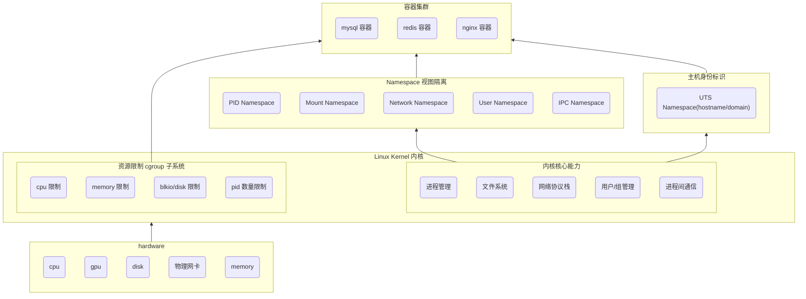
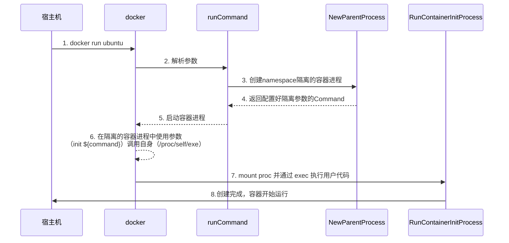
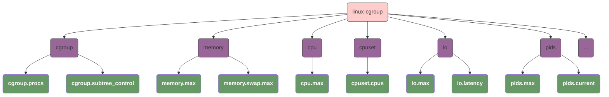
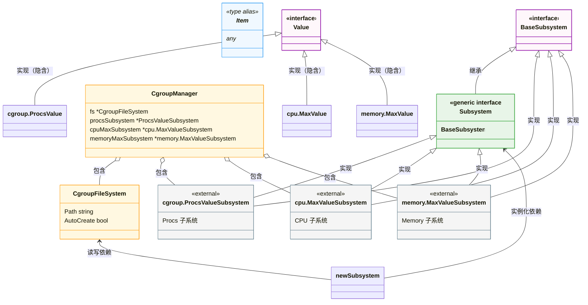

# build my own docker from scratch

> Docker is an OS‑level virtualization (or containerization) platform, which allows applications to share the host OS kernel instead of running a separate guest OS like in traditional virtualization.

# 前言

> 本文基于 `OpenCloudOS` 操作系统以及 `x86_64` 平台，`go1.24.11` 语言开发测试。
>
> ```shell
> uname -a
> # Linux VM-0-10-opencloudos 6.6.117-45.1.oc9.x86_64 #1 SMP Tue Dec 16 11:49:47 CST 2025 x86_64 x86_64 x86_64 GNU/Linux
> 
> go version
> # go version go1.24.11 linux/amd64
> 
> docker --version
> # Docker version 29.1.3, build f52814d
> ```

[Docker](https://www.docker.com/) 是基于 Linux Namespace 和 Cgroup 实现的轻量级虚拟化平台。相较于传统虚拟机（如 [Oracle VirtualBox](https://www.virtualbox.org/)），Docker 无需模拟硬件和运行独立内核，仅通过内核级的资源隔离与限制实现 “虚拟环境”，因此更轻量级（毫秒级启动）、资源占用更低 —— 同一台宿主机上的所有容器**共享宿主机内核**，这是容器与虚拟机的核心区别。

**容器的本质是：Linux 内核通过隔离 “进程、文件、网络、用户” 等资源视图，并限制资源使用量，构建出的 “类独立主机环境”**。其核心实现可拆解为三大模块：

1. 主机身份标识（UTS Namespace 隔离）
  - 核心对象：hostname（主机名）和 domainname（NIS 域名，现代几乎废弃）；
  - 作用：让容器拥有独立的主机身份标识，模拟 “独立机器” 的特征（如容器内修改 hostname 不会影响宿主机或其他容器）；
  - 本质：内核通过 struct utsname 结构体为不同容器维护独立的身份副本，仅在各自 UTS Namespace 内生效。
2. 资源视图隔离（各类 Namespace 核心能力）
  - 通过 Linux Namespace 为容器隔离核心资源的 “可见范围”，让容器仅能感知到自己的资源：
  - 进程隔离（PID Namespace）：容器内进程 ID 从 1 开始，无法看到宿主机 / 其他容器的进程；Linux 进程天然拥有独立的虚拟内存地址空间，同容器
  - 进程可通过消息队列、共享内存、管道等方式通信，跨容器进程需通过网络 / 挂载卷间接通信。
  - 文件系统隔离（Mount Namespace）：容器拥有独立的根文件系统（/），挂载 / 卸载操作仅影响自身，不波及宿主机（如容器内删除 /bin/sh 不会影响宿主机）。
  - 网络隔离（Network Namespace）：容器拥有独立的网卡、IP、端口和路由表，默认与宿主机 / 其他容器网络隔离，需通过端口映射、网桥等方式对外通信。
  - 用户 / 组隔离（User Namespace）：容器内的 root（UID 0）不等同于宿主机的 root，实现权限隔离（即使容器内以 root 运行，宿主机层面仅拥有普通用户权限）。
  - IPC 隔离（IPC Namespace）：容器内的消息队列、共享内存等 IPC 资源仅对本容器可见，避免跨容器的 IPC 干扰。
3. 资源限制工具（[cgroup](#cgroup)）
  - Cgroup（控制组）并非 “隔离资源视图”，而是限制容器对宿主机资源的使用量，防止单个容器占用过多资源导致宿主机崩溃：
  - 核心管控维度：CPU 使用率、内存上限、磁盘 IO 速率、进程数量、网络带宽等；
  - 作用：保证多容器在同一宿主机上公平调度（如限制容器最多使用 1 核 CPU、2GB 内存）。

**当以上三类能力（身份标识隔离 + 核心资源视图隔离 + 资源用量限制）共同作用时，容器就成为了一个 “对宿主机无感知、对外表现为独立主机” 的轻量级运行环境。**




```bash
docker run -it -d \
			--network host \
			--name example-container \
			-v ${CURDIR}:/mnt \
			-w /mnt \
			example-container
```

# docker依赖的linux基础特性

## namespace

### UTS namespace

我们的第一个例子，我们使用 `CLONE_NEWUTS` 指定我们要创建一个 `UTS Namespace`。

```go
// StartContainer start a container with UTS Namespace in linux
func StartContainer(cmd string) error {
	command := exec.Command(cmd)
	command.Stdin = os.Stdin
	command.Stdout = os.Stdout
	command.Stderr = os.Stderr

	command.SysProcAttr = &unix.SysProcAttr{
		Cloneflags: unix.CLONE_NEWUTS,
	}

	return command.Run()
}
```

我们可以验证我们的父进程和子进程是否在同一个 `UTS namespace`。

```shell
echo $$
# 255394

pstree -p
           ├─sshd(938)─┬─sshd(229522)───sshd(229527)
           │           └─sshd(229809)───sshd(229848)───bash(229849)───uts(255388)─┬─sh(255394)───pstree(255537)
           │                                                                      ├─{uts}(255389)
           │                                                                      ├─{uts}(255390)
           │                                                                      ├─{uts}(255391)
           │                                                                      └─{uts}(255392)
           

readlink /proc/255394/ns/uts
# uts:[4026532361]

readlink /proc/255388/ns/uts
# uts:[4026531838]
```

### User namespace

在我们使用 `User namespace` 时：

- `Credential#HostID` 会被映射为 `UidMappings#ContainerID`；
- `Credential#Gid` 会被映射为 `GidMappings#ContainerID`；
- 并且映射的值必须完全一致，否则会抛出异常 invalid argument 。

```go
func main() {
	cmd := exec.Command("sh")
	cmd.SysProcAttr = &syscall.SysProcAttr{
		Cloneflags: unix.CLONE_NEWUTS |
			unix.CLONE_NEWIPC |
			unix.CLONE_NEWPID |
			unix.CLONE_NEWNS |
			unix.CLONE_NEWUSER,
		UidMappings: []syscall.SysProcIDMap{
			{
				ContainerID: 0,
				HostID:      os.Getuid(),
				Size:        1,
			},
		},
		GidMappings: []syscall.SysProcIDMap{
			{
				ContainerID: 0,
				HostID:      os.Getgid(),
				Size:        1,
			},
		},
	}
	// Explicitly set the UID and GID to prevent tasks from running as root.
	cmd.SysProcAttr.Credential = &syscall.Credential{
		Uid:         uint32(1),
		Gid:         uint32(1),
		NoSetGroups: true,
	}
	cmd.Stdin = os.Stdin
	cmd.Stdout = os.Stdout
	cmd.Stderr = os.Stderr
	if err := cmd.Run(); err != nil {
		log.Fatal(err)
	}
}
```

## cgroups

> Cgroup 的使用可以参考 [cgroup](#cgroup)。

**Cgroup 是 Linux 内核提供的资源隔离 / 限制机制**，而 `hierarchy`（层级）、`subsystem`（子系统）是实现这一机制的核心组件，三者的关系可总结为：

- `subsystem` 是 “资源控制能力”（如限制 CPU / 内存）
- `hierarchy` 是 “组织容器 / 进程的树形结构”
- `cgroup` 是 “挂载在层级上、绑定了子系统的具体控制组（进程组）”。

### 核心概念

#### Subsystem

Subsystem 是内核提供的 “资源管控插件”，每个插件只负责一种资源的限制 / 统计，比如 “CPU 子系统” 只能管 CPU，“内存子系统” 只能管内存。我们可以认为他们是一组内核钩子函数，通过挂载到 Cgroup 层级上，对层级内的 cgroup 中的进程进行资源限制、计量或隔离。

```shell
lssubsys -a

# cpuset
# cpu
# cpuacct
# blkio
# memory
# devices
# freezer
# net_cls
# perf_event
# net_prio
# hugetlb
# pids
# rdma
# misc
```

| 子系统名     | 核心作用（通俗版）                                | 典型使用场景                                                |
| ------------ | ------------------------------------------------- | ----------------------------------------------------------- |
| `cpuset`     | 绑定进程到**指定 CPU 核心 / NUMA 节点**，独占核心 | 高性能容器（数据库 / 计算密集型）独占 CPU 核                |
| `cpu`        | 限制 CPU 使用率、调度优先级，控制 CPU 调度周期    | 限制容器 CPU 使用率（如最多用 1 核）、多容器 CPU 权重分配   |
| `cpuacct`    | 统计进程 / 容器的 CPU 占用（用户态 / 内核态）     | 容器 CPU 使用率监控、计费统计                               |
| `blkio`      | 限制块设备（磁盘）IO 速率 / 优先级                | 限制容器磁盘 IO（防止写满磁盘）、数据库 IO 优先级保障       |
| `memory`     | 限制内存使用（物理内存 / 交换分区），统计内存     | 容器内存上限（OOM 触发）、禁用 swap 避免性能下降            |
| `devices`    | 控制进程对设备的访问权限（读 / 写 / 创建）        | 容器隔离设备（如禁止访问宿主机 GPU / 串口）、仅允许访问网卡 |
| `freezer`    | 暂停 / 恢复 cgroup 内的所有进程                   | 容器暂停（如备份时）、资源超限时临时冻结进程                |
| `net_cls`    | 给进程的网络数据包打标记（classid）               | 结合 TC（流量控制）限制容器网络带宽、区分不同容器的流量     |
| `perf_event` | 允许 perf 工具对 cgroup 内进程做性能分析          | 容器性能剖析（如分析容器内进程 CPU 热点）                   |
| `net_prio`   | 控制进程网络数据包的发送优先级                    | 核心业务容器网络优先级高于普通容器                          |
| `hugetlb`    | 限制大页内存（HugeTLB）的使用                     | 数据库 / 虚拟化场景（用大页提升内存性能）的大页限制         |
| `pids`       | 限制 cgroup 内允许创建的最大进程数                | 防止容器 fork 炸弹（无限创建进程）、限制容器进程数          |
| `rdma`       | 限制 RDMA（远程直接内存访问）资源使用             | 高性能计算 / 存储场景（RDMA 网卡）的资源隔离                |
| `misc`       | 杂项资源控制（内核新增，适配小众场景）            |                                                             |

#### Hierarchy

Hierarchy 是一棵 “进程分组树”，树的每个节点是一个 cgroup，进程可以被加入树的任意节点，且会继承父节点的资源限制。我们可以认为挂载在 `/sys/fs/cgroup/` 下的一个独立树形文件系统（Cgroupfs），一个层级可以绑定**零个或多个 subsystem**，但一个 subsystem 只能绑定到**一个层级**（核心约束）

#### cgroup（控制组）

Cgroup 是层级树上的一个 “节点”，本质是一组进程的集合，且绑定了 subsystem 的资源规则（比如 “这个节点的进程最多用 1 核 CPU、2G 内存”）。挂载的 Cgroup 层级下的一个目录（目录即 cgroup），目录内的文件（如 `cpu.cfs_quota_us`）是资源规则配置，`tasks` 文件记录该 cgroup 包含的进程 PID：

- 一个 cgroup 可以包含多个进程，一个进程可以属于多个层级的 cgroup；
- 空 cgroup（无进程）不占用资源，仅保存配置；
- 删除 cgroup 只需删除对应的目录（内核会自动清理关联规则）。

#### 三者的核心关系

假设我们要限制一个容器的 CPU 和内存，操作流程如下：

##### 创建hierarchy

挂载一个 Cgroup 层级到 `/sys/fs/cgroup/my-hierarchy/`

```shell
mkdir /sys/fs/cgroup/my-hierarchy
```

执行后，内核会自动的为我们在 `/sys/fs/cgroup/my-hierarchy` 下创建文件，每个文件都对应了 `subsystem` 的一些功能，下面列出了一些典型的例子：

```shell
ls /sys/fs/cgroup/my-hierarchy
# cgroup.freeze
# cpuset.cpus
# cpu.max
# ...
```

##### 配置 Subsystem

这里，我们通过配置来对我们的CPU使用进行限制。

```shell
cd /sys/fs/cgroup/my-hierarchy
# 限制 CPU 使用率为 50%（100ms 周期内最多用 50ms）
echo "50000 100000" > cpu.max

# 限制 CPU 使用率为 200%（允许使用 2 个核心，100ms 周期内最多用 200ms）
#echo "200000 100000" > cpu.max

# 取消限制（设为 max）
#echo "max 100000" > cpu.max
```

##### 测试我们的cgroup

我们实现一个最简单的忙等待

```shell
while :; do :; done

pkill -f "while :; do :; done"
```

后台执行该脚本

```shell
sh busy.sh &
# [1] 1116447
```

通过 `top` 查看我们的进程的CPU占用：

```shell
    PID USER      PR  NI    VIRT    RES    SHR S  %CPU  %MEM     TIME+ COMMAND
1116447 root      25   5    7108   3496   3212 R  99.7   0.0   2:11.49 sh
```

随后我们将我们的进程加入到 `cgroup`：

```shell
echo 1116447 >> /sys/fs/cgroup/my-hierarchy/cgroup.procs
```

再次通过 `top` 观察

```shell
    PID USER      PR  NI    VIRT    RES    SHR S  %CPU  %MEM     TIME+ COMMAND
1116447 root      25   5    7108   3496   3212 R  49.8   0.0   4:43.34 sh
```

### 整体回顾

Linux 的 Cgroup（Control Group）是内核提供的进程资源管控系统，核心挂载路径为 `/sys/fs/cgroup`，系统默认在此路径下为核心 `subsystem`（如 cpu/memory/blkio）创建好预挂载的层级（Hierarchy）。

通常我们使用cgroup，我们会按照如下步骤实现：

1. 在 `/sys/fs/cgroup` 下通过 `mkdir` 新建一个文件夹，这个文件夹是一个虚拟文件系统目录，需要通过 `rmdir` 而非 `rm` 来删除。这个文件夹也就是我们的 cgroup 的 `hierarchy`；在新建hierarchy之后，kernel会自动的添加 `subsystem` 到hierarchy下；
2. 通过 `subsystem` 中的参数，我们定制了一个可以对特定资源做限制的 cgroup，而我们可以通过修改 `cgroup.procs` 来指定被该 cgroup 约束的进程。

### docker如何使用cgroup

`docker` 在启动的时候，会为每个 container 初始化一个对应的 hierarchy 挂载在 `/sys/fs/cgroup/system.slice` 下的特定文件。

```shell
docker run -itd --rm --cpus=1.0 -m 128m ubuntu
# e77265ce43b8b9b95894a1fa07649c4438d22e4d7d3aa254edd0f5786ace1e29

cat /sys/fs/cgroup/system.slice/docker-e77265ce43b8b9b95894a1fa07649c4438d22e4d7d3aa254edd0f5786ace1e29.scope/memory.max
# 134217728

cat /sys/fs/cgroup/system.slice/docker-e77265ce43b8b9b95894a1fa07649c4438d22e4d7d3aa254edd0f5786ace1e29.scope/cpu.max
# 100000 100000
```

我们也可以用代码来模拟这个行为，这里我们需要注意的几个点是：

1. 我们必须在创建进程之前，将进程绑定到我们的cgroup。这里听起来有一点矛盾，实际情况是，`stress` 执行会有两个进程：**调度进程**和**工作进程**。如果我们等进程被拉起之后再将主进程添加到cgroup，那么我们工作进程将不会受到任何该cgroup的限制。我们很多途径可以处理这个问题：
   1. 增加一个函数从 `/proc/$PID/` 去解析所有子进程并加入到 cgroup；
   2. 通过 `UseCgroupFD` 和 `CgroupFD` 预先指定绑定的 cgroup；
2. 如果我们成功的绑定了 cgroup，那程序执行时将会因为使用过量的资源被直接 kill。

```go
const cgroupMemoryHierarchyMount = "/sys/fs/cgroup"
const cgroupMemoryMax = "memory.max"

// 提前创建一个 cgroup 组，指定资源量
func createCgroup() (*os.File, error) {
	hierarchy := path.Join(cgroupMemoryHierarchyMount, "test_memory_limit")
	err := os.Mkdir(hierarchy, 0755)
	if err != nil {
		log.Fatal(err)
	}

	memoryMax := path.Join(hierarchy, cgroupMemoryMax)
	err = os.WriteFile(memoryMax, []byte("100m"), 0644)
	if err != nil {
		log.Fatal(err)
	}

	return os.OpenFile(hierarchy, os.O_RDONLY, 0644)
}

// 在子进程中执行 stress
func runStress() {
	fmt.Printf("current pid %d", syscall.Getpid())
	fmt.Println()
	cmd := exec.Command("sh", "-c", `stress --vm-bytes 2048m --vm-keep -m 1`)
	cmd.SysProcAttr = &unix.SysProcAttr{}
	cmd.Stdin = os.Stdin
	cmd.Stdout = os.Stdout
	cmd.Stderr = os.Stderr
	if err := cmd.Run(); err != nil {
		fmt.Printf("%v\n", err)
		os.Exit(1)
	}
}

func main() {
	// Check if the program is relaunched via /proc/self/exe
	if os.Args[0] == "/proc/self/exe" {
		runStress()
		os.Exit(0)
	}

	cgroup, err := createCgroup()
	if err != nil {
		panic(err)
	}
	defer func(cgroup *os.File) {
		_ = cgroup.Close()
	}(cgroup)

	cmd := exec.Command("/proc/self/exe")
	cmd.SysProcAttr = &unix.SysProcAttr{
		Cloneflags: syscall.CLONE_NEWUTS |
			syscall.CLONE_NEWPID |
			syscall.CLONE_NEWNS,
			UseCgroupFD: true,
			CgroupFD: int(cgroup.Fd()),
	}

	cmd.Stdin = os.Stdin
	cmd.Stdout = os.Stdout
	cmd.Stderr = os.Stderr

	if err := cmd.Start(); err != nil {
		log.Println("start command error : ", err)
		os.Exit(1)
	}
}
```

# 构造容器

## 基于namespace构造容器

在真正开始构造我们的容器之前，我们可以学习一下关于 [/proc](#proc)  的知识。

从linux的层面，想要启动一个容器，我们的设想方向应该是这样的：

1. 通过 `fork()` + `namespace` 来生成一个隔离空间；
2. 在 `fork()` 出来的隔离空间中，通过 `exec()` 来执行用户代码程序。

于是，我们的思路就可以这样设计：

1. 声明 `run` 和 `init` 指令
   1. `run` 指令负责通过 namespace 生成隔离空间；
   2. `init` 指令负责在 `run` 生成隔离空间后，在隔离空间内通过 `exec(command)` 执行用户程序。



整体逻辑可以描述为：

1. 宿主机：用户执行 `docker run -it sh`：
   1. 程序解析 `run` 指令后，调用 `NewParentProcess`；
   2. 构造子进程执行参数：`["init", ${command}]`（如 `["init", "sh"]`）；
   3. 创建子进程对象：指定子进程执行 `/proc/self/exe`（当前程序自身），并传入上述参数；
   4. 为子进程配置 UTS/PID/Mount/Network/IPC 五种 Namespace 隔离，若指定 TTY 则绑定宿主机终端；
   5. 启动该子进程（此时子进程进入独立的 Namespace 隔离空间）。
2. 子进程（容器内）
   1. 子进程在**隔离空间**内执行 `/proc/self/exe init ${command}`，触发程序的 CLI 框架逻辑：
   2. 执行 `initCommand` 的 `Action` 函数，调用 `RunContainerInitProcess`；
   3. `RunContainerInitProcess` 先以安全标志挂载 `/proc` 文件系统（适配 PID Namespace），再通过 `syscall.Exec` 系统调用替换当前子进程镜像为用户指定的 `${command}`（如 `sh`）；
   4. `${command}` 成为容器内的 PID=1 进程，容器正式运行（若绑定 TTY 则支持交互式操作）。

```go
// run.go
func Run(tty bool, command string) {
	parent := container.NewParentProcess(tty, command)
	if err := parent.Start(); err != nil {
		log.Error(err)
	}
	parent.Wait()
	os.Exit(-1)
}


// container_process.go
func NewParentProcess(tty bool, command string) *exec.Cmd {
	args := []string{"init", command}
	cmd := exec.Command("/proc/self/exe", args...)
	cmd.SysProcAttr = &syscall.SysProcAttr{
		Cloneflags: syscall.CLONE_NEWUTS |
			syscall.CLONE_NEWPID |
			syscall.CLONE_NEWNS |
			syscall.CLONE_NEWNET |
			syscall.CLONE_NEWIPC,
	}
	if tty {
		cmd.Stdin = os.Stdin
		cmd.Stdout = os.Stdout
		cmd.Stderr = os.Stderr
	}
	return cmd
}

// init.go
func RunContainerInitProcess(command string, args []string) error {
	logrus.Infof("command %s", command)
	defaultMountFlags := syscall.MS_NOEXEC | syscall.MS_NOSUID | syscall.MS_NODEV
	syscall.Mount("proc", "/proc", "proc", uintptr(defaultMountFlags), "")
	argv := []string{command}
	if err := syscall.Exec(command, argv, os.Environ()); err != nil {
		logrus.Errorf(err.Error())
	}
	return nil
}
```

## 为构造的容器增加cgroup限制

想要为我们的容器增加 `cgroup` 限制，我们最简单的方式就是，构造一个cgroup字符串，

> docker 中为 container 增加限制的逻辑是：
>
> 1. 在 docker run 的时候，为app生成一个唯一的container-id；
> 2. 在 `/sys/fs/cgroup/system.slice/docker-$containner-id.scope/`  内生成一个 hierarchy；
> 3. 在 `hierarchy` 的文件下写入到对应的数据来限制container的资源使用；
> 4. 在 `hierarchy` 的文件 `cgroup.procs` 添加该容器对应进程的 `pid`。
>

### cgroup的分类

`docker` 中的配置文件，我们可以直接通过以下指令来查看：

```shell
ll /sys/fs/cgroup/system.slice/docker.service/

# -r--r--r-- 1 root root 0 Dec 20 08:14 cgroup.procs
# -rw-r--r-- 1 root root 0 Dec 19 11:41 cgroup.subtree_control
# -rw-r--r-- 1 root root 0 Dec 19 11:41 cpu.max
# -rw-r--r-- 1 root root 0 Dec 19 11:41 memory.max
# -rw-r--r-- 1 root root 0 Dec 19 11:41 pids.max
```

这里，我们只保留了一些最具有代表性的指标：

| 一级分类 | 二级文件                 | 作用简述                     |
| -------- | ------------------------ | ---------------------------- |
| `cgroup` | `cgroup.procs`           | 关联到该 cgroup 的进程 PID   |
| `cgroup` | `cgroup.subtree_control` | 控制子 cgroup 可启用的控制器 |
| `memory` | `memory.max`             | 内存使用上限                 |
| `memory` | `memory.current`         | 当前内存使用量               |
| `pids`   | `pids.max`               | 进程数上限                   |

那么我们实际的分类可以划分如下（我们省略了大部分的实例）：



## 使用cgroup隔离资源

我们目前的思路是：将整个引擎分为多层：

1. 将指标分为两个部分，`Value` 表示指标本身，`Item` 表示指标内部的值，例如：
   - `Value` 是一个接口，提供了 `From` 和 `Into` 在 `Value` 和 `string` 类型之间的转换；
   - `Item` 是一个 `any` 类型；
   - 对于 `cgroups.procs` 类型，`Value` 对应整个 pid 数组， `Item` 对应数组内的每个 pid；
   - 对于 `cpu.max`  类型，`Value` 和 `Item` 均对应同一个值，因为他们是一个整体；
2. 抽象了 `Subsystem[I Item, V Value]` 接口，每个不同的类型都需要实现这个接口来实现修改/删除等功能：
   - `Set(I)`
   - `Del(I)`
   - `Empty() bool`
3. 最底层为 `CgroupFileSystem`，这一层负责和操作系统交互。更明确来说，就是负责读/写 `/sys/fs/cgroup/system.slice` 文件夹下的配置文件，并向上提供读/写接口；
4. `CgroupFileSystem` 的上层为 `CgroupManager`，他包含了：
   - 对 `CgroupFileSystem` 的引用，用于读/写底层文件；
   - 对多个 `Subsystem` 的引用，用于操作指标值；

整体结果逻辑如图所示：




# QA

## Proc

`/proc` 是 Linux 系统中**核心的伪文件系统（pseudo-filesystem）**，由内核实时生成和维护，并非存储在磁盘上的真实文件，而是内核暴露系统 / 进程状态、配置的 “接口”—— 通过读写 `/proc` 下的文件，可查看 / 调整内核、进程、硬件的运行参数，是运维和容器 / 内核开发的核心工具。

### 核心特性

1. **无磁盘存储**：所有文件 / 目录由内核动态生成，占用磁盘空间为 0（`df -h` 查看 `/proc` 挂载点会显示 0 大小）；
2. **实时性**：文件内容随系统 / 进程状态实时变化（如 `/proc/1/status` 会实时反映 PID=1 进程的资源使用）；
3. **权限管控**：大部分文件仅 root 可修改，普通用户仅能读取（部分进程文件仅属主可访问）；
4. **挂载类型**：默认以 `proc` 类型挂载（`mount -t proc proc /proc`），每个 PID Namespace 可挂载独立的 `/proc`（容器隔离的核心）。

### 目录结构

>第一类是进程专属目录：`/proc/$<PID>/`：每个运行的进程对应 `/proc` 下一个以 PID 命名的目录（如 `/proc/1/` 对应 PID=1 的 `systemd` 进程），包含该进程的所有核心信息：

| 关键文件 / 目录       | 作用                                                        |
| --------------------- | ----------------------------------------------------------- |
| `/proc/<PID>/status`  | 进程核心状态（PID、UID/GID、内存、CPU、信号、Namespace 等） |
| `/proc/<PID>/cmdline` | 进程启动的完整命令行（以 `\0` 分隔参数）                    |
| `/proc/<PID>/cgroup`  | 进程所属的 Cgroup 组（v1/v2 路径）                          |
| `/proc/<PID>/ns/`     | 进程所属的所有 Namespace（符号链接）                        |
| `/proc/<PID>/fd/`     | 进程打开的文件描述符（符号链接到真实文件）                  |
| `/proc/<PID>/root`    | 进程的根目录（chroot / 容器的根文件系统）                   |
| `/proc/<PID>/mounts`  | 进程可见的挂载点（文件系统 Namespace 隔离关键）             |

> 第二类是系统级信息目录 / 文件（全局状态）：这类文件 / 目录反映整个系统的运行状态，是运维和开发的核心参考

| 关键文件 / 目录      | 作用                                           |
| -------------------- | ---------------------------------------------- |
| `/proc/cpuinfo`      | CPU 硬件信息（核心数、架构、频率等）           |
| `/proc/meminfo`      | 内存使用状态（总内存、空闲、缓存、交换分区等） |
| `/proc/mounts`       | 系统全局挂载点（等价于 `mount` 命令）          |
| `/proc/sys/`         | 内核参数配置（可动态修改，无需重启）           |
| `/proc/self/`        | 指向当前进程的 PID 目录（符号链接）            |
| `/proc/thread-self/` | 指向当前线程的 TID 目录                        |
| `/proc/uptime`       | 系统运行时间（秒）                             |
| `/proc/net/`         | 网络状态（TCP/UDP 连接、网卡、路由等）         |

> 第三类是特殊文件（内核交互接口）：

| 文件            | 作用                            |
| --------------- | ------------------------------- |
| `/proc/kmsg`    | 内核日志（等价于 `dmesg` 命令） |
| `/proc/loadavg` | 系统负载均值（1/5/15 分钟）     |
| `/proc/version` | 内核版本 + 编译信息             |
| `/proc/cgroups` | Cgroup 子系统状态（v1）         |
| `/proc/cmdline` | 系统启动时的内核参数            |

## Namespace

### Namespace 是什么？

Namespace 本质是 Linux 内核为进程创建的「**资源隔离边界**」—— 不同 Namespace 内的进程，只能看到自己 Namespace 内的资源，无法感知其他 Namespace 或宿主机的同名资源。

例如：

- 宿主机的 PID 1 是 `systemd`，但容器内的 PID 1 可以是 `sh`（PID Namespace 隔离）；
- 容器内修改主机名（`hostname`），宿主机完全不受影响（UTS Namespace 隔离）；
- 容器内的 `eth0` 网卡，和宿主机的 `eth0` 是两套独立网络栈（Network Namespace 隔离）。

### Linux Namespace 的分类

| Namespace 类型 | 标识常量（Go 中 `unix.CLONE_XXX`） | 隔离资源                         | 核心作用                                                     |
| -------------- | ---------------------------------- | -------------------------------- | ------------------------------------------------------------ |
| UTS            | `CLONE_NEWUTS`                     | 主机名、NIS 域名                 | 让容器有独立的主机名（如 `docker run --hostname`）           |
| PID            | `CLONE_NEWPID`                     | 进程 ID 空间                     | 容器内 PID 从 1 开始，隔离进程树                             |
| Mount          | `CLONE_NEWNS`                      | 文件系统挂载点                   | 容器有独立的根文件系统（`/`），挂载 / 卸载不影响宿主机       |
| Network        | `CLONE_NEWNET`                     | 网络栈（网卡、端口、路由）       | 容器有独立的网卡、IP、端口，实现网络隔离（如 `docker run -p`） |
| User           | `CLONE_NEWUSER`                    | 用户 / 组 ID 空间                | 容器内的 root（UID 0）≠ 宿主机的 root，实现权限隔离          |
| IPC            | `CLONE_NEWIPC`                     | 进程间通信（消息队列、共享内存） | 容器内的 IPC 资源仅对本 Namespace 可见                       |
| Cgroup         | `CLONE_NEWCGROUP`（4.6+ 内核）     | Cgroup 根目录                    | 容器有独立的 Cgroup 视图，限制资源更精细                     |

### Namespace 的核心工作原理

创建新进程时，通过 `clone()` 系统调用指定 `CLONE_NEWXXX` 标志，新进程会进入新的 Namespace：

```c
pid_t clone(int (*fn)(void *), void *stack, int flags, void *arg);

clone(child_func, stack, CLONE_NEWUTS | CLONE_NEWPID | SIGCHLD, arg);
```

## cgroup

> `cgroup` 分为 `v1` 和 `v2` 两个版本，我们这里只简单介绍一些 `v2` 版本的实现逻辑。

### cgroup的核心文件

Cgroup v2 的所有操作都基于 `/sys/fs/cgroup`（根 Cgroup 组），根目录核心文件：

| 文件 / 目录              | 作用                                                         |
| ------------------------ | ------------------------------------------------------------ |
| `cgroup.controllers`     | 只读，列出内核支持的所有资源子系统（如 cpu、memory、io、pids、hugetlb 等） |
| `cgroup.subtree_control` | 可写，控制「哪些子系统权限能传递给子组」（子组需父组授权才能配置对应资源） |
| `cgroup.procs`           | 可写，该组内的进程 PID 列表（每行一个，写入 PID 即绑定进程） |
| `cgroup.threads`         | 只读，该组内的线程 TID 列表                                  |
| `cgroup.max.descendants` | 可写，该组允许创建的最大子组数量（默认无限制）               |

### 使用cgroup限制CPU 50% + 内存 1GB

#### 一、启用子系统传递权限

```bash
cd /sys/fs/cgroup

# 启用 cpu + memory 子系统（+ 表示启用，- 表示禁用）
echo "+cpu +memory" > cgroup.subtree_control

cat cgroup.subtree_control
```

我们可以看到输出为：

```
cpuset cpu io memory net_cls hugetlb pids rdma misc
```

| 子系统    | 核心含义            | 管控能力                                           | 典型配置场景                                                | Cgroup v2 核心配置文件                                       |
| --------- | ------------------- | -------------------------------------------------- | ----------------------------------------------------------- | ------------------------------------------------------------ |
| `cpuset`  | CPU 集合 / 节点绑定 | 限制进程可使用的**物理 CPU 核心**、NUMA 节点       | 多核服务器上，将进程固定到指定 CPU 核心（避免跨核调度开销） | `cpuset.cpus`（指定 CPU 核心）、`cpuset.mems`（指定 NUMA 节点） |
| `cpu`     | CPU 使用率 / 权重   | 限制 CPU 时间片配额、资源竞争时的优先级            | 限制进程 CPU 使用率 ≤50%，或给核心进程更高 CPU 权重         | `cpu.max`（时间片配额）、`cpu.weight`（竞争权重）            |
| `io`      | 磁盘 IO 管控        | 限制块设备的读写速率、IOPS、优先级                 | 限制容器读写磁盘的速率（如 1MB/s），避免磁盘 IO 抢占        | `io.max`（速率 / IOPS 限制）、`io.weight`（IO 优先级）       |
| `memory`  | 内存 / 交换分区管控 | 限制内存使用上限、交换分区使用、OOM 行为           | 限制容器内存 ≤1GB，禁止使用交换分区                         | `memory.max`（内存上限）、`memory.swap.max`（交换分区上限）  |
| `net_cls` | 网络类别标记        | 为进程网络包打上分类标签（配合 tc/iptables 管控）  | 区分不同进程的网络流量，实现带宽限制 / 优先级               | `net_cls.classid`（打标签）                                  |
| `hugetlb` | 大页内存管控        | 限制进程使用的**大页内存（HugeTLB）** 用量         | 数据库 / 虚拟化场景，限制大页内存占用（避免大页耗尽）       | `hugetlb.2MB.max`（2MB 大页上限）、`hugetlb.1GB.max`（1GB 大页上限） |
| `pids`    | 进程数管控          | 限制 Cgroup 组内可创建的最大进程 / 线程数          | 防止进程无限 fork 导致系统进程耗尽（如挖矿程序、异常服务）  | `pids.max`（最大进程数）                                     |
| `rdma`    | RDMA 资源管控       | 限制进程使用的 RDMA（远程直接内存访问）资源        | 高性能计算 / 存储场景，管控 RDMA 设备的资源占用             | `rdma.max`（RDMA 资源上限）                                  |
| `misc`    | 杂项资源管控        | 管控不归属其他子系统的杂项资源（如 GPU、特殊设备） | 厂商扩展的资源管控（如 NVIDIA GPU 限制）                    | `misc.max`（杂项资源上限）                                   |

#### 二、创建自定义 Cgroup 子组

Cgroup v2 中「创建目录 = 新建子组」，内核会自动为新目录生成该组的规则文件：

```shell
# 创建名为 "my-app" 的子组（管控我的应用进程）
mkdir /sys/fs/cgroup/my-app

# 查看子组自动生成的文件（核心规则文件已出现）
# 关键文件：cpu.max、memory.max、cgroup.procs、cgroup.controllers 等
ls /sys/fs/cgroup/my-app
```

#### 三、配置资源限制规则

```shell
# 配置CPU限额

# 规则文件：cpu.max（格式：[配额(微秒)] [周期(微秒)]）
# 配额：50000μs = 50ms，周期：100000μs = 100ms → 50% 使用率
echo "50000 100000" > /sys/fs/cgroup/my-app/cpu.max
# 验证配置（应输出 50000 100000）
cat /sys/fs/cgroup/my-app/cpu.max

# 配置内存限额

# 规则文件：memory.max（支持 K/M/G/T 单位，或直接写字节数）
echo "1G" > /sys/fs/cgroup/my-app/memory.max

# 验证配置（应输出 1073741824，即 1GB 的字节数）
cat /sys/fs/cgroup/my-app/memory.max
```

#### 四、绑定进程到 Cgroup 子组

将需要管控的进程 PID 写入子组的 `cgroup.procs` 文件，进程立即被该组的规则限制：

```shell
# 1. 先启动一个测试进程（后台无限循环，高 CPU 占用，记录 PID）
while :; do :; done &
# 输出示例：[1] 12345 （12345 是进程 PID）

# 2. 将该进程绑定到 my-app 组
echo 12345 > /sys/fs/cgroup/my-app/cgroup.procs

# 3. 验证绑定结果（应输出 12345）
cat /sys/fs/cgroup/my-app/cgroup.procs
```

#### 五、其他限制

除了CPU和内存，我们还有非常多的限制项目，例如：

1. 磁盘 IO 限制
2. 进程数限制
3. CPU 权重（资源竞争时的优先级）
4. 监控 Cgroup 组的资源使用（只读统计）

## UTS

> `UTS` 是**Unix Time-Sharing System** 的缩写，本质是 Linux Namespace 的一种类型（标识常量 `CLONE_NEWUTS`），专门用于**隔离进程对「主机名（hostname）」和「NIS 域名（domainname）」的视图**。
>
> hostname 和 domainname 被归属到 **UTS Namespace** 下，核心原因是：**二者是 Unix 系统中描述「主机身份」的核心属性，在早期 Unix Time-Sharing System（UTS）规范中被定义为全局系统参数，Linux 内核延续了这一设计并将其纳入同一 Namespace 进行隔离**。

### hostname

`hostname` 是**单台主机的本地标识**，用于在**局域网 / 单机环境**中区分不同设备，相当于给主机起的 “名字”，例如：

- 本地进程间通信（如 `localhost` 对应 `127.0.0.1`）；
- 局域网内设备互访（如通过 `ubuntu-pc` 代替 IP 地址）；
- 容器隔离（每个容器的 `hostname` 独立，由 UTS Namespace 保证）。

### domainname

`domainname` 本质是 **NIS（Network Information Service）域名**，是早期 Unix 系统用于**分布式用户 / 主机管理**的标识，和我们现在常用的 **DNS 域名（如 `baidu.com`）不是一个概念**。

- **作用范围**：NIS 服务集群内，用于统一管理多台主机的用户、密码、主机映射等信息。
- **使用场景**：仅适用于老旧的 NIS 服务架构，**现代 Linux / 容器环境几乎不用**，主要是为了兼容 UTS 标准而保留。

