# build my own docker from scratch

> Docker is an OS‑level virtualization (or containerization) platform, which allows applications to share the host OS kernel instead of running a separate guest OS like in traditional virtualization.

# 前言

> 本文基于 `OpenCloudOS` 操作系统以及 `x86_64` 平台，`go1.24.11` 语言开发测试，全部代码位于 [tiny-docker](https://github.com/0x822a5b87/tiny-docker)。
>
> ```bash mark:1,4,7
> uname -a
> # Linux VM-0-10-opencloudos 6.6.117-45.1.oc9.x86_64 #1 SMP Tue Dec 16 11:49:47 CST 2025 x86_64 x86_64 x86_64 GNU/Linux
> 
> go version
> # go version go1.24.11 linux/amd64
> 
> docker --version
> # Docker version 29.1.3, build f52814d
> ```

[Docker](https://www.docker.com/) 是基于 Linux Namespace 和 Cgroup 实现的轻量级虚拟化平台。相较于传统虚拟机（如 [Oracle VirtualBox](https://www.virtualbox.org/)），Docker 无需模拟硬件和运行独立内核，仅通过内核级的资源隔离与限制实现 “虚拟环境”，因此更轻量级（毫秒级启动）、资源占用更低 —— 同一台宿主机上的所有容器**共享宿主机内核**，这是容器与虚拟机的核心区别。

**容器的本质是：Linux 内核通过隔离 “进程、文件、网络、用户” 等资源视图，并限制资源使用量，构建出的 “类独立主机环境”**。其核心实现可拆解为三大模块：

1. 主机身份标识（UTS Namespace 隔离）
  - 核心对象：hostname（主机名）和 domainname（NIS 域名，现代几乎废弃）；
  - 作用：让容器拥有独立的主机身份标识，模拟 “独立机器” 的特征（如容器内修改 hostname 不会影响宿主机或其他容器）；
  - 本质：内核通过 struct utsname 结构体为不同容器维护独立的身份副本，仅在各自 UTS Namespace 内生效。
2. 资源视图隔离（各类 Namespace 核心能力）
  - 通过 Linux Namespace 为容器隔离核心资源的 “可见范围”，让容器仅能感知到自己的资源：
  - 进程隔离（PID Namespace）：容器内进程 ID 从 1 开始，无法看到宿主机 / 其他容器的进程；Linux 进程天然拥有独立的虚拟内存地址空间，同容器
  - 进程可通过消息队列、共享内存、管道等方式通信，跨容器进程需通过网络 / 挂载卷间接通信。
  - 文件系统隔离（Mount Namespace）：容器拥有独立的根文件系统（/），挂载 / 卸载操作仅影响自身，不波及宿主机（如容器内删除 /bin/sh 不会影响宿主机）。
  - 网络隔离（Network Namespace）：容器拥有独立的网卡、IP、端口和路由表，默认与宿主机 / 其他容器网络隔离，需通过端口映射、网桥等方式对外通信。
  - 用户 / 组隔离（User Namespace）：容器内的 root（UID 0）不等同于宿主机的 root，实现权限隔离（即使容器内以 root 运行，宿主机层面仅拥有普通用户权限）。
  - IPC 隔离（IPC Namespace）：容器内的消息队列、共享内存等 IPC 资源仅对本容器可见，避免跨容器的 IPC 干扰。
3. 资源限制工具（[cgroup](#cgroup)）
  - Cgroup（控制组）并非 “隔离资源视图”，而是限制容器对宿主机资源的使用量，防止单个容器占用过多资源导致宿主机崩溃：
  - 核心管控维度：CPU 使用率、内存上限、磁盘 IO 速率、进程数量、网络带宽等；
  - 作用：保证多容器在同一宿主机上公平调度（如限制容器最多使用 1 核 CPU、2GB 内存）。

**当以上三类能力（身份标识隔离 + 核心资源视图隔离 + 资源用量限制）共同作用时，容器就成为了一个 “对宿主机无感知、对外表现为独立主机” 的轻量级运行环境。**

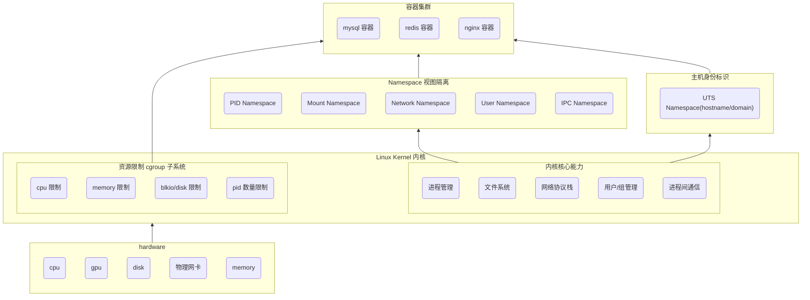


```bash
docker run -it -d \
			--network host \
			--name example-container \
			-v ${CURDIR}:/mnt \
			-w /mnt \
			example-container
```

# docker依赖的linux基础特性

## namespace

### UTS namespace

我们的第一个例子，我们使用 `CLONE_NEWUTS` 指定我们要创建一个 `UTS Namespace`。

```go mark:9
// StartContainer start a container with UTS Namespace in linux
func StartContainer(cmd string) error {
	command := exec.Command(cmd)
	command.Stdin = os.Stdin
	command.Stdout = os.Stdout
	command.Stderr = os.Stderr

	command.SysProcAttr = &unix.SysProcAttr{
		Cloneflags: unix.CLONE_NEWUTS,
	}

	return command.Run()
}
```

我们可以验证我们的父进程和子进程是否在同一个 `UTS namespace`。

```shell
echo $$
# 255394

pstree -p
           ├─sshd(938)─┬─sshd(229522)───sshd(229527)
           │           └─sshd(229809)───sshd(229848)───bash(229849)───uts(255388)─┬─sh(255394)───pstree(255537)
           │                                                                      ├─{uts}(255389)
           │                                                                      ├─{uts}(255390)
           │                                                                      ├─{uts}(255391)
           │                                                                      └─{uts}(255392)
           

readlink /proc/255394/ns/uts
# uts:[4026532361]

readlink /proc/255388/ns/uts
# uts:[4026531838]
```

### User namespace

在我们使用 `User namespace` 时：

- `Credential#HostID` 会被映射为 `UidMappings#ContainerID`；
- `Credential#Gid` 会被映射为 `GidMappings#ContainerID`；
- 并且映射的值必须完全一致，否则会抛出异常 invalid argument 。

```go
func main() {
	cmd := exec.Command("sh")
	cmd.SysProcAttr = &syscall.SysProcAttr{
		Cloneflags: unix.CLONE_NEWUTS |
			unix.CLONE_NEWIPC |
			unix.CLONE_NEWPID |
			unix.CLONE_NEWNS |
			unix.CLONE_NEWUSER,
		UidMappings: []syscall.SysProcIDMap{
			{
				ContainerID: 0,
				HostID:      os.Getuid(),
				Size:        1,
			},
		},
		GidMappings: []syscall.SysProcIDMap{
			{
				ContainerID: 0,
				HostID:      os.Getgid(),
				Size:        1,
			},
		},
	}
	// Explicitly set the UID and GID to prevent tasks from running as root.
	cmd.SysProcAttr.Credential = &syscall.Credential{
		Uid:         uint32(1),
		Gid:         uint32(1),
		NoSetGroups: true,
	}
	cmd.Stdin = os.Stdin
	cmd.Stdout = os.Stdout
	cmd.Stderr = os.Stderr
	if err := cmd.Run(); err != nil {
		log.Fatal(err)
	}
}
```

## cgroups

> Cgroup 的使用可以参考 [cgroup](#cgroup)。

**Cgroup 是 Linux 内核提供的资源隔离 / 限制机制**，而 `hierarchy`（层级）、`subsystem`（子系统）是实现这一机制的核心组件，三者的关系可总结为：

- `subsystem` 是 “资源控制能力”（如限制 CPU / 内存）
- `hierarchy` 是 “组织容器 / 进程的树形结构”
- `cgroup` 是 “挂载在层级上、绑定了子系统的具体控制组（进程组）”。

### 核心概念

#### Subsystem

Subsystem 是内核提供的 “资源管控插件”，每个插件只负责一种资源的限制 / 统计，比如 “CPU 子系统” 只能管 CPU，“内存子系统” 只能管内存。我们可以认为他们是一组内核钩子函数，通过挂载到 Cgroup 层级上，对层级内的 cgroup 中的进程进行资源限制、计量或隔离。

```shell
lssubsys -a

# cpuset
# cpu
# cpuacct
# blkio
# memory
# devices
# freezer
# net_cls
# perf_event
# net_prio
# hugetlb
# pids
# rdma
# misc
```

| 子系统名     | 核心作用（通俗版）                                | 典型使用场景                                                |
| ------------ | ------------------------------------------------- | ----------------------------------------------------------- |
| `cpuset`     | 绑定进程到**指定 CPU 核心 / NUMA 节点**，独占核心 | 高性能容器（数据库 / 计算密集型）独占 CPU 核                |
| `cpu`        | 限制 CPU 使用率、调度优先级，控制 CPU 调度周期    | 限制容器 CPU 使用率（如最多用 1 核）、多容器 CPU 权重分配   |
| `cpuacct`    | 统计进程 / 容器的 CPU 占用（用户态 / 内核态）     | 容器 CPU 使用率监控、计费统计                               |
| `blkio`      | 限制块设备（磁盘）IO 速率 / 优先级                | 限制容器磁盘 IO（防止写满磁盘）、数据库 IO 优先级保障       |
| `memory`     | 限制内存使用（物理内存 / 交换分区），统计内存     | 容器内存上限（OOM 触发）、禁用 swap 避免性能下降            |
| `devices`    | 控制进程对设备的访问权限（读 / 写 / 创建）        | 容器隔离设备（如禁止访问宿主机 GPU / 串口）、仅允许访问网卡 |
| `freezer`    | 暂停 / 恢复 cgroup 内的所有进程                   | 容器暂停（如备份时）、资源超限时临时冻结进程                |
| `net_cls`    | 给进程的网络数据包打标记（classid）               | 结合 TC（流量控制）限制容器网络带宽、区分不同容器的流量     |
| `perf_event` | 允许 perf 工具对 cgroup 内进程做性能分析          | 容器性能剖析（如分析容器内进程 CPU 热点）                   |
| `net_prio`   | 控制进程网络数据包的发送优先级                    | 核心业务容器网络优先级高于普通容器                          |
| `hugetlb`    | 限制大页内存（HugeTLB）的使用                     | 数据库 / 虚拟化场景（用大页提升内存性能）的大页限制         |
| `pids`       | 限制 cgroup 内允许创建的最大进程数                | 防止容器 fork 炸弹（无限创建进程）、限制容器进程数          |
| `rdma`       | 限制 RDMA（远程直接内存访问）资源使用             | 高性能计算 / 存储场景（RDMA 网卡）的资源隔离                |
| `misc`       | 杂项资源控制（内核新增，适配小众场景）            |                                                             |

#### Hierarchy

Hierarchy 是一棵 “进程分组树”，树的每个节点是一个 cgroup，进程可以被加入树的任意节点，且会继承父节点的资源限制。我们可以认为挂载在 `/sys/fs/cgroup/` 下的一个独立树形文件系统（Cgroupfs），一个层级可以绑定**零个或多个 subsystem**，但一个 subsystem 只能绑定到**一个层级**（核心约束）

#### cgroup（控制组）

Cgroup 是层级树上的一个 “节点”，本质是一组进程的集合，且绑定了 subsystem 的资源规则（比如 “这个节点的进程最多用 1 核 CPU、2G 内存”）。挂载的 Cgroup 层级下的一个目录（目录即 cgroup），目录内的文件（如 `cpu.cfs_quota_us`）是资源规则配置，`tasks` 文件记录该 cgroup 包含的进程 PID：

- 一个 cgroup 可以包含多个进程，一个进程可以属于多个层级的 cgroup；
- 空 cgroup（无进程）不占用资源，仅保存配置；
- 删除 cgroup 只需删除对应的目录（内核会自动清理关联规则）。

#### 三者的核心关系

假设我们要限制一个容器的 CPU 和内存，操作流程如下：

##### 创建hierarchy

挂载一个 Cgroup 层级到 `/sys/fs/cgroup/my-hierarchy/`

```shell
mkdir /sys/fs/cgroup/my-hierarchy
```

执行后，内核会自动的为我们在 `/sys/fs/cgroup/my-hierarchy` 下创建文件，每个文件都对应了 `subsystem` 的一些功能，下面列出了一些典型的例子：

```shell
ls /sys/fs/cgroup/my-hierarchy
# cgroup.freeze
# cpuset.cpus
# cpu.max
# ...
```

##### 配置 Subsystem

这里，我们通过配置来对我们的CPU使用进行限制。

```shell
cd /sys/fs/cgroup/my-hierarchy
# 限制 CPU 使用率为 50%（100ms 周期内最多用 50ms）
echo "50000 100000" > cpu.max

# 限制 CPU 使用率为 200%（允许使用 2 个核心，100ms 周期内最多用 200ms）
#echo "200000 100000" > cpu.max

# 取消限制（设为 max）
#echo "max 100000" > cpu.max
```

##### 测试我们的cgroup

我们实现一个最简单的忙等待

```shell
while :; do :; done

pkill -f "while :; do :; done"
```

后台执行该脚本

```shell
sh busy.sh &
# [1] 1116447
```

通过 `top` 查看我们的进程的CPU占用：

```shell
    PID USER      PR  NI    VIRT    RES    SHR S  %CPU  %MEM     TIME+ COMMAND
1116447 root      25   5    7108   3496   3212 R  99.7   0.0   2:11.49 sh
```

随后我们将我们的进程加入到 `cgroup`：

```shell
echo 1116447 >> /sys/fs/cgroup/my-hierarchy/cgroup.procs
```

再次通过 `top` 观察

```shell
    PID USER      PR  NI    VIRT    RES    SHR S  %CPU  %MEM     TIME+ COMMAND
1116447 root      25   5    7108   3496   3212 R  49.8   0.0   4:43.34 sh
```

### 整体回顾

Linux 的 Cgroup（Control Group）是内核提供的进程资源管控系统，核心挂载路径为 `/sys/fs/cgroup`，系统默认在此路径下为核心 `subsystem`（如 cpu/memory/blkio）创建好预挂载的层级（Hierarchy）。

通常我们使用cgroup，我们会按照如下步骤实现：

1. 在 `/sys/fs/cgroup` 下通过 `mkdir` 新建一个文件夹，这个文件夹是一个虚拟文件系统目录，需要通过 `rmdir` 而非 `rm` 来删除。这个文件夹也就是我们的 cgroup 的 `hierarchy`；在新建hierarchy之后，kernel会自动的添加 `subsystem` 到hierarchy下；
2. 通过 `subsystem` 中的参数，我们定制了一个可以对特定资源做限制的 cgroup，而我们可以通过修改 `cgroup.procs` 来指定被该 cgroup 约束的进程。

### docker如何使用cgroup

`docker` 在启动的时候，会为每个 container 初始化一个对应的 hierarchy 挂载在 `/sys/fs/cgroup/system.slice` 下的特定文件。

```shell
docker run -itd --rm --cpus=1.0 -m 128m ubuntu
# e77265ce43b8b9b95894a1fa07649c4438d22e4d7d3aa254edd0f5786ace1e29

cat /sys/fs/cgroup/system.slice/docker-e77265ce43b8b9b95894a1fa07649c4438d22e4d7d3aa254edd0f5786ace1e29.scope/memory.max
# 134217728

cat /sys/fs/cgroup/system.slice/docker-e77265ce43b8b9b95894a1fa07649c4438d22e4d7d3aa254edd0f5786ace1e29.scope/cpu.max
# 100000 100000
```

我们也可以用代码来模拟这个行为，这里我们需要注意的几个点是：

1. 我们必须在创建进程之前，将进程绑定到我们的cgroup。这里听起来有一点矛盾，实际情况是，`stress` 执行会有两个进程：**调度进程**和**工作进程**。如果我们等进程被拉起之后再将主进程添加到cgroup，那么我们工作进程将不会受到任何该cgroup的限制。我们很多途径可以处理这个问题：
   1. 增加一个函数从 `/proc/$PID/` 去解析所有子进程并加入到 cgroup；
   2. 通过 `UseCgroupFD` 和 `CgroupFD` 预先指定绑定的 cgroup；
2. 如果我们成功的绑定了 cgroup，那程序执行时将会因为使用过量的资源被直接 kill。

```go
const cgroupMemoryHierarchyMount = "/sys/fs/cgroup"
const cgroupMemoryMax = "memory.max"

// 提前创建一个 cgroup 组，指定资源量
func createCgroup() (*os.File, error) {
	hierarchy := path.Join(cgroupMemoryHierarchyMount, "test_memory_limit")
	err := os.Mkdir(hierarchy, 0755)
	if err != nil {
		log.Fatal(err)
	}

	memoryMax := path.Join(hierarchy, cgroupMemoryMax)
	err = os.WriteFile(memoryMax, []byte("100m"), 0644)
	if err != nil {
		log.Fatal(err)
	}

	return os.OpenFile(hierarchy, os.O_RDONLY, 0644)
}

// 在子进程中执行 stress
func runStress() {
	fmt.Printf("current pid %d", syscall.Getpid())
	fmt.Println()
	cmd := exec.Command("sh", "-c", `stress --vm-bytes 2048m --vm-keep -m 1`)
	cmd.SysProcAttr = &unix.SysProcAttr{}
	cmd.Stdin = os.Stdin
	cmd.Stdout = os.Stdout
	cmd.Stderr = os.Stderr
	if err := cmd.Run(); err != nil {
		fmt.Printf("%v\n", err)
		os.Exit(1)
	}
}

func main() {
	// Check if the program is relaunched via /proc/self/exe
	if os.Args[0] == "/proc/self/exe" {
		runStress()
		os.Exit(0)
	}

	cgroup, err := createCgroup()
	if err != nil {
		panic(err)
	}
	defer func(cgroup *os.File) {
		_ = cgroup.Close()
	}(cgroup)

	cmd := exec.Command("/proc/self/exe")
	cmd.SysProcAttr = &unix.SysProcAttr{
		Cloneflags: syscall.CLONE_NEWUTS |
			syscall.CLONE_NEWPID |
			syscall.CLONE_NEWNS,
			UseCgroupFD: true,
			CgroupFD: int(cgroup.Fd()),
	}

	cmd.Stdin = os.Stdin
	cmd.Stdout = os.Stdout
	cmd.Stderr = os.Stderr

	if err := cmd.Start(); err != nil {
		log.Println("start command error : ", err)
		os.Exit(1)
	}
}
```

# 构造容器

## 基于namespace构造容器

在真正开始构造我们的容器之前，我们可以学习一下关于 [/proc](#proc)  的知识。

从linux的层面，想要启动一个容器，我们的设想方向应该是这样的：

1. 通过 `fork()` + `namespace` 来生成一个隔离空间；
2. 在 `fork()` 出来的隔离空间中，通过 `exec()` 来执行用户代码程序。

于是，我们的思路就可以这样设计：

1. 声明 `run` 和 `init` 指令
   1. `run` 指令负责通过 namespace 生成隔离空间；
   2. `init` 指令负责在 `run` 生成隔离空间后，在隔离空间内通过 `exec(command)` 执行用户程序。

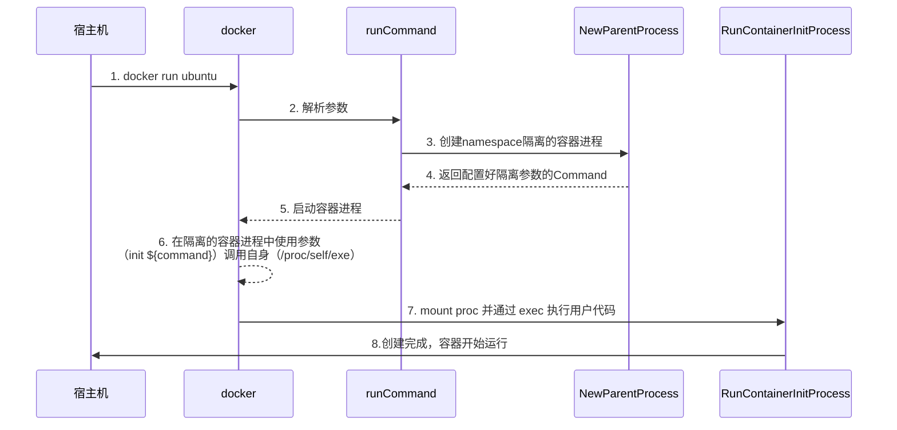

整体逻辑可以描述为：

1. 宿主机：用户执行 `docker run -it sh`：
   1. 程序解析 `run` 指令后，调用 `NewParentProcess`；
   2. 构造子进程执行参数：`["init", ${command}]`（如 `["init", "sh"]`）；
   3. 创建子进程对象：指定子进程执行 `/proc/self/exe`（当前程序自身），并传入上述参数；
   4. 为子进程配置 UTS/PID/Mount/Network/IPC 五种 Namespace 隔离，若指定 TTY 则绑定宿主机终端；
   5. 启动该子进程（此时子进程进入独立的 Namespace 隔离空间）。
2. 子进程（容器内）
   1. 子进程在**隔离空间**内执行 `/proc/self/exe init ${command}`，触发程序的 CLI 框架逻辑：
   2. 执行 `initCommand` 的 `Action` 函数，调用 `RunContainerInitProcess`；
   3. `RunContainerInitProcess` 先以安全标志挂载 `/proc` 文件系统（适配 PID Namespace），再通过 `syscall.Exec` 系统调用替换当前子进程镜像为用户指定的 `${command}`（如 `sh`）；
   4. `${command}` 成为容器内的 PID=1 进程，容器正式运行（若绑定 TTY 则支持交互式操作）。

```go
// run.go
func Run(tty bool, command string) {
	parent := container.NewParentProcess(tty, command)
	if err := parent.Start(); err != nil {
		log.Error(err)
	}
	parent.Wait()
	os.Exit(-1)
}


// container_process.go
func NewParentProcess(tty bool, command string) *exec.Cmd {
	args := []string{"init", command}
	cmd := exec.Command("/proc/self/exe", args...)
	cmd.SysProcAttr = &syscall.SysProcAttr{
		Cloneflags: syscall.CLONE_NEWUTS |
			syscall.CLONE_NEWPID |
			syscall.CLONE_NEWNS |
			syscall.CLONE_NEWNET |
			syscall.CLONE_NEWIPC,
	}
	if tty {
		cmd.Stdin = os.Stdin
		cmd.Stdout = os.Stdout
		cmd.Stderr = os.Stderr
	}
	return cmd
}

// init.go
func RunContainerInitProcess(command string, args []string) error {
	logrus.Infof("command %s", command)
	defaultMountFlags := syscall.MS_NOEXEC | syscall.MS_NOSUID | syscall.MS_NODEV
	syscall.Mount("proc", "/proc", "proc", uintptr(defaultMountFlags), "")
	argv := []string{command}
	if err := syscall.Exec(command, argv, os.Environ()); err != nil {
		logrus.Errorf(err.Error())
	}
	return nil
}
```

## 为构造的容器增加cgroup限制

想要为我们的容器增加 `cgroup` 限制，我们最简单的方式就是，构造一个cgroup字符串，

> docker 中为 container 增加限制的逻辑是：
>
> 1. 在 docker run 的时候，为app生成一个唯一的container-id；
> 2. 在 `/sys/fs/cgroup/system.slice/docker-$containner-id.scope/`  内生成一个 hierarchy；
> 3. 在 `hierarchy` 的文件下写入到对应的数据来限制container的资源使用；
> 4. 在 `hierarchy` 的文件 `cgroup.procs` 添加该容器对应进程的 `pid`。
>

### cgroup的分类

`docker` 中的配置文件，我们可以直接通过以下指令来查看：

```shell
ll /sys/fs/cgroup/system.slice/docker.service/

# -r--r--r-- 1 root root 0 Dec 20 08:14 cgroup.procs
# -rw-r--r-- 1 root root 0 Dec 19 11:41 cgroup.subtree_control
# -rw-r--r-- 1 root root 0 Dec 19 11:41 cpu.max
# -rw-r--r-- 1 root root 0 Dec 19 11:41 memory.max
# -rw-r--r-- 1 root root 0 Dec 19 11:41 pids.max
```

这里，我们只保留了一些最具有代表性的指标：

| 一级分类 | 二级文件                 | 作用简述                     |
| -------- | ------------------------ | ---------------------------- |
| `cgroup` | `cgroup.procs`           | 关联到该 cgroup 的进程 PID   |
| `cgroup` | `cgroup.subtree_control` | 控制子 cgroup 可启用的控制器 |
| `memory` | `memory.max`             | 内存使用上限                 |
| `memory` | `memory.current`         | 当前内存使用量               |
| `pids`   | `pids.max`               | 进程数上限                   |

那么我们实际的分类可以划分如下（我们省略了大部分的实例）：

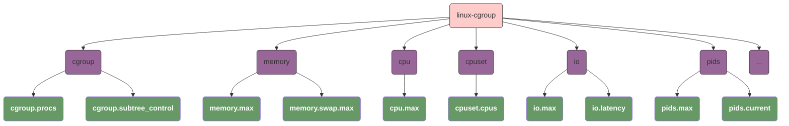

## 使用cgroup隔离资源

我们目前的思路是：将整个引擎分为多层：

1. 将指标分为两个部分，`Value` 表示指标本身，`Item` 表示指标内部的值，例如：
    - `Value` 是一个接口，提供了 `From` 和 `Into` 在 `Value` 和 `string` 类型之间的转换；
    - `Item` 是一个 `any` 类型；
    - 对于 `cgroups.procs` 类型，`Value` 对应整个 pid 数组， `Item` 对应数组内的每个 pid；
    - 对于 `cpu.max`  类型，`Value` 和 `Item` 均对应同一个值，因为他们是一个整体；
2. 抽象了 `Subsystem[I Item, V Value]` 接口，每个不同的类型都需要实现这个接口来实现修改/删除等功能：
    - `Set(I)`
    - `Del(I)`
    - `Empty() bool`
3. 最底层为 `CgroupFileSystem`，这一层负责和操作系统交互。更明确来说，就是负责读/写 `/sys/fs/cgroup/system.slice` 文件夹下的配置文件，并向上提供读/写接口；
4. `CgroupFileSystem` 的上层为 `CgroupManager`，他包含了：
    - 对 `CgroupFileSystem` 的引用，用于读/写底层文件；
    - 对多个 `Subsystem` 的引用，用于操作指标值；

整体结果逻辑如图所示：

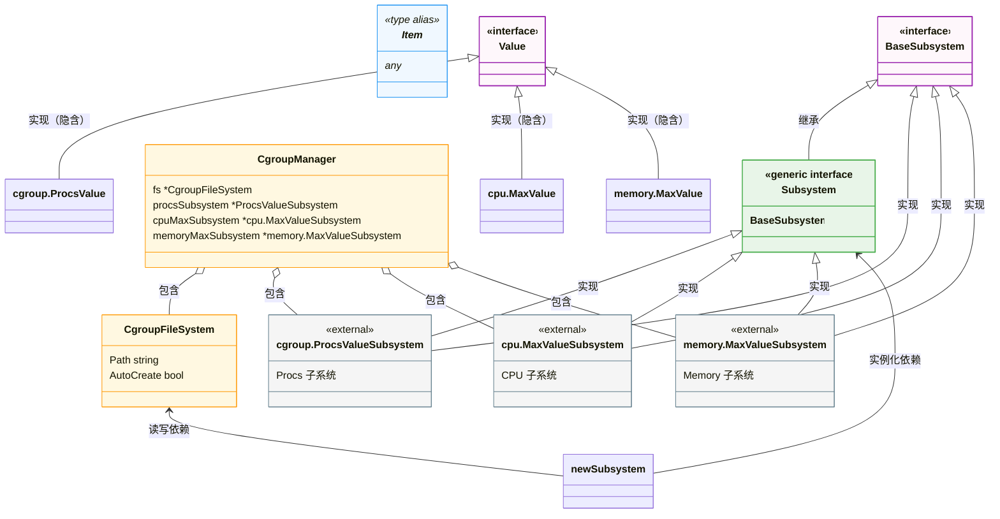

# 构造镜像

## 什么是构造镜像

“让容器跑在有镜像的环境中”，核心是解决当前容器的两个关键问题 ——**目录环境不隔离**、**挂载点继承父进程**，本质是让容器运行在一个**由镜像提供的、独立且标准化的文件系统环境**中，而非直接复用宿主机的目录和挂载。

### 有镜像的环境

>   先通俗理解：“有镜像的环境” = 容器的 “独立根文件系统”

可以把镜像理解为：**一个打包好的、包含完整操作系统 / 应用运行所需的 “文件系统快照”**；而 “有镜像的环境”，就是让容器不再复用宿主机的 `/` 根目录、不再继承宿主机的挂载点，而是将这个 “文件系统快照” 作为容器自己的 `/` 根目录（即 `chroot`/`pivot_root` 切换根），容器内看到的所有文件、目录、挂载点，都来自这个镜像，和宿主机完全隔离。

>   实现 “有镜像的环境” 的核心步骤

要让容器跑在 “有镜像的环境” 中，核心要加 3 步：

#### 准备镜像

先制作一个简单的镜像，这里我们使用 `busybox` 作为我们的镜像系统：

```shell
docker pull busybox
docker run -d busybox top -b
# 16423fa6038a4ad688f88fa21e38b54ef5a6d357453a2efe90f6d9248e236e81

# 通过docker export将镜像打包成tar
docker export -o busybox.tar 16423fa6038a4ad688f88fa21e38b54ef5a6d357453a2efe90f6d9248e236e81
tar -xvf busybox.tar -C busybox
```

#### 在容器初始化时切换根目录（pivot_root/chroot）

在你 `fork` 出的子进程中（`init` 进程），先执行 `pivot_root` 切换到镜像的根目录，这段代码中做了这些事情： 

1. 将一个新的目录root挂载到了挂载点； 
2. 创建 root/.pivot_root 并执行 pivot_root，执行完成之后，root 变成了我们的参数 root，宿主机的root被挂载到 root/.pivot_root 下；
3. 删除对 root/.pivot_root 的绑定，这个指向了我们的宿主机根目录。删除临时文件。 

至此，我们完成了对文件目录的隔离，进程再也无法访问宿主机的目录了。

```go
func pivotRoot(root string) error {
	// 这一步总的来说就是为了在不改变root本身内容的情况下，将它绑定到挂载点，以便于后续的pivot_root使用。
	// 1. pivot_root 要求新的根目录必须是一个独立的挂载点，而 mount --bind 就是实现这一要求的标准方法。
	// 2. mount --bind source target 是一个特殊的挂载方式，可以把它理解为文件系统级别的硬链接。
	// 		它的作用是将 source 目录的内容，原封不动地 “镜像” 到 target 目录。
	// 3. syscall.MS_BIND: bind 挂载的标志。
	// 4. syscall.MS_REC: 递归（Recursive）标志。这个标志非常重要，它会确保 root 目录下的所有
	//		子挂载点也一同被 bind 挂载过来，保证了新根文件系统的完整性。
	if err := syscall.Mount(root, root, "bind", syscall.MS_BIND|syscall.MS_REC, ""); err != nil {
		return fmt.Errorf("Mount rootfs to itself error: %v", err)
	}

	// 创建 rootfs/.pivot_root 存储 old_root
	pivotDir := filepath.Join(root, ".pivot_root")
	if err := os.Mkdir(pivotDir, 0777); err != nil {
		return err
	}

	// 在使用 pivot_root 切换根目录的时候，需要两个目录：
	//
	// 1. new_root，这个是我们切换的目标目录；
	// 2. old_root，这个并不是指的我们的宿主机的根目录，而是一个目录用来mount根目录的。
	if err := syscall.PivotRoot(root, pivotDir); err != nil {
		return fmt.Errorf("pivot_root %v", err)
	}
	// 修改当前的工作目录到根目录
	if err := syscall.Chdir("/"); err != nil {
		return fmt.Errorf("chdir / %v", err)
	}

	pivotDir = filepath.Join("/", ".pivot_root")
	// umount rootfs/.pivot_root
	if err := syscall.Unmount(pivotDir, syscall.MNT_DETACH); err != nil {
		return fmt.Errorf("unmount pivot_root dir %v", err)
	}
	// 删除临时文件夹
	return os.Remove(pivotDir)
}
```

#### 重新初始化容器内的挂载点

在执行 `mount` 命令之前，`/proc` 和 `/dev` 在我们的容器根文件系统中，仅仅是两个**普通的、空的目录**：

- `syscall.Mount("proc", "/proc", "proc", ...)` **明确地**告诉内核：“我要把 `/proc` 这个目录，和 `proc` 类型的虚拟文件系统关联起来。”内核收到指令后，会启动 `proc` 文件系统的驱动程序。这个驱动程序会开始动态地将内核中的进程信息、系统状态等，实时地生成为文件和目录，并 “填充” 到 `/proc` 目录中。
- `syscall.Mount("tmpfs", "/dev", "tmpfs", ...)` **明确地**告诉内核：“我要把 `/dev` 这个目录，和 `tmpfs` 类型的内存文件系统关联起来。”内核创建一个基于内存的临时文件系统，并将其挂载到 `/dev`。

>   注意，通常我们在 `mount` 的时候需要五个参数：
>
>   1. `source`
>   2. `target`
>   3. `fstype`
>   4. `flags`
>   5. `data`
>
>   表示将 `target` 以 `fstype` 的类型挂载到 `source`（其他两个参数我们暂时忽略）。
>
>   而 `proc` 和 `tmpfs` 是虚拟文件系统，它们的数据**不是来自一个物理设备**，而是由**内核动态生成的**。
>
>   - `proc` 的内容是内核中进程、内存等信息的实时映射。
>   - `tmpfs` 的内容存放在内存或交换分区中。
>
>   因此，它们不需要一个传统的 source（物理设备路径）。内核在处理这些文件系统类型时，会直接忽略 source 参数。

```go
func setUpMount() {
	pwd, err := os.Getwd()
	if err != nil {
		log.Errorf("Get current location error %v", err)
		return
	}
	log.Infof("Current location is %s", pwd)
	pivotRoot(pwd)

	//mount proc
	defaultMountFlags := syscall.MS_NOEXEC | syscall.MS_NOSUID | syscall.MS_NODEV
	syscall.Mount("proc", "/proc", "proc", uintptr(defaultMountFlags), "")

	syscall.Mount("tmpfs", "/dev", "tmpfs", syscall.MS_NOSUID|syscall.MS_STRICTATIME, "mode=755")
}
```

需要注意的一点是，**在`Exec()` 或者 `Start()` 的时候，我们可以指定代码的环境变量，为了使得 `busybox` 的命令能正常执行，我们必须指定它的环境变量：**

```go mark:4,5
func NewParentProcess(tty bool, commands []string, env []string) *exec.Cmd {
	// ...
	cmd.Dir = constant.DefaultPwd
    // env = "PATH=/bin"
	cmd.Env = env
	return cmd
}
```

## 镜像的write layer

### COW(Copy-On-Write)

`COW` 是现代软件系统中最为常用的几个性能优化思想之一，在 `linux进程创建`，`LSM数据结构` 等地方都有广泛应用，但是不论是在哪个场景下的应用，他的思想可以最简单被概括为：

1.  **分层划分**：将存储或资源划分为 **只读层（Read Layer）** 和 **可写层（Write Layer）**。
    -   只读层可以是多层（比如容器的基础镜像层 + 业务镜像层），具备**只读、可共享**的特性；
    -   可写层只有一层，是**专属、可修改**的，所有变更都只发生在这里。
2.  **统一视图层（Merge Layer）**：通过一个抽象的 “合并逻辑层”，对外提供**单一、透明的访问入口**，屏蔽底层分层的复杂性。
    -   **读操作**：**自上而下**搜索各层。优先读取可写层的数据；若可写层不存在，则依次向下读取只读层；最终返回找到的第一个结果。
    -   **写操作**：**不修改只读层**。若数据在只读层已存在，先将其**复制到可写层**，再修改可写层的副本；若数据不存在，直接在可写层创建。
    -   **删除操作**：**不删除只读层数据**。而是在可写层创建一个 **“删除标记”**（比如 OverlayFS 的 whiteout 文件），合并视图时会识别这个标记，对外表现为 “文件已删除”。

**这是CoW 在 “分层存储” 场景下的核心形态**，而 Linux 进程 fork 的 CoW 虽然原理一致，但表现形式略有不同（没有显性的 “Merge Layer”，而是通过内核内存页的权限标记 + 复制来实现）。

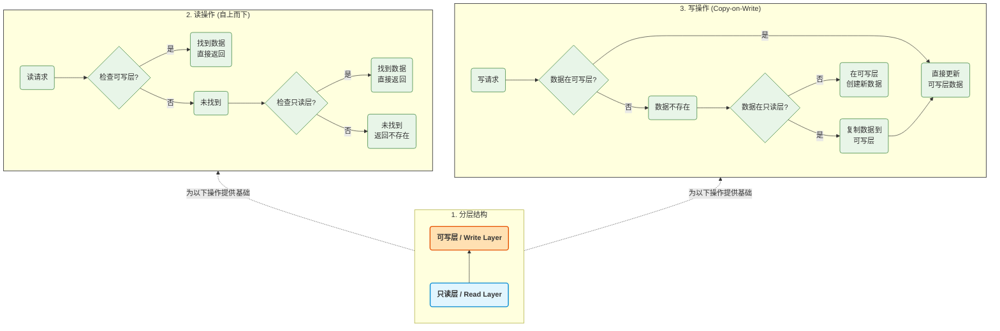


### Layer的原理

现在，通过pivot_root，我们已经可以在启动的时候隔离宿主机的文件系统了。现在还存在的一个问题是，我们对镜像的任何变更，都会影响原本的镜像，这个是不正常的。 

在老版本的docker中，通过AUFS实现了一个特性：在启动的时候会启动两个layer，一个write layer和一个container-init layer。现代容器技术（包括新版 Docker）已经不再推荐使用 AUFS，而是采用了更通用、更强大的 ** 存储驱动（Storage Driver）** 模型，其中最核心的技术是 **[Union File System (UnionFS)](#unionfs)** 的各种现代实现。这个特性的实现原理在现代容器中被称为 **Copy-on-Write (写时复制，CoW)**。

这个特性的逻辑可以如下描述：

1.   **只读层 (Read-only Layers)**：
     -   `busybox` 镜像本身就是一个**只读层**。它包含了容器运行所需的所有基础文件和目录；
     -   这个层永远不会被修改。如果多个容器基于同一个镜像启动，它们会共享这同一个只读层，极大地节省了磁盘空间。
2.   可写层 (Writable Layer)：
     -   当我们启动一个容器时，容器运行时会在只读的镜像层之上，**挂载一个新的、可写的层**。
     -   这个可写层通常是一个 `tmpfs`（内存文件系统）或者 `overlayfs` 的上层目录。

而这些特性都是基于 `UnionFs` 以及 `COW` 实现的：

1.   **UnionFS 的作用**：
     -   **UnionFS** 技术（如 `overlay2`, `devicemapper` 等）能够将多个不同的目录（可写层和只读层）“合并” 成一个统一的文件系统视图。
     -   从容器内部看，它只能看到一个统一的 `/` 根目录，但实际上这个目录是由多个层 “联合” 而成的。
2.   **Copy-on-Write (写时复制) 机制**：
     -   **读操作**：当容器需要读取一个文件时，UnionFS 驱动会先在可写层查找。如果找不到，它会继续向下在只读的镜像层中查找，并返回找到的文件。
     -   **写 / 修改操作**：当容器需要创建或修改一个文件时，UnionFS 驱动会：
         -   如果文件不存在：直接在**可写层**创建。
         -   如果文件已存在于只读层：UnionFS 驱动会**先将该文件从只读层复制到可写层**，然后再对可写层中的副本进行修改。原始的只读层文件保持不变。
     -   **删除操作**：删除一个文件时，UnionFS 驱动并不会真的删除只读层里的文件，而是在**可写层创建一个特殊的 “白名单” 文件（whiteout file）**，标记该文件已被删除。这样，在统一视图中，该文件就 “消失” 了。

### Layer的实现

整体的逻辑可以如图描述：

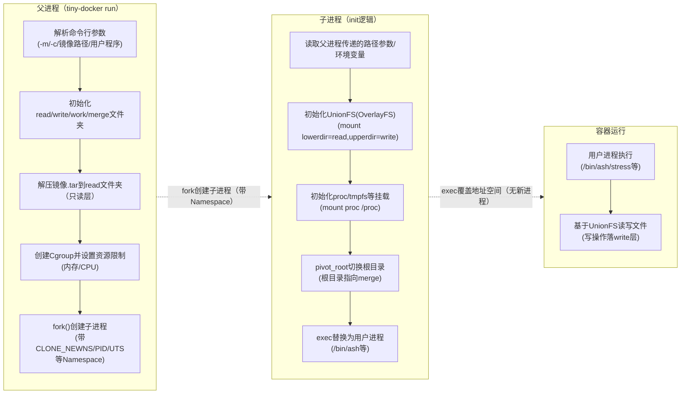


我们的实现思路是：

1.   `UnionFS` 的工作最少需要如下几个文件
     -   只读层
     -   可写层
     -   工作层
     -   对外暴露的挂载点
2.   在启动时，我们可以指定一个 `busybox.tar` 作为输入，这个输入模拟的就是docker中只读的镜像，将 `busybox.tar` 解压到 `/root/tiny-docker/busybox/read` 下；这个对应于我们的只读层；
3.   创建文件夹 `/root/tiny-docker/busybox/write`；这个对应于我们的可写层。
4.   工作层是一个临时文件目录，我们将他放到 `/root/tiny-docker/busybox/work`；
5.   对外暴露的挂载点我们使用 `/root/tiny-docker/busybox/merged`；
6.   执行 `mount -t overlay overlay -o lowerdir=${lower},upperdir=${upper},workdir=${work} ${merged}` ，这条命令的功能是：
     -   `-t overlay` 指定使用 overlay 文件系统；
     -   `overlay` 指定设备名称
     -   `-o lowerdir=${lower},upperdir=${upper},workdir=${work}` 指定了只读层，可写层，工作层；
     -   `${merged}` 指定了挂载点。

>   因为目前我们还没有实现镜像管理，那么我们可以直接使用 `busybox.tar` 作为我们的镜像，我们会将它解压后作为我们的只读层，那么我们的命令就可以修改到如下：
>
>   ```bash mark:5
>   ./tiny-docker run -it \
>                    -e PATH=/bin/ \
>                    -m 2000m \
>                    -c '10000 100000' \
>                    /root/busybox.tar /bin/ash
>   ```

1.   **`tiny-docker run` 启动**：父进程开始执行。
2.   **父进程初始化**：
     -   解析命令行参数。
     -   初始化 Cgroup 配置。
     -   **准备文件系统目录**：确保 `read`, `write`, `work`, `merged` 目录存在。
3.   **`fork()` 创建子进程**：
     -   子进程继承了父进程的资源。
     -   **在子进程中，立即设置 Mount Namespace** (`syscall.Unshare(syscall.CLONE_NEWNS)`)。这一步至关重要，它让子进程的后续挂载操作**不会影响到宿主机和父进程**。
4.   **子进程内部准备**：
     -   **执行 `mount` 命令**：在子进程中，执行 `mount -t overlay overlay -o lowerdir=...,upperdir=...,workdir=... /root/tiny-docker/busybox/merged`。此时，在子进程中 `ls /root/tiny-docker/busybox/merged`，应该能看到 `busybox` 的文件列表。
     -   **执行 `pivot_root`**：现在，将子进程的根目录切换到这个刚刚挂载好的 `merged` 目录。
     -   **执行 `chdir("/")`**：切换当前工作目录到新的根目录。
     -   **清理旧的挂载点**：卸载掉之前的 `merged` 目录的旧挂载点，它现在位于 `.pivot_root` 目录下。
5.   **`exec()` 执行用户程序**：在子进程中，执行 `execve("/bin/ash", ...)`。

#### EnsureDirectoryExists

确保文件存在的实现很简单，因为go已经为我们封装好了所有的函数，我们需要做的是，在初始化container之前去执行对应的逻辑即可。

```go mark:3, 18
func EnsureDirectoryExists(path string) error {
	logrus.Infof("Ensuring directory exists: {%s}", path)
	if err := os.MkdirAll(path, 0755); err != nil {
		logrus.Infof("Failed to create directory %s: %v", path, err)
		return err
	}

	logrus.Infof("Directory %s is ready.", path)
	return nil
}

// init read-layer, write-layer, work-layer, merge-layer for container
func setupLayer() error {
	name := conf.GlobalConfig.Meta.Name
	// ...

	var err error
	if err = util.EnsureDirectoryExists(readPath); err != nil {
		logrus.Errorf("ensure directory error : %s", err.Error())
		return err
	}

    // ...

	return nil
}
```

#### 子进程内部准备

子进程的内部，我们只需要按照前面描述的逻辑去执行即可，但是这里存在一个问题是，我们的逻辑是：通过 exec 创建一个子进程，并切换namespace，那么：

1.   在通过exec创建子进程之后，`GlobalConfig` 不再可用，因为 `exec` 会使用一个全新的内存地址空间替换父进程的内存地址空间；
2.   在子进程中，由于我们切换了`namespace`，它也没有办法读取到我们的配置文件；

为此，我们需要有一个方式来作为父进程和子进程中间传递信息的桥梁，有三个方式：

1.   通过命令行参数传递，它的实现最为简单，但是当命令行过长时维护困难；
2.   通过环境变量传递，他的实现也很简单，并且非常灵活：
     -   比命令行参数更灵活，适合传递多个配置。
     -   信息不会暴露在 ps 输出中，更安全。
     -   仍然不适合传递非常复杂的结构化数据。
     -   环境变量的命名需要全局唯一，以避免冲突。
3.   通过文件描述符传递，它是最健壮也最灵活的方式，但是实现相对比较复杂。

>   这里，我们选用**环境变量传参**的方式来实现我们的逻辑。

先读取我们的配置文件：

```go mark:2,6,10,14,18
type FsConfig struct {
	Root string `yaml:"root"`
}

func (c Config) ReadPath(containerId string) string {
	return filepath.Join(c.Fs.Root, containerId, "read")
}

func (c Config) WritePath(containerId string) string {
	return filepath.Join(c.Fs.Root, containerId, "write")
}

func (c Config) WorkPath(containerId string) string {
	return filepath.Join(c.Fs.Root, containerId, "work")
}

func (c Config) MergePath(containerId string) string {
	return filepath.Join(c.Fs.Root, containerId, "merge")
}
```

随后将它添加到我们的环境变量中

```go mark:2,3,9,10
func Run(commands RunCommands) error {
	parent := container.NewParentProcess(commands.Tty, commands.Args, commands.UserEnv)
	setupEnv(parent)
    // ...
	return nil
}

func setupEnv(cmd *exec.Cmd) {
	util.AppendEnv(cmd, constant.MetaName, conf.GlobalConfig.Meta.Name)
	util.AppendEnv(cmd, constant.FsBasePath, conf.GlobalConfig.Fs.Root)
    // ...
}
```

这里需要注意的是，由于我们的程序是基于 `UnionFS` 上的，所以我们需要修改我们的工作目录：

```go mark:3,4
func NewParentProcess(tty bool, commands []string, env []string) *exec.Cmd {
	// ...
	cmd.Dir = conf.GlobalConfig.MergePath()
	cmd.Env = env
	return cmd
}
```

此时，我们只需要在 `pivot_root` 之前，通过 `UnionFS` 挂载我们的文件系统即可：

```go mark:4-6
func RunContainerInitProcess(command string, args []string) error {
	logrus.Infof("init process command: {%s}, args: {%v}", command, args)
	var err error
	if err = setupUnionFs(); err != nil {
		return err
	}
	logrus.Info("setup layer success.")
	if err = setupMount(); err != nil {
		return err
	}
	// ...
	return nil
}
```

## 镜像打包

镜像打包的逻辑非常简单，就是进入到我们指定的目录中，将文件打包，唯一需要注意的是，我们的系统是基于 `UnionFS` 的，我们在打包的时候也需要先对UnionFS进行mount，随后打包我们的 `merge` 文件夹即可。

```go mark:4-13
func Commit(cmd conf.CommitCommands) error {
	logrus.Infof("Commit Commands: %s", cmd)
	conf.LoadCommitConfig(cmd)
	if err := SetupUnionFsFromConfig(); err != nil {
		logrus.Error("error setting up union fs", err)
		return err
	}
	defer func() {
		err := ClearUnionFsFromConfig()
		if err != nil {
			logrus.Error("error clear up union fs", err)
		}
	}()
	root := conf.GlobalConfig.MergePath()
	return util.Tar(conf.GlobalConfig.Cmd.DstImage, root)
}
```

# 容器的进阶管理

## 从daemon到containerd/runc

### daemon

目前我们的容器的基本功能已经实现了，但是我们还缺少一个 `daemon` 进程来为我们管理我们的容器，它应该需要支持以下功能：

-   `docker ps` 查看当前正在执行的容器
-   `docker logs` 查看容器的输出
-   `docker exec` 进入一个已经创建好的容器

想要支持这些功能，我们就需要**在父进程创建子进程之后detach子进程**，在老版本的docker中，所有的容器init进程都是从docker daemon中fork出来的，这也带来了一个问题：假设我们当前存在如下的进程层级关系：

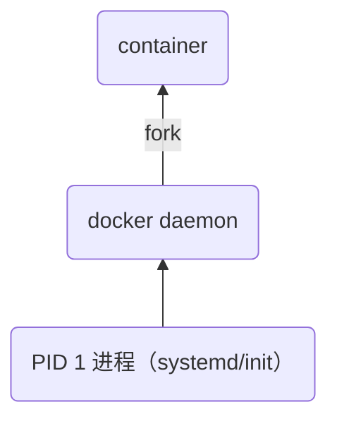

当 `daemon` 进程崩溃，根据linux的孤儿进程收养机制：

1.   `container` 首先会变成孤儿进程；
2.   `linux` 将 收养 `container` 进程（也就是此时 container 的 PPID 为 1），由 `INITPROC` 来管理它的资源回收；

我们面临的问题是：

1.   所有的 container 虽然还可以正常执行，但是daemon存储的所有容器元数据都已经丢失了；
2.   新启动的daemon进程无法识别这些孤儿容器 -- `docker ps/logs/stop` 等指令都无法执行；
3.   container占用的端口，volume，网络命名资源等都已经无法通过docker清理，只能手动操作；

### containerd

为了解决daemon进程崩溃引发的一系列问题，**docker在1.11+引入了 `containerd + runc` 的分层架构**用来解决这个问题：

1.   daemon 不再是容器的直接父进程：
     -   `dockerd`（daemon）仅负责 API / 调度，他通过gRPC和 `containerd` 交互来实现对所有容器管理逻辑；
     -   `containerd` 负责容器生命周期管理；
     -   `runc` 是轻量级工具，仅负责 fork/exec 启动容器 init 进程，启动后立即退出；
     -   最终容器 init 进程的父进程是 `containerd-shim`（而非 dockerd/containerd）；
2.   **containerd-shim 的核心作用**：
     -   作为容器进程的「托管父进程」，即使 dockerd/containerd 挂掉，shim 仍运行；
     -   维护容器的 STDIO / 日志 / 状态，daemon 重启后可通过 shim 重新识别容器；
     -   容器进程的生命周期与 daemon 解耦，daemon 挂掉 / 重启不影响容器的可管理性。

### containerd-shim

>   看到这里，你可能会有一个问题：`containerd-shim` 也是一个进程，如果它崩溃了，那么我们不是面临了和`daemon` 崩溃一样的问题吗？这是因为**`containerd-shim` 的「轻量级、无状态、可重建」特性**。这也是他名字的由来：`shim` 表示的是：**a thin packing strip or washer often used with a number of similar washers or strips to adjust a clearance for gears, etc** 

对于老的docker架构，所有的init进程都是从daemon fork出来的，它的职责是中心化的：

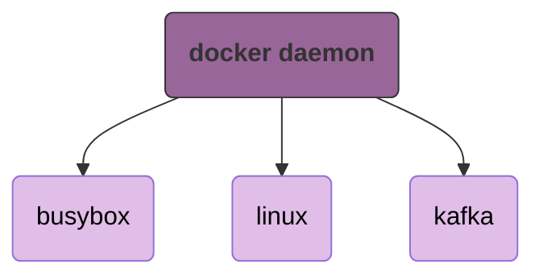

而 `containerd-shim` 的设计是**一个容器对应一个shim进程**：

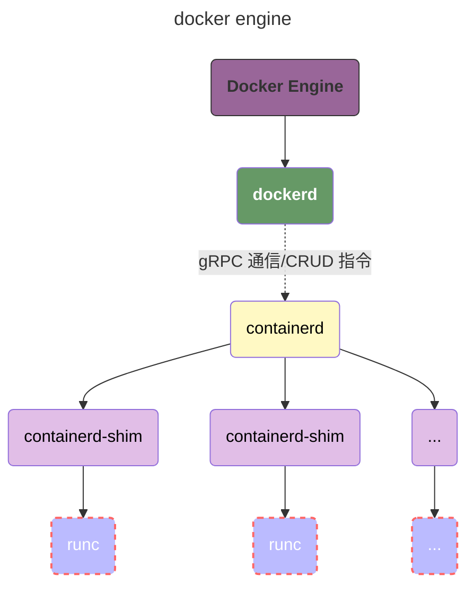

`containerd-shim` 的职责非常单一，他只负责**某一个特定的container**的生命周期管理：

1.   **作为容器 `init` 进程的直接父进程**：承接 `runc` 启动容器后的父子关系，`runc` 启动容器后会立即退出，`shim` 接管成为容器的父进程；
2.   **接管容器的 IO 与日志**：负责将容器的 `stdin/stdout/stderr` 转发给 `containerd`，或写入日志文件；
3.   **处理容器的退出事件**：当容器进程退出时，`shim` 负责回收僵尸进程、收集退出码，并通知 `containerd`；
4.   **无状态设计**：`shim` 不存储容器的元数据（元数据存在 `containerd` 的持久化存储中），它只做「实时转发和事件上报」。

当某个容器的 `containerd-shim` 进程崩溃时：

1.   容器进程由linux的孤儿进程机制托底继续正常执行：
     -   容器进程本身的运行不受任何影响；
     -   该容器的 `init` 进程会变成**孤儿进程**，按照 Linux 进程收养规则，最终会被 `PID 1`（`systemd`/`init`）接管；
2.   容器元数据不会丢失：containerd 保存了完整的容器配置
     -   `containerd-shim` 是**无状态**的，容器的所有核心元数据（容器 ID、配置、网络 / 存储信息、镜像层信息等）都保存在 `containerd` 的持久化存储中（通常是 `/var/lib/containerd`）。
3.   `shim` 进程可重建：`containerd` 会自动「复活」新的 shim
     -   一旦检测到某个容器的 `shim` 崩溃，`containerd` 会**立即重新启动一个新的 `shim` 进程**；
     -   新 `shim` 进程会根据 `containerd` 中保存的容器元数据，重新连接到容器进程的 IO、接管父子关系（通过 Linux 的进程 `ptrace` 或 cgroup 关联）；
     -   重建后的 `shim` 会继续履行「IO 转发、事件上报」的职责，整个过程对容器进程**完全透明**。

### runc

目前，我们所有其他的组件的职责边界都很清晰，只有 `runc` 还是比较模糊 -- 为什么我们不能直接让 `containerd` 来负责进程的 `fork`/`exec` 等操作呢？

我们要知道 `runc` 的核心定位：他是 `OCI` 标准的容器运行时，它的唯一核心职责是：**根据 OCI 规范的配置文件，创建 / 销毁容器进程（完成 Namespace/Cgroup 配置、rootfs 挂载、`fork/exec` 等底层操作）**。OCI 规范是容器生态的「通用语言」，而 `runc` 是这个规范的「官方参考实现」。

-   如果让 `containerd-shim` 直接负责 `fork/exec`，`shim` 会和「容器进程创建的底层逻辑」深度耦合，不同厂商（Docker/CRI-O/containerd）会各自实现一套 `fork/exec` 逻辑，导致容器配置不兼容（比如 Docker 容器无法在 CRI-O 中运行）；
-   引入 `runc` 后：
    -   `containerd-shim` 只需要「调用 `runc`」，无需关心 `fork/exec`、Namespace 配置的底层细节；
    -   任何符合 OCI 规范的运行时（如 `crun`、`kata-runtime`）都可以直接替换 `runc`，无需修改 `containerd`/`shim` 的代码 —— 比如想使用轻量级的 `crun` 或安全的 `kata-runtime`，只需替换 `runc` 二进制文件即可。

举几个简单的例子：

1.   cgroup 存在 v1 和 v2 两个版本，两者的配置语法、挂载路径、限制方式完全不同；
2.   Linux 内核不断新增 Namespace 类型（比如 User Namespace 实现容器内非 root 运行，Time Namespace 隔离容器时间），不同内核版本支持的 Namespace 不同；
3.   需要进行容器运行时的替换（runc → crun/kata-runtime）：业务需要优化容器启动速度（换轻量级的 crun），或提升安全性（换 kata-runtime 基于虚拟机隔离）：

不论是哪种情况，如果让 containerd-shim 来实施都会违背我们containerd-shim负责container的生命周期管理的原则，过多的陷入不必要的细节中；

### 新老方案的对比

从 `daemon` 迁移到 `containerd/runc` 的实现中，最重要的是：对容器管理的职责进行了拆分，从 `daemon` 的一个大而全的中心化管理端拆分为了负责api交互的`dockerd`，负责生命周期管理以及元数据的持久化存储的`containerd`，负责单个container的管理的`containerd-shim`，负责进程的fork/exec的`runc`。

他们互相关联并且各自负责自己的核心业务逻辑：

1.   当 `dockerd` 崩溃时不影响容器的运行而只会影响 `docker ps/logs/stop` 等指令的执行；当用户重新拉起`dockerd`时，它直接可以开始和 `containerd` 通信继续正常服务；
2.   当 `containerd` 崩溃时，所有的 `containerd-shim` 和容器进程由 Linux 孤儿机制保证继续正常执行；而 `containerd` 通常由系统级守护进程（如 `systemd`）负责重新启动（`dockerd` 不直接重启 `containerd`）。
3.   当 `containerd-shim` 崩溃时，所有的 `container` 由linux的孤儿机制来保证继续正常执行；而 `containerd-shim` 则会被 `containerd` 来重新拉起；新 `shim` 进程会根据 `containerd` 中保存的容器元数据，重新连接到容器进程的 IO（通过文件描述符 / 日志文件），并通过 cgroup / 进程命名空间关联容器进程
4.   `runc` 作为标准化的容器运行时，仅负责一次性的进程创建（fork/exec + Namespace/Cgroup 配置），执行完即退出，无长期运行的风险，进一步降低了整体架构的故障概率。

理论上来说，我们也可以让 `daemon` 进程来持久化元数据，并且增加一个额外的 `daemon-daemon` 来保证在它异常时会被正常拉起，但是这样违背了单一职责原则，并且单进程挂掉的概率显然会比多个进程崩溃的概率来的更大。

## 容器的后台运行

>   在开始这一节的开发之前，我们可以查看QA中的这些信息来详细了解一些关于linux中的进程组，终端等的知识：
>
>   -   [tty控制权](#tty控制权)
>   -   [linux中的进程组和会话](#linux中的进程组和会话)
>   -   [会话和终端](#会话和终端)
>   -   [进程和子进程的协同](#进程和子进程的协同)

### detach模式运行容器

在我们目前的代码逻辑中，父进程会等待子进程的结束：

```go mark:8-11
func Run(commands conf.RunCommands) error {
	// ...
	if err = parent.Start(); err != nil {
		logrus.Error(err, "error start process.")
		return err
	}

	if commands.Tty {
		logrus.Infof("Running {%s} in attach mode.", conf.GlobalConfig.ImageName())
		return parent.Wait()
	}

	logrus.Infof("Running {%s}, pid = {%d} exit.", conf.GlobalConfig.ImageName(), os.Getpid())
	return nil
}
```

但是，当我们修改代码到 detach 模式时我们会发现一个有趣的现象 -- 子进程竟然和父进程一起退出了！

```sh mark:2
./mini-docker run \
    -d \
    -e PATH=/bin/ -m 2000m -c '10000 100000' /root/images/busybox.tar /bin/ash
```

子进程并没有如我们所预料的被linux初始进程接管：唯一的输出就是我们的grep本身！

```sh mark:3
ps -eo pid,ppid,pcpu,cmd | grep /bin/ash

#1767832 1745835  0.0 grep --color=auto --exclude-dir=.bzr --exclude-dir=CVS --exclude-dir=.git --exclude-dir=.hg --exclude-dir=.svn --exclude-dir=.idea --exclude-dir=.tox --exclude-dir=.venv --exclude-dir=venv /bin/ash
```

这里，导致我们子进程和父进程一起退出的原因，是因为**子进程没有正确的脱离父进程的进程组（Process Group）和会话（Session），这样父进程在退出的时候会触发子进程的 `SIGHUP`（终端挂起） 信号，导致子进程被终止**。具体的信息可以查看[进程和子进程的协同](#进程和子进程的协同)，我们的主线还是需要解决这个问题：我们需要做的有几点：

1.   为我们的命令行新增一个参数 `-d` 指定以 `detach` 模式运行；
2.   当我们指定 `detach` 模式运行时：
     -   为我们的子进程创建一个新的 `session`，避免父进程退出时产生的 `SIGHUP` 信号导致子进程一起退出；
     -   避免子进程的 `session` 绑定到任何的 `终端`，可以通过两次 `Setsid()` 实现；

于是我们简单的修改我们的创建子进程命令，这里我们实现了上面所说的逻辑：

```go mark:32-35,41-43
func newParentProcess() *exec.Cmd {
	commands := conf.GlobalConfig.Cmd
	args := []string{"init"}
	for _, arg := range commands.Args {
		args = append(args, arg)
	}
	cmd := exec.Command(constant.UnixProcSelfExe, args...)
	cmd.SysProcAttr = &unix.SysProcAttr{
		Cloneflags: unix.CLONE_NEWUTS |
			unix.CLONE_NEWPID |
			unix.CLONE_NEWNS |
			unix.CLONE_NEWNET |
			unix.CLONE_NEWIPC,
		Unshareflags: unix.CLONE_NEWNS,
	}

	setTtyMode(cmd, commands.Tty)
	setDetachMode(cmd, commands.Detach, commands.Tty)

	cmd.Dir = conf.GlobalConfig.MergePath()
	cmd.Env = commands.UserEnv
	return cmd
}

func setTtyMode(cmd *exec.Cmd, tty bool) {
	cmd.SysProcAttr.Setctty = tty
	if tty {
		cmd.Stdin = os.Stdin
		cmd.Stdout = os.Stdout
		cmd.Stderr = os.Stderr
	} else {
		nullFile := nullFileWithPanic()
		cmd.Stdin = nullFile
		cmd.Stdout = nullFile
		cmd.Stderr = nullFile
	}
}

func setDetachMode(cmd *exec.Cmd, detach bool, tty bool) {
	if detach {
		logrus.Infof("Running new process in detach mode.")
		cmd.SysProcAttr.Setsid = true
		cmd.SysProcAttr.Setctty = false
	} else {
		logrus.Infof("Running new process in attach mode.")
		cmd.SysProcAttr.Setsid = true
		cmd.SysProcAttr.Noctty = !tty
	}
}

```

随后，我们可以通过一个简单的指令来查看我们的 `detach` 模式是否正常，注意，这里我们使用了 `--` 作为选项终止符，具体的说明可以参考 [选项终止符](#选项终止符)：

```sh
./mini-docker run \
    -d \
    -e PATH=/bin/ \
    /root/images/busybox.tar \
    -- \
    /bin/ash -c "while true; do sleep 1; done"
```

查看我们的进程，我们可以看到：子进程仍然在正常的执行中，但是他的父进程已经变成了 `1`，因为父进程退出后被linux初始进程收养。

```sh
ps -eo pid,ppid,pcpu,cmd | grep /bin/ash | grep -v grep

# 2087031       1  0.0 /bin/ash -c while true; do sleep 1; done
```

## 容器的状态管理

### mini-dockerd

通过我们的努力，现在我们已经可以在 `detach` 模式下运行我们的容器了，那么新问题来了：**我怎么知道我当前容器的状态？**按照我们之前对新版本docker的实现的描述，我们应该是需要实现 `dockerd`/`containerd`/`containerd-shim`/`runc` 等逻辑，但是这对于一个玩具项目来说太过于复杂了，所以这里我决定参考老版本的docker，重新设计一套轻量级的容器生命周期管理方法。

我们有两种不同的设计思路：

1.   不抽象任何的daemon进程，让 `mini-dorker` 的每个指令在执行（例如 `docker run`/`docker start`）的时候去记录自身的状态到特定的目录；当我们需要查询容器状态时，启动一个init进程去这个特定的目录并返回给用户；
2.   抽象一个用来管理容器声明周期的 `daemon` 进程，这里让我们简单的把他称之为 `mini-dockerd`，**所有的container都是从mini-dockerd这个进程fork()得到，也就是说他是所有container进程的父进程**，它直接负责容器的全部状态管理，通过 `gRPC` 或者其他的方式来和 `mini-dockerd` 通信。
     -   当我们执行 `mini-docker start` 时：
         1.   `mini-docker` 会启动一个全新的进程，他向 `mini-dockerd` 发送 `start` 指令请求创建 container；
         2.   `mini-dockerd` 接受到请求，会实现我们所有容器初始化必要的操作：分配容器ID，创建文件夹等；
         3.   `mini-dockerd` 通过 `fork()` 创建一个全新的进程，这个进程就是我们的 container；container 进程内部执行我们之前的初始化流程：确认detach模式，初始化文件系统等；
         4.   随后 `mini-dockerd` 会将全部必要的信息记录下来；
         5.   `mini-docker` 进程退出；
     -   当我们执行 `mini-docker ps` 时：
         1.   `mini-docker` 会启动一个全新的进程，向 `mini-dockerd` 发送 `ps` 指令请求查询数据；
         2.   `mini-dockerd` 通过之前记录的信息，查询数据并向 `mini-docker` 返回结果；
         3.   `mini-docker` 向Stdout输出日志，并退出进程；

这两种方式都比现代docker的生命周期管理更加简单，但是他们之间也有各自的优缺点：

1.   第一种方式的最大的问题在于，所有的容器进程没有一个共同的父进程 -- 他们的父进程是各自的 `mini-docker`，或者是 `detach` 模式下被 PID=1 的进程收养，这为我们的管理带来了很大的挑战；
2.   第二种方式的最大的问题在于，我们需要增加额外的依赖以便于和 `mini-dockerd` 进行跨进程的通信，并且我们需要非常细心的去设计 `mini-dockerd`  的接口以便于适应我们不断变化的管理需求。

这里，我们选择了第二个方案，具体的架构逻辑如下图所示。注意，这里的 `mini-docker` 和 `mini-dockerd` 的通信我选择使用了 [UDS](#uds)。

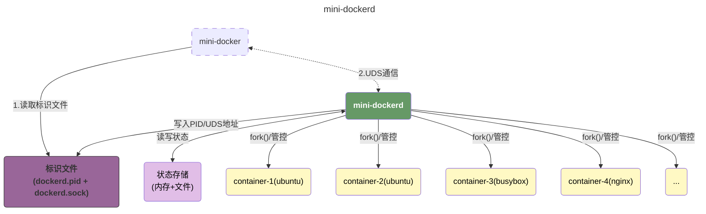

### 通过UDS通信

有了技术方案之后，后面的实现就没有那么复杂了，但是我们现在需要一个方式，来提供给客户端和服务端来进行通信。这里我们选择了 [UDS](#uds) 作为我们的通信方式。这个方案虽然限制比较多，但是足够轻量级。我们的客户端和服务端的代码都不复杂，这里直接给出：

#### UDS服务端

```go mark:17-20,32-36
func CreateUdsServer() error {
	if isUdsServerRunning() {
		logrus.Fatalf("UDS server is already running")
		return nil
	}

	udsPath := conf.RuntimeDockerdUdsFile.Get()

	err := util.EnsureFileExists(udsPath)
	if err != nil {
		logrus.Errorf("UDS server uds path does not exist: {%s}", udsPath)
		return err
	}
	_ = os.Remove(udsPath)

	network := constant.OS
	listener, err := net.ListenUnix(network, &net.UnixAddr{
		Name: udsPath,
		Net:  network,
	})

	if err != nil {
		return constant.ErrCreateUdsServer.Wrap(err)
	}

	defer listener.Close()

	if err = os.Chmod(udsPath, 0600); err != nil {
		return err
	}

	pidFile := conf.RuntimeDockerdUdsPidFile.Get()
	if err = util.EnsureFileExists(pidFile); err != nil {
		logrus.Errorf("UDS pid file does not exist: {%s}", pidFile)
		return err
	}

	if err = os.WriteFile(pidFile, []byte(fmt.Sprintf("%d", os.Getpid())), 0600); err != nil {
		logrus.Errorf("error write file : %v", pidFile)
		return err
	}

	logrus.Infof("start UDS for mini-dockerd on : %s", udsPath)

	for {
		conn, err := listener.AcceptUnix()
		if err != nil {
			logrus.Errorf("error accept unix：%v\n", err)
			continue
		}
		go handleClient(conn)
	}
}
```

其中，两段标准的代码：

-   `17-20` 用来监听 `dockerd.sock` 文件的输入；
-   `32-35` 用来绑定 `UDS` 进程，这样我们可以知道当前 `UDS` 进程的存活状态。

#### UDS客户端

```go mark:8-11,18-23,25-30
func SendRequest(req *Request) (error, Response) {
	if !isUdsServerRunning() {
		logrus.Fatalf("UDS server is not running")
		return constant.ErrIllegalUdsServerStatus, Response{}
	}

	// connect client
	conn, err := net.DialUnix(constant.OS, nil, &net.UnixAddr{
		Name: conf.RuntimeDockerdUdsFile.Get(),
		Net:  constant.OS,
	})
	if err != nil {
		logrus.Errorf("failed to dial mini-dockerd: %v\n", err.Error())
		return err, Response{}
	}
	defer conn.Close()

	reqData, _ := json.Marshal(req)
	_, err = conn.Write(reqData)
	if err != nil {
		logrus.Errorf("failed to send uds request: %v\n", err.Error())
		return err, Response{}
	}

	buf := make([]byte, 1024*10)
	n, err := conn.Read(buf)
	if err != nil {
		logrus.Errorf("failed to read uds response: %v\n", err)
		return err, Response{}
	}

	var rsp Response
	err = json.Unmarshal(buf[:n], &rsp)
	if err != nil {
		logrus.Errorf("error unmarshal uds response: %v\n", err.Error())
		return err, Response{}
	}

	return nil, rsp
}
```

标注的三段代码：

-   `8-11` 请求连接UDS服务端；
-   `18-23` 通过获取的连接想UDS服务端发送请求数据；
-   `25-30` 读取UDS服务端的返回；

### `mini-docker ps`

下面是我们实现 `mini-docker ps` 的逻辑：

#### 逻辑抽象

我们将所有的请求都抽象为 `ActionHandler`，每一个用户的请求都绑定到一个对应的 `Action`，这样我们只需要按照声明去实现请求，就可以轻松的为我们的 `mini-docker` 添加额外的操作；

```go
type ActionHandler func(req Request) (rsp Response, err error)

func AddHandler(action constant.Action, ac ActionHandler) {
	registry[action] = ac
}

func handleRequest(req Request) (Response, error) {
	h, ok := registry[req.Act]
	if !ok {
		return ErrorResponse(fmt.Errorf("%s", req.Act.String()), constant.ErrUnsupportedAction)
	}
	return h(req)
}
```

#### 绑定handler

这里，我们为 `ps` 命令绑定我们的处理函数 `handlePs`

```go mark:2
func init() {
	handler.AddHandler(constant.Ps, handlePs)
	handler.AddHandler(constant.Commit, handleCommit)
	handler.AddHandler(constant.Run, handleContainerRun)
	handler.AddHandler(constant.Stop, handleContainerStop)
	handler.AddHandler(constant.Logs, handleContainerLogs)
}
```

#### handlePs的实现

`handlePs` 的逻辑实现非常简单，就是在收到请求之后，去读取我们存储容器状态的文件读取所有的容器状态，并且按照请求中的要求返回。

```go
func ps(command conf.PsCommand) ([]entity.Container, error) {
	allContainers, err := readAllContainers()
	if err != nil {
		logrus.Errorf("error reading all containers: %v", err)
		return nil, err
	}

	if command.All {
		return allContainers, nil
	}

	targetContainers := make([]entity.Container, 0)
	for _, container := range allContainers {
		if container.Status != entity.ContainerRunning {
			continue
		}
		targetContainers = append(targetContainers, container)
	}
	return targetContainers, nil
}
```

### 通过 `nsenter` 进入已经创建好的容器

接下来，我们需要开始实现一个相对复杂的逻辑 -- **假设我们存在一个id等于 `28f4ccc7b638` 的 `ubuntu` 容器，我们可以通过`docker exec -it 28f4ccc7b638 /bin/bash` 进入到容器内部。**这个逻辑是通过 [nsenter](#nsenter) 来实现的。整体的实现步骤如下图所示：

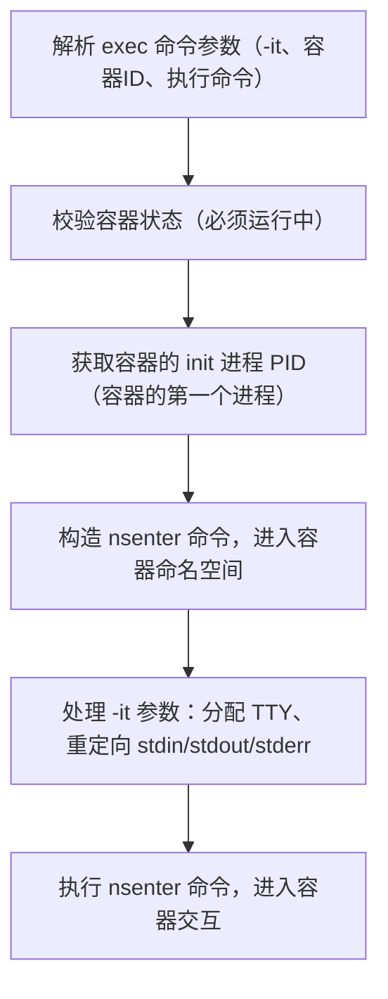


这里我们可以先查看 [/proc进程相关](#/proc进程相关) 这一小节中关于一个 docker 容器的例子，以及 [nsenter和docker exec的区别](#nsenter和docker exec的区别) 这一小节来初步了解如何使用 `nsenter` 来模拟 `docker exec`。

#### 流程

所以，我们现在可以把我们整体实现 `exec` 流程表示为如下：

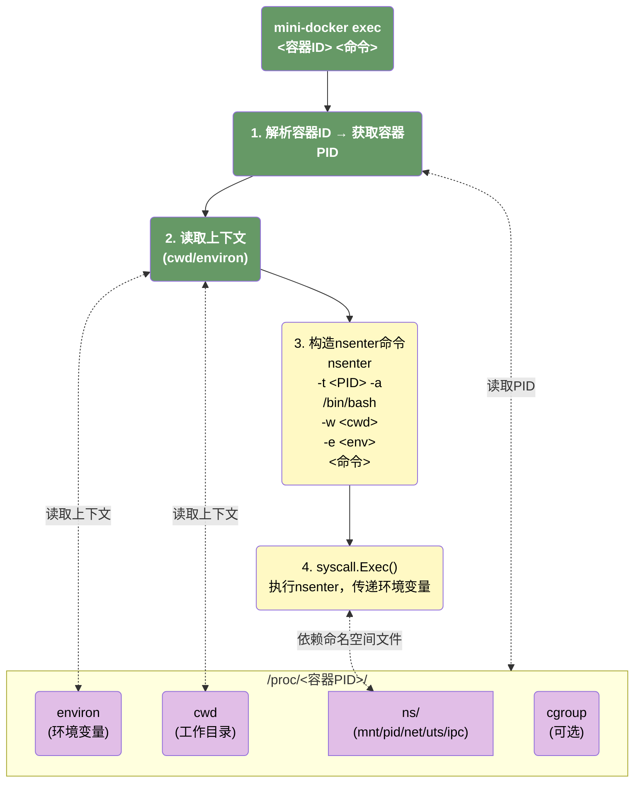

#### 实现

在思路清楚之后，具体的实现就变得简单了：只需要拼好我们的命令行参数即可。

```go mark:12-15
func NsenterExec(pid int, args []string, env []string) error {
	path, err := exec.LookPath(constant.Nsenter)
	if err != nil {
		panic(err)
	}
	argv := []string{
		constant.Nsenter,
		"-t", fmt.Sprintf("%d", pid),
		"-a",
	}
	argv = append(argv, args...)
	if err = syscall.Exec(path, argv, env); err != nil {
		logrus.Errorf("error exec %s : %v", path, err)
		return err
	}
	return nil
}

func ReadNsEnv(pid int) ([]string, error) {
	data, err := os.ReadFile(fmt.Sprintf("/proc/%d/environ", pid))
	if err != nil {
		return nil, err
	}
	return strings.Split(string(data), "\x00"), nil
}
```

# QA

## Proc

`/proc` 是 Linux 系统中**核心的伪文件系统（pseudo-filesystem）**，由内核实时生成和维护，并非存储在磁盘上的真实文件，而是内核暴露系统 / 进程状态、配置的 “接口”—— 通过读写 `/proc` 下的文件，可查看 / 调整内核、进程、硬件的运行参数，是运维和容器 / 内核开发的核心工具。

### 核心特性

1. **无磁盘存储**：所有文件 / 目录由内核动态生成，占用磁盘空间为 0（`df -h` 查看 `/proc` 挂载点会显示 0 大小）；
2. **实时性**：文件内容随系统 / 进程状态实时变化（如 `/proc/1/status` 会实时反映 PID=1 进程的资源使用）；
3. **权限管控**：大部分文件仅 root 可修改，普通用户仅能读取（部分进程文件仅属主可访问）；
4. **挂载类型**：默认以 `proc` 类型挂载（`mount -t proc proc /proc`），每个 PID Namespace 可挂载独立的 `/proc`（容器隔离的核心）。

### 目录结构

>第一类是进程专属目录：`/proc/$<PID>/`：每个运行的进程对应 `/proc` 下一个以 PID 命名的目录（如 `/proc/1/` 对应 PID=1 的 `systemd` 进程），包含该进程的所有核心信息：

| 关键文件 / 目录       | 作用                                                        |
| --------------------- | ----------------------------------------------------------- |
| `/proc/<PID>/status`  | 进程核心状态（PID、UID/GID、内存、CPU、信号、Namespace 等） |
| `/proc/<PID>/cmdline` | 进程启动的完整命令行（以 `\0` 分隔参数）                    |
| `/proc/<PID>/cgroup`  | 进程所属的 Cgroup 组（v1/v2 路径）                          |
| `/proc/<PID>/ns/`     | 进程所属的所有 Namespace（符号链接）                        |
| `/proc/<PID>/fd/`     | 进程打开的文件描述符（符号链接到真实文件）                  |
| `/proc/<PID>/root`    | 进程的根目录（chroot / 容器的根文件系统）                   |
| `/proc/<PID>/mounts`  | 进程可见的挂载点（文件系统 Namespace 隔离关键）             |

> 第二类是系统级信息目录 / 文件（全局状态）：这类文件 / 目录反映整个系统的运行状态，是运维和开发的核心参考

| 关键文件 / 目录      | 作用                                           |
| -------------------- | ---------------------------------------------- |
| `/proc/cpuinfo`      | CPU 硬件信息（核心数、架构、频率等）           |
| `/proc/meminfo`      | 内存使用状态（总内存、空闲、缓存、交换分区等） |
| `/proc/mounts`       | 系统全局挂载点（等价于 `mount` 命令）          |
| `/proc/sys/`         | 内核参数配置（可动态修改，无需重启）           |
| `/proc/self/`        | 指向当前进程的 PID 目录（符号链接）            |
| `/proc/thread-self/` | 指向当前线程的 TID 目录                        |
| `/proc/uptime`       | 系统运行时间（秒）                             |
| `/proc/net/`         | 网络状态（TCP/UDP 连接、网卡、路由等）         |

> 第三类是特殊文件（内核交互接口）：

| 文件            | 作用                            |
| --------------- | ------------------------------- |
| `/proc/kmsg`    | 内核日志（等价于 `dmesg` 命令） |
| `/proc/loadavg` | 系统负载均值（1/5/15 分钟）     |
| `/proc/version` | 内核版本 + 编译信息             |
| `/proc/cgroups` | Cgroup 子系统状态（v1）         |
| `/proc/cmdline` | 系统启动时的内核参数            |

## Namespace

### Namespace 是什么？

Namespace 本质是 Linux 内核为进程创建的「**资源隔离边界**」—— 不同 Namespace 内的进程，只能看到自己 Namespace 内的资源，无法感知其他 Namespace 或宿主机的同名资源。

例如：

- 宿主机的 PID 1 是 `systemd`，但容器内的 PID 1 可以是 `sh`（PID Namespace 隔离）；
- 容器内修改主机名（`hostname`），宿主机完全不受影响（UTS Namespace 隔离）；
- 容器内的 `eth0` 网卡，和宿主机的 `eth0` 是两套独立网络栈（Network Namespace 隔离）。

### Linux Namespace 的分类

| Namespace 类型 | 标识常量（Go 中 `unix.CLONE_XXX`） | 隔离资源                         | 核心作用                                                     |
| -------------- | ---------------------------------- | -------------------------------- | ------------------------------------------------------------ |
| UTS            | `CLONE_NEWUTS`                     | 主机名、NIS 域名                 | 让容器有独立的主机名（如 `docker run --hostname`）           |
| PID            | `CLONE_NEWPID`                     | 进程 ID 空间                     | 容器内 PID 从 1 开始，隔离进程树                             |
| Mount          | `CLONE_NEWNS`                      | 文件系统挂载点                   | 容器有独立的根文件系统（`/`），挂载 / 卸载不影响宿主机       |
| Network        | `CLONE_NEWNET`                     | 网络栈（网卡、端口、路由）       | 容器有独立的网卡、IP、端口，实现网络隔离（如 `docker run -p`） |
| User           | `CLONE_NEWUSER`                    | 用户 / 组 ID 空间                | 容器内的 root（UID 0）≠ 宿主机的 root，实现权限隔离          |
| IPC            | `CLONE_NEWIPC`                     | 进程间通信（消息队列、共享内存） | 容器内的 IPC 资源仅对本 Namespace 可见                       |
| Cgroup         | `CLONE_NEWCGROUP`（4.6+ 内核）     | Cgroup 根目录                    | 容器有独立的 Cgroup 视图，限制资源更精细                     |

### Namespace 的核心工作原理

创建新进程时，通过 `clone()` 系统调用指定 `CLONE_NEWXXX` 标志，新进程会进入新的 Namespace：

```c
pid_t clone(int (*fn)(void *), void *stack, int flags, void *arg);

clone(child_func, stack, CLONE_NEWUTS | CLONE_NEWPID | SIGCHLD, arg);
```

## cgroup

> `cgroup` 分为 `v1` 和 `v2` 两个版本，我们这里只简单介绍一些 `v2` 版本的实现逻辑。

### cgroup的核心文件

Cgroup v2 的所有操作都基于 `/sys/fs/cgroup`（根 Cgroup 组），根目录核心文件：

| 文件 / 目录              | 作用                                                         |
| ------------------------ | ------------------------------------------------------------ |
| `cgroup.controllers`     | 只读，列出内核支持的所有资源子系统（如 cpu、memory、io、pids、hugetlb 等） |
| `cgroup.subtree_control` | 可写，控制「哪些子系统权限能传递给子组」（子组需父组授权才能配置对应资源） |
| `cgroup.procs`           | 可写，该组内的进程 PID 列表（每行一个，写入 PID 即绑定进程） |
| `cgroup.threads`         | 只读，该组内的线程 TID 列表                                  |
| `cgroup.max.descendants` | 可写，该组允许创建的最大子组数量（默认无限制）               |

### 使用cgroup限制CPU 50% + 内存 1GB

#### 一、启用子系统传递权限

```bash
cd /sys/fs/cgroup

# 启用 cpu + memory 子系统（+ 表示启用，- 表示禁用）
echo "+cpu +memory" > cgroup.subtree_control

cat cgroup.subtree_control
```

我们可以看到输出为：

```
cpuset cpu io memory net_cls hugetlb pids rdma misc
```

| 子系统    | 核心含义            | 管控能力                                           | 典型配置场景                                                | Cgroup v2 核心配置文件                                       |
| --------- | ------------------- | -------------------------------------------------- | ----------------------------------------------------------- | ------------------------------------------------------------ |
| `cpuset`  | CPU 集合 / 节点绑定 | 限制进程可使用的**物理 CPU 核心**、NUMA 节点       | 多核服务器上，将进程固定到指定 CPU 核心（避免跨核调度开销） | `cpuset.cpus`（指定 CPU 核心）、`cpuset.mems`（指定 NUMA 节点） |
| `cpu`     | CPU 使用率 / 权重   | 限制 CPU 时间片配额、资源竞争时的优先级            | 限制进程 CPU 使用率 ≤50%，或给核心进程更高 CPU 权重         | `cpu.max`（时间片配额）、`cpu.weight`（竞争权重）            |
| `io`      | 磁盘 IO 管控        | 限制块设备的读写速率、IOPS、优先级                 | 限制容器读写磁盘的速率（如 1MB/s），避免磁盘 IO 抢占        | `io.max`（速率 / IOPS 限制）、`io.weight`（IO 优先级）       |
| `memory`  | 内存 / 交换分区管控 | 限制内存使用上限、交换分区使用、OOM 行为           | 限制容器内存 ≤1GB，禁止使用交换分区                         | `memory.max`（内存上限）、`memory.swap.max`（交换分区上限）  |
| `net_cls` | 网络类别标记        | 为进程网络包打上分类标签（配合 tc/iptables 管控）  | 区分不同进程的网络流量，实现带宽限制 / 优先级               | `net_cls.classid`（打标签）                                  |
| `hugetlb` | 大页内存管控        | 限制进程使用的**大页内存（HugeTLB）** 用量         | 数据库 / 虚拟化场景，限制大页内存占用（避免大页耗尽）       | `hugetlb.2MB.max`（2MB 大页上限）、`hugetlb.1GB.max`（1GB 大页上限） |
| `pids`    | 进程数管控          | 限制 Cgroup 组内可创建的最大进程 / 线程数          | 防止进程无限 fork 导致系统进程耗尽（如挖矿程序、异常服务）  | `pids.max`（最大进程数）                                     |
| `rdma`    | RDMA 资源管控       | 限制进程使用的 RDMA（远程直接内存访问）资源        | 高性能计算 / 存储场景，管控 RDMA 设备的资源占用             | `rdma.max`（RDMA 资源上限）                                  |
| `misc`    | 杂项资源管控        | 管控不归属其他子系统的杂项资源（如 GPU、特殊设备） | 厂商扩展的资源管控（如 NVIDIA GPU 限制）                    | `misc.max`（杂项资源上限）                                   |

#### 二、创建自定义 Cgroup 子组

Cgroup v2 中「创建目录 = 新建子组」，内核会自动为新目录生成该组的规则文件：

```shell
# 创建名为 "my-app" 的子组（管控我的应用进程）
mkdir /sys/fs/cgroup/my-app

# 查看子组自动生成的文件（核心规则文件已出现）
# 关键文件：cpu.max、memory.max、cgroup.procs、cgroup.controllers 等
ls /sys/fs/cgroup/my-app
```

#### 三、配置资源限制规则

```shell
# 配置CPU限额

# 规则文件：cpu.max（格式：[配额(微秒)] [周期(微秒)]）
# 配额：50000μs = 50ms，周期：100000μs = 100ms → 50% 使用率
echo "50000 100000" > /sys/fs/cgroup/my-app/cpu.max
# 验证配置（应输出 50000 100000）
cat /sys/fs/cgroup/my-app/cpu.max

# 配置内存限额

# 规则文件：memory.max（支持 K/M/G/T 单位，或直接写字节数）
echo "1G" > /sys/fs/cgroup/my-app/memory.max

# 验证配置（应输出 1073741824，即 1GB 的字节数）
cat /sys/fs/cgroup/my-app/memory.max
```

#### 四、绑定进程到 Cgroup 子组

将需要管控的进程 PID 写入子组的 `cgroup.procs` 文件，进程立即被该组的规则限制：

```shell
# 1. 先启动一个测试进程（后台无限循环，高 CPU 占用，记录 PID）
while :; do :; done &
# 输出示例：[1] 12345 （12345 是进程 PID）

# 2. 将该进程绑定到 my-app 组
echo 12345 > /sys/fs/cgroup/my-app/cgroup.procs

# 3. 验证绑定结果（应输出 12345）
cat /sys/fs/cgroup/my-app/cgroup.procs
```

#### 五、其他限制

除了CPU和内存，我们还有非常多的限制项目，例如：

1. 磁盘 IO 限制
2. 进程数限制
3. CPU 权重（资源竞争时的优先级）
4. 监控 Cgroup 组的资源使用（只读统计）

## UTS

> `UTS` 是**Unix Time-Sharing System** 的缩写，本质是 Linux Namespace 的一种类型（标识常量 `CLONE_NEWUTS`），专门用于**隔离进程对「主机名（hostname）」和「NIS 域名（domainname）」的视图**。
>
> hostname 和 domainname 被归属到 **UTS Namespace** 下，核心原因是：**二者是 Unix 系统中描述「主机身份」的核心属性，在早期 Unix Time-Sharing System（UTS）规范中被定义为全局系统参数，Linux 内核延续了这一设计并将其纳入同一 Namespace 进行隔离**。

### hostname

`hostname` 是**单台主机的本地标识**，用于在**局域网 / 单机环境**中区分不同设备，相当于给主机起的 “名字”，例如：

- 本地进程间通信（如 `localhost` 对应 `127.0.0.1`）；
- 局域网内设备互访（如通过 `ubuntu-pc` 代替 IP 地址）；
- 容器隔离（每个容器的 `hostname` 独立，由 UTS Namespace 保证）。

### domainname

`domainname` 本质是 **NIS（Network Information Service）域名**，是早期 Unix 系统用于**分布式用户 / 主机管理**的标识，和我们现在常用的 **DNS 域名（如 `baidu.com`）不是一个概念**。

- **作用范围**：NIS 服务集群内，用于统一管理多台主机的用户、密码、主机映射等信息。
- **使用场景**：仅适用于老旧的 NIS 服务架构，**现代 Linux / 容器环境几乎不用**，主要是为了兼容 UTS 标准而保留。

## pivot_root和chroot

`pivot_root` 和 `chroot` 都是为了改变当前进程及其子进程的**文件系统根目录（`/`）**。他们的核心区别可以如下概括：

| 特性               | `chroot` (Change Root)                                       | `pivot_root` (Pivot Root)                                    |
| ------------------ | ------------------------------------------------------------ | ------------------------------------------------------------ |
| **概念**           | 改变当前进程的根目录视图。                                   | 将整个进程的根目录 “切换” 到一个新的文件系统，并将旧的根目录 “隐藏” 起来。 |
| **安全性**         | **较低**。存在 “逃脱” 的可能。                               | **更高**。几乎不可能从标准环境中逃脱。                       |
| **对旧根的处理**   | **旧根目录仍然可达**。如果在执行 `chroot` 之前，进程持有一个指向旧根目录（如 `/`）的文件描述符（fd），那么它可以通过操作这个 fd 来 “逃脱” chroot 环境。 | **旧根目录被彻底隔离**。`pivot_root` 会将旧的根目录移动到新根目录下的一个临时目录中，并使其成为一个私有的挂载点。原始的根目录对新的根目录进程来说是**不可见且不可访问**的。 |
| **对父进程的影响** | **无影响**。父进程的根目录依然是原来的根目录。`chroot` 只影响当前进程及其子进程。 | **无影响**。同样只影响当前进程及其子进程。                   |
| **使用前提**       | 新的根目录必须是一个**已存在的目录**。                       | 新的根目录必须是一个**独立的挂载点（mount point）**。这意味着你通常需要先执行 `mount --bind newroot newroot` 来将一个目录变成它自身的挂载点。 |

## mount

>       All files accessible in a Unix system are arranged in one big tree, the file hierarchy, rooted at /. These files can be spread out over several devices. The `mount` command serves to attach the filesystem found on some device to the big file tree. Conversely, the umount(8) command will detach it again. The filesystem is used to control how data is stored on the device or provided in a virtual way by network or other services.

### mount的作用

linux的文件系统是一颗以根目录（"/"）作为起始节点的树，任何对文件系统的访问都可以从根目录开始向下搜索得到。 而我们的mount，就是将我们的目标文件作为树上的一个节点，挂载（mount）到这颗树上。 

例如，在最开始我们的树的结构是：

```
/
├── bin
├── usr
├── dev
│   └── ... # 设备文件
├── mnt
│   └── ... # 挂载路径
└── ...
```

假设我们现在有一个移动硬盘，他是一个以ext4文件系统格式化好的文件系统，此时我们没有办法访问它，因为当前linux的文件树上没有硬盘的任何信息，**如果我们想要访问这个移动硬盘，我们就必须先把移动硬盘挂载到linux的目录树**。大概得逻辑可以概括如下：

1. 移动硬盘接入后，Linux 内核识别为物理设备，在 `/dev` 目录下创建设备文件 `/dev/sda1`（这是内核给设备的 “标识”，不是可访问文件的目录），此时目录结构为：

```
/
├── bin
├── usr
├── dev
│   ├── sda1  # 移动硬盘
│   └── ...
├── mnt
│   └── ...   # 挂载路径
└── ...
```

2. `/dev/sda1` 是一个 `设备节点`，我们需要执行 `mount /dev/sda1 /mnt/usb`：

-   `device`：`/dev/sda1`（要接入的 ext4 文件系统，对应移动硬盘）；
-   `mountpoint`：`/mnt/usb`（目录树上的空目录，作为访问硬盘的入口）；

此时，我们才可以访问我们的移动硬盘：

``` bash mark:4,5,7,8,9,10
/
├── bin
├── usr
├── dev
│   ├── sda1           # 移动硬盘，仍为设备文件（不变）
│   └── ...
├── mnt
│   └── usb            # 挂载点（接入了硬盘的 ext4 文件系统）
│       ├── movie.mp4  # 硬盘里的文件
│       ├── photo.jpg
│       └── ...
└── ...
```

### mount的使用

一个标准的mount调用形式如下：

```bash
mount -t type device dir
```

这条命令指示内核将设备上找到的文件系统（类型为 type）挂载到目录 dir。选项 -t type 是可选的。mount 命令通常能够检测到文件系统。默认情况下，挂载文件系统需要 root 权限。

我们也可以只使用 `dir` 作为参数，这种情况下，mount 会搜索 `/etc/fstab` 来挂载。

```bash
mount /dir
```

`/etc/fstab` 类似于配置文件，例如：我们约定好，U盘我们就挂载到 `/mnt/usb`，那么 `/etc/fstab` 中就可能有一条这样的配置。

```
/dev/sdb1  /mnt/usb xfs  defaults  0  2
```

那么，我们下面这两条指令就是等价的：

```bash
mount /mnt/usb
# mount 会在 /etc/fstab 中搜索挂载点为 /mnt/usb 的文件

mount /dev/sdb1 /mnt/usb
```

## UnionFS

**UnionFS（联合文件系统）** 是一种**分层、轻量级**的文件系统技术，核心能力是 **将多个独立的目录（称为 “层”）以只读或读写的方式联合挂载，对外呈现为一个统一的文件系统视图**，而不需要实际合并这些目录的物理数据。

### UnionFS的核心概念

1.  **层（Layer）**

    UnionFS 的核心是**多层目录的联合**，这些目录被分为两类：

    -   **只读层（Read-only Layer）**：作为基础层，内容不可修改，可被多个容器共享（比如 Docker 镜像的基础层、业务层）。
    -   **可写层（Writable Layer）**：作为最上层，所有的写操作（创建、修改、删除文件）都只发生在这一层，不会影响只读层。

2.  **统一视图（Unified View）**

    所有层被联合后，用户看到的是一个**单一的、无缝的文件系统目录树**，无法感知底层的分层结构。

    例如：只读层有 `/bin/ls`，可写层有 `/etc/my.conf`，联合后的视图里就同时存在这两个文件。

3.  **写时复制（Copy-on-Write, CoW）**

    这是 UnionFS 实现**只读层共享 + 可写层隔离**的关键机制，和我们之前讨论的 CoW 思想完全一致：

    -   **读操作**：优先从上层（可写层）读取文件；若上层不存在，则向下遍历只读层，找到后返回。
    -   **写操作**：
        -   新建文件：直接在**可写层**创建，不会影响任何只读层。
        -   修改只读层已有的文件：先把该文件**复制到可写层**，再修改可写层的副本；原始只读层的文件保持不变。
    -   **删除操作**：不会真正删除只读层的文件，而是在**可写层创建一个 “白名单文件（whiteout）”**，标记该文件已被删除；联合视图中会识别这个标记，对外表现为文件不存在。

### UnionFS 的工作流程

假设我们有两个目录：

-   只读层 `lowerdir`：包含 `file1.txt`（内容：`hello`）、`bin/ls`
-   可写层 `upperdir`：初始为空
-   联合挂载点 `merged`：对外的统一视图

1.  **挂载联合文件系统**

    通过挂载命令将 `lowerdir` 和 `upperdir` 联合到 `merged`，此时 `merged` 目录下能看到 `file1.txt` 和 `bin/ls`。

2.  **读操作**

    读取 `merged/file1.txt`：UnionFS 发现可写层没有该文件，于是从只读层读取，返回内容 `hello`。

3.  **写操作（修改只读层文件）**

    修改 `merged/file1.txt` 内容为 `hello world`：

    -   UnionFS 先将 `lowerdir/file1.txt` 复制到 `upperdir`；
    -   然后修改 `upperdir/file1.txt` 的内容；
    -   此时 `merged/file1.txt` 实际指向的是 `upperdir` 里的副本，只读层的 `file1.txt` 依然是 `hello`。

4.  **写操作（新建文件）**

    在 `merged` 下创建 `file2.txt`：文件会直接保存在 `upperdir`，只读层无任何变化。

5.  **删除操作**

    删除 `merged/file1.txt`：UnionFS 不会删除 `lowerdir` 里的文件，而是在 `upperdir` 创建一个 whiteout 文件；此时 `merged` 下看不到 `file1.txt`，但 `lowerdir/file1.txt` 依然存在。

### UnionFS的优势和劣势

-   优势
    -   **节省磁盘空间**：多个容器可以共享同一个只读镜像层，只有可写层是容器专属的，极大降低了重复数据的存储开销。
    -   **实现镜像分层复用**：Docker 镜像的分层构建（`Dockerfile` 的每一行生成一个层）就是基于 UnionFS 思想：每一层都是只读的，上层可以基于下层构建，且可以被多个镜像共享。
    -   **隔离容器变更**：容器的所有修改都局限在可写层，删除容器时只需删除可写层即可，只读镜像层可以保留复用，实现 “镜像只读、容器可写” 的核心需求。
-   劣势
    -   **多层嵌套的性能损耗**：当只读层数量过多时，文件查找需要遍历多层，会带来一定的性能开销；
    -   **内核兼容性**：早期的 UnionFS 不是 Linux 内核原生支持的，需要额外安装补丁；
    -   **不适合大文件频繁修改场景**：对于大文件的频繁修改，CoW 机制需要复制整个文件到可写层，会产生额外的 IO 开销。

### UnionFS中的大文件

>   **不适合大文件频繁修改场景**：对于大文件的频繁修改，CoW 机制需要复制整个文件到可写层，会产生额外的 IO 开销。

这句话，初看其实是有问题的：从操作系统的角度来讲，一个文件可以被拆分为多个`block`，那为什么我们修改大文件时，要把整个文件都复制到可写层而不是将被修改的那个block复制到可写层呢？举个简单的例子，操作系统中的进程复制在最初所有的内存都是共享的，在修改时**操作系统只会复制被修改的内存页数据并修改。**

这是因为这种块粒度的 CoW 是 **Btrfs、ZFS** 这类高级文件系统的实现方式 —— 它们本身就是 “感知块” 的文件系统，因此可以做到精细的块级复制。而 UnionFS、OverlayFS 这类联合文件系统的定位是 **“用户态目录的联合”**，它们的设计目标是**简单、轻量、兼容所有底层文件系统**（ext4、xfs 等），而非深度介入块管理。它们的 CoW 逻辑是**基于文件的**，原因有两点：

-   **不感知底层块结构**：UnionFS 只处理目录和文件的 “视图合并”，它不知道一个文件的哪些 block 被修改了 —— 对它来说，只要文件被打开并写入，就判定为 “文件需要 CoW”。
-   **实现复杂度低**：块粒度 CoW 需要跟踪文件的每一个 block 的归属（属于只读层还是可写层），这会引入大量的元数据管理开销；而文件粒度 CoW 只需要记录 “这个文件是否被复制过”，逻辑简单。

## 为什么需要pivot_root

在我们的代码逻辑中，我们创建进程时已经指定了 `unix.CLONE_NEWNS`

```go mark:7
func NewParentProcess(tty bool, commands []string, env []string) *exec.Cmd {
	// ...
	cmd := exec.Command(constant.UnixProcSelfExe, args...)
	cmd.SysProcAttr = &unix.SysProcAttr{
		Cloneflags: unix.CLONE_NEWUTS |
			unix.CLONE_NEWPID |
			unix.CLONE_NEWNS |
			unix.CLONE_NEWNET |
			unix.CLONE_NEWIPC,
		Unshareflags: unix.CLONE_NEWNS,
	}
	// ...
}
```

而在我们的用户进程执行之前，我们又执行了一次 `pivot_root`：

```go mark:8,9,10
func pivotRoot(root string) error {
	// ...
	pivotDir := filepath.Join(root, ".pivot_root")
	if err := os.Mkdir(pivotDir, 0777); err != nil {
		return constant.ErrMountRootFS.Wrap(err)
	}

	if err := syscall.PivotRoot(root, pivotDir); err != nil {
		return constant.ErrMountRootFS.Wrap(err)
	}

    // ...
	return os.Remove(pivotDir)
}
```

这是因为：

-   **unix.CLONE_NEWNS**只是让子进程拥有**私有 Mount Namespace**（挂载视图），但**初始时完全继承父进程的挂载树**—— 子进程既可以访问父进程的所有文件系统路径，也可以执行 `mount/umount` 操作（这些操作仅影响自己的挂载视图，不会污染父进程 / 宿主机）；
-   **pivot_root/chroot**：这才是让子进程「脱离父进程目录树」的关键操作 —— 执行后，子进程的根目录 `/` 被切换，才会无法访问宿主机的原始路径；

`CLONE_NEWNS` 的核心作用是**隔离挂载操作**，而非**隔离路径访问**：

| 操作                          | 子进程（CLONE_NEWNS）        | 父进程（宿主机） |
| ----------------------------- | ---------------------------- | ---------------- |
| 访问 `/root/tiny-docker/read` | ✅ 可以访问（初始挂载树继承） | ✅ 可以访问       |
| 执行 `mount overlay ...`      | ✅ 仅修改自己的挂载视图       | ❌ 无任何影响     |
| 执行 `umount /tmp`            | ✅ 仅卸载自己的 `/tmp`        | ❌ `/tmp` 仍可用  |
| 执行 `pivot_root merge`       | ✅ 根目录切换到 merge         | ❌ 无影响         |

## tty控制权

在开发的过程中，我发现一个奇怪的问题，当我通过

```sh
./mini-docker run -it -e PATH=/bin/ -m 2000m -c '10000 100000' /root/images/busybox.tar /bin/ash
```

进入非detach模式时，我的终端会进入到 `/bin/ash`，此时可以观察到下面几个现象：

1. 当我通过 exit 退出进程时，父进程和子进程都会退出；
2. 当我通过 kill -9 杀死父进程时，父进程会退出，子进程会被pid=1的进程接管；但是此时会出现一个奇怪的问题，我们的标准输入看起来非常奇怪：好像一会儿在向我的 `zsh`（这是我的宿主机终端）输入，一会在向 `/bin/ash` 输入。

这是因为我在创建container的过程中，使用了如下操作：

```go mark:8-13
func newParentProcess(tty bool, commands []string, env []string) *exec.Cmd {
     args := []string{"init"}
     for _, command := range commands {
          args = append(args, command)
     }
     // ...

     if tty {
          logrus.Info("Running new process in tty.")
          cmd.Stdin = os.Stdin
          cmd.Stdout = os.Stdout
          cmd.Stderr = os.Stderr
     }
     cmd.Dir = conf.GlobalConfig.MergePath()
     cmd.Env = env
     return cmd
}
```

于是一切都解释得通了：

1.   通过exit退出进程：
     1.   `exit` 是输入给容器子进程（ash）的命令，ash 执行 exit 后自身退出；
     2.   父进程的 `parent.Wait()` 会阻塞等待子进程退出，子进程退出后 `Wait()` 返回，父进程才跟着退出；
2.   当我们通过 kill -9 杀死父进程时，此时的逻辑是：
     1.   父进程被强制杀死后，`parent.Wait()` 逻辑中断，但容器子进程的 `Stdin/Stdout/Stderr` 依然绑定在宿主机终端的 IO 描述符上；
     2.   子进程被 PID=1 的进程接管后仍在运行，此时宿主机 `zsh` 和容器子进程「共享同一个终端 IO」；
     3.   内核会将终端输入的字符随机分配给 zsh 或容器子进程，输出也会混在一起，表现为「一会儿向 zsh 输入，一会儿向 ash 输入」。

## /proc

### 定义

`/proc` 是 Linux 特有的**虚拟文件系统（VFS）** —— 它不存储在磁盘上，而是由内核实时生成，用于暴露内核 / 进程的运行时状态和配置。可以把 `/proc` 理解为：**用户空间与内核交互的 “窗口”**，`/proc` 有以下几个核心特点：

-   **无持久化**：所有文件 / 目录都是内核动态生成的，重启后消失；
-   **只读为主**：大部分文件仅允许读取（获取状态），少数可写入（修改内核配置）；
-   **以 PID 为核心**：每个运行的进程都对应 `/proc/<pid>` 目录（`<pid>` 是进程 ID）。

`/proc` 下可以笼统的分为两大类型：

-   `/proc/<pid>` 存放了pid进程下的相关信息；
-   以及除了进程相关的通用信息；

### 通用信息

```bash
ls /proc | grep -E -v '^[0-9]+$'

#acpi		devices		iomem		kpageflags	mtrr		sli		tty
#bt_aug_stat	diskstats	ioports		latency_stats	net		softirqs	unevictable
#bt_stat		dma		irq		loadavg		pagetypeinfo	stat		uptime
#buddyinfo	driver		kallsyms	loadavg_bt	partitions	swaps		version
#bus		dynamic_debug	kcore		locks		pressure	sys		vmallocinfo
#cgroups		execdomains	keys		mdstat		schedstat	sysrq-trigger	vmstat
#cmdline		fb		key-users	meminfo		scsi		sysvipc		zoneinfo
#consoles	filesystems	kmsg		misc		scx_stat	thread-self
#cpuinfo		fs		kpagecgroup	modules		self		timer_list
#crypto		interrupts	kpagecount	mounts		slabinfo	tkernel
```

#### 几个常用的信息

|      路径       |       作用        |                  容器场景的意义                  |
| :-------------: | :---------------: | :----------------------------------------------: |
| `/proc/cpuinfo` | 显示 CPU 硬件信息 |  容器内读取的是宿主机 CPU 信息（除非做了隔离）   |
| `/proc/meminfo` | 显示内存使用状态  | 容器内读取的是 cgroup 限制后的内存（而非宿主机） |
| `/proc/mounts`  |  显示系统挂载点   |    容器内显示的是自己的挂载命名空间中的挂载点    |

以我的这台云服务器为例：

```bash
CPU	4核
内存	16GB
系统盘	SSD云硬盘 180GB
```

#### /proc/cpuinfo

```bash
cat /proc/cpuinfo
```

得到以下输出（只保留了必要部分）：

```
processor	: 0
vendor_id	: AuthenticAMD
cpu MHz		: 2545.218
cache size	: 512 KB
TLB size	: 1024 4K pages
cache_alignment	: 64

processor	: 1
processor	: 2
processor	: 3
```

从输出信息我们可以看到：

-   `processor:0 ~ processor:3` 表明我们的服务器有四个**逻辑核心**（而非物理核心）；
-   `vendor_id: AuthenticAMD`：CPU 厂商为 AMD；
-   `cpu MHz`：CPU 实时运行频率（2545.218 MHz，即约 2.54GHz）；
-   `TLB size`：快表大小（1024 个 4K 页的条目）；
-   `cache_alignment`：缓存对齐大小（64 字节，CPU 缓存读写的最小单位）；

### /proc进程相关

>   `/proc/<pid>` 下保存了和特定进程相关的信息。

#### 几个常用的信息

|         路径          |            作用            |                   容器场景的意义                   |
| :-------------------: | :------------------------: | :------------------------------------------------: |
|     `/proc/<pid>`     |     单个进程的专属目录     | 容器内的 1 号进程，对应宿主机的 `/proc/<host-pid>` |
| `/proc/<pid>/environ` |       进程的环境变量       |               查看容器进程的环境变量               |
|   `/proc/<pid>/exe`   | 指向进程可执行文件的软链接 |       找到容器 init 进程的实际可执行文件路径       |
|   `/proc/<pid>/cwd`   |     进程的当前工作目录     |               查看容器进程的工作目录               |
|   `/proc/<pid>/ns`    |   进程所属的命名空间文件   |                 容器隔离的核心入口                 |

#### 示例

我们通过如下指令启动一个容器：

```bash
docker run -itd \
    --cpus=1.0 -m 128m \				# 指定cgroup信息
    -e name=example-ubuntu \			# 指定环境变量
    -w /media \							# 指定工作目录
    ubuntu /bin/bash
# 2bcd026d203d
    
ps -eo pid,ppid,pcpu,cmd | grep -E "/bin/bash" | grep -v grep
# 3252163 3252018  0.0 /bin/bash
```

现在我们可以直接来查看我们的相关信息了

#### environ

这里需要注意的一点是，每个环境变量（`KEY=VALUE`）之间用 **空字符（`\0`，ASCII 0）** 分隔，而非换行 / 空格；

```bash
cat /proc/3252163/environ | tr '\0' '\n'
# PATH=/usr/local/sbin:/usr/local/bin:/usr/sbin:/usr/bin:/sbin:/bin
# HOSTNAME=2bcd026d203d
# TERM=xterm
# name=example-ubuntu
# HOME=/root
```

#### cwd

`/cwd` 是一个软链接指向了我们声明的 `/media`

```bash
ll /proc/3252163/cwd

# lrwxrwxrwx 1 root root 0 Jan 11 10:41 /proc/3252163/cwd -> /media
```

#### cgroup

`/proc/<pid>/cgroup` 是 Linux 内核暴露进程所属 cgroup 信息的文件，其每行格式为：`层级ID:控制器列表:路径`

|    字段    |        示例值         |                           核心含义                           |
| :--------: | :-------------------: | :----------------------------------------------------------: |
|  层级 ID   |          `0`          | cgroup 层级的唯一编号（cgroup v2 中只有 1 个层级，固定为 0） |
| 控制器列表 | 空（`::` 中间无内容） | cgroup v2 不再按 “控制器” 划分，统一用单个层级管理所有资源（cpu/mem 等），因此控制器列表为空 |
|    路径    |  `/system.slice/...`  | 进程所属的 cgroup 在层级中的具体路径（对应 Docker 容器的 cgroup 路径） |

```bash
cat /proc/3252163/cgroup

# 0::/system.slice/docker-2bcd026d203d8f3f9eda18f43d188c51675be34a2e0510a2900549bfafc5772e.scope
```

我们可以在宿主机上找到我们声明的`cgroup`信息：

```bash
cat /sys/fs/cgroup/system.slice/docker-2bcd026d203d8f3f9eda18f43d188c51675be34a2e0510a2900549bfafc5772e.scope/cpu.max
# 100000 100000

cat /sys/fs/cgroup/system.slice/docker-2bcd026d203d8f3f9eda18f43d188c51675be34a2e0510a2900549bfafc5772e.scope/memory.max
# 134217728
```

## /proc/pid/ns

### 定义

`/proc/<pid>/ns` 是 Linux 内核为每个进程暴露**命名空间（Namespace）** 信息的专属目录，核心作用是：**以 “文件” 的形式，标识进程所属的每一种命名空间，同时提供「进入该命名空间」的入口（是 `nsenter`、`docker exec` 等功能的底层基础）。**

Linux 命名空间是容器 “隔离性” 的核心 —— 它让进程 “误以为” 自己拥有独立的主机名、PID 空间、网络栈等资源。而 `/proc/<pid>/ns` 就是这些隔离资源的 “可视化入口”：

-   每个进程的 `/proc/<pid>/ns` 目录下，一个文件对应一种命名空间；
-   同一命名空间内的所有进程，对应 `ns` 文件的「inode 号」完全一致。

### 示例

还是以我们在 [/proc进程相关](#/proc进程相关) 中，我们启动的容器进程 `3252163` 为例。

```bash
ls -li /proc/3252163/ns/
```

我们可看到大量的文件

```bash
1273617591 lrwxrwxrwx 1 root root 0 Jan 11 10:39 cgroup -> 'cgroup:[4026532365]'
1273617588 lrwxrwxrwx 1 root root 0 Jan 11 10:39 ipc -> 'ipc:[4026532363]'
1273524119 lrwxrwxrwx 1 root root 0 Jan 11 10:39 mnt -> 'mnt:[4026532361]'
1273522023 lrwxrwxrwx 1 root root 0 Jan 11 10:39 net -> 'net:[4026532366]'
1273617590 lrwxrwxrwx 1 root root 0 Jan 11 10:39 pid -> 'pid:[4026532364]'
1280325885 lrwxrwxrwx 1 root root 0 Jan 11 10:58 pid_for_children -> 'pid:[4026532364]'
1280325887 lrwxrwxrwx 1 root root 0 Jan 11 10:58 time -> 'time:[4026531834]'
1280325888 lrwxrwxrwx 1 root root 0 Jan 11 10:58 time_for_children -> 'time:[4026531834]'
1280325886 lrwxrwxrwx 1 root root 0 Jan 11 10:58 user -> 'user:[4026531837]'
1273617589 lrwxrwxrwx 1 root root 0 Jan 11 10:39 uts -> 'uts:[4026532362]'
```

基本上，他们就是对应了我们的几个 `namespace` 系统。

### 使用go操作ns

**ns文件是“可操作的入口”，他和很多的 /proc 文件不一样，它不是普通的文本文件，而是内核的 “文件描述符”—— 通过打开该文件，再调用 `setns` 系统调用，就能让当前进程进入目标命名空间。这也是 `nsenter`/`docker exec` 的底层实现逻辑。**

我们在`go`语言内也是一致的逻辑：

```go
func main() {
	args := os.Args
	if len(args) != 2 {
		panic("Usage: nsenter <pid>")
	}
	pid := args[1]
	fmt.Printf("pid : {%s}\n", pid)

	command := "nsenter"
	path, err := exec.LookPath(command)
	if err != nil {
		panic(err)
	}
	if err = syscall.Exec(path, []string{command, "-t", pid, "-a", "/bin/bash"}, syscall.Environ()); err != nil {
		panic(err)
	}
}
```

### nsenter和docker exec的区别

>   以我们在 [/proc进程相关](#/proc进程相关) 中，我们启动的容器进程 `3252163` 为例。

我们可以观察到一个现象：

```bash
docker exec -it 2bcd026d203d /bin/bash
```

当我们通过以上命令进入到容器时：

-   我们的 `cwd` 在 `/media` 下；
-   `echo $name` 可以看到我们声明的环境变量；

```bash
nsenter -t 3252163 -a /bin/bash
```

而当我们通过以上命令进入到容器时：

-   我们的 `cwd` 在 `/` 下；
-   `echo $name` 发现没有该环境变量；

**这里最关键的区别在于：`nsenter` 依然读取了 `/proc/<pid>/ns/`（只是没复刻容器的「进程上下文」）。**

|         操作          |         命名空间         |          进程上下文（工作目录 / 环境变量 / 用户等）          |
| :-------------------: | :----------------------: | :----------------------------------------------------------: |
| `nsenter -t <pid> -a` | ✅ 进入容器的所有命名空间 | ❌ 从零创建新 bash，继承宿主机的默认上下文（工作目录`/`、无自定义环境变量） |
|   `docker exec -it`   | ✅ 进入容器的所有命名空间 |     ✅ 复刻容器进程的上下文（工作目录、环境变量、用户等）     |

简单来说就是：

-   `nsenter` 只解决「进入命名空间」的问题，**不关心容器进程的 “运行状态”**；
-   `docker exec` 是在「进入命名空间」的基础上，额外复刻了容器进程的上下文（工作目录、环境变量等）；

## nsenter

### 定义

`nsenter` 是 `NameSpace Enter` 的简写，是 Linux 系统提供的一个**命名空间（Namespace）操作工具**，核心作用是「进入另一个进程的命名空间并执行命令」—— 这是实现容器 `exec`、调试容器 / 进程隔离环境的核心工具，也是 Docker / 容器运行时（如 runc）实现 `docker exec` 的底层依赖。

### 作用

`nsenter` 的核心作用可以总结为：

1.   指定一个**目标进程**（通过 PID）；
2.   进入该进程的**一个或多个命名空间**；
3.   在这个隔离的命名空间中执行任意命令。

简单说：宿主机上的进程默认在「宿主机命名空间」，`nsenter` 能让我们「跳」到其他进程（比如容器的 init 进程）的隔离命名空间中，相当于「钻进去」容器 / 目标进程的隔离环境。

事实上，容器的所有进程都运行在自己的 Namespace 中，宿主机直接执行命令是「在宿主机命名空间」，看不到容器的隔离资源；而 `nsenter` 能突破这个隔离，进入容器的 Namespace 执行命令 —— 这是 `docker exec` 的底层原理。

### 基本用法

```bash
Usage:
 nsenter [options] [<program> [<argument>...]]

Run a program with namespaces of other processes.
```

我们先创建一个容器：

```bash
# 创建容器
docker run -itd --cpus=1.0 -m 128m ubuntu /bin/bash
# 13a9328c9ddfcece6a7b9f85a80416fbf0e83d88f38a93701cae92f9d1694a10

# 找到容器对应的pid
ps -eo pid,ppid,pcpu,cmd | grep -E "/bin/bash" | grep -v grep
# 4112769 4112603  0.1 /bin/bash

# 现在，我们可以通过nsenter进入到我们创建的容器了
nsenter -t 4112769 -a /bin/bash
# 将数据写入到我们的文件内
echo "hello world!" > data
# 退出命名空间
exit

# 通过 docker exec 进入命名空间，现在我们会发现刚才我们写入的文件可以在容器内看到了！
docker exec -it 13a9328c9ddf /bin/bash
cat data
#hello world!
```

## UDS

### 核心定义

UDS（Unix Domain Socket，Unix 域套接字）是**仅用于同一台主机内进程间通信（IPC）** 的机制，我们可以把它理解为：

-   「文件系统路径作为地址」的套接字（替代 TCP/UDP 的 IP + 端口）；
-   比 TCP/UDP 更高效（无需网络协议栈、无封包 / 解包、无校验和 / 路由）；
-   仅支持本机通信，无法跨主机（这也是它适合`mini-docker`+`mini-dockerd`场景的原因）。

### 核心特点

|     特性     |                  UDS                  |           TCP Socket           |     管道（Pipe）     |
| :----------: | :-----------------------------------: | :----------------------------: | :------------------: |
|   通信范围   |              本机内进程               |         跨主机 / 本机          | 父子进程 / 兄弟进程  |
|   地址形式   | 文件路径（如`/var/run/dockerd.sock`） | IP + 端口（如 127.0.0.1:8080） | 无显式地址（一对一） |
|   通信模型   |        支持多客户端 + 单服务端        |    支持多客户端 + 单服务端     |       仅一对一       |
| 数据传输效率 |         极高（本机内存拷贝）          |      较高（需网络协议栈）      |    高，但扩展性差    |
|   权限控制   |        基于文件权限（0600 等）        |          需应用层校验          |          无          |
|   数据格式   |  任意字节流（可封装 JSON/Protobuf）   |           任意字节流           |   字节流，无结构化   |

### 核心概念

UDS 的核心由 `服务端` 和 `客户端` 组成：

-   **服务端**：`mini-dockerd` 作为服务端，创建一个 UDS 文件（如`/var/run/dockerd.sock`），监听这个文件上的连接请求；
-   **客户端**：`mini-docker`（run/ps/stop 指令）作为客户端，连接这个 UDS 文件，发送请求并接收响应。

UDS 文件的特殊性质：

-   UDS 文件是「伪文件」，不占用磁盘空间（仅作为通信地址标识）；
-   权限控制和普通文件一致（如设置`0600`，仅 root 可读写，避免非授权进程通信）；
-   服务端退出后，UDS 文件不会自动删除，需手动清理（否则下次启动会报错「地址已被占用」）。

### 一个简单的例子

#### 服务端

```go
package main

import (
	"0x822a5b87/cgroup"
	"encoding/json"
	"fmt"
	"net"
	"os"
)

func main() {
	// 1. 清理残留的UDS文件（避免启动失败）
	udsPath := "/var/run/tiny-docker/dockerd.sock"
	os.Remove(udsPath)

	// 2. 创建UDS服务端
	listener, err := net.ListenUnix("unix", &net.UnixAddr{
		Name: udsPath,
		Net:  "unix",
	})
	if err != nil {
		panic(fmt.Sprintf("监听UDS失败：%v", err))
	}
	defer listener.Close()

	// 3. 设置UDS文件权限（仅root可访问）
	os.Chmod(udsPath, 0600)

	// 4. 写入mini-dockerd的PID文件（供客户端校验）
	pidFile := "/var/run/tiny-docker/dockerd.pid"
	os.WriteFile(pidFile, []byte(fmt.Sprintf("%d", os.Getpid())), 0600)

	fmt.Println("mini-dockerd启动，监听UDS：", udsPath)

	// 5. 循环接收客户端连接
	for {
		conn, err := listener.AcceptUnix()
		if err != nil {
			fmt.Printf("接收连接失败：%v\n", err)
			continue
		}
		// 每个客户端连接启动协程处理（避免阻塞）
		go handleClient(conn)
	}
}

// 处理客户端请求
func handleClient(conn *net.UnixConn) {
	defer conn.Close()

	// 1. 读取客户端请求（简化：读取1024字节）
	buf := make([]byte, 1024)
	n, err := conn.Read(buf)
	if err != nil {
		fmt.Printf("读取请求失败：%v\n", err)
		return
	}

	// 2. 解析JSON请求
	var req cgroup.Request
	err = json.Unmarshal(buf[:n], &req)
	if err != nil {
		resp := cgroup.Response{Code: 1, Msg: "请求格式错误：" + err.Error()}
		sendResponse(conn, resp)
		return
	}

	// 3. 处理不同指令（简化版）
	var resp cgroup.Response
	switch req.Action {
	case "ps":
		// 模拟返回容器列表
		resp = cgroup.Response{
			Code: 0,
			Msg:  "success",
			Data: []map[string]interface{}{
				{"id": "abc123", "pid": 12345, "status": "running"},
				{"id": "def456", "pid": 67890, "status": "exited"},
			},
		}
	case "run":
		// 模拟创建容器
		resp = cgroup.Response{
			Code: 0,
			Msg:  "容器创建成功",
			Data: map[string]interface{}{"id": "ghi789", "pid": 11223},
		}
	default:
		resp = cgroup.Response{Code: 2, Msg: "不支持的指令：" + req.Action}
	}

	// 4. 返回响应
	sendResponse(conn, resp)
}

// 发送响应给客户端
func sendResponse(conn *net.UnixConn, resp cgroup.Response) {
	respData, _ := json.Marshal(resp)
	conn.Write(respData)
}

```

#### 客户端

```go
package main

import (
	"0x822a5b87/cgroup"
	"encoding/json"
	"fmt"
	"net"
	"os"
	"syscall"
)

// 复用上面的Request/Response结构

func main() {
	// 1. 校验mini-dockerd是否存活（读取PID文件）
	pidFile := "/var/run/tiny-docker/dockerd.pid"
	pidStr, err := os.ReadFile(pidFile)
	if err != nil {
		panic("mini-dockerd未运行：" + err.Error())
	}
	pid := 0
	fmt.Sscanf(string(pidStr), "%d", &pid)
	// 用kill -0校验进程是否存活
	if err := syscall.Kill(pid, 0); err != nil {
		panic("mini-dockerd进程已退出：" + err.Error())
	}

	// 2. 连接UDS服务端
	udsPath := "/var/run/tiny-docker/dockerd.sock"
	conn, err := net.DialUnix("unix", nil, &net.UnixAddr{
		Name: udsPath,
		Net:  "unix",
	})
	if err != nil {
		panic("连接mini-dockerd失败：" + err.Error())
	}
	defer conn.Close()

	// 3. 构造请求（示例：查询容器列表）
	req := cgroup.Request{
		Action: "ps",
		Params: map[string]interface{}{},
	}
	reqData, _ := json.Marshal(req)

	// 4. 发送请求
	conn.Write(reqData)

	// 5. 读取响应
	buf := make([]byte, 1024)
	n, err := conn.Read(buf)
	if err != nil {
		panic("读取响应失败：" + err.Error())
	}

	// 6. 解析并输出响应
	var resp cgroup.Response
	json.Unmarshal(buf[:n], &resp)
	fmt.Printf("响应结果：\nCode: %d\nMsg: %s\nData: %v\n", resp.Code, resp.Msg, resp.Data)
}
```

## 选项终止符

我们在传递命令行参数的时候可能会碰到这样一个问题：同一个命令行中，一部分命令行参数是传递给我们主进程的，另外一部分是传递给我们的子进程的，例如：

```sh
./mini-docker run \
    -d \
    -c '10000 100000' \
    /root/images/busybox.tar \
    /bin/ash -c "while true; do sleep 1; done"
```

这里，后面的 `-c` 参数会覆盖前面的 `-c` 参数导致我们参数解析异常，解决方法也非常简单，为命令行参数新增一个 `--` 作为分隔符即可：

```sh mark:5
./mini-docker run \
    -d \
    -c '10000 100000' \
    /root/images/busybox.tar \
    -- \
    /bin/ash -c "while true; do sleep 1; done"
```

### 定义

`--` 是 **Unix/Linux 命令行的通用分隔符**，核心作用是「明确区分命令的选项（参数）和后续的非选项参数（如文件名、命令字符串）」，避免参数名冲突：

-   **作用范围**：`--` 之前的所有内容，都会被解析为「命令工具自身的选项 / 参数」；
-   **终止解析**：`--` 之后的所有内容，**不会被当作工具的选项解析**，而是原封不动地传递给后续的子命令 / 程序；
-   **通用性**：这是 POSIX 标准定义的规则，Docker、Git、ls、rm 等绝大多数 Unix/Linux 工具都遵循这个规则。

## linux中的进程组和会话

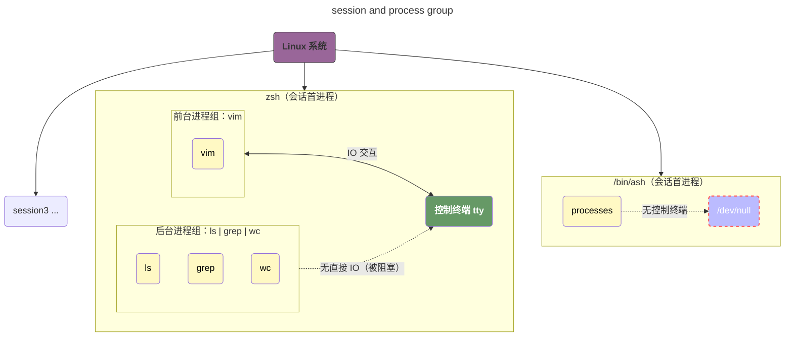

### 进程组和会话的通俗描述

如果我们把一个linux操作系统看做是一个大型的财团，那么我们可以做出如下类比：

|      概念       |        通俗比喻        |                   核心作用                   |
| :-------------: | :--------------------: | :------------------------------------------: |
| 进程（Process） |        单个员工        |                 最小执行单元                 |
|  进程组（PG）   | 部门（比如「研发部」） | 把相关进程归为一组，方便批量管理（如发信号） |
| 会话（Session） |  公司（包含多个部门）  |  管理「终端连接」，一个会话对应一个控制终端  |
| 控制终端（TTY） |   公司的「总机电话」   |  会话内的进程通过终端交互，终端关闭会发信号  |

### Process Group

进程组（PG）是批量管理进程的最小单位：

-   每个进程都属于一个进程组，进程组通过 `PGID` 标识；
-   进程组有一个 `组长进程`：PGID等于组长进程的PID，只要组内有一个进程存活，进程组就存在：**即使组长退出**；组长退出的时候，进程组的PGID不变；
-   进程创建时，默认继承父进程的进程组；
-   可以通过 `setpgid()` 系统调用修改进程组；

为什么我们需要进程组：最典型的场景：我们在终端执行 `ls | grep txt | wc -l`，这会创建 3 个进程（ls、grep、wc），它们会被归为**同一个进程组**。

-   当我们按 `Ctrl+C` 时，内核会向这个进程组的**所有进程**发送 `SIGINT` 信号，批量终止它们（而不是只杀一个）；
-   如果我们只杀其中一个进程，其他进程不受影响 —— 进程组的核心价值是「分组管控」。

```sh mark:3
ps -eo pid,ppid,pgid,sid,cmd | head -5

# pid：进程ID | ppid：父进程ID | pgid：进程组ID | sid：会话ID | cmd：命令

#    PID    PPID    PGID     SID CMD
#      1       0       1       1 /usr/lib/systemd/systemd --switched-root --system --deserialize=41
#      2       0       0       0 [kthreadd]
#      3       2       0       0 [pool_workqueue_release]
#      4       2       0       0 [kworker/R-rcu_g]
```

### Session

会话是管理终端连接的一个更大单位：

-   一个会话包含**一个或多个进程组**，会话用「会话 ID（SID）」标识；
-   会话有一个「会话首进程」：SID = 首进程的 PID；
-   一个会话最多关联**一个控制终端**（TTY/PTY），终端的「控制进程」是会话首进程（比如我们的 zsh/bash）；
-   可以通过 `setsid()` 系统调用创建新会话（我们代码里的 `syscall.Setsid()` 就是这个作用）。

#### 会话的核心特性

>   终端关闭 → 发送 SIGHUP 信号：当控制终端关闭（比如父进程退出、终端窗口关闭），内核会向会话的「前台进程组」所有进程发送 `SIGHUP` 信号（默认行为是终止进程）。

在我们的代码中，当我们在使用detach模式的时候，tty 设置为false了，所以父进程和子进程在同一个session中。

```go mark:11,12
func newParentProcess(tty bool, commands []string, env []string) *exec.Cmd {
	// ...
	cmd := exec.Command(constant.UnixProcSelfExe, args...)
	cmd.SysProcAttr = &unix.SysProcAttr{
		Cloneflags: unix.CLONE_NEWUTS |
			unix.CLONE_NEWPID |
			unix.CLONE_NEWNS |
			unix.CLONE_NEWNET |
			unix.CLONE_NEWIPC,
		Unshareflags: unix.CLONE_NEWNS,
		Setctty:      tty,
		Setsid:       tty,
	}

	// ...
}
```

>   **新会话创建时不会关联控制终端**

如果我们对进程调用 `setsid()`，那么这个进程会：

1.   成为新会话的首进程；
2.   成为新进程组的组长；
3.   **失去原控制终端，且新会话无控制终端**；

#### 会话的典型场景

-   终端启动的所有进程（比如 bash、ls、vim）都属于同一个会话；
-   后台守护进程（比如 nginx、redis）会通过 `setsid()` 创建独立会话，脱离终端，即使终端关闭也能继续运行。

## 会话和终端

在 [会话的核心特性](#会话的核心特性) 中提到了**新会话创建时不会关联控制终端**，而这个是一个非常容易碰到的陷阱 -- 它创建时不会关联控制终端，但是仍然有机会关联控制终端。

### 什么是控制终端

控制终端不是单纯的「输入输出设备」，而是 Linux 内核给「会话」分配的「专属交互通道」：

-   一个**会话**最多只能绑定**一个**控制终端；
-   一个**控制终端**最多只能绑定**一个**会话（一对一关系）；
-   终端的所有输入 / 输出、信号（如 `Ctrl+C`/`SIGHUP`），都只针对「绑定的会话」生效。

### 会话与终端绑定的核心规则

Linux 内核规定：**只有「会话首进程」才有资格申请 / 绑定控制终端**，非会话首进程完全没有这个权限。这个规则的设计目的是：避免多个进程争抢同一个终端，导致交互混乱。例如我们在 [tty控制权](#tty控制权) 中碰到的问题，就是因为多个进程争抢同一个终端引起的。下面是终端绑定的完整流程（**只有会话首进程能触发**）

1.  会话首进程调用 `open("/dev/tty")`（或打开其他终端设备）；
2.  内核检查该终端是否已绑定其他会话：
    -   若未绑定：将终端分配给当前会话，成为「控制终端」；
    -   若已绑定：返回错误（终端已被占用）；
3.  绑定成功后，会话内的「前台进程组」可与终端交互，后台进程组被阻塞。

### setsid()的陷阱

>   1.   **只有会话首进程才可以申请/绑定控制终端**；
>   2.   **只有非会话首进程才可以调用 `syscall.Setsid()` 创建新会话。**

我们在回头思考，我们前面提到的逻辑存在这样一个问题：

1.   子进程通过 `syscall.Setsid()`，通知内核为我们创建一个新的session；
2.   子进程成为新的session的**会话首进程，但是没有绑定控制终端**；
3.   子进程在后续的代码中，执行了 `open("/dev/tty")` ，此时会触发内核的逻辑，将这个终端绑定到我们新建的这个会话！

**所以，我们需要，调用两次 `setsid()`：第一次是为了创建新的会话，第二次是为了确保进程不是会话首进程。这里需要注意的是，第二次调用 setsid() 并不会创建新会话，反而会直接失败（返回错误），但这个「失败」恰恰是我们要的效果（剥夺会话首进程身份）。**

我们可以使用下面这个例子，第二次调用 `syscall.Setsid()` 时，**内核会直接拒绝创建新会话（返回错误），且不会改变当前会话 ID，只会剥夺进程的「会话首进程」身份**—— 我们的进程不会成为任何新会话的首进程，最终变成「无首进程身份的普通进程」。这是因为，`setsid()` 是 Linux 系统调用，内核执行它时会先做权限检查，**只有满足「非会话首进程」这个条件，才会创建新会话。**

而Linux 内核禁止「会话首进程」再次调用 `setsid()` 创建新会话，本质是为了：

1.   **避免会话嵌套**：一个进程不能同时属于多个会话，否则会导致终端控制、信号传递逻辑混乱；
2.   **保护终端绑定规则**：会话首进程是「终端绑定的唯一入口」，如果允许它反复创建新会话，会破坏「一个终端绑定一个会话」的规则。

```go mark:14-19
import (
	"fmt"
	"syscall"
)

func main() {
	var err error
	var pid int
    // 创建新会话（setsid）：子进程成为新会话的首进程，脱离原会话
	if pid, err = syscall.Setsid(); err != nil {
		fmt.Printf("first pid: %d, setsid: %v\n", pid, err)
	}

    // 第二个 setsid 确保进程不是「控制终端的会话首进程」，彻底脱离终端
    // 注意，这个调用并不会创建新的会话，而是直接失败。
    // second pid: -1, setsid: operation not permitted
	if pid, err = syscall.Setsid(); err != nil {
		fmt.Printf("second pid: %d, setsid: %v\n", pid, err)
	}
}
```

## 控制进程

在 Linux 终端与会话的体系里，**控制进程（Controlling Process）** 就是**与终端设备绑定的那个会话的首进程**，它是终端的「管理者」，负责维护终端和会话之间的关联关系。

**注意，控制进程一定是会话首进程，而会话首进程不一定是控制进程**：只有当会话首进程绑定了控制终端时，它才会成为这个终端的控制进程。

### 控制进程的核心属性

控制进程一定是某个会话的**会话首进程**，且这个会话必须绑定了一个控制终端（比如 `/dev/pts/0`）。简单说：**只有会话首进程才有资格成为终端的控制进程**，普通进程或非会话首进程都不行。

### 生命周期关联

控制进程和终端的「生死」强相关：

-   如果控制进程退出，内核会认为这个终端「失去了管理者」，进而触发**终端关闭**的逻辑；
-   终端关闭时，内核只会向该终端绑定的会话的前台进程组发送 `SIGHUP` 信号，和其他会话无关。

### 控制权唯一

一个终端设备同一时间只能有一个控制进程，就像一把锁只能配一把钥匙 —— 终端和控制进程是「一对一」的关系。

## 进程和子进程的协同

在我们最开始的实现逻辑中，存在如下代码：

```go mark:10,11,14-19
func newParentProcess(tty bool, commands []string, env []string) *exec.Cmd {
	// ...
	cmd.SysProcAttr = &unix.SysProcAttr{
		Cloneflags: unix.CLONE_NEWUTS |
			unix.CLONE_NEWPID |
			unix.CLONE_NEWNS |
			unix.CLONE_NEWNET |
			unix.CLONE_NEWIPC,
		Unshareflags: unix.CLONE_NEWNS,
		Setctty:      tty,
		Setsid:       true,
	}

	if tty {
		logrus.Info("Running new process in tty.")
		cmd.Stdin = os.Stdin
		cmd.Stdout = os.Stdout
		cmd.Stderr = os.Stderr
	}

	cmd.Dir = conf.GlobalConfig.MergePath()
	cmd.Env = env
	return cmd
}

```

可以看到，我们的代码中通过 `Setsid = true` 设置了在创建子进程的时候，开启了新的session，然而我们可以观察到两个现象：

1.   当我们设置 `Setctty = true` 时，按下 `Ctrl + D` 会使得父进程和子进程同时退出；
2.   当我们设置 `Setctty = false 和 Setsid = true` 时，即使没有输入 `Ctrl + D`，父进程和子进程仍然会同时退出。

### 开启tty

在我们开启tty时，我们的逻辑是这样的：

1.   `mini-docker` 初始化子进程（也就是我们的init进程），由于设置了 `Setsid = true`，此时init进程会启动一个新的会话；
2.   init进程被绑定到 `stdio`；
3.   从 `stdin` 输入 `Ctrl + D`，子进程退出；
4.   `mini-docker` 进程的 `parent.Wait()` 返回，父进程退出；

### 不开启tty

代码中仅设置 `Setsid: true && Setctty: false`，但缺少两个关键操作，导致子进程仍无法「彻底脱离父进程 / 终端」：

-   IO 未重定向到 /dev/null
    -   tty=false 时，子进程的 stdin/stdout/stderr 仍继承父进程的终端 FD；
    -   父进程退出后，终端 FD 被关闭 → 子进程尝试读写 FD 时触发 `SIGPIPE`/`SIGHUP` → 子进程退出；
-   未执行二次 setsid ()
    -   子进程虽是新会话首进程，但仍有「绑定终端的权限」；
    -   若容器内进程误操作 `open("/dev/tty")`，会重新绑定终端 → 终端关闭时子进程收 SIGHUP；

所以他的逻辑是这样的：

1.   `mini-docker` 初始化子进程（也就是我们的init进程），由于设置了 `Setsid = true`，init 进程**创建了新会话**，但因 `Setctty = false` 未绑定终端；且 IO 未重定向，子进程仍继承父进程的终端 FD。
2.   父进程退出，终端FD被关闭，子进程尝试读写 FD 时触发 `SIGPIPE`/`SIGHUP` 导致子进程退出。

## PTY和TTY

>   1.   我有个问题是，脱离TTY的是我的daemon进程，我的container进程是从daemon进程中fork出来的，它fork出来后也是没有TTY的对吗？

### TTY的定义

`TTY` 是 `Teletype` 的缩写，原意是「电传打字机」—— 这是早期 Unix/Linux 与计算机交互的**物理设备**（没有屏幕，靠打字机输入 / 打印输出）。现代 Linux 中，TTY 被保留为「**系统原生终端设备**」的统称，核心特征：

-   是「硬件 / 内核级」的终端，直接和系统内核绑定；
-   每个 TTY 对应一个独立的「控制台会话」，比如我们在服务器开机后看到的黑白界面；
-   进程的 `ps -ef` 输出中，TTY 列显示 `tty1`/`tty2` 等，就代表该进程运行在「原生 TTY 终端」中；
-   TTY 是「独占式」的：一个 TTY 只能被一个会话使用；
-   守护进程（如 mini-dockerd、nginx）会主动「脱离 TTY」：启动时通过 `setsid()` 创建新会话，不再关联任何 TTY，因此 `ps -ef` 中 TTY 列显示 `?`；
-   无 TTY 的进程，无法直接做「终端交互」（比如我们如果直接给 mini-dockerd 绑定 `-it`，会触发 ioctl 错误 —— 因为它没有 TTY 可以用）。

```sh mark:3,10
ps -ef

# ? 代表已经脱离TTY
#UID          PID    PPID  C STIME TTY          TIME CMD
#root           1       0  0  2025 ?        00:01:05 /usr/lib/systemd/systemd --switched-root --system --deserialize=41
#root        1583       1  0  2025 tty1     00:00:00 /sbin/agetty -o -p -- \u --noclear - linux

ps aux | grep /proc/self/exe | grep -v grep

# 可以看到，我们的 mini-dockerd 进程已经脱离TTY了
# USER         PID %CPU %MEM    VSZ   RSS TTY      STAT START   TIME COMMAND
# root     2355486  0.0  0.0 1599936 7428 ?        Ssl  21:13   0:00 /proc/self/exe init
```

### PTY的定义

PTY 是 `Pseudo-Terminal` 的缩写，即「伪终端」—— 它是**内核模拟出来的终端设备**，核心目的是解决「没有物理 TTY 但需要终端交互」的问题（比如 SSH 登录、终端模拟器、我们的 mini-docker `-it` 模式）。我们可以把 PTY 理解为：**给「无物理终端的进程」造一个「虚拟的 TTY」**，让进程以为自己在和真实 TTY 交互，但实际是通过「内存 / 网络」传输数据。

PTY 的核心结构包括：Master/Slave（主从设备）：PTY 不是「单一设备」，而是「一对相互关联的虚拟设备」。一个通用的PTY设备可能如下所示


其中：

-   **PTY Master**：对接「用户交互端」（比如 SSH 客户端、我们的宿主机终端）；
-   **PTY Slave**：对接「被控制的进程」（比如容器内的 `/bin/ash`）；

我们可以登录服务器如下操作：

```bash mark:3
tty
# /dev/pts/1
# /dev/pts/1 这个输出表示 pts = pseudo-terminal slave，即 PTY 从设备

ps -ef | grep bash
# root     1563963 1563939  0 Jan07 pts/0    00:00:00 /bin/bash
# root     2630791 2630768  0  2025 pts/0    00:00:00 /bin/bash
# pts/0 表示bash运行在 PTY 中。
```

### 为什么必须使用PTY？

在我们的 `-it` 模式下，我们会面临一个问题：**daemon进程主动脱离TTY，container进程继承了daemon进程的特性，但是我们又希望他能通过终端交互。如果不使用PTY，我们在fork()进程时会直接抛出异常：`inappropriate ioctl for device` -- 因为我们没有可用的TTY。**

在这个场景下，我们必须使用PTY：

-   即使进程（如 mini-dockerd）没有 TTY，也能通过创建 PTY 给子进程（容器）模拟终端；
-   跨环境兼容：不管是 SSH、守护进程、容器，都能创建 PTY 实现终端交互；
-   我们 `pty.Start(cmd)` 本质：就是让库帮我们创建「Master/Slave PTY 对」，并把 Slave 绑定到容器进程的 stdin/stdout/stderr。

### TTY和PTY的区别

|       特性       |       TTY（原生终端）        |           PTY（伪终端）           |
| :--------------: | :--------------------------: | :-------------------------------: |
|       本质       |  物理 / 内核级原生终端设备   |      内核模拟的虚拟终端设备       |
|     关联方式     | 直接绑定物理控制台（Alt+F1） | 绑定远程 / 虚拟会话（SSH / 容器） |
|     设备路径     |   `/dev/tty1`/`/dev/tty2`    |     `/dev/pts/0`/`/dev/pts/1`     |
| 进程 TTY 列显示  |       `tty1`/`tty2` 等       |        `pts/0`/`pts/1` 等         |
| 守护进程能否使用 |   不能（守护进程脱离 TTY）   |        能（手动创建即可）         |
| mini-docker 场景 |   detach 模式：不需要 TTY    |   -it 模式：必须用 PTY 模拟终端   |

总结来说，我们在创建进程的时候会有两个参数：

-   `-it`  其实是 `-i` 和 `-t` 两个参数合并：
    -   `-i`（`interactive`）：让容器的 `stdin` 保持打开（即使没有终端关联），保证用户输入能传递到容器；
    -   `-t`（`tty`）：为容器分配 PTY 伪终端，让容器内的进程（如 bash）以为自己运行在真实终端中，支持「命令回显、换行、Ctrl+C 中断、Tab 补全」等终端特性；
-   `-d`（`detach`）表示「后台守护」场景（用户不需要交互）。

他们是**互斥且互补**的：

|     维度     |          `-it` 模式          |        `-d` 模式         |
| :----------: | :--------------------------: | :----------------------: |
|   运行方式   |   前台运行（阻塞当前终端）   |  后台运行（不阻塞终端）  |
|   终端依赖   |     必须分配 PTY 伪终端      |     禁用所有终端关联     |
|  标准流处理  | 绑定用户终端（stdin/stdout） |   重定向到 `/dev/null`   |
| 进程退出条件 |   用户手动 exit / 关闭终端   | 容器内程序退出 / 被 kill |
| 典型使用场景 |     调试容器、交互式命令     | 运行服务（nginx/redis）  |

也就是说，这两个参数的使用会存在三个场景：

|        参数组合         | 是否合法 |      核心行为      |                         典型应用场景                         |
| :---------------------: | :------: | :----------------: | :----------------------------------------------------------: |
| `-it=true && -d=false`  |   合法   | 分配 PTY，阻塞终端 | 进入容器执行命令（`docker run -it ubuntu bash`）、运行交互式程序（python/redis-cli） |
| `-it=false && -d=true`  |   合法   | 禁用 PTY，后台运行 | 运行服务型程序（`docker run -d nginx`/`mini-dockerd`）、定时任务、后台脚本 |
| `-it=false && -d=false` |   合法   | 禁用 PTY，阻塞终端 | 运行「一次性、无交互、需要看输出」的程序<br/>例如 `docker run ubuntu ls /` |
|  `-it=true && -d=true`  |  `非法`  |  Docker 直接报错   |               无（前台交互和后台运行无法共存）               |

### 如何使用

#### mini-dockerd

`mini-dockerd` 的使用非常简单，因为他一定是 `-it = false && -d = true` 的。

#### container

我们的 `container` 的使用则相对比较复杂，因为他的使用场景根据容器的功能而会发生变化

##### -it = false && -d = true

这个场景较为简单，我们直接和 `mini-dockerd` 一样配置即可；

##### -it = true && -d = false

这个场景相对于其他的几项来说比较复杂，因为这里涉及到一个问题：

-   `daemon` 主动断开了TTY；
-   `container` 从 `daemon` 进程 fork 得到，他会继承这个特性，我们必须显示的去配置它。

在这个场景下，我们必须为 `container` 初始化一个 `PTY` 并绑定它。

##### -it = false && -d = false

这个场景在我们目前的玩具项目中，暂时不考虑支持。

#### 架构逻辑

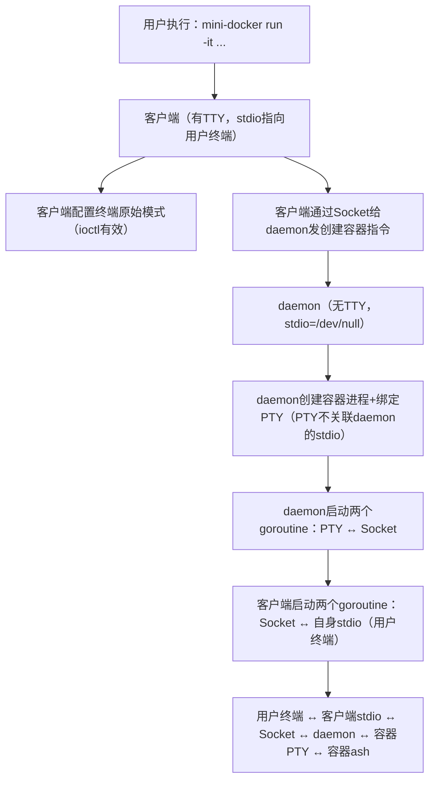


