>   本文是自己动手实现raft的前置文章，旨在分析raft协议的内部实现原理。作者在网上搜索了大量的文献和资料，向这些作者表达我的敬意。这里也推荐阅读本文的人可以参考这几篇经典的文章：
>
>   -   [raft原论文](https://raft.github.io/raft.pdf)
>   -   [raft论文（翻译版）](https://github.com/maemual/raft-zh_cn/blob/master/raft-zh_cn.md)
>   -   [raft算法可视化](https://thesecretlivesofdata.com/raft/)

# 概述

在我们探讨 `raft` 算法之前，我们需要搞清楚为什么我们需要一个如此复杂的算法：我们用数据库举例：

在传统的单机数据库下，我们其实也会有所谓的**一致性需求** -- 就是我们的事务。当我们在执行一个 SQL 语句时会存在 IO 操作，而这个 IO 操作和我们分布式系统的 IO 操作是没有本质区别的 -- 他们都有概率失败。例如：假设我们存在一个 SQL 写入语句，这个语句写入的字段中包含了一个超大字段，这个超大字段超过了操作系统的单次 IO 写入大小，那么操作系统必然会把这个写入语句拆分成多次 IO 操作。那现在我们面临的问题是：

-   假设这个语句被拆分为两次 IO 操作：
    -   第一次 IO 操作成功了，第二次 IO 操作时磁盘满了无法写入怎么办？
    -   第一次 IO 操作成功了，在第二次 IO 操作之前机器重启了怎么办？

在传统的数据库中，一般是通过 `redo log` 和 `undo log` 来实现这个逻辑的，这个逻辑在不同的数据库下实现不一致，但是它的思路是一致的：

-   写入之前我们先记录我们的写操作，这个写操作记录了我们要做的事情；
-   根据我们碰见的异常，决定是继续执行这个写操作还是回退我们的写操作；

通过这种方式，我们可以实现单机的数据一致性。然而这种方式存在局限：

-   在传统的单机数据库场景下，当整个磁盘损坏时 `redo/undo` 和实际数据是一起损坏的，我们可以通过 RAID（如镜像、校验）等硬件冗余方案降低故障几率，也就是说我们可以简单粗暴的认为 `redo/undo` 是可靠的；
-   在分布式的场景下，`redo/undo` 和我们的实际数据有可能分开存储，且单机 RAID 无法解决「整台机器宕机 / 网络隔离」的节点级故障 —— 此时可能出现实际数据未损坏，但 `redo/undo` 损坏的问题。

**在这个场景下，我们需要一个系统可以像 `redo/undo` 一样，可靠的、有序的记录我们的执行日志，这个系统有很多种实现，目前主流的有 `raft`，`paxos`，`zab` 等。**

而 `raft` 算法是一种基于日志的一致性协议，它的一致性通过「日志」保证：可以认为 `raft` 在分布式系统中记录了每个时刻改变状态的事件，通过「多数派复制、单一 leader、日志一致性检查、持久化」等机制，保证每一个事件都被正确记录，不会因为单个节点的崩溃而丢失。

以分布式数据库为例，假设现在用户执行了以下命令：

```sql
INSERT INTO table_raft(id) Values(1);
INSERT INTO table_raft(id) Values(2);
INSERT INTO table_raft(id) Values(3);

DELETE FROM table_raft where id = 1;
```

只要我们和 `redo/undo` 日志一样，在实际的执行引擎执行 SQL 之前**有序的记录这几条执行日志**，那么之后无论系统是节点崩溃、硬盘损坏或是其他故障异常，我们都可以通过这几条执行日志来恢复数据。

**而这里的 SQL 语句，我们甚至可以无缝的替换为任何其他「改变系统状态的确定性操作」：**

-   它可以是多个修改数据的 HTTP 请求；
-   也可以是 `kv` 数据库中的多次 `set` 操作；

在实际的工程落地中，我们也可以将 raft 和其他的方式结合来构建一个健壮的分布式系统：

-   我们可以通过对 DB 进行 snapshot，随后记录从 snapshot 之后的 SQL 执行记录，就可以使用 snapshot + raft 日志来恢复数据，并且可以减少 raft 日志的数量；
-   我们可以对操作过滤：数据库中的 `select`、KV 的 `get` 等读请求不会影响系统状态，可直接跳过不记录；

# [raft论文解读](https://github.com/maemual/raft-zh_cn/blob/master/raft-zh_cn.md)

Raft 是一种为了管理复制日志的一致性算法。它提供了和 Paxos 算法相同的功能和性能，但是它的算法结构和 Paxos 不同，使得 Raft 算法更加容易理解并且更容易构建实际的系统。为了提升可理解性，Raft 将一致性算法分解成了几个关键模块，例如[领导人选举](https://github.com/maemual/raft-zh_cn/blob/master/raft-zh_cn.md#52-%E9%A2%86%E5%AF%BC%E4%BA%BA%E9%80%89%E4%B8%BE)、[日志复制](https://github.com/maemual/raft-zh_cn/blob/master/raft-zh_cn.md#53-%E6%97%A5%E5%BF%97%E5%A4%8D%E5%88%B6)和[安全性](https://github.com/maemual/raft-zh_cn/blob/master/raft-zh_cn.md#54-%E5%AE%89%E5%85%A8%E6%80%A7)。同时它通过实施一个更强的一致性来减少需要考虑的状态的数量。

## 复制状态机

**复制状态机（Replicated State Machine）** 是分布式系统中实现 **“多节点状态一致”** 的核心范式 —— 它的目标是：**让集群中多个服务器节点，通过执行相同的指令序列，最终得到完全相同的状态**，即使部分节点宕机或网络异常，整个系统依然能正常工作。

我们可以把它理解成 **“分布式版本的‘复读机 + 计算器’”**：

- 所有节点都遵循 **“相同的初始状态 + 相同的指令序列 → 相同的最终状态”** 的逻辑（这是数学上的确定性原则）；
- 一致性算法（比如 Raft）的核心作用，就是**保证所有节点收到的指令序列完全一致**；
- 状态机负责**执行指令序列**，生成一致的状态。

### 复制状态机的一个简单例子

```sql
SET A = 1
SET B = 1
SET A = 2
DELETE B
```

以这个例子来说，复制状态机会保证将这四条指令**完整、有序地同步到所有复制状态机节点**，三节点集群完成复制后的状态如下：

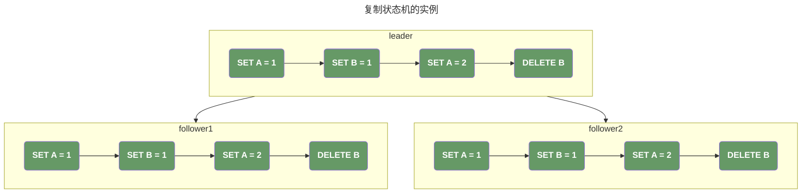

### 复制状态机面临的核心挑战

#### 1. 网络延迟导致的复制失败

> 如果出现网络延迟，`SET A = 1` 最后到达Follower，Raft 不允许后续指令先提交！只要前序日志未提交，所有后续日志都无法提交 —— 这是 Raft 「日志顺序性」规则的核心体现。

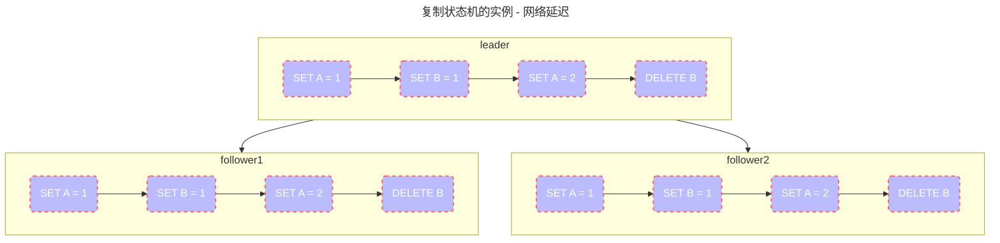

#### 2. 网络分区

> 若 `follower2` 网络异常，`leader` + `follower1` 构成多数派（2/3），日志可正常提交 —— 集群仍能对外服务，待 `follower2` 恢复后同步缺失日志即可。这是 Raft 「多数派复制」保证可用性的核心。

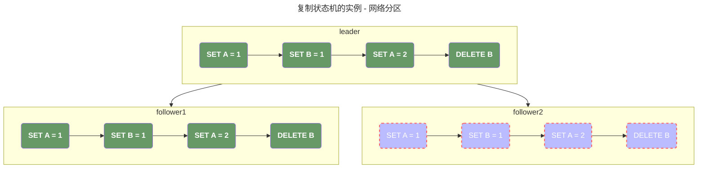

#### 3. 丢包

> Raft 对丢包的处理核心是「重试+顺序校验」：
>
> 1. Follower2 丢失 `SET A=2`（Index=3），但收到 `DELETE B`（Index=4）→ 拒绝接收/暂存后序日志；
> 2. leader 感知到 Follower2 未确认 Index=3，持续重试同步；
> 3. 多数派（leader+Follower1）完成 Index=3 复制后，标记该日志提交并执行状态机；
> 4. 仅当 Follower2 同步完 Index=3，leader 才会同步 Index=4 日志。
>
> 关键结论：丢包不会阻塞**多数派节点的日志提交**，只会阻塞**故障节点的日志同步**。

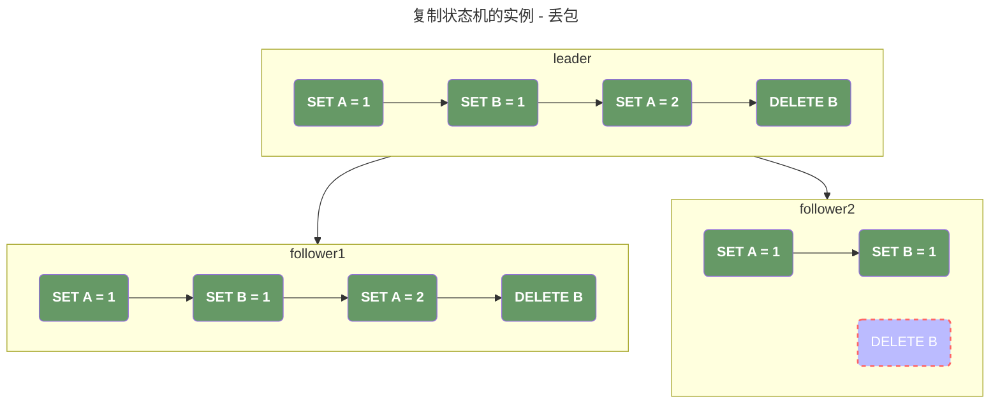

#### 4. 重复/乱序

> 重复/乱序的处理依赖 `(Term, Index)` 唯一索引，核心规则是「前序日志提交是当前日志提交的前提」：
>
> - 日志重复：检查 `(Term, Index)` 是否存在，存在且内容一致则忽略，不一致则回滚后重新同步；
> - 日志乱序：暂存后序日志，等待前序日志同步完成后，再提交当前日志。

### 复杂场景：leader 宕机+旧 leader 恢复

#### 场景前提

原 leader 写入 `DELETE B`（Index=3, Term=0）后未同步至任何 Follower，随即宕机；Follower1/Follower2 选举出新 leader（Term=1）。

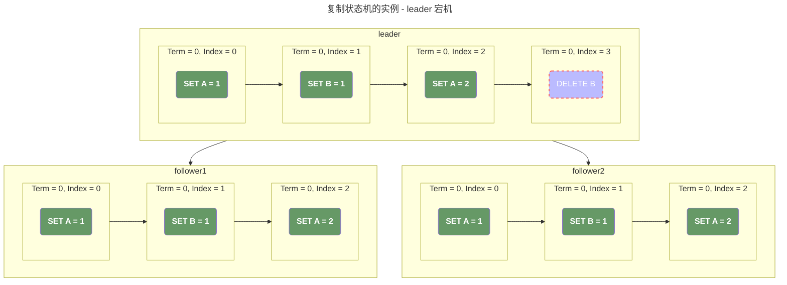

#### 新 leader 处理逻辑

> 1. 原 leader 宕机后，客户端会收到「提交失败」异常，需重新发送 `DELETE B` 请求；
> 2. 新 leader（Term=1）接收请求后，生成 `DELETE B` 日志（Index=3, Term=1），同步至 Follower2（多数派）完成提交；
> 3. 注：该日志是新 Term 下的新日志，而非修改原日志的 Term。

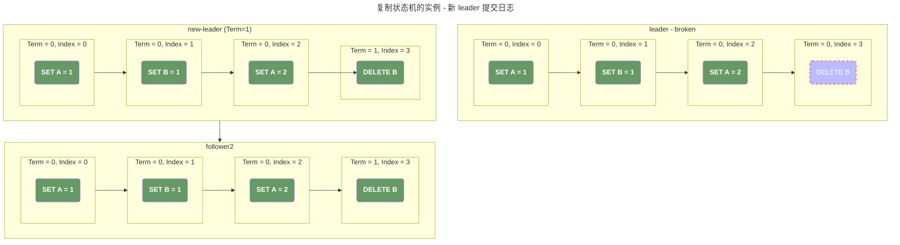

#### 旧 leader 恢复后的同步逻辑

> 旧 leader 恢复后发现 Term=0 < 新 leader 的 Term=1 → 立即转为 Follower，触发「日志一致性检查」：
>
> 1. 新 leader 推送「待同步索引3 + 前序信息(Index=2, Term=0)」；
> 2. 旧 leader 发现本地 (0,3) ≠ 新 leader 的 (1,3) → 回滚删除本地 (0,3) 日志；
> 3. 同步新 leader 的 (1,3) 日志，完成提交和状态机执行。
>
> 日志一致性检查的两种实现方式：
>
> - Follower 主动拉取：向 leader 上报自身最后提交的 (Term, Index)；
> - leader 主动推送：向 Follower 下发待同步索引+前序日志信息（主流实现）。

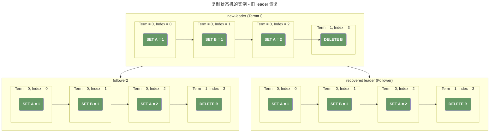

### 复制状态机的核心组成

| 层级 |    名称    |                      核心功能                      |                对应 Raft 组件                |
| :--: | :--------: | :------------------------------------------------: | :------------------------------------------: |
| 上层 |   状态机   |   执行确定性指令，生成节点状态（如 KV 增删改查）   |      业务逻辑模块（如 etcd 的 KV 存储）      |
| 中层 | 一致性模块 | 保证所有节点的指令日志完全一致（顺序、内容无差别） | Raft 核心（日志同步、leader 选举、提交机制） |
| 下层 |  日志模块  |          持久化存储指令序列，崩溃后可恢复          |             Raft 的 Log Entries              |

#### 核心工作流程（以 Raft 为例）

1. 客户端发送指令请求（如 `set key=value`）；
2. leader 封装指令为日志条目，写入本地日志并同步至所有 Follower；
3. 当日志被**多数节点复制**后，leader 标记该日志为「已提交」；
4. 所有节点从日志中取出已提交指令，交给状态机执行；
5. 所有节点执行相同指令序列，最终状态完全一致。

### 复制状态机的核心原理

复制状态机依赖两个硬性前提，缺一不可：

1. **状态机的确定性**：相同输入必然产生相同输出，无随机行为/外部依赖。
    - 正例：计算器执行 `1+1`，所有节点结果都是 `2`；
    - 反例：`获取当前时间戳` 是不确定性指令，会导致状态不一致；
    - 为什么同步「指令」而非「状态」：同步指令成本更低，且可定制状态机（KV、HTTP 服务等）。
2. **指令序列的一致性**：所有节点的指令执行顺序、内容完全一致 —— 这是 Raft/Paxos 等一致性算法的核心职责。

### 复制状态机的典型应用

|   系统    |             日志模块              |     一致性模块      |      状态机      |           核心场景            |
| :-------: | :-------------------------------: | :-----------------: | :--------------: | :---------------------------: |
| ZooKeeper | 持久化客户端指令（创建/修改节点） | ZAB 协议（类 Raft） | 内存树形节点结构 |   分布式锁、选主、配置管理    |
|   etcd    |  持久化 KV 写指令（GET 不存储）   |      Raft 协议      |  分布式 KV 存储  | Kubernetes 配置存储、服务发现 |

### 核心规则总结

1. **日志顺序性**：前序日志未提交，后序日志无法提交；
2. **多数派复制**：日志被多数节点复制后才能提交，保证可用性；
3. **Term/Index 唯一性**：`(Term, Index)` 标识日志，高 Term 日志覆盖低 Term 同 Index 日志；
4. **状态机确定性**：仅同步确定性指令，保证多节点执行结果一致；
5. **leader 任期权威**：高 Term leader 的日志是集群权威日志，旧 leader 恢复后需同步对齐。

## raft一致性算法

### 5.1 raft基础

一个raft集群包含了若个个服务器节点，我们以五个服务器节点作为例子：在任何时刻，每一个服务器节点都处于这三个状态之一：领导人、跟随者或者候选人。在通常情况下，系统中只有一个领导人并且其他的节点全部都是跟随者。跟随者都是被动的：他们不会发送任何请求，只是简单的响应来自领导人或者候选人的请求。领导人处理所有的客户端请求（如果一个客户端和跟随者联系，那么跟随者会把请求重定向给领导人）。第三种状态，候选人，是用来在 5.2 节描述的选举新领导人时使用。图 4 展示了这些状态和他们之间的转换关系；这些转换关系会在接下来进行讨论。


>   下面的图描绘了raft的选举时间线：
>
>   1.   在选举成功后，leader 会管理集群到 term 结束；
>   2.   在选举时，我们不一定可以成功的选举出新的 leader，这种情况我们会需要进行第二次选举；在实际的工程实践中，我们需要通过各种手段来避免因为一直选取不出新的 leader 引发的集群宕机；


**term 在 Raft 算法中充当逻辑时钟的作用，任期使得服务器可以检测一些过期的信息**：

1.   比如过期的领导人。每个节点存储一个当前任期号，这一编号在整个时期内单调递增。每当服务器之间通信的时候都会交换当前任期号；
2.   如果一个服务器的当前任期号比其他人小，那么他会更新自己的任期号到较大的任期号值。如果一个候选人或者领导人发现自己的任期号过期了，那么他会立即恢复成跟随者状态。
3.   如果一个节点接收到一个包含过期的任期号的请求，那么他会直接拒绝这个请求。

这里，我们可以结合上面的图以及 [Rules for Servers](#rulesforservers)来分析这几种不同的情况。在 Rules For Server 中，我们可以看到 term 的递增有以下几种情况：

-   在收到RPC请求时，发现请求中附带的 term 更大，被动的递增 term；
-   在发生选举超时时转换为 candidate，主动的递增 term；

1.   在接收到 RPC 请求时，如果 term 比自己的 term 要大，那说明现在已经进入了一个新的 term -- **注意，这里只是进入了一个新的term，并不代表已经选举出了新的 leader，因为现在的情形是：follower 转换为 candidate 时递增自己的 term，随后向其他的 servers 发送ReqeustVote，接收者收到 RequestVote 时会更新 term。**这里参考 [选举时可能未及时更新term的一个场景](#选举时可能未及时更新term的一个场景) 中描述的一个复杂的场景；
2.   任何节点，不论是 leader，follower，candidate 都不会处理比自己 term 要小的请求；

### 5.2 leader 选举

- 在raft中，当服务器启动时，所有的节点都是 follower；
- leader 周期的向 follower 发送 heartbeat；
- 如果一个 follower 在一段时间内没有收到任何消息，那么 follower 就会发起超时选举；这里需要注意的是：
    - **”在一段时间内没有收到任何消息“** 这里表示的是**收到任意合法RPC（即RPC的 term 不小于当前节点的 `term`）**，也就是说，以下三类合法RPC都会重置计时器，不局限于 leader 的心跳：
        - leader 的 AppendEntries 请求：不管是定期的心跳RPC，还是普通的日志推送；
        - candidate 的 RequestVote 请求：这是raft避免 ”投票分裂“ 的关键：**在收到 candidate 节点的请求后，会推迟自己的选举，优先参与当前选举**，这里关于超时时间的重置，我们可以查看 [为什么RequestVote要超时时间重置超时时间](#为什么requestvote要超时时间重置超时时间) 这一章节；
        - follower 之间的合法 RPC：某些 raft 实现中，follower 之间可能会向其他的节点发送日志校验RPC；
    - follower 并不知道其他的 follower 的信息，所以任意一个 follower 都会在超时后发起选举，只不过那些数据不够新的节点在投票时会被其他的节点拒绝投票；

### 5.3 日志复制

-   leader 选举后，他开始为 client 提供服务 -- 注意，在 leader 选举期间 raft 是不对外服务的；
-   leader 会通过 `AppendEntries` 将消息发送到 follower，并且在 follower 失败时重试，直到所以的 follower 最终存储了全部的日志条目；


-   leader 决定什么时候可以安全的把 entry 应用到状态机中；这种日志被称之为已提交（committed）；
-   raft 算法保证所有已提交的 entry 都是持久化并且最终会被所有的可用的状态机执行；
-   Raft 维护着以下的特性，这些特性共同组成了图 3 中的**日志匹配特性（Log Matching Property）**：
    -   如果在不同的日志中的两个 entry 拥有相同的 index 和 term，那么他们存储了相同的指令；
    -   如果在不同的日志中两个 entry 拥有相同的 index 和 term，那么他们之前的所有 entry 全部相同；

这两个特性源自于 raft 的日志特性：

-   **raft 在同一个 term 内不会对日志进行删除**。注意，日志的删除（回滚）**只有一种合法场景**：新 term 的 leader 通过 AppendEntries 一致性检查，要求 follower 删除 “与 leader 不一致的未提交日志”。例如下面的这个场景：假设存在如下情况：A，B，C 分别是集群的三个节点，其中 A 是 leader；

    1.   最开始 A 存在 (0, 1), (0, 2), (0, 3) 三条日志，而 B 和 C 不包含任何的日志 -- 这些日志在 term == 0 内不会被删除；
    2.   随后 leader 异常，B 通过选举当选 leader，此时 term 递增为 1；
    3.   B 当选为 leader 后接收 client 请求，生成新的 (1, 1) 日志；
    4.   随后，B 通过 AppendEntries 发送新的日志到 A。此时 A 会发现存在日志不一致进而进行回滚 -- 这个回滚操作是因为我们来到了一个新的 term；

-   第二个特性由 raft 的 AppendEntries 附带的一致性检查保证：在发送 AppendEntries 时，leader 会将新的 entries 之前的 index 和 term 包含在内（这里我们可以查看 [AppendEntries](#appendentries)  中的请求，会存在 `prevLogIndex` 和 `prevLogTerm` 两个字段）；如果 follower 在它的日志中找不到一个 entry(term, index) 满足 `term == prevLogTerm && index == prevLogIndex`，那么 follower 将会拒绝接受新的日志；这个就类似于我们的数学归纳法中的归纳逻辑一样：

    -    归纳基础：`index=0` 的初始日志：所有节点的初始日志（通常是空日志，或 `(0,0)` 的哨兵条目）是完全一致的 —— 这是归纳的起点，天然满足日志匹配特性。

    -   归纳假设：假设 `index=N` 的日志条目满足匹配特性，对任意两个节点，如果它们的 `(T_N, N)` 条目一致，那么前缀 `index < N` 的条目全部一致。

    -   ##### 归纳递推：AppendEntries 保证 `index=N+1` 也满足特性：

        -   leader 向 follower 追加 `(T_{N+1}, N+1)` 条目时，会在 AppendEntries RPC 中携带 **`prevLogIndex=N` 和 `prevLogTerm=T_N`**：
            -   follower 必须先检查自己的日志中，是否存在 `index=N` 且 `term=T_N` 的条目；
            -   **如果不满足**：follower 拒绝追加新条目，leader 会减小 `prevLogIndex`，重试一致性检查；
            -   **如果满足**：根据归纳假设，follower 的前缀 `index ≤ N` 与 leader 完全一致，此时追加 `(T_{N+1}, N+1)`，自然保证 `index=N+1` 也满足匹配特性。

    在正常情况下，leader 和 follower 保持一致，并且一致通过我们前面的机制来保证一致性。然而我们面临一个这样的情况：

    1.   在集群启动时，所有的节点包含相同数据；
    2.   在运行一段时间后，当 leader 崩溃时，可能会使得日志处于不一致的状态，此时有一部分日志可能未被拷贝（也就是说我们的 follower 数据比 leader 要少）；
    3.   随后，会通过选举来得到新的 leader，新的 leader 开始服务之后收到了一些新的请求，在新的请求被提交之前，新的 leader 也崩溃了；
    4.   我们再次通过选举得到新的 leader，此时在 <3> 中崩溃的节点（之前是 leader，现在变为 follower）多出了一些数据。

    **也就是说，我们的 leader 可能比 follower 中的数据多，也有可能比 follower 中的数据少，我们需要有一个机制来处理这种因为 leader 选举而产生的日志冲突。raft 解决这种冲突的核心思想就是：以 leader 的数据为准，让 leader 通过一致性检查去检测哪些 follower 包含了和 leader 不一致的数据 -- 少则通过 AppendEntries 补充，多则由 follower 自行回滚。**而这里隐含了一些前提：

    -   **新选举出的 leader，一定会包含了全部的已提交日志**，这里有一个比较常见的误解是，新选举的 leader 一定会包含了最新的日志，我们在 [选举时leader不一定包含最新数据](#选举时leader不一定包含最新数据) 这里对这个错误的结论进行了分析。
    -   至于如何保证新选举的 leader 一定会包含全部的已提交日志，这个和 leader 的选举机制有关，我们在 [5.4.1 选举限制](#5.4.1 选举限制) 这一小节进行详细分析。

此外，关于 raft 对于**已经同步到大多数节点，但是未更新 commitIndex 的日志（仍被视为临时日志）**的处理，我们在 [新leader提交日志时对term的限制](#新leader提交日志时对term的限制) 这小节中探讨：**主要是通过不允许 leader 通过计算已经同步的节点的数量来提交 `非当前任期` 的日志，而是必须通过提交 `当前任期` 的已提交日志来隐式的提交 `非当前任期` 的日志。**

在实际的实现中：raft 需要 leader 通过 RequestEntries 去找到 follower 中最后一条 `(leader.term == follower.term && leader.index == follower.index)` 的日志，并且要求 follower 回滚所有之后的日志，**这里需要注意的点是，被回滚的日志有可能存在 follower.term > leader.term，**再次强调，**raft 不允许回滚已提交的日志，但是允许提交更新 term 的临时日志**。同样在 [][新leader提交日志时对term的限制][新leader提交日志时对term的限制](#新leader提交日志时对term的限制) 这一小节中进行了分析。

raft 通常针对每一个 follower 都维护了一个 `nextIndex`，这表示需要发送给下一个 follower 的日志的 index；我们通过不断的递减去找到合理的日志。通常在工程优化中，我们可以让 follower 直接返回自己所需的日志的索引来避免 O(N) 的搜索。最后找到对应的 index，在 AppendEntries 成功后，follower 和 leader 的日志将达成一致；

### 5.4 安全性

前面的章节里描述了 Raft 算法是如何选举和复制日志的。然而，到目前为止描述的机制并不能充分的保证每一个状态机会按照相同的顺序执行相同的指令。例如，一个跟随者可能会进入不可用状态同时领导人已经提交了若干的日志条目，然后这个跟随者可能会被选举为领导人并且覆盖这些日志条目；因此，不同的状态机可能会执行不同的指令序列。**这里主要说的是，目前没有描述 candidate 在选举时需要同时满足 candidate.term >= vote.currentTerm && candidate.index >= vote.lastLogIndex 的限制。**

这一节通过在领导选举的时候增加一些限制来完善 Raft 算法。这一限制保证了任何的领导人对于给定的任期号，都拥有了之前任期的所有被提交的日志条目（图 3 中的领导人完整特性）。增加这一选举时的限制，我们对于提交时的规则也更加清晰。最终，我们将展示对于**领导人完整特性（leader Completeness Property）** 的简要证明，并且说明该特性是如何引导复制状态机做出正确行为的。

#### 5.4.1 选举限制

raft 是一种基于 leader 的一致性算法，leader 必须存储所有已提交日志。在某些一致性算法中（例如 Viewstamped Replication）中，leader 不需要包含全部的已提交日志，而是通过一些额外的基址来识别丢失的日志并传送给新的 leader。这种方式也可以达成一致性，但是非常复杂。raft 则要求 leader 包含全部已提交日志，这样可以只从 leader 传送日志给 follower，并且 leader 不会覆盖自身本地日志中已存在的 entry。

raft 通过要求投票的节点比被要求投票的节点日志更新来保证，当选 leader 一定包含了全部的已提交日志：

-   raft 中的选举可以由任意一台机器发起，不论机器上的日志是否为最新（因为节点根本就不知道其他节点的状态），但是当选为 leader 要求收到超过半数的节点的投票，而一个节点给另外一个节点投票的前提是，要求投票的节点比被要求投票的节点日志更新；
-   也就是说，当一个节点被选举为 leader 时，他的日志不一定是最新的，但是他一定比超过半数的节点要新；
-   而一条日志被提交的前提是，超过半数的节点已经持久化这条日志，并且 leader 更新 commitIndex 并同步到 follower；
-   这也就意味着，在给新当选的 leader 投票的节点中和已经提交该日志的节点中，最少有一个节点是重合的，进而我们可以知道，新的 leader 一定包含了全部被提交的日志。

#### 5.4.2 提交之前term内的日志

Raft 通过限制**不允许通过计算副本数目的方式去提交一个之前 term 的日志，**具体的细节我们在 [新leader提交日志时对term的限制](#新leader提交日志时对term的限制) 中探讨。

当 leader 复制之前 term 的日志时，raft 会保留日志原始的 term。而在其他的一致性算法中，如果一个新的 leader 要使用之前的 term 时，必须使用新的 term。

#### 5.4.3 安全性论证

在给出了完整的 raft 算法之后，我们可以更精确的讨论 `leader Completeness Property` 成立，我们通过反证法来实现：我们假设 `leader Completeness Property` 不成立，然后推出矛盾来：假设 term == T 的 leader（leader T）在任期内提交了一条日志，但是这条日志没有被存储到未来某个任期的 leader 的日志中。假设大于 T 的最小任期 U 的 leader U 没有这条日志。


>   根据 raft 的提交机制和投票机制，我们可以得出如下结论：
>
>   如果S1（任期T的 leader）在它的任期内提交了一条新的日志，然后S5在之后的任期U里被选为 leader，那么必然存在一台机器，如S3他既有来自S1的日志，也给S5投票了。
>   因为提交代表超过半数的机器已经接收到了这条新日志，而 leader 当选代表他比超过半数的服务器的日志要新。这两个中间一定会至少有一台机器满足上述条件。

我们假设 `leader Completeness Property` 不成立：

1.   在领导人 U 选举的时候一定没有那条被提交的日志条目（**领导人从不会删除或者覆盖任何条目，这个结论非常重要。这里和 follower 的行为不一样，follower 需要根据 leader 的 AppendEntries 请求，去回滚那些未提交的临时日志，但是 leader 永远不会删除或覆盖任何条目**）。
2.   领导人 T 复制这条日志条目给集群中的大多数节点，同时，领导人 U 从集群中的大多数节点赢得了选票。因此，至少有一个节点（投票者、选民）同时接受了来自领导人 T 的日志条目，并且给领导人 U 投票了，如图 9。这个投票者是产生这个矛盾的关键。
3.   这个投票者必须在给领导人 U 投票之前先接受了从领导人 T 发来的已经被提交的日志条目；否则他就会拒绝来自领导人 T 的附加日志请求（因为此时他的任期号会比 T 大）。
4.   投票者在给领导人 U 投票时依然保存有这条日志条目，因为任何中间的领导人（在T之后、U之前所有当选过 leader 的节点）都包含该日志条目（根据上述的假设），领导人从不会删除条目，并且跟随者只有在和领导人冲突的时候才会删除条目。
5.   投票者把自己选票投给领导人 U 时，领导人 U 的日志必须和投票者自己一样新（要么 term 相同但是 index 更大，要么 term 更大）。这就导致了两者矛盾之一：
     -   首先，如果投票者和领导人 U 的最后一条日志的任期号相同，那么领导人 U 的日志至少和投票者一样长，所以领导人 U 的日志一定包含所有投票者的日志。这是另一处矛盾，因为投票者包含了那条已经被提交的日志条目，但是在上述的假设里，领导人 U 是不包含的。
     -   除此之外，领导人 U 的最后一条日志的任期号就必须比投票人大了。此外，他也比 T 大，因为投票人的最后一条日志的任期号至少和 T 一样大（他包含了来自任期 T 的已提交的日志）。创建了领导人 U 最后一条日志的之前领导人一定已经包含了那条被提交的日志（根据上述假设，领导人 U 是第一个不包含该日志条目的领导人）。所以，根据日志匹配特性，领导人 U 一定也包含那条被提交的日志，这里产生矛盾。
6.   这里发生了矛盾。因此，所有比 T 大的领导人一定包含了所有来自 T 的已经被提交的日志。
7.   日志匹配原则保证了未来的领导人也同时会包含被间接提交的条目，例如图 8 (e) 中的索引 2。

### 5.5 follower和candidate崩溃

follower 和 candidate 的崩溃是通过简单的无限重试实现的：

-   如果崩溃的机器重启了，那么RPC请求会成功；
-   如果服务器在完成了一个RPC请求后崩溃（例如 AppendEntries 在添加日志成功后），那么 leader 会认为RPC失败，会再给 follower 和 candidate 发送相同的RPC请求直到成功。
-   这里是因为 raft 的 RPC 请求是幂等的，他们需要持久化日志，然后将日志按顺序添加到 logs，然后再给 leader 返回响应。

### 5.6 时间和可用性

raft 的安全性不依赖于时间，由于网络延迟，或者IO阻塞等引起的事件比预期的快或者慢不影响结果；但是可用性不可避免的依赖时间：最简单的例子：假设现在网络通信的延迟是200ms，而超时选举时150ms，那么将导致 follower 无限的进入选举状态。

领导人选举是 Raft 中对时间要求最为关键的方面。Raft 可以选举并维持一个稳定的领导人,只要系统满足下面的时间要求：

>   广播时间（broadcastTime） << 选举超时时间（electionTimeout） << 平均故障间隔时间（MTBF）

-   广播时间必须比选举超时时间小一个量级，这样领导人才能够发送稳定的心跳消息来阻止跟随者开始进入选举状态；
-   通过随机化选举超时时间的方法，这个不等式也使得选票瓜分的情况变得不可能。
-   选举超时时间应该要比平均故障间隔时间小上几个数量级，这样整个系统才能稳定的运行。

## 集群成员变化

在实践中，我们偶尔会修改集群的配置，例如替换宕机的机器或者改变复制级别。所以 raft 加入了自动化配置改变来支持这个能力。

为了让配置修改机制能够安全，那么在转换的过程中不能够存在任何时间点使得两个领导人在同一个任期里同时被选举成功。不幸的是，任何服务器直接从旧的配置直接转换到新的配置的方案都是不安全的。一次性原子地转换所有服务器是不可能的，所以集群可能在变更期间潜在的分裂为两个独立的大多数群体（见图 10）。


>   图10：直接从一个配置转换到新的配置是不安全的，因为各个机器可能在任何时候进行转换。在上面的例子中，集群从3台机器增加到5台。不幸的是，存在这样一个时间点，两个不同的领导人在同一个任期内可以被选举成功，一个是通过旧的配置，一个是通过新的配置。
>
>   举个例子：
>
>   -   s1 可以通过获得 s1，s2 的选票成为 leader；
>   -   s3 可以通过获得 s3，s4，s5 的选票成为 leader；
>
>   这里 s3 在通信时，会交换配置，所以不会出现 s3 不知道集群更新了配置并且还以3台机器的逻辑进行选举的问题。

在 raft 中，集群先切换到一个过渡的配置，我们称之为**共同共识（joint concensus）**；一旦 joint concensus 被提交，那么系统就切换到新的配置上。join concensus 是老配置和新配置的结合：

-   日志条目被复制给集群中新、老配置的所有服务器。
-   新、旧配置的服务器都可以成为领导人。
-   达成一致（针对选举和提交）需要分别在两种配置上获得大多数的支持。

### 两阶段配置变更

1.  **第一阶段：共存状态（C_old U C_new）**
    -   **请求**：leader收到成员变更请求，目标是从**C_old**配置切换到**C_new**配置。
    -   **写入**：leader生成一个特殊的日志条目，包含**C_old U C_new**（新旧成员的并集），并将其复制到所有副本：
        -   注意在当前阶段，只有 leader 直到 C_old 和 C_new 的信息；
        -   这个日志是一个**携带配置信息的特殊 entry**，他和其他的 entry 一样遵循 raft 的规则，只是内容不同，可能包含的内容是：
            -   term
            -   index
            -   `type` = `ConfigChange`
            -   `data` = `C_old U C_new`
    -   **复制**：所有节点接收到此条目后，更新本地日志，并认为集群当前处于`C_old U C_new`状态：
        -   leader 是处于 C_new 配置的使用状态；
        -   新加入的节点也处于 C_new  配置的使用状态；
        -   集群中其他的节点处于 C_old 和C_new 的叠加状态：一部分机器已经更新到 C_new 配置了，一部分机器还是在使用 C_old；
        -   这个阶段，leader 可以正常接收 client 的请求，它只需要将新进的请求 append 到配置变更entry之后即可。
    -   **确认**：新的日志同步需要得到**C_old**和**C_new**两个子集多数派的确认。
        -   leader 节点清楚集群中有 C_old 和 C_new 两个集群，所以 leader 节点需要同时得到 C_old 和 C_new 两个子集中的多数派确认才认为提交成功；
        -   而要求 C_old 和 C_new 两个集群都满足多数派确认的原因是：**集群现在处于不稳定状态，随时可能开始选举，并且选举出来的有可能配置是 C_old，也有可能是 C_new**，但是只要我们满足了这个条件，那无论被选举出来的节点是处于 C_old 还是 C_new 的配置，它都会包含 `C_old U C_new` 这个 entry（当选 leader 一定包含所有已经提交的 entry，这个我们已经多次证明）。
        -   在这种情况下，如果我们的配置变更指令提交失败，我们可以要求客户端进行重试；如果配置变更提交成功，那么我们可以将这个配置安全的下发到全部的节点；
    -   **提交**：一旦`C_old U C_new`日志条目被多数派确认并提交，第一阶段完成。
2.  **第二阶段：新配置状态（C_new）**

    -   **请求**：leader生成新的日志条目，内容为**C_new**，并复制到集群：在这个阶段，因为 `C_old U C_new` 已经提交，所以 raft 协议可以确保：
        -   `C_new` 之前一定会包含一条 entry，这个 entry 包含了 `C_old U C_new`；
        -    `C_old U C_new` 一定会被 raft 同步到所有的节点；
    -   **复制**：follower接收并更新日志，从此刻开始以`C_new`作为成员配置。
    -   **提交**：leader收到`C_new`多数派的确认后，提交该条目：
        -   在这个阶段，我们开始只需要得到 `C_new` 中多数派的确认，因为 raft 顺序添加的特性保证了，任何确认 `C_new` 的节点一定已经拿到了 `C_old U C_new` 的配置。
    -   **完成**：成员变更成功，集群进入新的`C_new`配置，后续日志只需得到`C_new`多数派的确认即可。

#### 两阶段配置的多数派

比如这个场景中，C_old,new 的多数派需要同时满足：≥2（C_old）且 ≥3（C_new）；

-   C_new 包含了 {s1, s2, s3, s4, s5} 五个节点；
-   C_old 包含了 {s1, s2, s3} 三个节点；
-   所以 `{s1, s2, s3}`， `{s1, s2, s4}` 都是满足选举提交的；
-   而 `{s1, s3, s4}` 是不满足的，因为他只满足了 C_new 的大多数，而没有满足 C_old 的大多数；
-   所以对于这个场景，可以认为是从 C_old 中任选两票（假设这两票为 C_vote），在 C_new 和 C_vote 的差集上，再选择一票即可。

#### 两阶段配置的简单流转

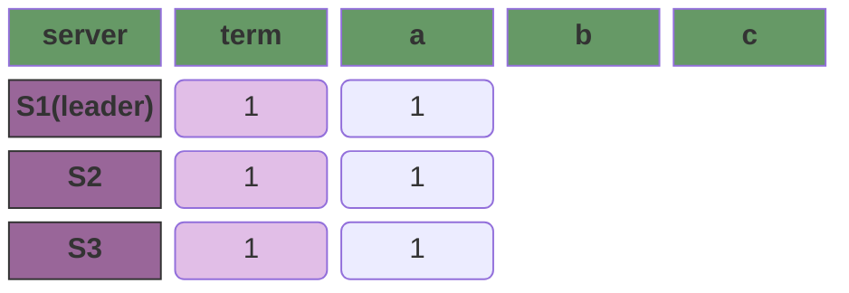

>   客户端发起请求，增加 `S4` 和 `S5` 到集群中，此时增加新的 `C_old U C_new`；此时，我们需要注意在S4和S5刚开始加入集群时，本地没有任何日志，也不知道集群的 `C_old` 和 `C_new` 配置，我们目前的核心目标是：**先同步集群的完整日志（包括普通数据日志 + 历史配置日志），再参与配置变更流程**。

为了让 S4 和 S5 同步完整日志：

1.   新节点启动后，会向集群内的所有已知节点（或通过配置中心获取的 `C_old` 节点列表）发送 **`RequestVote` 请求**（注意：此时它的 `currentTerm` 是 0，远低于集群的当前 term）。
2.   集群内的合法 leader 收到请求后，会发现：
     -   新节点的 `currentTerm` 远小于自己的 term → 拒绝投票；
     -   新节点的日志为空 → 判定它是需要同步的 “落后节点”。
3.   leader 向新节点发送 **`AppendEntries` 请求**，携带自己的 `currentTerm` 和 **日志同步的起始信息**（比如 `prevLogIndex=-1`，`prevLogTerm=-1`，表示从日志起点开始同步）。
     1.   leader 会分批次向新节点同步**所有历史日志**：
          -   所有已提交的普通数据日志；
          -   所有已提交的配置日志（比如 `C_old` 配置条目）；
          -   **未提交的日志**（包括 leader 正在处理的普通日志，以及待下发的 `C_old ∪ C_new` 配置条目）。
     2.   同步规则遵循 Raft 的 `AppendEntries` 一致性检查：
          -   新节点按顺序接收日志条目，写入本地日志；
          -   每同步一批日志，新节点都会向 leader 回复确认；
          -   直到新节点的日志 lastLogIndex 和 lastLogTerm 与 leader 完全一致 → 日志追平完成。
4.   日志追平后，新节点的状态发生两个关键变化：
     1.  新节点的 `currentTerm` 被更新为集群的当前 term；
     2.  新节点通过同步的历史配置日志，**知道了当前集群的生效配置是 `C_old`**；
     3.  leader 开始向新节点发送**心跳包**，新节点正式成为集群的合法 Follower（但此时它还不属于 `C_old`，不会参与 `C_old` 的投票和日志确认）。
5.   新节点接收 `C_old ∪ C_new`。

这里需要注意的点是：新节点在日志同步期间的 “角色定位”：

1.   **不参与投票**：在日志追平前，新节点的日志不完整，即使收到 `RequestVote` 请求，也不会被其他节点认可；
2.   **不参与日志确认**：leader 不会将新节点的确认计入 `C_old` 的多数派 —— 因为新节点不属于 `C_old` 配置，`C_old` 的多数派仅由 S1-S3 计算；

在我们追平后的逻辑如下图所示，这里我们假设S2和S3还没有被下发配置，在实际的操作中，这个是非常罕见的。因为大部分情况下当新节点追上时，配置都已经顺利的下发：

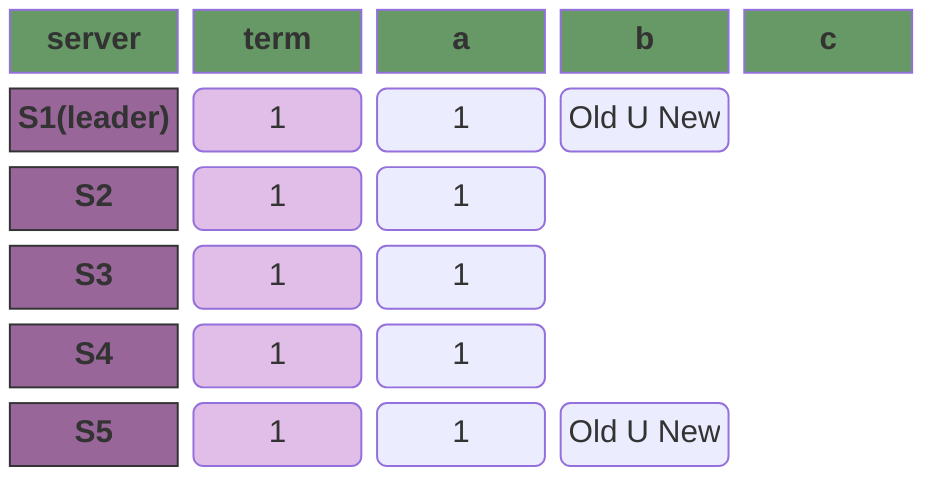

>   此时，leader 所有的 entry 必须要同时得到  `C_old` 和 `C_new` 的同意：这是为了不论在选举中是 `C_old` 集群的机器成为 leader 还是 `C_new` 集群的机器成为 leader，都可以保证它包含了全部的提交日志。
>
>   此时我们假设以下场景：
>
>   -   `S2` 收到 `Old U New`，那此时旧集群和新集群已复制日志的节点分别为：`{S1, S2}` 和 `{S1, S2, S5}`  我们满足条件，配置提交成功。此时 `{S1, S2, S5}` 任意节点当选 leader 都不会影响配置下发，而 `{S3, S4}` 在新旧集群的选举中都不会当选 leader。  
>   -   `S4` 收到 `Old U New`，那此时旧集群和新集群已复制日志的节点分别为：`{S1}` 和 `{S1, S4, S5}` ，我们不满足条件，配置不能提交。因为此时 `{S2, S3}` 节点可能在旧集群中当选 leader，并回滚我们的配置；

到这里 `C_old U C_new` 提交完成：

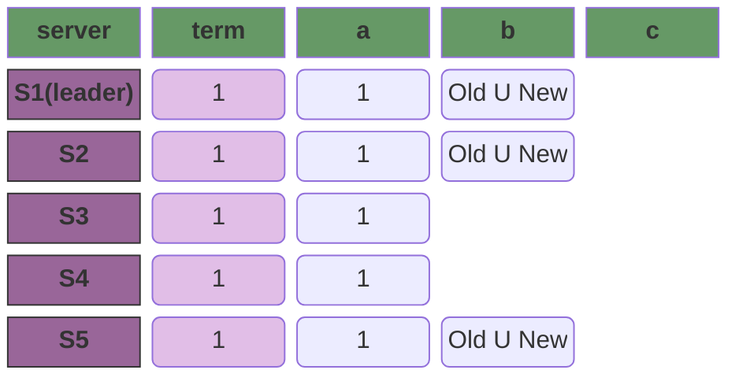

>   leader 可以开始提交 `C_new` 了，我们提交成功，此时变更完成。

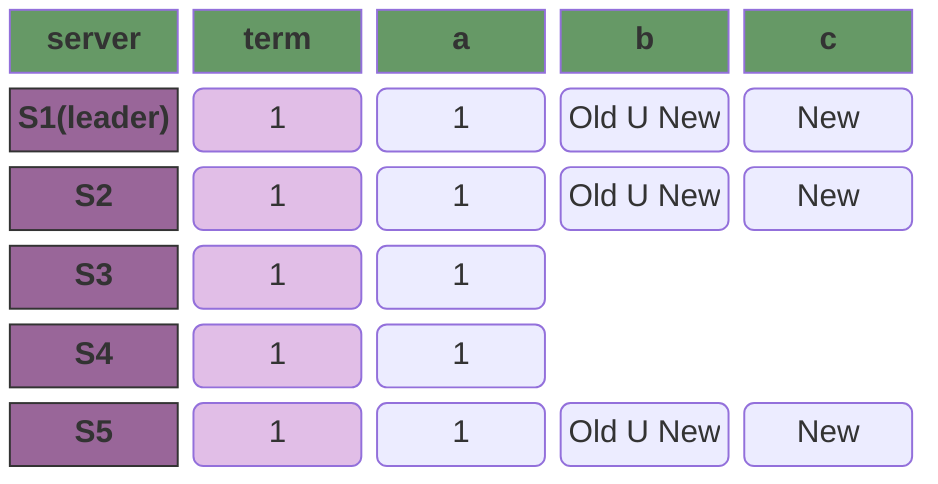

## 日志压缩

raft 使用快照的方式来压缩数据量：在快照系统中，整个系统的状态都以快照的形式写入到稳定的持久化存储中，然后到那个时间点之前的日志全部丢弃。


基本上来说，这种快照压缩基本就是类似于 [LSM Tree Compaction](https://fjall-rs.github.io/post/lsm-leveling/) 中的压缩方案，原理其实也不复杂：

1.   **快照生成**（每个节点独立执行）：
     -   节点将 `lastIncludedIndex` 之前的所有已提交日志**应用到状态机**，得到当前全量状态；
     -   将全量状态 + `lastIncludedIndex`/`lastIncludedTerm`/ 集群配置 写入持久化存储（如磁盘文件），生成快照；
     -   删除 `lastIncludedIndex` 之前的所有日志，仅保留后续的增量 entry。

2.   **快照同步**：
     -   当新节点加入 / 落后节点日志过旧（落后于 leader 的快照截断点）时，leader 不会同步全量旧日志，而是直接发送快照；
     -   新节点接收快照后：
         -   将快照加载到状态机，恢复到 `lastIncludedIndex` 对应的状态；
         -   从 `lastIncludedIndex + 1` 开始同步增量日志；

3.   **快照恢复**：
     -   节点重启时，先加载最新快照（恢复到 `lastIncludedIndex` 状态）；
     -   再重放 `lastIncludedIndex` 之后的增量日志，恢复到最新状态。

## 客户端交互

-   client 发送请求时，如果节点是 follower，follower 会拒绝请求并返回 leader，要求 client 连接 leader；
-   raft 实现线性化语义（每一次操作立即执行，只执行一次，在 client 的调用和收到回复之间），这里存在一些需要处理的问题是：
    -   client 可能在发送请求到 server 之后，server 返回之前宕机；此时 server 正常执行了该指令，但是 client 在重启之后认为调用失败了，对该指令进行重试。此时我们会要求 client 在发送请求之前，通过某种方式生成一个唯一的ID（不能使用随机的ID，例如UUID或者根据时间戳生成的ID），在调用请求时携带此ID，这样 server 可以在收到一个已经执行过的请求时，直接忽略该请求。
    -   例如，kafka 在发送 transaction 时注册 `transactional.id` 来避免数据重复。
-   只读的操作可能返回脏数据：这里的问题在于虽然 raft 只会返回已提交的内容，但是有可能 leader 已经失去了 leader 身份，或者**由于 leader 选举可能导致当前 leader 所知道的 commitIndex 和实际的 commitIndex 不一致**。
    -   领导人必须有关于被提交日志的最新信息，领导人完全特性保证了领导人一定拥有所有已经被提交的日志条目，但是在他任期开始的时候，他可能不知道哪些是已经被提交的。为了知道这些信息，他需要在他的任期里提交一条日志条目。Raft 中通过领导人在任期开始的时候提交一个空白的没有任何操作的日志条目到日志中去来实现。这个逻辑其实比较容易理解：leader 在提交一个空日志后，该空日志被多数 followers 持久化，可以让 leader 确认自己的 commitIndex 是 “当前任期下的合法值”：
        -   新 leader 刚当选时，它的 `commitIndex` 继承自上一任期，但它无法 100% 确定这些 `commitIndex` 对应的日志真的被多数派复制（比如上一任期的 leader 提交了日志，但还没同步给多数派就宕机了）；
        -   新 leader 提交一条空日志（No-Op 条目）到当前任期：这条空日志被多数派复制并提交后，leader 可以确定：**空日志的 `index` 及之前的所有日志，都已被多数派复制**（因为空日志需要多数派确认，而日志是顺序的）；此时 leader 的 `commitIndex` 被更新为该空日志的 `index`，这个 `commitIndex` 是 “当前任期验证过的”，而非 “继承的不确定值”。
    -   领导人在处理只读的请求之前必须检查自己是否已经被废黜了（他自己的信息已经变脏了如果一个更新的领导人被选举出来）。Raft 中通过让领导人在响应只读请求之前，先和集群中的大多数节点交换一次心跳信息来处理这个问题。可选的，领导人可以依赖心跳机制来实现一种租约的机制，但是这种方法依赖时间来保证安全性（假设时间误差是有界的）。

从实践的角度来说， <1> 和 <2> 都不是可靠的，因为完全有可能发生：

1.   在提交空日志更新自己的 commitIndex 之后发生选举，虽然这个因为会重置 follower 的选举超时时间，所以出现的概率很低； 
2.   发送心跳信息也是同理。

但是这些操作的实际作用是：

-   不是 “保证 leader 永远不被取代”，而是 “确认 leader 在**当前时刻**仍是合法 leader”；
-   leader 向多数派发送心跳，收到多数派的回复（且回复的 `term` 与自己一致），这说明：
    1.  多数派的选举超时时间被重置（短时间内不会触发新选举）；
    2.  此时没有其他节点在发起选举（否则多数派会回复更高的 `term`）。

而且，在实践中，通常会通过 “租约机制” 来补充：

-   leader 收到多数派的心跳回复后，给自己颁发一个 “租约”（比如 100ms）；
-   在租约有效期内，leader 处理只读请求时无需重复发心跳 —— 因为租约期内多数派不会触发选举（选举超时 > 租约时长）；
-   租约到期后，leader 重新发心跳续期；
-   这个机制把 “心跳确认的时间窗口” 转化为 “租约时长”，只要租约时长 < 选举超时时间（且时间误差有界），就能保证租约期内 leader 不会被取代。

# 附录

## Figure 2

>   这里对应于raft论文的图表2，这里额外添加了一些可以帮助我们理解raft的信息。

### Entry

>   `Entry` 是我们的日志条目，我们整个raft协议的目的就是保证 `Entry` 被可靠且有序的存储：
>
>   -   只有leader被允许在接收到client请求时创建条目；
>   -   follower 只能通过 `AppendEntries RPC` 被动的接收从leader同步的条目，并根据RPC请求的状态以及自身的状态确定是否同步成功。

| 参数  | 描述                                             |
| :---: | ------------------------------------------------ |
| term  | 在leader接收到客户端请求时，根据自身的term生成。 |
| index | 日志的索引                                       |
| data  | 日志的实际数据                                   |

1.   在raft中，term是全局单调递增的，index是副本（单个节点的日志序列）内单调递增的。使用 `(term, index)` 可以在一个单的节点中定位到唯一的日志。这里需要注意的是，**不同分片是相互独立的 Raft 集群**，每个分片有自己的 leader、Term 序列、日志 Index 序列。

2.   在一个多分片的系统中，要实现全局日志的唯一性，我们需要在 `(Term, Index)` 的基础上增加一个额外的 `ShardId` 表示分片ID，即全局的唯一标识为 `(ShardId, Term, Index)`；
3.   raft 并没有规定 `data` 要存放在 entry 中，所以在工程实践中通常会根据需求有不同的实现：
     -   直接存储 data：适合日志内容较小的场景（如配置指令），优点是简单，缺点是日志体积大，同步成本高；
     -   存储数据索引（`(term, index, key)` 或仅 `(term, index)`）：适合大体积数据（如文件、大 KV 值），通常会把实际数据存到独立的存储引擎（如 RocksDB），Entry 中只存 “数据索引” —— 此时 `(Term, Index)` 本身就是天然的索引（因为单分片内唯一），可以省略额外的 key；
     -   但是，无论哪种存储方式，**Entry 必须能还原出 “确定性的状态机指令”** —— 比如索引指向的数据不能丢失 / 篡改，否则状态机执行会不一致。

### State

>   所有服务器上的持久化状态，在响应  `RPCs` 之前它需要被更新到可靠的存储中：
>
>   1.   `currentTerm`：集群的 “版本号”，核心是**单调递增 + 持久化**，例如：
>        -   **接收 `RequestVote RPC` 时**：若候选人的 `term < currentTerm` → 拒绝投票（旧 Term 候选人无资格）；若候选人的 `term > currentTerm` → 自身更新 `currentTerm` 为更大值，转为 Follower，再判断是否投票。
>        -   **接收 `AppendEntries RPC` 时**：若 leader 的 `term < currentTerm` → 拒绝同步日志（旧 Term leader 已失效）；若 leader 的 `term > currentTerm` → 自身更新 `currentTerm`，转为 Follower，接受日志同步。
>   2.   `votedFor` 主要是用于在发生leader选举时的投票，如果服务器主动发起选举那他将投票给自己。
>        -   单 Term 最多投一票；
>        -   Term 递增后重置：当节点的 currentTerm 从 N 递增为 N + 1 时，votedFor 必须重置 -- 因为我们进入了新的选举周期；
>   3.   `log[]` 日志的持久化载体：
>        -   **日志 Index 的起始值**：论文中明确日志 `Index` 从 **1** 开始（而非 0），`log[0]` 通常作为 “哨兵日志”（空日志，Term=0），用于简化日志一致性检查的边界条件。
>        -   **持久化要求**：`log[]` 中**已提交的日志**必须持久化，未提交的日志建议也持久化（节点重启后可快速恢复，减少同步成本）—— 若未提交日志丢失，重启后 leader 会重新同步，不影响一致性。
>   4.   Raft 要求这三个状态**必须在响应 RPC 前持久化**，本质是为了避免节点崩溃后 “丢失关键信息”，导致集群一致性被破坏：
>        -   若 `currentTerm` 丢失 → 节点重启后 Term 回退，可能挑战现任 leader；
>        -   若 `votedFor` 丢失 → 节点重启后在同一 Term 重复投票，可能选出多个 leader；
>        -   若 `log[]` 丢失 → 节点重启后日志不全，可能执行错误的指令序列。
>   5.   `currentTerm` 和 `votedFor` 的持久化必须是一个原子的操作，这是为了避免节点崩溃重启后，出现 **“投票状态不一致”** 的问题，进而导致集群选出多个 leader。
>        1.   节点 A 的 `currentTerm = 2`，`votedFor = NULL`，收到候选人 B 的 `RequestVote RPC`（Term=2）；
>        2.   节点 A 决定投票给 B，先把 `votedFor` 更新为 B 的 ID，**还没来得及更新并持久化 `currentTerm`**，节点崩溃重启；
>        3.   重启后，节点 A 从磁盘读取到的状态是 `currentTerm = 2`，`votedFor = NULL`（因为 `votedFor` 的修改没原子持久化）；
>        4.   此时候选人 C 又发来 `RequestVote RPC`（Term=2），节点 A 会误以为自己没投过票，再次投票给 C；
>        5.   最终同一 Term=2 中，节点 A 投了 B 和 C 两张票，可能导致 B 和 C 都拿到多数票，出现**双 leader 脑裂**，破坏集群一致性。

|    参数     | 描述                                                         |
| :---------: | ------------------------------------------------------------ |
| currentTerm | 服务器的最后Term（在启动时初始化为0，单调递增）              |
|  votedFor   | 在当前Term中收到投票的候选人的唯一ID（如果没有投票则为NULL） |
|    log[]    | **Log Entries**；每个entry包含了状态机的指令，以及leader收到该Etnry时的Term（初始为1） |

>   所有服务器上易失性的状态：
>
>   1.   `commitIndex` 表示**集群中已被多数节点复制的最高日志索引**，这里每个节点上的值都不一定一样，但是遵循几个原则：
>        -   提交只能由 leader 发起，follower 只能通过响应 leader 的RPC请求来实现提交；
>        -   leader.commitIndex >= follower.commitIndex；
>        -   leader 收到 client 请求时：
>            1.   先记录日志到 log；
>            2.   leader 向 follower 发送 `AppendEntries RPC` 请求，不仅要求 “持久化日志”，还会携带自身的 `commitIndex` —— Follower 可主动对比并更新自己的 `commitIndex`
>            3.   在超过半数的机器（包括leader自身）实现持久化日志后，leader 将更新自身的 commitIndex；
>            4.   在**心跳 / 下一次 `AppendEntries RPC`** 中携带最新的 `commitIndex`，Follower 收到后自动将自身 `commitIndex` 更新为 `min(leader.commitIndex, Follower.lastReceivedEntryIndex)`。这里需要注意的是，`leader` 的 commitIndex 可能要小于 follower 已经持久化的 index，但这并不意味着 follower 的日志比 leader 多，只是单纯的因为leader尚未收到该entry的超过半数的持久化响应，导致leader不能确认该entry已经被正确的记录，从而无法更新 commitIndex；
>            5.   leade 会记录那些没有成功持久化entry的follower，并给他们发送RPC请求要求他们按顺序提交entry并更新commitIndex；
>   2.   在我们上面提到的过程中，leader更新自身commitIndex和leader要求follower更新自身commitIndex，这两步并不是一个原子的操作，但是这并不影响我们的一致性：**因为所有的entry在响应请求之前已经被成功的持久化，raft 保证已持久化的日志是可信的，`commitIndex` 只是 “已提交日志的索引标记”，即使丢失也能通过日志本身恢复，这是 Raft 一致性的核心保障。**，考虑以下这个场景：
>        1.   leader 持久化 `(0, 0)` 对应的 entry；
>        2.   leader 将这条 entry 同步给全部的 follower，并且超过半数的follower返回true，表示已经持久化该 entry；
>        3.   leader 更新自身 commitIndex，并要求符合要求的 follower 也更新自身的 commitIndex；
>        4.   在 follower 更新自身的 commitIndex 之前，整个集群宕机，此时出现了leader和follower的 commitIndex 冲突的情况；
>        5.   集群恢复，从candidate中选举出新的leader，而候选人的日志必须是**集群中最 “新” 的**（即最后一条日志的 `Term` 更大，或 Term 相同但 Index 更大）；**注：可以参考 [什么是集群中的最新日志](#什么是集群中的最新日志) 查看更详细的说明**
>        6.   新 leader 恢复 `commitIndex` 时，不会直接用 “最后持久化的日志索引”，而是：
>             1.  先找到 “已被多数节点复制的最高日志索引”；
>             2.  将自身 `commitIndex` 更新到该索引；
>             3.  通过心跳将 `commitIndex` 同步给所有的 follower。
>   3.   `lastApplied` = **当前节点已经成功应用到本地状态机的最高日志条目的 Index**。lastApplied 和 commitIndex 是 “配套使用” 的，完整执行流程：
>        -   leader 确认某日志（如 `index=4`）被多数节点复制 → 更新自身 `commitIndex=4`；
>        -   leader 通过心跳 /`AppendEntries RPC` 把 `commitIndex=4` 同步给所有 Follower；
>        -   任意节点（leader/Follower）发现 `lastApplied < commitIndex`（比如 `lastApplied=2`）；
>        -   节点按顺序执行 `index=3` → `index=4` 的日志指令到状态机；
>        -   每执行完一条，就把 `lastApplied` 加 1（最终 `lastApplied=4`）。
>   4.   这里 `lastApplied` 和 `commitIndex` 不需要持久化的原因并不相同：
>        -   `lastApplied` 基于raft协议中要求状态机的执行是幂等的；
>        -   `commitIndex` 是基于所有的 `entries` 都被持久化，所以 commitIndex 可以从日志中无损恢复。

|    参数     | 解释                                                         |
| :---------: | ------------------------------------------------------------ |
| commitIndex | 已知已提交的最高的日志条目的索引（初始值为0，单调递增）      |
| lastApplied | 已经被应用到状态机的最高的日志条目的索引（初始值为0，单调递增） |

>   领导人（服务器）上的易失性状态 (选举后已经重新初始化)：这个部分是为了记录和follower通信的结果，以使得我们不需要每次都重新的发送RPC请求确认当前follower的状态：
>
>   1.   `nextIndex[]`  是 leader 标记的下一次要向该 Follower 同步的日志 Index，在初始时初始化为leader最后的entry的index+1；在一个完全同步的集群里，nextIndex = matchIndex + 1，然而 nextIndex 的功能和 matchIndex 完全不同 -- nextIndex 是 leader 猜测的值，而 matchIndex 是收到 follower 的返回值后确定的值，同时它有一些独有的功能：
>        -   同步流程的异步性：leader 向 follower 发送 `AppendEntries RPC` 后，**不需要等待返回结果**，就可以接收新的客户端请求、生成新的日志。如果没有 nextIndex（使用 matchIndex），那么在返回之前，leader 就不能再向 follower 发送信息；
>        -   初始化 leader 同步状态，应对新 leader 当选场景：在选举完成之时，leader.matchIndex 只能全部初始化为0，因为 matchIndex 有一个重要的限制是：raft 会使用 matchIndex 来计算 commitIndex，所以他不能和 nextIndex 一样初始化为当前 leader 的日志条目的索引+1。这意味着，它只能从后往前探测，在日志量非常大的性能极其低下。
>   2.   `matchIndex[]` 在我们发送 AppendEntries 请求到 follower 时，如果 follower 返回 true，说明 follower 已经持久化我们要求 follower 复制的日志，于是我们可以更新对应 follower 的 matchIndex。而我们实际的 commitIndex 可以通过 matchIndex 计算得出：
>        -   最简单粗暴的枚举：收集所有节点（含 leader）的 `matchIndex` → 升序排序 → 取排序后数组的「多数派阈值位置」的值（如 3 节点取索引 1，5 节点取索引 2），该值即为最新的 `commitIndex`（且需保证 `commitIndex ≥ 旧值`）。
>        -   对于某个日志 Index=N，若有 **多数节点** 的 `matchIndex ≥ N`，则 N 是 “已被多数节点持久化的 Index”，leader 可将 `commitIndex` 更新为所有满足条件的 N 中的最大值。
>        -   在我们的工程实现中，我们还可以对这个方法进行工程优化 -- 我们维护 `matchIndex` 的**有序列表**（而非每次排序）：leader 每次更新某个 Follower 的 `matchIndex` 后，只调整该值在有序列表中的位置：
>            -   假设我们的初始 matchIndex = [1, 2, 3, 4, 5]
>            -   当节点1更新到4时，数组变化为 [2, 3, 4, 4, 5]，也就是我们的 commitIndex 变化为4；
>            -   带来的开销时，我们无法直接通过数组访问 matchIndex，需要额外的维护一个数组来映射节点到 matchIndex 的索引。

|     参数     | 解释                                                         |
| :----------: | ------------------------------------------------------------ |
| nextIndex[]  | 对于每一台服务器，发送到该服务器的下一个日志条目的索引（初始值为领导人最后的日志条目的索引+1） |
| matchIndex[] | 对于每一台服务器，已知的已经复制到该服务器的最高日志条目的索引（初始值为0，单调递增） |

### AppendEntries

>   由领导人调用，用于日志条目的复制，同时也被当做心跳使用

| 参数         | 解释                                                         |
| ------------ | ------------------------------------------------------------ |
| term         | 领导人的任期                                                 |
| leaderId     | 领导人 ID ，因此 follower 可以对客户端进行重定向             |
| prevLogIndex | 紧邻新日志条目之前的那个日志条目的索引                       |
| prevLogTerm  | 紧邻新日志条目之前的那个日志条目的任期                       |
| entries[]    | 需要被保存的日志条目（被当做心跳使用时，则日志条目内容为空；为了提高效率可能一次性发送多个） |
| leaderCommit | leader 的 commitIndex                                        |

| 返回值  | 解释                                                         |
| ------- | ------------------------------------------------------------ |
| term    | 当前任期，对于领导人而言 它会更新自己的任期                  |
| success | 如果跟随者所含有的条目和 prevLogIndex 以及 prevLogTerm 匹配上了，则为 true |

接受者的实现（假设请求为 request）：

1.  返回 false，if request.term < currentTerm，这种情况下说明发生了重新选举，不应该接受已经失效的请求；
2.  返回 false，如果接收者的 logs 中不包含entry满足 `entry.Term == request.prevLogTerm && entry.Index == prevLogIndex`：
    -   request.entries 为空表示心跳包，目的是让 leader 快速感知 Follower 的日志状态；
    -   没有日志满足条件，说明日志缺少了上一个entry的日志，返回 false 通知 leader 需要下发更早的消息；
    -   从工程实现来讲，返回 `false` 时，可附带自身的 `lastLogIndex` 和 `lastLogTerm`，leader 可直接将 `nextIndex` 跳转到 `lastLogIndex`，而非逐次减 1（大幅减少试探次数）。
3.  如果一个已经存在的条目和新条目发生了冲突（`follower.log[entry.index].term != request.entries[entry.index - prevLogIndex - 1].term`），那么就删除这个已经存在的条目以及它之后的所有条目，这个说明因为 leader 选举导致该日志在重新选举的过程中被回滚了，通常是因为当前节点在选举前是 leader 节点，它包含了一些临时日志，而这个临时日志并没有被正常提交，具体的场景在 [leader选举成功之前的典型状态](#leader选举成功之前的典型状态) 这一小节中有详细分析；
4.  追加日志中尚未存在的任何新条目，此时我们已经满足了所有的append条件，我们需要将这些日志（request.entries）中必要的部分持久化（这里有可能因为乱序我们先收到了后面的日志，所以这里我们根据自身的状态持久化缺失的日志即可），并更新 follower.logs；
5.  如果 leaderCommit > follower.commitIndex，设置 follower.commitIndex = `min(leaderCommit, follower.lastLogIndex)`，这里我们已经顺利的将日志持久化了，我们需要更新自身的 commitIndex，这样 leader 才可以开始统计有哪些entry已经被多数节点接受达成共识：
    -   leaderCommit 是 leader 通过收集所有 followers 的提交信息得出的当前达成共识的entry的最大 index；
    -   lastLogIndex 可能会大于 leaderCommit，这一部分日志就是 follower 已经收到，但是在整个集群中还没有达到大多数节点同步所以尚未提交的临时日志；
    -   这里 `leaderCommit` > `follower.commitIndex` 的条件必不可少，因为在极端情况下，可能出现 leaderCommit < follower.commitIndex 的情况，具体可以参考 [leaderCommit和followerCommit的极端异常](#leadercommit和followercommit的极端异常)。在这种情况下，会出现 `leaderCommit` < `follower.commitIndex`，进而违反我们的**已提交日志永不会滚的原则**。最简单的来说，出现 `leaderCommit` < `follower.commitIndex` 的唯一可能就是 leader 在更新 commitIndex 后，同步新的 commitIndex 之前被回滚，在这种情况下，我们的日志已经提交，只是 commitIndex 没有更新。

在这个过程中，有几个指的注意的点：

1.   在 AppenEntries 请求发起时，接收者是 follower，然而在请求到达后可能发生了选举导致状态变更。现在接收者可能是新的 leader，也有可能是 follower。但是如果发生选举了，那么接收者应该拒绝请求（也有可能此时 term 还没有更新导致接收了请求，但是会在<3>中被回滚）；
2.   **这里的条件判断从上到下是有顺序要求的，举例来说，如果不满足第一个条件 request.term >= currentTerm，则应该直接拒绝请求 -- 因为这个请求已经失效了；**
3.   在 <3>，<4>，<5> 中我们都不应该返回，因为这个时候我们已经到了我们真是的日志复制逻辑，我们要做的就是：
     -   回滚错误的临时日志；
     -   追加本节点缺失的日志；
     -   更新 commitIndex；

### RequestVote RPC

>   由候选人负责调用用来征集选票

| 参数         | 解释                         |
| ------------ | ---------------------------- |
| term         | 候选人的任期号               |
| candidateId  | 请求选票的候选人的 ID        |
| lastLogIndex | 候选人的最后日志条目的索引值 |
| lastLogTerm  | 候选人最后日志条目的任期号   |

| 返回值      | 解释                                       |
| ----------- | ------------------------------------------ |
| term        | 当前任期号，以便于候选人去更新自己的任期号 |
| voteGranted | 候选人赢得了此张选票时为真                 |

1.   return false if `request.term` < `currentTerm`，因为发起请求的节点的请求已经过期；
2.   如果 `voteFor` 是 null 或者 candidateId，并且 candidate 的 logs 至少和接收者一样新，那么请求发起者获得选票（也就是 voteGranted 为 true）；

这里 candidate 需要在请求中携带 `lastLogIndex` 和 `lastLogTerm`，这是为了校验 candidate 是否有资格成为 leader，回忆我们之前的结论：**候选人的日志必须是集群中最 “新” 的（这里需要解释的是，任何节点都可能在 leader 选举超时时发起选举成为候选人，因为节点只知道自己的信息和 leader 的部分信息，他对其他节点的信息是完全无感知的，也就是说他必须发起 `RequestVote RPC` 请求才能知道自己的日志是不是当前集群中最新的）**。

### RulesForServers

-   All Server：
    -   if commitIndex > lastApplied ： 增加 lastApplied，apply(log[lastApplied])；我们必须要对raft集群中的每个server都执行apply，因为raft集群中的每个server的状态机是独立的。例如，假设我们的状态机是一个redis，我们的raft集群有三个分片，那么我们每个分片都需要对应一个独立的redis作为状态机。
    -   if RPC request or response contains term T > currentTerm: set currentTerm = T, convert to follower.  这里的逻辑是，当机器收到的RPC请求中，包含了一个比自己大的Term，这说明发生了一次选举，而接收者的状态必须转换为follower。这里接收者并不一定是因为网络故障而停止服务，最后恢复的 leader，它也可能是一个正常服务的 follower，因为可能有其他的 follower 比他先触发选举超时选举。这里需要注意的是，发起选举的 candidate 会先递增term再发送RPC请求，所以当 candidate 发起选举时已经进入了一个新的term。
-   followers
    -   响应 candidates 和 leaders 的 RPC 请求；
    -   如果超过选举超时时间没有收到来自当前 leader 的 RPC 请求和 candidate 的请求投票请求，将转换为 candidate；
-   candidates
    -   当转换为 candidate 时，发起一次选举：
        -   增加当前的 term；
        -   为自己投票；
        -   重置选举定时器；
        -   向所有其他的servers发送 RequestVote 请求；
    -   如果收到大多数server的投票，转换为leader；
    -   如果收到来自新 leader 的 AppendEntries RPC，转换为 follower；
    -   如果选举超时，再次发起一个新的选举。
-   leaders
    -   当选时：发送一个初始化为空的 AppendEtnries RPC（心跳）给其他服务器；在空闲期间重复发送防止选举超时；
    -   如果收到客户端的请求，将 entry 顺序添加到本地日志，并在 entry apply 到状态机后响应；这里需要注意的是，等待 entry apply 到状态机已经隐含了需要等待该 entry 达成共识，因为只有 commitIndex > lastAppliedIndex 时才会执行 apply；
    -   如果 leader.lastLogIndex >= nextIndexForAFollower：发送 AppendEntries 请求到这台对应的 follower，通常我们在工程上会做优化 -- 不是一次发一条而是将 `[nextIndex, lastLogIndex]`  打包在一个RCP请求中发送：
        -   如果 AppendEntries 返回 true，说明对应的 follower 已经正确的复制目标日志，我们修改这台 follower 对应的 nextIndex 和 matchIndex；
        -   如果 AppendEntries 因为日志不一致（通常是因为缺少前面的日志），降低 nextIndex 并重试。这里在工程上来说，我们可以让 follower 在响应中直接返回 follower.lastLogIndex，这样 leader 可以直接从 follower 缺少的日志开始发送，从而降低 RPC 请求的数量；
    -   如果存在一个 index N，满足 N > commitIndex，并且 matchIndex[i] 中超过半数 >= N，并且 log[N].term == currentTerm，设置 commitIndex = N。这里就是我们提到的**日志已经达成共识**，这里一定要注意的是必须满足条件，`log[N].term == currentTerm`：
        -   `log[N].term == currentTerm` 的核心逻辑是：仅允许 leader 提交**自己当前任期（currentTerm）** 生成的日志，旧任期的日志只能等待 leader 提交 currentTerm 时一起更新，这是 raft 防止已提交的日志被回滚的核心保障；具体可以参考 [新leader提交日志时对term的限制](#新leader提交日志时对term的限制)

-   在发生选举时可能发生如下情况：
    -   A 触发超时选举，将自身转换为candidate，将term递增并发起投票请求；
    -   在投票请求到达B之前，B触发超时选举，将自身转换为candidate，将term递增也准备发起投票请求；
    -   此时B收到A的请求，两者term相同会发生什么？

# QA

## 通用选举

在我们分析raft的选举机制之前，我们必须先了解一个通用的选举的核心目标到底是在干什么：它是**在一个多节点集群中，选出唯一的节点作为 “管理者”（leader），并让所有节点达成共识**—— 它不局限于 Raft 算法，而是所有分布式共识协议的基础环节。

我们可以把它理解成 **“分布式版的投票选举”**，有几个**必须掌握的核心要素**，无论哪种选举算法（Raft、Paxos、ZAB），都绕不开这些内容。

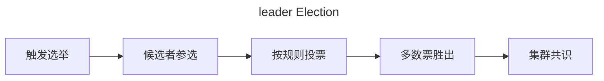

### 选举的触发条件

集群不会平白无故发起选举，只有满足特定条件时才会启动，核心触发场景有以下几个：

1.   **集群初始化**：所有节点刚启动时，集群里没有 leader，需要通过选举选出第一个 leader。
2.   **leader 失联**：这是最常见的触发场景：Follower 节点长时间收不到 leader 的心跳 / 响应，判定 leader 宕机或网络分区，发起新选举。
3.   **leader 主动退位**：少数场景下，leader 因负载过高、节点维护等原因，主动放弃领导地位，触发重新选举。

### 选举的核心规则

这是选举的 “游戏规则”，决定了选举是否公平、能否选出唯一 leader：

-   **投票权规则：一人一票，任期内一票定终身**
    -   每个节点只有 1 张选票；
    -   同一个**任期**内，节点只能把票投给一个候选者（避免 “一票多投” 导致多个候选者得票过半）；
    -   任期是选举的 “时间维度”，每次选举都会进入新任期，选票重置。
-   **获胜条件：多数票胜出**
    -   候选者必须获得 **超过集群节点半数的选票** 才能当选 leader（比如 3 节点需 2 票，5 节点需 3 票）；
    -   这个规则是为了**防止脑裂**：网络分区时，最多只有一个分区能凑齐多数节点，选出 leader。
-   **候选者资格：不是谁都能参选**：不同算法对候选者资格的要求不同，但核心原则一致：**候选者的 “数据完整性” 要达标**。
    -   比如 Raft 要求候选者的日志必须是集群中最新的（避免选出日志不完整的 leader，导致数据丢失，但是这里需要注意在实际的过程中，选出来的不一定是最新的，具体参考 [选举时leader不一定包含最新数据](#选举时leader不一定包含最新数据)）；这里也是为什么raft的日志中，一定要等 `Commited` 之后才能继续下一步，为了就是防止leader在日志Committed之前执行日志，随后立即宕机，此时这条日志将丢失导致一致性被破坏。
    -   本质是保证：新 leader 能代表集群的 “最新状态”。

### 选举的三种典型结果

通用选举也只有 3 种结局：

1.   **候选者胜出，成为 leader**：拿到多数票的候选者，立刻向所有节点广播 “当选通知”（比如 Raft 的心跳包），宣告自己的领导地位，其他节点转为 Follower。
2.   **其他候选者胜出，自己转为 Follower**：参选过程中，收到其他候选者的 “当选通知”，且对方的任期合法，自己主动放弃参选，转为 Follower。
3.   **选举无结果，重新投票**：多个候选者瓜分选票，没有任何一方拿到多数票，选举超时。此时需要等待下一轮选举，通常通过**随机延迟**降低再次撞车的概率。

### 选举的核心目标

这是衡量选举算法好坏的两个关键指标，也是所有分布式协议的核心目标：

1.  **安全性**：保证**同一任期内最多只有一个 leader**，不会出现 “两个 leader 并存” 的脑裂情况。
2.  **活性**：保证**只要集群能正常通信，最终一定会选出 leader**，不会陷入 “无限选举” 的死循环。

### 一个选举的例子

用一个 3 节点集群（A、B、C）举例，流程就像这样：

1.  集群初始化，A、B、C 都是 Follower，等待 leader 心跳，此时 Term == 0；
2.  因为没有leader，所以会触发超时选举，在实际应用中，我们会为每个节点设置不同的超时时间避免同时触发导致选举失败。假设A先超时，Term 变为 1，向B、C请求选票；
3.  B 把票投给 A（任期 1 内第一次收到请求），C 也把票投给 A；
4.  A 拿到 2 票（超过半数），当选 leader，向 B、C 发心跳；
5.  B、C 收到心跳，确认 A 是 leader，保持 Follower 状态；
6.  若 A 宕机，B、C 收不到心跳，选举超时，各自随机延迟后，B 先超时转为候选者，进入任期 2，向 C 要票，拿到 1 票 + 自己 1 票 = 2 票，当选新 leader。

|   T    | 节点 A 行为                                                  | 节点 B 行为                                                  | 节点 C 行为                                                  |        Term         | 集群最大 Term |                         关键规则触发                         |
| :----: | :----------------------------------------------------------- | :----------------------------------------------------------- | :----------------------------------------------------------- | :-----------------: | :-----------: | :----------------------------------------------------------: |
| **T0** | 选举超时触发                                                 | 未超时，等待心跳                                             | 未超时，等待心跳                                             | A:0<br/>B:0<br/>C:0 |       0       |    选举超时条件：Follower 未收到心跳 / 选举请求，触发选举    |
| **T1** | 1. 自增 Term → 1<br/>2. 切换为 Candidate<br/>3. 向 B、C 发送 `RequestVote`（携带 Term=1）<br/>4. 给自己投票 | 未收到 A 的请求，选举超时触发                                | 未收到任何请求                                               | A:1<br/>B:0<br/>C:0 |       1       |     Candidate 参选第一步：**本地 Term 自增**，再发起投票     |
| **T2** | 请求正在网络传输中，未到达 B                                 | 1. 自增 Term → 1<br/>2. 切换为 Candidate<br/>3. 向 A、C 发送 `RequestVote`（携带 Term=1）<br/>4. 给自己投票 | 未收到任何请求                                               | A:1<br/>B:1<br/>C:0 |       1       |  B 未感知 A 的请求，按规则独立自增 Term，二者 Term 同步为 1  |
| **T3** | 收到 B 的 `RequestVote`（Term=1）→ 判断 Term 相等，拒绝投票（已投自己） | 收到 A 的 `RequestVote`（Term=1）→ 判断 Term 相等，拒绝投票（已投自己） | 收到 A 的 `RequestVote`（Term=1）<br/>1. 自增 Term → 1<br/>2. 投给 A（先收到 A 的请求） | A:1<br/>B:1<br/>C:1 |       1       | 1. 同 Term 内节点**一票定终身**<br/>2. Follower 收到更高 Term 请求，**立即同步 Term** |
| **T4** | 统计选票：自己 + C → 2 票（满足 3 节点多数派）→ 切换为 leader | 统计选票：仅自己 → 1 票（不足）→ 等待                        | 切换为 Follower，等待 leader 心跳                            | A:1<br/>B:1<br/>C:1 |       1       |      获胜条件：**超过半数选票**，Candidate 晋升 leader       |
| **T5** | 向 B、C 发送 `AppendEntries` 心跳（携带 Term=1）             | 收到 A 的心跳（Term=1）→ 确认 A 为 leader，切换为 Follower   | 收到 A 的心跳，保持 Follower                                 | A:1<br/>B:1<br/>C:1 |       1       |   leader 心跳作用：**宣告任期权威**，阻止其他节点发起选举    |

选举是一个相当复杂的逻辑，有非常多的边界条件需要处理，这里简单的给到几个常见的异常：

1.   A，B，C 三个节点同时触发超时，所以他们都发起了选举请求，每个人都得到了自己的一票，最终选举失败；这个过程可以无限重复导致永远无法选举出真正唯一的leader；这个情况在出现跨区域的节点时尤其常见，例如假设节点之间的通信延迟是200ms，而选举的超时时间是100ms，这意味着每次在消息发送到之前，其他的candidate都因为选举超时而发起了一次选举。
2.   选举超时触发时的行为并不是原子的可能存在如下情况：
     -   `T0` A 触发选举超时，自身 Term += 1并且向其他的节点发送选举请求；
     -   `T1` B 在 A 的选举请求到达之前触发选举超时
     -   `T2` B 将自身 Term += 1；
     -   `T3` B收到来自A的选举请求，此时B应该继续给给自己投票还是直接放弃，转而给A投票；

关于异常2，raft 其实给出了标准的解决方案：**B 必须「拒绝给 A 投票，投给自己」**，根据raft规则：

1.   **Term 相等时，投票遵循 “先来后到 + 一票定终身”**：
     -   B 触发选举超时后，已完成「Term+1」+「给自己投票」（**这两个操作是原子的**）→ B 的 `votedFor` 字段已标记为「投给自己」；
     -   此时收到 A 的 RequestVote (T1)，因「同一 Term 内只能投一次票」，B 直接拒绝 A 的请求，继续保持 Candidate 状态。
2.   **若 B 仅自增 Term 但未完成投票，处理逻辑不变**：
     -   Raft 规定：Candidate 参选的第一步是「Term+1 → 重置 votedFor → 投给自己 → 发送请求」（这组操作必须加锁，保证原子性）；
     -   只要 B 完成了 Term+1，无论是否发送请求，收到同 Term 的投票请求时，都优先投给自己（因为自己是 “先发起选举” 的一方）。

**为什么不能 “放弃参选，转而投给 A？**因为如果允许 B 放弃参选投给 A，会破坏「投票的原子性」，导致更严重的问题：

-   假设 B 先自增 Term=1，又放弃投给 A → 若此时 C 也发起了 Term=1 的选举请求，B 可能再次投票给 C → 同一 Term 内投了两次票，导致 A 和 C 都拿到 2 票，出现 “双 leader”；

**这里的根本逻辑在于，currentTerm 自增，vote，修改state为candidate必须是一个原子行为。**

假设我们不加锁：

```go
func (n *RaftNode) startElection() {
    n.currentTerm += 1 // 步骤1：Term自增到1
    n.votedFor = n.id  // 步骤2：标记投给自己
    n.state = candidate

    n.sendRequestVoteToAll()
}
```

那么可能出现的异常有：

1.   节点发起选举超时，在处理 `n.currentTerm += 1` 的过程中，发起了第二次选举超时，这会产生并发问题并导致 `n.currentTerm` 不是预期的2而是1；
2.   在 `n.votedFor` 执行之前，进程执行被其他的candidate的sendRequestVoteToAll打断，先给其他的candidate投票，再给自己投票，违反了一人一票原则；

## 什么是集群中的最新日志

在我们leader选举，故障恢复等情况下，我们会有一个重要的概念，那就是要找到当前节点下**最新日志**，这个最新日志的定义也非常简单：

-   先比较 entry 的 term，term越大日志越新；
-   term 相同的情况下，index 越大日志越新；

具体这个结论是怎么来的呢？我们现在详细分析，我们可以先给出我们的结论：

>-   term 相同，index 越大则日志新是因为在未发生选举的情况下，index 是单调递增的；
>-   term 越大则表示 entry 越新，这是因为集群在leader选举时（此时 term 还没有递增），会选择所有candidate中 index 最大的那个candidate，而这个 index 有可能小于原 leader 中的最大 index。在当选后，新的 leader 会递增 term，并以自身的 max(index) 作为当前 index 开始递增。**这相当于我们对这个顺序写入的日志进行了一次截断，所有 index 大于新的leader的 max(index) 的 entry 会被回滚。**

### 几个重要的核心前提

首先，我们需要先记住几个核心前提：

1.   raft的选举可以分为三个阶段：
     1.   集群正常服务；
     2.   集群发生leader选举，此时集群不对外服务；
     3.   集群leader选举结束，term += 1；
2.   raft的日志可以分为**已提交日志**和**未提交日志**，我们所说的raft不会删除日志，这里的日志指的是**已提交日志**，对于未提交日志是允许回滚的；
3.   raft的etnry变更其实分为三个不同的阶段，这里需要注意的是，其中 <1> 和 <2> 并不是原子的，在工程优化的角度来说，raft完全可以先持久化日志并等待 prevCurrent 的提交完成：
     1.   持久化实际日志数据；
     2.   `logs = Append(logs, (term, index))` 将日志顺序添加到logs中，**raft协议规定这里必须 append current 之前，append prevCurrent 已经被调用**；
     3.   follower还需要向server返回执行结果，leader 需要根据follower返回的结果向client返回结果； 
4.   根据 <2> 的结论，我们有一个推论：每一个entry之前都包含了在他之前的全部entries，需要注意的是，这里的entries不一定是已提交日志而是在当前节点有效的临时日志；

### 为什么term越大日志越新

这里最重要的结论是要搞清楚，term 和 index 的生成逻辑：

-   term 的生成逻辑：全局单调递增，发生 leader 选举时，当选 leader 的机器会立刻将 term += 1。这里注意，在一个多分片的集群内，不同的分片可能有不同的 term；
-   index 的生成逻辑：**index 的生成规则是，单节点内单调递增，与 term 无关，但新 leader 不会继承旧 leader 的 index 最大值。**

再结合我们之前提到的raft选举三个阶段中的第二个阶段：**选举出新的leader之前，集群不对外服务。**我们可以推断出一个结论：**假设我们现在的 term = N，那么在集群选举leader成功后，新的数据写入之前，整个集群不存在 term = N + 1 的数据，此时我们集群中数据最新的数据就是 term = N 并且 index = max(all_index_in_group) 的日志。 **

也就是说，在这个阶段，我们集群内选举出来的 leader 并不会涉及到 `term = N + 1` 的 entry，那我们以这个节点的选举举一个例子。

#### leader选举成功之前的典型状态


##### 初始状态

初始状态下：

1.   leader 节点包含了四条日志，其中前面两条是已提交日志，后面三条是临时日志；
2.   节点B（follower）包含了三条日志，其中前面两条是已提交日志，第三条是临时日志；
3.   节点C（follower）包含了两条已提交日志；

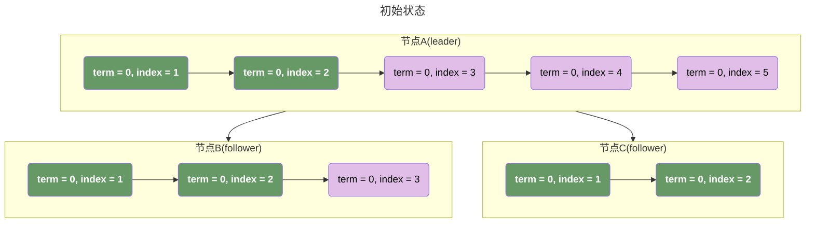


##### 节点A故障，发生leader选举

我们现在需要从节点B和节点C中选举出一个新的 leader，而此时我们有两个不同的策略：

1.   只保留已提交日志，所有的临时日志全部回滚；这种实现逻辑最为简单，B和C任选一个节点都可以，但是带来的问题是需要客户端需要增加额外的对临时日志的重试。例如在我们的这个例子中需要对 `term = 0, index = 3` 的日志进行重试；
2.   从B和C中选择那个tail(log)中index更大的那个节点作为新的leader，这里的合理性基于以下推论：
     -   **raft协议规定这里必须 append current 之前，append prevCurrent 已经被调用**，也就意味着 index 更大的那个节点一定包含了 index 较小的那个节点的全部节点；
     -   临时日志虽然没有达成共识，但是raft严格顺序append的特性决定了，follower.logs 中的临时日志和 leader.logs 的临时日志结构，顺序，内容完全一样，只是 len (follower.logs) <= len (leader.logs)。这也就是说，follower节点的临时日志可以无缝的切换到leader中。

对比一下两个方案：

-   如果我们使用方案1，那么我们被回滚的数据将是：**len(leader) - len(commited)**；
-   如果我们使用方案2，那么我们被回滚的数据将是：**len(leader) - max(len(A), len(B))**；

##### leader选举完成后

在leader选举完成之后，节点A恢复之前，集群将以B为leader，C为follower对外同服务，此时假设我们收到的了一条最新的日志。按照我们的 index 生成规则，我们会从leader的最大 index 开始生成，也就是此时我们的状态如下：

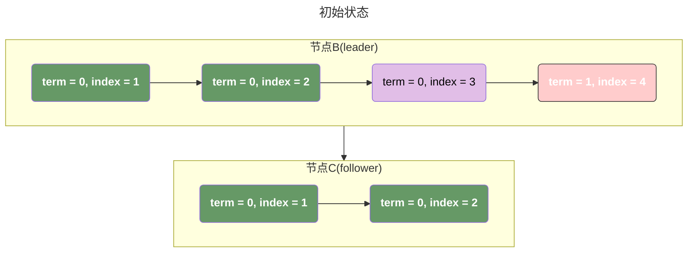


##### 节点A恢复

此时节点A重新以follower的身份加入到集群，在加入之前会做一致性检查，我们会发现存在：`term = 0, index = 4` 和 `term = 0, index = 5` 这两个节点，它是两个需要被回滚的节点，所以他需要从leader（现在是B）同步最新的数据，并回滚这两个节点。

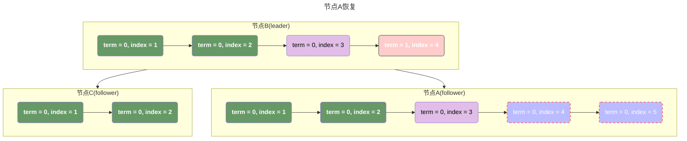

##### 达成一致

经过了节点故障，leader选举，节点恢复，最后我们又重新达成共识：

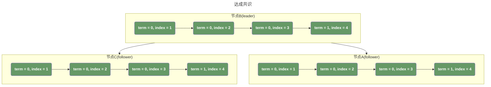

## leaderCommit和followerCommit的极端异常

### 异常的产生

假设 3 节点集群（A = 旧 leader，B、C=Follower），多数派阈值 = 2：

| 步骤 |           关键操作            | 各节点状态（commitIndex / 日志 /term）                       |
| :--: | :---------------------------: | :----------------------------------------------------------- |
|  1   |           初始状态            | A: commitIndex=4, log=[0-4], term=0<br/>B: commitIndex=4, log=[0-4], term=0<br/>C: commitIndex=4, log=[0-4], term=0 |
|  2   |       A 接收客户端请求        | 生成 log (5, term=0)，向 B/C 发送 `AppendEntries(leaderCommit=4, entries=[(0,5)])` |
|  3   |         B/C 同步成功          | B: log=[0-5], commitIndex=4（未更新，因为 leaderCommit=4）<br/>C: log=[0-5], commitIndex=4<br/><br/>→ B/C 回复 true 给 A |
|  4   |      A 更新 commitIndex       | A 收到 B/C 回复 → matchIndex=[5,5,5] → 计算 commitIndex=5<br/><br/>→ A: commitIndex=5, log=[0-5], term=0<br/>→ **此时 B/C 的 commitIndex 仍为 4，仅日志同步到 5** |
|  5   | A 异常宕机，B 选举为新 leader | 1. B/C 因收不到 A 的心跳，触发选举<br/>2. B 向 C 拉票，两者 term=0 → 协商升级 term=1<br/>3. B 获得 C 的投票（多数派），当选新 leader（term=1）<br/>→ B: commitIndex=4, log=[0-5], term=1<br/>→ C: commitIndex=4, log=[0-5], term=1 |
|  6   |       A 恢复，加入集群        | A 启动后，发现集群 term=1 > 自身 term=0 → 转为 Follower<br/>→ A: commitIndex=5, log=[0-5], term=0 → **立即更新 term=1** |
|  7   |  B 向 A 发送 `AppendEntries`  | B 作为新 leader，向 A 发送心跳 / 日志同步请求→ 请求参数：`term=1, leaderCommit=4, prevLogIndex=5, prevLogTerm=0` |

### 自愈流程

A 处理 B 发送的 `AppendEntries` 请求的流程（对应于[AppendEntries RPC](#appendentries) 中的步骤）：

1.   **任期校验**：请求 term=1 == A 的 term=1 → 通过；
2.   **日志匹配校验**：`prevLogIndex=5, prevLogTerm=0` → A 的 log5 的 term=0 → 匹配通过；
3.   **更新 commitIndex**：请求的 `leaderCommit=4 < A 的 commitIndex=5` → **不做任何修改**（规则：仅当 leaderCommit > follower.commitIndex 时才更新）；
4.   **A 回复 true 给 B**：B 收到回复后，更新 `matchIndex[A]=5`；
5.   **B 重新计算 commitIndex**：此时 B 的 `matchIndex=[5(A),5(B),5(C)]` → 排序后 `[5,5,5]` → 多数派阈值 = 2 → 计算出新的 `commitIndex=5`；
6.   **B 同步新的 leaderCommit=5 给所有节点**：B 在下一次 `AppendEntries` 请求中，携带 `leaderCommit=5`；
7.   **所有节点 commitIndex 收敛到 5**：
     -   A 收到 `leaderCommit=5 == 自身 commitIndex=5` → 不修改；
     -   B/C 收到 leaderCommit=5 > 自身 commitIndex=4 → 更新为 min(5, 5)=5；

## 选举时leader不一定包含最新数据


这是raft论文中的 Figure-8，这里很清楚的可以看到在 `(a)` 到 `(b)` 的场景下，选举出来的节点不一定是最新的，集群包含了 S1 ~ S5 五个节点：

1.   S1 和 S2 的数据是 `[term = 1, term = 2]`，S3，S4，S5 的数据是 `[term = 1]`，其中 S1 是 leader；
2.   S1 发生异常；
3.   此时开始选举，S5 可能在 S2 之前触发选举超时，此时虽然他不能获得 S2 的投票（因为S2因为数据比S5更新而拒绝投票）；但是他的数据和 S3，S4 一样多，所以他可以获得三票（S3，S4，S5自己）从而成为 leader。

## 新leader提交日志时对term的限制

在更新 commitIndex 时存在两个条件：如果存在一个 index N：

-   满足 N > commitIndex，并且 matchIndex[i] 中超过半数 >= N
-   log[N].term == currentTerm

那么，我们可以认为 N 和 N 之前的日志已经提交完成，设置 commitIndex = N。这里就是我们提到的**日志已经达成共识**。

其中第一个条件很好理解，就是超过半数的 server 已经复制了该日志，但是第二个条件比较难以理解，我们这里对这个条件进行分析：

### 条件的核心目的

仅允许 leader 提交自己当前任期（currentTerm） 生成的日志，旧任期日志必须 “搭便车” 通过当前任期日志的提交来间接提交 —— 这是 Raft 防止已提交日志被回滚的核心保障。

### Raft 日志的 “任期属性” 与 leader 合法性

Raft 日志的每个条目都带有 `term`（生成该日志的 leader 任期），比如：

| log index |  1   |  2   |  3   |  4   |  5   |  6   |
| :-------: | :--: | :--: | :--: | :--: | :--: | :--: |
|   term    |  1   |  1   |  2   |  2   |  3   |  3   |

leader 的 “合法性” 核心：**新 leader 必须拥有集群中 “最新” 的日志（lastLogTerm 最大，或 term 相同则 lastLogIndex 最大）**，但旧任期日志可能存在 “被多个 leader 覆盖” 的风险。

### 为什么限制 “只允许提交当前任期的日志”

这里我们可以参考paper中给出的例子：


>A time sequence showing why a leader cannot determine commitment using log entries from older terms.  
>
>-   In (a) S1 is leader and partially replicates the log entry at index
>-   In (b) S1 crashes; S5 is elected leader for term 3 with votes from S3, S4, and itself, and accepts a different entry at log index 2. 
>-   In (c) S5 crashes; S1 restarts, is elected leader, and continues replication. At this point, the log entry from term 2 has been replicated on a majority of the servers, but it is not committed. 
>-   If S1 crashes as in (d), S5 could be elected leader (with votes from S2, S3, and S4) and overwrite the entry with its own entry from term 3.
>-   However, if S1 replicates an entry from its current term on a majority of the servers before crashing, as in (e), then this entry is committed (S5 cannot win an election). At this point all preceding entries in the log are committed as well.

这个位置非常的难理解，**因为论文中并没有将违反raft协议的场景画出来**，实际上这里 `d`  和 `e` 都是合理的：

-   `d` 在（c) 中，S1，S2，S3 中的 `(term2, index2)`并没有被提交 -- 因为我们**不允许currentTerm=4的 leader 通过计算副本数量来提交一个 entry(term2, index2)**，所以在 (d) 中 S5（leader）回滚未提交的临时日志（`(term2, index2) and (term4, index3)`）是合理的；
-   `e` 在 （e)中，S5 中的 `(term3, index2)` 也并没有被提交，所以在(e) 中的 S1（leader）回滚临时日志（`(term3, index2)`）也是合理的；

真正违反raft协议的场景是，如果我们在更新提交时**允许currentTerm=4 的leader通过计算副本数量提交entry(term2, index)**：

1.   在（c）这里，S1（leader)将会提交 `entry(term2, index2)`。
2.   S1 崩溃，S5可能重新当选 leader（S2，S3，S4 以及 S5自身）；
3.   此时，raft协议已经崩溃，`entry(term2, index2)` 已经被提交，raft不允许回gun已经被提交的日志；S5也不能删除自身的 `entry(term3, index2)`；我们进入了 “死锁"。

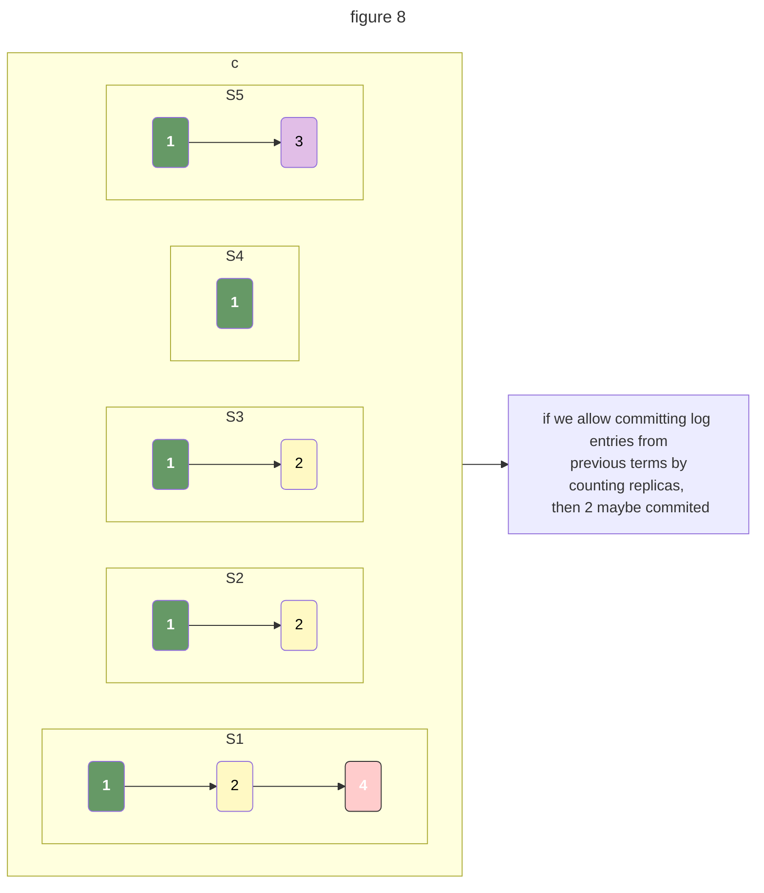

如果在 `2` 被提交之后，S1 崩溃并且S5重新通过选举成为leader，此时陷入 ”死锁“：

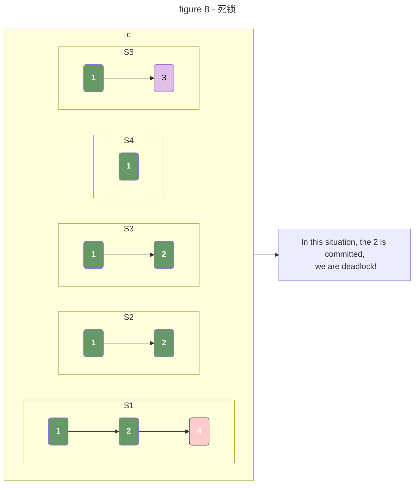

## 选举时可能未及时更新term的一个场景

假设，我们存在一个五个节点的raft集群：

-   五个节点分别是 `S1` ~ `S5`，其中 S1 是 leader；
-   第二列展示了节点的当前 term，目前均未 2；
-   目前五个节点中 `index = a` 的 entry 的 `term = 2`；
-   S1 节点中包含了 `(2, b)` 和 `(2, c)` 的数据，但是未同步到任何其他的节点；

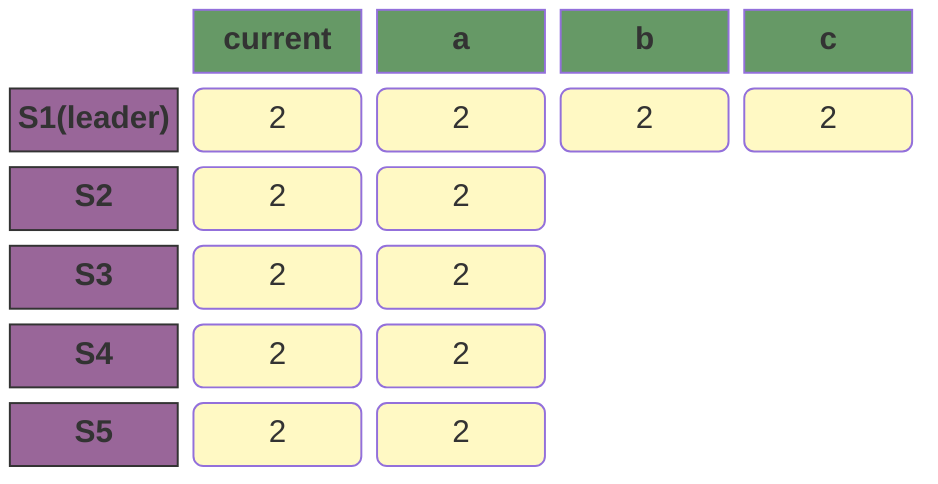

随后：

-   S1 宕机；
-   S5 成为 candidate，递增 term 到 3；并通过 S3, S4, S5 的选票成为 leader。
-   此时，集群存在一个问题：S3，S4，S5 已经知道了有新的 leader，而S1和S2还不知道；

```mermaid
block-beta

columns 5

space current["current"] index1["a"] index2["b"] index3["c"]
S1["S1"] s1c("2") d1("2") d2("2") d10("2")
S2 s2c("2") d3("2") space:2
S3 s3c("3") d5("2") space:2
S4 s4c("3") d7("2") space:2
S5["S5(leader)"] s5c("3") d9("2") space:2

class current,index1,index2,index3 green
class S1,S2,S3,S4,S5 purple
class d1,d2,d3,d5,d7,d9,d10 yellow

class s1c,s2c yellow
class s3c,s4c,s5c pink

classDef green fill: #696,color: #fff,font-weight: bold;
classDef error fill:#bbf,stroke:#f66,stroke-width:2px,color:#fff,stroke-dasharray: 5 5
classDef pink 1,fill:#FFCCCC,stroke:#333, color: #fff, font-weight:bold;
classDef pale_pink fill:#E1BEE7,color:#000000;
classDef purple fill:#969,stroke:#333, font-weight: bold;
classDef coral fill:#f9f,stroke:#333,stroke-width:4px;
classDef animate stroke-dasharray: 9,5,stroke-dashoffset: 900,animation: dash 25s linear infinite;
classDef yellow fill:#FFF9C4,color:#000000;
```

此时可能出现的一个情况是：

-   S1在S5向其同步 term 之前，开始向 S2 同步数据

```mermaid
block-beta

columns 5

space current["current"] index1["a"] index2["b"] index3["c"]
S1["S1"] s1c("2") d1("2") d2("2") d10("2")
S2 s2c("2") d3("2") d11("2") d12("2")
S3 s3c("3") d5("2") space:2
S4 s4c("3") d7("2") space:2
S5["S5(leader)"] s5c("3") d9("2") space:2

class current,index1,index2,index3 green
class S1,S2,S3,S4,S5 purple
class d1,d2,d3,d5,d7,d9,d10,d11,d12 yellow

class s1c,s2c yellow
class s3c,s4c,s5c pink

classDef green fill: #696,color: #fff,font-weight: bold;
classDef error fill:#bbf,stroke:#f66,stroke-width:2px,color:#fff,stroke-dasharray: 5 5
classDef pink 1,fill:#FFCCCC,stroke:#333, color: #fff, font-weight:bold;
classDef pale_pink fill:#E1BEE7,color:#000000;
classDef purple fill:#969,stroke:#333, font-weight: bold;
classDef coral fill:#f9f,stroke:#333,stroke-width:4px;
classDef animate stroke-dasharray: 9,5,stroke-dashoffset: 900,animation: dash 25s linear infinite;
classDef yellow fill:#FFF9C4,color:#000000;
```

随后，S5通过RPC请求通知了S1和S2最新的 term。此时S5会发起一致性检查，会对未提交的日志进行回滚：

-   S5 的日志最新 index 是 `a`（term=2），而 S1/S2 的日志到 `c`（term=2）；
-   Raft 规则：Follower 日志若比 leader 长且超出部分是未提交日志，需**回滚到 leader 的日志长度**—— 因此 S1/S2 删除 `(2,b)`/`(2,c)`，与 S5 日志对齐；

这一步是 Raft 协议的核心自愈逻辑：**更高 term 的 leader 强制同步日志，未提交的临时日志被回滚**，完全合规。

```mermaid
block-beta

columns 5

space current["current"] index1["a"] index2["b"] index3["c"]
S1["S1"] s1c("3") d1("2") space:2
S2 s2c("3") d3("2") space:2
S3 s3c("3") d5("2") space:2
S4 s4c("3") d7("2") space:2
S5["S5(leader)"] s5c("3") d9("2") space:2

class current,index1,index2,index3 green
class S1,S2,S3,S4,S5 purple
class d1,d2,d3,d5,d7,d9,d10,d11,d12 yellow

class s1c,s2c,s3c,s4c,s5c pink

classDef green fill: #696,color: #fff,font-weight: bold;
classDef error fill:#bbf,stroke:#f66,stroke-width:2px,color:#fff,stroke-dasharray: 5 5
classDef pink 1,fill:#FFCCCC,stroke:#333, color: #fff, font-weight:bold;
classDef pale_pink fill:#E1BEE7,color:#000000;
classDef purple fill:#969,stroke:#333, font-weight: bold;
classDef coral fill:#f9f,stroke:#333,stroke-width:4px;
classDef animate stroke-dasharray: 9,5,stroke-dashoffset: 900,animation: dash 25s linear infinite;
classDef yellow fill:#FFF9C4,color:#000000;
```

随后，S5以 leader 的身份开始对外服务，我们集群重新达成一致：

```mermaid
block-beta

columns 5

space current["current"] index1["a"] index2["b"] index3["c"]
S1["S1"] s1c("3") d1("2") d31("3") d32("3")
S2 s2c("3") d3("2") d33("3") d34("3")
S3 s3c("3") d5("2") d35("3") d36("3")
S4 s4c("3") d7("2") d37("3") d38("3")
S5["S5(leader)"] s5c("3") d9("2") d39("3") d310("3")

class current,index1,index2,index3 green
class S1,S2,S3,S4,S5 purple
class d1,d2,d3,d5,d7,d9,d10,d11,d12 yellow

class s1c,s2c,s3c,s4c,s5c pink

class d31,d32,d33,d34,d35,d36,d37,d38,d39,d310 pink

classDef green fill: #696,color: #fff,font-weight: bold;
classDef error fill:#bbf,stroke:#f66,stroke-width:2px,color:#fff,stroke-dasharray: 5 5
classDef pink 1,fill:#FFCCCC,stroke:#333, color: #fff, font-weight:bold;
classDef pale_pink fill:#E1BEE7,color:#000000;
classDef purple fill:#969,stroke:#333, font-weight: bold;
classDef coral fill:#f9f,stroke:#333,stroke-width:4px;
classDef animate stroke-dasharray: 9,5,stroke-dashoffset: 900,animation: dash 25s linear infinite;
classDef yellow fill:#FFF9C4,color:#000000;
```


## 为什么RequestVote要超时时间重置超时时间

>   前面提到，节点在收到任意的合法请求时，都会重置选举超时时间，那考虑下面这个异常场景：

假设现在集群还剩A，B两个节点：A 节点的超时时间是100ms，B 节点的超时时间是 200ms；并且 B 的日志比 A 更新；

1. A 会先触发超时选举，给 B 发送 RequestVote，但是由于 B 的日志更新，所以 B 拒绝给 A投票；
2. B 重置超时选举时间；
3. A 的超时时间更短，他会再次比 A 先触发超时选举；
4. 程序进入无限循环；

我们存在的方案是：

1.   可以为超时选举增加一个退避时间，如果未能当选 leader，就增加自己的选举超时时间；
2.   我们也可以直接让 B 在收到 RequestVote 请求时不重置超时时间，只在收到来自 leader 的 AppendEntries 时重置超时时间；

实际上，常用的raft实现都是基于退避时间实现，因为我们这里的方案2会引入更多新的问题。

### 避免投票分裂

raft 中 “投票分裂” 指的是：**多个 candidate 同时发起选举，每个 candidate 都只拿到部分选票，没有任何一个能达到多数派阈值，最终选举失败，term 递增后重新选举**。

如果我们在收到 candidate 的投票时不重置超时时间，我们会面临的最重要的一个问题是，**我们把一个最好串行的行为变为了一个接近于并行的行为**，参考下面这个例子：假设我们存在 s1，s2，s3，s4，s5 五个节点的 raft 集群：

-   初始 S1 为集群 leader；
-   整个集群的当前 term 为 1；
-   S1~S5 的选举超时时间为 150ms ~ 190ms；

```mermaid
block-beta

columns 6

server current["term"] timeout index1["a"] index2["b"] index3["c"]
s1["s1"] s1c("1") t1("150ms") d1_1("1") space:2
s2["s2"] s2c("1") t2("160ms") d3("1") space:2
s3["s3"] s3c("1") t3("170ms") d5("1") space:2
s4["s4"] s4c("1") t4("180ms") d7("1") space:2
s5["s5"] s5c("1") t5("190ms") d9("1") space:2

class timeout,server,current,index1,index2,index3 green
class s1,s2,s3,s4,s5 purple

class t1,t2,t3,t4,t5 pale_pink


classDef green fill: #696,color: #fff,font-weight: bold;
classDef error fill:#bbf,stroke:#f66,stroke-width:2px,color:#fff,stroke-dasharray: 5 5
classDef pink 1,fill:#FFCCCC,stroke:#333, color: #fff, font-weight:bold;
classDef pale_pink fill:#E1BEE7,color:#000000;
classDef purple fill:#969,stroke:#333, font-weight: bold;
classDef coral fill:#f9f,stroke:#333,stroke-width:4px;
classDef animate stroke-dasharray: 9,5,stroke-dashoffset: 900,animation: dash 25s linear infinite;
classDef yellow fill:#FFF9C4,color:#000000;
```

-   现在S1宕机，S2发起选举，他的请求到达了S3，那么此时S2得到了两票（S3和S2自己）；
-   在S2的请求到达S4和S5之前，S4发起了选举，他的请求被被S2拒绝（因为S2已经投票给自己），被S3拒绝（因为S3投票给了S2），但是得到了S5的投票，此时S4也是两票（S4自己和S5）；
-   S2和S4都得到两票，选举失败；
-   而这个情况可能在无限循环，导致有选举永远是一人两票的状态；

如果我们使用退避时间的方案，每次收到 candidate 时重置超时时间，并在选举超时时退避500ms，那么整个选举逻辑就变为如下：

-   S2 发起选举，如果选举成功则直接当选leader；如果选举失败，那么直接进入休眠；
-   在S2休眠期间，其他的节点发起选举，我们假设发起的节点是S3，如果选举成功则当选leader；如果选举失败则S3也进入休眠；
-   如此循环，我们最差的情况就是：我们只剩一个节点没有发起选举，此时其他的所有节点都处于休眠状态，再也不会有因为竞争而产生的平票风险；

以我们前面一样的场景为例：

-   S1宕机，S2发起选举，他的请求到达了S3，那么此时S2得到了两票（S3和S2自己）；
-   在S2的请求到达S4和S5之前，S4发起了选举，他的请求被被S2拒绝（因为S2已经投票给自己），被S3拒绝（因为S3投票给了S2），但是得到了S5的投票，此时S4也是两票（S4自己和S5）；
-   随后 S2 和 S4 都进入休眠状态；
-   随后 S3 和 S5 重复以上动作并也发生了平票，S3 和 S5 进入休眠；
-   但是，只要我们合理的设计这个休眠时间，在最坏的场景下，我们一定会存在某一个时刻只有一个节点发起选举，其他的所有节点都处于休眠状态从而赢得选举。

这里总体逻辑的分析其实更复杂，因为我们的需要合理的设置我们的退避时间，否则会导致在投票的过程中有其他的竞选失败的节点苏醒并发起选举，进而导致出现 “投票分裂” 的异常。

#### 在选举时term发生冲突怎么办

此外，这里还有一个需要考虑的场景是 在选举时term发生冲突怎么办：假设存在以下场景，我们有A，B，C三台机器，当 A 发生故障时，假设此时 term = 1：

1.   B 触发超时选举，变为 candidate 向 C 发起 RequestVote，此时 B 的 term = 2；
2.   由于网络延迟，在收到 B 的请求前，C 也触发超时选举，变为 candidate 向 B 发起 RequestVote，此时 C 的 term = 2；

此时 B 和 C 的 term 都为 2，如何判断哪个是更新的 term 呢？其实这里我们不用判断，因为这就是一个简单的选举失败场景：

-   B 发起选举，选举失败进入休眠；
-   C 发起选举，选举失败进入休眠；
-   先苏醒的线程会重新发起选举；

### 在多节点（n>=5）时可能的风险

在 5 节点集群中：

-   S1 发起选举（`RequestVote`），S2/S3 因规则不重置计时器；
-   S2 很快触发超时，发起 term=N+1 的选举；
-   S3 接着触发超时，发起 term=N+2 的选举；
-   结果：短时间内多轮选举叠加，term 暴涨，选举效率降低。

根据 RulesForServers 的描述，我们有一个特性：任意服务器在收到 RPC 请求时：**if RPC request or response contains term T > currentTerm: set currentTerm = T, convert to follower.** 于是，这为我们的选举引入一个严重的风险：

-   **当一个 follower 通过选举当选 leader 后，在他发送 AppendEntries 重置超时时间前，可能会有其他 follower 的超时时间触发导致重新触发选举。此时，该 follower 会拥有更大的 term，于是 leader 转换为 follower，这个过程可能无限循环。解决方法就是每次收到 candidate 的 RequestVote 时重置超时时间，以便于当选的 leader 有足够的时间向他们发送心跳。**

考虑如下raft集群，集群目前无leader并触发了 leader 选举：

```mermaid
block-beta

columns 6

server current["term"] timeout index1["a"] index2["b"] index3["c"]
s1["s1"] s1c("1") t1("150ms") d1("1") space:2
s2["s2"] s2c("1") t2("160ms") d3("1") space:2
s3["s3"] s3c("1") t3("170ms") d5("1") space:2
s4["s4"] s4c("1") t4("180ms") d7("1") space:2
s5["s5"] s5c("1") t5("190ms") d9("1") space:2

class timeout,server,current,index1,index2,index3 green
class s1,s2,s3,s4,s5 purple

class t1,t2,t3,t4,t5 pale_pink


classDef green fill: #696,color: #fff,font-weight: bold;
classDef error fill:#bbf,stroke:#f66,stroke-width:2px,color:#fff,stroke-dasharray: 5 5
classDef pink 1,fill:#FFCCCC,stroke:#333, color: #fff, font-weight:bold;
classDef pale_pink fill:#E1BEE7,color:#000000;
classDef purple fill:#969,stroke:#333, font-weight: bold;
classDef coral fill:#f9f,stroke:#333,stroke-width:4px;
classDef animate stroke-dasharray: 9,5,stroke-dashoffset: 900,animation: dash 25s linear infinite;
classDef yellow fill:#FFF9C4,color:#000000;
```

S1首先触发超时选举，由于集群内所有的节点日志长度一样，所以它可以得到所有选票并当选为 leader，term 全部变为2。

```mermaid
block-beta

columns 6

server current["term"] timeout index1["a"] index2["b"] index3["c"]
s1["s1(leader)"] s1c("2") space d1("1") space:2
s2["s2"] s2c("2") t2("10ms") d3("1") space:2
s3["s3"] s3c("2") t3("20ms") d5("1") space:2
s4["s4"] s4c("2") t4("30ms") d7("1") space:2
s5["s5"] s5c("2") t5("40ms") d9("1") space:2

class timeout,server,current,index1,index2,index3 green
class s1,s2,s3,s4,s5 purple

class t1,t2,t3,t4,t5 pale_pink


classDef green fill: #696,color: #fff,font-weight: bold;
classDef error fill:#bbf,stroke:#f66,stroke-width:2px,color:#fff,stroke-dasharray: 5 5
classDef pink 1,fill:#FFCCCC,stroke:#333, color: #fff, font-weight:bold;
classDef pale_pink fill:#E1BEE7,color:#000000;
classDef purple fill:#969,stroke:#333, font-weight: bold;
classDef coral fill:#f9f,stroke:#333,stroke-width:4px;
classDef animate stroke-dasharray: 9,5,stroke-dashoffset: 900,animation: dash 25s linear infinite;
classDef yellow fill:#FFF9C4,color:#000000;
```

此时S1当选 leader，但是由于我们没有重置超时时间，此时S2的timeout只有10ms，所以在 leader 发出心跳包重置超时时间之前，S2又触发超时选举。此时S2因为具有更大的 term，S1将会转换为 follower -- 尽管 S1 现在已经是合法的 leader 了。

```mermaid
block-beta

columns 6

server current["term"] timeout index1["a"] index2["b"] index3["c"]
s1["s1"] s1c("3") t1("140ms") d1("1") space:2
s2["s2(leader)"] s2c("3") space d3("1") space:2
s3["s3"] s3c("3") t3("10ms") d5("1") space:2
s4["s4"] s4c("3") t4("20ms") d7("1") space:2
s5["s5"] s5c("3") t5("30ms") d9("1") space:2

class timeout,server,current,index1,index2,index3 green
class s1,s2,s3,s4,s5 purple

class t1,t2,t3,t4,t5 pale_pink


classDef green fill: #696,color: #fff,font-weight: bold;
classDef error fill:#bbf,stroke:#f66,stroke-width:2px,color:#fff,stroke-dasharray: 5 5
classDef pink 1,fill:#FFCCCC,stroke:#333, color: #fff, font-weight:bold;
classDef pale_pink fill:#E1BEE7,color:#000000;
classDef purple fill:#969,stroke:#333, font-weight: bold;
classDef coral fill:#f9f,stroke:#333,stroke-width:4px;
classDef animate stroke-dasharray: 9,5,stroke-dashoffset: 900,animation: dash 25s linear infinite;
classDef yellow fill:#FFF9C4,color:#000000;
```

同样的情况，在S3上也会继续发生：

```mermaid
block-beta

columns 6

server current["term"] timeout index1["a"] index2["b"] index3["c"]
s1["s1"] s1c("4") t1("130ms") d1("1") space:2
s2["s2"] s2c("4") t2("160ms") d3("1") space:2
s3["s3(leader)"] s3c("4") space d5("1") space:2
s4["s4"] s4c("4") t4("10ms") d7("1") space:2
s5["s5"] s5c("4") t5("20ms") d9("1") space:2

class timeout,server,current,index1,index2,index3 green
class s1,s2,s3,s4,s5 purple

class t1,t2,t3,t4,t5 pale_pink


classDef green fill: #696,color: #fff,font-weight: bold;
classDef error fill:#bbf,stroke:#f66,stroke-width:2px,color:#fff,stroke-dasharray: 5 5
classDef pink 1,fill:#FFCCCC,stroke:#333, color: #fff, font-weight:bold;
classDef pale_pink fill:#E1BEE7,color:#000000;
classDef purple fill:#969,stroke:#333, font-weight: bold;
classDef coral fill:#f9f,stroke:#333,stroke-width:4px;
classDef animate stroke-dasharray: 9,5,stroke-dashoffset: 900,animation: dash 25s linear infinite;
classDef yellow fill:#FFF9C4,color:#000000;
```

这个结果可以无限循环，为了彻底杜绝这种循环，工业级 Raft 实现（如 etcd）会在「重置超时」的基础上，再叠加「选举失败退避」，形成双重保障：

1.   **第一层：RequestVote 重置超时** → 给新 leader 创造心跳窗口期；
2.   **第二层：选举失败退避** → 哪怕窗口期内仍有节点触发选举，失败后会长时间休眠，不会反复打断 leader。

### etcd的raft实现

很多工业级 Raft 实现（如 etcd 的 Raft 库）融合了我们之前的思路和退避方案：

-   对 `RequestVote` 请求：**仍重置超时，但会缩短重置的时间长度**（比如只重置到剩余超时的 50%）；
-   同时保留 “选举失败后指数退避”；
-   既避免了循环，又保证了选举的有序性。

# 引用

-   [In Search of an Understandable Consensus Algorithm](https://raft.github.io/raft.pdf)
-   [etcd raft](https://github.com/etcd-io/raft)
-   [etcd-3.1.10-codedump](https://github.com/lichuang/etcd-3.1.10-codedump)
-   [raft算法原理](https://www.codedump.info/post/20180921-raft/)
-   [Raft一致性算法论文的中文翻译](https://github.com/0x822a5b87/raft-zh_cn)
-   [Raft implementation in Go](https://github.com/eliben/raft/tree/main)
