# calcite入门--RBO模型和CBO模型

由于最近接手了公司的一些血缘解析，SQL优化相关的任务，同时也涉及到了一些DSL的开发，在开发的过程中涉及到大量的calcite规则（Rule）定制，用此文章记录一下calcite的学习心得。

## 引用

[https://github.com/0x822a5b87/test-calcite](https://github.com/0x822a5b87/test-calcite)

[calcite-demo ： calcite adapter and calcite optimizer and so on](https://github.com/zzzzming95/calcite-demo)

[Apache Calcite 处理流程详解（一）](http://matt33.com/2019/03/07/apache-calcite-process-flow/)

[Apache Calcite 优化器详解（二）](https://matt33.com/2019/03/17/apache-calcite-planner/)

[SQL 查询优化原理与 Volcano Optimizer 介绍](https://io-meter.com/2018/11/01/sql-query-optimization-volcano/)

[Apche Calcite查询优化概述](https://liebing.org.cn/apache-calcite-query-optimization-overview.html)

[Apache Calcite关系代数](https://liebing.org.cn/apache-calcite-relational-algebra.html)

[Apache Calcite查询优化器之HepPlanner](https://liebing.org.cn/apache-calcite-hepplanner.html)

[Apache Calcite查询优化器之VolcanoPlanner](https://liebing.org.cn/apache-calcite-volcanoplanner.html)

## 解析

### sql parse 的过程

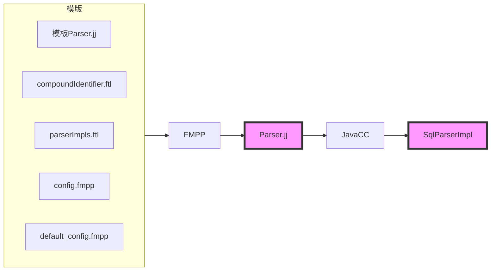
```mermaid
flowchart LR

subgraph 模版
	direction LR
	模板Parser.jj
	compoundIdentifier.ftl
	parserImpls.ftl
	config.fmpp
	default_config.fmpp
end

模版 --> FMPP --> Parser.jj:::underline --> JavaCC --> SqlParserImpl:::underline

classDef underline fill:#f9f,stroke:#333,stroke-width:4px;
```


我们通过 `freemarker` 以及 `javacc` 生成了一个 `SalParserImpl` 类，该类就是我们实际用于解析sql的类，内部包含了一个 `SqlParserImplFactory` :

```java
    /**
     * {@link SqlParserImplFactory} implementation for creating parser.
     */
    public static final SqlParserImplFactory FACTORY = new SqlParserImplFactory() {
        public SqlAbstractParserImpl getParser(Reader reader) {
            final SqlParserImpl parser = new SqlParserImpl(reader);
            if (reader instanceof SourceStringReader) {
                final String sql =
                    ((SourceStringReader) reader).getSourceString();
                parser.setOriginalSql(sql);
            }
          return parser;
        }
    };
```

> 我们可以如下使用该类

```java
        SqlParser.Config c = SqlParser.config()
                                      .withParserFactory(SqlParserImpl.FACTORY)
                                      .withCaseSensitive(false);
        SqlParser sqlParser    = SqlParser.create(sql, c);
        SqlNode   sqlNode      = sqlParser.parseStmt();
```

### Parser.jj

`Parser.jj` 是 calcite 的 parser 的核心定义类，会和一些 freemarker 的模板共同作为输入生成一个可以作为 `JavaCC` 输入的 `Parser.jj` 文件。

```java 
options {
    STATIC = false;
    IGNORE_CASE = true;
    UNICODE_INPUT = true;
}


PARSER_BEGIN(SqlParserImpl)
	// ...
PARSER_END(SqlParserImpl)
```

> 可以看到，在 `sqlParser.parseStmt()` 中，最终是调用了 `parser.parseSqlStmtEof()`，也就是对应了 `Parser.jj` 中的 `parseSqlStmtEof()`方法。

```java 
    public SqlNode parseSqlStmtEof() throws Exception {
        return SqlStmtEof();
    }
```

整体的调用链路如下所示：

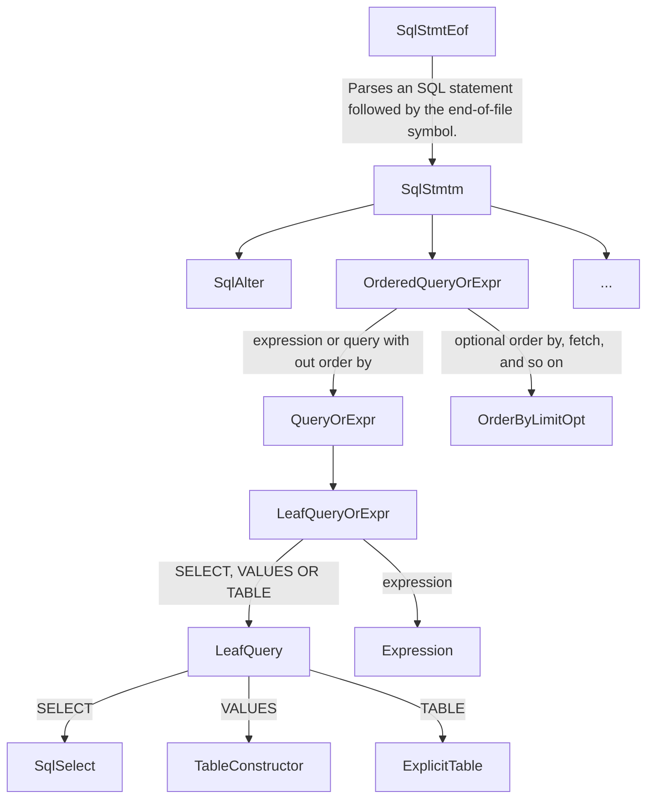
```mermaid
flowchart TD
    SqlStmtEof -->|Parses an SQL statement followed by the end-of-file symbol.| SqlStmtm
    SqlStmtm --> SqlAlter
    SqlStmtm --> OrderedQueryOrExpr
    SqlStmtm --> Other[...]
    OrderedQueryOrExpr -->|expression or query with out order by| QueryOrExpr
    OrderedQueryOrExpr -->|optional order by, fetch, and so on| OrderByLimitOpt
    QueryOrExpr --> LeafQueryOrExpr
    LeafQueryOrExpr -->|SELECT, VALUES OR TABLE| LeafQuery
    LeafQueryOrExpr -->|expression| Expression
    LeafQuery -->|SELECT| SqlSelect
    LeafQuery -->|VALUES| TableConstructor
    LeafQuery -->|TABLE| ExplicitTable

```


> 最终到达我们的 SELECT 解析方法。

```java
/**
 * Parses a leaf SELECT expression without ORDER BY.
 */
SqlSelect SqlSelect() :
{
    final List<SqlLiteral> keywords = new ArrayList<SqlLiteral>();
    final SqlLiteral keyword;
    final SqlNodeList keywordList;
    final List<SqlNode> selectList = new ArrayList<SqlNode>();
    final SqlNode fromClause;
    final SqlNode where;
    final SqlNodeList groupBy;
    final SqlNode having;
    final SqlNodeList windowDecls;
    final SqlNode qualify;
    final List<SqlNode> hints = new ArrayList<SqlNode>();
    final Span s;
}
{
    <SELECT> { s = span(); }
    [ <HINT_BEG> AddHint(hints) ( <COMMA> AddHint(hints) )* <COMMENT_END> ]
    // Parses **dialect-specific** keywords immediately following the SELECT keyword.
    // 这里其实是一个接口，不同的dialect-specific有不同的实现
    SqlSelectKeywords(keywords)
    // 是否为stream
    (
        <STREAM> {
            keywords.add(SqlSelectKeyword.STREAM.symbol(getPos()));
        }
    )?
    // DISTINCT OR ALL
    (
        keyword = AllOrDistinct() { keywords.add(keyword); }
    )?
    // STREAM keyworkd AND DISTINCT/ALL keyword
    {
        keywordList = new SqlNodeList(keywords, s.addAll(keywords).pos());
    }
    // SELECT 选择的字段
    AddSelectItem(selectList)
    ( <COMMA> AddSelectItem(selectList) )*
    (
        <FROM> fromClause = FromClause()
        ( where = Where() | { where = null; } )
        ( groupBy = GroupBy() | { groupBy = null; } )
        ( having = Having() | { having = null; } )
        ( windowDecls = Window() | { windowDecls = null; } )
        ( qualify = Qualify() | { qualify = null; } )
    |
        E() {
            fromClause = null;
            where = null;
            groupBy = null;
            having = null;
            windowDecls = null;
            qualify = null;
        }
    )
    {
        return new SqlSelect(s.end(this), keywordList,
            new SqlNodeList(selectList, Span.of(selectList).pos()),
            fromClause, where, groupBy, having, windowDecls, qualify,
            null, null, null, new SqlNodeList(hints, getPos()));
    }
}
```

### validator相关

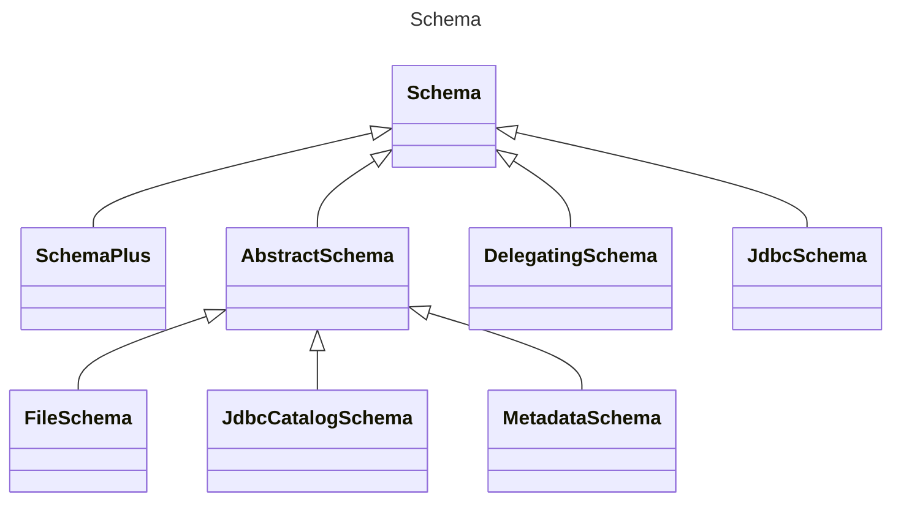
```mermaid
---
title: Schema
---
classDiagram
	     Schema <|-- SchemaPlus
	     Schema <|-- AbstractSchema
	     Schema <|-- DelegatingSchema
	     Schema <|--JdbcSchema
	     
	     AbstractSchema <|-- FileSchema
	     AbstractSchema <|-- JdbcCatalogSchema
	     AbstractSchema <|-- MetadataSchema
```


#### Schema

> A namespace for tables and functions.
>
> A schema can also contain sub-schemas, to any level of nesting. Most providers have a limited number of levels; for example, most JDBC databases have either one level ("schemas") or two levels ("database" and "catalog").

```java
public interface Schema {
  /**
   * Returns a table with a given name, or null if not found.
   */
  @Nullable Table getTable(String name);

  Set<String> getTableNames();

  /**
   * Returns a type with a given name, or null if not found.
   */
  @Nullable RelProtoDataType getType(String name);

  /**
   * Returns the names of the types in this schema.
   */
  Set<String> getTypeNames();

  /**
   * Returns a list of functions in this schema with the given name, or
   * an empty list if there is no such function.
   */
  Collection<Function> getFunctions(String name);

  /**
   * Returns the names of the functions in this schema.
   */
  Set<String> getFunctionNames();

  /**
   * Returns a sub-schema with a given name, or null.
   */
  @Nullable Schema getSubSchema(String name);

  /**
   * Returns the names of this schema's child schemas.
   */
  Set<String> getSubSchemaNames();

  /**
   * Returns the expression by which this schema can be referenced in generated
   * code.
   *
   * @param parentSchema Parent schema
   * @param name Name of this schema
   * @return Expression by which this schema can be referenced in generated code
   */
  Expression getExpression(@Nullable SchemaPlus parentSchema, String name);

  /** Returns whether the user is allowed to create new tables, functions
   * and sub-schemas in this schema, in addition to those returned automatically
   * by methods such as {@link #getTable(String)}.
   *
   * <p>Even if this method returns true, the maps are not modified. Calcite
   * stores the defined objects in a wrapper object.
   *
   * @return Whether the user is allowed to create new tables, functions
   *   and sub-schemas in this schema
   */
  boolean isMutable();

  /** Returns the snapshot of this schema as of the specified time. The
   * contents of the schema snapshot should not change over time.
   *
   * @param version The current schema version
   *
   * @return the schema snapshot.
   */
  Schema snapshot(SchemaVersion version);
  }
}
```

#### SchemaPlus

>1. `SchemaPlus` 是针对于 `Schema` 的一些扩展；
>
>2. 用户自定义的 Schema 不需要实现 `SchemaPlus` 接口，但是当Schema被传递到user-defined schema或者user-defined table时，会被包装成 `SchemaPlus`；
>3. SchemaPlus is intended to be used by users but not instantiated by them；
>4. 相对于 `Schema` ，SchemaPlus 增加了许多的 `add` 方法用于添加 Schema、Table、Function；

```java
public interface SchemaPlus extends Schema {
  /**
   * Returns the parent schema, or null if this schema has no parent.
   */
  @Nullable SchemaPlus getParentSchema();

  /**
   * Returns the name of this schema.
   *
   * <p>The name must not be null, and must be unique within its parent.
   * The root schema is typically named "".
   */
  String getName();

  // override with stricter return
  @Override @Nullable SchemaPlus getSubSchema(String name);

  /** Adds a schema as a sub-schema of this schema, and returns the wrapped
   * object. */
  SchemaPlus add(String name, Schema schema);

  /** Adds a table to this schema. */
  void add(String name, Table table);

  /** Removes a table from this schema, used e.g. to clean-up temporary tables. */
  default boolean removeTable(String name) {
    // Default implementation provided for backwards compatibility, to be removed before 2.0
    return false;
  }


  /** Adds a function to this schema. */
  void add(String name, Function function);

  /** Adds a type to this schema.  */
  void add(String name, RelProtoDataType type);

  /** Adds a lattice to this schema. */
  void add(String name, Lattice lattice);

  @Override boolean isMutable();

  /** Returns an underlying object. */
  <T extends Object> @Nullable T unwrap(Class<T> clazz);

  void setPath(ImmutableList<ImmutableList<String>> path);

  void setCacheEnabled(boolean cache);

  boolean isCacheEnabled();
}
```

#### CalciteSchema

> `CalciteSchema` : Wrapper around user-defined schema used internally.
>
> ```java
>   /** Defines a table within this schema. */
>   public TableEntry add(String tableName, Table table,
>       ImmutableList<String> sqls) {
>     final TableEntryImpl entry =
>         new TableEntryImpl(this, tableName, table, sqls);
>     tableMap.put(tableName, entry);
>     return entry;
>   }
> ```

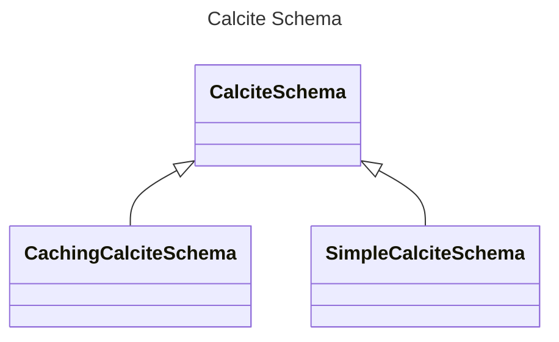
```mermaid
---
title: Calcite Schema
---
classDiagram
	CalciteSchema <|-- CachingCalciteSchema
	CalciteSchema <|-- SimpleCalciteSchema
```


#### Prepare

> `Prepare` Abstract base for classes that implement the process of preparing and executing SQL expressions.

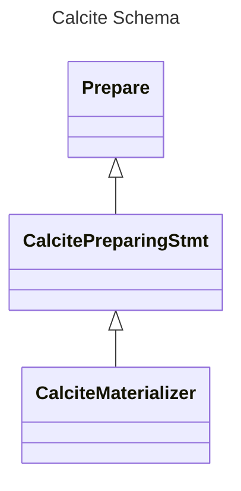
```mermaid
---
title: Calcite Schema
---
classDiagram
	Prepare <|-- CalcitePreparingStmt
	CalcitePreparingStmt <|-- CalciteMaterializer
```


#### CatalogReader

> `CatalogReader` Interface by which validator and planner can read table metadata.

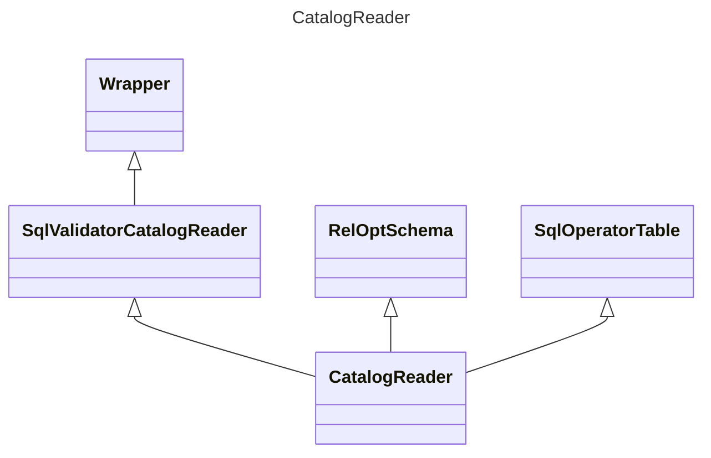
```mermaid
---
title: CatalogReader
---
classDiagram
	Wrapper <|-- SqlValidatorCatalogReader
	SqlValidatorCatalogReader <|-- CatalogReader
	RelOptSchema <|-- CatalogReader
	SqlOperatorTable <|-- CatalogReader
```


### joins

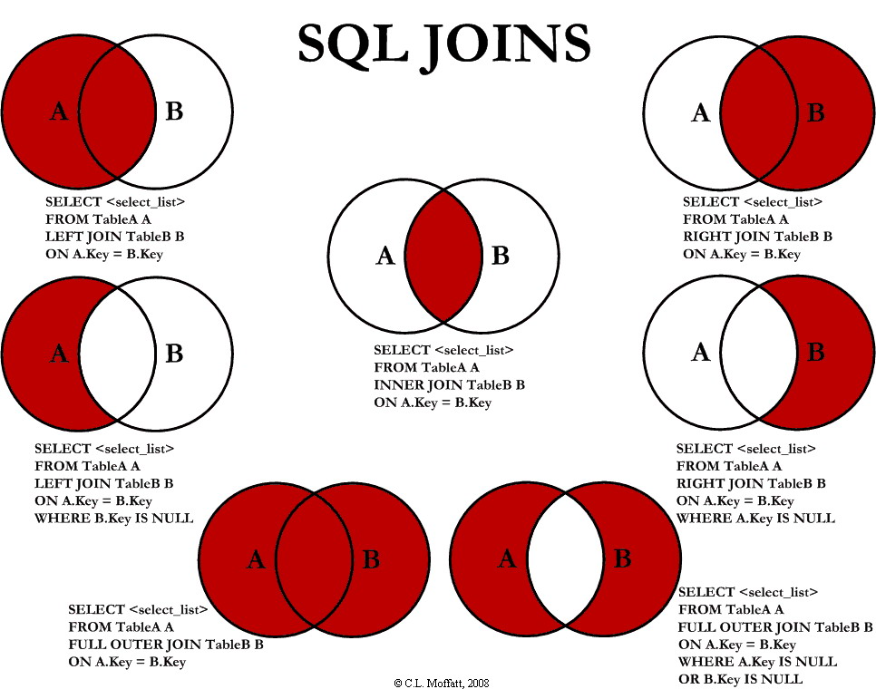

### sql to RelNode

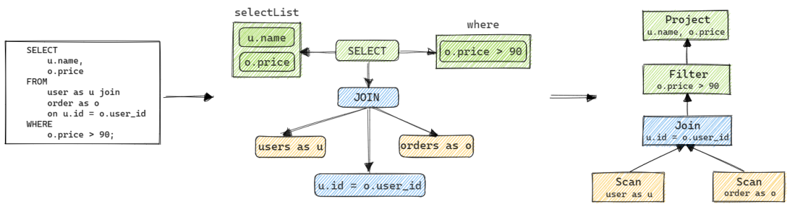

### calcite的数据流转

在整个过程中，我们的数据经历了从 `string` -> `SqlNode` -> `RexNode` -> `RelNode` 的过程，其中 `SqlNode` -> `RexNode` 和 `RexNode` -> `RelNode` 都是在 `SqlToRelConverter` 中发生。

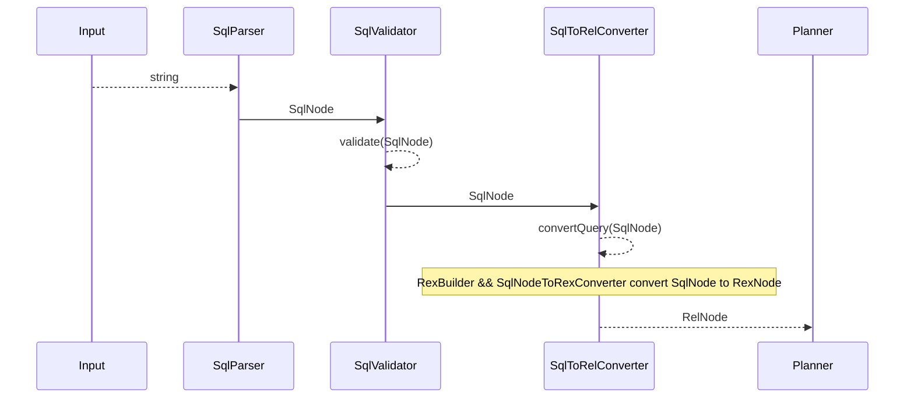
```mermaid
sequenceDiagram
	participant Input
	participant SqlParser
	participant SqlValidator
	participant SqlToRelConverter
	participant Planner
	
	Input -->> SqlParser : string
	SqlParser ->> SqlValidator : SqlNode
	SqlValidator -->> SqlValidator : validate(SqlNode)
	SqlValidator ->> SqlToRelConverter : SqlNode
	SqlToRelConverter -->> SqlToRelConverter : convertQuery(SqlNode)
	NOTE OVER SqlToRelConverter : RexBuilder && SqlNodeToRexConverter convert SqlNode to RexNode
  SqlToRelConverter -->> Planner : RelNode
```


### RelNode 和 SqlNode 的区别是什么

在 Calcite 中，`RelNode` 和 `SqlNode` ，分别表示关系代数树中的节点和 SQL 解析树中的节点。

- `RelNode`：`RelNode` 表示逻辑计划的一部分。`RelNode` 用于表示关系代数操作，例如 `Scan`、`Project`、`Filter`、`Join`等，用于优化和执行逻辑计划。
- `SqlNode`：`SqlNode` 表示 SQL 查询或语句的结构，例如 SELECT 子句、FROM 子句、WHERE 子句等。`SqlNode` 的每个节点都对应 SQL 语法中的一个语句或表达式。`SqlNode` 用于解析和分析 SQL 查询，生成对应的 `RelNode` 逻辑计划。

SqlNode 是 validator 进行校验之后，通过 Converter 生成，并提供给 Planner 使用：

```java
// parse sql node
SqlParser parser = SqlParser.create(sql, SqlParser.Config.DEFAULT);
SqlNode parsed = parser.parseStmt();


// conver SqlNode to RelNode
// init SqlToRelConverter config
final SqlToRelConverter.Config config = SqlToRelConverter.configBuilder()
	.withConfig(fromworkConfig.getSqlToRelConverterConfig())
	.withTrimUnusedFields(false)
	.withConvertTableAccess(false)
	.build();
// SqlNode toRelNode
final SqlToRelConverter sqlToRelConverter = new SqlToRelConverter(new CalciteUtils.ViewExpanderImpl(),
		validator, calciteCatalogReader, cluster, fromworkConfig.getConvertletTable(), config);
RelRoot root = sqlToRelConverter.convertQuery(validated, false, true);
```

对于如下SQL

```sql
SELECT u.id AS user_id,
       u.name AS user_name,
       j.company AS user_company,
       u.age AS user_age
FROM users u
JOIN jobs j ON u.id=j.id
JOIN users u2 ON u.id=u2.id
WHERE u.age > 30
  AND j.id>10
ORDER BY user_id
```

> 它的SqlNode可能如下（省略了大部分节点），其中每个节点都是 SqlNode 的子类。

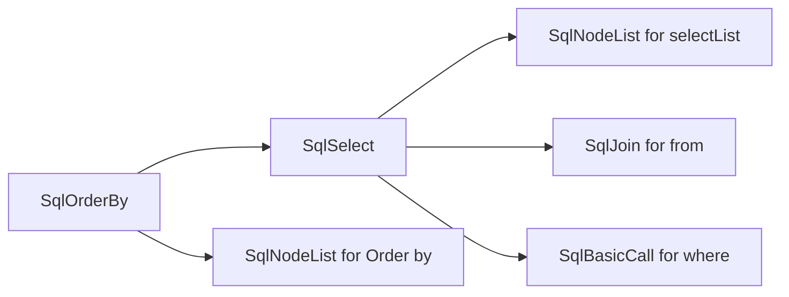
```mermaid
flowchart LR
	SqlOrderBy --> SqlSelect
	SqlOrderBy --> SqlNodeList[SqlNodeList for Order by]
	
	SqlSelect --> SqlNodeList1[SqlNodeList for selectList]
	SqlSelect --> SqlJoin[SqlJoin for from]
	SqlSelect --> SqlBasicCall[SqlBasicCall for where]
```


> 它的RelNode则可能如下（展示了所有的节点），每个节点都是 `RelNode` 的子类 `HepRelVertex`

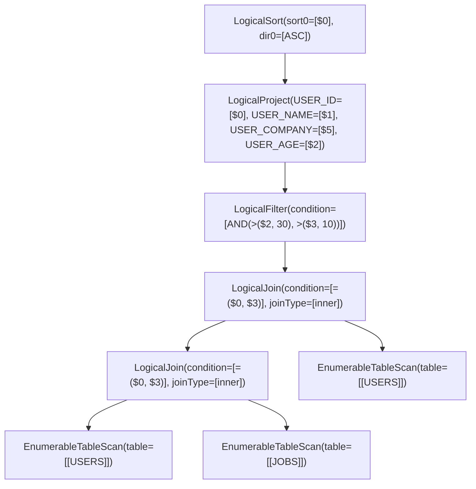
```mermaid
flowchart TD
	LogicalSort["LogicalSort(sort0=[$0], dir0=[ASC])"] --> LogicalProject["LogicalProject(USER_ID=[$0], USER_NAME=[$1], USER_COMPANY=[$5], USER_AGE=[$2])"]
	LogicalProject --> LogicalFilter["LogicalFilter(condition=[AND(>($2, 30), >($3, 10))])"]
	LogicalFilter --> LogicalJoin1["LogicalJoin(condition=[=($0, $3)], joinType=[inner])"]
	LogicalJoin1 --> LogicalJoin2["LogicalJoin(condition=[=($0, $3)], joinType=[inner])"]
	LogicalJoin1 --> EnumerableTableScan3["EnumerableTableScan(table=[[USERS]])"]
	LogicalJoin2 --> EnumerableTableScan1["EnumerableTableScan(table=[[USERS]])"]
	LogicalJoin2 --> EnumerableTableScan2["EnumerableTableScan(table=[[JOBS]])"]
```

> **有一个很重要的特征是，SqlNode 树的节点非常多，这也是为什么我们只画了一部分节点，而逻辑执行计划的节点相对则非常少。**而在逻辑执行计划中，多个条件可能会在一个节点中。

### RelOptCluster在calcite中的含义

- `Rel` relational
- `Opt` optimizer
- `Cluster` enviroment

在calicte中，Cluster 一般用于指代 `enviroment`，这里是 calcite 中一个很容易让人误解的命名（可能是由于历史因素导致）。同时，calcite也有额外的 `Context` 类。

```java
/**
 * An environment for related relational expressions during the
 * optimization of a query.
 */
public class RelOptCluster {

}
```

### 逻辑执行计划的节点

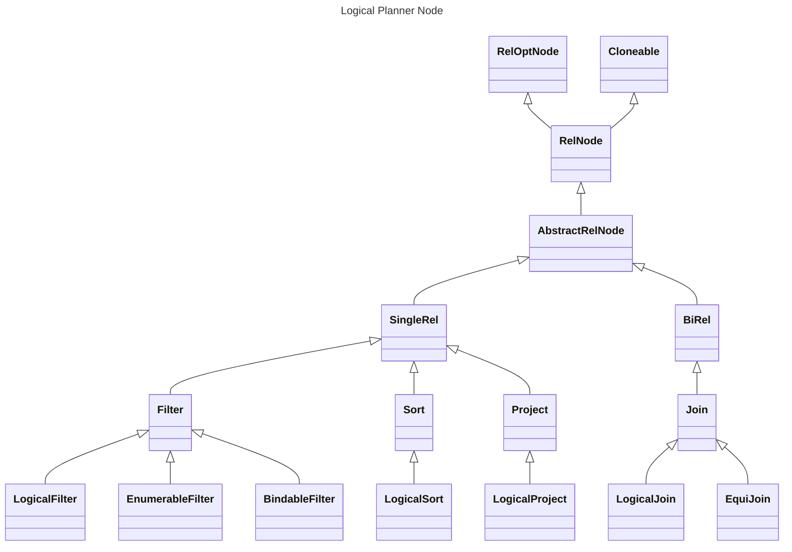
```mermaid
---
title: Logical Planner Node
---
classDiagram
	    RelOptNode <|-- RelNode
	    Cloneable <|-- RelNode
	    RelNode <|-- AbstractRelNode
	    AbstractRelNode <|-- SingleRel
	    AbstractRelNode <|-- BiRel
	    
	    SingleRel <|-- Filter 
	    Filter <|-- LogicalFilter
	    Filter <|-- EnumerableFilter
	    Filter <|-- BindableFilter
	    SingleRel <|-- Sort
	    Sort <|-- LogicalSort
	    SingleRel <|-- Project
	    Project <|-- LogicalProject
	    
	    BiRel <|-- Join
	    Join <|-- LogicalJoin
	    Join <|-- EquiJoin
```

#### RelOptNode

`RelOptNode` 是 planner 中的基本节点对应的 **interface**，所有的节点都是 RelOptNode 的子类，通过 `RelOptNode` 可以获取到许多 planner 需要的重要信息：

1. `id` 唯一ID，在服务开始时被创建；
2. `digest` 返回一个 relational expression 的 `摘要`，如果两个 RelOptNode 的摘要相同，则可以视为两个节点等价（假设我们的子节点已经被标准化）。**注意，digest是不能包含当前RelOptNode的id的，否则将永远得不到等价节点。**
3. `traitSet` RelTraitSet represents an `ordered` set of RelTraits. **允许编辑 traitSet，但是不允许在优化期间编辑**；
4. `desc` 返回当前节点的描述，相对于 `digest`，**desc包含了id信息**；
5. `inputs` 当前节点的输入，不为null；
6. `cluster` 返回当前节点所归属的 `cluster`。

```java
/**
 * Node in a planner.
 */
public interface RelOptNode {
  /**
   * Returns the ID of this relational expression, unique among all relational
   * expressions created since the server was started.
   *
   * @return Unique ID
   */
  int getId();

  /**
   * Returns a string which concisely describes the definition of this
   * relational expression. Two relational expressions are equivalent if and
   * only if their digests are the same.
   *
   * <p>The digest does not contain the relational expression's identity --
   * that would prevent similar relational expressions from ever comparing
   * equal -- but does include the identity of children (on the assumption
   * that children have already been normalized).
   *
   * <p>If you want a descriptive string which contains the identity, call
   * {@link Object#toString()}, which always returns "rel#{id}:{digest}".
   *
   * @return Digest of this {@code RelNode}
   */
  String getDigest();

  /**
   * Retrieves this RelNode's traits. Note that although the RelTraitSet
   * returned is modifiable, it <b>must not</b> be modified during
   * optimization. It is legal to modify the traits of a RelNode before or
   * after optimization, although doing so could render a tree of RelNodes
   * unimplementable. If a RelNode's traits need to be modified during
   * optimization, clone the RelNode and change the clone's traits.
   *
   * @return this RelNode's trait set
   */
  RelTraitSet getTraitSet();

  // TODO: We don't want to require that nodes have very detailed row type. It
  // may not even be known at planning time.
  RelDataType getRowType();

  /**
   * Returns a string which describes the relational expression and, unlike
   * {@link #getDigest()}, also includes the identity. Typically returns
   * "rel#{id}:{digest}".
   *
   * @return String which describes the relational expression and, unlike
   *   {@link #getDigest()}, also includes the identity
   */
  String getDescription();

  /**
   * Returns an array of this relational expression's inputs. If there are no
   * inputs, returns an empty list, not {@code null}.
   *
   * @return Array of this relational expression's inputs
   */
  List<? extends RelOptNode> getInputs();

  /**
   * Returns the cluster this relational expression belongs to.
   *
   * @return cluster
   */
  RelOptCluster getCluster();
}

```

#### RelNode

1. A <code>RelNode</code> is a relational expression. Relational expressions process data, so their names are typically verbs: Sort, Join, Project, Filter, Scan, Sample.
2. `RelNode` 是一个 **relational expression**，不同于 **scalar expression**（由 `RexNode` 表示）。relational expression 通常执行结果是一个二维的表格（也就是SQL执行的返回值），而 scalar expression 表达式的执行结果通常是一个单个的值；

`RelNode` 也包含了很多的方法：

1. `Convention` 返回 `traitSet` 的 calling convention trait；
2. `RelNode getInput(int i)` 获取第i个输入RelNode；
3. `double estimateRowCount(RelMetadataQuery mq)` 估算一个查询可能返回的行数；

####  AbstractRelNode

`AbstractRelNode` 是所有 relational expression 的基类，之所以保留 `RelNode` 是因为所有的 interface 都必须从另一个 interface 导出。

### SingleRel

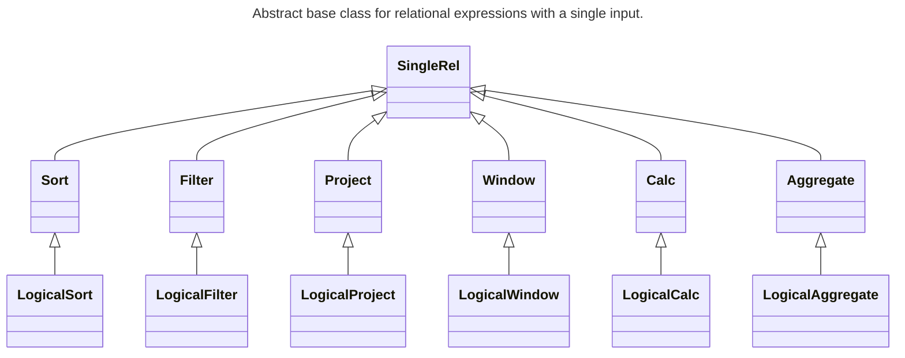
```mermaid
---
title: Abstract base class for relational expressions with a single input.
---
classDiagram

SingleRel <|-- Sort
SingleRel <|-- Filter
SingleRel <|-- Project
SingleRel <|-- Window
SingleRel <|-- Calc
SingleRel <|-- Aggregate

Sort <|-- LogicalSort
Filter <|-- LogicalFilter
Project <|-- LogicalProject
Window <|-- LogicalWindow
Calc <|-- LogicalCalc
Aggregate <|-- LogicalAggregate
```


### Converter

> `Converter` A relational expression implements the interface Converter to indicate that it converts a physical attribute, or trait, of a relational expression from one value to another.
>
> `JdbcToEnumerableConverter` Relational expression representing a scan of a table in a JDBC data source.

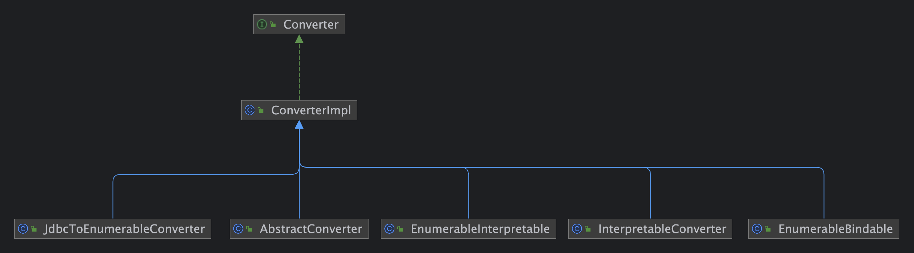

### RelTrait

在 Calcite 中，`RelTrait` 是一个用于 **描述节点特征的 `接口`**，例如节点**是否排序**，**数据类型**等。使用 RelTrait 我们可以知道优化器选择合适的执行计划：例如，如果我们的数据本身就是有序的，那么我们可以直接优化掉SQL中的 order by（如何排序和实际排序一致的话）。

在我们的实际使用中，`RelTrait` 只是定义特征的接口，实际的实现是由 `RelTraitDef` 来实现的。**从某种角度来说，RelTrait 和 RelTraitDef 的关系类似于 java 里的 `class` 和 ` instance`**。RelTrait作为一个接口，定义了特征的基本行为和方法，例如 `getTraitDef()` 用于获取trait定义、`satisfies()` 用于比较trait。而RelTraitDef作为一个抽象类，用于定义 trait 的规范和操作，例如 `convert()` 用于转换一个RelNode到另外一个RelNod。

> RelTrait的结构如下所示。

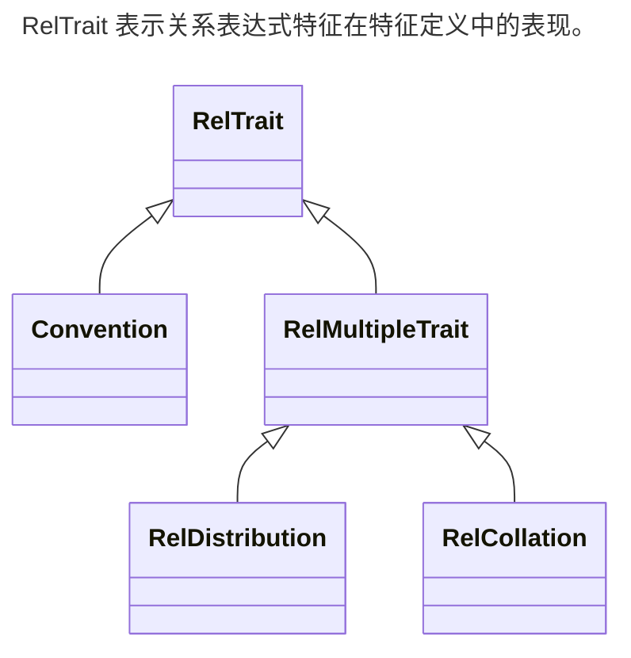
```mermaid
---
title: RelTrait 表示关系表达式特征在特征定义中的表现。
---
classDiagram
	RelTrait <|-- Convention
	RelTrait <|-- RelMultipleTrait
	RelMultipleTrait <|-- RelDistribution
	RelMultipleTrait <|-- RelCollation
```


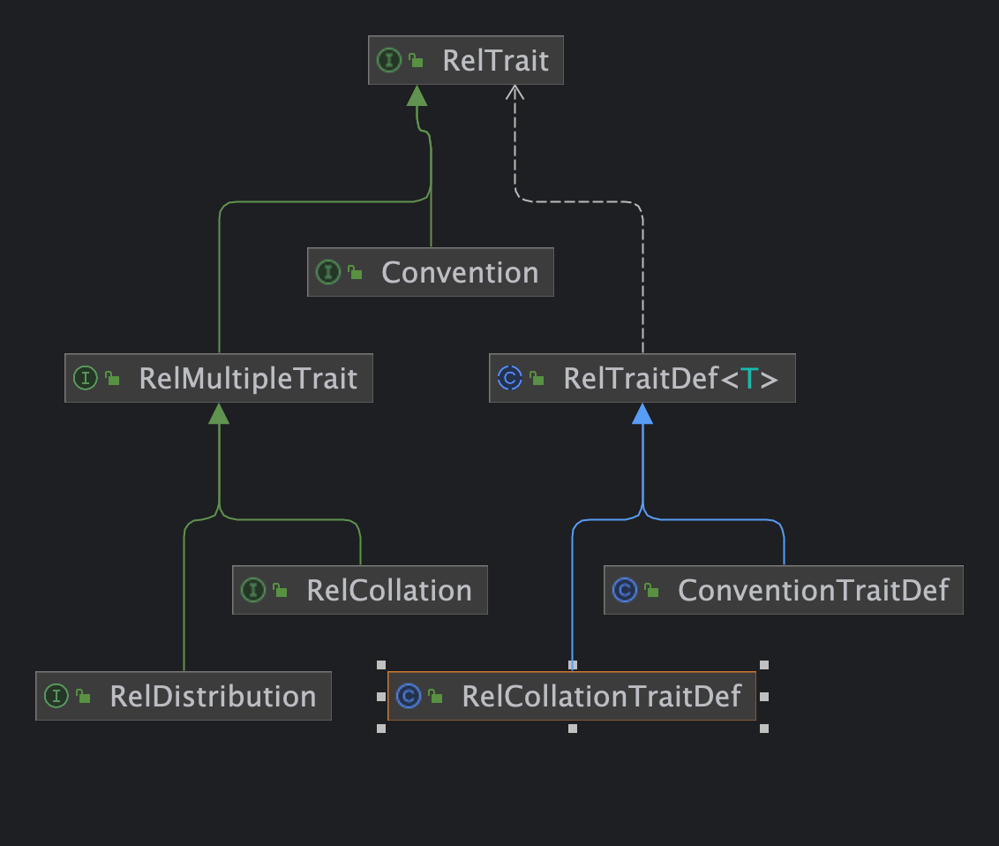

- `Convention`：`Convention` 表示关系代数树中节点的约定或物理实现方式。它描述了节点的数据布局、执行引擎、数据传输方式等。`Convention` 定义了节点的物理属性，以指导优化器选择适合的物理操作和执行计划。
- `RelMultipleTrait` RelMultipleTrait是一种特殊的关系特征，用于描述关系的多个特征。它可以包含多个RelTrait，例如RelCollation和RelDistribution等；
- `RelCollation` RelCollation用于描述关系的排序要求。它定义了关系中的行的排序顺序，可以指定一个或多个列以升序或降序进行排序；
- `RelDistribution` RelDistribution 定义了关系在分布式环境中的数据分布方式，例如，是否分布在多个节点上、是否进行分区等。

### Calling Convention

在`RelNode`相关的代码注释中经常会看到Calling Convention这个词, 从字面上理解它表示的是`RelNode`该如何被调用. **这个”调用”实际上应该理解为”转换”, 一般情况下是指从逻辑算子到物理算子的转换, 如从`LogicalTableScan`到`EnumerableTableScan`的转换.**

**转化特征**（Convention）：属于 Trait 的子类，用于转化 RelNode 到具体平台实现（可以将下文提到的 Planner 注册到 Convention 中）. 例如 JdbcConvention，FlinkConventions.DATASTREAM 等。同一个关系表达式的输入必须来自单个数据源，各表达式之间通过 Converter 生成的 Bridge 来连接。

从上文的介绍中也可以知道, 每个`RelNode`都会有一个`RelTraitSet`类型的变量来描述其当前的物理属性, 其中包含`Convention`. 对于逻辑算子, 其`Convention`一般是默认实现, 即`Convention.Impl`, 而物理算子则有其对应的`Convention`属性, 如`EnumerableRel`包含`EnumerableConvention`.

### RelBuilder

`RelBuilder`是Calcite中的关系算子生成器, 它提供的方法可用于快速生成绝大多数关系算子. 从整体上来看, `RelBuilder`所提供的方法可分为以下几类:

- 一类是生成`RelNode`的[方法](https://calcite.apache.org/docs/algebra.html#relational-operators), 如`scan()`, `filter()`, `project()`等.
- 一类是生成`RexNode`的[方法](https://calcite.apache.org/docs/algebra.html#scalar-expression-methods), 如`field()`, `and()`, `equals()`等.
- 还有其他一些辅助方法, 如生成`GROUP BY`字段的`groupKey()`[方法](https://calcite.apache.org/docs/algebra.html#group-key-methods).

```java
  /**
   * Creates a relational expression for a table scan.
   * It is equivalent to
   *
   * <blockquote><pre>SELECT *
   * FROM emp</pre></blockquote>
   */
  private RelBuilder example0(RelBuilder builder) {
    return builder
        .values(new String[] {"a", "b"}, 1, true, null, false);
  }

  /**
   * Creates a relational expression for a table scan, aggregate, filter.
   * It is equivalent to
   *
   * <blockquote><pre>SELECT deptno, count(*) AS c, sum(sal) AS s
   * FROM emp
   * GROUP BY deptno
   * HAVING count(*) &gt; 10</pre></blockquote>
   */
  private RelBuilder example3(RelBuilder builder) {
    return builder
        .scan("EMP")
        .aggregate(builder.groupKey("DEPTNO"),
            builder.count(false, "C"),
            builder.sum(false, "S", builder.field("SAL")))
        .filter(
            builder.call(SqlStdOperatorTable.GREATER_THAN, builder.field("C"),
                builder.literal(10)));
  }

  /**
   * Sometimes the stack becomes so deeply nested it gets confusing. To keep
   * things straight, you can remove expressions from the stack. For example,
   * here we are building a bushy join:
   *
   * <blockquote><pre>
   *                join
   *              /      \
   *         join          join
   *       /      \      /      \
   * CUSTOMERS ORDERS LINE_ITEMS PRODUCTS
   * </pre></blockquote>
   *
   * <p>We build it in three stages. Store the intermediate results in variables
   * `left` and `right`, and use `push()` to put them back on the stack when it
   * is time to create the final `Join`.
   */
  private RelBuilder example4(RelBuilder builder) {
    final RelNode left = builder
        .scan("CUSTOMERS")
        .scan("ORDERS")
        .join(JoinRelType.INNER, "ORDER_ID")
        .build();

    final RelNode right = builder
        .scan("LINE_ITEMS")
        .scan("PRODUCTS")
        .join(JoinRelType.INNER, "PRODUCT_ID")
        .build();

    return builder
        .push(left)
        .push(right)
        .join(JoinRelType.INNER, "ORDER_ID");
  }
```

### SqlToRelConverter

> 初始化 SqlToRelConverter

```java
    private static void initConverter() {
        // 创建SqlToRelConverter
        RelOptCluster cluster = RelOptCluster.create(planner, new RexBuilder(catalogReader.getTypeFactory()));
        SqlToRelConverter.Config converterConfig = SqlToRelConverter.config()
                                                                    .withTrimUnusedFields(true)
                                                                    .withExpand(false);
        converter = new SqlToRelConverter(
                null,
                validator,
                catalogReader,
                cluster,
                StandardConvertletTable.INSTANCE,
                converterConfig);
    }
```

> 以以下SQL作为输入
>
> ```sql
> SELECT *
> FROM `USERS`
> ```
>
> 在经过 validator 验证之后，会被改写为：
>
> ```sql
> SELECT `USERS`.`id`, `USERS`.`name`, `USERS`.`age`
> FROM `x`.`USERS` AS `USERS`
> ```
>
> 改写后的SQL会作为 SqlToRelConverter 的输入

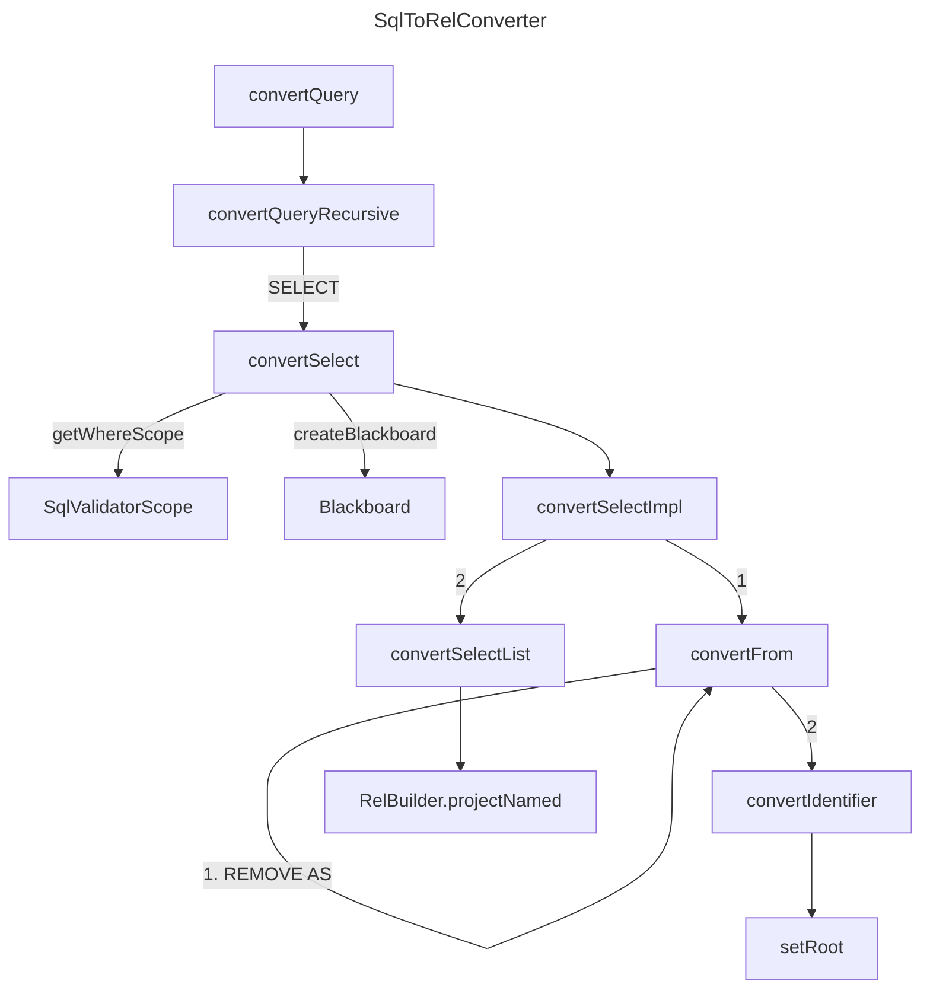
```mermaid
---
title: SqlToRelConverter
---
flowchart TD
	convertQuery --> convertQueryRecursive -->|SELECT| convertSelect
	convertSelect -->|getWhereScope| SqlValidatorScope
	convertSelect -->|createBlackboard| Blackboard
	convertSelect --> convertSelectImpl
	convertSelectImpl -->|1| convertFrom
	convertSelectImpl -->|2| convertSelectList
	
	convertFrom -->|1. REMOVE AS| convertFrom
	convertFrom -->|2| convertIdentifier
	convertIdentifier --> setRoot
	convertSelectList --> RelBuilder.projectNamed
```


## 优化

### RBO

规则的定义需要`Pattern`和`Substitution`, 其中Pattern表示规则可匹配的查询子树, 而Substitution表示与Pattern等价的关系表达式

#### Column Pruning

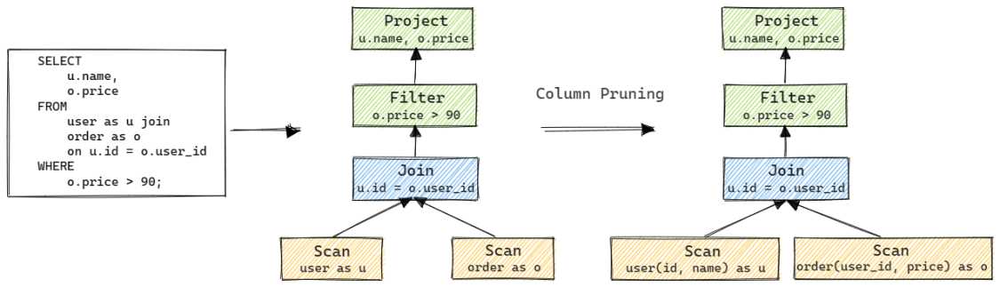

#### predict pushdown

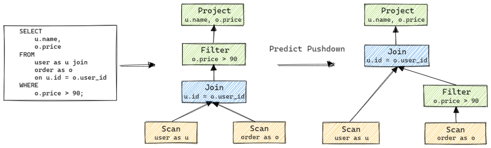

### CBO

> 基于成本的优化有两个核心依赖, 即:
>
> - 统计信息, 例如表的行数, 列索引上唯一键的数量等.
> - 成本模型, 在单机环境下一般考虑IO, CPU, 内存成本; 在分布式环境下还需考虑网络成本.

### Calcite查询优化器实现

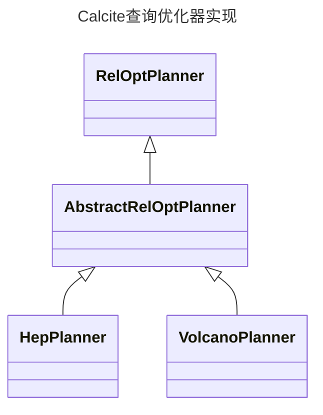
```mermaid
---
title: Calcite查询优化器实现
---
classDiagram
	RelOptPlanner <|-- AbstractRelOptPlanner
	AbstractRelOptPlanner <|-- HepPlanner
	AbstractRelOptPlanner <|-- VolcanoPlanner
```


#### 查询优化器相关概念和数据结构

> 无论是RBO还是CBO, 实际都是由规则驱动的.

Calcite中已经实现了上百种优化规则, 从优化内容来看可以分为以下两种类型:

- `TransformationRule`: 用于将一种逻辑表达式转换为另一种等价的逻辑表达式. 对应Cascades中的Transformation Rule, 是一个独立的接口, 并不继承于`RelOptRule`. 需要注意的是`TransformationRule`接口仅在VolcanoPlanner中有效, HepPlanner会直接忽略这一接口.
- `ConverterRule`: 用于将一种Calling Convention的表达式转换为另一种Calling Convention的表达式, 可用于将逻辑表达式转换为物理表达式. 对应Cascades中的Implementation Rule, `ConverterRule`继承于`RelOptRule`.

定义一个规则至少需要两部分信息, 即Pattern和Sustitution, 在Calcite中:

- Pattern由`RelOptRuleOperand`实现, 用于表示该规则可匹配的表达式结构.
- Substitution表示该规则可产生的逻辑等价表达式, 在函数`onMatch()`中实现.

##### FilterMergeRule

> `FilterMergeRule` 是一个简单的 `TransformationRule` 实例，它将查询树种的上下两个 `Filter` 算子合并为一个。
>
> ```mermaid
> ---
> title: FilterMergeRule
> ---
> flowchart LR
> 	beforeOpt --> afterOpt
> 	subgraph beforeOpt
> 		Filter0[topFilter] --> Filter1[bottomFilter] --> anyInputs
> 	end
> 	
> 	subgraph afterOpt
> 		Filter2Input[anyInputs] --> Filter2["topFilter.condition()"]
> 		Filter2Input[anyInputs] --> Filter3["bottomFilter.condition()"]
> 	end
> ```
>
> 可以看到，我们的代码有如下特点：
>
> 1. 在 `matches` 中匹配，在 `onMatch` 中转换；
> 2. `FilterMergeRule` 的构造函数为 `protected`，只能通过 `FilterMergeRule#Config#DEFAULT.toRule()` 构造；
> 3. `FilterMergeRule#Config#withOperandSupplier` 有一个 `default` 方法，通过它可以指定具体匹配的节点类型。

```java
/*
 * Licensed to the Apache Software Foundation (ASF) under one or more
 * contributor license agreements.  See the NOTICE file distributed with
 * this work for additional information regarding copyright ownership.
 * The ASF licenses this file to you under the Apache License, Version 2.0
 * (the "License"); you may not use this file except in compliance with
 * the License.  You may obtain a copy of the License at
 *
 * http://www.apache.org/licenses/LICENSE-2.0
 *
 * Unless required by applicable law or agreed to in writing, software
 * distributed under the License is distributed on an "AS IS" BASIS,
 * WITHOUT WARRANTIES OR CONDITIONS OF ANY KIND, either express or implied.
 * See the License for the specific language governing permissions and
 * limitations under the License.
 */
package org.apache.calcite.rel.rules;

import org.apache.calcite.plan.RelOptRuleCall;
import org.apache.calcite.plan.RelRule;
import org.apache.calcite.rel.core.Filter;
import org.apache.calcite.tools.RelBuilder;

import org.immutables.value.Value;

/**
 * Planner rule that combines two
 * {@link org.apache.calcite.rel.logical.LogicalFilter}s.
 */
@Value.Enclosing
public class FilterMergeRule extends RelRule<FilterMergeRule.Config>
    implements SubstitutionRule {

  /**
   * Creates a FilterMergeRule. As we see, the constructor is **protected**.
   * <p/>
   * Use {@link FilterMergeRule.Config#toRule()} get an instance
   */
  protected FilterMergeRule(Config config) {
    super(config);
  }

  /**
   * **ATTENTION**: the method is copied from superclass and just for readability.
   * extends from {@link org.apache.calcite.plan.RelOptRule#matches(RelOptRuleCall)}, always
   * return true
   */
  @Override
  public boolean matches(RelOptRuleCall call) {
    return super.matches(call);
  }

  @Override
  public void onMatch(RelOptRuleCall call) {
    // input match topFilter -> bottomFilter -> anyInput
    final Filter topFilter    = call.rel(0);
    final Filter bottomFilter = call.rel(1);

    // convert to
    // bottomFilter -> bottomFilter.getCondition()
    // bottomFilter -> topFilter.getCondition()
    final RelBuilder relBuilder = call.builder();
    relBuilder.push(bottomFilter.getInput())
              .filter(bottomFilter.getCondition(), topFilter.getCondition());

    call.transformTo(relBuilder.build());
  }

  /***
   * 1. {@link Config#withOperandFor(Class)} Defines an operand tree for the given classes;
   * 2. Inner interface used to create a {@link FilterMergeRule} instance.
   */
  @Value.Immutable
  public interface Config extends RelRule.Config {
    Config DEFAULT = ImmutableFilterMergeRule.Config.of().withOperandFor(Filter.class);

    @Override
    default FilterMergeRule toRule() {
      return new FilterMergeRule(this);
    }

    /**
     * Defines an operand tree for the given classes.
     */
    default Config withOperandFor(Class<? extends Filter> filterClass) {
      // indicate an operand with particular structure
      // Filter -> Filter -> anyInputs
      // b0 contains one and only one Filter as input
      // followed by b1
      // b2 contains one and only one Filter as input too
      // followed by anyInputs
      return withOperandSupplier(b0 ->
                                     b0.operand(filterClass)
                                       .oneInput(b1 -> b1.operand(filterClass)
                                                         .anyInputs()))
          .as(Config.class);
    }
  }
}
```

##### ConverterRule

>`ConverterRule`可用于在逻辑算子和物理算子之间进行转换, 基类的`onMatch()`方法会调用子类的`convert()`方法实现转换.

```java
/**
 * Abstract base class for a rule which converts from one calling convention to
 * another without changing semantics.
 */
@Value.Enclosing
public abstract class ConverterRule
    extends RelRule<ConverterRule.Config> {

  /** Creates a <code>ConverterRule</code>. */
  protected ConverterRule(Config config) {
    super(config);
    this.inTrait = Objects.requireNonNull(config.inTrait());
    this.outTrait = Objects.requireNonNull(config.outTrait());

    // Source and target traits must have same type
    assert inTrait.getTraitDef() == outTrait.getTraitDef();

    // Most sub-classes are concerned with converting one convention to
    // another, and for them, the "out" field is a convenient short-cut.
    this.out =
        outTrait instanceof Convention ? (Convention) outTrait
            : castNonNull(null);
  }

  /** Converts a relational expression to the target trait(s) of this rule.
   *
   * <p>Returns null if conversion is not possible. */
  public abstract @Nullable RelNode convert(RelNode rel);

    @Override public void onMatch(RelOptRuleCall call) {
    RelNode rel = call.rel(0);
    if (rel.getTraitSet().contains(inTrait)) {
      // if rel's trait set contain inTrait, call convert
      final RelNode converted = convert(rel);
      if (converted != null) {
        call.transformTo(converted);
      }
    }
  }
}
```

##### EnumerableFilterRule

> `EnumerableFilter` 是一种 **对 `EnumerableConvention` 调用约定的 `Filter` 操作的实现。 **
>
> 在 Calcite 中，Enumerable 是一种计算模型和调用约定，它将 **关系代数操作映射到迭代器模型**，以便在内存中进行计算。在 Enumerable 调用约定中，查询计划将转换为一系列迭代器操作，每个操作都返回一个迭代器，用于按需获取结果。
>
> Filter（过滤）操作是关系代数中的一种基本操作，用于根据给定的谓词条件从输入行集中选择满足条件的行。
>
> 而 **Implementation of Filter in enumerable calling convention** 指的是在基于 Enumerable 调用约定的计算模型中，对 Filter 操作的具体实现方式。
>
> 
>
> 在下面的代码中，EnumerableFilterRule 通过 `DEFAULT_CONFIG` 声明了一个如下的 `ConverterRule`。
>
> ```mermaid
> ---
> title: EnumerableFilterRule
> ---
> flowchart TD
> 	from --> to
> 	
> 	subgraph from
> 		direction LR
> 		InTraits --> IntraitsValue[Convention.NONE]
> 		OutTraits --> OutTraitsValue[EnumerableConvention.INSTANCE]
> 		OperandSupplier --> LogicalFilter -->|with predict| PredictValue["f -> !f.containsOver()"]
> 	end
> 	
> 	subgraph to
> 		EnumerableFilter
> 	end
> ```
>
> 

```java
/**
 * Rule to convert a {@link LogicalFilter} to an {@link EnumerableFilter}.
 * You may provide a custom config to convert other nodes that extend {@link Filter}.
 *
 * @see EnumerableRules#ENUMERABLE_FILTER_RULE
 */
class EnumerableFilterRule extends ConverterRule {
  /** Default configuration. */
  public static final Config DEFAULT_CONFIG = Config.INSTANCE
      // 1st, 2nd params used to specify operandSupplier
      // b -> b.operand(operandClazz).predicate(predicate).convert(in)
      .withConversion(LogicalFilter.class,                    // operandClazz
                      f -> !f.containsOver(),                 // predicate
                      Convention.NONE,                        // inTrait
                      EnumerableConvention.INSTANCE,          // outTrait
                      "EnumerableFilterRule")                 // description
      .withRuleFactory(EnumerableFilterRule::new);

  protected EnumerableFilterRule(Config config) {
    super(config);
  }

  @Override public RelNode convert(RelNode rel) {
    final Filter filter = (Filter) rel;
    return new EnumerableFilter(rel.getCluster(),
                                rel.getTraitSet().replace(EnumerableConvention.INSTANCE),
                                convert(filter.getInput(),
                                        filter.getInput().getTraitSet()
                                              .replace(EnumerableConvention.INSTANCE)), filter.getCondition());
  }
}
```

> withConversion

```java
    default <R extends RelNode> Config withConversion(Class<R> clazz,
        Predicate<? super R> predicate, RelTrait in, RelTrait out,
        String descriptionPrefix) {
      return withInTrait(in)
          .withOutTrait(out)
          .withOperandSupplier(b ->
              b.operand(clazz).predicate(predicate).convert(in))
          .withDescription(createDescription(descriptionPrefix, in, out))
          .as(Config.class);
    }
```

### HepRelVertex

> 在`HepPlanner`内部, 会将待优化的`RelNode`算子树转化为一个有向无环图(DAG)

```java
public class HepRelVertex extends AbstractRelNode implements DelegatingMetadataRel {
  //~ Instance fields --------------------------------------------------------

  /**
   * Wrapped rel currently chosen for implementation of expression.
   */
  private RelNode currentRel;

  //~ Constructors -----------------------------------------------------------

  HepRelVertex(RelNode rel) {
    super(rel.getCluster(), rel.getTraitSet());
    currentRel = requireNonNull(rel, "rel");
    checkArgument(!(rel instanceof HepRelVertex));
  }
}
```

### HepInstruction && HepState

#### HepInstruction

**HepInstruction represents one instruction in a HepProgram.** The actual instruction set is defined here via inner classes; if these grow too big, they should be moved out to top-level classes

```java
abstract class HepInstruction {
  /** Creates runtime state for this instruction.
   *
   * <p>The state is mutable, knows how to execute the instruction, and is
   * discarded after this execution. See {@link HepState}.
   *
   * @param px Preparation context; the state should copy from the context
   * all information that it will need to execute
   *
   * @return Initialized state
   */
  abstract HepState prepare(PrepareContext px);
}
```

#### HepState

Able to execute an instruction or program, and contains all mutable state for that instruction.


**The goal is that programs are re-entrant**. they can be used by more than one thread at a time. We achieve this by making instructions and programs immutable. All mutable state is held in the state objects.

```java
abstract class HepState {
  final HepPlanner planner;
  final HepProgram.State programState;

  HepState(HepInstruction.PrepareContext px) {
    this.planner = px.planner;
    this.programState = px.programState;
  }

  /** Executes the instruction. */
  abstract void execute();

  /** Re-initializes the state. (The state was initialized when it was created
   * via {@link HepInstruction#prepare}.) */
  void init() {
  }
}
```

#### Summary

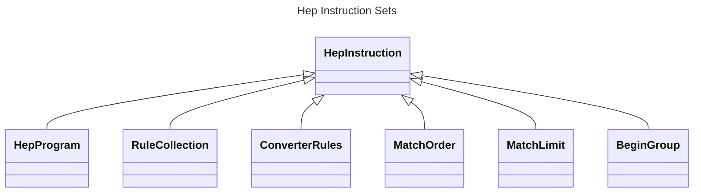
```mermaid
---
title: Hep Instruction Sets
---
classDiagram
	    HepInstruction <|-- HepProgram
	    HepInstruction <|-- RuleCollection
	    HepInstruction <|-- ConverterRules
	    HepInstruction <|-- MatchOrder
	    HepInstruction <|-- MatchLimit
	    HepInstruction <|-- BeginGroup
```


> `HepInstruction` 表示 `HepProgram` 中的一条指令，实际指令集在 `HepInstruction.java` 中通过内部类定义，主要用于**optimizer的优化规则**。
>
> 1. `HepInstruction` 是一个抽象类，他只包含了一个方法 `prepare()` 用于初始化 instruction 的 runtime state。
>
> 2. 他内部包含了大量的自身的实现类，例如：
>    1. `ConverterRules` Instruction that executes converter rules.
>    2. `MatchLimit` Instruction that sets match order.
>    3. 而且，一般来说，每个 HepInstruction 的实现类，都会在内部实现一个 `HepState` 接口用来管理自身的 runtime state。
> 3. HepInstruction 内部还有一个 `PrepareContext`，这个类的实例是 `State prepare(PrepareContext)` 方法的参数，很明显是用来初始化 State 的，内部也只有三个成员变量：
>    1. HepPlanner
>    2. HepProgram.State
>    3. EndGroup.State

#### Example

> 在我们的实际应用中，我们不会直接使用类似于 `new MatchLimit(10)` 之类的方式来初始化一个 HepInstrction，而是使用 HepProgramBuilder() 来初始化：
>
> ```java
>   /**
>    * Adds an instruction to change the order of pattern matching for
>    * subsequent instructions. The new order will take effect for the rest of
>    * the program (not counting subprograms) or until another match order
>    * instruction is encountered.
>    *
>    * @param order new match direction to set
>    */
>   public HepProgramBuilder addMatchOrder(HepMatchOrder order) {
>     checkArgument(group < 0);
>     return addInstruction(new HepInstruction.MatchOrder(order));
>   }
> 
> ```

```java
  private static final String UNION_TREE =
      "(select name from dept union select ename from emp)"
      + " union (select ename from bonus)";

	@Test void testMatchLimitOneTopDown() {
    // Verify that only the top union gets rewritten.

    HepProgramBuilder programBuilder = HepProgram.builder();
    // 指定TOP_DOWN匹配
    programBuilder.addMatchOrder(HepMatchOrder.TOP_DOWN);
    // 指定 MatchLimit
    programBuilder.addMatchLimit(1);
    programBuilder.addRuleInstance(CoreRules.UNION_TO_DISTINCT);

    sql(UNION_TREE).withProgram(programBuilder.build()).check();
  }
```

### HepProgram && HepProgramBuilder

> HepProgram specifies the order in which rules should be attempted by HepPlanner. Use HepProgramBuilder to create a new instance of HepProgram.
>
> 
>
> Note that the structure of a program is immutable, but the planner uses it as read/ write during planning, **so a program can only be in use by a single planner at a time**.

```java
public class HepProgram extends HepInstruction {

  /**
   * Symbolic constant for matching until no more matches occur.
   */
  public static final int MATCH_UNTIL_FIXPOINT = Integer.MAX_VALUE;

  final ImmutableList<HepInstruction> instructions;


  /**
   * Creates a new empty HepProgram. The program has an initial match order of
   * {@link org.apache.calcite.plan.hep.HepMatchOrder#DEPTH_FIRST}, and an initial
   * match limit of {@link #MATCH_UNTIL_FIXPOINT}.
   */
  HepProgram(List<HepInstruction> instructions) {
    this.instructions = ImmutableList.copyOf(instructions);
  }

  @Override State prepare(PrepareContext px) {
    return new State(px, instructions);
  }
}
```

### HepPlanner

#### Example

```java
HepProgramBuilder hepProgramBuilder = new HepProgramBuilder();
// 添加优化规则
hepProgramBuilder.addRuleInstance(CoreRules.FILTER_TO_CALC);
hepProgramBuilder.addRuleInstance(EnumerableRules.ENUMERABLE_TABLE_SCAN_RULE);
hepProgramBuilder.addRuleInstance(EnumerableRules.ENUMERABLE_CALC_RULE);

// 1. 构建HepPlanner
HepPlanner planner = new HepPlanner(hepProgramBuilder.build());
// 2. 构建DAG
planner.setRoot(root);
// 3. 执行优化
RelNode optimizedRoot = planner.findBestExp();
```

HepPlanner 的优化分为两步

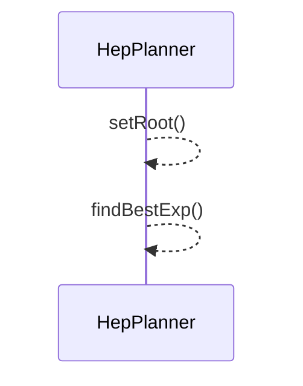
```mermaid
sequenceDiagram
	participant HepPlanner
	HepPlanner -->> HepPlanner : setRoot()
	HepPlanner -->> HepPlanner : findBestExp()
```


#### setRoot()

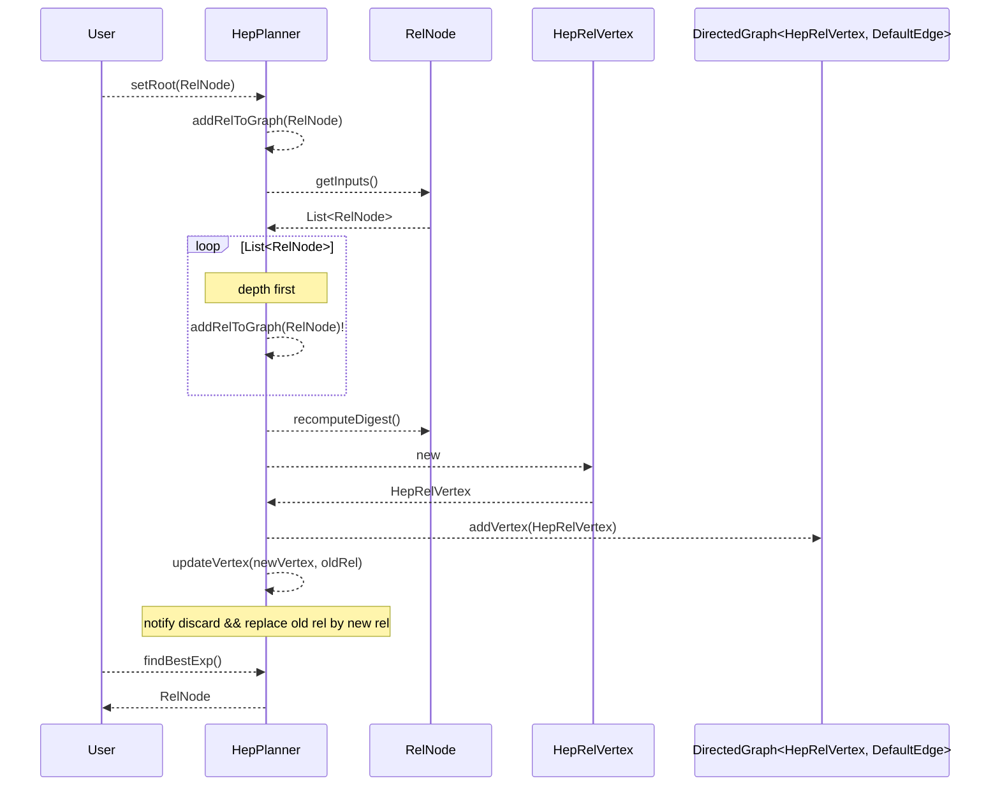
```mermaid
sequenceDiagram
	participant User
	participant HepPlanner
	participant RelNode
	participant HepRelVertex
	participant DirectedGraph as DirectedGraph<HepRelVertex, DefaultEdge>


	User -->> HepPlanner : setRoot(RelNode)
	HepPlanner -->> HepPlanner : addRelToGraph(RelNode)
	HepPlanner -->> RelNode : getInputs()
	RelNode -->> HepPlanner : List<RelNode>
	loop List<RelNode>
			NOTE OVER HepPlanner : depth first
			HepPlanner -->> HepPlanner: addRelToGraph(RelNode)!
  end

	HepPlanner -->> RelNode : recomputeDigest()
	HepPlanner -->> HepRelVertex : new
	HepRelVertex -->> HepPlanner : HepRelVertex
	
	HepPlanner -->> DirectedGraph : addVertex(HepRelVertex)
	HepPlanner -->> HepPlanner : updateVertex(newVertex, oldRel)
	NOTE OVER HepPlanner : notify discard && replace old rel by new rel
			
	User -->> HepPlanner : findBestExp()
	
	HepPlanner -->> User : RelNode
```

#### findBestExp()

```java
  @Override public RelNode findBestExp() {
    requireNonNull(root, "root");

    // Initializes state and then invokes the program.
    executeProgram(mainProgram);

    // Get rid of everything except what's in the final plan.
    collectGarbage();
    dumpRuleAttemptsInfo();
    return buildFinalPlan(requireNonNull(root, "root"));
  }
```

> 随后进入我们核心的 `executeProgram` 方法，这个方法中我们会初始化 `HepState`，并基于 `HepState` 执行 `HepInstruction`。
>
> 在这里，我们再回忆一下在HepState中提到：
>
> **The goal is that programs are re-entrant - they can be used by more than one thread at a time. We achieve this by making instructions and programs immutable. All mutable state is held in the state objects.**

```java
  private void executeProgram(HepProgram program) {
    // create and initialize hep state
    final HepInstruction.PrepareContext px = HepInstruction.PrepareContext.create(this);
    // HepProgram 是 HepInstruction 的一个子类，所以他自然有自己的 prepare 方法
    // 在这个方法中，HepProgram 使用了 px 和使用 HepProgramBuilder 构造时添加的 HepInstruction
    // 初始化一个 HepState 实例。
    final HepState state = program.prepare(px);

    // execute state
    state.execute();
  }
```

> `program.prepare(px)` 使用 `HepProgramBUilder` 时添加的 HepInstruction 构造了一个 HepState，将所有的HepInstruction转换为了对应的HepState便于后续的执行。

```java
  class State extends HepState {
    final ImmutableList<HepState> instructionStates;
    int                                     matchLimit = MATCH_UNTIL_FIXPOINT;
    HepMatchOrder                           matchOrder = HepMatchOrder.DEPTH_FIRST;
    HepInstruction.EndGroup.@Nullable State group;

    State(PrepareContext px, List<HepInstruction> instructions) {
      super(px);
      final PrepareContext px2 = px.withProgramState(castToInitialized(this));

      final List<HepState>                          states  = new ArrayList<>();
      final Map<HepInstruction, Consumer<HepState>> actions = new HashMap<>();
      for (HepInstruction instruction : instructions) {
        final HepState state;
        if (instruction instanceof BeginGroup) {
          // The state of a BeginGroup instruction needs the state of the
          // corresponding EndGroup instruction, which we haven't seen yet.
          // Temporarily put a placeholder State into the list, and add an
          // action to replace that State. The action will be invoked when we
          // reach the EndGroup.
          final int i = states.size();
          actions.put(((BeginGroup) instruction).endGroup, state2 ->
              states.set(i,
                         instruction.prepare(
                             px2.withEndGroupState((EndGroup.State) state2))));
          state = castNonNull(null);
        } else {
          // 将 HepInstrcution 转换为 HepState
          state = instruction.prepare(px2);
          if (actions.containsKey(instruction)) {
            actions.get(instruction).accept(state);
          }
        }
        states.add(state);
      }
      this.instructionStates = ImmutableList.copyOf(states);
    }
		
    // ...
  }

```

>`state.execute()` 逻辑非常简单，就是单纯的遍历 instructionState 并执行对应的 `execute()`

```java
  void executeProgram(HepProgram instruction, HepProgram.State state) {
    state.init();
    // 遍历HepProgram中的HepInstruction并执行
    // 这里的每一个HepInstruction就是前面提到的各个实例，类似于
    // 我们使用 HepProgramBuilder#addRuleInstance 方法添加了一个 HepInstruction.RuleInstance
    // 这样就可以使用这个规则匹配了
    state.instructionStates.forEach(instructionState -> {
      instructionState.execute();
      int delta = nTransformations - nTransformationsLastGC;
      if (delta > graphSizeLastGC) {
        // The number of transformations performed since the last
        // garbage collection is greater than the number of vertices in
        // the graph at that time.  That means there should be a
        // reasonable amount of garbage to collect now.  We do it this
        // way to amortize garbage collection cost over multiple
        // instructions, while keeping the highwater memory usage
        // proportional to the graph size.
        collectGarbage();
      }
    });
  }
```

> 所以对于我们`Example`中的代码，执行逻辑就很简单了
>
> ```java
> HepProgramBuilder hepProgramBuilder = new HepProgramBuilder();
> // 添加优化规则
> hepProgramBuilder.addRuleInstance(CoreRules.FILTER_TO_CALC);
> hepProgramBuilder.addRuleInstance(EnumerableRules.ENUMERABLE_TABLE_SCAN_RULE);
> hepProgramBuilder.addRuleInstance(EnumerableRules.ENUMERABLE_CALC_RULE);
> 
> // 1. 构建HepPlanner
> HepPlanner planner = new HepPlanner(hepProgramBuilder.build());
> // 2. 构建DAG
> planner.setRoot(root);
> // 3. 执行优化
> RelNode optimizedRoot = planner.findBestExp();
> ```
>
> 整个过程就是：
>
> 1. HepProgramBuilder 添加 HepInstruction，并生成 HepProgram；
> 2. 使用 HepProgram 生成 HepPlanner；
> 3. HepPlanner 调用 findBestExp() -> executeProgram(program)；这里的program就是刚才传进来的 HepProgram；
> 4. HepProgram 初始化 `HepProgram#State`，`HepProgram#State` 内部将所有 <1> 中添加的 HepInstruction 转换为 HepState；
> 5. 调用 `HepProgram#State#execute()` -> `HepPlanner.executeProgram()` 执行完毕。

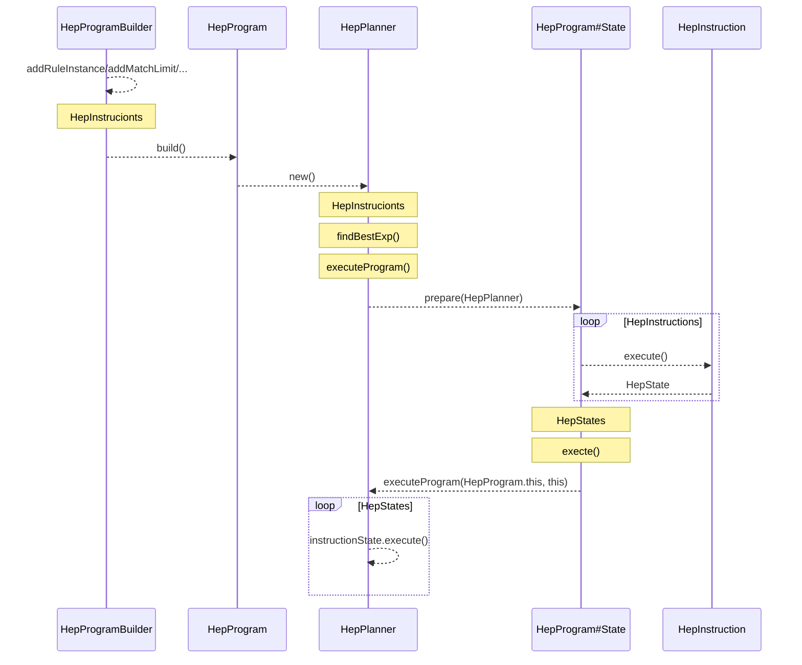
```mermaid
sequenceDiagram
	participant HepProgramBuilder
	participant HepProgram
	participant HepPlanner
	participant HepProgram#State

			
	HepProgramBuilder -->> HepProgramBuilder : addRuleInstance/addMatchLimit/...
	NOTE OVER HepProgramBuilder : HepInstrucionts
	HepProgramBuilder -->> HepProgram : build()
	HepProgram -->> HepPlanner : new()
	NOTE OVER HepPlanner : HepInstrucionts
	NOTE OVER HepPlanner : findBestExp()
	NOTE OVER HepPlanner : executeProgram()
	HepPlanner -->> HepProgram#State : prepare(HepPlanner)
	loop HepInstructions
			HepProgram#State -->> HepInstruction: execute()
			HepInstruction -->> HepProgram#State : HepState
	end
	NOTE OVER HepProgram#State : HepStates
	NOTE OVER HepProgram#State : execte()
	HepProgram#State -->> HepPlanner : executeProgram(HepProgram.this, this)
	loop HepStates
		HepPlanner -->> HepPlanner : instructionState.execute()
	end
```


> 相对来说，如果代码写成如下形式将更加直观：

```java
  @Override public RelNode findBestExp() {
    requireNonNull(root, "root");

    // Initializes state and then invokes the program.
    HepProgram.State state = buildState(mainProgram);
    state.execute();

    // Get rid of everything except what's in the final plan.
    collectGarbage();
    dumpRuleAttemptsInfo();
    return buildFinalPlan(requireNonNull(root, "root"));
  }

  /** Top-level entry point for a program. Initializes state and then invokes
   * the program. */
  private HepProgram.State buildState(HepProgram program) {
    // create and initialize hep state
    final HepInstruction.PrepareContext px = HepInstruction.PrepareContext.create(this);
    return program.prepare(px);
  }
```


