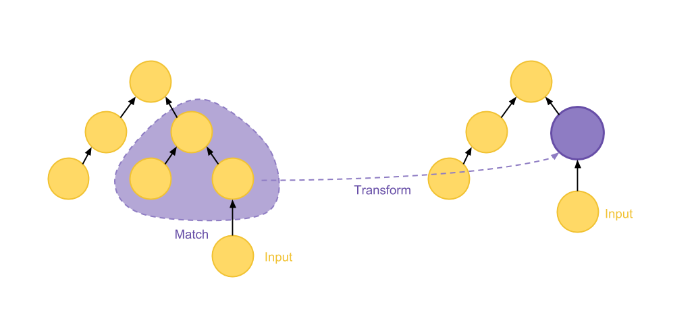
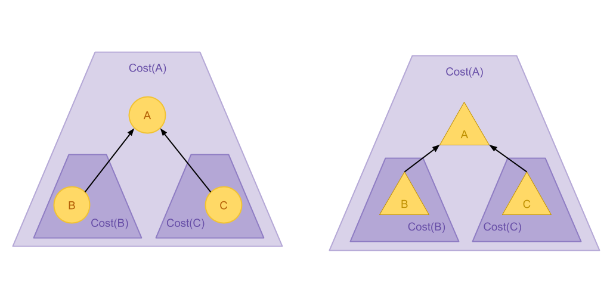
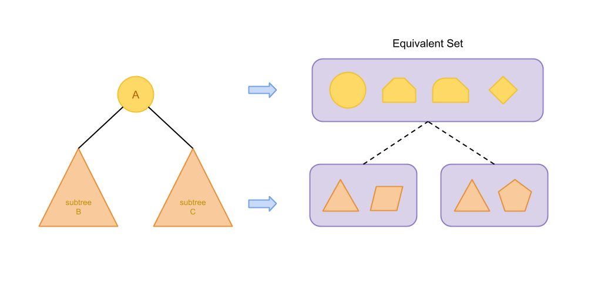
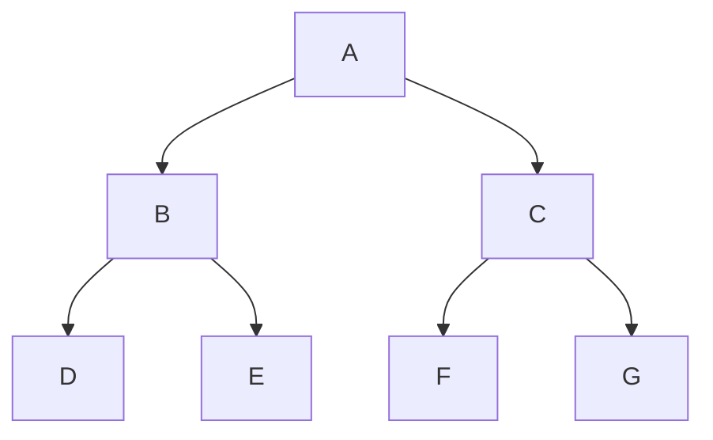
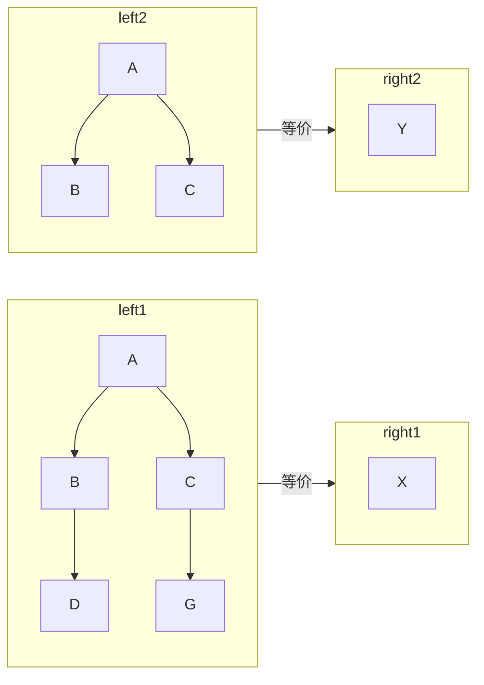
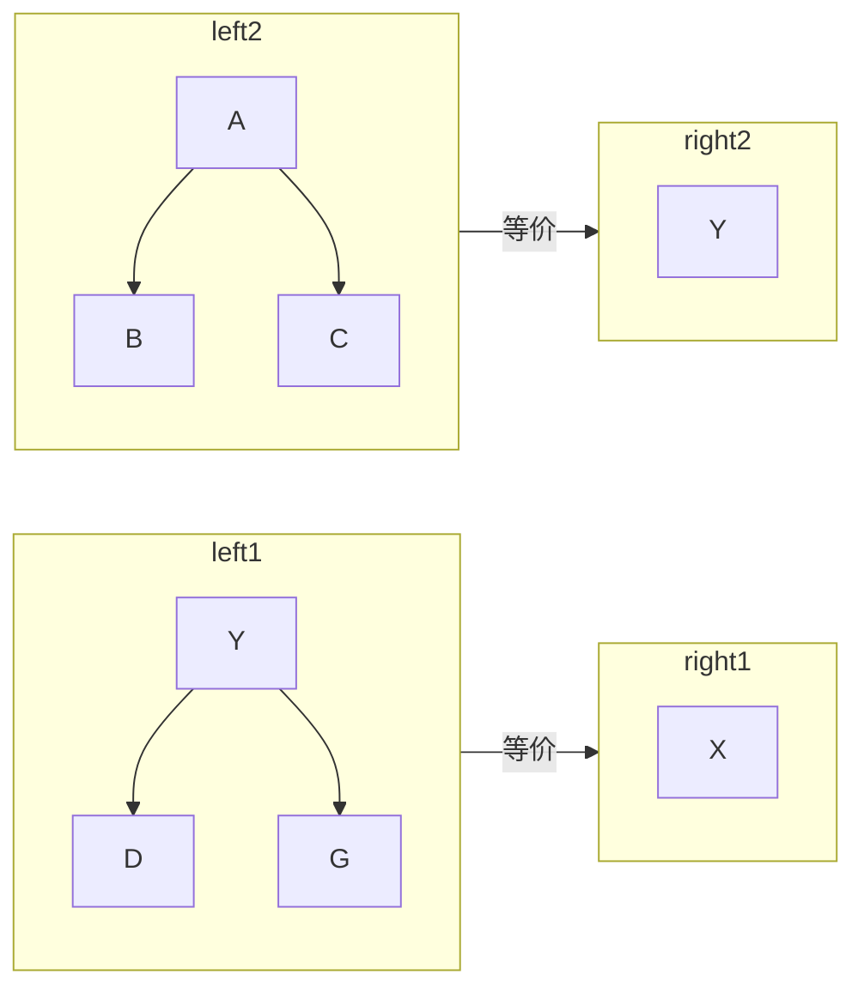
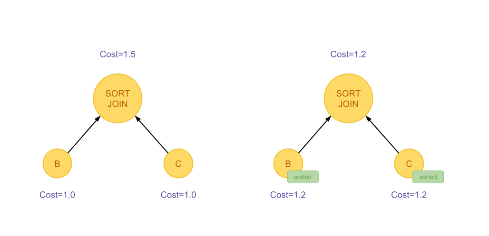
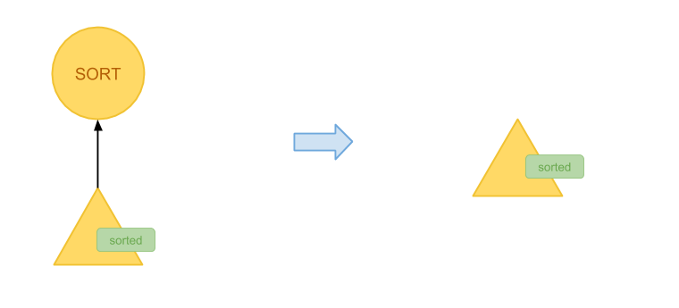

## SQL 查询优化原理与 Volcano Optimizer 介绍

> 本文是对 [SQL 查询优化原理与 Volcano Optimizer 介绍](https://io-meter.com/2018/11/01/sql-query-optimization-volcano/) 这篇文章的阅读一些补充和记录。

基于规则的优化方法的要点在于**结构匹配和替换**。 应用规则的算法一般需要先在关系代数结构上匹配一部分局部的结构， 再根据结构的特点进行变换乃至替换操作。

### Volcano Optimizer

#### 成本最优假设

成本最优假设利用了贪心算法的思想，在计算的过程中， 如果一个方案是由几个局部区域组合而成，那么在计算总成本时， 我们只考虑每个局部目前已知的最优方案和成本即可。

对于成本最优假设的另一种更直观的描述是，如果关系代数局部的某个输入的计算成本上升， 那么这一子树的整体成本趋向于上升，反之则会下降。也即是在上图右侧有

> Cost(A)∼Cost(B)+Cost(C)

#### 动态规划算法与等价集合

由于引入了成本最优假设，在优化过程中我们就可以对任意子树目前已知的最优方案和最优成本进行缓存。 此后在计算的过程中，如果需要利用这一子树，可以直接使用之前缓存的结果。这里应用了动态规划算法的思想。

要实现这一算法，只需要建立缓存结果到子树双向映射即可。在 Calcite 的实现当中，一颗子树使用其根结点作为代表。 某一棵子树所有可能的变换方案组成的集合被称为等价集合(Equivalent Set)， 等价集合将会维护自身元素当中具有最优成本的方案。

> 等价集合在 Calcite 当中对应的是`RelSet`类。

#### 如何优化等价集合的收集和存储

> 对每一颗子树都枚举其等价集合的内容会十分耗费空间。其实，对于某一棵以 A 为根结点的子树来说， 我们只关心 A 本身和包含 A 了的匹配内的节点。对于 A 和包含 A 的匹配之外的部分， 我们可以直接链接到子树对应的等价集合当中。基于成本最优假设，在计算方案成本的时候， 我们还可以直接从这些部分的等价集合中选取最佳方案。

这里，按照我的理解就是，每个节点都只需要关注：

1. 自身
2. 自身的临近节点（父节点或者子节点）

如果知道了包含以上两个部分的节点的**等价集合**，我们就可以使用**自顶向下**和**自底向上**的方式来**推算出整体的cost**。

例如，假设我们存在如下的树：

##### 存在的等价集合

> 假设当前存在如下等价集合

如果我们要表示**等价集合**，我们有两种方式：

##### 在等价集合中保存所有的节点

##### 在等价集合中只保存临近的节点

使用第二种策略，我们的算法缩减了状态空间、节省了计算量和储存空间。 

#### 自底向上 vs. 自顶向下

自底向上的算法最为直观：当我们试图计算节点 A 的最优方案时， 其子树上每个节点对应的等价集合和最优方案都已经计算完成了，我们只需要在 A 节点上不断寻找可以应用的规则，并利用已经计算好的子树成本计算出母树的成本，就可以得到最优方案。 事实上，包括 SQL Server 在内的一些成熟的数据库系统都采用这种方法。

然而这种方案存在一些难以解决的问题:

1. 不方便应用剪枝技巧，在查询中可能会遇到在父亲节点的某一种方案成本很高，后续完全无需考虑的情况， 尽管如此，需要被利用的子计算都已经完成了，这部分计算因此不可避免
2. 难以实现启发式计算和限制计算层数。由于程序要不断递归到最后才能得到比较好的方案， 因此即使计算量比较大也无法提前得到一个可行的方案并停止运行

因此，Volcano Optimizer 采取了自顶向下的计算方法，在计算开始， 每棵子树先按照原先的样子计算成本并作为初始结果。在不断应用规则的过程中，如果出现一种新的结构被加入到当前的等价集合中， 且这种等价集合具有更优的成本，这时需要向上冒泡到所有依赖这一子集合的父亲等价集合， 更新集合里每个元素的成本并得到新的最优成本和方案。

值得注意的是，在向上冒泡的过程中需要遍历父亲集合内的每一个方案，这是因为不同方案对于 Input 成本变化的敏感性不同，不能假设之前的最优方案仍然是最优的。

自顶向下的方法尽管解决了一些问题，但是也带来了对关系代数节点操作十分繁琐、 要不断维护父子等价集合的关系等问题，实现相对比较复杂。

#### Trait/Physical properties vector

> 贪心算法只能找到局部最优解，然后局部最优解并不一样是全局最优解。例如在下面的例子。

下面是一个SORT JOIN，有两种SCAN方式：

1. 直接顺序读取，这样速度更快，但是拿到的数据是乱序的；
2. 基于索引读取，这样由于不是顺序读取，所以速度更慢，但是拿到的数据是排好序的。

最终由于右边是已排序数据，所以JOIN的时候更快，**整体的成本由于避免了全表排序反而更优。**（在这个图里面画错了，右边的COST其实更高。）

> **这种问题在 Volcano Optimizer 当中使用 Physical properties vector 来解决。**

在 Calcite 当中，这个东西称为 Trait。一个 `RelNode` 可以声明自己的 Trait， 人们也可以编写规则利用输入节点的 Trait 来优化执行。

**在 Calcite 当中，具有不同 Trait 的优化方案虽然都在一个`RelSet`当中， 却按照相同 Trait 一类的方法分别组织在`RelSubset`对象里。 在进行方案成本估算和匹配规则应用等需要查询等价集合的情况下，不同的`RelSubset`会分别被处理。 这样的设计一定程度上解决了成本最优假设失效的问题。**

典型的 Trait 包括记录是否有序、是否包含 NULL 值、字符串是否都短于某一特定值等。 利用 Trait 进行查询优化的逻辑十分复杂也需要小心处理。下图展示了一个简单却典型的 Trait 的用例: 如果一个子树的输出已经按照某一列被排序，则取消掉上层重复的排序算子。

