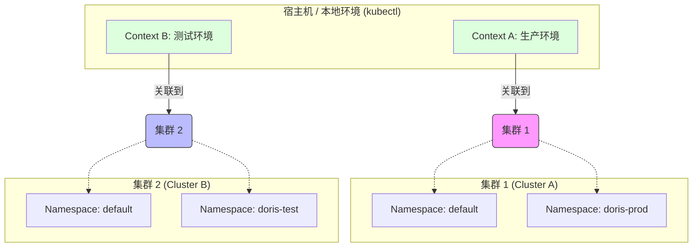
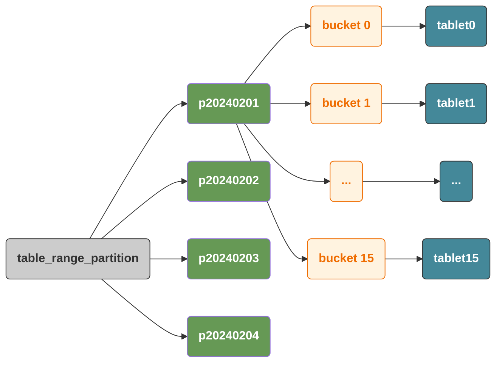
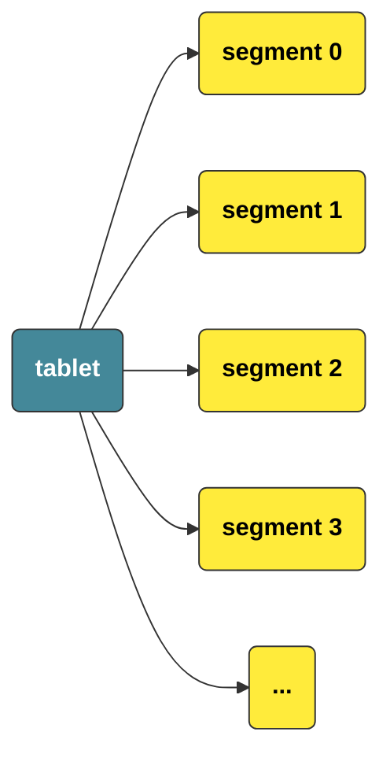
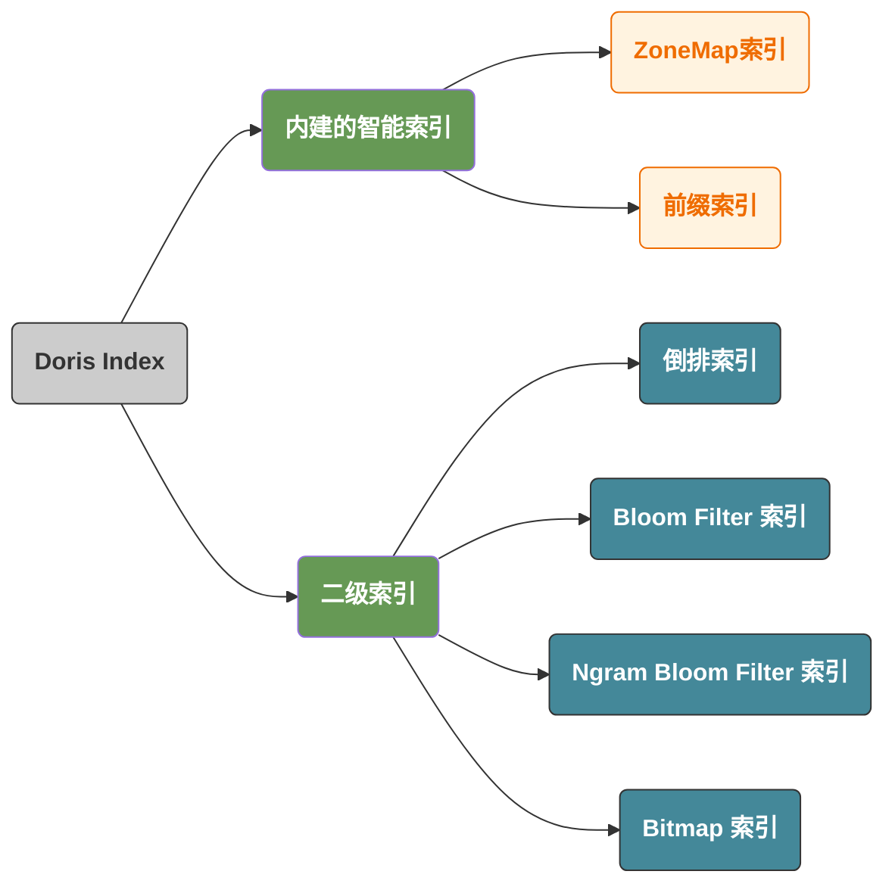

# cluster/context/namespace



- `context` 和 `namespace` 的关系其实比较绕，他们不是单纯的多对一或者一对一的关系：
  - 一个 Cluster 实体可以被多个不同的 Context 对象所引用
  - 一个 Cluster 实体不能引用多个 Context
  - **Cluster 是“被引用方”**：它像是一个**静态的地理坐标**，它不知道（也不在乎）有多少个 Context 在指向它。
  - 一个 Context 实体，包含了它引用的 Cluster 对象和访问该 Cluster 对象的 User。

此外，在 `~/.kube/config` 的定义中，`namespace` **确实是被写在 `context` 结构体内部的**，但它的地位和 `cluster`、`user` 完全不同。

在 `context` 的定义里，它们的关系是这样的：

- **`cluster` 和 `user` 是“强引用”**：如果一个 Context 不指向 Cluster 或 User，它就无法工作。
- **`namespace` 是“弱偏好”**：如果 Context 里没写 `namespace`，Kubernetes 默认会把我们带到 `default` 命名空间。

所以，一次 `kubectl` 指令通常如下：

```bash
# 配置文件 ~/.kube/config

# 指向配置文件的 current-context 的 default ns
kubectl get pods

# 指向配置文件的 kind-my-cluster 的 default ns
kubectl get pods --context kind-my-cluster

# 指向配置文件的 kind-my-cluster 的所有 namespace
kubectl get pods --all-namespaces --context kind-my-cluster
```

# 数据库和交换分区

> 在我们常规的线上数据库里，我们通常都会需要关闭交换分区：
>
> ```bash
> sudo swapoff -a
> ```
>
> 对这个逻辑的思考是：如果我的内存够用，那么关闭swap就不重要 -- 因为我们的内存是充足的。
>
> 所以，为什么我们还是需要这个逻辑呢？难道崩溃的情况，比响应慢的情况更严重吗？

即使我们的物理内存还剩下 **20%**，Linux 内核的虚拟内存管理机制（VMM）有时也会根据 `vm.swappiness` 参数，提前将一些它认为“不常用”的匿名内存页（Anonymous Pages）交换到磁盘，腾出物理内存给 **文件系统缓存（File Cache）**。

- 对于 StarRocks 这种需要频繁访问内存元数据、哈希表的数据库来说，这些被换出的“不常用”数据可能在下一秒就是一个核心查询的关键索引。
- 数据库引擎并不知道数据被换走了，当它去访问时，系统会产生**严重缺页中断（Hard Page Fault）**。这种延迟是毫秒级的，对于 MPP 引擎来说，这会导致整个查询集群的“短板效应”。

> **关闭 Swap 不仅仅是性能优化，更是为了“拿回缓存管理的控制权”**：数据库的缓存淘汰策略通常是自己定制的，关闭系统的swap机制可以有效的提高我们的缓存的利用率。因为对于大部分DB来讲，都会通过预先定义的内存大小去定制自己的缓存淘汰策略。

操作系统（Linux Kernel）的缓存淘汰通常基于 **LRU (Least Recently Used) 的变体**，它对内存的管理是“扁平的”、“通用的”。内核不知道哪些数据是：

- **热点索引（Hot Index）**：即使刚访问过，也必须常驻内存，否则查询会变成 IO 密集型。
- **临时计算块（Temp Join Data）**：只为了当前这一个 `SQL` 查询存在，用完即弃。
- **数据缓存（Data Cache/Buffer Pool）**：这是数据库的核心灵魂。

当开启 Swap 时，内核会根据自己的逻辑（比如：这一块内存页很久没被直接修改过）将其强制踢出到磁盘。然而，**内核无法判断这块数据是否是数据库逻辑上的“核心热点”**。结果就是：内核把数据库刚刚精心优化的“缓存”换出去了，导致数据库的淘汰策略完全失效。

实际上来说，这个位置的冲突就好像手动管理内存和自动管理内存依赖于GC的逻辑是一样的：前者更加的可靠，而后者则引入了STW的风险，对于数据库来说，STW意味着不可控和因为一个故障而雪崩的风险，不如提前crash。

## 常见的做法

- 限制 Buffer Pool 大小，给 OS 留内存
  - MySQL/InnoDB：`innodb_buffer_pool_size` 一般设为物理内存的 50%~75%
  - PostgreSQL：`shared_buffers` 类似，避免占满内存导致 OS 换页
- 使用大页 / 锁定内存
  - **大页（HugePages）**：减少页表开销，也更难被置换
  - **内存锁定（mlock () /memlock）**：把关键内存页钉在物理内存，禁止换出
    - MySQL：`innodb_buffer_pool_populate`、`lock_buffer_pool_in_memory`
    - PostgreSQL：`huge_pages` + `shared_memory_type`

# 通过kind模拟kubernetes集群

```bash
# Linux
go install sigs.k8s.io/kind@latest

# 创建 1 主 2 从的三节点集群
kind create cluster --name my-cluster --config kubernetes-example.yaml
```

## kubernetes-example.yaml

```yaml
kind: Cluster
apiVersion: kind.x-k8s.io/v1alpha4
nodes:
- role: control-plane
- role: worker
- role: worker
```

## kubernetes和sr

### Operator

```bash
# 1. 下载并安装 Doris CRD (自定义资源定义)
kubectl apply -f https://raw.githubusercontent.com/apache/doris-operator/master/config/crd/bases/doris.apache.com_dorisclusters.yaml

# 2. 安装 Operator 服务本身
kubectl apply -f https://raw.githubusercontent.com/apache/doris-operator/master/config/operator/operator.yaml

# 3. 创建 crd
kubectl create -f https://raw.githubusercontent.com/apache/doris-operator/master/config/crd/bases/doris.apache.com_dorisclusters.yaml
```

确认 `operator` 服务状态：

```bash
kubectl get pods -n doris

# NAME                              READY   STATUS    RESTARTS      AGE
# doris-operator-697494f789-vrfws   1/1     Running   1 (27s ago)   2m35s

kubectl get crd
# NAME                               CREATED AT
# dorisclusters.doris.selectdb.com   2026-04-08T07:04:43Z
```

### Sr Cluster

```yaml
apiVersion: starrocks.com/v1
kind: StarRocksCluster
metadata:
  name: starrocks-sample
  namespace: starrocks
spec:
  starRocksFeSpec:
    replicas: 1
    image: starrocks/fe-ubuntu:3.3.0
    requests:
      cpu: 1
      memory: 2Gi
    limits:
      memory: 4Gi
  starRocksBeSpec:
    replicas: 1
    image: starrocks/be-ubuntu:3.3.0
    requests:
      cpu: 1
      memory: 4Gi
    limits:
      memory: 8Gi
```

在启动完成之后，状态如下

```bash
kubectl get pod -n starrocks

# NAME                                       READY   STATUS    RESTARTS      AGE
# kube-starrocks-operator-66bb86f645-r5c7j   1/1     Running   4 (23m ago)   45m
# starrocks-sample-be-0                      1/1     Running   0             9m7s
# starrocks-sample-fe-0                      1/1     Running   0             9m52s
```

这里，我们可以在宿主机上查看我们的所有的 `docker` 镜像：

```bash
docker ps
```

得到

```
CONTAINER ID   IMAGE                  COMMAND                  CREATED       STATUS          PORTS                       NAMES
f2264e28ba64   kindest/node:v1.35.0   "/usr/local/bin/entr…"   3 hours ago   Up 24 minutes   127.0.0.1:35593->6443/tcp   my-cluster-control-plane
1f132542c4b7   kindest/node:v1.35.0   "/usr/local/bin/entr…"   3 hours ago   Up 24 minutes                               my-cluster-worker2
2f91f1f13878   kindest/node:v1.35.0   "/usr/local/bin/entr…"   3 hours ago   Up 24 minutes                               my-cluster-worker
```

**可以看到，实际的那些镜像没有在我们的宿主机，我们可以通过 `crictl` 来查询我们的应用。**

### crictl

K8s 节点内部不直接使用 `docker` 命令，而是使用 `crictl`（容器运行时接口工具）：

- `cri` 表示 Container Runtime Interface，常见的代表是 `runc`，`containerd`

```bash
docker exec -it my-cluster-worker crictl ps
```

输出为：

```output mark:2
CONTAINER           IMAGE               CREATED             STATE               NAME                ATTEMPT             POD ID              POD                     NAMESPACE
b7bd2173cf408       8bbae0d754365       12 minutes ago      Running             fe                  0                   4fc6ac082b800       starrocks-sample-fe-0   starrocks
84454f8fd5dce       4921d7a6dffa9       26 minutes ago      Running             kindnet-cni         6                   fc505df8bd9ca       kindnet-5c8xf           kube-system
e1082c73062ea       32652ff1bbe6b       26 minutes ago      Running             kube-proxy          6                   74d10110766c5       kube-proxy-kmq4h        kube-system
```

### svc

可以看到，`operator` 默认的为我们创建了对应的服务：

```bash
kubectl get svc -n starrocks --show-kind=true
```

我们得到

```
NAME                                  TYPE        CLUSTER-IP      EXTERNAL-IP   PORT(S)                               AGE
service/starrocks-sample-be-search    ClusterIP   None            <none>        9050/TCP                              45m
service/starrocks-sample-be-service   ClusterIP   10.96.21.227    <none>        9060/TCP,8040/TCP,9050/TCP,8060/TCP   45m
service/starrocks-sample-fe-search    ClusterIP   None            <none>        9030/TCP                              82m
service/starrocks-sample-fe-service   ClusterIP   10.96.113.101   <none>        8030/TCP,9020/TCP,9030/TCP,9010/TCP   82m
```

- `*-service` 把 FE 的多个端口集成在一起，供外部用户或程序访问。
- `*-search` 是一个 **Headless Service**，它不提供负载均衡，而是用来给 BE 提供 FE 的**具体 Pod 地址**。

简单来说就是：前者是**对外服务的 Service (ClusterIP)**，后者是**内部依赖的 Headless Service (ClusterIP: None)，StatefulSet 的实现依赖于它。**

### export

```bash
# 通过临时隧道转发
kubectl port-forward -n starrocks svc/starrocks-sample-fe-service 9030:9030
```

## kubernetes和doris

注意，下面这三个命令在 `zsh` 下会报错，切换到 `bash` 执行即可。

```bash
kubectl create -f https://raw.githubusercontent.com/apache/doris-operator/$(curl -s https://api.github.com/repos/apache/doris-operator/releases/latest | grep tag_name | cut -d '"' -f4)/config/crd/bases/doris.apache.com_dorisclusters.yaml

kubectl apply -f https://raw.githubusercontent.com/apache/doris-operator/$(curl -s  https://api.github.com/repos/apache/doris-operator/releases/latest | grep tag_name | cut -d '"' -f4)/config/operator/operator.yaml

kubectl apply -f https://raw.githubusercontent.com/apache/doris-operator/$(curl -s https://api.github.com/repos/apache/doris-operator/releases/latest | grep tag_name | cut -d '"' -f4)/doc/examples/doriscluster-sample.yaml 
```

## Doris Cluster

```yaml
apiVersion: doris.selectdb.com/v1
kind: DorisCluster
metadata:
  name: doris-sample
  namespace: doris
spec:
  feSpec:
    replicas: 1
    image: apache/doris:fe-4.0.5
    requests:
      cpu: 1
      memory: 2Gi
    limits:
      memory: 4Gi
  beSpec:
    replicas: 3
    image: apache/doris:be-4.0.5
    requests:
      cpu: 1
      memory: 4Gi
    limits:
      memory: 8Gi
```

# 什么是CRD

如果我们把 Kubernetes（K8s）想象成一个**操作系统**，那么 **CRD（Custom Resource Definition，自定义资源定义）** 就是这个系统的**“插件安装包”**。

在解释它之前，我们先看一个背景：K8s 原生只认识 `Pod`、`Service`、`Deployment` 这些内置的概念。但如果我们想在 K8s 里运行一个复杂的数据库（比如 StarRocks 或 Doris），原生的概念就不够用了，因为数据库有自己的逻辑（比如：先启动 FE，再启动 BE，BE 还要向 FE 注册）。

**CRD** 的字面意思是“自定义资源定义”。它允许我们向 Kubernetes 注入一套全新的“词汇”。

- **资源 (Resource)**：K8s 里的一个对象。比如我们刚才看到的 `StarRocksCluster`。
- **定义 (Definition)**：告诉 K8s 这个新对象长什么样（有哪些参数，比如 `feSpec`、`beSpec`）。

CRD 仅仅是**一张表格的定义**。有了表格，谁来干活呢？这就需要 **Operator（控制器）**。

这就是为什么我们在 `kubectl get pod` 时，看到了一个叫 `kube-starrocks-operator` 的 Pod。它们的配合逻辑如下：

1. **CRD**：定义了“什么是 StarRocks 集群”（静态配置）。
2. **Operator**：是一个不停运行的程序，它一直盯着 API Server。当我们提交了一个 `StarRocksCluster` 的配置，Operator 就会发现：“我们想要一个 1FE+1BE 的集群”，然后它会去调用 K8s 底层的 API，自动帮我们把 Pod 启动、镜像拉取、磁盘挂载、端口转发全部搞定。

如果没有 CRD，我们要部署一个 StarRocks 集群，可能需要手动写几十个 YAML 文件（Deployment, StatefulSet, ConfigMap, Service...），而且顺序错了还不行。

有了 CRD 和 Operator：

- **声明式 API**：我们只需要在 YAML 里写 `replicas: 3`，剩下的扩容、缩容、故障自愈，全部由 Operator 完成。
- **领域知识封装**：StarRocks 怎么初始化、怎么扩容、怎么升级版本，这些**专家的经验**都被写成了 Operator 的代码。我们不需要懂 Doris/StarRocks 的底层细节，也能运维它。

# Checkpoint的意义是什么

> **状态机在某个时刻的状态 = 初始状态 + $\sum$ 所有历史操作。**在分布式环境下，只要我们能保证**操作序列（Log）**的一致，那么所有节点最终算出来的**状态（State）**也必然是一致的。

简单来说就是：**历史状态 + 增量数据 = 最后结果**。

而 Checkpoint 的存在保证了两个重要的特性：

1. 日志不是无限膨胀的：只需要存储完整的 Checkpoint 和部分增量日志即可，所以我们需要基于两个重要逻辑：
   1. **Log Compaction（日志压缩）**：Checkpoint 的本质就是一次“大扫除”。它把之前成千上万条“过程描述”（比如：加1，加1，减2）压缩成一个“结果描述”（结果为0）。
   2. **安全截断**：有了这个“结果”，我们就可以在磁盘上把那些“过程”物理删除了。这是系统能够长期稳定运行的基础。
2. 在恢复时，我们通过 image + 增量日志的恢复速度比从全量的日志恢复更快，这个在运维中有一个专业术语叫 **MTTR (Mean Time To Recovery，平均恢复时间)**。
   1. **全量回放**：是 $O(N)$ 的复杂度，其中 $N$ 是从系统诞生起的总操作数。运行越久，恢复越慢。
   2. **Checkpoint 恢复**：是 $O(C)$ 的复杂度，其中 $C$ 是两次 Checkpoint 之间的增量。无论系统运行多久，恢复速度都保持在可控的范围内。

# FE的可靠性的演进

> FE 的底层实现其实就是通过 WAL 来实现的，而这个 WAL 只是一种策略，在早期的实现是通过自定义实现的，后期则使用了 BDB JE，在未来的发展中，它还有可能被迁移到 `TiKV`/`FoundationDB`/`etcd` 等，从而将整个的元数据存储独立为一个单独的服务，数据库 FE 节点将退化为“无状态的计算引擎”，只负责解析 SQL。而所有的表结构、分区、权限、数据位置信息，都存放在一个**具有分布式事务能力的全局 KV 数据库**中。

在目前的架构中，FE 的“有状态”是运维的最大痛点：

- **扩缩容限制**：扩容 FE 需要处理元数据的同步、BDB JE 的对齐，极其缓慢。
- **冷启动延迟**：如果有 1000 万个 Tablet，FE 加载 Image 和重放 Log 的时间是分钟级的。
- **数据孤岛**：如果 FE 是有状态的，那么“FE 节点”本身就变成了集群的高可用瓶颈。

**一旦元数据下沉到全局 KV 数据库（如 FoundationDB）**：

- **计算节点（FE）即插即用**：我们可以像启动 Web 服务器一样，随时启动 10 个 FE 节点。当一个 FE 处理请求时，它只需要从全局 KV 中以毫秒级读取对应的表结构，处理完请求即可销毁。
- **消除“选主”开销**：因为状态不在 FE，所以不需要 Paxos 选主，所有的 FE 都是平等的，这极大地简化了系统的复杂度。

**实际引入的问题是：**

- **缓存一致性 (Caching Consistency)**：如果 FE 频繁向全局 KV 发起 RPC 查询，性能会崩。因此，FE 必须在内存中保留一份**元数据缓存**。这就引出了一个最难的问题：**如何保证所有 FE 的缓存能及时感知到全局 KV 的变更（Invalidation）？** 这通常需要引入 Watch 机制或广播协议。
- **分布式事务的隔离级别**：Doris/StarRocks 的元数据更新通常涉及多个表的关联操作。如果底层 KV 存储（如 etcd）不支持多行跨表事务，那么 FE 就必须在应用层实现复杂的事务回滚逻辑，这会极大地增加系统的代码复杂度。
- **复杂度并不会消失，它只会转移：**原本 FE 内部的 Paxos 选主和日志同步，现在变成了 FoundationDB 内部的 Multi-Paxos 或 Raft 同步。**一致性并没有变简单，只是被“标准化”了。**

**实际解决的问题是：**

- 我们将FE和元数据存储独立为两个标准化的组件，这意味着我们可以根据他们的职责去进行定制：
  - 对于FE，它可以完全不挂载高性能磁盘，甚至可以使用**只读的文件系统**，因为它不需要存储任何元数据实体。这直接降低了基础设施的采购成本。
  - 对于元数据存储，可以专门部署在拥有**低延迟 RDMA 网络**的环境中，以保障分布式事务（Paxos/Raft）的同步速度。
- **资源利用率的极大化**：
  - 如果我们的查询压力大（例如年底报表季），我们可以瞬间拉起 20 个 FE 节点来分担 SQL 解析的 CPU 压力，而**完全不需要迁移任何元数据文件**。
  - 如果我们的表元数据非常庞大，我们可以对底层的 KV 存储（如 FoundationDB）进行针对性扩容，增加副本数或调整存储集群的存储介质，而**不需要动 FE 的配置**。

# 数据模型

Doris针对不同场景，提供了不同的数据模型，具体如下。

- 明细模型（DUPLICATE Key）：主要用来存储明细数据，例如服务器日志，数据写入一条就存储一条，即使有完全重复的数据也会存储。
- 主键模型（UNIQUE Key）：指相同的主键会进行覆盖，实现UPSERT功能，比如根据订单ID对订单状态进行更新
- 统计模型（AGGREGATE Key）：**主要用于预聚合场景，数据插入后即完成聚合。**统计模型会将相同主键的值列进行统计合并计算。比较典型的应用场景有报表统计和指标计算。比如根据门店ID和时间，对销售额进行统计计算。对于统计模型来说，数据会边入库边统计。对于用户查询来说，直接查询统计后的数据，这样可保证报表场景下高效查询。

对于 `AGGREGATE KEY`，在分布式数据库中，Schema Change（改表结构）通常有两种情况：

- **新增指标列 (Value)**：如果我们只是想加一个 `MIN(age)`，这是可以的。但问题是，**历史数据里没有这个值**。对于已经聚合过的历史行，新字段只能填 `NULL` 或默认值。我们无法通过现有的“结果”反推回历史上的最小值。
- **新增维度列 (Key)**：这是最致命的。假设我们之前的聚合粒度是 **[日期 + 城市]**，现在我们想增加一个维度 **[区县]**。 因为原始的“区县”信息在之前的导入过程中已经被**丢弃（聚合）**了，系统无法将已有的“北京市”结果拆分给“朝阳区”和“海淀区”。

我们通常使用以下策略：

- **双路并行**：
  - **明细表**：存放在 `HDFS`/`S3` 或者 `StarRocks` 的 `Duplicate Key` 表里（存 3 个月，用于溯源和应对需求变更）。
  - **聚合表**：存放在 `Aggregate Key` 表里（存 3 年，用于秒级报表）。
- **物化视图 (Materialized View)**：这是现在更推荐的做法。我们在 `StarRocks` 里存一张巨大的 **Duplicate Key 明细表**，然后基于它建一个**异步物化视图**（本质上就是自动管理的聚合表）。
  - **优势**：当我们需要加字段时，我们只需要修改明细表，然后重建（Refresh）物化视图即可。**明细数据还在，我们的容错率就还在。**

## 使用 aggregate key

### 创建明细表

```sql
CREATE TABLE IF NOT EXISTS order_agg_stat (
    -- ID 和按分钟处理后的日期作为维度 (Key)
    user_id     BIGINT NOT NULL,
    event_time  DATETIME NOT NULL, 
    
    -- 指标列 (Value)，定义不同的聚合方式
    total_amount DECIMAL(18, 2) SUM DEFAULT "0",
    max_price    DECIMAL(18, 2) MAX DEFAULT "0"
)
ENGINE=OLAP
AGGREGATE KEY(user_id, event_time) -- 这两列决定了数据合并的粒度
DISTRIBUTED BY HASH(user_id) BUCKETS 8
PROPERTIES (
    "replication_num" = "1"  -- 手动指定为 1，匹配我们目前的 1 个 BE 节点
);
```

### 写入数据

注意，这里写入数据通常是已经在 `flink` 中预先计算过了。

```sql
INSERT INTO order_agg_stat (user_id, event_time, total_amount, max_price) VALUES
(1001, date_trunc('minute', '2026-04-09 15:10:05'), 50.00, 50.00),
(1001, date_trunc('minute', '2026-04-09 15:10:30'), 120.00, 120.00),
(1001, date_trunc('minute', '2026-04-09 15:10:55'), 30.00, 30.00);
```

## 使用物化视图

### 创建明细表

```sql
CREATE TABLE IF NOT EXISTS order_detail (
    user_id      BIGINT NOT NULL,
    event_time   DATETIME NOT NULL, 
    amount       DECIMAL(18, 2) NOT NULL
)
ENGINE=OLAP
DUPLICATE KEY(user_id, event_time) -- 只排序，不聚合
DISTRIBUTED BY HASH(user_id) BUCKETS 8
PROPERTIES ("replication_num" = "1");
```

### 创建异步物化视图

```sql
CREATE MATERIALIZED VIEW mv_order_agg_minute
REFRESH ASYNC -- 异步刷新
DISTRIBUTED BY HASH(user_id) BUCKETS 8
AS 
SELECT 
    user_id, 
    date_trunc('minute', event_time) as minute_time,
    SUM(amount) as total_amount,
    MAX(amount) as max_price
FROM order_detail
GROUP BY user_id, minute_time;
```

### 写入数据

```sql
INSERT INTO order_detail (user_id, event_time, amount) VALUES
(1001, date_trunc('minute', '2026-04-09 15:10:05'), 50.00),
(1001, date_trunc('minute', '2026-04-09 15:10:30'), 120.00),
(1001, date_trunc('minute', '2026-04-09 15:10:55'), 30.00);
```

## 对比

`Aggregate Key` 与“物化视图”的本质差别在于**数据保留**与**处理时机**：

- **Aggregate Key（写时聚合）**：
  - **本质**：结果集存储。数据在写入磁盘时即完成合并，**明细永久丢失**。
  - **优势**：存储空间极省，写入吞吐极高。
  - **局限**：缺乏灵活性。若需新增维度或回溯明细，必须依赖 Flink 等上游重跑历史数据。**并且，日志实际上是进行了两次聚合：一次在 `flink` 中，一次在 `sr` 中**
- **物化视图（读写分离）**：
  - **本质**：明细 + 缓存。底层存一张 `Duplicate` 明细表，上层挂一张聚合好的视图。
  - **优势**：**保留后悔药**。既能秒级查聚合，又能溯源明细；需求变更时，可基于明细表重刷视图。
  - **局限**：存储成本翻倍（存两份数据），写入开销略大。

**结论**：追求**极限性能与省钱**选前者；追求**业务灵活性与容错**选后者。

# `flink`/sr的精准一次

- **核心机制：状态对齐**：将 SR 的**可见数据版本**视为“已完成的 Checkpoint”，将**Label 关联的不可见数据**视为“增量 Buffer”。
- **写入流程：两阶段提交 (`2PC`)**
  - **预提交**：`flink` 在两个 Barrier 之间通过 HTTP 追加数据，共享同一个 **Label**（由 `Job名+TaskID+CheckpointID` 构成）。SR 接收数据但保持“不可见”。**这里需要注意的是，`flink` 在给 SR 提交数据时，在一个 checkpoint 下，特定的 subtask 提交的数据的 label 是完全一致的，他们会在 SR 的不可见数据中进行追加，直到 `commit` 或者 `abort`** 
  - **正式提交**：当 `flink` Checkpoint 成功后，由 Sink 发起 Commit 指令，SR 将对应 Label 的数据瞬间转为“可见”。
- **故障恢复：Label 幂等**
  - **Label 持久化**：`flink` 将正在使用的 Label 存入 State。
  - **防重逻辑**：若重启后 `flink` 重发相同 Label，SR 发现该 Label 已提交，则直接返回成功但不重复计算。这在 `Aggregate` 模型下等同于“自动撤回重做”。
- **顺序与模型选型**
  - **结合律计算**（SUM/MAX）：直接使用 `Aggregate Key`，乱序不影响最终一致性。
  - **状态敏感计算**（REPLACE）：必须使用 `Unique Key` + `Sequence Column`，靠版本号而非到达顺序来决定最终状态。

# 倒排索引

- **核心原理（查字典）**：将“从行找内容”转变为“从词找行”。通过**分词（Tokenization）**将长文本拆解为单词，建立**单词 -> 行号列表（Posting List）**的映射。
- **一致性保证**：采用统一的分词器和标准化处理（如大小写转换、词干提取），确保相同语义的词在不同句子中被切分为完全一致的 **Token**。
- **空间挑战与压缩**：
  - **停用词过滤**：直接丢弃“我”、“的”、“is”等高频无意义词，防止索引冗余。
  - **高效压缩**：利用差分编码、位图（Bitmap）等算法极度压缩行号列表。
- **核心价值**：将低效的全文模糊扫描（`LIKE %xxx%`）转化为毫秒级的索引查找，是实现海量日志秒级检索的关键。

## 倒排索引的优化

### 停用词过滤 (Stopwords Filtering)

对于像“我”、“是”、“的”、“the”、“is”这种在语境中几乎不携带有效信息、但出现频率极高的词，我们称之为**停用词**。

- **策略**：在构建倒排索引时，系统通常会配置一个“停用词表”。分词器在切分出这些词后，会**直接丢弃**，不为它们创建索引。
- **结果**：我们依然可以搜索“Doris”，但如果我们搜“我”，系统会告诉我们没结果。这虽然牺牲了极少数无意义查询的精度，但节省了 50% 以上的索引体积。

### Posting List 的高效压缩 (Bitmap & PFOR)

即便不是停用词，某些高频业务词（如日志里的“INFO”）依然会有巨大的行号列表。数据库不会直接存 `[1, 2, 3, 4, 5...]` 这种原始整数。

- **差分编码 (Delta Encoding)**：不存 `[100, 101, 102]`，而是存首项 `100` 和增量 `[1, 1]`。这能让数字变得极小。
- **Roaring Bitmaps / PFOR**：使用特殊的位图压缩算法。对于连续的行号，压缩率可以达到恐怖的几百倍甚至上千倍。

### **分词器的“标准化” (Normalization)**

“同一个词拆分不同”问题，由标准化流程解决：

- **大小写转换**：将 `Doris` 和 `doris` 全部统一转为 `doris` 存储。
- **词干提取 (Stemming)**：英文中将 `running` 和 `runs` 统一提取为 `run`。
- **分词算法一致性**：中文使用固定的分词库（如 IK, Jieba），确保“我是”在任何句子中切分出的结果都是一致的原子。

### 空间与性能的终极权衡

即便有压缩，倒排索引依然是**“空间换时间”**的典型：

- **成本**：开启倒排索引通常会额外增加 **30% - 80%** 的磁盘空间占用（取决于分词粒度和字段长度）。
- **收益**：将 `LIKE '%keyword%'` 的全表扫描（分钟级）缩短为索引检索（毫秒级）。

## 倒排索引的不可靠性

倒排索引在物理上是可靠的（存储和压缩技术很成熟），但在**语义逻辑上确实不是“完全可靠”的**。这种不可靠性主要源于以下两个深层次的矛盾：

1. 分词器的“不可靠”：分词器（`Tokenizer`）并不是万能的数学公式，它更像是一个基于概率或词库的**推断引擎**。
   - **切分歧义**：
     - 句子 A：“北京**大学生**前来应聘” -> 分词：`[北京, 大学生, 前来, 应聘]`
     - 句子 B：“北京**大学**生机勃勃” -> 分词：`[北京, 大学, 生机勃勃]`
   - **版本与词库偏差**：
     - 如果我们今天更新了分词器的词库，或者更换了分词算法，同一个词在旧数据和新数据里的切分结果可能完全不同，导致历史数据“离奇失踪”
2. **停用词的“不可靠”**：为了性能丢弃“停用词”，有时会引发严重的查询误判。
   - **经典案例**：搜索英文短语 **"To be or not to be"**。
   - **悲剧**：在默认配置下，`to`, `be`, `or`, `not` 全部是停用词。结果是：我们搜这个名言，索引告诉我们“查无此内容”。

## 如何提高倒排索引的可靠性

Doris/StarRocks 等系统通常会提供几种“补救”手段：

- **N-Gram 分词（暴力但可靠）**：

  - 不按语义分词，而是按固定长度滑动切分。

  - 比如 `"Doris"` 按 2-gram 切分为 `[Do, or, ri, is]`。

  - **优点**：完全不依赖语义，解决了“切分不一致”的问题，只要包含这些字符就一定能搜到。

    **缺点**：索引体积会爆炸式增长。

- **增加“不分词”索引（Standard 模式）**：

  - 针对 ID、状态码、路径等字段，强制不分词，将整行看作一个 Token。这保证了 100% 的精确匹配（类似 `Unique Key` 的效果）。

- **词库持久化与版本管理**：

  - 确保整个集群使用同一套静态词库，且在数据存续期间不随意更换分词逻辑。

## 倒排索引的一个实例

```sql
CREATE TABLE log
(
    `id` BIGINT,
    `user_id` BIGINT,
    `type` String,
    `timestamp` DATETIME,
    `details` String,
    -- 将 INVERTED 改为 BITMAP，并去掉 parser 属性
    INDEX idx_details (`details`) USING BITMAP
)
DUPLICATE KEY(`id`)
DISTRIBUTED BY HASH(`id`) BUCKETS 1
PROPERTIES (
    "replication_num" = "1"
);
```

```sql
INSERT INTO log VALUES (1, 1, 'INFO', '2024-03-24 10:10:00', 'Login Success');
INSERT INTO log VALUES (2, 1, 'ERROR', '2024-03-24 10:10:01', 'Login Fail');
INSERT INTO log VALUES (3, 1, 'INFO', '2024-03-24 10:10:02', 'Login Success');
```

# `agg_state`

`agg_state` 是一个特殊的数据结构，它在声明时需要配合 `state`，`merge`，`union` 等函数组合器使用，它是 `doris` 的一个方言，而我们在 `sr` 中，会以物化视图为主。

## 建表

```sql mark:7,9,11,13
SET enable_agg_state = true;

CREATE TABLE user_activity_state (
    page_id     INT,
    event_date  DATE,
    -- 1. SUM: 记录总停留时长
    duration_state   agg_state<sum(BIGINT)>,
    -- 2. MAX: 记录该页面的单次最高得分
    max_score_state  agg_state<max(INT)>,
    -- 3. COUNT DISTINCT: 精确去重用户数 (使用 Bitmap)
    uv_state         agg_state<count_distinct(BIGINT)>,
    -- 4. APPROX_COUNT: 模糊去重，适合超大数据量 (使用 HLL)
    hll_uv_state     agg_state<approx_count_distinct(BIGINT)>
)
AGGREGATE KEY(page_id, event_date)
DISTRIBUTED BY HASH(page_id) BUCKETS 1
PROPERTIES ("replication_num" = "1");
```

## 写入数据

```sql
INSERT INTO user_activity_state VALUES (
    101, 
    '2024-03-24', 
    sum_state(300),           -- 停留 300 秒
    max_state(85),            -- 得分 85
    count_distinct_state(1),  -- 用户 ID 1
    approx_count_distinct_state(1)
);

INSERT INTO user_activity_state VALUES (
    101, 
    '2024-03-24', 
    sum_state(200),           -- 同页面同天，又停留 200 秒
    max_state(95),            -- 又得了个高分 95
    count_distinct_state(2),  -- 用户 ID 2
    approx_count_distinct_state(2)
);
```

## 查询数据

```sql
SELECT 
    page_id,
    sum_merge(duration_state) AS total_duration,      -- 结果: 500
    max_merge(max_score_state) AS top_score,          -- 结果: 95
    count_distinct_merge(uv_state) AS exact_uv,       -- 结果: 2 (精确去重)
    approx_count_distinct_merge(hll_uv_state) AS pv   -- 结果: 2 (模糊去重)
FROM user_activity_state
GROUP BY page_id;
```

## doris和sr的区别

尽管 Doris 叫它 `agg_state`，StarRocks 叫它“异步物化视图”或“聚合模型”，但在底层物理实现上，它们都遵循同一种**“数学设计模式”**：

1.  物理形态的一致性：无论是 Doris 还是 StarRocks，当我们处理去重（Distinct）或分位数时，磁盘上存储的都不是最终的数字，而是一个**二进制大对象（Blob）**。
2. 计算逻辑的一致性：代数聚合 (Algebraic Aggregation)，在数据库理论中，这类操作被称为“代数聚合”。它们的特点是：**$F(A \cup B) = G(F(A), F(B))$**。

对 SR 来说，它的底层实现其实就是 `agg_state`：

### SUM

- **Key 映射**：确定唯一的坐标（如：商品ID + 日期）。
- **底层动作**：
  - 当新值 $V_{new}$ 进入时，定位到该坐标。
  - 取出当前容器里的旧值 $V_{old}$。
  - **执行操作**：$V_{result} = V_{old} + V_{new}$。
- **效果**：存储的是该维度下的实时总和，适合算销售额、流量统计。

### MAX/MIN

- **Key 映射**：确定唯一的坐标。
- **底层动作**：
  - 当新值 $V_{new}$ 进入时。
  - **执行操作**：如果是 MAX，则执行 $if (V_{new} > V_{old}) \{ V_{old} = V_{new} \}$。
- **效果**：存储的是该维度下的天花板，适合监控系统（如：今日最高 CPU 使用率）。

### REPLACE

- **Key 映射**：通常对应主键（Unique Key）。
- **底层动作**：
  - 不管旧值是什么，新值进入后直接把旧值踢走。
  - **执行操作**：$V_{old} = V_{new}$。
- **效果**：这是 **Unique 模型** 的本质。它确保我们拿到的永远是针对这个 Key 的“最新状态”，适合做订单状态追踪、用户信息同步。

### BITMAP_UNION

- **Key 映射**：确定维度坐标（如：广告ID）。
- **底层动作**：
  - 容器里存的不是数字，而是一个**压缩位图包**。
  - 新值（通常是一个 ID）进入时，先转成一个小位图。
  - **执行操作**：将新旧两个位图进行 **OR（或运算）** 合并。
- **效果**：存储的是去重后的集合状态。查询时只需数一数位图里有多少个 `1`，就能瞬间得到 **精确去重数（UV）**。

### HLL_UNION

- **Key 映射**：确定维度坐标。
- **底层动作**：
  - 容器里存的是一个固定大小（如 16KB）的哈希寄存器数组。
  - **执行操作**：新值进入，经过哈希运算后，更新寄存器中的最大前导零值（取 Max）。
- **效果**：用极小的空间存下海量数据的去重状态，虽有 1% 左右误差，但性能是顶级的。

# MoR/MoW

Doris 和 StarRocks 的底层存储引擎确实是基于 LSM-Tree（Log-Structured Merge-Tree）架构实现的。

传统的 B+ 树索引（如 MySQL）在处理大规模写入时，需要进行随机 IO 去更新磁盘上的数据页，这会成为系统瓶颈。 而 **LSM-Tree** 的核心思想是：**放弃原地更新，全部改为追加写入。**

- **写入阶段**：数据先写到内存的 MemTable（通常是一个有序的跳表）。当内存满了，就直接顺序刷到磁盘变成一个不可变的 **Segment (SSTable)** 文件。这对应了我们说的“MVCC 多版本写入”。
- **读取阶段**：由于同一个 Key 的最新值（或聚合值）可能分散在不同的 Segment 文件中，所以读取时必须执行 **多路归并（Multi-way Merge）**。

## MoW

StarRocks 的 Primary Key 模型（MoW）是如何在不修改历史文件的前提下，实现“更新旧数据位置”的呢？它引入了一个精妙的中间层：**Primary Index（主键索引）** 和 **Delete Bitmap（删除位图）**。

在 StarRocks 的 MoW 实现中，BE 节点的**内存**里维护了一个由 `Key -> 物理位置(RowID)` 组成的哈希表。

- **物理位置 (RowID)** 包含：哪个文件（Segment）以及该文件中的第几行。
- **动作**：当新数据 `(Key=A, Value=99)` 进来时，系统先去这个内存索引里查：“Key A 以前在哪？”
- **结果**：索引回馈：“Key A 以前在 `Segment_1` 的第 `10` 行”。

既然不能修改 `Segment_1`，StarRocks 采取了“**标记失效**”的策略：

1. **标记删除**：系统在内存中的 **Delete Bitmap**（删除位图）里，将 `Segment_1` 的第 `10` 行标记为 `1`（代表已删除）。
2. **新数据追加**：将新数据 `(Key=A, Value=99)` 正常地追加写入到最新的 `Segment_2` 中。
3. **更新索引**：把内存索引里的记录更新为：“Key A 现在在 `Segment_2` 的第 `1` 行”。

## MoR

**Merge On Read (MoR)** 的实现是分布式存储系统中处理“写入吞吐量”与“数据一致性”平衡的经典方案。

1. 数据的“分层”写入（The Writing Phase）在 MoR 模式下，当新数据进入时，它不会去寻找旧数据。
   - **Log-Structured 写入**：数据被划分为不同的 **Rowsets**。
   - **版本号（Version）**：每一批写入的数据都会被分配一个严格递增的 **Version ID**。
   - **多版本共存**：如果同一主键（Key）在下午 1 点写入了一次（Ver 10），在 2 点又写入了一次（Ver 20），它们会分别存储在两个不同的磁盘文件（Segment）中。
2. 核心组件：多路归并读取器（The Reading Phase）：当用户执行 `SELECT` 查询时，查询引擎会启动一个**多路归并迭代器 (Merging Iterator)**：
   - **分片定位**：系统首先根据查询范围，找出所有可能包含该 Key 的数据段（Segments）。
   - **多路流输入**：将这些 Segment 同时打开，作为多条数据流输入到合并器中。
   - **Key 排序对比**：由于 `LSM-Tree` 内部的 Segment 都是按 Key 有序排列的，合并器只需要对比各个流中最顶端的那行 Key。
   - **执行聚合算子**：
     - 如果发现多个流中出现了**相同的 Key**。
     - 合并器会根据表定义的**聚合模型**执行操作：如果是 `MAX`，就取 Version 最大的那个值；如果是 `SUM`，就将所有版本的 Value 相加。
3. 实现高效合并的关键技术：为了不让“读时合并”拖垮性能，MoR 引入了几个优化手段：
   - **大根堆/小根堆（Heap）**：在内存中使用堆数据结构来管理多个 Segment 的当前行，确保能以 $O(\log N)$ 的复杂度快速找到下一个待合并的 Key。
   - **谓词下推（Predicate Pushdown）**：在合并之前，尽量先在各个 Segment 内部进行过滤。如果某个 Segment 的统计信息（Min/Max）显示该块内根本没有符合条件的数据，则直接跳过，不参与合并。
   - **列式读取**：只读取 `WHERE` 条件和 `SELECT` 涉及到的列，减少无效 IO。
4. 异步 Compaction：如果任由 MoR 积累版本，读取速度会越来越慢。因此，后台会持续进行 **Compaction（合并压缩）**：
   - **逻辑**：它在后台悄悄执行“读时合并”的动作，将多个旧的、有重复 Key 的小 Segment 合并成一个已经聚合好的大 Segment。
   - **结果**：Compaction 完成后，数据从多版本变成了**单版本**。此时的 MoR 在读取这些已合并的块时，性能就和 MoW 一样快了。

# 数据分布

假设我们存在如下 `SQL`：

```sql
CREATE TABLE table_range_partition
(
    `user_id` LARGEINT NOT NULL COMMENT "用户 id",
    `date` DATE NOT NULL COMMENT "数据写入日期",
    `message` VARCHAR(20) COMMENT "访问的数据"
)
DUPLICATE KEY(`user_id`, `date`)
PARTITION BY RANGE(`date`)
(
    PARTITION `p20240201` VALUES LESS THAN ("2024-02-02"),
    PARTITION `p20240202` VALUES LESS THAN ("2024-02-03"),
    PARTITION `p20240203` VALUES LESS THAN ("2024-02-04"),
    PARTITION `p20240204` VALUES [("2024-02-04"), ("2024-02-05")),
    FROM ("2024-02-05") TO ("2024-02-08") INTERVAL 1 DAY
)
DISTRIBUTED BY HASH(`user_id`) BUCKETS 16
PROPERTIES
(
    "replication_num" = "1"
);
```

那么实际上，我们的表结构实际如下所示：



> `tablet` 是我们的最小单位，然而实际上，我们的实际存储中，`tablet` 还会被拆分为更细的 `segment`




# range分区和list分区

1. Range 分区是基于**连续的刻度**进行划分的。最常见的字段是**时间**或**连续递增的 ID**：
   - **核心逻辑**：数据落在 $[start, end)$ 的区间内。
   - **使用场景**：
     - **时序数据（最常用）**：按天、按月、按年分区。比如 `2024-01-01` 之后的数据进入分区 A。
     - **冷热数据管理**：我们需要定期清理 3 个月前的历史数据，或者把 1 年前的数据迁移到廉价存储（HDD）。
     - **查询裁剪**：用户查询通常带有时间范围（如：`WHERE date >= '2024-02-01'`）。
2. List 分区是基于**离散的、确定的枚举值**进行划分的：
   - **核心逻辑**：数据落在指定的 `Values In (a, b, c)` 集合中。
   - **使用场景**：
     - **多租户/大客户隔离**：按 `tenant_id` 分区。比如大客户 `A` 单独占一个分区，确保它的查询性能不受其他小客户干扰。
     - **地域/组织架构**：按 `province_id` 或 `city_code` 分区。比如北京、上海、广州各一个分区。
     - **业务逻辑分类**：按 `channel_id`（渠道）或 `business_unit` 分区。
   - **前提条件**：分区的取值范围必须是**有限且已知**的。我们不能对 `user_id` 这种无限增长且离散的值做 List 分区。

# `AutoBucket`

 在大多数生产级 OLAP 数据库中，**一个已经存在的 Partition（分区）的桶数量是不能修改的。**

- **现状**：如果我们建表时 `p20240201` 这个分区是 10 个桶，它这辈子就是 10 个桶了。
- **AutoBucket 的真实表现**：它是在**创建新分区**时才起作用。
  - **例子**：`p20240201` 只有 100MB，系统自动给它分配了 1 个桶。
  - **变化**：到了 `p20240202`，数据量暴增到 100GB，系统检测到趋势，自动为**这个新分区**分配了 20 个桶。
- **结果**：旧分区不动，新分区变大。由于不同分区的数据物理上是隔离的，所以**完全不需要移动旧数据**。

如果我们指的是同一个分区内部，数据实在太多了，必须把 10 个桶变成 20 个桶，系统会采用 **“倍数分裂”** 而不是 “+1式增加”。

- **为什么不加 1？** 正如我们所说，如果桶数从 $N \to N+1$，几乎所有数据的 `hash(key) % (N+1)` 结果都会变，导致全量重排。
- **倍数分裂的艺术**：
  1. 系统会将 1 个老的 Tablet 直接拆成 2 个新的。
  2. **逻辑保留**：原本属于这个桶的 Hash 范围是 `[0, 1024)`，分裂后，新桶 A 负责 `[0, 512)`，新桶 B 负责 `[512, 1024)`。
  3. **零搬运**：利用我之前提到的“硬链接”技术，新桶 A 和 B 初始时共享物理文件，只需在读的时候按新范围过滤即可。

总体来说，`AutoBucket` 根据历史数据的规律推算未来数据量，如果数据本身波动巨大，没有规律，则Auto Bucket并不适合该场景。在数据平稳增长或者平稳下降过程中，`AutoBucket` 均能起到很好的效果。

# 物化视图的智能路由

## advertiser_view_record

```sql
-- 确保指定为 DUPLICATE KEY
CREATE TABLE advertiser_view_record (
    time DATE,
    advertiser VARCHAR(20),
    channel VARCHAR(20),
    user_id INT
) 
DUPLICATE KEY(time, advertiser) -- 必须是明细模型
DISTRIBUTED BY HASH(time) BUCKETS 10;
```

## advertiser_uv 

```sql
CREATE MATERIALIZED VIEW advertiser_uv AS 
SELECT 
    advertiser as advertiser_uv, 
    channel as channel_uv, 
    count(distinct user_id) AS uv_count -- 关键：起个新名字
FROM advertiser_view_record 
GROUP BY advertiser, channel;
```

## insert数据

```sql
-- 插入多条测试数据
-- 注意：user_id 1 在广告主 A 的渠道 1 中出现了两次，物化视图会自动去重
INSERT INTO advertiser_view_record(time, advertiser, channel, user_id) VALUES
('2024-02-01', 'AdvertiserA', 'Channel_1', 1),
('2024-02-01', 'AdvertiserA', 'Channel_1', 2),
('2024-02-01', 'AdvertiserA', 'Channel_1', 1), -- 重复 ID，测试 BITMAP 去重
('2024-02-01', 'AdvertiserB', 'Channel_2', 100),
('2024-02-02', 'AdvertiserA', 'Channel_1', 3);
```

## explain

```sql
SELECT 
    advertiser, 
    channel, 
    COUNT(DISTINCT user_id) -- 尽管查这个，Doris 会自动去换算 uv_count
FROM advertiser_view_record 
GROUP BY advertiser, channel;
```

# 索引的实现




- `ZoneMap` 索引：`ZoneMap` 索引是Doris在存储文件上自动维护的索引信息，涵盖了诸如Min/Max值、NULL值个数等内容；
  - 简单来说，**`ZoneMap` 是一种“排除法”索引**：它在 **Segment（文件）**和 **Page（数据块）** 级别记录数据的 **Max/Min/Null** 等统计信息。当我们执行查询时，它会先通过这些标签判断目标数据“是否绝对不在”某个块中。如果不在，就直接跳过该块，从而大幅减少磁盘 I/O。只有当 `ZoneMap` 判定“可能存在”时，Doris 才会真正搬运并解压该数据块，进入内存进行精确的行级过滤。
    - **ZoneMap 是“减法”**：它的价值在于跳过（Skip）不满足条件的 Segment 和 Page。
    - **ZoneMap 是“预置条件”**：在进入块（Page）进行昂贵的 CPU 计算和解压之前，先做一次廉价的元数据检查。
    - **ZoneMap 具有“颗粒度”**：
      - **Segment 级**：决定是否打开文件。
      - **Page 级**：决定是否读取文件内的某一块。
  - `ZoneMap` 可以加速 `min`/`max`/`null`/`hasNotNu`/`=`/`>`/`<` 等；
  - `Segment` 和 `Page` 中，其实包含了多列的信息；
- 前缀索引：前缀索引基于用户建表时指定的Key来构建，Doris在存储文件上会按照Key对数据进行排序，查询的时候基于排序后的数据通过跳数的方式快速访问数据；
- 倒排索引：在数据写入时在对应的列上进行分词，构建排查索引。查询的时候通过倒排索引进行模糊匹配。
- Bloom Filter索引：基于布隆过滤器机制构建的索引。
- `Ngram Bloom Filter` 索引：采用`Ngram`和布隆过滤器技术联合沟通的索引结构，主要用于加速关键词模糊匹配场景。
- Bitmap索引：基于位图数据结构构建的索引，主要用于在基数较低的列上进行等值查询或范围查询的场景。

## 前缀索引（Short Key Index）


上图是我们的前缀索引的结构，**我们需要注意的是，前缀索引是 `segment` 级别的**，而定位到具体的 `segment` 的过程，我们必须先完成 `tablet` 级别的路由：

1. **第一级：逻辑定位（哪个物理节点存了数据？）**，当我们发送一个查询 `WHERE id = 123` 时，Doris 的 **FE (Frontend)** 首先通过元数据计算：
   - **Partition (分区)**：根据分区键（如日期）缩小范围。
   - **Tablet (分桶)**：根据 `DISTRIBUTED BY` 字段的 Hash 值或 Range 值，确定数据在哪个 Tablet 里，并找到对应的 **BE (Backend)** 节点。
2. **第二级：Segment 筛选（在这个节点上读哪个文件？）**现在请求到了 BE 节点，BE 发现一个 Tablet 目录下有 10 个 Segment 文件（`0.dat`, `1.dat` ...）。**如何定位到具体的 Segment？**
   - 这里不需要前缀索引，而是利用我们之前聊过的 **ZoneMap (Min/Max)**：
     - 每个 Segment 在加载到 BE 时，其 **Footer（文件尾部）** 里的统计信息会被缓存在内存中。
     - Doris 会检查每个 Segment 的列范围。例如：
       - Segment 1: `[0, 100]`
       - Segment 2: `[101, 200]`
       - Segment 3: `[201, 300]`
     - 只有满足条件的 Segment（比如包含 `123` 的 Segment 2）才会被列入“待读取清单”。
3. **第三级：Segment 内部定位（前缀索引出场）**一旦确定了要读 `Segment 2`，Doris 才会真正用到我们提到的那套流程：
   - **找到入口**：读取 `Segment 2` 文件末尾的 `ShortKeyIndexPagePointer`。
   - **加载索引**：根据 Pointer 找到内存中的 `ShortKeyIndexPage`（如果不在内存中，就从磁盘拉取）。
   - **精准跳跃**：在 `ShortKeyIndexPage` 里做二分查找，锁定 `123` 在哪个 **`DataPage`**。

## 通过 `ZoneMap` 过滤 `Segment`

这里有一个非常重要的逻辑是：**在我们真实的 `OLAP` 数据库使用中，我们基本的最佳实践是会将 `datetime` 或者 `timestamp` 之类的时间作为分区键和key列的第一列**，这意味着在我们的 `ZoneMap` 中，我们保存了时间的 `max`/`min` 值，而我们在查询时，大部分的查询也在 `where` 条件上增加该过滤条件。

**而我们的 `segment` 中的数据是按照key列严格排序的，这意味着我们可以在这个阶段便过滤大部分不相关的 `segment`**。

假设我们把 `user_id`（高基数、随机分布）放在 Key 列第一位，把 `datetime` 放在第二位：

1. **ZoneMap 塌陷**：虽然数据按 `user_id` 排得很整齐，但同一个时间点的数据会散落在成千上万个 Segment 里。
2. **查询困境**：当我们查“昨天的订单”时，Doris 检查每个 Segment 的时间范围，发现每个 Segment 里的 `min_time` 都是去年，`max_time` 都是今天。
3. **后果**：`ZoneMap` 判定“每个文件都得看”，前缀索引也因为第一列不匹配而失效。

> 此外，还有一个额外的问题是：**对于那些乱序的数据如何处理？**

对于那些乱序的数据，我们没有办法将它**插入**到我们之前的 `segment` 中，而是只能写入到一个新的 `segment`，这意味着我们可能会出现某个 `segment` 出现大范围的时间跳跃；这会严重拖累我们的性能。所以在实践中，对于乱序数据我们也可能会尽量的将那些时间相近的日志放进 `segment` 中。

在随后的 `compaction` 阶段，我们会将这些乱序的数据进行压缩并合并到一起。

> 如果我既想按时间查得快，又想按 `user_id` 查得快，怎么选 Key 列

这其实是 OLAP 设计中的经典权衡。除了我们提到的 `datetime` 作为第一列外，Doris 还提供了几件“防身武器”来补足 ZoneMap 失效时的性能：

1. **Bloom Filter 指数**：如果 `user_id` 没法排在第一位，可以在该列建立 Bloom Filter。它不依赖排序，能快速判断“这个 Segment 里到底有没有这个 `user_id`”。
2. **倒排索引 (Inverted Index)**：这是针对“非排序键”过滤的最强方案。它直接记录了某个值出现在哪个行号，完全跳过了对 Segment 的盲目扫描。
3. **物化视图 (Materialized View)**：如果两个维度都极其重要，可以建一个物化视图，物理上按另一种顺序再存一份数据。

## 最终 `segment` 的索引

最终，我们找到了我们的 `segment`，此时：

1. 我们通过条件去查询我们的 `KeyBytes`，它是一个稀疏索引，每个索引值包含了真实的 `DataPage` 的一个索引；这里的问题在于，我们通过 `KeyBytes` 搜索到的只是一个序号，我们需要的是实际的物理地址；
2. 当找到我们合适的 `KeyBytes` 的序号后，我们通过 `OffsetBytes` 取出实际的物理地址（由于数据是压缩存储的，每个 Page 的物理长度不同。这时候，Doris 会查阅 Segment Footer 里的 **Page Index（页面索引）**：），并通过该物理地址读取一个 `DataPage`；
3. 现在数据已经解压到内存中了，在一个 DataPage 内部（通常包含 1024 行），Doris 会根据该列的**编码方式**进行最后的搜索：
   - **如果该列是字典编码**：Doris 会在 Page 的字典部分匹配 `datetime` 的整数 ID，速度极快。
   - **如果该列是平铺的数值**：Doris 会利用 CPU 的 **SIMD（单指令多数据）** 指令集，一次性比对多行数据，直到找到精确的行号（`RowID`）。

## Bitmap

`Bitmap` 的实现原理很简单，就是使用一个 `int` 或者其他类型的数字，使用数字中的一个 `bit` 的 `0`/`1` 去标志状态。而我们将这个技术应用到 `doris`，那么它的使用逻辑就是如下实现的：

1. 首先我们需要知道，`Bitmap` 是 `segment` 这个层级的，而不是整个 `tablet` 层级的；
2. 在 **Segment 文件内部**，每一行都有一个从 `0` 开始的**序号（Ordinal）**，而我们的 `Bitmap` 则需要为每一行生成 `M` 个 `Bitmap`，每个 `Bitmap` 包含 `N` 个 `bit`：
   - `M` 是我们 `Bitmap` 表示的列的不同值的数量；例如，假设对于地名 `beijing`，`shanghai`，`shenzhen` 我们需要三个不同的 `Bitmap`；
   - `N` 是我们的 `segment` 内部的行的数量；
3. 那么，我们在经历了 `partition` -> `bucket` -> `segment` 的过滤定位到某个特定的 `segment` 后，此时我们可以使用 `Bitmap` 来对我们的 `where` 条件进行过滤：
   - 假设我们的条件是 `where area = 'beijing'`，那么首先我们要找到表示 `'beijing'` 的那个 `Bitmap`；
   - 随后，我们在这个 `Bitmap` 中找到所有满足条件的行号；
   - 我们通过 `segment` 的 `ShortKeyIndexPage` 中的索引和行号，取读取对应的 `DataPage`；

有几个可以额外补充的细节是：

1. 字典辅助：如何找到那个“表示 `beijing` 的 Bitmap”：在 Segment 内部，Bitmap 索引其实由两部分组成：
   - **Dict (字典)**：存储 `beijing`, `shanghai` 等实际的值，并给每个值一个 `ID`。
   - **Bitmaps (位图池)**：存储每个 `ID` 对应的 `N` 位长的位图。
2. 从行号到 DataPage：通过“行号”去读取 `DataPage`。这里有一个微观的**“计算跳跃”**：
   - **位图过滤**：假设 `beijing` 的位图是 `10110...`，它告诉 Doris 第 0, 2, 3 行符合条件。
   - **Ordinal Index (行号索引)**：Doris 查看 Segment 里的 `Ordinal Index`。这个索引记录了每个 DataPage 的起始行号。
     - 例如：Page 0 存了 0~1023 行，Page 1 存了 1024~2047 行。
   - **命中判定**：既然第 0, 2, 3 行都在 Page 0 的范围内，Doris 就知道：**“我只需要把 Page 0 读出来就行了，后面的 Page 通通不用碰。”**

## Bloom Filter

Bloom Filter 和 `Bitmap` 都是 `segment` 级别的过滤逻辑，区别在于他们的实现逻辑，此外：

- `Bitmap` 适合 `=`, `IN`, **`OR` / `AND` 多条件组合**
- `Bloom Filter` 适合 `=`, `IN`

# INSERT INTO Table ... SELECT

`doris` 中可以通过如下的 `SQL` 来导入数据：

```sql
INSERT INTO Table ... SELECT ...
```

虽然用户看到的是一条 `SQL` 语句，但后台的操作逻辑确实可以拆解为 **“拉取数据（Select/Export）”** 与 **“灌入数据（Load）”**。不过，Doris 对这个过程做了深度的 **“管道化（Pipelining）”** 优化。

## 物理层面的“内部流转”

它最大的特点是：**数据不落地**，且 **数据不经过 FE（Frontend）**。

- **Export 阶段**：FE 生成执行计划，指定一群 BE 节点（Source BEs）负责扫描源表数据。
- **传输阶段**：源 BE 节点在内存中将数据格式化，并直接通过网络（基于 RPC 或 DataStream 协议）发送给目标 BE 节点（Target BEs）。
- **Load 阶段**：目标 BE 接收到数据后，直接调用底层的 `TabletWriter`，就像处理普通的 Stream Load 请求一样。
- **关键点：数据是直接从 BE 流向 BE 的。FE 只负责下发“作战指令”，不负责搬运具体的字节。**

## 事务机制：依然是 Label 逻辑

正如我们之前讨论的一致性问题，`INSERT INTO ... SELECT` 依然严丝合缝地遵循 **Label 机制**。

1. **分配 Label**：当我们提交 SQL 时，FE 会自动为这个任务生成一个 Label（或者我们可以手动指定）。
2. **两阶段提交**：
   - 在数据搬运过程中，目标 BE 写入的都是 `PREPARED` 状态的数据。
   - 只有当所有的 Select 线程都读完，且所有的 Load 线程都写完后，FE 才会发起一次全局 `COMMIT`。
3. **结果**：要么 SELECT 的数据全部成功写入目标表，要么全部回滚。

## 性能优化：并行与背压

如果单纯是 `Export -> Stream Load`，中间会存在等待。Doris 实际执行的是 **流式并行（Parallel Pipelining）**：

- **并行度**：Doris 会根据 Partition/Tablet 的分布，同时启动多个读取线程和多个写入线程。
- **内存背压**：如果目标表写入太慢（比如正在做 Compaction），目标 BE 会通知源 BE 减慢读取速度。这避免了因为“读得太快、写得太慢”而导致 BE 内存溢出（`OOM`）。

## 为什么它比外置 Stream Load 快

| **特点**     | **外置程序搬运**               | **Doris 原生 INSERT SELECT**                     |
| ------------ | ------------------------------ | ------------------------------------------------ |
| **网络开销** | BE -> Client -> BE (两倍带宽)  | BE -> BE (单倍内网带宽)                          |
| **序列化**   | 必须转为 CSV/JSON 等文本格式   | 使用二进制格式（如 Protobuf/RowBatch），极低损耗 |
| **资源调度** | 外部程序容易崩溃，需要手动容错 | FE 自动监控，失败自动重试                        |

# Sequence

在分布式系统中，由于网络抖动、Flink 并行度调整、或者 Kafka Partition 的重平衡，数据到达存储端的顺序往往是乱序的。通过引入一个**全局单调递增的 Sequence**，我们实际上是将“物理上的到达顺序”转变为“逻辑上的业务顺序”。

如果没有这个 Sequence，Doris 在处理主键冲突时，只能依赖 **`_timestamp`（入库时间）**。但在极端并发下，两个请求可能在同一个毫秒到达，或者后发的请求先到了。

- **没有 Sequence**：系统只能盲目相信“后到的就是最新的”。
- **有了 Sequence**：系统拥有了**“上帝视角”**。无论数据何时到达，Doris 在合并（Compaction）或查询时，只看那个最大的 Sequence 值。

在实际生产中，这个 Sequence 通常有三种来源：

1. **业务时间戳 (Event Time)**：例如 `updated_at`。这是最常用的，保证了数据的最终一致性指向最后一次业务操作。
2. **版本号 (Version)**：由上游业务系统生成的版本号。
3. **日志位点 (Log Offset)**：如果是从 MySQL Binlog 同步，通常会使用 `Log_File_Offset` 拼接 `Log_Pos` 作为一个单调递增的数值。

# ADBC

**Arrow Flight SQL 是一种“传输协议（Protocol）”，而 ADBC 是一个“编程接口（API）”。** 它们的关系非常像 **MySQL 协议** 与 **JDBC 驱动** 之间的关系。

`JDBC`/`ODBC` 的这两个协议都存在一个很大的问题：

- 他们是基于行的，而存储则是基于列的，所以整个传输过程最少会存在一个 `列 -> 行` 的过程；如果下游是一些基于列的消费者，那么实际上会包含两次格式转换；
- 列的压缩比远高于行的压缩比，这个很好理解，因为列通常来说都是一个格式一个类型的；
- 他们都需要通过 `FE` 节点；

# Fragment

在分布式数据库中，**Fragment（执行片段）** 是执行计划被切分后的**最小独立并行单元**。

在分布式架构下，数据存储在不同的 BE 节点上。我们不可能把所有数据拉到一个地方计算。FE 会根据 **“数据亲和性”**（Data Locality），将逻辑执行计划（Logical Plan）切分为多个物理片段（Physical Fragments）：

- **分布式执行**：通过切分，可以让多个 BE 节点同时处理数据的不同部分。
- **流水线化（Pipelining）**：不同的 Fragment 之间可以像流水线一样协作。上游 Fragment 边读数边传给下游 Fragment。

## Fragment 里面包含什么

一个 Fragment 实际上是一组 **Operator（算子）** 的集合。这些算子在同一个线程内以流水线方式执行，不需要跨线程/跨节点的数据交换（Shuffle）。

通常一个 Fragment 包含以下结构：

1. **数据源（Data Source）**：
   - 可以是 **Scan Node**（从磁盘读 Tablet）。
   - 也可以是 **Exchange Node**（从其他 Fragment 接收数据）。
2. **处理算子（Operators）**：
   - 例如：`Filter`（过滤）、`Project`（投影）、`Local Aggregation`（预聚合）、`Hash Join`（内连接）。
3. **数据输出（Data Sink）**：
   - 将结果发送给 **Result Sink**（返回给 FE）。
   - 或者发给 **Data Stream Sink**（通过网络发送给下一个 Fragment）。

## Fragment 如何在 BE 之间流动

这里涉及到一个核心概念：**Exchange Node（数据交换节点）**。它是划分 Fragment 的边界。

- **Fragment 内部**：数据在内存中以 RowBatch（或 Arrow Block）的形式在算子间传递，速度极快。
- **Fragment 之间**：当需要做 `JOIN` 或全局 `GROUP BY` 时，数据必须重新分布（Shuffle）。FE 就会在这里“切一刀”，通过 `Exchange Node` 将数据从 Fragment A 发送到 Fragment B。

## 一个简单的Fragment的例子

假设我们执行如下的 `SQL`

```sql
SELECT count(*) FROM table GROUP BY city
```

那么他们的 `Fragment` 可能是如下的：

**Fragment 1 (Scan & Local Agg)**：

- 运行在存储了该表数据的**所有 BE** 上。
- 负责从磁盘读数据，并在本地计算每个 BE 内部的 `city` 预统计。
- 输出：`{city: "Beijing", count: 10}`。

**Fragment 2 (Global Agg)**：

- 通常运行在 **某几个 BE** 上。
- 通过 `Exchange Node` 收集 Fragment 1 发来的所有结果。

所以，fragment 实际上是一个SQL被拆分后的最小执行逻辑。

例如，select count(1) from login group by cities;

对于这个 SQL，会生成两个不同的 fragment：

1. fragment 1 负责在每个 BE 上的 tablet 中进行数据统计，最后输出一个单 tablet 上的统计结果；
2. fragment 2 则以 fragment 1 的输出作为输入，通过 Exchange Node 读取数据将每个 BE 上的数据汇总输出最终的结果。

所以，fragment 和我们 flink 中的 operator 非常的相似：

我们在 operator 中进行初步的计算，但是当我们需要对数据进行 shuffle 时，就必须使用到新的 operator。

例如在我们上面的例子中，当我们计算完单个节点的 count 之后，必须 `keyBy`(cities) 来做后续的计算，所以这里必须是两个不同的 operator。

# JobScheduler

在 `doris` 的 `Job Scheduler` 中，我们有两个重要的依赖：

- `Netty` 的 `HashedWheelTimer`
- `Disruptor`

## `HashedWheelTimer`

在内存中，一个 `HashedWheelTimer` 主要由以下四个部分组成：

- **Wheel (轮盘)**：本质上是一个 **固定长度的数组**。数组中的每一个元素（Slot/Bucket）都是一个双向链表的头节点。
- **Tick (刻度)**：时钟拨动一次的时间间隔。比如 100ms。
- **Worker (时针线程)**：一个独立的线程，负责像秒针一样转动。它会计算当前的时间戳，并拨动到对应的数组下标。
- **HashedWheelTimeout (任务对象)**：每个任务被包装成一个对象，记录了它应该在第几圈（remainingRounds）执行。

`HashedWheelTimer` 简单来说就是：

1. 计算某个任务下一次执行的时间距离当前时间的 ms 数；
2. 在计算时，使用 Tick * NumOfWheels = MsPerRound 作为一轮的时间，用 TotalMs / MsPerRound 得到 rounds，用 TotalMs % MsPerRound / Tick 得到索引；
3. Worker 遍历整个数组，然后每一轮对于 rounds > 0 的进行减一，对 rounds == 0 的进行调度。

需要注意的是，我们在 `Wheel` 中存的是一个双向链表，它的作用是为了方便的删除任务。

### 锁优化

如果有成千上万个线程同时往时间轮里提交任务（比如 Doris 处理大量并发连接超时），Worker 线程在遍历链表的同时还要往里加任务，会产生严重的锁竞争。

Doris/Netty 内部有一个 `MPSC Queue`（多生产者单消费者队列）。外部提交的任务先丢进这个队列，Worker 线程每跳一次，先从队列里取一批任务塞进对应的槽位，再开始收割。这样整个轮盘的修改完全由 **单线程** 完成，没有任何锁。

## `Disruptor`


# 异步物化视图的调度

```
那我还有一个问题是，对于异步物化视图的调度逻辑是怎么样的？它是类似于定时任务在某个固定的时间点去调度，还是有个后台进程在后台监控当前写入数据是否满足需求，当满足需求的时候进入到计算
```

在 Doris 或 StarRocks 中，异步物化视图的调度主要由一个名为 **`MV Job Manager`** 的后台进程负责。它的逻辑可以分为以下三个维度：

1. 定时触发 (Scheduled Refresh)，可以指定 `EVERY (INTERVAL 10 MINUTE)` 或通过 Cron 表达式指定固定时间点。
2. 手动/立即触发 (Manual/Immediate Refresh)：通过 `REFRESH MATERIALIZED VIEW xxx` 命令手动触发。
3. 自动触发 (Automatic/On-demand Refresh) ：在某些高级配置中，系统可以监控基表（Base Table）的 **Version** 变化。每当基表发生 `INSERT` 或 `LOAD` 操作，基表的元数据版本号会增加。调度进程会扫描这些版本号。为了防止计算资源崩溃，它通常不是“每写一条就触发”，而是有一个**静默期 (Grace Period)** 或 **最小间隔**。只有当基表版本发生了变化，且距离上次刷新超过了预设阈值时，才会启动任务。

# pipeline执行引擎

# 查询的优化

```sql
SELECT 
    advertiser, 
    channel, 
    COUNT(DISTINCT user_id) -- 尽管查这个，Doris 会自动去换算 uv_count
FROM advertiser_view_record 
GROUP BY advertiser, channel;
```

得到的：

```
"Explain String(Nereids Planner)"
"PLAN FRAGMENT 0"
"  OUTPUT EXPRS:"
"    advertiser[#16]"
"    channel[#17]"
"    COUNT(DISTINCT user_id)[#18]"
"  PARTITION: HASH_PARTITIONED: advertiser[#13], channel[#14]"
""
"  HAS_COLO_PLAN_NODE: true"
""
"  VRESULT SINK"
"     MYSQL_PROTOCOL"
""
"  6:VAGGREGATE (merge finalize)(169)"
"  |  output: count(partial_count(user_id)[#15])[#18]"
"  |  group by: advertiser[#13], channel[#14]"
"  |  sortByGroupKey:false"
"  |  cardinality=2"
"  |  distribute expr lists: advertiser[#13], channel[#14]"
"  |  "
"  5:VEXCHANGE"
"     offset: 0"
"     distribute expr lists: advertiser[#13], channel[#14]"
""
"PLAN FRAGMENT 1"
""
"  PARTITION: HASH_PARTITIONED: advertiser[#7], channel[#8], user_id[#9]"
""
"  HAS_COLO_PLAN_NODE: true"
""
"  STREAM DATA SINK"
"    EXCHANGE ID: 05"
"    HASH_PARTITIONED: advertiser[#13], channel[#14]"
""
"  4:VAGGREGATE (update serialize)(161)"
"  |  STREAMING"
"  |  output: partial_count(user_id[#12])[#15]"
"  |  group by: advertiser[#10], channel[#11]"
"  |  sortByGroupKey:false"
"  |  cardinality=2"
"  |  distribute expr lists: advertiser[#10], channel[#11], user_id[#12]"
"  |  "
"  3:VAGGREGATE (merge finalize)(157)"
"  |  group by: advertiser[#7], channel[#8], user_id[#9]"
"  |  sortByGroupKey:false"
"  |  cardinality=4"
"  |  distribute expr lists: advertiser[#7], channel[#8], user_id[#9]"
"  |  "
"  2:VEXCHANGE"
"     offset: 0"
"     distribute expr lists: "
""
"PLAN FRAGMENT 2"
""
"  PARTITION: HASH_PARTITIONED: time[#0]"
""
"  HAS_COLO_PLAN_NODE: false"
""
"  STREAM DATA SINK"
"    EXCHANGE ID: 02"
"    HASH_PARTITIONED: advertiser[#7], channel[#8], user_id[#9]"
""
"  1:VAGGREGATE (update serialize)(149)"
"  |  STREAMING"
"  |  group by: advertiser[#4], channel[#5], user_id[#6]"
"  |  sortByGroupKey:false"
"  |  cardinality=4"
"  |  distribute expr lists: "
"  |  "
"  0:VOlapScanNode(141)"
"     TABLE: doris_example.advertiser_view_record(advertiser_view_record), PREAGGREGATION: ON"
"     partitions=1/1 (advertiser_view_record)"
"     tablets=10/10, tabletList=1775798239042,1775798239046,1775798239050 ..."
"     cardinality=5, avgRowSize=2210.0, numNodes=3"
"     pushAggOp=NONE"
"     final projections: advertiser[#1], channel[#2], user_id[#3]"
"     final project output tuple id: 1"
""
""
"========== MATERIALIZATIONS =========="
""
"MaterializedView"
"MaterializedViewRewriteSuccessAndChose:"
""
"MaterializedViewRewriteSuccessButNotChose:"
""
"MaterializedViewRewriteFail:"
" CBO.internal.doris_example.advertiser_view_record.advertiser_uv fail"
"  FailInfo: View struct info is invalid"
""
""
"========== STATISTICS =========="
```


