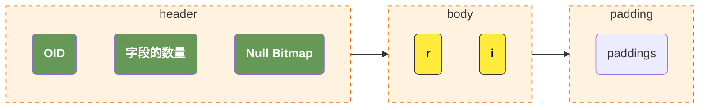
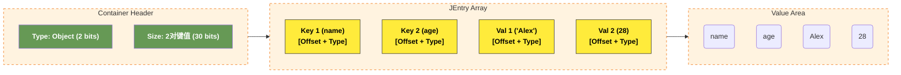

# pg和mysql在AI时代下的对比

从AI时代的视角再来看看pg相对于mysql的优势，在 Web2 时代，通常我们在做架构设计的时候，会遵循一个原则：在查询SQL时基于最小查询信息原则尽量去减小数据库的压力。通常来说，一个系统的性能瓶颈有95%的情况是出现在数据库，而类似于接口之类的无状态服务往往不会成为性能瓶颈。但是到了 AI 时代，这个原则却不一定适用了。

因为核心矛盾变了：AI 时代的数据和传统的电商/EPR等系统完全不一样。

在传统业务（如电商、社交）中，数据库里流转的往往是 int、varchar(50) 这种极小的数据。但在 AI/RAG 场景下，数据长这样：

- 一个 content 字段（知识块文本）：2000 字，约 4KB - 8KB。
- 一个 embedding 字段（高维向量）：1536 个 float32，固定 6KB。

>这里很值得注意的是，在目前主流的LLM架构下，通常向量的维度是非常之多的，即使在进行 quantation 之后依然是一个非常大的开销。
>
>如果我们按照之前的方式，先让数据库把数据捞出来，再在应用层做过滤、树形组装和相似度计算。我们来算一下把 1 万条 潜在候选数据从数据库传输到应用层的物理开销：
>
>网络传输数据量 = 10000 * (6KB + 4KB) = 100MB
>
>在这个场景下，系统的性能瓶颈根本不是数据库的 CPU，而是内网网卡的网速和序列化/反序列化的 CPU 损耗。
基于以上的这个场景，其实更大的增加了 pg 和 mysql 的差距，现在在 AI INFRA 相关的架构设计中，基本 pg 已经完全取代了 mysql 的生态位。

在现代大数据和 AI 场景下，“让计算向数据移动（Move Code to Data）” 的性能，远远超过 “让数据向计算移动（Move Data to Code）”。

因为 AI 时代应用的特征通常是：QPS 并不极端高（因为大模型吐字速度本来就慢，接口并发天然受限），但单次请求的数据量极大、逻辑极复杂（需要权限+全文本+向量+状态机）。

# 复合类型，jsonb以及doris中的variant

在我们的pg中，支持了两个非常特殊的类型：复合类型（`Composite Types`）和 `jsonb`，它们都允许我们在单列中存储多个结构化的子字段。

例如，假设我们现在需要表示一个复数，那么我们需要同时表示实部和虚部，而传统的数据库如果没有对复合类型的支持，就必须定义 `r` 和 `i` 两列来表示我们的实部和虚部，而利用复合类型我们可以如下创建类型：

```sql
CREATE TYPE complex AS (
    r double precision,
    i double precision
);
```

而 `jsonb` 的使用则更加的松散：它是完全无预先定义的 schema 的，只是一个内置的类型：

```sql
-- 创建表，字段直接声明为 jsonb
CREATE TABLE test_complex (
    id serial PRIMARY KEY,
    val jsonb
);

INSERT INTO test_complex (val) VALUES ('{"r": 1.2, "i": 3.4}');
```

这里有意思的是，我们可以通过 `CHECK` 机制来为我们加上类型检查逻辑，**当然，我们需要注意的是当我们利用下面这个逻辑时我们已经丧失了使用 jsonb 的意义，因为它完全丧失了动态性。**

```sql
CREATE TABLE test_complex_strict (
    id serial PRIMARY KEY,
    val jsonb CHECK (
        -- 确保它是一个 JSON 对象
        jsonb_typeof(val) = 'object' 
        -- 确保它包含且仅包含 r 和 i 两个键
        AND (SELECT count(*) FROM jsonb_object_keys(val) AS k WHERE k IN ('r', 'i')) = 2
        -- 确保 r 和 i 的值必须是数字
        AND jsonb_typeof(val->'r') = 'number'
        AND jsonb_typeof(val->'i') = 'number'
    )
);
```

如果一定要这么做，我们可以使用类似于 `pg_jsonschema` 插件来做这个逻辑校验：

```sql
-- 需要先开启插件：CREATE EXTENSION pg_jsonschema;

CREATE TABLE sales (
    id serial PRIMARY KEY,
    -- 使用插件提供的 json_matches_schema 函数做强校验
    complex_val jsonb CHECK (
        json_matches_schema(
            '{
                "type": "object",
                "properties": {
                    "r": { "type": "number" },
                    "i": { "type": "number" }
                },
                "required": ["r", "i"],
                "additionalProperties": false
            }',
            complex_val
          )
    )
);
```

## 复合类型

### 复合类型的存储

在 PostgreSQL 的底层世界里，复合类型和传统的“行（Row/Tuple）”在代码实现上几乎是完全复用的。

当我们定义如下复合类型时：

```sql
CREATE TYPE complex AS (r double precision, i double precision);
```

而它整个的数据结构如下所示：



1. 头部元数据（Header）：每一个复合类型的值前面，都会有一个微型的头部，里面记录了：
    - 这个复合类型对应的 OID（对象标识符，用来去系统表 pg_type 里查结构）。
    - 字段的数量（这里是 2）。
    - 一个 Null Bitmap（空值位图）。如果 i 是 NULL，它不需要存具体数据，只需要在位图里标记第二位为 0。
2. **磁盘上直接存储两个连续的 double 类型**。
3. 填充数据到内存对齐。

可以发现，我们整个的数据结构和我们的C/C++在内存中的结构几乎完全一样 -- 除了多了一个额外的 header。

### 复合类型的索引

#### 表达式索引（Expression Index）

这是实际工业中最常用的做法。虽然复合类型在主表里是一个密不可分的二进制 struct 块，但 PG 允许我们只对这个 struct 内部的某个特定字段建索引。

```sql
-- 我们只针对复数的实部 r 建立一个标准的 B-Tree 索引
CREATE INDEX idx_complex_r ON test_complex ((val).r);
```

当我们执行的时候：

```sql
SELECT * FROM test_complex WHERE (val).r = 1.2;
```

1. 优化器一看到 (val).r，发现它命中了 idx_complex_r 索引。
2. 此时，PG 根本不需要去翻主表的二进制块。它直接去 B-Tree 索引里进行二分查找。
3. 索引叶子节点直接吐出主表的 ctid（物理指针）。
4. 只有当确定这行数据要返回给用户时，PG 才会去主表把整条记录（包括 struct）捞出来。这和对普通列建索引的性能完全没有任何区别。

#### 行级 B-Tree 索引（Row-level B-Tree）

我们也可以全行索引：

```sql
-- 直接对整个 complex 对象建 B-Tree 索引
CREATE INDEX idx_complex_all ON test_complex (val);
```

但是，此时我们搜索就会有额外的限制，例如下面的索引才可以使用我们的索引。因为在建索引时是按照 struct 结构体来排序的。

```sql
SELECT * FROM test_complex WHERE val = '(1.2, 3.4)'::complex;
```

## jsonb的存储和查询

### 存储

jsonb（JSON Binary）在主表里同样是一个连续的二进制块。为了实现不反序列化就能快速跳过（Skip）无关字段、随机访问 O(1) 寻找 Key 的能力，它的内部数据分为三个部分：Container Header（容器头）、JEntry（元素索引区） 和 Value Area（原始数据区）。

以 JSON { "name": "Alex", "age": 28 } 为例，它在物理磁盘上的存储结构长这样：



- Container Header（32位）：前 2～3 位标识这个容器是 Object（对象）还是 Array（数组）；后面的位数记录里面包含多少个元素
- JEntry（元素元数据区，每个32位）：这可以被看做jsonb内部的索引：
    - 3位 类型标识：标记这个值的类型，按照json的规范，我们总共支持 String、Number、True、False 还是 Null 这几个类型。
    - 29位 偏移量：记录该数据在第三部分“Value Area”中的结束位置指针（通过减去上一个元素的结束位置，就能直接得到当前元素的长度）。
- Value Area（连续的字节流）：这里没有任何空格、换行或冒泡的逗号。所有的 Key 都会在这里被强制按照字典序（Lexicographical Order）重排并连续存储。紧接着存储所有的 Value。

### 查询

#### B-Tree 索引

这个和我们刚才提到的复杂对象的表达式索引是一样的：

```sql
-- 针对 JSON 内的特定路径创建标准 B-Tree
CREATE INDEX idx_user_age ON users (((info ->> 'age')::int));

-- 完美命中索引
SELECT * FROM users WHERE (info ->> 'age')::int > 18;
```

#### GIN 倒排索引

当我们的 JSON 格式变化很多时，我们可以直接使用 GIN 倒排索引：

```sql
-- 为整张表、整个 jsonb 列开启 GIN 索引
CREATE INDEX idx_users_info_gin ON users USING gin (info);
```

而查询时我们需要通过 JSONB 的查询操作符来查询，例如 `@>` 是包含操作符：

```sql
-- 这个查询会匹配所有包含 city == Beijing && tags.contains("developer") 的所有行
SELECT * FROM users WHERE info @> '{"city": "Beijing", "tags": ["developer"]}';
```

## doris中的variant

这里很容易让人联想到在 OLAP 数据库 doris 中的一个新的类型 `variant`，它是一个介于复合类型和jsonb中间的数据类型：

1. 它像复合类型一样，存在一个预先定义的schema，但是这个 schema 却不是强校验的。
2. 它可以像 jsonb 一样，动态的变换格式，并且存储引擎会自动的为我们生成最新的 schema，将那些常用的列抽取出来单独的存储，索引以提高性能。

而之所以 variant 支持了这种同时具有schema校验和动态类型灵活性的类型，而 mysql/pg 等数据库都没有支持这个类型，完全是因为 OLAP 数据库和 OLTP 数据库天然的区别引起的：

1. PG 的主表（Heap Page）是以 8KB 的行（Tuple） 为单位紧密排列在磁盘上的。行天然就是连续的，动态类型会严重破坏周围邻居行的物理连续性，造成高昂的页内行重排或行溢出成本。
2. 列式存储天然就是碎片化的。同一行的不同字段，在磁盘上原本就存在完全不同的文件/数据块（Segment）里。对doris来说：
    - 当 Variant 列里突然长出一个新 Key x 时，Doris 只需要在底层多创建一个专门存 x 的数据块文件就行了。
    - 其他原本存在的列（如 id、name）的物理存储完全不会受到任何干扰，因为它们在磁盘上是物理隔离的。

# 小数的存储逻辑

>double/float 之所以存在误差，根本原因在于我们需要使用二进制（计算机的进制）去存储十进制（常用的数学进制）的有限小数。
>
>问题在于，在十进制下的有限小数被转换为二进制之后很有可能不是一个有限小数，而此时由于计算机的存储限制我们将会丢失精度。
>在思考pg是如何存储 decimal/numeric 之前，我们其实需要了解分数和小数的关系。

对于一个最简分数，有两个重要的因素：

1. 进制
2. 分母

注意，这里我们发现它和分子完全没有任何关系，它是否可以被转换为一个有限小数取决于：最简分母拆开后的“所有质因数”，必须全部包含在“进制基数的质因数”里面。

以我们的10进制为例，我们的 10 可以被拆分为 2 * 5，也就是它的进制基数的质因数是 2 和 5，那么对于任意分母是这些质因数的乘积的小数，不论它的分子是什么，都可以转换为一个二进制的小数。

这其实是一个比较反直觉的结论，因为通常来说很多时候我们会认为是否可以表示为有限小数和分子有关，看看下面的例子：

1. 3 / 25 = 0.12
2. 9 / 25 = 0.36
3. 11 / 125 = 0.088

都是有限小数，而一旦分子包含了进制基数的质因数外的小数，那么这个小数都不能转换为一个有限小数，我们用 6 来作为例子：

1. 1 / 6 = 0.1666666667...
2. 5 / 6 = 0.8333333333...

由于这个十进制小数到二进制的小数转换的问题，所以实际上我们所谓的 float/double 表示小数，它的整体思路是将整个数字分为三个部分。我们以 double 类型为例子，通常来说，他们都严格占据固定的 64 个比特位：

1. 符号位 (Sign)占用1个bit。
2. 指数位 (Exponent)占用 11 个 bit。
3. 尾数位 (Mantissa / Significand)占用 52 个 bit。

**这里非常重要的一点是，不论一个数字的大小，它都会被转换为科学计数法，那么这三个数字的含义如下：**

1. 最高位为符号位。
2. `[62:52]` 表示科学计数法中的E，也就是我们这里表示是 2 的 E 次幂。
3. `[51:0]` 表示我们的科学计数法中的数字。

我们的尾数其实是按照如下的逻辑：

1. 最高位表示 2^-1 对应的数；
2. 次高位表示 2^-2 对应的数；
3. 依次类推直到最最低位。

最后，将这些所有的数字加起来得到我们实际表达的数，再乘以我们的指数位表示的值即可。我们可以使用 `0.1` 这个看似简单的例子来说明，这个数字等于 1 / 10，而这里非常容易出现误解的点是，他可以在二进制下表示为一个有限小数。

而实际上来说：它的分母等于 2 * 5，而这不满足我们前面提到的**分母是进制基数的质因数的乘积**，也就是它其实不能被转换为一个二进制的有限小数。
那么，实际上他的double形式是如下表示的：

1. 首先，我们需要知道 2^-3 == 0.125，2^-4 == 0.0625。而 0.125 大于 0.1，所以我们第一位只能是表示 2^-4 的位，此时我们剩下 0.0375；
2. 按照上面的逻辑，我们找到下一个数字 2^-5 == 0.03125，此时我们剩下 0.00625；
3. 下一个数字是 2^-8 == 0.00390625，此时我们剩下 0.00625 - 0.00390625 == 0.00234375；
4. 依次类推，直到达到我们的浮点数的精度耗尽。
   此时，我们得到了一个这样的数字：

```
1bit          11bits                                       52bits
+---+-------------+----------------------------------------------------------------------+
| 0 | 01111111011 | 1001100110011001100110011001100110011001100110011010                 |
+---+-------------+----------------------------------------------------------------------+
 符号      指数                                     尾数
```

我们再按照反向的逻辑把他组装起来，就得到了一个近似于 `0.1` 的数字，此时出现精度丢失。

## pg是如何精确表示小数的

现在，我们可以开始去学习pg是如何去精确的表示我们的小数的了。

它的思想也很简单，既然我用2进制表示10进制的数字会出现精度丢失，那么我直接用一个10000进制的数字来表示10进制不就行了吗？

这里结合我们之前的结论我们会知道，10作为分母的质因数是 2 和 5，而它是10000的质因数的子集，也就是说：任意10进制下的有限小数，在10000进制下一定也是一个有限小数。

而它的问题在于，硬件层面是二进制的，我们只能在软件层面模拟这个计算逻辑。

>补充说明：选择10000进制的原因是在内存利用率和uint16的最大存储容量中间的一个权衡。
>
>使用1000进制内存利用率低，使用100000进制则超过了uint16的上限。

## 例子

我们以 `12345678.0009` 这个数字作为例子：

1. `pg` 在底层，将一个十进制表示的数字，按照四位数字拆分，并将拆分后的数字存储到一个uint16的数字中。这里它被拆分为 `1234`，`5678`，`0009` 四个不同的数字。这里指的注意的是，我们在写SQL的时候，其实这个数字是以字符串形式传递到PG中，否则我们在传输过程中已经丢失了精度了。
2. 随后，我们将这三个数字存储在一个数组中，那么此时它的结构应该是如下的 `[1234, 5678, 0009]`；
3. 那么很明显，我们现在需要做的就是：
   1. 记录我们的小数点在哪个位置。
   2. 记录我们的符号。

而实际上pg也是这么做的，它在内部声明了一个如下的结构体：

```c++
typedef struct NumericData
{
    int16       weight;             /* 权重：小数点相对于数组第一个元素的位置 */
    uint16      sign_dscale;        /* 符号位 (正/负/NaN) + 声明的小数位数 */
    NumericDigit *digits;           /* 指向一个由 uint16 组成的数字数组 */
} NumericData;
```

那么，我们这个数字此时在内存中应该是这样的：

```c++
data.weight = 1;
data.sign_dscal = 0x0004;
data.digits = [1234, 5678, 0009];
```

这里我们的结构是：

1. `data.weight == 1`，表示了我们在数组中的权重，它往左走时 weight++，往右走时 weight--。也就是说，`data.digits[0]` 的权重是1，表示数字表示的是 `1234` * 10000^1，而右边的 `data.digits[2]` 的权重是 -1，表示的是 `0009` * 10000^-1；
2. `data.digits` 同时表示了符号和生命的小数位数：
   - 高位部分表示正数（NUMERIC_POS = 0x0000）
   - 低位部分 dscale = 4，表示人类明确声明了4位十进制小数（即 .0009）

# pg和mysql中对于变长字段的处理

关于变长列在mysql和pg中的性能分析，我们首先需要知道他们在内部更新数据的机制。

通常来讲，定长列比变长列的性能更高的原因主要是：

在数据库中，出于磁盘IO的使用率和性能等因素，我们同表的不同行通常在磁盘上紧密的排列在一起。

此时，对于定长的列我们已经预先知道了它的长度，那么我们在磁盘的结构上是可预测的：超长的会被截断或拒绝写入，过短的会被填充到预定义的长度。这保证了在更新时我们整个表的结构不会发生任何的变动，这是我们最大的性能杀手。

然而，对于变长的数据，我们的解决方案并不多：

1. 列不存实际数据，只存一个指向实际磁盘数据的指针，由于指针的长度是可以预测的，所以它可以保证更新时表结构不发生变化。问题是，这引入了一个巨大的性能开销，在读取数据时，我们需要通过指针进行一次磁盘的随机跳转，这种磁盘随机IO使得性能可能直接被拖垮。
2. 预留一个足够长的空间，但是这不仅仅引入了大量的磁盘浪费，同时没有真正的实现所谓的变长存储。

而这一切的源头其实都在于 mysql 的 InnoDB 引擎的一个特性，数据原地更新（In-place Update）。

InnoDB 在更新数据时，它的 MVCC 机制是通过 Undo Log 和和主表数据里实现的。它维护了一个数据结构，在 Undo Log 中记录了那些历史数据，在主表的Page页中记录了最新版本的数据。

而 pg 则使用了完全不同的方式，pg 中将新行的数据存储到了一个全新的位置（新的Tuple），而老的数据则直接停留在原来的磁盘位置，这意味着 pg 根本不需要考虑在数据变长时会引起磁盘结构的变化。

当然，这也引入了很多其他的问题，pg 额外引入了HOT (Heap-Only Tuple)，VACUUM 异步垃圾回收等方式来解决。

# json索引的一个坑

在我们的 `JSON` 使用的过程中，有一个关于索引逻辑的坑我们可以留意，我们先建一个表：

```sql
CREATE TABLE jsonb_test_01(
	id int,
    data jsonb
);
```

我们向数据库写入一些随机的数据：

```sql
INSERT INTO jsonb_test_01 (id, data)
SELECT 
    g.id,
    jsonb_build_object(
        'name', (
            SELECT string_agg(chr((65 + (random() * 25))::int), '') 
            FROM generate_series(1, 6 + (g.id * 0))
        ),
        'age', (18 + (random() * 42))::int
    )
FROM generate_series(1, 100000) AS g(id);

-- 此外，我们写入一条我们的测试数据
INSERT INTO jsonb_test_01(id, data) values(999999, '{"age": 19, "name": "hello jsonb"}');
```

此时，我们建立一个如下的索引：

```sql
CREATE INDEX ON jsonb_test_01 USING btree (jsonb_extract_path_text(data, 'name'));
```

此时我们查看下面的SQL的执行计划：

```sql
EXPLAIN ANALYSE VERBOSE
SELECT *
FROM jsonb_test_01
WHERE DATA->>'name' = 'hello jsonb';
```

得到输出

```
+-----------------------------------------------------------------------------------------------------------------------+
| QUERY PLAN                                                                                                            |
|-----------------------------------------------------------------------------------------------------------------------|
| Seq Scan on public.jsonb_test_01  (cost=0.00..3370.00 rows=500 width=47) (actual time=0.030..9.580 rows=1.00 loops=1) |
|   Output: id, data                                                                                                    |
|   Filter: ((jsonb_test_01.data ->> 'name'::text) = 'hello jsonb'::text)                                               |
|   Rows Removed by Filter: 100000                                                                                      |
|   Buffers: shared hit=1870                                                                                            |
| Planning Time: 0.073 ms                                                                                               |
| Execution Time: 9.618 ms                                                                                              |
+-----------------------------------------------------------------------------------------------------------------------+
```

1. `Seq Scan on public.jsonb_test_01` 表示我们顺序扫描表。
2. `Rows Removed by Filter: 100000` 表示我们扫描过程中有10万行被过滤掉了。
3. `Buffers: shared hit=1870` 表示扫描了 1870 个 Page。

而我们如下的SQL：

```sql
EXPLAIN ANALYSE VERBOSE
SELECT *
FROM jsonb_test_01
WHERE (jsonb_extract_path_text(DATA, 'name')) = 'hello jsonb';
```

则输出

```
+--------------------------------------------------------------------------------------------------------------------------------------------------------------------+
| QUERY PLAN                                                                                                                                                         |
|--------------------------------------------------------------------------------------------------------------------------------------------------------------------|
| Index Scan using jsonb_test_01_jsonb_extract_path_text_idx on public.jsonb_test_01  (cost=0.42..8.44 rows=1 width=47) (actual time=0.041..0.042 rows=1.00 loops=1) |
|   Output: id, data                                                                                                                                                 |
|   Index Cond: (jsonb_extract_path_text(jsonb_test_01.data, VARIADIC '{name}'::text[]) = 'hello jsonb'::text)                                                       |
|   Index Searches: 1                                                                                                                                                |
|   Buffers: shared hit=4                                                                                                                                            |
| Planning Time: 0.163 ms                                                                                                                                            |
| Execution Time: 0.082 ms                                                                                                                                           |
+--------------------------------------------------------------------------------------------------------------------------------------------------------------------+
```

1. `Index Scan using jsonb_test_01_jsonb_extract_path_text_idx` 表示我们使用了索引 `jsonb_test_01_jsonb_extract_path_text_idx`。
2. `Buffers: shared hit=4` 表示我们只使用了四个 Page。

**那么问题来了：`(jsonb_extract_path_text(DATA, 'name'))` 和 `DATA->>'name'` 这看起来不是一样的吗，为什么前者走索引，后者则不走索引呢？**

这是因为，对于 PostgreSQL 的表达式索引（Expression Index）而言，优化器是一个极其死板的“文本匹配复读机”。它在做索引匹配时，要求查询条件里的函数/表达式，必须与 `CREATE INDEX` 时写的表达式在语法和语义上“完全长得一模一样”。

而它之所以要求完全匹配，而不是在生成逻辑执行计划时帮我们做这个转换，是因为：在很多人的直觉里，`->>` 只是 `jsonb_extract_path_text` 的一个别名（语法糖）。**但在 PG 的底层设计中，它们是完全独立的两个数据库对象。**

- `jsonb_extract_path_text(...)` 是一个**内核函数**。
- `->>` 是一个**操作符（Operator）**。

而 pg 甚至支持重载操作符和函数：

```sql
-- 我们重载了这个操作符
CREATE OPERATOR ->> ( ... PROCEDURE = my_custom_json_function );
```

在这种情况下，这里本身就不是一个等价的操作，所以自然我们没有办法去做自动的转换。

如果我们想要使用这个索引，我们在家里索引的时候就必须按照合理的规范去建立索引：

```sql
-- 注意这里的索引创建语句，我们的索引表达式是被包括在一个双括号内的
-- ((${expression}))
-- 这是为了区分我们的expression和普通的字段索引
-- 因为普通的字段索引是使用 (col1, col2) 的形式。
CREATE INDEX ON jsonb_test_01 USING btree (((data)->>'name'));
```

此时我们在执行如下分析语句：

```sql
EXPLAIN ANALYSE VERBOSE
SELECT *
FROM jsonb_test_01
WHERE DATA->>'name' = 'hello jsonb';
```

我们得到了：

```
+-------------------------------------------------------------------------------------------------------------------------------------+
| QUERY PLAN                                                                                                                          |
|-------------------------------------------------------------------------------------------------------------------------------------|
| Bitmap Heap Scan on public.jsonb_test_01  (cost=12.17..1143.00 rows=500 width=47) (actual time=0.026..0.027 rows=1.00 loops=1)      |
|   Output: id, data                                                                                                                  |
|   Recheck Cond: ((jsonb_test_01.data ->> 'name'::text) = 'hello jsonb'::text)                                                       |
|   Heap Blocks: exact=1                                                                                                              |
|   Buffers: shared hit=1 read=2                                                                                                      |
|   ->  Bitmap Index Scan on jsonb_test_01_expr_idx  (cost=0.00..12.04 rows=500 width=0) (actual time=0.021..0.021 rows=1.00 loops=1) |
|         Index Cond: ((jsonb_test_01.data ->> 'name'::text) = 'hello jsonb'::text)                                                   |
|         Index Searches: 1                                                                                                           |
|         Buffers: shared read=2                                                                                                      |
| Planning:                                                                                                                           |
|   Buffers: shared hit=17 read=1                                                                                                     |
| Planning Time: 0.231 ms                                                                                                             |
| Execution Time: 0.039 ms                                                                                                            |
+-------------------------------------------------------------------------------------------------------------------------------------+
```

值得注意的是，我们这个索引是走的 `Bitmap Heap Scan`。


