# mysql/pg中的复制逻辑

在了解 mysql 和 pg 在进行主从复制逻辑之前，我们必须要知道他们在架构上的重大区别。

宏观上来讲，mysql 的架构（和主从复制逻辑相关的）会分为两个层级，分别是 `server` 和 `存储引擎`，它的实际架构如下图所示：

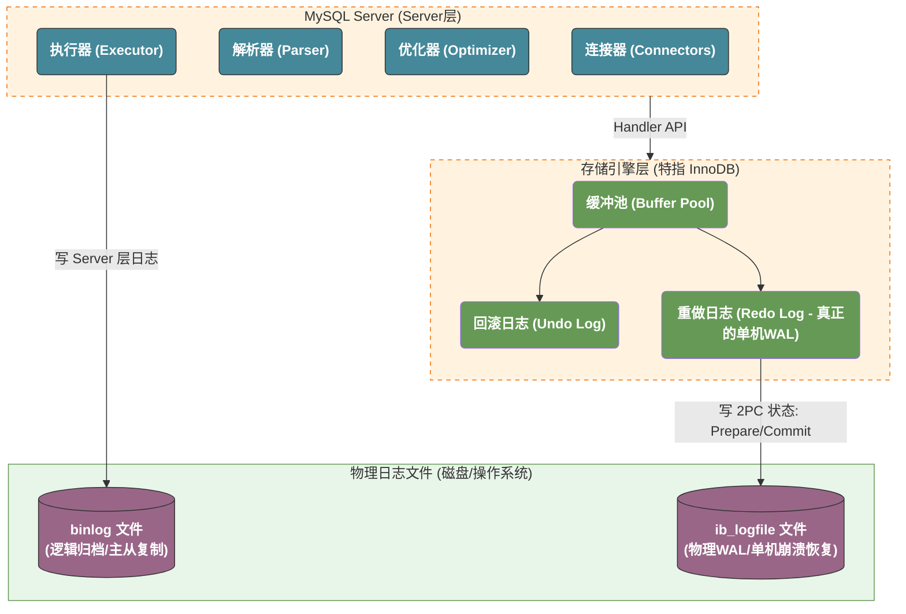

而 `pg` 则简单很多：它只有一个存储引擎：

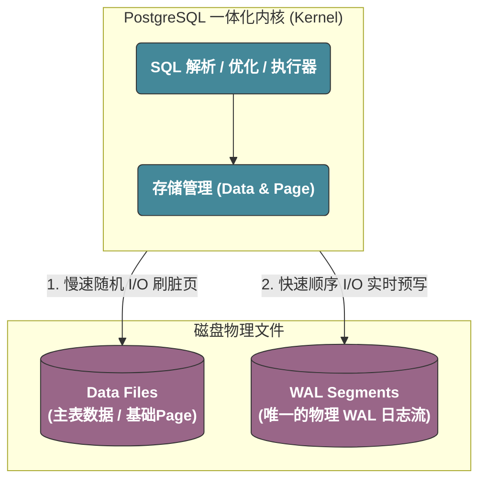

**从某种角度来说，`mysql` 的这个看起来很奇怪的架构其实是一个时代的遗产。早期大家追求面向对象，可拔插等逻辑，但是随着时代的发展，我们当我们需要不同的底层存储逻辑时，我们往往也需要提供完全不同的语法。这也是为什么像 `MyIASM` 等存储引擎已经在事实上接近于被淘汰了。** 

## InnoDB的存储逻辑

### Redo Log

Redo Log 是 InnoDB 引擎特有的**物理单机 WAL 日志**。它记录的是“对某个数据页做了什么物理修改”（例如：在 10 号表空间的第 5 号页，偏移量 100 处写入了字节 `0xFF`）。

我们知道，为了追求极致的性能，MySQL 修改数据时是先在内存的 **Buffer Pool（缓冲池）** 中直接修改。此时，内存中的页变成了“脏页”。 如果此时机器突然断电，内存中的脏页还没来得及刷入磁盘，数据就彻底丢失了。

为了防止断电数据丢失，又不想每次修改都进行缓慢的磁盘随机 I/O（直接刷 16KB 的数据页），InnoDB 采用了 WAL 机制：

- 在返回客户端成功之前，先将这次修改以 **物理日志（Redo Log）** 的形式**顺序追加写入**磁盘。
- **崩溃恢复**：如果数据库意外崩溃，重启时，InnoDB 会读取磁盘上的 Redo Log，把那些已经在内存改了、但还没来得及刷盘的数据页重新计算并写回磁盘，把状态“硬顶回去”。

### Undo Log

Undo Log 是 InnoDB 内部的**逻辑日志**。它记录的是与我们执行的 SQL 相反的逆向操作。

- 当我们执行 `INSERT` 时，Undo Log 会记录一笔对应的 `DELETE`。
- 当我们执行 `UPDATE` 把 age 从 18 改为 19 时，Undo Log 会记录一笔“把 age 改回 18”的旧值镜像。

它的核心职责有两个：

1. **实现事务回滚（原子性）**：如果一个事务执行到一半，我们突然执行了 `ROLLBACK`，或者系统发生报错、触发死锁判定导致事务失败，InnoDB 就会顺着这条执行链条，去读对应的 Undo Log，把刚才改到一半的数据“全部吐出来”，恢复原状。
2. **实现多版本并发控制（MVCC - 隔离性）**： 由于 MySQL 采用 **In-place Update（原地更新）**，当一个事务在内存里把某一行的数据覆盖修改后，其他正在并发读取这行数据的事务该怎么办？ 此时，读事务**不会去读被修改后的新数据**，而是顺着行记录里隐藏的**回滚指针（`DB_ROLL_PTR`）**，去 Undo Log 里捞出该行修改前的历史老版本数据（快照读）。这实现了“读写不冲突”的并发体验。

## mysql的binlog

> `binlog`  是 mysql 中的一个特殊日志。从事实上来讲，`InnoDB` 已经是目前唯一在广泛流通的存储引擎。然而，`binlog` 却归属于 `server` 层而不是存储引擎层。

它主要记录的是**逻辑变更**。在现代生产环境默认的 **ROW 模式** 下，它记录的是“**行数据的最终变化镜像**”。举个例子：当我们执行一条更新语句时：

- **物理 Redo Log 的视角**：在 3 号表空间 5 号页的偏移量 100 处写下二进制 `0x4A`。
- **逻辑 Binlog 的视角**：在 `users` 表里，把 `id=1` 这一行的 `name` 字段改成了 'Tom'。

前者和 `InnoDB` 存储引擎强相关，因为不同的存储引擎的结构完全不同。而或者则是一个所有的存储引擎通用的描述。

## mysql和pg的复制逻辑

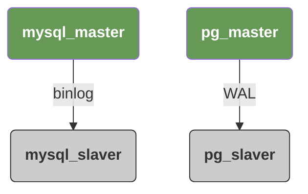

## mysql不使用WAL做主从复制的原因

1. mysql 的 WAL 是存储引擎层的日志，也就是我们的 Redo Log，而这个日志本身并不长期存储，如果长期存储的话相当于是我们需要存放实际数据，binlog，WAL日志三个部分，成本过于高昂。
2. **WAL日志中记录的不是逻辑日志，而是物理日志。**也就是说，它并不是**将ID=0x10000的那一行更新的name列更新为 `mysql`**，而是**将3号表空间的第5个Page中偏移量为 `[0x100, 0x104]` 的五个字节修改为 `mysql`**。这意味着，我们在复制前后的物理结构必须完全一致。但是在 MySQL 架构下，这几乎不可能，具体的原因比较复杂，我们后续单独解释。
3. mysql 为了对存储引擎实现可插拔，在设计层面隔离了WAL日志和binlog日志，这意味着如果我们使用WAL，我们直接丧失了存储引擎的替换能力。

## mysql无法使用WAL的原因

现在的问题在于，`InnoDB` 存储引擎已经成为了唯一可用的存储引擎，那为什么在最新版本的 mysql 中仍然没有使用WAL日志去做主从复制呢？而从它这里延伸出来的一些其他的数据库：`AWS Aurora`/`PolarDB` 都已经彻底废除 Binlog，直接在从库重放 InnoDB 的物理 Redo Log。

根本原因在于：**物理流复制要求主库与从库的底层磁盘物理页面（Page Layout）必须保持 100% 绝对一致。然而在 MySQL 的原生架构下，这在工程上几乎是一件不可能完成的任务。**

### 存储成本

Redo Log 记录的是极细粒度的字节覆写，里面包含大量重复的、中间状态的物理修改。如果为了满足主从复制和历史归档而将 Redo Log 改造成追加流，其体积会随着高并发写入发生恐怖的物理暴胀。同时存放实际数据文件、全量 Binlog、以及无限增长的物理 Redo Log，其磁盘和 I/O 成本在工业生产中是不可接受的。

### in-place update 引入的并发时序问题

> InnoDB 的灵魂是 **In-place Update（原地更新）**，且数据本身就是 B+Tree（聚簇索引）。

在一个高并发写入的系统里，一个 16KB 的物理页（Page）什么时候发生**页分裂（Page Split）**、或者什么时候发生**页合并（Page Merge）**，是由极其微观的 **CPU 线程调度和并发锁时序** 决定的。

假设主从库的初始状态完全一致，主库并发进来了 100 个 `INSERT` 事务。由于主库多线程并发的微观锁竞争，A 页满了，触发了页分裂，B+Tree 结构发生物理改变。

如果从库去重放物理日志，由于网络延迟、硬件抖动、或者从库上正在执行业务的只读慢查询，导致从库的微观并发时序与主库出现了百万分之一秒的偏差，从库可能就不会在同一时间点触发页分裂。

一旦分裂时机错位，我们整体的 Layout 发生变化，整个同步将直接异常。

**pg通过引入 `Lehman & Yao` 和 `Hot Standby` 等机制解决了这个问题。然而，我们关注的是，为什么 mysql 不能引入这些机制来解决这个问题呢？**

**MySQL 无法使用物理复制的根本原因，在于 InnoDB 16KB 物理页采用了“乱序物理存储 + 有序链表/页目录指针”的强耦合微观设计。这种设计导致页面内部的控制块（Slot）与真实数据之间存在极其脆弱的微观时序依赖。在从库重放时，一旦控制块先于数据页落盘、或读线程在重放间隙切入，就会直接引发物理内存解析错位而导致进程崩溃。**

**而 PostgreSQL 采用的“顶端线型指针数组 + 末端倒序追加”的纯物理页拓扑，使得页面内部天然具备单向原子可见性。配合 B-link 树的右指针，它在纯物理字节层面就完成了并发安全的自闭环，从而使得单线程无脑物理覆写在工程上变得完全可行。**

### 版本升级与存储格式的问题

如果使用物理 Redo Log，只要 MySQL 官方在跨大版本时，对底层的 16KB 页结构、索引控制位或者 B+Tree 节点格式进行了一丁点像素级的微调（例如某个控制字段从 2 字节扩容到 4 字节），那么整个同步将直接异常。

**需要注意的是，由于 pg 使用了 WAL 日志实现，所以 pg 也遵循这个原则 -- 不允许滚动更新**。然而，滚动更新是一个不可或缺的特性，所以 pg 使用了一个非常特殊的方式来处理这个问题：它在内核里提供了一个类似于mysql的binlog的 `逻辑复制（Logical Replication）`。

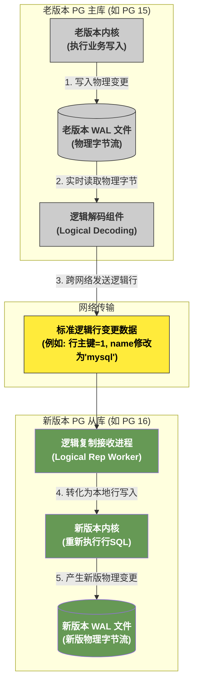

而基于这个逻辑，我们可以从运维的层面去解决这个问题：

1. 部署新版本的PG集群。
2. 通过逻辑复制工具，将老版本的PG数据同步的复制到新版本PG。
3. 在一个合适的时间节点，老版本PG停止对外服务。
4. 等待剩余数据全部复制完毕，使用新版本PG对外提供服务。

虽然，我们仍然存在短暂的服务不可用，但是已经比完全无法升级要好很多了。

# pg和mysql在AI时代下的对比

从AI时代的视角再来看看pg相对于mysql的优势，在 Web2 时代，通常我们在做架构设计的时候，会遵循一个原则：在查询SQL时基于最小查询信息原则尽量去减小数据库的压力。通常来说，一个系统的性能瓶颈有95%的情况是出现在数据库，而类似于接口之类的无状态服务往往不会成为性能瓶颈。但是到了 AI 时代，这个原则却不一定适用了。

因为核心矛盾变了：AI 时代的数据和传统的电商/EPR等系统完全不一样。

在传统业务（如电商、社交）中，数据库里流转的往往是 int、varchar(50) 这种极小的数据。但在 AI/RAG 场景下，数据长这样：

- 一个 content 字段（知识块文本）：2000 字，约 4KB - 8KB。
- 一个 embedding 字段（高维向量）：1536 个 float32，固定 6KB。

>这里很值得注意的是，在目前主流的LLM架构下，通常向量的维度是非常之多的，即使在进行 quantation 之后依然是一个非常大的开销。
>
>如果我们按照之前的方式，先让数据库把数据捞出来，再在应用层做过滤、树形组装和相似度计算。我们来算一下把 1 万条 潜在候选数据从数据库传输到应用层的物理开销：
>
>网络传输数据量 = 10000 * (6KB + 4KB) = 100MB
>
>在这个场景下，系统的性能瓶颈根本不是数据库的 CPU，而是内网网卡的网速和序列化/反序列化的 CPU 损耗。
基于以上的这个场景，其实更大的增加了 pg 和 mysql 的差距，现在在 AI INFRA 相关的架构设计中，基本 pg 已经完全取代了 mysql 的生态位。

在现代大数据和 AI 场景下，“让计算向数据移动（Move Code to Data）” 的性能，远远超过 “让数据向计算移动（Move Data to Code）”。

因为 AI 时代应用的特征通常是：QPS 并不极端高（因为大模型吐字速度本来就慢，接口并发天然受限），但单次请求的数据量极大、逻辑极复杂（需要权限+全文本+向量+状态机）。

# 复合类型，jsonb以及doris中的variant

在我们的pg中，支持了两个非常特殊的类型：复合类型（`Composite Types`）和 `jsonb`，它们都允许我们在单列中存储多个结构化的子字段。

例如，假设我们现在需要表示一个复数，那么我们需要同时表示实部和虚部，而传统的数据库如果没有对复合类型的支持，就必须定义 `r` 和 `i` 两列来表示我们的实部和虚部，而利用复合类型我们可以如下创建类型：

```sql
CREATE TYPE complex AS (
    r double precision,
    i double precision
);
```

而 `jsonb` 的使用则更加的松散：它是完全无预先定义的 schema 的，只是一个内置的类型：

```sql
-- 创建表，字段直接声明为 jsonb
CREATE TABLE test_complex (
    id serial PRIMARY KEY,
    val jsonb
);

INSERT INTO test_complex (val) VALUES ('{"r": 1.2, "i": 3.4}');
```

这里有意思的是，我们可以通过 `CHECK` 机制来为我们加上类型检查逻辑，**当然，我们需要注意的是当我们利用下面这个逻辑时我们已经丧失了使用 jsonb 的意义，因为它完全丧失了动态性。**

```sql
CREATE TABLE test_complex_strict (
    id serial PRIMARY KEY,
    val jsonb CHECK (
        -- 确保它是一个 JSON 对象
        jsonb_typeof(val) = 'object' 
        -- 确保它包含且仅包含 r 和 i 两个键
        AND (SELECT count(*) FROM jsonb_object_keys(val) AS k WHERE k IN ('r', 'i')) = 2
        -- 确保 r 和 i 的值必须是数字
        AND jsonb_typeof(val->'r') = 'number'
        AND jsonb_typeof(val->'i') = 'number'
    )
);
```

如果一定要这么做，我们可以使用类似于 `pg_jsonschema` 插件来做这个逻辑校验：

```sql
-- 需要先开启插件：CREATE EXTENSION pg_jsonschema;

CREATE TABLE sales (
    id serial PRIMARY KEY,
    -- 使用插件提供的 json_matches_schema 函数做强校验
    complex_val jsonb CHECK (
        json_matches_schema(
            '{
                "type": "object",
                "properties": {
                    "r": { "type": "number" },
                    "i": { "type": "number" }
                },
                "required": ["r", "i"],
                "additionalProperties": false
            }',
            complex_val
          )
    )
);
```

## 复合类型

### 复合类型的存储

在 PostgreSQL 的底层世界里，复合类型和传统的“行（Row/Tuple）”在代码实现上几乎是完全复用的。

当我们定义如下复合类型时：

```sql
CREATE TYPE complex AS (r double precision, i double precision);
```

而它整个的数据结构如下所示：

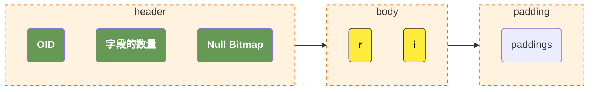

1. 头部元数据（Header）：每一个复合类型的值前面，都会有一个微型的头部，里面记录了：
    - 这个复合类型对应的 OID（对象标识符，用来去系统表 pg_type 里查结构）。
    - 字段的数量（这里是 2）。
    - 一个 Null Bitmap（空值位图）。如果 i 是 NULL，它不需要存具体数据，只需要在位图里标记第二位为 0。
2. **磁盘上直接存储两个连续的 double 类型**。
3. 填充数据到内存对齐。

可以发现，我们整个的数据结构和我们的C/C++在内存中的结构几乎完全一样 -- 除了多了一个额外的 header。

### 复合类型的索引

#### 表达式索引（Expression Index）

这是实际工业中最常用的做法。虽然复合类型在主表里是一个密不可分的二进制 struct 块，但 PG 允许我们只对这个 struct 内部的某个特定字段建索引。

```sql
-- 我们只针对复数的实部 r 建立一个标准的 B-Tree 索引
CREATE INDEX idx_complex_r ON test_complex ((val).r);
```

当我们执行的时候：

```sql
SELECT * FROM test_complex WHERE (val).r = 1.2;
```

1. 优化器一看到 (val).r，发现它命中了 idx_complex_r 索引。
2. 此时，PG 根本不需要去翻主表的二进制块。它直接去 B-Tree 索引里进行二分查找。
3. 索引叶子节点直接吐出主表的 ctid（物理指针）。
4. 只有当确定这行数据要返回给用户时，PG 才会去主表把整条记录（包括 struct）捞出来。这和对普通列建索引的性能完全没有任何区别。

#### 行级 B-Tree 索引（Row-level B-Tree）

我们也可以全行索引：

```sql
-- 直接对整个 complex 对象建 B-Tree 索引
CREATE INDEX idx_complex_all ON test_complex (val);
```

但是，此时我们搜索就会有额外的限制，例如下面的索引才可以使用我们的索引。因为在建索引时是按照 struct 结构体来排序的。

```sql
SELECT * FROM test_complex WHERE val = '(1.2, 3.4)'::complex;
```

## jsonb的存储和查询

### 存储

jsonb（JSON Binary）在主表里同样是一个连续的二进制块。为了实现不反序列化就能快速跳过（Skip）无关字段、随机访问 O(1) 寻找 Key 的能力，它的内部数据分为三个部分：Container Header（容器头）、JEntry（元素索引区） 和 Value Area（原始数据区）。

以 JSON { "name": "Alex", "age": 28 } 为例，它在物理磁盘上的存储结构长这样：

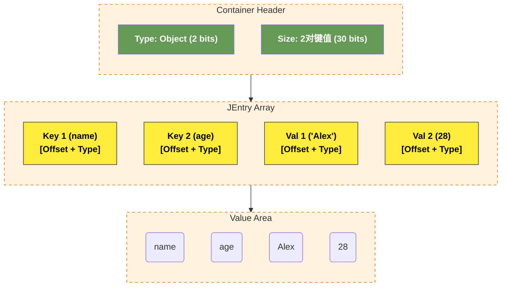

- Container Header（32位）：前 2～3 位标识这个容器是 Object（对象）还是 Array（数组）；后面的位数记录里面包含多少个元素
- JEntry（元素元数据区，每个32位）：这可以被看做jsonb内部的索引：
    - 3位 类型标识：标记这个值的类型，按照json的规范，我们总共支持 String、Number、True、False 还是 Null 这几个类型。
    - 29位 偏移量：记录该数据在第三部分“Value Area”中的结束位置指针（通过减去上一个元素的结束位置，就能直接得到当前元素的长度）。
- Value Area（连续的字节流）：这里没有任何空格、换行或冒泡的逗号。所有的 Key 都会在这里被强制按照字典序（Lexicographical Order）重排并连续存储。紧接着存储所有的 Value。

### 查询

#### B-Tree 索引

这个和我们刚才提到的复杂对象的表达式索引是一样的：

```sql
-- 针对 JSON 内的特定路径创建标准 B-Tree
CREATE INDEX idx_user_age ON users (((info ->> 'age')::int));

-- 完美命中索引
SELECT * FROM users WHERE (info ->> 'age')::int > 18;
```

#### GIN 倒排索引

当我们的 JSON 格式变化很多时，我们可以直接使用 GIN 倒排索引：

```sql
-- 为整张表、整个 jsonb 列开启 GIN 索引
CREATE INDEX idx_users_info_gin ON users USING gin (info);
```

而查询时我们需要通过 JSONB 的查询操作符来查询，例如 `@>` 是包含操作符：

```sql
-- 这个查询会匹配所有包含 city == Beijing && tags.contains("developer") 的所有行
SELECT * FROM users WHERE info @> '{"city": "Beijing", "tags": ["developer"]}';
```

## doris中的variant

这里很容易让人联想到在 OLAP 数据库 doris 中的一个新的类型 `variant`，它是一个介于复合类型和jsonb中间的数据类型：

1. 它像复合类型一样，存在一个预先定义的schema，但是这个 schema 却不是强校验的。
2. 它可以像 jsonb 一样，动态的变换格式，并且存储引擎会自动的为我们生成最新的 schema，将那些常用的列抽取出来单独的存储，索引以提高性能。

而之所以 variant 支持了这种同时具有schema校验和动态类型灵活性的类型，而 mysql/pg 等数据库都没有支持这个类型，完全是因为 OLAP 数据库和 OLTP 数据库天然的区别引起的：

1. PG 的主表（Heap Page）是以 8KB 的行（Tuple） 为单位紧密排列在磁盘上的。行天然就是连续的，动态类型会严重破坏周围邻居行的物理连续性，造成高昂的页内行重排或行溢出成本。
2. 列式存储天然就是碎片化的。同一行的不同字段，在磁盘上原本就存在完全不同的文件/数据块（Segment）里。对doris来说：
    - 当 Variant 列里突然长出一个新 Key x 时，Doris 只需要在底层多创建一个专门存 x 的数据块文件就行了。
    - 其他原本存在的列（如 id、name）的物理存储完全不会受到任何干扰，因为它们在磁盘上是物理隔离的。

# 小数的存储逻辑

>double/float 之所以存在误差，根本原因在于我们需要使用二进制（计算机的进制）去存储十进制（常用的数学进制）的有限小数。
>
>问题在于，在十进制下的有限小数被转换为二进制之后很有可能不是一个有限小数，而此时由于计算机的存储限制我们将会丢失精度。
>在思考pg是如何存储 decimal/numeric 之前，我们其实需要了解分数和小数的关系。

对于一个最简分数，有两个重要的因素：

1. 进制
2. 分母

注意，这里我们发现它和分子完全没有任何关系，它是否可以被转换为一个有限小数取决于：最简分母拆开后的“所有质因数”，必须全部包含在“进制基数的质因数”里面。

以我们的10进制为例，我们的 10 可以被拆分为 2 * 5，也就是它的进制基数的质因数是 2 和 5，那么对于任意分母是这些质因数的乘积的小数，不论它的分子是什么，都可以转换为一个二进制的小数。

这其实是一个比较反直觉的结论，因为通常来说很多时候我们会认为是否可以表示为有限小数和分子有关，看看下面的例子：

1. 3 / 25 = 0.12
2. 9 / 25 = 0.36
3. 11 / 125 = 0.088

都是有限小数，而一旦分子包含了进制基数的质因数外的小数，那么这个小数都不能转换为一个有限小数，我们用 6 来作为例子：

1. 1 / 6 = 0.1666666667...
2. 5 / 6 = 0.8333333333...

由于这个十进制小数到二进制的小数转换的问题，所以实际上我们所谓的 float/double 表示小数，它的整体思路是将整个数字分为三个部分。我们以 double 类型为例子，通常来说，他们都严格占据固定的 64 个比特位：

1. 符号位 (Sign)占用1个bit。
2. 指数位 (Exponent)占用 11 个 bit。
3. 尾数位 (Mantissa / Significand)占用 52 个 bit。

**这里非常重要的一点是，不论一个数字的大小，它都会被转换为科学计数法，那么这三个数字的含义如下：**

1. 最高位为符号位。
2. `[62:52]` 表示科学计数法中的E，也就是我们这里表示是 2 的 E 次幂。
3. `[51:0]` 表示我们的科学计数法中的数字。

我们的尾数其实是按照如下的逻辑：

1. 最高位表示 2^-1 对应的数；
2. 次高位表示 2^-2 对应的数；
3. 依次类推直到最最低位。

最后，将这些所有的数字加起来得到我们实际表达的数，再乘以我们的指数位表示的值即可。我们可以使用 `0.1` 这个看似简单的例子来说明，这个数字等于 1 / 10，而这里非常容易出现误解的点是，他可以在二进制下表示为一个有限小数。

而实际上来说：它的分母等于 2 * 5，而这不满足我们前面提到的**分母是进制基数的质因数的乘积**，也就是它其实不能被转换为一个二进制的有限小数。
那么，实际上他的double形式是如下表示的：

1. 首先，我们需要知道 2^-3 == 0.125，2^-4 == 0.0625。而 0.125 大于 0.1，所以我们第一位只能是表示 2^-4 的位，此时我们剩下 0.0375；
2. 按照上面的逻辑，我们找到下一个数字 2^-5 == 0.03125，此时我们剩下 0.00625；
3. 下一个数字是 2^-8 == 0.00390625，此时我们剩下 0.00625 - 0.00390625 == 0.00234375；
4. 依次类推，直到达到我们的浮点数的精度耗尽。
   此时，我们得到了一个这样的数字：

```
1bit          11bits                                       52bits
+---+-------------+----------------------------------------------------------------------+
| 0 | 01111111011 | 1001100110011001100110011001100110011001100110011010                 |
+---+-------------+----------------------------------------------------------------------+
 符号      指数                                     尾数
```

我们再按照反向的逻辑把他组装起来，就得到了一个近似于 `0.1` 的数字，此时出现精度丢失。

## pg是如何精确表示小数的

现在，我们可以开始去学习pg是如何去精确的表示我们的小数的了。

它的思想也很简单，既然我用2进制表示10进制的数字会出现精度丢失，那么我直接用一个10000进制的数字来表示10进制不就行了吗？

这里结合我们之前的结论我们会知道，10作为分母的质因数是 2 和 5，而它是10000的质因数的子集，也就是说：任意10进制下的有限小数，在10000进制下一定也是一个有限小数。

而它的问题在于，硬件层面是二进制的，我们只能在软件层面模拟这个计算逻辑。

>补充说明：选择10000进制的原因是在内存利用率和uint16的最大存储容量中间的一个权衡。
>
>使用1000进制内存利用率低，使用100000进制则超过了uint16的上限。

## 例子

我们以 `12345678.0009` 这个数字作为例子：

1. `pg` 在底层，将一个十进制表示的数字，按照四位数字拆分，并将拆分后的数字存储到一个uint16的数字中。这里它被拆分为 `1234`，`5678`，`0009` 四个不同的数字。这里指的注意的是，我们在写SQL的时候，其实这个数字是以字符串形式传递到PG中，否则我们在传输过程中已经丢失了精度了。
2. 随后，我们将这三个数字存储在一个数组中，那么此时它的结构应该是如下的 `[1234, 5678, 0009]`；
3. 那么很明显，我们现在需要做的就是：
   1. 记录我们的小数点在哪个位置。
   2. 记录我们的符号。

而实际上pg也是这么做的，它在内部声明了一个如下的结构体：

```c++
typedef struct NumericData
{
    int16       weight;             /* 权重：小数点相对于数组第一个元素的位置 */
    uint16      sign_dscale;        /* 符号位 (正/负/NaN) + 声明的小数位数 */
    NumericDigit *digits;           /* 指向一个由 uint16 组成的数字数组 */
} NumericData;
```

那么，我们这个数字此时在内存中应该是这样的：

```c++
data.weight = 1;
data.sign_dscal = 0x0004;
data.digits = [1234, 5678, 0009];
```

这里我们的结构是：

1. `data.weight == 1`，表示了我们在数组中的权重，它往左走时 weight++，往右走时 weight--。也就是说，`data.digits[0]` 的权重是1，表示数字表示的是 `1234` * 10000^1，而右边的 `data.digits[2]` 的权重是 -1，表示的是 `0009` * 10000^-1；
2. `data.digits` 同时表示了符号和生命的小数位数：
   - 高位部分表示正数（NUMERIC_POS = 0x0000）
   - 低位部分 dscale = 4，表示人类明确声明了4位十进制小数（即 .0009）

# pg和mysql中对于变长字段的处理

关于变长列在mysql和pg中的性能分析，我们首先需要知道他们在内部更新数据的机制。

通常来讲，定长列比变长列的性能更高的原因主要是：

在数据库中，出于磁盘IO的使用率和性能等因素，我们同表的不同行通常在磁盘上紧密的排列在一起。

此时，对于定长的列我们已经预先知道了它的长度，那么我们在磁盘的结构上是可预测的：超长的会被截断或拒绝写入，过短的会被填充到预定义的长度。这保证了在更新时我们整个表的结构不会发生任何的变动，这是我们最大的性能杀手。

然而，对于变长的数据，我们的解决方案并不多：

1. 列不存实际数据，只存一个指向实际磁盘数据的指针，由于指针的长度是可以预测的，所以它可以保证更新时表结构不发生变化。问题是，这引入了一个巨大的性能开销，在读取数据时，我们需要通过指针进行一次磁盘的随机跳转，这种磁盘随机IO使得性能可能直接被拖垮。
2. 预留一个足够长的空间，但是这不仅仅引入了大量的磁盘浪费，同时没有真正的实现所谓的变长存储。

而这一切的源头其实都在于 mysql 的 InnoDB 引擎的一个特性，数据原地更新（In-place Update）。

InnoDB 在更新数据时，它的 MVCC 机制是通过 Undo Log 和和主表数据里实现的。它维护了一个数据结构，在 Undo Log 中记录了那些历史数据，在主表的Page页中记录了最新版本的数据。

而 pg 则使用了完全不同的方式，pg 中将新行的数据存储到了一个全新的位置（新的Tuple），而老的数据则直接停留在原来的磁盘位置，这意味着 pg 根本不需要考虑在数据变长时会引起磁盘结构的变化。

当然，这也引入了很多其他的问题，pg 额外引入了HOT (Heap-Only Tuple)，VACUUM 异步垃圾回收等方式来解决。

# json索引的一个坑

在我们的 `JSON` 使用的过程中，有一个关于索引逻辑的坑我们可以留意，我们先建一个表：

```sql
CREATE TABLE jsonb_test_01(
	id int,
    data jsonb
);
```

我们向数据库写入一些随机的数据：

```sql
INSERT INTO jsonb_test_01 (id, data)
SELECT 
    g.id,
    jsonb_build_object(
        'name', (
            SELECT string_agg(chr((65 + (random() * 25))::int), '') 
            FROM generate_series(1, 6 + (g.id * 0))
        ),
        'age', (18 + (random() * 42))::int
    )
FROM generate_series(1, 100000) AS g(id);

-- 此外，我们写入一条我们的测试数据
INSERT INTO jsonb_test_01(id, data) values(999999, '{"age": 19, "name": "hello jsonb"}');
```

此时，我们建立一个如下的索引：

```sql
CREATE INDEX ON jsonb_test_01 USING btree (jsonb_extract_path_text(data, 'name'));
```

此时我们查看下面的SQL的执行计划：

```sql
EXPLAIN ANALYSE VERBOSE
SELECT *
FROM jsonb_test_01
WHERE DATA->>'name' = 'hello jsonb';
```

得到输出

```
+-----------------------------------------------------------------------------------------------------------------------+
| QUERY PLAN                                                                                                            |
|-----------------------------------------------------------------------------------------------------------------------|
| Seq Scan on public.jsonb_test_01  (cost=0.00..3370.00 rows=500 width=47) (actual time=0.030..9.580 rows=1.00 loops=1) |
|   Output: id, data                                                                                                    |
|   Filter: ((jsonb_test_01.data ->> 'name'::text) = 'hello jsonb'::text)                                               |
|   Rows Removed by Filter: 100000                                                                                      |
|   Buffers: shared hit=1870                                                                                            |
| Planning Time: 0.073 ms                                                                                               |
| Execution Time: 9.618 ms                                                                                              |
+-----------------------------------------------------------------------------------------------------------------------+
```

1. `Seq Scan on public.jsonb_test_01` 表示我们顺序扫描表。
2. `Rows Removed by Filter: 100000` 表示我们扫描过程中有10万行被过滤掉了。
3. `Buffers: shared hit=1870` 表示扫描了 1870 个 Page。

而我们如下的SQL：

```sql
EXPLAIN ANALYSE VERBOSE
SELECT *
FROM jsonb_test_01
WHERE (jsonb_extract_path_text(DATA, 'name')) = 'hello jsonb';
```

则输出

```
+--------------------------------------------------------------------------------------------------------------------------------------------------------------------+
| QUERY PLAN                                                                                                                                                         |
|--------------------------------------------------------------------------------------------------------------------------------------------------------------------|
| Index Scan using jsonb_test_01_jsonb_extract_path_text_idx on public.jsonb_test_01  (cost=0.42..8.44 rows=1 width=47) (actual time=0.041..0.042 rows=1.00 loops=1) |
|   Output: id, data                                                                                                                                                 |
|   Index Cond: (jsonb_extract_path_text(jsonb_test_01.data, VARIADIC '{name}'::text[]) = 'hello jsonb'::text)                                                       |
|   Index Searches: 1                                                                                                                                                |
|   Buffers: shared hit=4                                                                                                                                            |
| Planning Time: 0.163 ms                                                                                                                                            |
| Execution Time: 0.082 ms                                                                                                                                           |
+--------------------------------------------------------------------------------------------------------------------------------------------------------------------+
```

1. `Index Scan using jsonb_test_01_jsonb_extract_path_text_idx` 表示我们使用了索引 `jsonb_test_01_jsonb_extract_path_text_idx`。
2. `Buffers: shared hit=4` 表示我们只使用了四个 Page。

**那么问题来了：`(jsonb_extract_path_text(DATA, 'name'))` 和 `DATA->>'name'` 这看起来不是一样的吗，为什么前者走索引，后者则不走索引呢？**

这是因为，对于 PostgreSQL 的表达式索引（Expression Index）而言，优化器是一个极其死板的“文本匹配复读机”。它在做索引匹配时，要求查询条件里的函数/表达式，必须与 `CREATE INDEX` 时写的表达式在语法和语义上“完全长得一模一样”。

而它之所以要求完全匹配，而不是在生成逻辑执行计划时帮我们做这个转换，是因为：在很多人的直觉里，`->>` 只是 `jsonb_extract_path_text` 的一个别名（语法糖）。**但在 PG 的底层设计中，它们是完全独立的两个数据库对象。**

- `jsonb_extract_path_text(...)` 是一个**内核函数**。
- `->>` 是一个**操作符（Operator）**。

而 pg 甚至支持重载操作符和函数：

```sql
-- 我们重载了这个操作符
CREATE OPERATOR ->> ( ... PROCEDURE = my_custom_json_function );
```

在这种情况下，这里本身就不是一个等价的操作，所以自然我们没有办法去做自动的转换。

如果我们想要使用这个索引，我们在家里索引的时候就必须按照合理的规范去建立索引：

```sql
-- 注意这里的索引创建语句，我们的索引表达式是被包括在一个双括号内的
-- ((${expression}))
-- 这是为了区分我们的expression和普通的字段索引
-- 因为普通的字段索引是使用 (col1, col2) 的形式。
CREATE INDEX ON jsonb_test_01 USING btree (((data)->>'name'));
```

此时我们在执行如下分析语句：

```sql
EXPLAIN ANALYSE VERBOSE
SELECT *
FROM jsonb_test_01
WHERE DATA->>'name' = 'hello jsonb';
```

我们得到了：

```
+-------------------------------------------------------------------------------------------------------------------------------------+
| QUERY PLAN                                                                                                                          |
|-------------------------------------------------------------------------------------------------------------------------------------|
| Bitmap Heap Scan on public.jsonb_test_01  (cost=12.17..1143.00 rows=500 width=47) (actual time=0.026..0.027 rows=1.00 loops=1)      |
|   Output: id, data                                                                                                                  |
|   Recheck Cond: ((jsonb_test_01.data ->> 'name'::text) = 'hello jsonb'::text)                                                       |
|   Heap Blocks: exact=1                                                                                                              |
|   Buffers: shared hit=1 read=2                                                                                                      |
|   ->  Bitmap Index Scan on jsonb_test_01_expr_idx  (cost=0.00..12.04 rows=500 width=0) (actual time=0.021..0.021 rows=1.00 loops=1) |
|         Index Cond: ((jsonb_test_01.data ->> 'name'::text) = 'hello jsonb'::text)                                                   |
|         Index Searches: 1                                                                                                           |
|         Buffers: shared read=2                                                                                                      |
| Planning:                                                                                                                           |
|   Buffers: shared hit=17 read=1                                                                                                     |
| Planning Time: 0.231 ms                                                                                                             |
| Execution Time: 0.039 ms                                                                                                            |
+-------------------------------------------------------------------------------------------------------------------------------------+
```

值得注意的是，我们这个索引是走的 `Bitmap Heap Scan`。

# GiST

`pg` 的 `range` 类型（区间类型，比如 `int4range`, `tsrange`）能够实现超高性能的“区间重叠（`&&`）”、“包含（`@>`）”查询，底层完全得益于一个非常精妙的索引框架 —— **GiST（Generalized Search Tree，广义搜索树）**。

传统的 B-Tree 索引是强有序的，它在处理点对点（`=`）或者单向范围（`>` 和 `<`）时效率很高，但是在处理那些可以重叠的区间时往往效率很低。为此，`pg` 使用了 `GiST` 来存储这种 `range` 类型的数据。

## GiST的原理

`GiST`  的结构其实和 `B+树` 最大的共同点在于，他们的根节点和中间节点都只提供索引功能，而不提供真实的数据。但是他们的区别在于，`GiST` 的节点由于本身提供的 `range` 查询，所以他们的叶子节点是可以重叠的。

### 一个GiST的例子

假设我们存在四个节点的 `GiST`：

- `[10, 20]`
- `[15, 30]`
- `[45, 60]`
- `[55, 70]`

在 `GiST` 索引树里，它们会被组织成下面这样的层级结构：

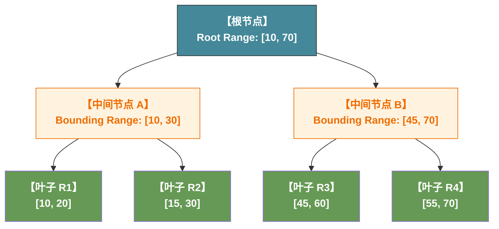

1. **中间节点是聚合区间**：中间节点 A 的范围是 `[10, 30]`，它刚好包含了 $R_1$ 和 $R_2$；中间节点 B 的范围是 `[45, 70]`，包含了 $R_3$ 和 $R_4$。
2. **允许重叠（Overlap）**：看中间节点 A 内部，$R_1 [10, 20]$ 和 $R_2 [15, 30]$ 在物理上是有重叠部分的。`GiST` 树**完美允许这种重叠**。

假设我们现在执行了一个如下的查询：

```sql
SELECT *
FROM bookings
WHERE room_schedule && '`[25, 50]`'::tsrange;
```

PG 的执行器拿着 `[25, 50]` 开始从 GiST 树的根节点向下寻址：

1. **扫描根节点**：查询目标 `[25, 50]` 与根节点的 `[10, 70]` 有交集，继续向下。
2. **评估中间节点 A (`[10, 30]`)**：
   - `[25, 50]` 与 `[10, 30]` 有交集（交集是 `[25, 30]`），说明这里**有可能**藏着我们要的答案。
   - 顺着指针进入 A 的子节点。检查 $R_1[10,20]$（不重叠，排除），检查 $R_2[15,30]$（重叠！命中，捞出）。
3. **评估中间节点 B (`[45, 70]`)**：
   - `[25, 50]` 与 `[45, 70]` 也有交集（交集是 `[45, 50]`），说明这里**也有可能**有答案。
   - 顺着指针进入 B 的子节点。检查 $R_3[45,60]$（重叠！命中，捞出），检查 $R_4[55,70]$（不重叠，排除）。

## GiST面临的问题

`GiST` 由于允许数据重叠，那么我们在插入新的节点时会导致指向它的中间节点膨胀，在极端情况下，甚至由于这些 `range` 重叠的部分过多，整个搜索直接退化为全表扫描。

举个例子，假设在我们上面的这个图中，我们插入一个 `[5, 65]` 的超大 `range`，这个大区间不论塞给中间节点 A 还是 B，都会导致 A 或 B急剧膨胀。在这个场景下：假设我们塞入A，那么此时基本上所有落到B的都会需要同时查询A，因为此时我们新的中间节点A基本覆盖了B。

例如，我们在查询 `[45, 65]` 这个区间时，A 和 B 都需要搜索。

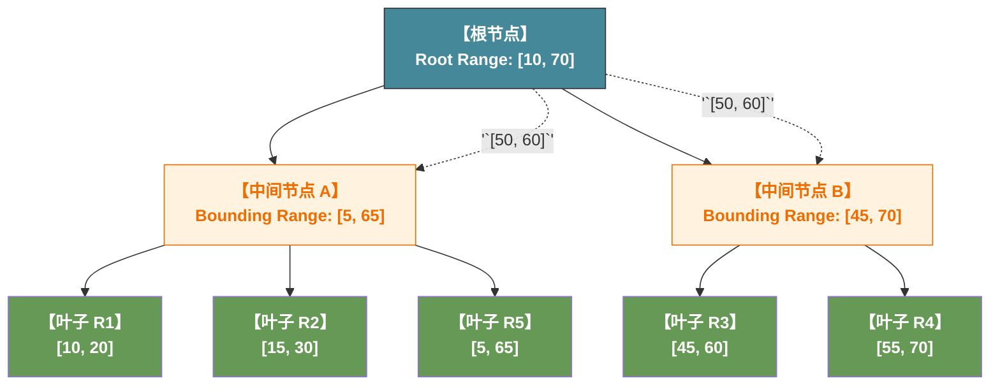

为了对抗这种退化，PG 在 `range` 的 GiST 源码里实现了两个核心算法：

- **Penalty（惩罚函数）**：当新插入一个区间时，计算把它放进哪个中间节点会导致该节点的“箱子体积膨胀得最小”（优先选择代价最小的节点塞进去）。
- **PickSplit（分裂函数）**：当一个节点满了需要拆分成两个时，算法会极其痛苦地进行计算，**尽可能把物理上离得远的区间分到两个不同的箱子里**，从而让两个新箱子之间的重叠度降到最低。

# 单引号和双引号

在 `pg` 中，单引号和双引号的含义是不同的：

- **`'`（单引号）**：专门用来包裹 **字符串字面量（String Literal / Value）**。也就是告诉数据库：这是一个具体的数据值。
- **`"`（双引号）**：专门用来包裹 **对象标识符（Identifier）**。也就是告诉数据库：这是一个表名、列名、函数名或者别名。

举个例子，我们创建如下的表：

```sql
CREATE TABLE test_tab_04(id int, col1 text[]);
```

下面的SQL执行会报错：

```sql
INSERT INTO test_tab_04 VALUES (1, ARRAY["hello", " ", "world."]);
```

提示：

```
column "hello" does not exist
LINE 1: ...ERT INTO test_tab_04 VALUES (1, null, null, ARRAY["hello", "...
```

而下面的则可以正常执行：

```sql
INSERT INTO test_tab_04 VALUES (1, ARRAY['hello', ' ', 'world.']);
```

此外，`pg` 的数组的索引是从 `1` 开始的，并且超出索引时会返回 null 而不是异常：

```sql
SELECT col1[1],col1[2],col1[3],col1[4]
FROM test_tab_04;
```

```
+-------+------+--------+--------+
| col1  | col1 | col1   | col1   |
|-------+------+--------+--------|
| hello |      | world. | <null> |
+-------+------+--------+--------+
```

# pg_lsn

`pg_lsn` 类型的全称是 PostgreSQL Log Sequence Number，我们基本不会声明某一个表中包含一个字段是 pg_lsn 类型，它主要的作用是 pg 自己内部用于管理它的 WAL 日志。即便是运维人员，也只是利用pg提供的这个特性去做一些类似于CDC日志同步的逻辑。

## pg中的WAL

在 `pg` 中，`WAL` 是一个持久化的超大型的、有序的逻辑日志，但是在物理层面，它会被拆分为多个不同的文件，每个文件被称之为一个 `segment`。

在每个 `segment` 中，不同的SQL生成的对应的WAL紧密排列，而所以我们需要一个文件内偏移量才能找到某一条具体的WAL日志。

所以，当我们在 PG 中查询一个 LSN 时，它通常长这样：`16/B374A848`。它在形式上是一个由斜杠 `/` 隔开的十六进制字符串，但其本质是一个 **64 位的无符号整数（8 字节）**。

注意，这个斜杠（`/`）只是一个**纯粹的可视化输出格式**，它和 WAL 的“逻辑段号”并不是直对的关系。

1. **物理 WAL 文件的大小**：PG 的一个 WAL 段文件（Segment）默认固定大小是 **$16\text{ MB}$**。
2. 在 PG 源码中，它是通过将 64 位的绝对 LSN 整数进行数学计算，来推导出真实的 WAL 文件名的。

$$
\text{WAL 文件名} = \text{Timeline ID} + \left( \frac{\text{LSN}}{16\text{ MB}} \text{ 的十六进制} \right)
$$

以 `16/B374A848` 为例子：

- 把它转成一维 64 位整数，它是：`0x16B374A848`。
- 我们用它除以 $16\text{ MB}$（`0x01000000`），得到的物理商是 `0x16B3`。
- 所以，它对应的物理 WAL 文件名实际上长这样：`00000001000016B3000000B3`（前 8 位是时间线，中间 8 位是逻辑段，最后 8 位是该段内的第几个 $16\text{ MB}$）。
- 而真正的**文件内偏移量**，其实是 `0xB374A848` 对 $16\text{ MB}$ 取模（Remainder）后的余数

## 什么是WAL

通常来说，在几乎所有的数据库中（不论是OLAP/OLTP，只要是需要保证在单机崩溃后恢复）都是通过一个叫 WAL 的机制来实现的。

而 WAL 简单理解就是：在我们真正的要去做一件事之前，我们先将我们要做的事情记录下来。如果失败了我就先恢复到WAL日志之前的状态，再执行一次WAL日志。

这个思想是基于一个非常简单的推论：

$State_{n+1} = State_{n} + \Delta{v}$

也就是说，在 `n+1` 时刻的状态，等于 `n` 时刻的状态，加上从时刻 `n` 到 时刻 `n+1` 所有发生的变化。基于这个推论，并结合WAL我们就可以保证我们的状态一致性，而这个过程中我们需要记录两个状态：

- $State_n$
- $State_n$ 时刻对应的 `LSN`

我们知道，WAL 是一个有序的日志，我们只需要记住以上两个状态，那么在 $State_n$ 到 $State_{n+1}$ 的这个状态中的任意时刻发生了故障，我们只需要恢复到 $State_n$ 时刻的状态，再重新执行 WAL 即可。如果我们执行成功，我们更新状态到 $State_{n+1}$ 和 $LSN_{new}$。

那么，此时我们会发现一个新的问题：我们的WAL日志的执行必须是幂等的，因为在 WAL 恢复时我们其实相当于有两个操作：

1. 更新 $State_n$ 到 $State_{n+1}$；
2. 更新 $LSN_{old}$ 到 $LSN_{new}$

而这个本身不是原子操作，所以它必须是幂等的。 **这个原理，基本上应用于我们现实世界中所有对状态一致性有要求的地方：2PC/3PC 的事务，raft协议的复制，flink的checkpoint等。**

我们可以把我们的 WAL 磁盘更新看做是两步：

1. 根据WAL更新日志的内容；
2. 更新LSN。

我们通过将 LSN 放在我们的 Page 页中，这样我们先在内存中更新该 Page 在 WAL 执行完毕后的结果，再更新 Page Header 中的 LSN。

随后，我们将这个更新后的 Page 更新到磁盘，此时我们要么都成功，要么都失败，天然的实现了我们的幂等。

然而，在工程上实现这个逻辑的问题在于，磁盘并不存在这样一个原子更新的最小块，所以不论是在 mysql 还是在 pg 中，这个所谓的 “原子更新的 Page” 都只是一个抽象的概念：

- mysql 使用了双写缓冲（Double Write Buffer）
- pg 使用了全页写入机制（Full Page Write）。 

## pg_lsn的应用

通常来说，从业务开发的角度来讲， `pg_lsn` 是一个不会用到的类型，然而对于 DBA，Infra Engineer，或者大数据中间件开发的视角来看， `pg_lsn` 是一个极其重要的类型，我们可以考虑以下几个典型的场景：

### CDC

在现代微服务和大数据架构中，有一个极为高频的诉求：**把数据库的变更实时同步到 Redis、Elasticsearch 或者 Kafka 中**。常用的有 `Debezium` 或者是 flink 的一些 CDC 组件。

在这个情况下，用户通常会将 `lsn` 作为状态存储起来，并在崩溃之后通过 `lsn` 重新回到刚才同步的位置。

### 运维与高可用监控

对于运维人员，`pg_lsn` 是评估数据库集群健康度最不可或缺的指标：主从复制有没有延迟、延迟了多少、从库有没有卡死，全靠两个 `pg_lsn` 相减得到的**字节差值（Replication Lag Bytes）**。如果这个差值持续飙升，DBA 就会收到报警，开始介入排查网络或磁盘 I/O 问题。

# pg和mysql的数据隔离

## 综述

`mysql` 和 `pg` 在模型上，差别非常大：

- `mysql` 是典型的**单进程，多线程（Shared Everything）**，在启动后，在操作系统层面**只有一个独立的进程**（`mysqld`）：
  1. 对于每个 `client`，在连接时 `mysql` 会在内部为他分配一个线程。
  2. 所有的线程在物理上共享数据（数据字典、元数据缓存），在 `mysql` 内部通过逻辑查询时鉴权来隔离数据。
- `pg` 则是**多进程模型（Process-Per-Connection）**，在启动之后，操作系统里会有一个守护进程，以及大量的工作进程（`walwriter`，`checkpointer`，`background writer` 等）：
  1. 对于每个 `client`，在连接时，`pg` 会从 `fork()` 一个新的进程，在新的进程中根据指定库从对应目录加载元数据。

他们的元数据存储也是完全不同的：

- 共同点是，在服务器上都会启动一个服务进程，这个服务进程会负责接收从 `client` 发送的请求，并查询内部的特定结构的文件/索引后向用户返回结果数据。
- 区别是：
  - `mysql` 内部的元数据是**逻辑隔离，物理共享**的，它内部所有的元数据被存放在一个全局统一的，由 InnoDB 统一管理的隐藏系统表里。元数据本身在 `mysql` 中也被抽象为了一个表，也就是说，它遵循和其他表一样的增删查改原则，通过 Redo/Undo Log 来做容灾和MVCC。同时，它也和其他的普通表一样，是先写WAL日志，再修改内存生成脏页，在一个合适的实际进行持久化（Double Write Buffer）。而我们的 `information_schema` 表则是对这个表做的一个视图。
  - `pg` 在数据隔离的层面则更为的激进，它在内部将不同的库的元数据拆分存放到了不同的文件夹下，**它从物理层面和逻辑层面都做了隔离**。

## 一个例子

根据我们前面的描述，我们可以推测得出：**当我们在 `mysql`/`pg` 下执行 `use ${database}` 这条指令时其实会有有截然不同的行为**：

1. `mysql` 物理共享，所以它只需要在内部**做一个逻辑上的切换**即可。
2. `pg` 物理隔离，所以它需要**销毁当前 session，并创建一个新的 session 加载元数据。**

我们按照如下的操作可以完美的复现这个结论：

> 补充：`pg` 在内核层面并不支持**在同一个会话中切换数据库**这个功能，这里的 `use postgresq;` 实际上是我们使用的客户端帮我们做了适配，客户端在后台停止了刚才的 `session`，并向 `pg` 请求建立了一个新的 `session`。

```bash
sudo ss -tnp | grep mysqld
# ESTAB 0      0          127.0.0.1:3306     127.0.0.1:36780 users:(("mysqld",pid=2930,fd=24))
# 可以看到我们现在的连接是 pid=2930 的进程

# 在 client 中切换库
use information_schema;

sudo ss -tnp | grep mysqld
# ESTAB 0      0          127.0.0.1:3306     127.0.0.1:36780 users:(("mysqld",pid=2930,fd=24))
# 我们的连接没有任何变化

# 而pg则完全不一样，我们先看看现在的连接
sudo ss -tnp | grep postgres
# ESTAB 0      0          127.0.0.1:5432     127.0.0.1:38738 users:(("postgres",pid=35285,fd=9))

# 在 client 中切换库
use postgres;

sudo ss -tnp | grep postgres
# ESTAB 0      0          127.0.0.1:5432     127.0.0.1:41590 users:(("postgres",pid=36510,fd=9))
# 我们的进程从 pid=35285 变成了 pid=36510
```

## 元数据存储上的隔离

### pg

在 pg 中，不同的数据之间的元数据是物理隔离的，我们可以这样去找到我们的元数据存储的位置：

```sql
-- 查找数据库的OID
SELECT oid, datname FROM pg_database;

-- 查找pg的文件目录
SHOW data_directory;
```

我们得到了如下输出：

```sql
+-------+-------------+
| oid   | datname     |
|-------+-------------|
| 5     | postgres    |
| 16385 | ai_infra_db |
| 1     | template1   |
| 4     | template0   |
+-------+-------------+

+-----------------------------+
| data_directory              |
|-----------------------------|
| /var/lib/postgresql/18/main |
+-----------------------------+
```

我们可以看到这个目录下存放了相当多的文件：

- `PG_VERSIOn` 存放了pg的版本号。
- `base` 存放了我们的创建的所有库的元数据。
- `global` 存放了我们的全局系统表，这些文件在全实例级别只有一份，里面记录的就是用户账号、有哪些数据库等全集群共享的信息。
- `pg_wal` 存放了我们的全局 `WAL` 日志。

```bash
ll /var/lib/postgresql/18/main

# -rw-------  1 postgres postgres    3 May 20 14:50 PG_VERSION
# drwx------  7 postgres postgres 4.0K May 20 22:42 base/
# drwx------  2 postgres postgres 4.0K May 22 15:06 global/
# drwx------  4 postgres postgres 4.0K May 20 22:34 pg_wal/
# ...
```

此时进入 `base` 文件加，我们可以看到我们所有的库都是独立的：

```bash
ll base

# drwx------  7 postgres postgres  4096 May 20 22:42 ./
# drwx------ 19 postgres postgres  4096 May 20 14:50 ../
# drwx------  2 postgres postgres  4096 May 20 14:54 1/
# drwx------  2 postgres postgres 12288 May 21 16:55 16385/
# drwx------  2 postgres postgres  4096 May 22 15:06 4/
# drwx------  2 postgres postgres  4096 May 20 14:53 5/
# drwx------  2 postgres postgres  4096 May 20 22:42 pgsql_tmp/
```

### mysql

`mysql` 的则是简单粗暴，通常 `mysql` 的路径是 `/var/lib/mysql/`：

- `ibdata1` 共享表空间。
- `mysql.ibd` 中央数据字典物理文件，包含了全部的核心元数据。
- `undo_001` 和 `undo_002` 是我们独立的 undo 日志。
- `mysql` 和 `performance_schema` 是默认提供的库。
- `springboot` 是之前学习 `springboot` 时创建的一个表。

```bash
ll /var/lib/mysql/

# -rw-r-----  1 mysql mysql  12M May 22 00:00  ibdata1
# -rw-r-----  1 mysql mysql  25M May 19 21:42  mysql.ibd
# -rw-r-----  1 mysql mysql  16M May 19 21:42  undo_001
# -rw-r-----  1 mysql mysql  16M May 19 21:42  undo_002
# drwxr-x---  2 mysql mysql 4.0K May 19 20:57  mysql/
# drwxr-x---  2 mysql mysql 4.0K May 19 20:57  performance_schema/
# drwxr-x---  2 mysql mysql 4.0K May 19 21:41  springboot/
```

然而，当我们查看 `springboot` 这个文件夹时：

```bash
tree springboot/

# springboot/
# ├── tbl_account.ibd
# ├── tbl_dept.ibd
# └── tbl_user.ibd
```

我们会发现，它只有 `.ibd` 文件，而这个是 `InnoDB` 的实际数据，并不包含元数据信息。

# cluster/database/schema

## 概述

通常来说，一个典型的 `database` 的分库/分表逻辑应该按照如下方式去实现：

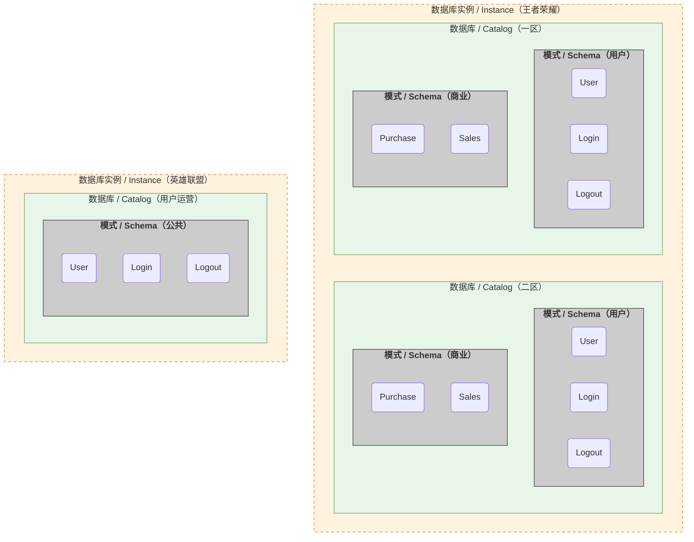

1. instance：最顶层的是没有任何关联的，完全独立的业务，我们通常会将他们放在两个完全不同的数据实例中。但是，在数据量本身不大并且对数据安全性不那么敏感，我们可以考虑将他们放在同一个实例下的不同的库中。
2. database：面向独立业务租户、独立系统、独立数据集群，通常来说，他们的数据文件、事务日志、连接资源、备份恢复完全独立，默认互相不可访问，故障、扩容、销毁互不影响。
3. schema：库内逻辑命名空间，通常是面向同一系统内部的模块、团队、业务域。他们通常共享数据库底层存储与事务能力，仅做逻辑划分，库内跨 Schema 可自由关联查询。
4. table：不同的业务逻辑特征。

如果要简单的描述的话，那就是：

1. instance 是物理机器或集群（非虚拟化场景下）或者容器实例（例如kubernetes集群）级别的隔离。
2. database 是磁盘路径级别的隔离。
3. schema 是逻辑层面的隔离。

## mysql

通常来说，按照SQL标准，我们的整体设计应该如上面所描述的一样，**然而mysql并没有遵循这个标准**，所以在mysql中，`schema` 和 `database` 是一个完全一样的概念，**都对应于SQL标准中的 `schema` 层。也就是说，`mysql` 没有提供 `database` 层面的隔离能力。**最典型的特征是：`mysql` 的跨库查询只要用户存在所有查询库的权限，它可以在不借助任何外部工具的情况下直接进行跨库的查询，而 `pg` 和 `oracle` 都不提供该能力。 

## pg

在 `pg` 中，也没有完全的遵循SQL标准，它的层级如下所示：

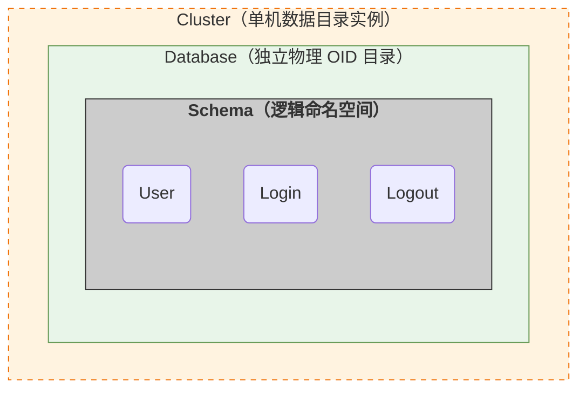

它使用 `cluster` 去表示SQL标准的 `instance`：在 `pg` 中，`cluster` 是一个历史命名包袱，它和分布式系统（如 `kubernetes`、`redis cluster`）里的 `集群` 概念完全不是一个东西：

- **常规分布式系统的 `cluster`**：指的是**多台物理机器/多个独立节点**通过网络协同工作，具备分布式容灾、水平扩展的能力。
- `pg` 中的 `cluster`：在物理上它**就是单机上的一个独立数据目录（Data Directory）**。

而现在之所以仍然保留它的原因在于，大量的代码中保留着 `cluster` 的命名导致积重难返。

# 大字段的存储

## 概述

在数据库中，超大行写入是一个共同的难题。然而，不同的架构下，引起这个限制的并不是同一个原因。

### mysql对于大字段的限制

`mysql` 不允许超大行写入的原因是，`mysql` 的索引是**聚簇索引**（索引的叶子节点就是数据本身），而我们的存储本身是按页存储的，也就是说，单页存储的数据是有上限的。而如果我们在直接在单页中写入超大行，这会导致我们B+树索引中的叶子节点只能存放一个节点，这会导致我们的B+树直接退化为一个链表。所以，`mysql` 允许的单行的最大大小必须小于 PageSize / 2。当然，此时整个索引树的高度会急剧增高，所以实际性能仍然受到极大影响。

### pg对于大字段的限制

`pg` 对于大字段的限制主要出于以下几个原因：

1. **单页物理写入的原子性**：linux的物理磁盘写入单位通常是 `4KB`，而 `pg` 的一个标准 Page 是 `8KB`，如果允许大行写入，我们假设这里占据了 page_a，page_b，page_c 三个 Page。那么此时，我们将需要处理在写入时的**页断裂**问题。 `mysql` 的解决方案是，通过引入了代价高昂的双写缓冲区（Double Write Buffer）来解决这个问题。而 `pg` 的设计为了避免这个问题，直接不允许数据跨行。
2. 如果不允许数据跨行，那么整个的WAL重放将不需要考虑复杂的单行跨Page的场景，我们只需要简单的做 checksum 校验并重放即可。
3. `pg` 的 MVCC 把行版本号存放在 Tuple Header 中，允许跨行写入将使得 MVCC 实现异常复杂。

## 解决大字段写入

为此不同的数据库发展出了截然不同的解决方案：

### pg 如何处理大字段

`pg` 直接不允许单行跨页，而如果对于某一行出现跨页的情况，那么它就会使用 `TOAST` 技术。

原理就是，我们知道，在 `pg` 中，`table` 会有一个全局唯一的 `OID`，也就是说，我们只需要为某个大字段也生成一个唯一的 `ID`，我们就可以通过这两个 `ID` 定义到这个大字段。

那么，我们生成一个隐藏的表 `pg_toast.pg_toast_xxxx`，其中 `xxxx` 是主表的 OID。

随后将这个大对象拆成多个小行，并写入到这个表中。同时，在行内它会使用一个 Blob Pointer 作为后续查找该字段的依据。

而 `pg_toast.pg_toast_xxxx` 这个表会包含三个字段：

1. `chunk_id` 这就是我们的主表中实际存储的 Blob Pointer。
2. `chunk_seq` 我们大字段在拆分后的序号。
3. `chunk_data` 字段拆分后的数据。

也就是说，当我们在查询这个大字段时，相当于是在后台执行了如下的SQL:

```sql
SELECT chunk_data
FROM pg_toast_xxxx
WHERE chunk_id = ?
ORDER BY chunk_seq ASC;
```

我们就得到了这个大字段的实际值。


### mysql如何处理大字段

`mysql` 允许单行跨页，但是它会和 `pg` 一样，将这个字段存储到独立的 `Overflow Page` 内。同时，在原始行内存储一个指向这个 `Overflow Page` 的指针。但是，我们需要知道，`Overflow Page` 实际上是一个逻辑概念，在物理上，他会被拆分为多个特殊的 `Page`，每个 `Page` 除了存放数据之外，还有有一个指针指向它的下一页。所以，它实际上是一个链表。

### 总结

也就是说，`pg` 和 `mysql` 的共同点是，对于大字段他们都会使用一个独立的区域去存放，而通过一个指针来指向这个独立的存储区域。

他们的区别在于，`pg` 是将原始数据拆分为多行，仍然遵循单行不跨页原则，而 `mysql` 则在 `Overflow Page` 中允许打破单行不跨页的规则。

## 存储模型

### mysql

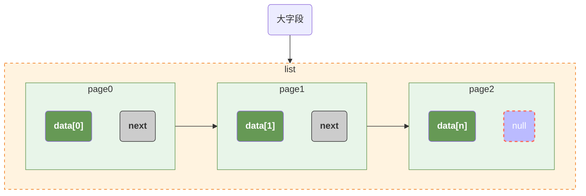

### pg

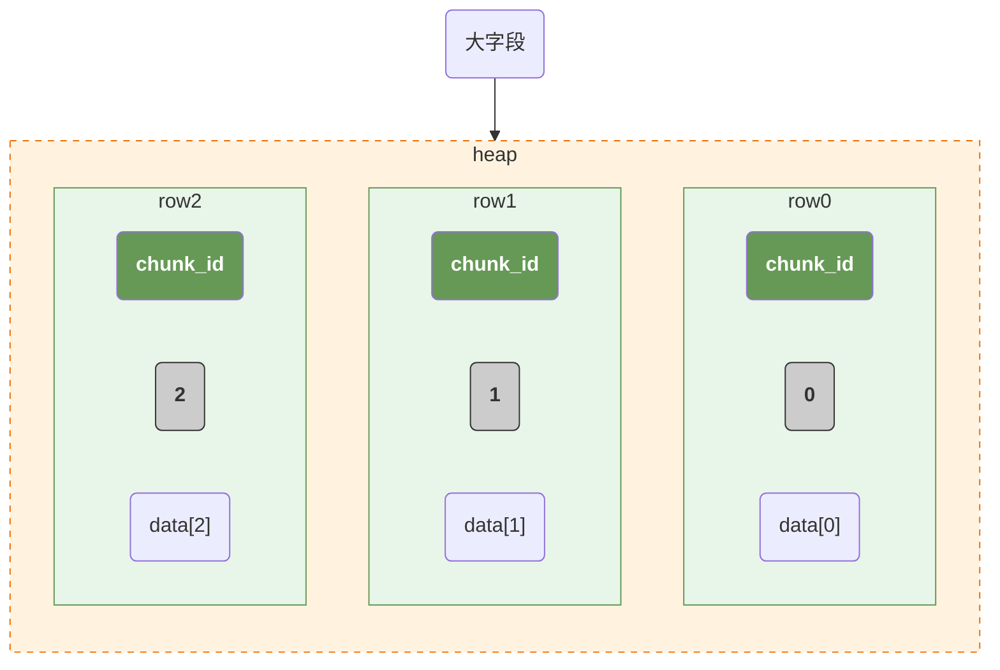

# pg的进程模型

`pg` 是典型的多进程模型，主进程执行得到root进程，后续所有的进程都从root进程fork()得到子进程，一个典型的pg实例如下所示：

```bash
# 在机器上执行
ps axfo pid,ppid,cmd | grep -E "PID|postgres"
```

我们得到了如下输出（省略了无关输出）：

```
    PID    PPID CMD
    247       1 /usr/lib/postgresql/18/bin/postgres -D /var/lib/postgresql/18/main -c config_file=/etc/postgresql/18/main/postgresql.conf
    264     247  \_ postgres: 18/main: io worker 0
    265     247  \_ postgres: 18/main: io worker 1
    266     247  \_ postgres: 18/main: io worker 2
    267     247  \_ postgres: 18/main: checkpointer
    268     247  \_ postgres: 18/main: background writer
    309     247  \_ postgres: 18/main: walwriter
    310     247  \_ postgres: 18/main: autovacuum launcher
    311     247  \_ postgres: 18/main: logical replication launcher
   1311     247  \_ postgres: 18/main: developer ai_infra_db 127.0.0.1(56684) idle
```

可以看到，我们的父进程是我们的 `247` 进程：

- 它的父进程是`linux`的`init/systemd`进程。
- `pg` 的二进程文件是 `/usr/lib/postgresql/18/bin/postgres`。
- `-D /var/lib/postgresql/18/main` 指定的当前实例的数据目录。
- `-c config_file=/etc/postgresql/18/main/postgresql.conf` 指定了我们的配置文件。
- 在这个配置文件中，我们可以找到配置：`cluster_name = '18/main'`。这也是我们之前提到的 `cluster` 是一个历史遗留问题的体现，它出现在各个位置，修改它最直接的影响就是低版本将无法直接无损的升级到更新的版本。

按照`linux` 的规则，在 `fork()` 进程时，操作系统只负责为子进程分配一个 `PID`，而子进程的 `CMD` 由 `pg` 自己决定，它是由如下规则生成的：

- `:` 作为分割符。
- `postgres` 表示父进程的名字。
- `18/main` 表示集群名（这里有两个点需要注意的是，在 `pg` 中，所谓的集群其实表示的就是当前实例，而集群名也是由配置文件中执行）。
- `io worker 0` 最后面的部分表示的是当前进程自身的名字和状态。

我们整个进程的架构和功能如下：

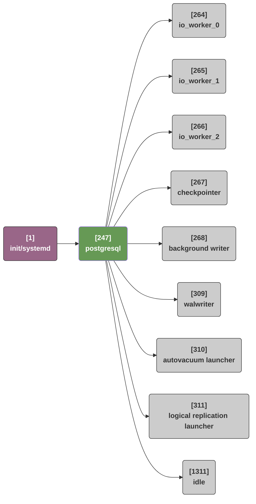

- `io_worker_0`, `io_worker_1`, `io_worker_2` 是 `pg 18` 引入的新特性，核心进程要读写磁盘时，他们会把 IO 任务直接塞给这 3 个常驻的 `io worker` 队列。**这个是一个非常常见的优化手段，在非常多的其他的场景下都会有应用：**
  - G1 中更新脏卡也是这种生产者-消费者的模型。 
  - GC 中的堆外内存回收。
- `checkpointer` 定期发起检查点（Checkpoint），把内存里所有的脏页一次性全强制冲进磁盘。
- `background writer` 一个常驻执行的进程，核心目的是让 Shared Buffers 里随时都有足够多的 Clean Pages。
- `walwriter` 只负责写 `WAL` 日志。
- `autovacuum launcher` 监控主表、索引、以及**隐藏的 TOAST 表**，当某个表的死行比例超过水位线时，`fork()` 启动一个 `autovacuum worker` 子进程回收死行。这也是为什么它叫 `launcher` 的原因。
- `logical replication launcher` 负责管理和拉起逻辑复制（Logical Replication）的发送与接收流。
- `idle` 这里的全名是 `developer ai_infra_db 127.0.0.1(56684) idle` 这是我自己内部启动了一个 `pgcli` 连接到了我的 `ai_infra_db` 数据库。这里需要注意的是，`pg` 由于架构的原因，它对客户端的连接非常的粗暴：**每一个连接都会分配一个独立的服务进程**，所以通常来说，为了保证服务器的进程不被打爆，通常会部署 `PgBouncer` 作为中间件：**用户连接 `PgBouncer`， 由它来连接 `pg`， 这样 `pg` 的进程数就是可控的。而 `PgBouncer` 由于功能简单，所以它的性能非常好，并不会成为性能瓶颈**。

## 为什么pg使用这么粗暴的方式管理连接

1. `mysql` 多个连接共享内存空间，这意味着如果某个请求在触发未知异常（如segment fault）时会直接导致整个程序崩溃。而 `pg` 下的异常只会导致某个连接对应的进程崩溃。
2. 多进程的架构可以有效避免全局的锁进程，只有在访问 `Shared Memory` 时才会上锁。
3. 历史原因：**其实令人意外的是，`pg` 的出现比 `mysql` 更早，`pg` 开始于 `1986` 年，而 `mysql` 则开始于 `1995` 年。早期的 `unix` 的多线程（POSIX Threads）甚至没有被提出**。

# transaction age

在pg中，每一行（tuple）的开头，都有一个23字节的隐藏头（HeapTupleHeaderData），我们的 transaction age 和 MVCC 都依赖于这个头中的内容来实现：

1. t_xmin（4 字节 / 32位无符号整数）：它记录了创建当前行的 XID。
2. t_xmax（4 字节 / 32位无符号整数）：它记录了修改/删除了当前行的 XID，**注意，如果当前行没有被update/delete过，那么 t_xmax == 0**。
3. t_infomask（2 字节 / 16位二进制位掩码 Bitmask）：它表示了当前行的状态，这里和我们的MVCC有关的最重要的一个状态是：`HEAP_XMIN_FROZEN`，它表示当前行是否被冻结（FROZEN）。

此外，在我们的pg的全局共享的 Shared Memory 中，我们还有一个重要的值：`CurrentXID`，这是我们当前集群中使用的 XID。

这里存在的问题是：由于历史原因，我们的 transaction age 是32位的，这意味着我们的pg的最大transaction age只有42亿，那假设存在如下场景：

1. 我们不停的写入数据，XID不断增长。
2. 在某个时刻，我们的XID超过42亿，此时我们的transaction age溢出变成了0。
3. 假设这一行数据是一个update操作，那么此时对于pg来说，被update的数据的XID比他大，那么我们在MVCC时将显示错误的数据。

为此，pg引入了一个称得上是奇葩的逻辑：**它以CurrentXID为中心轴，将左边的21亿数据看做是过去的数据，正常的走MVCC流程，而右边的21亿看做是未来数据，走独特的MVCC流程。**

这里非常难理解的是：

1. 未来数据的XID可以小于CurrentXID。
2. 过去数据的XID可以大于CurrentXID。

我们举个例子，假设现在我们XID是 `[0, 10]`，而CurrentXID左边5个XID是过去，右边的5个XID是未来：

1. 假设 CurrentXID == 9，那么此时过去数据的范围是 `{4, 5, 6, 7, 8}`，而未来数据的范围是 `{10, 0, 1, 2, 3}`。此时未来数据的XID可能小于CurrentXID。
2. 假设 CurrentXID == 0，那么此时过去数据的范围是 `{6, 7, 8, 9, 10}`，而未来数据的范围是 `{1, 2, 3, 4, 5}`。此时过去数据的XID可能大于CurrentXID。

因为，pg将整个XID是作为一个环形的时间轴。

**此时，由于pg将所谓大于CurrentXID的XID是作为未来数据，这意味着pg永远不会面临无新的XID可用的局面。我们的问题被转换为：那些本来应该是正常走MVCC流程的XID，此时应该怎么处理？**

pg这里使用的方式是，在MVCC中过去数据和未来数据会经由条件进入到不同的判断分支。而这里就涉及到一个非常重要的状态：`FROZEN`，这个状态存储在 `t_infomask` 中，由后台的 `autovacuum launcher` 进程在满足条件：

当某张表里最老的那行 `NON-FROZEN` 数据的 transaction age（CurrentXID - 该行的 xmin）达到 2 亿（默认的 autovacuum_freeze_max_age）时：

1. 它将 t_xmin 修改为 2，也就是我们的 FROZEN 状态对应的常量XID。
2. 在行头的 t_infomask 字段里，将 `t_infomask.HEAP_XMIN_FROZEN` 标记为 1。

此时，当前行被标记为 `FROZEN` 状态。

随后，在MVCC查询中：

1. 查询所有符合条件的数据，**包括MVCC的所有版本的数据**。
2. 如果 `tuple` 状态为 FROZEN：
    1. 如果 `t_xmax` == 0，表明当前行未被更新过，合法数据直接返回。
    2. 如果 `t_xmax` != 0，表明当前行被更新过，我们判断更新它的这一行是否已经被正常提交，如果被提交则当前行时非法数据，跳过。
3. 如果 `tuple` 状态不为 FROZEN：则走正常的 MVCC 判断流程。

而这里的逻辑就是：将所有大于 CurrentXID 的 XID 都判断为未来数据，而这个XID可能在pg中已经被使用了。但是我们可以通过额外的状态 `FROZEN` 来判断它。在某个时刻，我们的数据可能是：

- XID == 0x12345678，`FRONZEN` == 0。
- XID == 0x12345678，`FRONZEN` == 1。

此时，我们知道 `FROZEN` 状态为 0 的数据走正常的MVCC流程，去找有没有更新的版本。而 `FROZEN` 状态为 1 的数据直接判定为潜在的合法数据，进入搜索最新版本的逻辑。

当然，在实际的执行中，pg对这里做了优化，在 `autovacuum` 的过程中，它会将 `FROZEN` 的数据的 XID 修改为 `2`，也就是我们的 `FrozenTransactionId` 常量。


也就是，本质上来说，为了保持我们的PG中始终有可用的XID，我们将那些可能出现冲突的XID标记为FROZEN状态，并直接放弃 t_xmin 这个字段的使用。

# explain

## 什么是cost

在我们开始真正的了解查询计划的生成之前，我们必须要了解所谓的 cost 到底是什么：

默认情况下，它们以顺序扫描一个数据块的开销作为基准单位，也就是说，将顺序扫描的基准参数“seq_page_cost”默认设为“1.0”，其他开销的基准参数都对照它来设置。

也就是说，优化器在计算 cost 的时候，会猜测它到底需要扫描多少个数据块，假设需要扫描两个数据块，那按照基准它的cost就是2.0。

实际上，我们整个的查询会设计到多个地方的开销，假设我存在如下的 SQL

```sql
SELECT * FROM jsonb_test_01 WHERE id > 100;
```

假设这张表在磁盘上的物理实相是：
- 在系统字典表里，它一共占了 100 个数据页（Pages = 100）。
- 这 100 个页里，一共平铺着 10,000 行数据（Rows = 10000）。

计算磁盘I/O所需要的开销：因为是全表扫描，它要顺序读完这 100 个页。

$$
\text{I/O 代价} = \text{Pages} \times \text{seq\_page\_cost} = 100 \times 1.0 = 100.0
$$


CPU读取数据的开销：10000 行数据要被全部从内存块里剥离出来，向上投递。

$$
\text{CPU 获取行代价} = \text{Rows} \times \text{cpu\_tuple\_cost} = 10000 \times 0.01 = 100.0
$$
CPU过滤条件执行的开销：对于这 10000 行，CPU 必须每一行都拿着 > 号去比对一次

$$
\text{CPU 表达式评估代价} = \text{Rows} \times \text{cpu\_operator\_cost} = 10000 \times 0.0025 = 25.0
$$


得到我们的最终开销：

$$
\text{总代价（Total Cost）} = 100.0 + 100.0 + 25.0 = 225.0
$$

## 常用的explain

我们使用我们之前初始化的 `jsonb_test_01` 表来看看我们的 `explain` 语句的使用

我们可以先了解几个常用的 `explain`：

- `explain` 最基础的命令。PG 的优化器（CBO）根据当前的系统统计信息，在内存里快速精算出一套它认为最优路径，然后直接打印。**SQL 绝对不会真正执行，不产生实际的数据 I/O。**
- `explain verbose` 同样**不会真正执行 SQL**。但是，它会命令优化器把执行计划中每一个物理算子**具体输出了哪些列（Output）**、以及这些列属于哪个表（Schema 限定名）等极其隐蔽的元数据全部打印出来。
- `explain analyze` 它是真实的执行后，把每一个操作步骤的开销（例如扫描了多少行，花费了多少时间）输出。
- `explain costs` 在 PostgreSQL 的标准语法中，`COSTS` 是一个开关参数（默认是开启的）。所以我们通常用的是 **`EXPLAIN (COSTS OFF)`** 来关闭它。默认情况下，`explain` 和 `explain costs` 是等价的。
- `explain buffers` 该参数只能与ANALYZE参数一起使用。显示的缓冲区信息包括共享块读和写的块数、本地块读和写的块数，以及临时块读和写的块数。共享块、本地块和临时块分别包含表和索引、临时表和临时索引，以及在排序和物化计划中使用的磁盘块。

## 不带任何参数的explain

```sql
explain select * from jsonb_test_01 where data->>'name' = 'hello jsonb';
```

我们得到

```
+---------------------------------------------------------------------------------------------+
| QUERY PLAN                                                                                  |
|---------------------------------------------------------------------------------------------|
| Index Scan using jsonb_test_01_expr_idx on jsonb_test_01  (cost=0.29..8.31 rows=1 width=47) |
|   Index Cond: ((data ->> 'name'::text) = 'hello jsonb'::text)                               |
+---------------------------------------------------------------------------------------------+
```

可以看到：

1. 使用了 `jsonb_test_01.jsonb_test_01_expr_idx` 索引。
2. `cost=0.29..8.31` 这里分为两个部分，使用 `..` 隔开，前面的 `0.29` 是**启动代价**，后面的 `8.31` 是**总代价**。
3. `rows = 1` 表示查询一行。
4. `width=47` 代表**预计当前算子返回的每一行记录，平均占用的物理内存宽度是 47 字节（Bytes）**。这是因为当数据从磁盘捞出来后，在进入内存的一瞬间，PG 的执行器必须为它们分配内存缓冲区。

## analyze

```sql
explain analyze select * from jsonb_test_01 where data->>'name' = 'hello jsonb';
```

输出

```
+------------------------------------------------------------------------------------------------------------------------------------------+
| QUERY PLAN                                                                                                                               |
|------------------------------------------------------------------------------------------------------------------------------------------|
| Index Scan using jsonb_test_01_expr_idx on jsonb_test_01  (cost=0.29..8.31 rows=1 width=47) (actual time=0.022..0.023 rows=1.00 loops=1) |
|   Index Cond: ((data ->> 'name'::text) = 'hello jsonb'::text) |
|   Index Searches: 1                                           |
|   Buffers: shared hit=3                                       |
| Planning Time: 0.066 ms                                       |
| Execution Time: 0.035 ms                                      |
+------------------------------------------------------------------------------------------------------------------------------------------+
```

1. 其他的部分和普通的 `explain` 完全一致，但是它真实的执行了查询。
2. `(actual time=0.022..0.023 rows=1.00 loops=1)` 记录了启动代价为 `0.022`，总代价为 `0.023`，总共查询 `1` 行，`loops = 1` 代表当前这个物理算子在整个查询生命周期中，一共被调用了多少次。而当我们发生连表查询时，就可能多次访问。
3. `Index Searches: 1` 表示查询索引的次数。
4. `Buffers: shared hit=3` 表示读取 Shared Memory 的次数。
5. `Planning Time: 0.066 ms` 表示生成查询计划的时间 -- 是的，查询计划的生成也会有相当高额的开销。
6. `Execution Time: 0.035 ms` 实际执行时间。

## (analyze, buffer)

我们还可以如下查询：

```sql
explain analyze select * from jsonb_test_01 where data->>'name' = 'hello jsonb';
```

但是得到的输出是完全相同的，因为 PG18 已经默认输出了。

## 启动代价和总代价

启动代价代表了数据库在查询到第一条数据时所需要花费的预估代价，而总代价代表了整个查询执行完毕时需要的预估代价。

之所以需要两个不同的代价的原因是，对于我们的优化器而言，不论是启动代价还是总代价都只是一个预估值，而优化器需要这两个参数来选择真正的物理执行计划。

简单来说：优化器通常会优先选择那些总代价更低的查询计划，然而当我们在遇到诸如 `order by datetime desc limit 10` 时，这里假设 `datetim` 存在索引，那么很有可能会存在如下的两个执行计划：

- **查索引**：此时启动代价极低，而总代价更高，**因为在查索引时，我们索引对应的数据在磁盘上是随机分布的，也就是`pg`认为走索引会产生大量的随机IO。而随机IO的cost远高于顺序IO。**
- **全盘扫描**：此时启动代价极高，而总代价更低，**因为在全盘扫描时我们是顺序IO，但是问题在于我们需要把全部的数据排序完后（虽然可能借助于堆排序之类的优化）才可以开始返回数据。**

此时，`pg` 认为这里存在 `limit 10`，它会判断查询会提前终止，所以实际代价会远低于预估的总代价。为此，它可能选择查索引作为真正的执行计划。

## 几种典型的查询计划

1. `Seq Scan` 全表扫描。
2. `Index Scan` 表示索引查询。
3. `Bitmap Heap Scan` 通常是在多条件查询或者非等值查询中，先通过条件构造自己的对应的位图，在对多个位图进行 `and`/`or` 操作得到最终的结果。
4. `Recheck Cond` 位图是存在内存中的，当满足条件的数据量比较大时，`pg` 会进行**位图降级**，位图中的bit指向Page而不是真实的物理行，此时我们需要找到Page并进行Recheck。
5. `Filter` 表示条件过滤。


