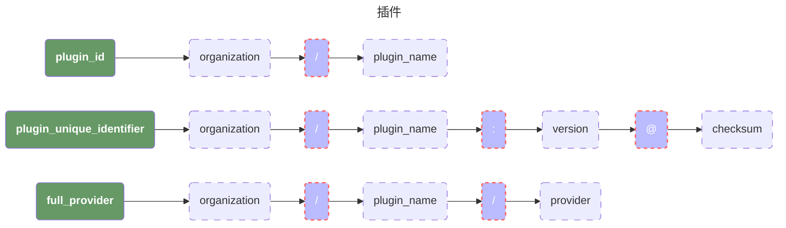
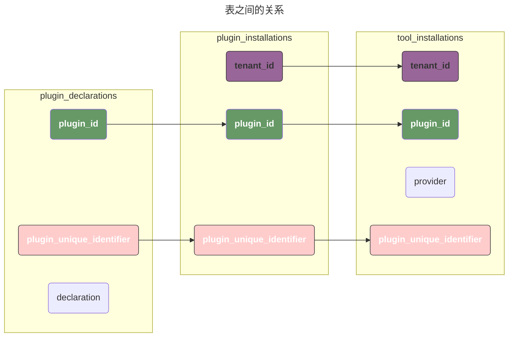
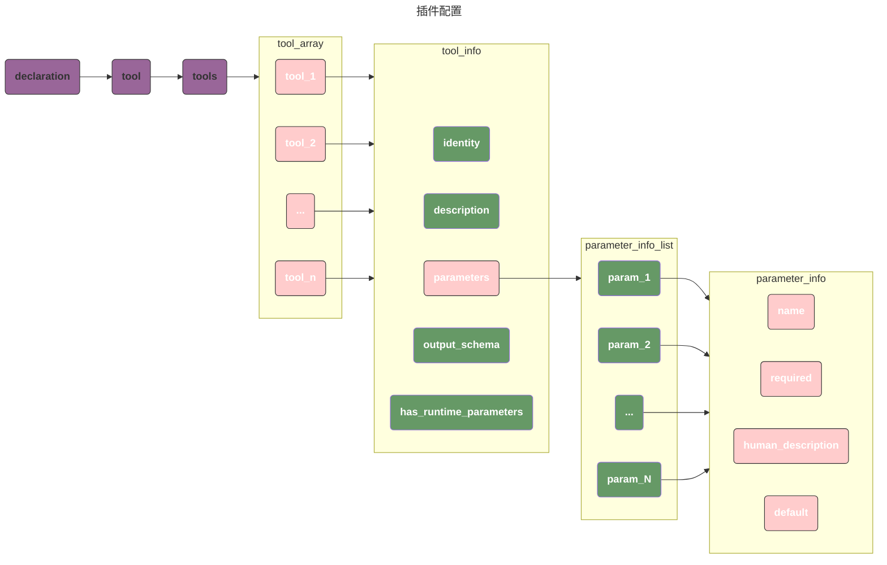
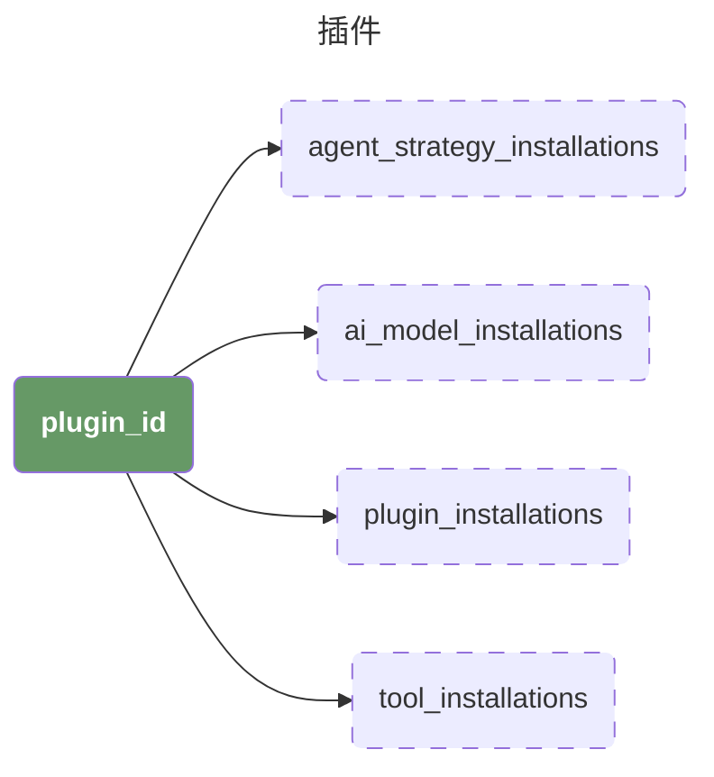

# 插件逻辑

在 `dify` 的插件管理中，整个体系逻辑比较混乱，这里使用该文本记录一下 `dify` 的插件管理逻辑。

## 插件概述

一个插件以及插件对应的工具的组成部分如下图所示：



## 插件和工具

在 `dify_plugin` 表中，存在三个表和工具相关：

1. `plugin_declarations` 是最上层的表，用于声明工具的元数据信息。例如 plugin_id，插件的元数据信息；
2. `plugin_installations` 和 `tenant` 相关，用户在安装插件后会在该表插入一条记录，该表包含了具体的插件版本号。
3. `tool_installations` 工具安装，在安装插件后，如果 `plugin_declarations`.`declaration` 中包含了工具的声明，那么就会在该表插入一条记录；

## 插件和工具之间的关系

>下面的图，列出来了三个表之间字段的对应关系，大家会发现，这里有两个字段并没有列出来他们的对应关系。
>而在我们的实际生产环境中，`provider` 字段是从 `declaration` 这个字段中解析出来的。
>具体的解析逻辑可以看后面的详细说明。



### 数据实例

#### plugin_declarations

```sql
SELECT plugin_id,
       plugin_unique_identifier,
       declaration
FROM plugin_declarations
WHERE plugin_id = 'hjlarry/database'\G
```

```
plugin_id                | hjlarry/database
plugin_unique_identifier | hjlarry/database:0.0.6@2f547ea4b80c5bbec2b953843a37de9aff7427d276b763a8e237c6b2188359b3
declaration              | /*声明内容省略*/
```

#### plugin_installations

```sql
SELECT tenant_id,
       plugin_id,
       plugin_unique_identifier,
       SOURCE,
       meta
FROM plugin_installations
WHERE plugin_id = 'hjlarry/database' LIMIT 1\G
```

```
tenant_id                | ca6ac437-b0bd-4b18-88b9-c8717681ea81
plugin_id                | hjlarry/database
plugin_unique_identifier | hjlarry/database:0.0.6@2f547ea4b80c5bbec2b953843a37de9aff7427d276b763a8e237c6b2188359b3
source                   | marketplace
meta                     | {"plugin_unique_identifier":"hjlarry/database:0.0.6@2f547ea4b80c5bbec2b953843a37de9aff7427d276b763a8e237c6b2188359b3"}
```

#### tool_installations

```bash
SELECT tenant_id,
       provider,
       plugin_unique_identifier,
       plugin_id
FROM tool_installations
WHERE plugin_id = 'hjlarry/database' LIMIT 1\G
```

```
tenant_id                | ca6ac437-b0bd-4b18-88b9-c8717681ea81
provider                 | database
plugin_unique_identifier | hjlarry/database:0.0.6@2f547ea4b80c5bbec2b953843a37de9aff7427d276b763a8e237c6b2188359b3
plugin_id                | hjlarry/database
```

## 插件在数据库中的管理逻辑

插件在数据库中，会涉及到以下几个重要的表：

### plugin_declarations/plugins

在 `plugin_declarations` 表和 `plugins` 中，声明了插件的相关信息，其中最主要的字段有三个：

1. `plugin_unique_identifier` 插件的唯一ID，这个ID存在唯一索引不能重复；
2. `plugin_id` 是标志插件的类型，但是他只是标志了插件的类型，实际上可以同时存在多个不同的版本；
3. `declaration` 声明了插件的元数据信息。例如，他是一个 `model` 还是 `tools` 等。

```sql
CREATE TABLE public.plugin_declarations (
    id uuid DEFAULT public.uuid_generate_v4() NOT NULL,
    created_at timestamp with time zone,
    updated_at timestamp with time zone,
    plugin_unique_identifier character varying(255),
    plugin_id character varying(255),
    declaration text
);


ALTER TABLE ONLY public.plugin_declarations
    ADD CONSTRAINT plugin_declarations_pkey PRIMARY KEY (id);

ALTER TABLE ONLY public.plugin_declarations
    ADD CONSTRAINT uni_plugin_declarations_plugin_unique_identifier UNIQUE (plugin_unique_identifier);

CREATE INDEX idx_plugin_declarations_plugin_id ON public.plugin_declarations USING btree (plugin_id);
```

例如，对于 `langgenius/dingtalk` 这个插件的 `0.0.4` 版本，他的数据如下：

```sql
SELECT *
FROM plugin_declarations
WHERE plugin_unique_identifier = 'langgenius/dingtalk:0.0.4@fe34a564a52c3a295e60ed97280ef47abd459d96310239cf9df5f04a5b1681b3'\G
```

```
-[ RECORD 1 ]-------------------------
id                       | ca7ac146-7eec-4194-9597-ffd0097b382d
created_at               | 2025-03-25 20:30:53.741513+08
updated_at               | 2025-03-25 20:30:53.741513+08
plugin_unique_identifier | langgenius/dingtalk:0.0.4@fe34a564a52c3a295e60ed97280ef47abd459d96310239cf9df5f04a5b1681b3
plugin_id                | langgenius/dingtalk
declaration              | {"version":"0.0.4","type":"plugin","author":"langgenius","name":"dingtalk","label":{"en_US":"DingTalk","zh_Hans":"钉钉","pt_BR":"DingTalk"},"description":{"en_US":"DingTalk group robot","zh_...
```

在这里，我们需要仔细的查看一下 `declaration` 的内容，我保留了主干内容后如下：

由于这是一个工具类型的插件，所以从声明中我们可以看得出来，他在配置文件中声明了他在这个工具中所包含的 `action`，并且指明了每个 `action` 的输入和输出。

```json
{
    "version": "0.0.4",
    "type": "plugin",
    "author": "langgenius",
    "name": "dingtalk",
    "label":{},
    "description":{},
    "resource":{},
    "plugins":
    {
        "tools":
        [
            "provider/dingtalk.yaml"
        ],
    },
    "tool":
    {
        "identity":{},
        "credentials_schema":[],
        "tools":
        [
            {
                "identity":{},
                "description":{},
                "parameters":
                [
                    {
                        "name": "access_token",
                        "type": "secret-input",
                        "required": true,
                    },
                  	// ...
                ],
                "output_schema": null,
                "has_runtime_parameters": false
            }
        ]
    }
}
```

整体的结构如下：



### 插件安装

在 `dify` 执行安装之后，会根据对应的类型，在对应的表中写入一行数据，这个比较直观，直接从表名就可以看出来具体类型，这里就不展开说了：**唯一需要注意的是，有的插件可能不能提供工具调用，就不会在 `tool_installations` 插入数据。**



### 插件和工具有什么区别？

> 先说结论：**工具是插件的一个子集**，看我们前面的 `json` 我们可以看到，一个插件的 `declaration` 中可能包含了一个 `tools` 数组，其实这个数组我个人倾向于是**dify在实现的过程中实现了错误的逻辑。**
>
> 因为这个 `tools` 在前端展示时显示的名称为 `action`，代表了一个函数调用，我认为这里命名为 `actions` 是更合理的。

在我们安装插件的过程中，如果该插件声明了 `tools`，那么会向 `tool_installations` 表写入一行数据：

```sql
CREATE TABLE public.tool_installations (
    id uuid DEFAULT public.uuid_generate_v4() NOT NULL,
    created_at timestamp with time zone,
    updated_at timestamp with time zone,
    tenant_id uuid NOT NULL,
    provider character varying(127) NOT NULL,
    plugin_unique_identifier character varying(255),
    plugin_id character varying(255)
);

ALTER TABLE public.tool_installations OWNER TO postgres;
ALTER TABLE ONLY public.tool_installations
    ADD CONSTRAINT tool_installations_pkey PRIMARY KEY (id);
CREATE INDEX idx_tool_installations_plugin_id ON public.tool_installations USING btree (plugin_id);
CREATE INDEX idx_tool_installations_plugin_unique_identifier ON public.tool_installations USING btree (plugin_unique_identifier);
CREATE INDEX idx_tool_installations_provider ON public.tool_installations USING btree (provider);
CREATE INDEX idx_tool_installations_tenant_id ON public.tool_installations USING btree (tenant_id);
```

可以看到，在这里除了 `plugin_id` 和 `plugin_unique_identifier`  这两个关键字段之外，我们还多出来了一个额外的 `provider` 字段。

再回到我们前面的描述，我们会发现 `dify` 提供了一个接口用于查询 `tool`：

```bash
curl 'https://test-aiflow.woa.com/backend-api/console/api/workspaces/current/tool-provider/builtin/aiflow/google_api/google_api/tools'
```

可以看到在这个 curl 中我们的参数是 `/aiflow/google_api/google_api` 而不是单纯的 ``/aiflow/google_api`
