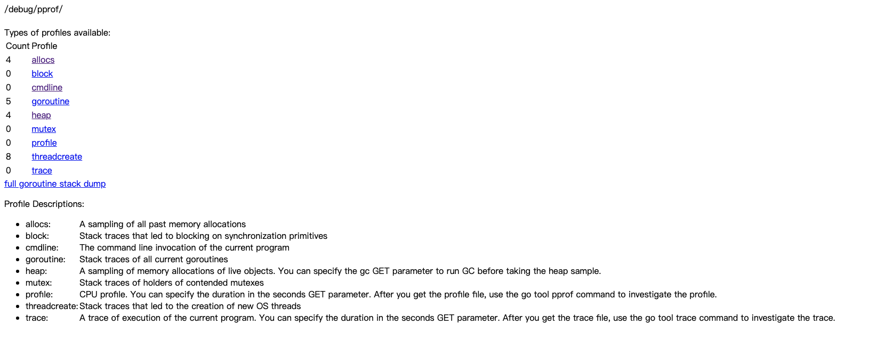
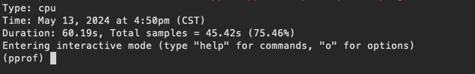
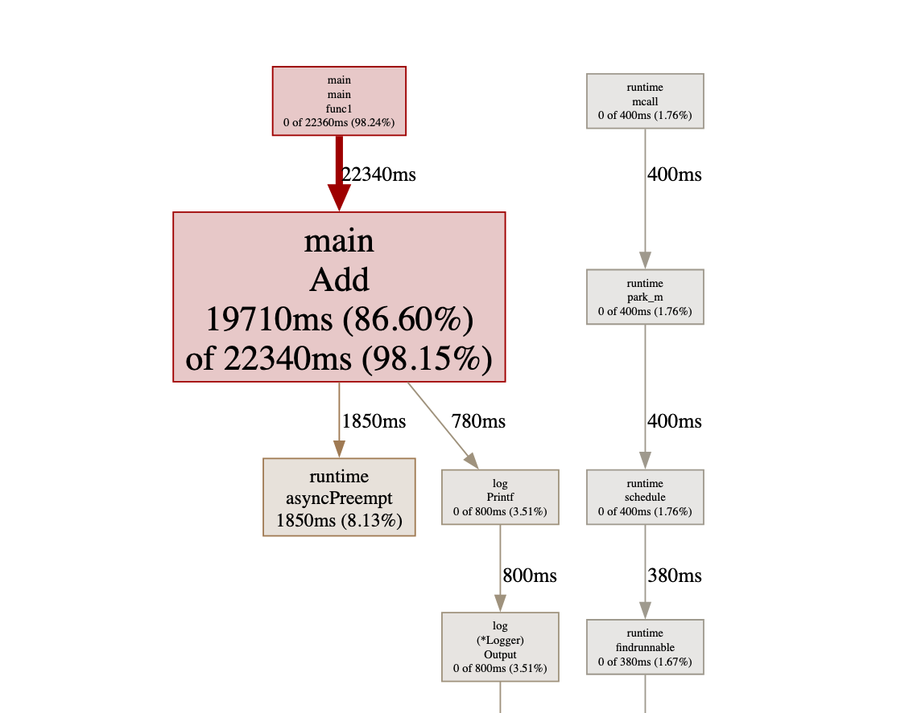
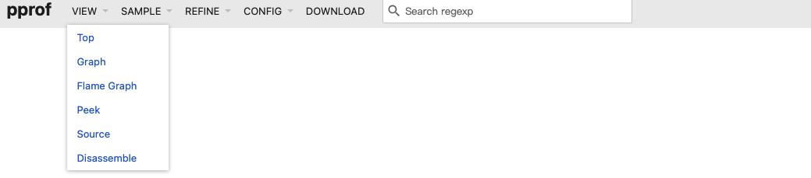
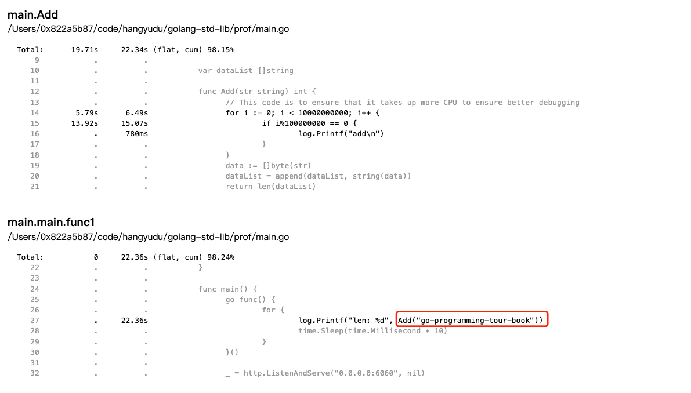

## 引用

[6.1 Go 大杀器之性能剖析 PProf（上）](https://golang2.eddycjy.com/posts/ch6/01-pprof-1/)

[golang pprof document](https://github.com/google/pprof/blob/main/doc/README.md)

[Go语言高级编程](https://chai2010.cn/advanced-go-programming-book/ch3-asm/ch3-09-debug.html)

[delve](https://github.com/go-delve/delve/tree/master)

[Golang Debugging With Delve [Step by Step]](https://golang.cafe/blog/golang-debugging-with-delve.html)

[Configuration and Command History](https://github.com/go-delve/delve/blob/master/Documentation/cli/README.md)

## pprof

pprof 是 golang 内置的一种用于调优和性能分析的工具，有三种最常用的方式使用：

1. ​		在启动时引入 `"net/http/pprof"` 包，在包中会初始化一个http服务，随后可以通过http服务对pprof进行访问；
2. 通过 `wget` 的方式访问 `/debug/pprof/profile` 接口（也需要通过`1`监听http端口）下载文件，文件可以通过 `go tool pprof` 打开并进入可视化界面；
3. 通过 `go test` 进入测试用例剖析；

### net/http/pprof

如果我们想要使用pprof服务，可以通过如下两种方式开启：

> 使用默认的handler

```go
package main

import (
	"net/http"
	_ "net/http/pprof"
)

func main() {
	_ = http.ListenAndServe("0.0.0.0:6060", nil)
}
```

> 监听指定的端口

```go
package main

import (
	"fmt"
	"log"
	"net/http"
)

const PprofPort = 19090

func main() {
	address := fmt.Sprintf("0.0.0.0:%d", PprofPort)

	pprofServer := &http.Server{
		Addr:    address,
		Handler: http.DefaultServeMux,
	}
	err := pprofServer.ListenAndServe()
	if err != nil {
		log.Fatalf("error start pprof server : %s\n", err.Error())
	}
}
```

可以看到，最简单的方式只需要引入 `net/http/pprof` 包之后，再监听http端口即可，因为在pprof包的初始化的过程中存在如下 init() 代码

```go
func init() {
	http.HandleFunc("/debug/pprof/", Index)
	http.HandleFunc("/debug/pprof/cmdline", Cmdline)
	http.HandleFunc("/debug/pprof/profile", Profile)
	http.HandleFunc("/debug/pprof/symbol", Symbol)
	http.HandleFunc("/debug/pprof/trace", Trace)
}
```

而这里将默认的handler绑定到了 `DefaultServeMux`，这个是http服务默认的handler

```go
func HandleFunc(pattern string, handler func(ResponseWriter, *Request)) {
	DefaultServeMux.HandleFunc(pattern, handler)
}
```

### example

> 以下是我们调试用的示例代码。

```go
package main

import (
	"log"
	"net/http"
	_ "net/http/pprof"
	"time"
)

var dataList []string

func Add(str string) int {
	// This code is to ensure that it takes up more CPU to ensure better debugging
	for i := 0; i < 10000000000; i++ {
		if i%100000000 == 0 {
			log.Printf("add\n")
		}
	}
	data := []byte(str)
	dataList = append(dataList, string(data))
	return len(dataList)
}

func main() {
	go func() {
		for {
			log.Printf("len: %d", Add("go-programming-tour-book"))
			time.Sleep(time.Millisecond * 10)
		}
	}()

	_ = http.ListenAndServe("0.0.0.0:6060", nil)
}
```

### usage

#### http服务

> 执行 `go run main.go` 之后，可以通过 `http://localhost:6060/debug/pprof/` 进入 pprof http服务。



显示的信息很简单，如文档描述：

- allocs: A sampling of all past memory allocations
- block: Stack traces that led to blocking on synchronization primitives
- cmdline: The command line invocation of the current program
- goroutine: Stack traces of all current goroutines
- heap: A sampling of memory allocations of live objects. You can specify the gc GET parameter to run GC before taking the heap sample.
- mutex: Stack traces of holders of contended mutexes
- profile: CPU profile. You can specify the duration in the seconds GET parameter. After you get the profile file, use the go tool pprof command to investigate the profile.
- threadcreate: Stack traces that led to the creation of new OS threads
- trace: A trace of execution of the current program. You can specify the duration in the seconds GET parameter. After you get the trace file, use the go tool trace command to investigate the trace.

这里值得一提的是 `profile`，它会在经过一段时间的分析后生成一个报告，这个报告可以基于 `go tool pprof` 打开。

#### interactive terminal

##### CPU profiling

在命令行执行

```bash
go tool pprof http://localhost:6060/debug/pprof/profile?seconds=60
```

该命令会在进行60秒的profile之后，进入一个交互终端：



在交互终端，我们可以通过各种方式来进行CPU相关的分析：

> 查看占用CPU前10的函数

```bash
top
```

得到结果

```
Showing nodes accounting for 45.33s, 99.80% of 45.42s total
Dropped 14 nodes (cum <= 0.23s)
Showing top 10 nodes out of 18
      flat  flat%   sum%        cum   cum%
    39.61s 87.21% 87.21%     44.93s 98.92%  main.Add
     3.47s  7.64% 94.85%      3.47s  7.64%  runtime.asyncPreempt
     1.87s  4.12% 98.97%      1.87s  4.12%  syscall.syscall
     0.38s  0.84% 99.80%      0.38s  0.84%  runtime.kevent
         0     0% 99.80%      1.87s  4.12%  internal/poll.(*FD).Write
         0     0% 99.80%      1.87s  4.12%  internal/poll.ignoringEINTRIO (inline)
         0     0% 99.80%      1.87s  4.12%  log.(*Logger).Output
         0     0% 99.80%      1.88s  4.14%  log.Printf
         0     0% 99.80%     44.96s 98.99%  main.main.func1
         0     0% 99.80%      1.87s  4.12%  os.(*File).Write
```

可以看到，我们的 `main.Add` 函数占用了最多的CPU时间。

##### heap

```bash
go tool pprof http://localhost:6060/debug/pprof/heap
```

这里会立即进入而不需要等待采样时间，因为堆上的数据和CPU数据不一样，是在程序执行期间一直存在的。

> 也可以查看堆内存使用前10

```bash
top
```

```
Showing nodes accounting for 3587.42kB, 100% of 3587.42kB total
Showing top 10 nodes out of 26
      flat  flat%   sum%        cum   cum%
 2562.81kB 71.44% 71.44%  2562.81kB 71.44%  runtime.allocm
  512.56kB 14.29% 85.73%   512.56kB 14.29%  syscall.runtime_envs
  512.05kB 14.27%   100%   512.05kB 14.27%  runtime.acquireSudog
         0     0%   100%   512.56kB 14.29%  runtime.doInit
         0     0%   100%   512.05kB 14.27%  runtime.gcBgMarkWorker
         0     0%   100%   512.05kB 14.27%  runtime.gcMarkDone
         0     0%   100%   512.56kB 14.29%  runtime.gopreempt_m
         0     0%   100%   512.56kB 14.29%  runtime.goschedImpl
         0     0%   100%   512.56kB 14.29%  runtime.handoffp
         0     0%   100%   512.56kB 14.29%  runtime.main
```

除此之外，还可以对 `mutex`, `goroutine` 等进行分析。

#### go tool pprof

以上的分析方式其实更适用于线上的简单情况分析，而在生产环境的应用场景下，我更倾向于直接使用 `go tool pprof` 来进行分析，因为大部分情况下操作更简单和直观。**以下的例子是对CPU使用的一个分析示例**

```bash
# 首先我们通过 wget 下载数据。
# 需要等待30s采样时间
wget http://127.0.0.1:6060/debug/pprof/profile -O cpu.profile

# 如果我们要对heap进行分析，修改下载的文件即可
wget http://127.0.0.1:6060/debug/pprof/heap -O heap.profile

# 在浏览器中打开文件
go tool pprof -http=:6001 cpu.profile
```



最终生成的结果图如上所示。


页面包含了如下所示的页面：



- top 对应于交互终端的top命令
- graph 对应于上面的图示
- flame graph 火焰图
- peek 和top命令功能一样，但是相对的增加了调用者/被调用者的信息
- source **和top命令功能一样，但是相对增加了代码的信息**，这个是我个人比较喜欢的一个功能
- disassemble 很少用到这么底层的信息

>下面是 `source` 接口的返回，我们可以很清晰的看到，整个程序中占用CPU最多的就是 `Add` 函数和 `log.Printf` 函数。而 `log.Printf` 中调用了 `Add` 函数。



#### go test

> add.go

```go
package add

import "log"

var dataList []string

func Add(str string) int {
	// This code is to ensure that it takes up more CPU to ensure better debugging
	for i := 0; i < 10000000000; i++ {
		if i%100000000 == 0 {
			log.Printf("add\n")
		}
	}
	data := []byte(str)
	dataList = append(dataList, string(data))
	return len(dataList)
}
```

> add_test.go

```go
package add

import "testing"

func BenchmarkAdd(b *testing.B) {
	for i := 0; i < b.N; i++ {
		Add("go-programming-tour-book")
	}
}
```

> 参考 [go test flags](https://pkg.go.dev/cmd/go#hdr-Testing_flags)

```bash
# cpu profile
go test -bench=. -cpuprofile=cpu.profile

# memory profile
go test -bench=. -memprofile=mem.profile
```

## delve

> Delve aims to be a very simple and powerful tool, but can be confusing if you're not used to using a source level debugger in a compiled language. This document will provide all the information you need to get started debugging your Go programs.

### Golang Debugging Code Example

> path = 'prof/fib/fib.go'

```go
package main

import "fmt"

var m = make(map[int]int, 0)

func main() {
    for _, n := range []int{5, 1, 9, 98, 6} {
        x := fib(n)
        fmt.Println(n, "fib", x)
    }
}

func fib(n int) int {
    if n < 2 {
        return n
    }

    var f int
    if v, ok := m[n]; ok {
        f = v
    } else {
        f = fib(n-2) + fib(n-1)
        m[n] = f
    }

    return f
}
```

```bash
# 执行delve
dlv debug prof/fib/fib.go
```

命令基本不用多解释，和 `gdb` 基本完全一致。

### stack

> `stack` 命令输出当前的 stack trac，在 stack 的输出中，会包含 `frame` 信息。

```bash
# print stack trace
stack

#0  0x00000000004666e0 in _rt0_amd64_linux
#   at /usr/local/go/src/runtime/rt0_linux_amd64.s:8
#1  0x0000000000000000 in ???
#   at :0
#   error: NULL address
```

### goroutine和goroutines

> goroutine相关的命令有两条：
>
> - goroutines : List program goroutines.
> - goroutine : Shows or changes current goroutine

### frame

> `frame` 可以设置当前frame，或者指定后续的 `command` 在指定的 frame 上执行。

```
Set the current frame, or execute command on a different frame.

        frame <m>
        frame <m> <command>

The first form sets frame used by subsequent commands such as "print" or "set".
The second form runs the command on the given frame.
```

### list

> `list` 显示源代码，并且可以指定 goroutine 和 frame

```
Show source code.

        [goroutine <n>] [frame <m>] list [<locspec>]

Show source around current point or provided locspec.
```

```bash
# 使用 包.函数 增加一个断点
b main.main

# 执行程序
r

# 进入main函数
n

# 查看当前执行代码
list
# > main.main() ./fib.go:7 (hits goroutine(1):1 total:1) (PC: 0x49b18f)
#      2:
#      3: import "fmt"
#      4:
#      5: var m = make(map[int]int)
#      6:
# =>   7: func main() {
#      8:         for _, n := range []int{5, 1, 9, 98, 6} {
#      9:                 x := fib(n)
#     10:                 fmt.Println(n, "fib", x)
#     11:         }
#     12: }

# 为了方便调试，我们在以下行添加一个断点
# fmt.Println(n, "fib", x)
# 通过函数的相对行数打断点
b main.main:3
# 也可以通过文件名加绝对行数打断点
# b ./fib.go:10

# 继续
c
# > main.main() ./fib.go:10 (hits goroutine(1):1 total:1) (PC: 0x49b272)
#      5: var m = make(map[int]int)
#      6:
#      7: func main() {
#      8:         for _, n := range []int{5, 1, 9, 98, 6} {
#      9:                 x := fib(n)
# =>  10:                 fmt.Println(n, "fib", x)
#     11:         }
#     12: }
#     13:
#     14: func fib(n int) int {
#     15:         if n < 2 {

# 查看x的值
#5
print x

# 也可以通过 display 在每次执行后都输出x，我觉得这里用watch来表示更加直观
display -a x
```

