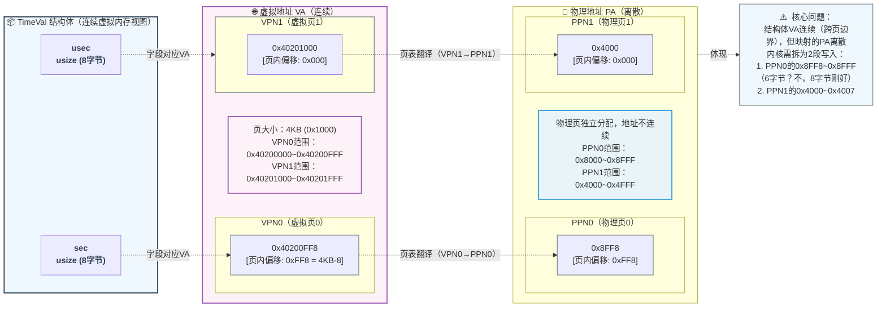

# rCore-地址空间拓展实现

## sys_get_time




> 在引入虚拟内存之后，`sys_get_time` 的原本实现已经失效，我们现在重新实现该逻辑。

新增 `sys_get_time` 逻辑相当简单，我们只需要复用之前的系统时钟获取时间戳，在内核态找到对应的物理地址并更新即可，但是仍然有几个值得留意的点：

1. 用户程序使用的是 VA，所以他的指针传到kernel时，我们需要将它转换为PA；
2. 如果用户指针指向的对象，不在同一页怎么办？举个简单的例子，我们的页大小是4KB，我们的对象大小超过了4KB，那他必然被分到两页 -- **这个时候我们面临的问题是，对于用户程序来讲，VA是连续的；但是对于内核来讲，PA不一定是连续的！**

我们的实现就必须处理内存分段映射这个逻辑，具体的实现可以查看这个 [commit](https://github.com/LearningOS/2025a-rcore-0x822a5b87/commit/c64709a084641f8585b14d8930e7c5b4ed0abe90)。

> 在 `io.rs` 中，我们实现了将struct抓换为 `[u8]` 的逻辑。

### serialize_struct

```rust
/// write the struct to physical address range
pub fn serialize_struct<S>(s: &S, pa_range: Vec<&'static mut [u8]>) where S: SerializeToBytes {
    let bytes = s.as_bytes();
    let mut bytes_written = 0;
    for slice in pa_range {
        let len = slice.len().min(bytes.len() - bytes_written);
        slice[..len].copy_from_slice(&bytes[bytes_written..bytes_written + len]);
        bytes_written += len;
        if bytes_written >= bytes.len() {
            break;
        }
    }
}
```

### SerializeToBytes

```rust
/// io.rust
/// structs that implement this trait can be serialized to and deserialized from byte slices
#[allow(dead_code)]
pub trait SerializeToBytes: Copy + 'static {
    /// serialize struct with specific trait to byte slice
    fn as_bytes(&self) -> &[u8] {
        unsafe {
            core::slice::from_raw_parts(
                self as *const Self as *const u8,
                core::mem::size_of::<Self>(),
            )
        }
    }

    /// deserialize byte slice to struct with specific trait
    fn from_bytes(bytes: &[u8]) -> Option<&Self> {
        if bytes.len() != core::mem::size_of::<Self>() {
            return None;
        }
        unsafe { Some(&*(bytes.as_ptr() as *const Self)) }
    }
}
```

> 在 `mm.rs` 中，我们处理了将 `[u8]` 分段的复制到物理内存的逻辑。

```rust
/// mm.rs

//! utilities for memory management

use crate::mm::{PageTable, StepByOne, VirtAddr, VirtPageNum};
use alloc::vec::Vec;

/// Translate a virtual address to a physical address through page table
pub fn translate_va_to_pa(token: usize, ptr: *const u8, len: usize) -> Vec<&'static mut [u8]> {
    let mut v = Vec::new();
    let page_table = PageTable::from_token(token);
    let mut start = ptr as usize;
    let end = start + len;

    while start < end {
        let start_va = VirtAddr::from(start);
        let mut vpn = VirtPageNum::from(start_va.floor());
        let ppn = page_table.translate(vpn).unwrap().ppn();
        vpn.step();
        let end_va = VirtAddr::from(end.min(VirtAddr::from(vpn).into()));
        if end_va.aligned() {
            v.push(&mut ppn.get_bytes_array()[start_va.page_offset()..]);
        } else {
            v.push(&mut ppn.get_bytes_array()[start_va.page_offset()..end_va.page_offset()]);
        }
        start = end_va.into();
    }
    v
}
```

## sys_trace

> 这里再贴一下 `sys_trace` 的实现要求：
>
> ```rust 
> fn sys_trace(_trace_request: usize, _id: usize, _data: usize) -> isize
> ```
>
> - 调用规范：这个系统调用有三种功能，根据 `trace_request` 的值不同，执行不同的操作：
>   - 如果 `trace_request` 为 0，则 `id` 应被视作 `*const u8` ，表示读取当前任务 `id` 地址处一个字节的无符号整数值。此时应忽略 `data` 参数。返回值为 `id` 地址处的值。
>   - 如果 `trace_request` 为 1，则 `id` 应被视作 `*mut u8` ，表示写入 `data` （作为 `u8`，即只考虑最低位的一个字节）到该用户程序 `id` 地址处。返回值应为0。
>   - 如果 `trace_request` 为 2，表示查询当前任务调用编号为 `id` 的系统调用的次数，返回值为这个调用次数。**本次调用也计入统计** 。否则，忽略其他参数，返回值为 -1。
> - 说明：
>   - 你可能会注意到，这个调用的读写并不安全，使用不当可能导致崩溃。这是因为在下一章节实现地址空间之前，系统中缺乏隔离机制。所以我们 **不要求你实现安全检查机制，只需通过测试用例即可** 。
>   - 你还可能注意到，这个系统调用读写本任务内存的功能并不是很有用。这是因为作业的灵感来源 syscall 主要依靠 trace 功能追踪其他任务的信息，但在本章节我们还没有进程、线程等概念，所以简化了操作，只要求追踪自身的信息。
> - 此外，由于本章我们有了地址空间作为隔离机制，所以 `sys_trace` **需要考虑一些额外的情况**：
>   - 在读取（`trace_request` 为 0）时，如果对应地址用户不可见或不可读，则返回值应为 -1（`isize` 格式的 -1，而非 `u8`）。
>   - 在写入（`trace_request` 为 1）时，如果对应地址用户不可见或不可写，则返回值应为 -1（`isize` 格式的 -1，而非 `u8`）。

本程序的实现依然比较简单，但是考虑到**从物理内存中`读数据`与`写数据`**是一个相当通用的需求，所以我们的需要抽象两个独立的函数来帮助我们完成，完整的代码请查看 [commit](https://github.com/LearningOS/2025a-rcore-0x822a5b87/commit/90334f3d41b6265d3925938ea91b981748236099)。

### read

函数的逻辑非常简单，就是将 `连续的VA` 映射为一个 `可能分段的PA`，并返回 `pa_range` 的引用，再使用我们之前定义的 `from_bytes` 接口将数据反序列化成对应的对象。

```rust
/// read `S` from physical address range
pub fn read<S>(token: usize, ptr: *const u8, len: usize) -> Result<S, &'static str>
where
    S: SerializeToBytes,
{
    let flags = PTEFlags::V | PTEFlags::A | PTEFlags::R;
    let auth = auth_check(token, ptr, len, flags);
    if !auth {
        Err("unauthorized access")
    } else {
        let pa_range = crate::util::mm::translate_va_to_pa(token, ptr, len);
        let mut data = Vec::new();
        for slice in pa_range {
            data.extend_from_slice(slice);
        }

        let x = S::from_bytes(&data).copied();
        let res = match x {
            Some(v) => Ok(v),
            None => Err("failed to deserialize"),
        };
        res
    }
}

```

### write

`write` 也是同样的思路，将 `连续的VA` 映射为一个 `可能分段的PA`，并返回 `pa_range` 的引用，使用我们之前定义的 [serialize_struct](#serialize_struct) 来序列化到物理内存。

```rust
/// write `S` to physical address range
pub fn write<S>(s: &S, token: usize, ptr: *const u8, len: usize) -> Result<usize, &'static str>
where
    S: SerializeToBytes,
{
    let flags = PTEFlags::V | PTEFlags::A | PTEFlags::R;
    let auth = auth_check(token, ptr, len, flags);
    if !auth {
        Err("unauthorized access")
    } else {
        let pa_range = crate::util::mm::translate_va_to_pa(token, ptr, len);
        let serialized_size = serialize_struct(s, pa_range);
        Ok(serialized_size)
    }
}
```

### auth_check

此外，我们不能信任用户传递的数据，我们必须要对地址进行检验 -- **这里值得注意的是，权限的检验是以PTE作为单位来检验的。**

```rust
/// Check whether a virtual address range has the required permissions
pub fn auth_check(token: usize, ptr: *const u8, len: usize, auth_flags: PTEFlags) -> bool {
    let pte_list = translate_entries(token, ptr, len);
    for pte in pte_list {
        if pte.flags() & auth_flags != auth_flags {
            return false;
        }
    }
    true
}
```

### translate_entries

```rust
/// Get all entries of a virtual address range
pub fn translate_entries(token: usize, ptr: *const u8, len: usize) -> Vec<PageTableEntry> {
    let mut v = Vec::new();
    let page_table = PageTable::from_token(token);
    let mut start = ptr as usize;
    let end = start + len;

    while start < end {
        let start_va = VirtAddr::from(start);
        let mut vpn = VirtPageNum::from(start_va.floor());
        let pte = page_table.translate(vpn).unwrap();
        v.push(pte);
        vpn.step();
        let end_va = VirtAddr::from(end.min(VirtAddr::from(vpn).into()));
        start = end_va.into();
    }
    v
}
```

## mmap 和 munmap
