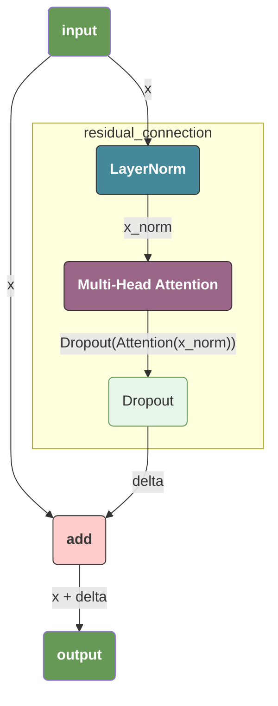
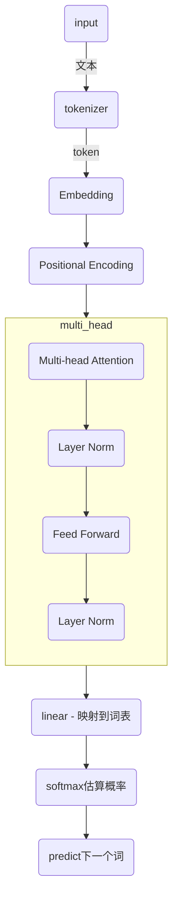

> 本文记录了学习 `transformer` 架构中的一些疑问。

# `transformer` 的数据流转

1. **Input** $\to$ **Embedding** + **Positional Encoding** (得到初始 $x$)

2. **进入第 $L$ 层**：

   - $x \to W_{Q,K,V} \to Q, K, V$ (特征投影)

   - $\text{Softmax}(\frac{QK^T}{\sqrt{d_k}}) \cdot V \to$ **Context Vector** (全局社交)

   - **Context Vector** $\cdot W_O \to$ **$\Delta_{attn}$** (多头融合)

   - $x + \Delta_{attn} \to$ **LayerNorm** $\to$ **$x_{mid}$** (第一次残差与归一化)

   - $x_{mid} \to FFN \to$ **$\Delta_{ffn}$** (深度逻辑推理)

   - $x_{mid} + \Delta_{ffn} \to$ **LayerNorm** $\to$ **$x_{out}$** (第二次残差与归一化)
   - **$x_{out}$ 作为下一层的输入**，循环往复。

**最后一层输出** $\to$ **Output Linear** $\to$ **Softmax** $\to$ **预测单词**。

# 整数位置编码

整数位置编码是按照 token 出现的顺序，为他们分配一个单调递增的索引，这种编码方式的有点是简单，缺点则有很多：

## 梯度异常

在训练过程中，神经网络通过梯度来更新参数。假设我们有一个最简单的线性层：
$$
y = w \cdot p + b
$$

其中 $p$ 是位置编码（Position Encoding），$w$ 是权重。

另外，我们的损失函数为：
$$
L = (y - \hat{y})^2
$$
当我们计算损失函数 $L$ 对权重 $w$ 的梯度时，根据链式法则：
$$
\frac{\partial L}{\partial w} = \frac{\partial L}{\partial y} \cdot {\color{red} \frac{\partial y}{\partial w}}
$$
因为 $y = w \cdot p + b$，所以 $\frac{\partial y}{\partial w} = p$。

最终梯度为：
$$
\frac{\partial L}{\partial w} = (\text{来自上层的误差}) \cdot \mathbf{p}
$$
此时，我们面临几个关键性的问题：

1. 假设我们现在在一个超大上下文中，那么在 `1024 * 1024` 这个位置的 token，它的任何误差都会被放大一个极大地倍数，这使得我们的训练梯度完全不可控；
2. **参数更新逻辑异常，一样的误差在句首和句尾相差太多；神经网络学习的理想状态是：无论一个模式出现在句首还是句尾，模型都应该以同样的力度去学习它。**

## 位置信息不可控

在LLM中，**相对距离**比绝对位置更重要。比如“我”和“吃”相隔 1 个单位，无论它们出现在句首还是句尾，这种“ 1 个单位”的关系应该是恒定的，这会引入两个问题：

> 虽然 $2-1=1$，$100-99=1$，在算术上它们是相等的。但在神经网络的高维空间里，向量 $[1]$ 和 $[2]$ 的差异，与 $[99]$ 和 $[100]$ 的差异，经过复杂的非线性变换后，**很难保持一致性**。
>
> 此外，模型很难通过简单的 $n$ 识别出两个位置信息的距离；

神经网络的核心是 **点积（Dot Product）** 和 **激活函数（如 ReLU, Sigmoid）**。

- **在小数值区（1 和 2）**：这两个数字通常处于激活函数的**剧烈变化区**。通常少量的差异便可以使得模型能感觉出来数值的差异；
- **在大数值区（比如 99 和 100）**：这两个数字极易让神经元进入**“饱和区”**。例如，对于 `Sigmoid` 这种指数级的激活函数，99 和 100 算出来的输出几乎都是 $1.0000...$。**此时，模型已经无法区分这两个位置的信息了**。

# 正弦/余弦编码

### 范围可控

$$
PE_{(pos, 2i)} = \sin\left(\frac{pos}{10000^{2i/d_{model}}}\right)
$$

$$
PE_{(pos, 2i+1)} = \cos\left(\frac{pos}{10000^{2i/d_{model}}}\right)
$$

在 `正弦/余弦编码` 中，我们所有的位置参数被压缩到 `(-1, 1)` 的这个区间中，这个公式巧妙的利用了这些性质：

- 通过 `sin/cos` 函数的压缩最大值和最小值，避免由于数值膨胀引起的梯度爆炸，训练不平等等问题；
- 通过 $10000^{2i/d_{model}}$ 控制不同维度的步长，同时使用非线性的函数逻辑，避免了数据聚集过于紧密；
- 此外，由于是非线性函数，我们不用担心在 `pos` 增加相同数值时点会出现重合 -- 他们在多维空间中会很接近但是**唯一**。

### 位置敏感

通过将位置参数压缩在 `(-1, 1)` 避免了在非线性函数调用时引起的位置信息不敏感；

### 相对位置的线性性

三角函数可以分解为：
$$
\sin(pos + k) = \sin(pos)\cos(k) + \cos(pos)\sin(k)
$$

$$
\cos(pos + k) = \cos(pos)\cos(k) - \sin(pos)\sin(k)
$$
这意味着，如果模型想要知道在移动 `k` 之后的位置在哪里，只需要对当前的编码向量进行一次**线性变换（矩阵乘法）**，在这点上他和普通的位置编码十分相似。

# 为什么`transformer`需要位置向量

在传统的 `RNN` 中 是一个一个词读的，天生有先后顺序；但 Transformer 是一次性把所有词丢进去（并行计算）。如果没有位置编码，在 Attention 机制眼里，`我爱他` 和 `他爱我` 的数学表达是**完全一样**的。位置编码本质上是给输入注入了**结构化的时间轴**。

# Layer Normalization

在深度学习中，有两种最常用的归一化技术：

- **Layer Normalization (LN)** 在**单个样本**的所有特征维度上进行计算，不依赖其他样本。多用于自然语言处理（NLP），尤其是 **Transformer** 架构中；
- **Batch Normalization (BN)** 在**整个输入**上进行计算，依赖于其他样本，多用于计算机视觉（CV）中；

Transformer 舍弃 BN 而选择 LN，主要源于以下三个物理和数学上的底层逻辑：

1.  **序列长度的限制**：在图像处理中，由于经过了 **Resize** 和 **Crop**，输入的图片矩阵（如 $224 \times 224$）在空间结构上是**严格对齐**的。并且，无论图片内容是什么，像素值的取值范围（0-255）和分布相对稳定。而在NLP中，每个句子的长度都是不一样的，特征维度在时间轴上是不对齐的**。
2.  **训练和预测的冲突**：BN 需要使用训练时记录下来的“全局均值/方差”。如果推理时的句子长度分布与训练时不一致，或者输入了一个极其罕见的超长句子，BN 的效果会迅速崩塌。
3.  **语义维度的“稳定性”**：在 Transformer 的多头注意力机制中，信息的分布非常复杂。
    - **BN 带来的噪声**：BN 会强行让不同样本（不同句子）之间的特征产生联系。这在 NLP 中会引入不必要的干扰——因为两个完全无关的句子，它们的特征不应该互相影响。
    - **LN 的保护**：LN 保证了每一个 Token 的 Embedding 在经过非线性变换后，依然保持良好的数值范围，同时又保留了该词在当前语境下的独特含义。

### Layer Normalization 算法的实现

> LayerNorm 遵循两个简单的规则：
>
> 1. **均值为零**：所有数字的平均值变成 `0`；
> 2. **方差为一**：数字的"分散程度"变成 `1`；
>
> 从这里其实也可以看到，为什么我们的位置编码要使用复杂的 `sin/cos` 编码而不是位置编码（当然，现在已经有了比正弦/余弦编码更优秀的 `RePO` 编码。

在当前的深度学习生态中，最常用的 Layer Normalization 实际上已经从原始的 **Standard LayerNorm** 进化到了更精简的 **RMSNorm (Root Mean Square Layer Normalization)**。

- **标准 LayerNorm**：
  1. 计算均值 ($\mu$)
  2. 计算方差 ($\sigma^2$)
  3. 减去均值，除以标准差 (再进行 Scale 和 Shift)
- **RMSNorm**：
  1. **直接计算均方根 (RMS)**：$\text{RMS}(x) = \sqrt{\frac{1}{d} \sum x_i^2}$
  2. **归一化**：$\bar{x}_i = \frac{x_i}{\text{RMS}(x)}$
  3. **可学习缩放**：$y_i = \gamma \cdot \bar{x}_i$

### 标准 LayerNorm

我们先算出它的**均值** $\mu$ 和**方差** $\sigma^2$：
$$
\mu = \frac{1}{d} \sum_{i=1}^{d} x_i
$$

$$
\sigma^2 = \frac{1}{d} \sum_{i=1}^{d} (x_i - \mu)^2
$$

然后根据 LayerNorm 的公式，对每一个 $x_i$ 进行变换，得到新的一组数 $\hat{x}_i$：
$$
\hat{x}_i = \frac{x_i - \mu}{\sigma}
$$

#### 证明：新均值为 0

**证明过程：**
$$
\sum_{i=1}^{d} \hat{x}_i = \sum_{i=1}^{d} \left( \frac{x_i - \mu}{\sigma} \right)
$$

把常数项 $1/\sigma$ 提出来：
$$
= \frac{1}{\sigma} \left( \sum_{i=1}^{d} x_i - \sum_{i=1}^{d} \mu \right)
$$

根据均值的定义，$\sum x_i = d \cdot \mu$，而 $\mu$ 是常数，$\sum \mu$ 也是 $d \cdot \mu$：
$$
= \frac{1}{\sigma} (d\mu - d\mu) = 0
$$

#### 证明：新方差为 1

要证明：
$$
Var[\hat{x}] = \frac{1}{d} \sum (\hat{x}_i - E[\hat{x}])^2
$$
现在我们对整个求和式进行拆分（注意：$E[x]$ 对求和号 $\sum$ 来说是一个**常数**）：
$$
\frac{1}{d} \sum (x_i^2 - 2x_i E[x] + E[x]^2) = \frac{1}{d} \sum x_i^2 - \frac{2 E[x]}{d} \sum x_i + \frac{1}{d} \sum E[x]^2
$$
利用 $E[x] = \frac{1}{d} \sum x_i$，我们可以继续简化：

- 中间项：$\frac{2 E[x]}{d} \sum x_i = 2 E[x] \cdot E[x] = 2(E[x])^2$
- 最后一项：$\frac{1}{d} \cdot d \cdot E[x]^2 = (E[x])^2$

合并后得到通用公式：
$$
Var[X] = E[X^2] - (E[X])^2
$$

# 什么是`Temperature`

**我认为 `Temperature` 是一个产品上的概念，从工程的角度来说， `Temperature` 并不存在实际意义。**它的作用主要是控制模型的 `随机性`。例如：当我们在预测一个人的食物偏好时，LLM可能先推测出 “我爱吃...” 这句话，随后推测的结果可能有：

- `苹果` 概率为50%；
- `榴莲` 概率为 49%；
- `粑粑` 概率为 1%（嗨嗨嗨，老八来了）；

而温度对于我们的影响如下：

- **Low Temperature (T < 1)**：模型会变得非常**保守和确定**。它会极度偏向概率最高的词（The most likely token），生成结果通常更稳定、更符合逻辑，但也更单调。
- **High Temperature (T > 1)**：模型会变得非常**大胆和随机**。原本概率较低的词也会获得出头的机会，生成结果更有创意、更多样，但也更容易产生幻觉（Hallucination）或胡言乱语。
- **T = 1**：这是模型的“原始状态”，完全按照训练时的概率分布进行采样。

也就是说：

- 对于 `T < 1` ，LLM 大概率会输出 `苹果`；
- 对于 `T < 1`， LLM 则有可能在 `苹果` 和 `榴莲`  中选择性的输出一个词；
- 对于 `T > 1`，LLM 则开始会随意的在 `苹果` 和 `榴莲` 中随机选择，当T极高的情况下，甚至可能直接输出 `粑粑` 这个概率极低的词。

### `temperature`的实现

在我们实现 `softmax` 时，我们原始的 `softmax` 定义如下：
$$
\sigma(x)_i = \frac{e^{x_i}}{\sum_{j=1}^{n} e^{x_j}}
$$
**问题在于，这个函数在数学上的定义是没有问题的，但是在计算机里一个指数级的函数必然会引起数值溢出。为此 `softmax` 函数会进行一个优化：在每次执行之前，将任意的 $x_i$ 除以数组中的最大值 $x_{max}$**，于是一个不做任何优化的 `softmax` 函数会包含如下的步骤：

1. 求解数组中的最大值 $x_{max}$；
2. 将数组中的每一个值都 `减去` $x_{max}$（注意，这里是减去，使用除法会修改原始结果）；
3. 求解 `softmax` 的分母：$\sum_{j=1}^{n} e^{x_j}$；
4. 求解 `softmax` 的每一个元素的值；

**而温度（Temperatur），也就是 `T`，我们最直接的方式就是在第二步时，我们计算：**
$$
x_i = \frac{(x_i - x_{max})}{T} 
$$
此时我们易知：对于指数型函数，越大的输入处的斜率越大，也就是说我们除以一个大于1的数字，越大的数字减少得越多：

- `T > 1` softmax 后得到的概率越发的紧密：概率之间的差距变小了；
- `T < 1` softmax 后得到的概率更加的离散；概率之间的差距变大了。

### temperature的物理意义

我们前面提到的“斜率”和“差距变小”在数学上对应的是**信息熵（entropy）**：

- 当 $T \to \infty$ 时，所有的 $x_i/T$ 都趋向于 $0$，导致 $e^0 = 1$。此时每个词的概率都是 $1/N$，系统达到**最大混乱度（最大熵）**。
- 当 $T \to 0$ 时，最大值和次大值之间的微小差距被无限放大，概率分布坍缩成一个**脉冲函数（Delta Function）**。

### softmax在工程上的优化

前面我们提到，softmax在不做任何优化的情况下有四步，而对于一个 element-wise 的典型的访存受限的算子来说，三次的访问显然是不合理的，我们使用优化的 **Online Softmax** 算法。简单来说就是，我们可以利用下面的公式：
$$
Sum_{new} = Sum_{old} \cdot e^{(m_{old} - m_{new})} + e^{(x_{new} - m_{new})}
$$
这个公式的证明和推导也比较简单，就是通过数学归纳法来实现，这里就不赘述了。碰到更大值时使用下面公式更新：
$$
Sum_{new} = Sum \times e^{(m_{max} - m_{new})} + 1
$$

# 为什么位置信息如此重要

在 `transformer` 中，位置信息非常重要，**因为transformer的本质就是 “高维空间的动态重塑”。**每一个token都有它的初始位置。两个token之间，可能在某个维度上相距非常近，在另外一个维度上又相距非常远。

例如，苹果和香蕉，它在水果（假设存在这个维度）这个维度上距离非常近，但是当苹果表示科技公司这个维度时，他和香蕉的距离又非常远。而我们在叠加位置向量的目的是为了更精确的表示token在输入中的实际位置。

所以，当我们在进行语义表达时，**attention分数和位置息息相关**，以下面的句子为例子：

> `苹果`公司不卖`苹果`。

在这个句子里，第一个 `苹果` 和第二个 `苹果` 语义截然不同：

- 第一个的 `attention` 应该更多的放在 `公司` 上；
- 第二个的 `attention` 应该更多的放在 `卖` 上；

如果丧失了位置信息，那我们将根本无法区别这个语义。

而位置信息通过以下几个方式来实现对高位空间的动态重塑：

- **破坏attention的对称性**：在计算 $Attention(Q, K)$ 时，公式是 $Q \cdot K^T$。这意味着，在不包含位置信息的情况下，如果把输入序列里的两个 Token 交换位置，由于矩阵乘法的特性，计算出来的相似度分数是一模一样的。在**叠加位置向量后**：我们给每个 Token 的高维坐标加了一个**“时间戳”**：前者和后者朝不同的方向移动了，这意味着他们从一样的token变成了不一样的token -- 他们在高维空间中的位置改变了；
- **修改了语义的权重**：在自然语言中，**距离**本身就代表了**语义权重**，调整位置就相当于调整了语义的权重。**例如，在我们的这个例子中，我们可以认为当 `苹果` 在前面时，它会朝主语语义移动。当 `苹果` 在后面时，它会超宾语语义移动（当然，这只是个例子，实际的维度并不包含主语和宾语这个维度）**；  

# 向量@矩阵和矩阵@矩阵的差别

虽然在计算机底层它们都调用同一个 `GEMM`（通用矩阵乘法）算子，但在 **Transformer 的高维几何思维**中，它们确实代表了截然不同的物理行为：

- **向量@矩阵**是对向量进行线性变化，将向量由原基向量表示的坐标转换到由新的基向量表示的坐标；
- **矩阵@矩阵** 表示矩阵和矩阵之间的重合程度；

简单来说，假设我们存在 $[m, k] @ [k, n]$  的矩阵乘法得到 $[m, n]$ 的矩阵，可以视作 `m` 次 $[1, k] @ [k, n]$ 的矩阵乘法。

例如，对于 $h @ W_q$ 来说：

- $h$ 是 Token 在这一层的综合表示。
- $W_q$ 的每一列都是一个新的**基向量**。
- 乘法的结果是：这个 Token 在查找这个特定子空间里的新坐标。

对于$Score = Q @ K^T$：

- $Q$ 是一组 Token 的搜索信号，$[q_1, q_2, \dots, q_n]$。
- $K^T$ 是一组 Token 的被搜索标签。
- 结果矩阵中的每一个点 $S_{i,j}$，都是第 $i$ 个词和第 $j$ 个词的**投影面积**。

# 残差网络和Dropout

残差网络的定义可以参考 [ResidualConnection](#residualconnection) 这一小节，我们需要知道的是，**残差网络（Residual Connection / Skip Connection）不是一个像“全连接层”或“卷积层”那样有参数、有运算逻辑的实体组件，它本质上是一种“数据通信协议”。**

在我们的transformer中，一个残差网络可以表示为：
$$
f(x) = x + \Delta
$$
而我们的整个数据流转路径如下：

这张图有几个重要的点：

1. 输入分为两条独立的通道，一条进入残差网络计算 $\Delta$，一条不被 `LayerNorm` 的缩放干扰，也不被 `Attention` 的非线性扭曲，直接进入输出逻辑；
2. **这里一定要注意，`x` 必须不受到任何干扰。比如，如果我们将 `x` 输入到 `LayerNorm` 层后从 `LayerNorm` 的结果输出到 `add`，那么此时我们已经完全丧失了在 $\Delta$ 异常时恢复 `x` 的能力**；并且，如果每一层都只拿“被归一化”后的 $x$ 去加 $\Delta$，那么每一层都会丢失掉上一层关于特征绝对强度的信息。
3.  Dropout 必须作用在 Attention 之后，而不是 Layer Norm 之后：如果 Dropout 放在 Layer Norm 后，我们会在 Attention 还没开始计算时就丢弃一部分输入。
4. **`dropout` 会随机的关闭一些神经元，目的是防止程序过拟合，同时保证在出现数据噪点时依然可以正常工作。**举例来说，就好比我们要在市区间通行，我们通常可以选择火车，高铁，飞机，汽车。每一个交通工具都有自己的优势和劣势，使用 dropout 的意义是，随机的关闭任意一个交通工具以增强我们的通勤的健壮性。否则，神经元很有可能始终选择某个最舒服的通勤方式（比如高铁），而在现实中，当高铁异常时我们的程序直接崩溃。

## dropout

1. `dropout` 非常像我们日常在实现数据库或者其他的分布式系统时的一个概念：`容灾`。不引入 `dropout` 的最大风险点在于，如果这个神经元因为噪声波动了，整个模型就误判了。在引入 `dropout` 后，模型被迫把知识分布在所有的神经元中，程序更加的健壮；
2. **多模型投票**：每一次 Dropout 掉不同的神经元，其实都在产生一个**稍微不同的小模型**，训练过程中，我们实际上是在训练**成千上万个微型模型**的组合。**推理时**：当我们关掉 Dropout，就相当于让这成千上万个小模型进行了一次**集体投票**。这种“集成学习”的效果让模型对没见过的数据（泛化）表现极好。

# 自注意力和交叉注意力

自注意力和交叉注意力**都是 $Q, K, V$ 的投影和重合度计算**，`数据来源` 决定了它们的本质不同。

- **自注意力 (Self-Attention)** 的 $Q, K, V$ 全都来自同一个输入序列。在 transformer 架构中，我们只使用了自注意力，因为对于LLM来说，**只有一个输入序列**。
- **交叉注意力（Cross-Attention）** 中 $Q$ 来自一个地方，$K$ 和 $V$ 来自另一个地方。这是在 **Encoder-Decoder 架构**（比如机器翻译）中出现的模式。例如，我们需要将 `Hello world.` 翻译为 `你好世界。`，在这个例子中，前者是 `encoder` 关注的内容，后者是 `decoder` 关注的内容。

注意，不论是自注意力还是交叉注意力，无论 $Q$ 从哪来，**$K$ 和 $V$ 永远是成对出现的，且来源相同。**

# 训练和推理中的batch参数

在我们的训练过程中，为了更充分的利用GPU的性能，我们通常会将多个不相关的逻辑并行的执行，而这里的这个所谓的**不相关的逻辑**就是我们的 batch 参数。

- 在训练的场景下，`batch` 表示的是若干个**完全独立**的任务（不同的语料）；
- 在推理的场景下，`batch` 表示的是若个完全独立的用户；

在训练时，`batch_size` 决定了模型参数更新的**稳健度**，它同时计算 $N$ 个语料的梯度。模型不会被某一个语料误导，而是使用多个语料训练得到一个综合的值；

在推理时，`batch_size` 决定了系统的**吞吐量**。当 100 个人同时问 AI 题目时，服务器不会排队一个一个回。它将这些请求“拼”成一个 Batch 跑一次前向传播。`batch_size` 越大，单位时间内处理的请求越多，但每个用户感受到的延迟可能会略微增加。

这里需要注意的是，在我们训练时，假设存在 《菜谱》 和《科技》 两个不同的语料库，其中都会有 `苹果` 这个词，分别表示水果和科技公司。

那么在训练时，在batch不同的两个任务中，首先都会从词库中去获取 embedding 向量（此时他们拿到的向量是一样的），**随后在训练中，他们不断的迭代更新自己内部持有的向量，在训练结束时都会更新embedding向量 -- 而这个更新是两个语料库训练结果的共同作用，苹果从此同时包含了水果和科技公司的语义**。

# FFN(Feed-Forward Network)

> 如果说 **Attention（注意力机制）** 的作用是让 Token 之间进行“信息交换”和“找关系”，那么 **FFN** 的作用就是对每个 Token 进行**“深度加工”和“知识提取”**。
>
> 它的核心逻辑可以总结为：**“先升维空间进行非线性转换，再降维整合。”**

我们可以再次回顾我们的整个的 `attention` 计算过程：
$$
\text{Attention}(Q, K, V) = \text{Softmax}\left(\frac{QK^T}{\sqrt{d_k}}\right)V
$$
整个的过程转换是：

1. $E_{token}$  将token转换为向量；
2. $E_{position}$ 为向量增加位置向量信息；
3. 和每一层的 $W_{Q} W_{K} W_{V}$ 相乘，得到 $Q, K, V$，**注意，在这里我们的 $Q, K, V$ 中的每一个向量，都已经包含根据权重矩阵分配后的每一个元素的向量的全部维度的值；换句话说，这些维度已经融合了 -- 我们中有我，我中有我们。**
4. $Attention$ 中
   1. 我们先在括号中通过计算得到了一个矩阵 $\text{Softmax}\left(\frac{QK^T}{\sqrt{d_k}}\right)$， 这个矩阵中的每一个元素 $E_{ij}$ 都包含了 $Q_i$ 和 $K_j$ 的结合计算的分数；也就是此时，我们开始出现单个token和单个token的融合，这是一个 $N * N$ 的矩阵；
   2. 此时，我们已经得到了分数，我们需要将这个分数再次还原为语义：$Output = \text{Score}_{n \times n} \times V_{n \times 512}$，V的每一行代表一个 token 的维度内容（Value），每一列（共 512 列）代表特征的不同维度。
   3. 此时，我们的分数矩阵的 $E_{ij}$  是 $Q_i$ 和 $K_j$ 的结合后计算的分数；我们的V矩阵的元素 $E_{ij}$ 是 `token[i]` 的第 `j` 个维度的value；那么我们就将**token的两两结合，转换成了全部的token集合**。

**在经历了上面的全部步骤之后，我们现在得到了一个 $N * d_{model}$ 的矩阵，其中 $E_{ij}$ 表示了 `token[i]` 和 `所有token的第j个维度的value的结合`**

在这个过程中：

1. `<3>` 这一步的物理意义是**特征转换（Projection）**；
2. `<4.3>` 这一步的物理意义是** **Global Context Injection（全局语境注入）**。**

**随后，我们进入到我们真正的逻辑推理（FFN）：我们之前的 `Attention` 阶段，都是对我们已经存在的信息的提取。而 `FFN` 在实际上执行了两个事：非线性决策和模式存储**。

## 非线性激活

在数学上，Attention 无论怎么算，本质上都是在做**加权平均**（线性组合）：例如，在我们前面提到的最终矩阵中，$E_{ij}$ 表示了 `token[i]` 和 `所有token的第j个维度的value的结合`。**而这个矩阵是基于线性组合得到的，这意味着我们无法产生任何的复杂推理：例如，在线性组合下，水烧到200°时仍然是水，然而水在100°时便变成了水蒸气，这个过程并不是线性的。**

**此时，我们就需要引入我们的各种激活函数：`ReLU`，`GeLU`**：在引入这些函数之后，我们可以将我们的线性组合改变为非线性组合。简单来说，假设某个值不满足一定的条件，我们就认为它已经失效（这里失效是一个代称，例如我认为 `token[i]` 和 `token[j]` 之间没有任何关联，那么他们不应该有任何的语义关联）。

当我们把成千上万个这种“折断的线”组合在一起时，神奇的事情发生了：

1. **分段拟合**：我们可以用无数段折线，去模拟任何复杂的曲线（这在数学上叫**通用近似定理**）。
2. **逻辑门控**：
   - 某个神经元的输入是 $x$。如果 $x$ 代表“文本中出现了‘不’这个字”，且其强度为负。
   - 经过 ReLU 后，这个负值变成了 0。
   - **物理含义**：这个特征被“过滤”掉了，或者说这个逻辑分支被“关闭”了。
   - 只有当特征强度跨过某个阈值时，神经元才会“亮起来”（激活）。这种“亮”与“不亮”，本质上就是计算机底层的 **0 和 1**，也就是 **“如果...那么...”**。

**总结来说，线性系统负责“联想”（比如 Attention：这个词和那个词有关系），而非线性系统负责“判断”（比如 FFN：既然有这个关系，那么结论是 A 而不是 B）。**

而在这个过程中，`FFN` 会包含两个线性层和一个非线性开关：

1. **第一步：升维投影**
   - *输入**：$[N, 512]$**
   - 算子**：$W_{up}$，形状为 **$[512, 2048]$
   - 计算**：$N \times 512$ 乘以 $512 \times 2048 = [N, 2048]$
2. **第二步：非线性“开关”**
   - 对这个 $N \times 2048$ 的结果进行激活函数处理（如 ReLU）。
3. **第三步：降维整合**
   - **输入**：$[N, 2048]$
   - **算子**：$W_{down}$，形状为 **$[2048, 512]$**
   - *计算**：$N \times 2048$ 乘以 $2048 \times 512 = [N, 512]$

这个矩阵不是人工定义的，也不是数学公式生成的，它和 $W_Q, W_K, W_V$ 一样，是**模型在预训练阶段（Pre-training）从海量数据中“卷”出来的。**

- **初始化**：在模型刚开始训练时，这个 $512 \times 2048$ 的矩阵里全是随机生成的乱码数字（比如服从正态分布的随机数）。
- **进化过程**：
  1. 模型尝试用这些随机数去做推理，结果肯定是一塌糊涂。
  2. 通过**反向传播（Backpropagation）**，模型计算出：如果我想准确预测下一个词，这个 $512 \times 2048$ 矩阵里的每一个数字应该往哪个方向微调一点点。
  3. 经过数万亿个 Token 的“喂养”，这些数字逐渐形成了逻辑。

## ResidualConnection

在我们的流程中，每一层 Attention 和 FFN 后面其实都跟着一个公式：

$$Output = x + \text{Sublayer}(x)$$

**在现代 Transformer 架构（特别是带有残差连接的结构）中，Attention 和 FFN 的作用就是计算出一个“增量”（Delta），也就是我们公式中的$Sublayer(x)$**。

如果说 Attention 和 FFN 是在对信息做“减法”和“提纯”（只保留重要信息），那么残差连接就是把原始输入直接“复制”一份带到下一层。这保证了：

- **防止信息丢失**：即便某一层逻辑跑偏了，原始信息依然存在，模型有纠错的机会。
- **解决梯度消失**：在反向传播（训练）时，梯度通过这条“加法通道”直接回传，不会在深层矩阵中磨损殆尽。

**我们在这个 `查询embedding向量 -> 训练得到增量 -> 得到最新新的向量 -> 和实际输入不匹配 -> 反向传播 -> 修改权重矩阵和FFN矩阵，embedding向量`** 的过程中逐渐逼近我们的最优解。

| **描述**                    | **深度学习专业术语**               | **物理本质**                                               |
| --------------------------- | ---------------------------------- | ---------------------------------------------------------- |
| **查询 Embedding 向量**     | **Forward Pass（前向传播）**       | 将原始符号映射到高维空间。                                 |
| **训练得到增量 ($\Delta$)** | **Residual Function ($Sublayer$)** | Attention 搬运语境，FFN 处理逻辑，产生修正量。             |
| **得到最新的向量**          | **Hidden State Update**            | $x_{new} = x_{old} + \Delta$。向量在空间中完成位移。       |
| **和实际输入不匹配**        | **Loss Function（损失函数）**      | 计算预测的概率分布与真实标签（Next Token）的**交叉熵**。   |
| **反向传播**                | **Backpropagation**                | 链式法则求导，将“误差信号”从顶层原路传回底层。             |
| **修改权重矩阵/embedding**  | **Optimizer Update（优化器更新）** | 使用 AdamW 等算法，按梯度方向微调 $W_Q, W_K, W_V$ 和 FFN。 |

## 每一层的固定矩阵

- **$W_Q, W_K, W_V$ (512x512)**：训练出来的，负责**提取社交特征**。
- **FFN $W_{up}$ (512x2048)**：训练出来的，负责**扩充逻辑空间**。
- **FFN $W_{down}$ (2048x512)**：训练出来的，负责**收敛推理结果**。

# GPT 逻辑简述

> Transformer 的本质是利用线性变换（$W_q, W_k, W_v$）将带有位置偏移的高维语义向量（$E$），投影到不同的特征子空间，通过计算匹配度（$Q \cdot K^T$）实现动态的信息筛选，并利用数值缩放（Scale）与归一化（LayerNorm）确保训练时梯度流的活性，防止模型陷入“盲目自信”的饱和区。假设我们存在一个 512 维的模型：
>
> - **空间位移**：位置编码（Positional Encoding）是通过向量加法在 512 维空间中实现的几何位移。
> - **基变换**：$W_q$ 矩阵是一个巨大的**语义过滤器**，它通过坐标轴转换（基变换），从原始词义中提取出特定的关注维度（如词性、情感等）。
> - **降温保护**：除以 $\sqrt{d_k}$ 是为了压制方差，让 Softmax 留在高导数区间，保持模型的“知错改错”能力（解决梯度饱和）。
> - **数据闭环**：LayerNorm 负责准入控制，保证输入数据始终满足“均值 0、方差 1”的计算前提。
>
> 当我们在将 $E_{position} \times W_q = Q$ 的这个转换时，我们需要注意几点：
>
> - 根据线性代数的定义，此时我们就是将 $E_{position}$ 使用了 $W_q$ 的基向量表示的坐标轴转换，而 $W_q$  是我们 transformer 的某一层的权重矩阵；
> - 对于一个 `512` 维度的向量，每一层关注的东西是不一样的。例如假设我们的维度1和维度2表示的是：token是名词还是动词，token是褒义还是贬义。那么在语义解析层，transformer 就需要调高维度1和维度2的权重。这个就相当于是，我们将这个 `512` 维的坐标轴的维度1和维度2的基向量调大，而其他的调小；

## 静态知识储备：词表与词嵌入 (Embedding)

在模型“睁开眼”看到任何句子之前，它已经通过海量文本训练出了两样东西：

* **Token 词表**：一个固定的映射表。例如：`“吃” -> ID 102`，`“苹果” -> ID 505`。
* **词嵌入矩阵 (Embedding Matrix, $X_{base}$)**：这是词的“静态档案”。
* **含义**：当没有任何上下文时，每个词都有一个预定义的 512 维向量。它标注了词的固有属性（如：“猫”是名词、哺乳动物、宠物）。
* **状态**：**训练阶段**根据梯度下降不断修正这些属性数值；**推理阶段**作为只读的 Lookup Table。

## 角色转换器：三套线性变换矩阵 ($W_Q, W_K, W_V$)

这是 Transformer 的“大脑逻辑”，它定义了词与词之间如何“社交”。这三个矩阵在推理阶段是**完全固定**的。

* **$W_Q$ (Query Generator)**：将词向量转换为**“需求信息”**。
* *例*：“吃” $\times W_Q \rightarrow$ “我是一个动作，我急需一个食物作为宾语。”

* **$W_K$ (Key Generator)**：将词向量转换为**“简历信息”**。
* *例*：“苹果” $\times W_K \rightarrow$ “我是一个名词，我的属性是食物。”

* **$W_V$ (Value Generator)**：将词向量转换为**“内容信息”**。
* *例*：“苹果” $\times W_V \rightarrow$ “我是红色的、甜的、脆的语义片段。”

## 注意力流水线：QKV 的博弈 (Attention Mechanism)

当我们输入一个序列（如“我爱吃...”）时，物理运行流程如下：

1. **特征投影**：
   每个词的 $X$ 同时乘以 $W_Q, W_K, W_V$，在三个不同的特征空间里产生自己的 Q、K、V。
2. **点积打分 ($Q \times K^T$)**：
   “吃”的 Query 去和全句所有词（我、爱、吃）的 Key 做点积。

* “吃” (Q: 找食物) $\times$ “我” (K: 人类) $\rightarrow$ **低分**。
* “吃” (Q: 找食物) $\times$ “苹果” (K: 食物) $\rightarrow$ **高分**。

3. **掩码与归一化 (Mask & Softmax)**：

* **训练时**：使用 Mask 屏蔽掉还没出现的词，防止“吃”提前看到“苹果”。
* **Softmax**：将分数变成权重（如 0.05, 0.05, 0.9）。这代表了模型对不同词的“偏心程度”。

4. **语义融合 (Weighted Sum)**：
   用权重乘以各词的 **Value (V)**。

* *结果*：在“吃”这个位置，输出一个新向量。由于权重集中在“苹果”，这个新向量里装满了“苹果”的语义（甜、脆、红色）。

## 预测与闭环：从高维特征到最终 Token

1. **隐藏层加工**：融合后的向量经过残差连接和全连接层（FFN），进一步强化这种“吃+苹果”的逻辑组合。
2. **线性投影**：将这个处理好的向量再次乘以一个巨大的输出矩阵，映射回词表大小（如 30,000 维）。
3. **最终预测**：

* **训练阶段**：如果模型在“吃”后面算出的“苹果”概率不是最高，就通过反向传播调整 $W_{QKV}$ 和 $X$ 的数值。
* **推理阶段**：直接取概率最大的词。模型此时会吐出“苹果”。

训练与推理

* **训练 (Training)**：是一个**“纠错”**过程。我们手握正确答案，通过计算 QKV 的匹配度，不断微调 $X$（词的底色）和 $W_{QKV}$（社交规则），直到它们能完美契合。
* **推理 (Inference)**：是一个**“查表计算”**过程。利用训练好的 $X$ 和 $W_{QKV}$，将当前的输入丢进矩阵算子中跑一遍，根据计算出的最高概率点燃下一个 Token

所以，我们最重要的逻辑就是：

1. 在训练阶段，根据海量的数据提取：
   1. 每个token的静态特征（描述token是什么），
   2. `transformer` 有 N 层，每一层都有一个共享的  $W_Q, W_K, W_V$，这是一个三个线性变换矩阵，描述了在当前层（$W_Q, W_K, W_V$，描述了token它需要匹配什么（Q)，它被什么匹配（K）以及详细信息（V））。
2. 在推理阶段，我们根据已经输入的token：
   1. 先查找token查找token嵌入向量；
   2. 每一层和嵌入向量和 $W_Q, W_K, W_V$ 结合，并且输出一个新的结果到下一层。

在训练时，模型就像在编写一本多层的**“社交百科全书”**：

- **静态特征（词向量 $X$）**：这是**“词义百科”**。模型学习到的是：在没有任何干预时，“猫”和“狗”是相似的。
- **线性变换（$W_Q, W_K, W_V$）**：这是**“层级规则”**。
  - **$W_Q$ (需求规则)**：描述了在第 $n$ 层，什么样的特征应该去主动寻找什么样的信息。
  - **$W_K$ (身份规则)**：描述了在第 $n$ 层，什么样的特征应该被什么样的需求“勾搭”上。
  - **$W_V$ (传承规则)**：描述了在第 $n$ 层，一旦匹配成功，应该带走什么样的深层语义。
- **Nx 层级**：每一层规则都在不断精细化。底层可能在对齐语法，高层可能在对齐逻辑和情感。

在推理时，模型变成了一台**“流水线工厂”**，权重不再改变，数据开始流动：

1. **原材料入场**：根据 Token 索引查出 Embedding，叠加上位置编码，形成初始向量 $X$。
2. **逐层加工（Nx 循环）**：
   - **第 1 层**：向量 $X$ 经过该层的 $W_{QKV}$ 变换，通过注意力机制发现词与词的初级关系，输出 $X_{layer1}$。
   - **第 2 层**：$X_{layer1}$ 再次进入该层独有的 $W_{QKV}$，挖掘更深的关系，输出 $X_{layer2}$。
   - **... 直到第 N 层**：最终得到的向量已经是一个充满了上下文智慧的“超级向量”。
3. **成品出厂**：最后的输出向量经过顶部 Linear 层投影到词表概率上，Softmax 决定吐出哪一个词。

## Nx和multi-head

- **横向（Multi-head）**：在每一层内部，我们将 512 维的 $X$ 切分成多份，让多个头并行去观察不同的维度。
- **纵向（Nx）**：每一层的输出作为下一层的输入。**第一层的所有头算完了，合成一个完整的 512 维向量，才能交给第二层。**

### 流程图

### 预处理与特征生成 (Prefill Phase)

当输入 Prompt（如“我们喜欢吃什么水果？”）时，模型首先将 Token 转换为附带**位置编码（Positional Encoding）**的特征向量 $E_0 \sim E_5$。这些向量满足初始的分布要求（均值 0，方差 1）。

### QKV 的线性投影与空间关联

在每一层中，特征向量通过三个权重矩阵 $W_Q, W_K, W_V$ 投影到不同的子空间，得到：

* **Queries ($Q_0 \sim Q_5$)**: 当前 Token 想要“寻找”的信息。
* **Keys ($K_0 \sim K_5$)**: 当前 Token 能够“提供”的索引。
* **Values ($V_0 \sim V_5$)**: 当前 Token 包含的实际语义内容。

通过计算 $Q \times K^T$，我们得到了一个 $6 \times 6$ 的**注意力分数矩阵 (Attention Score Matrix)**。矩阵中 $(x, y)$ 位置的值表示 Token $x$ 与 Token $y$ 之间的语义关联强度。

### 数值危机的根源：方差爆炸与梯度饱和

虽然我们建立了关联，但 $Q \times K^T$ 的原始结果无法直接用于训练或推理。

#### 方差爆炸 (Variance Explosion)

我们设定输入数据满足均值 0、方差 1。设点积结果为 $S = \sum_{i=1}^{d_k} q_i k_i$：

* 根据独立变量的方差加法性质：$Var(S) = \sum_{i=1}^{d_k} Var(q_i k_i) = d_k \cdot 1 = d_k$。
* **问题**：随着模型维度 $d_k$（如 512 或 4096）的增大，$S$ 的波动范围会极其剧烈。数据变得极度“离散”。

#### 梯度饱和 (Gradient Saturation)

Softmax 是一个指数级函数。如果输入值 $S$ 过于离散（如出现极大的正数）：

* **现象**：Softmax 输出的概率分布会迅速坍缩，导致某个词的概率趋近于 **1**，其余趋近于 **0**。
* **后果**：在反向传播时，Softmax 的导数为 $a_i(1-a_i)$。当 $a_i \approx 1$ 时，导数几乎为 **0**。
* **逻辑锁死**：误差信号被截断，权重 $W_Q, W_K$ 接收不到更新指令。算法错误地认为已经找到最优解（哪怕预测是错的），从而停止进化。

### 解决方案：缩放 (Scaling) 与归一化 (Normalization)

#### 缩放因子：$\frac{1}{\sqrt{d_k}}$

为了将方差重新拉回 1，我们需要对点积结果进行 **Scale** 操作。
根据方差性质：$Var(k \cdot S) = k^2 \cdot Var(S)$。
我们希望 $k^2 \cdot d_k = 1$，故令系数 $k = \frac{1}{\sqrt{d_k}}$。

* **关键点**：Scale 是**线性保序**的，它只改变数值的大小（降温），不改变 Token 之间的相对关系，确保了关联度的准确性。

#### 激活状态的恢复

通过 Scale，我们将数据拉回了 Softmax 的**敏感区（高导数区）**。此时模型处于“谦逊”状态，概率分布更加平滑，确保了训练期间梯度的顺畅流转。

#### 持续的安检：LayerNorm

为了确保上述推导的前提（输入方差为 1）在每一层都成立，Transformer 引入了 **LayerNorm**：

* **职责**：在每一层进行 QKV 计算前，对向量进行实时“清洗”。
* **操作**：计算当前向量的均值 $\mu$ 和方差 $\sigma^2$，通过 $X_{new} = \frac{X - \mu}{\sigma}$ 强制归一化。
* **结果**：消除了深层网络中的数值偏移，确保每一层都运行在最稳定的数学区间。

### 总结：训练的闭环

1. **LayerNorm** 保证输入分布稳定（均值 0，方差 1）。
2. **$Q \times K^T / \sqrt{d_k}$** 保证注意力分数分布稳定（方差 1）。
3. **Softmax** 在敏感区工作，输出合理的概率。
4. **Loss 与反向传播** 利用健康的梯度更新 $W_{QKV}$，最终使模型学会在特定上下文中将正确答案的概率推向 1。

# 权重矩阵的本质

在我们的 `transformer` 中，有 N 层，每一层关注的重点都不同 -- 例如有的关注输入的结构，有的关注输入的语义，有的关注输入是褒义还是贬义。

那么，在每一层中，我们不可能同时去关注我们的输入向量的全部维度，那么就引入了我们的三个重要的权重矩阵：

- $W_q$
- $W_k$
- $W_v$

**这三个权重矩阵，告诉我们输入 `token` 在当前层最被关注的指标有哪些。**

假设，我们输入的向量的维度是 `512`，那么我们的权重矩阵就必须为 `512 * 512`，否则在进行乘法之后会出现维度坍缩。在线性代数中，维度坍缩会使得我们的信息丢失并且无法恢复。而如果我们只是将某个维度的权重调整到非常小，那么只要我们知道这个权重，那么我们可以很轻松的恢复维度的数据。

这里，权重矩阵是 `512 * 512` 的还体现了一个事实：**维度之间是相对独立的，而不是绝对独立的。**

我们知道，矩阵的乘法定义是 $R_{ij} = \sum_{k=0}^{n}{A_{ik} \times B_{kj}}$，那么此时我们的矩阵乘法的列就结合了输入向量的行，并综合得出来一个值表示维度：**此时，向量的不同维度融合得出来了一个新的维度。**

# 为什么需要多头

> 我们在计算的过程中，实际已经通过 $W_q, W_k, W_v$ 调整了权重，那为什么我们还需要多头呢？

本质原因在于：**单一的权重矩阵无法在同一个坐标空间内，同时捕捉多个相互冲突的语义关系。**

# 语义的“多维并行” (Semantic Parallelism)

在一个复杂的句子中，同一个词与其他词之间往往存在**多种同时发生**的关系。

**例子：** “苹果发布了新款手机，味道却不像真苹果。”

- **关系 A（逻辑/主谓）**：苹果 -> 发布（关注它是“公司”属性）。
- **关系 B（修饰/属性）**：苹果 -> 新款（关注它的“产品”属性）。
- **关系 C（对比/实体）**：苹果 -> 真苹果（关注它的“水果”属性）。

如果只有一个头，这个头必须在 512 维里找出一个“公约数”来同时表达这三种意图。这会导致特征被**稀释**。如果我们不使用多头，那么我们在不断训练的过程中，我们会逐渐的只关注这三个语义中最核心的哪个而忽略其他的语义。

# 抑制“注意力平均化” (Ensemble Effect)

在数学上，Softmax 有一个特性：它倾向于给最显著的关联分配极高的权重。

- 如果只有单头，模型一旦发现“发布”和“苹果”关联极强，它的能量就会几乎全部被这个关联吸走。
- 其他微弱但重要的信号（比如“新款”）就会被掩盖。

**多头相当于“强制分工”**：每个头被强制限制在不同的子空间里寻找关联。这就像是派了 8 个不同的侦查员，每个人只负责找一种线索，从而防止了单一视角导致的“信息灯下黑”。

# 提高“秩”的表达能力 (Rank of Attention Matrix)

从我们关注的 **AI Infra 和线性代数** 视角来看，多头有一个极大的工程优势：

- **单头 (Single-Head)**：我们得到一个 $L \times L$ 的注意力矩阵。这个矩阵的秩（Rank）通常受到 $d_{head}$ 的限制。
- **多头 (Multi-Head)**：我们将 512 维拆成 8 个 64 维。虽然每个小矩阵的秩更低，但通过最后的 `Concat`（拼接）和 **$W_o$ (输出矩阵)** 的再次融合，最终合成的特征向量比单头投影出来的向量具有更丰富的线性组合可能性。

# 如何消除多头注意力的噪声

> **并不是所有语义空间都有矿可挖。**

如果某个 Head 对应的子空间里确实没啥有意义的关系（比如全是随机噪声），Softmax 的“强迫症”属性确实会强行在这个空间里“矬子里拔将军”，给某些 Token 分配很高的概率。

在 AI Infra 和模型架构中，主要通过以下三种机制来处理这种“无效 Head”产生的干扰。

### $W_o$ 的“静音”功能 (The Gatekeeper)

这是最直接的手段。在多头注意力计算完之后，会有一个全局的输出投影矩阵 $W_o$。

- **逻辑实现**：$W_o$ 是一个 $512 \times 512$ 的矩阵，它会接收来自 8 个头拼接后的信息。
- **处理方式**：如果第 4 个头（Head 4）一直在输出毫无意义的干扰信息，$W_o$ 中对应 Head 4 那部分的列权重会在训练过程中被自动调小。
- **本质**：$W_o$ 扮演了“裁判”的角色，它学会了**过滤掉那些信噪比太低的头的输出**。

### 残差连接的“保底” (Residual Connection)

Transformer 每一层都有 $x + \text{Attention}(x)$ 的结构。

- 如果某一层的所有 Head 都“发疯”了，或者某个 Head 在胡说八道。
- 只要 Attention 部分输出的数值量级被缩放得较小，原始信息 $x$ 依然可以顺着残差边“保命”流向下一层。
- 这给了模型一种容错率：即便这 8 个头里有几个是划水的，也不会把整个句子的语义带偏。

###  “冗余”其实是一种稳健性 (Redundancy as Robustness)

从 AI Infra 的实验观察来看，大模型确实存在**“头冗余”**现象。

- **剪枝研究**：很多研究发现，即使我们在推理时随机砍掉 10%-20% 的头，模型的性能几乎不会下降。
- **意义**：这些“没含义”的头在训练初期可能确实在乱跑，但在训练后期，它们往往会演化成两种状态：
  1. **恒等映射**：只是机械地搬运数据，不添加新语义。
  2. **局部关注**：只关注自己本身（Self-pos），不产生跨 Token 的干扰。

# transformer的全训练流程

在transformer中，我们的数据变换流程如下（假设每个batch是4，输入的token是8，维度是512并分为16个不同的head，那么每个head中包含了32个维度）：

1. 在最开始输入，此时我们的输入是 [4, 8, 512]，表明了 batch = 4, tokens = 8, dim = 512；
2. 将位置信息融入到我们的全部 tokens，此时我们的形状保持原样：[4, 8, 512]；
3. 输入根据每一层的 $W_q, W_k, W_v$ 结合得到包含每一层的关键权重信息的向量，这三个权重矩阵都是 512 * 512，所以 [1 * 512] * [512 * 512] 得到的仍然是 [1 * 512] 的矩阵，我们得到的结果是：
   - $Q_{position}$ 
   - $K_{position}$
   - $V_{position}$
4. 需要注意的是，在 `<3>` 这里，我们得到的 $Q, K, V$ 已经融合其他的维度的信息（在矩阵乘法中实现的）。此时我们进入 `transformer` 的第一个关键机制：分头。如我们前面所说的，分头主要是因为在同一个input中，同一个token再与其他的不同token结合计算 $Q \times K^T$ 时侧重点不一样，然而 softmax 算法会使得部分语义会被忽略，所以我们需要分头，在不同的头里训练出这个头里最值得注意的维度，同时把所有的维度结合起来才是真正的数据。
5. 为此，我们的输入的形状被改变：[4, 16, 8, 32]；
6. 随后，我们开始真正的计算我们的注意力分数，第一步我们计算的是 $Q \times K^T$。此时 $K^T$ 是一个 [512 * 1] 的矩阵。此时，$Q$ 和 $K$ 被从一个包含了多个维度的向量被压缩为一个 scarlar，这个 scarlar 按照线性代数的定义，就是 $Q$ 和 $K$ 的匹配程度。此时，我们的 [4, 16, 8, 32] 的矩阵被转置成了 [4, 16, 8, 8]。可以看到，如果没有多头的机制，我们的矩阵将被转置为 [4, 8, 8] 的矩阵，此时我们在训练中便只能训练得到一个语义，而通过多头的机制我们可以得到16个语义：
   - $Q$ 在一个头里的形状是 [8, 32]（8 个 Token，每个 32 维）。
   - $K$ 在一个头里的形状也是 [8, 32]。
   - 因此，$K^T$ 的形状是 [32, 8]。
7. 在计算完成之后，我们得到的这个向量 $Q \times K^T$：
   - 它已经包含了token在每个维度上的信息 -- 在 `<3>` 和权重矩阵相乘时得到；
   - 还包含了输入的其他tokens的信息 -- 在 `<6>` 和其他的向量的转置矩阵相乘时得到；
   - 也就是说，我们的向量现在已经包含了需要理解这个输入的全部上下文信息；
8. 我们需要开始用得到的上下文信息来计算概率了，但是此时我们面临的问题是，现在得到的数据太过于离散，会导致 softmax 过早的进入饱和状态从而无法通过梯度查找推进算法，所以我们通过除以 $\sqrt{d_x}$ 保证我们的平方差和输入的矩阵的平方差一样（这里其实是1，但是至于为什么是1，我们可以看 Layer Norm 层）；
9. 在降低了数据的离散性后我们通过 softmax 求出了一个概率，此时，我们已经知道了这个句子的结构：这个结构包含了tokens的结构以及每个token自身的维度结构。而这里的结构可以认为是假设我有 a, b 两个 token：
   - a 知道了它需要分多少注意力到 b；
   - a 知道了它需要分多少注意力到它自身的维度；
   - b 对 a 同理；
10. 现在的问题是，token 只知道它和谁结合得更紧密，但是它不知道实际的语义：因为这个实际的语义包含在 $V$ 中：我们将 [4, 16, 8, 8] 的每个batch的每个head，和我们的 [16, 8, 32] V 矩阵结合，就得到了 attention 的某一层的最终输出： [4, 16, 8, 32]
11. 这个输出，又会作为下一层的输入继续进行。但是，我们每一层的输入并不希望是一个已经进行多头拆分过的输入--最简单的考虑是，我这一层可能不需要拆分那么多的头，也可能我需要把头拆得更细。为此神经网络的下一层（或 FFN 层）通常期望看到的还是那个原始的、统一的维度（512）：
    - 合并 (Concat)：我们将 16 个头重新拼接：[4, 16, 8, 32] $\rightarrow$ [4, 8, 512]。
    - 最后的一步投影 ($W_o$)：此时会乘以一个 $W_o$ (Output Weight) 矩阵（512 * 512）。虽然 16 个头分别学到了 16 种语义，但它们现在还是分散的。$W_o$ 的作用就是把这 16 个“专家”的意见进行一次加权汇总，重新融合成一个完整的、具备上下文深度的 512 维向量。

此外，在学习的过程中还有很多的细节需要注意：

1. 不是每个头都有意义，所以我们可能需要在 $W_o$ 输出时去屏蔽一些噪声；另外，和 $W_q$ 一样，$W_o$ 是每一层固定的，我们还可以通过 ReLU-Gated 这种带门的激活函数来限制头的噪声；

# transformer中的矩阵的物理意义

> - 矩阵的 `a[i][j]` 表示了第`i`个token对第`j`个token的关注度；
> - 矩阵的 `a[i]` 行表示了第`i`个token对于整个上下文的所有token的关注度；这也是我们在训练阶段和推理阶段都会通过因果掩码屏蔽未来的token。

在transformer的Q乘以K的阶段，我们得到了一个token数量的平方的矩阵，每一行是 $Q_i$ 和所有其他token的 $K$ 的结合，每一列是 $Ki$ 和其他 $Q$ 的结合。

那么，每一行就可以看做是全部的token按照顺序排列，当我们去看矩阵的第i行：

$$[Q_i K_0, Q_i K_1, \dots, Q_i K_n]$$

我们可以知道：

- 物理意义：这是第 $i$ 个 Token 的视角，这一行的向量的每一个值，都表示了 `我` 应该对 `另一个token` 的关注值；
- 后续动作：我们在行方向做 Softmax。这确保了第 $i$ 个词对全句的注意力总和为 100%。
- 结果：当我们用这一行去乘以 $V$ 的列时，本质上是在做加权平均。第 $i$ 个词最后吸收到的新特征，就是由这一行概率决定的。

当我们观察矩阵的第 $j$ 列：

$$[Q_0 K_j, Q_1 K_j, \dots, Q_n K_j]$$

- 物理意义：这代表了第 $j$ 个 Token 对全句所有词的吸引力总和。它反映了：“全句中有多少词觉得我（第 $j$ 个词）很重要？”
- 但是“列方向没有实际意义”，在单向计算（Forward Pass）中，程序并不需要知道一个词“被关注”的总和来计算当前的输出。

那么，现在的问题是，每一行他应该只能看到到自己的token，未来的token必须屏蔽（矩阵的 `a[i][j]` 表示了第i个token对于对j个token的关注度，但是我不能去看未来的token），否则在softmax阶段和乘以V的阶段他都会影响我们最终的注意力的计算结果。所以我们需要屏蔽右上角的数据。

# 为什么要屏蔽未来的token？

> 网上很多人都在说，不屏蔽未来的token相当于偷看答案，但是实际上，偷看答案其实只是一个比喻，真正的问题在于：对于第i个token，`a[i][j] (j > i)` 中包含了未来token `a[j]` 的 $K_j$ 信息，如果不屏蔽未来的 token 将发生什么呢？

## 损失函数（Loss）的瞬间归零

大模型训练的本质是 **Next Token Prediction（预测下一个词）**。

- **正常情况**：给定 `“我”`，模型要费劲地从 512 维特征里推测下一个词是 `“爱”`。这很难，所以会有很大的 **Loss**，从而产生强大的**梯度**来更新权重。
- **不屏蔽右上角时**：在计算第 1 个词（我）的输出时，注意力机制直接定位到了第 2 个词（爱）的 $K$ 和 $V$。
- **结果**：此时我们的 **Loss 会迅速降到极低**，整个学习过程直接停止；

## 反向传播（Backpropagation）中的虚假关联

当模型在计算 $Q_i \times K_j$ 时，如果没有掩码，梯度流会建立起一条物理通道：

1. **梯度回传**：在更新 $W_q$ 和 $W_k$ 时，我们会计算根据Loss降低的速率来决定反向传播梯度，前者收到信息后会更新自己的梯度；
2. **推理崩塌**：当我们在训练完模型之后部署模型，此时我们进入推理。因为此时的 $W_q$ 和 $W_k$ 都是在已知下文的情况训练出来的，并不是一个合理的权重，我们会发现模型的预测完全是错误的。

# 训练和推理的区别

推理阶段和训练阶段我们的矩阵含义是完全不同的：

- 在训练阶段，我们是一个 `N * N` 的矩阵，矩阵的 `a[i]` 行表示了第`i`个token对于 `a[0] ~ a[i]` 的所有token的关注度；
- 在推理阶段，我们是一个 `1 * N` 的矩阵，**我们只需要根据这个矩阵去预测第N+1个token**。这一行向量已经包含了推理全部的信息；

当我们想要预测第 $N+1$ 个词时，真正起作用的是**当前序列中最末尾的那个 Token**。

- **输入**：我们把第 $N$ 个 Token 的 Embedding 输入模型。
- **Query ($Q$)**：我们只需要第 $N$ 个 Token 产生的 $Q_N$；
- **Key ($K$) & Value ($V$)**：我们需要第 $1$ 到第 $N$ 个 Token 产生的所有 $K$ 和 $V$。
- **计算**：
  1. 用 $Q_N$ 去点乘所有的 $[K_0, K_1, \dots, K_N]$。
  2. 得到一个 $1 \times (N)$ 的向量（这就是注意力矩阵的**最后一行**）。
  3. 经过 Softmax 后，用这行概率去加权求和 $[V_0, V_1, \dots, V_N]$。
  4. 得到的结果经过 FFN 和线性层，最终输出第 $N+1$ 个词的概率分布。
