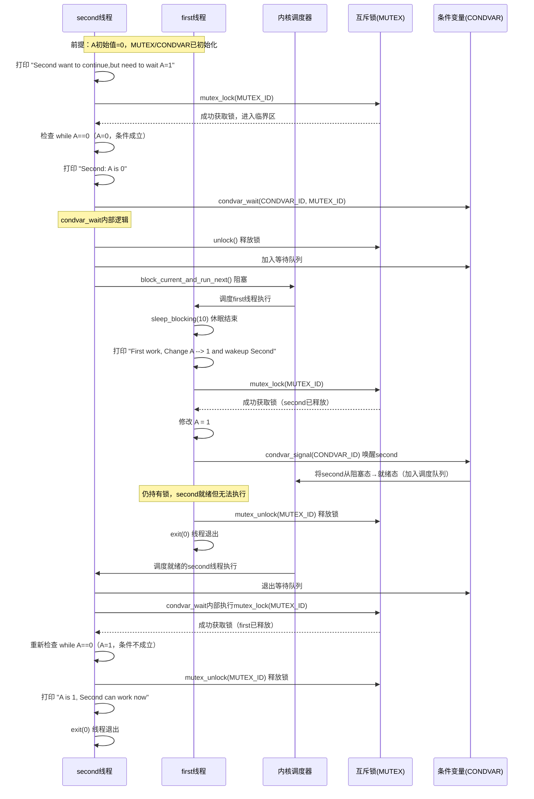

# uCore并发

## 引言

### 线程定义

简单地说，线程是进程的组成部分，进程可包含1 – n个线程，属于同一个进程的线程共享进程的资源， 比如 `地址空间`、打开的文件等。基本的线程由线程ID、执行状态、当前指令指针 (PC)、寄存器集合和栈组成。 线程是可以被操作系统或用户态调度器独立调度（Scheduling）和分派（Dispatch）的基本单位。**进程是线程的资源容器， 线程成为了程序的基本执行实体。**

### 同步互斥

当多个线程共享同一进程的地址空间时， 每个线程都可以访问属于这个进程的数据（全局变量）。如果每个线程使用到的变量都是其他线程不会读取或者修改的话， 那么就不存在一致性问题。如果变量是只读的，多个线程读取该变量也不会有一致性问题。但是，当一个线程修改变量时， 其他线程在读取这个变量时，可能会看到一个不一致的值，这就是数据不一致性的问题。

在我们的ucore的开始阶段使用进程作为基本调度单位时，是很少出现集资源竞争的 -- 除了一些全局共享的变量如FRAME_ALLOCATOR之类的。 而引入线程之后，我们需要考虑的会更多，因为线程之间是共享地址空间的。

| 维度           | 以进程为调度单位（ucore 初期）       | 以线程为调度单位（引入线程后）                      |
| -------------- | ------------------------------------ | --------------------------------------------------- |
| 地址空间       | 进程间完全隔离（独立页表）           | 线程间共享进程地址空间（同一页表）                  |
| 资源竞争场景   | 仅全局内核资源（如 FRAME_ALLOCATOR） | 1. 全局内核资源 <br/>2. 用户态进程内全局 / 共享变量 |
| 数据一致性风险 | 极低（仅内核全局资源需同步）         | 极高（用户态共享变量 + 内核资源都需同步）           |

## 内核态的线程管理

### 线程概念

线程是在进程内中的一个新的抽象。在没有线程之前，一个进程在一个时刻只有一个执行点（即程序计数器 (PC) 寄存器保存的要执行指令的指针）。但线程的引入把进程内的这个单一执行点给扩展为多个执行点，即在进程中存在多个线程， 每个线程都有一个执行点。而且这些线程共享进程的地址空间，所以可以不必采用相对比较复杂的 IPC 机制（一般需要内核的介入）， 而可以很方便地直接访问进程内的数据。

在线程的运行过程中，我们需要：

1. `PC` 因为每个线程有自己的执行点；
2. 全部的通用寄存器，包括 `caller registers`， `callee registers`；
3. `栈`： 保存线程执行时的函数调用栈和局部变量。这里需要注意的是：
   - 无线程的进程模式下：每个进程独占 1 个 `user_stack`（用户态函数调用 / 临时变量） + 1 个 `kernel_stack`（内核态执行 / 上下文切换）；
   - 引入线程后：同一进程的每个线程独占 1 个 `user_stack` + 1 个 `kernel_stack`，确保线程间栈上下文完全隔离。

在引入线程之后，**我们通过线程来表示对处理器的虚拟化，使得进程成为了管理线程的容器。**线程之间没有父子关系，他们都是兄弟关系，除了通过 `fork()` 创建进程时的第一个线程，他的线程标识符为 `0`。

### 线程模型与重要的系统调用

> 线程之间共享大部分的资源，除了 `栈` ，`通用寄存器`， `PC`。

#### 线程创建系统调用

```rust
/// 功能：当前进程创建一个新的线程

/// 参数：
///		- entry 表示线程的入口函数地址
///		- arg：表示线程的一个参数
pub fn sys_thread_create(entry: usize, arg: usize) -> isize
```

调用 `sys_thread_create` 之后，内核会创建一个线程并且为线程分配一个TID，线程之间：

- 共享
  - 地址空间：`.text`/`.rodata`/`.data`/`.bss` 等；
  - 堆
  - 文件描述符表
  - 页表
- 不共享
  - `user_stack` 和 `kernel_stack`
  - `TrapContext`

#### 等待子线程系统调用

> `sys_exit` 的执行依赖当前线程的 `kernel_stack`，因此只能由不依赖该 `kernel_stack` 的外部进程 / 主线程通过 `waitpid/waittid` 来执行 `kernel_stack` 的销毁。

线程在执行时，他会持有很多资源，一部分是用户态资源（比如 `user_stack`），一部分是内核态资源（比如 `kernel_stack`）。**虽然这些都是线程独享的，但是有一个很大的区别：`user_stack` 在线程调用 `exit` 时就会被立即回收，而 `kernel_stack` 则不一样，他必须通过进程/主线程调用 `waitpid` 来回收**。

线程执行 `exit` 是一个**内核态操作**—— 用户态线程触发 `exit` 系统调用后，CPU 会切换到内核态，使用该线程的内核栈执行 `sys_exit` 函数。

- 如果在 `sys_exit` 中直接回收当前线程的内核栈，而 `sys_exit` 执行过程中，内核仍依赖当前线程的 `kernel_stack` 存储函数栈帧、寄存器临时值；若此时销毁 `kernel_stack`，会直接导致 `sys_exit` 执行崩溃。**这就是因为一个函数的执行不能销毁它本身依赖的栈，我们必须在另外一个进程/线程中来调用 -- 因为这个进程/线程对这个栈是没有依赖的**。
- 因此，内核栈必须等 `exit` 系统调用完全执行完毕、线程彻底退出运行队列后，才能被回收 —— 而这个 “确认退出” 的动作，需要 `waittid` 来触发（主线程确认该线程已终止，此时内核栈已无任何执行依赖）。

```rust
/// 参数：tid表示线程id

/// 返回值：如果线程不存在，返回-1；如果线程还没退出，返回-2；其他情况下，返回结束线程的退出码
pub fn sys_waittid(tid: usize) -> i32
```

### 应用程序示例

#### 系统调用封装

下面是对 `waittid` 的封装，代码里是在 `match` 下匹配了 `sys_waittid` 的状态：

- `-2` 目标线程还未退出（资源未就绪），我们要等待他完全退出；
- `exit_code` 表示进程已经退出了，可以开始回收 `kernel_stack` 等内核资源。

```rust
pub fn waittid(tid: usize) -> isize {
    loop {
        match sys_waittid(tid) {
            -2 => {
                yield_();
            }
            exit_code => return exit_code,
        }
    }
}
```

#### 多线程应用程序 – threads

**多线程应用程序 – threads 开始执行后，先调用 `thread_create` 创建了三个线程，加上进程自带的主线程，其实一共有四个线程。**

### 线程管理的核心数据结构

本节将按照如下顺序来进行介绍：

- 任务控制块 TaskControlBlock ：表示线程的核心数据结构。
- 任务管理器 TaskManager ：管理线程集合的核心数据结构。
- 处理器管理结构 Processor ：用于线程调度，维护线程的处理器状态。

#### 线程控制块

> - [为什么kstack和ustack要分开存储](#为什么kstack和ustack要分开存储)

`TCB` 从内核的角度来说就是一个线程，线程的数据分为两个部分：

1. 在thread创建之后就不会再改变的：`kstack`，`process`；
2. 以及在运行过程中可能发生变化的元数据： UPSafeCell<TaskControlBlockInner> 。 大部分的细节放在 `TaskControlBlockInner` 中。

```rust
/// Task control block structure
pub struct TaskControlBlock {
    /// immutable
    pub process: Weak<ProcessControlBlock>,
    /// Kernel stack corresponding to PID
    pub kstack: KernelStack,
    /// mutable
    inner: UPSafeCell<TaskControlBlockInner>,
}

pub struct TaskControlBlockInner {
    pub res: Option<TaskUserRes>,
    /// The physical page number of the frame where the trap context is placed
    pub trap_cx_ppn: PhysPageNum,
    /// Save task context
    pub task_cx: TaskContext,

    /// Maintain the execution status of the current process
    pub task_status: TaskStatus,
    /// It is set when active exit or execution error occurs
    pub exit_code: Option<i32>,
}
```

以及我们一些thread才用得到的逻辑：

1. `tid` 表示thread唯一ID；
2. `ustack_base` 表示线程的栈。

```rust
/// User Resource for a task
pub struct TaskUserRes {
    /// task id
    pub tid: usize,
    /// user stack base
    pub ustack_base: usize,
    /// process belongs to
    pub process: Weak<ProcessControlBlock>,
}
```

#### 包含线程的进程控制块

可以看到，在 `PCB` 中，我们把处理器执行相关的移动到了 `TCB`，因为现在进程已经是任务执行的最小单位了。而我们在 `PCB` 中包含了一个指向所有线程的 `Vec`。

```rust
/// Process Control Block
pub struct ProcessControlBlock {
    /// immutable
    pub pid: PidHandle,
    /// mutable
    inner: UPSafeCell<ProcessControlBlockInner>,
}

/// Inner of Process Control Block
pub struct ProcessControlBlockInner {
    /// ...
    /// tasks(also known as threads)
    pub tasks: Vec<Option<Arc<TaskControlBlock>>>,
    /// task resource allocator
    pub task_res_allocator: RecycleAllocator,
}
```

#### 线程与处理器管理结构

线程管理器和之前一样，仍然由 `TaskManager` 和 `Processor` 管理。

```rust
///An array of `TaskControlBlock` that is thread-safe
pub struct TaskManager {
    ready_queue: VecDeque<Arc<TaskControlBlock>>,
    
    /// The stopping task, leave a reference so that the kernel stack will not be recycled when switching tasks
    stop_task: Option<Arc<TaskControlBlock>>,
}

/// Processor management structure
pub struct Processor {
    current: Option<Arc<TaskControlBlock>>,

    ///The basic control flow of each core, helping to select and switch process
    idle_task_cx: TaskContext,
}
```

### 线程管理机制的设计与实现

本节将分析如何实现线程管理：

- 线程创建、线程退出与等待线程结束
- 线程执行中的特权级切换

#### 线程创建、线程退出与等待线程结束

##### 线程创建

这里列出支持线程正确运行所需的重要的执行环境要素：

- 线程的用户态栈：确保在用户态的线程能正常执行函数调用；
- 线程的内核态栈：确保线程陷入内核后能正常执行函数调用；
- 线程的跳板页：确保线程能正确的进行用户态<–>内核态切换；
- 线程上下文：即线程用到的寄存器信息，用于线程切换。

下面是整个线程初始化逻辑：

1. **初始化新线程的独享资源**：
   1. 分配新的tid；
   2. 使用了进程共享的 ustack_base，进程内所有线程共享同一个 ustack_base（用户栈基址），但每个线程基于 tid 分配独立的用户栈区间；
   3. 因为 `alloc_user_res` 为 true，所以会分配一个新的用户栈区间作为 `user_stack` （基于ustack_base和tid的MapArea）
   4. 因为 `alloc_user_res` 为 true，所以会分配一个新的 `TrapContext`，并初始化对应的 `trap_ppn`；
   5. 分配了 kstack；
   6. 基于 kstack，我们还可以计算得到 kernel_top，并使用 kernel_top 来初始化 TaskContext。这里的TaskContext就是线程在第一次调度时的内核态状态。只包含了 kstack_top；
   7. 初始化了 task_status 为 Ready。
2. 在父进程中添加新创建的线程相关的信息；

```rust
/// thread create syscall
pub fn sys_thread_create(entry: usize, arg: usize) -> isize {
    let task = current_task().unwrap();
    let process = task.process.upgrade().unwrap();
    // 创建一个新的线程，这个方法会做如下操作：
    // 1. 分配新的tid；
    // 2. 使用了进程共享的 ustack_base，进程内所有线程共享同一个 ustack_base（用户栈基址），但每个线程基于 tid 分配独立的用户栈区间；
    // 3. 因为 `alloc_user_res` 为 true，所以会分配一个新的用户栈区间作为 `user_stack` （基于ustack_base和tid的MapArea）
    // 4. 因为 `alloc_user_res` 为 true，所以会分配一个新的 `TrapContext`，并初始化对应的 `trap_ppn`；
    // 5. 分配了 kstack；
    // 6. 基于 kstack，我们还可以计算得到 kernel_top，并使用 kernel_top 来初始化 TaskContext。这里的TaskContext就是线程在第一次调度时的内核态状态。只包含了 kstack_top；
    // 7. 初始化了 task_status 为 Ready。
    let new_task = Arc::new(TaskControlBlock::new(
        Arc::clone(&process),
        task.inner_exclusive_access()
            .res
            .as_ref()
            .unwrap()
            .ustack_base,
        true,
    ));
    // add new task to scheduler
    add_task(Arc::clone(&new_task));
    let new_task_inner = new_task.inner_exclusive_access();
    let new_task_res = new_task_inner.res.as_ref().unwrap();
    let new_task_tid = new_task_res.tid;
    let mut process_inner = process.inner_exclusive_access();

    // process_inner.tasks 是一个 Vec，而 tid 就是线程在这个 Vec 内的索引
    let tasks = &mut process_inner.tasks;
    while tasks.len() < new_task_tid + 1 {
        tasks.push(None);
    }
    tasks[new_task_tid] = Some(Arc::clone(&new_task));

    // 初始化 TrapContext，我们之前只是分配了 TrapContext 的内存并初始化 trap_context 指向这个内存
    let new_task_trap_cx = new_task_inner.get_trap_cx();
    *new_task_trap_cx = TrapContext::app_init_context(
        entry,
        new_task_res.ustack_top(),
        kernel_token(),
        new_task.kstack.get_top(),
        trap_handler as usize,
    );
    // 按照riscv的ABI约定，arg是entry的输入参数
    (*new_task_trap_cx).x[10] = arg;
    new_task_tid as isize
}
```

##### 线程退出

- 当一个非主线程的其他线程发出 `sys_exit` 系统调用时，内核会调用 `exit_current_and_run_next` 函数退出当前线程并切换到下一个线程，但不会导致其所属进程的退出。
- 当 **主线程** 即进程发出这个系统调用， 内核会回收整个进程（这包括了其管理的所有线程）资源，并退出。
- 主线程本身不会被立即回收资源，而是延迟回收，我们在 **再往后一段代码** 解释主线程自己如何退出。

具体的实现如下：

1. 对于 `tid != 0` 的，也就是非主线程：
   1. 设置 `exit_code`；
   2. 销毁线程用户态的依赖：
      - `dealloc_tid`；
      - `dealloc_user_res`，这里包括销毁 `user_stack` 和 `trap_cx`；
      - `task_ctx` 不用销毁，这是因为他可以随着进程的退出自动的销毁；具体可以参考 [TrapContext和TaskContext](#trapcontext和taskcontext)
2. 对于 `tid == 0` 的，也就是主线程，我们需要做的和进程退出一样：
   1. 通过 `add_stopping_task` 将任务保存在 `TASK_MANAGER`，这是因为我们这里需要保留 `kernel_stack` 以便于我们的系统调用能继续执行；
   2. 删除 `PID2PCB` 中对于该进程的缓存；
   3. 使用`INITPROC`收养该进程所有未退出的子进程；
   4. 清理全部的子线程的 `TaskUserRes`，这里很重要，因为如果这里不处理，待会删除 `memory_set` 的时候可能会被重复回收；此外，还需要参考 [线程退出](#线程退出) 查看详细逻辑。
   5. 删除子进程，`memory_set`，`fd_tables`，子线程等资源。

```rust
/// Exit the current 'Running' task and run the next task in task list.
pub fn exit_current_and_run_next(exit_code: i32) {
    trace!(
        "kernel: pid[{}] exit_current_and_run_next",
        current_task().unwrap().process.upgrade().unwrap().getpid()
    );
    // take from Processor
    let task = take_current_task().unwrap();
    let mut task_inner = task.inner_exclusive_access();
    let process = task.process.upgrade().unwrap();
    let tid = task_inner.res.as_ref().unwrap().tid;
    task_inner.exit_code = Some(exit_code);
    // 用户态线程信息可以立即销毁
    task_inner.res = None;
    // here we do not remove the thread since we are still using the kstack
    // it will be deallocated when sys_waittid is called
    drop(task_inner);

    // Move the task to stop-wait status, to avoid kernel stack from being freed
    if tid == 0 {
        add_stopping_task(task);
    } else {
        drop(task);
    }
    // however, if this is the main thread of current process
    // the process should terminate at once
    if tid == 0 {
        let pid = process.getpid();
        if pid == IDLE_PID {
            println!(
                "[kernel] Idle process exit with exit_code {} ...",
                exit_code
            );
            if exit_code != 0 {
                //crate::sbi::shutdown(255); //255 == -1 for err hint
                crate::board::QEMU_EXIT_HANDLE.exit_failure();
            } else {
                //crate::sbi::shutdown(0); //0 for success hint
                crate::board::QEMU_EXIT_HANDLE.exit_success();
            }
        }
        remove_from_pid2process(pid);
        let mut process_inner = process.inner_exclusive_access();
        // mark this process as a zombie process
        process_inner.is_zombie = true;
        // record exit code of main process
        process_inner.exit_code = exit_code;

        {
            // move all child processes under init process
            let mut initproc_inner = INITPROC.inner_exclusive_access();
            for child in process_inner.children.iter() {
                child.inner_exclusive_access().parent = Some(Arc::downgrade(&INITPROC));
                initproc_inner.children.push(child.clone());
            }
        }

        // deallocate user res (including tid/trap_cx/ustack) of all threads
        // it has to be done before we dealloc the whole memory_set
        // otherwise they will be deallocated twice
        let mut recycle_res = Vec::<TaskUserRes>::new();
        for task in process_inner.tasks.iter().filter(|t| t.is_some()) {
            let task = task.as_ref().unwrap();
            // if other tasks are Ready in TaskManager or waiting for a timer to be
            // expired, we should remove them.
            //
            // Mention that we do not need to consider Mutex/Semaphore since they
            // are limited in a single process. Therefore, the blocked tasks are
            // removed when the PCB is deallocated.
            trace!("kernel: exit_current_and_run_next .. remove_inactive_task");
            remove_inactive_task(Arc::clone(&task));
            let mut task_inner = task.inner_exclusive_access();
            if let Some(res) = task_inner.res.take() {
                recycle_res.push(res);
            }
        }
        // dealloc_tid and dealloc_user_res require access to PCB inner, so we
        // need to collect those user res first, then release process_inner
        // for now to avoid deadlock/double borrow problem.
        drop(process_inner);
        recycle_res.clear();

        let mut process_inner = process.inner_exclusive_access();
        process_inner.children.clear();
        // deallocate other data in user space i.e. program code/data section
        process_inner.memory_set.recycle_data_pages();
        // drop file descriptors
        process_inner.fd_table.clear();
        // remove all tasks
        process_inner.tasks.clear();
    }
    drop(process);
    // we do not have to save task context
    let mut _unused = TaskContext::zero_init();
    schedule(&mut _unused as *mut _);
}
```

##### 等待线程结束

参考 [线程资源清理](#线程资源清理)

## 锁机制

### 锁的基本思路

锁的机制是能够设置一种所有线程能看到的标记， 在一个能进入临界区的线程设置好这个标记后，其他线程都不能再进入临界区了。总体上看， 对临界区的访问过程分为四个部分：

1. 尝试取锁: 查看锁是否可用，即临界区是否可访问（看占用临界区标志是否被设置），如果可以访问， 则设置占用临界区标志（锁不可用）并转到步骤 2 ，否则线程忙等或被阻塞;
2. 临界区: 访问临界资源的系列操作
3. 释放锁: 清除占用临界区标志（锁可用），如果有线程被阻塞，会唤醒阻塞线程；
4. 剩余区: 与临界区不相关部分的代码

根据上面的步骤，可以看到锁机制有两种：让线程忙等的**忙等锁（spin lock）**，以及让线程阻塞的**睡眠锁 （sleep lock）**。锁的实现大体上基于三类机制：用户态软件、机器指令硬件、内核态操作系统。 下面我们介绍来 rCore 中基于内核态操作系统级方法实现的支持互斥的锁。

我们还需要知道如何评价各种锁实现的效果。一般我们需要关注锁的三种属性：

1. 互斥性（mutual exclusion），即锁是否能够有效阻止多个线程进入临界区，这是最基本的属性。
2. 公平性（fairness），当锁可用时，每个竞争线程是否有公平的机会抢到锁。
3. 性能（performance），即使用锁的时间开销。

### 内核态操作系统级方法实现锁 — mutex 系统调用

#### 使用 mutex 系统调用

我们的代码分别执行：

1. `mutex_create` 创建一个锁；
2. `mutex_lock` 获取锁；
3. `mutex_unlock` 释放锁；

```rust
unsafe fn f() -> ! {
    let mut t = 2usize;
    for _ in 0..PER_THREAD {
        mutex_lock(0);
        let a = addr_of_mut!(A) as *mut usize;
        let cur = a.read_volatile();
        for _ in 0..500 {
            t = t * t % 10007;
        }
        a.write_volatile(cur + 1);
        mutex_unlock(0);
    }
    exit(t as i32)
}

#[no_mangle]
pub fn main() -> i32 {
    let start = get_time();
    assert_eq!(mutex_create(), 0);
    let mut v = Vec::new();
    for _ in 0..THREAD_COUNT {
        v.push(thread_create(f as usize, 0) as usize);
    }
    let mut time_cost = Vec::new();
    for tid in v.iter() {
        time_cost.push(waittid(*tid));
    }
    println!("time cost is {}ms", get_time() - start);
    assert_eq!(unsafe { A }, PER_THREAD * THREAD_COUNT);
    println!("race adder using spin mutex test passed!");
    0
}
```

#### mutex 系统调用的实现

在线程的眼里， **互斥** 是一种每个线程能看到的资源，且在一个进程中，可以存在多个不同互斥资源， 所以我们可以把所有的互斥资源放在一起让进程来管理。

```rust
/// Inner of Process Control Block
pub struct ProcessControlBlockInner {
    /// mutex list
    pub mutex_list: Vec<Option<Arc<dyn Mutex>>>,
}
```

这里需要注意的是 `mutex_list` 是一个 `Mutex trait` 的向量

```rust
/// Mutex trait
pub trait Mutex: Sync + Send {
    /// Lock the mutex
    fn lock(&self);
    /// Unlock the mutex
    fn unlock(&self);
}
```

`MutexBlocking` 是会实现 `Mutex` trait 的内核数据结构，它就是我们提到的 **互斥资源** 即 **互斥锁** 。

```rust
/// Blocking Mutex struct
pub struct MutexBlocking {
    inner: UPSafeCell<MutexBlockingInner>,
}
```

此外，操作系统需要显式地施加某种控制，来确定当一个线程释放锁时，等待的线程谁将能抢到锁。 为了做到这一点，操作系统需要有一个等待队列来保存等待锁的线程

```rust
pub struct MutexBlockingInner {
    locked: bool,
    wait_queue: VecDeque<Arc<TaskControlBlock>>,
}
```

下面是创建锁的系统调用的实现：

```rust
/// mutex create syscall
pub fn sys_mutex_create(blocking: bool) -> isize {
    let process = current_process();
    // 根据参数创建 MutexSpin（自旋锁）或 MutexBlocking（阻塞锁）
    let mutex: Option<Arc<dyn Mutex>> = if !blocking {
        Some(Arc::new(MutexSpin::new()))
    } else {
        Some(Arc::new(MutexBlocking::new()))
    };

    // 为当前进程分配互斥锁的索引并存储锁：
    // 1. 优先查找 mutex_list 中第一个值为 None 的空位，将锁存入该位置并返回对应索引；
    // 2. 若无空位，则将锁追加到 mutex_list 末尾，返回新的索引（列表长度-1）。
    let mut process_inner = process.inner_exclusive_access();
    if let Some(id) = process_inner
        .mutex_list
        .iter()
        .enumerate()
        .find(|(_, item)| item.is_none())
        .map(|(id, _)| id)
    {
        process_inner.mutex_list[id] = mutex;
        id as isize
    } else {
        process_inner.mutex_list.push(mutex);
        process_inner.mutex_list.len() as isize - 1
    }
}
```

在获取到锁之后，我们就要开始实际的使用我们的锁，首先我们看看获取锁的使用：

1. 我们在 `sys_mutex_lock` 里手动的 `drop()` 这是为了避免死锁，因为 mutex.lock() 有可能会获取不到锁从而发生阻塞，假设有如下场景：
   1. `a` 执行 `sys_mutex_lock` 获取到锁，在函数`sys_mutex_lock` 执行完毕后释放 `process_inner` 和 `process`；
   2. `b`  获取 `process_inner` 和 `process` 的锁，随后执行 `sys_mutex_lock` 获取锁失败并进入阻塞；
   3. `a` 使用锁完毕，尝试释放锁，但是需要获取 `process_inner` 和 `process` 的锁；
   4. 进入死锁。
2. `lock` 中判断是否已经有人持有锁：
   1. 如果有则将自己加入等待队列，并且阻塞等待；
   2. 如果没有，则获取锁并进入临界区。
3. 这段代码，并不会存在竞争问题，因为 `mutex_inner.locked` 本身是线程安全的，我们这里只是出于教学的简单目的，在实现锁的过程中依赖了另外一个锁。如果不依赖 `mutex_inner.locked` 的情况可以参考 [错误访问临界区](#错误访问临界区) 的解释。

```rust
impl Mutex for MutexBlocking {
    /// lock the blocking mutex
    fn lock(&self) {
        trace!("kernel: MutexBlocking::lock");
        let mut mutex_inner = self.inner.exclusive_access();
        if mutex_inner.locked {
            mutex_inner.wait_queue.push_back(current_task().unwrap());
            drop(mutex_inner);
            block_current_and_run_next();
        } else {
            mutex_inner.locked = true;
        }
    }
}

/// mutex lock syscall
pub fn sys_mutex_lock(mutex_id: usize) -> isize {
    let process = current_process();
    let process_inner = process.inner_exclusive_access();
    let mutex = Arc::clone(process_inner.mutex_list[mutex_id].as_ref().unwrap());
    // 这里必须手动的drop
    drop(process_inner);
    drop(process);
    mutex.lock();
    0
}
```

最后是我们 `unlock` 的实现，逻辑也非常简单：

1. 根据 `mutex_id` 从PCB获取到锁，随后释放 `process_inner` 和 `process`；
2. 解锁：
   1. 从 等待锁的队列中找到第一个等待锁的线程；
   2. 将线程的状态修改为 `Ready` 等待调度。

```rust
/// mutex unlock syscall
pub fn sys_mutex_unlock(mutex_id: usize) -> isize {
    let process = current_process();
    let process_inner = process.inner_exclusive_access();
    let mutex = Arc::clone(process_inner.mutex_list[mutex_id].as_ref().unwrap());
    drop(process_inner);
    drop(process);
    mutex.unlock();
    0
}

impl Mutex for MutexBlocking {
    /// unlock the blocking mutex
    fn unlock(&self) {
        trace!("kernel: MutexBlocking::unlock");
        let mut mutex_inner = self.inner.exclusive_access();
        assert!(mutex_inner.locked);
        if let Some(waking_task) = mutex_inner.wait_queue.pop_front() {
            wakeup_task(waking_task);
        } else {
            mutex_inner.locked = false;
        }
    }
}

/// Wake up a task
pub fn wakeup_task(task: Arc<TaskControlBlock>) {
    trace!("kernel: TaskManager::wakeup_task");
    let mut task_inner = task.inner_exclusive_access();
    task_inner.task_status = TaskStatus::Ready;
    drop(task_inner);
    add_task(task);
}
```

## 信号量机制

### 信号量的起源和基本思路

信号量是对互斥锁的一种巧妙的扩展。上一节中的互斥锁的初始值一般设置为 1 的整型变量， 表示临界区还没有被某个线程占用。互斥锁用 0 表示临界区已经被占用了，用 1 表示临界区为空，再通过 `lock/unlock` 操作来协调多个线程轮流独占临界区执行。**而信号量的初始值可设置为 N 的整数变量, 如果 N 大于 0， 表示最多可以有 N 个线程进入临界区执行，如果 N 小于等于 0 ，表示不能有线程进入临界区了**， 必须在后续操作中让信号量的值加 1 ，才能唤醒某个等待的线程。

如果信号量是一个任意的整数，通常被称为计数信号量（Counting Semaphore），或一般信号量（General Semaphore）；如果信号量只有0或1的取值，则称为二值信号量（Binary Semaphore）。可以看出， 互斥锁是信号量的一种特例 — 二值信号量，信号量很好地解决了最多允许 N 个线程访问临界资源的情况。

信号量可以分为两个操作，**注意，`P`  和 `V` 都是原子操作**：

1. `P（Proberen（荷兰语），尝试`：
   1. `P` 检查信号量是否大于0；
   2. 如果大于0，则将信号量减一并进入临界区；
   3. 如果小于等于0，则进入休眠
2. `V（Verhogen（荷兰语），增加）`：
   1. `V` 将信号量加一；
      1. 如果还有其他的线程在等待信号量，则唤醒该线程；
      2. 如果没有则直接返回。

> 信号量的另一种用途是用于实现同步（synchronization）。

1. 我们初始化一个初始化值为0的信号量；
2. 此时线程 `A` 会执行  `P`，而线程 `B` 会执行 `V`；
3. 不管线程的执行顺序如何，我们都可以保证，`A` 线程在执行 `P` 之后的代码时，`B` 线程已经把 `V` 之前的代码执行完成。

例如，假设有如下代码

```rust
fn thread_a() {
	pre_p();
    p();
    after_p();
}

fn thread_b() {
    pre_v();
    v();
    after_v();
}
```

**那么它的实际执行顺序保证：当 `after_p()` 执行的时候 `pre_v()` 一定已经执行完成。**

### 实现信号量

#### 实现 semaphore 系统调用

`semaphore_list` 一个 `Semaphore` 的向量；

```rust
/// Inner of Process Control Block
pub struct ProcessControlBlockInner {
    /// semaphore list
    pub semaphore_list: Vec<Option<Arc<Semaphore>>>,
}
```

`Semaphore`  的结构和 `MutexBlocking` 类似，唯一的区别是 `locked: bool` 被修改唯 `count: isize`；

```rust
/// semaphore structure
pub struct Semaphore {
    /// semaphore inner
    pub inner: UPSafeCell<SemaphoreInner>,
}

pub struct SemaphoreInner {
    pub count: isize,
    pub wait_queue: VecDeque<Arc<TaskControlBlock>>,
}
```

所以，`Semaphore` 的实现逻辑也相当简单，这里唯一需要注意的是：**`count` 的语义不是剩余资源量的直接映射。**

1. `count >= 0` 表示有 `count` 个空闲资源，无线程阻塞；
2. `count < 0` 表示无空闲资源，有 `|count|` 个线程阻塞；

所以，当我们在调用 `up()` 时，我们应该立即将 `count` 加一，并且立即从阻塞的线程中取出一个加入到线程调度。**这里关键在于，在调用 `down()` 的时候，即使线程被阻塞，仍然会将 `count` 减一**。  

```rust
impl Semaphore {
    /// Create a new semaphore
    pub fn new(res_count: usize) -> Self {
        trace!("kernel: Semaphore::new");
        Self {
            inner: unsafe {
                UPSafeCell::new(SemaphoreInner {
                    count: res_count as isize,
                    wait_queue: VecDeque::new(),
                })
            },
        }
    }

    /// up operation of semaphore
    pub fn up(&self) {
        trace!("kernel: Semaphore::up");
        let mut inner = self.inner.exclusive_access();
        inner.count += 1;
        if inner.count <= 0 {
            if let Some(task) = inner.wait_queue.pop_front() {
                wakeup_task(task);
            }
        }
    }

    /// down operation of semaphore
    pub fn down(&self) {
        trace!("kernel: Semaphore::down");
        let mut inner = self.inner.exclusive_access();
        inner.count -= 1;
        if inner.count < 0 {
            inner.wait_queue.push_back(current_task().unwrap());
            drop(inner);
            block_current_and_run_next();
        }
    }
}

```

这里，我们可以使用 `count` 表示当前可用资源数作为语义，那么我们可以得到如下代码：

```rust
impl Semaphore {
    /// Create a new semaphore
    pub fn new(res_count: usize) -> Self {
        trace!("kernel: Semaphore::new");
        assert!(res_count >= 1, "res count need larger than zero");
        Self {
            inner: unsafe {
                UPSafeCell::new(SemaphoreInner {
                    count: res_count as isize,
                    wait_queue: VecDeque::new(),
                })
            },
        }
    }

    /// up operation of semaphore
    pub fn up(&self) {
        trace!("kernel: Semaphore::up");
        let mut inner = self.inner.exclusive_access();
        inner.count += 1;
        if inner.count <= 0 {
            if let Some(task) = inner.wait_queue.pop_front() {
                wakeup_task(task);
            }
        }
    }

    /// down operation of semaphore
    pub fn down(&self) {
        trace!("kernel: Semaphore::down");
        let mut inner = self.inner.exclusive_access();
        inner.count -= 1;
        if inner.count < 0 {
            inner.wait_queue.push_back(current_task().unwrap());
            drop(inner);
            block_current_and_run_next();
        }
    }
}
```

## 条件变量机制

### 条件变量的基本思路

管程有一个很重要的特性，即任一时刻只能有一个活跃线程调用管程中的过程， 这一特性使线程在调用执行管程中过程时能保证互斥，这样线程就可以放心地访问共享变量。 管程是编程语言的组成部分，编译器知道其特殊性，因此可以采用与其他过程调用不同的方法来处理对管程的调用. 因为是由编译器而非程序员来生成互斥相关的代码，所以出错的可能性要小。

管程虽然借助编译器提供了一种实现互斥的简便途径，但这还不够，还需要一种线程间的沟通机制。 

- 首先是等待机制：由于线程在调用管程中某个过程时，发现某个条件不满足，那就在无法继续运行而被阻塞。 
- 其次是唤醒机制：另外一个线程可以在调用管程的过程中，把某个条件设置为真，并且还需要有一种机制， 及时唤醒等待条件为真的阻塞线程。

为了避免管程中同时有两个活跃线程， 我们需要一定的规则来约定线程发出唤醒操作的行为。目前有三种典型的规则方案：

- Hoare 语义：线程发出唤醒操作后，马上阻塞自己，让新被唤醒的线程运行。注：此时唤醒线程的执行位置还在管程中。
- Hansen 语义：是执行唤醒操作的线程必须立即退出管程，即唤醒操作只可能作为一个管程过程的最后一条语句。 注：此时唤醒线程的执行位置离开了管程。
- Mesa 语义：唤醒线程在发出行唤醒操作后继续运行，并且只有它退出管程之后，才允许等待的线程开始运行。 注：此时唤醒线程的执行位置还在管程中。

简单来说就是，我们可以通过如下方式来等待条件变量：

```rust
static mut A: usize = 0;
unsafe fn first() -> ! {
    mutex.lock();
    A=1;
    mutex.unlock();
    // ...
}

unsafe fn second() -> ! {
    mutex.lock();
    while A==0 {
        mutex.unlock();
        // give other thread a chance to lock
        mutex.lock();
    };
    mutex.unlock();
    // 继续执行相关事务
}
```

但是这个显然是一个忙等待，于是我们做出了一些优化，但是在这个例子中，我们面临一个问题就是 `wait()` 并没有管理好我们的锁：

如果 `second` 获取锁后调用 `wait()` 线程将直接进入死锁，**所以，我们需要 `condvar` 提供一种机制来为我们管理锁**。

```rust
static mut A: usize = 0;
unsafe fn first() -> ! {
    mutex.lock();
    A=1;
    wakup(second);
    mutex.unlock();
    ...
}

unsafe fn second() -> ! {
    mutex.lock();
    while A==0 {
       wait();
    };
    mutex.unlock();
    //继续执行相关事务
}
```

最后，我们的代码如下，但是这里我们显然需要在 `wakeup` 和 `wait` 中管理我们的锁，

```rust
static mut A: usize = 0;
unsafe fn first() -> ! {
    mutex.lock();
    A=1;
    condvar.wakup();
    mutex.unlock();
    ...
}

unsafe fn second() -> ! {
    mutex.lock();
    while A==0 {
       condvar.wait(mutex); //在睡眠等待之前，需要释放mutex
    };
    mutex.unlock();
    //继续执行相关事务
}
```

#### 实现条件变量

有了上面的逻辑，我们的实现就比较简单了：

- `wait`  在wait中，我们先 `unlock()`，再等待，被唤醒后再次 `lock()`；
- `signal` `signal`无需其他处理，只需要找到等待中的线程并调度即可。

```rust
impl Condvar {
    /// Create a new condition variable
    pub fn new() -> Self {
        trace!("kernel: Condvar::new");
        Self {
            inner: unsafe {
                UPSafeCell::new(CondvarInner {
                    wait_queue: VecDeque::new(),
                })
            },
        }
    }

    /// Signal a task waiting on the condition variable
    pub fn signal(&self) {
        let mut inner = self.inner.exclusive_access();
        if let Some(task) = inner.wait_queue.pop_front() {
            wakeup_task(task);
        }
    }

    /// blocking current task, let it wait on the condition variable
    pub fn wait(&self, mutex: Arc<dyn Mutex>) {
        trace!("kernel: Condvar::wait_with_mutex");
        mutex.unlock();
        let mut inner = self.inner.exclusive_access();
        inner.wait_queue.push_back(current_task().unwrap());
        drop(inner);
        block_current_and_run_next();
        mutex.lock();
    }
}
```

我们的使用代码如下：我们的执行流程可能如下：

1. `first` 先获取 `mutex_lock`，此时 `first` 进入临界区会被阻塞直到 `mutex_unlock`；`second` 开始执行并且顺利的执行到结束；
2. `second` 先获取 `mutex_lock`：
   1. `while A == 0` 判断失败，在 `condvar_wait` 中 `unlock()` ，将线程加入等待队列，`block_current_and_run_next`；
   2. `first()` 获取锁 `lock()`，修改 A，并且执行 `signal` 唤醒 `second`，此时可能有两种情况：
      1. `first()` 继续执行，直到释放锁；
      2. `second()` 被调度执行，尝试去 `lock()`，但是此时 `first()` 仍然持有锁，所以 `second` 会被挂起；
   3. 基于 `<2>` 的描述， `first()` 会先执行完 `unlock()`，随后才 `second()` 才会获取到锁并执行后续逻辑；
   4. `second()` 退出之后 `unlock()`。

```rust
unsafe fn first() -> ! {
    sleep_blocking(10);
    println!("First work, Change A --> 1 and wakeup Second");
    mutex_lock(MUTEX_ID);
    A = 1;
    condvar_signal(CONDVAR_ID);
    mutex_unlock(MUTEX_ID);
    exit(0)
}

unsafe fn second() -> ! {
    println!("Second want to continue,but need to wait A=1");
    mutex_lock(MUTEX_ID);
    while A == 0 {
        println!("Second: A is {}", A);
        condvar_wait(CONDVAR_ID, MUTEX_ID);
    }
    mutex_unlock(MUTEX_ID);
    println!("A is {}, Second can work now", A);
    exit(0)
}

#[no_mangle]
pub fn main() -> i32 {
    // create condvar & mutex
    assert_eq!(condvar_create() as usize, CONDVAR_ID);
    assert_eq!(mutex_blocking_create() as usize, MUTEX_ID);
    // create threads
    let threads = vec![
        thread_create(first as usize, 0),
        thread_create(second as usize, 0),
    ];
    // wait for all threads to complete
    for thread in threads.iter() {
        waittid(*thread as usize);
    }
    println!("test_condvar passed!");
    0
}
```

整体执行逻辑如图所示：




## QA

### 代码

```
➜  2025a-rcore-0x822a5b87 git:(ch8) cloc os easy-fs
     306 text files.
     166 unique files.
     349 files ignored.

github.com/AlDanial/cloc v 2.06  T=0.12 s (1358.1 files/s, 59444.4 lines/s)
-------------------------------------------------------------------------------
Language                     files          blank        comment           code
-------------------------------------------------------------------------------
Rust                            51            357            928           4613
D                               42            117              0            631
Assembly                         4             30             29            303
make                             1             22              7             70
JSON                            64              0              0             64
Linker Script                    1              7              0             46
TOML                             3              7              2             33
-------------------------------------------------------------------------------
SUM:                           166            540            966           5760
-------------------------------------------------------------------------------
```

### 错误访问临界区

假设我们存在如下代码：

```rust
fn lock() {
    if locked {
        block_current_and_run_next();
    } else {
        locked = true;
    }
}
```

那么它的汇编代码可能是这样的：

```assembly
# 伪汇编逻辑
# block：锁已被占用时跳转到的分支（比如阻塞/自旋）

bez locked, 1, block         # 若 locked != 1（未锁定），不跳转；若 locked == 1（已锁定），跳转到 block
li  locker, 1                # 将 locked 设为 1（标记为已锁定）
```

那么实际执行可能是这样的：

| 时间片 | Task A 执行操作                            | Task B 执行操作                            | `locked` 内存值 |
| ------ | ------------------------------------------ | ------------------------------------------ | --------------- |
| T1     | 执行 `bez`，读取 `locked=0`，判定 “不跳转” | ——（未被调度）                             | 0               |
| T2     | ——（被切走，未执行 `li`）                  | 执行 `bez`，读取 `locked=0`，判定 “不跳转” | 0               |
| T3     | 执行 `li`，将 `locked` 设为 1              | ——（未被调度）                             | 1               |
| T4     | 进入临界区                                 | 执行 `li`，将 `locked` 设为 1              | 1               |
| T5     | ——（临界区执行中）                         | 进入临界区                                 |                 |


### 线程资源清理

线程资源的清理需要 `exit_current_and_run_next` 和 `waittid` 合作来清理，下面列出了这两个方法中关于资源回收的代码：

```rust
/// Exit the current 'Running' task and run the next task in task list.
pub fn exit_current_and_run_next(exit_code: i32) {
    // ...
    // 用户态线程信息可以立即销毁
    task_inner.res = None;
    
    // Move the task to stop-wait status, to avoid kernel stack from being freed
    if tid == 0 {
        add_stopping_task(task);
    } else {
        drop(task);
    }

    if tid == 0 {
        process_inner.tasks.clear();
    }
}

pub fn sys_waittid(tid: usize) -> i32 {
	// ...
    if let Some(exit_code) = exit_code {
        // dealloc the exited thread
        process_inner.tasks[tid] = None;
        exit_code
    } else {
        // waited thread has not exited
        -2
    }
}
```

整体的逻辑划分为两个大的模块：

1. 普通线程退出时的主动回收
   1. 普通线程退出时，先回收用户态的资源，这个是完全没有任何风险的；
   2. 随后 `drop(task)`，这里很容易误解，我们做一个详细解释：
      - 这里的 `task` 是从 `PROCESSOR` 中取出的当前运行线程引用，`drop` 仅释放 `PROCESSOR` 持有的这一引用；
      - 进程的 `tasks` 列表中仍持有该线程 TCB 的 `Arc` 引用 → `Arc` 计数≠0，线程内核态资源（kstack、task_ctx）不会被回收；
      - 显式调用 `drop(task)` 是为了配合后续 `schedule` 调度（避免调度时仍持有无效引用）；
   3. 内核资源的回收有两个场景
      - 在 `waitpid` 中，通过 `process_inner.tasks[tid] = None` 将 `Arc` 置为 0，线程内核态资源被回收。
      - 若普通线程未等到 `waittid` 执行，主线程退出时会执行 `process_inner.tasks.clear()`，现成内核态资源被回收；
2. 主线程退出时的批量回收
   1. 主线程退出时，也是回收用户态的资源；
   2. 执行 `add_stopping_task(task)` 将主线程 TCB 存入 `TASK_MANAGER` 的 `stop_task`：
      - 目的是保留 Arc 引用（避免 process_inner.tasks.clear() 时 Arc 归 0，导致 kstack 被提前回收 —— 因 sys_exit 仍在主线程 kstack 上执行）；
   3. 执行 `process_inner.tasks.clear()` 回收所有的可以回收的线程：
      - `tasks` 中引用被释放，但 `stop_task` 仍持有引用，所以主线程的 `TCB` 不会被立即回收；
      - 其他线程可以被安全回收，因为主线程对这些线程的内核态资源没有依赖，这里同时也会回收那些还没有退出（例如还没有等到waittid执行或者没有执行完毕）的线程的内核态资源
   4. 此时，我们还剩下未回收的资源就是主线程的 `TCB` 了，因为 `add_stopping_task` 仍然持有对主线程 TCB 的引用：当另一个进程的主线程退出时，会调用 `add_stopping_task(new_task)` → `new_task` 覆盖 `stop_task` 中旧的主线程 TCB → 旧主线程的 `Arc` 引用被释放（计数归 0）→ 内核态资源回收；

### 线程退出

在我们的线程退出中有两块代码：

```rust
pub fn exit_current_and_run_next(exit_code: i32) {
	// ...
    task_inner.res = None;
    // ...
    if (tid == 0) {
        // deallocate user res (including tid/trap_cx/ustack) of all threads
        // it has to be done before we dealloc the whole memory_set
        // otherwise they will be deallocated twice
        let mut recycle_res = Vec::<TaskUserRes>::new();
        for task in process_inner.tasks.iter().filter(|t| t.is_some()) {
            let task = task.as_ref().unwrap();
            // if other tasks are Ready in TaskManager or waiting for a timer to be
            // expired, we should remove them.
            //
            // Mention that we do not need to consider Mutex/Semaphore since they
            // are limited in a single process. Therefore, the blocked tasks are
            // removed when the PCB is deallocated.
            trace!("kernel: exit_current_and_run_next .. remove_inactive_task");
            remove_inactive_task(Arc::clone(&task));
            let mut task_inner = task.inner_exclusive_access();
            if let Some(res) = task_inner.res.take() {
                recycle_res.push(res);
            }
        }
        // dealloc_tid and dealloc_user_res require access to PCB inner, so we
        // need to collect those user res first, then release process_inner
        // for now to avoid deadlock/double borrow problem.
        drop(process_inner);
        recycle_res.clear();

    }
}
```

这里看起来像是对 `ref` 做了两次回收，其实这是**线程主动退出**和**线程被动回收**的问题：

1. `task_inner.res = None;` **当前执行 sys_exit 的线程**（可能是主线程 / 非主线程）
2. `遍历process_inner.tasks取 res` **进程内所有其他线程**（包括未主动退出的子线程、阻塞 / 就绪态线程）。

这同样也是，为什么 task_inner.res = None; 可以直接回收，而循环中回收却必须先使用 Vec 收集起来，在回收之前必须 drop(process_inner) 的原因。 最开始的回收，只是针对于线程的操作，此时还没有获取 process 的锁，而 `dealloc_tid()` 和 `dealloc_user_res` 中都会使用到 `process` 的锁。

### TrapContext和TaskContext

- `TrapContext` 是用于陷入内核态的**寄存器快照载体**，在由用户态陷入到内核态的时候会把TrapContext的地址传递给内核态，而内核态为了能访问这个地址，他需要和用户态共用一个虚拟地址；
- `TaskContext` 是 `TCB` 中的一个普通变量，仅仅存放于内核态，用户态不需要知道 `TaskContext` 的任何信息，在进程初始化时初始化，在进程退出时销毁。
- `trampoline` 是固定共享虚拟地址的跳转代码段，他会操作 `TrapContext` 来实现对 trap 的处理。

### 为什么在TCB中，我们直接以PA的形式存储trap_cx_ppn

1. TrapContext 的使用太频繁，如果我们直接每次都从PageTable获取，那么性能会比较差，尤其是极端情况下可能因为TLB不命中产生更大的开销； 
   - 线程每次触发 Trap（中断 / 异常 / 系统调用）、切换上下文时，都要读写 TrapContext
   - 若存储虚拟地址：每次访问 TrapContext 都需要通过页表（多级页表）将虚拟地址转换为物理地址，极端情况下 TLB 不命中（需走慢路径查页表），会多消耗数十个时钟周期；
   - 若存储 PPN：可直接通过 `PPN + 偏移量` 计算出 TrapContext 字段的物理地址，完全绕开页表转换和 TLB 依赖，访问延迟降到最低；
2. TrapContext 在线程中属于是和 .text/.data 一样的常驻资源，它不会被回收，永远在固定的物理地址。 
   - TrapContext 分配在独立的物理页中，且**从线程创建到 TCB 彻底销毁前，该物理页不会被回收、不会迁移**（和 `.text/.data` 段一样属于 “常驻内存资源”）—— 这意味着 PPN 一旦确定，终身不变，无需担心 “物理地址变化导致 PPN 失效”；
   - 若存储虚拟地址：需依赖页表映射的有效性，而用户态虚拟地址可能因页交换（swap）、页表修改失效，内核态虚拟地址也可能因内核页表更新变化；
   - 若存储 PPN：物理地址是硬件层面的 “绝对地址”，不受页表映射影响，即使虚拟地址失效，也能通过 PPN 找回 TrapContext；
   - 内核态拥有直接访问物理地址的权限。

基于条件 `<1>`，缓存 `TrapContext` 的地址是非常有必要的，基于条件 `<2>`，我们确定直接缓存 `PPN` 是可行的。

### 为什么kstack和ustack要分开存储

核心原因是**二者的 “生命周期”“访问权限”“管理维度” 完全不同**—— 这种拆分是内核数据结构设计中 “按职责分层、按权限隔离” 的典型实践。

`kstack` 和 `ustack_base` 虽然都 “基本不变”，但前者是 “内核态核心资源”，后者是 “用户态资源的元信息”，职责边界完全不同，因此必须拆分。

- `kstack` 是线程的内核态资源，在线程退出时不能立即清理，需要等到 `exit` 函数执行完之后，由主线程的 `waitpid` 来进行清理；
- `ustack_base` 是用户态的资源，当他退出时可以立即清理。

### kernel_stack

> 线程的内核栈（`kernel_stack`）是**线程在内核态执行时的专属栈**，所有内核态操作都依赖它。
>
> 核心场景是：**当用户态程序因为中断或异常**，此时会通过 `__alltraps` 进入内核态。`__alltraps` 函数此时会将 `kernle_stack` 加载到寄存器，随后进入异常/中断处理。此时才真正的开始使用使用到 `kernel_stack`。

1. `kernel_stack` 支撑用户态程序通过系统调用切换到内核态后的执行：内核态函数调用栈帧、局部变量、临时计算结果均存储在 `kernel_stack` 上；
2. `kernel_stack` 支撑系统中断和异常处理：系统调用属于 “自陷异常（ecall）”，是异常的一个子类型，因此中断 / 异常处理（含系统调用）的执行均依赖 `kernel_stack`；
3. 内核自身的执行（如内核线程、调度器逻辑）依赖 `kernel_stack`：纯内核线程无 `user_stack`，`kernel_stack` 是其唯一的栈资源；

**指的注意的是，由于有 `TrapContext` 的存在，Trap并不需要 kernel_stack 的介入：** 

1. `user_stack` 与 `TrapContext` 协同支撑线程上下文切换：每个线程有独立的 `TrapContext` 页（存储 PC、寄存器、`sp` 等核心上下文），而我们的 `sscratch` 指向 `TrapContext`，切换时流程为：
   1. `__alltraps`：
      1. 将当前的上下文保存通用寄存器到 `TrapContext`，而 `TrapContext` 的值是保存在 `sscratch` 下；
      2. 将 `sstatus`，`sepc` ，`sscratch（此时指向user_stack）` 通过通用寄存器保存到 `TrapContext`，这里必须先保存通用寄存器，保存完后才能使用。
      3. 从 `TrapContext` 加载 `kernel_satp`， `trap_handler`， `kernel_sp` 等内核态异常处理函数需要的寄存器；
      4. 进入内核态异常处理。
   2. `__restore`：从 `TrapContext` 中加载用户态程序的必要寄存器。

可以注意到，在整个过程中，有一部分内核态才会用到的，例如 `satp`，`trap_handler`，`kernel_sp` 在 `TrapContext` 中是一直不变的。他们只是用作从用户态切换到内核态的跳板。

### trampoline是线程共享的吗？

`trampoline` 是内核态和用户态转换的跳板，他是一个固定的代码块，在链接的时候被链接到代码的 `.text` 段。

随后，所有的进程/线程/内核都映射一个固定的虚拟地址到 `trampoline`，所以答案是肯定的，所有线程共享 trampoline。

### 主线程是什么？他和普通的线程有区别吗？

主线程是在进程执行 `fork()` 时创建的线程，由进程的 `task_res_allocator` 分配：

```rust
impl RecycleAllocator {
    pub fn alloc(&mut self) -> usize {
        if let Some(id) = self.recycled.pop() {
            id
        } else {
            self.current += 1;
            self.current - 1
        }
    }
}
```

所以，主线程的 `tid` 始终为 `1`。

主线程是一个比较特殊的线程，虽然他在调度时候和其他的线程是完全一样的优先级。但是主线程相比于其他的线程有如下特性：

1. 主线程需要负责进程内其他线程的兜底数据管理策略。通常来说，线程退出时需要通过 `waittid()` 来回收线程的内核态资源；但是假设线程没有正常退出（例如没有调用 `waittid`，没有被调度执行就退出等），那么主线程在退出的时候需要负责回收所有的当前进程里所有其他线程的内核态资源；
2. 主线程退出的时候，所有的线程都会被退出并清理；
3. 主线程需要负责进程的退出逻辑 -- 例如进程的页表，memory_set等资源的清理；

### 线程的exit

关于进程的退出，我们可以参考我们之前的分析 [进程的退出](https://0x822a5b87.github.io/2025/12/02/ucore%E8%BF%9B%E7%A8%8B%E5%8F%8A%E8%BF%9B%E7%A8%8B%E7%AE%A1%E7%90%86/#%E8%BF%9B%E7%A8%8B%E7%9A%84%E9%80%80%E5%87%BA-1)。

我们通过将进程代码的入口链接到 `_start` 中，而 `_start` 中通过 `exit(main(argc, v.as_slice()))` 来实现了对进程 `exit()` 方法的自动调用；

而线程不一样，在我们的实现中，`ucore`  在 `thread_create()` 时将程序的 `PC` 指向了我们的入口函数，这意味着我们必须手动的去调用 `exit()`，观察我们线上的代码确实也符合我们的预想。

```rust
// ch8_threads.rs
pub fn thread_c() -> ! {
    let mut t = 2i32;
    for _ in 0..1000 {
        print!("c");
        for __ in 0..5000 {
            t = t * t % 10007;
        }
    }
    println!("{}", t);
    exit(3)
}
```

