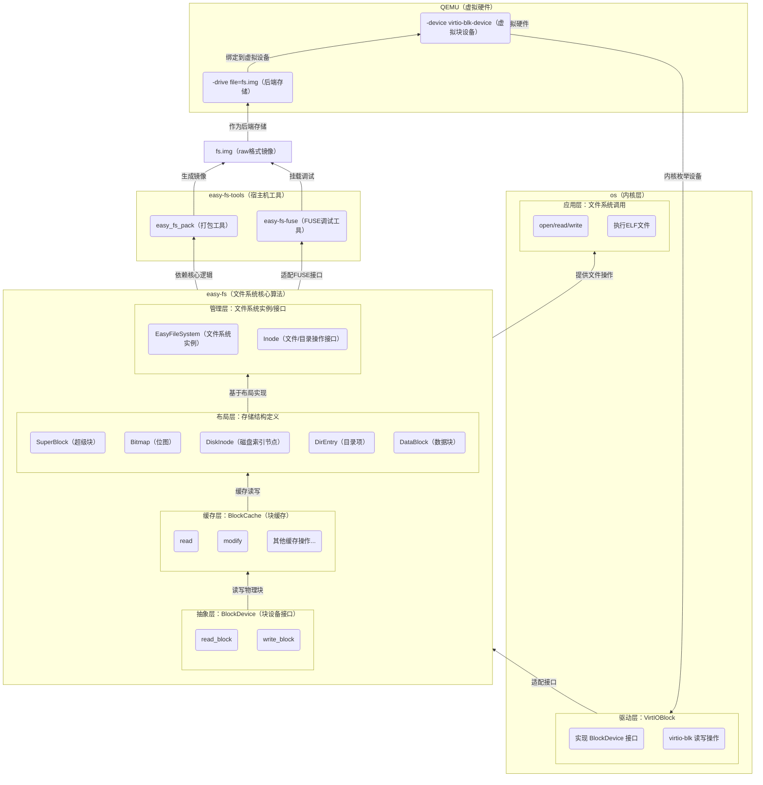
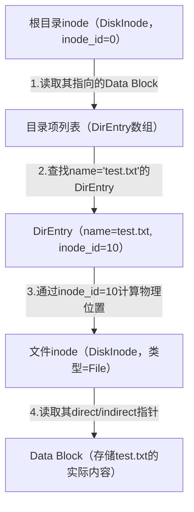
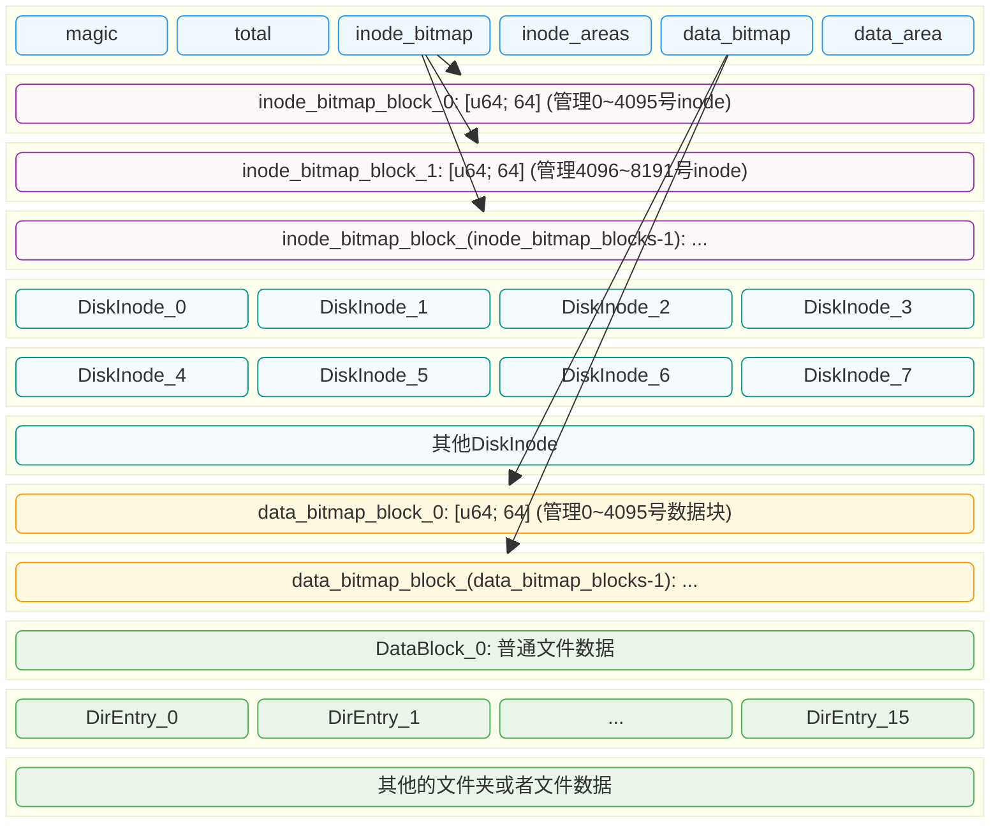
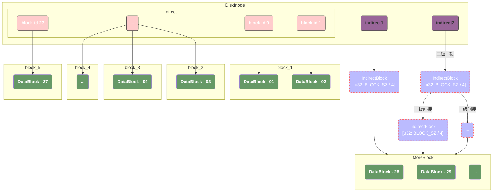
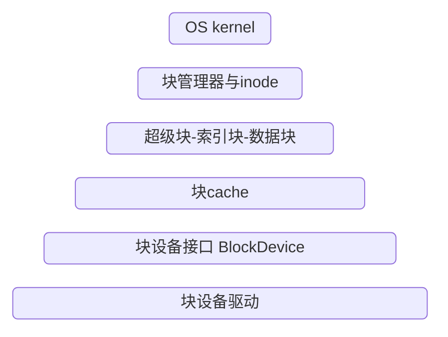

# 文件系统


## 整体逻辑




## 文件与文件描述符

### 文件简介

这个接口在内存和I/O资源之间建立了数据交换的通道。其中 `UserBuffer` 是我们在 `mm` 子模块中定义的应用地址空间中的一段缓冲区，我们可以将它看成一个 `&[u8]` 切片。

```rust
// os/src/fs/mod.rs

pub trait File : Send + Sync {
    fn readable(&self) -> bool;
    fn writable(&self) -> bool;
    fn read(&self, buf: UserBuffer) -> usize;
    fn write(&self, buf: UserBuffer) -> usize;
}
```

`UserBuffer` 的声明如下，此外，**我们还让它作为一个迭代器可以逐字节进行读写**，参考 [Iterator和IntoIterator](#iterator和intoiterator)

```rust
// os/src/mm/page_table.rs

pub fn translated_byte_buffer(
    token: usize,
    ptr: *const u8,
    len: usize
) -> Vec<&'static mut [u8]>;

pub struct UserBuffer {
    pub buffers: Vec<&'static mut [u8]>,
}

impl UserBuffer {
    pub fn new(buffers: Vec<&'static mut [u8]>) -> Self {
        Self { buffers }
    }
    pub fn len(&self) -> usize {
        let mut total: usize = 0;
        for b in self.buffers.iter() {
            total += b.len();
        }
        total
    }
}
```

### 标准输入和标准输出

我们定义标准输入和标准输出分别为 `Stdin` 和 `Stdout`

```rust
/// stdin file for getting chars from console
pub struct Stdin;

/// stdout file for putting chars to console
pub struct Stdout;
```

并为他们实现 `File` 接口

```rust
impl File for Stdin {
    fn readable(&self) -> bool { true }
    fn writable(&self) -> bool { false }
    fn read(&self, mut user_buf: UserBuffer) -> usize {
        assert_eq!(user_buf.len(), 1);
        // busy loop
        let mut c: usize;
        loop {
            c = console_getchar();
            if c == 0 {
                suspend_current_and_run_next();
                continue;
            } else {
                break;
            }
        }
        let ch = c as u8;
        unsafe {
            user_buf.buffers[0].as_mut_ptr().write_volatile(ch);
        }
        1
    }
    fn write(&self, _user_buf: UserBuffer) -> usize {
        panic!("Cannot write to stdin!");
    }
}

impl File for Stdout {
    fn readable(&self) -> bool {
        false
    }
    fn writable(&self) -> bool {
        true
    }
    fn read(&self, _user_buf: UserBuffer) -> usize {
        panic!("Cannot read from stdout!");
    }
    fn write(&self, user_buf: UserBuffer) -> usize {
        for buffer in user_buf.buffers.iter() {
            print!("{}", core::str::from_utf8(*buffer).unwrap());
        }
        user_buf.len()
    }
}
```

### 文件描述符与文件描述符表

1. 每个进程包含了一个 `文件描述符表`，包含了所有打开的文件；
2. `文件描述符表` 的每一项都是一个 `文件描述符`，文件描述符是一个非负整数，**表示文件描述符表中一个打开的 文件描述符 所处的位置**；
3. 使用 `open()` 或者 `create()` 打开或创建一个文件时，内核会返回给应用刚刚打开或创建的文件对应的文件描述符；
4. 使用 `close()` 关闭文件时，需要提供相应的文件描述符。
5. `文件描述符表` 在进程内是 `pub fd_table: Vec<Option<Arc<dyn File + Send + Sync>>>`，这里值得注意的是，他的索引是 `fd`，值是我们分配的文件 `OSInode`。

### 文件I/O操作

关于 `dyn` 的解析，参考 [dyn](#dyn)

```rust
pub struct TaskControlBlockInner {
    pub fd_table: Vec<Option<Arc<dyn File + Send + Sync>>>
}
```

- `Vec` 的动态长度特性使得我们无需设置一个固定的文件描述符数量上限；
- `Option` 使得我们可以区分一个文件描述符当前是否空闲，当它是 `None` 的时候是空闲的，而 `Some` 则代表它已被占用；
- `Arc` 首先提供了共享引用能力。后面我们会提到，可能会有多个进程共享同一个文件对它进行读写。此外被它包裹的内容会被放到内核堆而不是栈上，于是它便不需要在编译期有着确定的大小；
- `dyn` 关键字表明 `Arc` 里面的类型实现了 `File/Send/Sync` 三个 Trait ，但是编译期无法知道它具体是哪个类型（可能是任何实现了 `File` Trait 的类型如 `Stdin/Stdout` ，故而它所占的空间大小自然也无法确定），需要等到运行时才能知道它的具体类型。

当新建一个进程的时候，我们需要按照先前的说明为进程打开标准输入文件和标准输出文件：

```rust
impl TaskControlBlock {
    pub fn new(elf_data: &[u8]) -> Self {
		// ...
        let task_control_block = Self {
            pid: pid_handle,
            kernel_stack,
            inner: unsafe {
                UPSafeCell::new(TaskControlBlockInner {
                    // ...
                    fd_table: vec![
                        // 0 -> stdin
                        Some(Arc::new(Stdin)),
                        // 1 -> stdout
                        Some(Arc::new(Stdout)),
                        // 2 -> stderr
                        Some(Arc::new(Stdout)),
                    ],
                    // ...
                })
            },
        };
        // ...
    }
}
```

### 文件读写系统调用

基于文件读写的系统调用更加灵活了，我们在当前进程的文件描述符表中通过文件描述符找到某个文件，无需关心文件具体的类型，只要知道它一定实现了 `File` Trait 的 `read/write` 方法即可。Trait 对象提供的运行时多态能力会在运行的时候帮助我们定位到 `read/write` 的符合实际类型的实现。

对比一下新版本和旧版本我们可以发现：

1. 旧版本的 `sys_write()` 是基于虚拟内存地址找到对应的物理内存地址，并将 `buf` 输出到标准输出；
2. 新版本的 `sys_write()` 是基于文件描述符找到对应的文件，并将 `buf` 输出到标准输出；

#### 旧版本

```rust
pub fn sys_write(fd: usize, buf: *const u8, len: usize) -> isize {
    trace!("kernel:pid[{}] sys_write", current_task().unwrap().pid.0);
    let token = current_user_token();
    match fd {
        FD_STDOUT => {
            let buffers = translated_byte_buffer(token, buf, len);
            for buffer in buffers {
                print!("{}", core::str::from_utf8(buffer).unwrap());
            }
            len as isize
        }
        _ => {
            panic!("Unsupported fd in sys_write!");
        }
    }
}
```

#### 新版本

```rust
pub fn sys_write(fd: usize, buf: *const u8, len: usize) -> isize {
    trace!("kernel:pid[{}] sys_write", current_task().unwrap().pid.0);
    let token = current_user_token();
    let task = current_task().unwrap();
    let inner = task.inner_exclusive_access();
    if fd >= inner.fd_table.len() {
        return -1;
    }
    if let Some(file) = &inner.fd_table[fd] {
        if !file.writable() {
            return -1;
        }
        let file = file.clone();
        // release current task TCB manually to avoid multi-borrow
        drop(inner);
        file.write(UserBuffer::new(translated_byte_buffer(token, buf, len))) as isize
    } else {
        -1
    }
}
```

## 简易文件系统 easy-fs (上)

### 松耦合模块化设计思路

- `easy-fs` 是简易文件系统的本体；
- `easy-fs-fuse` 是能在开发环境（如 Ubuntu）中运行的应用程序，用于将应用打包为 easy-fs 格式的文件系统镜像，也可以用来对 `easy-fs` 进行测试。

`easy-fs` crate 以层次化思路设计，自下而上可以分成五个层次：

1. 磁盘块设备接口层：以块为单位对磁盘块设备进行读写的 trait 接口，对应抽象接口 `BlockDevice`，为块驱动设备提供了 `read_block()`  和 `write_block()` 方法用于读写块设备；
2. 块缓存层：在内存中缓存磁盘块的数据，避免频繁读写磁盘，对应 `BlockCache`。为上层提供了以下方法：
   - `addr_of_offset` 可以得到一个 `BlockCache` 内部的缓冲区中指定偏移量 `offset` 的 `字节地址`；
   - `get_ref` 可以获取缓冲区中的位于偏移量 `offset` 的一个类型为 `T` 的磁盘上数据结构的不可变引用；
   - 和 `get_ref` 一致，只是获取到可变引用。
3. 磁盘数据结构层：磁盘上的超级块、位图、索引节点、数据块、目录项等核心数据结构和相关处理；
4. 磁盘块管理器层：合并了上述核心数据结构和磁盘布局所形成的磁盘文件系统数据结构
5. 索引节点层：管理索引节点，实现了文件创建/文件打开/文件读写等成员函数

>目前来看，一个文件系统的设计可以分为五层，我们先看底下的三层，他们分别是：
>
>1. BlockDevice 它是对底层存储硬件（磁盘 / 模拟磁盘）的抽象接口，向上为 BlockCache 层提供统一的「按块读写」接口（`read_block`/`write_block`），向下由具体硬件驱动实现（如物理磁盘驱动、内存模拟磁盘驱动）—— 核心是屏蔽不同硬件的读写差异，让上层无需关心硬件类型。
>2. BlockCache 这一层是对持久化设备的缓存，它将持久化设备中存储的数据缓存到内存中：
>   - 他在 `new()` 的时候通过 `BlockDevice` 的接口读取并初始化数据到内存，随后所有的读操作都通过操作 BlockCache 内存中的数据实现；
>   - 当数据写入到 BlockCache 时，只是更新了内存中的数据，我们需要通过 sync 来调用 BlockDevice 的写接口，来将数据写入到持久化存储；
>   - 他需要提供策略来淘汰对持久化设备的缓存映射；
>   - 同一个物理块在内存中只会有一个 BlockCache 实例（通过哈希表 / 全局管理），避免多副本不一致；
>   - 通过 `modify` 方法（如你之前看到的代码）封装 “读缓存→修改内存→可选刷盘” 的原子操作，保证缓存数据的一致性；
>3. 磁盘数据结构层，到这里我们已经不再关注对于持久化设备的读写，而开始关注到数据的组织。这一层，我们将持久化设备看做一个连续的空间并将他划分为多个等大小的块，我们通过超级块，索引位图，索引节点，数据块位图，数据块节点来合理的分配/回收我们的持久化设备资源。


### 块设备接口层

在 `easy-fs` 库的最底层声明了块设备的抽象接口 `BlockDevice` ，这个对应了我们五个层次的最底层，由块驱动设备来实现对应的调用逻辑。

```rust
pub trait BlockDevice : Send + Sync + Any {
    fn read_block(&self, block_id: usize, buf: &mut [u8]);
    fn write_block(&self, block_id: usize, buf: &[u8]);
}
```

### 块cache层

#### 块缓存（BlockCache）

`BlockCache` 封装了对磁盘块的引用，提供了读/写相关的方法，需要注意的是，`BlockCache` 在退出的时候，需要保证将修改回写到磁盘，我们通过RAII实现：

```rust
// easy-fs/src/block_cache.rs

impl Drop for BlockCache {
    fn drop(&mut self) {
        if self.modified {
            self.modified = false;
            self.block_device.write_block(self.block_id, &self.cache);
        }
    }
}
```

#### 块缓存全局管理器

> 在实际应用中，硬盘的大小远超内存大小，所以我们需要一个全局的管理器来管理我们的块缓存，他需要满足如下需求：
>
> 1. 检查某个块是否已经被加载到缓存；
> 2. 加载块到缓存；
> 3. 在超过设定的限制时，提供策略对缓存进行淘汰；

我们通过一个 `FIFO` 的队列来实现这个逻辑：块缓存的类型是一个 `Arc<Mutex<BlockCache>>` ，这是 Rust 中的经典组合，它可以同时提供共享引用和互斥访问。这里的共享引用意义在于块缓存既需要在管理器 `BlockCacheManager` 保留一个引用，还需要将引用返回给块缓存的请求者。而互斥访问在单核上的意义在于提供内部可变性通过编译，在多核环境下则可以帮助我们避免可能的并发冲突。

```rust
use alloc::collections::VecDeque;

pub struct BlockCacheManager {
    queue: VecDeque<(usize, Arc<Mutex<BlockCache>>)>,
}
```

```rust
impl BlockCacheManager {
    pub fn get_block_cache(
        &mut self,
        block_id: usize,
        block_device: Arc<dyn BlockDevice>,
    ) -> Arc<Mutex<BlockCache>> {
        if let Some(pair) = self.queue.iter().find(|pair| pair.0 == block_id) {
            // if the cache is founded, return immediately
            Arc::clone(&pair.1)
        } else {
            // If the cache overflows, remove the BlockCache that was first cached and that is not referenced by any other object.
            // However, if all BlockCaches are still referenced, panic directly because it means the queue is not large enough.
            if self.queue.len() == BLOCK_CACHE_SIZE {
                // from front to tail
                if let Some((idx, _)) = self
                    .queue
                    .iter()
                    .enumerate()
                    .find(|(_, pair)| Arc::strong_count(&pair.1) == 1)
                {
                    self.queue.drain(idx..=idx);
                } else {
                    panic!("Run out of BlockCache!");
                }
            }
            // load block into mem and push back
            let block_cache = Arc::new(Mutex::new(BlockCache::new(
                block_id,
                Arc::clone(&block_device),
            )));
            self.queue.push_back((block_id, Arc::clone(&block_cache)));
            block_cache
        }
    }
}
```

### 磁盘布局及磁盘上数据结构

> 磁盘数据结构层的代码在 `layout.rs` 和 `bitmap.rs` 中

- easy-fs 磁盘按照块编号从小到大顺序分成 5 个连续区域：

  - 第一个区域只包括一个块，它是 **超级块** (Super Block)，用于定位其他连续区域的位置，检查文件系统合法性。
  - 第二个区域是一个索引节点位图，长度为若干个块。它记录了索引节点区域中有哪些索引节点已经被分配出去使用了。
  - 第三个区域是索引节点区域，长度为若干个块。其中的每个块都存储了若干个索引节点。
  - 第四个区域是一个数据块位图，长度为若干个块。它记录了后面的数据块区域中有哪些已经被分配出去使用了。
  - 最后的区域则是数据块区域，其中的每个被分配出去的块保存了文件或目录的具体内容。


他们的物理布局为：

1. 第一个区域对应的是 `SuperBlock`
2. 第二个区域对应的是 `BitmapBlock:[u64; 64]`，在运行时通过 `Bitmap` 的一个实例来管理元数据（start_block_id, blocks）；
3. 第三个区域对应的是索引节点区域，对应的是 `DiskInode`，记录了文件大小，文件类型以及他们所分布的block位置；同时还是用 `IndirectBlock` 抽象了对一级索引，二级索引的访问；
4. 第四个区域对应的是 `BitmapBlock:[u64; 64]`，在运行时通过 `Bitmap` 的一个实例来管理元数据（start_block_id, blocks）；
5. 最后一个区域是数据块区域，对应于 `DataBlock = [u8; BLOCK_SZ]` 和 `DirEntry`。

> **File和Directory都以 DiskInode 的形式存储在文件系统中。**

#### 文件系统逻辑

> 文件系统启动初始化（核心是加载位图管理工具）

1. 启动文件系统，从磁盘第 0 块（超级块专属块）读取 `SuperBlock`；
2. 从 `SuperBlock` 中提取关键元数据：
   1. `inode_bitmap_start_block`（inode 位图区域起始物理块号）、`inode_bitmap_blocks`（inode 位图总块数）；
   2. `data_bitmap_start_block`（数据位图区域起始物理块号）、`data_bitmap_blocks`（数据位图总块数）；
   3. `inode_area_start_block`（inode 区域起始物理块号）、`data_area_start_block`（数据块区域起始物理块号）；
3. 用上述元数据初始化两个 `Bitmap` 管理对象：这两个对象仅存在于内存，用于后续分配 / 回收 inode / 数据块；
   1. `inode_bitmap = Bitmap::new(inode_bitmap_start_block, inode_bitmap_blocks)`；
   2. `data_bitmap = Bitmap::new(data_bitmap_start_block, data_bitmap_blocks)`；

>根目录 `/` 的解析（文件系统的 “入口逻辑”）：这里有个前提是，文件系统固化约定 `inode_id == 0` 为根目录的 inode 编号（不可修改的入口）；

1. 计算根目录 inode 所在的物理块号：**root_inode_block_id = inode_area_start_block + (0 / inodes_per_block)**；
2. 读取 `root_inode_block_id` 对应的磁盘块，解析出第 0 个 `DiskInode`（即 `root_inode`）：
   - 校验：`root_inode.type_ == InodeType::Dir`（必须是目录类型，否则文件系统异常）；
3. 从 `root_inode` 中提取 `direct/indirect` 字段（指向 data_areas 中的物理块号）；
4. 读取这些 data_areas 块，解析成 `DirEntry` 数组（`root_entries`）—— 这就是根目录下的所有文件 / 子目录；
5. 遍历 root_entries 中的每个 DirEntry（root_entry）：
   - 每个 root_entry 包含 name（文件名 / 目录名） + inode_number（该文件 / 目录的 inode_id）；
   - 若 root_entry 对应普通文件：
     - 用 inode_number 重复步骤 2-3，读取该文件的 DiskInode（类型为 InodeType::File）；
     - 从该 DiskInode 的 direct/indirect 字段读取 data_areas 块，解析出文件原始数据；
   - 若 root_entry 对应子目录（如 /home）：
     - 用 inode_number 递归执行阶段 2 的逻辑（从步骤 2 开始），解析该子目录下的 DirEntry 列表；

#### 文件查找

| 层级                       | 存储内容                           | 核心作用                                        | 存储位置             |
| -------------------------- | ---------------------------------- | ----------------------------------------------- | -------------------- |
| 1. 目录项（DirEntry）      | 文件名、对应 inode_id              | 实现 “文件名 → inode_id” 的映射（按名查找核心） | 上级目录的 DataBlock |
| 2. 文件 inode（DiskInode） | 修改时间、权限、大小、数据块指针   | 存储文件所有元数据，关联数据块                  | inode_areas          |
| 3. 数据块（DataBlock）     | 文件实际内容（如文本、二进制数据） | 存储文件的原始数据                              | data_areas           |

1. **对于目录类型的 `DiskInode`（Directory），它不存储任何 “内容”，仅存储「指向存储子文件 DirEntry 数组的 DataBlock 指针」；子文件的文件名 + inode_id 实际存储在该 DataBlock 的 DirEntry 数组中。**
2. 对于文件类型的 `DiskInode`（File），**它也不存储文件实际内容**，仅存储「指向文件内容 DataBlock 的指针 + 文件元数据（时间 / 权限 / 大小等）」；文件实际内容存储在 DataBlock 中。

> 可以理解为，不管是什么类型的 DiskInode，他们都只是一个指针，只不过类型不同：
>
> - DiskInode(Directory) -> `Vec<DirEntry>`
> - DiskInode(File) -> `Vec<DataBlock>`

我们一个实际的文件，会分为两个部分：

1. 文件的元数据信息，包含了文件名和inode_id。这个信息存放在 `DirEntry` 中，它的上级目录会通过 `DiskInode` 指向一个 `DirEntry` 数组，数组中包含了该文件夹下的全部文件；
2. 文件的数据信息，这个信息存放在 `DataBlock` 下，通过 `<1>` 中的 `DirEntry::inode_id` 可以找到一个 `DiskInode`，这个查找到的 `DiskInode` 的 block_id 指向了他们实际所处的 `DataBlock`。
   - 这里需要注意的是，`DirEntry` 信息只是为了实现到子文件的映射；如果我们需要存储类似于修改时间，权限之类的文件元数据信息，存放到文件对应的 `DiskInode` 是一个更好的选择。

我们一个实际的文件（先忽略文件夹类型）应该是这样找到的：

1. 首先通过 DiskInode（Directory类型） 在 data_areas 中找到对应的 DirEntry；
2. 通过 DirEntry 找到文件对应的 DiskInode（File类型）；
3. 通过 DiskInode（File类型）到 data_areas 找到对应的 DataBlock；

以查找 `/text.txt` 为例：




#### Bitmap

```rust
/// A bitmap
pub struct Bitmap {
    start_block_id: usize,
    blocks: usize,
}
```

这里 `Bitmap` 最开始是一个困惑了我很久的地方，最后我才明白：`Bitmap { start_block_id: 1, blocks: N }` 是**运行时管理工具**，仅用于定位 `inode_bitmap` 区域的物理块，不持久化；

我们的实际输出布局应该为：

> SuperBlock -> BitmapBlock_0  --> ... -> BitmapBlock_`inode_bitmap_blocks - 1` --> DiskInode_0 --> ... --> DiskInode_`inode_bitmap_blocks * 16` --> BitmapBlock_0 --> ... --> BitmapBlock_`data_bitmap_blocks - 1` --> `DataBlock or DirEntry` --> ...

在初始化一个文件系统时，可以指定 inode_bitmap_blocks 表示总的 inode_bitmap 的数量。

当我们初始化完成后，我们整体的输出布局就确定了，并且这个值会被初始化到 SuperBlock::inode_bitmap_blocks。

当下次我们再次启动时，我们首先读取 SuperBlock::inode_bitmap_blocks，这样我们就可以知道我们当前的文件系统中的 inode_bitmap 的数量。



#### easy-fs 超级块

```rust
// easy-fs/src/layout.rs

#[repr(C)]
pub struct SuperBlock {
    magic: u32,
    pub total_blocks: u32,					// 总blocks数量
    pub inode_bitmap_blocks: u32,			// inode bitmap blocks 数量
    pub inode_area_blocks: u32,				// inode blocks 数量
    pub data_bitmap_blocks: u32,			// data bitmap blocks 数量
    pub data_area_blocks: u32,				// data blocks 数量，可能是 DataNode 或者 DirEntry
}
```

#### 位图

位图是一个特殊的数据结构，他的实现如下：

```rust
// easy-fs/src/bitmap.rs

pub struct Bitmap {
    start_block_id: usize,
    blocks: usize,
}

type BitmapBlock = [u64; 64];
```

但是这里需要注意的一个重点是：

1. `Bitmap` 是文件系统的运行时管理工具，在我们的实际存储中并没有这个对象。他在初始化时被写入到 SuperBlock，在加载时从 SuperBlock 生成；
2. `BitmapBlock` 是存储实际位图的结构，他通过 `[u64; 64]` 映射了 `4096 bit`/`512B`。 

当我们需要分配inode节点时：

1. 在所有的位图block中，从前往后搜索；
2. 每个位图block被抽象为一个 `[u64; 64]`，我们搜索block就是搜索这个数组，如果数组中某个数字不为 `u64::Max`，那么说明我们找到了一个空闲的 `inode`；
3. 将对应的位设置为 `1`，那么我们也就完成了对于 `inode` 的分配，**我们返回分配的位在整个 blocks 中的比特位偏移，假设这个值为 `inode_id`**：
   1. `block_id` = start_of_inode_area_block_id + (inode_id / inodes_per_block);
   2. `new_inode_block_offset` = (inode_id % inodes_per_block) * `core::mem::size_of::<DiskInode>()`;

详细请参考 [inode_id和block_id](#inode_id和block_id)

```rust
impl Bitmap {
    /// Allocate a new block from a block device, return the bit index if success
    pub fn alloc(&self, block_device: &Arc<dyn BlockDevice>) -> Option<usize> {
        for block_id in 0..self.blocks {
            let pos = get_block_cache(
                // 计算当前位图块在磁盘中的物理块编号
                block_id + self.start_block_id as usize,
                Arc::clone(block_device),
            )
            .lock()
            .modify(0, |bitmap_block: &mut BitmapBlock| {
                // 查找当前位图块中第一个空闲的比特位（未被分配）
                if let Some((bits64_pos, inner_pos)) = bitmap_block
                    .iter()
                    .enumerate()
                    // 找到第一个非全满的 u64（u64::MAX 表示该64位已全部分配）
                    .find(|(_, bits64)| **bits64 != u64::MAX)
                    // 找到该 u64 中第一个空闲的比特位（trailing_ones 找末尾连续1的个数，即第一个0的位置）
                    .map(|(bits64_pos, bits64)| (bits64_pos, bits64.trailing_ones() as usize))
                {
                    // 标记该比特位为已分配（置1）
                    bitmap_block[bits64_pos] |= 1u64 << inner_pos;
                    // 计算该比特位在整个位图中的全局索引：
                    // block_id * BLOCK_BITS → 当前位图块的起始全局比特位
                    // bits64_pos * 64 → 该u64在位图块中的起始比特位
                    // inner_pos → 该比特位在u64中的偏移
                    Some(block_id * BLOCK_BITS + bits64_pos * 64 + inner_pos as usize)
                } else {
                    // 当前位图块已全满，无空闲比特位
                    None
                }
            });
            if pos.is_some() {
                return pos;
            }
        }
        // 所有位图块都已全满，分配失败
        None
    }
}
```

释放 bit 的代码如下：

1. 通过block在自身的areas的相对偏移量 -- 这里对于data节点是相对于data_area_start_block的偏移量，对于inode节点是相对于inode_area_start_block的偏移量，计算得到block偏移量，在 `[u64;64]` 中的偏移量，在 `u64` 中的偏移量。
2. 通过以上三个指标将对应的bit位设置为`0`。

```rust
/// Decompose bits into (block_pos, bits64_pos, inner_pos)
fn decomposition(mut relative_offset_of_areas: usize) -> (usize, usize, usize) {
    let block_pos = relative_offset_of_areas / BLOCK_BITS;
    relative_offset_of_areas %= BLOCK_BITS;
    (block_pos, relative_offset_of_areas / 64, relative_offset_of_areas % 64)
}

impl Bitmap {
    /// Deallocate a block
    pub fn dealloc(&self, block_device: &Arc<dyn BlockDevice>, relative_offset_of_areas: usize) {
        // (block_pos, bits64_pos, inner_pos)
        let (block_pos, bits64_pos, inner_pos) = decomposition(relative_offset_of_areas);
        get_block_cache(block_pos + self.start_block_id, Arc::clone(block_device))
            .lock()
            .modify(0, |bitmap_block: &mut BitmapBlock| {
                assert!(bitmap_block[bits64_pos] & (1u64 << inner_pos) > 0);
                bitmap_block[bits64_pos] &= (!(1u64 << inner_pos));
            });
    }
}
```

#### 磁盘上索引节点（DiskInode）

`DiskInode` 是将我们的实际存储节点 `DataBlock` 和 `DirEntry` 组织为真正文件系统的索引。因为一个文件/文件夹通常会使用不止一个块，并且零散的分布在整个持久化系统中。通过 `DiskInode` 我们才知道文件/文件夹的大小，类型以及分布在哪些地方。

**他的作用有一点类似于 `MemorySet` 中的页表，可以将一个逻辑上连续但物理上不连续的空间（也就是文件/文件夹），映射到物理离散的 DataBlock/DirEntry（持久化设备）**。



我们首先需要一些解析节点元数据的方法：

```rust
impl InodeDisk {
    /// Return block number correspond to size.
    pub fn data_blocks(&self) -> u32 {
        Self::_data_blocks(self.size)
    }
    fn _data_blocks(size: u32) -> u32 {
        (size + BLOCK_SZ as u32 - 1) / BLOCK_SZ as u32
    }
    /// Return number of blocks needed include indirect1/2.
    pub fn total_blocks(size: u32) -> u32 {
        let data_blocks = Self::_data_blocks(size) as usize;
        let mut total = data_blocks as usize;
        // indirect1
        if data_blocks > INODE_DIRECT_COUNT {
            total += 1;
        }
        // indirect2
        if data_blocks > INDIRECT1_BOUND {
            total += 1;
            // sub indirect1
            total +=
                (data_blocks - INDIRECT1_BOUND + INODE_INDIRECT1_COUNT - 1) / INODE_INDIRECT1_COUNT;
        }
        total as u32
    }
    /// Get the number of data blocks that have to be allocated given the new size of data
    pub fn blocks_num_needed(&self, new_size: u32) -> u32 {
        assert!(new_size >= self.size);
        Self::total_blocks(new_size) - Self::total_blocks(self.size)
    }
}
```

`get_block_id` 方法体现了 `DiskInode` 最重要的数据块索引功能，它将文件内的索引编号 `inner_id` 转换为实际的 `block_id`，试想假设我们需要读取一个文件，那么一定会有一个输入参数 `offset` 表示他在文件内的偏移量。**我们需要经历 offset -> inner_block_id --> block_id**  才能获取到实际的物理存储位置。

```rust
impl DiskInode {
    /// Get id of block given inner id
    pub fn get_block_id(&self, inner_id: u32, block_device: &Arc<dyn BlockDevice>) -> u32 {
        // 文件在被分块存储后的内部块号
        let inner_id = inner_id as usize;
        // 根据内部块号获取对应的物理块号
        if inner_id < INODE_DIRECT_COUNT {
            self.direct[inner_id]
        } else if inner_id < INDIRECT1_BOUND {
            // 从一级间接块中获取数据块号
            get_block_cache(self.indirect1 as usize, Arc::clone(block_device))
                .lock()
                .read(0, |indirect_block: &IndirectBlock| {
                    indirect_block[inner_id - INODE_DIRECT_COUNT]
                })
        } else {
            // 从二级间接块中获取数据块号
            let last = inner_id - INDIRECT1_BOUND;
            // 假设 last = a * INODE_INDIRECT1_COUNT + b
            // indirect2[a] 存储了对应的一级间接块号
            // indirect1[b] 存储了对应的数据块号
            let indirect1 = get_block_cache(self.indirect2 as usize, Arc::clone(block_device))
                .lock()
                // 先获取二级间接块中对应的一级间接块号
                .read(0, |indirect2: &IndirectBlock| {
                    indirect2[last / INODE_INDIRECT1_COUNT]
                });
            get_block_cache(indirect1 as usize, Arc::clone(block_device))
                .lock()
                // 获取一级间接块中对应的数据块号
                .read(0, |indirect1: &IndirectBlock| {
                    indirect1[last % INODE_INDIRECT1_COUNT]
                })
        }
    }
}
```

#### read_at

再回到我们前面提到的读文件，我们通过 `read_at` 来对外暴露该能力，这里整体逻辑非常简单：

1. 使用 `offset` 作为 `start`， `offset + buf.len()` 与 `min(self.size)` 的较小值作为 `end`。
2. 通过 `offset` 查找到物理 `block_id`；
3. 在循环中，我们取 `end_of_current_block` 和 `end` 的较小值作为结束地址，并读取数据到 `buf`，直到数据读取完毕。

整体的逻辑非常简单，但是在实现上有两个非常值得注意的优化：

1. 在决定读取的区间范围时，使用 `offset + buf.len()` 与 `min(self.size)` 的较小值作为 `end`，这可以避免我们在后续的读取操作时需要去判断边界条件 -- 本次循环是读满buf还是读到了文件结束。
2. 在循环中，我们取 `end_of_current_block` 和 `end` 的较小值作为结束地址，这个优化和上面的优化是一个思路，避免判断边界条件 -- 是读到block完毕还是读到end。
3. 整体来说就是，每次读取时我们先找到最小的限制值作为我们的end，避免复杂的边界条件判断。

```rust
impl DiskInode {
    /// Read data from current disk inode
    pub fn read_at(
        &self,
        offset: usize,
        buf: &mut [u8],
        block_device: &Arc<dyn BlockDevice>,
    ) -> usize {
        let mut start = offset;
        let end = (offset + buf.len()).min(self.size as usize);
        if start >= end {
            return 0;
        }
        let mut start_block = start / BLOCK_SZ;
        let mut read_size = 0usize;
        // 每次循环读取一个块的数据，直到读取完毕
        loop {
            // 计算当前循环的结束位置：
            // 1. 如果当前块的数据可以读满缓冲区，那么读到填满缓冲区
            // 2. 如果当前块已经到了文件的结束，并且填不满缓冲区，那么读到文件结束位置
            // 3. 如果既读不满缓冲区，并且当前块没有到文件结束，那么读到当前块结束位置
            // 这里记住，end 是文件的结束位置和缓冲区结束位置的最小值，所以条件1和条件2可以合并判定。
            let mut end_current_block = (start / BLOCK_SZ + 1) * BLOCK_SZ;
            end_current_block = end_current_block.min(end);
            // read and update read size
            let block_read_size = end_current_block - start;
            let dst = &mut buf[read_size..read_size + block_read_size];
            get_block_cache(
                self.get_block_id(start_block as u32, block_device) as usize,
                Arc::clone(block_device),
            )
            .lock()
            .read(0, |data_block: &DataBlock| {
                let offset_of_block = start % BLOCK_SZ;
                let src = &data_block[offset_of_block..offset_of_block + block_read_size];
                dst.copy_from_slice(src);
            });
            read_size += block_read_size;
            // end_current_block == end means we have read all data
            if end_current_block == end {
                break;
            }
            start_block += 1;
            start = end_current_block;
        }
        read_size
    }
}
```

#### 目录项

对于文件而言，它的内容在文件系统或内核看来没有任何既定的格式，只是一个字节序列。目录的内容却需要遵从一种特殊的格式，它可以看成一个目录项的序列，每个目录项都是一个二元组，包括目录下文件的文件名和索引节点编号。目录项 `DirEntry` 的定义如下：

```rust
// easy-fs/src/layout.rs

const NAME_LENGTH_LIMIT: usize = 27;

#[repr(C)]
pub struct DirEntry {
    name: [u8; NAME_LENGTH_LIMIT + 1],
    inode_number: u32,
}

pub const DIRENT_SZ: usize = 32;
```

## 简易文件系统 easy-fs (下)

### 磁盘块管理器

> 本层的代码在 `efs.rs` 中。

`EasyFileSystem` 的定义非常简单，包含了我们前面提到的**两个Bitmap内存管理块以及inode_are和data_area的开始block索引**。这些信息都可以在启动的时候，通过 `SuperBlock` 来解析。

```rust
// easy-fs/src/efs.rs

pub struct EasyFileSystem {
    pub block_device: Arc<dyn BlockDevice>,
    pub inode_bitmap: Bitmap,
    pub data_bitmap: Bitmap,
    inode_area_start_block: u32,
    data_area_start_block: u32,
}
```

他的实现逻辑如下：

1. 通过 `total_blocks`，`inode_bitmap_blocks` 我们可以计算得到 `inode_area_blocks`, `data_bitmap_blocks`, `data_area_blocks`，使用这些信息，初始化全部的文件系统元数据；
2. 在我们的 `inode_id == 0` 的 `inode_areas` 中初始化根目录。

```rust
impl EasyFileSystem {
    /// A data block of block size
    pub fn create(
        block_device: Arc<dyn BlockDevice>,
        total_blocks: u32,
        inode_bitmap_blocks: u32,
    ) -> Arc<Mutex<Self>> {
        // 初始化 inode_bitmap，注意这里 start_block_id 是写死的，而 inode_bitmap_blocks 的数量是自定义的
        let inode_bitmap = Bitmap::new(1, inode_bitmap_blocks as usize);
        // inode_area_blocks 的数量等于 inode_area 的数量的总大小除以 BLOCK_SZ 向上取整
        // 这是因为每个 inode 占用固定大小，而 inode_area 需要存储所有的 inode
        let inode_num = inode_bitmap.maximum();
        let inode_area_blocks =
            ((inode_num * core::mem::size_of::<DiskInode>() + BLOCK_SZ - 1) / BLOCK_SZ) as u32;
        // 当前占用的blocks
        let inode_total_blocks = inode_bitmap_blocks + inode_area_blocks;
        // data_bitmap 和 data_area 区域还可以使用的blocks，这里的 -1 是指的 SuperBlock 占用的第0块
        let data_total_blocks = total_blocks - 1 - inode_total_blocks;
        // 计算 data_bitmap 需要的 blocks 数量，这里的算法逻辑是：
        // 我们期望：
        // 1. bitmap 的每一个 bit 都对应 data_areas 中的一个有效 block，否则部分 bit 指向无效块，分配时会出错；
        // 2. bitmap 不能太小，否则大量 data_areas 块无对应 bit 标记，导致这部分块无法被分配。
        // 定义：
        // - n = data_bitmap 的块数（每个位图块含 4096 bit，1 bit 对应 1 个 data_areas 块）；
        // - blocks_used = n（data_bitmap 自身占用的块数） + n*4096（bitmap 能管理的 data_areas 块数）；
        // 核心目标：
        // 让 blocks_used 尽可能接近 data_total_blocks（data_total_blocks 是 data_bitmap + data_areas 的总块数），
        // 既保证所有 bitmap 的 bit 都有对应 data_areas 块，又保证绝大多数 data_areas 块都有对应 bit。
        //
        // 又因为：
        // blocks_used = n + n * 4096 = n * 4097 ≈  data_total_blocks
        // 推导出：
        // n ≈ data_total_blocks / 4097
        // 为了保证，bitmap 中每个 bit 都有有效 block 可以分配，这里我们需要向下取整。
        // n = data_total_blocks / 4097
        // 这样，我们在最好情况下正好用完全部的 blocks，最差情况下浪费 4096 个 blocks。
        // 最差情况：假设有 8193 个 blocks 可用，那么最终是 1 个 bitmap，4096 个 data_area_blocks，剩余的4096个blocks没办法满足我们的需求
        // 最好情况：假设有 8194 个 blocks 可用，那么最终是 2 个 bitmap，8192 个 data_area_blocks，正好用完全部的 blocks
        let data_bitmap_blocks = data_total_blocks / 4097;
        let data_area_blocks = data_total_blocks - data_bitmap_blocks;
        let data_bitmap = Bitmap::new(
            (1 + inode_bitmap_blocks + inode_area_blocks) as usize,
            data_bitmap_blocks as usize,
        );

        let mut efs = Self {
            block_device: Arc::clone(&block_device),
            inode_bitmap,
            data_bitmap,
            inode_area_start_block: 1 + inode_bitmap_blocks,
            data_area_start_block: 1 + inode_total_blocks + data_bitmap_blocks,
        };
        // clear all blocks
        for i in 0..total_blocks {
            get_block_cache(i as usize, Arc::clone(&block_device))
                .lock()
                .modify(0, |data_block: &mut DataBlock| {
                    for byte in data_block.iter_mut() {
                        *byte = 0;
                    }
                });
        }
        // initialize SuperBlock
        get_block_cache(0, Arc::clone(&block_device)).lock().modify(
            0,
            |super_block: &mut SuperBlock| {
                super_block.initialize(
                    total_blocks,
                    inode_bitmap_blocks,
                    inode_area_blocks,
                    data_bitmap_blocks,
                    data_area_blocks,
                );
            },
        );
        // write back immediately
        // create an inode for root node "/"
        assert_eq!(efs.alloc_inode(), 0);
        // 初始化根目录 "/"。注意，这里的参数是 inode_id 而不是 block_id，因为 block_id 必须根据我们的配置已经总 blocks 计算得出
        let (root_inode_block_id, root_inode_offset) = efs.get_disk_inode_pos(0);
        get_block_cache(root_inode_block_id as usize, Arc::clone(&block_device))
            .lock()
            .modify(root_inode_offset, |disk_inode: &mut DiskInode| {
                disk_inode.initialize(DiskInodeType::Directory);
            });
        block_cache_sync_all();
        Arc::new(Mutex::new(efs))
    }
}
```

如果已经已经写入了 `easy-fs` 的镜像，我们可以直接使用静态方法 `EasyFileSystem::open` 方法打开：

```rust
impl EasyFileSystem {
    /// Open a block device as a filesystem
    pub fn open(block_device: Arc<dyn BlockDevice>) -> Arc<Mutex<Self>> {
        // read SuperBlock
        get_block_cache(0, Arc::clone(&block_device))
            .lock()
            .read(0, |super_block: &SuperBlock| {
                assert!(super_block.is_valid(), "Error loading EFS!");
                // 计算 inode 相关的 blocks 数量
                let inode_total_blocks =
                    super_block.inode_bitmap_blocks + super_block.inode_area_blocks;
                let efs = Self {
                    block_device,
                    inode_bitmap: Bitmap::new(1, super_block.inode_bitmap_blocks as usize),
                    data_bitmap: Bitmap::new(
                        (1 + inode_total_blocks) as usize,
                        super_block.data_bitmap_blocks as usize,
                    ),
                    inode_area_start_block: 1 + super_block.inode_bitmap_blocks,
                    data_area_start_block: 1 + inode_total_blocks + super_block.data_bitmap_blocks,
                };
                Arc::new(Mutex::new(efs))
            })
    }
}
```

`inode` 和 `data` 的分配也由他负责，这里值得注意的几个点是：

1. `allo_inode` 返回的是 `inode_id`，而 `alloc_data` 返回的是 `block_id`。这里我个人认为应该是一个实现上的小失误，因为它同样提供了 `get_data_block_id` 方法来通过 `data_block_id` 来计算真实的 `block_id`，只不过没有使用上；
2. `dealloc_data` 将 `block_id` 对应的 `block` 数据设置为 `0`，并且释放 `data_bitmap` 中的 bit；
3. **没有实现 `inode` 的回收逻辑。**

```rust
impl EasyFileSystem {
    /// Allocate a new inode
    pub fn alloc_inode(&mut self) -> u32 {
        self.inode_bitmap.alloc(&self.block_device).unwrap() as u32
    }

    /// Allocate a data block
    pub fn alloc_data(&mut self) -> u32 {
        self.data_bitmap.alloc(&self.block_device).unwrap() as u32 + self.data_area_start_block
    }
    /// Deallocate a data block
    pub fn dealloc_data(&mut self, block_id: u32) {
        get_block_cache(block_id as usize, Arc::clone(&self.block_device))
            .lock()
            .modify(0, |data_block: &mut DataBlock| {
                data_block.iter_mut().for_each(|p| {
                    *p = 0;
                })
            });
        self.data_bitmap.dealloc(
            &self.block_device,
            (block_id - self.data_area_start_block) as usize,
        )
    }
}
```

### 索引节点

`efs` 实现了磁盘布局并将素有的块管理起来，但是实际使用中用户并不关注实际的块的布局，为此我们设计索引节点 `Inode` 暴露给文件系统的使用者，让他们能够直接对文件和目录进行操作。 `Inode` 和 `DiskInode` 的区别从它们的名字中就可以看出： `DiskInode` 放在磁盘块中比较固定的位置，而 `Inode` 是放在内存中的记录文件索引节点信息的数据结构。

```rust
// easy-fs/src/vfs.rs

pub struct Inode {
    block_id: usize,
    block_offset: usize,
    fs: Arc<Mutex<EasyFileSystem>>,
    block_device: Arc<dyn BlockDevice>,
}
```

再回忆一下我们的 `DiskInode` 节点，他是一个位于某个block的结构，一个 block 中可能有多个 `DiskInode`，所以我们需要：

1. `block_id` 指定它的物理存储 block；
2. `block_offset` 制定他在他所位于的 block 的 offset；
3. `fs` 是一个 `EasyFileSystem` 的指针，我们对 `Inode` 的操作，最终是通过封装 `EasyFileSystem` 的接口来实现的；

#### 获取根目录的 inode

```rust
impl EasyFileSystem {
    /// Get the root inode of the filesystem
    pub fn root_inode(efs: &Arc<Mutex<Self>>) -> Inode {
        let block_device = Arc::clone(&efs.lock().block_device);
        // acquire efs lock temporarily
        let (block_id, block_offset) = efs.lock().get_disk_inode_pos(0);
        // release efs lock
        Inode::new(block_id, block_offset, Arc::clone(efs), block_device)
    }
}
```

#### EasyFileSystem的互斥锁

我们在 `Inode` 中基本所有的操作都是基于内部的 `EasyFileSystem` 实例来操作的，**所有的暴露给文件系统的文件操作接口 -- 也就是 `Inode` 中的 `pub` 方法，都是全程持有 `EasyFileSystem` 的互斥锁的**。而他内部的 `private` 方法，**默认调用者已经获取到互斥锁了**。

这是一种比较常用的锁设计：

1. 当一个对象，他可能并发的访问一个资源时，它所有的 `pub` 方法全程持有互斥锁，内部的 `private` 方法因为不会对外暴露，所以可以约定调用者已经获持有互斥锁；
2. 一个会尝试持有锁的方法不能访问另一个持有锁的方法：这会导致死锁。

这种锁设计模式**是并发编程中非常经典且实用的 “分层锁管理” 范式**（也叫 “锁边界约定”）。

#### 创建文件

文件的创建不复杂：

1. 如果文件已经存在则直接返回；
2. 否则，先初始化 `inode` 节点，这个节点将用于指向我们的实际文件；
3. 将文件的 `DirEntry` 添加到当前目录的 `inode` 中；
   - 这里需要注意的是，我们的 `DiskInode` 的结构，他也是一个典型的**逻辑上连续，物理上不连续的结构**，所以他可能需要进行扩容，可以参考 [increase](#increase_size)
4. 写入数据到持久化设备。

```rust
impl Inode {
    /// Create inode under current inode by name
    pub fn create(&self, name: &str) -> Option<Arc<Inode>> {
        let mut fs = self.fs.lock();
        let op = |root_inode: &DiskInode| {
            // assert it is a directory
            assert!(root_inode.is_dir());
            // has the file been created?
            self.find_inode_id(name, root_inode)
        };
        if self.read_disk_inode(op).is_some() {
            return None;
        }

        // 创建新文件并且初始化对应的 inode 节点，这个 inode 节点将指向我们的实际文件
        let new_inode_id = fs.alloc_inode();
        let (new_inode_block_id, new_inode_block_offset) = fs.get_disk_inode_pos(new_inode_id);
        get_block_cache(new_inode_block_id as usize, Arc::clone(&self.block_device))
            .lock()
            .modify(new_inode_block_offset, |new_inode: &mut DiskInode| {
                new_inode.initialize(DiskInodeType::File);
            });

        // 将文件的 DirEntry 添加到当前目录的 inode 中
        self.modify_disk_inode(|root_inode| {
            // append file in the dirent
            let file_count = (root_inode.size as usize) / DIRENT_SZ;
            let new_size = (file_count + 1) * DIRENT_SZ;
            // increase size
            self.increase_size(new_size as u32, root_inode, &mut fs);
            // write dirent
            let dirent = DirEntry::new(name, new_inode_id);
            root_inode.write_at(
                file_count * DIRENT_SZ,
                dirent.as_bytes(),
                &self.block_device,
            );
        });

        let (block_id, block_offset) = fs.get_disk_inode_pos(new_inode_id);
        block_cache_sync_all();
        // return inode
        Some(Arc::new(Self::new(
            block_id,
            block_offset,
            self.fs.clone(),
            self.block_device.clone(),
        )))
        // release efs lock automatically by compiler
    }

}
```

### 将应用打包为 easy-fs 镜像

#### BlockFile

`BlockFile` 通过 `File` 实现了对接

```rust
struct BlockFile(Mutex<File>);

impl BlockDevice for BlockFile {
    fn read_block(&self, block_id: usize, buf: &mut [u8]) {
        let mut file = self.0.lock().unwrap();
        file.seek(SeekFrom::Start((block_id * BLOCK_SZ) as u64))
            .expect("Error when seeking!");
        assert_eq!(file.read(buf).unwrap(), BLOCK_SZ, "Not a complete block!");
    }

    fn write_block(&self, block_id: usize, buf: &[u8]) {
        let mut file = self.0.lock().unwrap();
        file.seek(SeekFrom::Start((block_id * BLOCK_SZ) as u64))
            .expect("Error when seeking!");
        assert_eq!(file.write(buf).unwrap(), BLOCK_SZ, "Not a complete block!");
    }
}
```

#### easy-fs-fuse

在第六章我们需要将所有的应用都连接到内核，随后通过 `get_app_by_name` 搜索 elf 文件，这样会导致内核体积过大。我们可以通过将这些应用打包到 easy-fs 镜像中放到磁盘中，当我们要执行应用的时候只需从文件系统中取出ELF 执行文件格式的应用 并加载到内存中执行即可。

1. source 存放输入文件的源码；
2. target  存放编译后的二进制文件；
3. 创建一个镜像文件 `fs.img`，读取全部的二进制文件，按照我们前面定义的文件系统格式存放到 `fs.img`。后续我们会将该镜像文件挂在到qemu作为操作系统的内核文件。

```rust
fn easy_fs_pack() -> std::io::Result<()> {
    // 接受 source 和 target 参数作为源文件夹和目标文件夹
    let matches = App::new("EasyFileSystem packer")
        .arg(
            Arg::with_name("source")
                .short("s")
                .long("source")
                .takes_value(true)
                .help("Executable source dir(with backslash)"),
        )
        .arg(
            Arg::with_name("target")
                .short("t")
                .long("target")
                .takes_value(true)
                .help("Executable target dir(with backslash)"),
        )
        .get_matches();
    let src_path = matches.value_of("source").unwrap();
    let target_path = matches.value_of("target").unwrap();
    println!("src_path = {}\ntarget_path = {}", src_path, target_path);

    // 创建块驱动设备 ${target_path}/fs.img
    let block_file = Arc::new(BlockFile(Mutex::new({
        let f = OpenOptions::new()
            .read(true)
            .write(true)
            .create(true)
            .open(format!("{}{}", target_path, "fs.img"))?;
        f.set_len(16 * 2048 * 512)?;
        f
    })));

    // 16MiB, at most 4095 files
    let efs = EasyFileSystem::create(block_file, 16 * 2048, 1);
    let root_inode = Arc::new(EasyFileSystem::root_inode(&efs));

    // 读取 source 指定的目录文件并且移除扩展名
    let apps: Vec<_> = read_dir(src_path)?
        .into_iter()
        .map(|dir_entry| {
            let mut name_with_ext = dir_entry.unwrap().file_name().into_string().unwrap();
            name_with_ext.drain(name_with_ext.find('.').unwrap()..name_with_ext.len());
            name_with_ext
        })
        .collect();

    // 将我们读取到的 app 写入 easy-fs 文件系统中
    for app in apps {
        // load app data from host file system
        let mut host_file = File::open(format!("{}{}", target_path, app))?;
        let mut all_data: Vec<u8> = Vec::new();
        host_file.read_to_end(&mut all_data)?;
        // create a file in easy-fs
        let inode = root_inode.create(app.as_str()).unwrap();
        // write data to easy-fs
        inode.write_at(0, all_data.as_slice());
    }
    Ok(())
}
```

## 在内核中使用 easy-fs

### 块设备驱动层

在 qemu 上，我们使用 `VirtIOBlock` 访问 VirtIO 块设备，并将它全局实例化为 `BLOCK_DEVICE` ，使内核的其他模块可以访问。

```rust
// os/src/drivers/block/mod.rs

type BlockDeviceImpl = virtio_blk::VirtIOBlock;

lazy_static! {
    pub static ref BLOCK_DEVICE: Arc<dyn BlockDevice> = Arc::new(BlockDeviceImpl::new());
}
```

在启动 Qemu 模拟器的时候，我们可以配置参数来添加一块 VirtIO 块设备：

```makefile
FS_IMG := ../user/target/$(TARGET)/$(MODE)/fs.img

run-inner:
	@qemu-system-riscv64 \
		-machine virt \
		-nographic \
		-bios $(BOOTLOADER) \
		-device loader,file=$(KERNEL_BIN),addr=$(KERNEL_ENTRY_PA) \
		-drive file=$(FS_IMG),if=none,format=raw,id=x0 \
        -device virtio-blk-device,drive=x0,bus=virtio-mmio-bus.0
```

- `-drive` 定义一个磁盘镜像文件，但暂时不直接挂载到虚拟机
  - `file=$(FS_IMG)` 指定磁盘镜像文件的路径；
  - `if=non` if = interface（接口），none 表示 “不直接将这个磁盘挂载到任何虚拟机内置接口”（如 ide/sata），仅作为 “后端资源” 等待绑定；
  - `format=raw` 指定镜像文件的格式为 raw（裸格式）—— 无任何封装，数据直接存储，是最简单的磁盘格式；
  - `id=x0` 给这个后端磁盘分配唯一标识 x0，后续可通过这个 ID 将其绑定到具体的虚拟设备上；
- `-device` 创建虚拟块设备并绑定后端磁盘
  - `virtio-blk-device` 指定要创建的虚拟设备类型为 `virtio-blk`
  - `drive=x0` 将这个 virtio 块设备绑定到之前定义的、ID 为 x0 的磁盘后端（即 `FS_IMG` 镜像）；
  - `bus=virtio-mmio-bus.0` 指定设备挂载到虚拟机内的 `virtio-mmio-bus.0` 总线

### 内核索引节点层

内核将 `easy-fs` 提供的 `Inode` 进一步封装为 OS 中的索引节点 `OSInode` 。

```rust
// os/src/fs/inode.rs

pub struct OSInode {
    readable: bool,
    writable: bool,
    inner: UPSafeCell<OSInodeInner>,
}

pub struct OSInodeInner {
    offset: usize,
    inode: Arc<Inode>,
}
```

### 文件系统相关内核机制实现

#### 文件系统初始化

经过我们的努力，现在我们的内核只需要和 `EasyFileSystem` 以及 `BLOCK_DEVICE` 交互：

1. `EasyFileSystem` 为我们实现了文件系统的整体布局，缓存，算法等；
2. `BLOCK_DEVICE` 则为我们屏蔽了不同硬件下的差异。

| 抽象层                              | 核心作用                 | 解决的核心问题                                               |
| ----------------------------------- | ------------------------ | ------------------------------------------------------------ |
| `EasyFileSystem`                    | 封装文件系统的**逻辑层** | 内核无需关心 “文件系统如何组织元数据（SuperBlock/Bitmap/DiskInode）、如何缓存块、如何映射目录和文件”，只需调用 `Inode` 的 `open/read/write` 等接口； |
| `BLOCK_DEVICE`（BlockDevice trait） | 封装存储的**硬件层**     | 内核无需关心 “底层是 virtio-blk、SATA、NVMe 还是文件模拟”，只需实现 `read_block/write_block` 接口，就能对接任意块设备； |

```rust
// os/src/fs/inode.rs

lazy_static! {
    pub static ref ROOT_INODE: Arc<Inode> = {
        let efs = EasyFileSystem::open(BLOCK_DEVICE.clone());
        Arc::new(EasyFileSystem::root_inode(&efs))
    };
}
```

### 文件系统相关内核机制实现

#### 通过 sys_open 打开文件

1. 如果指定了创建文件标识
   1. 文件不存在则创建；
   2. 文件存在则直接删除原文件；
2. 如果没有指定创建文件标识
   1. 没有找到对应文件返回 `None`；
   2. 如果找到文件：
      1. 如果指定了 `TRUNC` 则截断原文件；
      2. 否则返回原文件。

```rust
/// Open a file
pub fn open_file(name: &str, flags: OpenFlags) -> Option<Arc<OSInode>> {
    let (readable, writable) = flags.read_write();
    // 如果指定了创建文件标识
    if flags.contains(OpenFlags::CREATE) {
        if let Some(inode) = ROOT_INODE.find(name) {
            // clear size
            inode.clear();
            Some(Arc::new(OSInode::new(readable, writable, inode)))
        } else {
            // create file
            ROOT_INODE
                .create(name)
                .map(|inode| Arc::new(OSInode::new(readable, writable, inode)))
        }
    } else {
        // 如果没有指定创建文件标识
        ROOT_INODE.find(name).map(|inode| {
            if flags.contains(OpenFlags::TRUNC) {
                inode.clear();
            }
            Arc::new(OSInode::new(readable, writable, inode))
        })
    }
}
```

#### 通过 sys_exec 执行文件

这个逻辑非常简单，没必要单独说了。

```rust
pub fn sys_exec(path: *const u8) -> isize {
    trace!("kernel:pid[{}] sys_exec", current_task().unwrap().pid.0);
    let token = current_user_token();
    let path = translated_str(token, path);
    if let Some(app_inode) = open_file(path.as_str(), OpenFlags::RDONLY) {
        let all_data = app_inode.read_all();
        let task = current_task().unwrap();
        task.exec(all_data.as_slice());
        0
    } else {
        -1
    }
}
```

## QA

### `等待处理的问题`

1. 画一下内核，进程，文件描述符，文件之间的关系；
2. 整个 `easy-fs`， `easy-fs-fuse`，`kernel` 是如何交互，以及组织起来的；
3. 整个内核的五层是如何交互起来的；
4. `block_id` 这里指的块是？[什么是块](#什么是块)？
5. 画一个图，表示 `easy-fs` 的磁盘布局。
6. 直接指针，一级间接索引，二级间接索引的示意图；
7. 分析 `increase_size` 和 `clear_size` 的实现；
8. 分析 `read_at` 和 `write_at` 的实现；
9. `DirEntry` 和 `File/Directory` 是如何关联起来的？
10. 实现文件索引支持DIRECTORY的递归；
11. 搞清楚磁盘的块的定义已经操作。

### 代码树

```
├── easy-fs(新增：从内核中独立出来的一个简单的文件系统 EasyFileSystem 的实现)
│   ├── Cargo.toml
│   └── src
│       ├── bitmap.rs(位图抽象)
│       ├── block_cache.rs(块缓存层，将块设备中的部分块缓存在内存中)
│       ├── block_dev.rs(声明块设备抽象接口 BlockDevice，需要库的使用者提供其实现)
│       ├── efs.rs(实现整个 EasyFileSystem 的磁盘布局)
│       ├── layout.rs(一些保存在磁盘上的数据结构的内存布局)
│       ├── lib.rs
│       └── vfs.rs(提供虚拟文件系统的核心抽象，即索引节点 Inode)
├── easy-fs-fuse(新增：将当前 OS 上的应用可执行文件按照 easy-fs 的格式进行打包)
│   ├── Cargo.toml
│   └── src
│       └── main.rs
├── os
    ├── build.rs(修改：不再需要将用户态程序链接到内核中）
    ├── Cargo.toml(修改：新增 Qemu 的块设备驱动依赖 crate)
    ├── Makefile(修改：新增文件系统的构建流程)
    └── src
        ├── config.rs(修改：新增访问块设备所需的一些 MMIO 配置)
        ├── ...
        ├── drivers(新增：Qemu 平台的块设备驱动)
        │   ├── block
        │   │   ├── mod.rs(将不同平台上的块设备全局实例化为 BLOCK_DEVICE 提供给其他模块使用)
        │   │   └── virtio_blk.rs(Qemu 平台的 virtio-blk 块设备)
        │   └── mod.rs
        ├── fs(新增：对文件系统及文件抽象)
        │   ├── inode.rs(新增：将 easy-fs 提供的 Inode 抽象封装为内核看到的 OSInode
        │   │            并实现 fs 子模块的 File Trait)
        │   ├── mod.rs
        │   └── stdio.rs(新增：将标准输入输出也抽象为文件)
        ├── loader.rs(移除：应用加载器 loader 子模块，本章开始从文件系统中加载应用)
        ├── mm
        │   ├── address.rs
        │   ├── frame_allocator.rs
        │   ├── heap_allocator.rs
        │   ├── memory_set.rs(修改：在创建地址空间的时候插入 MMIO 虚拟页面)
        │   ├── mod.rs
        │   └── page_table.rs(新增：应用地址空间的缓冲区抽象 UserBuffer 及其迭代器实现)
        ├── syscall
        │   ├── fs.rs(修改：新增 sys_open，修改sys_read、sys_write)
        │   ├── mod.rs
        │   └── process.rs(修改：sys_exec 改为从文件系统中加载 ELF)
        ├── task
            ├── context.rs
            ├── manager.rs
            ├── mod.rs(修改：初始进程 INITPROC 的初始化)
            ├── pid.rs
            ├── processor.rs
            ├── switch.rs
            ├── switch.S
            └── task.rs(修改：在任务控制块中加入文件描述符表的相关机制)
```
### 代码统计

```
➜  2025a-rcore-0x822a5b87 git:(ch6) cloc os easy-fs
     310 text files.
     164 unique files.
     411 files ignored.

github.com/AlDanial/cloc v 2.06  T=0.13 s (1275.0 files/s, 46056.3 lines/s)
-------------------------------------------------------------------------------
Language                     files          blank        comment           code
-------------------------------------------------------------------------------
Rust                            45            304            697           3563
D                               43            120              0            666
Assembly                         4             24             26            265
JSON                            67              0              0             67
make                             1             22              7             67
Linker Script                    1              7              0             46
TOML                             3              8              2             33
-------------------------------------------------------------------------------
SUM:                           164            485            732           4707
-------------------------------------------------------------------------------
```

### 磁盘的块

我们在实现文件系统的逻辑的时候，通常会将文件系统划分为block。

假设存在如下场景，一个block上存储了一个 DiskInode

```rust
#[repr(C)]
pub struct DiskInode {
    pub ref_count: u32,
    pub size: u32,
    pub direct: [u32; INODE_DIRECT_COUNT],
    pub indirect1: u32,
    pub indirect2: u32,
    inode_type: DiskInodeType,
}
```

那么此时，如果我们要更新 ref_count，那么我们有以下两种方式：

1. 计算ref_count所在的位置并更新；
2. 修改 DiskInode 结构体，并更新DiskInode所在的块。


这两个速度是不是理论上差不多？因为磁盘的最小操作是block。

### 文件系统的完整模型

| 模块           | 核心职责                                                     | 关键接口 / 产物                                             |
| -------------- | ------------------------------------------------------------ | ----------------------------------------------------------- |
| `easy-fs`      | 实现文件系统**核心算法逻辑**（SuperBlock/bitmap/inode/DataBlock 管理），定义 `BlockDevice` 抽象接口（解耦 “文件系统逻辑” 和 “底层存储”） | `BlockDevice` trait、`EasyFileSystem`、`Inode`              |
| `easy-fs-fuse` | 宿主机工具：读取编译后的 ELF 二进制文件，基于 `easy-fs` 逻辑生成 `fs.img` 镜像（文件系统的 “物理存储载体”） | `fs.img`（16MiB raw 格式镜像，包含 ELF 文件）               |
| `os`           | 内核层：实现 `virtio-blk` 块设备驱动（适配 `BlockDevice` 接口），基于驱动构造 `EasyFileSystem`，对外提供文件操作接口 | `VirtioBlockDevice`（实现 `BlockDevice`）、内核文件操作 API |
| `QEMU`         | 启动时将 `fs.img` 挂载为 virtio-blk 虚拟块设备，为内核提供 “物理存储”，完成 “镜像→块设备→文件系统” 的落地 | `-drive file=fs.img`、`-device virtio-blk-device`           |

### increase_size

### inode_id和block_id

- `inode_id` 是 `inode_bitmap` 中的**全局比特位偏移**（也是 `inode_areas` 中 inode 的 “全局编号”）；
- `block_id` 是磁盘的物理偏移量。

我们可以通过 `SuperBlock` 的元数据 + `inode_id` 计算得到：`block_id` = start_of_inode_area_block_id + (inode_id / inodes_per_block);

### 五层模型



### BlockCache的类型推导

> **在 `rust` 中，泛型参数会沿着调用链传递，直到调用方提供具体类型标注，编译器才会完成最终的类型实例化**；

我们注意到 `BlockCache` 有两个关键的泛型函数：

```rust
impl BlockCahce {
    pub fn get_ref<T>(&self, offset: usize) -> &T
    where
        T: Sized,
    {
        // ...
    }
    
    pub fn get_mut<T>(&mut self, offset: usize) -> &mut T
    where
        T: Sized,
    {
		// ...
    }
}
```

在这个两个泛型函数中，我们分别返回了 `&T` 和 `&mut T`，在此基础之上，我们封装了额外的调用：

```rust
impl BlockCache {
    pub fn read<T, V>(&self, offset: usize, f: impl FnOnce(&T) -> V) -> V {
        f(self.get_ref(offset))
    }

    pub fn modify<T, V>(&mut self, offset: usize, f: impl FnOnce(&mut T) -> V) -> V {
        f(self.get_mut(offset))
    }
}
```

在封装的函数中，我们有一个lambda函数 `impl FnOnce(&T) -> V` 作为参数，但是他也是一个泛型函数。此时，它的类型仍然是泛型的。

在随后的函数调用中，我们有如下代码：

```rust
/// An indirect block
type IndirectBlock = [u32; BLOCK_SZ / 4];

pub fn get_block_id() {
	get_block_cache(self.indirect1 as usize, Arc::clone(block_device))
    	.lock()
    	.read(0, |indirect_block: &IndirectBlock| {
            indirect_block[inner_id - INODE_DIRECT_COUNT]
    })
}
```

在这里，编译器才真正的可以通过类型推导得出：

1. `T` -> IndirectBlock
2. `V` -> u32

### BitmapBlock的迭代

在 `Bitmap` 的 `alloc` 中，我们可以看到如下代码：

```rust
impl Bitmap {
    /// Allocate a new block from a block device
    pub fn alloc(&self, block_device: &Arc<dyn BlockDevice>) -> Option<usize> {
        for block_id in 0..self.blocks {
            let pos = get_block_cache(
                block_id + self.start_block_id as usize,
                Arc::clone(block_device),
            )
            .lock()
            .modify(0, |bitmap_block: &mut BitmapBlock| {
                // get BlockCache located at (block_id + self.start_block_id)
                if let Some((bits64_pos, inner_pos)) = bitmap_block
                    .iter()
                    .enumerate()
                    .find(|(_, bits64)| **bits64 != u64::MAX)
                    .map(|(bits64_pos, bits64)| (bits64_pos, bits64.trailing_ones() as usize))
                {
                    // modify cache
                    bitmap_block[bits64_pos] |= 1u64 << inner_pos;
                    Some(block_id * BLOCK_BITS + bits64_pos * 64 + inner_pos as usize)
                } else {
                    None
                }
            });
        }
        None
    }
}
```

这里有一个点是，我们的 `bits64` 是一个 `&&u64` 类型。

1. `bitmap_block.iter()` 返回一个迭代器，其中每个元素的类型是 `&u64`（对数组中 `u64` 元素的引用）。这是因为 `iter()` 方法会生成一个共享引用迭代器，用于只读访问元素。
2. **`enumerate()` ：当调用 `enumerate()` 时，迭代器的元素会被包装成 `(索引, 原元素)` 的元组。因此，元组中第二个元素的类型仍然是 `&u64`（继承自 `iter()` 的元素类型）。
3. **闭包参数的解构**：在 `find(|(_, bits64)| ...)` 中，闭包的参数是对元组 `(usize, &u64)` 的引用（即 `&(usize, &u64)`）。当通过模式 `(_, bits64)` 解构时，`bits64` 会被自动解引用一次，但由于原元素是 `&u64`，因此最终 `bits64` 的类型会是 `&&u64`（对 `&u64` 的引用）。

这里值得注意的是，如果是 `(idx, bits64)` 的形式，那么 `idx` 的类型会是 `&usize`。

### dyn

> **Rust 语法卡片：Rust 中的多态**
>
> 在编程语言中， **多态** (Polymorphism) 指的是在同一段代码中可以隐含多种不同类型的特征。在 Rust 中主要通过泛型和 Trait 来实现多态。
>
> 1. 泛型是一种 **编译期多态** (Static Polymorphism)，在编译一个泛型函数的时候，编译器会对于所有可能用到的类型进行实例化并对应生成一个版本的汇编代码，在编译期就能知道选取哪个版本并确定函数地址，这可能会导致生成的二进制文件体积较大；
> 2. 而 Trait 对象（也即上面提到的 `dyn` 语法）是一种 **运行时多态** (Dynamic Polymorphism)，需要在运行时查一种类似于 C++ 中的 **虚表** (Virtual Table) 才能找到实际类型对于抽象接口实现的函数地址并进行调用，这样会带来一定的运行时开销，但是更为灵活。

#### dyn的作用是什么

`dyn` 是 Rust 中用于标记**动态分发 trait 对象（Trait Object）** 的关键字，在 `Arc<dyn File + Send + Sync>` 里，它的核心作用是 “告诉编译器：这个 `Arc` 包裹的不是某个具体类型，而是实现了 `File + Send + Sync` 这些 trait 的任意类型”，他的核心作用是：

1. 标记 “trait 对象”，实现**动态分发**（运行时才确定具体调用哪个类型的方法）；
2. 把 “实现了某 trait 的具体类型” 抽象成 “trait 本身”，让代码能兼容多种不同类型（只要它们实现了对应的 trait）；
3. 在 `Arc<dyn File + Send + Sync>` 中，`dyn File + Send + Sync` 表示 “任意实现了 `File` trait，且满足 `Send`/`Sync` 线程安全的类型”。

#### 为什么需要dyn？

Rust 有两种 trait 调用方式：

1. `无dyn` 表示静态分发，编译时确定类型；
2. `dyn` 表示动态分发，运行时确定类型。

#### dyn的一些关键特性

1. **大小不固定（DST）**：`dyn File` 是 “动态大小类型（DST）”，无法直接创建实例（`let f: dyn File = FileA;` 报错），必须包裹在指针里（`&dyn File`/`Box<dyn File>`/`Arc<dyn File>`）。
2. **动态分发的代价**：
   - 优点：灵活，支持运行时切换类型；
   - 缺点：有轻微性能开销（运行时查 vtable），且无法调用 trait 的关联函数（只能调用方法）。
3. **trait 约束**：只有满足 “对象安全（Object Safe）” 的 trait 才能用 `dyn`，核心规则：
   - 方法不能是静态方法（无 `&self`/`&mut self`）；
   - 方法不能返回 `Self`（因为 `Self` 是具体类型，`dyn` 无法确定）；

### Iterator和IntoIterator

`IntoIterator` 和 `Iterator` 是 Rust 中遍历集合的两个核心 trait：

- `IntoIterator` 负责 “把一个类型转换成迭代器”
- `Iterator` 负责 “定义迭代的具体行为”


#### Iterator

`Iterator` 的定义相当复杂，但是实际上，我们需要做的事只有两个：

1. `type Item = *mut u8` 来定义 trait 的**关联类型（Associated Type）**，详细解析可以参考 [关联类型和泛型参数](#关联类型和泛型参数)；
2. `next()` 函数； 

```rust
#[doc(notable_trait)]
#[lang = "iterator"]
#[rustc_diagnostic_item = "Iterator"]
#[must_use = "iterators are lazy and do nothing unless consumed"]
pub trait Iterator {
    /// The type of the elements being iterated over.
    #[rustc_diagnostic_item = "IteratorItem"]
    #[stable(feature = "rust1", since = "1.0.0")]
    type Item;

    #[lang = "next"]
    #[stable(feature = "rust1", since = "1.0.0")]
    fn next(&mut self) -> Option<Self::Item>;
}
```

#### IntoIterator

`IntoIterator` 解决的问题是：**如何把一个 “集合类型”（如 `Vec<T>`）转换成 “迭代器类型”（如 `std::vec::IntoIter<T>`）**，我们需要的有三步：

1. `Item` 对迭代的类型进行类型关联；
2. `IntoIter` 对迭代器的类型进行类型关联；
3. `fn into_iter()` 方法进行类型迭代；

```rust
impl IntoIterator for UserBuffer {
    type Item = *mut u8;
    type IntoIter = UserBufferIterator;
    fn into_iter(self) -> Self::IntoIter {
        UserBufferIterator {
            buffers: self.buffers,
            current_buffer: 0,
            current_idx: 0,
        }
    }
}
```

### 关联类型和泛型参数

`关联类型` 和 `泛型参数`有相似的 “类型抽象” 作用，但本质是两种不同的 Rust 语法机制。他们最大的区别在于：

1. **关联类型**：在 trait **内部** 声明（`type Item;`），**一个类型对 trait 的单次实现只能绑定一种具体类型**（比如为 `VecIter` 实现 `Iterator`，`Item` 只能是 `i32` 或 `String`，二选一）；
2. **泛型参数**：在 trait/impl/ 函数 **名称后** 声明（`<T>`），**一个类型对 trait 的单次实现可适配任意类型**（比如 `impl<T> MyTrait<T> for MyType`，`T` 可以是 `i32`/`String`/ 任意类型），编译器会为每种实际使用的类型生成单独的函数版本（单态化）。

> 为什么我们在迭代器里使用关联类型而不是泛型参数呢？

迭代器的语义就是**天然只能产出一种元素**，这个和**关联类型**是天然匹配的，例如，假设我们使用泛型参数来实现迭代器：

```rust
struct Vec<T>(Vec<T>);

impl<T> Iterator<T> for Vec<T> {
    fn next(&mut self) -> Option<T> {
        self.0.pop()
    }
}
```

但是，我们甚至可以为它实现一个单独的迭代器来违反这个语义：

```rust
impl Iterator<String> for Vec<i32> {
    fn next(&mut self) -> Option<String> {
        Some("illegal values".to_string())
    }
}
```

而这种语义在使用关联类型时是非法的，以下的代码没有办法通过编译：

```rust
impl Iterator for UserBufferIterator {
    type Item = usize;

    fn next(&mut self) -> Option<Self::Item> {
        Some(0usize)
    }
}

impl Iterator for UserBufferIterator {
    type Item = u64;

    fn next(&mut self) -> Option<Self::Item> {
        Some(0u64)
    }
}
```

但是在迭代器中，我们仍然可以为它实现一个泛型的迭代器，只是通过关联类型避免了我们刚才提到的问题：

```rust
struct Hello<T> where T : Copy {
    t: T
}

impl <T> Iterator for Hello<T> where T:Copy {
    type Item = T;

    fn next(&mut self) -> Option<Self::Item> {
        Some(self.t.clone())
    }
}
```

