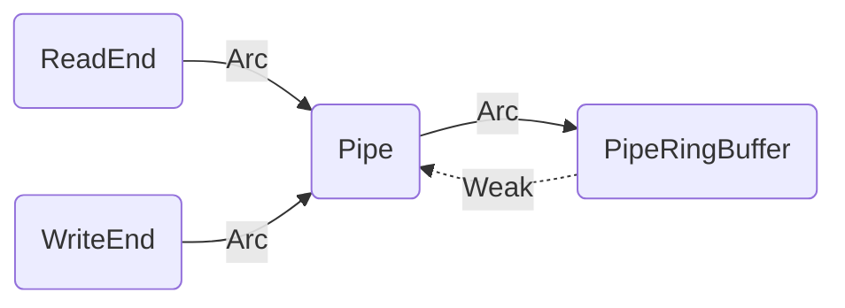
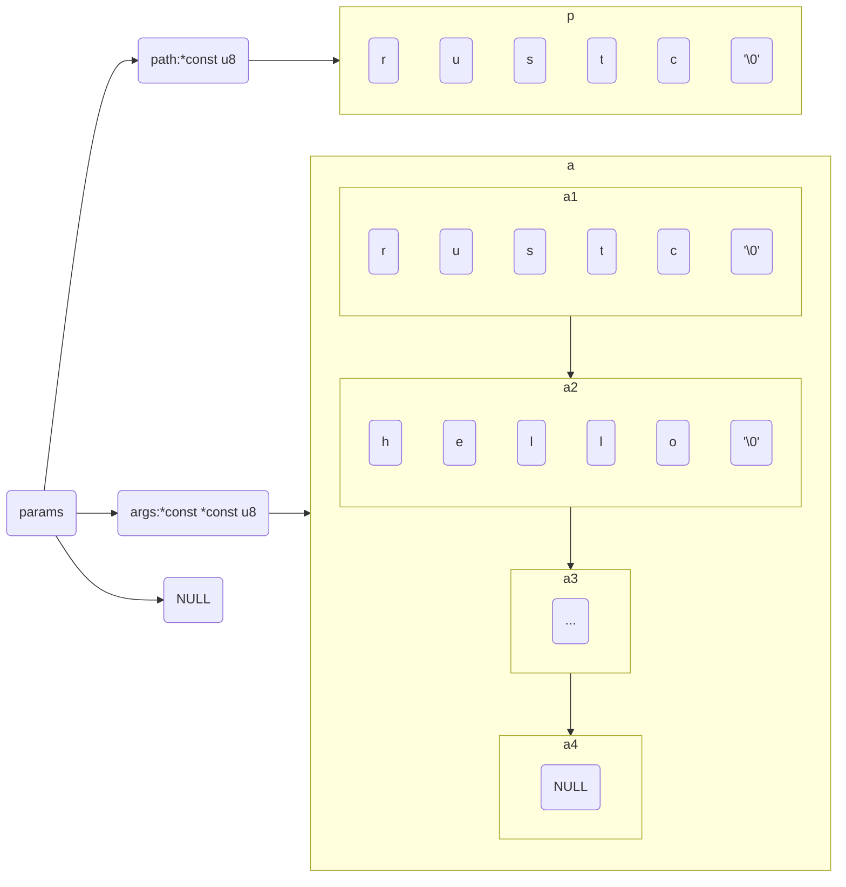

# 进程间通信


## 基于文件的管道

```rust
// os/src/fs/pipe.rs

pub struct Pipe {
    readable: bool,
    writable: bool,
    buffer: Arc<Mutex<PipeRingBuffer>>,
}
```

通过 `buffer` 字段还可以找到该管道端所在的管道自身。后续我们将为它实现 `File` Trait ，之后它便可以通过文件描述符来访问。

```rust
// os/src/fs/pipe.rs

const RING_BUFFER_SIZE: usize = 32;

#[derive(Copy, Clone, PartialEq)]
enum RingBufferStatus {
    FULL,
    EMPTY,
    NORMAL,
}

pub struct PipeRingBuffer {
    arr: [u8; RING_BUFFER_SIZE],
    head: usize,
    tail: usize,
    status: RingBufferStatus,
    write_end: Option<Weak<Pipe>>,
}
```

- `PipeRingBuffer` 的 `arr/head/tail` 三个字段用来维护一个循环队列，其中 `arr` 为存放数据的数组， `head` 为循环队列队头的下标， `tail` 为循环队列队尾的下标。
- `RingBufferStatus` 记录了缓冲区目前的状态：`FULL` 表示缓冲区已满不能再继续写入； `EMPTY` 表示缓冲区为空无法从里面读取；而 `NORMAL` 则表示除了 `FULL` 和 `EMPTY` 之外的其他状态。
- `PipeRingBuffer` 的 `write_end` 字段还保存了它的写端的一个弱引用计数，这是由于在某些情况下需要确认该管道所有的写端是否都已经被关闭了，通过这个字段很容易确认这一点。

> 这里值得注意的是，在 `PipeRingBuffer` 中 `write_end` 我们持有的是对 `Pipe` 的弱引用，而在读端和写端则持有对 `Pipe` 的强引用。
>
> 这意味着，当读端和写端都被关闭时，`PipeRingBuffer` 可以被自动的回收。同时，我们通过对 `Pipe` 的弱引用，保证不会出现循环引用。




### 管道创建

> 这里有个很有意思的点，这里看起来有大量的临时变量创建，然后被 `Arc` 移动到堆，但是实际上rust编译器会优化这些行为。
>
> 可以参考 [临时变量](#临时变量) 和 [RVO](#RVO) 中的描述。

```rust
/// Return (read_end, write_end)
pub fn make_pipe() -> (Arc<Pipe>, Arc<Pipe>) {
    let buffer = Arc::new(unsafe { UPSafeCell::new(PipeRingBuffer::new()) });
    let read_end = Arc::new(Pipe::read_end_with_buffer(buffer.clone()));
    let write_end = Arc::new(Pipe::write_end_with_buffer(buffer.clone()));
    buffer.exclusive_access().set_write_end(&write_end);
    (read_end, write_end)
}
```

### 使用pipe

`pipe` 的使用相当简单，就是分配 `Pipe` 后将 `fd` 写入到用户传入的地址。

```rust
pub fn sys_pipe(pipe: *mut usize) -> isize {
	trace!("kernel:pid[{}] sys_pipe", current_task().unwrap().pid.0);
    let task = current_task().unwrap();
    let token = current_user_token();
    let mut inner = task.inner_exclusive_access();
    let (pipe_read, pipe_write) = make_pipe();
    let read_fd = inner.alloc_fd();
    inner.fd_table[read_fd] = Some(pipe_read);
    let write_fd = inner.alloc_fd();
    inner.fd_table[write_fd] = Some(pipe_write);
    *translated_refmut(token, pipe) = read_fd;
    *translated_refmut(token, unsafe { pipe.add(1) }) = write_fd;
    0
}
```

### 管道读

`PipeRingBuffer` 在读数据的时候需要注意几个事情：

1. 他不是线程安全的，所以 `Pipe` 在访问时需要通过 `self.buffer.exclusive_access()` 来获取唯一访问权限；
2. 他不会判断缓冲区是否为空，所以在调用 `read_byte()` 前需要通过 `available_read()` 保证缓冲区存在数据；

```rust
impl PipeRingBuffer {
    pub fn read_byte(&mut self) -> u8 {
        self.status = RingBufferStatus::Normal;
        let c = self.arr[self.head];
        self.head = (self.head + 1) % RING_BUFFER_SIZE;
        if self.head == self.tail {
            self.status = RingBufferStatus::Empty;
        }
        c
    }
    pub fn available_read(&self) -> usize {
        if self.status == RingBufferStatus::Empty {
            0
        } else if self.tail > self.head {
            self.tail - self.head
        } else {
            self.tail + RING_BUFFER_SIZE - self.head
        }
    }
    pub fn all_write_ends_closed(&self) -> bool {
        self.write_end.as_ref().unwrap().upgrade().is_none()
    }
}
```

下面是 `Pipe` 的读实现：

1. 管道环形缓冲区非进程安全，必须通过 `exclusive_access()` 获取独占引用（等效加锁），避免多进程竞争；
2. 读端进程因缓冲区空挂起前，**必须手动 `drop` 释放独占引用（锁）**：若不释放，进程挂起期间锁会被长期持有，写端无法获取缓冲区权限写入数据，最终导致 “读端等数据、写端等锁” 的永久死锁；
3. 进程被唤醒后需**重新获取锁并检查缓冲区状态**。

```rust
impl File for Pipe {
    fn read(&self, buf: UserBuffer) -> usize {
        // 校验读端合法性并初始化读取计数 / 迭代器
        assert!(self.readable());
        let want_to_read = buf.len();
        let mut buf_iter = buf.into_iter();
        let mut already_read = 0usize;

        // 在循环中读取数据直到满足条件
        loop {
            // 缓冲区不是进程安全的，所以必须加锁
            let mut ring_buffer = self.buffer.exclusive_access();
            // 保证管道缓冲区非空
            let loop_read = ring_buffer.available_read();
            if loop_read == 0 {
                if ring_buffer.all_write_ends_closed() {
                    return already_read;
                }
                // 如果当前缓冲区为空，那么我们需要手动的 drop 避免死锁，因为这里会通过 __switch 进行进程切换，
                // 会导致当前进程被挂起，ring_buffer 不会被销毁，他持有的锁也不会被释放，进而导致写端长期阻塞死锁
                drop(ring_buffer);
                suspend_current_and_run_next();
                // 这里很重要，在下次切换回来的时候，我们必须回到最开始的位置重新获取锁，重新判断缓冲区状态。
                continue;
            }
            // 逐字节读取管道数据（本次最多读取当前可读取的字节数），直到用户缓冲区满/读满目标/管道数据空
            for _ in 0..loop_read {
                if let Some(byte_ref) = buf_iter.next() {
                    unsafe {
                        *byte_ref = ring_buffer.read_byte();
                    }
                    already_read += 1;
                    if already_read == want_to_read {
                        return want_to_read;
                    }
                } else {
                    return already_read;
                }
            }
        }
    }

}
```

## 命令行参数与标准 I/O 重定向

### shell程序的命令行参数分割

我们希望在rcore上支持 `argc/argc` 参数，为此我们的 `sys_exec` 函数增加了一个参数 `args`，数组中的每个元素都是**命令行参数字符串的起始地址**。

```rust
pub fn sys_exec(path: *const u8, mut args: *const usize) -> isize {}
```

从应用程序的角度来讲，它的调用参数是：

```rust
pub fn sys_exec(path: &str, args: &[*const u8]) -> isize {
    syscall(
        SYSCALL_EXEC,
        [path.as_ptr() as usize, args.as_ptr() as usize, 0],
    )
}
```

我们在 `ch7b_user_shell.rs` 中是这样去组织它的，此外String操作可以参考一下 [Rust中的String](#rust中的string)：

```rust
#[no_mangle]
pub fn main() -> i32 {
    // 这里是我们的输入字符串
	let line = "...";
    // 将输入字符串转换为&str数组
    let args: Vec<_> = line.as_str().split(' ').collect();
    // 将&str数组转换为String数组
    let mut args_copy: Vec<String> = args
        .iter()
        .map(|&arg| {
            let mut string = String::new();
            string.push_str(arg);
            string
        })
        .collect();
	// 在String数组的结尾追加 '\0'
    args_copy.iter_mut().for_each(|string| {
        string.push('\0');
    });
    
    // redirect input and output
    // ...
    
    // 再将 String 数组转换为 Vec<*const u8>
	let mut args_addr: Vec<*const u8> = args_copy.iter().map(|arg| arg.as_ptr()).collect();
	// 在数组的结尾添加 '\0'
    args_addr.push(0 as *const u8);
    
    // exec
    if exec(args_copy[0].as_str(), args_addr.as_slice()) {
        // ...
    }
}
```

这三段代码可以总结如下：

1. 将 `line` 按空格分割为多个字符串切片，取第零个切片转换为带 `\0` 终止符的 `String`，作为 `exec` 的程序路径（path）；
2. 将所有分割后的字符串切片转换为带 `\0` 终止符的 `String`，提取每个 `String` 的字节指针构建数组，并在数组末尾追加空指针（`0 as *const u8`），作为 `exec` 的参数列表（args）。
3. 调用 `exec` 时，以 `<1>` 中路径字符串的底层字节指针（`args_copy[0].as_str()` 对应的指针）、`<2>` 中带空指针终止的指针数组切片（`args_addr.as_slice()`）作为参数执行系统调用。

数据结构可以如下图所示：




### sys_exec 将命令行参数压入用户栈

```rust
pub fn sys_exec(path: *const u8, mut args: *const usize) -> isize {
    trace!("kernel:pid[{}] sys_exec", current_task().unwrap().pid.0);
    let token = current_user_token();
    let path = translated_str(token, path);
    // 解析命令行参数
    let mut args_vec: Vec<String> = Vec::new();
    loop {
        let arg_str_ptr = *translated_ref(token, args);
        if arg_str_ptr == 0 {
            break;
        }
        args_vec.push(translated_str(token, arg_str_ptr as *const u8));
        unsafe {
            args = args.add(1);
        }
    }
    if let Some(app_inode) = open_file(path.as_str(), OpenFlags::RDONLY) {
        let all_data = app_inode.read_all();
        let task = current_task().unwrap();
        let argc = args_vec.len();
        task.exec(all_data.as_slice(), args_vec);
        // return argc because cx.x[10] will be covered with it later
        argc as isize
    } else {
        -1
    }
}
```

我们还需要把这些参数复制到用户栈：

1. `user_sp` 由于内存分配需要修改；
2. `trap_cx.x[10] = args.len();` 修改 `a0` 表示命令行参数的个数；
3. `trap_cx.x[11] = argv_base;`，而 `a1` 则表示图中 `argv_base` 即蓝色区域的起始地址。
4. 这两个参数在第一次进入对应应用的用户态的时候会被接收并用于还原命令行参数。

```rust
impl TaskControlBlock {
    /// Load a new elf to replace the original application address space and start execution
    pub fn exec(&self, elf_data: &[u8], args: Vec<String>) {
        // memory_set with elf program headers/trampoline/trap context/user stack
        let (memory_set, mut user_sp, entry_point) = MemorySet::from_elf(elf_data);
        let trap_cx_ppn = memory_set
            .translate(VirtAddr::from(TRAP_CONTEXT_BASE).into())
            .unwrap()
            .ppn();
        // push arguments on user stack
        // 长度是 args.len() + 1 是因为我们要以 NULL 作为结尾
        // * core::mem::size_of::<usize>() 是因为我们这里是指针
        user_sp -= (args.len() + 1) * core::mem::size_of::<usize>();
        let argv_base = user_sp;
        // 背景：用户栈上已预留 (args.len()+1)*size_of::<usize>() 字节空间，用于存储 argv 指针数组（每个元素是参数字符串地址，末尾为NULL）
        // 问题：内核态仅知道该数组每个元素的用户态虚拟地址（argv_base + arg * size_of::<usize>()），无法直接访问用户态内存
        // 解决：通过 translated_refmut 结合用户页表（memory_set.token()），将用户态虚拟地址翻译为内核态可直接解引用的可变引用
        // 效果：内核可通过该引用修改用户栈上 argv 数组的内容（后续赋值参数字符串地址/NULL）
        let mut argv: Vec<_> = (0..=args.len())
            .map(|arg| {
                translated_refmut(
                    memory_set.token(),
                    (argv_base + arg * core::mem::size_of::<usize>()) as *mut usize,
                )
            })
            .collect();
        // 使用 NULL 作为结尾
        *argv[args.len()] = 0;

        // 将args参数写入栈中
        for i in 0..args.len() {
            // 为参数分配内存，因为String是不包含 '\0' 的，所以这里长度必须+1
            user_sp -= args[i].len() + 1;
            // 让指针地址指向字符串的起始位置
            *argv[i] = user_sp;
            // 将字符串写入到对应的虚拟内存地址
            let mut p = user_sp;
            for c in args[i].as_bytes() {
                *translated_refmut(memory_set.token(), p as *mut u8) = *c;
                p += 1;
            }
            *translated_refmut(memory_set.token(), p as *mut u8) = 0;
        }
        // 进行内存对齐
        user_sp -= user_sp % core::mem::size_of::<usize>();

        // **** access current TCB exclusively
        let mut inner = self.inner_exclusive_access();
        // substitute memory_set
        inner.memory_set = memory_set;
        // update trap_cx ppn
        inner.trap_cx_ppn = trap_cx_ppn;
        // initialize trap_cx
        let mut trap_cx = TrapContext::app_init_context(
            entry_point,
            user_sp,
            KERNEL_SPACE.exclusive_access().token(),
            self.kernel_stack.get_top(),
            trap_handler as usize,
        );
        trap_cx.x[10] = args.len();
        trap_cx.x[11] = argv_base;
        *inner.get_trap_cx() = trap_cx;
        // **** release current PCB
    }
}
```

假设输入值是 `aa` 和 `bb`，最终的内存结构为：


### 用户库从用户栈上还原命令行参数

在应用第一次进入用户态的时候，我们放在 Trap 上下文 a0/a1 两个寄存器中的内容可以被用户库中的入口函数以参数的形式接收：这里可以参考之前的 [进程调度](https://0x822a5b87.github.io/2025/12/02/ucore%E8%BF%9B%E7%A8%8B%E5%8F%8A%E8%BF%9B%E7%A8%8B%E7%AE%A1%E7%90%86/#%E8%BF%9B%E7%A8%8B%E7%9A%84%E9%80%80%E5%87%BA-1) 中关于 `_start` 函数的描述：

1. 这里 `argc` 对应于我们的参数数量，`argv` 是我们的参数指针数组；通过 `[*argv, *(argc - 1 + argv)]` 我们可以访问到我们的所有参数。

```rust
#[no_mangle]
#[link_section = ".text.entry"]
pub extern "C" fn _start(argc: usize, argv: usize) -> ! {
    clear_bss();
    unsafe {
        HEAP.lock()
            .init(HEAP_SPACE.as_ptr() as usize, USER_HEAP_SIZE);
    }
    let mut v: Vec<&'static str> = Vec::new();
    for i in 0..argc {
        let str_start =
            unsafe { ((argv + i * core::mem::size_of::<usize>()) as *const usize).read_volatile() };
        let len = (0usize..)
            .find(|i| unsafe { ((str_start + *i) as *const u8).read_volatile() == 0 })
            .unwrap();
        v.push(
            core::str::from_utf8(unsafe {
                core::slice::from_raw_parts(str_start as *const u8, len)
            })
            .unwrap(),
        );
    }
    exit(main(argc, v.as_slice()));
}
```


## Linux 管道（Pipe）核心解析

Linux 管道是**进程间通信（IPC）** 的基础机制，本质是内核提供的**单向、基于字节流的伪文件**，用于在进程间传递数据，核心特征可总结为：**单向、匿名（默认）、基于文件描述符、内核缓存、随进程退出释放**。

### 管道的核心分类

| 类型     | 匿名管道（Pipe）                  | 命名管道（FIFO）                                 |
| -------- | --------------------------------- | ------------------------------------------------ |
| 创建方式 | `pipe()` 系统调用                 | `mkfifo()` 系统调用 / `mkfifo` 命令              |
| 标识     | 无文件名，仅通过文件描述符关联    | 有文件系统路径（如 `/tmp/myfifo`），无实际数据块 |
| 生命周期 | 随创建进程 / 相关进程退出而销毁   | 随文件系统存在（需手动删除），数据随进程退出释放 |
| 通信范围 | 父子进程 / 兄弟进程（有血缘关系） | 任意进程（无血缘关系）                           |
| 核心特性 | 单向、字节流、内核缓存            | 单向 / 双向（需两个 FIFO）、字节流、内核缓存     |

### 匿名管道

- 调用 `pipe(int fd[2])` 时，内核创建一个**内存缓存区**（管道核心），并返回两个文件描述符：
  - `fd[0]`：只读端（read）；
  - `fd[1]`：只写端（write）；
- 管道是**单向的**：数据只能从 `fd[1]` 写入，从 `fd[0]` 读出；若需双向通信，需创建两个管道。
- 内核缓存区大小固定（默认 64KB，可通过 `fcntl()` 调整），写入 / 读取遵循 “先进先出（FIFO）”。

```c
#include <unistd.h>
#include <stdio.h>
#include <stdlib.h>
#include <string.h>

int main() {
    int fd[2];
    char buf[1024];
    pid_t pid;

    // 1. 创建匿名管道
    if (pipe(fd) == -1) {
        perror("pipe");
        exit(1);
    }

    // 2. 创建子进程（继承父进程的文件描述符）
    pid = fork();
    if (pid == -1) {
        perror("fork");
        exit(1);
    }

    if (pid == 0) { // 子进程：读管道
        close(fd[1]); // 关闭写端（只读）
        read(fd[0], buf, sizeof(buf));
        printf("子进程读取到：%s\n", buf);
        close(fd[0]);
        exit(0);
    } else { // 父进程：写管道
        close(fd[0]); // 关闭读端（只写）
        char *msg = "Hello from parent!";
        write(fd[1], msg, strlen(msg)+1);
        close(fd[1]);
        wait(NULL); // 等待子进程退出
    }
    return 0;
}
```

### 关键特性

- **阻塞行为**：
  - 读端：管道为空时，`read()` 阻塞；若写端全部关闭，`read()` 返回 0（表示 EOF）；
  - 写端：管道满时，`write()` 阻塞；若读端全部关闭，`write()` 触发 `SIGPIPE` 信号（默认终止进程）。
- **原子性**：写入数据 ≤ PIPE_BUF（默认 4KB）时，内核保证写入原子性（不会被其他进程打断）；超过则可能拆分。
- **无血缘限制（扩展）**：若通过 `UNIX 域套接字` 传递文件描述符，匿名管道也可用于无血缘进程通信。
- 通常来说，由于管道的使用依赖文件描述符（fd），匿名管道对于有血缘关系的进程而言通信非常方便 —— 因为子进程在fork()执行完毕后会复制父进程的文件描述符表（fd_table），因此天然共享匿名管道的 fd。不过 Linux 也提供了 AF_UNIX（UNIX 域套接字）机制，允许无血缘关系的进程间传递匿名管道的 fd，从而实现无血缘进程对匿名管道的共享使用。

### 命名管道（FIFO）

- 通过 `mkfifo("myfifo", 0666)` 创建一个**管道文件**（文件类型为 `p`），该文件仅作为 “标识”，数据仍存储在内核缓存区；
- 任意进程可通过 `open("myfifo", O_RDONLY)`/`open("myfifo", O_WRONLY)` 打开管道，实现无血缘通信；
- 必须同时打开读端和写端，否则 `open()` 会阻塞（除非指定 `O_NONBLOCK`）。

```c
// 进程A：创建并写入FIFO
#include <unistd.h>
#include <fcntl.h>
#include <sys/stat.h>

int main() {
    mkfifo("/tmp/myfifo", 0666); // 创建FIFO文件
    int fd = open("/tmp/myfifo", O_WRONLY);
    write(fd, "Hello FIFO", 10);
    close(fd);
    unlink("/tmp/myfifo"); // 删除FIFO文件
    return 0;
}

// 进程B：读取FIFO
#include <unistd.h>
#include <fcntl.h>
#include <sys/stat.h>

int main() {
    char buf[1024];
    int fd = open("/tmp/myfifo", O_RDONLY);
    read(fd, buf, sizeof(buf));
    printf("读取到：%s\n", buf); // 输出 "Hello FIFO"
    close(fd);
    return 0;
}
```

### 管道的核心限制

1. **单向性**：默认管道只能单方向传输数据，双向通信需两个管道；
2. **字节流无边界**：管道传输的是无结构字节流，读写端需自行约定数据分隔（如换行符、固定长度）；
3. **内核缓存有限**：写入数据超过缓存区大小时，写操作会阻塞（除非设置非阻塞模式）；
4. **只能用于同主机**：管道基于内核缓存，无法跨网络通信（跨网络需用 socket）；
5. **不支持随机访问**：管道是顺序流，只能 `read()`/`write()`，无法 `lseek()`。

### 管道的底层实现

1. **内核数据结构**：管道由 `struct pipe_inode_info` 表示，包含：
   - 环形缓存区（存储数据）；
   - 读 / 写等待队列（阻塞时挂起进程）；
   - 引用计数（关联打开的文件描述符）；
2. **文件系统视角**：管道是 “伪文件”，无实际磁盘存储，仅在内存中存在；
3. **进程关联**：进程通过文件描述符表关联管道的 `file` 结构体，fork 后子进程继承文件描述符，因此可共享管道。

### 匿名管道和命名管道的区别

- 匿名管道通常是在 `fork()` 之前，执行 `pipe(fd)` 来创建一个 `read` 和一个 `write` 管道，随后父进程和子进程通过 `fd` 中的文件描述符来进行通信。
- 命名管道是通过 `mkfifo()/open()` 方法打开同一个命名文件来实现管道共享。**这里需要注意的是，不同的进程打开的命名管道在各自的进程中有不同的 `fd`，只是被映射到了同一个管道内核对象**

## QA

### Rust中的String

### Rust 中指针（裸指针）与引用

Rust 里的**引用（`&T`/`&mut T`）** 和**裸指针（`*const T`/`*mut T`）** 是完全不同的概念，核心差异围绕 “安全规则” 和 “编译器约束” 展开：

- 引用本质是 “受约束的裸指针”：编译器会将 `&T` 编译为底层的地址指针，但附加了严格的安全规则；
- 裸指针是 “无约束的地址”：完全对标 C 语言的指针，开发者需手动保证其合法性（非空、非悬垂、无数据竞争）。

| 维度              | 引用（`&T`/`&mut T`）                         | 裸指针（`*const T`/`*mut T`）                 |
| ----------------- | --------------------------------------------- | --------------------------------------------- |
| 安全约束          | 受 Rust 借用检查器（Borrow Checker）严格管控  | 无任何安全约束，仅在 `unsafe` 块中使用        |
| 空指针 / 悬垂检查 | 编译器保证非空、非悬垂（指向有效内存）        | 允许为空、悬垂（指向已释放 / 无效内存）       |
| 可变性规则        | 遵循 “要么多个只读，要么一个可写”（别名规则） | 可同时存在 `*mut T` 和 `*const T`，无别名检查 |
| 生命周期          | 有明确生命周期标注，编译器管控作用域          | 无生命周期概念，完全由开发者管控              |
| 使用范围          | 普通代码（safe）                              | 仅 `unsafe` 块中使用                          |
| 核心定位          | 安全的内存访问方式（Rust 安全核心）           | 底层 / 高性能操作（如内核、FFI、自定义容器）  |

### 裸指针

rust中的裸指针分为两种：

- `*mut T` 可变裸指针，位于标准库的 `src/ptr/mut_ptr.rs`，他的具体实现（从编译器的角度可以称之为类型特化）分为三种：
  - `impl<T: ?Sized> *mut T {}`：通用裸指针（支持 Sized / 非 Sized 类型）。注意，Rust 对泛型参数有一个**默认隐式约束**：**所有泛型类型参数 `T` 都会自动加上 `T: Sized` 约束**，除非显式用 `?Sized` 取消。；
  - `impl<T> *mut [T] {}` 切片裸指针（动态长度数组）；
  - `impl<T, const N: usize> *mut [T; N] {}` 固定长度数组裸指针；
- `*const T` 不可变裸指针，位于标准库的 `src/ptr/const_ptr.rs`，他和 `*mut T` 一样，有三种类型特化：
  - `impl<T: ?Sized> *const T {}`
  - `impl<T> *const [T] {}` 
  - `impl<T, const N: usize> *const [T; N] {}` 

#### *mut T

```rust
/// A mutable variable, reference, or pointer.
impl<T: ?Sized> *mut T {
    pub const fn is_null(self) -> bool {}
	pub const unsafe fn as_mut<'a>(self) -> Option<&'a mut T> {}
    // ...
}
```

#### *const T

```rust
/// Compile-time constants, compile-time evaluable functions, and raw pointers.
impl<T: ?Sized> *const T {
	pub const fn is_null(self) -> bool {}
    pub const unsafe fn as_ref<'a>(self) -> Option<&'a T> {}
    // ...
}
```

### 临时变量

在 `rust` 中

```rust
/// Return (read_end, write_end)
pub fn make_pipe() -> (Arc<Pipe>, Arc<Pipe>) {
    let buffer = Arc::new(unsafe { UPSafeCell::new(PipeRingBuffer::new()) });
    let read_end = Arc::new(Pipe::read_end_with_buffer(buffer.clone()));
    let write_end = Arc::new(Pipe::write_end_with_buffer(buffer.clone()));
    buffer.exclusive_access().set_write_end(&write_end);
    (read_end, write_end)
}

pub struct Pipe {
    readable: bool,
    writable: bool,
    buffer: Arc<UPSafeCell<PipeRingBuffer>>,
}

impl Pipe {
    /// create readable pipe
    pub fn read_end_with_buffer(buffer: Arc<UPSafeCell<PipeRingBuffer>>) -> Self {
        Self {
            readable: true,
            writable: false,
            buffer,
        }
    }
    /// create writable pipe
    pub fn write_end_with_buffer(buffer: Arc<UPSafeCell<PipeRingBuffer>>) -> Self {
        Self {
            readable: false,
            writable: true,
            buffer,
        }
    }
}
```

当我们调用 `read_end_with_buffer` 他的执行流程是：

1. 调用 `Pipe::read_end_with_buffer`，在栈上创建临时 `Pipe` 实例；
2. `Arc::new(...)` 会把这个临时 `Pipe` 实例**从栈上移动到堆上**（`Arc` 的底层实现是 `Box` + 引用计数，`Box` 负责堆分配）；
3. Arc 会持有堆上 Pipe 实例的所有权，并返回一个指向堆内存的 Arc 智能指针（read_end）；
4. 函数退出时，栈上的临时 Pipe 变量（函数内的 Self）会被销毁，但这只是 “栈上的临时拷贝”，堆上的真实实例已经被 Arc 接管。

而 `make_pipe` 的执行流程可以概括为：

```rust
pub fn make_pipe() -> (Arc<Pipe>, Arc<Pipe>) {
    // 步骤1：创建 PipeRingBuffer 并封装到 UPSafeCell（栈→栈）
    // 1.1 栈上创建 PipeRingBuffer 临时对象（重量级，含环形缓冲区数组）；
    // 1.2 调用 unsafe { UPSafeCell::new(...) }：栈上创建 UPSafeCell 临时对象，
    //     内部用 RefCell::new(value) 将 PipeRingBuffer 包裹（仍在栈上，RefCell 仅提供可变性，不分配堆）；
    let temp_upsafe = unsafe { UPSafeCell::new(PipeRingBuffer::new()) };

    // 步骤2：将 UPSafeCell 移到堆并由 Arc 管理（栈→堆）
    // 2.1 Arc::new(temp_upsafe)：将栈上的 UPSafeCell<PipeRingBuffer> 移动到堆上；
    // 2.2 栈上创建 buffer（Arc 指针，8字节），指向堆上的 UPSafeCell，引用计数=1；
    let buffer = Arc::new(temp_upsafe);

    // 步骤3：创建读端 Pipe（栈→堆）
    // 3.1 buffer.clone()：Arc 引用计数+1（=2），仅拷贝指针，不拷贝堆数据；
    // 3.2 栈上创建 Pipe 临时对象（read_end 版本：readable=true，持有 buffer 克隆指针）；
    // 3.3 Arc::new(...)：将栈上的 Pipe 移动到堆上；
    // 3.4 栈上创建 read_end（Arc 指针），指向堆上的读端 Pipe；
    let read_end = Arc::new(Pipe::read_end_with_buffer(buffer.clone()));

    // 步骤4：创建写端 Pipe（逻辑同读端）
    // 4.1 buffer.clone()：Arc 引用计数+1（=3）；
    // 4.2 栈上创建 Pipe 临时对象（write_end 版本：writable=true）；
    // 4.3 Arc::new(...)：将栈上的 Pipe 移动到堆上；
    // 4.4 栈上创建 write_end（Arc 指针），指向堆上的写端 Pipe；
    let write_end = Arc::new(Pipe::write_end_with_buffer(buffer.clone()));

    // 步骤5：修改堆上的 PipeRingBuffer（内部可变性）
    // 5.1 buffer.exclusive_access()：通过 Arc 访问堆上的 UPSafeCell，
    //     调用 RefCell::borrow_mut() 获取 PipeRingBuffer 的可变引用（Panic 如果已被借用）；
    // 5.2 set_write_end(&write_end)：将写端 Pipe 的 Arc 指针（栈上）关联到堆上的 PipeRingBuffer；
    buffer.exclusive_access().set_write_end(&write_end);

    // 步骤6：返回结果
    // 6.1 栈上的 read_end/write_end（Arc 指针）被拷贝到调用方；
    // 6.2 函数内所有栈临时对象（PipeRingBuffer/UPSafeCell/Pipe 栈对象）被销毁（已无数据，仅空壳）；
    (read_end, write_end)
}
```

这里看起来，有多次**栈分配 -> Arc移动临时变量到堆**的操作，但是实际上这个过程会被 rust 编译器的 [RVO](#RVO) 优化到直接堆分配。

### RVO

`RVO` 是 `Return Value Optimization` 是 Rust/C++ 等编译器的核心优化手段，核心作用是**跳过函数返回值的 “栈上临时对象创建 → 拷贝 / 移动到目标位置” 的过程，直接在目标位置构造对象**，RVO 分为两种：

- **RVO**：基础返回值优化，针对 “函数返回匿名临时对象”；
- **NRVO**：Named Return Value Optimization，命名返回值优化，针对 “函数返回命名的局部对象”；

以我们的 `make_pipe` 中的 `UPSafeCell` 为例子：

#### 无RVO

全程：栈→栈→堆，有两次数据移动：

1. PipeRingBuffer::new() → 栈上创建 temp → 移动到函数外的栈临时位置；
2. UPSafeCell::new(...) → 栈上包裹该临时对象；
3. Arc::new(...) → 将栈上的 UPSafeCell 移动到堆；

```rust
// 步骤1：函数内栈上创建临时对象
pub fn new() -> PipeRingBuffer {
    let temp = Self { arr: [0; 4096], head: 0, tail: 0, status: Empty, write_end: None };
    temp // 返回时：栈上 temp 被拷贝/移动到函数外的临时位置
}

// 步骤2：调用处接收并移动到堆
let buffer = Arc::new(unsafe { UPSafeCell::new(PipeRingBuffer::new()) });
```

#### 有RVO

全程：无栈临时对象，直接堆构造，0 次数据移动。

1. Arc::new() 先分配堆内存（为 `UPSafeCell<PipeRingBuffer>` 预留空间）；
2. PipeRingBuffer::new() 直接在该堆内存的指定位置构造对象；
3. UPSafeCell::new() 直接在该堆内存中包裹 PipeRingBuffer； 

```rust
// 编译器优化后：
let buffer = Arc::new(unsafe { UPSafeCell::new(PipeRingBuffer::new()) });
```

