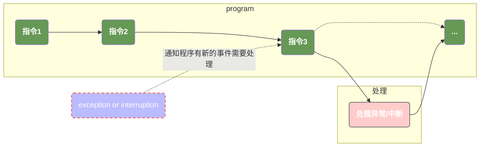
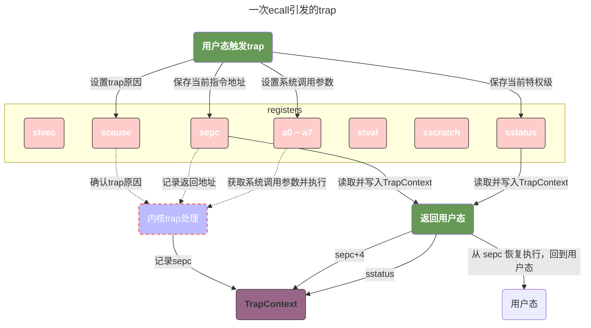

# 批处理系统

>本文描述了第一个简单的批处理系统的实现。代码量约 `600` 行。

```
➜  ~/code/2025a-rcore-0x822a5b87 git:(ch2) ✗ cloc --include-ext=rs,s,S,asm os        
     191 text files.
     150 unique files.                                          
     184 files ignored.

1 error:
Unable to read:  os/.gdb_history

github.com/AlDanial/cloc v 1.82  T=0.02 s (1154.8 files/s, 54212.4 lines/s)
-------------------------------------------------------------------------------
Language                     files          blank        comment           code
-------------------------------------------------------------------------------
Rust                            15             77            114            515
Assembly                         3             10             16            113
-------------------------------------------------------------------------------
SUM:                            18             87            130            628
-------------------------------------------------------------------------------
```


## QA

### 代码树

```terminaloutput
── os
│   ├── Cargo.toml
│   ├── Makefile (修改：构建内核之前先构建应用)
│   ├── build.rs (新增：生成 link_app.S 将应用作为一个数据段链接到内核)
│   └── src
│       ├── batch.rs(新增：实现了一个简单的批处理系统)
│       ├── console.rs
│       ├── entry.asm
│       ├── lang_items.rs
│       ├── link_app.S(构建产物，由 os/build.rs 输出)
│       ├── linker.ld
│       ├── logging.rs
│       ├── main.rs(修改：主函数中需要初始化 Trap 处理并加载和执行应用)
│       ├── sbi.rs
│       ├── sync(新增：包装了RefCell，暂时不用关心)
│       │   ├── mod.rs
│       │   └── up.rs
│       ├── syscall(新增：系统调用子模块 syscall)
│       │   ├── fs.rs(包含文件 I/O 相关的 syscall)
│       │   ├── mod.rs(提供 syscall 方法根据 syscall ID 进行分发处理)
│       │   └── process.rs(包含任务处理相关的 syscall)
│       └── trap(新增：Trap 相关子模块 trap)
│           ├── context.rs(包含 Trap 上下文 TrapContext)
│           ├── mod.rs(包含 Trap 处理入口 trap_handler)
│           └── trap.S(包含 Trap 上下文保存与恢复的汇编代码)
└── user(新增：应用测例保存在 user 目录下)
   ├── Cargo.toml
   ├── Makefile
   └── src
      ├── bin(基于用户库 user_lib 开发的应用，每个应用放在一个源文件中)
      │   ├── ...
      ├── console.rs
      ├── lang_items.rs
      ├── lib.rs(用户库 user_lib)
      ├── linker.ld(应用的链接脚本)
      └── syscall.rs(包含 syscall 方法生成实际用于系统调用的汇编指令，
                     各个具体的 syscall 都是通过 syscall 来实现的)
```


### 如何处理GIT目录安全检查机制引发的编译异常

这里rCore-code和rCore-test是通过两个独立的 git clone引入的，部分情况下（例如通过docker启动并且通过mount关联宿主机的文件地址）可能会触发git的“目录安全检查” 机制导致编译失败，一般异常会如下所示：

```
error: failed to run custom build command for `os v0.1.0 (/mnt/os)`

Caused by:
  process didn't exit successfully: `/mnt/os/target/debug/build/os-bb0e74f81fa807fa/build-script-build` (exit status: 101)
  --- stdout
  cargo:rerun-if-changed=../user/src/
  cargo:rerun-if-changed=../user/build/bin/

  --- stderr
  thread 'main' panicked at build.rs:42:44:
  attempt to subtract with overflow
  note: run with `RUST_BACKTRACE=1` environment variable to display a backtrace
warning: build failed, waiting for other jobs to finish...
```

这个是因为git的目录安全检查机制，可能间接影响目录的文件访问权限（或脚本的执行上下文），导致 build.rs 无法读取 ../user/build/bin/ 等依赖目录的文件（比如文件大小被误判为 0），进而引发计算溢出。

我们把新的项目加入safe.directory即可：

```bash
git config --global --add safe.directory /mnt
```

不过一般来说，对于这种嵌套依赖的项目，我们使用 `submodule` 可能是一个更好的选择：

```bash
git submodule add https://github.com/LearningOS/rCore-Tutorial-Test.git user
```

### riscv特权级切换

在现代计算机体系下，如果我们把代码的执行看成一个线性的（不考虑多核CPU和乱序指令等）指令执行，那么我们会发现有一些事件我们没有办法处理，例如：

1. 在程序执行的过程中计算机找到了一个新的设备，那我必须要等待当前的这些程序全部执行完才能识别到新设备；
2. 计算机在访问内存的过程中，发现页表中的缓存已经失效，或者发生了缺页异常；
3. 我在某个线程中设置了一个定时器，此时定时器设定的时间到了，我需要去执行定时器的回调函数；
4. 用户需要跳转到更高级的特权等级以便于执行某些需要更高权限的操作：例如处于用户态时的系统调用。

这些事件都是不可预测的，而为了处理这些事件，我们需要有一个方式来通知计算机，也就是 `trap`，而我们根据这些事件的类型，我们将他分为了两个大分类：`interruption` 和 `exception`。



#### 异常处理相关的寄存器

- Trap触发与入口配置
  - `stvec` Supervisor Trap Vector Base Address Register
  - `scause` Supervisor Cause Register
  - `sepc` Supervisor Exception Program Counter
  - `sstatus` Supervisor Status Register
- 数据传递与地址记录 CSR
    - `stval` Supervisor Trap Value
    - `sscratch` Supervisor Scratch
- 中断控制相关 CSR（扩展必备）
  - `sie` Supervisor Interrupt Enable Register
  - `sip` Supervisor Interrupt Pending Register

#### 异常处理

>这里我们先不关注中断相关的CSR，因为本章节主要是关注特权优先级的转换。

| CSR      | 功能                                                            |
|----------|---------------------------------------------------------------|
| stvec    | 控制 trap 处理代码的入口地址                                             |
| scause   | 描述 trap 的原因                                                   |
| sepc     | 当 trap 是第一个异常的时候，记录 trap 发生之前的 pc                             |
| sstatus  | SPP 等字段给出 Trap 发生之前 CPU 处在哪个特权级（S/U）等信息                       |
| stval    | Trap 值寄存器：保存与 Trap 相关的补充数据（因 Trap 类型而异）                       |
| sscratch | S 特权级临时 scratch 寄存器：Trap 触发后，内核可临时存储数据（如内核栈指针 sp），避免覆盖用户态寄存器。 |

在这里，我们先抛开寄存器，考虑一下异常触发时整体的流程：

1. 用户态触发trap，通知内核处理trap；
2. 内核trap处理，找到trap的对应处理逻辑，并执行该逻辑；
3. 内核还原现场到触发trap之前，并将控制权交还给用户态程序；

那他整体的流程相当于是可以看做如下伪代码执行：

1. `work()` 触发异常，跳转到异常处理逻辑；
2. `handle_exception()` 处理异常；
3. 跳转回用户态，继续执行 `after_handle_exception()`；

```java
public void run() {
    try {
        work();
        after_handle_exception();
    } catch (Exception1 e) {
        handle_exception_1();
    } catch (Exception2 e) {
        handle_exception_2();
    }
}
```

而在这个程序流转的过程中，我们需要很多信息，例如：

1. 触发的是 exception1 还是 exception2？这样我们才能知道使用哪个异常处理函数；
2. 异常处理完了，我应该跳回到哪里？work还是after_handle_exception？

>当我们把这整个过程扩展开来的时候，我们就可以清楚的了解到，这些寄存器就是连接用户态和内核态的桥梁。



### rust是如何组织依赖的

>rust中：
>1. 每个项目被称之为crate，crate 可以引用其他人发布的crate，由 `lib.rs` 来管理；
>2. crate下可能包含模块目录（Module Directory），模块目录由 `mod.rs` 来管理；
>3. 模块目录下的每个文件一定是一个单独的mod；
>4. 文件内部可以声明 `内嵌mod（Nested Module）`。

一个典型的rust项目的结构如下所示：

```
dev_os/                   # 项目根目录
├── src/                  # 源代码目录（Rust 约定 src/ 下是 crate 内容）
│   ├── main.rs           # 二进制 crate 入口（顶层 crate 的入口）
│   ├── os/               # 模块目录（Module Directory）
│   │   ├── mod.rs        # 模块目录入口：管理 os/ 下的文件模块
│   │   ├── console.rs    # 文件模块：mod console
│   │   │   └─ 内部可声明：mod inner_console { ... } （内嵌子 mod）
│   │   ├── process/      # 嵌套模块目录（os/ 下的子模块目录）
│   │   │   ├── mod.rs    # 嵌套模块目录入口
│   │   │   └── scheduler.rs  # 文件模块：process::scheduler
│   │   └── sbi.rs        # 文件模块：mod sbi
│   └── lib.rs            # （可选）库 crate 入口（若需对外提供库功能）
└── user/                 # 另一个模块目录（用户程序相关）
    ├── mod.rs
    └── hello_world.rs
```

### rust中`lib.rs`和`mod.rs`的区别是什么？

| 特征	   | lib.rs	                                 | mod.rs                        |
|-------|-----------------------------------------|-------------------------------|
| 核心定位	 | 整个 crate 的「库目标入口文件」	                    | 某个子模块的「目录入口文件」                |
| 适用范围  | 	仅用于 src/ 根目录下	                         | 仅用于「子模块目录」下（如 src/foo/mod.rs） |
| 默认作用  | 	自动成为 crate 根模块（crate::）	               | 自动成为该目录对应的模块（crate::foo::）    |
| 关联目标  | 	对应 Cargo.toml 中的 [lib] 目标	             | 对应某个嵌套子模块（手动通过 mod foo; 引入）   |
| 是否必需  | 	库目标（library）默认必需（可通过 Cargo.toml 配置修改）	 | 子模块目录默认必需（否则无法识别该目录为模块）       |

例如，在我们的 `/user` 项目下，它的整体目录结构如下：

```terminaloutput
──── user(新增：应用测例保存在 user 目录下)
   ├── Cargo.toml
   ├── Makefile
   └── src
      ├── bin(基于用户库 user_lib 开发的应用，每个应用放在一个源文件中)
      │   ├── ...
      ├── console.rs
      ├── lang_items.rs
      ├── lib.rs(用户库 user_lib)
      ├── linker.ld(应用的链接脚本)
      └── syscall.rs(包含 syscall 方法生成实际用于系统调用的汇编指令，
                     各个具体的 syscall 都是通过 syscall 来实现的)
```

我们的 Cargo.toml 定义如下：

```toml
[package]
name = "user_lib"
version = "0.1.0"
authors = ["Yifan Wu <shinbokuow@163.com>"]
edition = "2018"
```

在这里，我们通过 `name="user_lib"` 将所有的文件打包为一个 `crate`。

并且，我们在 `lib.rs` 中，声明如下：

```rust
#[macro_use]
pub mod console;
mod lang_items;
mod syscall;
```

也就是，只有 `console` 是 pub 的。

#### lib.rs

>Crate 的「根入口」（库目标专属）

1. 仅存于 src/ 根目录：不能放在子目录（如 src/foo/lib.rs 无效），只能在 src/lib.rs；
2. 自动关联 crate 根模块：无需任何配置，lib.rs 中的内容直接属于 crate:: 命名空间（比如 lib.rs 中定义 pub fn hello() {}，外部可通过 use user_lib::hello; 访问，其中 user_lib 是 crate 名称）；
3. 控制 crate 对外暴露的内容：lib.rs 中用 pub mod xxx; 导出子模块、#[macro_export] 导出宏、pub use xxx; 重导出内容，外部 crate 只能访问这里公开的内容；
4. 可以在 cargo.toml 中配置修改默认的 `lib.rs`；

#### mod.rs
>子模块目录的「入口文件」：mod.rs 是 Rust 中 嵌套子模块目录 的默认入口文件，核心作用是「定义该目录对应的模块内容、组织该目录下的子文件 / 子目录」。
>简单说：当你想把一个目录（如 src/utils/）当作一个模块时，必须在该目录下创建 mod.rs，否则 Rust 无法识别这个目录是一个模块。

1. 仅存于「子模块目录」下：必须放在子目录中（如 src/utils/mod.rs），不能在 src/ 根目录下用 mod.rs 替代 lib.rs（无效）；
2. 自动关联目录模块：src/foo/mod.rs 直接对应模块 crate::foo，该目录下的其他文件（如 foo/bar.rs）需在 mod.rs 中通过 mod bar; 引入；
3. 控制子模块的对外暴露：mod.rs 中用 pub mod bar; 导出目录下的子模块，外部只能访问这里公开的内容；

#### 总结

1. Rust 以 Crate（包）-> Mod（模块） 为核心层级组织代码 —— 一个 Crate 是最小的编译单元（由 Cargo.toml 的 name 定义），内部通过 mod 拆分逻辑（文件 / 目录对应模块）；
2. Crate 的库目标（library）默认由 src/lib.rs 管理（根模块 crate::）；子模块目录（如 src/foo/）默认由 mod.rs 管理（对应模块 crate::foo::）；
3. 访问规则：
    - 普通成员（fn/struct/enum 等）：需满足「双重公开」—— 自身用 pub 修饰（如 pub fn xxx），且所在模块在「根模块到该成员的路径上」都有 pub 暴露（如 lib.rs 中 pub mod foo，foo/mod.rs 中 pub mod bar，才能让外部访问 crate::foo::bar::xxx）；
    - 宏（macro_rules!）：需用 #[macro_export] 标记（替代普通成员的 pub），且所在模块需通过 pub mod 暴露（否则外部无法识别该模块的宏）；
    - 私有模块 / 成员：仅当前 Crate 内部可访问，外部完全不可见（用于封装内部实现）。


### `#[macro_use]` 和 `#[macro_export]`

- `#[macro_use]` 就是针对于宏的 `import`；
- `#[macro_export]` 就是针对于宏的 `export`；