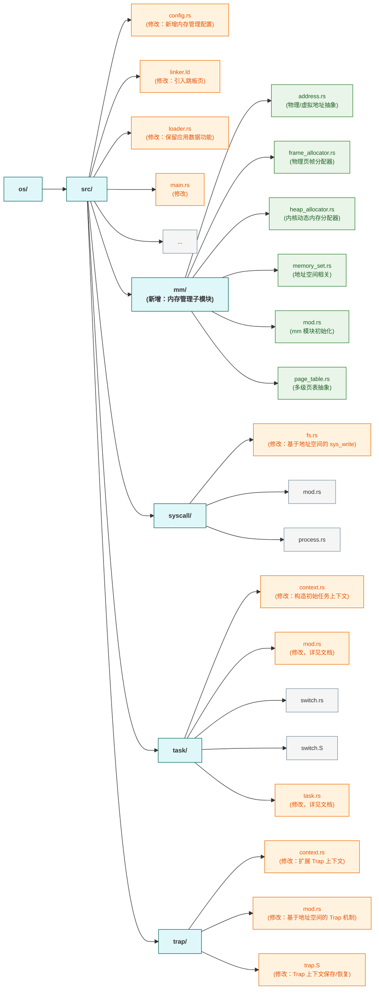
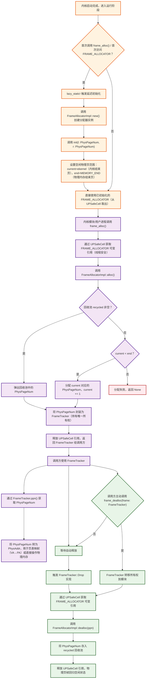
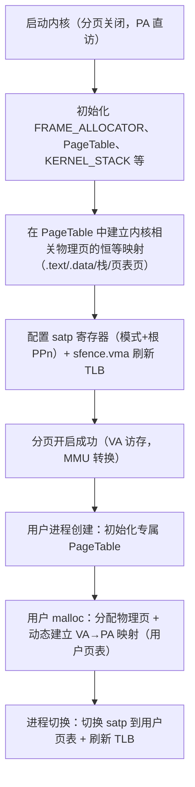

>在这个章节，我们会实现虚拟内存机制。



```terminaloutput
➜  ~/code/2025a-rcore-0x822a5b87 git:(ch4) cloc --include-ext=rs,s,S,asm os
     152 text files.
     121 unique files.                              
     126 files ignored.

github.com/AlDanial/cloc v 1.82  T=0.01 s (2328.7 files/s, 184956.7 lines/s)
-------------------------------------------------------------------------------
Language                     files          blank        comment           code
-------------------------------------------------------------------------------
Rust                            29            193            386           1866
Assembly                         4             10             26            140
-------------------------------------------------------------------------------
SUM:                            33            203            412           2006
-------------------------------------------------------------------------------
```

## 管理SV39多级页表

### 物理页帧管理



物理页帧存放的数据从内容上来说分为两种：

1. 应用/内核的数据或者代码；
2. 应用/内核的多级页表；

本质上，物理页帧的核心是 “存储单元”—— 无论存放的是代码、应用数据，还是页表本身，在物理内存层面都是 “二进制数据块”，页表只是 “具有特殊用途的数据”（用于地址转换的 “映射表数据”）

#### 可用物理页的分配与回收

>区分内核空间和物理空间可以参考 [内存的内核空间和用户空间](#内存的内核空间和用户空间)

物理页的实际大小，由三个参数共同决定。他们大小从也是 `virt memory` < `ekernel` < `MEMORY_END`。**这里需要注意的是，这三个值都是物理地址而非虚拟地址。**

1. qemu模拟的 `virt` 硬件平台上的物理内存的起始地址 `0x80000000`；
2. `ekernel` 在 `linker` 中，我们在完成 `.bss` 并且进行内存对齐之后，指定了 `ekernel` 这个参数，表示内核代码的结束位置；
3. `MEMORY_END` 在 `config.rs` 中硬编码的地址 `0x88000000`。

随后，我们定义：

1. `trait` `FrameAllocator` 用于管理我们全部可用的物理内存；
2. `impl` `StackFrameAllocator` 是基于Vec的一个简单实现；

```rust
// os/src/mm/frame_allocator.rs

trait FrameAllocator {
    fn new() -> Self;
    fn alloc(&mut self) -> Option<PhysPageNum>;
    fn dealloc(&mut self, ppn: PhysPageNum);
}
```

`StackFrameAllocator` 的实现逻辑也非常简单：

1. `current` 和 `end` 表示空闲内存的页号，这个页号初始由 `ekernel` 和 `MEMORY_END` 进行内存对齐后计算得出；
2. `recycled` 表示 `alloc` 后 `dealloc` 的内存，我们分配时也优先从这里开始分配；

```rust
// os/src/mm/frame_allocator.rs

pub struct StackFrameAllocator {
    current: usize,  //空闲内存的起始物理页号
    end: usize,      //空闲内存的结束物理页号
    recycled: Vec<usize>,
}

// os/src/mm/frame_allocator.rs

impl FrameAllocator for StackFrameAllocator {
    fn new() -> Self {
        Self {
            current: 0,
            end: 0,
            recycled: Vec::new(),
        }
    }
    fn alloc(&mut self) -> Option<PhysPageNum> {
        if let Some(ppn) = self.recycled.pop() {
            Some(ppn.into())
        } else {
            if self.current == self.end {
                None
            } else {
                self.current += 1;
                Some((self.current - 1).into())
            }
        }
    }
    fn dealloc(&mut self, ppn: PhysPageNum) {
        let ppn = ppn.0;
        // validity check
        if ppn >= self.current || self.recycled
            .iter()
            .find(|&v| {*v == ppn})
            .is_some() {
            panic!("Frame ppn={:#x} has not been allocated!", ppn);
        }
        // recycle
        self.recycled.push(ppn);
    }
}

impl StackFrameAllocator {
    pub fn init(&mut self, l: PhysPageNum, r: PhysPageNum) {
        self.current = l.0;
        self.end = r.0;
    }
}
```

随后初始化一个全局的 `FRAME_ALLOCATOR`，这里需要注意的是，我们要把物理地址 `ekernel` 和 `MEMORY_END` 转换为对应的页号。

```rust
type FrameAllocatorImpl = StackFrameAllocator;

lazy_static! {
    /// frame allocator instance through lazy_static!
    pub static ref FRAME_ALLOCATOR: UPSafeCell<FrameAllocatorImpl> =
        unsafe { UPSafeCell::new(FrameAllocatorImpl::new()) };
}
/// initiate the frame allocator using `ekernel` and `MEMORY_END`
pub fn init_frame_allocator() {
    extern "C" {
        fn ekernel();
    }
    FRAME_ALLOCATOR.exclusive_access().init(
        PhysAddr::from(ekernel as usize).ceil(),
        PhysAddr::from(MEMORY_END).floor(),
    );
}
```


#### 分配/回收物理页帧的接口

1. `alloc` 和 `dealloc` 都是非pub的函数，我们需要对外暴露分配的接口。
2. 这里非常值得注意的一点是，我们 `frame_alloc()` 分配得到的是 `FrameTracker` 而不是 `PhysPageNum`，这个设计很巧妙，可以参考 [PhysPageNum和FrameTracker](#physpagenum和frametracker)

```rust
// os/src/mm/frame_allocator.rs

pub fn frame_alloc() -> Option<FrameTracker> {
    FRAME_ALLOCATOR
        .exclusive_access()
        .alloc()
        .map(|ppn| FrameTracker::new(ppn))
}

fn frame_dealloc(ppn: PhysPageNum) {
    FRAME_ALLOCATOR
        .exclusive_access()
        .dealloc(ppn);
}
```

`FrameTracker` 的实现

```rust
/// tracker for physical page frame allocation and deallocation
pub struct FrameTracker {
    /// physical page number
    pub ppn: PhysPageNum,
}

impl FrameTracker {
    /// Create a new FrameTracker
    pub fn new(ppn: PhysPageNum) -> Self {
        // page cleaning
        let bytes_array = ppn.get_bytes_array();
        for i in bytes_array {
            *i = 0;
        }
        Self { ppn }
    }
}

impl Drop for FrameTracker {
    fn drop(&mut self) {
        frame_dealloc(self.ppn);
    }
}
```

### 多级页表管理

#### 页表基本数据结构与访问接口

页表是一个多级的数据结构，他的作用就是将 `VPN` 映射到 `PPN`，而这里有一点需要注意的是：

1. 页表本身也是数据，每一个页表都会有一个唯一的入口地址，而这个地址是他的 PPN；
2. 页表内部 `frames` 是通过 `FrameTracker` 来实现 PPN 管理，这里在我们当前的逻辑下是可以的：因为我们暂时没有**共享物理页**的场景。在实际的应用中：当多个进程共享一个 PPN 时（例如进程创建时的 COW），会导致内存管理异常，因为当共享的某一个进程结束时，这个内存将被释放，而另外一个引用该 PPN 的进程会引用一个悬垂指针。
3. 此外，在开启分页后，无论是内核态还是用户态都是通过虚拟地址来访问物理内存。也就是说，我们必须将物理内存中**所有需要访问的物理页**都设定一个 `VPN` -> `PPN` 的映射关系并且存储到页表中。而具体的这个映射逻辑，请参考 [虚拟内存到物理内存](#虚拟内存到物理内存)。

```rust
/// page table structure
pub struct PageTable {
    /// Each user-facing application has a corresponding unique multi-level page table,
    /// which means the starting address of each page table is unique.
    /// That also means we must save root ppn as a `identifier`.
    root_ppn: PhysPageNum,
    /// `frames` contains all page table entries (including the root PTE) and stores them as a vector.
    frames: Vec<FrameTracker>,
}

impl PageTable {
    /// set the map between virtual page number and physical page number
    pub fn map(&mut self, vpn: VirtPageNum, ppn: PhysPageNum, flags: PTEFlags){}
    /// remove the map between virtual page number and physical page number
    pub fn unmap(&mut self, vpn: VirtPageNum){}
}
```

#### 内核中访问物理页帧的方法

- `get_pte_array` 返回的是一个页表项定长数组的可变引用，代表多级页表中的一个节点；
- `get_bytes_array` 返回的是一个字节数组的可变引用，可以以字节为粒度对物理页帧上的数据进行访问，前面进行数据清零就用到了这个方法；
- `get_mut` 是个泛型函数，可以获取一个恰好放在一个物理页帧开头的类型为 T 的数据的可变引用。例如，我们获取 `TrapContext` 就可以使用它。

>这里值得注意的是，`get_pte_array` 这个方法只能对于 `PageTable#root_ppn` 调用。

```rust
impl PhysAddr {
    ///Get mutable reference to `PhysAddr` value
    /// Get the mutable reference of physical address
    pub fn get_mut<T>(&self) -> &'static mut T {
        unsafe { (self.0 as *mut T).as_mut().unwrap() }
    }
}
impl PhysPageNum {
    /// Get the reference of page table(array of PTEs)
    pub fn get_pte_array(&self) -> &'static mut [PageTableEntry] {
        let pa: PhysAddr = (*self).into();
        unsafe { core::slice::from_raw_parts_mut(pa.0 as *mut PageTableEntry, 512) }
    }
    /// Get the reference of page(array of bytes)
    pub fn get_bytes_array(&self) -> &'static mut [u8] {
        let pa: PhysAddr = (*self).into();
        unsafe { core::slice::from_raw_parts_mut(pa.0 as *mut u8, 4096) }
    }
    /// Get the mutable reference of physical address
    pub fn get_mut<T>(&self) -> &'static mut T {
        let pa: PhysAddr = (*self).into();
        pa.get_mut()
    }
}
```

#### 建立和拆除虚实地址映射关系

这个逻辑较为简单，就是使用VPN的三级索引去查询PageTable，这里需要注意的几个点是：

1. `RV39` 中 `VPN` 是三个 `9bit` 的 `usize`；
2. `VPN` 不是 `VA`，他和 `offset` 结合才是 `VA`；
3. `ppn.get_pte_array()` 获取的是通过 `root_ppn` 读取的连续的 PTE 对象。

```rust
impl VirtPageNum {
    /// Get the indexes of the page table entry
    pub fn indexes(&self) -> [usize; 3] {
        let mut vpn = self.0;
        let mut idx = [0usize; 3];
        for i in (0..3).rev() {
            idx[i] = vpn & 0x1FF;
            vpn >>= 9;
        }
        idx
    }
}

impl PageTable {
    /// Find PageTableEntry by VirtPageNum, create a frame for a 4KB page table if not exist
    fn find_pte_create(&mut self, vpn: VirtPageNum) -> Option<&mut PageTableEntry> {
        let idxs = vpn.indexes();
        let mut ppn = self.root_ppn;
        let mut result: Option<&mut PageTableEntry> = None;
        for (i, idx) in idxs.iter().enumerate() {
            let pte = &mut ppn.get_pte_array()[*idx];
            if i == 2 {
                result = Some(pte);
                break;
            }
            if !pte.is_valid() {
                let frame = frame_alloc().unwrap();
                *pte = PageTableEntry::new(frame.ppn, PTEFlags::V);
                self.frames.push(frame);
            }
            ppn = pte.ppn();
        }
        result
    }

}
```

此外，我们在一些场景下可能需要访问非当前地址空间的页表（例如，在系统调用时内核态需要访问用户态的内存空间），此时我们需要一个方法，能查询到其他地址空间的页表但是不影响其所有权，我们提供了下面这个方法：

```rust
impl PageTable {
    /// Temporarily used to get arguments from user space.
    pub fn from_token(satp: usize) -> Self {
        Self {
            root_ppn: PhysPageNum::from(satp & ((1usize << 44) - 1)),
            frames: Vec::new(),
        }
    }
    /// get the page table entry from the virtual page number
    pub fn translate(&self, vpn: VirtPageNum) -> Option<PageTableEntry> {
        self.find_pte(vpn).map(|pte| *pte)
    }
}
```

## 内核与应用的地址空间
## 基于地址空间的分时多任务
## 超越物理内存的地址空间

## QA

### 虚拟内存到物理内存

#### 内核态的分页逻辑

>开启分页后，CPU 不会区分 “内核态地址” 和 “用户态地址”——所有访存地址都会被视为虚拟地址，必须经过 MMU 查页表转换。哪怕是内核访问自己的代码、数据，也得通过映射才能找到对应的物理页。

举个例子，在我们的 `rCore` 实现中，我们在链接器中设置的起始地址是 `0x80200000`，我们的访问是这样的：

1. 内核代码段存放在物理地址 0x80200000（ekernel 之前）；
2. 启用分页前，CPU 执行 lw x1, 0x80200000，直接访问物理内存 0x80200000；
3. 启用分页后，CPU 会把 0x80200000 当成 虚拟地址：
   1. 若页表中没有 “虚拟地址 0x80200000 → 物理地址 0x80200000” 的映射，MMU 会触发页错误，内核直接崩溃；
   2. 只有建立了映射，MMU 才会把虚拟地址转成物理地址，内核才能正常执行代码、访问数据。

>内核态的内存（代码、数据、栈、页表本身），是 “需要访问的物理页” 中最核心的一部分，必须优先建立映射 —— 否则内核自己都跑不起来。

#### 内核态需要映射的物理页具体有哪些

1. 内核自身的代码段（.text）、数据段（.data）、.bss 段：内核的指令、全局变量、未初始化变量都存在这些物理页中，是内核运行的基础 —— 必须建立映射，否则内核无法执行指令、访问全局变量。
2. 内核栈（Kernel Stack）：内核线程 / 进程的栈空间（用于函数调用、局部变量存储），本质是一块物理页 —— 必须建立映射，否则内核函数调用会栈溢出或访问非法地址。 
3. **页表页（根页表、中间级页表）：页表本身也是物理页，内核需要修改页表项（如为用户进程建立映射），就必须访问这些物理页 —— 因此页表页自身也需要建立映射（通常是恒等映射）。 **
4. 内核管理的空闲物理页（按需映射）： 内核需要分配 / 回收物理页（如用户进程 malloc 时），就必须访问这些空闲物理页 —— 通过恒等映射，内核可以直接用 “物理地址作为虚拟地址” 访问它们，无需额外计算偏移。

>这些映射通常在内核初始化阶段、启用分页之前就建立完成，确保启用分页后内核能正常运行。

#### 如何建立映射

>除了 “用户态私有数据页” 和 “按需动态映射的空闲物理页”，内核态所有需要访问的物理页（代码段、数据段、.bss、内核栈、页表页），均使用恒等映射（VA=PA）。

- 以下场景必须使用 `恒等映射`，因为必须直接访问物理页，且地址不能变：
  - 内核代码段（.text）、数据段（.data）、.bss 段： 链接器指定的地址就是物理地址，内核代码 / 全局变量的引用直接依赖这个地址，改用非恒等映射会导致 “代码指令地址找不到”“全局变量访问错位”，内核无法运行；
  - 内核栈（Kernel Stack）： 栈指针（sp）指向的是物理地址，函数调用、局部变量存储依赖这个地址的连续性，非恒等映射会导致栈访问异常（如栈溢出、数据错乱）；
  - 页表页（根页表、中间级页表）： 页表项（PTE）中存储的是物理页号（PPN），内核修改页表时需要直接访问页表页的物理地址，恒等映射能让内核 “以物理地址为虚拟地址” 直接操作，无需额外计算偏移。
- 空闲物理页是每次用户态程序申请内存时，从 FRAME_ALLOCATOR 中得到的随机映射。

我们整体的流程可以总结为：



### PhysPageNum和FrameTracker

使用 `FrameTracker` 代替 `PhysPageNum` 这个是基于 `RAII` 的思想的设计：我们为 `FrameTracker` 实现了 `Drop`，这样我们就不用手动的在物理栈帧退出作用域时手动的 `dealloc()` 了。

而这里，我们之所以使用 `FrameTracker` 来实现，而不是直接为 `PhysPageNum` 实现 `Drop` 接口，是因为两者的语义是完全不一样的：

1. `PhysPageNum` 是物理页帧的编号，他是一个无所有权的 “标识”；
2. `FrameTracker` 是物理页帧的 “资源句柄”，是 **所有权的管理者。**

| 类型            | 	核心语义                      | 	角色定位           | 	关键特性                                                                                               |
|---------------|----------------------------|-----------------|-----------------------------------------------------------------------------------------------------|
| PhysPageNum	  | 物理页帧的 “编号”（如 0x100、0x200）	 | 无所有权的 “标识 / 索引” | 1. 仅存储页号，不关联 “分配状态”； <br/>2. 可复制、可传递，不影响物理页；<br/> 3. 无法感知 “是否被分配”。                                  |
| FrameTracker	 | 物理页帧的 “资源句柄”	              | 有所有权的 “管理者”	    | 1. 持有 PhysPageNum，代表 “独占该物理页”；<br/>2. 实现 Drop，离开作用域自动调用 dealloc；<br/> 3. 不可随意复制（通常 !Clone），确保所有权唯一。 |

类似于房间，`PhysPageNum` 是房间号，而`FrameTracker`是业主。

再从两个struct的实现来看：

1. PhysPageNum 是简单的包装类型（struct PhysPageNum(pub usize)），可复制，可拷贝等；
2. FrameTracker 不可复制，不可拷贝；

```rust
/// physical page number
#[derive(Copy, Clone, Ord, PartialOrd, Eq, PartialEq)]
pub struct PhysPageNum(pub usize);


/// tracker for physical page frame allocation and deallocation
pub struct FrameTracker {
    /// physical page number
    pub ppn: PhysPageNum,
}
```

### 内存的内核空间和用户空间

>在我们使用内存的过程中，有两个一直被提到的名词：`内核空间` 和 `用户空间`，那硬件和操作系统是怎么区分内核空间和用户空间的呢？

**首先需要知道的是，这两个空间都是操作系统的概念。** 硬件（CPU/MMU）对物理内存的所有页帧一视同仁。所谓 “内核物理内存”“用户物理内存”，是操作系统为了管理方便（避免冲突、统一回收）而做的软件划分（比如把物理地址 0x80000000~0xFFFF0000 划分为内核专用），硬件不感知这个划分。

硬件判断 “当前访问的是内核空间还是用户空间”，核心依据是 虚拟地址（VA），而非物理地址（PA）—— 具体是 “VA 高位特征 + 页表项 U 位 + 当前 CPU 特权级” 三者协同：

- VA 高位：初步归类（例如如 Sv39 的 0x0000_0000_0000~0x7FFF_FFFF_FFFF 为用户 VA，0x8000_0000_0000~0xFFFF_FFFF_FFFF 为内核 VA）；
- 页表项 U 位：精准权限（`U=1`→允许用户态访问，`U=0`→仅允许内核态访问）；
- CPU 特权级：最终校验（用户态不能访问 U=0 的 VA，内核态可访问所有 VA）。

总结来说：

- 硬件：只认 “VA 高位 + PTE U 位 + 特权级”，不管物理内存的软件划分；
- 操作系统：制定 VA 划分规则、设置 PTE 权限、管理 PA 分配，让硬件的判断逻辑服务于 “内核 / 用户隔离”；

而在 `rCore` 的开发过程中： 这个特权级切换路径是：M 模式（引导）→ S 模式（内核运行）→ U 模式（用户进程运行）

我们通常是在M模式下，开始加载一段内核引导代码：

1. 通常我们会在链接器里声明一个 ekernel 表示内核代码的结束地址，并且进行内存对齐；
2. 内核会维护一个memory allocator，这个memory allocator 会使用 ekernel 物理内存作为分配的起始点，也就是用户态内存的起始点，并在内核代码的配置中声明一个值作为用户态地址的终点。

随后，内核在分配内存的过程中就围绕这一片被划分到用户态的虚拟内存来分配对应的物理内存，同时维护页表项。也就是说，我们现在已经满足了VA高位+PTE U位这两个条件。

而特权级这个条件，我们是基于trap来实现的，在用户态下，如果需要访问内核空间代码，则需要通过trap跳转到对应的特权级。

### `from` 和 `into`

在 Rust 中，From 和 Into 是一对 类型转换相关的 trait，核心作用是 定义 “安全、无歧义的类型转换规则”，避免手动写重复的转换代码，同时让代码更简洁、可读性更强。二者本质是 “同一转换的正反两面”，遵循 “实现 `From<A>` for B，自动获得 `Into<B>` for A” 的设计（无需重复实现）。

一般而言，当我们为类型 U 实现了 From<T> Trait 之后，可以使用 U::from(_: T) 来从一个 T 类型的实例来构造一个 U 类型的实例；而当我们为类型 U 实现了 Into<T> Trait 之后，对于一个 U 类型的实例 u ，可以使用 u.into() 来将其转化为一个类型为 T 的实例。


### SV39多级页表的硬件基址

- `SATP` Supervisor Address Translation and Protection，直接控制处理器是否启用虚拟地址转换（MMU 功能），并指定页表的物理地址。


- `MODE` 控制 CPU 使用哪种页表实现；
- `ASID` 表示地址空间标识符，这里还没有涉及到进程的概念，我们不需要管这个地方；
- `PPN(Pyhsical Page Number)` 存的是根页表所在的物理页号。这样，给定一个虚拟页号，CPU 就可以从三级页表的根页表开始一步步的将其映射到一个物理页号。

- 当 MODE 设置为 0 的时候，代表所有访存都被视为物理地址；
- 而设置为 8 的时候，SV39 分页机制被启用，所有 S/U 特权级的访存被视为一个 39 位的虚拟地址，它们需要先经过 MMU 的地址转换流程，如果顺利的话，则会变成一个 56 位的物理地址来访问物理内存；否则则会触发异常，这体现了分页机制的内存保护能力。

#### 地址格式与组成


在 `SV39` 下，我们的 VA 总共有 39 位。并且分为两个部分：

- `PO(Page Offset)` 用于表示页内偏移量，这个和我们页的大小有关，假设每页是 `4KB`，那么就需要 `12` 位；
- `VPN(Virtual Page Number)` 用于 PPN，在映射完之后通常被扩展，例如可能从 `27` 位扩展到 `44` 位。

>这里需要注意的是，我们的PPN的范围是要大于VPN的，核心是为了 “解耦虚拟空间需求和物理空间能力”：
>1. 虚拟空间只需要满足应用的“观感需求”: 应用需要的是 “连续、足够大的地址空间”，而非 “实际的物理内存”，而512GB 虚拟空间足够覆盖绝大多数场景
>2. 物理空间需要满足硬件的 “扩展需求”。
>
>而解耦的核心价值在于：
>- 应用不依赖物理内存大小：即使物理内存只有 8GB，应用也能使用 512GB 虚拟空间（通过 “按需分页” 和 “交换分区”，裸机场景可省略交换分区）；
>- 物理内存可灵活分配：多个应用的虚拟空间可以映射到物理内存的不同区域，物理内存不足时，内核可以回收不常用的物理页（换出到磁盘），再分配给需要的应用；
>- 硬件升级无需修改应用：当物理内存从 8GB 升级到 64GB，应用无需重新编译 —— 内核只需更新页表映射，应用的虚拟地址空间完全不变。

#### 页表项的数据结构抽象与类型定义


- SV39是一个三级页表，其中 `[53: 10]` 这 44 位是物理页号，并且对应了在TLB中的一级索引，二级索引一级三级索引；
- 低8位是对应的物理页的标志位：
  - `V` 对应物理页是否有效；
  - `R`, `W`, `X` 表示物理页的读，写，执行；
  - `U` 代表了在 User Mode 下是否有权限执行；
  - `G`
  - `A` 代表了页面代表对应的虚拟页面是否被访问过，是 **[全局物理内存的页置换算法](#全局物理内存的页置换算法)** 的核心数据；
  - `D` 代表了页面代表对应的物理页面是否被修改过，用于判断缓存是否可用。此外，它可以协助我们判断 [优化页面换出](#优化页面换出)。

### 全局物理内存的页置换算法

“全局物理内存的页置换算法（如clock，二次机会算法）” 是缓存淘汰的核心逻辑，具体规则可能如下：

1. 内核扫描页表，检查 `A` 位；
2. 所有 `A` 为0的页面最近未被访问过，直接淘汰；
3. 如果 `A` 为1，则页面最近被访问过，**我们此时将其设置为0**；
4. 再回到 `<1>`，如果 `A` 为0，则近期未访问，进行淘汰；

核心逻辑在于，`A` 的状态为 `1` 只是代表过去有被访问过，所以我们每次都需要重置，这样在下次扫描的时候我们就知道最近有没有被访问过。

### 优化页面换出

#### 优化页面置换

>D 位的核心价值是 减少磁盘 I/O 开销（这是操作系统中最昂贵的操作之一）：

当我们在进行内存操作时，并不会立即数据全部写入到硬盘（或其他I/O），而是先修改内存，并且将页表中的 `D` 设置为1。

而当我们需要进行页面置换，或者 `flush` 之类的操作将数据更新时，`D` 位可以帮我们判断，当前内存页是可以直接释放还是需要刷新到硬盘！

#### 实现COW

假设父进程 P 创建子进程 C，共享某物理页 PhysPage(`0x100`)，页表项初始状态：V=1, R=1, W=0, U=1, A=0, D=0（有效、可读、禁止写、用户态可访问、未访问、未修改）。

1. 进程创建阶段：共享物理页 + 权限初始化
   - 父进程 P 的页表：虚拟页 VPN=0x200 → 物理页 PPN=0x100（W=0）；
   - 子进程 C 的页表：相同虚拟页 VPN=0x200 → 相同物理页 PPN=0x100（W=0）；
   - 内核维护 “物理页引用计数”：PhysPage(0x100) 的引用计数 = 2（P 和 C 共享）；
   - 关键：父子进程的页表项都设为 W=0（禁止写）、D=0（初始无修改），确保写操作触发异常。
2. 写操作触发异常：进入 Trap Handler
   - 假设子进程 C 尝试写 VPN=0x200 对应的虚拟页；
   - 处理器检查页表项：V=1（有效）但 W=0（禁止写）→ 触发写保护异常（Store Page Fault）；
   - RISC-V 会将异常原因（cause=0x24，Store Page Fault）、触发写操作的虚拟地址（stval=VPN=0x200）存入 CSR 寄存器，跳转到内核的 Trap Handler。
3. Trap Handler 处理逻辑（核心步骤）：Handler 需完成 “识别 COW 页 → 复制物理页 → 更新页表 → 恢复执行”，具体：
   1. 识别当前页是 COW 共享页
      - 从 stval 取出触发异常的虚拟地址 VA，找到子进程 C 对应页表项；
      - 检查页表项特征：V=1, W=0, D=0 + 物理页 PPN=0x100 的引用计数 > 1 → 确认是 COW 共享页（非普通写保护页）。
   2. 分配新物理页并复制数据
      - 内核从空闲物理页池分配新页 PhysPage(0x101)； 
      - 将旧页 PhysPage(0x100) 的所有数据复制到新页 PhysPage(0x101)（仅复制一次，完成后两页数据完全一致）。
   3. 更新页表项权限和标志位，**这里需要注意的是，现在是内核在进行内存页复制，复制前后的两个内存页的 `D = 0`，因为此时仅仅只是处理Storage Page Fault，真正的页面操作不在这个异常处理的范畴中。**
   4. 刷新 TLB（避免旧映射干扰）
4. 恢复进程执行，此时写入操作完成，将页面 `D = 1`。

### 多级页表

#### 单级页表/线性表


最简单的页表实现，就是将全部的**VPN -> PPN**的映射关系全部存储到内存中，按照我们目前的RV39中页大小4KB，我们总共需要 `2^27 * 8` 也就是 1GB。并且，每个进程都必须有一个。这是完全不可接受的。 **为此，我们需要引入一个多级页表**。

#### 字典树

假设存在一个输入字符集为 `x = {a, b, c}`，长度为 `n` 的字符集，那么它的结构可能如下所示


可以看到，上面是一颗完整的字典树，而在我们构造这个字段树的过程中，最开始整棵树是空的。只有当我们写入到一个特定的字符时才会有新的节点生成。


可以看到，我们此时只有一个节点。

>**事实上 SV39 分页机制等价于一颗字典树**。`27` 位的 VPN 可以看作长度为 `3` 的三个字符串，字符集为 `x = {0, 1, 2, ..., 511}`

### 大表

>`RV39` 支持大表查找和访问，具体逻辑如下

1. 虚拟地址（VA）结构：39 位有效位，拆分为 4 部分： 
   - 高位 2 位：保留（必须为 0，否则为非法地址）；
   - VPN [2]：一级页表索引（9 位，对应一级页表项位置）；
   - VPN [1]：二级页表索引（9 位，对应二级页表项位置）；
   - VPN [0]：三级页表索引（9 位，对应三级页表项位置）；
2. 页表项（PTE）结构：64 位，低 8 位为标志位（V/R/W/X/U/A/D/G），高 56 位为物理页号（PPN）或下一级页表的 PPN（因 Sv39 物理地址最大 56 位）。
3. 核心标志位 V 的语义
    - V=1：页表项有效（Valid），是 “合法的页表项”（可能是 “指向下级页表” 的页目录项，也可能是 “指向物理页” 的叶节点项，或 “大页映射” 项）；
    - V=0：页表项无效，访问时触发缺页异常（Page Fault）

| 大页级别	  | 叶节点页表项 | 映射粒度	              | VA 中 “用于偏移” 的位数	               | 对应范围     |
|--------|--------|--------------------|--------------------------------|----------|
| 4KB 页  | 	三级页项	 | 4KB = 2^12	        | 12 位（仅 Offset）	                | 单个 4KB 页 |
| 2MB 大页 | 	二级页表  | 	2MB = 2^(9+12)	   | 9（VPN [0]）+12=21 位	            | 2MB      |
| 1GB 大页 | 	一级页表  | 	1GB = 2^(9+9+12)	 | 9（VPN [1]）+9（VPN [0]）+12=30 位	 | 1GB      |

### SV39转换过程


### 内存管理的一些示例

>内存管理的完全抽象


#### 分段内存管理

>分段内存管理一：使用固定内存大小及物理SLOT进行映射


每个应用的地址空间大小限制为一个固定的常数 bound ，也即每个应用的可用虚拟地址区间均为 `[0, bound)`。随后，就可以以这个大小为单位，将物理内存除了内核预留空间之外的部分划分为若干个大小相同的**插槽 (Slot)** ，每个应用的所有数据都被内核放置在其中一个插槽中，对应于物理内存上的一段连续物理地址区间，假设其起始物理地址为 `base`，则由于二者大小相同，这个区间实际为 `[base, base + bound)`。

```mermaid
flowchart LR
    %% 样式定义（区分内存区域、碎片、映射关系）
    classDef app_seg fill:#e8f4f8, stroke:#2563eb, rounded:8px, font-weight:600, font-size:12px;
    classDef phys_seg fill:#f0f8fb, stroke:#0ea5e9, rounded:8px, font-weight:600, font-size:12px;
    classDef fragment fill:#fef2f8, stroke:#f43f5e, rounded:8px, color:#be123c, font-size:11px;
    classDef arrow stroke:#64748b, stroke-width:1.5px, font-size:11px;
    classDef title fill:#1e293b, font-weight:bold, font-size:14px;
    classDef slot fill:#f8fafc, stroke:#94a3b8, rounded:8px, font-weight:600, font-size:12px;


    subgraph 应用逻辑内存
        app_text[".text 段<br/>(代码区)"]:::app_seg
        app_data[".data 段<br/>(数据区)"]:::app_seg
        app_stack["stack 段<br/>(栈区)"]:::app_seg
        app_heap["heap 段<br/>(堆区)"]:::app_seg
    end

    subgraph 物理内存
        subgraph 已分配
            phys_text[".text 段<br/>{base ~ base+text_size}"]:::phys_seg
            frag1["内碎片1<br/>{未使用}"]:::fragment
            phys_data[".data 段<br/>{base+text_size+frag1_size ~ ...}"]:::phys_seg
            frag2["内碎片2<br/>(未使用)"]:::fragment
            phys_stack["stack 段<br/>(... ~ ...)"]:::phys_seg
            frag3["内碎片3<br/>(未使用)"]:::fragment
            phys_heap["heap 段<br/>(... ~ base+bound)"]:::phys_seg
        end
        slot1_idle["未分配<br/>(可容纳其他应用)"]:::slot
        slot2_idle["未分配<br/>(可容纳其他应用)"]:::slot

    end

    app_text --> phys_text
    app_text -.->|直接映射| phys_text
    app_data -.->|直接映射| phys_data
    app_stack -.->|直接映射| phys_stack
    app_heap -.->|直接映射| phys_heap
```



>分段内存管理二：使用应用地址空间中的一个逻辑段作为单位来安排应用的数据在物理内存中的布局


相对于分段内存管理一中的内存分配方式，这种方式不是将应用的整个内存空间直接映射到物理内存。
而是将应用的物理内存按照 `.text`, `.data`, `stack`, `heap` 等逻辑段按照一定的规则映射到物理内存。

注意到每个段都只会在内存中占据一块与它实际所用到的大小相等的空间。堆的情况可能比较特殊，它的大小可能会在运行时增长，但是那需要应用通过系统调用向内核请求。也就是说这是一种按需分配，而不再是内核在开始时就给每个应用分配一大块很可能用不完的内存。由此，不再有内碎片了。

尽管内碎片被消除了，但内存浪费问题并没有完全解决。这是因为每个段的大小都是不同的（它们可能来自不同的应用，功能也不同），内核就需要使用更加通用、也更加复杂的连续内存分配算法来进行内存管理，而不能像之前的插槽那样以一个比特为单位。顾名思义，连续内存分配算法就是每次需要分配一块连续内存来存放一个段的数据。随着一段时间的分配和回收，物理内存还剩下一些相互不连续的较小的可用连续块，其中有一些只是两个已分配内存块之间的很小的间隙，它们自己可能由于空间较小，已经无法被用于分配，这就是`外碎片 (External Fragment)` 。

```mermaid
flowchart LR
    %% 样式定义（区分应用、空闲内存、外碎片、箭头）
    classDef app fill:#e8f4f8, stroke:#2563eb, rounded:8px, font-weight:600, font-size:12px;
    classDef free fill:#e8f5e8, stroke:#2e7d32, rounded:8px, font-weight:600, font-size:12px;
    classDef frag fill:#fef2f8, stroke:#f43f5e, rounded:8px, color:#be123c, font-size:12px;
    classDef arrow stroke:#64748b, stroke-width:1.5px, font-size:11px;
    classDef note fill:#1e293b, font-weight:bold, font-size:14px;

    %% 步骤1：初始状态（物理内存连续空闲）
    subgraph Step1["初始状态"]
        total_free["物理内存<br/>[0 ~ 1024MB] 连续空闲"]:::free
    end
    style Step1 font-weight:bold, font-size:14px, fill:#f8fafc, stroke:#e2e8f0, padding:10px;

    %% 步骤2：分配多个不连续应用（占用部分内存）
    subgraph Step2["分配应用"]
        direction TB
        app1["App1 (200MB)<br/>{0 ~ 200MB}"]:::app
        app2["App2 (300MB)<br/>{300 ~ 600MB}"]:::app
        app3["App3 (150MB)<br/>{700 ~ 850MB}"]:::app
        free1["空闲块1 (100MB)<br/>{200 ~ 300MB}"]:::free
        free2["空闲块2 (100MB)<br/>{600 ~ 700MB}"]:::free
        free3["空闲块3 (174MB)<br/>{850 ~ 1024MB}"]:::free

        app1 --> free1 --> app2 --> free2 --> app3 --> free3
    end
    style Step2 font-weight:bold, font-size:14px, fill:#f8fafc, stroke:#e2e8f0, padding:10px;

    %% 步骤3：释放部分应用（产生离散空闲块）
    subgraph Step3["Step 3: 释放应用 - 空闲块分散"]
        direction TB
        app3_1["App1 (200MB)<br/>{0 ~ 200MB}"]:::app
        free3_1["空闲块1 (100MB)<br/>{200 ~ 300MB}"]:::free
        free3_2["空闲块2 (400MB)<br/>{300 ~ 700MB} → 释放App2"]:::free
        app3_3["App3 (150MB)<br/>{700 ~ 850MB}"]:::app
        free3_3["空闲块3 (174MB)<br/>{850 ~ 1024MB}"]:::free
        app3_1 --> free3_1 --> free3_2 --> app3_3 --> free3_3
    end
    style Step3 font-weight:bold, font-size:14px, fill:#f8fafc, stroke:#e2e8f0, padding:10px;

    %% 步骤4：外碎片产生（总空闲足够但离散，无法分配）
    subgraph Step4["外碎片形成"]
        direction LR
        app41["App1 (200MB)<br/>{0 ~ 200MB}"]:::app
        frag41["外碎片1 (100MB)<br/>{200 ~ 300MB}"]:::frag
        frag42["外碎片2 (400MB)<br/>{300 ~ 700MB}"]:::frag
        app43["App3 (150MB)<br/>{700 ~ 850MB}"]:::app
        frag43["外碎片3 (174MB)<br/>{850 ~ 1024MB}"]:::frag
        new_app["新应用需求：500MB 连续内存<br/>→ 总空闲674MB，但无连续块 → 分配失败"]:::app
    end
    style Step4 font-weight:bold, font-size:14px, fill:#f8fafc, stroke:#e2e8f0, padding:10px;

    %% 流程连接（时间线顺序）
    Step1 --> Step2:::arrow
    Step2 --> Step3:::arrow
    Step3 --> Step4:::arrow

    %% 核心原因标注
    Note["外碎片核心成因：<br/>1. 多次分配/释放后，空闲内存被已分配应用分割成离散块；<br/>2. 总空闲内存大小足够，但无单个连续块满足新应用的连续内存需求；<br/>3. 碎片无法被直接利用，导致内存浪费。"]:::note
    style Note fill:#f8fafc, stroke:#94a3b8, padding:10px, rounded:8px, font-size:13px;
```



#### 分页内存管理

之前的两种分段管理的方式：

- 将应用内存看做一个整体：由于应用内部段的不连续性，将产生大量的内碎片；
- 将应用内存分为多个逻辑段，并按段进行映射：在这种情况下，在经过多次分配和释放后空闲内存将分散在物理内存中无法统一的使用。例如假设我们存在一个内存块 `[0, 1, 2, 3, 4]`：
  - 将五个内存块都分配，此时使用的内存块为 `[0, 1, 2, 3, 4]`；
  - 释放内存块 `0`，`2`，`4`，此时使用的内存块为 `[1, 3]`，而空闲的内存块为 `[0, 2, 4]`；
  - 此时如果分配一个需要两个内存块的应用，我们内存将分配失败。

若要结合二者的优点的话，就需要内核始终以一个**同样大小的单位来在物理内存**上放置应用地址空间中的数据：

1. 这样内核就可以使用简单的插槽式内存管理，使得内存分配算法比较简单且不会产生外碎片；
2. 同时，这个单位的大小要足够小，从而其内部没有被用到的内碎片的大小也足够小，尽可能提高内存利用率。

这便是我们将要介绍的分页内存管理，总体的思想就是：

1. 假设我们每个代码块的大小是 `M`，应用内存大小为 `AM`，物理内存大小为 `PM`；
2. 那么应用可以分为 `AM / M` 个代码块，物理内存可以分为 `PM / M` 个代码块；
3. 我们通过某些方式（页表，MMU,TLB等），将应用的代码块映射到物理内存的代码块；

带来的问题是，我们需要引入更为复杂的硬件结构辅助我们映射应用内存到物理内存。


