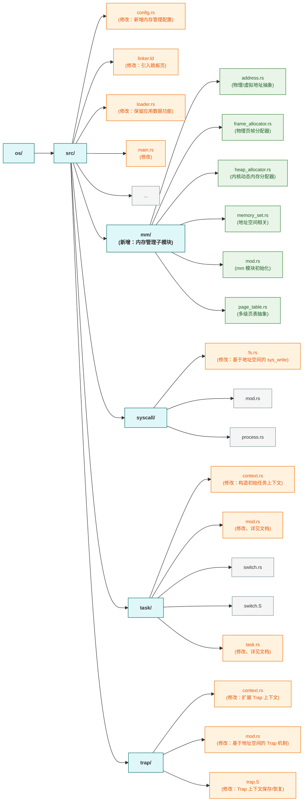

>在这个章节，我们会实现虚拟内存机制。



```terminaloutput
➜  ~/code/2025a-rcore-0x822a5b87 git:(ch4) cloc --include-ext=rs,s,S,asm os
     152 text files.
     121 unique files.                              
     126 files ignored.

github.com/AlDanial/cloc v 1.82  T=0.01 s (2328.7 files/s, 184956.7 lines/s)
-------------------------------------------------------------------------------
Language                     files          blank        comment           code
-------------------------------------------------------------------------------
Rust                            29            193            386           1866
Assembly                         4             10             26            140
-------------------------------------------------------------------------------
SUM:                            33            203            412           2006
-------------------------------------------------------------------------------
```


## QA

### 内存管理的一些示例

>内存管理的完全抽象


>分段内存管理

