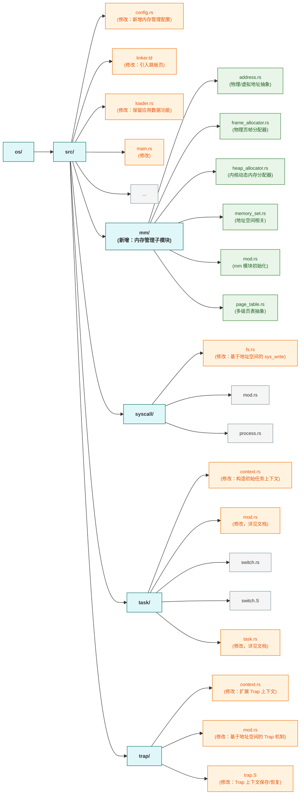

>在这个章节，我们会实现虚拟内存机制。



```terminaloutput
➜  ~/code/2025a-rcore-0x822a5b87 git:(ch4) cloc --include-ext=rs,s,S,asm os
     152 text files.
     121 unique files.                              
     126 files ignored.

github.com/AlDanial/cloc v 1.82  T=0.01 s (2328.7 files/s, 184956.7 lines/s)
-------------------------------------------------------------------------------
Language                     files          blank        comment           code
-------------------------------------------------------------------------------
Rust                            29            193            386           1866
Assembly                         4             10             26            140
-------------------------------------------------------------------------------
SUM:                            33            203            412           2006
-------------------------------------------------------------------------------
```


## QA

### `from` 和 `into`

在 Rust 中，From 和 Into 是一对 类型转换相关的 trait，核心作用是 定义 “安全、无歧义的类型转换规则”，避免手动写重复的转换代码，同时让代码更简洁、可读性更强。二者本质是 “同一转换的正反两面”，遵循 “实现 `From<A>` for B，自动获得 `Into<B>` for A” 的设计（无需重复实现）。

一般而言，当我们为类型 U 实现了 From<T> Trait 之后，可以使用 U::from(_: T) 来从一个 T 类型的实例来构造一个 U 类型的实例；而当我们为类型 U 实现了 Into<T> Trait 之后，对于一个 U 类型的实例 u ，可以使用 u.into() 来将其转化为一个类型为 T 的实例。


### SV39多级页表的硬件基址

- `SATP` Supervisor Address Translation and Protection，直接控制处理器是否启用虚拟地址转换（MMU 功能），并指定页表的物理地址。


- `MODE` 控制 CPU 使用哪种页表实现；
- `ASID` 表示地址空间标识符，这里还没有涉及到进程的概念，我们不需要管这个地方；
- `PPN(Pyhsical Page Number)` 存的是根页表所在的物理页号。这样，给定一个虚拟页号，CPU 就可以从三级页表的根页表开始一步步的将其映射到一个物理页号。

- 当 MODE 设置为 0 的时候，代表所有访存都被视为物理地址；
- 而设置为 8 的时候，SV39 分页机制被启用，所有 S/U 特权级的访存被视为一个 39 位的虚拟地址，它们需要先经过 MMU 的地址转换流程，如果顺利的话，则会变成一个 56 位的物理地址来访问物理内存；否则则会触发异常，这体现了分页机制的内存保护能力。

#### 地址格式与组成


在 `SV39` 下，我们的 VA 总共有 39 位。并且分为两个部分：

- `PO(Page Offset)` 用于表示页内偏移量，这个和我们页的大小有关，假设每页是 `4KB`，那么就需要 `12` 位；
- `VPN(Virtual Page Number)` 用于 PPN，在映射完之后通常被扩展，例如可能从 `27` 位扩展到 `44` 位。

>这里需要注意的是，我们的PPN的范围是要大于VPN的，核心是为了 “解耦虚拟空间需求和物理空间能力”：
>1. 虚拟空间只需要满足应用的“观感需求”: 应用需要的是 “连续、足够大的地址空间”，而非 “实际的物理内存”，而512GB 虚拟空间足够覆盖绝大多数场景
>2. 物理空间需要满足硬件的 “扩展需求”。
>
>而解耦的核心价值在于：
>- 应用不依赖物理内存大小：即使物理内存只有 8GB，应用也能使用 512GB 虚拟空间（通过 “按需分页” 和 “交换分区”，裸机场景可省略交换分区）；
>- 物理内存可灵活分配：多个应用的虚拟空间可以映射到物理内存的不同区域，物理内存不足时，内核可以回收不常用的物理页（换出到磁盘），再分配给需要的应用；
>- 硬件升级无需修改应用：当物理内存从 8GB 升级到 64GB，应用无需重新编译 —— 内核只需更新页表映射，应用的虚拟地址空间完全不变。

#### 页表项的数据结构抽象与类型定义


- SV39是一个三级页表，其中 `[53: 10]` 这 44 位是物理页号，并且对应了在TLB中的一级索引，二级索引一级三级索引；
- 低8位是对应的物理页的标志位：
  - `V` 对应物理页是否有效；
  - `R`, `W`, `X` 表示物理页的读，写，执行；
  - `U` 代表了在 User Mode 下是否有权限执行；
  - `G`
  - `A` 代表了页面代表对应的虚拟页面是否被访问过，是 **[全局物理内存的页置换算法](#全局物理内存的页置换算法)** 的核心数据；
  - `D` 代表了页面代表对应的物理页面是否被修改过，用于判断缓存是否可用。此外，它可以协助我们判断 [优化页面换出](#优化页面换出)。

### 全局物理内存的页置换算法

“全局物理内存的页置换算法（如clock，二次机会算法）” 是缓存淘汰的核心逻辑，具体规则可能如下：

1. 内核扫描页表，检查 `A` 位；
2. 所有 `A` 为0的页面最近未被访问过，直接淘汰；
3. 如果 `A` 为1，则页面最近被访问过，**我们此时将其设置为0**；
4. 再回到 `<1>`，如果 `A` 为0，则近期未访问，进行淘汰；

核心逻辑在于，`A` 的状态为 `1` 只是代表过去有被访问过，所以我们每次都需要重置，这样在下次扫描的时候我们就知道最近有没有被访问过。

### 优化页面换出

#### 优化页面置换

>D 位的核心价值是 减少磁盘 I/O 开销（这是操作系统中最昂贵的操作之一）：

当我们在进行内存操作时，并不会立即数据全部写入到硬盘（或其他I/O），而是先修改内存，并且将页表中的 `D` 设置为1。

而当我们需要进行页面置换，或者 `flush` 之类的操作将数据更新时，`D` 位可以帮我们判断，当前内存页是可以直接释放还是需要刷新到硬盘！

#### 实现COW

假设父进程 P 创建子进程 C，共享某物理页 PhysPage(`0x100`)，页表项初始状态：V=1, R=1, W=0, U=1, A=0, D=0（有效、可读、禁止写、用户态可访问、未访问、未修改）。

1. 进程创建阶段：共享物理页 + 权限初始化
   - 父进程 P 的页表：虚拟页 VPN=0x200 → 物理页 PPN=0x100（W=0）；
   - 子进程 C 的页表：相同虚拟页 VPN=0x200 → 相同物理页 PPN=0x100（W=0）；
   - 内核维护 “物理页引用计数”：PhysPage(0x100) 的引用计数 = 2（P 和 C 共享）；
   - 关键：父子进程的页表项都设为 W=0（禁止写）、D=0（初始无修改），确保写操作触发异常。
2. 写操作触发异常：进入 Trap Handler
   - 假设子进程 C 尝试写 VPN=0x200 对应的虚拟页；
   - 处理器检查页表项：V=1（有效）但 W=0（禁止写）→ 触发写保护异常（Store Page Fault）；
   - RISC-V 会将异常原因（cause=0x24，Store Page Fault）、触发写操作的虚拟地址（stval=VPN=0x200）存入 CSR 寄存器，跳转到内核的 Trap Handler。
3. Trap Handler 处理逻辑（核心步骤）：Handler 需完成 “识别 COW 页 → 复制物理页 → 更新页表 → 恢复执行”，具体：
   1. 识别当前页是 COW 共享页
      - 从 stval 取出触发异常的虚拟地址 VA，找到子进程 C 对应页表项；
      - 检查页表项特征：V=1, W=0, D=0 + 物理页 PPN=0x100 的引用计数 > 1 → 确认是 COW 共享页（非普通写保护页）。
   2. 分配新物理页并复制数据
      - 内核从空闲物理页池分配新页 PhysPage(0x101)； 
      - 将旧页 PhysPage(0x100) 的所有数据复制到新页 PhysPage(0x101)（仅复制一次，完成后两页数据完全一致）。
   3. 更新页表项权限和标志位，**这里需要注意的是，现在是内核在进行内存页复制，复制前后的两个内存页的 `D = 0`，因为此时仅仅只是处理Storage Page Fault，真正的页面操作不在这个异常处理的范畴中。**
   4. 刷新 TLB（避免旧映射干扰）
4. 恢复进程执行，此时写入操作完成，将页面 `D = 1`。

### 多级页表

#### 单级页表/线性表


最简单的页表实现，就是将全部的**VPN -> PPN**的映射关系全部存储到内存中，按照我们目前的RV39中页大小4KB，我们总共需要 `2^27 * 8` 也就是 1GB。并且，每个进程都必须有一个。这是完全不可接受的。 **为此，我们需要引入一个多级页表**。

#### 字典树

假设存在一个输入字符集为 `x = {a, b, c}`，长度为 `n` 的字符集，那么它的结构可能如下所示


可以看到，上面是一颗完整的字典树，而在我们构造这个字段树的过程中，最开始整棵树是空的。只有当我们写入到一个特定的字符时才会有新的节点生成。


可以看到，我们此时只有一个节点。

>**事实上 SV39 分页机制等价于一颗字典树**。`27` 位的 VPN 可以看作长度为 `3` 的三个字符串，字符集为 `x = {0, 1, 2, ..., 511}`

### 大表

>`RV39` 支持大表查找和访问，具体逻辑如下

1. 虚拟地址（VA）结构：39 位有效位，拆分为 4 部分： 
   - 高位 2 位：保留（必须为 0，否则为非法地址）；
   - VPN [2]：一级页表索引（9 位，对应一级页表项位置）；
   - VPN [1]：二级页表索引（9 位，对应二级页表项位置）；
   - VPN [0]：三级页表索引（9 位，对应三级页表项位置）；
2. 页表项（PTE）结构：64 位，低 8 位为标志位（V/R/W/X/U/A/D/G），高 56 位为物理页号（PPN）或下一级页表的 PPN（因 Sv39 物理地址最大 56 位）。
3. 核心标志位 V 的语义
    - V=1：页表项有效（Valid），是 “合法的页表项”（可能是 “指向下级页表” 的页目录项，也可能是 “指向物理页” 的叶节点项，或 “大页映射” 项）；
    - V=0：页表项无效，访问时触发缺页异常（Page Fault）

| 大页级别	  | 叶节点页表项 | 映射粒度	              | VA 中 “用于偏移” 的位数	               | 对应范围     |
|--------|--------|--------------------|--------------------------------|----------|
| 4KB 页  | 	三级页项	 | 4KB = 2^12	        | 12 位（仅 Offset）	                | 单个 4KB 页 |
| 2MB 大页 | 	二级页表  | 	2MB = 2^(9+12)	   | 9（VPN [0]）+12=21 位	            | 2MB      |
| 1GB 大页 | 	一级页表  | 	1GB = 2^(9+9+12)	 | 9（VPN [1]）+9（VPN [0]）+12=30 位	 | 1GB      |

### SV39转换过程


### 内存管理的一些示例

>内存管理的完全抽象


#### 分段内存管理

>分段内存管理一：使用固定内存大小及物理SLOT进行映射


每个应用的地址空间大小限制为一个固定的常数 bound ，也即每个应用的可用虚拟地址区间均为 `[0, bound)`。随后，就可以以这个大小为单位，将物理内存除了内核预留空间之外的部分划分为若干个大小相同的**插槽 (Slot)** ，每个应用的所有数据都被内核放置在其中一个插槽中，对应于物理内存上的一段连续物理地址区间，假设其起始物理地址为 `base`，则由于二者大小相同，这个区间实际为 `[base, base + bound)`。

```mermaid
flowchart LR
    %% 样式定义（区分内存区域、碎片、映射关系）
    classDef app_seg fill:#e8f4f8, stroke:#2563eb, rounded:8px, font-weight:600, font-size:12px;
    classDef phys_seg fill:#f0f8fb, stroke:#0ea5e9, rounded:8px, font-weight:600, font-size:12px;
    classDef fragment fill:#fef2f8, stroke:#f43f5e, rounded:8px, color:#be123c, font-size:11px;
    classDef arrow stroke:#64748b, stroke-width:1.5px, font-size:11px;
    classDef title fill:#1e293b, font-weight:bold, font-size:14px;
    classDef slot fill:#f8fafc, stroke:#94a3b8, rounded:8px, font-weight:600, font-size:12px;


    subgraph 应用逻辑内存
        app_text[".text 段<br/>(代码区)"]:::app_seg
        app_data[".data 段<br/>(数据区)"]:::app_seg
        app_stack["stack 段<br/>(栈区)"]:::app_seg
        app_heap["heap 段<br/>(堆区)"]:::app_seg
    end

    subgraph 物理内存
        subgraph 已分配
            phys_text[".text 段<br/>{base ~ base+text_size}"]:::phys_seg
            frag1["内碎片1<br/>{未使用}"]:::fragment
            phys_data[".data 段<br/>{base+text_size+frag1_size ~ ...}"]:::phys_seg
            frag2["内碎片2<br/>(未使用)"]:::fragment
            phys_stack["stack 段<br/>(... ~ ...)"]:::phys_seg
            frag3["内碎片3<br/>(未使用)"]:::fragment
            phys_heap["heap 段<br/>(... ~ base+bound)"]:::phys_seg
        end
        slot1_idle["未分配<br/>(可容纳其他应用)"]:::slot
        slot2_idle["未分配<br/>(可容纳其他应用)"]:::slot

    end

    app_text --> phys_text
    app_text -.->|直接映射| phys_text
    app_data -.->|直接映射| phys_data
    app_stack -.->|直接映射| phys_stack
    app_heap -.->|直接映射| phys_heap
```



>分段内存管理二：使用应用地址空间中的一个逻辑段作为单位来安排应用的数据在物理内存中的布局


相对于分段内存管理一中的内存分配方式，这种方式不是将应用的整个内存空间直接映射到物理内存。
而是将应用的物理内存按照 `.text`, `.data`, `stack`, `heap` 等逻辑段按照一定的规则映射到物理内存。

注意到每个段都只会在内存中占据一块与它实际所用到的大小相等的空间。堆的情况可能比较特殊，它的大小可能会在运行时增长，但是那需要应用通过系统调用向内核请求。也就是说这是一种按需分配，而不再是内核在开始时就给每个应用分配一大块很可能用不完的内存。由此，不再有内碎片了。

尽管内碎片被消除了，但内存浪费问题并没有完全解决。这是因为每个段的大小都是不同的（它们可能来自不同的应用，功能也不同），内核就需要使用更加通用、也更加复杂的连续内存分配算法来进行内存管理，而不能像之前的插槽那样以一个比特为单位。顾名思义，连续内存分配算法就是每次需要分配一块连续内存来存放一个段的数据。随着一段时间的分配和回收，物理内存还剩下一些相互不连续的较小的可用连续块，其中有一些只是两个已分配内存块之间的很小的间隙，它们自己可能由于空间较小，已经无法被用于分配，这就是`外碎片 (External Fragment)` 。

```mermaid
flowchart LR
    %% 样式定义（区分应用、空闲内存、外碎片、箭头）
    classDef app fill:#e8f4f8, stroke:#2563eb, rounded:8px, font-weight:600, font-size:12px;
    classDef free fill:#e8f5e8, stroke:#2e7d32, rounded:8px, font-weight:600, font-size:12px;
    classDef frag fill:#fef2f8, stroke:#f43f5e, rounded:8px, color:#be123c, font-size:12px;
    classDef arrow stroke:#64748b, stroke-width:1.5px, font-size:11px;
    classDef note fill:#1e293b, font-weight:bold, font-size:14px;

    %% 步骤1：初始状态（物理内存连续空闲）
    subgraph Step1["初始状态"]
        total_free["物理内存<br/>[0 ~ 1024MB] 连续空闲"]:::free
    end
    style Step1 font-weight:bold, font-size:14px, fill:#f8fafc, stroke:#e2e8f0, padding:10px;

    %% 步骤2：分配多个不连续应用（占用部分内存）
    subgraph Step2["分配应用"]
        direction TB
        app1["App1 (200MB)<br/>{0 ~ 200MB}"]:::app
        app2["App2 (300MB)<br/>{300 ~ 600MB}"]:::app
        app3["App3 (150MB)<br/>{700 ~ 850MB}"]:::app
        free1["空闲块1 (100MB)<br/>{200 ~ 300MB}"]:::free
        free2["空闲块2 (100MB)<br/>{600 ~ 700MB}"]:::free
        free3["空闲块3 (174MB)<br/>{850 ~ 1024MB}"]:::free

        app1 --> free1 --> app2 --> free2 --> app3 --> free3
    end
    style Step2 font-weight:bold, font-size:14px, fill:#f8fafc, stroke:#e2e8f0, padding:10px;

    %% 步骤3：释放部分应用（产生离散空闲块）
    subgraph Step3["Step 3: 释放应用 - 空闲块分散"]
        direction TB
        app3_1["App1 (200MB)<br/>{0 ~ 200MB}"]:::app
        free3_1["空闲块1 (100MB)<br/>{200 ~ 300MB}"]:::free
        free3_2["空闲块2 (400MB)<br/>{300 ~ 700MB} → 释放App2"]:::free
        app3_3["App3 (150MB)<br/>{700 ~ 850MB}"]:::app
        free3_3["空闲块3 (174MB)<br/>{850 ~ 1024MB}"]:::free
        app3_1 --> free3_1 --> free3_2 --> app3_3 --> free3_3
    end
    style Step3 font-weight:bold, font-size:14px, fill:#f8fafc, stroke:#e2e8f0, padding:10px;

    %% 步骤4：外碎片产生（总空闲足够但离散，无法分配）
    subgraph Step4["外碎片形成"]
        direction LR
        app41["App1 (200MB)<br/>{0 ~ 200MB}"]:::app
        frag41["外碎片1 (100MB)<br/>{200 ~ 300MB}"]:::frag
        frag42["外碎片2 (400MB)<br/>{300 ~ 700MB}"]:::frag
        app43["App3 (150MB)<br/>{700 ~ 850MB}"]:::app
        frag43["外碎片3 (174MB)<br/>{850 ~ 1024MB}"]:::frag
        new_app["新应用需求：500MB 连续内存<br/>→ 总空闲674MB，但无连续块 → 分配失败"]:::app
    end
    style Step4 font-weight:bold, font-size:14px, fill:#f8fafc, stroke:#e2e8f0, padding:10px;

    %% 流程连接（时间线顺序）
    Step1 --> Step2:::arrow
    Step2 --> Step3:::arrow
    Step3 --> Step4:::arrow

    %% 核心原因标注
    Note["外碎片核心成因：<br/>1. 多次分配/释放后，空闲内存被已分配应用分割成离散块；<br/>2. 总空闲内存大小足够，但无单个连续块满足新应用的连续内存需求；<br/>3. 碎片无法被直接利用，导致内存浪费。"]:::note
    style Note fill:#f8fafc, stroke:#94a3b8, padding:10px, rounded:8px, font-size:13px;
```



#### 分页内存管理

之前的两种分段管理的方式：

- 将应用内存看做一个整体：由于应用内部段的不连续性，将产生大量的内碎片；
- 将应用内存分为多个逻辑段，并按段进行映射：在这种情况下，在经过多次分配和释放后空闲内存将分散在物理内存中无法统一的使用。例如假设我们存在一个内存块 `[0, 1, 2, 3, 4]`：
  - 将五个内存块都分配，此时使用的内存块为 `[0, 1, 2, 3, 4]`；
  - 释放内存块 `0`，`2`，`4`，此时使用的内存块为 `[1, 3]`，而空闲的内存块为 `[0, 2, 4]`；
  - 此时如果分配一个需要两个内存块的应用，我们内存将分配失败。

若要结合二者的优点的话，就需要内核始终以一个**同样大小的单位来在物理内存**上放置应用地址空间中的数据：

1. 这样内核就可以使用简单的插槽式内存管理，使得内存分配算法比较简单且不会产生外碎片；
2. 同时，这个单位的大小要足够小，从而其内部没有被用到的内碎片的大小也足够小，尽可能提高内存利用率。

这便是我们将要介绍的分页内存管理，总体的思想就是：

1. 假设我们每个代码块的大小是 `M`，应用内存大小为 `AM`，物理内存大小为 `PM`；
2. 那么应用可以分为 `AM / M` 个代码块，物理内存可以分为 `PM / M` 个代码块；
3. 我们通过某些方式（页表，MMU,TLB等），将应用的代码块映射到物理内存的代码块；

带来的问题是，我们需要引入更为复杂的硬件结构辅助我们映射应用内存到物理内存。


