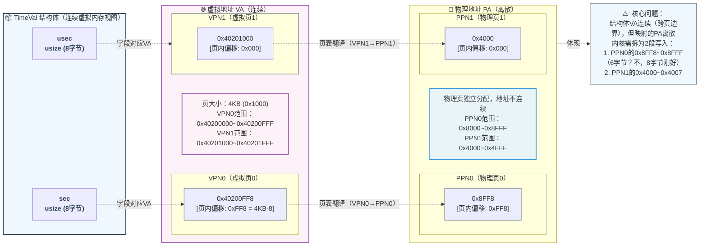
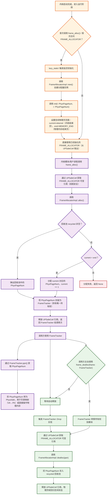
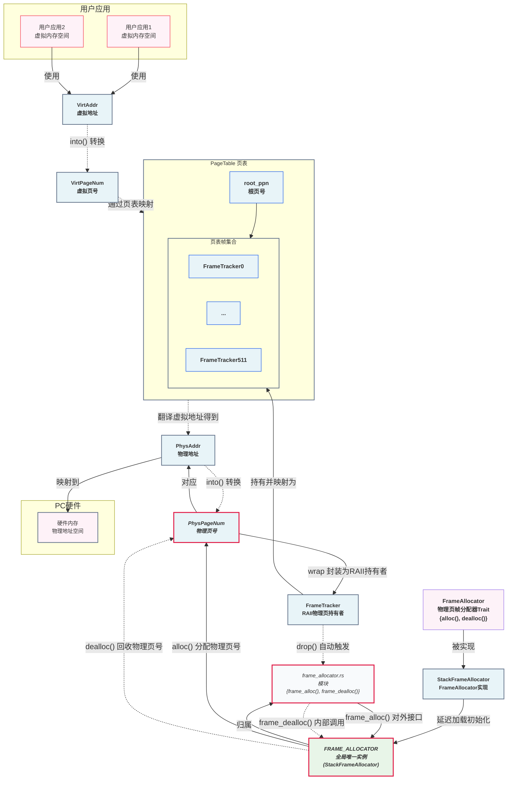
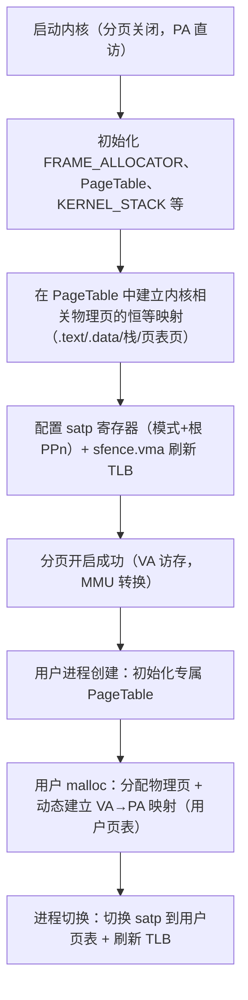
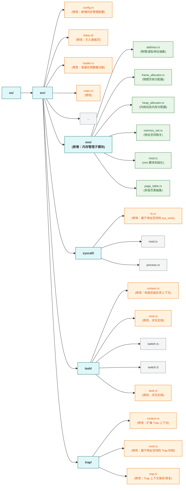

>在这个章节，我们会实现虚拟内存机制。


```terminaloutput
➜  ~/code/2025a-rcore-0x822a5b87 git:(ch4) cloc --include-ext=rs,s,S,asm os
     152 text files.
     121 unique files.                              
     126 files ignored.

github.com/AlDanial/cloc v 1.82  T=0.01 s (2328.7 files/s, 184956.7 lines/s)
-------------------------------------------------------------------------------
Language                     files          blank        comment           code
-------------------------------------------------------------------------------
Rust                            29            193            386           1866
Assembly                         4             10             26            140
-------------------------------------------------------------------------------
SUM:                            33            203            412           2006
-------------------------------------------------------------------------------
```

## 物理空间和虚拟空间

> 虚拟空间连续，物理空间不一定连续！




## 管理SV39多级页表

### 物理页帧管理



物理页帧存放的数据从内容上来说分为两种：

1. 应用/内核的数据或者代码；
2. 应用/内核的多级页表；

本质上，物理页帧的核心是 “存储单元”—— 无论存放的是代码、应用数据，还是页表本身，在物理内存层面都是 “二进制数据块”，页表只是 “具有特殊用途的数据”（用于地址转换的 “映射表数据”）

#### 可用物理页的分配与回收



>区分内核空间和物理空间可以参考 [内存的内核空间和用户空间](#内存的内核空间和用户空间)

物理页的实际大小，由三个参数共同决定。他们大小从也是 `virt memory` < `ekernel` < `MEMORY_END`。**这里需要注意的是，这三个值都是物理地址而非虚拟地址。**

1. qemu模拟的 `virt` 硬件平台上的物理内存的起始地址 `0x80000000`；
2. `ekernel` 在 `linker` 中，我们在完成 `.bss` 并且进行内存对齐之后，指定了 `ekernel` 这个参数，表示内核代码的结束位置；
3. `MEMORY_END` 在 `config.rs` 中硬编码的地址 `0x88000000`。

随后，我们定义：

1. `trait` `FrameAllocator` 用于管理我们全部可用的物理内存；
2. `impl` `StackFrameAllocator` 是基于Vec的一个简单实现；

```rust
// os/src/mm/frame_allocator.rs

trait FrameAllocator {
    fn new() -> Self;
    fn alloc(&mut self) -> Option<PhysPageNum>;
    fn dealloc(&mut self, ppn: PhysPageNum);
}
```

`StackFrameAllocator` 的实现逻辑也非常简单：

1. `current` 和 `end` 表示空闲内存的页号，这个页号初始由 `ekernel` 和 `MEMORY_END` 进行内存对齐后计算得出；
2. `recycled` 表示 `alloc` 后 `dealloc` 的内存，我们分配时也优先从这里开始分配；

```rust
// os/src/mm/frame_allocator.rs

pub struct StackFrameAllocator {
    current: usize,  //空闲内存的起始物理页号
    end: usize,      //空闲内存的结束物理页号
    recycled: Vec<usize>,
}

// os/src/mm/frame_allocator.rs

impl FrameAllocator for StackFrameAllocator {
    fn new() -> Self {
        Self {
            current: 0,
            end: 0,
            recycled: Vec::new(),
        }
    }
    fn alloc(&mut self) -> Option<PhysPageNum> {
        if let Some(ppn) = self.recycled.pop() {
            Some(ppn.into())
        } else {
            if self.current == self.end {
                None
            } else {
                self.current += 1;
                Some((self.current - 1).into())
            }
        }
    }
    fn dealloc(&mut self, ppn: PhysPageNum) {
        let ppn = ppn.0;
        // validity check
        if ppn >= self.current || self.recycled
            .iter()
            .find(|&v| {*v == ppn})
            .is_some() {
            panic!("Frame ppn={:#x} has not been allocated!", ppn);
        }
        // recycle
        self.recycled.push(ppn);
    }
}

impl StackFrameAllocator {
    pub fn init(&mut self, l: PhysPageNum, r: PhysPageNum) {
        self.current = l.0;
        self.end = r.0;
    }
}
```

随后初始化一个全局的 `FRAME_ALLOCATOR`，这里需要注意的是，我们要把物理地址 `ekernel` 和 `MEMORY_END` 转换为对应的页号。

```rust
type FrameAllocatorImpl = StackFrameAllocator;

lazy_static! {
    /// frame allocator instance through lazy_static!
    pub static ref FRAME_ALLOCATOR: UPSafeCell<FrameAllocatorImpl> =
        unsafe { UPSafeCell::new(FrameAllocatorImpl::new()) };
}
/// initiate the frame allocator using `ekernel` and `MEMORY_END`
pub fn init_frame_allocator() {
    extern "C" {
        fn ekernel();
    }
    FRAME_ALLOCATOR.exclusive_access().init(
        PhysAddr::from(ekernel as usize).ceil(),
        PhysAddr::from(MEMORY_END).floor(),
    );
}
```


#### 分配/回收物理页帧的接口

1. `alloc` 和 `dealloc` 都是非pub的函数，我们需要对外暴露分配的接口。
2. 这里非常值得注意的一点是，我们 `frame_alloc()` 分配得到的是 `FrameTracker` 而不是 `PhysPageNum`，这个设计很巧妙，可以参考 [PhysPageNum和FrameTracker](#physpagenum和frametracker)

```rust
// os/src/mm/frame_allocator.rs

pub fn frame_alloc() -> Option<FrameTracker> {
    FRAME_ALLOCATOR
        .exclusive_access()
        .alloc()
        .map(|ppn| FrameTracker::new(ppn))
}

fn frame_dealloc(ppn: PhysPageNum) {
    FRAME_ALLOCATOR
        .exclusive_access()
        .dealloc(ppn);
}
```

`FrameTracker` 的实现

```rust
/// tracker for physical page frame allocation and deallocation
pub struct FrameTracker {
    /// physical page number
    pub ppn: PhysPageNum,
}

impl FrameTracker {
    /// Create a new FrameTracker
    pub fn new(ppn: PhysPageNum) -> Self {
        // page cleaning
        let bytes_array = ppn.get_bytes_array();
        for i in bytes_array {
            *i = 0;
        }
        Self { ppn }
    }
}

impl Drop for FrameTracker {
    fn drop(&mut self) {
        frame_dealloc(self.ppn);
    }
}
```

### 多级页表管理

#### 页表基本数据结构与访问接口

页表是一个多级的数据结构，他的作用就是将 `VPN` 映射到 `PPN`，而这里有一点需要注意的是：

1. 页表本身也是数据，每一个页表都会有一个唯一的入口地址，而这个地址是他的 PPN；
2. 页表内部 `frames` 是通过 `FrameTracker` 来实现 PPN 管理，这里在我们当前的逻辑下是可以的：因为我们暂时没有**共享物理页**的场景。在实际的应用中：当多个进程共享一个 PPN 时（例如进程创建时的 COW），会导致内存管理异常，因为当共享的某一个进程结束时，这个内存将被释放，而另外一个引用该 PPN 的进程会引用一个悬垂指针。
3. 此外，在开启分页后，无论是内核态还是用户态都是通过虚拟地址来访问物理内存。也就是说，我们必须将物理内存中**所有需要访问的物理页**都设定一个 `VPN` -> `PPN` 的映射关系并且存储到页表中。而具体的这个映射逻辑，请参考 [虚拟内存到物理内存](#虚拟内存到物理内存)。

```rust
/// page table structure
pub struct PageTable {
    /// Each user-facing application has a corresponding unique multi-level page table,
    /// which means the starting address of each page table is unique.
    /// That also means we must save root ppn as a `identifier`.
    root_ppn: PhysPageNum,
    /// `frames` contains all page table entries (including the root PTE) and stores them as a vector.
    frames: Vec<FrameTracker>,
}

impl PageTable {
    /// set the map between virtual page number and physical page number
    pub fn map(&mut self, vpn: VirtPageNum, ppn: PhysPageNum, flags: PTEFlags){}
    /// remove the map between virtual page number and physical page number
    pub fn unmap(&mut self, vpn: VirtPageNum){}
}
```

#### 内核中访问物理页帧的方法

- `get_pte_array` 返回的是一个页表项定长数组的可变引用，代表多级页表中的一个节点；
- `get_bytes_array` 返回的是一个字节数组的可变引用，可以以字节为粒度对物理页帧上的数据进行访问，前面进行数据清零就用到了这个方法；
- `get_mut` 是个泛型函数，可以获取一个恰好放在一个物理页帧开头的类型为 T 的数据的可变引用。例如，我们获取 `TrapContext` 就可以使用它。

>这里值得注意的是，`get_pte_array` 这个方法只能对于 `PageTable#root_ppn` 调用。

```rust
impl PhysAddr {
    ///Get mutable reference to `PhysAddr` value
    /// Get the mutable reference of physical address
    pub fn get_mut<T>(&self) -> &'static mut T {
        unsafe { (self.0 as *mut T).as_mut().unwrap() }
    }
}
impl PhysPageNum {
    /// Get the reference of page table(array of PTEs)
    pub fn get_pte_array(&self) -> &'static mut [PageTableEntry] {
        let pa: PhysAddr = (*self).into();
        unsafe { core::slice::from_raw_parts_mut(pa.0 as *mut PageTableEntry, 512) }
    }
    /// Get the reference of page(array of bytes)
    pub fn get_bytes_array(&self) -> &'static mut [u8] {
        let pa: PhysAddr = (*self).into();
        unsafe { core::slice::from_raw_parts_mut(pa.0 as *mut u8, 4096) }
    }
    /// Get the mutable reference of physical address
    pub fn get_mut<T>(&self) -> &'static mut T {
        let pa: PhysAddr = (*self).into();
        pa.get_mut()
    }
}
```

#### 建立和拆除虚实地址映射关系

这个逻辑较为简单，就是使用VPN的三级索引去查询PageTable，这里需要注意的几个点是：

1. `RV39` 中 `VPN` 是三个 `9bit` 的 `usize`；
2. `VPN` 不是 `VA`，他和 `offset` 结合才是 `VA`；
3. `ppn.get_pte_array()` 获取的是通过 `root_ppn` 读取的连续的 PTE 对象。

```rust
impl VirtPageNum {
    /// Get the indexes of the page table entry
    pub fn indexes(&self) -> [usize; 3] {
        let mut vpn = self.0;
        let mut idx = [0usize; 3];
        for i in (0..3).rev() {
            idx[i] = vpn & 0x1FF;
            vpn >>= 9;
        }
        idx
    }
}

impl PageTable {
    /// Find PageTableEntry by VirtPageNum, create a frame for a 4KB page table if not exist
    fn find_pte_create(&mut self, vpn: VirtPageNum) -> Option<&mut PageTableEntry> {
        let idxs = vpn.indexes();
        let mut ppn = self.root_ppn;
        let mut result: Option<&mut PageTableEntry> = None;
        for (i, idx) in idxs.iter().enumerate() {
            let pte = &mut ppn.get_pte_array()[*idx];
            if i == 2 {
                result = Some(pte);
                break;
            }
            if !pte.is_valid() {
                let frame = frame_alloc().unwrap();
                *pte = PageTableEntry::new(frame.ppn, PTEFlags::V);
                self.frames.push(frame);
            }
            ppn = pte.ppn();
        }
        result
    }

}
```

此外，我们在一些场景下可能需要访问非当前地址空间的页表（例如，在系统调用时内核态需要访问用户态的内存空间），此时我们需要一个方法，能查询到其他地址空间的页表但是不影响其所有权，我们提供了下面这个方法：

```rust
impl PageTable {
    /// Temporarily used to get arguments from user space.
    pub fn from_token(satp: usize) -> Self {
        Self {
            root_ppn: PhysPageNum::from(satp & ((1usize << 44) - 1)),
            frames: Vec::new(),
        }
    }
    /// get the page table entry from the virtual page number
    pub fn translate(&self, vpn: VirtPageNum) -> Option<PageTableEntry> {
        self.find_pte(vpn).map(|pte| *pte)
    }
}
```

## 内核与应用的地址空间

`PageTable` 以页为单位维护虚拟内存到物理内存的映射关系，但是在实际的应用中，每个应用都会维护一个自己的页表（包括内核）。而这个应用间独立的页表由 `地址空间` 来维护。

### 实现地址空间抽象

#### 逻辑段：一段连续地址的虚拟内存

```rust
/// map area structure, controls a contiguous piece of virtual memory
pub struct MapArea {
    vpn_range: VPNRange,
    data_frames: BTreeMap<VirtPageNum, FrameTracker>,
    map_type: MapType,
    map_perm: MapPermission,
}
```

1. MapArea 代表一段连续的 虚拟内存区间（逻辑段）；
    - vpn_range：保存该段包含的连续 VirtPageNum 区间，明确虚拟内存的范围（段内连续）； 
    - data_frames：仅当逻辑段采用 MapType::Framed 映射时有效，是存储 “虚拟页（VPN）→ 物理页帧（FrameTracker）” 的键值对容器（BTreeMap）。这些物理页帧用于存放实际数据（而非多级页表的中间节点），核心作用是持有物理页的所有权； 
    - map_type：指定该段虚拟内存的映射方式（如恒等映射、动态映射，后续可扩展文件映射等）； 
    - map_perm：指定该段的访问权限（R/W/X/ 用户态可访问，即 U 位），与页表项（PTE）的权限一致；
2. VPNRange：通过 SimpleRange<VirtPageNum> 组织连续的 VirtPageNum 区间，为 vpn_range 提供底层支持；
   - 这些逻辑段的虚拟地址通常是连续的，因此用 vpn_range 明确其范围； 
   - 不同段的访问权限不同（.data 为 R/W、`.rodata` 为 R、.text 为 R/X），因此用 map_perm 定义权限；
   - 不同段的映射方式不同（用户 heap 需动态映射、内核 .text/.data 需恒等映射），因此用 map_type 区分； 
   - MapArea 管理一段连续的虚拟内存及其对应的物理内存，需对二者的生命周期负责：虚拟内存的范围由 vpn_range 界定，物理内存的所有权由 data_frames 持有（销毁 MapArea 时自动回收物理页）；同时 data_frames 提供 “VPN→FrameTracker” 的高效反向查询，比遍历页表更快； 
   - data_frames 与 PageTable 的核心差别：data_frames 是物理内存的 “所有者”（管归属、管生命周期），PageTable 是地址翻译的 “查询工具”（管 VA→PA 映射、管权限检查），二者分工协作，缺一不可。

#### 地址空间：一系列有关联的逻辑段

```rust
/// address space
pub struct MemorySet {
    page_table: PageTable,
    areas: Vec<MapArea>,
}
```

1. MemorySet 一个有关联但是不一定连续的逻辑段的集合。前面提到一个进程里会有 `.data`， `.text`， `.rodata` 等逻辑段，这些逻辑段用 `MapArea` 来表示，而 MemorySet 是这些逻辑段的集合。
    - page_table 页表，每个进程都有自己的独立的页表。不同进程的同一个VA会通过页表映射到独立的PA；
    - areas 是 MapArea 的集合，包含了一个程序的所有逻辑段；

```rust
impl MemorySet {
    /// 1. Map a `MapArea` to the page table.
    /// 2. If any input files are provided, copy the data from the input files into the newly initialized `MapArea`.
    /// 3. Push MapArea into `MemorySet`
    fn push(&mut self, mut map_area: MapArea, data: Option<&[u8]>) {}

    /// Create a `MapArea` spanning the virtual address (VA) range from `start_va` to `end_va` with the given `permission`.
    pub fn insert_framed_area(
        &mut self,
        start_va: VirtAddr,
        end_va: VirtAddr,
        permission: MapPermission,
    ) {}

    /// Without kernel stacks.
    pub fn new_kernel() -> Self {}


    /// Include sections in elf and trampoline and TrapContext and user stack,
    /// also returns user_sp_base and entry point.
    pub fn from_elf(elf_data: &[u8]) -> (Self, usize, usize) {}
}
```

>`MemorySet`

- `push`：
    1. 为 `map_area` 中所有的 `vpn` 分配对应的 `ppn`，并更新页表，**注意，此时我们只是初始化了 VPN -> PPN 的映射关系，此时数据是没有写入到内存的。**
    2. 如果提供了 `data` 作为输入，我们将 `data` 复制到主存。**注意，在这个时刻我们已经开始需要使用PageTable来映射VPN -> PPN了。**
    3. 将构造好的 `map_area` 加入我们的地址空间 -- 也就是 MemorySet。
- `insert_framed_area` 创建一个从 `start_va` 开始到 `end_va` 结束的 MapArea。

#### 内核地址空间

启用分页模式下，内核代码的访存地址也会被视为一个虚拟地址并需要经过 MMU 的地址转换，因此我们也需要为内核对应构造一个地址空间，它除了仍然需要允许内核的各数据段能够被正常访问之后，还需要包含所有应用的内核栈以及一个 跳板 (Trampoline) 。

在开始梳理代码之前，我们需要先了解以下两个内容：

- [sv39模式下的地址空间](#sv39模式下的地址空间)
- [应用栈和应用内核栈以及内核栈](#应用栈和应用内核栈以及内核栈)

`new_kernel()` 方法将 `.text/.rodata/.data/.bss` 以及 `内核->内存结束` 的这五个逻辑段初始化完成。

>**这里最需要注意的是：我们所有的 memory_set.push() 方法都是不带 `data` 参数的，这是因为我们这里使用的恒等映射，他所访问的内存区域本身就是存在数据的。**

```rust
// os/src/mm/memory_set.rs

extern "C" {
    fn stext();
    fn etext();
    // ...
}

impl MemorySet {
    /// Without kernel stacks.
    pub fn new_kernel() -> Self {
        let mut memory_set = Self::new_bare();
        // map trampoline
        memory_set.map_trampoline();
        // map kernel sections
        println!("[main][kernel] Hello, world!");
        // ...
        println!("mapping .text section");
        memory_set.push(MapArea::new(
            (stext as usize).into(),
            (etext as usize).into(),
            MapType::Identical,
            MapPermission::R | MapPermission::X,
        ), None);
        // ...
        memory_set
    }
}
```

上面的代码我们可以把LOG日志打开测试：

```bash
make run BASE=4 TEST=4 LOG=TRACE
```

可以看到我们的输出，起始位置和我们 linker.ld 的声明是一致的：

```terminaloutput
[TRACE] [main][kernel] .text [0x80200000, 0x8020c000)
[DEBUG] [main][kernel] .rodata [0x8020c000, 0x80210000)
[ INFO] [main][kernel] .data [0x80210000, 0x8023a000)
[ WARN] [main][kernel] boot_stack top=bottom=0x8024a000, lower_bound=0x8023a000
[ERROR] [main][kernel] .bss [0x8024a000, 0x8224b000)
```

### 应用地址空间

>在开始之前，我们需要了解一下 [trampoline](#trampoline)


应用地址空间的初始化逻辑如下：

1. 初始化高256GiB：
    1. 初始化 `trampoline`，trampoline 位于高256GiB的最高点起始位置，仅仅使用一页；
    2. 初始化 `TrapContext`，他在trampoline的下方，也仅仅使用一页；
2. 初始化低256GiB：
    1. 初始化`.text/.rodata/.data/.bss` ：解析 `elf` 文件，将elf文件中的所有 program headers 复制到内核中：
        1. 解析elf，为每个ph创建一个MapArea；
        2. 将ph复制到我们创建的MapArea中，并初始化对应的权限；
        3. 这里一定需要注意的是，我们在 `xmas_elf::ElfFile::new(elf_data)` 的时候已经将数据加载到物理内存了，为什么还需要复制到我们对应的MapArea呢？
            - 现在读取到的数据虽然已经在物理内存中了，但是他只是在这个函数下的一段临时的数据，我们需要把他转换为一个生命周期和应用一致的程序，也就是MapArea；如果我们不把他转换为MapArea，那么rust编译器会保证在该函数退出后他对应的物理内存被回收；
            - 读取到数据之后，`[ph.virtual_addr(), ph.virtual_addr() + ph.mem_size())` 这段虚拟内存保证是可用的。我们其实也可以选择自己重新为它生成一个新的虚拟内存片地址，但是意义不大。
    2. 初始化 `user stack`；
    3. 初始化 `sbrk`；

#### 初始化 trampoline

下面的代码中，在高256G中初始化了一页作为trampoline，我们需要注意以下几个点：

1. `strampoline` 在 `linker.ld` 中声明，他紧跟在 `*(.text.entry)` 进行4K对齐之后；
2. `strampoline` 自身的内容也需要4K对齐，这样可以正好去适配我们的一个内存页；
3. `strampoline` 的大小不能超过4K，否则在map的时候将出现数据缺失；
4. `trampoline` 的范围是高256的最高位开始向下计算一页。

```
    .text : {
        *(.text.entry)
        . = ALIGN(4K);
        strampoline = .;
        *(.text.trampoline);
        . = ALIGN(4K);
        *(.text .text.*)
    }
```

```rust
/// config.rs
/// The virtual address of the trampoline.
/// The trampoline is placed at the top of the high 256 GiB virtual address space,
/// with its starting address set to `usize::MAX - PAGE_SIZE + 1`.
pub const TRAMPOLINE: usize = usize::MAX - PAGE_SIZE + 1;

/// memory_set.rs
extern "C" {
    fn strampoline();
}

/// memory_set.rs
impl MemorySet {
    /// Mention that trampoline is not collected by areas.
    fn map_trampoline(&mut self) {
        self.page_table.map(
            VirtAddr::from(TRAMPOLINE).into(),
            PhysAddr::from(strampoline as usize).into(),
            PTEFlags::R | PTEFlags::X,
        );
    }
}
```

#### 从elf初始化.text/.rodata/.data/.bss

>APPENDIX：[elf文件的VA和PA](#elf文件的va和pa)

1. 遍历elf文件内的 `program headers`。这样，ph会被加载到内存中，我们就可以用他们来创建出一个MapArea了；
2. 在创建 `MapArea` 之后，有非常重要的一个步骤，**那就是把我们elf的逻辑段数据映射到我们新创建的MapArea**。不同于 `trampoline`, `TrapContext`, `user_stack`, `sbrk` 这几个逻辑段，elf的逻辑数据段是有初始值的 -- 也就是elf文件里的值。**我们现在只是为elf文件创建了映射，映射指向的物理内存数据仍然不存在。**
3. 在 `push()` 的时候将数据作为参数传入，初始化elf的逻辑段到虚拟内存 `(&elf.input[ph.offset() as usize..(ph.offset() + ph.file_size()) as usize])`。

```rust
fn map_elf(memory_set: &mut MemorySet, elf: & xmas_elf::ElfFile) -> VirtPageNum {
    let elf_header = elf.header;
    let magic = elf_header.pt1.magic;
    assert_eq!(magic, [0x7f, 0x45, 0x4c, 0x46], "invalid elf!");
    let ph_count = elf_header.pt2.ph_count();
    let mut max_end_vpn = VirtPageNum(0);
    for i in 0..ph_count {
        let ph = elf.program_header(i).unwrap();
        if ph.get_type().unwrap() == xmas_elf::program::Type::Load {
            // Notice that the elf file has been loaded into virtual memory
            let start_va: VirtAddr = (ph.virtual_addr() as usize).into();
            let end_va: VirtAddr = ((ph.virtual_addr() + ph.mem_size()) as usize).into();
            let mut map_perm = MapPermission::U;
            let ph_flags = ph.flags();
            if ph_flags.is_read() {
                map_perm |= MapPermission::R;
            }
            if ph_flags.is_write() {
                map_perm |= MapPermission::W;
            }
            if ph_flags.is_execute() {
                map_perm |= MapPermission::X;
            }
            let map_area = MapArea::new(start_va, end_va, MapType::Framed, map_perm);
            max_end_vpn = map_area.vpn_range.get_end();
            // init MapArea and copy program header into the newly created MapArea
            memory_set.push(
                map_area,
                Some(&elf.input[ph.offset() as usize..(ph.offset() + ph.file_size()) as usize]),
            );
        }
    }

    max_end_vpn
}
```

#### 其他部分初始化

除了 trampoline 之外，其他的逻辑基本不复杂，这里就不做赘述。

## 基于地址空间的分时多任务

### 建立并开启基于分页模式的虚拟地址空间

机器启动时是 `M` 模式，SBI加载并初始化完成后进入 `S` 模式，随后内核初始化页表等信息后，修改 `satp` 开启分页模式。

#### 创建内核地址空间

>`lazy_static!` 的描述参考 [lazy_static!](#lazy_static)

```rust
// os/src/mm/memory_set.rs

lazy_static! {
    pub static ref KERNEL_SPACE: Arc<UPSafeCell<MemorySet>> = Arc::new(unsafe {
        UPSafeCell::new(MemorySet::new_kernel()
    )});
}
```

创建内核地址空间需要有三部：

1. 为rust初始化一个 HEAP；
2. 为kernel初始化一个物理内存分配器；
3. 修改 `satp` 开启分页模式。

```rust
// os/src/mm/mod.rs

pub use memory_set::KERNEL_SPACE;

pub fn init() {
    heap_allocator::init_heap();
    frame_allocator::init_frame_allocator();
    KERNEL_SPACE.exclusive_access().activate();
}
```

>我们先通过 `init_heap()` 初始化了堆，这里初始化的过程可以参考 [堆的初始化](#堆的初始化)

随后我们初始化 `FRAME_ALLOCATOR`，这个模块绑定了 `[ekernel, MEMORY_END)` 这段 **物理内存空间**；

```rust
/// `frame_allocator.rs`
/// initiate the frame allocator using `ekernel` and `MEMORY_END`
pub fn init_frame_allocator() {
    extern "C" {
        fn ekernel();
    }
    FRAME_ALLOCATOR.exclusive_access().init(
        PhysAddr::from(ekernel as usize).ceil(),
        PhysAddr::from(MEMORY_END).floor(),
    );
}
```

```
OUTPUT_ARCH(riscv)
ENTRY(_start)
BASE_ADDRESS = 0x80200000;

SECTIONS
{
    // ...
    . = BASE_ADDRESS;
    . = ALIGN(4K);
    ebss = .;
    ekernel = .;

    /DISCARD/ : {
        *(.eh_frame)
    }
}
```

最后，我们开启了分页模式：

1. `self.page_table.token()` 按照CSR要求开启 `SV39` 分页模式；
2. `sfence.vma` 将快表清空。


```rust
impl MemorySet {
    /// Change page table by writing satp CSR Register.
    pub fn activate(&self) {
        let satp = self.page_table.token();
        unsafe {
            satp::write(satp);
            asm!("sfence.vma");
        }
        info!("[kernel]: enable kernel space.")
    }
}
```

### trampoline的实现

>在 [trampoline](#trampoline) 中我们分析了为什么需要这样一个中间层，下面我们来实现他的具体逻辑。

> 在开始之前，我们可以讨论一下实现内核的两个方式：
>
> 1. 每个进程的地址空间都会将逻辑段分为 `内核段` 和 `用户段` 两个部分；
> 2. 每个进程的地址空间值包含 `用户段`，他们共享一个 `内核段`。
>
> 第一种方式的好处是，用户和内核的切换不需要切换地址空间，只需要在进程之间切换内核段，这样实现较为简单。但是带来的问题是，每个进程都需要存储一份冗余的内核代码，浪费了大量的内存。
>
> 第二种方式节省内存，但是实现较为复杂。


可以看到，我们的TrapContext**位于 `应用地址空间的次高页面` 而不是内核地址空间**。原因在于，假如我们将其放在内核栈 中，在保存 Trap 上下文之前我们必须先切换到内核地址空间，这就需要我们做两件事：

1. 将内核地址空间的 token 写入 satp 寄存器，注意 satp 不是单纯的页表地址，因为它还指定了CPU的分页模式；
2. 之后我们还需要有一个通用寄存器保存内核栈栈顶的位置，这样才能以它为基址保存 Trap 上下文。

在保存 Trap 上下文之前我们必须完成这 两项工作。然而，我们无法在不破坏任何一个通用寄存器的情况下做到这一点。

因为事实上我们需要用到内核的两条信息：内核地址空间 的 token 还有应用内核栈顶的位置，硬件却只提供一个 `sscratch` 可以用来进行周转。所以，我们不得不将 Trap 上下文保存在 应用地址空间的一个虚拟页面中以避免切换到内核地址空间才能保存。

```rust
#[repr(C)]
#[derive(Debug)]
pub struct TrapContext {
    pub x: [usize; 32],
    pub sstatus: Sstatus,
    pub sepc: usize,
    pub kernel_satp: usize,
    pub kernel_sp: usize,
    pub trap_handler: usize,
}
```

老的 TrapContext 如下定义：

```rust
#[repr(C)]
#[derive(Debug)]
pub struct TrapContext {
    pub x: [usize; 32],
    pub sstatus: Sstatus,
    pub sepc: usize,
}
```

相对于之前，额外增加了 `kernel_satp`， `kernel_sp`， `trap_handler` 三个字段：

- `kernel_satp` 表示内核地址空间的 token ；
- `kernel_sp` 表示当前应用在内核地址空间中的内核栈栈顶的虚拟地址；
- `trap_handler` 表示内核中 trap handler 入口点的虚拟地址。

## rCore-地址空间拓展实现

### sys_get_time


> 在引入虚拟内存之后，`sys_get_time` 的原本实现已经失效，我们现在重新实现该逻辑。

新增 `sys_get_time` 逻辑相当简单，我们只需要复用之前的系统时钟获取时间戳，在内核态找到对应的物理地址并更新即可，但是仍然有几个值得留意的点：

1. 用户程序使用的是 VA，所以他的指针传到kernel时，我们需要将它转换为PA；
2. 如果用户指针指向的对象，不在同一页怎么办？举个简单的例子，我们的页大小是4KB，我们的对象大小超过了4KB，那他必然被分到两页 -- **这个时候我们面临的问题是，对于用户程序来讲，VA是连续的；但是对于内核来讲，PA不一定是连续的！**

我们的实现就必须处理内存分段映射这个逻辑，具体的实现可以查看这个 [commit](https://github.com/LearningOS/2025a-rcore-0x822a5b87/commit/c64709a084641f8585b14d8930e7c5b4ed0abe90)。

> 在 `io.rs` 中，我们实现了将struct抓换为 `[u8]` 的逻辑。

#### serialize_struct

```rust
/// write the struct to physical address range
pub fn serialize_struct<S>(s: &S, pa_range: Vec<&'static mut [u8]>) where S: SerializeToBytes {
    let bytes = s.as_bytes();
    let mut bytes_written = 0;
    for slice in pa_range {
        let len = slice.len().min(bytes.len() - bytes_written);
        slice[..len].copy_from_slice(&bytes[bytes_written..bytes_written + len]);
        bytes_written += len;
        if bytes_written >= bytes.len() {
            break;
        }
    }
}
```

#### SerializeToBytes

```rust
/// io.rust
/// structs that implement this trait can be serialized to and deserialized from byte slices
#[allow(dead_code)]
pub trait SerializeToBytes: Copy + 'static {
    /// serialize struct with specific trait to byte slice
    fn as_bytes(&self) -> &[u8] {
        unsafe {
            core::slice::from_raw_parts(
                self as *const Self as *const u8,
                core::mem::size_of::<Self>(),
            )
        }
    }

    /// deserialize byte slice to struct with specific trait
    fn from_bytes(bytes: &[u8]) -> Option<&Self> {
        if bytes.len() != core::mem::size_of::<Self>() {
            return None;
        }
        unsafe { Some(&*(bytes.as_ptr() as *const Self)) }
    }
}
```

> 在 `mm.rs` 中，我们处理了将 `[u8]` 分段的复制到物理内存的逻辑。

```rust
/// mm.rs

//! utilities for memory management

use crate::mm::{PageTable, StepByOne, VirtAddr, VirtPageNum};
use alloc::vec::Vec;

/// Translate a virtual address to a physical address through page table
pub fn translate_va_to_pa(token: usize, ptr: *const u8, len: usize) -> Vec<&'static mut [u8]> {
    let mut v = Vec::new();
    let page_table = PageTable::from_token(token);
    let mut start = ptr as usize;
    let end = start + len;

    while start < end {
        let start_va = VirtAddr::from(start);
        let mut vpn = VirtPageNum::from(start_va.floor());
        let ppn = page_table.translate(vpn).unwrap().ppn();
        vpn.step();
        let end_va = VirtAddr::from(end.min(VirtAddr::from(vpn).into()));
        if end_va.aligned() {
            v.push(&mut ppn.get_bytes_array()[start_va.page_offset()..]);
        } else {
            v.push(&mut ppn.get_bytes_array()[start_va.page_offset()..end_va.page_offset()]);
        }
        start = end_va.into();
    }
    v
}
```

### sys_trace

> 这里再贴一下 `sys_trace` 的实现要求：
>
> ```rust 
> fn sys_trace(_trace_request: usize, _id: usize, _data: usize) -> isize
> ```
>
> - 调用规范：这个系统调用有三种功能，根据 `trace_request` 的值不同，执行不同的操作：
>   - 如果 `trace_request` 为 0，则 `id` 应被视作 `*const u8` ，表示读取当前任务 `id` 地址处一个字节的无符号整数值。此时应忽略 `data` 参数。返回值为 `id` 地址处的值。
>   - 如果 `trace_request` 为 1，则 `id` 应被视作 `*mut u8` ，表示写入 `data` （作为 `u8`，即只考虑最低位的一个字节）到该用户程序 `id` 地址处。返回值应为0。
>   - 如果 `trace_request` 为 2，表示查询当前任务调用编号为 `id` 的系统调用的次数，返回值为这个调用次数。**本次调用也计入统计** 。否则，忽略其他参数，返回值为 -1。
> - 说明：
>   - 你可能会注意到，这个调用的读写并不安全，使用不当可能导致崩溃。这是因为在下一章节实现地址空间之前，系统中缺乏隔离机制。所以我们 **不要求你实现安全检查机制，只需通过测试用例即可** 。
>   - 你还可能注意到，这个系统调用读写本任务内存的功能并不是很有用。这是因为作业的灵感来源 syscall 主要依靠 trace 功能追踪其他任务的信息，但在本章节我们还没有进程、线程等概念，所以简化了操作，只要求追踪自身的信息。
> - 此外，由于本章我们有了地址空间作为隔离机制，所以 `sys_trace` **需要考虑一些额外的情况**：
>   - 在读取（`trace_request` 为 0）时，如果对应地址用户不可见或不可读，则返回值应为 -1（`isize` 格式的 -1，而非 `u8`）。
>   - 在写入（`trace_request` 为 1）时，如果对应地址用户不可见或不可写，则返回值应为 -1（`isize` 格式的 -1，而非 `u8`）。

本程序的实现依然比较简单，但是考虑到**从物理内存中`读数据`与`写数据`**是一个相当通用的需求，所以我们的需要抽象两个独立的函数来帮助我们完成，完整的代码请查看 [commit](https://github.com/LearningOS/2025a-rcore-0x822a5b87/commit/90334f3d41b6265d3925938ea91b981748236099)。

#### read

函数的逻辑非常简单，就是将 `连续的VA` 映射为一个 `可能分段的PA`，并返回 `pa_range` 的引用，再使用我们之前定义的 `from_bytes` 接口将数据反序列化成对应的对象。

```rust
/// read `S` from physical address range
pub fn read<S>(token: usize, ptr: *const u8, len: usize) -> Result<S, &'static str>
where
    S: SerializeToBytes,
{
    let flags = PTEFlags::V | PTEFlags::A | PTEFlags::R;
    let auth = auth_check(token, ptr, len, flags);
    if !auth {
        Err("unauthorized access")
    } else {
        let pa_range = crate::util::mm::translate_va_to_pa(token, ptr, len);
        let mut data = Vec::new();
        for slice in pa_range {
            data.extend_from_slice(slice);
        }

        let x = S::from_bytes(&data).copied();
        let res = match x {
            Some(v) => Ok(v),
            None => Err("failed to deserialize"),
        };
        res
    }
}

```

#### write

`write` 也是同样的思路，将 `连续的VA` 映射为一个 `可能分段的PA`，并返回 `pa_range` 的引用，使用我们之前定义的 [serialize_struct](#serialize_struct) 来序列化到物理内存。

```rust
/// write `S` to physical address range
pub fn write<S>(s: &S, token: usize, ptr: *const u8, len: usize) -> Result<usize, &'static str>
where
    S: SerializeToBytes,
{
    let flags = PTEFlags::V | PTEFlags::A | PTEFlags::R;
    let auth = auth_check(token, ptr, len, flags);
    if !auth {
        Err("unauthorized access")
    } else {
        let pa_range = crate::util::mm::translate_va_to_pa(token, ptr, len);
        let serialized_size = serialize_struct(s, pa_range);
        Ok(serialized_size)
    }
}
```

#### auth_check

此外，我们不能信任用户传递的数据，我们必须要对地址进行检验 -- **这里值得注意的是，权限的检验是以PTE作为单位来检验的。**

```rust
/// Check whether a virtual address range has the required permissions
pub fn auth_check(token: usize, ptr: *const u8, len: usize, auth_flags: PTEFlags) -> bool {
    let pte_list = translate_entries(token, ptr, len);
    for pte in pte_list {
        if pte.flags() & auth_flags != auth_flags {
            return false;
        }
    }
    true
}
```

#### translate_entries

```rust
/// Get all entries of a virtual address range
pub fn translate_entries(token: usize, ptr: *const u8, len: usize) -> Vec<PageTableEntry> {
    let mut v = Vec::new();
    let page_table = PageTable::from_token(token);
    let mut start = ptr as usize;
    let end = start + len;

    while start < end {
        let start_va = VirtAddr::from(start);
        let mut vpn = VirtPageNum::from(start_va.floor());
        let pte = page_table.translate(vpn).unwrap();
        v.push(pte);
        vpn.step();
        let end_va = VirtAddr::from(end.min(VirtAddr::from(vpn).into()));
        start = end_va.into();
    }
    v
}
```

### mmap 和 munmap

>[mmap](https://man7.org/linux/man-pages/man2/mmap.2.html) 在 Linux 中主要用于在内存中映射文件， 本次实验简化它的功能，仅用于申请内存。
>
>请实现 mmap 和 munmap 系统调用，mmap 定义如下：
>
>```rust
>fn sys_mmap(start: usize, len: usize, prot: usize) -> isize
>```
>
>- syscall ID：222
>- 申请长度为 len 字节的物理内存（不要求实际物理内存位置，可以随便找一块），将其映射到 start 开始的虚存，内存页属性为 prot
>- 参数
>  - start 需要映射的虚存起始地址，要求按页对齐len 映射字节长度，可以为 0
>  - prot：第 0 位表示是否可读，第 1 位表示是否可写，第 2 位表示是否可执行。其他位无效且必须为 0
>- 返回值：执行成功则返回 0，错误返回 -1
>- 说明：为了简单，目标虚存区间要求按页对齐，len 可直接按页向上取整，不考虑分配失败时的页回收。

本次实验的全部代码，请查看 [commit](https://github.com/LearningOS/2025a-rcore-0x822a5b87/commit/a672c7113f73d7878c388f30ab0bbb6e12dc5b43)

本实验的思路也相当简单，只是在开发过程中需要处理的细节较多。我们根据错误调试即可。总的来说，就是当执行mmap时，生成一个 `MapArea` 并记录；当执行munmap时，删除生成的 `MapArea`，`RAII` 会自动的回收我们分配的物理页面。

#### insert_mapped_area

```rust
	/// insert_mapped_area
    pub fn insert_mapped_area(
        &mut self,
        start_va: VirtAddr,
        end_va: VirtAddr,
        permission: MapPermission,
    ) -> Result<(), String> {
        let map_area = MapArea::new(start_va, end_va, MapType::Framed, permission);
        if let Some(v) = self.intersect_map_area(&map_area) {
            trace!(
                "[MemorySet]: intersected with existing area: l = {:?}, r = {:?}",
                map_area.vpn_range,
                v.vpn_range
            );
            return Err(String::from(
                "[MemorySet]: insert_mapped_area failed due to intersecting with existing area",
            ));
        }
        self.mmap(map_area);
        Ok(())
    }
```

#### delete_mapped_area

```rust
    /// delete_mapped_area
    pub fn delete_mapped_area(
        &mut self,
        start_va: VirtAddr,
        end_va: VirtAddr,
        permission: MapPermission,
    ) -> Result<(), String> {
        let map_area = MapArea::new(start_va, end_va, MapType::Framed, permission);
        if let None = self.intersect_map_area(&map_area) {
            return Err(String::from(
                "[MemorySet]: no existing map area has been found!",
            ));
        }
        self.unmap(map_area)
    }
```


## QA

### TrapContext的初始化

> 再回忆一次 `TaskContext` 和 `TrapContext` 的区别：
>
> TrapContext 是应用和内核切换时的上下文，而TaskContext是应用之间切换的上下文切换。
>
> TrapContext 是不可预测的，所以他需要保存全部的寄存器。而TaskContext是用户基于时钟或者主动调用的，是可预测的，所以只需要保存callee-saved寄存器。 

`TrapContext` 是和应用强绑定的，内核在初始化应用时，会为每一个应用初始化一个 `TaskControlBlock(TCB)`，而 TrapContext 就是 TCB 的一部分。

```rust
/// The task control block (TCB) of a task.
pub struct TaskControlBlock {
		/// ...
    /// The phys page number of trap context
    pub trap_cx_ppn: PhysPageNum,
}
```

可以看到，我们的 `TrapContext` 实际上是单独的一个内存页，TrapContext 的虚拟地址是 `0xffff_ffff_ffff_e000`（TRAP_CONTEXT_BASE），trampoline 的虚拟地址是 `0xffff_ffff_ffff_f000`（TRAMPOLINE）—— 两者是 **连续的两个高地址页**，TrapContext 紧邻 trampoline 的 “下方”（低地址侧） -- 对于任意一个进程，它的TrapContext的虚拟地址是固定的！

```rust
impl TaskControlBlock {
    pub fn new(elf_data: &[u8], app_id: usize) -> Self {
        // memory_set with elf program headers/trampoline/trap context/user stack
        let (memory_set, user_sp, entry_point) = MemorySet::from_elf(elf_data);
        let trap_cx_ppn = memory_set
            .translate(VirtAddr::from(TRAP_CONTEXT_BASE).into())
            .unwrap()
            .ppn();
  }
}
```

而它被当做一个逻辑段，在用户内存地址初始化的时候被初始化：

```rust
impl MemorySet {
  pub fn from_elf(elf_data: &[u8]) -> (Self, usize, usize) {
        // map TrapContext
        memory_set.push(
            MapArea::new(
                TRAP_CONTEXT_BASE.into(),
                TRAMPOLINE.into(),
                MapType::Framed,
                MapPermission::R | MapPermission::W,
            ),
            None,
        );
  }
}
```

### sscratch

> 先说结论，`sscratch` 是 `trap_return` 函数第一次调用的时候，使用 `TRAP_CONTEXT_BASE` 初始化的一个指向 `TrapContext` 的指针。

在用户进程启动时，内核会为每个进程初始化 TaskControlBlock：

```rust
lazy_static! {
    /// a `TaskManager` global instance through lazy_static!
    pub static ref TASK_MANAGER: TaskManager = {
        // ...
        for i in 0..num_app {
            tasks.push(TaskControlBlock::new(get_app_data(i), i));			/// init TCB here
        }
        // ...
    };
}
```

而在初始化 TaskControlBlock 的过程中，会初始化 `TaskContext`

```rust
impl TaskControlBlock {
  pub fn new(elf_data: &[u8], app_id: usize) -> Self {
        let task_control_block = Self {
            task_status,
            task_cx: TaskContext::goto_trap_return(kernel_stack_top),			/// init task context
            memory_set,
            trap_cx_ppn,
            base_size: user_sp,
            heap_bottom: user_sp,
            program_brk: user_sp,
        };
  }
}
```

这个时候，会为 `TaskContext` 中的 `ra` 赋值：

```rust
impl TaskContext {
    pub fn goto_trap_return(kstack_ptr: usize) -> Self {
        Self {
            ra: trap_return as usize,																				/// init return address
            sp: kstack_ptr,
            s: [0; 12],
        }
    }
}
```

这里，`ra` 的值就是 `trap_return` ：也就是说，当内核第一次调度该进程的时候，内核在执行完内核态的所有指令后，会跳转到 `trap_return`。

```rust
#[no_mangle]
pub fn trap_return() -> ! {
    // set stvec to trampoline
    set_user_trap_entry();
    // get trap context pointer
    let trap_cx_ptr = TRAP_CONTEXT_BASE;
    // get the user page table addr with other satp fields
    let user_satp = current_user_token();
    extern "C" {
        fn __alltraps();
        fn __restore();
    }
    // 
    let restore_va = __restore as usize - __alltraps as usize + TRAMPOLINE;
    // trace!("[kernel] trap_return: ..before return");
    unsafe {
        asm!(
            "fence.i",
            "jr {restore_va}",         // jump to new addr of __restore asm function
            restore_va = in(reg) restore_va,
            in("a0") trap_cx_ptr,      // a0 = virt addr of Trap Context
            in("a1") user_satp,        // a1 = phy addr of usr page table
            options(noreturn)
        );
    }
}
```

`trap_return` 中初始化了 `stvec`，并使用 `trap_cx_ptr -> TRAP_CONTEXT_BASE` 和 `user_stap` 作为参数调用了方法 `__restore`，值得注意的是：

1. 我们使用的是 `jr restore_va` 指令而不是 `call __restore`；
2. `restore_va` 也不是直接使用 `jr __restore`；

这个逻辑可以在 [restore_va](#restore_va) 中找到具体解析，这里我们先看 `sscratch` 相关的内容。

在 `__restore` 中，我们将 `a0 = trap_cx_ptr`  赋值给了 `sscratch`，于是初始化完成。

### restore_va

> 在开始之前，我们需要先了解 `linker.ld` 中声明的地址和物理地址的关系 -- 是的，linker.ld 中的地址是虚拟地址。细节参考 [linker.ld](#linker.ld)

```rust
pub fn trap_return() -> ! {
    extern "C" {
        fn __alltraps();
        fn __restore();
    }
    // 
    let restore_va = __restore as usize - __alltraps as usize + TRAMPOLINE;
    // trace!("[kernel] trap_return: ..before return");
    unsafe {
        asm!(
            "fence.i",
            "jr {restore_va}",         // jump to new addr of __restore asm function
            restore_va = in(reg) restore_va,
            in("a0") trap_cx_ptr,      // a0 = virt addr of Trap Context
            in("a1") user_satp,        // a1 = phy addr of usr page table
            options(noreturn)
        );
    }
}
```

在内核态将控制权交还给用户态的时候，我们需要调用 `__restore`，而这里是通过 `restore_va` 这个奇怪的地址来跳转的，这是为什么？我们可以先看看 `restore_va`  这个值是怎么计算出来的。

我们可以找到，我们的 `strampoline` 实在 `linkder.ld` 上定义的，它被包含在了内核的 `.text` 逻辑段中：**在加载内核代码的过程中，`strampoline` 这个 VA 被以恒等映射的方式映射到物理内存。**

```assembly
OUTPUT_ARCH(riscv)
ENTRY(_start)
BASE_ADDRESS = 0x80200000;

SECTIONS
{
    . = BASE_ADDRESS;
    skernel = .;

    stext = .;
    .text : {
        *(.text.entry)
        . = ALIGN(4K);
        strampoline = .;								/// strampoline is defined here
        *(.text.trampoline);							/// .text.trampoline is included here 
        . = ALIGN(4K);
        *(.text .text.*)
    }
}
```

在 `memory_set.rs` 中，我们提供了方法来映射 `VA` 到 `PA`：

```rust
extern "C" {
    fn strampoline();
}

impl MemorySet {
    /// Mention that trampoline is not collected by areas.
    fn map_trampoline(&mut self) {
        self.page_table.map(
            VirtAddr::from(TRAMPOLINE).into(),
            PhysAddr::from(strampoline as usize).into(),
            PTEFlags::R | PTEFlags::X,
        );
    }
}
```

随后，我们在**加载内核**以及**内核加载应用程序**的时候，都调用 `map_tramploine` 这个函数，将 `TRAMPOLINE` 这个VA映射到了同一个 PA。

再回到 `__alltraps` 和 `__restore`，在 `trap.S` 中，我们声明 `.text.trampoline` 逻辑段和这两个方法：

```assembly
    .section .text.trampoline
    .globl __alltraps
    .globl __restore
    .align 2
__alltraps:
	# ...
__restore:
	# ...
```

这里存在的一个问题是：`__alltraps` 和 `__restore` 是被引入到了 `linker.ld`  的 `.text` 段，并且它加载时尚未开启分页模式，也就是 `__alltraps` 和 `__restore` 标签的值是一个 `PA`。此时，当我们执行 `call __alltraps` 或者 `call __restore` 时将发生异常，因为此时我们已经开启了分页模式。因此，我们只能手动的计算这个他们的值。

那么，我们现在可以知道几个信息：VA `TRAMPOLINE` 指向了 PA `strampoline`：

- 访问 `__alltraps` 我们可以直接使用 VA `TRAMPOLINE`；
- 访问 `__restore` 我们可以使用 VA `TRAMPOLINE + len(__alltraps)` = `TRAMPOLINE + (__restore - __alltraps)`。

> 在上面的地址计算中，有一个需要注意的地方是，画内存布局图时从高到低画，但代码实际从低地址往高地址加载（trampoline 代码从下往上）
>
> 以 `trampoline` 为例，trampoline 的指针是 `TRAMPOLINE`，那么实际的加载的数据是从 `TRAMPOLINE` -> `TRAMPOLINE + PAGE_SIZE - 1` 这个方向去加载的。
>
> 也就是说，如果把 trampoline 的代码也画到内存布局图上的话，它的代码是从下往上的。
>
> 

### linker.ld

我们的 `linker.ld` 一般是如下形式，而其中声明的地址例如 `BASE_ADDRESS = 0x80200000` 都是虚拟地址 -- 不管是内核态的 linker.ld 还是用户态的 linker.ld。这也是为什么我们在之前处理 `elf` 文件的时候，可以通过 `ph.virtual_addr()` 获取到一个逻辑段的虚拟地址的原因（最简单的理解是，物理地址是运行时才有的概念，在静态文件中根本就不可能知道任何物理地址的信息）。

```assembly
OUTPUT_ARCH(riscv)
ENTRY(_start)
BASE_ADDRESS = 0x80200000;

SECTIONS
{
    . = BASE_ADDRESS;
    skernel = .;
}
```

在 `.cargo/config.yml` 中，我们指定了该 linker.ld：

```yaml
[build]
target = "riscv64gc-unknown-none-elf"

[target.riscv64gc-unknown-none-elf]
rustflags = [
    "-Clink-arg=-Tsrc/linker.ld", "-Cforce-frame-pointers=yes"
]
```

然而，在编译的过程中，我们在加载这个程序到内存时是一个裸机程序，他和其他的应用程序不一样。他是从 `M` 模式启动加载的，此时PC尚未开启分页模式 -- 也就是我们的`VA`会直接被映射到对应的 `PA`。

当内核加载完成，开启分页模式后，此时再加载应用程序，此时的 `VA` 已经在加载阶段被我们映射到了 `PA`。

#### M 模式启动加载

1. RISC-V 复位后，CPU 进入 **M 模式**，执行 bootloader（通常是开源的 OpenSBI，或简易 bootloader）；
2. bootloader 完成硬件初始化（如内存初始化、串口配置）后，会将内核 ELF 加载到物理地址 `0x80200000`；
3. 随后 bootloader 切换到 **S 模式**（监督模式），并跳转到内核的入口地址（`_start`，虚拟地址 = 物理地址 = 0x80200000）；
4. 内核后续在 S 模式运行（管理页表、处理 Trap、调度应用），M 模式仅用于 bootloader 初始化，内核运行时不涉及 M 模式。

再回头看我们的 `entry.asm` 文件，这里声明了 `.text.entry` 段和 `_start`：

```assembly
    .section .text.entry								# 这里声明了 .text.entry
    .globl _start
_start:
    la sp, boot_stack_top
    call rust_main										# 这就是内核的入口地址
```

而 `linker.ld` 中将 `text.entry` 加载到了 `.text` 的起始位置：

```assembly
OUTPUT_ARCH(riscv)
ENTRY(_start)
BASE_ADDRESS = 0x80200000;

SECTIONS
{
    . = BASE_ADDRESS;
    skernel = .;

    stext = .;
    .text : {
        *(.text.entry)									# 这里将 .text.entry 加载到 .text
        . = ALIGN(4K);
        strampoline = .;
        *(.text.trampoline);
        . = ALIGN(4K);
        *(.text .text.*)
    }
}
```

### 堆的初始化

>在本项目中，HEAP_ALLOCATOR 靠 Rust 的 `#[global_allocator]` 编译器属性 “注册为全局堆分配器”，HEAP_SPACE 是堆的 “物理内存载体”，通过 init_heap() 手动绑定到分配器 —— 两者无需外部显式引用，靠编译器约定和初始化逻辑协同工作，最终让内核的 Box/Vec/Arc 等动态分配操作自动路由到这个堆。

#### 三个核心组件

| 组件	             | 角色	                                        | 关键特性                                                                |
|-----------------|--------------------------------------------|---------------------------------------------------------------------|
| HEAP_ALLOCATOR	 | 全局堆分配器实例（buddy_system_allocator 的伙伴系统分配器）	 | 被 #[global_allocator] 标记，编译器会自动将所有堆分配请求路由到它；LockedHeap 带锁，支持多线程安全。  |
| HEAP_SPACE	     | 内核堆的 “内存空间载体”（一块静态数组）	                     | 本质是 `.bss` 段的连续内存（编译期分配大小 KERNEL_HEAP_SIZE，加载时操作系统清零），是堆分配的 “物理基础”。 |
| init_heap()	    | 绑定 “载体” 和 “分配器” 的初始化函数	                    | 手动将 HEAP_SPACE 的地址和大小告诉 HEAP_ALLOCATOR，让分配器知道 “管理哪块内存”。             |

#### `#[global_allocator]`

Rust 没有内置的内核堆，必须手动实现 / 指定 “全局分配器”——`#[global_allocator]` 就是编译器提供的 “注册约定”：

只要有一个静态变量被 `#[global_allocator]` 标记，且该变量实现了 `core::alloc::GlobalAlloc` trait（LockedHeap 已实现），编译器就会将所有 “动态内存分配操作”（如 `Box::new()`、`Vec::push()`、`Arc::new()`、`String::from()`等）路由到这个分配器的 `alloc/dealloc` 方法。

#### HEAP_SPACE和HEAP_ALLOCATOR

HEAP_ALLOCATOR 初始化时是 `LockedHeap::empty()`（空分配器，不知道要管理哪块内存），而 HEAP_SPACE 是一块 “静态分配的连续内存”（.bss 段），init_heap() 的作用就是把两者 “绑在一起”：

### lazy_static

>lazy_static! 是 Rust 社区提供的 “延迟初始化静态变量” 宏（属于 lazy_static crate），核心解决 “无法在编译期初始化复杂静态变量” 的问题

`MemorySet::new_kernel()` 是运行时执行的函数（需要初始化页表、映射内核段等），不能直接用 static 定义（static 要求编译期常量初始化）。

`lazy_static!` 的实现原理是：

- 编译期：宏会生成一个隐藏的静态变量（标记为 lazy），并分配一小块空间在 .data 段（或 .bss 段，取决于是否有初始值），用于存储 “初始化状态”（是否已创建实例）和 “实例指针”；
- 运行时：首次访问 KERNEL_SPACE 时，会检查初始化状态 —— 若未初始化，执行 MemorySet::new_kernel() 创建实例，将实例的所有权交给 Arc，再把 Arc 指针存入之前分配的 .data 段空间；后续访问直接复用该实例，不再重复初始化。

`lazy_static!` 会包含三个模块：

1. 实例指针：用于存储后续初始化完成后，Arc<UPSafeCell<MemorySet>> 的指针（初始值为 null 或占位符）；
2. 初始化状态标记：一个原子变量（如 AtomicBool 或枚举 Uninit/Init），标记实例是否已初始化（初始状态为 “未初始化”）；
3. 同步锁：用于多线程环境下的初始化互斥（避免多个线程同时触发初始化，导致实例重复创建）—— 这是 lazy_static! 默认提供的线程安全保障。

实际的执行过程可以概括为：

1. 获取同步锁，成功则进入 `<2>`
2. 查询初始化状态
    - 如果未初始化，则初始化对象，并给实例指针赋值；修改初始化状态标记；
    - 如果已经初始化，则直接使用对象；
3. 释放锁。


### elf文件的VA和PA

>在我们通过elf初始化 `.text/.rodata/.data/.bss` 逻辑段时，elf文件自身存在VA和PA，而我们需要把这个数据转换为MapArea，这个过程是怎么样的呢？

在分析这段代码的内存情况之前，我们需要知道目前内核的初始化状态：

1. `KERNEL_SPACE` 已经初始化，这意味着 `new_kernel()` 已经被调用，**内核的页表已经初始化完成**；
2. `MemorySet#activate()` 已经调用，这意味着**分页访问已经开启**；
3. 我们的目的是初始化用户地址空间，此时程序从头至尾均在内核态下执行。

那么整体的转换过程可以如下表示：

1. 内核读取 ELF 数据到内核地址空间：
    1. 内核通过块设备驱动（如磁盘），将 ELF 文件读取到当前函数的栈 / 堆 / 全局缓冲区（`elf_data`）；
    2. `elf_data` 的地址是内核 VA，通过内核页表翻译后，得到对应的物理地址 PA_ELF —— ELF 原始数据（.text/.data 等）存储在 PA_ELF 对应的物理内存中。
2. 解析 ELF 得到元数据，提取关键信息并复制；
3. 此时：我们的elf文件存储在 `内核栈` 上：
    - 这些 ELF 原始数据（.text/.data 等）在「内核地址空间」的 VA 范围是 `[elf_data, elf_data + elf_data_size)`；
    - 而 `[ph.virtual_addr(), ph.virtual_addr() + ph.mem_size()]` 是这些数据在「用户地址空间」的「目标 VA 范围」—— 这个目标 VA 是链接阶段确定的，内核加载时会将数据拷贝到用户物理内存，并建立「用户目标 VA → 用户物理 PA」的映射。这也是为什么每一个应用程序能通过同一个VA访问到不同PA的根本原因 -- 这些数据将被映射到不同的PA；
4. 最后，我们通过 `memory_set.push(map_area, elf.data)` 的方法，将这一份数据复制到了用户态的 `MemorySet` 中。**注意，MemorySet是存在于内核态，对用户态完全透明的。**

### sbrk

`sbrk(n)` 是经典的 Unix 系统调用，功能是 “扩展 / 收缩进程的堆空间”（或栈空间，取决于内核设计）：在我们的 `rCore` 中， `sbrk` 是紧跟着 `user_stack_top`。

```rust
fn map() {
    user_stack_bottom += PAGE_SIZE;
    let user_stack_top = user_stack_bottom + USER_STACK_SIZE;
    memory_set.push(
        MapArea::new(
            user_stack_bottom.into(),
            user_stack_top.into(),
            MapType::Framed,
            MapPermission::R | MapPermission::W | MapPermission::U,
        ),
        None,
    );
    // used in sbrk
    memory_set.push(
        MapArea::new(
            user_stack_top.into(),
            user_stack_top.into(),
            MapType::Framed,
            MapPermission::R | MapPermission::W | MapPermission::U,
        ),
        None,
    );
}
```

我们可以通过调整 sbrk 来伸缩我们的栈大小：

- 当 n>0 时，向内核申请 n 字节的内存，堆 / 栈空间扩大；
- 当 n<0 时，释放 |n| 字节的内存，堆 / 栈空间缩小；
- 返回值是扩展前的堆 / 栈顶指针（或出错时返回 -1）。

如果需要初始化 `sbrk`，可以在初始化的时候，设定一个 `start == end` 的MapArea。

- 正常的 MapArea 是 start_va < end_va（有实际地址范围），但这里 start_va == end_va，表示这是一个 “空映射” —— 不占用实际虚拟地址空间，仅作为 “预留标识”；
- 目的：告诉内核 “user_stack_top 以下的区域（用户栈的预期扩展方向）是合法的栈空间”，后续 sbrk 扩展时，只需修改 end_va 扩大地址范围，无需重新创建 MapArea（避免重复映射冲突）；
- 补充：用户栈的扩展方向通常是 “从高地址向低地址扩展”（user_stack_top 是栈顶高地址，扩展时栈底向低地址移动，end_va 减小），所以这里以 user_stack_top 为起点占位。

### trampoline

> **trampoline 是 “跳板” 或 “过渡代码段”**—— 本质是一段固定在内核高地址空间（高 256GiB）的汇编代码，核心作用是 **解决 “用户态（U 特权级）↔ 内核态（S 特权级）切换时的特权级 + 地址空间切换难题”**

#### 零、系统调用的流程

如果没有`trampoline`，一次完整的系统调用流程如下所示：

1. 最开始，CPU处于 `U` 模式，`satp` 指向用户态页表；
2. 调用 `ecall` 提升CPU到 `S` 模式，此时 `satp` 指向用户态页表；
3. **CPU尝试通过 `stvec` 跳转到异常处理流程**，这个会直接失败，因为`__alltrap` 指令是存放在内核态的 `.text` 段中，CPU取值会尝试使用VA查询PA，而此时用户态的页表根本查不到这个VA相关的信息。，

#### 一、为什么必须有 trampoline？

RISC-V 架构下，用户态和内核态切换（系统调用、异常 / 中断）有两个硬件限制，直接切换会失败，必须靠 trampoline 过渡：

1. **特权级与页表切换的 “顺序矛盾”**：`RV39`  模式下，内存空间被分为两个不连续的虚拟内存空间，分别存储了用户态的数据和内核态的数据： `user_satp` 只知道用户态的页表地址；`kernel_satp` 只知道内核态的页表地址；
   1. 如果我们先修改 `satp` 再调用 `ecall`：此时修改satp会直接异常，因为用户态不允许修改satp页表；
   2. 如果我们先调用 `ecall` 再修改 `satp`，我们的执行是这样的：
      1. 执行 `ecall` 陷入内核态，此时 `satp` 仍然指向 `user_satp`；
      2. **`ecall` 或异常触发后，CPU 会自动跳转到 `stvec` 寄存器指向的地址（也就是 `__alltrap` 函数的 VA）**。然而，`__alltrap` 指令是存放在内核态的 `.text` 段中，CPU取值会尝试使用VA查询PA，而此时用户态的页表根本查不到这个VA相关的信息。
2. 切换时内核态数据/代码的可访问性：在任意trap（主动ecall触发或被动触发）发生时：
   1. CPU会提升到S模式，此时 `satp` 还指向  `user_satp`；
   2. CPU尝试从 `stvec` 加载异常处理的代码，这会直接异常，因为 `stvec` 指向的代码是在内核态的 `.text` 中，用户态页表根本无法访问。

### 应用栈和应用内核栈以及内核栈

应用的内核栈，是操作系统为每个应用程序（进程）单独分配的、仅在应用 “陷入内核态” 时使用的专属栈—— 本质是一块内核地址空间中的物理内存，专门用于承载应用在核内态运行时的函数调用、局部变量、上下文数据（比如系统调用处理、异常处理的栈帧）。

简单说：应用在用户态（比如运行自己的代码）时，用的是「用户栈」；一旦触发系统调用、异常 / 中断（比如 ecall 指令、页错误），切换到内核态后，内核会自动切换栈指针（sp）到该应用的「内核栈」，所有内核代码（如 trap_handler、系统调用处理函数）都在这个栈上运行。

而内核自身还有一个 “内核主栈”（Kernel Main Stack），与所有应用的内核栈独立：

- 内核主栈：用于内核初始化（如 main 函数）、硬件中断处理（与应用无关的中断，如时钟中断）等内核原生流程；
- 应用的内核栈：仅用于 “该应用触发的内核态操作”（如该应用的系统调用、该应用导致的页错误）；
- 两者物理页独立、地址空间独立，互不干扰。

### SV39模式下的地址空间

`SV39` 模式遵循符号扩展（Sign Extension）规则，所以地址空间的 `[63:39]` 必须和第`38`位保持一致，否则无法通过 MMU 的校验，也就是说，地址空间被分为了 `[0, 0x3F FFFF FFFF FFFF)` 和 `[0xFFFF FFC0 0000 0000, 0xFFFF FFFF FFFF FFFF)` 两个不连续的 `256GiB` 的地址空间。

在 `rCore` 中，我们一般把高256GiB的内存空间用来存储 `trampoline` 和应用内核栈，按照如下格式：

1. `trampoline` 4KiB；
2. `app 0 kernel stack` 根据 config#KERNEL_STACK_SIZE 定义；
3. `Guard Page`；
4. `app 1 kernel stack`；
5. `Guard Page`；
6. ...


低256GiB，我们用来存储内核的段，以及空闲物理页帧（Available Physical Frames），按照如下格式：

1. Available Physical Frames
2. `.bss`
3. `.data`
4. `.rodata`
5. `.text`


1. 这里在初始化的过程中，通过恒等映射将 `.bss/.data/.rodata/.text` 段映射到了物理内存，这也是我们在 linker.ld 内声明的。此外，们的项目是基于qemu模拟的，而qemu的内存空间从 0x80000000开始，也就是说如果我们在linker里设置了错误的物理内存地址，例如 0x78000000，那么程序会直接启动失败。
2. 代码段的 `U` 都设置为0，也就是只能在内核态访问；
3. `.text` 不允许被修改；
4. `.rodata` 不允许被修改，也不允许从它上面取指执行；
5. `.data/.bss` 均允许被读写，但是不允许从它上面取指执行


### 虚拟内存到物理内存

#### 内核态的分页逻辑

>开启分页后，CPU 不会区分 “内核态地址” 和 “用户态地址”——所有访存地址都会被视为虚拟地址，必须经过 MMU 查页表转换。哪怕是内核访问自己的代码、数据，也得通过映射才能找到对应的物理页。

举个例子，在我们的 `rCore` 实现中，我们在链接器中设置的起始地址是 `0x80200000`，我们的访问是这样的：

1. 内核代码段存放在物理地址 0x80200000（ekernel 之前）；
2. 启用分页前，CPU 执行 lw x1, 0x80200000，直接访问物理内存 0x80200000；
3. 启用分页后，CPU 会把 0x80200000 当成 虚拟地址：
   1. 若页表中没有 “虚拟地址 0x80200000 → 物理地址 0x80200000” 的映射，MMU 会触发页错误，内核直接崩溃；
   2. 只有建立了映射，MMU 才会把虚拟地址转成物理地址，内核才能正常执行代码、访问数据。

>内核态的内存（代码、数据、栈、页表本身），是 “需要访问的物理页” 中最核心的一部分，必须优先建立映射 —— 否则内核自己都跑不起来。

#### 内核态需要映射的物理页具体有哪些

1. 内核自身的代码段（.text）、数据段（.data）、.bss 段：内核的指令、全局变量、未初始化变量都存在这些物理页中，是内核运行的基础 —— 必须建立映射，否则内核无法执行指令、访问全局变量。
2. 内核栈（Kernel Stack）：内核线程 / 进程的栈空间（用于函数调用、局部变量存储），本质是一块物理页 —— 必须建立映射，否则内核函数调用会栈溢出或访问非法地址。 
3. **页表页（根页表、中间级页表）：页表本身也是物理页，内核需要修改页表项（如为用户进程建立映射），就必须访问这些物理页 —— 因此页表页自身也需要建立映射（通常是恒等映射）。 **
4. 内核管理的空闲物理页（按需映射）： 内核需要分配 / 回收物理页（如用户进程 malloc 时），就必须访问这些空闲物理页 —— 通过恒等映射，内核可以直接用 “物理地址作为虚拟地址” 访问它们，无需额外计算偏移。

>这些映射通常在内核初始化阶段、启用分页之前就建立完成，确保启用分页后内核能正常运行。

#### 如何建立映射

>除了 “用户态私有数据页” 和 “按需动态映射的空闲物理页”，内核态所有需要访问的物理页（代码段、数据段、.bss、内核栈、页表页），均使用恒等映射（VA=PA）。

- 以下场景必须使用 `恒等映射`，因为必须直接访问物理页，且地址不能变：
  - 内核代码段（.text）、数据段（.data）、.bss 段： 链接器指定的地址就是物理地址，内核代码 / 全局变量的引用直接依赖这个地址，改用非恒等映射会导致 “代码指令地址找不到”“全局变量访问错位”，内核无法运行；
  - 内核栈（Kernel Stack）： 栈指针（sp）指向的是物理地址，函数调用、局部变量存储依赖这个地址的连续性，非恒等映射会导致栈访问异常（如栈溢出、数据错乱）；
  - 页表页（根页表、中间级页表）： 页表项（PTE）中存储的是物理页号（PPN），内核修改页表时需要直接访问页表页的物理地址，恒等映射能让内核 “以物理地址为虚拟地址” 直接操作，无需额外计算偏移。
- 空闲物理页是每次用户态程序申请内存时，从 FRAME_ALLOCATOR 中得到的随机映射。

我们整体的流程可以总结为：



### PhysPageNum和FrameTracker

使用 `FrameTracker` 代替 `PhysPageNum` 这个是基于 `RAII` 的思想的设计：我们为 `FrameTracker` 实现了 `Drop`，这样我们就不用手动的在物理栈帧退出作用域时手动的 `dealloc()` 了。

而这里，我们之所以使用 `FrameTracker` 来实现，而不是直接为 `PhysPageNum` 实现 `Drop` 接口，是因为两者的语义是完全不一样的：

1. `PhysPageNum` 是物理页帧的编号，他是一个无所有权的 “标识”；
2. `FrameTracker` 是物理页帧的 “资源句柄”，是 **所有权的管理者。**

| 类型            | 	核心语义                      | 	角色定位           | 	关键特性                                                                                               |
|---------------|----------------------------|-----------------|-----------------------------------------------------------------------------------------------------|
| PhysPageNum	  | 物理页帧的 “编号”（如 0x100、0x200）	 | 无所有权的 “标识 / 索引” | 1. 仅存储页号，不关联 “分配状态”； <br/>2. 可复制、可传递，不影响物理页；<br/> 3. 无法感知 “是否被分配”。                                  |
| FrameTracker	 | 物理页帧的 “资源句柄”	              | 有所有权的 “管理者”	    | 1. 持有 PhysPageNum，代表 “独占该物理页”；<br/>2. 实现 Drop，离开作用域自动调用 dealloc；<br/> 3. 不可随意复制（通常 !Clone），确保所有权唯一。 |

类似于房间，`PhysPageNum` 是房间号，而`FrameTracker`是业主。

再从两个struct的实现来看：

1. PhysPageNum 是简单的包装类型（struct PhysPageNum(pub usize)），可复制，可拷贝等；
2. FrameTracker 不可复制，不可拷贝；

```rust
/// physical page number
#[derive(Copy, Clone, Ord, PartialOrd, Eq, PartialEq)]
pub struct PhysPageNum(pub usize);


/// tracker for physical page frame allocation and deallocation
pub struct FrameTracker {
    /// physical page number
    pub ppn: PhysPageNum,
}
```

### 内存的内核空间和用户空间

>在我们使用内存的过程中，有两个一直被提到的名词：`内核空间` 和 `用户空间`，那硬件和操作系统是怎么区分内核空间和用户空间的呢？

**首先需要知道的是，这两个空间都是操作系统的概念。** 硬件（CPU/MMU）对物理内存的所有页帧一视同仁。所谓 “内核物理内存”“用户物理内存”，是操作系统为了管理方便（避免冲突、统一回收）而做的软件划分（比如把物理地址 0x80000000~0xFFFF0000 划分为内核专用），硬件不感知这个划分。

硬件判断 “当前访问的是内核空间还是用户空间”，核心依据是 虚拟地址（VA），而非物理地址（PA）—— 具体是 “VA 高位特征 + 页表项 U 位 + 当前 CPU 特权级” 三者协同：

- VA 高位：初步归类（例如如 Sv39 的 0x0000_0000_0000~0x7FFF_FFFF_FFFF 为用户 VA，0x8000_0000_0000~0xFFFF_FFFF_FFFF 为内核 VA）；
- 页表项 U 位：精准权限（`U=1`→允许用户态访问，`U=0`→仅允许内核态访问）；
- CPU 特权级：最终校验（用户态不能访问 U=0 的 VA，内核态可访问所有 VA）。

总结来说：

- 硬件：只认 “VA 高位 + PTE U 位 + 特权级”，不管物理内存的软件划分；
- 操作系统：制定 VA 划分规则、设置 PTE 权限、管理 PA 分配，让硬件的判断逻辑服务于 “内核 / 用户隔离”；

而在 `rCore` 的开发过程中： 这个特权级切换路径是：M 模式（引导）→ S 模式（内核运行）→ U 模式（用户进程运行）

我们通常是在M模式下，开始加载一段内核引导代码：

1. 通常我们会在链接器里声明一个 ekernel 表示内核代码的结束地址，并且进行内存对齐；
2. 内核会维护一个memory allocator，这个memory allocator 会使用 ekernel 物理内存作为分配的起始点，也就是用户态内存的起始点，并在内核代码的配置中声明一个值作为用户态地址的终点。

随后，内核在分配内存的过程中就围绕这一片被划分到用户态的虚拟内存来分配对应的物理内存，同时维护页表项。也就是说，我们现在已经满足了VA高位+PTE U位这两个条件。

而特权级这个条件，我们是基于trap来实现的，在用户态下，如果需要访问内核空间代码，则需要通过trap跳转到对应的特权级。

### `from` 和 `into`

在 Rust 中，From 和 Into 是一对 类型转换相关的 trait，核心作用是 定义 “安全、无歧义的类型转换规则”，避免手动写重复的转换代码，同时让代码更简洁、可读性更强。二者本质是 “同一转换的正反两面”，遵循 “实现 `From<A>` for B，自动获得 `Into<B>` for A” 的设计（无需重复实现）。

一般而言，当我们为类型 U 实现了 From<T> Trait 之后，可以使用 U::from(_: T) 来从一个 T 类型的实例来构造一个 U 类型的实例；而当我们为类型 U 实现了 Into<T> Trait 之后，对于一个 U 类型的实例 u ，可以使用 u.into() 来将其转化为一个类型为 T 的实例。


### SV39多级页表的硬件基址

- `SATP` Supervisor Address Translation and Protection，直接控制处理器是否启用虚拟地址转换（MMU 功能），并指定页表的物理地址。


- `MODE` 控制 CPU 使用哪种页表实现；
- `ASID` 表示地址空间标识符，这里还没有涉及到进程的概念，我们不需要管这个地方；
- `PPN(Pyhsical Page Number)` 存的是根页表所在的物理页号。这样，给定一个虚拟页号，CPU 就可以从三级页表的根页表开始一步步的将其映射到一个物理页号。

- 当 MODE 设置为 0 的时候，代表所有访存都被视为物理地址；
- 而设置为 8 的时候，SV39 分页机制被启用，所有 S/U 特权级的访存被视为一个 39 位的虚拟地址，它们需要先经过 MMU 的地址转换流程，如果顺利的话，则会变成一个 56 位的物理地址来访问物理内存；否则则会触发异常，这体现了分页机制的内存保护能力。

#### 地址格式与组成


在 `SV39` 下，我们的 VA 总共有 39 位。并且分为两个部分：

- `PO(Page Offset)` 用于表示页内偏移量，这个和我们页的大小有关，假设每页是 `4KB`，那么就需要 `12` 位；
- `VPN(Virtual Page Number)` 用于 PPN，在映射完之后通常被扩展，例如可能从 `27` 位扩展到 `44` 位。

>这里需要注意的是，我们的PPN的范围是要大于VPN的，核心是为了 “解耦虚拟空间需求和物理空间能力”：
>1. 虚拟空间只需要满足应用的“观感需求”: 应用需要的是 “连续、足够大的地址空间”，而非 “实际的物理内存”，而512GB 虚拟空间足够覆盖绝大多数场景
>2. 物理空间需要满足硬件的 “扩展需求”。
>
>而解耦的核心价值在于：
>- 应用不依赖物理内存大小：即使物理内存只有 8GB，应用也能使用 512GB 虚拟空间（通过 “按需分页” 和 “交换分区”，裸机场景可省略交换分区）；
>- 物理内存可灵活分配：多个应用的虚拟空间可以映射到物理内存的不同区域，物理内存不足时，内核可以回收不常用的物理页（换出到磁盘），再分配给需要的应用；
>- 硬件升级无需修改应用：当物理内存从 8GB 升级到 64GB，应用无需重新编译 —— 内核只需更新页表映射，应用的虚拟地址空间完全不变。

#### 页表项的数据结构抽象与类型定义


- SV39是一个三级页表，其中 `[53: 10]` 这 44 位是物理页号，并且对应了在TLB中的一级索引，二级索引一级三级索引；
- 低8位是对应的物理页的标志位：
  - `V` 对应物理页是否有效；
  - `R`, `W`, `X` 表示物理页的读，写，执行；
  - `U` 代表了在 User Mode 下是否有权限执行；
  - `G`
  - `A` 代表了页面代表对应的虚拟页面是否被访问过，是 **[全局物理内存的页置换算法](#全局物理内存的页置换算法)** 的核心数据；
  - `D` 代表了页面代表对应的物理页面是否被修改过，用于判断缓存是否可用。此外，它可以协助我们判断 [优化页面换出](#优化页面换出)。

### 全局物理内存的页置换算法

“全局物理内存的页置换算法（如clock，二次机会算法）” 是缓存淘汰的核心逻辑，具体规则可能如下：

1. 内核扫描页表，检查 `A` 位；
2. 所有 `A` 为0的页面最近未被访问过，直接淘汰；
3. 如果 `A` 为1，则页面最近被访问过，**我们此时将其设置为0**；
4. 再回到 `<1>`，如果 `A` 为0，则近期未访问，进行淘汰；

核心逻辑在于，`A` 的状态为 `1` 只是代表过去有被访问过，所以我们每次都需要重置，这样在下次扫描的时候我们就知道最近有没有被访问过。

### 优化页面换出

#### 优化页面置换

>D 位的核心价值是 减少磁盘 I/O 开销（这是操作系统中最昂贵的操作之一）：

当我们在进行内存操作时，并不会立即数据全部写入到硬盘（或其他I/O），而是先修改内存，并且将页表中的 `D` 设置为1。

而当我们需要进行页面置换，或者 `flush` 之类的操作将数据更新时，`D` 位可以帮我们判断，当前内存页是可以直接释放还是需要刷新到硬盘！

#### 实现COW

假设父进程 P 创建子进程 C，共享某物理页 PhysPage(`0x100`)，页表项初始状态：V=1, R=1, W=0, U=1, A=0, D=0（有效、可读、禁止写、用户态可访问、未访问、未修改）。

1. 进程创建阶段：共享物理页 + 权限初始化
   - 父进程 P 的页表：虚拟页 VPN=0x200 → 物理页 PPN=0x100（W=0）；
   - 子进程 C 的页表：相同虚拟页 VPN=0x200 → 相同物理页 PPN=0x100（W=0）；
   - 内核维护 “物理页引用计数”：PhysPage(0x100) 的引用计数 = 2（P 和 C 共享）；
   - 关键：父子进程的页表项都设为 W=0（禁止写）、D=0（初始无修改），确保写操作触发异常。
2. 写操作触发异常：进入 Trap Handler
   - 假设子进程 C 尝试写 VPN=0x200 对应的虚拟页；
   - 处理器检查页表项：V=1（有效）但 W=0（禁止写）→ 触发写保护异常（Store Page Fault）；
   - RISC-V 会将异常原因（cause=0x24，Store Page Fault）、触发写操作的虚拟地址（stval=VPN=0x200）存入 CSR 寄存器，跳转到内核的 Trap Handler。
3. Trap Handler 处理逻辑（核心步骤）：Handler 需完成 “识别 COW 页 → 复制物理页 → 更新页表 → 恢复执行”，具体：
   1. 识别当前页是 COW 共享页
      - 从 stval 取出触发异常的虚拟地址 VA，找到子进程 C 对应页表项；
      - 检查页表项特征：V=1, W=0, D=0 + 物理页 PPN=0x100 的引用计数 > 1 → 确认是 COW 共享页（非普通写保护页）。
   2. 分配新物理页并复制数据
      - 内核从空闲物理页池分配新页 PhysPage(0x101)； 
      - 将旧页 PhysPage(0x100) 的所有数据复制到新页 PhysPage(0x101)（仅复制一次，完成后两页数据完全一致）。
   3. 更新页表项权限和标志位，**这里需要注意的是，现在是内核在进行内存页复制，复制前后的两个内存页的 `D = 0`，因为此时仅仅只是处理Storage Page Fault，真正的页面操作不在这个异常处理的范畴中。**
   4. 刷新 TLB（避免旧映射干扰）
4. 恢复进程执行，此时写入操作完成，将页面 `D = 1`。

### 多级页表

#### 单级页表/线性表


最简单的页表实现，就是将全部的**VPN -> PPN**的映射关系全部存储到内存中，按照我们目前的RV39中页大小4KB，我们总共需要 `2^27 * 8` 也就是 1GB。并且，每个进程都必须有一个。这是完全不可接受的。 **为此，我们需要引入一个多级页表**。

#### 字典树

假设存在一个输入字符集为 `x = {a, b, c}`，长度为 `n` 的字符集，那么它的结构可能如下所示


可以看到，上面是一颗完整的字典树，而在我们构造这个字段树的过程中，最开始整棵树是空的。只有当我们写入到一个特定的字符时才会有新的节点生成。


可以看到，我们此时只有一个节点。

>**事实上 SV39 分页机制等价于一颗字典树**。`27` 位的 VPN 可以看作长度为 `3` 的三个字符串，字符集为 `x = {0, 1, 2, ..., 511}`

### 大表

>`RV39` 支持大表查找和访问，具体逻辑如下

1. 虚拟地址（VA）结构：39 位有效位，拆分为 4 部分： 
   - 高位 2 位：保留（必须为 0，否则为非法地址）；
   - VPN [2]：一级页表索引（9 位，对应一级页表项位置）；
   - VPN [1]：二级页表索引（9 位，对应二级页表项位置）；
   - VPN [0]：三级页表索引（9 位，对应三级页表项位置）；
2. 页表项（PTE）结构：64 位，低 8 位为标志位（V/R/W/X/U/A/D/G），高 56 位为物理页号（PPN）或下一级页表的 PPN（因 Sv39 物理地址最大 56 位）。
3. 核心标志位 V 的语义
    - V=1：页表项有效（Valid），是 “合法的页表项”（可能是 “指向下级页表” 的页目录项，也可能是 “指向物理页” 的叶节点项，或 “大页映射” 项）；
    - V=0：页表项无效，访问时触发缺页异常（Page Fault）

| 大页级别	  | 叶节点页表项 | 映射粒度	              | VA 中 “用于偏移” 的位数	               | 对应范围     |
|--------|--------|--------------------|--------------------------------|----------|
| 4KB 页  | 	三级页项	 | 4KB = 2^12	        | 12 位（仅 Offset）	                | 单个 4KB 页 |
| 2MB 大页 | 	二级页表  | 	2MB = 2^(9+12)	   | 9（VPN [0]）+12=21 位	            | 2MB      |
| 1GB 大页 | 	一级页表  | 	1GB = 2^(9+9+12)	 | 9（VPN [1]）+9（VPN [0]）+12=30 位	 | 1GB      |

### SV39转换过程


### 内存管理的一些示例

>内存管理的完全抽象


#### 分段内存管理

>分段内存管理一：使用固定内存大小及物理SLOT进行映射


每个应用的地址空间大小限制为一个固定的常数 bound ，也即每个应用的可用虚拟地址区间均为 `[0, bound)`。随后，就可以以这个大小为单位，将物理内存除了内核预留空间之外的部分划分为若干个大小相同的**插槽 (Slot)** ，每个应用的所有数据都被内核放置在其中一个插槽中，对应于物理内存上的一段连续物理地址区间，假设其起始物理地址为 `base`，则由于二者大小相同，这个区间实际为 `[base, base + bound)`。

```mermaid
flowchart LR
    %% 样式定义（区分内存区域、碎片、映射关系）
    classDef app_seg fill:#e8f4f8, stroke:#2563eb, rounded:8px, font-weight:600, font-size:12px;
    classDef phys_seg fill:#f0f8fb, stroke:#0ea5e9, rounded:8px, font-weight:600, font-size:12px;
    classDef fragment fill:#fef2f8, stroke:#f43f5e, rounded:8px, color:#be123c, font-size:11px;
    classDef arrow stroke:#64748b, stroke-width:1.5px, font-size:11px;
    classDef title fill:#1e293b, font-weight:bold, font-size:14px;
    classDef slot fill:#f8fafc, stroke:#94a3b8, rounded:8px, font-weight:600, font-size:12px;


    subgraph 应用逻辑内存
        app_text[".text 段<br/>(代码区)"]:::app_seg
        app_data[".data 段<br/>(数据区)"]:::app_seg
        app_stack["stack 段<br/>(栈区)"]:::app_seg
        app_heap["heap 段<br/>(堆区)"]:::app_seg
    end

    subgraph 物理内存
        subgraph 已分配
            phys_text[".text 段<br/>{base ~ base+text_size}"]:::phys_seg
            frag1["内碎片1<br/>{未使用}"]:::fragment
            phys_data[".data 段<br/>{base+text_size+frag1_size ~ ...}"]:::phys_seg
            frag2["内碎片2<br/>(未使用)"]:::fragment
            phys_stack["stack 段<br/>(... ~ ...)"]:::phys_seg
            frag3["内碎片3<br/>(未使用)"]:::fragment
            phys_heap["heap 段<br/>(... ~ base+bound)"]:::phys_seg
        end
        slot1_idle["未分配<br/>(可容纳其他应用)"]:::slot
        slot2_idle["未分配<br/>(可容纳其他应用)"]:::slot

    end

    app_text --> phys_text
    app_text -.->|直接映射| phys_text
    app_data -.->|直接映射| phys_data
    app_stack -.->|直接映射| phys_stack
    app_heap -.->|直接映射| phys_heap
```



>分段内存管理二：使用应用地址空间中的一个逻辑段作为单位来安排应用的数据在物理内存中的布局


相对于分段内存管理一中的内存分配方式，这种方式不是将应用的整个内存空间直接映射到物理内存。
而是将应用的物理内存按照 `.text`, `.data`, `stack`, `heap` 等逻辑段按照一定的规则映射到物理内存。

注意到每个段都只会在内存中占据一块与它实际所用到的大小相等的空间。堆的情况可能比较特殊，它的大小可能会在运行时增长，但是那需要应用通过系统调用向内核请求。也就是说这是一种按需分配，而不再是内核在开始时就给每个应用分配一大块很可能用不完的内存。由此，不再有内碎片了。

尽管内碎片被消除了，但内存浪费问题并没有完全解决。这是因为每个段的大小都是不同的（它们可能来自不同的应用，功能也不同），内核就需要使用更加通用、也更加复杂的连续内存分配算法来进行内存管理，而不能像之前的插槽那样以一个比特为单位。顾名思义，连续内存分配算法就是每次需要分配一块连续内存来存放一个段的数据。随着一段时间的分配和回收，物理内存还剩下一些相互不连续的较小的可用连续块，其中有一些只是两个已分配内存块之间的很小的间隙，它们自己可能由于空间较小，已经无法被用于分配，这就是`外碎片 (External Fragment)` 。

```mermaid
flowchart LR
    %% 样式定义（区分应用、空闲内存、外碎片、箭头）
    classDef app fill:#e8f4f8, stroke:#2563eb, rounded:8px, font-weight:600, font-size:12px;
    classDef free fill:#e8f5e8, stroke:#2e7d32, rounded:8px, font-weight:600, font-size:12px;
    classDef frag fill:#fef2f8, stroke:#f43f5e, rounded:8px, color:#be123c, font-size:12px;
    classDef arrow stroke:#64748b, stroke-width:1.5px, font-size:11px;
    classDef note fill:#1e293b, font-weight:bold, font-size:14px;

    %% 步骤1：初始状态（物理内存连续空闲）
    subgraph Step1["初始状态"]
        total_free["物理内存<br/>[0 ~ 1024MB] 连续空闲"]:::free
    end
    style Step1 font-weight:bold, font-size:14px, fill:#f8fafc, stroke:#e2e8f0, padding:10px;

    %% 步骤2：分配多个不连续应用（占用部分内存）
    subgraph Step2["分配应用"]
        direction TB
        app1["App1 (200MB)<br/>{0 ~ 200MB}"]:::app
        app2["App2 (300MB)<br/>{300 ~ 600MB}"]:::app
        app3["App3 (150MB)<br/>{700 ~ 850MB}"]:::app
        free1["空闲块1 (100MB)<br/>{200 ~ 300MB}"]:::free
        free2["空闲块2 (100MB)<br/>{600 ~ 700MB}"]:::free
        free3["空闲块3 (174MB)<br/>{850 ~ 1024MB}"]:::free

        app1 --> free1 --> app2 --> free2 --> app3 --> free3
    end
    style Step2 font-weight:bold, font-size:14px, fill:#f8fafc, stroke:#e2e8f0, padding:10px;

    %% 步骤3：释放部分应用（产生离散空闲块）
    subgraph Step3["Step 3: 释放应用 - 空闲块分散"]
        direction TB
        app3_1["App1 (200MB)<br/>{0 ~ 200MB}"]:::app
        free3_1["空闲块1 (100MB)<br/>{200 ~ 300MB}"]:::free
        free3_2["空闲块2 (400MB)<br/>{300 ~ 700MB} → 释放App2"]:::free
        app3_3["App3 (150MB)<br/>{700 ~ 850MB}"]:::app
        free3_3["空闲块3 (174MB)<br/>{850 ~ 1024MB}"]:::free
        app3_1 --> free3_1 --> free3_2 --> app3_3 --> free3_3
    end
    style Step3 font-weight:bold, font-size:14px, fill:#f8fafc, stroke:#e2e8f0, padding:10px;

    %% 步骤4：外碎片产生（总空闲足够但离散，无法分配）
    subgraph Step4["外碎片形成"]
        direction LR
        app41["App1 (200MB)<br/>{0 ~ 200MB}"]:::app
        frag41["外碎片1 (100MB)<br/>{200 ~ 300MB}"]:::frag
        frag42["外碎片2 (400MB)<br/>{300 ~ 700MB}"]:::frag
        app43["App3 (150MB)<br/>{700 ~ 850MB}"]:::app
        frag43["外碎片3 (174MB)<br/>{850 ~ 1024MB}"]:::frag
        new_app["新应用需求：500MB 连续内存<br/>→ 总空闲674MB，但无连续块 → 分配失败"]:::app
    end
    style Step4 font-weight:bold, font-size:14px, fill:#f8fafc, stroke:#e2e8f0, padding:10px;

    %% 流程连接（时间线顺序）
    Step1 --> Step2:::arrow
    Step2 --> Step3:::arrow
    Step3 --> Step4:::arrow

    %% 核心原因标注
    Note["外碎片核心成因：<br/>1. 多次分配/释放后，空闲内存被已分配应用分割成离散块；<br/>2. 总空闲内存大小足够，但无单个连续块满足新应用的连续内存需求；<br/>3. 碎片无法被直接利用，导致内存浪费。"]:::note
    style Note fill:#f8fafc, stroke:#94a3b8, padding:10px, rounded:8px, font-size:13px;
```



#### 分页内存管理

之前的两种分段管理的方式：

- 将应用内存看做一个整体：由于应用内部段的不连续性，将产生大量的内碎片；
- 将应用内存分为多个逻辑段，并按段进行映射：在这种情况下，在经过多次分配和释放后空闲内存将分散在物理内存中无法统一的使用。例如假设我们存在一个内存块 `[0, 1, 2, 3, 4]`：
  - 将五个内存块都分配，此时使用的内存块为 `[0, 1, 2, 3, 4]`；
  - 释放内存块 `0`，`2`，`4`，此时使用的内存块为 `[1, 3]`，而空闲的内存块为 `[0, 2, 4]`；
  - 此时如果分配一个需要两个内存块的应用，我们内存将分配失败。

若要结合二者的优点的话，就需要内核始终以一个**同样大小的单位来在物理内存**上放置应用地址空间中的数据：

1. 这样内核就可以使用简单的插槽式内存管理，使得内存分配算法比较简单且不会产生外碎片；
2. 同时，这个单位的大小要足够小，从而其内部没有被用到的内碎片的大小也足够小，尽可能提高内存利用率。

这便是我们将要介绍的分页内存管理，总体的思想就是：

1. 假设我们每个代码块的大小是 `M`，应用内存大小为 `AM`，物理内存大小为 `PM`；
2. 那么应用可以分为 `AM / M` 个代码块，物理内存可以分为 `PM / M` 个代码块；
3. 我们通过某些方式（页表，MMU,TLB等），将应用的代码块映射到物理内存的代码块；

带来的问题是，我们需要引入更为复杂的硬件结构辅助我们映射应用内存到物理内存。


### 代码修改


