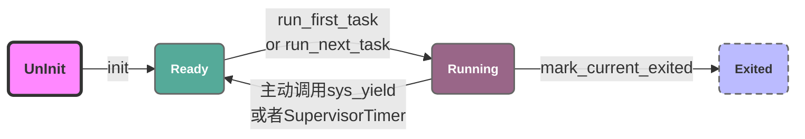
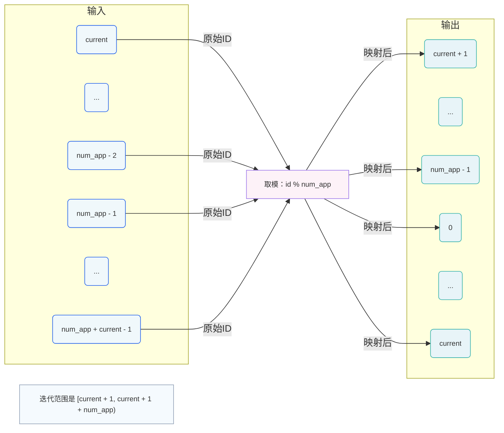

# 多道程序与分时多任务

## 内存调度模型

```mermaid
flowchart LR
    %% 按类型定义专属样式（遵循通俗约定：函数=蓝、结构体=绿、寄存器=紫、栈=浅红、内存=黄、管理组件=深蓝）
    classDef func fill:#4299e1, stroke:#2563eb, stroke-width:2px, color:#fff, font-weight:bold, rounded:8px, font-size:14px;
    classDef struct fill:#4ade80, stroke:#16a34a, stroke-width:2px, color:#1e293b, font-weight:bold, rounded:8px, font-size:14px;
    classDef reg fill:#a855f7, stroke:#7e22ce, stroke-width:2px, color:#fff, font-weight:bold, rounded:6px, font-size:13px;
    classDef stack fill:#fecaca, stroke:#dc2626, stroke-width:2px, color:#7f1d1d, font-weight:600, rounded:8px, font-size:13px;
    classDef memory fill:#fde047, stroke:#ca8a04, stroke-width:2px, color:#78350f, font-weight:600, rounded:8px, font-size:13px;
    classDef manager fill:#1e40af, stroke:#1e3a8a, stroke-width:2px, color:#fff, font-weight:bold, rounded:10px, font-size:14px;
    classDef transition stroke:#64748b, stroke-width:1.5px, stroke-linecap:round, font-size:12px, font-family:Arial;
    classDef subgraphTitle fill:#1e293b, font-weight:bold, font-size:14px, font-family:Arial;

    %% 栈（USER_STACK/KERNEL_STACK）
    subgraph USER_STACK["USER_STACK"]
        direction LR
        US1("..."):::stack
        US0("UserStack 0"):::stack
    end
    subgraph KERNEL_STACK["KERNEL_STACK"]
        direction LR
        KS1("..."):::stack
        KS0("KernelStack 0"):::stack
    end

    %% 内存/二进制代码
    subgraph Memory["Memory"]
       direction LR
        M1("..."):::memory
        M0("Task 0 Code"):::memory
    end

    %% 任务相关（结构体：TaskControlBlock/TaskStatus/TaskContext/TrapContext）
    subgraph tasks["tasks"]
       subgraph TaskControlBlock1["TaskControlBlock1"]
        TaskContext1("..."):::struct
        TaskStatus1("..."):::struct
       end
       subgraph TaskControlBlock0["TaskControlBlock0"]
        subgraph TaskContext0["TaskContext0"]
            ra0("ra"):::reg 
            sp0("sp"):::reg
            s0("s0 ~ s11"):::reg
        end
        TaskStatus0("TaskStatus 0"):::struct
       end
    end
    subgraph TrapContextList["TrapContextList"]
        OtherTrapContext("..."):::struct
        subgraph TrapContext["TrapContext"]
            x0("x0~x31"):::reg
            ssstatus0("sstatus"):::reg
            sepc0("sepc"):::reg
        end
    end

    %% 管理组件（TaskManager/TASK_MANAGER）
    TaskManager("TaskManager"):::manager
    TASK_MANAGER("TASK_MANAGER"):::manager

    %% 函数（main/__restore）
    main("main"):::func
    __restore("__restore"):::func

    %% 原有连接关系（保持不变，统一应用transition样式）
    TaskManager -->|延迟加载全局唯一实例| TASK_MANAGER:::transition
    main -->|1. load_apps 加载应用代码| Memory:::transition
    main -->|2. run_first_task触发初始化| TASK_MANAGER:::transition
    TASK_MANAGER -.->|初始化| tasks:::transition
    sp0 -.->|__restore使用sp作为参数恢复上下文| __restore:::transition
    sepc0 -.-> M0:::transition
    x0 -.->|sp| US0:::transition
    KS0 -.->|存储了TrapContext| TrapContext:::transition
    ra0 --> __restore:::transition
    sp0 --> KS0:::transition

    %% 优化子图标题样式（统一居中、加粗）
    style USER_STACK fill:#fef2f2, stroke:#fecaca, stroke-width:1px, padding:10px;
    style KERNEL_STACK fill:#fef2f2, stroke:#fecaca, stroke-width:1px, padding:10px;
    style Memory fill:#fffbeb, stroke:#fde047, stroke-width:1px, padding:10px;
    style tasks fill:#ecfccb, stroke:#4ade80, stroke-width:1px, padding:10px;
    style TrapContextList fill:#ecfccb, stroke:#4ade80, stroke-width:1px, padding:10px;
```




## 实现

### 应用加载

在老的版本中 [load_app](https://github.com/LearningOS/2025a-rcore-0x822a5b87/blob/6eb692006771da9a66508713cbcbd0a79f43f27d/os/src/batch.rs#L81) 每次只能加载一个应用，并且是固定的加载到 `0x80400000` ~ `0x80600000` 之间。

而如果我们需要实现分时多任务，加载应用的逻辑不能再和单任务绑定在一起在，所以我们要把应用同时加载到内核中。


```rust
/// Load nth user app at
/// [APP_BASE_ADDRESS + n * APP_SIZE_LIMIT, APP_BASE_ADDRESS + (n+1) * APP_SIZE_LIMIT).
pub fn load_apps() {
    extern "C" {
        fn _num_app();
    }
    let num_app_ptr = _num_app as usize as *const usize;
    let num_app = get_num_app();

    // read app start addresses array: [app0_start, app1_start, ..., appN_start, appN_end]
    let app_start = unsafe { core::slice::from_raw_parts(num_app_ptr.add(1), num_app + 1) };
    // load apps
    for i in 0..num_app {
        let base_i = get_base_i(i);
        // clear region
        (base_i..base_i + APP_SIZE_LIMIT)
            .for_each(|addr| unsafe { (addr as *mut u8).write_volatile(0) });
        // load app from data section to memory
        let src = unsafe {
            core::slice::from_raw_parts(app_start[i] as *const u8, app_start[i + 1] - app_start[i])
        };
        let dst = unsafe { core::slice::from_raw_parts_mut(base_i as *mut u8, src.len()) };
        dst.copy_from_slice(src);
    }
    // Memory fence about fetching the instruction memory
    // It is guaranteed that a subsequent instruction fetch must
    // observe all previous writes to the instruction memory.
    // Therefore, fence.i must be executed after we have loaded
    // the code of the next app into the instruction memory.
    // See also: riscv non-priv spec chapter 3, 'Zifencei' extension.
    unsafe {
        asm!("fence.i");
    }
}
```

### 开启时钟中断

在开始之前，我们需要先了解一下 RISCV 的时钟中断是如何实现的，参考 [RISCV的时钟中断](#riscv时钟中断)

>首先，必须在 supervisor 模式下开启时钟中断，否则时钟中断不会被触发。

```rust
/// enable timer interrupt in supervisor mode
pub fn enable_timer_interrupt() {
    unsafe {
        sie::set_stimer();
    }
}
```

> 其次，我们需要设置 `mtimecmp` 寄存器的值，以便在 `mtime` 达到该值时触发时钟中断。
> 
> 但是，这里有个非常重要的注意事项， `mtimecmp` 寄存器是一个内存映射寄存器（MMR），它并不是一个 CSR 寄存器，所以我们不能使用 CSR 指令来访问它，而是需要通过内存访问指令来读写它。
> 
> 因此，我们需要通过 `SBI` 提供的接口来设置 `mtimecmp` 寄存器的值。

```rust
const SBI_SET_TIMER: usize = 0;

/// use sbi call to set timer
pub fn set_timer(timer: usize) {
    sbi_call(SBI_SET_TIMER, timer, 0, 0);
}
```

### 执行应用

在经历了前面的两个步骤：

1. 同时加载多个应用到内存中；
2. 开启时钟中断，并提供设置 `mtimecmp` 的接口；

我们就可以开始执行我们的应用了，再回到我们前面的内存模型图：


程序的执行逻辑有如下两种情况：

>执行第一个task，之所以把它独立出来，是因为第一次执行时，没有任何可用的TaskContext。

1. 通过 `TaskManager` 获取第一个加载的task的 `TaskContext`；
2. 将task的状态修改为 `Running`
3. 初始化一个全零的 `TaskContext`，这只是个临时变量所以不影响；
4. 使用 `TaskContext` 做为参数调用 `__switch`
    1. `ra` = `__restore`
    2. `sp` 指向 KERNEL_STACK 上对应的 KernelStack；
    3. 恢复 s0 ~ s11；
    4. 执行 ret，此时会跳转到 `__restore`。
5. 执行 `__restore` 函数，此时 `sp` 指向内核栈：
    1. 从 KernelStack 加载 sstatus；
    2. 从 KernelStack 加载 `sepc`，此时 `sepc` 指向应用代码的地址（`0x80400000` ~ `0x80600000`）；
    3. 从 KernelStack 加载 `sscratch`，此时 sp 指向内核栈，sscratch 指向用户栈；
    4. 恢复 User-Purpose Registers；
    5. **释放内核栈；这里需要注意的是，当前这次内核栈指针是在 `KernelStack#push_context`中分配的，而之后每次进入内核时，都会通过 __alltraps 来分配一个最新的TrapContext，此时我们需要使用内核栈的基址。并且，由于进入内核态是通过trap进入的，而根据trap的类型不同，内核的寄存器状态是不同的，所以保存并没有意义。**
    6. 交换 `sp`和 `sscratch`，此时，sp 指向用户栈，sscratch 指向内核栈；
    7. `sret` 切换回用户态。

在执行完成之后，我们会发现**sp指向用户栈，sepc指向应用代码**，这意味着当程序正式进入用户程序执行。

我们也可以把上面的简述如下：

1. 在最开始操作系统处于内核态，初始化内核的 `ra`, `sp`，`寄存器` 以及用户程序的 `ra`, `sp`，`寄存器`；
2. 通过 `__restore` 函数将控制权交给用户态程序；
3. 用户执行过程中，通过主动的 `sys_yield()` 或者触发 `Interrupt::SupervisorTimer` 让出时间片。

#### 应用状态

```rust
/// The status of a task
#[derive(Copy, Clone, PartialEq)]
pub enum TaskStatus {
    /// uninitialized
    UnInit,
    /// ready to run
    Ready,
    /// running
    Running,
    /// exited
    Exited,
}
```



随后的调度就没有什么复杂的地方，唯一需要注意的是，我们在这里使用的是 `round_robin()` 算法实现的查找，具体的实现还是比较有意思的：

```rust
    /// Find next task to run and return task id.
    ///
    /// In this case, we only return the first `Ready` task in task list.
    fn find_next_task(&self) -> Option<usize> {
        let inner = self.inner.exclusive_access();
        let current = inner.current_task;
        // This is a simple round-robin scheduler, and I think it's quite ingenious.
        // Our goal is to search for a qualified task starting from the task right after the current task to the end of the task list.
        // If no qualified task is found in this range, we continue searching from the beginning of the task list up to the current task.
        //
        // Think of the task list as a ring; the search range will be as follows:
        // ```text
        // [
        //     current + 1,
        //     ...,
        //     num_app - 1,
        //     0,
        //     ...,
        //     current
        // ]
        // ```
        // The current task is included because it is the last resort.
        // Additionally, this search range is exactly equivalent to:
        // ```text
        // [
        //     (current + 1) % num_app,
        //     ...,
        //     (current + (num_app - current - 1)) % num_app,
        //     ((current + 1) + (num_app - (current + 1) - 1)) % num_app, /// Equals 0
        //     ...,
        //     current
        // ]
        // ```
        (current + 1..current + self.num_app + 1)
            .map(|id| id % self.num_app)
            .find(|id| inner.tasks[*id].task_status == TaskStatus::Ready)
    }
```



## QA

### rust下开启RISCV时钟中断

在rust下开启RISCV时钟中断是基于一个叫做 `sie` 的 crate 来实现的。`sie` 代表 "Supervisor Interrupt Enable"，它提供了一组函数来操作RISCV的中断使能寄存器。

```rust
/// enable timer interrupt in supervisor mode
pub fn enable_timer_interrupt() {
    unsafe {
        sie::set_stimer();
    }
}
```

`set_timer()` 的实现是 `rust` 语言下一个及其强大的功能：`宏展开（Marco Expansion）`，它允许我们定义一段代码模板，然后在编译时将其展开为具体的代码：如下的宏在展开后会生成 `set_stimer` 和 `clear_stimer` 两个函数，用于设置和清除 supervisor timer interrupt enable 位。

```rust
set_clear_csr!(
    /// Supervisor Timer Interrupt Enable           /// -> 文档注释
    ,
    set_stimer,                                     /// 指定要生成的函数名
    clear_stimer,                                   /// 另一个指定要生成的函数名
    1 << 5                                          /// 比特掩码，用于设置或清除特定位
);
```

随后，`set_clear_csr!` 是一个 `过程宏` （Procedural Macro），它会根据传入的参数生成对应的函数代码：

```rust
/// macro_rules! is a keyword to define procedural macros in Rust.
/// This macro generates two functions: one to set specific bits in a CSR,
macro_rules! set_clear_csr {
    ($(#[$attr:meta])*, $set_field:ident, $clear_field:ident, $e:expr) => {
        set_csr!($(#[$attr])*, $set_field, $e);
        clear_csr!($(#[$attr])*, $clear_field, $e);
    }
}
```

1. `(#[$attr:meta])*` ：这是一个可变参数模式，表示可以接受任意数量的元属性（meta attributes），这些属性会被应用到生成的函数上，比如文档注释等。
2. `$set_field:ident` 和 `$clear_field:ident` ：这两个模式表示接受标识符（identifier），即函数名。
3. `$e:expr` ：这是一个表达式模式，表示接受一个表达式，这个表达式通常是一个位掩码，用于指定要设置或清除的位。

`set_clear_csr!` 宏会调用 `set_csr!` 和 `clear_csr!` 两个宏来生成具体的函数代码：

```rust
macro_rules! set_csr {
    ($(#[$attr:meta])*, $set_field:ident, $e:expr) => {
        $(#[$attr])*
        #[inline]
        pub unsafe fn $set_field() {
            _set($e);
        }
    };
}
```

1. `$(#[$attr])*` ：将传入的元属性应用到生成的函数上。
2. `#[inline]` ：这是一个属性，告诉编译器将这个函数内联展开，以提高性能。
3. `pub unsafe fn $set_field()` ：定义一个公共的、不安全的函数，函数名由 `$set_field` 替换。
4. `_set($e);` ：调用一个内部函数 `_set`，传入位掩码 `$e`，用于实际设置寄存器的位。

`clear_csr!` 宏的实现与 `set_csr!` 类似，只不过它调用的是 `_clear` 函数，用于清除寄存器的位。

其实，最终的 `_set` 和 `_clear` 函数会使用 `RISC-V` 的汇编指令来操作 `CSR`（Control and Status Register，控制和状态寄存器），具体实现如下：

1. csrrs 指令的核心语义就是：bits 中所有为 1 的比特位，会将 CSR 寄存器对应位 “设 1”；bits 中为 0 的比特位，CSR 寄存器保持原有值，不做任何修改。
2. csrrc 指令的核心语义就是：bits 中所有为 1 的比特位，会将 CSR 寄存器对应位 “清 0”；bits 中为 0 的比特位，CSR 寄存器保持原有值，不做任何修改。

```rust
/// _set
unsafe fn _set(bits: usize) {
    match () {
        #[cfg(all(riscv, feature = "inline-asm"))]
        () => core::arch::asm!("csrrs x0, {1}, {0}", in(reg) bits, const $csr_number),
        /// ...
    }
}


/// _clear
unsafe fn _clear(bits: usize) {
    match () {
        #[cfg(all(riscv, feature = "inline-asm"))]
        () => core::arch::asm!("csrrc x0, {1}, {0}", in(reg) bits, const $csr_number),
        /// ...
    }
}
```

### riscv时钟中断

RISCV的时钟中断是通过 CSR 寄存器 `stime`（也可以叫做 `mtime` 的 CSR 访问别名），以及 `mtime` 和 `mtimecmp` 两个内存映射寄存器（MMIO）配合实现的：

- `stime`（Supervisor Time Register）：是 S-mode 特权级的 CSR 寄存器，表示当前的时间戳，单位是时钟周期数。它是只读的，不能被写入。其值与 `mtime` 完全同步（对应同一硬件计时器），**操作系统为了性能，通常通过 CSR 指令直接访问 `stime`**，无需依赖内存映射或 SBI。
- `mtime(Machine Time Register)`：一个递增的计时器内存映射寄存器（归属 CLINT 外设），表示自系统启动以来的时间（以时钟周期为单位），硬件自动递增，只读；部分平台支持 M-mode 通过 CSR 指令直接访问（`mtime` 对应的 CSR 地址 `0xb00`），本质是同一计时器的不同访问入口。
- `mtimecmp(Machine Time Compare Register)`：一个比较内存映射寄存器（归属 CLINT 外设，每个核心独立），当 `mtime` 的值达到 `mtimecmp` 的值时，会触发机器模式（M-mode）时钟中断。

对于 CSR 寄存器和内存映射寄存器的访问方式，最大的区别在于：

- CSR 寄存器（如 `stime`/`mtime`）：通过 `csrr`（读）/`csrw`（写，部分支持）指令访问，无需物理地址，仅对应特权级可访问（S-mode 访问 `stime`，M-mode 访问 `mtime`）；
- 内存映射寄存器（如 `mtime`/`mtimecmp`）：通过 `ld`（64 位读）/`sd`（64 位写）指令访问，需要知道具体物理地址（由厂商定义，如 CLINT 外设地址）；**S-mode 因特权级限制无法直接写入 `mtimecmp`，因此通过 `SBI` 调用让 M-mode 固件协助访问/更新**。

再回顾我们的代码中：

>访问当前时间（对应 `stime`），是通过 `time::read()` 调用了声明式宏生成的函数，并通过 `csrrs` 指令读取对应的 CSR 寄存器：

```rust
core::arch::asm!("csrrs {0}, {1}, x0", out(reg) r, const $csr_number);
```

>访问 `mtimecmp`（设置中断触发阈值），是通过 `SBI` 提供的接口来实现的：

```rust
/// use sbi call to set timer
pub fn set_timer(timer: usize) {
    sbi_call(SBI_SET_TIMER, timer, 0, 0);
}
```

一次时钟中断的触发过程如下：

1. 系统启动时，`mtime` 寄存器开始递增，表示系统运行的时间。
2. 内核设置 `mtimecmp` 寄存器的值为一个未来的时间点（通常是当前 `mtime` 值加上一个固定的时间间隔）。
3. 当 `mtime` 的值递增到等于或超过 `mtimecmp` 的值时，硬件会触发一个时钟中断。
4. 中断处理程序会被调用，内核可以在中断处理程序中执行任务调度等操作。
5. 中断处理程序完成后，内核通常会重新设置 `mtimecmp` 寄存器，以便在未来再次触发时钟中断。

#### 总结

| 特性	         | mtime（Machine Time Register）	     | mtimecmp（Machine Time Compare Register）   |
|-------------|-----------------------------------|-------------------------------------------|
| 本质类型	       | 机器模式（M-mode）CSR（控制状态寄存器）	         | 内存映射寄存器（MMR），归属 CLINT 外设                  |
| 硬件集成位置	     | CPU 核心内部	                         | CPU 核心外部的 CLINT（Core-Local Interrupter）外设 |
| 访问方式	       | 专用 CSR 指令 csrr（读）/ csrw（部分实现支持写）	 | 内存访问指令 ld/sd（64 位）、lw/sw（32 位），需通过物理地址访问  |
| 核心功能	       | 持续递增的 “系统计时器”，记录当前时间	             | 存储 “目标触发时间”，与 mtime 比较触发定时中断              |
| 可修改性	       | 只读（标准定义），部分实现支持写（用于时间校准）	         | 可写（需主动设置目标时间）                             |
| RISC-V 标准地位 | 	架构标准强制定义（功能、CSR 地址 0xb00 固定）     | 	标准推荐实现（功能统一），物理地址由厂商自定义（如 0x2004000）     |
| 多核心适配       | 	所有核心共享一个（全局计时器）	                 | 每个核心独立一个（通过地址偏移区分，如核心 N：0x2004000 + 8*N）  |


### `__switch` 函数的实现

`__switch` 函数的实现有几点需要注意：

1. 在我们保存`TaskContext`的过程中，我们最好的保存方式是，与 TaskContext 的字段定义顺序一致：`ra -> sp -> s0~s11`；
2. 在恢复TaskContext的过程中，我们最好把 `sp` 放在最后恢复。虽然我们在 `__switch` 中，不会用到 sp，但是这种可能影响全局的操作放在最后做是一个比较好的防御式编程习惯。

```assembly
# Store `sn` into the corresponding register, then add 2 to skip `sp` and `ra`.
.altmacro
.macro SAVE_SN n
    sd s\n, (\n+2)*8(a0)
.endm
.macro LOAD_SN n
    ld s\n, (\n+2)*8(a1)
.endm
    .section .text
    .globl __switch
__switch:
    # __switch(
    #     current_task_cx_ptr: *mut TaskContext,
    #     next_task_cx_ptr: *const TaskContext
    # )
    #
    #   TaskContext
    #       ra: usize,
    #       sp: usize,
    #       s: [usize; 12],
    #

    sd ra, 0(a0)
    # save kernel stack of current task
    sd sp, 8(a0)
    # save ra & s0~s11 of current execution
    .set n, 0
    .rept 12
        SAVE_SN %n
        .set n, n + 1
    .endr

    # restore ra & s0~s11 of next execution
    ld ra, 0(a1)
    .set n, 0
    .rept 12
        LOAD_SN %n
        .set n, n + 1
    .endr
    # restore kernel stack of next task
    ld sp, 8(a1)
    ret


```

### 为什么 `__switch` 只需要保存 `sp`, `ra`, `s0`~`s11` 寄存器？

这里我之前有个疑问，花了不少时间捋清楚，这里分享一下（不保真），有错误请各位大佬们不吝指教。

>**为什么，在 `trap.S` 中需要保存所有寄存器信息，而 `switch.S` 中则只需要保存 callee-saved registers？**

先说结论：这是因为 `trap.S` 的调用机制和 `switch.S` 的调用机制完全不一样：

- `__alltraps` 和 `__restore` 是在发生trap时，由CPU触发的跳转，是完全不可控的跳转逻辑：
  - 可能发生在任意指令之间（比如函数调用 `sd a0 0(sp)` 时，sp 指针指向的内存块在MMU不可用发生了缺页异常）；
  - 可能发生在函数执行的任意阶段（比如函数还没来得及保存 `a0~a7`，或者正在使用 `a0` 进行计算）。
- `__switch` 是内核主动调用的调度函数，调用时机是**完全可控**的 —— 内核只会在 “安全的时机” 调用 `__switch`，这个 “安全时机” 的核心要求是：调用 `__switch` 之前，当前任务的所有 caller-saved 寄存器（`a0~a7`、`t0~t6`）都已被当前执行的函数保存到栈上。

举个例子，在如下的代码中：

```assembly
foo:
	addi sp, sp, -16
	# 下面的代码可能触发缺页异常进入 __alltraps 和 __restore
	# 然而，不可能出现一个 __switch 调用；
	# call __swtich
	sd   a0, 0(sp)
	sd   a1, 8(sp)
```

#### 具体触发逻辑

在一切开始之前，我们必须搞清楚两个基本概念，`caller-saved registers` 和 `callee-saved registers`：

- caller-saved 由调用者保存，也就是 a0~a7 等，函数在调用时会将这些数据保存到自己的函数栈，后续访问都通过函数栈上保存的值来访问；
- callee-saved 由被调用者保存，也就是 ra, fp, s0~s11 等，被调用的函数需要保存原始值，并且在函数退出之后将这些寄存器恢复到原值。


此外，在操作系统中，定义了两个不同的函数来保存上下文：

1. `__alltraps` 和 `__restore` 用于在trap发生时用来处理中断，此时会保存/恢复所有的寄存器作为上下文；
2. `__switch` 用于在需要发生上下文切换时来处理中断，此时只会保存 callee-saved；

我们举个例子，假设存在两个线程：

>线程一

```asm
foo:
	addi sp, sp, -16
	sd   a0, 0(sp)
```

>线程二

```asm
bar:
	li a0, 0x0
```

对于trap，可能会出现如下的执行顺序：

1. addi sp, sp -16
2. `__alltraps`
3. li a0, 0x0
4. `__restore`
5. sd a0, 0(sp)

在这个例子中不会有任何问题，因为`__alltraps`和`__restore`会保存/恢复所有的寄存器。

而 `__switch` 是一个主动调用的函数，并不会触发如下的执行顺序（除非程序或者编译器出现BUG）：

1. addi sp, sp -16
2. `__switch`
3. li a0, 0x0
4. `__switch`
5. sd a0, 0(sp)

而在实际的应用中 `__switch` 的调用往往是如下场景：


>线程一

```asm
foo:
	addi sp, sp, -16
	sd   a0, 0(sp)
	# all caller-saved registers are stored.

	call __switch
```

>线程二

```asm
bar:
	li a0, 0x0
	call __switch
```

在这种情况下，所有的 caller-saved registers 已经使用完毕，所以 `__switch` 只需要处理 callee-saved registers 即可。

总结来说：`__switch` 无需保存 caller-saved 寄存器的原因的是：

1. 这些寄存器的值已被当前函数保存到栈上（栈指针 `sp` 会被 `__switch` 保存，栈数据不会丢失）；
2. 切换到新任务后，新任务的 caller-saved 寄存器会由它自己的函数在执行时保存 / 恢复，与当前任务无关；
3. 当当前任务再次被调度时，`__switch` 恢复 `sp` 后，当前函数会从栈上重新加载 caller-saved 寄存器的原始值，继续执行。

简单说：`__switch` 依赖 “调用前已保存 caller-saved 寄存器” 的约定，只需保存 callee-saved 寄存器（`ra`、`sp`、`s0~s11`）—— 这些寄存器是任务长期状态的载体，且不会被函数主动保存，必须由 `__switch` 负责保存 / 恢复。

#### 补充

内核调度 `__switch` 的场景，本质都是 “任务主动放弃 CPU” 或 “内核在安全点触发调度”：

1. 任务主动调用系统调用（如 `sleep`）：系统调用处理函数会先保存 caller-saved 寄存器，再调用 `__switch`；
2. 时钟中断触发调度：时钟中断的 `__alltraps` 会保存所有寄存器，进入内核后，内核会在 “调度前” 确保当前任务的 caller-saved 已妥善保存（或直接使用 `__alltraps` 保存的完整上下文），再调用 `__switch`；
3. 任务执行完毕：内核会在任务退出函数中保存 caller-saved 寄存器，再调用 `__switch` 切换到其他任务。

#### 一些典型的 `__switch` 调用场景

在下面执行任务的场景中，`__switch` 的调用是保证在所有的 `caller-saved registers` 都被保存到栈上之后才会被调用的。

```rust
pub fn run_tasks() {
    loop {
        let mut processor = PROCESSOR.exclusive_access();
        if let Some(task) = fetch_task() {
            let idle_task_cx_ptr = processor.get_idle_task_cx_ptr();
            // access coming task TCB exclusively
            let mut task_inner = task.inner_exclusive_access();
            let next_task_cx_ptr = &task_inner.task_cx as *const TaskContext;
            task_inner.task_status = TaskStatus::Running;
            // release coming task_inner manually
            drop(task_inner);
            // release coming task TCB manually
            processor.current = Some(task);
            // release processor manually
            drop(processor);
            unsafe {
                __switch(idle_task_cx_ptr, next_task_cx_ptr);
            }
        } else {
            warn!("no tasks available in run_tasks");
        }
    }
}
```

#### 总结

| 对比维度    | `__alltraps` + `__restore`   | `__switch`                        |
|---------|------------------------------|-----------------------------------|
| 触发方式    | 被动（硬件 Trap：中断 / 异常 / 系统调用）   | 主动（内核函数调用）                        |
| 执行时机    | 任意时刻（不可控）                    | 安全点（可控：caller-saved 已保存）          |
| 保存寄存器范围 | 所有通用寄存器 + 状态寄存器（如 `mstatus`） | 仅 callee-saved：`ra`、`sp`、`s0~s11` |
| 核心目标    | 原封不动恢复现场（Trap 后继续执行）         | 切换任务上下文（保证任务能恢复执行）                |
| 依赖约定    | 无（需兜底所有情况）                   | 调用前 caller-saved 已保存到栈            |

### 内核栈

假设我们分配了一个内核栈

```rust
#[repr(align(4096))]
#[derive(Copy, Clone)]
struct KernelStack {
    data: [u8; KERNEL_STACK_SIZE],
}
```

那么按照riscv的约定：结构体的内存空间是 “从起始地址开始，向后连续分配”，那么：

1. 这个内核栈的空间就是 `[data.as_ptr(), data.as_ptr() + KERNEL_STACK_SIZE)`；
2. 内核栈的栈顶地址为 data.as_ptr() + KERNEL_STACK_SIZE，该地址是栈的 “初始空闲位置”，属于栈空间的逻辑边界（栈顶地址本身不存储有效数据，首次压栈前 sp 指向这里）；
3. 如果我们想要分配一个大小为 `0x100` 的地址，那么我们应该使用 data.as_ptr() + KERNEL_STACK_SIZE - 100 作为指针；

data.as_ptr() 是 `*const u8` 类型（单字节指针），直接解引用 `*ptr` 仅适用于u8 类型的场景。若是多字节类型（如 usize、结构体），需先将指针转为对应类型，避免内存越界或数据解析错误。

>存储 / 读取 usize 类型（8 字节，RISC-V 64 位）

```rust
let stack_top = data.as_ptr() + KERNEL_STACK_SIZE;
// 分配 0x100 字节空间，转为 *mut usize 指针（假设 0x100 ≥ 8）
let ptr = (stack_top - 0x100) as *mut usize;

// save（安全：指针类型与数据类型匹配）
unsafe {
    *ptr = s2; // s2: usize（8 字节）
}

// load
unsafe {
    let s2 = *ptr; // 正确读取 8 字节，重组为 usize
}
```

>存储 / 读取大小为 0x100 的结构体

```rust
#[repr(C)] // 按 C 布局，确保大小为 0x100
struct MyData {
    data: [u8; 0x100]
}

let stack_top = data.as_ptr() + KERNEL_STACK_SIZE;
// 分配 0x100 字节空间，转为 *mut MyData 指针
let data_ptr = (stack_top - 0x100) as *mut MyData;

// save（使用 ptr::write 安全写入结构体）
unsafe {
    core::ptr::write(data_ptr, MyData::default());
}

// load（使用 ptr::read 安全读取结构体）
unsafe {
    let s2 = core::ptr::read(data_ptr);
}
```

### 代码

本章节主要介绍多道程序设计与分时多任务的基本概念，并实现一个简单的任务调度器，可以分为以下几个部分：

1. 增加了时钟中断 -- 为了对我们同时执行的多个程序进行调度；
2. 增加了基于伙伴分配算法（Buddy System Allocator）的堆分配管理器；
3. 将 `batch.rs` 拆分为 `loader.rs` 和 `task.rs` 用于支持多任务调度；
4. 增加了新的 `syscall` : `sys_yield` 用来主动触发任务切换；

```
➜  ~/code/2025a-rcore-0x822a5b87 git:(ch3) cloc --include-ext=rs,s,S,asm os 
     143 text files.
     117 unique files.                              
     122 files ignored.

1 error:
Unable to read:  os/.gdb_history

github.com/AlDanial/cloc v 1.82  T=0.01 s (2066.4 files/s, 107071.4 lines/s)
-------------------------------------------------------------------------------
Language                     files          blank        comment           code
-------------------------------------------------------------------------------
Rust                            23            138            239            851
Assembly                         4             12             29            130
-------------------------------------------------------------------------------
SUM:                            27            150            268            981
-------------------------------------------------------------------------------
```

## 