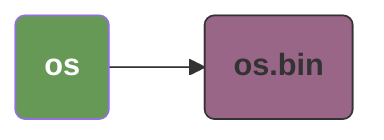
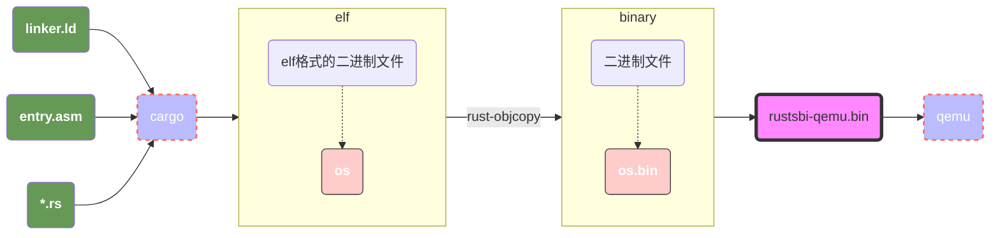
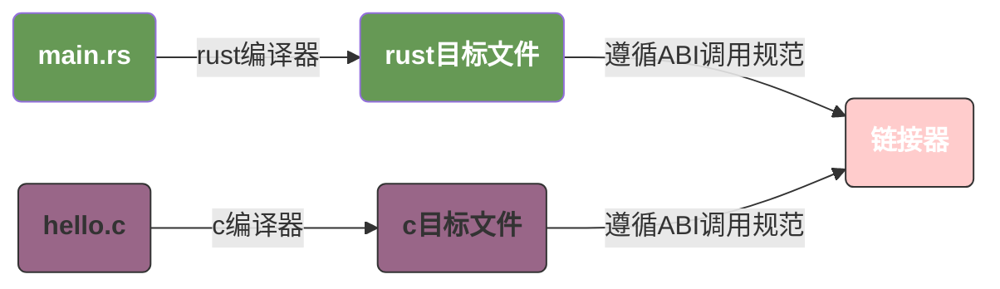

# 前言

`uCore` 是由清华大学推出的一个基于 `rust` 和 `riscv` 实现的操作系统，实现难度适中，核心代码量约为 `5000` 行，这里使用本文记录在学习过程中的一些思考和疑问，在完成这个项目之后，我们可以：

1. 阅读简单的 Makefile 文件；
2. 阅读简单的 RISC-V 汇编代码；
3. git 的基本功能，解决 git merge 冲突的办法；
4. Rust 基本语法和一些进阶语法，包括 Cargo 项目结构、Trait、函数式编程、Unsafe Rust、错误处理等；
5. 粗浅的了解操作系统的实现逻辑。

项目的全部代码在这里：[ardi](https://github.com/0x822a5b87/Ardi)

```terminaloutput
➜  ~/code/2025a-rcore-0x822a5b87 git:(ch8) cloc --include-ext=rs,s,S,asm .
     262 text files.
     216 unique files.                                          
     232 files ignored.

github.com/AlDanial/cloc v 1.82  T=0.02 s (2738.4 files/s, 303633.3 lines/s)
-------------------------------------------------------------------------------
Language                     files          blank        comment           code
-------------------------------------------------------------------------------
Rust                            55            391            967           4941
Assembly                         3              6             29             97
-------------------------------------------------------------------------------
SUM:                            58            397            996           5038
-------------------------------------------------------------------------------
```

# 引用

- [rustlings - rust的示例](https://github.com/LearningOS/rustling-classroom-2025a-rustling-rustling-25A-template)
- [os-rcore-classroom-2025a-rcore-rCore-Tutorial-Code](https://github.com/LearningOS/os-rcore-classroom-2025a-rcore-rCore-Tutorial-Code)
- [rCore-Tutorial-Guide](https://learningos.cn/rCore-Tutorial-Guide/index.html)
- [rCore-Tutorial-Book-v3 3.6.0-alpha.1 文档](https://rcore-os.cn/rCore-Tutorial-Book-v3/chapter0/1what-is-os.html)
- [qemu](https://www.qemu.org/)

# 项目结构

整体项目结构如下所示：

```terminaloutput
.
├── target
│   └── riscv64gc-unknown-none-elf/release/os
│   └── riscv64gc-unknown-none-elf/release/os.bin
├── bootloader
│   └── rustsbi-qemu.bin
├── os
│   ├── src
│   │   ├── boards
│   │   │   └── qemu.rs
│   │   ├── console.rs
│   │   ├── entry.asm
│   │   ├── lang_items.rs
│   │   ├── linker.ld
│   │   ├── logging.rs
│   │   ├── main.rs
│   │   └── sbi.rs
│   ├── Cargo.toml
│   └── Makefile
└── Makefile
```

下面我们来拆解项目他们的功能，流程以及他们是如何被组织成为一个可执行文件，也就是我们的 `os` 和 `os.bin`。

这里，`os` 是我们从rust源码编译得到的 **elf格式** 的二进制文件，而 `os.bin` 是一个裸机可执行的二进制文件。我们通过 `rust-objcopy` 来实现这个这个转换；



## 整体逻辑图解

我们的项目包含以下文件，各模块功能如下：

1. `*.rs` 文件：Rust 源代码文件，定义了程序的核心执行逻辑；
2. `linker.ld`：链接脚本（Linker Script），用于告知链接器如何合并目标文件、编排内存布局，最终生成符合要求的二进制文件；
3. `entry.asm`：启动引导文件（汇编编写），负责初始化基础执行环境，引导 CPU 定位并跳转到 Rust 程序的入口地址；
4. `rustsbi-qemu.bin` ：SBI（Supervisor Binary Interface）固件文件，作为内核与硬件的隔离层 / 抽象层，为内核提供硬件相关的基础服务（详见 [什么是 SBI](#什么是sbi)）；
5. `Makefile` : 构建脚本，通过声明编译目标（target）、依赖关系及执行命令，简化程序的编译、运行、加载等流程管理。



## Makefile

### 变量定义

```makefile
# 指定目标平台，模式
TARGET := riscv64gc-unknown-none-elf
MODE := release

# 声明target的elf，bin，汇编的输出目录
KERNEL_ELF := target/$(TARGET)/$(MODE)/os
KERNEL_BIN := $(KERNEL_ELF).bin
DISASM_TMP := target/$(TARGET)/$(MODE)/asm

# Building mode argument
ifeq ($(MODE), release)
	MODE_ARG := --release
endif

# BOARD
BOARD := qemu
SBI ?= rustsbi
BOOTLOADER := ../bootloader/$(SBI)-$(BOARD).bin

# 内核的物理入口地址（PA = Physical Address），必须与链接脚本（linker.ld）中定义的代码段（.text）起始地址完全一致
# 裸机环境中，CPU 上电后从指定物理地址开始执行，QEMU 通过该地址加载内核二进制并跳转到入口
# 若地址不匹配，会导致内核执行错乱（如跳转到无效指令）
KERNEL_ENTRY_PA := 0x80200000

# Binutils
OBJDUMP := rust-objdump --arch-name=riscv64
OBJCOPY := rust-objcopy --binary-architecture=riscv64

# Disassembly
DISASM ?= -x
```

### 依赖初始化和编译

这里，makefile主要实现了以下几个功能：

1. 通过 `env` 初始化rust编译所需的所有依赖；
2. 通过 `kernel` 目标将rust源码编译为elf格式的二进制文件；
3. 通过 `$(KERNEL_BIN)` 目标，将elf格式的二进制文件转换为逻辑可执行的bare metal app；
4. 通过 `build` 编译得到bare metal app。

```makefile
# 指定build的依赖
build: env $(KERNEL_BIN)

# 初始化rust编译所需的所有组件，指定target
env:
	(rustup target list | grep "riscv64gc-unknown-none-elf (installed)") || rustup target add $(TARGET)
	cargo install cargo-binutils
	rustup component add rust-src
	rustup component add llvm-tools-preview

# 调用 rust-objcopy，rust-objcopy 它将某个特定的二进制格式，转换为另外一个特定的二进制格式。
# 例如，我们在linux下通过cargo build得到了elf格式的文件，我们可以通过rust-objcopy转换为一个纯二进制的文件。
# 这样我们就从一个linux可以识别的二进制文件变成了一个裸机上可以运行的bare metal app。
#
# --strip-all : 剥离 ELF 中的所有符号表、调试信息（即使 release 模式有残留元数据也会移除）；
# -O binary：指定输出格式为「纯二进制」；
#
# $@ 是一个自动变量（automatic variable），指代当前规则中的目标
# $^ 指代当前规则的「所有依赖」
# $< 指代当前规则的「第一个依赖」
# $* 指代目标文件名的「无后缀部分」
$(KERNEL_BIN): kernel
	@$(OBJCOPY) $(KERNEL_ELF) --strip-all -O binary $@

# 编译rust内核输出到 target/riscv64gc-unknown-none-elf/release/os
# 整体由 “基础目录/目标架构目录/构建模式目录/文件名” 组成
# 基础目录    target，是rust默认的输出路径
# 目标架构目录 riscv64gc-unknown-none-elf 来自于TARGET变量
# 构建模式目录 MODE := release，cargo build --release 会把编译产物放在 release 下
kernel:
	@echo Platform: $(BOARD)
	@cargo build $(MODE_ARG)
```

### 加载，执行，调试

这里只列出了关键的几个target。

```makefile
# rust-objdump 与 rust-objcopy 同属 cargo-binutils 工具集，是 Rust 对 LLVM 工具的封装（底层依赖 LLVM 工具链）
# 核心作用是「解析二进制文件（如 ELF）并以人类可读形式输出」（不修改原文件），包括：
# - 反汇编：将机器码转换为 RISC-V 汇编指令；
# - 结构分析：显示 ELF 头信息、段表、符号表等；
# 区别于 rust-objcopy（格式转换工具），rust-objdump 仅用于分析，不改变文件格式
disasm: kernel
	@$(OBJDUMP) $(DISASM) $(KERNEL_ELF) | less

# 将我们编译得到的bin文件加载到qemu执行
# qemu-system-riscv64 指定了平台为riscv64
# -machine virt
# -nographic 关闭图像化输出，并将I/O重定向到console
# -bios $(BOOTLOADER) 指定BIOS，其实这里因为我们这里使用的是riscv，所以这里应该是SBI
# -device 指定driver：
#		loader 指定了 Generic Loader
#		file 指定 driver image
#		addr 指定了程序进入的时候执行的代码基址
run: run-inner
run-inner: build
	@qemu-system-riscv64 \
		-machine virt \
		-nographic \
		-bios $(BOOTLOADER) \
		-device loader,file=$(KERNEL_BIN),addr=$(KERNEL_ENTRY_PA)

# 在 tmux 中启动调试环境：QEMU 作为 GDB 服务器运行内核，GDB 客户端加载 ELF 符号表进行调试
# QEMU 参数说明：
# -s：默认在 1234 端口启动 GDB 服务器（等价于 -gdb tcp::1234）；
# -S：启动后暂停 CPU，等待 GDB 客户端连接并发送继续执行命令（避免内核提前运行）；
# 依赖 ELF 文件的符号表（KERNEL_ELF），GDB 才能关联源码和内存地址
debug: build
	@tmux new-session -d \
		"qemu-system-riscv64 -machine virt -nographic -bios $(BOOTLOADER) -device loader,file=$(KERNEL_BIN),addr=$(KERNEL_ENTRY_PA) -s -S" && \
		tmux split-window -h "riscv64-unknown-elf-gdb -ex 'file $(KERNEL_ELF)' -ex 'set arch riscv:rv64' -ex 'target remote localhost:1234'" && \
		tmux -2 attach-session -d
```

## link and bootloader

### linker.ld

`linker.ld` 指定了内存的组织方式，这里我只保留了一些重要信息：

1. 指定了入口函数为 `_start`；
2. 指定了 `.text` 的起始地址为 `0x80200000`，这个地址要和 qemu 的启动命令中的地址一致；

```
OUTPUT_ARCH(riscv)
ENTRY(_start)
BASE_ADDRESS = 0x80200000;

SECTIONS
{
    . = BASE_ADDRESS;
    skernel = .;

    stext = .;
    .text : {
        *(.text.entry)
        *(.text .text.*)
    } 

    .bss : {
        *(.bss.stack)
        sbss = .;
        *(.bss .bss.*)
        *(.sbss .sbss.*)
    }
}
```

### entry.asm

>它主要的目的是初始化并引导CPU找到入口代码地址。

1. **可以留意到，汇编程序中并没有任何位置信息，因为他代码的位置并不取决于自身，而是取决于链接文件中声明。**
2. 文件定义了自定义段 `.text.entry` 和 `.bss.stack`，他们将会在链接文件中被引入；
3. boot_stack_lower_bound 是栈的起始标签（栈底），真正分配 64KB 内存的是 .space 4096 * 16 指令：这段指令会在 .bss.stack 段中预留 64KB 连续内存空间。
4. boot_stack_top 是栈的结束标签（栈顶）：由于汇编中标签会指向其定义处的内存地址，且 .space 会在 boot_stack_lower_bound 之后占用 64KB 空间，因此 boot_stack_top 的地址 = boot_stack_lower_bound 的地址 + 64KB
5. `la sp, boot_stack_top` 的作用：将栈顶地址（boot_stack_top）加载到栈指针 sp 寄存器，本质是初始化栈指针的 “初始位置”，而这 64KB 连续内存就是操作系统（启动阶段 + Rust 内核初期）的栈空间 —— 栈会从 boot_stack_top 地址开始 “向下生长”（RISC-V 架构栈默认向下生长），可用范围就是 boot_stack_lower_bound 到 boot_stack_top 之间的 64KB。
6. .bss 段专门用于存储 “未初始化的全局 / 静态数据”，链接器会为其分配连续内存，且加载到内存后会自动清零（避免栈中残留硬件初始化后的脏数据，导致程序运行异常）；
7. `boot_stack_lower_bound` 是栈的 “下界保护标记”：如果程序运行时栈溢出（sp 地址低于 boot_stack_lower_bound），就会访问到非法内存，触发硬件异常（方便调试栈溢出问题）；需要注意的是，既是没有这个标签，硬件依然会保护用户不会访问到非法内存，只不过缺少这个标签可能就比较难定位问题了。

```asm
    // 声明 .text.entry 段
    .section .text.entry
    .globl _start
_start:
    // 初始化栈指针
    la sp, boot_stack_top
    // 跳转rust的main函数
    call rust_main

    // 声明 .bss.stack 段
    .section .bss.stack
    .globl boot_stack_lower_bound
boot_stack_lower_bound:
    // 填充空间 64k
    .space 4096 * 16

    .globl boot_stack_top
boot_stack_top:

```

## code

> `rust` 代码是我们的主业务逻辑，在第一章中，我们只是简单的通过 entry.asm 引导CPU跳转到了rust的main函数，并向标准输出输出了一个字符。整体包含了如下几个模块：
>
> 1. `main.rs` 初始化内存区域，例如 `bss`, `text`, `rodata` 以及内核的栈内存等；并调用封装好的SBI发送字符到标准输出；
> 1. `qemu.rs` 调用qemu相关的接口，确保在执行之后退出，如果有异常则进行异常处理并输出异常；
> 1. `sbi.rs` 封装SBI function，提供将字符输出到标准输出的能力；
> 1. `console.rs` 封装sbi.rs，提供输出 `&str` 到标准输出的能力；
> 1. `logging.rs` 初始化rust标准库的log用于输出信息，并使用 `console.rs` 中封装好的函数输出字符串到标准输出；
> 1. `lang_items.rs` 异常处理。

### sbi.rs

> 具体 SBI function 的调用规范，请查看 [SBI调用规范](#SBI调用规范)

封装 SBI function，提供了输出字符到标准输出的能力，这里值得注意的的点有几个：

1. `x16` 设置扩展ID，它标志了功能大类（如「基础扩展」「定时器扩展」「系统扩展」），**这里需要注意的是，它的设置必须在ecall之前，虽然这里先调用ecall再设置x16程序依然正常工作，但是这可能和x16的默认值正好为0有关（另外的可能性是我们使用的并非官方的SBI，这个SBI中并未遵循规定），这是一个不可靠的未定义行为**。
2. ecall 先陷入到supervisor mode，这是系统调用的条件；
3. inlateout 表明 x10 同时作为输入和输出，并且指定输入是arg0，输出存储到ret中；
4. x11 和 x12 是SBI的arg1和arg2；
5. x17 是调用的SBI function ID，而 x16 是调用SBI extension ID；这是 RISC-V SBI 规范（特别是 SBI v0.2 及以上版本）要求的「双参数标识」：**x17 存功能 ID（Function ID），x16 存扩展 ID（Extension ID）**，两者结合才能让 SBI 固件（如 RustSBI）明确要执行的具体功能。

```rust
// SBI function IDs
const SBI_CONSOLE_PUTCHAR: usize = 1;

/// general sbi call
#[inline(always)]
fn sbi_call(which: usize, arg0: usize, arg1: usize, arg2: usize) -> usize {
    let mut ret;
    unsafe {
        asm!(
            "li x16, 0",                        // set SBI extension ID to 0
            "ecall",                            // trap into supervisor mode
            inlateout("x10") arg0 => ret,       // x10 is both input and output: arg0 and return value
            in("x11") arg1,                     // x11: arg1
            in("x12") arg2,                     // x12: arg2
            in("x17") which,                    // x17: SBI function ID
        );
    }
    ret
}

/// use sbi call to putchar in console (qemu uart handler)
pub fn console_putchar(c: usize) {
    sbi_call(SBI_CONSOLE_PUTCHAR, c, 0, 0);
}
```

# QA

## 什么是rust的目标三元组

Rust 的目标三元组格式是 `arch`-`vendor`-`os`-`abi`，例如：`riscv64gc-unknown-none-elf`

| 字段	          | 取值          | 	含义详解                                            |
|--------------|-------------|--------------------------------------------------|
| arch（架构）     | 	riscv64gc	 | 核心架构信息：riscv=RISC-V 架构，64=64 位，g= 通用扩展，c= 压缩指令扩展 |
| vendor（厂商）   | 	unknown	   | 硬件厂商未知 / 通用（不绑定特定芯片厂商，如三星、Intel、StarFive 等）      |
| os（操作系统）	    | none        | 	无操作系统（裸机环境，对应 #![no_std]，不依赖任何 OS 的系统调用 / 库）    |
| abi（应用二进制接口） | 	elf	       | 二进制接口遵循 ELF 标准（指定编译产物的格式规范，确保与加载器 / RISC-V 兼容）   |

## 什么是SBI/UEFI/BIOS

现代计算机最常用的体系主要包括了 `x86`，`arm`，`riscv` 等架构，在相同的体系下，其实硬件实现可能完全不同。

在这种情况下，操作系统内核需要了解硬件的全部实现细节，并且为同一个体系下的每一个硬件实现提供相应的接口。这个明显是不合理的。

为此，x86提供了 `BIOS`，而riscv提供了 `SBI`，而各个硬件厂商也是联合起来推出了 `UEFI` 作为一个跨多硬件平台的协议。

他们作为中间层，约定了内核到硬件的调用协议，这样内核只需要按照中间层的声明去调用而可以忽略硬件实现的细节。

- `SBI` 的全称是 `Supervisor Binary Interface`，是 RISC-V 体系架构下的**硬件抽象层标准**，它向上为操作系统内核（Supervisor 模式）提供统一的硬件访问接口，向下屏蔽底层硬件的具体实现细节，从而实现内核与硬件的解耦隔离。
- `BIOS` 的全程是 `Basic Input/Output System`，是 x86 架构下的传统固件，核心负责系统启动时的硬件自检、初始化与系统引导，同时屏蔽底层硬件细节以适配上层引导程序；
- `UEFI` 的全称是 `Unified Extensible Firmware Interface` 跨架构（x86、ARM、RISC-V 等均支持），它是UEFI论坛主导、多个厂商联合遵循的跨架构固件标准，厂商可基于该标准开发 UEFI 固件，适配多类架构的启动与硬件交互需求；

**这里值得注意的是，`SBI`是riscv体系下独有的固件。对于x86体系，他对应的是 `UEFI/BIOS`**。

| 组件	        | 核心职责	                                              | 工作阶段	    | 类比角色             |
|------------|----------------------------------------------------|----------|------------------|
| BIOS/UEFI	 | 启动阶段初始化基础硬件（CPU、内存、硬盘）、传递硬件信息、引导内核 / SBI	          | 仅启动阶段	   | 「开机初始化助手」（启动后退场） |
| SBI	       | 为 RISC-V 内核提供特权级硬件操作的标准化接口（如中断、时钟、电源管理），隔离内核与底层硬件	 | 启动后持续工作  | 	「内核与硬件之间的安全网关」  |
| 驱动程序	      | 操作具体硬件（如网卡、显卡、硬盘）的专属逻辑（如数据传输、寄存器配置）	               | 启动后持续工作	 | 「特定硬件的专属翻译官」     |

## 什么是ABI

`ABI` 的全程是 `Application Binary Interface`，是不同二进制模块之间的 “通信协议” -- —— 它定义了二进制层面（如汇编指令、内存布局、函数调用规则）的交互标准，确保编译后的二进制文件（如库、内核、应用）能跨编译器、跨语言、跨平台正确协作。

最简单的例子是，`rust` 和 `go` 都可以调用 `c` 语言的接口，但我们不可能在编译的时候让 `rust` 的编译器去编译c语言的代码。所以整体的编译逻辑是：

1. rust编译器编译rust代码得到rust的目标文件；
2. c编译器编译c代码得到c的目标文件；
3. 按照ABI的约定，通过链接器进行链接来实现rust调用c语言。



## os.elf 和 os.bin 分别是什么？

- `os.elf` 是 rust 编译后得到的 elf 文件，linux 下的可执行文件普遍是 elf 格式。
- `os.bin` 是 elf 文件通过 `rust-objcopy` 得到的可以在逻辑上执行的二进制文件。

## SBI调用规范

SBI（Supervisor Binary Interface）是「内核（Supervisor 模式）」与「引导程序（Machine 模式，如 RustSBI/OpenSBI）」的通信接口。为了支持更多功能扩展（如定时器、系统关机、IPI 中断、调试等），SBI 规范定义了 **「扩展 ID + 功能 ID」的双标识机制**：

- **扩展 ID（Extension ID）**：区分不同的功能大类（如「基础扩展」「定时器扩展」「系统扩展」）；
- **功能 ID（Function ID）**：区分同一扩展下的具体功能（如「定时器扩展」下的「设置定时器」「获取当前时间」）。

| 寄存器    | 寄存器别名  | 用途                    | 对应代码中的参数      |
| --------- | ----------- | ----------------------- | --------------------- |
| x16       | `a6`        | 扩展 ID（Extension ID） | `li x16, 0` → 0       |
| x17       | `a7`        | 功能 ID（Function ID）  | 代码中的 `which` 参数 |
| x10 ~ x15 | `a0` ~ `a5` | 调用参数                | `arg0` ~ `arg5`       |
| x10       | `a0`        | 返回值                  | `ret`                 |

## 寄存器别名

我们可以观察到一个有趣的现象，将sbi_call的代码修改为如下仍然可以正常执行并工作：

```rust
/// general sbi call
#[inline(always)]
fn sbi_call(which: usize, arg0: usize, arg1: usize, arg2: usize) -> usize {
    let mut ret;
    unsafe {
        asm!(
            "li a6, 0",                        // set SBI extension ID to 0
            "ecall",                            // trap into supervisor mode
            inlateout("a0") arg0 => ret,       // x10 is both input and output: arg0 and return value
            in("a1") arg1,                     // x11: arg1
            in("a2") arg2,                     // x12: arg2
            in("a7") which,                    // x17: SBI function ID
        );
    }
    ret
}
```

这是因为，`a0` ~ `a7` 其实是寄存器 `a10` ~ `a17` 的别名，为什么需要别名呢？

1. **明确功能定位**：寄存器编号（`x0`-`x31`）仅表示硬件层面的寄存器标识，而别名（如`a0`-`a7`、`s0`-`s11`等）则直接反映了寄存器的**约定用途**。例如：
   - `a0`-`a7`（`x10`-`x17`）明确标记为 “函数参数与返回值寄存器”，开发者看到`a0`就知道它用于传递第一个参数或返回结果；
   - 类似地，`s0`-`s11`表示 “保存寄存器”（需在函数调用中保留值），`t0`-`t6`表示 “临时寄存器”（无需保留）。
2. **统一调用规范** 编译器、操作系统、固件（如 SBI）等不同软件组件需遵循同一套寄存器使用规则才能协同工作。例如：
   - 编译器生成函数调用代码时，会自动将参数放入`a0`-`a7`；
   - SBI 规范规定用a7（x17）传递功能号、a6（x16）传递扩展号，确保内核与 SBI 固件的交互一致。
     别名让这种规范更直观，降低跨组件协作的出错概率。
3. **抽象硬件细节**：对于开发者而言，无需关心 “`x10`是第 11 个寄存器” 这种硬件细节，只需关注`a0`的 “参数 / 返回值” 语义。
