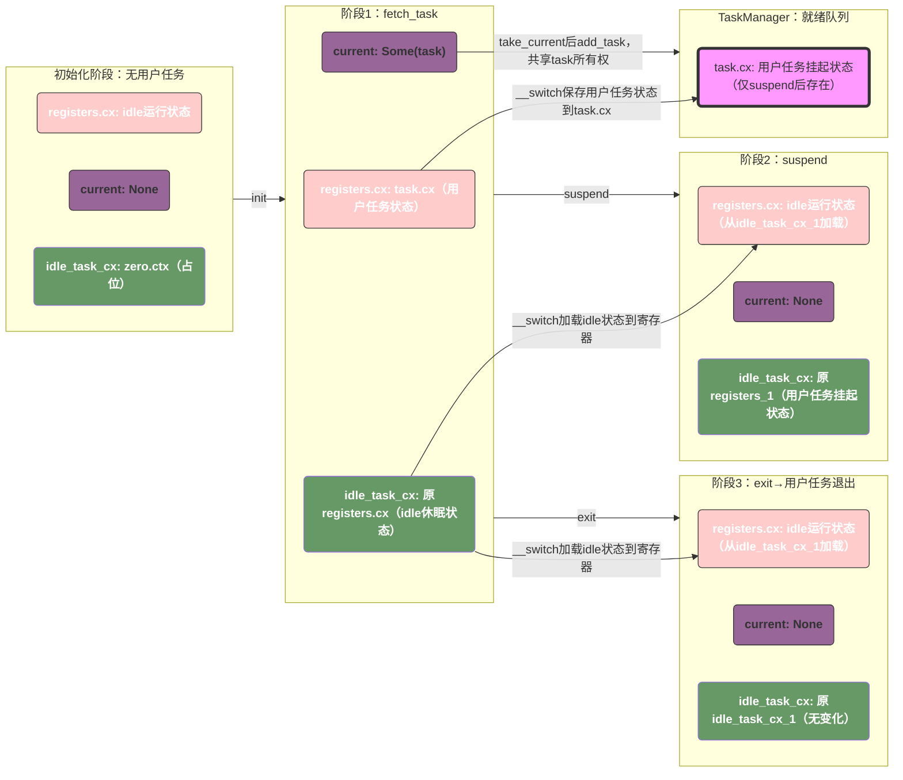
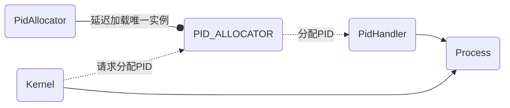
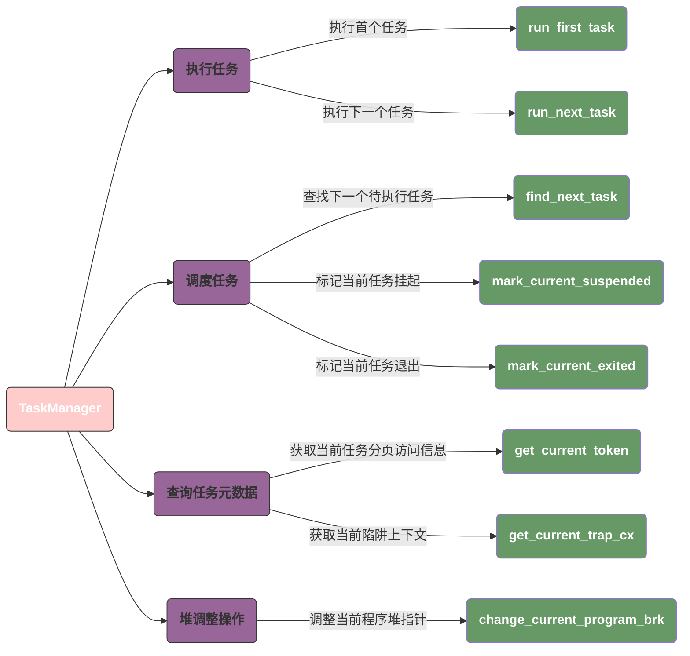
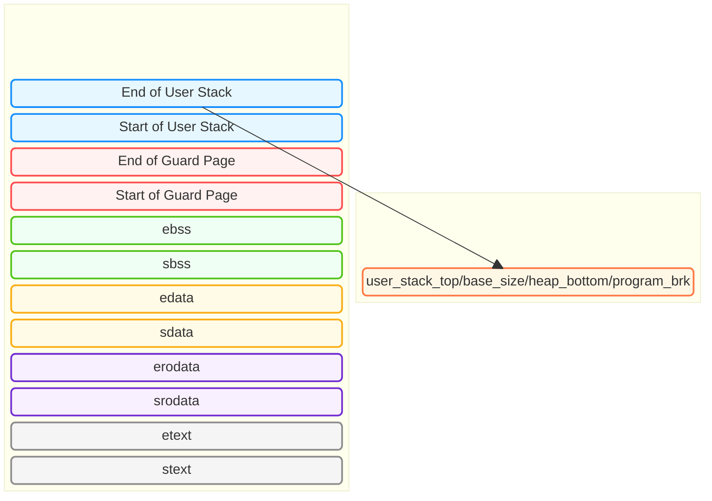
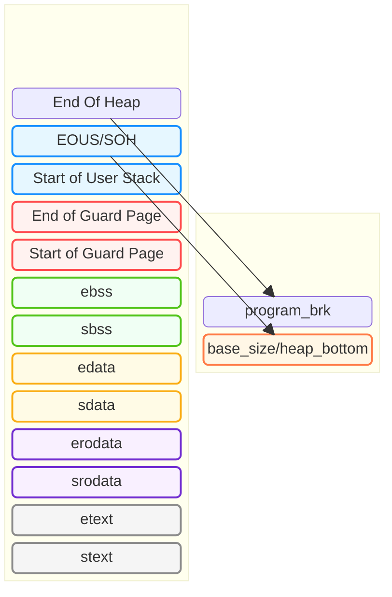
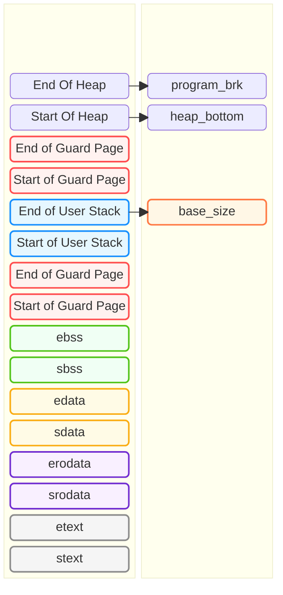

# uCore：进程及进程管理

>我们将开发一个用户 **终端** (Terminal) 或 **命令行** (Command Line Application, 俗称 **Shell** ) ， 形成用户与操作系统进行交互的命令行界面 (Command Line Interface)。
>
>为此，我们要对任务建立新的抽象： **进程** ，并实现若干基于 **进程** 的强大系统调用。

## `等待解决的问题`

> 系统调用

1. `fork` 和 `exec` 这几个系统调用的使用场景，以及我们程序的调度实现逻辑是怎么样的？
2. 在 `exec(path:&str)` 方法中，这个寻址路径是怎么寻址的？
3. 为什么 `shell` 的最后一位一定要是 `\0`？

> 进程标识符和内核栈

1. `KernelStack` 的作用是什么？他和 `ch4` 中有什么区别？
2. `KSTACK_ALLOCATOR` 的作用是什么？
3. 在 `ch4` 中，应用的标识符是 `app_id: usize`，但是这个值只是在构造 TCB 的时候计算了一下内核栈的虚拟地址；

```rust
/// Return (bottom, top) of a kernel stack in kernel space.
pub fn kernel_stack_position(app_id: usize) -> (usize, usize) {
    let top = TRAMPOLINE - app_id * (KERNEL_STACK_SIZE + PAGE_SIZE);
    let bottom = top - KERNEL_STACK_SIZE;
    (bottom, top)
}
```

4. 进程的内存结构图。
5. `TaskControlBlockInner` 在哪里会产生并发访问呢？
6. 画一个Process的状态转换图；
7. `exit_current_and_run_next` 很多用户态应用并没有显示的调用改指令，如何判断这个指令有被调用呢？从ELF文件里如何确认这个指令有被调用？
8. 为什么在 `TaskControlBlockInner` 中需要 `trap_cx_ppn` 和 `task_cx` 两个值？
9. `run_tasks()` 中在第一次调度时，PROCESSOR 中应该会取到一个空的 context 后 `swithc()` 如何避免这个switch再次切回到这个空的 context 呢？
10. `get_app_data_by_name` 是怎么查询并定位elf文件的？
11. 确认 [进程的内存模型](#进程的内存模型) 中的 `KERNEL_STACK`, `USER_STACK`, `KSTACK_ALLOCATOR` 分别是什么？
12. 为什么在 `fork()` 的时候，只需要单独复制trampoline？`memory_set.map_trampoline()`：这是因为我们解析 ELF 创建地址空间的时候，并没有将跳板页作为一个单独的逻辑段插入到地址空间的逻辑段向量 `areas` 中，所以这里需要单独映射上
13. `TaskControlBlockInner#parent` 为什么使用 `Weak<TaskControlBlock>`？构造的时候 `Some(Arc::downgrade(self))` 是什么意思？
14. 为什么 `TrapContext` 要放在用户地址空间的 `trampolin` 下？为什么 `trampoline` 在用户态和内核态都会在页表中映射同一个虚拟地址到同一个物理地址？
15. 重新简述一下 `trampoline` 和 `.text.trampoline` 和 `TrapContext` 之间的关系。
    1. `set_kernel_trap_entry`
    2. `set_user_trap_entry`
    3. .text.trampoline

````markdown
你的理解完全精准！这是 rCore 中 TrapContext（陷阱上下文）设计的核心巧思——既要让内核态和用户态都能访问，又要适配虚拟地址空间的布局规则，最终通过 `trap_cx_ppn`（物理页号）实现了安全且高效的访问。我们一步步拆解这个设计的底层逻辑和实现细节：

### 一、先明确：为什么 TrapContext 要放在“应用地址最高位（除 Trampoline）”？
rCore 的应用虚拟地址空间布局（以 RV64 为例）是分层的，核心规则：
```
0x0000_0000_0000_0000 ~ 0xFFFF_FFFF_7FFF_FFFF：用户态可访问的普通地址（代码/数据/堆/栈）
0xFFFF_FFFF_8000_0000 ~ 0xFFFF_FFFF_FFFF_FFFF：高地址区域（Trampoline + TrapContext）
  - Trampoline：固定在 0xFFFF_FFFF_FFFF_0000（一页，内核/用户态都可执行）
  - TrapContext：紧邻 Trampoline 下方（比如 0xFFFF_FFFF_FFFE_0000），是高地址的最高位可用区域
```
把 TrapContext 放在这个位置的核心原因：
1. **避免地址冲突**：用户态的普通代码/堆/栈不会用到这么高的虚拟地址，不会和用户数据重叠；
2. **跨特权级访问**：Trampoline 是内核和用户态共享的“跳板页”，TrapContext 紧邻它，在陷阱切换（用户→内核/内核→用户）时，CPU 能以极低的开销访问到上下文；
3. **地址固定**：所有进程的 TrapContext 虚拟地址都固定在这个高地址，内核无需为每个进程动态分配虚拟地址，简化逻辑。

### 二、为什么要在 TCB 中记录 `trap_cx_ppn`（物理页号）？
TrapContext 需要**内核态和用户态都能访问**，但内核态和用户态的页表是隔离的——直接用虚拟地址会有问题：
- 用户态页表：只映射用户地址空间（包括高地址的 TrapContext/Trampoline），但无法访问内核地址；
- 内核态页表：映射内核地址空间，默认不映射用户的 TrapContext 虚拟地址。

因此，TrapContext 的虚拟地址只在用户态页表中有效，内核态要访问时，必须通过**物理地址**（页号）来操作——这就是 `trap_cx_ppn` 的核心作用：
1. `trap_cx_ppn`：是 TrapContext 所在物理页的页号（`usize` 类型），存储在进程的 TCB 中，内核态可随时访问；
2. 内核态访问 TrapContext：通过 `trap_cx_ppn` 计算物理地址（`ppn << PAGE_SHIFT`），再映射到内核的临时虚拟地址，即可读写；
3. 用户态访问 TrapContext：直接用固定的高地址虚拟地址（如 0xFFFF_FFFF_FFFE_0000），用户态页表已映射到该物理页。

### 三、核心实现流程（帮你关联代码）
#### 1. 创建进程时：分配 TrapContext 物理页，记录 ppn
```rust
impl TaskControlBlock {
    pub fn new(elf_data: &[u8]) -> Self {
        // 1. 分配 TrapContext 物理页
        let trap_cx_page = FrameAllocator::alloc().unwrap();
        let trap_cx_ppn = trap_cx_page.ppn();
        // 2. 初始化 TrapContext（物理地址）
        let trap_cx = unsafe {
            &mut *(trap_cx_ppn << PAGE_SHIFT as *mut TrapContext)
        };
        *trap_cx = TrapContext::new(/* 初始化参数：用户入口、栈指针等 */);
        
        // 3. 构建用户页表：将 TrapContext 物理页映射到固定高地址
        let mut memory_set = MemorySet::new();
        memory_set.map(
            TrapContext::VADDR, // 固定高地址
            trap_cx_ppn,
            1,
            MapPermission::R | MapPermission::W, // 读写权限
        );
        // 4. TCB 中记录 trap_cx_ppn
        TaskControlBlock {
            trap_cx_ppn,
            memory_set,
            // ... 其他字段
        }
    }
}
```

#### 2. 陷阱处理时：跨特权级访问 TrapContext
- **用户态→内核态（陷阱触发）**：
  CPU 跳转到 Trampoline 页的汇编代码，直接通过固定高地址访问 TrapContext，保存用户态寄存器；
- **内核态→用户态（陷阱返回）**：
  内核先通过 TCB 的 `trap_cx_ppn` 修改 TrapContext（更新返回地址、栈指针等），再跳回 Trampoline，通过虚拟地址加载 TrapContext 到寄存器，切换回用户态。

#### 3. 内核态读写 TrapContext（比如修改返回值）
```rust
// 内核态修改 TrapContext 的 a0 寄存器（syscall 返回值）
pub fn set_syscall_ret(&self, ret: isize) {
    let trap_cx_ppn = self.trap_cx_ppn;
    // 物理地址 → 内核临时虚拟地址映射（简化版）
    let trap_cx = unsafe {
        &mut *(trap_cx_ppn << PAGE_SHIFT as *mut TrapContext)
    };
    trap_cx.x[10] = ret; // a0 寄存器对应 x[10]
}
```

### 四、设计优势总结
1. **地址固定**：所有进程的 TrapContext 虚拟地址统一，简化陷阱切换的汇编逻辑；
2. **跨特权级访问**：内核态用 `ppn` 访问物理页，用户态用固定虚拟地址，互不冲突；
3. **内存安全**：物理页由内核分配和管理，用户态只能访问自己的 TrapContext，无法越界；
4. **效率高**：无需动态分配虚拟地址，陷阱切换时地址访问是固定偏移，开销极低。

### 核心要点回顾
1. TrapContext 放在应用地址高地址（Trampoline 旁）：避免地址冲突，适配跨特权级跳转；
2. TCB 记录 `trap_cx_ppn`：内核态通过物理页号访问 TrapContext，突破页表隔离限制；
3. 核心逻辑：用户态用固定虚拟地址访问，内核态用物理页号访问，实现“一套上下文，跨特权级共享”。

简单说：`trap_cx_ppn` 是内核态“找到”用户态 TrapContext 的“物理地址凭证”，而固定高地址是用户态访问的“快捷方式”，两者结合让 TrapContext 成为跨特权级的“状态中转站”～
````





## 与进程有关的重要系统调用

### 重要系统调用

#### fork 系统调用

```rust
/// 功能：由当前进程 fork 出一个子进程。

/// 返回值：
/// - 对于子进程返回 0，对于当前进程则返回子进程的 PID 。

/// syscall ID：220
pub fn sys_fork() -> isize;
```

#### exec 系统调用

> 关于 `exec` 指令的详细说明，请参考 [exec](#exec)

```rust
/// 功能：将当前进程的地址空间清空并加载一个特定的可执行文件，返回用户态后开始它的执行。

/// 参数：
/// - 字符串 path 给出了要加载的可执行文件的名字；

/// 返回值：
/// - 如果出错的话（如找不到名字相符的可执行文件）则返回 -1，否则不应该返回。
/// - 注意：path 必须以 "\0" 结尾，否则内核将无法确定其长度

/// syscall ID：221
pub fn sys_exec(path: &str) -> isize;
```

利用 `fork` 和 `exec` 的组合，我们能让创建一个子进程，并令其执行特定的可执行文件。

#### waitpid 系统调用

```rust
/// 功能：当前进程等待一个子进程变为僵尸进程，回收其全部资源并收集其返回值。

/// 参数：
/// - pid 表示要等待的子进程的进程 ID，如果为 -1 的话表示等待任意一个子进程；
/// - exit_code 表示保存子进程返回值的地址，如果这个地址为 0 的话表示不必保存。

/// 返回值：
/// - 如果要等待的子进程不存在则返回 -1；否则如果要等待的子进程均未结束则返回 -2；
/// - 否则返回结束的子进程的进程 ID。

/// syscall ID：260
pub fn sys_waitpid(pid: isize, exit_code: *mut i32) -> isize;
```

`sys_waitpid` 在用户库中被封装成两个不同的 API， `wait(exit_code: &mut i32)` 和 `waitpid(pid: usize, exit_code: &mut i32)`， 前者用于等待任意一个子进程，后者用于等待特定子进程。它们实现的策略是如果子进程还未结束，就以 yield 让出时间片：

```rust
 // user/src/lib.rs
 
pub fn wait(exit_code: &mut i32) -> isize {
    loop {
        match sys_waitpid(-1, exit_code as *mut _) {
            -2 => { sys_yield(); }
            n => { return n; }
        }
    }
}
```

### 应用程序示例

`initproc` 和 `user_shell` 两个程序，他们分别是内核的初始进程以及初始进程启动的一个 `shell` 进程：

1. `initproc` 是 `pid == 0` 的进程，它负责处理内核中的 `zombie` 和 `orphan` 进程；
2. `user_shell` 从命令行读取命令，并启动一个子进程执行该命令。

#### 用户初始程序-initproc

在内核初始化完毕后创建的第一个进程，是 **用户初始进程** (Initial Process) ，它将通过 `fork+exec` 创建 `user_shell` 子进程，并将被用于回收僵尸进程。

下面的程序有几个指的注意的点：

1. `pid == -1` 表示 **要等待的子进程不存在**（符合 rCore 定义）：比如 `fork()` 后父进程先执行，子进程还未完成创建（此时父进程无有效子进程），或后续无任何子进程时，`wait` 会返回 `-1`；
2. `wait()` 的阻塞性由 OS 实现决定：代码中父进程在 `pid == -1` 时主动调用 `yield_()`，说明 rCore 的 `sys_waitpid` 是 **非阻塞式** 的（无符合条件的僵尸进程时立即返回 `-1` 或 `-2`，不挂起父进程），这与 Linux 默认阻塞的 `waitpid` 形成差异；
3. 代码中，显示的处理了 `pid == -1` 以及隐式的处理了 `pid > 0` 的所有情况，但是未处理 `pid == -2` 的情况：
   1. 对于 `pid == -1` 的子进程，此时子进程尚未创建成功，无需任何处理，我们直接continue继续循环；
   2. 对于 `pid > 0`（子进程终止，成功回收僵尸进程）：会执行 `println!` 打印回收日志，之后继续循环；
   3. 未显式处理 `pid == -2`（子进程存在但均未结束）：会跳过 `pid == -1` 分支，直接重新进入循环调用 `wait`（因无 `yield_()`，会高频空转）；

```rust
#![no_std]
#![no_main]

#[macro_use]
extern crate user_lib;

use user_lib::{exec, fork, wait, yield_};

#[no_mangle]
fn main() -> i32 {
    /// fork() 创建一个进程
    if fork() == 0 {
        /// 返回值为0，说明是子进程，我们在进程里启动shell程序
        exec("ch5b_user_shell\0", &[0 as *const u8]);
    } else {
        loop {
            /// 0 指定不保存子进程返回值的地址
            let mut exit_code: i32 = 0;
            let pid = wait(&mut exit_code);
            /// pid == -1 表示返回的进程不存在，因为在fork()之后，父进程的可能先执行
            /// 此时子进程的创建尚未完成。
            if pid == -1 {
                yield_();
                continue;
            }
            
            /// 这里我们只处理了-1（进程未创建），而没有处理-2（进程尚未结束）
            println!(
                "[initproc] Released a zombie process, pid={}, exit_code={}",
                pid, exit_code,
            );
        }
    }
    0
}
```

#### shell程序-user_shell

user_shell 需要捕获用户输入并进行解析处理，为此添加一个能获取用户输入的系统调用：

```rust
/// 功能：从文件中读取一段内容到缓冲区。

/// 参数：fd 是待读取文件的文件描述符，切片 buffer 则给出缓冲区。

/// 返回值：如果出现了错误则返回 -1，否则返回实际读到的字节数。

/// syscall ID：63
pub fn sys_read(fd: usize, buffer: &mut [u8]) -> isize;
```

实际调用时，我们必须要同时向内核提供缓冲区的起始地址及长度：

```rust
// user/src/syscall.rs

pub fn sys_read(fd: usize, buffer: &mut [u8]) -> isize {
    syscall(SYSCALL_READ, [fd, buffer.as_mut_ptr() as usize, buffer.len()])
}
```

下面是在 `initproc` 中启动的一个 `shell` 程序，**该程序从命令行输入指令并创建子进程，在子进程中执行输入的指令**。

```rust
#![no_std]
#![no_main]

extern crate alloc;

#[macro_use]
extern crate user_lib;

const LF: u8 = 0x0au8;          /// Line Feed
const CR: u8 = 0x0du8;          /// Carriage Return
const DL: u8 = 0x7fu8;          /// Delete
const BS: u8 = 0x08u8;          /// Backspace

use alloc::string::String;
use user_lib::console::getchar;
use user_lib::{exec, flush, fork, waitpid};

#[no_mangle]
pub fn main() -> i32 {
    println!("Rust user shell");
    let mut line: String = String::new();
    print!(">> ");
    flush();
    loop {
        let c = getchar();
        match c {
            // 如果读到一个换行符，我们就执行当前行的命令
            LF | CR => {
                print!("\n");
                if !line.is_empty() {
                    if line.eq("exit") {
                        break 1;
                    };
                    // 前面提到的， exec 需要一个以 '\0' 结尾的字符串
                    line.push('\0');
                    let pid = fork();
                    if pid == 0 {
                        /// 子进程逻辑
                        if exec(line.as_str(), &[0 as *const u8]) == -1 {
                            println!("Error when executing!");
                            return -4;
                        }
                        unreachable!();
                    } else {
                        // 父进程逻辑等待子进程结束
                        let mut exit_code: i32 = 0;
                        let exit_pid = waitpid(pid as usize, &mut exit_code);
                        assert_eq!(pid, exit_pid);
                        println!("Shell: Process {} exited with code {}", pid, exit_code);
                    }
                    line.clear();
                }
                print!(">> ");
                flush();
            }
            // 如果读到一个退格符或删除符
            BS | DL => {
                if !line.is_empty() {
                    print!("{}", BS as char);
                    print!(" ");
                    print!("{}", BS as char);
                    flush();
                    line.pop();
                }
            }
            _ => {
                print!("{}", c as char);
                flush();
                line.push(c as char);
            }
        }
    }
}

```

## 进程管理的核心数据结构

- 基于应用名的应用链接/加载器
- 进程标识符 `PidHandle` 以及内核栈 `KernelStack`
- 任务控制块 `TaskControlBlock`
- 任务管理器 `TaskManager`
- 处理器管理结构 `Processor`

### 基于应用名的应用链接/加载器

**基于应用名的应用链接/加载器** 和之前的加载器并无本质区别：

- 除了老的加载器中生成的指针 `_num_app` 用来解析**app数量和函数地址**之外；

- 新的加载器会额外的生成一个指针 `_app_names`，用来解析线上全部的应用名 。
- 两个指针的区别在于：
  - `_num_app` 会用来解析 `_num_app + 2` 个元素，`_app_names` 会用来解析 `_num_app` 个元素；
  - `_num_app` 指向的第一个元素为app数量，后面的 `[ptr + 1, ptr + _num_app + 1]` 总共 `_num_app + 1` 个元素表示的是函数地址；
  - `_app_names` 指向的 `[0, _num_app - 1]` 个元素都是应用名； 

最终生成的文件格式如下：唯一需要注意的是 `.string "ch2b_bad_address"` 会自动的在 `.string` 后面增加 `\0` 作为结尾，**但是这个和 exec 的参数必须以 '\0' 没有关系，可以参考 [exec](#exec)**

```nasm
    .global _num_app
_num_app:
    .quad 19
    .quad app_0_start
	# 省略17个元素
    .quad app_18_start
    .quad app_18_end

    .global _app_names
_app_names:
    .string "ch2b_bad_address"
	# 省略17个元素
    .string "ch5b_usertest"

    .section .data
    .global app_0_start
    .global app_0_end
    .align 3
app_0_start:
    .incbin "../user/build/elf/ch2b_bad_address.elf"
app_0_end:
```

### 进程标识符和内核栈

#### 进程标识符

涉及进程有关的struct和对象有三个：

1. `PidHandle` 表示进程时生成的唯一标识符；
2. `PidAllocator` 用于管理 `pid` -- 负责为新创建的进程分配 `pid`，在进程退出时回收 `pid`；
3. `PID_ALLOCATOR` 全局的唯一 `PidAllocator` 实例；



#### 内核栈


### 进程控制块

#### PCB

```rust
pub struct TaskControlBlock {
    pub pid: PidHandle,
    pub kernel_stack: KernelStack,
    inner: UPSafeCell<TaskControlBlockInner>,
}

pub struct TaskControlBlockInner {
    pub trap_cx_ppn: PhysPageNum,
    pub base_size: usize,
    pub task_cx: TaskContext,
    pub task_status: TaskStatus,
    pub memory_set: MemorySet,
    pub heap_bottom: usize,
    pub program_brk: usize,

    pub parent: Option<Weak<TaskControlBlock>>,
    pub children: Vec<Arc<TaskControlBlock>>,
    pub exit_code: i32,
}
```

#### TCB

```rust
pub struct TaskControlBlock {
    pub trap_cx_ppn: PhysPageNum,
    pub base_size: usize,
    pub task_cx: TaskContext,
    pub task_status: TaskStatus,
    pub memory_set: MemorySet,
    pub heap_bottom: usize,
    pub program_brk: usize,
}
```

#### 实现

> 对比一下 `PCB` （虽然名字还是 TaskControlBlock） 和 `TCB` 的实现，我们可以总结以下几点：
>
> 1. 新的 `PCB` 新增了四个
> 2. `base_size`, `heap_bottom`, `program_brk` 的解析请参考 [应用进程内存模型](#应用进程内存模型)

### 任务管理器

#### 老版本

在老版本的 `TaskManager` 中，它需要负责的功能很杂：

1. 执行任务；
2. 调度任务；
3. 查询任务元数据；
4. 代理当前任务的堆调整操作；



```rust
pub struct TaskManager {
    num_app: usize,
    inner: UPSafeCell<TaskManagerInner>,
}

struct TaskManagerInner {
    tasks: Vec<TaskControlBlock>,
    current_task: usize,
}

impl TaskManager {
    fn run_first_task(&self) -> ! {}
    fn run_next_task(&self) {}
    
    fn find_next_task(&self) -> Option<usize> {}
    fn mark_current_suspended(&self) {}
    fn mark_current_exited(&self) {}
    
    fn get_current_token(&self) -> usize {}
    fn get_current_trap_cx(&self) -> &'static mut TrapContext {}

    pub fn change_current_program_brk(&self, size: i32) -> Option<usize> {}
}
```

#### 新版本

在新的版本中，我们将它拆分为了 `TaskManager` 和 `Processor` 两个独立的结构：

- `TaskManager` 负责管理所有 `TaskStatus::Ready` 的结构，只包含了两个方法：
  - `add` 添加一个 `TaskStatus::Ready` 的 Task；
  - `fetch` 使用先进先出的顺序，获取一个可执行的 Task；
- `Processor` 只负责 `Task` 的执行：
  - 内部包含两个变量：
    - `current` 包含了当前执行的Task的 `TCB`，这里值得注意的是，`TCB` 对象被包在 `Arc` 中，可能为None；
    - `idle_task_cx` 用于中转逻辑；
  - 内部提供了三个方法：
    - `get_idle_task_cx_ptr` 返回内部持有的 TaskContext
    - `take_current` move `TCB`，在 `suspend` 和 `exit` 这两个会放弃执行时间片的情况下才调用；
    - `current` 共享 `TCB`，用于查询 `TCB` 信息时的调用。


> 整体可以总结为：
>
> 1. 当由内核态（idle）切换到用户态时，利用 `idle_task_cx` 保存内核上下文，从 `task.task_cx` 加载用户上下文；
> 2. 当由用户态切换回内核态（idle）时，根据是否需要继续执行，决定是否将 `task_cx` 保存到 `PCB`；
>    1. `suspend` 要复用上下文 → 存到 `PCB`；
>    2. `exit` 不复用 → 存到临时变量丢弃。

假设存在以下状态：

- `kernel_cx`：内核态上下文（如 `idle_task` 运行时的上下文，包含合法的 `ra`/`sp`，不是 `zero_init`）；
- `zero_init`：仅用于 “临时占位” 的全零值，仅在初始化或任务退出时出现，不会被 CPU 执行；
- `task.cx`：用户任务的合法上下文（已初始化，可被 CPU 执行）。

整个的执行流程可以如下描述：

1. **初始化 `Processor`**：

   - `current = None`（无用户任务）；
   - `idle_task_cx = zero_init`（占位用，无实际执行意义）；
   - `registers = kernel_cx`（CPU 运行 `idle_task`，寄存器是 `idle` 的合法内核态上下文）；

2. **`fetch_task`（首次调度用户任务）**：

   - `current = Some(task)`（绑定当前用户任务）；
   - `idle_task_cx = kernel_cx`（通过 `__switch` 保存之前 `idle_task` 的内核态上下文，覆盖初始的 `zero_init`）；
   - `registers = task.cx`（通过 `__switch` 加载用户任务上下文，CPU 开始执行用户任务）；

3. **分叉场景**：

   3.1 **`suspend`（挂起当前任务）**：

   - `current = None`（`take_current_task` 移动 `task` 所有权）；
   - `idle_task_cx = task.cx`（通过 `__switch` 保存用户任务的运行状态）；
   - `registers = kernel_cx`（通过 `__switch` 加载 `idle_task` 的内核态上下文，CPU 切回 `idle`）；
   - 额外：`TaskManager` 中添加 `task`（`task.cx` 保留用户任务状态，后续可恢复）；

   3.2 **`exit`（当前任务退出）**：

   - `current = None`（`take_current_task` 移动 `task` 所有权，后续 `drop(task)` 释放 TCB）；
   - `idle_task_cx = kernel_cx`（保持不变，仍为 `idle_task` 的内核态上下文）；
   - `registers = kernel_cx`（通过 `__switch` 加载 `idle_task` 的内核态上下文，CPU 切回 `idle`）；
   - 额外：用 `zero_init` 临时变量接收退出任务的状态（会被丢弃，不影响 `idle_task_cx` 和寄存器）；

```rust
pub struct TaskManager {
    ready_queue: VecDeque<Arc<TaskControlBlock>>,
}

impl TaskManager {
    pub fn new() -> Self {}
    pub fn add(&mut self, task: Arc<TaskControlBlock>) {}
    pub fn fetch(&mut self) -> Option<Arc<TaskControlBlock>> {}
}
pub struct Processor {
    current: Option<Arc<TaskControlBlock>>,
    idle_task_cx: TaskContext,
}

impl Processor {
    pub fn new() -> Self {}
    fn get_idle_task_cx_ptr(&mut self) -> *mut TaskContext {}
    pub fn take_current(&mut self) -> Option<Arc<TaskControlBlock>> {}
    pub fn current(&self) -> Option<Arc<TaskControlBlock>> {}
}
```

## 进程管理机制的设计实现

### 初始进程的创建

> 关于 `elf` 解析可以参考 [elf解析](#elf解析)

> 与老版本一致的逻辑

1. 解析 `elf` 并初始化内存模型：`.data`, `.rodata`, `trampoline`, `trap_context` 等；
2. 初始化必要信息，例如 `trap_cx_ppn`，内核栈等；
3. 为用户态 `TrapContext` 赋值；

> 与老版本不一致的逻辑

1. 需要为每个task生成一个唯一的 pid；
2. 使用 `kstack_alloc()` 代替了 `KERNEL_SPACE`；具体的逻辑请参考 [进程的内存模型](#进程的内存模型)；

```rust
impl TaskControlBlock {
    /// Create a new process
    ///
    /// At present, it is only used for the creation of initproc
    pub fn new(elf_data: &[u8]) -> Self {
        // memory_set with elf program headers/trampoline/trap context/user stack
        let (memory_set, user_sp, entry_point) = MemorySet::from_elf(elf_data);
        let trap_cx_ppn = memory_set
            .translate(VirtAddr::from(TRAP_CONTEXT_BASE).into())
            .unwrap()
            .ppn();
        // alloc a pid and a kernel stack in kernel space
        let pid_handle = pid_alloc();
        let kernel_stack = kstack_alloc();
        let kernel_stack_top = kernel_stack.get_top();
        // push a task context which goes to trap_return to the top of kernel stack
        let task_control_block = Self {
            pid: pid_handle,
            kernel_stack,
            inner: unsafe {
                UPSafeCell::new(TaskControlBlockInner {
                    trap_cx_ppn,
                    base_size: user_sp,
                    task_cx: TaskContext::goto_trap_return(kernel_stack_top),
                    task_status: TaskStatus::Ready,
                    memory_set,
                    parent: None,
                    children: Vec::new(),
                    exit_code: 0,
                    heap_bottom: user_sp,
                    program_brk: user_sp,
                })
            },
        };
        // prepare TrapContext in user space
        let trap_cx = task_control_block.inner_exclusive_access().get_trap_cx();
        *trap_cx = TrapContext::app_init_context(
            entry_point,
            user_sp,
            KERNEL_SPACE.exclusive_access().token(),
            kernel_stack_top,
            trap_handler as usize,
        );
        task_control_block
    }
}
```

### 进程调度机制

进程的调度主要通过 `suspend_current_and_run_next` 来实现，该函数在执行时通常会包含如下三个重要状态：

1. `registers` 是当前执行的 task 的 `cx`；
2. `TaskControlBlock#task_cx` 它的当前状态不重要，因为我们要用他来存储目前 `registers` 的状态，这样在下次调度的时候可以加载到当前状态；
3. `Processor#idle_task_cx` 保存了上次从 `内核态` 切换到 `用户态` 的时候的 `registers`；

当我们执行 `__switch(TaskControlBlock#task_cx, Processor#idle_task_cx)`，实际是将当前状态存储到 `TCB`，并且恢复到内核态。

具体的内部状态流转可以参考 [任务管理器](#任务管理器) 的说明。

### 进程的生成机制

#### fork 系统调用的实现

`fork` 系统调用的实现存在两个需要注意的地方：

1. 修改用户进程的信息：为子进程生成一个接近一模一样的内存空间和布局（包括堆和栈）。需注意：这里未实现 COW（写时复制），所有 MapArea 都重新分配了物理内存；实现逻辑不复杂，直接将原进程的地址空间 MemorySet 复制到新进程即可。其中有两个特殊的 MapArea 需要单独处理：
   1. `trampoline`：全局共享的物理页，属于 “特殊映射”（固定虚拟地址、仅可执行权限、全进程共享物理页），不会被包含在普通 MapArea 的遍历复制中，因此无法通过 for 循环完成 VA→PA 映射，需额外调用 `map_trampoline`（无需重新分配物理页，仅复用全局共享页完成映射）；
   2. `trap_ctx`：完整复制父进程的 `trap_ctx` 内容，仅需修改 `kernel_sp` 字段（指向子进程新分配的内核栈顶，这个是内核态才会用到的），其余字段保持不变。
2. **修改PCB信息**：
   1. 重新分配了 `pid`；
   2. 重新分配了 `kernel_stack`，这里是基于我们新实现的 `KSTACK_ALLOCATOR` 分配的；
   3. 因为重新分配了 `kernel_stack`，所以 `kernel_stack_top` 也改变了；
   4. 初始化 `task_cx`，**这里非常重要，因为当该进程初始化完毕被调度的时候，会直接将 `task_cx` 作为第一次的上下文；所以它的 `ra = trap_return`，`sp = kernel_stack_top`* *
      - `ra = trap_return`：表示子进程首次执行时，会先跳转到 `trap_return` 函数（完成内核态→用户态的切换）；
      - `sp = kernel_stack_top`：表示子进程的内核栈指针指向新分配的内核栈顶，这也体现了我们的栈从上往下扩展的特性；
   5. **隐式的修改 `sepc`，父进程在执行完 `fork()` 之后CPU 会自动将 sepc 设置为 ecall 下一条指令的地址（在riscv中是 sepc = sepc + 4），而我们完整的复制了全部的 `trap_cx`，也就是相当于隐式的修改了 `sepc`，这样才保证子进程在第一次被调度的时候不会陷入死循环**。
   6. 修改父进程和子进程的其他关联信息；


##### MemorySet#from_existed_user

```rust
impl MemorySet {
    pub fn from_existed_user(user_space: &Self) -> Self {
        let mut memory_set = Self::new_bare();
        // map trampoline
        memory_set.map_trampoline();
        // copy data sections/trap_context/user_stack
        for area in user_space.areas.iter() {
            let new_area = MapArea::from_another(area);
            memory_set.push(new_area, None);
            // copy data from another space
            for vpn in area.vpn_range {
                let src_ppn = user_space.translate(vpn).unwrap().ppn();
                let dst_ppn = memory_set.translate(vpn).unwrap().ppn();
                dst_ppn
                    .get_bytes_array()
                    .copy_from_slice(src_ppn.get_bytes_array());
            }
        }
        memory_set
    }
}
```

##### MapArea#from_another

```rust
impl MapArea {
    pub fn from_another(another: &Self) -> Self {
        Self {
            vpn_range: VPNRange::new(another.vpn_range.get_start(), another.vpn_range.get_end()),
            data_frames: BTreeMap::new(),
            map_type: another.map_type,
            map_perm: another.map_perm,
        }
    }
}
```

##### sys_fork的实现

随后，我们还有一点需要注意的是：`sys_fork` 进程会存在两个返回值：

1. 对于父进程会返回子进程的 `pid`；
2. 对于子进程会返回 `0`。

这里我们的实现逻辑是：

1. 对于父进程，我们直接返回 `pid`；
2. 对于子进程，我们修改它的 `trap_cx` 中的 `x10`，也就是 `trap_cx.x[10]`；

```rust
pub fn sys_fork() -> isize {
    trace!("kernel:pid[{}] sys_fork", current_task().unwrap().pid.0);
    let current_task = current_task().unwrap();
    let new_task = current_task.fork();
    let new_pid = new_task.pid.0;
    // modify trap context of new_task, because it returns immediately after switching
    let trap_cx = new_task.inner_exclusive_access().get_trap_cx();
    // we do not have to move to next instruction since we have done it before
    // for child process, fork returns 0
    trap_cx.x[10] = 0;
    // add new task to scheduler
    add_task(new_task);
    new_pid as isize
}
```


## QA

### memory_set中的trampoline和trap_cx

### elf解析

1. 解析 ELF；
2. 映射虚拟内存高256GiB；
   1. map tramploine；
   2. map TrapContext；
3. 映射虚拟内存低256GiB；
   1. map elf（包括 .text/.rodata/.data/.bss），这里值得注意的是，我们在映射的过程需要将elf中的数据复制到映射的目标虚拟内存；
   2. map user stack；
   3. map program break；
4. 返回用户地址集，`user_stack_top`，以及入口地址；`user_stack_top` 的作用很多，可以参考 [应用进程内存模型](#应用进程内存模型) 的解析。

```rust
impl MemorySet {
    /// Include sections in elf and trampoline and TrapContext and user stack,
    /// also returns user_sp_base and entry point.
    pub fn from_elf(elf_data: &[u8]) -> (Self, usize, usize) {
        let mut memory_set = Self::new_bare();
        // map program headers of elf, with U flag
        let elf = xmas_elf::ElfFile::new(elf_data).unwrap();

        Self::map_higher_addr(&mut memory_set);
        let user_stack_top = Self::map_lower_addr(&mut memory_set, &elf);

        (
            memory_set,
            user_stack_top,
            elf.header.pt2.entry_point() as usize,
        )
    }
}
```

### 进程的内存模型

1. `KernelStack`
2. `KERNEL_SPACE`
3. `UserStack` 在老版本的代码下，的确存在一个 `UserStack`，但是在实现虚拟内存 之后，UserStack 已经被抽象为一段 MapArea，同时记录了 `user_stack_top` 作为 `sp`。

### 应用进程内存模型

#### base_size

> `base_size` **直接存储 “`user_stack` 高地址边界” 的地址常量**，这也是 `base_size` 这个名字的来源，他指向 `user_stack` 的高地址边界，因为栈是从高地址向低地址增长的。

在操作系统中，`user_stack` 是用户态程序的虚拟地址的一个指针，指向了用户栈。

用户的虚拟地址中，一般按照 .text -> .rodata -> .data -> .bss -> guard page -> user_stack 的顺序**从低到高递增**。 

假设  `user_stack`  的地址范围是 `[user_stack_bottom, user_stack_bottom + USER_STACK_SIZE)`，这里  user_stack_bottom + USER_STACK_SIZE 是用户进程的 `base_size`，那么用户程序的所有数据都只能出现在 base_size 之下。

- `user_stack_bottom`：栈的 **低地址边界**（栈的起始地址）；
- `user_stack_bottom + USER_STACK_SIZE`：栈的 **高地址边界**（也就是 `base_size`）；
- 栈的增长方向：**从高地址向低地址增长**（栈顶指针 `sp` 初始指向 `base_size`，每次压栈 `sp--`，出栈 `sp++`）。


#### heap_bottom

`heap_bottom` 是用户堆（`heap`）的 **低地址边界**（堆从低地址向高地址增长，这个地址是堆的 “起始起点”）；初始值和 `base_size` 完全相同。

#### program_brk

`program_brk`  是堆的**当前高地址**（`brk` 系统调用可修改，用于扩展 / 收缩堆）；

#### 总结

>刚初始化时，`base_size`/`heap_bottom`/`program_brk` 都指向 **End of User Stack**



> 第一次分配堆，我们需要增加 `program_brk`，为我们的堆分配空间，此时 `program_brk` 和其他两个参数分离了，这里 `EOUS` 代表 `End of User Stack`，`SOH` 代表 `Start Of Heap`



> 既然 `base_size` 和 `heap_bottom` 一直是一样的，为什么我们不直接合并这两个参数呢？因为我们可能在后续的扩展中会分离这两个变量。例如，我们可能希望在 `Heap` 和 `Stack` 之间插入一个 `Guard Page`。




### 内核堆

> 关于内核堆的分配可以参考之前的解析：[堆的初始化](https://0x822a5b87.github.io/2025/11/21/uCore%EF%BC%9A%E4%B8%80%E4%B8%AA%E5%9F%BA%E4%BA%8ERust%E7%9A%84%E7%AE%80%E5%8D%95%E6%93%8D%E4%BD%9C%E7%B3%BB%E7%BB%9F%E5%AE%9E%E7%8E%B0%EF%BC%884%EF%BC%89/#%E5%A0%86%E7%9A%84%E5%88%9D%E5%A7%8B%E5%8C%96)

### exec

`exec` 指令的调用如下：

```rust
exec("ch5b_user_shell\0", &[0 as *const u8]);
```

输入必须以 `'\0'` 结尾，这是因为 `exec` 函数的参数是 `&str`，**Rust 的 `&str` 类型本身不会在字符串末尾自动添加 `\0`（null 终止符）**：

```rust
pub fn exec(path: &str, args: &[*const u8]) -> isize {
    sys_exec(path, args)
}

pub fn sys_exec(path: &str, args: &[*const u8]) -> isize {
    syscall(
        SYSCALL_EXEC,
        [path.as_ptr() as usize, args.as_ptr() as usize, 0],
    )
}
```

而 `sys_exec` 中，将 `path.as_ptr()` 转换为一个字符串指针并以该指针作为参数传递给kernel，内核收到数据后，如果没有 `'\0'` 是无法正确结束循环的。

```rust
/// Translate&Copy a ptr[u8] array end with `\0` to a `String` Vec through page table
pub fn translated_str(token: usize, ptr: *const u8) -> String {
    let page_table = PageTable::from_token(token);
    let mut string = String::new();
    let mut va = ptr as usize;
    loop {
        let ch: u8 = *(page_table
            .translate_va(VirtAddr::from(va))
            .unwrap()
            .get_mut());
        // 读到 '\0' 退出
        if ch == 0 {
            break;
        } else {
            string.push(ch as char);
            va += 1;
        }
    }
    string
}
```

### 进程的资源回收

> 本描述仅针对于 `linux` 

需要先了解的一点是，`linux` 下的 `waitpid` 和 `rCore` 下的资源回收存在区别：

```c
#include <sys/types.h>
#include <sys/wait.h>

pid_t wait(int *status);

pid_t waitpid(pid_t pid, int *status, int options);

int waitid(idtype_t idtype, id_t id, siginfo_t *infop, int options);
```

> The **wait**() system call `suspends` execution of the calling process until one of its children terminates. The call *wait(&status)* is equivalent to:
>
> ```c
> waitpid(-1, &status, 0);
> ```
>
> The **waitpid**() system call suspends execution of the calling process until a child specified by *pid* argument has changed state. By default, **waitpid**() waits only for terminated children, but this behavior is modifiable via the *options* argument, as described below.
>
> - The value of *pid* can be:
>   - `< -1` meaning wait for any child process whose process group ID is equal to the absolute value of *pid*.
>   - `-1` meaning wait for any child process.
>   - `0` meaning wait for any child process whose process group ID is equal to that of the calling process.
>   - `> 0` meaning wait for the child whose process ID is equal to the value of *pid*.

主要区别有两点：

1. `linux` 下的 waitpid 是阻塞式的；
2. 它的返回值除了可能是 `pid` 或者其他状态之外，还有可能是 `pid_group`。

在 `os` 中，父进程在创建子进程时，内核会为子进程分配一些运行必要的信息 - `pid`，`TCB`（进程控制块）等，父进程必须通过 `wait` 来查询子进程状态，这是因为 “父进程是否需要子进程的这些信息（如退出码、终止原因）” 这个条件内核是不知道的。对于内核来讲，它需要负责把子进程的状态变化消息交给父进程。

这个过程可能出现几种不同的情况：

1. 父进程正常调用 `wait`/`waitpid`，拿到退出子进程的状态信息（如退出码），此时内核会彻底回收子进程的 `pid`、`TCB`（仅保留的关键字段）等资源，子进程正常退出；
2. 在子进程退出前，父进程未调用 `wait` 就提前退出（因为异常或代码 BUG），此时子进程的状态变为 `Orphan（孤儿进程）`，内核维护的 `initproc` 进程（PID=1）会负责收养这些孤儿进程，待其终止后回收相关资源 —— 因为父进程已退出，内核明确知道子进程的状态信息无需再交给父进程，可由 init 进程统一回收；
3. 在子进程退出后，父进程未调用 `wait`，此时子进程的状态变为 `Zombie（僵尸进程）`。内核仅保留 `TCB` 中的关键字段（如 PID、退出码），不会回收这些信息 —— 因为内核无法判断父进程是 “代码中未调用 `wait`” 还是 “已调用但未执行到 `wait` 指令”，只能一直保留，直到父进程调用 `wait`（主动回收）或父进程退出（子进程变孤儿，由 init 回收）。

### 代码统计

```reStructuredText
➜  2025a-rcore-0x822a5b87 git:(ch5) ✗ cloc os
     264 text files.
     137 unique files.
     435 files ignored.

github.com/AlDanial/cloc v 2.06  T=0.06 s (2231.6 files/s, 70042.7 lines/s)
-------------------------------------------------------------------------------
Language                     files          blank        comment           code
-------------------------------------------------------------------------------
Rust                            32            232            493           2335
D                               39            108              0            598
Assembly                         4             24             26            265
make                             1             20              7             59
JSON                            58              0              0             58
Linker Script                    1              7              0             46
TOML                             2              3              1             18
-------------------------------------------------------------------------------
SUM:                           137            394            527           3379
-------------------------------------------------------------------------------
```

### 代码树

本章中主要新增的几个模块为：

1. `fs.rs` 新增了 `sys_read`；
2. `process.rs` 新增了 `sys_getpid`/`fork`/`exec`/`waitpid`；
3. `manager.rs` 新增任务管理器；
4. `pid.rs` 新增标志符和内核栈的rust抽象；
5. `processor.rs` 新增处理器管理结构 `Processor`

```
├── os
   ├── build.rs(修改：基于应用名的应用构建器)
   ├── ...
   └── src
       ├── ...
       ├── loader.rs(修改：基于应用名的应用加载器)
       ├── main.rs(修改)
       ├── mm(修改：为了支持本章的系统调用对此模块做若干增强)
       │   ├── address.rs
       │   ├── frame_allocator.rs
       │   ├── heap_allocator.rs
       │   ├── memory_set.rs
       │   ├── mod.rs
       │   └── page_table.rs
       ├── syscall
       │   ├── fs.rs(修改：新增 sys_read)
       │   ├── mod.rs(修改：新的系统调用的分发处理)
       │   └── process.rs（修改：新增 sys_getpid/fork/exec/waitpid）
       ├── task
       │   ├── context.rs
       │   ├── manager.rs(新增：任务管理器，为上一章任务管理器功能的一部分)
       │   ├── mod.rs(修改：调整原来的接口实现以支持进程)
       │   ├── pid.rs(新增：进程标识符和内核栈的 Rust 抽象)
       │   ├── processor.rs(新增：处理器管理结构 ``Processor`` ，为上一章任务管理器功能的一部分)
       │   ├── switch.rs
       │   ├── switch.S
       │   └── task.rs(修改：支持进程机制的任务控制块)
       └── trap
           ├── context.rs
           ├── mod.rs(修改：对于系统调用的实现进行修改以支持进程系统调用)
           └── trap.S
```


