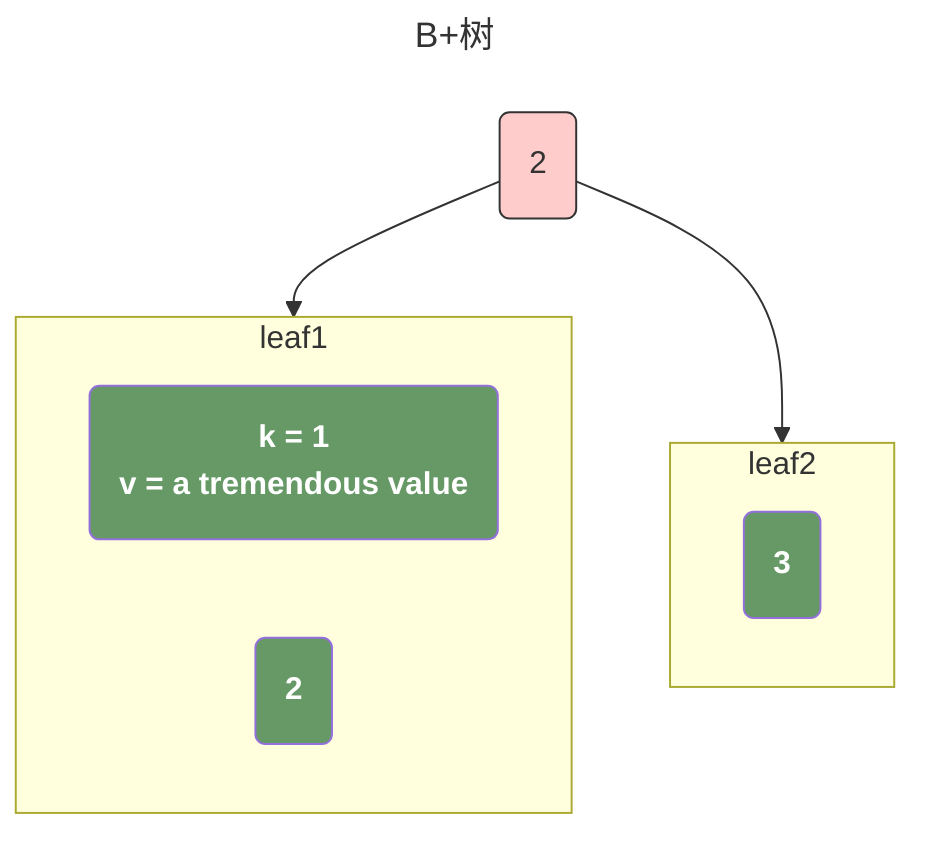
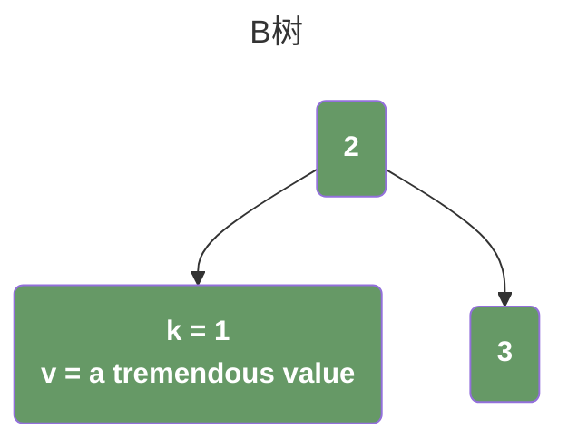

## 前言

> 在最近实现一个 [简单的kv数据库](https://github.com/0x822a5b87/elephant/tree/main/nosql) 中又重新思考了一些问题。

当我第一次尝试了解数据库底层原理的时候，就从各个角度了解到了选择**B+树**而不是**B树**的很多理由，基本上无非是以下这些因素：

- B+树支持范围查询。B+树非叶子节点不存储数据，并且成熟的B+树实现的叶子节点都会通过指针连接起来构成一个单独的链表；所以当我们进行范围查询的时候，只需要找到起始叶子节点之后遍历链表找到对应的结尾叶子节点即可。但是B树的非叶子节点也可以存储数据，所以无法实现；
- 更适合磁盘存储：B+树的内部节点只存储键值的索引，而叶子节点存储实际的数据。这种设计使得每个节点的大小更小，可以容纳更多的键值对，减少了磁盘I/O的次数。另外，由于叶子节点之间通过链表连接，可以更好地利用磁盘预读取的特性，提高查询性能。
- 更适合索引：数据库通常需要支持快速的索引查找，而B+树的结构更适合作为索引结构。B+树的内部节点只存储键值的索引，可以更好地利用内存空间，提高索引的效率。
- 查询效率更稳定：B树的查询时间复杂度在1到树高之间，因为数据可能存储在根节点、内部节点或叶子节点，查询效率会因数据所在位置不同而波动。B+树的所有数据都存储在叶子节点，查询复杂度则稳定为树高，查询效率更加稳定。

当时觉得很有道理，然而随着水平和眼界的提升，却发现这里存在相当多的地方值得商榷：

### B+树支持范围查询

这个粗看合理，细想却是完全错误的。**因为B+树的范围查找，并不是B+树本身的性质，而是基于对B+树的一些优化 -- 使用指针将叶子节点串起来从而实现范围查找的功能。**

那既然B+树可以做，B树也可以这么做，我们完全可以在 insert, delete 的过程中，将B树的所有data节点也维护一份同样的链表，这并不是不可实现的。

### 更适合磁盘存储

数据的结构并不会影响我们的实际存储，因为我们在 `serialize` 和 `deserialize` 的过程中，利用我们上面提到的链表，完全可以实现一模一样的数据存储逻辑；

### 更适合索引

这点没有疑问，B树肯定会占用更多的内存；

### 查询效率更稳定

很显然这个是错误的结论。B树很有可能存在一个情况，在我们查询到叶子节点之前就提前返回，效率应该是比B+树更高的才对。没有人会拒绝更快的查询。

## 个人眼中一些较大的差别

### 节点是否存储数据

> B树的节点存储数据，而B+树不存储数据，这里带来的一个最直接的影响就是，在构建树作为索引的过程中，如何选择 `split`，`merge`, `rotate` 的时机。

众所周知，任何平衡树在 `insert`, `delete` 的过程中，都无法避免需要对节点进行 `split`, `merge`, `rotate` 以动态的保持树的平衡性。

对于B+树而言，他的非叶子节点完全不存储数据，也就是他的非叶子节点的大小是可预测的。我们可以很简单的使用叶子节点的数量作为依据。

而对于B树就不一样了，他的非叶子节点由于存储了数据，直接导致每个节点的大小都不可预测。

而我们所有的数据，在存储到硬盘的时候，都必然是按 `block` 存储的，这也意味着我们必须考虑每个 block 存储的数据大小。

假设我们存在一个的B+树和一个B树，他们分别是这样的：

