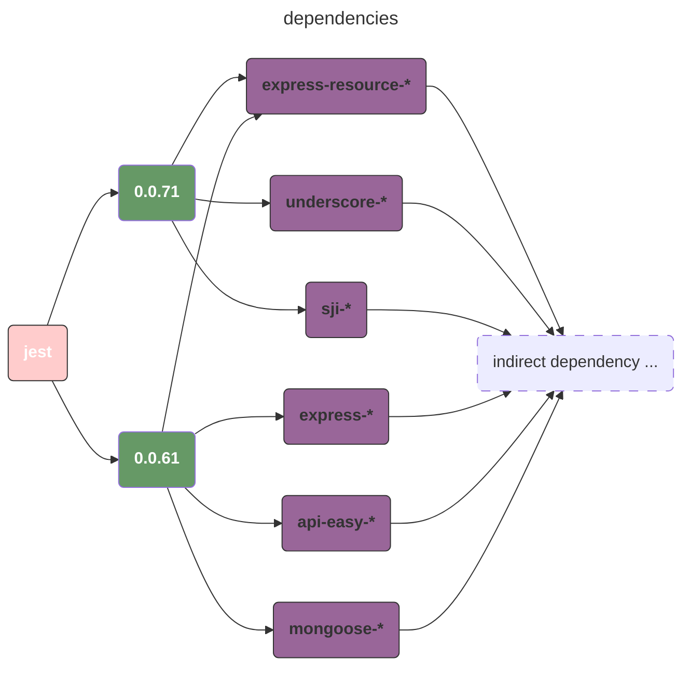
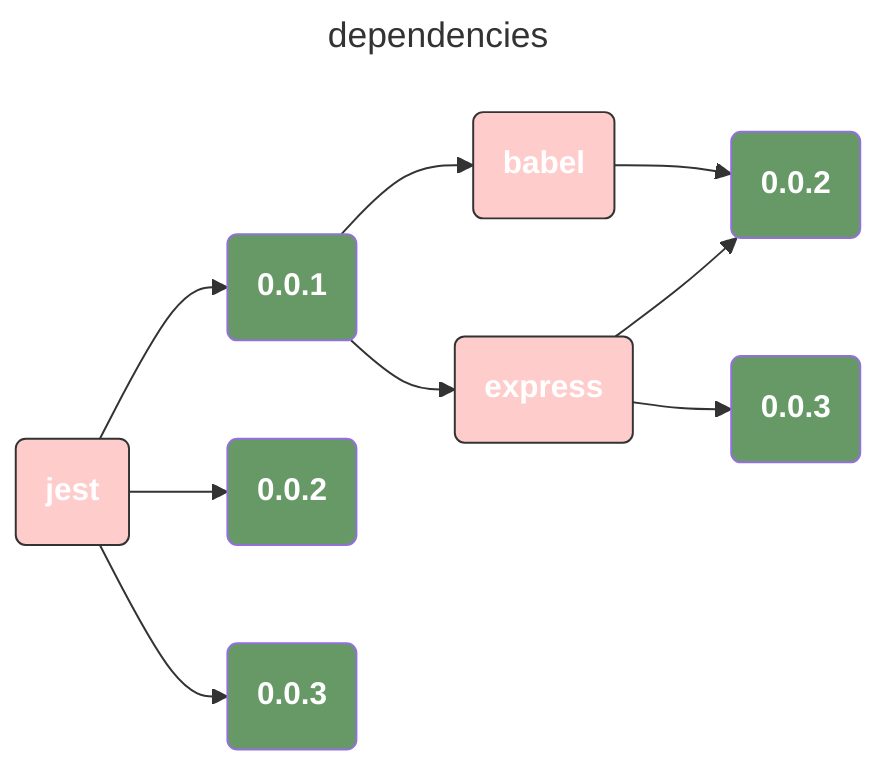
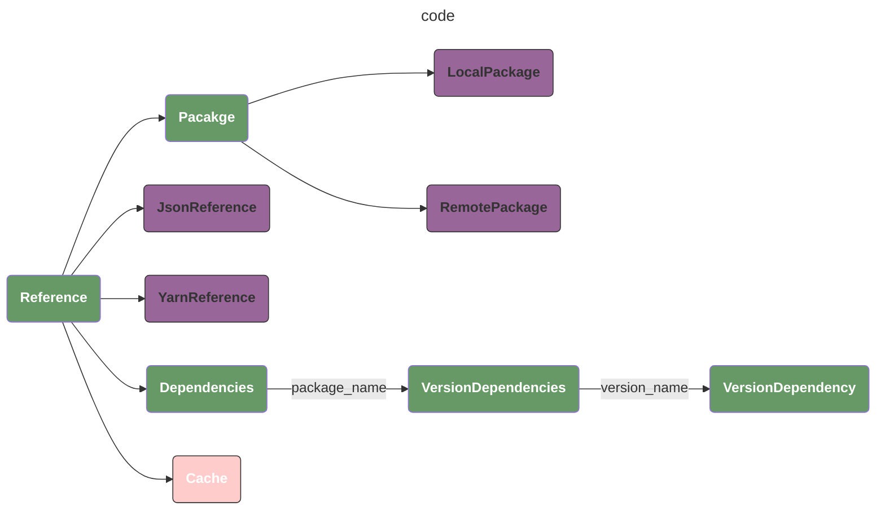

## 综述

本文是在学习python的过程中的一个简单的练手小项目，用于熟悉python内部的一些机制，全部的代码位于 [tiny package manager](https://github.com/0x822a5b87/tiny-package-manager)。

整体的逻辑是，当我们在编译一个 yarn 项目的过程中，我们会存在一个 `package.json` 文件，在文件中我们会声明项目的所有依赖。我们通过该依赖文件来进行一个包依赖分析，判断是否项目是否存在版本冲突，如果可以编译，则给出选择对应的版本。

例如：



## 涉及模块

- [uv](https://github.com/astral-sh/uv)
- [Classes](https://docs.python.org/3/tutorial/classes.html)
- [Inheritance](https://docs.python.org/3/tutorial/classes.html#inheritance)
- [http](https://docs.python.org/3/library/http.html)
- [File and Directory Access](https://docs.python.org/3/library/filesys.html)
- [python-semanticversion](https://python-semanticversion.readthedocs.io/en/latest/)
- [json — JSON encoder and decoder](https://docs.python.org/3/library/json.html)

## 参考文档

- [A Package Manager](https://third-bit.com/sdxpy/pack/)
- [Let's Dev: A Package Manager](https://classic.yarnpkg.com/blog/2017/07/11/lets-dev-a-package-manager/)
- [lets-dev-demo](https://github.com/yarnpkg/lets-dev-demo)

## 逻辑描述

在依赖分析的过程中，我们复杂度是指数级的，所以完全没有办法进行暴力破解。假设：

- **M 个直接依赖**（每个依赖的版本约束为 `C_i`）
- 每个依赖有 N 个候选版本（实际可能不同，但简化为 N）

**最低复杂度 = 验证所有可能的版本组合**

每个直接依赖需选择 1 个版本，总组合数为 **N^M**（每个依赖有 N 种选择，M 个依赖的组合数为 N 的 M 次方）。

因此，**理论最低复杂度为 O (N^M)**（指数级），而非 O (M×N)。

现代依赖解析算法通过以下优化降低复杂度：

1. 版本约束预筛选
2. 依赖图剪枝
3. 缓存与增量解析

### 版本约束预筛选

- **核心**：在遍历候选版本前，先排除不满足直接约束的版本。
- **示例**：若依赖 A 的约束为 `^1.0.0`，而可用版本为 `[0.9.0, 1.0.0, 1.1.0, 2.0.0]`，则直接排除 `0.9.0` 和 `2.0.0`，候选数从 N 降为 K（K ≤ N）。
- **复杂度**：优化为 O (K^M)，但仍为指数级。

### 依赖图剪枝

- **核心**：若某个依赖的版本选择导致后续冲突，立即回溯，避免遍历其所有子依赖。
- **示例**：若选择 A@1.0.0 后发现其依赖的 B@2.0.0 与其他约束冲突，则不再尝试 A@1.0.0 的子依赖组合。
- **复杂度**：平均情况下接近 O (M×K)（假设每个依赖的有效候选版本为 K），但最坏情况仍为 O (K^M)。

### 缓存与增量解析

- **核心**：缓存已验证的依赖组合，避免重复计算。
- **示例**：若已验证 A@1.0.0 + B@2.0.0 有效，则下次遇到相同组合时直接复用结果。
- **复杂度**：理想情况下可降至 O (M)（假设所有依赖已缓存），但实际受缓存命中率影响。

## 复杂度对比

| 场景                      | 复杂度       | 说明                                                         |
| ------------------------- | ------------ | ------------------------------------------------------------ |
| **无优化的暴力枚举**      | O(N^M)       | 遍历所有可能的版本组合，指数级复杂度，不可行。               |
| **版本约束预筛选 + 剪枝** | O(K^M)       | K 为每个依赖的有效候选版本数（K ≤ N），仍为指数级，但实际 K 可能很小。 |
| **缓存 + 增量解析**       | 接近 O (M)   | 理想情况下，但依赖高度重复时才能达到。                       |
| **npm/yarn 实际复杂度**   | 平均 O (M×K) | 通过扁平化、锁文件等优化，接近线性复杂度，但最坏情况仍可能退化。 |

## 如何实现？

### 逻辑描述

需要实现包管理算法，流程如下：

1. 有一个初始的配置文件，声明了依赖的包和版本；
2. 在第一份配置文件中，扫描所有的依赖；
3. 随后拉取扫描到的所有依赖的依赖并继续检查；
4. 直到所有的依赖都判定成功

实现的逻辑如下：

假设我们存在三个直接依赖，分别是 

direct_1, direct_2, direct_3

这三个包都有自己的依赖。

首选我们选择 direct_1 的某个版本，此时，我们可以知道 direct_1 所有的包约束条件；

我们维护以下数据结构：

1. 依赖的版本到包约束条件的映射关系，例如：direct_1的0.0.1的版本，只能使用 indirect_1 的 >1.0.0 的版本；
2. 已经选择的包；
3. 等待选择的包；

我们的逻辑就是，不断的更新已经选择的包和等待选择的包，当等待选择的包为空时我们的依赖解析结束；或者当我们在解析中发现不兼容的包时，解析失败。

整体的执行逻辑如下：

1. 将三个直接依赖添加到等待选择的包中；
2. 选择第一个包的最大版本，并执行以下操作：
	1. 将这个包添加到已经选择的包
	2. 将这个包移除出等待选择的包；
	3. 将这个包的依赖，也就是间接依赖添加到等到选择的包的末尾；
3. 递归的去选择后面的包：
	1. 判断这个包是否符合前面的约束条件，如果不满足约束直接选择该包的下一个版本；
	2. 如果当前包的所有版本全部尝试过了，没有找到满足条件的包，再次回退到前一个包，选择前一个包的下一个版本；
	3. 如果回退到所有的包都尝试过并且没有找到符合条件的包，则解析失败；
	4. 如果等待选择的包为空，则此时已经选择的包就是我们找到的解析结果。

### 伪代码

```python
def find(manifest: dict, remaining: list, accumulator: list, current: list, count: int) -> int:
    """
    :param manifest: Tells us what’s compatible with what.
    :param remaining: The names of the packages we haven’t considered yet.
    :param accumulator: An accumulator to hold all the valid combinations we’ve found so far.
    :param current: The partially-completed combination we’re going to extend next.
    :param count: A count of the number of combinations we’ve considered so far, which we will use as a measure of efficiency.
    :return:
    """
    count += 1
    if not remaining:
        # Finding that the remaining elements are empty lists means we have found a solution.
        # Add the solution to the result collection.
        accumulator.append(current)
    else:
        # The core of the algorithm is division, in other words, the result can be separated into two different types.
        # For example : the result of [A, B, C] can be separated into the combination of the result of [A] and the result of [B, C]
        # We recurse these procedures until there are no remaining elements, at which point we have found the final answer.
        head, tail = remaining[0], remaining[1:]
        for version in manifest[head]:
            candidate = current + [(head, version)]
            if compatible(manifest, candidate):
                count = find(manifest, tail, accumulator, candidate, count)
    return count
```

### 数据结构

在我们的实际执行过程中，当我们选中某一个特定的包时，我们必须知道选择的包的依赖，**而这个依赖就是我们引入的`间接依赖`**。当间接依赖和我们已经选择的依赖冲突时，我们是无法正常编译的！所以，我们必须存在一个如下的依赖查询文件，格式如下：

```json
{
  "jest": {
    "0.0.3": {"express": ["0.0.3", "0.0.2"], "babel": ["0.0.2"]},
    "0.0.2": {"express": ["0.0.2"],      "babel": ["0.0.2", "0.0.1"]},
    "0.0.1": {"express": ["0.0.1"]}
  },
  "express": {
    "0.0.3": {"babel": ["0.0.2"]},
    "0.0.2": {"babel": ["0.0.1"]},
    "0.0.1": {"babel": ["0.0.1"]}
  },
  "babel": {
    "0.0.2": [],
    "0.0.1": []
  }
}
```

而整体的数据结构描述如下：从这个图我们可以查询到：`jest` 的 `0.0.1` 版本依赖于：

- `babel` 的 `[(0.0.2), (0.0.3)]`
- `express` 的 `[(0.0.2)]`



## 实际代码




