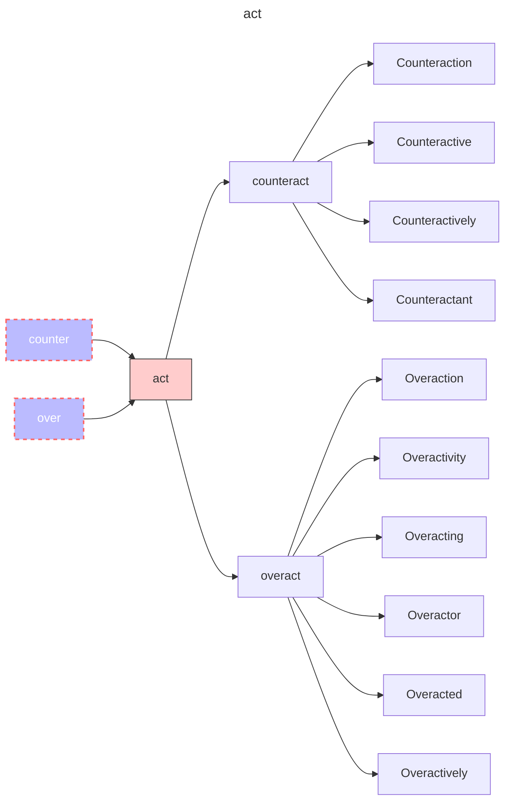

## act

| root    | meaning                       |
| ------- | ----------------------------- |
| act     | 做；执行                      |
| counter | 反对；相反；                  |
| over    | 超过；在...之上；过度；过多； |

