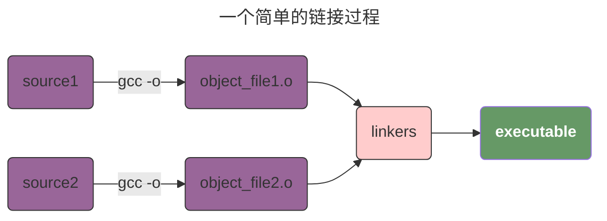
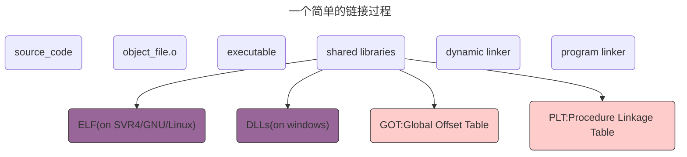
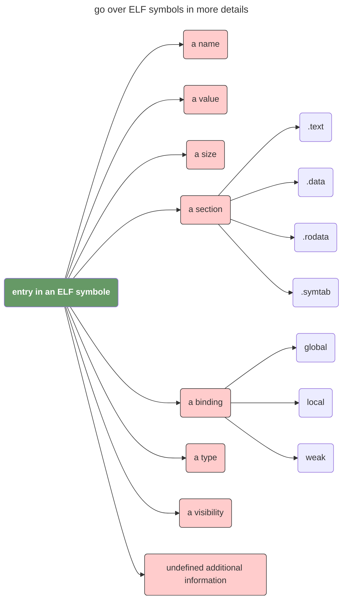

> 早上逛 [reddit rust](https://www.reddit.com/r/rust/) 时偶然看到了 [Ian Lance Taylor](https://www.airs.com/blog) 介绍 [linkers](https://a3f.at/lists/linkers) 的系列文章，觉得很有意思，决定开一个新坑来看看能不能自己实现一个简单的 linkers，目前找了一些资料，看起来工作量并不小。这里先做个简单的记录，参考的文章和书籍：
>
> - [linkers by Ian Lance Taylor](https://a3f.at/lists/linkers)
> - [byo-linker](https://github.com/andrewhalle/byo-linker)
> - [Linkers and Loaders](https://www.amazon.com/Linkers-Kaufmann-Software-Engineering-Programming/dp/1558604960/ref=sr_1_1?crid=24DJPGT6TCPSU&dib=eyJ2IjoiMSJ9.blypyivja49kN_oMLeGvLUYdmuxfh0xHvWmmz6FjaF-covkmqayhb5XmNBBIwDAbisFkJaB2k580X2V6D8nWuopCyzyijCWFM05AuAiNzMgaERzu_oxeZ8xEEIpl8vXed5zSGn5h8GXGtkBQX7THg0RltzVDWOPkMugTdtoG-9F-9i_407kB3K0tgLCeSnNq2B6MimVn2yD1KmgLnL-XlE5JnCQcS8qh1C0h6KY4hWA.uWjN7FnLv144NGBHfuKQYTUYvP0gr-bw8yJMFd3qvO4&dib_tag=se&keywords=linkers+and&qid=1736912625&sprefix=linkers+and+l%2Caps%2C430&sr=8-1)
>
> 可能会涉及到的基础知识包括：
>
> - [**SPARC** (**Scalable Processor ARChitecture**)](https://en.wikipedia.org/wiki/SPARC)
> - [x86 instruction listings](https://en.wikipedia.org/wiki/X86_instruction_listings)
> - [Executable file](https://en.wikipedia.org/wiki/Executable): `ELF`, `PE`, `OMF`
> - [Symbol table](https://en.wikipedia.org/wiki/Symbol_table)
> - [shared libraries](https://en.wikipedia.org/wiki/Shared_library)
> - [Static library](https://en.wikipedia.org/wiki/Static_library)
> - [dynamic linker](https://en.wikipedia.org/wiki/Dynamic_linker)
> - 其他待总结

## 第一印象

### 一个最简单的链接过程



### 链接过程可能涉及到的产物



### ELF

> 1. `section` 表示的二进制文件中的代码段；
> 2. `weak` 类型的绑定可以允许被覆盖，可以理解为给了某个symbol一个默认值 -- 在没有找到其他的同名symbol的情况下，使用weak绑定的symbol；
> 3. `visibility` 提供了对 symbol 在 shared library 外可访问性的控制 -- 例如，我们可能希望某个 symbol 在 shared library 内是 global 的，但是在外部是 local 的。



> 这里需要注意一下，C 可以支持通过如下的方式来提示编译器生成指定的代码。
>
> ```c
> #include <stdio.h>
> 
> void __attribute__((weak)) foo() {
>     printf("Default foo\n");
> }
> 
> int main() {
>     foo();
>     return 0;
> }
> ```
