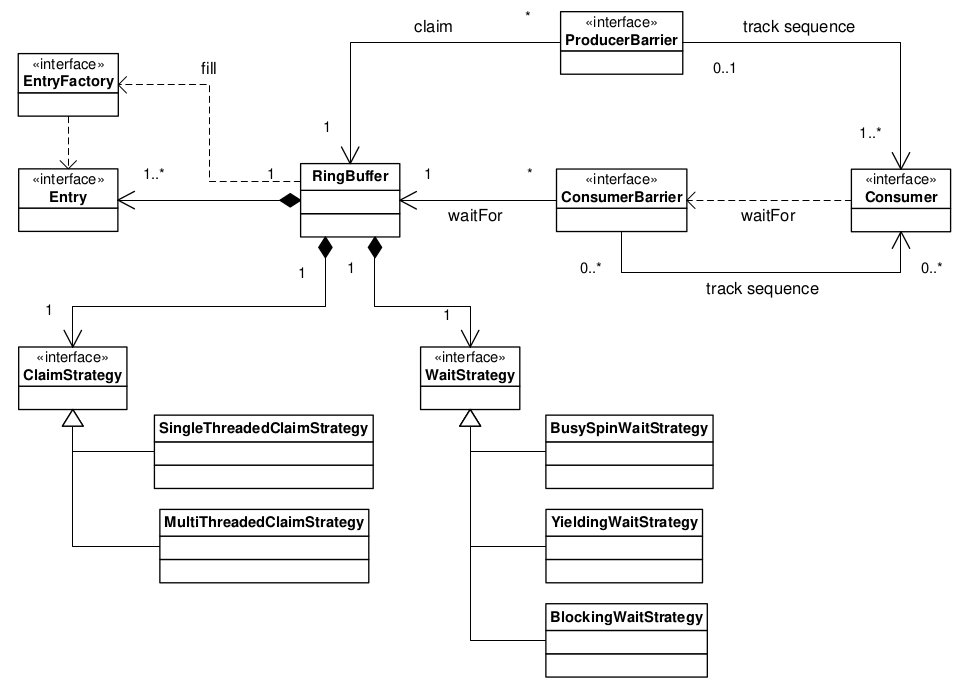

> [disrupotr](https://lmax-exchange.github.io/disruptor/) 是一个高性能的无锁并发框架，主要用于解决在高并发场景下数据发布和消费的问题。

## 引用

[[高性能队列——Disruptor](https://tech.meituan.com/2016/11/18/disruptor.html)](https://tech.meituan.com/2016/11/18/disruptor.html)

[LMAX Disruptor: High performance alternative to bounded queues for exchanging data between concurrent threads](https://lmax-exchange.github.io/disruptor/disruptor.html)
