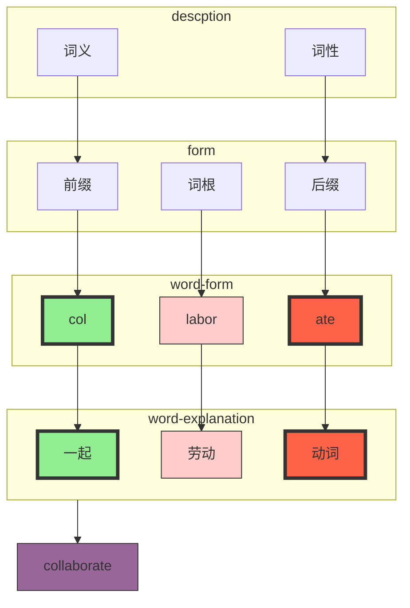

# 词根/词缀

>1. 前缀和词根共同决定单词的意思；
>2. 词性由后缀决定；

## 描述

## 前缀

<table class="tg" style="undefined;table-layout: fixed; width: 864px"><colgroup>
<col style="width: 141px">
<col style="width: 98px">
<col style="width: 151px">
<col style="width: 161px">
<col style="width: 216px">
<col style="width: 97px">
</colgroup>
<thead>
  <tr>
    <th class="tg-040u">前缀</th>
    <th class="tg-040u">含义</th>
    <th class="tg-040u">示例</th>
    <th class="tg-040u">词义</th>
    <th class="tg-sirz">词根解释</th>
    <th class="tg-sirz">词根</th>
  </tr></thead>
<tbody>
  <tr>
    <td class="tg-h0n0" rowspan="3">a/in/im</td>
    <td class="tg-nref" rowspan="3">无/不/非</td>
    <td class="tg-nref">apathy</td>
    <td class="tg-nref">冷漠</td>
    <td class="tg-nref">希腊语 "pathos"（感受、情感、痛苦）</td>
    <td class="tg-nref">pathy</td>
  </tr>
  <tr>
    <td class="tg-9wq8">impossible</td>
    <td class="tg-9wq8">不可能</td>
    <td class="tg-9wq8"></td>
    <td class="tg-9wq8"></td>
  </tr>
  <tr>
    <td class="tg-nref">inactive</td>
    <td class="tg-nref">不活动的</td>
    <td class="tg-nref"></td>
    <td class="tg-nref"></td>
  </tr>
  <tr>
    <td class="tg-oly2" rowspan="5">e/ex/ef</td>
    <td class="tg-9wq8" rowspan="5">出/外/向外</td>
    <td class="tg-9wq8">eject</td>
    <td class="tg-9wq8">喷射</td>
    <td class="tg-9wq8">投掷/扔</td>
    <td class="tg-9wq8">ject</td>
  </tr>
  <tr>
    <td class="tg-nref">exhale</td>
    <td class="tg-nref">呼气</td>
    <td class="tg-nref"></td>
    <td class="tg-nref"></td>
  </tr>
  <tr>
    <td class="tg-9wq8">excite</td>
    <td class="tg-9wq8">激发/使兴奋</td>
    <td class="tg-9wq8">"cite" 来自拉丁语中的 "citare"，意为 "引用"、"提及"</td>
    <td class="tg-9wq8">cite</td>
  </tr>
  <tr>
    <td class="tg-nref">effect</td>
    <td class="tg-nref">效果</td>
    <td class="tg-nref">"fect" 表示 "做"、"行动"</td>
    <td class="tg-nref"></td>
  </tr>
  <tr>
    <td class="tg-9wq8">efflux</td>
    <td class="tg-9wq8">流出</td>
    <td class="tg-9wq8">"flux" 表示 "流动"</td>
    <td class="tg-9wq8"></td>
  </tr>
  <tr>
    <td class="tg-5z8n" rowspan="3">in/im</td>
    <td class="tg-nref" rowspan="3">入</td>
    <td class="tg-nref">inject</td>
    <td class="tg-nref">注射</td>
    <td class="tg-nref"></td>
    <td class="tg-nref"></td>
  </tr>
  <tr>
    <td class="tg-9wq8">ingress</td>
    <td class="tg-9wq8">进入</td>
    <td class="tg-9wq8"></td>
    <td class="tg-9wq8"></td>
  </tr>
  <tr>
    <td class="tg-nref">import</td>
    <td class="tg-nref">进口</td>
    <td class="tg-nref"></td>
    <td class="tg-nref"></td>
  </tr>
  <tr>
    <td class="tg-oly2" rowspan="5">pro/pre</td>
    <td class="tg-9wq8" rowspan="2">动态-向前-pro</td>
    <td class="tg-9wq8">progress</td>
    <td class="tg-9wq8">进步</td>
    <td class="tg-9wq8">"gress" 来自拉丁语中的 "gradior"，意为 "走"、"前进"</td>
    <td class="tg-9wq8"></td>
  </tr>
  <tr>
    <td class="tg-nref">propel</td>
    <td class="tg-nref">促进</td>
    <td class="tg-nref">"pel" 来自拉丁语中的 "pellere"，意为 "推动"、"驱使"</td>
    <td class="tg-nref"></td>
  </tr>
  <tr>
    <td class="tg-9wq8" rowspan="3">静态-向前-pre</td>
    <td class="tg-9wq8">prepare</td>
    <td class="tg-9wq8">准备</td>
    <td class="tg-9wq8">"pare" 表示 "准备" 或 "整理"</td>
    <td class="tg-9wq8"></td>
  </tr>
  <tr>
    <td class="tg-nref">predict</td>
    <td class="tg-nref">预测</td>
    <td class="tg-nref">dict" 表示 "说" 或 "声明"</td>
    <td class="tg-nref"></td>
  </tr>
  <tr>
    <td class="tg-9wq8">Preeminence</td>
    <td class="tg-9wq8">卓越</td>
    <td class="tg-9wq8">词根 "eminent" 表示 "卓越" 或 "杰出"</td>
    <td class="tg-9wq8"></td>
  </tr>
  <tr>
    <td class="tg-h0n0" rowspan="2">re</td>
    <td class="tg-nref" rowspan="2">回/重新/再次</td>
    <td class="tg-nref">rebuild</td>
    <td class="tg-nref">重建</td>
    <td class="tg-nref"></td>
    <td class="tg-nref"></td>
  </tr>
  <tr>
    <td class="tg-9wq8">rejuvenate</td>
    <td class="tg-9wq8">恢复活力</td>
    <td class="tg-9wq8">"juven" 表示年轻, "ate" 表示动词</td>
    <td class="tg-9wq8"></td>
  </tr>
  <tr>
    <td class="tg-h0n0" rowspan="2">co</td>
    <td class="tg-nref" rowspan="10">共同/一起/共享</td>
    <td class="tg-nref">cooperate</td>
    <td class="tg-nref">合作</td>
    <td class="tg-nref"></td>
    <td class="tg-nref"></td>
  </tr>
  <tr>
    <td class="tg-9wq8">coalesce</td>
    <td class="tg-9wq8">合并</td>
    <td class="tg-9wq8">词根 "alesc" 表示 "增长" 或 "融合"</td>
    <td class="tg-9wq8"></td>
  </tr>
  <tr>
    <td class="tg-h0n0" rowspan="2">con</td>
    <td class="tg-nref">connect</td>
    <td class="tg-nref">连接</td>
    <td class="tg-nref">词根 "nect" 表示 "连接" 或 "结合"</td>
    <td class="tg-nref"></td>
  </tr>
  <tr>
    <td class="tg-9wq8">Conundrum</td>
    <td class="tg-9wq8">难题</td>
    <td class="tg-9wq8">"undrum" 源自拉丁语 "quandrum"，意为 "困惑" 或 "难题"</td>
    <td class="tg-9wq8"></td>
  </tr>
  <tr>
    <td class="tg-h0n0" rowspan="2">com</td>
    <td class="tg-nref">Community</td>
    <td class="tg-nref">社区</td>
    <td class="tg-nref">词根 "mun" 源自拉丁语 "munus"，意为 "职责" 或 "义务"或“保护”</td>
    <td class="tg-nref"></td>
  </tr>
  <tr>
    <td class="tg-9wq8">Commensurate</td>
    <td class="tg-9wq8">相称的</td>
    <td class="tg-9wq8">"mensur" 源自拉丁语 "mensura"，意为 "测量" 或 "度量"</td>
    <td class="tg-9wq8"></td>
  </tr>
  <tr>
    <td class="tg-h0n0" rowspan="2">col </td>
    <td class="tg-nref">Collect</td>
    <td class="tg-nref">收集</td>
    <td class="tg-nref">"lect" 表示 "选择" 或 "挑选"</td>
    <td class="tg-nref"></td>
  </tr>
  <tr>
    <td class="tg-9wq8">Collusion</td>
    <td class="tg-9wq8">勾结</td>
    <td class="tg-9wq8">"lus" 或 "lud" 表示 "玩耍" 或 "欺骗"</td>
    <td class="tg-9wq8"></td>
  </tr>
  <tr>
    <td class="tg-h0n0" rowspan="2">cor</td>
    <td class="tg-nref">Core</td>
    <td class="tg-nref">核心</td>
    <td class="tg-nref"></td>
    <td class="tg-nref"></td>
  </tr>
  <tr>
    <td class="tg-9wq8">Corroborate</td>
    <td class="tg-9wq8">共同加强，证实</td>
    <td class="tg-9wq8">词根 "robor" 表示 "力量" 或 "坚固"</td>
    <td class="tg-9wq8"></td>
  </tr>
  <tr>
    <td class="tg-h0n0" rowspan="2">di</td>
    <td class="tg-nref" rowspan="6">分散/散开</td>
    <td class="tg-nref">Divide</td>
    <td class="tg-nref">分割</td>
    <td class="tg-nref">"vid" 表示 "看" 或 "观察"</td>
    <td class="tg-nref"></td>
  </tr>
  <tr>
    <td class="tg-9wq8">Diffuse</td>
    <td class="tg-9wq8">扩散</td>
    <td class="tg-9wq8">"fus" 表示 "融化" 或 "流动"</td>
    <td class="tg-9wq8"></td>
  </tr>
  <tr>
    <td class="tg-h0n0" rowspan="2">dis</td>
    <td class="tg-nref">Dislike</td>
    <td class="tg-nref">不喜欢</td>
    <td class="tg-nref"></td>
    <td class="tg-nref"></td>
  </tr>
  <tr>
    <td class="tg-9wq8">Disseminate</td>
    <td class="tg-9wq8">传播</td>
    <td class="tg-9wq8">"semin" 表示 "种子" 或 "播种"</td>
    <td class="tg-9wq8"></td>
  </tr>
  <tr>
    <td class="tg-h0n0" rowspan="2">dif</td>
    <td class="tg-nref">Different</td>
    <td class="tg-nref">不同的</td>
    <td class="tg-nref"></td>
    <td class="tg-nref"></td>
  </tr>
  <tr>
    <td class="tg-9wq8">Differentiate</td>
    <td class="tg-9wq8">区分</td>
    <td class="tg-9wq8"></td>
    <td class="tg-9wq8"></td>
  </tr>
  <tr>
    <td class="tg-h0n0" rowspan="2">super</td>
    <td class="tg-nref" rowspan="6">在...之上/超过</td>
    <td class="tg-nref">Supermarket</td>
    <td class="tg-nref">超市</td>
    <td class="tg-nref"></td>
    <td class="tg-nref"></td>
  </tr>
  <tr>
    <td class="tg-9wq8">Superfluous</td>
    <td class="tg-9wq8">多余的</td>
    <td class="tg-9wq8">"flu" 或 "flux" 表示 "流动"</td>
    <td class="tg-9wq8"></td>
  </tr>
  <tr>
    <td class="tg-h0n0" rowspan="2">over</td>
    <td class="tg-nref">Overcome</td>
    <td class="tg-nref">克服</td>
    <td class="tg-nref"></td>
    <td class="tg-nref"></td>
  </tr>
  <tr>
    <td class="tg-9wq8">Overwhelm</td>
    <td class="tg-9wq8">压倒，表示被某种情感、感觉或压力淹没或压倒</td>
    <td class="tg-9wq8">"whelm" 表示 "淹没" 或 "压倒"</td>
    <td class="tg-9wq8"></td>
  </tr>
  <tr>
    <td class="tg-h0n0" rowspan="2">sur</td>
    <td class="tg-nref">Surpass</td>
    <td class="tg-nref">超越</td>
    <td class="tg-nref"></td>
    <td class="tg-nref"></td>
  </tr>
  <tr>
    <td class="tg-9wq8">Surreal</td>
    <td class="tg-9wq8">超现实的</td>
    <td class="tg-9wq8">"real" 表示 "现实"</td>
    <td class="tg-9wq8"></td>
  </tr>
  <tr>
    <td class="tg-h0n0" rowspan="2">under</td>
    <td class="tg-nref" rowspan="2">向下/较低/不足/不完全</td>
    <td class="tg-nref">Underestimate</td>
    <td class="tg-nref">低估</td>
    <td class="tg-nref">"estimate" 表示 "估计"</td>
    <td class="tg-nref"></td>
  </tr>
  <tr>
    <td class="tg-9wq8">Undermine</td>
    <td class="tg-9wq8">削弱</td>
    <td class="tg-9wq8">"mine" 表示 "矿井" 或 "挖掘"</td>
    <td class="tg-9wq8"></td>
  </tr>
  <tr>
    <td class="tg-h0n0" rowspan="2">de</td>
    <td class="tg-nref" rowspan="2">向下/分离/完全/彻底</td>
    <td class="tg-nref">Decide</td>
    <td class="tg-nref">决定</td>
    <td class="tg-nref">"cide" 源自拉丁语 "caedere"，意为 "切割" 或 "杀死"，但是在这里表示 "决定" 或 "解决"</td>
    <td class="tg-nref"></td>
  </tr>
  <tr>
    <td class="tg-9wq8">Defend</td>
    <td class="tg-9wq8">防御</td>
    <td class="tg-9wq8"></td>
    <td class="tg-9wq8"></td>
  </tr>
  <tr>
    <td class="tg-h0n0" rowspan="2">sub</td>
    <td class="tg-nref" rowspan="2">在...之下/次级的/附属的/辅助的</td>
    <td class="tg-nref">Submarine</td>
    <td class="tg-nref">潜水艇</td>
    <td class="tg-nref">"marine" 表示 "海洋"</td>
    <td class="tg-nref"></td>
  </tr>
  <tr>
    <td class="tg-9wq8">Subtle</td>
    <td class="tg-9wq8">微妙的</td>
    <td class="tg-9wq8">"tle" 源自拉丁语 "tulus"，意为 "细小" 或 "微妙"</td>
    <td class="tg-9wq8"></td>
  </tr>
  <tr>
    <td class="tg-h0n0" rowspan="2">trans</td>
    <td class="tg-nref" rowspan="2">转移/转变</td>
    <td class="tg-nref">Transport</td>
    <td class="tg-nref"></td>
    <td class="tg-nref">"port" 表示 "携带" 或 "运输"</td>
    <td class="tg-nref"></td>
  </tr>
  <tr>
    <td class="tg-9wq8">Transform</td>
    <td class="tg-9wq8"></td>
    <td class="tg-9wq8">"form" 表示 "形状" 或 "形式"</td>
    <td class="tg-9wq8"></td>
  </tr>
  <tr>
    <td class="tg-h0n0" rowspan="2">inter</td>
    <td class="tg-nref" rowspan="2">相互之间</td>
    <td class="tg-nref">Interact</td>
    <td class="tg-nref">互动</td>
    <td class="tg-nref">"act" 表示 "行动" 或 "表演"</td>
    <td class="tg-nref"></td>
  </tr>
  <tr>
    <td class="tg-9wq8">Intercontinental</td>
    <td class="tg-9wq8">洲际的</td>
    <td class="tg-9wq8"></td>
    <td class="tg-9wq8"></td>
  </tr>
  <tr>
    <td class="tg-h0n0">a+双写辅音字母</td>
    <td class="tg-nref">表示强调，无实际意义</td>
    <td class="tg-nref"></td>
    <td class="tg-nref"></td>
    <td class="tg-nref"></td>
    <td class="tg-nref"></td>
  </tr>
  <tr>
    <td class="tg-04y1" rowspan="2">un/in/im/dis/ab/il</td>
    <td class="tg-9wq8" rowspan="2">否定前缀</td>
    <td class="tg-9wq8">Unhappy</td>
    <td class="tg-9wq8"></td>
    <td class="tg-9wq8"></td>
    <td class="tg-9wq8"></td>
  </tr>
  <tr>
    <td class="tg-nref">Unprecedented</td>
    <td class="tg-nref">前所未有的</td>
    <td class="tg-nref"></td>
    <td class="tg-nref"></td>
  </tr>
  <tr>
    <td class="tg-04y1" rowspan="2">em</td>
    <td class="tg-9wq8" rowspan="2">进入/使进入/使产生</td>
    <td class="tg-9wq8">Embrace</td>
    <td class="tg-9wq8">拥抱/接受</td>
    <td class="tg-9wq8">"brace"，表示 "臂膀" 或 "抱"</td>
    <td class="tg-9wq8"></td>
  </tr>
  <tr>
    <td class="tg-nref">Empower</td>
    <td class="tg-nref">授权</td>
    <td class="tg-nref"></td>
    <td class="tg-nref"></td>
  </tr>
</tbody></table>

## 后缀

<table class="tg"><thead>
  <tr>
    <th class="tg-xyoc">词性</th>
    <th class="tg-r28n">后缀</th>
  </tr></thead>
<tbody>
  <tr>
    <td class="tg-hhkl" rowspan="3">动词</td>
    <td class="tg-pnt8">ize</td>
  </tr>
  <tr>
    <td class="tg-nrix">ify</td>
  </tr>
  <tr>
    <td class="tg-pnt8">ish</td>
  </tr>
  <tr>
    <td class="tg-dqta" rowspan="6">名词</td>
    <td class="tg-nrix">ion/tion/ation</td>
  </tr>
  <tr>
    <td class="tg-pnt8">ness</td>
  </tr>
  <tr>
    <td class="tg-nrix">ity/aity</td>
  </tr>
  <tr>
    <td class="tg-pnt8">ment</td>
  </tr>
  <tr>
    <td class="tg-nrix">ence/ance</td>
  </tr>
  <tr>
    <td class="tg-pnt8">ism</td>
  </tr>
  <tr>
    <td class="tg-dqta">形容词</td>
    <td class="tg-nrix">ent/ful/ous/al/ive/ible/able/ant</td>
  </tr>
</tbody>
</table>

## 词根
